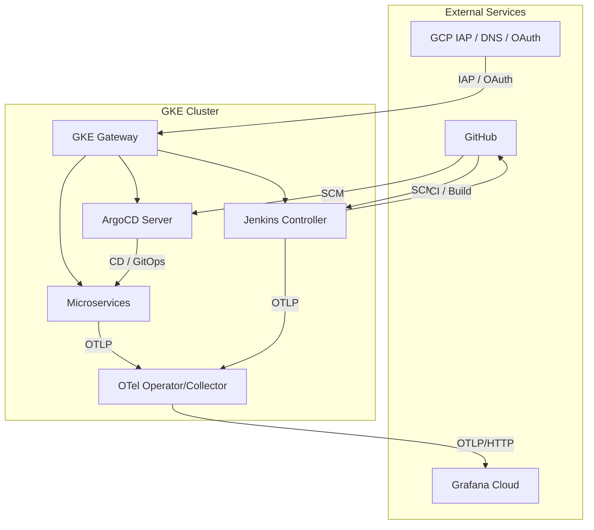

# Visual & Multimedia Repo Guide (via NotebookLM)

This repository's architecture and workflows have been analyzed by Google's NotebookLM to generate the following multimedia assets. They offer a comprehensive visual and auditory guide to the system's design and operation.

## Infographic: Modern Automation & Observability Architecture


## Multimedia Explanations

### 🎬 Video

*   **[Jenkins 2026 Proof of Concept (English)](./docs/notebooklm/Jenkins-2026_PoC.mp4)**: A video demonstration of the proof of concept.
*   **[Fábrica DevOps jenkins-2026 (Español)](./docs/notebooklm/es/Fabrica_DevOps_jenkins-2026_Spanish.mp4)**: Una demostración en video de la prueba de concepto.

### 📄 Document

*   **[Jenkins GitOps Reimagined (PDF)](./docs/notebooklm/Jenkins_GitOps_Reimagined.pdf)**: A detailed PDF document exploring the reimagined GitOps workflow.

### 🖼️ Image

*   **[Modern Automation and Observability Architecture (JPG)](./docs/notebooklm/Modern_Automation_and_Observability_Architecture.jpg)**: The full-size infographic image.

### 🎧 Audio

*   **[Twenty Cent Ephemeral GitOps in 2026 (English)](./docs/notebooklm/Twenty_cent_ephemeral_GitOps_in_2026.m4a)**: An audio recording discussing cost-effective ephemeral GitOps.
*   **[Infraestructura completa por veinte céntimos (Español)](./docs/notebooklm/es/Infraestructura_completa_por_veinte_céntimos_Spanish.m4a)**: Una grabación de audio sobre GitOps efímero de veinte céntimos.

> [!IMPORTANT]
> ### PostgreSQL Operator: CloudNative-PG (CNPG), not CrunchyData PGO
>
> The multimedia assets above were generated by **Google NotebookLM** before the project migrated to **[CloudNative-PG (CNPG)](https://cloudnative-pg.io/)**. NotebookLM incorrectly references CrunchyData PGO in the generated media.
>
> **The current codebase uses CloudNative-PG (CNPG).** See the [`cnpg-app.yaml`](argocd/cnpg-app.yaml) application and the [companion GitOps repo](https://github.com/nubenetes/jenkins-2026-gitops-config) for the authoritative configuration.

---

# jenkins-2026

> **Two-repo GitOps setup.** This is the **infra repo** (cluster bootstrap, Jenkins, ArgoCD, observability). Image tags and ArgoCD manifests live in the companion **[`nubenetes/jenkins-2026-gitops-config`](https://github.com/nubenetes/jenkins-2026-gitops-config)** repo.

A self-contained proof of concept that deploys **Jenkins** on **Kubernetes**, configures it entirely through Configuration-as-Code + Job DSL ("pipelines as code"), and uses it to build, containerize, and deploy the JHipster microservices reference application. Configured specifically for **Google Kubernetes Engine (GKE)**, with full OpenTelemetry observability into Grafana Cloud, in-cluster OSS Grafana, Azure Managed Grafana, or Amazon Managed Grafana.

---

## 1. Document Inventory

| Code | Category | Document | Description |
| :--- | :--- | :--- | :--- |
| **101** | CI/CD Workflows | [GitHub Actions Workflows](./docs/101-GITHUB_ACTIONS_WORKFLOWS.md) | `Y.X.ZZ` naming scheme, lifecycle phases, Phase×Step matrix, ZZ resource identity, full workflow matrix with clickable GitHub Actions links, lifecycle Mermaid diagram, complete 15-row numbered inventory |
| **102** | CI/CD Workflows | [GitHub Actions Automation](./docs/102-GITHUB_ACTIONS_AUTOMATION.md) | WIF setup, GitHub secrets reference, bootstrapping architecture, persistent vs. short-lived resources, `git_ref` parameter, environment protection / manual approvals |
| **201** | Architecture | [Architecture](./docs/201-ARCHITECTURE.md) | System architecture, component diagram, microservices & database architecture (CNPG), CI/CD flow, configuration (`config/config.yaml`), repository layout, GKE cluster topology, FinOps & cost analysis |
| **301** | Observability | [Observability](./docs/301-OBSERVABILITY.md) | OTel components (Operator, Java agent, Angular RUM, Collector), telemetry architecture, signal correlation (metrics↔traces↔logs), structured logging, dashboards, k6 smoke test, OSS in-cluster mode, all four observability modes |
| **401** | Jenkins | [Jenkins](./docs/401-JENKINS.md) | Accessing the UI & admin password, Google OIDC login, plugins & JCasC fragments, global shared library, MCP server |
| **402** | Pipelines | [Pipelines as Code](./docs/402-PIPELINES_AS_CODE.md) | Seed job, pipeline branch & environment mapping, optional `develop` tier, pipeline execution stages (Semgrep/CodeQL/Trivy/Build/Deploy/Smoke), pipeline container security, reliability fixes |
| **501** | Platform | [Platform Operations](./docs/501-PLATFORM_OPERATIONS.md) | ArgoCD inventory, telemetry simulation, platform QA & chaos scenarios, Golden Path IDP modernizations (K8s v1.35/v1.36, Karpenter), Headlamp cluster UI, GKE Gateway API + IAP public access |
| **502** | Microservices | [Microservices GitOps](./docs/502-MICROSERVICES_GITOPS.md) | Helm vs. Kustomize design decision, resource lifecycle & decommission orchestration (NEG synchronization barrier), pgAdmin & database administration |
| **601** | Security | [DevSecOps](./docs/601-DEVSECOPS.md) | Semgrep SAST, CodeQL deep SAST, Trivy IaC + image scanning, `warnings-ng` plugin SARIF dashboards in Jenkins |
| **901** | Reference | [Local Development](./docs/901-LOCAL_DEVELOPMENT.md) | Prerequisites, quick start, step-by-step deployment guide, automated e2e test (`test/e2e.sh`), resource quotas & QoS, Terraform version |
| **902** | Reference | [Troubleshooting](./docs/902-TROUBLESHOOTING.md) | Common issues, ArgoCD OIDC, Terraform & CI, Jenkins & GitOps push authentication failures |

---

## 2. Quick Start

```bash
# 1. Review/edit config/config.yaml — observability.mode (grafana-cloud|oss|managed-azure|managed-aws)
# 2. (grafana-cloud mode only) Create the OTLP credentials secret:
cp observability/otel-collector/secret.example.yaml observability/otel-collector/secret.yaml
kubectl create namespace observability --dry-run=client -o yaml | kubectl apply -f -
kubectl apply -f observability/otel-collector/secret.yaml
# 3. Provision everything:
./scripts/up.sh
# 4. Check status / get port-forward commands:
./scripts/status.sh
```

See [901. Local Development](./docs/901-LOCAL_DEVELOPMENT.md) for the full step-by-step guide.

---

## 3. Architecture Overview



For the full component diagram, microservices database architecture (CloudNative-PG HA), and CI/CD flow see [201. Architecture](./docs/201-ARCHITECTURE.md).

---

## 4. GitHub Actions Workflows

All 15 workflows live in [`.github/workflows/`](.github/workflows/) following the `Y.X.ZZ` naming convention — **alphabetical sort order = correct execution order**. See [101. GitHub Actions Workflows](./docs/101-GITHUB_ACTIONS_WORKFLOWS.md) for the full inventory with clickable GitHub Actions links.

| Phase | Step | Resource | Workflow |
|---|---|---|---|
| `0` Create | `0.1.xx` Persistent | Grafana Cloud, Gateway, Azure, AWS | [0.1.01](https://github.com/nubenetes/jenkins-2026/actions/workflows/0.1.01-grafana-cloud-bootstrap.yml) · [0.1.02](https://github.com/nubenetes/jenkins-2026/actions/workflows/0.1.02-gateway-bootstrap.yml) · [0.1.03](https://github.com/nubenetes/jenkins-2026/actions/workflows/0.1.03-azure-bootstrap.yml) · [0.1.04](https://github.com/nubenetes/jenkins-2026/actions/workflows/0.1.04-aws-bootstrap.yml) |
| `0` Create | `0.2.xx` GKE | GKE cluster + full stack | [0.2.01](https://github.com/nubenetes/jenkins-2026/actions/workflows/0.2.01-gke-provision.yml) |
| `5` Update | `5.1.xx` Persistent | Azure/AWS dashboards | [5.1.03](https://github.com/nubenetes/jenkins-2026/actions/workflows/5.1.03-publish-azure-dashboards.yml) · [5.1.04](https://github.com/nubenetes/jenkins-2026/actions/workflows/5.1.04-publish-aws-dashboards.yml) |
| `5` Update | `5.2.xx` GKE | Jenkins, Headlamp | [5.2.02](https://github.com/nubenetes/jenkins-2026/actions/workflows/5.2.02-redeploy-jenkins.yml) · [5.2.03](https://github.com/nubenetes/jenkins-2026/actions/workflows/5.2.03-redeploy-headlamp.yml) |
| `5` Update | `5.9.xx` Utils | Traffic simulation | [5.9.01](https://github.com/nubenetes/jenkins-2026/actions/workflows/5.9.01-traffic-simulation.yml) |
| `9` Destroy | `9.1.xx` GKE | GKE cluster (destroy first) | [9.1.01](https://github.com/nubenetes/jenkins-2026/actions/workflows/9.1.01-gke-decommission.yml) |
| `9` Destroy | `9.2.xx` Persistent | Grafana Cloud, Gateway, Azure, AWS (destroy last) | [9.2.01](https://github.com/nubenetes/jenkins-2026/actions/workflows/9.2.01-grafana-cloud-decommission.yml) · [9.2.02](https://github.com/nubenetes/jenkins-2026/actions/workflows/9.2.02-gateway-decommission.yml) · [9.2.03](https://github.com/nubenetes/jenkins-2026/actions/workflows/9.2.03-azure-decommission.yml) · [9.2.04](https://github.com/nubenetes/jenkins-2026/actions/workflows/9.2.04-aws-decommission.yml) |

---

## 5. Prerequisites

- An existing GKE Kubernetes cluster (`kubectl` context pointing at it).
- `kubectl`, `helm` (v3), [`yq`](https://github.com/mikefarah/yq) (Go version), `git`, `bash`.
- A container registry you can push to (default: `ghcr.io/nubenetes/jenkins-2026-microservices`).
- (default mode) A [Grafana Cloud](https://grafana.com/products/cloud/) stack (free tier) for its OTLP gateway endpoint + API key.

See [901. Local Development](./docs/901-LOCAL_DEVELOPMENT.md) for the complete prerequisites and step-by-step deployment guide.

---

## License

[MIT](LICENSE) © 2026 Nubenetes
