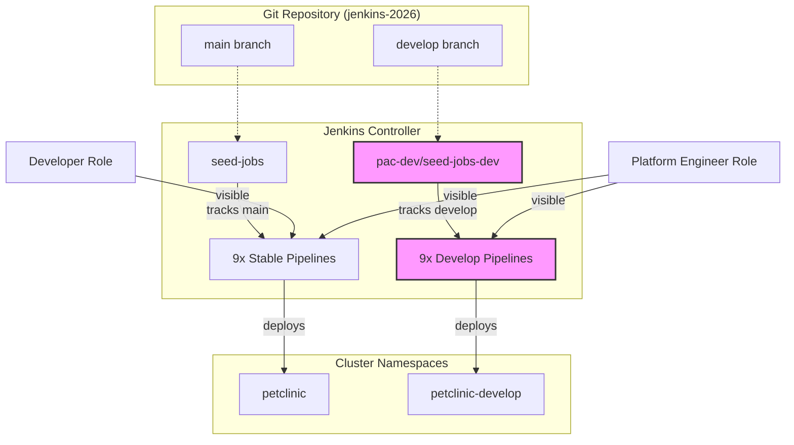

# jenkins-2026

A self-contained proof of concept that deploys **Jenkins** (via
[jenkinsci/helm-charts](https://github.com/jenkinsci/helm-charts)) on
**Kubernetes**, configures it entirely through Configuration-as-Code +
Job DSL ("pipelines as code"), and uses it to build, containerize and deploy
the [Spring PetClinic microservices](https://github.com/spring-petclinic/spring-petclinic-microservices)
reference application (+ its [Angular UI](https://github.com/spring-petclinic/spring-petclinic-angular))
in a **GitFlow-inspired** model with two distinct tracks:
- **Stable Track**: 9 pipelines at the root (visible in the **petclinic** view)
  tracking the upstream `main` branch and deploying to the `petclinic`
  namespace. Managed from this repo's `main` branch.
- **Sandbox Track**: 9 `<service>-develop` pipelines (visible in the
  **petclinic-develop** view) residing in the `pac-dev/` folder. This isolated
  sandbox lets devops/platform engineers iterate on this repo's own
  pipelines-as-code (Jenkinsfile, shared library, JCasC, seed jobs) on the
  `develop` branch, deploying to a separate `petclinic-develop` namespace
  without affecting the tested stable pipelines.

Jenkins and every PetClinic service are instrumented with **OpenTelemetry**,
 with traces,
metrics and logs correlated end-to-end in **Grafana** (Grafana Cloud by
default, or an in-cluster OSS stack).

It is compliant with **OpenShift 4.20+** and the latest **Kubernetes on
GKE/EKS/AKS** - the target platform is a config-file + environment-variable
feature flag, only one platform is active per run.

See [`docs/architecture.md`](docs/architecture.md) for the full component
diagram and repository layout, [`docs/pipelines-as-code.md`](docs/pipelines-as-code.md)
for how the Jenkins pipelines are generated, [`docs/observability.md`](docs/observability.md)
for the OpenTelemetry/Grafana wiring, and [`docs/platforms.md`](docs/platforms.md)
for per-cloud notes.

## Prerequisites

- An existing Kubernetes cluster (GKE/EKS/AKS, latest stable, or OpenShift
  4.20+) and a `kubectl` context pointing at it. **This repo provisions no
  cluster infrastructure.**
- `kubectl`, `helm` (v3), [`yq`](https://github.com/mikefarah/yq) (Go
  version, `mikefarah/yq`), `git`, `bash`. `gh` (GitHub CLI) only if you plan
  to push this repo yourself.
- Cluster permissions to create namespaces, RBAC, CRDs (OpenTelemetry
  Operator) and the workloads described below.
- A container registry you can push to (default:
  `ghcr.io/nubenetes/jenkins-2026-petclinic` - works anonymously for pulls;
  pushing needs a token with `write:packages` in the `jenkins-credentials`
  Secret, see below).
- (default observability mode) A [Grafana Cloud](https://grafana.com/products/cloud/)
  stack (free tier is enough) for its OTLP gateway endpoint + API key.

## Quick start

```bash
# 1. Review/edit config/config.yaml - platform.target (gke|eks|aks|openshift)
#    and observability.mode (grafana-cloud|oss|managed). Defaults: gke + grafana-cloud.

# 2. (grafana-cloud mode only) create the OTLP credentials secret:
cp observability/otel-collector/secret.example.yaml observability/otel-collector/secret.yaml
#    edit secret.yaml with your Grafana Cloud OTLP endpoint + base64(instanceID:apiKey),
#    then:
kubectl create namespace observability --dry-run=client -o yaml | kubectl apply -f -
kubectl apply -f observability/otel-collector/secret.yaml

# 3. (optional) export registry/git credentials consumed by scripts/01-namespaces.sh -
#    REGISTRY_USERNAME/REGISTRY_PASSWORD become both the Jenkins "container-registry"
#    push credential and the "ghcr-credentials" imagePullSecret in every PetClinic
#    namespace (needed if PETCLINIC_REGISTRY packages are private, the GHCR default)
export REGISTRY_USERNAME=<github-username> REGISTRY_PASSWORD=<ghcr-token>
export GIT_USERNAME=<github-username>      GIT_TOKEN=<github-token>

# 4. provision everything
./scripts/up.sh

# 5. check status / get port-forward commands
./scripts/status.sh

# tear down (namespaces kept by default; see scripts/down.sh)
./scripts/down.sh
```

`scripts/up.sh` runs, in order: prereq/repo checks -> namespaces & secrets ->
the OpenTelemetry Operator -> (in parallel) the observability stack, Jenkins,
and the initial PetClinic Helm releases -> triggers the Jenkins seed job ->
imports Grafana dashboards. Every step is idempotent
(`helm upgrade --install` / `kubectl apply`), so re-running `up.sh` after a
partial failure is safe. Each step also runs standalone:
`./scripts/0N-*.sh`.

> **First run note**: `helm/petclinic`'s default image tag (`main`) won't
> exist in your registry yet, so PetClinic pods will show
> `ImagePullBackOff` until each service's Jenkins pipeline has run at least
> once and pushed an image. `scripts/06-seed-pipelines.sh` (part of `up.sh`)
> triggers the seed job immediately so the 9 stable pipelines exist right
> away; trigger individual builds from the Jenkins UI (`listView` **petclinic**).
> Jobs are not auto-triggered (no SCM-poll) - see `petclinic.genaiServiceEnabled`
> below for why `genai-service`/`pac-dev/genai-service-develop` start out disabled.

## Configuration ([`config/config.yaml`](config/config.yaml))

Single source of truth, loaded by every script via
[`scripts/lib/config.sh`](scripts/lib/config.sh) (`yq` -> `J2026_*` env
vars). Feature flags:

| Key | Default | Override | Meaning |
|---|---|---|---|
| `platform.target` | `gke` | `JENKINS2026_PLATFORM` env var | `gke`\|`eks`\|`aks`\|`openshift` - selects the Helm overlay, ingress/Route strategy and storage class (see [`docs/platforms.md`](docs/platforms.md)). |
| `observability.mode` | `grafana-cloud` | edit `config.yaml` | `grafana-cloud`\|`oss`\|`managed` - where traces/metrics/logs go (see [`docs/observability.md`](docs/observability.md)). |
| `petclinic.genaiServiceEnabled` | `false` | `JENKINS2026_GENAI_SERVICE_ENABLED` env var | Whether the `genai-service`/`pac-dev/genai-service-develop` Jenkins jobs are created enabled. `genai-service` (Spring AI) crashes on startup without a real `OPENAI_API_KEY` (`helm/petclinic/values-*.yaml` only set a startup placeholder), so seed-jobs creates these jobs `disabled` until this is `true` and a real key is configured. |

Other notable sections: `jenkins.*` (chart coordinates, namespace, this
repo's own URL/branch used by JCasC's global library + seed job),
`observability.*` (operator/collector chart coordinates, release names,
Secret name), `petclinic.*` (namespaces for the stable/develop environments,
upstream PetClinic git org/repos/branches, target registry, and the list of
9 services seeded into Jenkins).

## Repository layout

```
config/config.yaml          single source of truth (feature flags above)
helm/jenkins/                jenkinsci/helm-charts values + per-platform overlays
helm/petclinic/              local chart for the 9 PetClinic workloads (2 envs)
helm/headlamp/                kubernetes-sigs/headlamp values (cluster management UI)
jenkins/casc/                JCasC: security, OTel exporter, seed job
jenkins/pipelines/           Jenkinsfile.petclinic + seed job (Job DSL + services.yaml)
vars/, resources/            Jenkins global shared library (must be at repo root)
observability/               OTel Operator/Collector + Grafana/Loki/Tempo/Prometheus values + dashboards
scripts/                      00-09 numbered steps + up.sh / down.sh / status.sh
terraform/gke/                throwaway GKE cluster for test/e2e.sh (the one exception
                              to "assumes an existing cluster")
terraform/bootstrap/          one-time setup for the GitHub Actions automation below
                              (state bucket + Workload Identity Federation)
terraform/gateway-bootstrap/  one-time setup for public access (static IP + managed
                              certificate) - see "Public access (GKE Gateway API + IAP)"
test/                         e2e.sh (provision -> up.sh -> smoke-test.sh -> down.sh -> destroy)
.github/workflows/            CC.NN-<name>.yml, see "CI/CD pipelines" for the full inventory
docs/                         architecture, pipelines-as-code, observability, platforms
```

Full details in [`docs/architecture.md`](docs/architecture.md).

## Jenkins UI, plugins & MCP

### Accessing the UI & admin password

```bash
kubectl -n jenkins port-forward svc/jenkins 8080:8080
```

Open <http://localhost:8080>. If [Google login](#google-login-openid-connect)
is configured, use the **Sign in with Google** button. Otherwise (or for
break-glass/automation access), log in as `${JENKINS_ADMIN_ID}`
(`jenkins.adminUser` in [`config/config.yaml`](config/config.yaml), default
`admin`) via the **escape hatch** - this login always works, regardless of
OIDC. The password is randomly generated on first run by
[`scripts/01-namespaces.sh`](scripts/01-namespaces.sh) and printed once to its
output - if you missed it, retrieve it from the `jenkins-credentials` Secret
(`jenkins.credentialsSecretName`) in the `jenkins` namespace:

```bash
kubectl -n jenkins get secret jenkins-credentials -o jsonpath='{.data.admin-password}' | base64 -d; echo
```

This same `${JENKINS_ADMIN_ID}` / password is what
[`test/smoke-test.sh`](test/smoke-test.sh) and
[`scripts/06-seed-pipelines.sh`](scripts/06-seed-pipelines.sh) use for
HTTP Basic Auth against the Jenkins API. To rotate the password, delete the
Secret and re-run `scripts/01-namespaces.sh` + `scripts/04-jenkins.sh` (see
[Troubleshooting](#troubleshooting)) - a new random password is generated and
printed once.

### Google login (OpenID Connect)

Jenkins' security realm is [`oic-auth`](https://plugins.jenkins.io/oic-auth/)
(`securityRealm.oic` in
[`jenkins/casc/jcasc-base.yaml`](jenkins/casc/jcasc-base.yaml)), so anyone can
sign in with a Google account - Role-Based Authorization Strategy then decides
what they can do. By default, a Google login only gets `authenticated-base`
(read-only UI access); to grant the `admin` role (`Overall/Administer`) to
your own account, set `JENKINS_OIDC_ADMIN_EMAIL`.

This **replaces** the old local `admin`/`platform-engineer` password logins -
the `platform-engineer` account can no longer log in (its
[pac-dev item role](#pipelines-as-code-dev-sandbox-pac-dev) is left in place
in case it's remapped to an OIDC user/group later). The `${JENKINS_ADMIN_ID}`
escape hatch above remains as the break-glass admin login.

1. **Create a third Google OAuth 2.0 Web application client** (can reuse the
   same GCP project as the [Headlamp](#one-time-setup-google-oauth-client)
   and [IAP](#one-time-setup) clients, but must be its own client - Jenkins
   needs its own redirect URI and cannot share a client with them):
   - [Google Cloud Console](https://console.cloud.google.com/) -> **APIs &
     Services** -> **Credentials** -> **Create credentials** -> **OAuth
     client ID** -> Application type **Web application**.
   - **Authorized redirect URIs**: add
     `https://jenkins.<baseDomain>/securityRealm/finishLogin` (e.g.
     `https://jenkins.jenkins2026.nubenetes.com/securityRealm/finishLogin`).
     If you only access Jenkins via `kubectl port-forward`, also add
     `http://localhost:8080/securityRealm/finishLogin`.
   - Note the **Client ID** and **Client secret**.
   - On the **OAuth consent screen** (Audience tab), while the app is in
     **Testing**, add your Google account as a **Test user** - otherwise
     Google returns `Error 403: access_denied` ("has not completed the Google
     verification process"). Unlike the Headlamp client, Jenkins only needs
     the non-sensitive `openid email profile` scopes, so no Data Access
     changes are required.

2. **Add repository secrets** (your own email is **never committed to this
   repo**):

   ```bash
   gh secret set JENKINS_OIDC_CLIENT_ID     --body "<client ID from above>"
   gh secret set JENKINS_OIDC_CLIENT_SECRET --body "<client secret from above>"
   gh secret set JENKINS_OIDC_ADMIN_EMAIL   --body "you@gmail.com"
   ```

   then re-run **02.02 Redeploy Jenkins** (or **02.01 GKE provision**).
   Locally (`test/e2e.sh` / `scripts/up.sh`), export the same three as
   `JENKINS_OIDC_CLIENT_ID`, `JENKINS_OIDC_CLIENT_SECRET` and
   `JENKINS_OIDC_ADMIN_EMAIL` instead.

   > Changes to `jenkins-credentials` only take effect for a *new* Secret -
   > if it already exists from a previous run, delete it first (see
   > [Troubleshooting](#troubleshooting)) so `scripts/01-namespaces.sh`
   > recreates it with the `oidc-*` keys.

Until `JENKINS_OIDC_CLIENT_ID`/`JENKINS_OIDC_CLIENT_SECRET` are set, the
**Sign in with Google** button is shown but errors out - the escape hatch
above is the only working login in the meantime.

[`helm/jenkins/values-common.yaml`](helm/jenkins/values-common.yaml) tracks
the latest Jenkins LTS (`controller.image.tag`) and pins **every** plugin -
including transitive dependencies - to the exact version resolved against
that core by `jenkins-plugin-cli` (recipe in the comment above
`installPlugins`). This replaced an earlier unversioned plugin list: pinning
means a routine controller pod restart always installs the identical plugin
set, instead of silently picking up a newer (possibly breaking) version.
Bump `controller.image.tag` and re-run the recipe together when updating.

Beyond the existing kubernetes/git/JCasC/OTel plugins, three are aimed at UX:

- **[Pipeline Graph View](https://plugins.jenkins.io/pipeline-graph-view/)** -
  the maintained successor to the discontinued Blue Ocean. Adds an
  interactive, pan/zoom stage graph to every build page - no configuration
  needed.
- **[Dark Theme](https://plugins.jenkins.io/dark-theme/)** (+ Theme Manager) -
  native dark mode. `appearance.themeManager` in
  [`jenkins/casc/jcasc-base.yaml`](jenkins/casc/jcasc-base.yaml) defaults
  everyone to `darkSystem` (follows the browser/OS preference); each user can
  still override it from their profile's *Appearance* tab.
- **[MCP Server](https://plugins.jenkins.io/mcp-server/)** - exposes Jenkins
  (jobs, builds, logs, SCM, replay) as an MCP server, so an MCP-capable
  client (Claude Code/Desktop, etc.) can query and drive this Jenkins
  directly. No JCasC config needed - it auto-registers its endpoints
  (`/mcp-server/sse`, `/mcp-server/mcp`, `/mcp-server/mcp-stateless`).
  Authenticate as `${JENKINS_ADMIN_ID}` (or any user) with a personal **API
  token** (user profile -> *Security* -> *Add new Token*), passed as HTTP
  Basic Auth - never put this token in the repo. For Claude Code:
  `claude mcp add --transport http jenkins <jenkins-url>/mcp-server/mcp
  --header "Authorization: Basic <base64(user:token)>"` (after exposing
  Jenkins per the access method in [Quick start](#quick-start) /
  [Headlamp](#headlamp-cluster-management-ui)).

## Pipelines as code

A Jenkins seed job (defined via JCasC, running Job DSL against
[`jenkins/pipelines/seed/seed_jobs.groovy`](jenkins/pipelines/seed/seed_jobs.groovy)
+ [`services.yaml`](jenkins/pipelines/seed/services.yaml)) generates two
distinct tracks of pipelines:

### Pipeline Model Matrix

| Feature | Stable Track (Root) | Sandbox Track (`pac-dev/`) |
| :--- | :--- | :--- |
| **Jenkins View** | `petclinic` (root-level) | `petclinic-develop` (root-level) |
| **Jenkins Folder** | Root `/` | `pac-dev/` |
| **This Repo Branch** | `main` | `develop` |
| **PetClinic Branch** | `main` | `main` |
| **Target Namespace** | `petclinic` | `petclinic-develop` |
| **RBAC Access** | `developer` (Read/Build) | `platform-engineer` (Admin) |
| **Tracking Job** | `seed-jobs` | `pac-dev/seed-jobs-dev` |

### Architecture Diagram



Each pipeline runs
[`Jenkinsfile.petclinic`](jenkins/pipelines/Jenkinsfile.petclinic):
checkout -> build & test -> build & push image -> `helm upgrade` the
[`helm/petclinic`](helm/petclinic) chart for that environment -> smoke test.
Details in [`docs/pipelines-as-code.md`](docs/pipelines-as-code.md).

### Pipelines-as-code dev sandbox (`pac-dev/`)

The **`pac-dev/seed-jobs-dev`** job tracks this repo's `develop` branch
and generates the `pac-dev/` folder. This gives devops/platform engineers
an isolated environment to iterate on the pipelines themselves.

**RBAC & Visibility**:
- The **`petclinic`** view and the 9 root jobs are visible to everyone
  (`developer` role).
- The **`petclinic-develop`** view and the **`pac-dev/`** folder are
  **hidden** from regular users. They are only visible to the
  `platform-engineer` role and `admin` users (see
  [`jenkins/casc/jcasc-base.yaml`](jenkins/casc/jcasc-base.yaml)).
- The **"All"** jobs view in Jenkins automatically filters based on these
  permissions.

Details in [`docs/pipelines-as-code.md`](docs/pipelines-as-code.md#pipelines-as-code-dev-sandbox-pac-dev).

## Observability

Jenkins (via the `opentelemetry` plugin), every Java microservice (via OTel
Operator auto-instrumentation) and the Angular UI (via a small RUM snippet)
export OTLP to an in-cluster collector, which forwards to Grafana Cloud
(default) or an in-cluster Prometheus+Loki+Tempo+Grafana stack
(`observability.mode: oss`). Two pre-built dashboards
(`observability/grafana/dashboards/`) cover Jenkins CI health and PetClinic
service health, with derived-field/exemplar links so you can jump from a log
line or a latency spike straight to the trace that produced it. Full details
in [`docs/observability.md`](docs/observability.md).

## Headlamp (cluster management UI)

[Headlamp](https://headlamp.dev/) gives a web UI for the GKE cluster itself
(pods, deployments, logs, exec, RBAC, etc.), deployed by
[`scripts/08-headlamp.sh`](scripts/08-headlamp.sh) into the `headlamp`
namespace using [`helm/headlamp/values.yaml`](helm/headlamp/values.yaml).

**Access model**: Headlamp's "main" cluster context uses the chart's default
**ServiceAccount** (cluster-admin via the chart's default `ClusterRoleBinding`,
`clusterRoleName: cluster-admin`) - `helm/headlamp/values.yaml` is
intentionally empty, no in-app OIDC is configured. Google-identity access
control happens one layer up: if
[gateway.baseDomain](#public-access-gke-gateway-api--iap) is configured,
`https://headlamp.<baseDomain>` is gated by
[Identity-Aware Proxy](https://cloud.google.com/iap) - only the Google
accounts in `HEADLAMP_ADMIN_EMAILS` (granted `roles/iap.httpsResourceAccessor`
by `terraform/gke` `google_project_iam_member.iap_accessors`) can reach the UI
at all, and everyone who gets through has full cluster-admin via Headlamp's
ServiceAccount. By default (no `gateway.baseDomain`), access is via `kubectl
port-forward` (below) with no Google sign-in or IAP gate.

**Why not per-user Google OIDC -> GKE API auth?** This was attempted
(`config.oidc.externalSecret` + `config.oidc.useAccessToken: true`, each
signed-in user's Google identity mapped to K8s RBAC via a `cluster-admin`
`ClusterRoleBinding` per `HEADLAMP_ADMIN_EMAILS` entry +
`roles/container.clusterViewer` in GCP IAM). Headlamp chart >=0.38.0
([kubernetes-sigs/headlamp#3954](https://github.com/kubernetes-sigs/headlamp/issues/3954)/PR#4122)
does fix the Helm templating bug that previously dropped
`-oidc-use-access-token` when `externalSecret.enabled: true`, but a deeper
backend bug remains: with `useAccessToken: true`, the `/oidc-callback` handler
runs Google's OAuth2 **access token** (an opaque `ya29.` bearer token, not a
JWT) through an OIDC ID-token verifier, which fails immediately with
`Failed to verify ID Token: oidc: failed to unmarshal claims: invalid
character 'k' looking for beginning of value` - the sign-in never completes.
This matches [kubernetes-sigs/headlamp#2643](https://github.com/kubernetes-sigs/headlamp/issues/2643)
("OIDC with GKE... only ServiceAccount token works") and upstream's own
recent move toward an `unsafe-use-service-account-token` flag for in-cluster
deployments - per-user OIDC tokens forwarded to a managed GKE control plane
isn't a supported path today. If upstream fixes this, `headlamp-credentials`
(`HEADLAMP_OIDC_CLIENT_ID`/`HEADLAMP_OIDC_CLIENT_SECRET`, still created by
`scripts/01-namespaces.sh`) and the per-email `ClusterRoleBinding`s
(`scripts/08-headlamp.sh`) are ready to wire back up via
`helm/headlamp/values.yaml`.

### One-time setup: Google OAuth client (currently unused)

> Not required for the IAP-gated access model above - IAP uses its own OAuth
> client (`gateway-iap-oauth`, see [Public access (GKE Gateway API +
> IAP)](#public-access-gke-gateway-api--iap)). This client is only consumed
> by Headlamp's in-app OIDC, which doesn't work against GKE today (see
> above) - kept here in case upstream fixes it.

Create a Google OAuth 2.0 **Web application** client (any GCP project will
do - it doesn't need to be the same project as the GKE cluster):

1. [Google Cloud Console](https://console.cloud.google.com/) -> **APIs &
   Services** -> **Credentials** -> **Create credentials** -> **OAuth client
   ID** -> Application type **Web application**.
2. **Authorized redirect URIs**: add `http://localhost:8080/oidc-callback`
   (matches the `kubectl port-forward` instructions below). If
   [gateway.baseDomain](#public-access-gke-gateway-api--iap) is configured,
   also add `https://headlamp.<baseDomain>/oidc-callback` (e.g.
   `https://headlamp.jenkins2026.nubenetes.com/oidc-callback`) -
   [`scripts/lib/config.sh`](scripts/lib/config.sh) computes which one
   `OIDC_CALLBACK_URL` is set to.
3. Note the **Client ID** and **Client secret**. The client ID isn't
   inherently secret, but - like the client secret, which *is* sensitive -
   it's kept out of the repo for consistency; both are passed as the
   `HEADLAMP_OIDC_CLIENT_ID` / `HEADLAMP_OIDC_CLIENT_SECRET` secrets below.

### Adding your (or another) identity

Your Google account email is **never committed to this repo** - it's
supplied via the `HEADLAMP_ADMIN_EMAILS` secret (comma-separated for
multiple people) and consumed as a placeholder
(`J2026_HEADLAMP_ADMIN_EMAILS`/`JENKINS2026_HEADLAMP_ADMIN_EMAILS`) by
[`scripts/lib/config.sh`](scripts/lib/config.sh),
[`terraform/gke`](terraform/gke) (`TF_VAR_admin_emails`) and
[`scripts/08-headlamp.sh`](scripts/08-headlamp.sh). This is the list IAP lets
through to `https://headlamp.<baseDomain>` (and `https://jenkins.<baseDomain>`
- see [Public access](#public-access-gke-gateway-api--iap)). To grant access
to yourself or anyone else:

```bash
# comma-separated, no spaces needed (leading/trailing whitespace is trimmed)
gh secret set HEADLAMP_ADMIN_EMAILS --body "you@gmail.com,colleague@gmail.com"
```

then (re-)run **02.01 GKE provision** (adds the `roles/iap.httpsResourceAccessor`
IAM binding via `terraform/gke`). Locally (`test/e2e.sh` / `scripts/up.sh`),
export the same as `JENKINS2026_HEADLAMP_ADMIN_EMAILS` instead - never commit
it to `config/config.yaml`. `HEADLAMP_OIDC_CLIENT_ID`/`HEADLAMP_OIDC_CLIENT_SECRET`
(from the previous section) are only needed if/when the in-app OIDC above
becomes usable.

### Accessing the UI

```bash
kubectl -n headlamp port-forward svc/headlamp 8080:80
```

Open <http://localhost:8080> and sign in with a ServiceAccount token (the
chart's default `ClusterRoleBinding` grants it cluster-admin):

```bash
kubectl create token headlamp -n headlamp
```

## Public access (GKE Gateway API + IAP)

Jenkins, PetClinic and Headlamp can all be exposed on the public internet
through a single **GKE Gateway** (`gatewayClassName:
gke-l7-global-external-managed`) - one global external HTTPS load balancer,
one [Google-managed wildcard
certificate](https://cloud.google.com/certificate-manager/docs/overview)
(Certificate Manager, DNS-authorized), and one `HTTPRoute` per app, all
applied by [`scripts/09-gateway.sh`](scripts/09-gateway.sh):

| App | URL | [Identity-Aware Proxy](https://cloud.google.com/iap) |
|---|---|---|
| Jenkins | `https://jenkins.<baseDomain>` | yes |
| PetClinic | `https://petclinic.<baseDomain>` | no (public demo app) |
| Headlamp | `https://headlamp.<baseDomain>` | yes |

`<baseDomain>` is [`gateway.baseDomain`](config/config.yaml) -
`jenkins2026.nubenetes.com` by default. Jenkins and Headlamp get an extra
Google-login gate (IAP) in front of their own auth; PetClinic, the demo app,
stays open. **This whole feature is opt-in**: set
`JENKINS2026_BASE_DOMAIN=""` to disable it (no `Gateway`/`HTTPRoute`/
`GCPBackendPolicy` resources are created, e.g. before the one-time setup
below has been done) - `scripts/09-gateway.sh` is also a no-op on
`platform.target` other than `gke`, since `gke-l7-global-external-managed`
and `GCPBackendPolicy` are GKE-specific.

> **Two non-obvious GKE Gateway API requirements**, confirmed against a live
> cluster and handled by [`scripts/09-gateway.sh`](scripts/09-gateway.sh):
> - The `Gateway` CRD rejects a `https` listener's `tls.mode: Terminate`
>   unless `tls.certificateRefs` or `tls.options` is non-empty - even though
>   the actual certificate comes from the `networking.gke.io/certmap`
>   annotation. The script adds the documented placeholder
>   `tls.options["networking.gke.io/pre-shared-certs"]: ""` to satisfy this.
> - `GCPBackendPolicy`'s `spec.default.iap.clientID` must be a literal OAuth
>   client ID string (not a Secret reference), and the Secret referenced by
>   `oauth2ClientSecret.name` must contain **exactly one** key
>   (`client_secret`). The script reads `client_id`/`client_secret` from the
>   `gateway-iap-oauth` Secret (created by
>   [`scripts/01-namespaces.sh`](scripts/01-namespaces.sh)) and derives a
>   single-key `gateway-iap-oauth-client-secret` Secret per namespace for
>   `oauth2ClientSecret.name`.

### One-time setup

1. **Run the "01.02 Gateway bootstrap" workflow** (Actions tab -> **01.02
   Gateway bootstrap** -> **Run workflow**). It applies
   [`terraform/gateway-bootstrap`](terraform/gateway-bootstrap) (state in the
   same GCS bucket as `terraform/gke`, like [Grafana Cloud
   bootstrap](#one-time-setup)) to create, once and persistently:
   - a global static IP (`jenkins-2026-gateway-ip`), and
   - a Google-managed wildcard certificate for `<baseDomain>` and
     `*.<baseDomain>`, validated via a Certificate Manager DNS authorization.

   It's safe to re-run - re-applying against existing state is a no-op. The
   job summary prints the static IP and the DNS authorization record.

2. **Add the two DNS records it prints**, with your DNS provider for
   `<baseDomain>`'s parent domain. For the default
   `jenkins2026.nubenetes.com` (a subdomain of `nubenetes.com`, managed at
   **Squarespace** - Squarespace migrated domains off Google Domains in
   2023, but `nubenetes.com`'s nameservers are Google Cloud DNS
   (`ns-cloud-a[1-4].googledomains.com`) - Squarespace's "Custom records" UI
   manages that same Cloud DNS zone): go to **Domains** -> `nubenetes.com` ->
   **DNS** -> **Custom records**, and add:
   - a wildcard **A** record: host `*.jenkins2026`, value the static IP from
     step 1 (e.g. `34.120.231.149`).
   - the **CNAME** record from the workflow's "DNS authorization record"
     output: host `_acme-challenge.jenkins2026`, value something like
     `<random-id>.<n>.authorize.certificatemanager.goog.` (proves ownership
     of `jenkins2026.nubenetes.com` for the managed certificate).

   Double-check the CNAME value is copied **in full, including the trailing
   `.`** - Squarespace's UI truncates long values when displaying them, which
   is easy to mistake for the saved value also being truncated.

   Certificate provisioning can take up to ~1h after the DNS authorization
   record verifies. Check progress with:

   ```bash
   gcloud certificate-manager certificates describe jenkins-2026-cert \
     --format="yaml(managed.state,managed.provisioningIssue,managed.authorizationAttemptInfo)"
   ```

   `managed.state: ACTIVE` means it's done. While `PROVISIONING`, an
   `authorizationAttemptInfo[].issues: [CNAME_MISMATCH]` entry reflects
   Certificate Manager's **last** validation attempt - it only re-checks DNS
   periodically, so this can stay stale for a while even after you've fixed
   the record; re-verify the record itself with `dig` / `https://dns.google`
   rather than relying on this field to update immediately. Until the
   certificate is `ACTIVE`, HTTPS requests to `*.jenkins2026.nubenetes.com`
   fail with a TLS handshake error (e.g. curl's `SSL_ERROR_SYSCALL`) because
   the load balancer has no certificate attached yet.

3. **Create the IAP OAuth client by hand** (the Terraform resources for this,
   `google_iap_brand`/`google_iap_client`, are deprecated - the IAP OAuth
   Admin API they depend on was deprecated after July 2025). In the [GCP
   Console](https://console.cloud.google.com/): **APIs & Services** ->
   **Credentials** -> **Create credentials** -> **OAuth client ID** ->
   Application type **Web application**.

   **Authorized redirect URIs**: add (replacing `<client ID>` with the OAuth
   client ID you just created):

   ```
   https://iap.googleapis.com/v1/oauth/clientIds/<client ID>:handleRedirect
   ```

   Without this, IAP's post-login redirect back from Google fails with
   **Error 400: redirect_uri_mismatch**. This is the one redirect URI IAP
   uses regardless of how many apps/domains sit behind it, so a single OAuth
   client can be shared by both the Jenkins and Headlamp `GCPBackendPolicy`
   resources.

   ```bash
   gh secret set IAP_OAUTH_CLIENT_ID     --body "<client ID>"
   gh secret set IAP_OAUTH_CLIENT_SECRET --body "<client secret>"
   ```

   (Re-)run **02.01 GKE provision** - `scripts/01-namespaces.sh` writes these into
   the `gateway-iap-oauth` Secret in the `jenkins` and `headlamp` namespaces
   that the `GCPBackendPolicy` resources reference.

4. **IAP access control** reuses `HEADLAMP_ADMIN_EMAILS` (see
   [Headlamp](#headlamp-cluster-management-ui)): each listed email is granted
   both `roles/container.clusterViewer` (existing, for Headlamp's OIDC
   passthrough) and `roles/iap.httpsResourceAccessor` (new, via
   `terraform/gke`'s `google_project_iam_member.iap_accessors`) - i.e. the
   same people who can administer the cluster via Headlamp can pass IAP for
   Jenkins and Headlamp. Anyone without `roles/iap.httpsResourceAccessor` gets
   a 403 from IAP before reaching either app.

## Automated end-to-end test (provisioning + decommissioning)

[`test/e2e.sh`](test/e2e.sh) fully automates a real run of this PoC,
**including the GKE cluster itself** - the one exception to "this repo
assumes an existing cluster" (scoped entirely to `terraform/gke/` and
`test/`):

1. **`terraform -chdir=terraform/gke apply`** - provisions a throwaway GKE
   cluster: its own VPC/subnet and a 2-4 node autoscaling `e2-standard-4`
   node pool.
2. **`gcloud container clusters get-credentials`** - points `kubectl`/`helm`
   at the new cluster.
3. **`scripts/00-check-prereqs.sh` + `scripts/01-namespaces.sh`**.
4. **`scripts/up.sh`** - the full stack, exactly as in Quick start.
5. **`test/smoke-test.sh`** - verifies the Jenkins controller pod is `Running`
   and serves `/login`, the seed job created the 9 stable pipelines (plus
   `seed-jobs` and the `pac-dev` folder), the OTel Operator/collectors (and,
   for `oss` mode, Grafana) are running, and both PetClinic namespaces have
   all 9 `Deployment`s.
6. **`scripts/down.sh`** (with `J2026_DELETE_NAMESPACES=true`) then
   **`terraform -chdir=terraform/gke destroy`** - decommissions everything.

Step 6 runs **unconditionally** via an `EXIT` trap, even if steps 1-5 fail
partway through, so a failed run still leaves the GCP project clean.

### Running it

```bash
cp test/.env.example test/.env   # edit: at minimum set GCP_PROJECT_ID
set -a; source test/.env; set +a

gcloud auth login
gcloud auth application-default login

./test/e2e.sh
```

### Prerequisites

- A GCP project with billing enabled, and the authenticated principal having
  `roles/container.admin`, `roles/compute.networkAdmin`,
  `roles/iam.serviceAccountAdmin` and `roles/resourcemanager.projectIamAdmin`
  (or `roles/owner`/`roles/editor`).
- [`terraform`](https://developer.hashicorp.com/terraform/install) >= 1.9
  (developed against **1.15.x**) and the
  [`gcloud` CLI](https://cloud.google.com/sdk/docs/install), in addition to
  the [Prerequisites](#prerequisites) above (`kubectl`/`helm`/`yq`/etc).
- `observability.mode: grafana-cloud` (the default) requires
  `observability/otel-collector/secret.yaml` to already exist (Quick start
  step 2) - `test/e2e.sh` checks for it up front and fails fast with
  instructions if it's missing. For a fully self-contained run with **no**
  external account, `export JENKINS2026_OBS_MODE=oss` instead (see
  `test/.env.example`).

### What gets created / destroyed

[`terraform/gke/`](terraform/gke/) provisions, all named/prefixed
`jenkins-2026*` and removed by `terraform destroy`:

| Resource | Notes |
|---|---|
| VPC + subnet (`jenkins-2026-vpc` / `-subnet`) | VPC-native, dedicated pod/Service CIDR ranges |
| GKE cluster `jenkins-2026` (zonal, `europe-southwest1-a`) | `deletion_protection = false` so `destroy` works |
| Node pool (2-4 x `e2-standard-4`, autoscaling) | sized for Jenkins + 18 PetClinic pods + 1-2 concurrent build agents |
| Service account `jenkins-2026-nodes` + IAM bindings | logging/monitoring writer, Artifact Registry reader only |

`container.googleapis.com`/`compute.googleapis.com` API enablement on the
project is intentionally left in place (re-enabling is slow, and disabling
can break unrelated resources in the same project).

### Cost

At on-demand `europe-southwest1` (Madrid) pricing, the cluster runs at roughly
**$0.40-0.50/hr** (3x `e2-standard-4`, plus the $0.10/hr GKE cluster
management fee - waived for your first zonal cluster per billing account).
A full `test/e2e.sh` pass (provision, deploy, smoke-test, tear down
everything) typically takes **15-25 minutes**, i.e. **~$0.10-0.20 per run**.
Grafana Cloud's free tier comfortably covers this PoC's traffic/series volume
for a run of that length.

### Terraform version & Stacks

`terraform/gke/` targets Terraform **1.15.x** (`required_version >= 1.9`) and
`hashicorp/google ~> 6.0`. [Terraform
Stacks](https://developer.hashicorp.com/terraform/cloud-docs/stacks) (the
newer multi-component/multi-deployment orchestration model) is an **HCP
Terraform**-only feature aimed at fleets of similar deployments across
environments - adopting it here would add an HCP Terraform account dependency
for what is a single throwaway cluster with local state, so this repo uses a
plain root module + local backend instead. The resources in
[`terraform/gke/main.tf`](terraform/gke/main.tf) can be lifted into a Stack
component largely as-is if you use HCP Terraform for your own infrastructure.

## CI/CD pipelines

All workflows live in [`.github/workflows/`](.github/workflows/), are
manually-triggered (`workflow_dispatch`), and follow a `CC.NN-<name>.yml`
naming convention so their order in the GitHub UI matches their place in the
lifecycle:

- `CC` - **category**: `01` one-time bootstrap of persistent, account-level
  resources (run by hand, rarely); `02` the GKE cluster lifecycle (provision,
  component redeploys, decommission).
- `NN` - sequence number within that category, in the order you'd typically
  run them. Within category `02`, `.99` is reserved for the teardown
  (decommission) step, so new component-redeploy workflows can be inserted at
  `02.02`, `02.03`, etc. without renumbering it.

| # | Workflow | Category | What it does |
|---|---|---|---|
| 01.01 | [Grafana Cloud bootstrap](.github/workflows/01.01-grafana-cloud-bootstrap.yml) | One-time bootstrap | Creates/confirms the persistent Grafana Cloud stack (`terraform/grafana-cloud-stack`) that `observability_mode: grafana-cloud` sends data to. See [Full Grafana Cloud lifecycle automation](#one-time-setup-1). |
| 01.02 | [Gateway bootstrap](.github/workflows/01.02-gateway-bootstrap.yml) | One-time bootstrap | Creates/confirms the persistent static IP + managed wildcard cert + DNS authorization (`terraform/gateway-bootstrap`) that [public access](#public-access-gke-gateway-api--iap) depends on. |
| 02.01 | [GKE provision](.github/workflows/02.01-gke-provision.yml) | GKE lifecycle | Provisions the throwaway GKE cluster (`terraform/gke`) and deploys the full stack (`scripts/up.sh`) + smoke test. Pair with 02.99. |
| 02.02 | [Redeploy Jenkins](.github/workflows/02.02-redeploy-jenkins.yml) | GKE lifecycle | Re-applies only `scripts/04-jenkins.sh` (Helm upgrade of `helm/jenkins/` + `jenkins/casc/` JCasC) and re-seeds the PetClinic pipelines, against the cluster from the last 02.01 run - for a Jenkins-only fix without the full provision/decommission cycle. Run any number of times between 02.01 and 02.99. |
| 02.03 | [Redeploy Headlamp](.github/workflows/02.03-redeploy-headlamp.yml) | GKE lifecycle | Re-applies `scripts/01-namespaces.sh` (refreshes the non-sensitive OIDC config keys on `headlamp-credentials`) and `scripts/08-headlamp.sh` (Helm upgrade of `helm/headlamp/`), against the cluster from the last 02.01 run - for a Headlamp-only fix without the full provision/decommission cycle. Run any number of times between 02.01 and 02.99. |
| 02.99 | [GKE decommission](.github/workflows/02.99-gke-decommission.yml) | GKE lifecycle | Tears down the stack (`scripts/down.sh`) and destroys the GKE cluster (`terraform destroy`). |

See [GitHub Actions automation](#github-actions-automation) below for the
one-time setup (secrets, Workload Identity Federation) these workflows need.

## GitHub Actions automation

[`.github/workflows/02.01-gke-provision.yml`](.github/workflows/02.01-gke-provision.yml) and
[`.github/workflows/02.99-gke-decommission.yml`](.github/workflows/02.99-gke-decommission.yml)
are the CI equivalent of `test/e2e.sh`, split into two manually-triggered
workflows so the cluster can be left running between them (e.g. provision in
the morning, demo it, decommission in the evening). They run the exact same
`terraform/gke` + `scripts/0N-*.sh` + `test/smoke-test.sh` as `test/e2e.sh`,
but since each is a separate workflow run on a fresh runner, Terraform state
has to be **remote** (a GCS bucket) instead of local so the decommission run
can find what the provision run created. See [CI/CD
pipelines](#cicd-pipelines) for the full workflow inventory, including
[`02.02-redeploy-jenkins.yml`](.github/workflows/02.02-redeploy-jenkins.yml)
for redeploying only Jenkins.

### One-time setup

> **Why this step can't itself run in GitHub Actions**: `02.01-gke-provision.yml`
> and `02.99-gke-decommission.yml` authenticate to GCP via Workload Identity
> Federation (WIF) - but that WIF trust relationship, the CI service account,
> and the GCS state bucket don't exist yet. Something has to create them
> first using *real* GCP credentials, which is exactly what
> `terraform/bootstrap` does. This is a one-time, local "break glass" step;
> every run after that (provisioning, deploying, smoke-testing, decommission)
> happens entirely in GitHub Actions. There's no way around this for the
> *first* setup - any approach to creating WIF trust ultimately needs an
> already-trusted identity to grant it.

1. **Authenticate locally** as a principal with `roles/owner` (or
   `roles/editor` + `roles/resourcemanager.projectIamAdmin`) on your GCP
   project - the same one used for [`test/e2e.sh`](#running-it):

   ```bash
   gcloud auth login
   gcloud auth application-default login
   ```

2. **Run `terraform/bootstrap`** once. This creates the GCS state bucket and
   a Workload Identity Federation pool/provider + service account that
   GitHub Actions will use to authenticate to GCP **without a JSON key**:

   ```bash
   cd terraform/bootstrap
   cp terraform.tfvars.example terraform.tfvars
   # edit terraform.tfvars: set project_id (and github_repo if you forked this repo)

   terraform init
   terraform apply
   terraform output    # copy these 4 values into GitHub secrets below
   ```

   Keep `terraform/bootstrap/terraform.tfstate` (gitignored, local-only) -
   it's the only record of these resources; see the comment in
   [`terraform/bootstrap/versions.tf`](terraform/bootstrap/versions.tf).

3. **Add repository secrets**, from the `terraform output` above:

   | Secret | From output |
   |---|---|
   | `GCP_PROJECT_ID` | `project_id` |
   | `GCP_WORKLOAD_IDENTITY_PROVIDER` | `workload_identity_provider` |
   | `GCP_SERVICE_ACCOUNT` | `ci_service_account_email` |
   | `TF_STATE_BUCKET` | `state_bucket` |

   **Option A - GitHub CLI (`gh`, recommended)**, from `terraform/bootstrap`
   (run right after `terraform apply`, so `terraform output` still has the
   values):

   ```bash
   cd terraform/bootstrap
   gh secret set GCP_PROJECT_ID                --body "$(terraform output -raw project_id)"
   gh secret set GCP_WORKLOAD_IDENTITY_PROVIDER --body "$(terraform output -raw workload_identity_provider)"
   gh secret set GCP_SERVICE_ACCOUNT           --body "$(terraform output -raw ci_service_account_email)"
   gh secret set TF_STATE_BUCKET               --body "$(terraform output -raw state_bucket)"
   ```

   `gh secret set` defaults to the repo of the current directory's git
   remote; add `--repo nubenetes/jenkins-2026` (or your fork) to target it
   explicitly. Verify with `gh secret list`.

   **Option B - GitHub web UI**: go to the repo -> **Settings** -> **Secrets
   and variables** -> **Actions** -> **New repository secret**, and for each
   row of the table above, paste the **Secret** name (e.g.
   `GCP_PROJECT_ID`) and the corresponding `terraform output -raw <name>`
   value as the **Value**. Print all four at once with:

   ```bash
   for o in project_id workload_identity_provider ci_service_account_email state_bucket; do
     echo "$o -> $(terraform -chdir=terraform/bootstrap output -raw "$o")"
   done
   ```

4. **Optional secrets**, only needed if you use the corresponding feature -
   set the same way, e.g. `gh secret set REGISTRY_PASSWORD --body "<token>"`:

   | Secret | Needed for |
   |---|---|
   | `REGISTRY_USERNAME` / `REGISTRY_PASSWORD` | pushing PetClinic images to, and pulling them back from, a private registry (`scripts/01-namespaces.sh`) |
   | `GIT_USERNAME` / `GIT_TOKEN` | cloning a private PetClinic fork |
   | `GRAFANA_TRACES_DASHBOARD_UID` / `OTEL_LOGS_BACKEND_URL` | `observability_mode: grafana-cloud` extras - a "View trace in Grafana" link UID and the logs Explore URL (see `observability/otel-collector/secret.example.yaml`); both optional even then |
   | `HEADLAMP_OIDC_CLIENT_ID` / `HEADLAMP_OIDC_CLIENT_SECRET` | Google OAuth client for Headlamp login (see [Headlamp](#headlamp-cluster-management-ui)) |
   | `HEADLAMP_ADMIN_EMAILS` | comma-separated Google account emails granted cluster-admin via Headlamp **and** IAP access to Jenkins/Headlamp - **your own email, never committed to the repo** (see [Headlamp](#headlamp-cluster-management-ui) and [Public access](#public-access-gke-gateway-api--iap)) |
   | `JENKINS_OIDC_CLIENT_ID` / `JENKINS_OIDC_CLIENT_SECRET` | Google OAuth client for Jenkins "Sign in with Google" (see [Google login](#google-login-openid-connect)) |
   | `JENKINS_OIDC_ADMIN_EMAIL` | Google account email granted the Jenkins `admin` role via OIDC login - **your own email, never committed to the repo** (see [Google login](#google-login-openid-connect)) |
   | `IAP_OAUTH_CLIENT_ID` / `IAP_OAUTH_CLIENT_SECRET` | OAuth client gating Jenkins/Headlamp via Identity-Aware Proxy (see [Public access](#public-access-gke-gateway-api--iap)) |

   `gateway.baseDomain` (default `jenkins2026.nubenetes.com`) is **not** a
   secret - it's committed in `config/config.yaml`. Override it via the
   `JENKINS2026_BASE_DOMAIN` env var for forks using a different domain, or
   set it to `""` to disable public access entirely (see [Public
   access](#public-access-gke-gateway-api--iap)).

5. **(Optional) Full Grafana Cloud lifecycle automation**, for
   `observability_mode: grafana-cloud`. Without this, picking that mode in
   **02.01 GKE provision** will fail at `terraform apply` in
   `terraform/grafana-cloud-token` - skip this step entirely if you only plan
   to use `oss` or `managed`.

   This provisions one **persistent** Grafana Cloud stack (once, locally,
   like step 2 above), then lets every `02.01-gke-provision`/`02.99-gke-decommission`
   run mint and revoke **ephemeral**, scoped access tokens against it -
   no manual `observability/otel-collector/secret.yaml` needed.

   a. **Create a Grafana Cloud Access Policy token** - this is the one
      unavoidable manual credential, since Grafana Cloud has no equivalent
      of GCP's Workload Identity Federation (used in steps 1-3) for
      federating GitHub Actions: its API only supports static
      organization-level tokens. In the [Grafana Cloud
      portal](https://grafana.com), go to your org -> **Administration** ->
      **Access Policies** -> **Create access policy** (realm = your
      organization) with scopes `accesspolicies:read`,
      `accesspolicies:write`, `accesspolicies:delete`, `stacks:read`,
      `stacks:write`, `stacks:delete`, `stack-service-accounts:write`, then
      create a token for that policy.

   b. **Add two repository secrets** - `GRAFANA_CLOUD_STACK_SLUG` is your
      choice of subdomain for the new stack
      (`https://<slug>.grafana.net`, must be globally unique):

      ```bash
      gh secret set GRAFANA_CLOUD_API_TOKEN  --body "<token from step a>"
      gh secret set GRAFANA_CLOUD_STACK_SLUG --body "<your-globally-unique-slug>"
      ```

   c. **Run the "01.01 Grafana Cloud bootstrap" workflow** (Actions tab ->
      **01.01 Grafana Cloud bootstrap** -> **Run workflow**). It applies
      [`terraform/grafana-cloud-stack`](terraform/grafana-cloud-stack) with
      state in the same GCS bucket as `terraform/gke`, creating the
      persistent stack from the two secrets above. If `GRAFANA_CLOUD_STACK_SLUG`
      is already taken, Terraform fails with a clear error - pick another
      value, `gh secret set GRAFANA_CLOUD_STACK_SLUG --body "<new-slug>"`, and
      re-run the workflow. It's safe to re-run any time - re-applying against
      existing state is a no-op.

      (Alternatively, run it locally instead: `cd terraform/grafana-cloud-stack
      && cp terraform.tfvars.example terraform.tfvars` - set `stack_slug` -
      `export TF_VAR_grafana_cloud_api_token=... && terraform init && terraform
      apply`. Keep `terraform.tfstate`, gitignored, if you do this.)

   From here on, every `02.01-gke-provision` run with `observability_mode:
   grafana-cloud` applies
   [`terraform/grafana-cloud-token`](terraform/grafana-cloud-token) to mint a
   scoped OTLP access policy token + dashboard service account token against
   this stack and writes them into the `grafana-cloud-credentials` Secret;
   every `02.99-gke-decommission` run destroys the same Terraform state, revoking
   both tokens.

### Running it

1. Go to the repo's **Actions** tab -> **02.01 GKE provision** -> **Run
   workflow**. Pick `observability_mode` (`oss` needs no extra secrets and is
   the recommended default - see [Prerequisites](#prerequisites-1) above).
   Leave `enable_gateway` unchecked (the default) unless the one-time
   **01.02 Gateway bootstrap** workflow + DNS records + IAP OAuth client (see
   [Public access](#public-access-gke-gateway-api--iap)) have already been
   completed - checking it before then deploys a Gateway that can't get an
   IP/certificate.
2. Wait ~15-20 minutes. The job summary prints the cluster name/zone and a
   reminder to decommission when done. `kubectl`/`helm` commands won't work
   from your machine unless you also run
   `terraform -chdir=terraform/gke output` + `gcloud container clusters
   get-credentials` locally (the cluster is real, just not connected to by
   default outside CI).
3. To redeploy only Jenkins between provision/decommission cycles (e.g. after
   editing `helm/jenkins/` or `jenkins/casc/`), go to **Actions** ->
   **02.02 Redeploy Jenkins** -> **Run workflow** instead - see [CI/CD
   pipelines](#cicd-pipelines). Repeat as many times as needed.
4. When finished, go to **Actions** -> **02.99 GKE decommission** -> **Run
   workflow**. It reads the same GCS state, runs `scripts/down.sh`, then
   `terraform destroy`.

These three workflows share a `concurrency: group: jenkins-2026-gke`, so
GitHub Actions queues them rather than letting them race on the same
Terraform state. **Always run decommission when you're done** - an
abandoned cluster keeps billing at the rate in [Cost](#cost) above; nothing
in GitHub Actions tears it down automatically.

## Troubleshooting

- **`yq` not found**: install [`mikefarah/yq`](https://github.com/mikefarah/yq)
  (the Go binary - not the Python `yq` wrapper around `jq`).
- **`scripts/03-observability.sh` fails with "Secret ... not found"**: create
  `observability/otel-collector/secret.yaml` from the `.example` template
  and `kubectl apply` it (see Quick start step 2) before re-running.
- **PetClinic pods stuck in `ImagePullBackOff`**: expected before any
  pipeline has run for that service - see the "First run note" above. Check
  `kubectl -n petclinic describe pod <pod>` to confirm it's an image-pull
  issue, then trigger that service's job in Jenkins.
- **OpenShift: `docker` container fails to start (privileged)**: see the
  "Known manual step" in [`docs/platforms.md`](docs/platforms.md) -
  `oc adm policy add-scc-to-user privileged -z jenkins -n jenkins`.
- **Re-running after a partial failure**: every step is idempotent; just
  re-run `./scripts/up.sh` (or the individual `scripts/0N-*.sh`). Logs from
  the last `up.sh`/`down.sh` run are under `logs/`.
- **Rotating the Jenkins admin password**: delete the `jenkins-credentials`
  Secret in the `jenkins` namespace and re-run `scripts/01-namespaces.sh` +
  `scripts/04-jenkins.sh`.
- **`test/e2e.sh` was interrupted (Ctrl-C) or `terraform destroy` failed**:
  the `EXIT` trap should still have run `terraform destroy`, but to be sure
  no billable resources are left, run
  `terraform -chdir=terraform/gke destroy` manually and confirm with
  `gcloud container clusters list --project "$GCP_PROJECT_ID"`.
- **`02.01-gke-provision`/`02.99-gke-decommission` fails on `terraform init` with a
  permissions or 404 error on the GCS bucket**: re-check the `TF_STATE_BUCKET`
  secret matches `terraform -chdir=terraform/bootstrap output -raw
  state_bucket`, and that `terraform/bootstrap` finished applying (the bucket
  and the `roles/storage.objectAdmin` binding for the CI service account must
  both exist).
- **`02.99-gke-decommission` (or `02.02-redeploy-jenkins`) run manually without a
  prior `02.01-gke-provision`** (or after the state was already destroyed):
  `terraform init` will succeed against an empty state, but `terraform output
  -raw cluster_name` (used to `get-credentials`) will fail with "no outputs
  found" - there's nothing to decommission/redeploy in that case.
- **WIF auth step fails with `permission denied` / `iam.workloadIdentityPools`
  not found**: re-run `terraform -chdir=terraform/bootstrap apply` (it may
  not have finished) and confirm `GCP_WORKLOAD_IDENTITY_PROVIDER` /
  `GCP_SERVICE_ACCOUNT` match its outputs exactly, and that `github_repo` in
  `terraform/bootstrap/terraform.tfvars` matches this repo's `org/name`.

## License

[MIT](LICENSE) © 2026 Nubenetes
