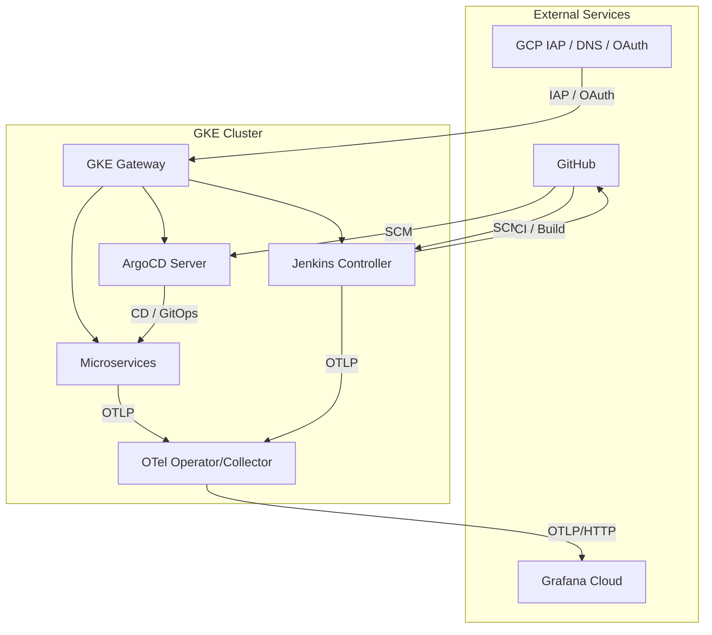

# Visual & Multimedia Repo Guide (via NotebookLM)

This repository's architecture and workflows have been analyzed by Google's NotebookLM to generate the following multimedia assets — infographics, videos, audio podcasts, and reference PDFs.

Files live in [`docs/notebooklm/en/`](./docs/notebooklm/en/) (English) and [`docs/notebooklm/es/`](./docs/notebooklm/es/) (Español). Numbering scheme: `01–09` infographics · `10–19` video · `20–29` audio · `30–39` PDF.

---

<details>
<summary><strong>Infographics — English (7)</strong></summary>

| # | Title | Preview |
|---|---|---|
| 01 | Modern Automation & Observability Architecture |  |
| 02 | Automated Cloud Platform Architecture |  |
| 03 | Secure Ingress & Identity Architecture |  |
| 04 | High Availability Database System |  |
| 05 | Observability Pipeline Diagram |  |
| 06 | Platform Automation Lifecycle |  |
| 07 | DevSecOps Pipeline Security Storyboard |  |

</details>

<details>
<summary><strong>Infografías — Español (5)</strong></summary>

| # | Título | Vista previa |
|---|---|---|
| 01 | Arquitectura de acceso seguro en la nube |  |
| 02 | Arquitectura de Datos de Próxima Generación |  |
| 03 | Ciclo de automatización de infraestructura |  |
| 04 | Flujo de señales de observabilidad |  |
| 05 | Proceso de Seguridad DevSecOps 2026 |  |

</details>

---

## Other Multimedia

### 🎬 Video — English
- **[10 · 2026 Golden Path IDP](./docs/notebooklm/en/10-2026-golden-path-idp.mp4)** — full walkthrough of the IDP golden path
- **[11 · GKE Golden Path IDP](./docs/notebooklm/en/11-gke-golden-path-idp.mp4)** — GKE-specific golden path demonstration

### 🎬 Vídeo — Español
- **[10 · IDP Golden Path en GKE](./docs/notebooklm/es/10-idp-golden-path-en-gke.mp4)** — demostración del golden path IDP en GKE

### 🎧 Audio — English
- **[20 · GKE Golden Path IDP Blueprint](./docs/notebooklm/en/20-gke-golden-path-idp-blueprint.m4a)** — podcast-style deep dive into the IDP blueprint

### 🎧 Audio — Español
- **[20 · Infraestructura autónoma con GKE y GitOps](./docs/notebooklm/es/20-infraestructura-autonoma-gke-gitops.m4a)** — episodio sobre automatización con GKE y GitOps

### 📄 Documents — English
- **[30 · GKE Golden Path IDP 2026 (PDF)](./docs/notebooklm/en/30-gke-golden-path-idp-2026.pdf)** — comprehensive reference document
- **[31 · GKE Golden Path IDP Operations Manual (PDF)](./docs/notebooklm/en/31-gke-golden-path-idp-operations-manual.pdf)** — operations and runbook guide
- **[32 · The 2026 GKE Golden Path (PDF)](./docs/notebooklm/en/32-the-2026-gke-golden-path.pdf)** — architectural overview PDF

---

# jenkins-2026

> **Two-repo GitOps setup.** This is the **infra repo** (cluster bootstrap, Jenkins, ArgoCD, observability). Image tags and ArgoCD manifests live in the companion **[`nubenetes/jenkins-2026-gitops-config`](https://github.com/nubenetes/jenkins-2026-gitops-config)** repo.

A self-contained proof of concept that deploys **Jenkins** on **Kubernetes**, configures it entirely through Configuration-as-Code + Job DSL ("pipelines as code"), and uses it to build, containerize, and deploy the JHipster microservices reference application. Configured specifically for **Google Kubernetes Engine (GKE)**, with full OpenTelemetry observability into Grafana Cloud, in-cluster OSS Grafana, Azure Managed Grafana, or Amazon Managed Grafana.

---

## Table of Contents

**[README — jenkins-2026](#jenkins-2026)**
- [1. Document Inventory](#1-document-inventory)
- [2. Quick Start](#2-quick-start)
- [3. Architecture Overview](#3-architecture-overview)
- [4. GitHub Actions Workflows](#4-github-actions-workflows)
- [5. Prerequisites](#5-prerequisites)

---

**[101 · GitHub Actions Workflows](./docs/101-GITHUB_ACTIONS_WORKFLOWS.md)**
- [Naming convention: `Y.X.ZZ`](./docs/101-GITHUB_ACTIONS_WORKFLOWS.md#naming-convention-yxzz)
  - [Phase × Step matrix](./docs/101-GITHUB_ACTIONS_WORKFLOWS.md#phase--step-matrix)
  - [Resource identifier (ZZ): constant across all phases](./docs/101-GITHUB_ACTIONS_WORKFLOWS.md#resource-identifier-zz-constant-across-all-phases)
- [Full workflow matrix](./docs/101-GITHUB_ACTIONS_WORKFLOWS.md#full-workflow-matrix)
- [Lifecycle diagram](./docs/101-GITHUB_ACTIONS_WORKFLOWS.md#lifecycle-diagram)
- [Day-0 / Day-1 / Day-2 operations](./docs/101-GITHUB_ACTIONS_WORKFLOWS.md#day-0--day-1--day-2-operations)
- [Complete workflow inventory — matrix table](./docs/101-GITHUB_ACTIONS_WORKFLOWS.md#complete-workflow-inventory--matrix-table)
- [Day2 ordering: tiers are categories, not stages](./docs/101-GITHUB_ACTIONS_WORKFLOWS.md#day2-ordering-tiers-are-categories-not-stages)
- [Are workflows auto-chained? Why not?](./docs/101-GITHUB_ACTIONS_WORKFLOWS.md#are-workflows-auto-chained-why-not)

**[102 · GitHub Actions Automation](./docs/102-GITHUB_ACTIONS_AUTOMATION.md)**
- [Bootstrapping Architecture: Persistent vs. Short-Lived Resources](./docs/102-GITHUB_ACTIONS_AUTOMATION.md#bootstrapping-architecture-persistent-vs-short-lived-resources)
- [Workflow Architecture & Lifecycle Diagram](./docs/102-GITHUB_ACTIONS_AUTOMATION.md#workflow-architecture--lifecycle-diagram)
  - [Detailed Workflow Reference and Lifecycle Management](./docs/102-GITHUB_ACTIONS_AUTOMATION.md#detailed-workflow-reference-and-lifecycle-management)
- [Version Pinning and the `git_ref` Parameter](./docs/102-GITHUB_ACTIONS_AUTOMATION.md#version-pinning-and-the-git_ref-parameter)
  - [The `git_ref` Parameter](./docs/102-GITHUB_ACTIONS_AUTOMATION.md#the-git_ref-parameter)
  - [Form Fields Reference (Day1.cluster.01 GKE Provision)](./docs/102-GITHUB_ACTIONS_AUTOMATION.md#form-fields-reference-0201-gke-provision)
  - [The Danger of Divergent References](./docs/102-GITHUB_ACTIONS_AUTOMATION.md#the-danger-of-divergent-references)
- [Environment Protection and Manual Approvals](./docs/102-GITHUB_ACTIONS_AUTOMATION.md#environment-protection-and-manual-approvals)
  - [Setting up Environment Rules](./docs/102-GITHUB_ACTIONS_AUTOMATION.md#setting-up-environment-rules)
- [One-time Setup (Bootstrapping)](./docs/102-GITHUB_ACTIONS_AUTOMATION.md#one-time-setup-bootstrapping)
- [Running the GKE Workflows](./docs/102-GITHUB_ACTIONS_AUTOMATION.md#running-the-gke-workflows)

---

**[103 · GitHub Secrets Inventory](./docs/103-GITHUB_SECRETS_INVENTORY.md)**
- [GCP / Core Infrastructure](./docs/103-GITHUB_SECRETS_INVENTORY.md#1-gcp--core-infrastructure)
- [Grafana Cloud](./docs/103-GITHUB_SECRETS_INVENTORY.md#2-grafana-cloud)
- [Grafana Alert Email (per-mode)](./docs/103-GITHUB_SECRETS_INVENTORY.md#3-grafana-alert-email)
- [Azure Managed Grafana](./docs/103-GITHUB_SECRETS_INVENTORY.md#4-azure-managed-grafana-managed-azure-mode)
- [AWS Managed Grafana](./docs/103-GITHUB_SECRETS_INVENTORY.md#5-aws-managed-grafana-managed-aws-mode)
- [Jenkins OIDC / Google Sign-In](./docs/103-GITHUB_SECRETS_INVENTORY.md#6-jenkins-oidc--google-sign-in)
- [Headlamp & IAP](./docs/103-GITHUB_SECRETS_INVENTORY.md#7-headlamp--identity-aware-proxy)
- [Private Registry & Git](./docs/103-GITHUB_SECRETS_INVENTORY.md#8-private-registry--git)
- [Summary table](./docs/103-GITHUB_SECRETS_INVENTORY.md#summary-table)

---

**[201 · Architecture](./docs/201-ARCHITECTURE.md)**
- [Overview](./docs/201-ARCHITECTURE.md#overview)
- [System Architecture](./docs/201-ARCHITECTURE.md#system-architecture)
- [Component Diagram](./docs/201-ARCHITECTURE.md#component-diagram)
- [Microservices & Database Architecture](./docs/201-ARCHITECTURE.md#microservices--database-architecture)
  - [Database Injection & Secrets](./docs/201-ARCHITECTURE.md#database-injection--secrets)
  - [CI/CD Flow (GitOps)](./docs/201-ARCHITECTURE.md#cicd-flow-gitops)
- [Configuration (`config/config.yaml`)](./docs/201-ARCHITECTURE.md#configuration-configconfigyaml)
- [Repository Layout](./docs/201-ARCHITECTURE.md#repository-layout)
- [GKE Cluster Topology & Sizing](./docs/201-ARCHITECTURE.md#gke-cluster-topology--sizing)
  - [Sizing Rationale](./docs/201-ARCHITECTURE.md#sizing-rationale)
  - [FinOps & Cost Analysis](./docs/201-ARCHITECTURE.md#finops--cost-analysis)

---

**[301 · Observability](./docs/301-OBSERVABILITY.md)**
- [Key Features](./docs/301-OBSERVABILITY.md#key-features)
- [OTel Components](./docs/301-OBSERVABILITY.md#otel-components)
  - [OpenTelemetry Operator](./docs/301-OBSERVABILITY.md#opentelemetry-operator)
  - [Java Auto-Instrumentation](./docs/301-OBSERVABILITY.md#java-auto-instrumentation)
  - [Angular RUM](./docs/301-OBSERVABILITY.md#angular-rum)
  - [OTel Collector](./docs/301-OBSERVABILITY.md#otel-collector)
  - [Jenkins Plugin](./docs/301-OBSERVABILITY.md#jenkins-plugin)
- [Telemetry Architecture and Signal Flow](./docs/301-OBSERVABILITY.md#telemetry-architecture-and-signal-flow)
- [Signal Correlation: Metrics, Traces, and Logs](./docs/301-OBSERVABILITY.md#signal-correlation-metrics-traces-and-logs)
- [Structured Logging Deep Dive](./docs/301-OBSERVABILITY.md#structured-logging-deep-dive)
  - [Log Levels](./docs/301-OBSERVABILITY.md#log-levels)
- [OTel Injection Race](./docs/301-OBSERVABILITY.md#otel-injection-race)
- [Observability Dashboards](./docs/301-OBSERVABILITY.md#observability-dashboards)
- [k6 Observability Smoke Test](./docs/301-OBSERVABILITY.md#k6-observability-smoke-test)
- [Grafana OSS In-Cluster Mode](./docs/301-OBSERVABILITY.md#grafana-oss-in-cluster-mode)
- [Observability Modes](./docs/301-OBSERVABILITY.md#observability-modes)
  - [Logging in to Amazon Managed Grafana (managed-aws)](./docs/301-OBSERVABILITY.md#logging-in-to-amazon-managed-grafana-managed-aws)
- Runbook: [Log Correlation Validation](./docs/runbooks/log-correlation-validation.md)

---

**[401 · Jenkins](./docs/401-JENKINS.md)**
- [Accessing the UI & Admin Password](./docs/401-JENKINS.md#accessing-the-ui--admin-password)
- [Google Login (OpenID Connect)](./docs/401-JENKINS.md#google-login-openid-connect)
- [Plugins & JCasC Fragments](./docs/401-JENKINS.md#plugins--jcasc-fragments)
- [Global Shared Library](./docs/401-JENKINS.md#global-shared-library)
- [GitOps: Jenkins as an ArgoCD Application](./docs/401-JENKINS.md#gitops-jenkins-as-an-argocd-application)

**[402 · Pipelines as Code](./docs/402-PIPELINES_AS_CODE.md)**
- [The Seed Job](./docs/402-PIPELINES_AS_CODE.md#the-seed-job)
- [Pipeline Branch & Environment Mapping](./docs/402-PIPELINES_AS_CODE.md#pipeline-branch--environment-mapping)
  - [Why the GitOps Repo Uses Only the `main` Branch](./docs/402-PIPELINES_AS_CODE.md#why-the-gitops-repo-uses-only-the-main-branch)
  - [Optional `develop` Tier (Feature Flag, Off by Default)](./docs/402-PIPELINES_AS_CODE.md#optional-develop-tier-feature-flag-off-by-default)
- [Architecture Diagram](./docs/402-PIPELINES_AS_CODE.md#architecture-diagram)
- [Detailed Pipeline Execution Stages](./docs/402-PIPELINES_AS_CODE.md#detailed-pipeline-execution-stages)
  - [1. Microservices Build & Deploy Pipeline](./docs/402-PIPELINES_AS_CODE.md#1-microservices-build--deploy-pipeline)
  - [2. k6 Integration Smoke Test Pipeline](./docs/402-PIPELINES_AS_CODE.md#2-k6-integration-smoke-test-pipeline)
- [Pipeline Container Security](./docs/402-PIPELINES_AS_CODE.md#pipeline-container-security)
- [Pipeline Reliability Fixes](./docs/402-PIPELINES_AS_CODE.md#pipeline-reliability-fixes-v0107v01016)

**[403 · Tekton (alternative CI engine)](./docs/403-TEKTON.md)**
- [Selecting the engine (`ci.engine`)](./docs/403-TEKTON.md#selecting-the-engine)
- [What gets installed (GitOps via ArgoCD app-of-apps)](./docs/403-TEKTON.md#what-gets-installed-gitops-via-argocd-app-of-apps)
- [Tooling: kustomize vs Helm (and why both)](./docs/403-TEKTON.md#tooling-kustomize-vs-helm-and-why-both)
- [Dashboard on the internet, behind Google IAP](./docs/403-TEKTON.md#dashboard-on-the-internet-behind-google-iap)
- [The pipeline, ported](./docs/403-TEKTON.md#the-pipeline-ported)
- [Pipelines-as-Code (PaC): Git-driven CI](./docs/403-TEKTON.md#pipelines-as-code-pac-git-driven-ci)

---

**[501 · Platform Operations](./docs/501-PLATFORM_OPERATIONS.md)**
- [ArgoCD Inventory (GitOps)](./docs/501-PLATFORM_OPERATIONS.md#argocd-inventory-gitops)
  - [Projects & Applications](./docs/501-PLATFORM_OPERATIONS.md#projects--applications)
  - [Security & Integration](./docs/501-PLATFORM_OPERATIONS.md#security--integration)
- [Telemetry Verification & Simulation](./docs/501-PLATFORM_OPERATIONS.md#telemetry-verification--simulation)
  - [1. Continuous Traffic Simulation (GitHub Actions)](./docs/501-PLATFORM_OPERATIONS.md#1-continuous-traffic-simulation-github-actions)
  - [2. On-Demand Smoke Test (Jenkins)](./docs/501-PLATFORM_OPERATIONS.md#2-on-demand-smoke-test-jenkins)
  - [3. How to Verify Correlation in Grafana](./docs/501-PLATFORM_OPERATIONS.md#3-how-to-verify-correlation-in-grafana)
- [Platform QA, Chaos & Compliance Validation](./docs/501-PLATFORM_OPERATIONS.md#platform-qa-chaos--compliance-validation)
  - [1. Automated Compliance Validation Gate](./docs/501-PLATFORM_OPERATIONS.md#1-automated-compliance-validation-gate)
  - [2. Platform Verification & Stress-Test Playbooks](./docs/501-PLATFORM_OPERATIONS.md#2-platform-verification--stress-test-playbooks)
- [Golden Path IDP Modernizations (K8s v1.35/v1.36 & Karpenter)](./docs/501-PLATFORM_OPERATIONS.md#golden-path-idp-modernizations-k8s-v135v136--karpenter)
  - [1. Kubernetes v1.35/v1.36 Compliance](./docs/501-PLATFORM_OPERATIONS.md#1-kubernetes-v135v136-compliance)
  - [2. Elastic Karpenter Autoscaling (v1.0+)](./docs/501-PLATFORM_OPERATIONS.md#2-elastic-karpenter-autoscaling-v10)
  - [3. Zero-Trust Security & Workload Identity](./docs/501-PLATFORM_OPERATIONS.md#3-zero-trust-security--workload-identity)
  - [4. GitOps Separation of Concerns](./docs/501-PLATFORM_OPERATIONS.md#4-gitops-separation-of-concerns)
  - [5. Build Performance & High Availability Caching](./docs/501-PLATFORM_OPERATIONS.md#5-build-performance--high-availability-caching)
- [Headlamp (Cluster Management UI)](./docs/501-PLATFORM_OPERATIONS.md#headlamp-cluster-management-ui)
  - [One-time Setup: Google OAuth Client](./docs/501-PLATFORM_OPERATIONS.md#one-time-setup-google-oauth-client)
  - [Adding Your Identity](./docs/501-PLATFORM_OPERATIONS.md#adding-your-identity)
  - [Accessing the UI](./docs/501-PLATFORM_OPERATIONS.md#accessing-the-ui)
- [Public Access (GKE Gateway API + IAP)](./docs/501-PLATFORM_OPERATIONS.md#public-access-gke-gateway-api--iap)
  - [Authentication & Authorization Matrix](./docs/501-PLATFORM_OPERATIONS.md#authentication--authorization-matrix)
  - [One-time Setup](./docs/501-PLATFORM_OPERATIONS.md#one-time-setup)
  - [Troubleshooting: Load Balancer Propagation Delay](./docs/501-PLATFORM_OPERATIONS.md#troubleshooting-load-balancer-propagation-delay)

**[502 · Microservices GitOps](./docs/502-MICROSERVICES_GITOPS.md)**
- [GitOps Design Decision: Helm vs. Kustomize](./docs/502-MICROSERVICES_GITOPS.md#gitops-design-decision-helm-vs-kustomize)
  - [Overview](./docs/502-MICROSERVICES_GITOPS.md#overview)
  - [Side-by-Side Comparison](./docs/502-MICROSERVICES_GITOPS.md#side-by-side-comparison)
  - [Technical Rationale & Mechanics](./docs/502-MICROSERVICES_GITOPS.md#technical-rationale--mechanics)
- [Design Decision: Resource Lifecycle & Decommission Orchestration](./docs/502-MICROSERVICES_GITOPS.md#design-decision-resource-lifecycle--decommission-orchestration)
  - [The Problem: Asynchronous Background Deletion](./docs/502-MICROSERVICES_GITOPS.md#the-problem-asynchronous-background-deletion)
  - [Side-by-Side Comparison of Solutions](./docs/502-MICROSERVICES_GITOPS.md#side-by-side-comparison-of-solutions)
- [pgAdmin & Database Administration](./docs/502-MICROSERVICES_GITOPS.md#pgadmin--database-administration)
  - [SRE Break-Glass CLI (Connecting as Superuser)](./docs/502-MICROSERVICES_GITOPS.md#sre-break-glass-cli-connecting-as-superuser)

---

**[601 · DevSecOps](./docs/601-DEVSECOPS.md)**
- [Pipeline Lifecycle](./docs/601-DEVSECOPS.md#pipeline-lifecycle)
- [Integrated Security Tools](./docs/601-DEVSECOPS.md#integrated-security-tools)
  - [1. Semgrep (Lightweight SAST / Custom Rules)](./docs/601-DEVSECOPS.md#1-semgrep-lightweight-sast--custom-rules)
  - [2. CodeQL (Deep SAST / Semantic Analysis)](./docs/601-DEVSECOPS.md#2-codeql-deep-sast--semantic-analysis)
  - [3. Trivy (Vulnerability and Misconfiguration Scanning)](./docs/601-DEVSECOPS.md#3-trivy-vulnerability-and-misconfiguration-scanning)
  - [4. Jenkins `warnings-ng` Plugin Integration (SARIF Visualizer)](./docs/601-DEVSECOPS.md#4-jenkins-warnings-ng-plugin-integration-sarif-visualizer)

---

**[901 · Local Development](./docs/901-LOCAL_DEVELOPMENT.md)**
- [Prerequisites](./docs/901-LOCAL_DEVELOPMENT.md#prerequisites)
- [Quick Start](./docs/901-LOCAL_DEVELOPMENT.md#quick-start)
- [Step-by-Step Deployment Guide](./docs/901-LOCAL_DEVELOPMENT.md#step-by-step-deployment-guide-for-other-people)
  - [Step 1: Fork and Clone the Repositories](./docs/901-LOCAL_DEVELOPMENT.md#step-1-fork-and-clone-the-repositories)
  - [Step 2: Configure Repository Targets](./docs/901-LOCAL_DEVELOPMENT.md#step-2-configure-repository-targets)
  - [Step 3: Configure GKE / OAuth Credentials](./docs/901-LOCAL_DEVELOPMENT.md#step-3-configure-gke--oauth-credentials-optional)
  - [Step 4: Add GitHub Repository Secrets](./docs/901-LOCAL_DEVELOPMENT.md#step-4-add-github-repository-secrets)
  - [Step 5: Set Up Grafana Cloud Stack](./docs/901-LOCAL_DEVELOPMENT.md#step-5-optional-set-up-grafana-cloud-stack)
  - [Step 6: Deploy the Stack](./docs/901-LOCAL_DEVELOPMENT.md#step-6-deploy-the-stack)
  - [Step 7: Run Jenkins Pipelines & Verify](./docs/901-LOCAL_DEVELOPMENT.md#step-7-run-jenkins-pipelines--verify)
- [Automated End-to-End Test](./docs/901-LOCAL_DEVELOPMENT.md#automated-end-to-end-test-provisioning--decommissioning)
  - [Running It](./docs/901-LOCAL_DEVELOPMENT.md#running-it)
  - [Prerequisites for e2e](./docs/901-LOCAL_DEVELOPMENT.md#prerequisites-for-e2e)
  - [Resource Quotas & QoS (Cost Control)](./docs/901-LOCAL_DEVELOPMENT.md#resource-quotas--qos-cost-control)
  - [Terraform Version & Stacks](./docs/901-LOCAL_DEVELOPMENT.md#terraform-version--stacks)

**[902 · Troubleshooting](./docs/902-TROUBLESHOOTING.md)**
- [Common Issues](./docs/902-TROUBLESHOOTING.md#common-issues)
- [ArgoCD OIDC Issues](./docs/902-TROUBLESHOOTING.md#argocd-oidc-issues)
- [Terraform & CI Issues](./docs/902-TROUBLESHOOTING.md#terraform--ci-issues)
- [Jenkins & GitOps Push Issues](./docs/902-TROUBLESHOOTING.md#jenkins--gitops-push-issues)

---

**[Runbooks](./docs/runbooks/)**
- [Log Correlation Validation](./docs/runbooks/log-correlation-validation.md) — step-by-step procedure to validate logs ↔ metrics ↔ traces correlation end-to-end (enable DEBUG logging, restart pods, generate traffic, verify in Grafana)
  - [Background](./docs/runbooks/log-correlation-validation.md#background)
  - [0. Context](./docs/runbooks/log-correlation-validation.md#0-context)
  - [1. Land the change — sync ArgoCD](./docs/runbooks/log-correlation-validation.md#1-land-the-change--sync-argocd)
  - [2. Verify the ConfigMap carries the DEBUG logger](./docs/runbooks/log-correlation-validation.md#2-verify-the-configmap-carries-the-debug-logger)
  - [3. Restart pods so they re-read the ConfigMap](./docs/runbooks/log-correlation-validation.md#3-️-restart-pods-so-they-re-read-the-configmap)
  - [4. Generate traffic](./docs/runbooks/log-correlation-validation.md#4-generate-traffic)
  - [5. Pod-level proof: DEBUG lines carry `trace_id`](./docs/runbooks/log-correlation-validation.md#5-pod-level-proof-debug-lines-carry-trace_id)
  - [6. Grafana — prove both correlation directions](./docs/runbooks/log-correlation-validation.md#6-grafana--prove-both-correlation-directions)
  - [Rollback](./docs/runbooks/log-correlation-validation.md#rollback)
  - [Gotchas](./docs/runbooks/log-correlation-validation.md#gotchas-why-panels-can-look-empty-without-anything-being-broken)


## 1. Document Inventory

| Code | Category | Document | Description |
| :--- | :--- | :--- | :--- |
| **101** | CI/CD Workflows | [GitHub Actions Workflows](./docs/101-GITHUB_ACTIONS_WORKFLOWS.md) | `Y.X.ZZ` naming scheme, lifecycle phases, Phase×Step matrix, ZZ resource identity, full workflow matrix with clickable GitHub Actions links, lifecycle Mermaid diagram, complete 15-row numbered inventory |
| **102** | CI/CD Workflows | [GitHub Actions Automation](./docs/102-GITHUB_ACTIONS_AUTOMATION.md) | WIF setup, GitHub secrets reference, bootstrapping architecture, persistent vs. short-lived resources, `git_ref` parameter, environment protection / manual approvals |
| **201** | Architecture | [Architecture](./docs/201-ARCHITECTURE.md) | System architecture, component diagram, microservices & database architecture (CNPG), CI/CD flow, configuration (`config/config.yaml`), repository layout, GKE cluster topology, FinOps & cost analysis |
| **301** | Observability | [Observability](./docs/301-OBSERVABILITY.md) | OTel components (Operator, Java agent, Angular RUM, Collector), telemetry architecture, signal correlation (metrics↔traces↔logs), structured logging, dashboards, k6 smoke test, OSS in-cluster mode, all four observability modes |
| **401** | Jenkins | [Jenkins](./docs/401-JENKINS.md) | Accessing the UI & admin password, Google OIDC login, plugins & JCasC fragments, global shared library, MCP server |
| **402** | Pipelines | [Pipelines as Code](./docs/402-PIPELINES_AS_CODE.md) | Seed job, pipeline branch & environment mapping, optional `develop` tier, pipeline execution stages (Semgrep/CodeQL/Trivy/Build/Deploy/Smoke), pipeline container security, reliability fixes |
| **403** | Tekton | [Tekton](./docs/403-TEKTON.md) | Alternative CI engine (`ci.engine` flag), Tekton Pipelines/Triggers/Dashboard, IAP-protected Dashboard, the microservices pipeline ported to `tekton/`, credentials & observability parity |
| **501** | Platform | [Platform Operations](./docs/501-PLATFORM_OPERATIONS.md) | ArgoCD inventory, telemetry simulation, platform QA & chaos scenarios, Golden Path IDP modernizations (K8s v1.35/v1.36, Karpenter), Headlamp cluster UI, GKE Gateway API + IAP public access |
| **502** | Microservices | [Microservices GitOps](./docs/502-MICROSERVICES_GITOPS.md) | Helm vs. Kustomize design decision, resource lifecycle & decommission orchestration (NEG synchronization barrier), pgAdmin & database administration |
| **601** | Security | [DevSecOps](./docs/601-DEVSECOPS.md) | Semgrep SAST, CodeQL deep SAST, Trivy IaC + image scanning, `warnings-ng` plugin SARIF dashboards in Jenkins |
| **901** | Reference | [Local Development](./docs/901-LOCAL_DEVELOPMENT.md) | Prerequisites, quick start, step-by-step deployment guide, automated e2e test (`test/e2e.sh`), resource quotas & QoS, Terraform version |
| **902** | Reference | [Troubleshooting](./docs/902-TROUBLESHOOTING.md) | Common issues, ArgoCD OIDC, Terraform & CI, Jenkins & GitOps push authentication failures |

---

## 2. Quick Start

```bash
# 1. Review/edit config/config.yaml — observability.mode (grafana-cloud|oss|managed-azure|managed-aws)
#    and ci.engine (jenkins default | tekton; override JENKINS2026_CI_ENGINE — see docs/403-TEKTON.md)
# 2. (grafana-cloud mode only) Create the OTLP credentials secret:
cp observability/otel-collector/secret.example.yaml observability/otel-collector/secret.yaml
kubectl create namespace observability --dry-run=client -o yaml | kubectl apply -f -
kubectl apply -f observability/otel-collector/secret.yaml
# 3. Provision everything:
./scripts/up.sh
# 4. Check status / get port-forward commands:
./scripts/status.sh
```

See [901. Local Development](./docs/901-LOCAL_DEVELOPMENT.md) for the full step-by-step guide.

---

## 3. Architecture Overview



For the full component diagram, microservices database architecture (CloudNative-PG HA), and CI/CD flow see [201. Architecture](./docs/201-ARCHITECTURE.md).

---

## 4. GitHub Actions Workflows

All 19 workflows live in [`.github/workflows/`](.github/workflows/) following the `DayN.tier.ZZ-resource` naming convention — **alphabetical sort order = correct execution order** for the **Create** (`Day0`→`Day1`) and **Decom** phases. Within **Day2** the tiers (`redeploy`/`publish`/`traffic`) are independent **categories**, not an ordered sequence — each workflow is idempotent and dispatched on its own ([why](./docs/101-GITHUB_ACTIONS_WORKFLOWS.md#day2-ordering-tiers-are-categories-not-stages)). See [101. GitHub Actions Workflows](./docs/101-GITHUB_ACTIONS_WORKFLOWS.md) for the full inventory with clickable GitHub Actions links.

| Phase | tier | Resource | Workflow |
|---|---|---|---|
| `Day0` Create | `infra` (persistent) | Gateway, Grafana Cloud, Azure, AWS | [Day0.infra.01](https://github.com/nubenetes/jenkins-2026/actions/workflows/Day0.infra.01-gateway.yml) · [Day0.infra.02](https://github.com/nubenetes/jenkins-2026/actions/workflows/Day0.infra.02-grafana-cloud.yml) · [Day0.infra.03](https://github.com/nubenetes/jenkins-2026/actions/workflows/Day0.infra.03-azure-grafana.yml) · [Day0.infra.04](https://github.com/nubenetes/jenkins-2026/actions/workflows/Day0.infra.04-aws-grafana.yml) |
| `Day1` Create | `cluster` | GKE cluster + full stack | [Day1.cluster.01](https://github.com/nubenetes/jenkins-2026/actions/workflows/Day1.cluster.01-gke.yml) |
| `Day2` Update | `redeploy` | ArgoCD, Jenkins, Tekton, Headlamp | [Day2.redeploy.01](https://github.com/nubenetes/jenkins-2026/actions/workflows/Day2.redeploy.01-argocd.yml) · [Day2.redeploy.02](https://github.com/nubenetes/jenkins-2026/actions/workflows/Day2.redeploy.02-jenkins.yml) · [Day2.redeploy.03](https://github.com/nubenetes/jenkins-2026/actions/workflows/Day2.redeploy.03-tekton.yml) · [Day2.redeploy.04](https://github.com/nubenetes/jenkins-2026/actions/workflows/Day2.redeploy.04-headlamp.yml) |
| `Day2` Update | `publish` | OSS Grafana, Azure/AWS dashboards, Grafana alerts | [Day2.publish.01](https://github.com/nubenetes/jenkins-2026/actions/workflows/Day2.publish.01-oss-grafana.yml) · [Day2.publish.03](https://github.com/nubenetes/jenkins-2026/actions/workflows/Day2.publish.03-azure-grafana.yml) · [Day2.publish.04](https://github.com/nubenetes/jenkins-2026/actions/workflows/Day2.publish.04-aws-grafana.yml) · [Day2.publish.05](https://github.com/nubenetes/jenkins-2026/actions/workflows/Day2.publish.05-alerts.yml) |
| `Day2` Update | `traffic` | k6 traffic | [Day2.traffic.01](https://github.com/nubenetes/jenkins-2026/actions/workflows/Day2.traffic.01-k6.yml) |
| `Decom` Destroy | `cluster` (first) | GKE cluster (destroy first) | [Decom.cluster.01](https://github.com/nubenetes/jenkins-2026/actions/workflows/Decom.cluster.01-gke.yml) |
| `Decom` Destroy | `infra` (last) | Gateway, Grafana Cloud, Azure, AWS (destroy last) | [Decom.infra.01](https://github.com/nubenetes/jenkins-2026/actions/workflows/Decom.infra.01-gateway.yml) · [Decom.infra.02](https://github.com/nubenetes/jenkins-2026/actions/workflows/Decom.infra.02-grafana-cloud.yml) · [Decom.infra.03](https://github.com/nubenetes/jenkins-2026/actions/workflows/Decom.infra.03-azure-grafana.yml) · [Decom.infra.04](https://github.com/nubenetes/jenkins-2026/actions/workflows/Decom.infra.04-aws-grafana.yml) |

> **Applying changes = re-run, not Decom.** `Day1.cluster.01` is **idempotent**:
> re-run it on an already-provisioned cluster and it converges in place
> (`terraform apply` no-ops when the cluster is already in state; `up.sh`
> re-applies every step; ArgoCD re-syncs from git). You do **not** need to
> decommission to pick up a change. For a CI-engine-only change, the lighter
> `Day2.redeploy.02-jenkins` / `Day2.redeploy.03-tekton` redeploys also converge
> in place (they re-run `09-gateway` too). `Decom.cluster.01` is only for tearing
> the cluster down when you're done, to stop charges.

---

## 5. Prerequisites

- An existing GKE Kubernetes cluster (`kubectl` context pointing at it).
- `kubectl`, `helm` (v3), [`yq`](https://github.com/mikefarah/yq) (Go version), `git`, `bash`.
- A container registry you can push to (default: `ghcr.io/nubenetes/jenkins-2026-microservices`).
- (default mode) A [Grafana Cloud](https://grafana.com/products/cloud/) stack (free tier) for its OTLP gateway endpoint + API key.

See [901. Local Development](./docs/901-LOCAL_DEVELOPMENT.md) for the complete prerequisites and step-by-step deployment guide.

---

## License

[MIT](LICENSE) © 2026 Nubenetes
