# Visual & Multimedia Repo Guide (via NotebookLM)

This repository's architecture and workflows have been analyzed by Google's NotebookLM to generate the following multimedia assets. They offer a comprehensive visual and auditory guide to the system's design and operation.

## Infographic: Modern Automation & Observability Architecture

This infographic provides a high-level overview of the entire system, from the GitOps workflow to the observability stack. It's the best place to start for a quick understanding of how all the pieces fit together.


## Multimedia Explanations

For a deeper dive, explore these resources. They are categorized by media type for your convenience.

### 🎬 Video

*   **[Jenkins 2026 Proof of Concept (English)](./docs/notebooklm/Jenkins-2026_PoC.mp4)**: A video demonstration of the proof of concept, walking through the key features and functionalities of the Jenkins setup.
*   **[Fábrica DevOps jenkins-2026 (Español)](./docs/notebooklm/es/Fabrica_DevOps_jenkins-2026_Spanish.mp4)**: Una demostración en video de la prueba de concepto, recorriendo las características y funcionalidades clave de la configuración de Jenkins.

### 📄 Document

*   **[Jenkins GitOps Reimagined (PDF)](./docs/notebooklm/Jenkins_GitOps_Reimagined.pdf)**: A detailed PDF document that explores the reimagined GitOps workflow, covering the core concepts and implementation details.

### 🖼️ Image

*   **[Modern Automation and Observability Architecture (JPG)](./docs/notebooklm/Modern_Automation_and_Observability_Architecture.jpg)**: The full-size infographic image, ideal for presentations or closer inspection.

### 🎧 Audio

*   **[Twenty Cent Ephemeral GitOps in 2026 (English)](./docs/notebooklm/Twenty_cent_ephemeral_GitOps_in_2026.m4a)**: An audio recording discussing the concept of "twenty-cent ephemeral GitOps," likely covering the cost-effective and transient nature of the infrastructure setup.
*   **[Infraestructura completa por veinte céntimos (Español)](./docs/notebooklm/es/Infraestructura_completa_por_veinte_céntimos_Spanish.m4a)**: Una grabación de audio que analiza el concepto de "GitOps efímero de veinte céntimos", cubriendo la naturaleza rentable y transitoria de la configuración de la infraestructura.

> [!IMPORTANT]
> ### PostgreSQL Operator: CloudNative-PG (CNPG), not CrunchyData PGO
>
> The multimedia assets above (video, audio, PDF, and infographic) were generated
> by **Google NotebookLM** after the project had already migrated to
> **[CloudNative-PG (CNPG)](https://cloudnative-pg.io/)**. However, NotebookLM
> did not pick up this change and **incorrectly references CrunchyData PGO** in
> the generated media.
>
> **The current codebase uses CloudNative-PG (CNPG) — not CrunchyData PGO.**
> PostgreSQL 18 HA clusters (1 Primary + 2 Replicas) are provisioned via the
> CNPG `Cluster` CRD, with PgBouncer connection pooling and Barman-based cloud
> backups — all managed through ArgoCD. See the
> [`cnpg-app.yaml`](argocd/cnpg-app.yaml) application and the
> [companion GitOps repo](https://github.com/nubenetes/jenkins-2026-gitops-config)
> for the authoritative configuration.

---

# jenkins-2026

> **Two-repo GitOps setup.** This is the **infra repo** (cluster bootstrap, Jenkins, ArgoCD, observability). Image tags and ArgoCD manifests live in the companion **[`nubenetes/jenkins-2026-gitops-config`](https://github.com/nubenetes/jenkins-2026-gitops-config)** repo — see its [README](https://github.com/nubenetes/jenkins-2026-gitops-config#readme) for the Helm chart layout, values schema, branch strategy, and Postgres details.

A self-contained proof of concept that deploys **Jenkins** (via
[jenkinsci/helm-charts](https://github.com/jenkinsci/helm-charts)) on
**Kubernetes**, configures it entirely through Configuration-as-Code +
Job DSL ("pipelines as code"), and uses it to build, containerize and deploy the
JHipster microservices reference application.

- **Unified Pipeline Model**: A single set of stable pipelines (`gateway`, `jhipstersamplemicroservice`, and `microservices-k6-smoke` at the root, all visible in the **microservices** view) tracks and builds the microservices. They deploy directly to the `microservices` namespace and update the `main` branch of the companion GitOps config repository. The legacy develop environment and sandbox components have been pruned.

- **Hardened Pipeline Agent Security**: All Jenkins pipeline agent containers run with `allowPrivilegeEscalation: false`. The `git` (`alpine/git`) and `helm` (`alpine/k8s`) containers run as `runAsUser: 1000` (non-root) with `HOME=/tmp`. Containers that legitimately require root are explicitly documented: `docker` (DinD daemon) and `codeql` (requires `apt-get`). See [Pipeline Container Security](#pipeline-container-security) for the full matrix.

- **Observability (Grafana Cloud / OSS)**: Traces, metrics and logs are fully correlated. Dashboard deployment is managed via the native **`gcx` CLI** using a GitOps workflow.
- **ArgoCD (GitOps)**: The entire Microservices stack is managed via **ArgoCD**, providing a declarative GitOps engine for continuous delivery. It is integrated with Google OIDC for secure, single sign-on access.
- **CloudNative-PG Operator (CNPG)**: Managed natively by ArgoCD
  via the [`cnpg-app.yaml`](argocd/cnpg-app.yaml) application. For each microservice,
  the Helm chart dynamically provisions a dedicated `Cluster` CRD. The Operator
  automatically spins up a highly available (HA) PostgreSQL 18 database with a 3-instance topology
  (1 Primary, 2 Replicas), separates database storage from write-ahead logs (`walStorage`),
  and utilizes native Barman-based Cloud backups. Connection credentials are auto-generated
  and securely injected into the application pods, while traffic is routed through a declarative PgBouncer `Pooler`.


It is configured specifically for **Google Kubernetes Engine (GKE)**.


See [`docs/architecture.md`](docs/architecture.md) for the full component
diagram and repository layout, [`docs/pipelines-as-code.md`](docs/pipelines-as-code.md)
for how the Jenkins pipelines are generated, and [`docs/observability.md`](docs/observability.md)
for the OpenTelemetry/Grafana wiring.

## Table of Contents

- [Prerequisites](#prerequisites)
- [Quick start](#quick-start)
- [Step-by-Step Deployment Guide (For Other People)](#step-by-step-deployment-guide-for-other-people)
  - [Step 1: Fork and Clone the Repositories](#step-1-fork-and-clone-the-repositories)
  - [Step 2: Configure Repository Targets](#step-2-configure-repository-targets)
  - [Step 3: Configure GKE / OAuth Credentials (Optional)](#step-3-configure-gke--oauth-credentials-optional)
  - [Step 4: Add GitHub Repository Secrets](#step-4-add-github-repository-secrets)
  - [Step 5: (Optional) Set up Grafana Cloud Stack](#step-5-optional-set-up-grafana-cloud-stack)
  - [Step 6: Deploy the Stack](#step-6-deploy-the-stack)
  - [Step 7: Run Jenkins Pipelines & Verify](#step-7-run-jenkins-pipelines--verify)
- [Architecture & Flow](#architecture--flow)
  - [System Architecture](#system-architecture)
  - [Microservices & Database Architecture](#microservices--database-architecture)
    - [Architecture & Data Flow Diagram](#architecture--data-flow-diagram)
    - [Database Injection & Secrets](#database-injection--secrets)
    - [pgAdmin & Database Administration](#pgadmin--database-administration)
      - [Automated pgAdmin Authentication Flow](#automated-pgadmin-authentication-flow)
      - [Retrieving Database Credentials (Optional / CLI Tools)](#retrieving-database-credentials-optional--cli-tools)
  - [CI/CD Flow (GitOps)](#cicd-flow-gitops)
- [Golden Path IDP Modernizations (K8s v1.35/v1.36 & Karpenter)](#golden-path-idp-modernizations-k8s-v135v136--karpenter)
- [ArgoCD Inventory (GitOps)](#argocd-inventory-gitops)
  - [Projects & Applications](#projects--applications)
  - [Security & Integration](#security--integration)
- [Telemetry Verification & Simulation](#telemetry-verification--simulation)
  - [1. Continuous Traffic Simulation (GitHub Actions)](#1-continuous-traffic-simulation-github-actions)
    - [Grafana Cloud Integration (GitHub Actions)](#grafana-cloud-integration-github-actions)
  - [2. On-Demand Smoke Test (Jenkins)](#2-on-demand-smoke-test-jenkins)
  - [3. How to Verify Correlation in Grafana](#3-how-to-verify-correlation-in-grafana)
- [Platform QA, Chaos & Compliance Validation](#platform-qa-chaos--compliance-validation)
- [Configuration (`config/config.yaml`)](#configuration-configconfigyaml)
- [Repository layout](#repository-layout)
- [Jenkins UI, plugins & MCP](#jenkins-ui-plugins--mcp)
  - [Accessing the UI & admin password](#accessing-the-ui--admin-password)
  - [Google login (OpenID Connect)](#google-login-openid-connect)
- [Pipelines as code](#pipelines-as-code)
  - [Pipeline Branch & Environment Mapping](#pipeline-branch--environment-mapping)
    - [Why the GitOps Repo Uses Only the `main` Branch](#why-the-gitops-repo-uses-only-the-main-branch)
    - [Would a `develop` branch make sense?](#would-a-develop-branch-make-sense)
  - [Architecture Diagram](#architecture-diagram)
  - [Pipeline Container Security](#pipeline-container-security)
  - [Pipeline Reliability Fixes (v0.10.7–v0.10.16)](#pipeline-reliability-fixes-v0107v01016)
- [Observability](#observability)
  - [Key Features](#key-features)
  - [k6 observability smoke test](#k6-observability-smoke-test)
  - [Telemetry Architecture and Signal Flow](#telemetry-architecture-and-signal-flow)
  - [Signal Correlation: Metrics, Traces and Logs](#signal-correlation-metrics-traces-and-logs)
  - [Structured Logging Deep Dive](#structured-logging-deep-dive)
  - [Observability Dashboards](#observability-dashboards)
  - [Grafana OSS In-Cluster Mode](#grafana-oss-in-cluster-mode)
  - [Logging in to Amazon Managed Grafana (managed-aws)](#logging-in-to-amazon-managed-grafana-managed-aws)
- [Headlamp (cluster management UI)](#headlamp-cluster-management-ui)
  - [One-time setup: Google OAuth client (currently unused)](#one-time-setup-google-oauth-client-currently-unused)
  - [Adding your (or another) identity](#adding-your-or-another-identity)
  - [Accessing and Logging in to the UI](#accessing-and-logging-in-to-the-ui)
    - [Option A: Log in with your Google ID (Recommended for GKE)](#option-a-log-in-with-your-google-id-recommended-for-gke)
    - [Option B: Log in with a ServiceAccount Token](#option-b-log-in-with-a-serviceaccount-token)
    - [Why IAP-Gated Access + Token Login over Native App-Level OIDC?](#why-iap-gated-access--token-login-over-native-app-level-oidc)
- [Public access (GKE Gateway API + IAP)](#public-access-gke-gateway-api--iap)
  - [Authentication & Authorization Matrix](#authentication--authorization-matrix)
  - [One-time setup](#one-time-setup)
- [Automated end-to-end test (provisioning + decommissioning)](#automated-end-to-end-test-provisioning--decommissioning)
  - [Running it](#running-it)
  - [Prerequisites](#prerequisites-1)
  - [GKE Cluster Topology & Sizing Rationale](#gke-cluster-topology--sizing-rationale)
    - [Detailed Infrastructure Specifications](#detailed-infrastructure-specifications)
    - [Sizing Rationale (Stability vs. Resource Limits)](#sizing-rationale-stability-vs-resource-limits)
  - [FinOps & Cost Analysis](#finops--cost-analysis)
  - [Resource Quotas & QoS (Cost Control)](#resource-quotas--qos-cost-control)
  - [Terraform version & Stacks](#terraform-version--stacks)
- [CI/CD pipelines](#cicd-pipelines)
- [GitHub Actions automation](#github-actions-automation)
  - [Bootstrapping Architecture: Persistent vs. Short-Lived Resources](#bootstrapping-architecture-persistent-vs-short-lived-resources)
  - [Workflow Architecture & Lifecycle Diagram](#workflow-architecture--lifecycle-diagram)
    - [Detailed Workflow Reference and Lifecycle Management](#detailed-workflow-reference-and-lifecycle-management)
      - [1. Persistent Bootstrap Workflows](#1-persistent-bootstrap-workflows)
      - [2. Persistent Decommission Workflows (Clean Slate)](#2-persistent-decommission-workflows-clean-slate)
  - [One-time setup](#one-time-setup-1)
  - [Running it](#running-it-1)
- [Troubleshooting](#troubleshooting)
- [License](#license)

## Prerequisites

- An existing GKE Kubernetes cluster and a `kubectl` context pointing at it. **This repo provisions no
  cluster infrastructure.**
- `kubectl`, `helm` (v3), [`yq`](https://github.com/mikefarah/yq) (Go
  version, `mikefarah/yq`), `git`, `bash`. `gh` (GitHub CLI) only if you plan
  to push this repo yourself.
- Cluster permissions to create namespaces, RBAC, CRDs (OpenTelemetry
  Operator) and the workloads described below.
- A container registry you can push to (default:
  `ghcr.io/nubenetes/jenkins-2026-microservices` - works anonymously for pulls;
  pushing needs a token with `write:packages` in the `jenkins-credentials`
  Secret, see below).
- **ArgoCD OIDC Redirect URI**: To use Google OIDC with ArgoCD, you MUST add
  `https://argocd.<baseDomain>/api/dex/callback` to your Google OAuth client's
  **Authorized redirect URIs** (see [ArgoCD OIDC](#argocd-google-oidc) below).
- (default observability mode) A [Grafana Cloud](https://grafana.com/products/cloud/)
  stack (free tier is enough) for its OTLP gateway endpoint + API key.

## Quick start

```bash
# 1. Review/edit config/config.yaml - observability.mode (grafana-cloud|oss|managed-azure|managed-aws).
#    Default: grafana-cloud.

# 2. (grafana-cloud mode only) create the OTLP credentials secret:
cp observability/otel-collector/secret.example.yaml observability/otel-collector/secret.yaml
#    edit secret.yaml with your Grafana Cloud OTLP endpoint + base64(instanceID:apiKey),
#    then:
kubectl create namespace observability --dry-run=client -o yaml | kubectl apply -f -
kubectl apply -f observability/otel-collector/secret.yaml

# 3. (optional) export registry/git credentials consumed by scripts/01-namespaces.sh -
#    REGISTRY_USERNAME/REGISTRY_PASSWORD become both the Jenkins "container-registry"
#    push credential and the "ghcr-credentials" imagePullSecret in every Microservices
#    namespace (needed if MICROSERVICES_REGISTRY packages are private, the GHCR default)
export REGISTRY_USERNAME=<github-username> REGISTRY_PASSWORD=<ghcr-token>
export GIT_USERNAME=<github-username>      GIT_TOKEN=<github-token>

# 4. provision everything
./scripts/up.sh

# 5. check status / get port-forward commands
./scripts/status.sh

# tear down (namespaces kept by default; see scripts/down.sh)
./scripts/down.sh
```

`scripts/up.sh` runs, in order: prereq/repo checks -> namespaces & secrets ->
the OpenTelemetry Operator -> (in parallel) the observability stack, Jenkins,
and the initial Microservices Helm releases -> triggers the Jenkins seed job ->
imports Grafana dashboards -> **installs ArgoCD**. Every step is idempotent
(`helm upgrade --install` / `kubectl apply`), so re-running `up.sh` after a
partial failure is safe. Each step also runs standalone:
`./scripts/0N-*.sh`.

## Step-by-Step Deployment Guide (For Other People)

This guide walks through deploying the entire POC (Infrastructure, Jenkins pipelines-as-code, ArgoCD GitOps, and Observability stack) from scratch on your own GKE cluster.

### Step 1: Fork and Clone the Repositories
Since this is a two-repo GitOps setup, you must fork both repositories to your own GitHub organization or account:
1. Fork and clone **[`jenkins-2026`](https://github.com/nubenetes/jenkins-2026)** (this infrastructure repository).
2. Fork and clone **[`jenkins-2026-gitops-config`](https://github.com/nubenetes/jenkins-2026-gitops-config)** (the GitOps config repository).

### Step 2: Configure Repository Targets
Update the repository reference URLs in `config/config.yaml` to point to your forks:
*   Open [`config/config.yaml`](config/config.yaml) in your local clone of the infra repo.
*   Edit `jenkins.selfRepoUrl` to point to your fork of `jenkins-2026` (e.g., `https://github.com/YOUR_ORG/jenkins-2026.git`).
*   Edit `microservices.git.org` to match your GitHub organization or username.
*   Commit and push this change to your infra repo fork.

### Step 3: Configure GKE / OAuth Credentials (Optional)
If you want to enable public access (Identity-Aware Proxy load balancer) or "Sign in with Google" OIDC login:
1. **Google OAuth Client for Jenkins**: Follow the [Google login (OpenID Connect)](#google-login-openid-connect) section to create an OAuth client. Register `<your-jenkins-url>/securityRealm/finishLogin` as the redirect URI.
2. **Google Identity-Aware Proxy (IAP) (GKE only)**: Follow the [Public access](#public-access-gke-gateway-api--iap) section to set up the OAuth client gating the endpoints.

### Step 4: Add GitHub Repository Secrets
In your fork of the infra repository (`jenkins-2026`), go to **Settings > Secrets and variables > Actions** and add the following repository secrets:
*   `REGISTRY_USERNAME` / `REGISTRY_PASSWORD`: Credentials for your container registry (e.g. GitHub Packages GHCR) to push/pull private microservice images.
*   `GIT_USERNAME` / `GIT_TOKEN`: GitHub account credentials used by the Jenkins pipeline to commit updated image tags to your GitOps repository fork.
*   `JENKINS_OIDC_CLIENT_ID` / `JENKINS_OIDC_CLIENT_SECRET`: Google OAuth client credentials for Jenkins Google login.
*   `JENKINS_OIDC_ADMIN_EMAIL`: Your Google email address (e.g., `you@gmail.com`) to be granted Admin roles in both Jenkins and ArgoCD (applied dynamically via secret/environment mappings).
*   `HEADLAMP_ADMIN_EMAILS`: Comma-separated list of Google emails granted GCP IAP access and cluster-admin bindings in Headlamp.

### Step 5: (Optional) Set up Grafana Cloud Stack
If using the default `observability.mode: grafana-cloud`:
1. Log into your [Grafana Cloud Portal](https://grafana.com/) and copy your OTLP endpoint and Access Policy token.
2. Manually install the **`grafana-jenkins-datasource`** plugin inside your Grafana Cloud stack.
3. Locally create `observability/otel-collector/secret.yaml` by copying `observability/otel-collector/secret.example.yaml` and updating it with your credentials. Apply it:
   ```bash
   kubectl create namespace observability --dry-run=client -o yaml | kubectl apply -f -
   kubectl apply -f observability/otel-collector/secret.yaml
   ```

### Step 6: Deploy the Stack
From your local terminal, run the following setup scripts:
```bash
# Ensure you have set your kubectl context to your target cluster
# Run the full bootstrap script
./scripts/up.sh
```
This script will create the namespaces, configure the OTel Operator, deploy Grafana dashboards, install Jenkins, and install ArgoCD.

### Step 7: Run Jenkins Pipelines & Verify
Once deployed:
1. Run `./scripts/status.sh` to obtain the port-forwarding commands and passwords.
2. Port-forward to Jenkins: `kubectl -n jenkins port-forward svc/jenkins 8080:8080` and open `http://localhost:8080`.
3. Log in with the administrative basic password (retrieved from `jenkins-credentials` secret) or click **Sign in with Google**.
4. In the Jenkins dashboard, run the seeded pipelines (`gateway` and `jhipstersamplemicroservice`) to build and push their first Docker images to your registry. This triggers ArgoCD to deploy the workloads in the cluster.
5. Trigger the `microservices-k6-smoke` pipeline in Jenkins to generate synthetic traffic and verify telemetry in Grafana Cloud!

## Architecture & Flow

### System Architecture
The following diagram illustrates the high-level architecture of the `jenkins-2026` stack, showing how Jenkins, ArgoCD, and the Microservices microservices interact within the cluster and with external services.

<details>
<summary>🔍 Click to expand System Architecture Diagram</summary>

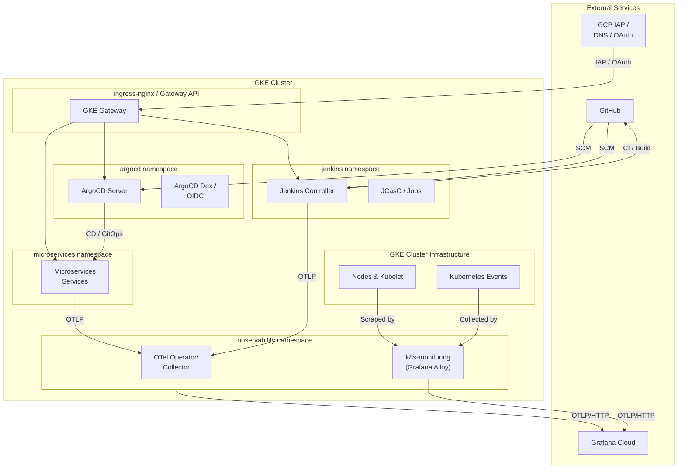

</details>

### Microservices & Database Architecture

The modernized JHipster system is built on a containerized, cloud-native microservices architecture using **Spring Boot 3.x**, **Angular**, and **Java 21**. It consists of two primary services, each with its own dedicated database tier managed by the **CloudNative-PG (CNPG) Operator** with built-in high-availability (HA) and connection pooling:

1. **`gateway`**:
   - **Role**: Serves as the single entry point for all client requests. It hosts the Angular frontend web application and handles routing, JWT-based security verification, and rate-limiting.
   - **Database**: Connects to the primary PostgreSQL instance in the `postgres-gateway` cluster via a dedicated PgBouncer pooler (`postgres-gateway-pooler`).
2. **`jhipstersamplemicroservice`**:
   - **Role**: Serves as the backend microservice that contains business logic and REST endpoints.
   - **Database**: Connects to the primary PostgreSQL instance in the `postgres-jhipstersamplemicroservice` cluster via a dedicated PgBouncer pooler (`postgres-jhipstersamplemicroservice-pooler`).

#### Architecture & Data Flow Diagram

<details>
<summary>🔍 Click to expand Architecture & Data Flow Diagram</summary>

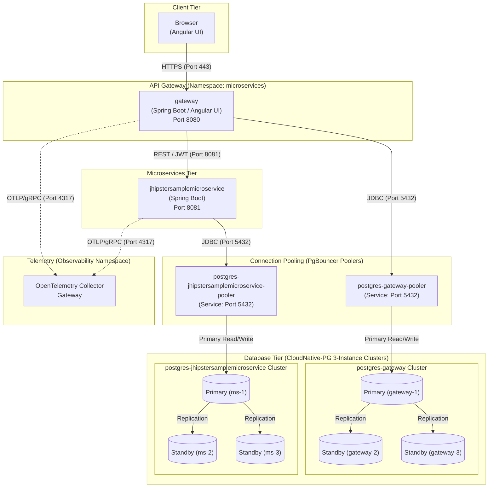

</details>

#### Database Injection & Secrets
The database connections are securely managed by the CloudNative-PG Operator. The operator automatically provisions a basic-auth secret `postgres-{{ $name }}-app` for each cluster containing:
- `username` (the owner username, e.g. `gateway`)
- `password` (auto-generated high-entropy password string)

The Helm chart maps these secret values to Spring database environment variables:
- `SPRING_DATASOURCE_URL` (JDBC URL targeting PgBouncer: `jdbc:postgresql://postgres-{{ $name }}-pooler.microservices.svc:5432/{{ $name }}?ssl=true&sslmode=require`)
- `SPRING_DATASOURCE_USERNAME` (username)
- `SPRING_DATASOURCE_PASSWORD` (password)
- `SPRING_R2DBC_URL` (R2DBC URL: `r2dbc:postgresql://postgres-{{ $name }}-pooler.microservices.svc:5432/{{ $name }}?sslMode=require`)

#### Host-Based Authentication (pg_hba.conf) Security
Dynamic host-based authentication is enforced natively by CNPG:
* **`podSelectorRefs` Mapping**: Restricts application-level access strictly to pods in the same namespace matching the label `app.kubernetes.io/name: <service>`. Traditional static CIDR blocks are avoided, preventing unauthorized cross-contamination.
* **PgBouncer Client Certs**: Restricts connection pooler managers to client certificate authentication (`cert` auth method).
* **pgAdmin CIDR Access**: Grants secure pgAdmin read-only querying access using cluster pod network blocks (`10.20.0.0/16`).
* **Catch-All Reject**: Enforces a final `- host all all all reject` rule to deny any unauthorized ingress from pods or external clusters.

#### pgAdmin & Database Administration


A total of **2 Postgres databases** are provisioned in the cluster (both in the `microservices` namespace). They can be administered via **pgAdmin 4**:

*   **URL:** `https://pgadmin.jenkins2026.nubenetes.com` (gated behind GKE Gateway + Google IAP).
*   **Auto-Login (Google ID):** pgAdmin is configured with Webserver Authentication (`AUTHENTICATION_SOURCES = ['webserver']`) to trust the `X-Goog-Authenticated-User-Email` header injected by Google IAP. A custom python WSGI middleware automatically strips the `accounts.google.com:` namespace prefix from the header, logging you in directly using your Google email address.
*   **Pre-populated Connections:** Both database connections (Gateway and JHipster Microservice backend) are automatically preconfigured on startup as shared connections.
*   **Automated Database Authentication (Zero-Password Login):** To eliminate manual password prompts, database connection passwords are automatically resolved and injected:
    - **Cross-Namespace RBAC**: A dedicated ServiceAccount `pgadmin` and K8s `RoleBinding` grant pgAdmin permission to read the credentials secrets in the `microservices` namespace.
    - **Dynamic `.pgpass` Generation**: An init container (`setup-pgpass`) mounts the pgAdmin data volume, dynamically retrieves the passwords from the secrets, escapes colons (`:`) and backslashes (`\`) for the `.pgpass` format, and writes them with secure `0600` permissions.
    - **Auto-Connection**: The pre-populated servers are configured to read from `/var/lib/pgadmin/pgpass`, allowing instant connectivity just by double-clicking the server in the Object Explorer.
*   **Resource & Safety Limits:** To prevent GKE auto-scaling, pgAdmin is strictly resource-constrained (requests: `50m` CPU / `128Mi` RAM, limits: `200m` CPU / `256Mi` RAM) and is capped by a `ResourceQuota` in the `pgadmin` namespace.

##### Multi-User Identity vs. Database User & Zero-Trust Hardening
In a production-ready GKE environment, the distinction between your **pgAdmin login identity** (your Google email address) and the **PostgreSQL database user** is a key security boundary:

- **pgAdmin Login**: Your Google email address is your authentication identity to access the pgAdmin *web interface* (validated via Google IAP).
- **Postgres Database User**: pgAdmin is just a database client. When it queries the databases, it must authenticate using a native PostgreSQL database user (e.g., `gateway` or `jhipstersamplemicroservice`).

> [!IMPORTANT]
> By design, we do not configure pgAdmin to connect using the PostgreSQL superuser (`postgres`). This follows industry-standard database hardening practices:
> - **Principle of Least Privilege**: The pre-populated connections are configured to use the application database owners (`gateway` and `jhipstersamplemicroservice`). These users have full permissions (`CREATE`, `ALTER`, `SELECT`, `INSERT`, etc.) over their respective application schemas. This is exactly what is needed for administration without exposing global system administration rights.
> - **Minimizing Attack Surfaces**: pgAdmin is a web application accessible via HTTPS. If pgAdmin were pre-configured with superuser credentials, a compromise of the pgAdmin container or session hijacking could expose full control of the database operating system files and cluster configurations.
> - **Superuser Network Block**: In our HBA configuration, the `postgres` superuser is **prevented from logging in over the network** (using password authentication). Superuser access is restricted strictly to local unix sockets (peer authentication) on the database pods themselves.

##### SRE Break-Glass CLI (Connecting as Superuser)
If you are performing platform maintenance and require absolute superuser permissions (e.g. modifying system parameters, loading custom extensions, or manual vacuuming), you should bypass the pgAdmin web UI and connect directly from the cluster control plane:

###### Option A: Execute directly inside the database primary pod (No password required)
Exec into the primary database container, which uses local `peer` authentication to log in instantly as `postgres`:
```bash
# For Gateway Database
kubectl exec -it postgres-gateway-1 -n microservices -c postgres -- psql -U postgres -d gateway

# For JHipster Microservice Database
kubectl exec -it postgres-jhipstersamplemicroservice-1 -n microservices -c postgres -- psql -U postgres -d jhipstersamplemicroservice
```

###### Option B: Retrieve the Superuser password from GKE Secrets
If you need to connect using a client tool from your local terminal:
1. **Get the password**:
   ```bash
   kubectl get secret postgres-gateway-superuser -n microservices -o jsonpath='{.data.password}' | base64 -d; echo
   ```
2. **Port-forward the service**:
   ```bash
   kubectl port-forward svc/postgres-gateway-rw -n microservices 5432:5432
   ```
3. **Connect via psql**:
   ```bash
   psql -h localhost -U postgres -d gateway
   ```

##### Automated pgAdmin Authentication Flow

<details>
<summary>🔍 Click to expand pgAdmin & Database Administration Diagram</summary>

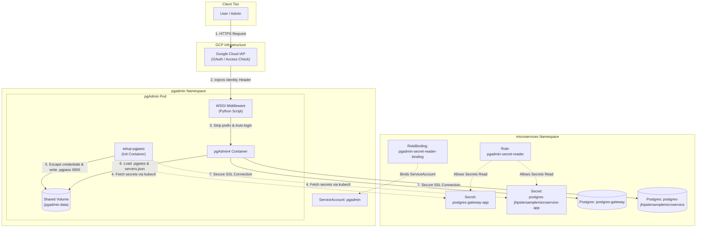

</details>


##### Retrieving Database Credentials (Optional / CLI Tools)
If you need to connect to the databases manually using `psql` or external CLI tools, retrieve the generated passwords from their respective Kubernetes secrets:
*   **Gateway DB password:**
    ```bash
    kubectl get secret postgres-gateway-app -n microservices -o jsonpath='{.data.password}' | base64 -d
    ```
*   **JHipster Microservice DB password:**
    ```bash
    kubectl get secret postgres-jhipstersamplemicroservice-app -n microservices -o jsonpath='{.data.password}' | base64 -d
    ```


---

### CI/CD Flow (GitOps)
This diagram shows the robust Jenkins-to-ArgoCD synchronization we've implemented. Jenkins (CI) builds the artifact and updates the configuration repo, then uses the **ArgoCD CLI** to explicitly trigger and wait for a healthy deployment before finishing the pipeline.

<details>
<summary>🔍 Click to expand CI/CD Flow (GitOps) Diagram</summary>

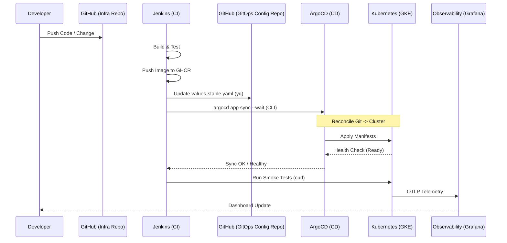

</details>

## Golden Path IDP Modernizations (K8s v1.35/v1.36 & Karpenter)

The repository has been refactored and modernized to serve as a **Golden Path Internal Developer Platform (IDP)** utilizing Kubernetes v1.35/v1.36 features, Karpenter autoscaling, zero-trust security, and decoupled GitOps patterns.

### 1. Kubernetes v1.35/v1.36 Compliance
* **In-Place Pod Vertical Scaling (GA in v1.35)**: Jenkins ephemeral agent pod templates are defined with explicit `resizePolicy` parameters (configured with `NotRequired` for CPU and Memory). This allows active Maven or Node build containers to scale resource requests/limits dynamically under compilation stress without restarting the pod.
* **Safe JVM Resource Resizing Floors**: Configured [`VerticalPodAutoscaler` (VPA) rules](file:///home/inafev/github/jenkins-2026/infrastructure/scheduling/VPA.yaml) for JVM microservices (`gateway` and `jhipstersamplemicroservice`) to enforce `minAllowed` memory thresholds (`512Mi`). This safeguards the JVM against resource-starvation OOMs caused by dynamic resource downscaling.
* **Workload-Aware / Gang Scheduling (v1.36)**: Integrated `PodGroup` scheduling resources (`parallel-smoke-tests`) to prevent resource starvation deadlocks when running heavy concurrent microservice testing workflows.
* **UI/UX Constrained Impersonation**: Implemented K8s v1.36 `ConstrainedImpersonation` policies in Headlamp UI roles. This allows the Headlamp UI ServiceAccount to impersonate specific target user groups without requiring global cluster-admin role escalation permissions.

### 2. Elastic Karpenter Autoscaling (v1.0+)
Traditional GKE Cluster Autoscaler configurations have been replaced with **Karpenter v1.0+** using GCP provider classes:
* **GCPNodeClass**: Configures GKE machine parameters, 100 GB `pd-balanced` boot disks, and links Workload Identity node service accounts. Now maps local NVMe SSD devices (`local-ssd-0` of type `local-ssd`) to provide high-speed, local scratch disks for heavy builds.
* **NodePool**: Manages Spot capacity-types, targeting compute families (`c2`, `n2`, `e2`, `c3`) and injecting taints (`jenkins-agent=true:NoSchedule`) so only build agents land on highly elastic spot pools. Now enforces local SSD count requirements (`karpenter.k8s.gcp/local-ssd-count > 0`).
* **Disruption Budgets**: Configured to restrict consolidations during core business hours (Mon-Fri) to safeguard long-running master build pipelines while allowing aggressive cost cutting at night and empty/underutilized consolidation.
* **Autoscaler Isolation**: Standard GKE nodes and Karpenter node pools are strictly isolated: GKE Cluster Autoscaler does not manage the tainted Karpenter Spot VM node groups, preventing scheduling/autoscaling race conditions.

### 3. Zero-Trust Security & Workload Identity
* **Workload Identity Federation**: All static JSON Service Account keys are removed. Both external CI engines (GitHub Actions) and in-cluster workloads assume GCP IAM Roles dynamically via OIDC.
* **GKE Gateway API + BackendTLSPolicy**: Legacies like NGINX ingress are replaced by native L7 Gateways (`gke-l7-gxlb`). Zero-trust is enforced at the network layer: traffic between the Gateway load balancer and backend pods (Jenkins/Headlamp) is encrypted and validated using `BackendTLSPolicy` targets.
* **Zero-Trust Network Policies**: Hardens namespace security using custom Kubernetes `NetworkPolicy` resources. Applies default deny constraints (excluding CoreDNS UDP/TCP port 53 egress), allowing traffic only on specific required ports (8080 for Jenkins controller, 80 for pgAdmin, 8081 for microservices, and 5432 for PostgreSQL databases from authorized namespaces).
* **Secret Management via External Secrets Operator (ESO)**: Connects GKE Workload Identity with Google Secret Manager. ESO automatically pulls and syncs secret structures (`jenkins-credentials`, `grafana-cloud-credentials`, `gateway-iap-oauth`) to namespaced secrets dynamically, ensuring zero secrets are stored in Git or configured manually.

### 4. GitOps Separation of Concerns
All infrastructural manifests (`karpenter/`, `gateway/`, `headlamp/`, `scheduling/`) are decoupled from CI pipeline definitions and placed inside the [`infrastructure/`](infrastructure/) directory, structuring the platform to be fully reconciled via Argo CD.

### 5. Build Performance & High Availability Caching
* **Jenkins Agent Caching**: Java (Maven `/root/.m2`) and Node (npm `/root/.npm`) containers in pipeline agent templates mount hostPath volumes (`/tmp/jenkins-maven-cache` and `/tmp/jenkins-npm-cache` with `DirectoryOrCreate` rules). Sharing a fast local node directory avoids ReadWriteOnce volume mounting locks while reducing typical compilation times from 5-10 minutes to under 1 minute.
* **Database HA & Storage Lifecycles**: Distributes CloudNative-PG replicas across distinct physical zones using zonal anti-affinity constraints (`topologyKey: topology.kubernetes.io/zone`). Optimizes cloud storage footprints via GCS lifecycle rules, automatically transitioning GCS backups to `NEARLINE` storage class after 3 days and deleting them after 7 days.

---

## ArgoCD Inventory (GitOps)

The deployment lifecycle is managed by **ArgoCD**. Application manifests are stored in [`nubenetes/jenkins-2026-gitops-config/argocd/`](https://github.com/nubenetes/jenkins-2026-gitops-config/tree/main/argocd) and applied to the cluster by `scripts/08.5-argocd.sh`. Jenkins CI writes image tags into that repo; ArgoCD detects the change and reconciles the cluster.

> See [`nubenetes/jenkins-2026-gitops-config`](https://github.com/nubenetes/jenkins-2026-gitops-config) for the full Helm chart schema, values files, branch strategy, and Postgres details.

### Projects & Applications

| Resource | Type | Source repo | Source path | Target namespace | Health |
| :--- | :--- | :--- | :--- | :--- | :--- |
| `microservices` | `AppProject` | — | — | `microservices` | — |
| `microservices` | `ApplicationSet` | `jenkins-2026-gitops-config` | `helm/microservices/` | (generates one App) | — |
| `microservices-stable` | `Application` | `jenkins-2026-gitops-config` | `helm/microservices/` + `values-stable.yaml` | `microservices` | Synced |
| `headlamp` | `Application` | `jenkins-2026-gitops-config` | `helm/headlamp/values.yaml` | `headlamp` | Healthy |
| `pgadmin` | `Application` | `jenkins-2026-gitops-config` | `helm/pgadmin/` | `pgadmin` | Healthy |
| `cnpg-operator` | `Application` | `cloudnative-pg` chart | `https://cloudnative-pg.github.io/charts` | `cnpg-system` | Healthy |
| `external-secrets` | `Application` | `external-secrets` chart | `https://charts.external-secrets.io` | `external-secrets` | Healthy |

### Security & Integration
- **Jenkins Integration**: A dedicated `jenkins` account is created in ArgoCD with a scoped **API Token**. This token is stored in the `jenkins-credentials` Secret and used by the `argocd` CLI inside pipeline agents to trigger `argocd app sync --wait`.
- **Auto-Sync**: All Applications are configured with `selfHeal: true` and `prune: true` — the cluster state always converges to the Git state within seconds of a push.
- **Rollout Waiting**: After pushing a new tag to the gitops-config repo, the Jenkins pipeline calls `argocd app wait --health --timeout 300` before running smoke tests, ensuring zero-downtime deployments are verified end-to-end.

## Telemetry Verification & Simulation

To validate that the OpenTelemetry instrumentation is working correctly and that signals are properly correlated in Grafana Cloud, you can generate synthetic traffic.

### 1. Continuous Traffic Simulation (GitHub Actions)
For a constant stream of telemetry, use the **`99.01 Continuous Traffic Simulation`** workflow:
- **Location**: GitHub Actions tab.
- **Action**: Run `workflow_dispatch`.
- **Duration**: Default 15 minutes (configurable).
- **Purpose**: Simulates real-world user traffic from outside the cluster, hitting the GKE Gateway and triggering end-to-end traces (Frontend -> Gateway -> Backend Services).

#### Grafana Cloud Integration (GitHub Actions)
To see real-time metrics from the GitHub simulation in your Grafana dashboards, you must configure the following repository secrets:

1.  **`GRAFANA_CLOUD_OTLP_ENDPOINT`**: The OTLP gateway URL.
    *   Get it from Terraform: `terraform -chdir=terraform/grafana-cloud-stack output -raw otlp_endpoint`
2.  **`GRAFANA_CLOUD_OTLP_AUTH`**: The Base64 encoded `stack_id:token`.
    *   Get the values from Terraform:
        ```bash
        STACK_ID=$(terraform -chdir=terraform/grafana-cloud-stack output -raw stack_id)
        # Note: Use a persistent API token from your Grafana Cloud Access Policy
        TOKEN="<your-grafana-cloud-token>"
        echo -n "$STACK_ID:$TOKEN" | base64
        ```
    *   Set this value as the `GRAFANA_CLOUD_OTLP_AUTH` secret.

Once configured, k6 will stream metrics via OpenTelemetry directly to your Grafana Cloud instance during the simulation.

### 2. On-Demand Smoke Test (Jenkins)
Trigger the **`microservices-k6-smoke`** job from the Jenkins UI:
- **Feature**: Generates traces that include Jenkins build metadata (e.g., build number, job name).
- **Correlation**: Connects CI metadata with CD runtime telemetry.

### 3. How to Verify Correlation in Grafana
Once traffic is running, go to your Grafana Cloud instance:

- **Metrics to Logs**: Open the **Microservices Overview** dashboard. Click on any metric spike for a service (e.g., `jhipstersamplemicroservice`) and use the **"Show Logs"** split-view to see the logs for that exact time window.
- **Logs to Traces**: In the **Explore (Loki)** view, look for logs containing `trace_id`. The OTel Java agent automatically injects these. Grafana will show a "Tempo" link next to the `trace_id` to jump to the full distributed trace.
- **End-to-End Traces**: In **Explore (Tempo)**, search for `service.name="gateway"`. Select a trace to see the full request path, starting from the k6 client or Angular UI, through the gateway, into the microservices, and down to the database calls.

> **First run note**: `helm/microservices`'s default image tag (`main`) won't
> exist in your registry yet, so Microservices pods will show
> `ImagePullBackOff` until each service's Jenkins pipeline has run at least
> once and pushed an image. `scripts/06-seed-pipelines.sh` (part of `up.sh`)
> triggers the seed job immediately so the 2 stable pipelines exist right
> away; trigger individual builds from the Jenkins UI (`listView` **microservices**).
> Jobs are not auto-triggered (no SCM-poll).
> The same seed run also creates `microservices-k6-smoke` - run it after the 2 services have
> deployed at least once to send a small amount of traffic through the whole
> app and give Grafana fresh traces/metrics/logs to correlate (see
> [`docs/observability.md`](docs/observability.md#k6-observability-smoke-test)).
## Platform QA, Chaos & Compliance Validation

To guarantee production readiness, the repository includes an automated validation gate script and detailed stress-test playbooks for all advanced 2026 Kubernetes features.

### 1. Automated Compliance Validation Gate
The automated validation script lints and dry-runs all platform resources (WIF, Karpenter, Gateway API, RBAC policies, VPA limits) against the target API schema.

* **Script Location**: [`test/validation_gate.sh`](test/validation_gate.sh)
* **Execution**:
  ```bash
  ./test/validation_gate.sh
  ```
* **CI/CD Integration**: Incorporate this script as a blocking validation step in your GitHub Actions deployment workflows before triggering Helm or Argo CD syncs.

### 2. Platform Verification & Stress-Test Playbooks

#### Scenario A: In-Place Resize Verification
Prove that dynamic build agents scale up their container resources dynamically without terminating or changing the Pod UID.

1. **Trigger Workload**: Run a dynamic microservice build job in Jenkins (which spawns a multi-container build agent).
2. **Retrieve the Pod ID**: Find the active agent pod in the `jenkins` namespace:
   ```bash
   kubectl get pods -n jenkins -l role=jenkins-agent
   ```
3. **Trigger Resource Upscale**: Patch the running pod resources in-place (updating CPU limit from `2` to `3` and memory from `2.5Gi` to `4Gi`):
   ```bash
   kubectl patch pod <agent-pod-name> -n jenkins --type=json -p='[
     {"op": "replace", "path": "/spec/containers/0/resources/limits/cpu", "value": "3"},
     {"op": "replace", "path": "/spec/containers/0/resources/limits/memory", "value": "4Gi"}
   ]'
   ```
4. **Monitor the Resize Lifecycle**: Watch the resize state changes:
   ```bash
   kubectl get pod <agent-pod-name> -n jenkins -w -o jsonpath='{.status.resize}{"\t"}{.status.containerStatuses[0].resources}{"\n"}'
   ```
   *Verification*: Status transitions from `Resize: Proposed` -> `Resize: InProgress` -> `Resize: Succeeded` without the pod restarting.
5. **Confirm Zero-Restart Compliance**:
   ```bash
   # Confirm the Pod UID remains identical (it was not recreated)
   kubectl get pod <agent-pod-name> -n jenkins -o jsonpath='{.metadata.uid}'
   
   # Confirm container restartCount remains 0
   kubectl get pod <agent-pod-name> -n jenkins -o jsonpath='{.status.containerStatuses[*].restartCount}'
   ```

#### Scenario B: Karpenter Elasticity & Spot Provisioning
Prove that Karpenter dynamically scales up Spot instances under scheduling pressure and consolidates them when load drops.

1. **Deploy a Burst Load**: Schedule 50 parallel sleep pods targeted to the agent node group:
   ```bash
   kubectl create deployment k6-burst-test --image=alpine/k8s:1.31.3 --replicas=50 -n jenkins
   kubectl patch deployment k6-burst-test -n jenkins --type=json -p='[
     {"op": "add", "path": "/spec/template/spec/tolerations", "value": [{"key": "jenkins-agent", "operator": "Equal", "value": "true", "effect": "NoSchedule"}]},
     {"op": "add", "path": "/spec/template/spec/nodeSelector", "value": {"role": "jenkins-agent"}}
   ]'
   ```
2. **Watch Node Allocation**: Verify Karpenter schedules nodes of Capacity type `spot`:
   ```bash
   kubectl get nodes -l role=jenkins-agent -o custom-columns=NAME:.metadata.name,CAPACITY:.metadata.labels.karpenter\.sh/capacity-type -w
   ```
3. **Trigger Scale Down**: Terminate the burst workloads:
   ```bash
   kubectl scale deployment k6-burst-test -n jenkins --replicas=0
   ```
4. **Verify Consolidation**: Karpenter will cordon, drain, and terminate the underutilized Spot nodes after a 30s cooling window. Verify via ScaleDown events:
   ```bash
   kubectl get events --field-selector reason=ScaleDown -n kube-system
   ```

#### Scenario C: Constrained Impersonation (Zero-Trust RBAC)
Verify that Headlamp's constrained impersonation ClusterRoles restrict access to developer scopes, preventing administrative escalation.

1. **Test Developer Impersonation (Allowed)**:
   ```bash
   kubectl auth can-i create deployments -n microservices \
     --as=system:serviceaccount:headlamp:headlamp-service-account \
     --as-group=developer-group
   # Output: yes
   ```
2. **Test Cluster-wide Escalation (Denied)**:
   ```bash
   kubectl auth can-i get secrets --all-namespaces \
     --as=system:serviceaccount:headlamp:headlamp-service-account \
     --as-group=developer-group
   # Output: no
   ```

#### Scenario D: CloudNative-PG Operator HA Failover, Storage Separation, & pg_hba Validation
Verify that the PostgreSQL database tier managed by the CloudNative-PG (CNPG) operator maintains quorum, recovers immediately from primary node failure, routes through PgBouncer, and enforces zero-trust host-based security rules.

1. **Verify HA Replication & Health**:
   Retrieve the status of the PostgreSQL gateway cluster:
   ```bash
   kubectl get cluster postgres-gateway -n microservices -o yaml
   ```
   *Verification*: Under `.status`, ensure `instancesStatus.healthy` lists all three instances (`postgres-gateway-1`, `postgres-gateway-2`, `postgres-gateway-3`), and `readyInstances` is `3`.

2. **Verify WAL & Data Storage Separation**:
   Verify that WAL logs are written to a separate high-throughput persistent volume compared to PGDATA:
   ```bash
   kubectl get pvc -n microservices -l cnpg.io/cluster=postgres-gateway
   ```
   *Expected Output*: You should see six PVCs: three standard data storage volumes (`postgres-gateway-1`, `postgres-gateway-2`, `postgres-gateway-3`) and three dedicated WAL volumes (`postgres-gateway-1-wal`, `postgres-gateway-2-wal`, `postgres-gateway-3-wal`), each bound to the GKE `premium-rwo` storage class.

3. **Simulate Primary Node Failover (Chaos Test)**:
   Find the current primary pod:
   ```bash
   kubectl get cluster postgres-gateway -n microservices -o jsonpath='{.status.currentPrimary}'
   # E.g. Output: postgres-gateway-1
   ```
   Delete the primary pod to simulate a hard crash:
   ```bash
   kubectl delete pod <current-primary-pod> -n microservices --grace-period=0 --force
   ```
   In a separate shell, watch the cluster recovery:
   ```bash
   kubectl get pod -n microservices -l cnpg.io/cluster=postgres-gateway -w
   ```
   *Verification*:
   * Within seconds, the CNPG controller detects the failure and promotes one of the standbys (e.g. `postgres-gateway-2`) to Primary.
   * Check the cluster resource status to verify the new primary:
     ```bash
     kubectl get cluster postgres-gateway -n microservices -o jsonpath='{.status.currentPrimary}'
     ```
   * The deleted pod is automatically rescheduled as a standby replica, resyncing via WAL replication.
   * Verify that the gateway application remains online and reconnects automatically without throwing fatal database errors, thanks to PgBouncer routing database connections.

4. **Verify Dynamic pg_hba Security and Catch-All Reject**:
   * **Authorized Application access**: Exec into the `gateway` pod and verify that it can query the database through PgBouncer:
     ```bash
     kubectl exec -it $(kubectl get pods -n microservices -l app.kubernetes.io/name=gateway -o jsonpath='{.items[0].metadata.name}') -n microservices -- curl -s http://localhost:8080/management/health
     # Output: Should return HTTP 200 with database health UP.
     ```
   * **Unauthorized access rejection**: Deploy a temporary test pod without the authorized application labels and try to connect directly to the Postgres read-write service:
     ```bash
     kubectl run pg-security-test --image=alpine:3.20 -n microservices --restart=Never -- sh -c "apk add --no-cache postgresql-client && psql -h postgres-gateway-rw -U gateway -d gateway"
     ```
     Check the security test logs:
     ```bash
     kubectl logs pg-security-test -n microservices
     ```
     *Expected Output*: The connection fails with `psql: error: connection to server at "postgres-gateway-rw" failed: FATAL: no pg_hba.conf entry for host...` or `reject` error. This proves that unauthorized hosts inside the cluster are blocked by the catch-all reject rule.

---


## Configuration ([`config/config.yaml`](config/config.yaml))

Single source of truth, loaded by every script via
[`scripts/lib/config.sh`](scripts/lib/config.sh) (`yq` -> `J2026_*` env
vars). Feature flags:

| Key | Default | Override | Meaning |
|---|---|---|---|
| `observability.mode` | `grafana-cloud` | edit `config.yaml` | `grafana-cloud`\|`oss`\|`managed-azure`\|`managed-aws` - where traces/metrics/logs go (see [`docs/observability.md`](docs/observability.md)). |

Other notable sections: `jenkins.*` (chart coordinates, namespace, this
repo's own URL/branch used by JCasC's global library + seed job),
`observability.*` (operator/collector chart coordinates, release names,
Secret name), `microservices.*` (namespaces for the stable/develop environments,
upstream Microservices git org/repos/branches, target registry, and the list of
2 services seeded into Jenkins).

## Repository layout

```
config/config.yaml          single source of truth (feature flags above)
helm/jenkins/                jenkinsci/helm-charts values + values-gke.yaml overlay
helm/microservices/              local chart for the 9 Microservices workloads (2 envs)
helm/headlamp/                kubernetes-sigs/headlamp values (cluster management UI)
jenkins/casc/                JCasC: security, OTel exporter, seed job
jenkins/pipelines/           Jenkinsfile.microservices + seed job (Job DSL + services.yaml)
vars/, resources/            Jenkins global shared library (must be at repo root)
observability/               OTel Operator/Collector + Grafana/Loki/Tempo/Prometheus values + dashboards
scripts/                      00-09 numbered steps + up.sh / down.sh / status.sh
terraform/gke/                throwaway GKE cluster for test/e2e.sh (the one exception
                              to "assumes an existing cluster")
terraform/bootstrap/          one-time setup for the GitHub Actions automation below
                              (state bucket + Workload Identity Federation)
terraform/gateway-bootstrap/  one-time setup for public access (static IP + managed
                              certificate) - see "Public access (GKE Gateway API + IAP)"
scripts/08.5-argocd.sh        ArgoCD installation and OIDC configuration
test/                         e2e.sh (provision -> up.sh -> smoke-test.sh -> down.sh -> destroy)
.github/workflows/            CC.NN-<name>.yml, see "CI/CD pipelines" for the full inventory
docs/                         architecture, pipelines-as-code, observability, platforms
```

Full details in [`docs/architecture.md`](docs/architecture.md).

## Jenkins UI, plugins & MCP

### Accessing the UI & admin password

```bash
kubectl -n jenkins port-forward svc/jenkins 8080:8080
```

Open <http://localhost:8080>. If [Google login](#google-login-openid-connect)
is configured, use the **Sign in with Google** button. Otherwise (or for
break-glass/automation access), log in as `${JENKINS_ADMIN_ID}`
(`jenkins.adminUser` in [`config/config.yaml`](config/config.yaml), default
`admin`) via the **escape hatch** - this login always works, regardless of
OIDC. The password is randomly generated on first run by
[`scripts/01-namespaces.sh`](scripts/01-namespaces.sh) and printed once to its
output - if you missed it, retrieve it from the `jenkins-credentials` Secret
(`jenkins.credentialsSecretName`) in the `jenkins` namespace:

```bash
kubectl -n jenkins get secret jenkins-credentials -o jsonpath='{.data.admin-password}' | base64 -d; echo
```

This same `${JENKINS_ADMIN_ID}` / password is what
[`test/smoke-test.sh`](test/smoke-test.sh) and
[`scripts/06-seed-pipelines.sh`](scripts/06-seed-pipelines.sh) use for
HTTP Basic Auth against the Jenkins API. To rotate the password, delete the
Secret and re-run `scripts/01-namespaces.sh` + `scripts/04-jenkins.sh` (see
[Troubleshooting](#troubleshooting)) - a new random password is generated and
printed once.

### Google login (OpenID Connect)

Jenkins' security realm is [`oic-auth`](https://plugins.jenkins.io/oic-auth/)
(`securityRealm.oic` in
[`jenkins/casc/jcasc-base.yaml`](jenkins/casc/jcasc-base.yaml)), so anyone can
sign in with a Google account - Role-Based Authorization Strategy then decides
what they can do. By default, a Google login only gets `authenticated-base`
(read-only UI access); to grant the `admin` role (`Overall/Administer`) to
your own account, set `JENKINS_OIDC_ADMIN_EMAIL`. 

Setting `JENKINS_OIDC_ADMIN_EMAIL` also dynamically configures administrator permissions for the corresponding user in ArgoCD's RBAC policy configmap (`argocd-rbac-cm`), ensuring unified admin privileges across both Jenkins and ArgoCD when logging in via Google OIDC.

This **replaces** the old local `admin` password login. The `${JENKINS_ADMIN_ID}`
escape hatch above remains as the break-glass admin login.

1. **Create a third Google OAuth 2.0 Web application client** (can reuse the
   same GCP project as the [Headlamp](#one-time-setup-google-oauth-client)
   and [IAP](#one-time-setup) clients, but must be its own client - Jenkins
   needs its own redirect URI and cannot share a client with them):
   - [Google Cloud Console](https://console.cloud.google.com/) -> **APIs &
     Services** -> **Credentials** -> **Create credentials** -> **OAuth
     client ID** -> Application type **Web application**.
   - **Authorized redirect URIs**: add
     `https://jenkins.<baseDomain>/securityRealm/finishLogin` (e.g.
     `https://jenkins.jenkins2026.nubenetes.com/securityRealm/finishLogin`).
     If you only access Jenkins via `kubectl port-forward`, also add
     `http://localhost:8080/securityRealm/finishLogin`.
   - Note the **Client ID** and **Client secret**.
   - On the **OAuth consent screen** (Audience tab), while the app is in
     **Testing**, add your Google account as a **Test user** - otherwise
     Google returns `Error 403: access_denied` ("has not completed the Google
     verification process"). Unlike the Headlamp client, Jenkins only needs
     the non-sensitive `openid email profile` scopes, so no Data Access
     changes are required.

2. **Add repository secrets** (your own email is **never committed to this
   repo**):

   ```bash
   gh secret set JENKINS_OIDC_CLIENT_ID     --body "<client ID from above>"
   gh secret set JENKINS_OIDC_CLIENT_SECRET --body "<client secret from above>"
   gh secret set JENKINS_OIDC_ADMIN_EMAIL   --body "you@gmail.com"
   ```

   then re-run **02.02 Redeploy Jenkins** (or **02.01 GKE provision**).
   Locally (`test/e2e.sh` / `scripts/up.sh`), export the same three as
   `JENKINS_OIDC_CLIENT_ID`, `JENKINS_OIDC_CLIENT_SECRET` and
   `JENKINS_OIDC_ADMIN_EMAIL` instead.

   > Changes to `jenkins-credentials` only take effect for a *new* Secret -
   > if it already exists from a previous run, delete it first (see
   > [Troubleshooting](#troubleshooting)) so `scripts/01-namespaces.sh`
   > recreates it with the `oidc-*` keys.

Until `JENKINS_OIDC_CLIENT_ID`/`JENKINS_OIDC_CLIENT_SECRET` are set, the
**Sign in with Google** button is shown but errors out - the escape hatch
above is the only working login in the meantime.

[`helm/jenkins/values-common.yaml`](helm/jenkins/values-common.yaml) tracks
the latest Jenkins LTS (`controller.image.tag`) and pins **every** plugin -
including transitive dependencies - to the exact version resolved against
that core by `jenkins-plugin-cli` (recipe in the comment above
`installPlugins`). This replaced an earlier unversioned plugin list: pinning
means a routine controller pod restart always installs the identical plugin
set, instead of silently picking up a newer (possibly breaking) version.
Bump `controller.image.tag` and re-run the recipe together when updating.

Beyond the existing kubernetes/git/JCasC/OTel plugins, three are aimed at UX:

- **[Pipeline Graph View](https://plugins.jenkins.io/pipeline-graph-view/)** -
  the maintained successor to the discontinued Blue Ocean. Adds an
  interactive, pan/zoom stage graph to every build page - no configuration
  needed.
- **[Dark Theme](https://plugins.jenkins.io/dark-theme/)** (+ Theme Manager) -
  native dark mode. `appearance.themeManager` in
  [`jenkins/casc/jcasc-base.yaml`](jenkins/casc/jcasc-base.yaml) defaults
  everyone to `darkSystem` (follows the browser/OS preference); each user can
  still override it from their profile's *Appearance* tab.
- **[MCP Server](https://plugins.jenkins.io/mcp-server/)** - exposes Jenkins
  (jobs, builds, logs, SCM, replay) as an MCP server, so an MCP-capable
  client (Claude Code/Desktop, etc.) can query and drive this Jenkins
  directly. No JCasC config needed - it auto-registers its endpoints
  (`/mcp-server/sse`, `/mcp-server/mcp`, `/mcp-server/mcp-stateless`).
  Authenticate as `${JENKINS_ADMIN_ID}` (or any user) with a personal **API
  token** (user profile -> *Security* -> *Add new Token*), passed as HTTP
  Basic Auth - never put this token in the repo. For Claude Code:
  `claude mcp add --transport http jenkins <jenkins-url>/mcp-server/mcp
  --header "Authorization: Basic <base64(user:token)>"` (after exposing
  Jenkins per the access method in [Quick start](#quick-start) /
  [Headlamp](#headlamp-cluster-management-ui)).

## Pipelines as code

A Jenkins seed job (defined via JCasC, running Job DSL against
[`jenkins/pipelines/seed/seed_jobs.groovy`](jenkins/pipelines/seed/seed_jobs.groovy)
+ [`services.yaml`](jenkins/pipelines/seed/services.yaml)) generates the stable pipeline jobs at the root level under the `microservices` view:
- `gateway`
- `jhipstersamplemicroservice`
- `microservices-k6-smoke`

The first 2 pipelines run [`Jenkinsfile.microservices`](jenkins/pipelines/Jenkinsfile.microservices) (build/deploy, one Microservices service each); the last job runs [`Jenkinsfile.microservices-k6-smoke`](jenkins/pipelines/Jenkinsfile.microservices-k6-smoke) (synthetic traffic + telemetry, see [k6 observability smoke test](#k6-observability-smoke-test) below).

### Pipeline Branch & Environment Mapping

Instead of separating stable and development pipelines into separate jobs and folders, a single set of root stable pipelines is generated. These pipelines are dynamically seeded and configured to target the stable environment:

*   **Target Namespace:** `microservices`
*   **Environment Name:** `stable` (modifies `values-stable.yaml` in the GitOps config repository on the `main` branch)

#### Why the GitOps Repo Uses Only the `main` Branch

The companion repository `jenkins-2026-gitops-config` is configured to track only a single `main` branch:

1. **Single Environment Target**: In this unified model, the legacy development sandbox has been pruned, leaving only a single stable target namespace (`microservices`).
2. **Simplified Promotion**: The Jenkins CI pipeline writes image tags directly inside [values-stable.yaml](file:///home/inafev/github/jenkins-2026-gitops-config/helm/microservices/values-stable.yaml) on the `main` branch of the GitOps repository.

#### Would a `develop` branch make sense?

Yes, but **only if you restore a multi-environment deployment model** (e.g., dev/staging vs. stable namespaces):

* **Testing Infrastructure Changes**: If developers need to test Helm chart updates (e.g., resource limits, new environment variables, or sidecar additions) in a sandbox (`develop`) namespace before promoting them to stable (`main`), they would push changes to the `develop` branch of the GitOps repo first for verification.
* **Tracking Parallel Code Tracks**: If upstream repositories build from both a `develop` branch (dev builds) and a `main` branch (stable releases), Jenkins would commit dev tags to a `values-develop.yaml` on the GitOps `develop` branch (synced to a dev namespace), and stable tags to [values-stable.yaml](file:///home/inafev/github/jenkins-2026-gitops-config/helm/microservices/values-stable.yaml) on the GitOps `main` branch (synced to the stable namespace).

### Architecture Diagram

<details>
<summary>🔍 Click to expand Architecture Diagram</summary>

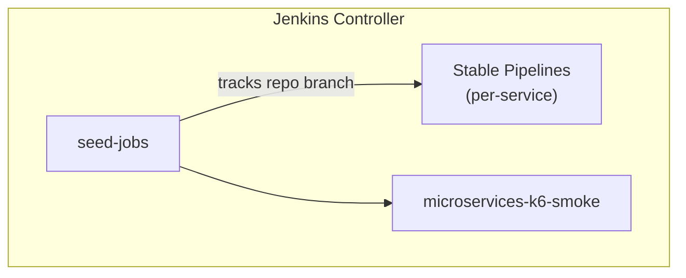

</details>

Each per-service pipeline dynamically executes the declarative shared library pipeline defined in [MicroservicesPipeline.groovy](file:///home/inafev/github/jenkins-2026/vars/MicroservicesPipeline.groovy), while the integration testing runs the pipeline defined in [MicroservicesK6SmokePipeline.groovy](file:///home/inafev/github/jenkins-2026/vars/MicroservicesK6SmokePipeline.groovy).

### Detailed Pipeline Execution Stages

#### 1. Microservices Build & Deploy Pipeline
Defined in [MicroservicesPipeline.groovy](file:///home/inafev/github/jenkins-2026/vars/MicroservicesPipeline.groovy), this pipeline manages the complete CI/CD lifecycle for each individual microservice (e.g. `gateway` or `jhipstersamplemicroservice`):

*   **Checkout Microservices source** ([MicroservicesPipeline.groovy:L154-L212](file:///home/inafev/github/jenkins-2026/vars/MicroservicesPipeline.groovy#L154-L212))
    *   Clones the microservice repository coordinates parsed from [services.yaml](file:///home/inafev/github/jenkins-2026/jenkins/pipelines/seed/services.yaml).
    *   If the target is the `gateway`, runs automated hot-patching scripts to delete modern-Java compiling Hibernate `@Cache` annotations from [User.java](file:///home/inafev/github/jenkins-2026/vars/MicroservicesPipeline.groovy#L159-L165), adds cache constants in [UserRepository.java](file:///home/inafev/github/jenkins-2026/vars/MicroservicesPipeline.groovy#L166-L169), switches MySQL dependencies and URLs for Liquibase/R2DBC to PostgreSQL in [pom.xml](file:///home/inafev/github/jenkins-2026/vars/MicroservicesPipeline.groovy#L170-L180) and [application-prod.yml](file:///home/inafev/github/jenkins-2026/vars/MicroservicesPipeline.groovy#L181-L185), and writes a dummy [CacheConfiguration.java](file:///home/inafev/github/jenkins-2026/vars/MicroservicesPipeline.groovy#L186-L206) supplying a `NoOpCacheManager` bean.
*   **Checkout Infra configs** ([MicroservicesPipeline.groovy:L214-L223](file:///home/inafev/github/jenkins-2026/vars/MicroservicesPipeline.groovy#L214-L223))
    *   Clones the deployed active branch of this infrastructure repository (`jenkins-2026`) into the build environment to load shared static tools and rules configuration.
*   **Semgrep SAST** ([MicroservicesPipeline.groovy:L225-L292](file:///home/inafev/github/jenkins-2026/vars/MicroservicesPipeline.groovy#L225-L292))
    *   Runs static security scan using `semgrep` with `p/security-audit`, `p/owasp-top-ten`, and custom rules defined in [.semgrep/semgrep.yml](file:///home/inafev/github/jenkins-2026/.semgrep/semgrep.yml).
    *   Generates and archives `semgrep-results.sarif`.
    *   Compresses and uploads results to the GitHub Code Scanning Alerts API, printing actionable links to the GitHub Security UI and Jenkins local workspace.
*   **CodeQL Analysis** ([MicroservicesPipeline.groovy:L294-L367](file:///home/inafev/github/jenkins-2026/vars/MicroservicesPipeline.groovy#L294-L367))
    *   Builds a local CodeQL database using the custom ruleset config [.github/codeql/codeql-config.yml](file:///home/inafev/github/jenkins-2026/.github/codeql/codeql-config.yml) and scans JavaScript/TypeScript files with optimized CPU/RAM threads.
    *   Compresses and uploads `codeql-results.sarif` to the GitHub Code Scanning API, printing direct links to the security alerts dashboard.
*   **Trivy IaC Scan** ([MicroservicesPipeline.groovy:L369-L389](file:///home/inafev/github/jenkins-2026/vars/MicroservicesPipeline.groovy#L369-L389))
    *   Clones the GitOps config repository and runs a `trivy config` check on the source codebase and the GitOps Helm manifests to ensure there are no configuration anti-patterns.
*   **Build & Test** ([MicroservicesPipeline.groovy:L391-L397](file:///home/inafev/github/jenkins-2026/vars/MicroservicesPipeline.groovy#L391-L397))
    *   Delegates build execution to the shared library helper [microservicesBuild.groovy](file:///home/inafev/github/jenkins-2026/vars/microservicesBuild.groovy), using fast host-path Maven caches and parallel compile parameters.
*   **Build & Push Image** ([MicroservicesPipeline.groovy:L399-L410](file:///home/inafev/github/jenkins-2026/vars/MicroservicesPipeline.groovy#L399-L410))
    *   Delegates Docker packaging to [microservicesImage.groovy](file:///home/inafev/github/jenkins-2026/vars/microservicesImage.groovy), leveraging the Jib plugin (or DinD) to build and push container images to GHCR using workspace-injected credentials.
*   **Trivy Image Scan** ([MicroservicesPipeline.groovy:L412-L422](file:///home/inafev/github/jenkins-2026/vars/MicroservicesPipeline.groovy#L412-L422))
    *   Runs `trivy image` against the published container image to audit it for operating system CVEs or vulnerability dependencies before deploy.
*   **Deploy to Kubernetes** ([MicroservicesPipeline.groovy:L424-L434](file:///home/inafev/github/jenkins-2026/vars/MicroservicesPipeline.groovy#L424-L434))
    *   Delegates deployment tasks to the shared helper [microservicesDeploy.groovy](file:///home/inafev/github/jenkins-2026/vars/microservicesDeploy.groovy), executing the inner **`GitOps Update`** stage. This stage checks out the GitOps repository, modifies the service's image tag using `yq`, pushes the update to the `main` branch, and runs the `argocd` CLI to trigger and wait for a synchronized healthy cluster rollout.
*   **Smoke Test** ([MicroservicesPipeline.groovy:L436-L445](file:///home/inafev/github/jenkins-2026/vars/MicroservicesPipeline.groovy#L436-L445))
    *   Delegates validation to [microservicesSmokeTest.groovy](file:///home/inafev/github/jenkins-2026/vars/microservicesSmokeTest.groovy) by executing an HTTP query check against the deployed pod's management health endpoints.
*   **Integration k6 Smoke Test** ([MicroservicesPipeline.groovy:L447-L456](file:///home/inafev/github/jenkins-2026/vars/MicroservicesPipeline.groovy#L447-L456))
    *   Triggers the downstream integration test pipeline `microservices-k6-smoke` to validate request flows and capture end-to-end metrics/traces in Grafana Cloud.
*   **Post Action Handler** ([MicroservicesPipeline.groovy:L458-L470](file:///home/inafev/github/jenkins-2026/vars/MicroservicesPipeline.groovy#L458-L470))
    *   Saves unit test results via the `junit` plugin and records static analysis warnings using the `warnings-ng` plugin (`recordIssues`) to render Semgrep and CodeQL dashboards natively within Jenkins build logs.

#### 2. k6 Integration Smoke Test Pipeline
Defined in [MicroservicesK6SmokePipeline.groovy](file:///home/inafev/github/jenkins-2026/vars/MicroservicesK6SmokePipeline.groovy), this pipeline is executed downstream of deployments to simulate load traffic and populate observability metrics:

*   **Checkout Infra** ([MicroservicesK6SmokePipeline.groovy:L52-L56](file:///home/inafev/github/jenkins-2026/vars/MicroservicesK6SmokePipeline.groovy#L52-L56))
    *   Clones the active infrastructure repository containing the k6 scripts.
*   **Run k6 Smoke Test** ([MicroservicesK6SmokePipeline.groovy:L58-L67](file:///home/inafev/github/jenkins-2026/vars/MicroservicesK6SmokePipeline.groovy#L58-L67))
    *   Delegates script execution to [microservicesK6Smoke.groovy](file:///home/inafev/github/jenkins-2026/vars/microservicesK6Smoke.groovy) to run k6 with multi-threaded virtual users, validating request rates and API latency thresholds.

Details on the underlying pipeline generation architecture can be found in [`docs/pipelines-as-code.md`](docs/pipelines-as-code.md).

### Pipeline Container Security

All agent pod containers follow a least-privilege model. The table below documents each container's effective UID and the rationale for any root exception.

| Container | Image | Effective UID | `allowPrivilegeEscalation` | Notes |
|-----------|-------|:---:|:---:|-------|
| `jnlp` | `jenkins/inbound-agent` | 1000 | false | Jenkins default non-root agent |
| `maven` | `maven:3.9.9-eclipse-temurin-21` | 0 (image default) | false | Cache mountPath `/root/.m2`; migrate when cache path moves |
| `node` | `node:20-bookworm` | 0 (image default) | false | Cache mountPath `/root/.npm`; migrate when cache path moves |
| `git` | `alpine/git:latest` | **1000** (k8s override) | false | `HOME=/tmp` required for `git config --global` under non-root |
| `helm` | `alpine/k8s:1.31.3` | **1000** (k8s override) | false | `HOME=/tmp`; ArgoCD CLI downloaded to `/tmp/argocd-cli` |
| `semgrep` | `semgrep/semgrep:1.79.0` | 0 (image default) | false | No filesystem writes requiring root; upgrade path: add `runAsUser` |
| `trivy` | `aquasec/trivy:0.52.2` | 0 (image default) | false | No filesystem writes requiring root |
| `docker` | `docker:26-dind` | **0 (required)** | true (privileged) | Docker-in-Docker daemon requires root and a privileged context |
| `codeql` | `mcr.microsoft.com/cstsectools/codeql-container` | **0 (required)** | — | Runs `apt-get` + Node.js installer at pipeline time |

**Key implementation notes:**
- `runAsUser: 1000` on `alpine/git` and `alpine/k8s` is applied via Kubernetes `securityContext` — it overrides the image's default UID at runtime without modifying the image itself.
- SARIF upload (Semgrep and CodeQL results → GitHub Code Scanning API) runs in `container('helm')` because `alpine/git` (UID 1000) cannot run `apk add curl`, while `alpine/k8s` ships curl, git, gzip, and base64 pre-installed.
- The JENKINS-30600 Jenkins Kubernetes plugin bug means the built-in DSL `git url:` step always runs in the JNLP sidecar regardless of `container()` wrapping. All git clones use `sh "git clone --depth 1 -c filter.lfs.*=..."` inside the intended container instead.

### Pipeline Reliability Fixes (v0.10.7–v0.10.16)

The following issues were diagnosed and resolved in this release cycle. They are documented here as a reference for operators running similar Jenkins-on-Kubernetes setups:

| Issue | Symptom | Root Cause | Fix |
|-------|---------|------------|-----|
| **JENKINS-30600** | OOM / `ClosedChannelException` on git checkout | DSL `git url:` ignores `container()` wrapper, always runs in 256 Mi JNLP | Replaced with `sh "git clone --depth 1"` inside target container |
| **EPERM on deploy cleanup** | `Operation not permitted` on `deleteDir()` | JNLP (UID 1000) cannot delete files written by root (`alpine/git` UID 0) | Moved `find . -mindepth 1 -delete` inside `container('git')` |
| **k6 smoke OOM** | `ClosedChannelException` in `Checkout Infra` | Same JENKINS-30600 in `MicroservicesK6SmokePipeline` | Same `sh git clone` fix in `container('helm')` |
| **curl not found (exit 127)** | Semgrep/CodeQL stage FAILURE | `alpine/git` UID 1000 cannot `apk add curl`; Jenkins `sh -xe` propagates exit 127 | Moved SARIF upload to `container('helm')` which has curl pre-installed |
| **Missing env vars in agents** | Pipeline references `env.JENKINS2026_REPO_BRANCH` as empty | `globalNodeProperties` not configured in JCasC | Added `globalNodeProperties` with all `JENKINS2026_*` vars in `jcasc-base.yaml` |
| **Agent pods not schedulable** | Builds queue indefinitely | Karpenter node taint `jenkins-agent=true:NoSchedule` without matching toleration | Added toleration to agent pod spec in `MicroservicesPipeline.groovy` |

## Observability

Jenkins (via the `opentelemetry` plugin), every Java microservice (via OTel
Operator auto-instrumentation) and the Angular UI (via a small RUM snippet)
export OTLP to an in-cluster collector, which forwards to Grafana Cloud
(default) or an in-cluster Prometheus+Loki+Tempo+Grafana stack
(`observability.mode: oss`).

### Key Features
- **gcx CLI GitOps**: Dashboard deployment in Grafana Cloud is managed via the native **`gcx` CLI**. The `scripts/07-grafana-dashboards.sh` script automatically:
    - Installs and authenticates the `gcx` CLI using `gcx login --yes` to discover the stack ID and namespace.
    - Wraps raw JSON dashboards into Kubernetes-style `apiVersion: dashboard.grafana.app/v1` manifests.
    - Pushes resources declaratively using `gcx resources push --include-managed`.
- **Jenkins Data Source**: The [Jenkins Datasource](https://grafana.com/grafana/plugins/grafana-jenkins-datasource/) is automatically provisioned. 
    - **One-time Manual Step**: You must manually install the **`grafana-jenkins-datasource`** plugin in your Grafana Cloud portal (**Administration > Plugins**) before the first deployment.
    - **PDC Tunnel**: In Grafana Cloud mode, it uses **Private Data Source Connect (PDC)** to securely tunnel from the cloud to your in-cluster Jenkins instance.
- **Model Context Protocol (MCP)**: This project supports Grafana Cloud's hosted **MCP server**. Connecting an AI agent (like Gemini) to your stack via MCP allows for real-time querying of Jenkins traces, metrics, and logs during troubleshooting.
    - **Setup**: In your Grafana Cloud portal, go to **Administration > Assistant > Cloud MCP** to find your connection endpoint.
    - **Integration**: Add the endpoint to your Gemini CLI or AI agent configuration. You can then ask questions like *"Audit my Jenkins datasource health"* or *"Summarize recent pipeline failures from traces"* for a better outcome of your changes.
- **GKE Kubernetes Cluster Observability**: Automatic telemetry collection for GKE hosts, nodes, namespaces, and cluster events is integrated using the official `grafana/k8s-monitoring` Helm chart (v4.0+) pointing directly to Grafana Cloud OTLP.
    - **Zero Log Duplication**: Disables log collection inside the chart (`podLogsViaLoki.enabled=false`, `podLogsViaOpenTelemetry.enabled=false`) to prevent dual ingestion charges, leaving pod log capture to the dedicated `otel-collector-logs` DaemonSet.
    - **Resource Quota Compatibility**: The `observability-quota` is scaled up to allow the Alloy operator, stateful Alloy scrapers, kube-state-metrics, and node-exporter daemons to run safely alongside OpenTelemetry operators.
    - **Automated Lifecycle**: Deployed via [`scripts/03-observability.sh`](file:///home/inafev/github/jenkins-2026/scripts/03-observability.sh) (which dynamically extracts credentials and parses the basic auth secret from GKE) and cleanly uninstalled in parallel via [`scripts/down.sh`](file:///home/inafev/github/jenkins-2026/scripts/down.sh).
    - **Zero-Touch Config**: Automatically maps the default Prometheus (`grafanacloud-prom`), Loki (`grafanacloud-logs`), and Tempo (`grafanacloud-traces`) data sources in the plugin's `jsonData` via `gcx api` inside [`scripts/07-grafana-dashboards.sh`](file:///home/inafev/github/jenkins-2026/scripts/07-grafana-dashboards.sh) upon bootstrap, rendering the Kubernetes App Home (`/a/grafana-k8s-app/home`) immediately active.
- **Correlated telemetry**: Traces, metrics and logs are fully correlated. On Grafana Cloud, log-to-trace links and system datasources (like `alert-state-history` and `usage-insights`) are pre-configured by default.

### k6 observability smoke test

`microservices-k6-smoke` (at the root) runs
[`jenkins/pipelines/k6/microservices-smoke.js`](jenkins/pipelines/k6/microservices-smoke.js)
via [`vars/microservicesK6Smoke.groovy`](vars/microservicesK6Smoke.groovy). This is
**not a load/stress test** - it's an on-demand way to give Grafana a fresh,
fully-correlated trace/metric/log example across the *whole* app, without
waiting for real users:

<details>
<summary>🔍 Click to expand k6 observability smoke test Diagram</summary>

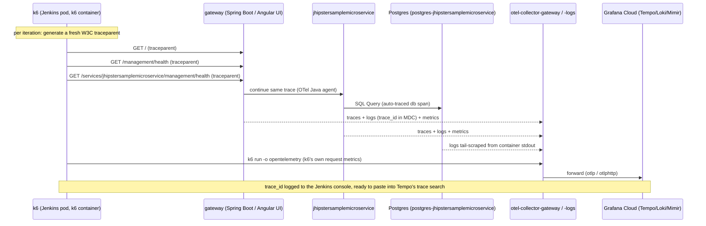

</details>

- **One trace per iteration**: every request in an iteration carries the
  same generated `traceparent`, so the OTel Java agent (already configured
  with `tracecontext` propagation + `parentbased_traceidratio(1.0)` sampling)
  continues it across every service the iteration touches - one k6 iteration
  = one Tempo trace spanning the gateway and downstream microservices.
- **Job parameters** (set as defaults by `seed_jobs.groovy`, overridable per
  build): `TARGET_NAMESPACE`/`ENV_NAME` (`microservices`/`stable`), `K6_VUS` (default 4) and `K6_ITERATIONS`
  (default 12, shared across all VUs).
- **Thresholds, not a hard gate**: `microservices-smoke.js` sets
  `http_req_failed: rate<0.05` and `http_req_duration: p(95)<3000`. k6 exits
  `99` if a threshold is crossed but the run otherwise completed cleanly -
  `microservicesK6Smoke.groovy` reports that as Jenkins **UNSTABLE** (e.g. a
  cold-start latency blip right after a deploy), reserving **FAILURE** for
  real script/runtime errors.
- **Build output**: whatever the outcome, `microservicesK6Smoke` prints the raw
  `k6-summary.json` (also archived as a build artifact), a pass/fail
  breakdown (checks, `http_req_failed` rate, `http_req_duration` p95 vs.
  their thresholds, iteration count), and a direct link to the
  **`k6-smoke-overview.json`** Grafana dashboard
  (`observability/grafana/dashboards/k6-smoke-overview.json`, uid
  `jenkins2026-k6-smoke-overview`) scoped to this run's
  `stable` environment and time window.
- **Automated Pipeline Integration**: The k6 smoke test is automatically triggered at the end of every microservice build and deploy pipeline ([MicroservicesPipeline.groovy](file:///home/inafev/github/jenkins-2026/vars/MicroservicesPipeline.groovy)). After a microservice (`jhipstersamplemicroservice` or `gateway`) is deployed to GKE and passes its basic startup health checks, the pipeline automatically triggers the root `microservices-k6-smoke` integration test job. This automatically validates that the newly deployed service version integrates successfully with the gateway, other microservices, and databases, and sends correlated telemetry (metrics, traces, logs) to Grafana Cloud.
- **Run it** after the 2 services have deployed at least once (see [First run
  note](#quick-start)), then follow the Grafana link in the build console -
  or search Tempo for one of the `[microservices-smoke] iteration
  trace_id=...` values also logged there.

Full details in [`docs/observability.md`](docs/observability.md#k6-observability-smoke-test).

### Telemetry Architecture and Signal Flow

Every signal source speaks **OTLP** to a single in-cluster **gateway collector**
(`otel-collector-gateway`, a Deployment), plus a **logs DaemonSet**
(`otel-collector-logs`) that tails each pod's `stdout`. The gateway's
exporters are the *only* thing that differs between modes, so the same
instrumentation works whether telemetry lands in **Grafana Cloud** (default)
or an **in-cluster OSS stack** (`observability.mode: oss`).

<details>
<summary>🔍 Click to expand End-to-End Telemetry Architecture Diagram</summary>

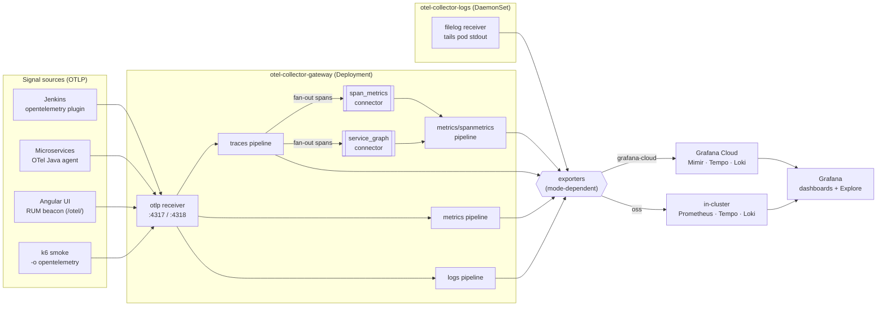

</details>

**Low-level detail** ([`observability/otel-collector/values-grafana-cloud.yaml`](observability/otel-collector/values-grafana-cloud.yaml)):

- **Receivers**: one `otlp` receiver (gRPC `:4317` + HTTP `:4318`, CORS `*` so the
  browser RUM beacon can post directly).
- **Connectors** `span_metrics` + `service_graph`: the traces pipeline fans every
  span out to these connectors, and a dedicated `metrics/spanmetrics` pipeline
  exports their output. **Why**: without them *no span-derived metrics exist*, so
  Tempo's **Service Map / node graph stays empty** and there are no RED
  (Rate/Errors/Duration) metrics to jump to from a trace. They produce
  `traces_spanmetrics_*` (with `trace_id` **exemplars**) and
  `traces_service_graph_request_*`. Both ship in the `otelcol-k8s` image, so no
  image change was needed.
- **Exporters**: `grafana-cloud` mode uses one `otlp_http/grafana_cloud`
  (canonical alias, no deprecation warning) reading the endpoint/auth from the
  `grafana-cloud-credentials` Secret; `oss` mode
  ([`values-oss.yaml`](observability/otel-collector/values-oss.yaml)) fans out to
  `otlp/tempo`, `prometheusremotewrite` (kube-prometheus-stack) and
  `otlphttp/loki`.
- **Logs DaemonSet**: pod `stdout` is tail-scraped by the `otel-collector-logs`
  filelog receiver — this is the path the apps' JSON console logs travel to Loki
  (see [Structured Logging Deep Dive](#structured-logging-deep-dive)). The
  `grafana/k8s-monitoring` chart deliberately **disables its own log collection**
  to avoid double ingestion.

### Signal Correlation: Metrics, Traces and Logs

The three signals are wired so you can pivot between them in any direction. The
links live on the **datasources** (Grafana Cloud provisions them by default;
the OSS stack configures the equivalents in
[`observability/grafana/values-oss.yaml`](observability/grafana/values-oss.yaml)).

<details>
<summary>🔍 Click to expand Signal Correlation Diagram</summary>

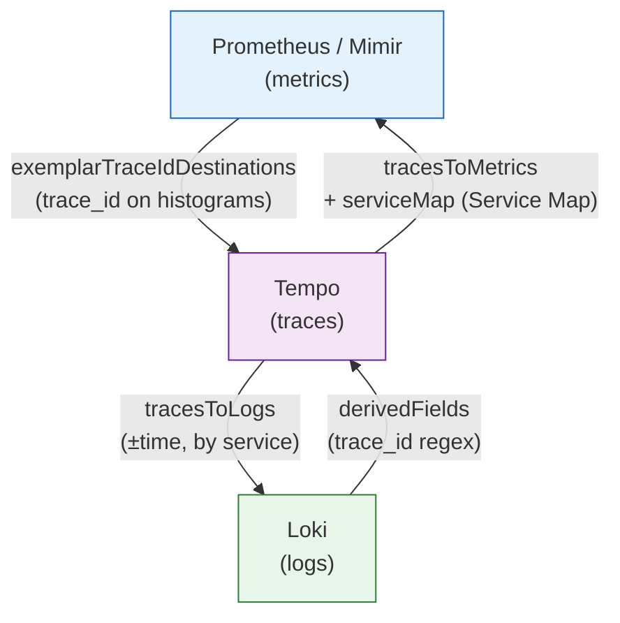

</details>

| Direction | How it's wired | What had to be added |
|---|---|---|
| **Metrics → Traces** | `exemplarTraceIdDestinations` on the Prometheus DS; OTel histograms (`http_server_*`, `traces_spanmetrics_*`) carry `trace_id` exemplars | exemplars on `span_metrics` connector |
| **Traces → Logs** | Tempo `tracesToLogs(V2)` → Loki, scoped by `service.name` + a time window | — (worked once logs existed) |
| **Traces → Metrics + Service Map** | Tempo `tracesToMetrics` + `serviceMap` → Prometheus | the `span_metrics` / `service_graph` connectors that *produce* those metrics |
| **Logs → Traces** | Loki `derivedFields` regex extracts `trace_id` from the log line → Tempo | ECS-JSON logs **and** reactive context propagation so the id is actually present (below) |

**Scope caveat**: traces only exist for the OTel-instrumented components — the
two Java microservices **and Jenkins** (its pipeline spans even show up in the
Service Map). Everything else in the cluster (kube-system, argocd, cnpg,
observability, …) emits **metrics + logs but no traces**, so full three-way
correlation is inherent to the instrumented apps; the rest correlate
metrics↔logs via shared `k8s_namespace_name` / `service_name` labels.

### Structured Logging Deep Dive

`Logs → Traces` is the hardest link because it needs the `trace_id` *inside the
log line*. Two app-side problems had to be solved — both fixed declaratively in
the **GitOps repo** (`nubenetes/jenkins-2026-gitops-config`,
`helm/microservices/`), applied by ArgoCD, so nothing is hand-patched:

1. **JHipster logs plain text.** The apps ship their own `logback-spring.xml`
   with a custom `CONSOLE_LOG_PATTERN`, so Spring Boot 3.5's native
   `logging.structured.format.console=ecs` is a **no-op**. Fix: mount a tiny
   logback config (`microservices-logback` ConfigMap) that uses spring-boot's
   `StructuredLogEncoder` (`format: ecs`, no `janino` dependency) and point the
   app at it with `LOGGING_CONFIG=/etc/logback/logback.xml`. Result: ECS JSON
   with `message`, `log.level`, `service`, and MDC fields.
2. **The gateway is reactive (WebFlux).** The OTel agent injects `trace_id` into
   the logging **MDC via thread-locals**, which don't survive across Reactor
   operators — so logs came out *without* trace context. Fix:
   `SPRING_REACTOR_CONTEXT_PROPAGATION=auto`, which turns on Reactor automatic
   context propagation so the agent's `trace_id`/`span_id` reach the MDC.

<details>
<summary>🔍 Click to expand Structured Logging & Logs→Traces Chain Diagram</summary>

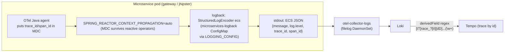

</details>

Verified live: gateway ECS logs now carry `trace_id`/`span_id`, and those ids
resolve to real traces in Tempo. Logs stay low-volume (apps run at `WARN`), so
trace context appears on the lines actually emitted inside a span — but the link
resolves whenever there is one.

### Observability Dashboards

Three dashboards live as plain JSON in
[`observability/grafana/dashboards/`](observability/grafana/dashboards/) and are
the **single source of truth**, re-applied on every deploy (no UI edits):

| Dashboard (uid) | Shows |
|---|---|
| `jenkins-overview` | Jenkins CI: active runs, queue, executors, pipeline results, build traces, pod logs |
| `microservices-overview` | Per-service HTTP RED, JVM/GC, restarts, traces table, pod logs |
| `k6-smoke-overview` | k6 iterations, checks/req-failed/p95 thresholds, run traces + logs |

Engineering decisions baked into the JSON:

- **Portable datasources**: panels reference `${DS_PROMETHEUS}` / `${DS_LOKI}` /
  `${DS_TEMPO}` template variables (defaulting to `grafanacloud-*`, degrading to
  the matching-type default in OSS) instead of hardcoded UIDs — the same JSON
  works in both modes.
- **Environment-scoped logs**: a hidden `namespace` variable resolves the real
  namespace per environment via
  `label_values(jvm_memory_used_bytes{deployment_environment="$deployment_environment"}, k8s_namespace_name)`,
  so log panels/links scope to `stable`→`microservices` vs
  `develop`→`microservices-develop` (service names are shared across envs).
- **Robust log rendering**: a fallback `line_format`
  `{{ if .message }}…{{ else if .msg }}…{{ else }}{{ __line__ }}{{ end }}`
  renders ECS-JSON app logs (`.message`), CloudNativePG/sidecar JSON (`.msg`) and
  plain-text lines (`__line__`) without ever showing blank lines.

<details>
<summary>🔍 Click to expand Dashboard Provisioning Diagram</summary>

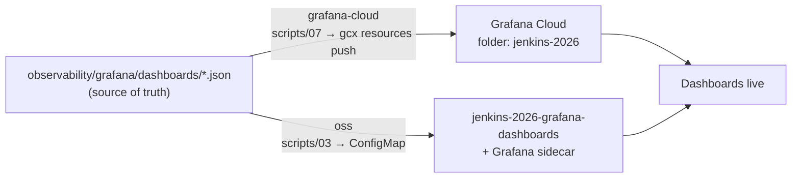

</details>

### Grafana OSS In-Cluster Mode

`observability.mode: oss` runs the **entire** stack in-cluster instead of
Grafana Cloud — useful for air-gapped demos or avoiding SaaS cost/quota. It is
**documented for completeness and kept at parity, but it is not the automated
target of this IaC** (the default and the path exercised by CI is
`grafana-cloud`). The OSS values exist and are `helm template`-validated, but
have not been run live.

<details>
<summary>🔍 Click to expand Grafana OSS In-Cluster Topology Diagram</summary>

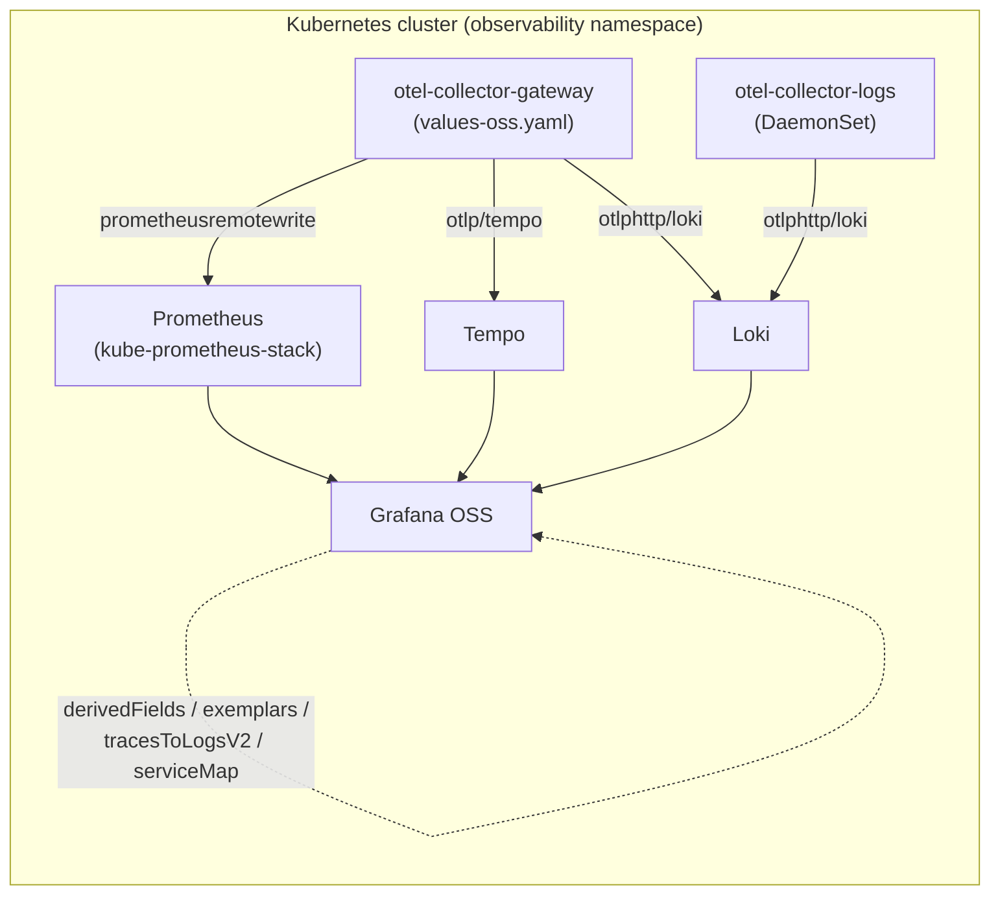

</details>

What parity required (so all four correlation directions work in OSS too):

- The same `span_metrics` + `service_graph` connectors in
  [`values-oss.yaml`](observability/otel-collector/values-oss.yaml), exporting via
  `prometheusremotewrite` to the in-cluster Prometheus (the `contrib` image is
  already used there).
- Datasource correlation in
  [`grafana/values-oss.yaml`](observability/grafana/values-oss.yaml): Tempo
  `tracesToLogsV2` + `tracesToMetrics` + `serviceMap` + `nodeGraph`, Prometheus
  `exemplarTraceIdDestinations`, and a Loki `derivedField` whose regex was
  broadened to match the ECS-JSON `"trace_id":"…"` (not just logfmt
  `trace_id=…`).
- The same logback ConfigMap + `SPRING_REACTOR_CONTEXT_PROPAGATION=auto` from the
  GitOps repo apply unchanged (they are mode-independent).

### Logging in to Amazon Managed Grafana (managed-aws)

Unlike the in-cluster apps (Jenkins/Argo/Headlamp), **Amazon Managed Grafana
(AMG) is not behind the GKE Gateway + Google IAP** — it is a managed AWS service,
so it cannot reuse that "Sign in with Google" path. AMG authenticates **only** via
**AWS IAM Identity Center** (the workspace's `AWS_SSO` mode) or **SAML 2.0**. Your
IAM *user* (the one your CLI uses) **cannot** sign in to the Grafana UI.

The cheapest, account-agnostic way in is a **native IAM Identity Center user**
(Identity Center and its users are free — no Google Workspace needed). This is the
AWS analogue of the `managed-azure` flow, where AMG-Azure is wired to Entra ID and
you just grant your Entra account admin. Do it **once** per person:

1. **Create the Identity Center user** — AWS console → *IAM Identity Center* (in
   the same region as the workspace) → **Users** → **Add user**: pick a username,
   your email, name, and choose **"Send an email … with password setup
   instructions"**. Follow that email to set your password.
2. **Grant Admin on the workspace** — AWS console → *Amazon Managed Grafana* →
   your `jenkins-2026-*` workspace → **Authentication** → **AWS IAM Identity
   Center** → **Assign new user or group** → select your user → then on its row
   **Action → Make admin**.
3. **Sign in** — open the workspace URL (`terraform -chdir=terraform/aws-managed-grafana
   output -raw grafana_endpoint`) and click **"Sign in with AWS IAM Identity
   Center"**. The custom dashboards are under *Dashboards → jenkins-2026/*.

<details>
<summary>CLI equivalent (steps 1–2)</summary>

```bash
export AWS_REGION=<workspace-region>
IDS=$(aws sso-admin list-instances --query 'Instances[0].IdentityStoreId' --output text)

# 1. native Identity Center user (edit name/email)
USER_ID=$(aws identitystore create-user --identity-store-id "$IDS" \
  --user-name "<you>" --display-name "<You>" \
  --name 'GivenName=<First>,FamilyName=<Last>' \
  --emails 'Value=<you@example.com>,Type=work,Primary=true' \
  --query UserId --output text)

# 2. grant ADMIN on the workspace
WS=$(terraform -chdir=terraform/aws-managed-grafana output -raw grafana_workspace_id)
aws grafana update-permissions --workspace-id "$WS" \
  --update-instruction-batch \
  "[{\"action\":\"ADD\",\"role\":\"ADMIN\",\"users\":[{\"id\":\"$USER_ID\",\"type\":\"SSO_USER\"}]}]"
```

> `create-user` does **not** send the password-setup email — trigger it from the
> console (*Users → select → Reset password → Send email*) or use **Forgot
> password** at the access portal for the first sign-in.

</details>

**Want true "Sign in with Google" like Jenkins?** That needs AMG in **SAML** mode
with Google as the IdP, which requires **Google Workspace** (paid) or **Google
Cloud Identity Free** (free, but you must stand up a managed directory for the
domain). The only way to get the *identical* IAP-gated Google SSO as the other
apps is the in-cluster [`oss` mode](#grafana-oss-in-cluster-mode) (Grafana behind
the Gateway), which replaces AMG.

## Headlamp (cluster management UI)

[Headlamp](https://headlamp.dev/) gives a web UI for the GKE cluster itself
(pods, deployments, logs, exec, RBAC, etc.), deployed by
[`scripts/08-headlamp.sh`](scripts/08-headlamp.sh) into the `headlamp`
namespace using [`helm/headlamp/values.yaml`](helm/headlamp/values.yaml).

**Access model**: Headlamp is upgraded to **0.43.0** and is configured to support Google OIDC authentication for user sessions while leveraging the pod's service account to communicate with GKE:

1.  **Google OIDC Session Authentication + Service Account Auth (Working GKE Integration)**:
    *   **How it works**: Users access the dashboard at `https://headlamp.<baseDomain>` (gated by IAP), click "Sign in with Google", and log in. Headlamp backend verifies the user's Google `id_token` (JWT) to authenticate their browser session, but interacts with the GKE API server using the pod's mounted `headlamp` ServiceAccount token.
    *   **Authorization**: API server access is managed via the `headlamp-admin` ClusterRoleBinding, which binds the `headlamp` ServiceAccount to the `cluster-admin` role.
    *   **Configuration**: Under [`helm/headlamp/values.yaml`](helm/headlamp/values.yaml), `config.unsafeUseServiceAccountToken` is set to `true`, `config.oidc.externalSecret.enabled` is `true` (referencing the `headlamp-credentials` Secret containing the OAuth client ID/secret), and `useAccessToken` is set to `false` (Google's access tokens are opaque `ya29.` strings and cannot be parsed as JWTs by Headlamp's token verifier).
2.  **Shared Service Account Auto-Login (Token-less Bypass)**: Alternatively, Headlamp can automatically authenticate every user as the pod's service account without an OIDC login screen.
    *   **How it works**: Bypasses the login screen entirely. Since GCP Identity-Aware Proxy (IAP) already gates the domain, access control is enforced at the network layer.
    *   **Configuration**: Set `config.unsafeUseServiceAccountToken: true` under [`helm/headlamp/values.yaml`](helm/headlamp/values.yaml) and disable `config.oidc.externalSecret.enabled`.

### One-time setup: Google OAuth client

Create a Google OAuth 2.0 **Web application** client (any GCP project will do - it doesn't need to be the same project as the GKE cluster):

1. [Google Cloud Console](https://console.cloud.google.com/) -> **APIs &
   Services** -> **Credentials** -> **Create credentials** -> **OAuth client
   ID** -> Application type **Web application**.
2. **Authorized redirect URIs**: add `http://localhost:8080/oidc-callback`
   (matches the `kubectl port-forward` instructions below). If
   [gateway.baseDomain](#public-access-gke-gateway-api--iap) is configured,
   also add `https://headlamp.<baseDomain>/oidc-callback` (e.g.
   `https://headlamp.jenkins2026.nubenetes.com/oidc-callback`) -
   [`scripts/lib/config.sh`](scripts/lib/config.sh) computes which one
   `OIDC_CALLBACK_URL` is set to.
3. Note the **Client ID** and **Client secret**. The client ID isn't
   inherently secret, but - like the client secret, which *is* sensitive -
   it's kept out of the repo for consistency; both are passed as the
   `HEADLAMP_OIDC_CLIENT_ID` / `HEADLAMP_OIDC_CLIENT_SECRET` secrets below.

### Adding your (or another) identity

Your Google account email is **never committed to this repo** - it's
supplied via the `HEADLAMP_ADMIN_EMAILS` secret (comma-separated for
multiple people) and consumed as a placeholder
(`J2026_HEADLAMP_ADMIN_EMAILS`/`JENKINS2026_HEADLAMP_ADMIN_EMAILS`) by
[`scripts/lib/config.sh`](scripts/lib/config.sh),
[`terraform/gke`](terraform/gke) (`TF_VAR_admin_emails`) and
[`scripts/08-headlamp.sh`](scripts/08-headlamp.sh). This is the list IAP lets
through to `https://headlamp.<baseDomain>` (and `https://jenkins.<baseDomain>`
- see [Public access](#public-access-gke-gateway-api--iap)). To grant access
to yourself or anyone else:

```bash
# comma-separated, no spaces needed (leading/trailing whitespace is trimmed)
gh secret set HEADLAMP_ADMIN_EMAILS --body "you@gmail.com,colleague@gmail.com"
```

then (re-)run **02.01 GKE provision** (adds the `roles/iap.httpsResourceAccessor`
IAM binding via `terraform/gke`). Locally (`test/e2e.sh` / `scripts/up.sh`),
export the same as `JENKINS2026_HEADLAMP_ADMIN_EMAILS` instead - never commit
it to `config/config.yaml`. `HEADLAMP_OIDC_CLIENT_ID`/`HEADLAMP_OIDC_CLIENT_SECRET`
(from the previous section) are only needed if/when the in-app OIDC above
becomes usable.

### Accessing and Logging in to the UI

Depending on your access model, you can open Headlamp using either:
*   **Public URL (IAP-secured):** `https://headlamp.jenkins2026.nubenetes.com` (requires Google login to pass the initial Google IAP gate).
*   **Local Port-Forward:** If accessing locally without the public gateway, run:
    ```bash
    kubectl -n headlamp port-forward svc/headlamp 8080:80
    ```
    Then open <http://localhost:8080> in your browser.

Once the Headlamp UI loads, you must authenticate against the Kubernetes API by pasting a token. There are two supported methods:

#### Option A: Log in with your Google ID (Recommended for GKE)
Because GKE natively integrates with GCP IAM, you can authenticate using your personal Google account credentials:
1. Open your local terminal (where you are authenticated to Google Cloud with your Google ID).
2. Generate your OAuth2 access token:
   ```bash
   gcloud auth print-access-token
   ```
3. Copy the output token (starts with `ya29.`).
4. Select the **Token** login option in Headlamp, paste this token, and click **Sign In**.
5. GKE will authenticate you as your Google account, and your permissions inside Headlamp will dynamically match your GCP IAM roles (e.g., if you are Project Owner or have `roles/container.admin`).

#### Option B: Log in with a ServiceAccount Token
If you want to log in using the cluster's default administrator ServiceAccount:
1. Generate the token:
   ```bash
   kubectl create token headlamp -n headlamp
   ```
2. Copy the token.
3. Select the **Token** login option in Headlamp, paste the token, and click **Sign In** (grants cluster-admin access).

#### Why IAP-Gated Access + Token Login over Native App-Level OIDC?
For managed Kubernetes environments like GKE, this setup (GCP IAP at the load balancer edge + `gcloud` access token login) is significantly more secure and stable than configuring full native OIDC inside Headlamp:
*   **Edge-Level Firewall (Google IAP):** With native OIDC, Headlamp's login page must be exposed to the public internet, leaving it vulnerable to scans and brute-force. With Google IAP, the entire site is firewalled at the Google Cloud load balancer. Unauthorized users are blocked with a `403 Forbidden` before a single packet ever reaches the container.
*   **Native GKE IAM Integration:** Standard Kubernetes clusters require custom configuration flags (`--oidc-issuer-url`, `--oidc-client-id`) to verify OIDC tokens. Because GKE is a managed Google Cloud service, its Kube-API server natively validates Google Cloud OAuth2 access tokens. Pasting your `gcloud` token allows GKE to map your actions directly to your GCP IAM roles (e.g. `roles/container.admin`), eliminating the need to manually sync and map OIDC scopes to cluster RoleBindings.
*   **Format Compatibility:** Google's OAuth2 access tokens are opaque strings (e.g., `ya29....`), not JWTs. Attempting to force native OIDC redirection inside GKE dashboards often fails with token verification or JWT parsing errors (such as the base64 decoding error).

## Public access (GKE Gateway API + IAP)


Jenkins, Microservices, Headlamp, and pgAdmin can all be exposed on
the public internet through a single **GKE Gateway** (`gatewayClassName:
gke-l7-global-external-managed`) - one global external HTTPS load balancer,
one [Google-managed wildcard
certificate](https://cloud.google.com/certificate-manager/docs/overview)
(Certificate Manager, DNS-authorized), and one `HTTPRoute` per app, all
applied by [`scripts/09-gateway.sh`](scripts/09-gateway.sh):

| App | URL | [Identity-Aware Proxy](https://cloud.google.com/iap) |
|---|---|---|
| Jenkins | `https://jenkins.<baseDomain>` | yes |
| Microservices | `https://microservices.<baseDomain>` | no (public demo app) |
| Headlamp | `https://headlamp.<baseDomain>` | yes |
| pgAdmin | `https://pgadmin.<baseDomain>` | yes |
| Grafana | `https://grafana.<baseDomain>` | yes (only when `observability.mode=oss`) |

`<baseDomain>` is [`gateway.baseDomain`](config/config.yaml) -
`jenkins2026.nubenetes.com` by default. Jenkins, Headlamp, pgAdmin, and (in
`oss` mode) Grafana get an extra Google-login gate (IAP) in front of their own
auth; Microservices, the demo app, stays open. The Grafana route is only
created in `observability.mode=oss` (in-cluster Grafana) - in `grafana-cloud`
mode Grafana lives at its `*.grafana.net` URL and isn't routed here. The Microservices URL is also
surfaced in the Jenkins UI's system message banner (see [`jenkins/casc/jcasc-base.yaml`](jenkins/casc/jcasc-base.yaml)).
**This whole feature is opt-in**: set
`JENKINS2026_BASE_DOMAIN=""` to disable it (no `Gateway`/`HTTPRoute`/
`GCPBackendPolicy` resources are created, e.g. before the one-time setup
below has been done) - `scripts/09-gateway.sh` is also a no-op on
`platform.target` other than `gke`, since `gke-l7-global-external-managed`
and `GCPBackendPolicy` are GKE-specific.

> [!IMPORTANT]
> **Why `enable_gateway` can be disabled vs. why it must be enabled in production/integration:**
> - **Why it can be disabled**:
>   1. **Bootstrapping Dependency**: During the initial cluster bootstrap, the global static IP and certificate maps are not yet provisioned. The Gateway resource will fail to program if created before those resources exist.
>   2. **Local/Developer flow**: Running in sandboxed or local clusters (like Minikube/Kind) where Gateway API or public DNS is unavailable. Disabling it allows fallback to `kubectl port-forward` on `localhost:8080` without certificate mapping.
> - **Why it must be enabled for production/integration**:
>   1. **OIDC/Dex Authentication**: When the gateway is disabled, the system configures redirection URLs (like `argocd-cm`'s `url`) to fall back to localhost or empty values. Trying to log in to ArgoCD or Jenkins via OIDC will fail with a `redirect_uri_mismatch` or `Invalid redirect URL` error because the browser's redirect URL does not match the configured OIDC client allowed redirect URIs.
>   2. **Pipeline Actions**: Pipeline integration stages and UI link banners rely on the public Gateway URLs.

> **Two non-obvious GKE Gateway API requirements**, confirmed against a live
> cluster and handled by [`scripts/09-gateway.sh`](scripts/09-gateway.sh):
> - The `Gateway` CRD rejects a `https` listener's `tls.mode: Terminate`
>   unless `tls.certificateRefs` or `tls.options` is non-empty - even though
>   the actual certificate comes from the `networking.gke.io/certmap`
>   annotation. The script adds the documented placeholder
>   `tls.options["networking.gke.io/pre-shared-certs"]: ""` to satisfy this.
> - `GCPBackendPolicy`'s `spec.default.iap.clientID` must be a literal OAuth
>   client ID string (not a Secret reference), and the Secret referenced by
>   `oauth2ClientSecret.name` must contain **exactly one** key
>   (`client_secret`). The script reads `client_id`/`client_secret` from the
>   `gateway-iap-oauth` Secret (created by
>   [`scripts/01-namespaces.sh`](scripts/01-namespaces.sh)) and derives a
>   single-key `gateway-iap-oauth-client-secret` Secret per namespace for
  `oauth2ClientSecret.name`.

### Authentication & Authorization Matrix

The table below outlines the authentication and authorization mechanisms for each of the deployed applications in the cluster:

| Application | Access Method | Edge-Level Authentication (GCP IAP) | App-Level Authentication | Authorization & Permissions |
|---|---|---|---|---|
| **Jenkins** | Public URL (`https://jenkins.<baseDomain>`) or `kubectl port-forward` | **Yes** (via Google IAP OAuth) | Google OIDC (`oic-auth` plugin) **or** local `admin` user basic auth | **Role-Based Authorization Strategy**:<br>- Default Google login: `authenticated-base` (Read-Only)<br>- Admin email (`JENKINS_OIDC_ADMIN_EMAIL`): `admin` (Overall/Administer)<br>- Escaped admin user: Full Admin |
| **ArgoCD** | Public URL (`https://argocd.<baseDomain>`) or `kubectl port-forward` | **Yes** (via Google IAP OAuth) | Google OIDC (via Dex connector) **or** local `admin` secret password | **ArgoCD RBAC Policies** (`argocd-rbac-cm`):<br>- Default OIDC login: `role:readonly`<br>- Admin email (`J2026_JENKINS_OIDC_ADMIN_EMAIL`): `role:admin`<br>- Jenkins API Account: `role:admin` via API token |
| **Headlamp** | Public URL (`https://headlamp.<baseDomain>`) or `kubectl port-forward` | **Yes** (via Google IAP OAuth) | Token Login (using GKE OAuth access token `ya29....` or ServiceAccount token) | **Kubernetes RBAC**:<br>- GKE maps your GCP Identity to Kubernetes permissions (Project Owner gets cluster-admin)<br>- ServiceAccount token maps to default headlamp-admin bindings |
| **pgAdmin** | Public URL (`https://pgadmin.<baseDomain>`) or `kubectl port-forward` | **Yes** (via Google IAP OAuth) | Webserver Auth (pgAdmin trusts `X-Goog-Authenticated-User-Email` header) | **Webserver User Mapping & Automated Password Injection**:<br>- Authenticated email is logged in directly to pgAdmin<br>- Database connections are automatically authenticated via a dynamically generated `.pgpass` file (secured via GKE RBAC secrets reader) |
| **Microservices** (Gateway & Backend) | Public URL (`https://microservices.<baseDomain>`) | **No** (Public Demo App) | JWT Token verification (Gateway issues JWT; microservices validate it) | **Spring Security Roles**:<br>- Enforces API authorization (e.g., `ROLE_USER`, `ROLE_ADMIN`) |

### Troubleshooting ArgoCD OIDC
If OIDC login to ArgoCD fails with `redirect_uri_mismatch`:
1. Ensure `gateway.baseDomain` matches the URL you are accessing.
2. Verify `argocd-cm` has the correct `dex.config` and the `url` field matches `https://argocd.<baseDomain>`.
3. Check that the OIDC Client's redirect URI in the Google Cloud Console matches the expected path: `https://argocd.<baseDomain>/api/dex/callback`.

### One-time setup

1. **Run the "01.02 Gateway bootstrap" workflow** (Actions tab -> **01.02
   Gateway bootstrap** -> **Run workflow**). It applies
   [`terraform/gateway-bootstrap`](terraform/gateway-bootstrap) (state in the
   same GCS bucket as `terraform/gke`, like [Grafana Cloud
   bootstrap](#one-time-setup)) to create, once and persistently:
   - a global static IP (`jenkins-2026-gateway-ip`), and
   - a Google-managed wildcard certificate for `<baseDomain>` and
     `*.<baseDomain>`, validated via a Certificate Manager DNS authorization.

   It's safe to re-run - re-applying against existing state is a no-op. The
   job summary prints the static IP and the DNS authorization record.

2. **Add the two DNS records it prints**, with your DNS provider for
   `<baseDomain>`'s parent domain. For the default
   `jenkins2026.nubenetes.com` (a subdomain of `nubenetes.com`, managed at
   **Squarespace** - Squarespace migrated domains off Google Domains in
   2023, but `nubenetes.com`'s nameservers are Google Cloud DNS
   (`ns-cloud-a[1-4].googledomains.com`) - Squarespace's "Custom records" UI
   manages that same Cloud DNS zone): go to **Domains** -> `nubenetes.com` ->
   **DNS** -> **Custom records**, and add:
   - a wildcard **A** record: host `*.jenkins2026`, value the static IP from
     step 1 (e.g. `34.120.231.149`).
   - the **CNAME** record from the workflow's "DNS authorization record"
     output: host `_acme-challenge.jenkins2026`, value something like
     `<random-id>.<n>.authorize.certificatemanager.goog.` (proves ownership
     of `jenkins2026.nubenetes.com` for the managed certificate).

   Double-check the CNAME value is copied **in full, including the trailing
   `.`** - Squarespace's UI truncates long values when displaying them, which
   is easy to mistake for the saved value also being truncated.

   Certificate provisioning can take up to ~1h after the DNS authorization
   record verifies. Check progress with:

   ```bash
   gcloud certificate-manager certificates describe jenkins-2026-cert \
     --format="yaml(managed.state,managed.provisioningIssue,managed.authorizationAttemptInfo)"
   ```

   `managed.state: ACTIVE` means it's done. While `PROVISIONING`, an
   `authorizationAttemptInfo[].issues: [CNAME_MISMATCH]` entry reflects
   Certificate Manager's **last** validation attempt - it only re-checks DNS
   periodically, so this can stay stale for a while even after you've fixed
   the record; re-verify the record itself with `dig` / `https://dns.google`
   rather than relying on this field to update immediately. Until the
   certificate is `ACTIVE`, HTTPS requests to `*.jenkins2026.nubenetes.com`
   fail with a TLS handshake error (e.g. curl's `SSL_ERROR_SYSCALL`) because
   the load balancer has no certificate attached yet.

3. **Create the IAP OAuth client by hand** (the Terraform resources for this,
   `google_iap_brand`/`google_iap_client`, are deprecated - the IAP OAuth
   Admin API they depend on was deprecated after July 2025). In the [GCP
   Console](https://console.cloud.google.com/): **APIs & Services** ->
   **Credentials** -> **Create credentials** -> **OAuth client ID** ->
   Application type **Web application**.

   **Authorized redirect URIs**: add (replacing `<client ID>` with the OAuth
   client ID you just created):

   ```
   https://iap.googleapis.com/v1/oauth/clientIds/<client ID>:handleRedirect
   ```

   Without this, IAP's post-login redirect back from Google fails with
   **Error 400: redirect_uri_mismatch**. This is the one redirect URI IAP
   uses regardless of how many apps/domains sit behind it, so a single OAuth
   client can be shared by the Jenkins, Headlamp, and pgAdmin `GCPBackendPolicy`
   resources.

   > [!IMPORTANT]
   > Because GCP IAP intercepts all traffic at the external load balancer level, you **do not** need to register individual application-level callback URLs (such as `https://pgadmin.jenkins2026.nubenetes.com/oauth2/authorize` or `https://headlamp.jenkins2026.nubenetes.com/oidc-callback`) in the Google Cloud Console.

   ```bash
   gh secret set IAP_OAUTH_CLIENT_ID     --body "<client ID>"
   gh secret set IAP_OAUTH_CLIENT_SECRET --body "<client secret>"
   ```

   (Re-)run **02.01 GKE provision** - `scripts/01-namespaces.sh` writes these into
   the `gateway-iap-oauth` Secret in the `jenkins`, `headlamp`, and `pgadmin` namespaces
   that the `GCPBackendPolicy` resources reference.

4. **IAP access control** reuses `HEADLAMP_ADMIN_EMAILS` (see
   [Headlamp](#headlamp-cluster-management-ui)): each listed email is granted
   both `roles/container.clusterViewer` (existing, for Headlamp's OIDC
   passthrough) and `roles/iap.httpsResourceAccessor` (new, via
   `terraform/gke`'s `google_project_iam_member.iap_accessors`) - i.e. the
   same people who can administer the cluster via Headlamp can pass IAP for
   Jenkins, Headlamp, and pgAdmin. Anyone without `roles/iap.httpsResourceAccessor` gets
   a 403 from IAP before reaching either app.

### Troubleshooting & Load Balancer Propagation Delay

When first provisioning the stack or rebuilding the GKE cluster, you may find that the public URLs (e.g., `https://jenkins.jenkins2026.nubenetes.com`) are not immediately reachable, even though the GitHub Actions deployment workflow has completed successfully.

#### Symptom: `SSL_ERROR_SYSCALL` or `unexpected eof`
If you attempt to access the URLs or run a curl command immediately after deployment:
```bash
curl -vk https://jenkins.jenkins2026.nubenetes.com/
# returns: OpenSSL SSL_connect: SSL_ERROR_SYSCALL in connection to ...
```
This indicates the connection is being closed abruptly during the TLS handshake.

#### Symptom: Intermittent `502 Bad Gateway`
A few minutes later, you might see `HTTP/2 502 Bad Gateway` from the load balancer:
```bash
curl -vkI https://jenkins.jenkins2026.nubenetes.com/
# returns: HTTP/2 502
```

#### Why does this happen?
1. **GFE Sync Delay:** The GKE Gateway API manages a global external HTTP(S) load balancer (`gke-l7-global-external-managed`). When created, Google Front End (GFE) edge proxies globally must receive and propagate the routing tables, SSL policies, and URL mappings. This process typically takes **5 to 10 minutes**.
2. **Certificate Manager Loading:** The Google-managed SSL Certificate is loaded via Certificate Manager Maps (`networking.gke.io/certmap`). The edge proxies take a few minutes to bind and activate the certificate maps on the forwarding rules.
3. **Backend NEG Sync:** Even after the Kubernetes pods are `Running` and backend service health checks are reporting `HEALTHY`, the load balancer's internal distribution of Network Endpoint Groups (NEGs) takes additional time to sync.

#### How to Verify & Troubleshoot
To confirm if the issue is just propagation delay or a real misconfiguration, verify the following:

1. **Verify DNS Resolution:** Ensure your wildcard domain resolves to the Gateway's external IP:
   ```bash
   ping -c 1 jenkins.jenkins2026.nubenetes.com
   # Should resolve to the gateway IP (e.g. 34.120.231.149)
   ```
2. **Verify Certificate State:** Check that the certificate is `ACTIVE` and domains are `AUTHORIZED`:
   ```bash
   gcloud certificate-manager certificates describe jenkins-2026-cert \
     --format="yaml(managed.state,managed.authorizationAttemptInfo)"
   ```
3. **Verify Certificate Map:** Confirm the wildcard entry is active:
   ```bash
   gcloud certificate-manager maps entries list --map=jenkins-2026-cert-map
   ```
4. **Verify Backend Health:** Check if the backend services are reporting `HEALTHY` endpoints:
   ```bash
   gcloud compute backend-services get-health gkegw1-y6i2-jenkins-jenkins-8080-p2ivomotuf95 --global
   ```

If all of the above are healthy/active, simply wait 5-10 minutes for the global load balancer to finish provisioning and routing traffic.

## Automated end-to-end test (provisioning + decommissioning)

[`test/e2e.sh`](test/e2e.sh) fully automates a real run of this PoC,
**including the GKE cluster itself** - the one exception to "this repo
assumes an existing cluster" (scoped entirely to `terraform/gke/` and
`test/`):

1. **`terraform -chdir=terraform/gke apply`** - provisions a throwaway GKE
   cluster: its own VPC/subnet and a 2-4 node autoscaling `e2-standard-8`
   node pool.
2. **`gcloud container clusters get-credentials`** - points `kubectl`/`helm`
   at the new cluster.
3. **`scripts/00-check-prereqs.sh` + `scripts/01-namespaces.sh`**.
4. **`scripts/up.sh`** - the full stack, exactly as in Quick start.
5. **`test/smoke-test.sh`** - verifies the Jenkins controller pod is `Running`
    and serves `/login`, the seed job created the stable pipelines (plus
    `seed-jobs`), the OTel Operator/collectors (and,
    for `oss` mode, Grafana) are running, and both Microservices namespaces have
    all `Deployment`s.
6. **`scripts/down.sh`** (with `J2026_DELETE_NAMESPACES=true`) then
   **`terraform -chdir=terraform/gke destroy`** - decommissions everything.

Step 6 runs **unconditionally** via an `EXIT` trap, even if steps 1-5 fail
partway through, so a failed run still leaves the GCP project clean.

### Running it

```bash
cp test/.env.example test/.env   # edit: at minimum set GCP_PROJECT_ID
set -a; source test/.env; set +a

gcloud auth login
gcloud auth application-default login

./test/e2e.sh
```

### Prerequisites

- A GCP project with billing enabled, and the authenticated principal having
  `roles/container.admin`, `roles/compute.networkAdmin`,
  `roles/iam.serviceAccountAdmin` and `roles/resourcemanager.projectIamAdmin`
  (or `roles/owner`/`roles/editor`).
- [`terraform`](https://developer.hashicorp.com/terraform/install) >= 1.9
  (developed against **1.15.x**) and the
  [`gcloud` CLI](https://cloud.google.com/sdk/docs/install), in addition to
  the [Prerequisites](#prerequisites) above (`kubectl`/`helm`/`yq`/etc).
- `observability.mode: grafana-cloud` (the default) requires
  `observability/otel-collector/secret.yaml` to already exist (Quick start
  step 2) - `test/e2e.sh` checks for it up front and fails fast with
  instructions if it's missing. For a fully self-contained run with **no**
  external account, `export JENKINS2026_OBS_MODE=oss` instead (see
  `test/.env.example`).

### GKE Cluster Topology & Sizing Rationale

The throwaway cluster is provisioned entirely via Terraform ([`terraform/gke/`](terraform/gke/)) with a custom VPC-native configuration optimized for stability and cost. A **persistent** global static IP and Google-managed wildcard TLS certificate ([`terraform/gateway-bootstrap/`](terraform/gateway-bootstrap/)) survive cluster rebuilds so DNS records never need updating:

<details>
<summary>🔍 Click to expand GKE Cluster Topology & Sizing Rationale Diagram</summary>

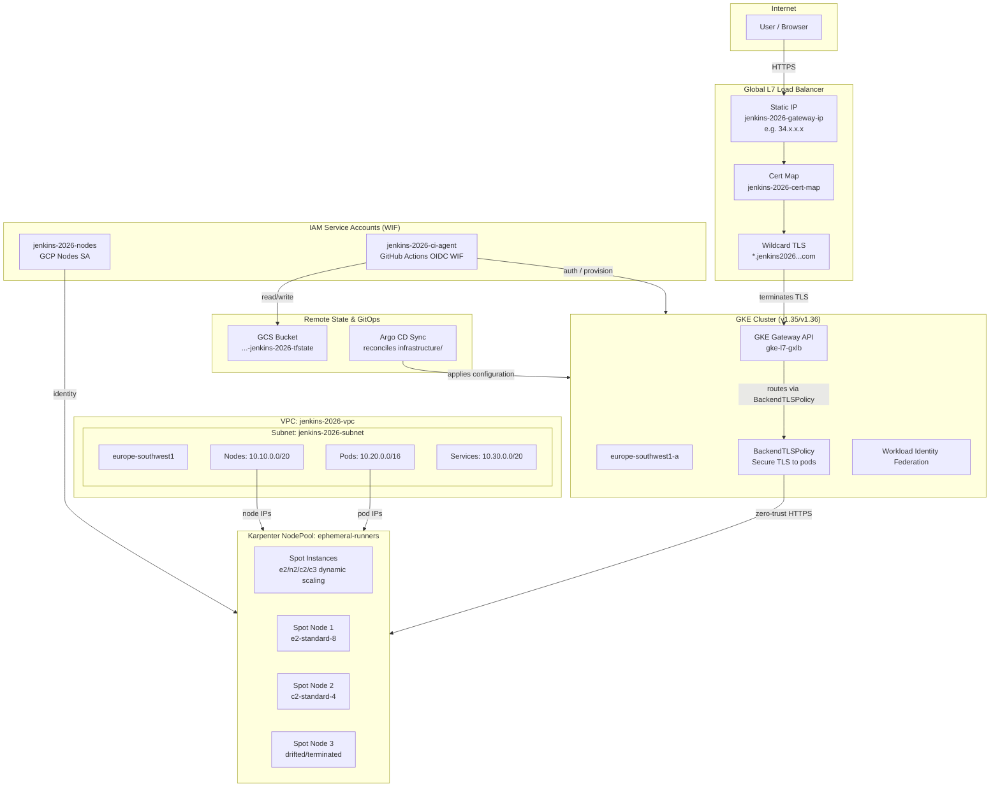

</details>

#### Detailed Infrastructure Specifications

| Layer | Resource | Details |
|---|---|---|
| **Static IP** | `jenkins-2026-gateway-ip` | Global `google_compute_global_address`. Persistent — survives cluster rebuilds. DNS `A` record `*.jenkins2026.nubenetes.com` points here (example: `34.x.x.x`). |
| **TLS Certificate** | `jenkins-2026-cert` | Google-managed wildcard certificate covering `jenkins2026.nubenetes.com` + `*.jenkins2026.nubenetes.com`. Validated via DNS authorization (`jenkins-2026-dns-auth`). |
| **Certificate Map** | `jenkins-2026-cert-map` | Maps `*.jenkins2026.nubenetes.com` to the managed certificate. Referenced by the GKE Gateway API L7 load balancer. |
| **VPC** | `jenkins-2026-vpc` | Custom-mode VPC (`auto_create_subnetworks = false`). No firewall rules or Cloud NAT defined — GKE manages egress natively. |
| **Subnet** | `jenkins-2026-subnet` | Region `europe-southwest1`. Primary range `10.10.0.0/20` (nodes), secondary `pods` `10.20.0.0/16`, secondary `services` `10.30.0.0/20`. |
| **GKE Cluster** | `jenkins-2026` | Zonal cluster in `europe-southwest1-a` (Madrid). VPC-native networking with IP aliasing. Release channel `REGULAR`. Gateway API `CHANNEL_STANDARD`. Workload Identity enabled (`project.svc.id.goog`). Deletion protection `false` (throwaway). |
| **Karpenter NodePool** | `ephemeral-runners` | Auto-provisions elastic worker nodes based on Spot instances (`c2`, `n2`, `e2`, `c3` families). Restricts node consolidation during business hours using aggressive `DisruptionBudgets` while scaling nodes down dynamically to zero under empty cycles. |
| **GCPNodeClass** | `ci-node-class` | Links Karpenter dynamic nodes to GKE subnet selectors, COS image families, and `100 GB pd-balanced` boot disks. |
| **Node SA** | `jenkins-2026-nodes` | Minimal-privilege service account: `roles/logging.logWriter`, `roles/monitoring.metricWriter`, `roles/monitoring.viewer`, `roles/artifactregistry.reader`. |
| **CI Agent SA** | `jenkins-2026-ci-agent` | GitHub Actions service account assuming identities via WIF (impersonating `roles/container.admin`, `roles/compute.networkAdmin`, etc.). |
| **WIF** | Pool `github-actions-pool-2026` / Provider `github-actions-provider` | OIDC federation from `token.actions.githubusercontent.com`. Attribute condition restricts access to your GitHub repository without static keys. |
| **State Bucket** | `${project}-jenkins-2026-tfstate` | GCS bucket in `us-central1`. Versioning enabled. Uniform bucket-level access. `force_destroy = false`. |
| **GCP APIs** | `container` + `compute` | Enabled with `disable_on_destroy = false` — remain active after cluster teardown to avoid breaking unrelated resources and slow re-enable times. |

#### Sizing Rationale (Stability vs. Resource Limits)
Running Jenkins, ArgoCD, pgAdmin, two Postgres database clusters (via CloudNative-PG Operator), OpenTelemetry operators (Gateway and DaemonSets), and the JHipster microservices stack requires significant memory and CPU.
If we scaled down the nodes to smaller types (e.g. `e2-standard-2` or `e2-medium`):
1. **OOM Kills**: Postgres clusters, Java microservice JVMs, and Jenkins build tools would run out of memory and get killed by the kernel.
2. **CPU Starvation**: Builds and application start times would become extremely slow, leading to flaky test failures and timeout errors.
3. **Pending Pods**: Pods would remain unscheduled due to resource limits, causing the GKE Cluster Autoscaler to spin up additional nodes anyway.
Using `e2-standard-8` with 3 nodes ensures a stable environment where all services run smoothly with enough headroom to spawn dynamic Jenkins builder executor pods.

### FinOps & Cost Analysis

This project integrates standard FinOps best practices to prevent unnecessary cloud spending:

- **Cluster Management Fee**: GKE charges a management fee of `$0.10/hour` (waived for your first zonal cluster per billing account).
- **Compute Instance Costs**: At Madrid (`europe-southwest1`) pricing, an `e2-standard-8` instance costs roughly `~$0.22/hour`.
- **Total Operational Run Rate**: The active 3-node cluster runs at approximately **`$0.70 - $0.80/hour`** (including disk storage and management fee).
- **Ephemeral Lifecycles**: A full provisioning, deployment, smoke-testing, and teardown run (`02.01` to `02.99`) takes only **15-25 minutes**, costing **`~$0.10 - $0.20` per execution**. You should *never* leave the cluster running overnight; always invoke **`02.99 GKE decommission`** when finished.
- **Elastic Karpenter Autoscaling**: Ephemeral build runners are dynamically provisioned on GKE Spot instance nodes. Under idle conditions, Karpenter scales the agent pool down to **0 nodes** to eliminate unnecessary compute costs. When a pipeline execution starts, Karpenter instantly spins up Spot nodes of the most cost-efficient type to handle the build load, and consolidates them (or scales back to 0) as soon as the build finishes. Strict disruption budgets prevent consolidation during core business hours to protect running pipelines.
- **Workload Limits & Quotas**: To enforce cost limits, pod resources are capped, and the `jenkins` namespace enforces a `ResourceQuota` preventing builders from scaling beyond node pool limits.
- **No In-Cluster Observability Cost**: By utilizing the free tier of Grafana Cloud for logs, metrics, and trace storage, there is zero storage cost in GCP for observability datasets.

### Resource Quotas & QoS (Cost Control)

To prevent GKE cluster auto-scaling (saving costs for this PoC) and ensure optimal QoS (Quality of Service) and stability, resource requests, limits, and namespace-level `ResourceQuota` objects are strictly configured across all components:

1. **Tight Pod Resource Allocations**:
   - **Microservices** (`gateway`, `jhipstersamplemicroservice`): CPU requests set to `100m` (limits to `1.0` CPU) and memory requests to `512Mi` (limits to `1Gi`).
   - **Postgres Database Instances**: CloudNative-PG database instances and PgBouncer pooler replicas, with resources constrained to requests: `50m` CPU / `128Mi` memory, limits: `200m` CPU / `256Mi` memory.
   - **Jenkins Controller**: Tighter footprint of `500m` CPU and `1.5Gi` memory requests (limits: `1.5` CPU and `3Gi` memory).
   - **Jenkins Build Agents & K6 Smoke Agents**: Minimized build agent containers (`maven`, `node`, `docker`, `helm`, `git`, `jnlp`) requesting `380m` CPU and `1.56Gi` (`1600Mi`) memory in total, with limits capped at `3.3` CPU and `3.875Gi` (`3968Mi`) memory.

   Below is the complete breakdown of configured CPU and memory requests and limits for all active workloads in the cluster:

   | Namespace | Workload Name | Workload Type | CPU Requests | CPU Limits | Memory Requests | Memory Limits |
   |---|---|---|---|---|---|---|
   | **jenkins** | `jenkins` | StatefulSet | `500m` | `1.5` | `1.5Gi` (`1536Mi`) | `3Gi` (`3072Mi`) |
   | **microservices** | `gateway` | Deployment | `100m` | `1.0` | `512Mi` | `1Gi` |
   | | `jhipstersamplemicroservice` | Deployment | `100m` | `1.0` | `512Mi` | `1Gi` |
   | | `postgres-gateway-1/2/3` | Pod (CNPG) | `50m` | `200m` | `128Mi` | `256Mi` |
   | | `postgres-gateway-pooler-...` | Pod (CNPG Pooler) | `50m` | `200m` | `128Mi` | `256Mi` |
   | | `postgres-jhipstersamplemicroservice-1/2/3` | Pod (CNPG) | `50m` | `200m` | `128Mi` | `256Mi` |
   | | `postgres-jhipstersamplemicroservice-pooler-...` | Pod (CNPG Pooler) | `50m` | `200m` | `128Mi` | `256Mi` |
   | **observability** | `otel-collector-gateway` | Deployment | `100m` | `500m` | `256Mi` | `512Mi` |
   | | `otel-collector-logs-agent` | DaemonSet | `100m` | `300m` | `128Mi` | `256Mi` |
   | | `otel-operator-opentelemetry-operator` | Deployment | `100m` | `500m` | `128Mi` | `256Mi` |
   | | `pdc-agent` | Deployment | `50m` | `200m` | `64Mi` | `128Mi` |
   | | `k8s-monitoring-alloy` | StatefulSet | `60m` | `400m` | `178Mi` | `512Mi` |
   | | `k8s-monitoring-alloy-operator` | Deployment | `50m` | `200m` | `128Mi` | `256Mi` |
   | | `k8s-monitoring-kube-state-metrics` | Deployment | `50m` | `200m` | `128Mi` | `256Mi` |
   | | `k8s-monitoring-node-exporter` | DaemonSet | `50m` | `200m` | `128Mi` | `256Mi` |
   | **argocd** | `argocd-application-controller` | StatefulSet | `100m` | `1.0` | `256Mi` | `1Gi` |
   | | `argocd-server` | Deployment | `100m` | `500m` | `128Mi` | `256Mi` |
   | | `argocd-repo-server` | Deployment | `100m` | `500m` | `256Mi` | `512Mi` |
   | | `argocd-redis` | Deployment | `100m` | `500m` | `128Mi` | `256Mi` |
   | | `argocd-dex-server` | Deployment | `50m` | `200m` | `128Mi` | `256Mi` |
   | | `argocd-applicationset-controller` | Deployment | `50m` | `200m` | `128Mi` | `256Mi` |
   | | `argocd-notifications-controller` | Deployment | `50m` | `200m` | `128Mi` | `256Mi` |
   | **headlamp** | `headlamp` | Deployment | `50m` | `200m` | `64Mi` | `128Mi` |
   | **pgadmin** | `pgadmin-pgadmin4` | Deployment | `100m` | `500m` | `256Mi` | `512Mi` |

2. **Namespace ResourceQuotas**:
   To enforce a hard ceiling and prevent the GKE auto-scaler from launching a third node, namespace-level `ResourceQuota` objects are deployed for all active namespaces:
   - `jenkins`: Requests max `3.0` CPU / `8.0Gi` memory (allowing concurrent build agents at a time).
     > [!NOTE]
     > To allow concurrent pipeline execution and optimize deployment throughput, the Jenkins cloud is configured with `containerCap: 2` in `helm/jenkins/values-common.yaml`. The namespace resource quota has been adjusted accordingly (`requests.cpu: "3.0"`, `requests.memory: "8.0Gi"`, `limits.cpu: "14"`, `limits.memory: "16.0Gi"`) to accommodate this parallelism safely and prevent pipeline agent quota exhaustion.
   - `microservices`: Requests max `1.5` CPU / `3.0Gi` memory.
   - `observability`: Requests max `3.0` CPU / `6.0Gi` memory (limits: `6.0` CPU / `10.0Gi` memory).
   - `argocd`: Requests max `1.5` CPU / `3.0Gi` memory.
   - `headlamp`: Requests max `200m` CPU / `256Mi` memory.

The sum of all namespace CPU and memory request quotas is strictly below the allocatable node pool capacity (total `7.8 vCPU` and `26 GiB` memory across the 2 active nodes). This guarantees that:
- Pods exceeding namespace quotas are rejected at admission, preventing them from sitting in a `Pending` state that would trigger GKE auto-scaling.
- Node usage is fully bounded, ensuring the cluster remains small and cost-effective.

### Terraform version & Stacks

`terraform/gke/` targets Terraform **1.15.x** (`required_version >= 1.9`) and
`hashicorp/google ~> 6.0`. [Terraform
Stacks](https://developer.hashicorp.com/terraform/cloud-docs/stacks) (the
newer multi-component/multi-deployment orchestration model) is an **HCP
Terraform**-only feature aimed at fleets of similar deployments across
environments - adopting it here would add an HCP Terraform account dependency
for what is a single throwaway cluster with local state, so this repo uses a
plain root module + local backend instead. The resources in
[`terraform/gke/main.tf`](terraform/gke/main.tf) can be lifted into a Stack
component largely as-is if you use HCP Terraform for your own infrastructure.

## CI/CD pipelines

All workflows live in [`.github/workflows/`](.github/workflows/), are
manually-triggered (`workflow_dispatch`), and follow a `CC.NN-<name>.yml`
naming convention so their order in the GitHub UI matches their place in the
lifecycle:

- `CC` - **category**: `01` persistent, account-level resources (bootstrap and decommission, run by hand, rarely); `02` the GKE cluster lifecycle (provision, component redeploys, decommission); `99` ad-hoc utilities and simulations.
- `NN` - sequence number within that category, in the order you'd typically run them. Within categories `01` and `02`, `.98` and `.99` are reserved for teardown (decommission) steps.

| # | Workflow | Category | What it does |
|---|---|---|---|
| 01.01 | [Grafana Cloud bootstrap](.github/workflows/01.01-grafana-cloud-bootstrap.yml) | One-time bootstrap | Creates/confirms the persistent Grafana Cloud stack (`terraform/grafana-cloud-stack`) that `observability_mode: grafana-cloud` sends data to. See [Full Grafana Cloud lifecycle automation](#one-time-setup-1). |
| 01.02 | [Gateway bootstrap](.github/workflows/01.02-gateway-bootstrap.yml) | One-time bootstrap | Creates/confirms the persistent static IP + managed wildcard cert + DNS authorization (`terraform/gateway-bootstrap`) that [public access](#public-access-gke-gateway-api--iap) depends on. |
| 01.03 | [Azure managed-grafana bootstrap](.github/workflows/01.03-azure-bootstrap.yml) | One-time bootstrap | Creates/confirms the persistent Azure backend (`terraform/azure-managed-grafana`: Azure Managed Grafana + Azure Monitor workspace + App Insights + Entra SP) that `observability_mode: managed-azure` sends data to. GitHub-OIDC → Azure auth. See [GitHub Actions automation](#github-actions-automation) step 6. |
| 01.04 | [AWS managed-grafana bootstrap](.github/workflows/01.04-aws-bootstrap.yml) | One-time bootstrap | Creates/confirms the persistent AWS backend (`terraform/aws-managed-grafana`: Amazon Managed Grafana + Amazon Managed Prometheus + CloudWatch + GKE→AWS OIDC provider + collector IAM role) that `observability_mode: managed-aws` sends data to. GitHub-OIDC → AWS auth. |
| 01.96 | [AWS managed-grafana decommission](.github/workflows/01.96-aws-decommission.yml) | One-time decommission | Destroys the persistent AWS backend (`terraform/aws-managed-grafana`). Run only when tearing down the AWS integration permanently. |
| 01.97 | [Azure managed-grafana decommission](.github/workflows/01.97-azure-decommission.yml) | One-time decommission | Destroys the persistent Azure backend (`terraform/azure-managed-grafana`). Run only when tearing down the Azure integration permanently. |
| 01.98 | [Grafana Cloud decommission](.github/workflows/01.98-grafana-cloud-decommission.yml) | One-time decommission | Destroys the persistent Grafana Cloud stack (`terraform/grafana-cloud-stack`). Run only when tearing down the environment permanently. |
| 01.99 | [Gateway decommission](.github/workflows/01.99-gateway-decommission.yml) | One-time decommission | Destroys the persistent static IP, cert mapping, and DNS authorization (`terraform/gateway-bootstrap`). Run only when tearing down the environment permanently. |
| 02.01 | [GKE provision](.github/workflows/02.01-gke-provision.yml) | GKE lifecycle | Provisions the throwaway GKE cluster (`terraform/gke`) and deploys the full stack (`scripts/up.sh`) + smoke test. Pair with 02.99. |
| 02.02 | [Redeploy Jenkins](.github/workflows/02.02-redeploy-jenkins.yml) | GKE lifecycle | Re-applies only `scripts/04-jenkins.sh` (Helm upgrade of `helm/jenkins/` + `jenkins/casc/` JCasC) and re-seeds the Microservices pipelines, against the cluster from the last 02.01 run - for a Jenkins-only fix without the full provision/decommission cycle. Run any number of times between 02.01 and 02.99. |
| 02.03 | [Redeploy Headlamp](.github/workflows/02.03-redeploy-headlamp.yml) | GKE lifecycle | Re-applies `scripts/01-namespaces.sh` (refreshes the non-sensitive OIDC config keys on `headlamp-credentials`) and `scripts/08-headlamp.sh` (Helm upgrade of `helm/headlamp/`), against the cluster from the last 02.01 run - for a Headlamp-only fix without the full provision/decommission cycle. Run any number of times between 02.01 and 02.99. |
| 02.99 | [GKE decommission](.github/workflows/02.99-gke-decommission.yml) | GKE lifecycle | Tears down the stack (`scripts/down.sh`) and destroys the GKE cluster (`terraform destroy`). |
| 99.01 | [Continuous Traffic Simulation](.github/workflows/99.01-traffic-simulation.yml) | Simulation | Runs a continuous stream of synthetic traffic (k6) against the stable endpoints to keep metrics and logs active in Grafana. |

See [GitHub Actions automation](#github-actions-automation) below for the
one-time setup (secrets, Workload Identity Federation) these workflows need.

## GitHub Actions automation

[`.github/workflows/02.01-gke-provision.yml`](.github/workflows/02.01-gke-provision.yml) and
[`.github/workflows/02.99-gke-decommission.yml`](.github/workflows/02.99-gke-decommission.yml)
are the CI equivalent of `test/e2e.sh`, split into two manually-triggered
workflows so the cluster can be left running between them (e.g. provision in
the morning, demo it, decommission in the evening). They run the exact same
`terraform/gke` + `scripts/0N-*.sh` + `test/smoke-test.sh` as `test/e2e.sh`,
but since each is a separate workflow run on a fresh runner, Terraform state
has to be **remote** (a GCS bucket) instead of local so the decommission run
can find what the provision run created. See [CI/CD
pipelines](#cicd-pipelines) for the full workflow inventory.

### Bootstrapping Architecture: Persistent vs. Short-Lived Resources

To keep operating costs low and deployment speed high, this project separates the environment lifecycle into **short-lived workload resources** (GKE cluster, database pods, Helm releases) and **persistent, account-level resources (bootstrap)**. We use specialized bootstrap stages for the following reasons:

1. **GCP Auth and Terraform State (`terraform/bootstrap`)**:
   - **Workload Identity Federation (WIF)**: Establishes a secure, keyless trust relationship between GitHub Actions and your GCP project. GitHub can authenticate dynamically using OpenID Connect (OIDC) tokens instead of saving permanent GCP service account JSON keys inside repository secrets.
   - **GCS Remote Backend**: Sets up the persistent bucket where all GHA workflow runs store and retrieve Terraform state.

2. **Persistent Observability Backend (`01.01 Grafana Cloud bootstrap`)**:
   - Applies the persistent Grafana Cloud stack (`terraform/grafana-cloud-stack`). By decoupling the metrics/tracing backend from the GKE cluster, your logs, metrics, and trace history are preserved across multiple cluster spin-ups and tear-downs.

3. **Persistent External DNS & Networking (`01.02 Gateway bootstrap`)**:
   - Provisions GCP global networking resources: a persistent static IP (`jenkins-2026-gateway-ip`), DNS authorizations, and the wildcard SSL certificate map (`jenkins-2026-cert-map`).
   - If these networking assets were tied to the short-lived GKE cluster, deleting the cluster would release the IP address and destroy the SSL certificate. This would force you to manually update DNS records at your domain registrar (e.g. Squarespace) and wait for DNS propagation every single time you provisioned a new cluster. Keeping the gateway bootstrapped persistently ensures your external endpoints are immediately reachable upon cluster creation.

4. **Persistent Database Backups Storage (`terraform/bootstrap`)**:
   - **Postgres Backups Bucket**: Configures the persistent GCS bucket `jenkins-2026-postgres-backups` with automated storage lifecycles (transition to `NEARLINE` after 3 days, delete after 7 days) to preserve backup histories across throwaway GKE lifecycle runs.
   - **Access Security**: Grants the GHA CI service accounts `storage.admin` permissions to manage bucket-level IAM policy bindings, enabling dynamic node service account access configuration during GKE provision runs.

### Workflow Architecture & Lifecycle Diagram

The following diagram illustrates how the persistent infrastructure bootstrap workflows, the GKE cluster provisioning/decommissioning pipelines, the application-specific redeployments, and the traffic simulation workflow interact:

<details>
<summary>🔍 Click to expand Workflow Architecture & Lifecycle Diagram</summary>

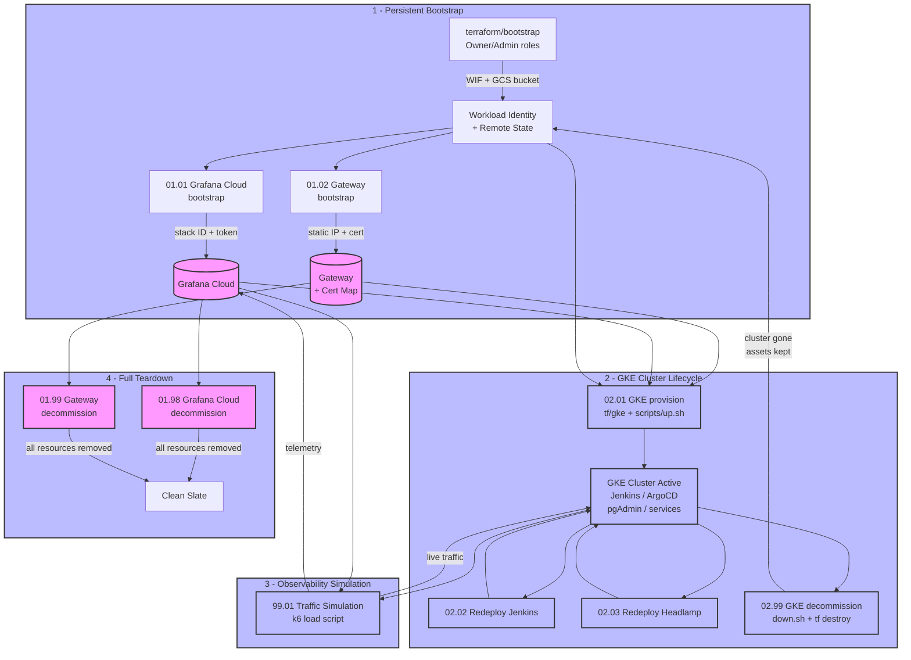

</details>

#### Detailed Workflow Reference and Lifecycle Management

##### 1. Persistent Bootstrap Workflows
- **`01.01 Grafana Cloud bootstrap`**: Provisions a dedicated Grafana Cloud stack (hosted metrics/traces/logs backend) using `terraform/grafana-cloud-stack`. By separating the observability backend from the short-lived GKE cluster, application performance metrics and history are preserved permanently, remaining readable even after GKE is decommissioned and rebuilt from scratch.
- **`01.02 Gateway bootstrap`**: Provisions account-level GCP networking assets using `terraform/gateway-bootstrap`. This includes a reserved external IP (`jenkins-2026-gateway-ip`), DNS authorizations, and a Google-managed wildcard SSL certificate map. Keeping this IP and SSL certificate persistent avoids losing the reserved IP during a GKE rebuild, eliminating the need to update wildcard DNS records at your domain registrar and wait for DNS propagation.

##### 2. Persistent Decommission Workflows (Clean Slate)
When you want to tear down the entire project permanently, you must run the decommission workflows in the reverse order of setup to avoid dangling resources:
1. Run **`02.99 GKE decommission`** first to destroy the active GKE cluster and all internal Kubernetes workloads (releasing short-lived target bindings).
2. Run **`01.98 Grafana Cloud decommission`** to run `terraform destroy` on the Grafana Cloud stack, which removes the Grafana instances, access policies, and dashboards.
3. Run **`01.99 Gateway decommission`** to run `terraform destroy` on the gateway resources, freeing the reserved external IP, removing the wildcard SSL certificate map, and deleting GCP DNS authorizations.

> [!WARNING]
> Decommissioning the gateway (`01.99`) releases the external IP address. If you recreate the gateway later, a *new* IP will be allocated, forcing you to update your DNS provider's A records and wait for DNS propagation. Only decommission the gateway if you plan to shut down the environment permanently.

### Version Pinning and Lifecycle Alignment

To support deterministic deployments and clean, error-free environment destruction, all GKE lifecycle workflows support custom Git reference checking:

* **Workflows Supported**:
  * [02.01 GKE provision](file:///home/inafev/github/jenkins-2026/.github/workflows/02.01-gke-provision.yml)
  * [02.02 Redeploy Jenkins](file:///home/inafev/github/jenkins-2026/.github/workflows/02.02-redeploy-jenkins.yml)
  * [02.03 Redeploy Headlamp](file:///home/inafev/github/jenkins-2026/.github/workflows/02.03-redeploy-headlamp.yml)
  * [02.99 GKE decommission](file:///home/inafev/github/jenkins-2026/.github/workflows/02.99-gke-decommission.yml)

#### The `git_ref` Parameter
Each of these workflows includes a manual trigger input `git_ref` (which defaults to `""` / empty). 

* **Leave Empty (Recommended)**: The checkout action automatically defaults to the branch or tag selected in the native **"Use workflow from"** dropdown menu.
* **Provide Value**: You can type in any valid branch name, tag (e.g. `v0.9.1`), or commit SHA. If specified, this custom reference will override the dropdown selection.

#### Form Fields Detailed Reference (02.01 GKE Provision Form)

When executing the **02.01 GKE provision** workflow manually, you are presented with a form containing the following fields:

1. **Use workflow from (Dropdown - Native)**:
   - **Type**: Dynamic Git Reference Selector.
   - **Purpose**: Selects the branch or tag from which GitHub Actions loads the workflow YAML file.
   - **How to Use**: Select the target branch (e.g. `develop`) or tag (e.g. `v0.9.1`) you want to run. If the `git_ref` field below is left empty, the runner will check out this exact reference.

2. **observability_mode (Dropdown - Choice)**:
   - **Type**: Choice (`grafana-cloud` | `oss` | `managed-azure` | `managed-aws`).
   - **Default**: `grafana-cloud`.
   - **Purpose**: Overrides the `observability.mode` setting defined in `config/config.yaml` for this execution lifecycle:
     - `grafana-cloud`: Forwards cluster telemetry (logs, metrics, traces) to Grafana Cloud via OTLP.
     - `oss`: Installs in-cluster Grafana, Prometheus, Loki, and Tempo in the `observability` namespace.
     - `managed-azure`: Exports to Azure Monitor (managed Prometheus + Application Insights/Log Analytics); visualized in Azure Managed Grafana. Requires the `azure-monitor-credentials` Secret (see [`docs/observability.md`](docs/observability.md#managed-azure)).
     - `managed-aws`: Exports to Amazon Managed Service for Prometheus + X-Ray/CloudWatch; visualized in Amazon Managed Grafana. Requires the `aws-managed-credentials` Secret (see [`docs/observability.md`](docs/observability.md#managed-aws)).

3. **enable_gateway (Checkbox - Boolean)**:
   - **Type**: Boolean (`true` | `false`).
   - **Default**: `false`.
   - **Purpose**: Determines whether the public GKE Gateway L7 load balancer should be provisioned.
   - **Prerequisites**: Setting this to `true` requires you to have already executed the persistent `01.02 Gateway bootstrap` workflow, set up wildcard DNS A records pointing to the external static IP, and configured Google OAuth client credentials for Identity-Aware Proxy (IAP). If set to `false`, endpoints are only reachable internally (via port-forwarding).

4. **git_ref (Text Box - String)**:
   - **Type**: String.
   - **Default**: `""` (empty).
   - **Purpose**: A manual override field to specify any git commit SHA, branch name, or tag.
   - **How to Use**:
     - **Leave Empty**: (Recommended) The workflow automatically checks out the branch/tag chosen in the **Use workflow from** dropdown above.
     - **Provide Value**: If you need to target a specific, non-selectable Git commit SHA (e.g., `d464dae8...`) or test a different branch than the workflow config source, type it here. It will override the dropdown selection.

#### ⚠️ The Danger of Divergent References
Mixing different tags, branches, or SHAs during the lifecycle of a single GKE cluster will cause immediate deployment and state management failures:

1. **Terraform State Conflicts**: If you provision GKE using tag `v0.8.0` and later run the decommission workflow targeting `v0.9.0`, Terraform will compare the stored GCS backend state against updated node pool, VPC, or IAM definitions. This causes plan mismatches, resource lockups, or deletion failures because resources in the cluster no longer map to the configurations in the checked-out code.
2. **Helper Script & Template Divergence**: Platform components rely on configuration schemas in `config/config.yaml`. If you run scripts from a ref where namespace naming conventions, credential keys, or database operator formats differ from the active GKE state, updates will fail.
3. **Application and Database Incompatibility**: Deployed microservices connect to resources whose details are maintained in the GitOps config repository (`jenkins-2026-gitops-config`). If you use mismatched versions between the main infra repo and the GitOps repo, the application pods will crash due to missing secrets, incorrect network policies, or deprecated database schemas.

> [!IMPORTANT]
> **Rule of lockstep alignment**:
> 1. Always ensure that the `git_ref` used for provisioning (`02.01`) matches the `git_ref` used for decommissioning (`02.99`) and redeployments (`02.02` / `02.03`).
> 2. For stable releases, tag both repositories in lockstep (e.g. `v0.9.0` tag in `jenkins-2026` and `jenkins-2026-gitops-config`) and input that tag name in the `git_ref` parameter when triggering the workflows.

### Environment Protection and Manual Approvals

To enforce cost control (FinOps), auditability, and guard against accidental destruction of active resources, all critical provisioning and decommissioning workflows are protected by a GitHub Actions environment:

* **Protected Workflows**:
  - `02.01 GKE provision` (provisions nodes, networking, and platform services)
  - `02.99 GKE decommission` (wipes cluster resources and destroys VMs)
  - `01.98 Grafana Cloud decommission` (revokes metrics stacks and API keys)
  - `01.99 Gateway decommission` (releases global external static IP and certificate maps)
* **Environment Name**: `gke-production`

#### 🛡️ Setting up Environment Rules in GitHub
Before triggering these workflows, repository administrators must configure environment protection rules to enforce approvals. This can be done either manually via the web interface or automated via the GitHub CLI (`gh`).

##### Option A: Manual Setup (GitHub Web UI)
1. Navigate to **Settings** -> **Environments** on your GitHub repository.
2. Click **New environment** and name it exactly: `gke-production`.
3. Under **Environment protection rules**, check the **Required reviewers** box.
4. Add the designated reviewers (developers or administrators) who must authorize deployments.
5. Save the configuration.

##### Option B: Automated Setup (GitHub CLI)
If you have the GitHub CLI installed and authenticated, you can configure the environment and set required reviewers programmatically:

1. Retrieve the numeric GitHub ID of the user you want to set as a reviewer:
   ```bash
   gh api user -q '.id'
   ```
2. Create or update the `gke-production` environment with the reviewer:
   ```bash
   gh api --method PUT repos/nubenetes/jenkins-2026/environments/gke-production \
     --header "Accept: application/vnd.github+json" \
     --input - <<EOF
   {
     "prevent_self_review": false,
     "reviewers": [
       {
         "type": "User",
         "id": <USER_ID>
       }
     ]
   }
   EOF
   ```

With this configuration active, triggering any of the protected workflows will pause execution at the start of the job. GitHub will notify the reviewers, and execution will only resume once an authorized reviewer clicks **Approve**.

### One-time setup


> **Why this step can't itself run in GitHub Actions**: `02.01-gke-provision.yml`
> and `02.99-gke-decommission.yml` authenticate to GCP via Workload Identity
> Federation (WIF) - but that WIF trust relationship, the CI service account,
> and the GCS state bucket don't exist yet. Something has to create them
> first using *real* GCP credentials, which is exactly what
> `terraform/bootstrap` does. This is a one-time, local "break glass" step;
> every run after that (provisioning, deploying, smoke-testing, decommission)
> happens entirely in GitHub Actions. There's no way around this for the
> *first* setup - any approach to creating WIF trust ultimately needs an
> already-trusted identity to grant it.

1. **Authenticate locally** as a principal with `roles/owner` (or
   `roles/editor` + `roles/resourcemanager.projectIamAdmin`) on your GCP
   project - the same one used for [`test/e2e.sh`](#running-it):

   ```bash
   gcloud auth login
   gcloud auth application-default login
   ```

2. **Run `terraform/bootstrap`** once. This creates the GCS state bucket and
   a Workload Identity Federation pool/provider + service account that
   GitHub Actions will use to authenticate to GCP **without a JSON key**:

   ```bash
   cd terraform/bootstrap
   cp terraform.tfvars.example terraform.tfvars
   # edit terraform.tfvars: set project_id (and github_repo if you forked this repo)

   terraform init
   terraform apply
   terraform output    # copy these 4 values into GitHub secrets below
   ```

   Keep `terraform/bootstrap/terraform.tfstate` (gitignored, local-only) -
   it's the only record of these resources; see the comment in
   [`terraform/bootstrap/versions.tf`](terraform/bootstrap/versions.tf).

3. **Add repository secrets**, from the `terraform output` above:

   | Secret | From output |
   |---|---|
   | `GCP_PROJECT_ID` | `project_id` |
   | `GCP_WORKLOAD_IDENTITY_PROVIDER` | `workload_identity_provider` |
   | `GCP_SERVICE_ACCOUNT` | `ci_service_account_email` |
   | `TF_STATE_BUCKET` | `state_bucket` |

   **Option A - GitHub CLI (`gh`, recommended)**, from `terraform/bootstrap`
   (run right after `terraform apply`, so `terraform output` still has the
   values):

   ```bash
   cd terraform/bootstrap
   gh secret set GCP_PROJECT_ID                --body "$(terraform output -raw project_id)"
   gh secret set GCP_WORKLOAD_IDENTITY_PROVIDER --body "$(terraform output -raw workload_identity_provider)"
   gh secret set GCP_SERVICE_ACCOUNT           --body "$(terraform output -raw ci_service_account_email)"
   gh secret set TF_STATE_BUCKET               --body "$(terraform output -raw state_bucket)"
   ```

   `gh secret set` defaults to the repo of the current directory's git
   remote; add `--repo nubenetes/jenkins-2026` (or your fork) to target it
   explicitly. Verify with `gh secret list`.

   **Option B - GitHub web UI**: go to the repo -> **Settings** -> **Secrets
   and variables** -> **Actions** -> **New repository secret**, and for each
   row of the table above, paste the **Secret** name (e.g.
   `GCP_PROJECT_ID`) and the corresponding `terraform output -raw <name>`
   value as the **Value**. Print all four at once with:

   ```bash
   for o in project_id workload_identity_provider ci_service_account_email state_bucket; do
     echo "$o -> $(terraform -chdir=terraform/bootstrap output -raw "$o")"
   done
   ```

4. **Optional secrets**, only needed if you use the corresponding feature -
   set the same way, e.g. `gh secret set REGISTRY_PASSWORD --body "<token>"`:

   | Secret | Needed for |
   |---|---|
   | `REGISTRY_USERNAME` / `REGISTRY_PASSWORD` | pushing Microservices images to, and pulling them back from, a private registry (`scripts/01-namespaces.sh`) |
   | `GIT_USERNAME` / `GIT_TOKEN` | cloning a private Microservices fork |
   | `GRAFANA_TRACES_DASHBOARD_UID` / `OTEL_LOGS_BACKEND_URL` | `observability_mode: grafana-cloud` extras - a "View trace in Grafana" link UID and the logs Explore URL (see `observability/otel-collector/secret.example.yaml`); both optional even then |
   | `HEADLAMP_OIDC_CLIENT_ID` / `HEADLAMP_OIDC_CLIENT_SECRET` | Google OAuth client for Headlamp login (see [Headlamp](#headlamp-cluster-management-ui)) |
   | `HEADLAMP_ADMIN_EMAILS` | comma-separated Google account emails granted cluster-admin via Headlamp **and** IAP access to Jenkins/Headlamp - **your own email, never committed to the repo** (see [Headlamp](#headlamp-cluster-management-ui) and [Public access](#public-access-gke-gateway-api--iap)) |
   | `JENKINS_OIDC_CLIENT_ID` / `JENKINS_OIDC_CLIENT_SECRET` | Google OAuth client for Jenkins "Sign in with Google" (see [Google login](#google-login-openid-connect)) |
   | `JENKINS_OIDC_ADMIN_EMAIL` | Google account email granted the Jenkins `admin` role via OIDC login - **your own email, never committed to the repo** (see [Google login](#google-login-openid-connect)) |
   | `IAP_OAUTH_CLIENT_ID` / `IAP_OAUTH_CLIENT_SECRET` | OAuth client gating Jenkins/Headlamp via Identity-Aware Proxy (see [Public access](#public-access-gke-gateway-api--iap)) |
   | `AZURE_CLIENT_ID` / `AZURE_TENANT_ID` / `AZURE_SUBSCRIPTION_ID` / `AZURE_GRAFANA_ADMIN_OBJECT_IDS` | `observability_mode: managed-azure` - **identifiers only, no secret**: the GitHub-OIDC Entra app the `01.03 Azure bootstrap` workflow logs in as, plus the comma-separated Entra object IDs granted Grafana Admin. The actual Azure backend credentials never become GitHub secrets - `02.01` reads them from the `terraform/azure-managed-grafana` GCS state outputs (see [`docs/observability.md`](docs/observability.md#managed-azure)) |
   | `AWS_BOOTSTRAP_ROLE_ARN` / `AWS_REGION` / `GKE_OIDC_ISSUER_URL` | `observability_mode: managed-aws` - **identifiers only, no secret**: the IAM role the `01.04 AWS bootstrap` workflow assumes via GitHub OIDC, the region, and the GKE cluster's OIDC issuer URL (federates the collector SA to its IAM role). The AWS backend coordinates never become GitHub secrets - `02.01` reads them from the `terraform/aws-managed-grafana` GCS state outputs, and the collector authenticates with a web-identity token, not access keys (see [`docs/observability.md`](docs/observability.md#managed-aws)) |

   `gateway.baseDomain` (default `jenkins2026.nubenetes.com`) is **not** a
   secret - it's committed in `config/config.yaml`. Override it via the
   `JENKINS2026_BASE_DOMAIN` env var for forks using a different domain, or
   set it to `""` to disable public access entirely (see [Public
   access](#public-access-gke-gateway-api--iap)).

5. **(Optional) Full Grafana Cloud lifecycle automation**, for
   `observability_mode: grafana-cloud`. Without this, picking that mode in
   **02.01 GKE provision** will fail at `terraform apply` in
   `terraform/grafana-cloud-token` - skip this step entirely if you only plan
   to use `oss`, `managed-azure`, or `managed-aws`.

   This provisions one **persistent** Grafana Cloud stack (once, locally,
   like step 2 above), then lets every `02.01-gke-provision`/`02.99-gke-decommission`
   run mint and revoke **ephemeral**, scoped access tokens against it -
   no manual `observability/otel-collector/secret.yaml` needed.

   a. **Create a Grafana Cloud Access Policy token** - this is the one
      unavoidable manual credential, since Grafana Cloud has no equivalent
      of GCP's Workload Identity Federation (used in steps 1-3) for
      federating GitHub Actions: its API only supports static
      organization-level tokens. In the [Grafana Cloud
      portal](https://grafana.com), go to your org -> **Administration** ->
      create an access policy with the following configuration:

      - **Name**: `jenkins-2026-bootstrap`
      - **Realm**: Select your **Organization** (this is required to manage
        multiple stacks or look up stack details by slug).
      - **Scopes**: Add the following mandatory scopes:
        - `stacks:read` / `stacks:write` / `stacks:delete`: To manage the
          Grafana Cloud stack itself.
        - `accesspolicies:read` / `accesspolicies:write` / `accesspolicies:delete`:
          To mint the ephemeral OTLP ingest tokens.
        - `stack-service-accounts:write`: To create the "Editor/Admin" service
          account used for dashboards and datasources.
        - `datasources:read` / `datasources:write`: To provision the Jenkins
          datasource.
        - `pdc:read` / `pdc:write`: To manage the Private Data Source Connect
          network.
        - `stack-plugins:read` / `stack-plugins:write`: To ensure the required
          Jenkins plugin is available.

      Then, create a **Token** for this policy and save it.

      > **Note on Authentication**: This project uses a **dual-token
      > architecture**. The org-level token you just created manages
      > Cloud infrastructure. Once the stack is ready, Terraform uses it to
      > create an **internal Service Account (Admin role)** and uses *that*
      > SA's token to manage resources inside the Grafana instance (like
      > the Jenkins Datasource). This separation resolves 401 Unauthorized
      > issues that occur when using Cloud-level tokens for Instance-level
      > APIs.


   b. **Add a repository secret and a variable** - `GRAFANA_CLOUD_STACK_SLUG` is your
      choice of subdomain for the new stack
      (`https://<slug>.grafana.net`, must be globally unique). Note that `GRAFANA_CLOUD_STACK_SLUG`
      should be configured as a repository **Variable** (not a Secret) so that GitHub Actions does
      not mask it with `***` in the logs, which keeps printed Grafana dashboard URLs clickable:

      ```bash
      gh secret set   GRAFANA_CLOUD_API_TOKEN   --body "<token from step a>"
      gh variable set GRAFANA_CLOUD_STACK_SLUG  --body "<your-globally-unique-slug>"
      ```

   c. **Run the "01.01 Grafana Cloud bootstrap" workflow** (Actions tab ->
      **01.01 Grafana Cloud bootstrap** -> **Run workflow**). It applies
      [`terraform/grafana-cloud-stack`](terraform/grafana-cloud-stack) with
      state in the same GCS bucket as `terraform/gke`, creating the
      persistent stack from the configuration above. If `GRAFANA_CLOUD_STACK_SLUG`
      is already taken, Terraform fails with a clear error - pick another
      value, `gh variable set GRAFANA_CLOUD_STACK_SLUG --body "<new-slug>"`, and
      re-run the workflow. It's safe to re-run any time - re-applying against
      existing state is a no-op.

      (Alternatively, run it locally instead: `cd terraform/grafana-cloud-stack
      && cp terraform.tfvars.example terraform.tfvars` - set `stack_slug` -
      `export TF_VAR_grafana_cloud_api_token=... && terraform init && terraform
      apply`. Keep `terraform.tfstate`, gitignored, if you do this.)

   From here on, every `02.01-gke-provision` run with `observability_mode:
   grafana-cloud` applies
   [`terraform/grafana-cloud-token`](terraform/grafana-cloud-token) to mint a
   scoped OTLP access policy token + dashboard service account token against
   this stack and writes them into the `grafana-cloud-credentials` Secret;
   every `02.99-gke-decommission` run destroys the same Terraform state, revoking
   both tokens.

6. **(Optional) Azure backend for `observability_mode: managed-azure`.**
   Provisioned once via the **01.03 Azure bootstrap** workflow (state in the
   same GCS bucket as `terraform/gke`), authenticating to Azure with **GitHub
   OIDC - no long-lived secret stored**, the same key-less philosophy as the
   GCP Workload Identity Federation in steps 1-3. All sensitive inputs are
   GitHub secrets injected as `TF_VAR_*` / `ARM_*` by the workflow; nothing
   sensitive is written to the repo.

   a. **Create the GitHub-OIDC Entra app** (one-time, the only manual Azure
      step - analogous to creating the GCP WIF pool). With the Azure CLI
      (`az login` first):

      ```bash
      SUB="<your-subscription-id>"; REPO="<owner>/<repo>"
      APP_ID=$(az ad app create --display-name "jenkins-2026-github-oidc" --query appId -o tsv)
      az ad sp create --id "$APP_ID"
      az ad app federated-credential create --id "$APP_ID" --parameters \
        "{\"name\":\"github-azure-bootstrap\",\"issuer\":\"https://token.actions.githubusercontent.com\",\"subject\":\"repo:${REPO}:environment:azure-bootstrap\",\"audiences\":[\"api://AzureADTokenExchange\"]}"
      az role assignment create --assignee "$APP_ID" --role "Contributor"               --scope "/subscriptions/${SUB}"
      az role assignment create --assignee "$APP_ID" --role "User Access Administrator" --scope "/subscriptions/${SUB}"
      ```

   b. **Set the identifier secrets** (no secret values - just IDs):

      ```bash
      gh secret set AZURE_CLIENT_ID                --body "$APP_ID"
      gh secret set AZURE_TENANT_ID               --body "$(az account show --query tenantId -o tsv)"
      gh secret set AZURE_SUBSCRIPTION_ID         --body "$SUB"
      gh secret set AZURE_GRAFANA_ADMIN_OBJECT_IDS --body "$(az ad signed-in-user show --query id -o tsv)"  # comma-separated
      ```

   c. **Run the "01.03 Azure managed-grafana bootstrap" workflow** (Actions tab
      → **01.03 Azure managed-grafana bootstrap** → **Run workflow**). It applies
      [`terraform/azure-managed-grafana`](terraform/azure-managed-grafana) -
      Azure Managed Grafana, the Azure Monitor workspace (+ Data Collection
      Endpoint/Rule for managed Prometheus), Application Insights + Log
      Analytics, the collector's Entra service principal, and the role
      assignments. Safe to re-run (no-op once the resources exist). It runs in
      the `azure-bootstrap` GitHub Environment, matching the federated
      credential's subject.

   From here, every **02.01 GKE provision** run with `observability_mode:
   managed-azure` reads this module's outputs straight from the GCS state to
   build the `azure-monitor-credentials` Secret - the connection string,
   managed-Prometheus endpoint and service-principal secret never become GitHub
   secrets. Trace/log dashboard panels use Azure Monitor datasources (only
   metric panels are portable as-is) and are published to Azure Managed Grafana
   manually (you hold Grafana Admin) - see
   [`docs/observability.md`](docs/observability.md#managed-azure).

### Running it

1. Go to the repo's **Actions** tab -> **02.01 GKE provision** -> **Run
   workflow**. Pick `observability_mode` (`oss` needs no extra secrets and is
   the recommended default - see [Prerequisites](#prerequisites-1) above).
   `enable_gateway` defaults to **checked** - this project's intended public
   access path. **Uncheck it only** for a fresh environment where the one-time
   **01.02 Gateway bootstrap** workflow + DNS records + IAP OAuth client (see
   [Public access](#public-access-gke-gateway-api--iap)) haven't been done yet
   (leaving it on without the bootstrap deploys a Gateway that can't get an
   IP/certificate). Note: once the gateway is up, deploying with it **off**
   reverts Jenkins' root URL to `localhost`, which breaks the Google OIDC
   login (`redirect_uri_mismatch`) - keep it on.
2. Wait ~15-20 minutes. The job summary prints the cluster name/zone and a
   reminder to decommission when done. `kubectl`/`helm` commands won't work
   from your machine unless you also run
   `terraform -chdir=terraform/gke output` + `gcloud container clusters
   get-credentials` locally (the cluster is real, just not connected to by
   default outside CI).
3. To redeploy only Jenkins between provision/decommission cycles (e.g. after
   editing `helm/jenkins/` or `jenkins/casc/`), go to **Actions** ->
   **02.02 Redeploy Jenkins** -> **Run workflow** instead - see [CI/CD
   pipelines](#cicd-pipelines). Repeat as many times as needed.
4. When finished, go to **Actions** -> **02.99 GKE decommission** -> **Run
   workflow**. It reads the same GCS state, runs `scripts/down.sh`, then
   `terraform destroy`.

These three workflows share a `concurrency: group: jenkins-2026-gke`, so
GitHub Actions queues them rather than letting them race on the same
Terraform state. **Always run decommission when you're done** - an
abandoned cluster keeps billing at the rate in [Cost](#cost) above; nothing
in GitHub Actions tears it down automatically.

## Troubleshooting

- **`yq` not found**: install [`mikefarah/yq`](https://github.com/mikefarah/yq)
  (the Go binary - not the Python `yq` wrapper around `jq`).
- **`scripts/03-observability.sh` fails with "Secret ... not found"**: create
  `observability/otel-collector/secret.yaml` from the `.example` template
  and `kubectl apply` it (see Quick start step 2) before re-running.
- **Microservices pods stuck in `ImagePullBackOff`**: expected before any
  pipeline has run for that service - see the "First run note" above. Check
  `kubectl -n microservices describe pod <pod>` to confirm it's an image-pull
  issue, then trigger that service's job in Jenkins.
- **Re-running after a partial failure**: every step is idempotent; just
  re-run `./scripts/up.sh` (or the individual `scripts/0N-*.sh`). Logs from
  the last `up.sh`/`down.sh` run are under `logs/`.
- **Rotating the Jenkins admin password**: delete the `jenkins-credentials`
  Secret in the `jenkins` namespace and re-run `scripts/01-namespaces.sh` +
  `scripts/04-jenkins.sh`.
- **ArgoCD OIDC Login fails with `redirect_uri_mismatch` or `Invalid redirect URL`**: 
  - Ensure the GKE cluster was provisioned with `enable_gateway: true` in GitHub Actions. If the gateway is disabled, redirect URLs in `argocd-cm` will fallback to localhost or empty domains, breaking OIDC.
  - Verify that `https://argocd.<baseDomain>/api/dex/callback` is added to your Google OAuth client in the GCP Console.
  - If you terminate TLS at the gateway and route traffic over HTTP to the backend `argocd-server`, ensure that the `url` field in `argocd-cm` is set to `https://...` (without trailing slash) and the server runs in `--insecure` mode so it trusts the `X-Forwarded-Proto: https` header sent by Google Cloud Load Balancer.
- **ArgoCD installation stuck in `pending-install`**: The `scripts/08.5-argocd.sh` script includes recovery logic to detect and clear stuck Helm releases. If it hangs, the script will automatically attempt to `helm uninstall` and retry.
- **Gateway resource mapping errors (`GCPBackendPolicy` / `HealthCheckPolicy`)**: Ensure you are using `networking.gke.io/v1` as the API version in `scripts/09-gateway.sh` (already fixed in `main`/`develop`).
- **`test/e2e.sh` was interrupted (Ctrl-C) or `terraform destroy` failed**:
  the `EXIT` trap should still have run `terraform destroy`, but to be sure
  no billable resources are left, run
  `terraform -chdir=terraform/gke destroy` manually and confirm with
  `gcloud container clusters list --project "$GCP_PROJECT_ID"`.
- **`02.01-gke-provision`/`02.99-gke-decommission` fails on `terraform init` with a
  permissions or 404 error on the GCS bucket**: re-check the `TF_STATE_BUCKET`
  secret matches `terraform -chdir=terraform/bootstrap output -raw
  state_bucket`, and that `terraform/bootstrap` finished applying (the bucket
  and the `roles/storage.objectAdmin` binding for the CI service account must
  both exist).
- **`02.99-gke-decommission` (or `02.02-redeploy-jenkins`) run manually without a
  prior `02.01-gke-provision`** (or after the state was already destroyed):
  `terraform init` will succeed against an empty state, but `terraform output
  -raw cluster_name` (used to `get-credentials`) will fail with "no outputs
  found" - there's nothing to decommission/redeploy in that case.
- **WIF auth step fails with `permission denied` / `iam.workloadIdentityPools`
  not found**: re-run `terraform -chdir=terraform/bootstrap apply` (it may
  not have finished) and confirm `GCP_WORKLOAD_IDENTITY_PROVIDER` /
  `GCP_SERVICE_ACCOUNT` match its outputs exactly, and that `github_repo` in
  `terraform/bootstrap/terraform.tfvars` matches this repo's `org/name`.
- **GitOps Push Authentication Failure (`exit code 128`) during Jenkins build**:
  - **Symptom**: A microservice build fails at the gitops promotion stage when executing `git push origin main` on the `jenkins-2026-gitops-config` repository.
  - **Cause**: The `jenkins-credentials` Kubernetes Secret in the `jenkins` namespace was created with empty strings for `git-username` and `git-token`. This typically happens if the GitHub Action provision workflow ran without the `GIT_USERNAME` and `GIT_TOKEN` repository secrets configured on the GitHub repository.
  - **Prevention**: Configure `GIT_USERNAME` and `GIT_TOKEN` as Secrets on your GitHub repository. Future GKE runs will pick them up automatically and provision Jenkins correctly.
  - **Hotfix (Manual Resolution)**:
    1. Patch the credentials in the Kubernetes cluster:
       ```bash
       kubectl create secret generic jenkins-credentials \
         --namespace=jenkins \
         --from-literal=git-username="<your-github-username>" \
         --from-literal=git-token="<your-github-token>" \
         --dry-run=client -o yaml | kubectl apply -f -
       ```
    2. Restart the Jenkins pod to reload the JCasC credentials:
       ```bash
       kubectl delete pod jenkins-0 -n jenkins
       ```

- **GitOps Sync Token Failure (`ARGOCD_AUTH_TOKEN: parameter not set` / exit code 2)**:
  - **Symptom**: The Jenkins build fails at the GitOps Update stage with the error `ARGOCD_AUTH_TOKEN: parameter not set`.
  - **Cause**: The `argocd-token` was not generated or was generated after Jenkins already booted, leaving the running Jenkins pod without the `ARGOCD_AUTH_TOKEN` environment variable.
  - **Prevention**: The provisioning order is now set so that `scripts/08.5-argocd.sh` runs before `scripts/04-jenkins.sh`. If you need to re-run the scripts manually out-of-order, the ArgoCD script will automatically detect the missing environment variable and restart the Jenkins pod for you.
  - **Manual Fix**: If you ever hit this, force a restart of the Jenkins controller:
    ```bash
    kubectl delete pod jenkins-0 -n jenkins
    ```

## DevSecOps Security Pipeline

The jenkins-2026 platform implements a multi-layered security pipeline (DevSecOps) following modern Cloud Native Security and Zero-Trust principles. This setup natively integrates three security layers: static code analysis, semantic SAST, infrastructure misconfiguration audits, and container image vulnerability scans.

### Pipeline Lifecycle

<details>
<summary>🔍 Click to expand Pipeline Lifecycle Diagram</summary>

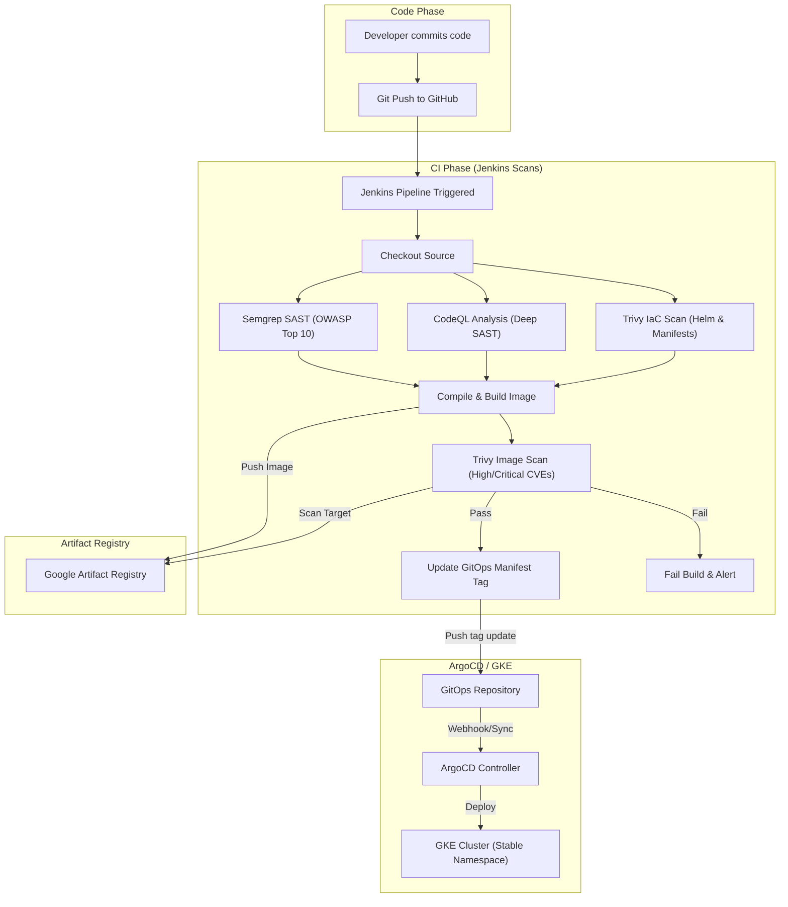

</details>

### Integrated Security Tools

1. **Semgrep (Lightweight SAST / Custom Rules)**:
   - **Responsibility**: Fast commit-stage check for security anti-patterns (disabled CSRF, insecure HTTP, hardcoded secrets) and ruleset compliance.
   - **What the Report is About**: It performs fast static analysis on the source code looking for syntactic patterns that match known security anti-patterns (such as disabled spring security protection, raw SQL queries, or weak cryptographic algorithms).
   - **Where to View the Report**:
     - **GitHub Code Scanning UI (Interactive)**: Automatically uploaded directly to the GitHub Security repository tab at [GitHub Code Scanning Alerts (Semgrep)](https://github.com/nubenetes/jenkins-2026/security/code-scanning). It maps findings directly to code lines.
     - **Jenkins Build Artifacts (Raw)**: Saved as `semgrep-results.sarif` in the build run's local artifact archive.

2. **CodeQL (Deep SAST / Semantic Analysis)**:
   - **Responsibility**: Semantic code analysis to detect complex multi-file data flow vulnerabilities (SQL Injection, XSS, SSRF).
   - **What the Report is About**: CodeQL compiles and builds a database of the source code structure, allowing semantic queries to trace variables and untrusted user input (sources) all the way to dangerous execution sinks (such as raw database queries, file writes, or command executions).
   - **Where to View the Report**:
     - **GitHub Code Scanning UI (Interactive)**: Automatically uploaded directly to the GitHub Advanced Security tab. The dashboard parses the SARIF file and lets you interactively trace the data flow path of the vulnerability at [GitHub Code Scanning Alerts (CodeQL)](https://github.com/nubenetes/jenkins-2026/security/code-scanning).
     - **Jenkins Build Artifacts (Raw)**: Saved as `codeql-results.sarif` in the build run's local artifact archive.

3. **Trivy (Vulnerability and Misconfiguration Scanning)**:
   - **Dual Responsibility**:
     - **IaC Scan**: Evaluates Helm charts and GKE resources before building (warning-only/non-blocking).
     - **Image Scan**: Scans final container images against the GCE base image and dependencies before pushing or updating the GitOps repo.
   - **Configuration**: Defined in [trivy.yaml](trivy.yaml).
   - **Failure Policy**: If risk thresholds are exceeded during the final image scan (severity: `CRITICAL,HIGH`), Trivy exits with code `1`, halting the deploy stage.

4. **Jenkins warnings-ng Plugin Integration (SARIF Visualizer)**:
   - **Responsibility**: Provides interactive static analysis dashboards natively within the Jenkins build UI.
   - **How it Works (for Users & Developers)**:
     - On every build of a microservice, the pipeline runs Semgrep and CodeQL and outputs `.sarif` files (`semgrep-results.sarif` and `codeql-results.sarif`).
     - The pipeline invokes the `recordIssues` post-action step of the `warnings-ng` plugin to parse these SARIF reports.
     - Developers do not need to inspect raw JSON/SARIF logs. Instead, the build page displays **"Semgrep Warnings"** and **"CodeQL Warnings"** side menu items.
     - Clicking these menu items provides detailed dashboards containing:
       - **Issue Trends**: Graphical representation of new, fixed, and outstanding warnings over time.
       - **Tabular Details**: A searchable table of all issues grouped by category, file name, age, and severity.
       - **Inline Code Highlights**: Direct integration with the Jenkins workspace viewer. Clicking an issue lets developers see the exact line of code causing the warning.
   - **How it is Configured (for Jenkins Administrators)**:
     - **Plugin Pinning**: Pinned in [values-common.yaml](file:///home/inafev/github/jenkins-2026/helm/jenkins/values-common.yaml#L241) to ensure reproducibility:
       ```yaml
       - warnings-ng:13.10097.v277a_958a_b_c09
       ```
     - **Pipeline Integration**: Invoked inside the `post` block of [MicroservicesPipeline.groovy](file:///home/inafev/github/jenkins-2026/vars/MicroservicesPipeline.groovy#L461-L468):
       ```groovy
       post {
           always {
               recordIssues(
                   enabledForFailure: true,
                   aggregatingResults: true,
                   tools: [
                       sarif(pattern: 'microservices-src/semgrep-results.sarif', id: 'semgrep', name: 'Semgrep'),
                       sarif(pattern: 'microservices-src/codeql-results.sarif', id: 'codeql', name: 'CodeQL')
                   ]
               )
           }
       }
       ```

## GitOps Design Decision: Helm vs. Kustomize

### Overview
This repository uses a parameterized Helm Chart (`helm/microservices`) driven by environment-specific values files (`values-stable.yaml`, `values-develop.yaml`) in the GitOps repository to deploy microservices under ArgoCD. Below is the technical comparison and design rationale for utilizing Helm instead of Kustomize for this platform.

### Side-by-Side Comparison

| Feature/Metric | Helm + ArgoCD (Current Solution) | Kustomize + ArgoCD (Alternative) |
| :--- | :--- | :--- |
| **DRY Compliance (Don't Repeat Yourself)** | **High.** All common patterns (probes, security contexts, Postgres configurations, Workload Identity annotations) are written once in a template and reused. | **Low.** Shared boilerplate is copied across bases, or managed through complex overlay configurations. |
| **Adding a Microservice** | **Trivial.** Simply add a new key under `services` in `values-stable.yaml`. Jenkins CI automatically handles this tag update. | **High effort.** Requires creating a new directory structure, copying/configuring base YAMLs, and editing environment overlays. |
| **Platform Portability (GKE, OpenShift)** | **Excellent.** A single boolean or string switch (`global.platform`) handles conditional resource definitions (e.g., Ingress vs. Route, OpenShift SCC adjustments). | **Harder.** Requires maintaining separate platform-specific overlays (`overlays/gke`, `overlays/openshift`) containing distinct patches. |
| **ArgoCD Integration** | **Native.** ArgoCD parses Helm charts seamlessly, supports parameter overrides, and integrates with `ApplicationSets` using value files. | **Native.** ArgoCD natively applies Kustomize overlays. |
| **Upgrade Maintenance** | **Easy.** Modifying the global configuration (e.g., changing security context `runAsUser` or patching pg_hba rules) is done in a single Helm template and propagates to all services. | **Labor-intensive.** Requires updating multiple resource files or base directory components across all services. |

### Technical Rationale & Mechanics

#### 1. Dynamic Resource Generation via Looping
Helm's template looping is key to maintaining a multi-service architecture without duplicate manifest templates. In our Helm chart templates, we iterate over the service registry:
```yaml
{{- range $name, $svc := .Values.services }}
apiVersion: apps/v1
kind: Deployment
metadata:
  name: {{ $name }}
...
```
This single loop dynamically generates the `Deployment`, `Service`, `Postgres` CNPG Cluster, `PgBouncer` pooler, and scheduled backups for *every* registered microservice. Kustomize lacks template logic and variables, meaning developers would have to maintain duplicate manifests for each new microservice.

#### 2. Platform Adaptability
We leverage Helm's conditional formatting to support deploying to various Kubernetes distributions (e.g. GKE or OpenShift) with a single variable flag (`global.platform`), enabling conditional security contexts or routing configs:
```yaml
securityContext:
  allowPrivilegeEscalation: false
  capabilities:
    drop: ["ALL"]
  {{- if eq $.Values.global.platform "openshift" }}
  # Let the restricted-v2 SCC assign UIDs
  {{- else }}
  runAsNonRoot: true
  runAsUser: 1000
  {{- end }}
```

#### 3. Continuous Integration Automation
In the Jenkins pipeline, updating a microservice deployment target is simplified to a single YAML key-value update using `yq` in `values-stable.yaml` or `values-develop.yaml`:
```bash
yq -i '.services.jhipstersamplemicroservice.image.tag = "new-tag"' values-stable.yaml
```
Using Kustomize would require running `kustomize edit set image` on specific overlay files, adding tool dependencies to pipeline runner images.

---

## Design Decision: Resource Lifecycle & Decommission Orchestration

### Overview
In a hybrid cloud platform utilizing both Terraform (for static infrastructure provisioning) and Kubernetes controllers (for dynamic GKE Gateway and Ingress-driven GCP resources), orchestrating resource dependencies during teardown (`scripts/down.sh` followed by `terraform destroy`) is a common source of race conditions. Below is the technical breakdown, comparison, and design rationale for the implemented synchronization barrier.

### The Problem: Asynchronous Background Deletion
When Kubernetes resources like `Services` or `Gateways` are deleted:
1. Kubernetes instantly deletes the configuration objects from the cluster's API database and returns success.
2. Under the hood, GKE's background controllers asynchronously call the Google Cloud API to delete the associated Network Endpoint Groups (NEGs), Load Balancers, and Forwarding Rules.
3. If `terraform destroy` runs immediately after `scripts/down.sh` completes, the GKE cluster starts teardown. This terminates the GKE masters and the background controllers **before** GCP has finished deleting the NEGs.
4. The GCP zonal NEGs are orphaned in the cloud. They continue to reference the GKE VPC network and subnet, causing `terraform destroy` to fail on VPC deletion with:
   `Error waiting for Deleting Network: The network resource '...-vpc' is already being used by '.../networkEndpointGroups/...'`

<details>
<summary>🔍 Click to expand The Problem: Asynchronous Background Deletion Diagram</summary>

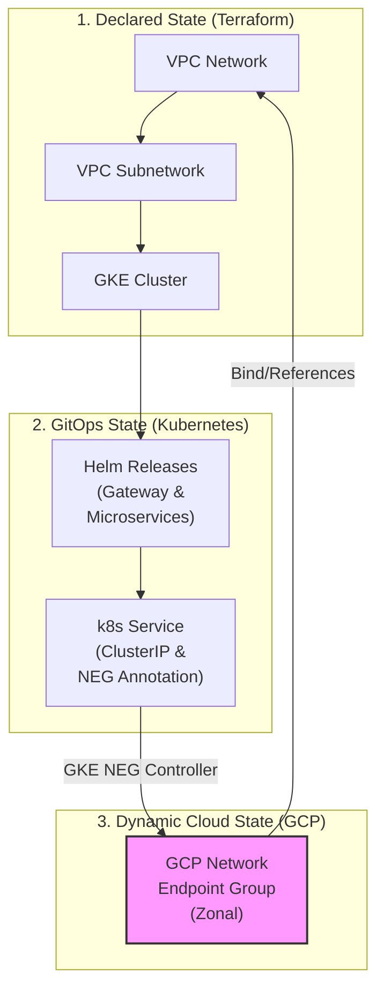

</details>

### Side-by-Side Comparison of Solutions

| Strategy | Implementation | Pros | Cons |
| :--- | :--- | :--- | :--- |
| **1. Pure Terraform** (Helm/K8s Providers) | Declare Helm charts and Gateway manifests inside Terraform HCL. | Single tool orchestrates all resources. | Terraform's Helm provider only waits for Helm uninstall to finish; it **cannot** detect or wait for GKE's background GCP API deletions. **The race condition remains.** |
| **2. Declare LB in Terraform** | Write GCP Load Balancer HCL instead of using GKE Gateway API. | Terraform tracks and destroys the load balancer synchronously. | Defeats the purpose of the GKE Gateway API/Ingress. App developers lose the ability to declare routing in k8s manifests; they must now request Terraform changes. |
| **3. Synchronization Barrier (Current Solution)** | Implement a polling and force-clean check in the teardown script (`scripts/down.sh`) using the `gcloud` CLI. | • **Bulletproof**: Blocks until the cloud provider reports all NEGs are gone.<br>• **Self-healing**: Force-deletes NEGs if GKE controllers hang.<br>• Non-intrusive to developer workflows. | Requires `gcloud` to be authenticated during teardown (already true in our CI/CD runner and local dev environments). |

### Technical Rationale & Mechanics

To prevent VPC deletion blockages, we introduced an **explicit synchronization barrier** in `scripts/down.sh` right after the namespace deletion/cleanup phase. This barrier:
1. **Detects the Active GCP Context**: Uses the local authenticated `gcloud` client.
2. **Polls GCP directly**: Queries `gcloud compute network-endpoint-groups list` with a filter on the target VPC (`network:${vpc_name}`).
3. **Waits for clean deletion**: Blocks up to 5 minutes to let GKE controllers finish natural deletions.
4. **Force Cleanup Fallback**: If NEGs are orphaned or stuck (due to a partially failed or prematurely killed teardown), it parses the remaining NEGs and explicitly deletes them using:
   ```bash
   gcloud compute network-endpoint-groups delete "${name}" --zone="${zone}" --project="${gcp_project}" --quiet
   ```

This architecture bridges the asynchronous nature of Kubernetes controllers with the synchronous demands of Terraform state lifecycle management.

---

## License

[MIT](LICENSE) © 2026 Nubenetes
