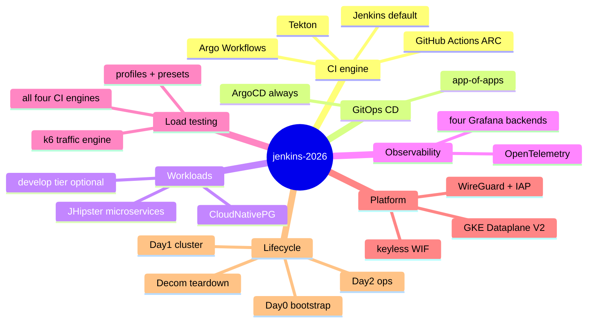
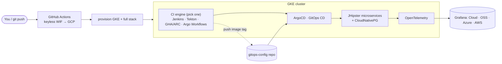
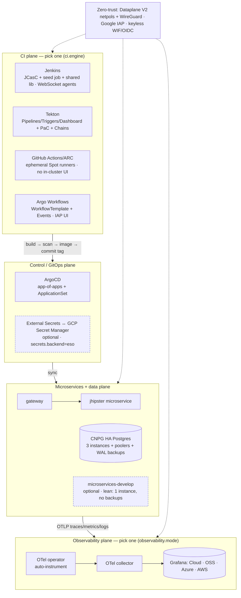
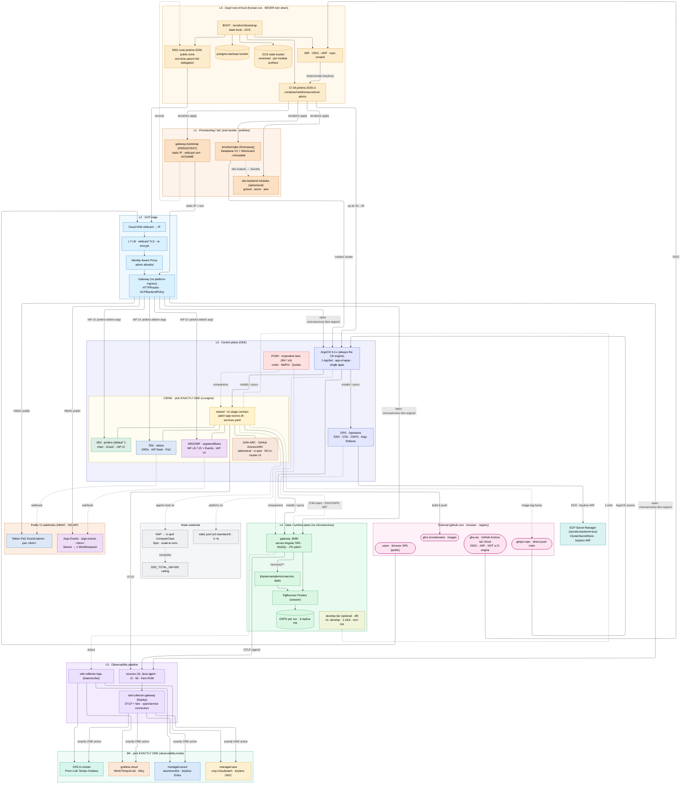

# jenkins-2026

[](https://github.com/nubenetes/jenkins-2026/releases/latest)
[](https://github.com/nubenetes/jenkins-2026/actions/workflows/gitflow-guard.yml)
[](https://github.com/nubenetes/jenkins-2026/actions/workflows/terraform-validate.yml)
[](LICENSE)

[](https://github.com/nubenetes/jenkins-2026/commits/main)
[](https://github.com/nubenetes/jenkins-2026/pulse)


[](docs/)
[](CHANGELOG.md)

<!-- STACK-BADGES:START -->
**Stack** — everything the platform wires together (feature-flagged axes marked):

**Cloud & platform**  
      

**CI engine** — `ci.engine`, one of four  
   

**GitOps & delivery**  
    

**Observability** — `observability.mode`, one of four + OpenTelemetry  
        

**Data**  
   

**Secrets** — `secrets.backend`  
 

**IaC & tooling**  
   

**App & build**  
      

**Test & DevSecOps**  
   

<!-- STACK-BADGES:END -->

> **Two-repo GitOps setup.** This is the **infra repo** (cluster bootstrap, the CI engine — **Jenkins** / **Tekton** / **GitHub Actions** / **Argo Workflows**, one selected by `ci.engine` — plus ArgoCD & observability). Image tags and ArgoCD manifests live in the companion **[`nubenetes/jenkins-2026-gitops-config`](https://github.com/nubenetes/jenkins-2026-gitops-config)** repo.

**At a glance.** A self-contained, **two-repo GitOps** proof-of-concept platform that stands up a complete **build → scan → ship → observe → load-test** pipeline on **Google Kubernetes Engine**, configured **entirely as code** — *nothing is clicked in a UI* — and provisioned/torn down on demand from **GitHub Actions**. It takes the JHipster microservices reference app from a `git push` all the way to a running, fully-observed, traffic-tested deployment, and can do the whole round trip (create the cluster, deploy everything, exercise it, destroy it) in one lifecycle.

**What it chains together, end to end:**

- **CI engine — build, scan & containerize.** One of **four** mutually-exclusive engines selected by `ci.engine`: **Jenkins** by default (Helm chart + **JCasC** + a Job-DSL seed + a Groovy shared library), **Tekton**, **GitHub Actions (ARC)**, or **Argo Workflows** — all defined as code and sharing one ~11-stage pipeline contract (+ the shared [`resources/patch-app-source.sh`](resources/patch-app-source.sh) build-time patch + the [`services.yaml`](jenkins/pipelines/seed/services.yaml) registry). Pipelines compile, test, build images (Jib/Spring-Boot/Kaniko) and push to the registry. See [401](./docs/401-JENKINS.md) · [402](./docs/402-PIPELINES_AS_CODE.md) · [403](./docs/403-TEKTON.md) · [404](./docs/404-GITHUB_ACTIONS.md) · [405](./docs/405-ARGO_WORKFLOWS.md).
- **GitOps CD — ship without `kubectl`.** CI never touches the cluster directly; it commits a new image tag to the **gitops-config** repo, and **ArgoCD** reconciles it onto the cluster (single `Application`s + app-of-apps, with **Argo Rollouts** for sidecar-free canary/blue-green). See [501](./docs/501-PLATFORM_OPERATIONS.md) · [502](./docs/502-MICROSERVICES_GITOPS.md).
- **Observability — see everything, correlated.** End-to-end **OpenTelemetry** (auto-instrumented traces, metrics, logs) flowing into **any of four Grafana backends** — **Grafana Cloud**, in-cluster **OSS** (Prometheus/Loki/Tempo), **Azure Managed Grafana**, or **Amazon Managed Grafana** — all selectable by one flag. See [301](./docs/301-OBSERVABILITY.md).
- **Load & traffic testing — close the loop.** A first-class, parametrizable **k6 engine** drives real traffic and feeds the same dashboards (detailed in the next paragraph). See [302](./docs/302-K6_LOAD_TESTING.md).
- **Security (DevSecOps) — shift left.** **Semgrep** + **CodeQL** SAST, **Trivy** image/IaC scanning, and SARIF surfaced in the CI UI, gating the pipeline. See [601](./docs/601-DEVSECOPS.md).
- **Platform & networking — production-shaped.** GKE on **Dataplane V2** (real NetworkPolicy enforcement) + **WireGuard** inter-node encryption, a **GKE Gateway API** ingress with **Identity-Aware Proxy**, **CloudNativePG** for HA Postgres, and **Headlamp** for cluster ops. See [503](./docs/503-NETWORKING.md) · [501](./docs/501-PLATFORM_OPERATIONS.md).

**How it runs:**

- **Keyless by default.** Every GitHub Actions workflow authenticates to GCP via **Workload Identity Federation** — *no JSON service-account keys are ever stored*.
- **A clean Day0 → Day1 → Day2 → Decom lifecycle.** Persistent bootstrap (**Day0**), cluster up (**Day1**), running-cluster ops (**Day2**), teardown (**Decom**) — every workflow **idempotent and safe to re-run**. See [101](./docs/101-GITHUB_ACTIONS_WORKFLOWS.md).
- **Tuned by a handful of feature flags** (sensible defaults, powerful opt-ins): the **CI engine** (one of four — Jenkins / Tekton / GitHub Actions (ARC) / Argo Workflows), the **observability backend** (the four above), the **secrets backend** (imperative `kubectl` or **GCP Secret Manager + External Secrets Operator**), an optional **lean `develop` tier**, and **public access** (Gateway + IAP). All live in [`config/config.yaml`](./config/config.yaml) with per-run `JENKINS2026_*` overrides.

**Closing the loop — load & traffic testing.** The platform doesn't just deploy and observe; it **drives traffic** through a first-class, fully parametrizable **[k6 engine](./docs/302-K6_LOAD_TESTING.md)** — so the dashboards always have something real to show, and the app is exercised, not just shipped.

**What the k6 engine gives you:**

- **One script, one contract.** A single [`jenkins/pipelines/k6/microservices-smoke.js`](jenkins/pipelines/k6/microservices-smoke.js) driven by **one `K6SIM_*` variable contract** — backward-compatible, so *no parameters* = the original lightweight smoke test.
- **Six workload profiles.** From a 12-iteration **smoke** test to real **load · stress · soak · spike · breakpoint** runs, each a sensible preset shape you can still fine-tune (VUs, duration, ramping stages, arrival rate, thresholds).
- **Committed presets, pick-from-a-menu.** Whole named configs live as **YAML files in git** ([`presets/`](./jenkins/pipelines/k6/presets/)) and are **selectable from a dropdown**; any field you type by hand overrides the preset (**manual > preset > default**).
- **The same test from all four runners.** **Jenkins**, **Tekton**, **GitHub Actions** and **Argo Workflows** run the identical script and contract, against **both the `stable` and `develop` tiers**.
- **One Grafana, layered analysis.** Every run exports OTLP into the **same Grafana** (correlated with the app's own telemetry) and prints a **basic→expert result analysis** inline (latency percentiles, throughput, threshold pass/fail + verdict).

<details>
<summary>🧠 Mental model — the whole platform in one map</summary>



</details>

<details>
<summary>🟢 For newcomers — the platform in plain terms (+ a high-level map)</summary>

Think of it as a **build-and-ship factory for apps, described entirely in code**:

- A **CI engine** (one of four — Jenkins by default, Tekton, GitHub Actions/ARC, or Argo Workflows) builds, scans, and packages the demo microservices.
- **ArgoCD** (GitOps) deploys them — the CI never runs `kubectl`; it just commits a new image tag that ArgoCD reconciles onto the cluster.
- **OpenTelemetry** ships traces/metrics/logs to one of four Grafana backends, all correlated.
- **k6** generates traffic — from a tiny smoke test to full load/stress/soak runs — using **ready-made configs (presets) you pick from a menu**, so the dashboards always have something real to show.
- **GitHub Actions** drives everything and logs into Google Cloud **with no stored key** (Workload Identity), provisioning/tearing down the cluster on demand (Day0 → Day1 → Day2 → Decom).
- A few **feature flags** pick the CI engine, the observability backend, the secrets backend, an optional **lean `develop`** environment, and public access — defaults are sane, options are opt-in.

**High-level design** — the platform at a glance:



</details>

<details>
<summary>🔴 For specialists — In depth: feature flags, components &amp; lifecycle (the full technical breakdown)</summary>

<details>
<summary>🔬 Low-level design — planes &amp; components (dashed = optional / off by default)</summary>



</details>

#### Feature flags

Durable default in [`config/config.yaml`](config/config.yaml); per-run override via a `JENKINS2026_*` env var (local) or a GitHub Actions input (CI):

| Capability | Flag | Default | Optional |
|---|---|---|---|
| **CI engine** | `ci.engine` | **`jenkins`** — official Helm chart + JCasC + Job-DSL seed | **`tekton`** — Tekton Pipelines / Triggers / Dashboard (IAP-protected) + **Pipelines-as-Code**, the same pipeline ported to [`tekton/`](tekton/) ([403](docs/403-TEKTON.md)) · **`githubactions`** — GitHub Actions self-hosted runners via **ARC** (Actions Runner Controller): ephemeral **Spot** runners on the `ci-spot` NAP ComputeClass, native GitHub webhooks, **no** in-cluster UI/route (runs in GitHub's Actions tab) ([404](docs/404-GITHUB_ACTIONS.md)) · **`argoworkflows`** — Argo Workflows + Argo Events: the pipeline as a WorkflowTemplate, an **IAP-protected Argo Workflows Server UI** (`argo.<domain>`, like the Tekton Dashboard) plus a public, HMAC-protected **Argo Events webhook receiver** (`argo-events.<domain>`) ([405](docs/405-ARGO_WORKFLOWS.md)). The four engines are mutually exclusive; switching retires the others. |
| **Tekton seed runs** | `tekton.seedRuns` | **`true`** — `Day1` seeds one **PipelineRun per service** (from [`tekton/runs/`](tekton/runs/)) so the Tekton **Dashboard is pre-populated** with runnable entries (click *Rerun*) from the first provision, at the cost of one build per service per Day1 | **`false`** — rely solely on **Pipelines-as-Code**'s git-push trigger (no seed builds). Only meaningful when `ci.engine=tekton`. Per-run override `JENKINS2026_TEKTON_SEED_RUNS`. |
| **CI build-pod placement** | `<engine>.runNodePool` | **`static`** for `jenkins` / `tekton` / `argoworkflows` — the long-lived `jenkins-2026-pool` (robust, no NAP/Spot/quota dependency); **`githubactions` ships `ci-spot`** (single-job ARC runners are ideal Spot workloads) | **`ci-spot`** — the NAP **Spot** ComputeClass (elastic, cheaper; needs `nodeAutoProvisioning` + `SSD_TOTAL_GB` headroom). **Per engine** by pod-scheduling shape: single-pod engines (**Jenkins**, **GitHub Actions/ARC**) are good Spot fits (a preemption just re-runs one idempotent build); shared-workspace engines (**Tekton**, **Argo Workflows**) pin a whole run to one node, so keep them `static`. Per-run overrides `JENKINS2026_{JENKINS,TEKTON,GITHUBACTIONS,ARGOWORKFLOWS}_RUN_NODE_POOL` + a `run_node_pool` input on the four `Day2.redeploy` workflows. See [docs/501](docs/501-PLATFORM_OPERATIONS.md#the-engines-on-spot-ci-spot--why-the-placement-flag-is-per-engine). |
| **Observability backend** | `observability.mode` | **`grafana-cloud`** *(the GitHub Actions `Day1` input defaults to **`oss`**)* | **`oss`** (in-cluster Grafana / Loki / Tempo / kube-prometheus) · **`managed-azure`** · **`managed-aws`** — exactly one active per cluster; a rerun deterministically switches. |
| **Secrets backend** | `secrets.backend` | **`imperative`** — `kubectl create secret` from GitHub secrets | **`eso`** — push values to **GCP Secret Manager** + sync via the **External Secrets Operator** over Workload Identity (keyless, versioned, audited). |
| **Develop tier** | `microservices.developTrackEnabled` | **`false`** | **`true`** — an optional **lean, non-HA** second deploy tier (`microservices-develop`: CNPG single instance, single pooler, no backups), engine-neutral, into the same observability stack. |
| **Public access** | `gateway.baseDomain` | **set** → one global **GKE Gateway** + Google **IAP** + a wildcard cert front every UI | **`""`** to disable (reach services via `kubectl port-forward`). |
| **Grafana Cloud tier** | `observability.grafanaCloudTier` | **`free`** | **`paid`** — a profile that sets the volume-control defaults so the free tier fits its limits. `free` → `leanMetrics` on + `logMinSeverity=warn`; `paid` → full metrics + ship all logs. Per-run override `JENKINS2026_GRAFANA_CLOUD_TIER`; GHA `grafana_cloud_tier` dropdown. Only meaningful in grafana-cloud mode. |
| **Lean metrics** | `observability.leanMetrics` | **`auto`** | `true`/`false` — `auto` derives from `grafanaCloudTier` (free→on, paid→off). When on (grafana-cloud), drops the k8s-monitoring **cluster infra metrics** (cadvisor/kube-state/node-exporter) the custom dashboards don't use, to stay under the **free-tier 15k active-series** cap. Force with a literal value or `JENKINS2026_OBS_LEAN_METRICS`. |
| **Log verbosity** | `logging.level` | **`info`** | **`debug`** — additionally emit `[DEBUG]` script lines (`log_debug`) and `TF_LOG=DEBUG` for the Terraform steps. Per-run override `JENKINS2026_LOG_LEVEL`; the GitHub Actions workflows expose it as a `log_level` dropdown. No `trace`/`set -x` level by design (would leak script-derived secrets); use `ACTIONS_STEP_DEBUG` for runner tracing. |
| **Grafana log severity** | `observability.logMinSeverity` | **`auto`** | `trace` (keep all) · `debug` · `info` · `warn` · `error` — minimum severity shipped to the backend, applied as a `filter` in the `otel-collector-logs` DaemonSet (parses level→severity), trimming **every** Grafana logs panel (microservices + platform) in all modes. `auto` derives from `grafanaCloudTier` (free→`warn`, paid→`trace`; non-cloud→`info`). Plain-text lines (no level token) are never dropped. Per-run override `JENKINS2026_LOG_MIN_SEVERITY`; GHA `log_min_severity` dropdown. See [docs/301 § Log Levels](docs/301-OBSERVABILITY.md#log-levels). |

**Always on (no flag):** **ArgoCD** (the GitOps CD engine) · **CloudNativePG** HA Postgres + **pgAdmin** · **Headlamp** (cluster UI) · the **OpenTelemetry** operator + collector · **Argo Rollouts** (sidecar-free canary / blue-green via the Gateway API) · **Dataplane V2** (Cilium/eBPF) **enforced NetworkPolicies** + **WireGuard** inter-node pod encryption · **DevSecOps** scanning in every build · **GKE Node Auto-Provisioning** (Spot, scale-to-zero CI nodes via a Custom ComputeClass) · and **pinned versions** throughout.

#### What's inside, by area

- **CI engines (pick one of four — `ci.engine`).** *Jenkins* (default): the official Helm chart, configured 100% via **JCasC** + a Job-DSL **seed job** that generates one pipeline per microservice from a `services.yaml` registry; a global **shared library** ([`vars/`](vars/)) runs each build in an ephemeral multi-container agent pod that connects back over **WebSocket**. *Tekton*: Pipelines/Triggers, the IAP-protected **Dashboard**, **Pipelines-as-Code** (git-push-driven), and **Chains** (SLSA provenance) — the same pipeline ported to [`tekton/`](tekton/). *GitHub Actions (ARC)*: ephemeral Spot self-hosted runners via Actions Runner Controller, native GitHub webhooks, **no** in-cluster UI. *Argo Workflows*: the pipeline as a WorkflowTemplate + Argo Events, an IAP-protected Argo Server UI plus an HMAC webhook receiver. The four are **mutually exclusive** — each `scripts/04-<engine>.sh` retires the other three (via the shared `retire_ci_engine` helper in `scripts/lib/common.sh`: deletes their ArgoCD apps + children + namespaces + clears stuck GKE NEG finalizers). All four converge at the deploy boundary (ArgoCD), so the rest of the platform is engine-neutral.
- **The pipeline (all four engines).** ~11 stages: checkout → **Semgrep** SAST → **CodeQL** → **Trivy** IaC → build & test (Maven/npm) → build & push image (Jib / Spring-Boot build-image / Kaniko) → **Trivy** image scan → **GitOps deploy** (`yq` the image tag → push to the gitops repo → `argocd app sync` → OTel self-heal) → smoke test → **k6**. All four engines share the same contract + the [`resources/patch-app-source.sh`](resources/patch-app-source.sh) build-time patch + the [`services.yaml`](jenkins/pipelines/seed/services.yaml) registry. Findings upload as SARIF to GitHub Code Scanning (non-blocking).
- **GitOps CD (always — ArgoCD).** App-of-apps + an `ApplicationSet` render the microservices Helm chart; the CNPG operator, External Secrets, Headlamp, Argo Rollouts, and the active CI engine (Jenkins / Tekton / GitHub Actions-ARC / Argo Workflows) are all ArgoCD `Application`s. CI never `kubectl apply`s apps — it commits an image tag and ArgoCD reconciles.
- **Data (always — CloudNativePG).** Per-service HA Postgres (3 instances + PgBouncer poolers + WAL/base backups to GCS via Workload Identity), administered through **pgAdmin** (IAP, zero-password `.pgpass`). The optional *develop* tier runs a **lean** single-instance, no-backup variant.
- **Observability (pick one backend — `observability.mode`).** The OTel **operator** auto-instruments the JVM apps; an OTel **collector** fans traces/metrics/logs out to **Grafana Cloud**, an in-cluster **OSS** stack (Prometheus/Loki/Tempo/Grafana), **Azure** Managed Grafana, or **Amazon** Managed Grafana — correlated by `trace_id`, with dashboards + alert rules provisioned per mode. CI runs (whichever engine) emit spans too, and each active engine gets its own CI-overview dashboard (jenkins-overview · tekton-overview · github-actions-ci · argo-workflows-ci).
- **Security & zero-trust.** Keyless **WIF/OIDC** everywhere (no JSON keys); **Dataplane V2** (Cilium/eBPF) **enforced** NetworkPolicies + **WireGuard** inter-node encryption; **Google IAP** fronts every admin UI; in-build **DevSecOps** scanning (Semgrep · CodeQL · Trivy · warnings-ng; Tekton adds **Chains**/SLSA); optional **ESO** + GCP Secret Manager.
- **Lifecycle & ops.** A one-time, human-run **bootstrap** ([`scripts/bootstrap.sh`](scripts/bootstrap.sh)) creates the root of trust (WIF + Terraform-state bucket + permanent DNS zone). Then **GitHub Actions** drive **Day0** (persistent infra: Gateway IP/cert, the chosen Grafana backend) → **Day1** (cluster + full stack) → **Day2** (redeploy / publish / traffic ops) → **Decom** (teardown), each behind a required-reviewer environment gate. Every workflow is **idempotent** — re-run to apply a change; you never Decom to converge.

**Two-repo split:** this **infra repo** owns the cluster + CI engine + platform; the companion **[`gitops-config`](https://github.com/nubenetes/jenkins-2026-gitops-config)** repo owns the deployed microservices' image tags + Helm manifests — CI pushes image-tag bumps there, ArgoCD syncs them.

</details>

---

## Table of Contents

**[README — jenkins-2026](#jenkins-2026)**
- [1. Document Inventory](#1-document-inventory)
- [2. Quick Start](#2-quick-start)
- [3. Architecture Overview](#3-architecture-overview)
- [4. GitHub Actions Workflows](#4-github-actions-workflows)
- [5. Prerequisites](#5-prerequisites)

---

**[100 · Bootstrap — the Root of Trust](./docs/100-BOOTSTRAP.md)**
- [Why it can't be a GitHub Actions workflow (the bootstrap paradox)](./docs/100-BOOTSTRAP.md#why-it-cant-be-a-github-actions-workflow-the-bootstrap-paradox)
- [Create the root: `bootstrap.sh up`](./docs/100-BOOTSTRAP.md#create-the-root-bootstrapsh-up) · [Destroy: `bootstrap.sh down`](./docs/100-BOOTSTRAP.md#destroy-the-root-bootstrapsh-down)
- [The state model (self-hosted in the bucket)](./docs/100-BOOTSTRAP.md#the-state-model-self-hosted-in-the-bucket)

**[101 · GitHub Actions Workflows](./docs/101-GITHUB_ACTIONS_WORKFLOWS.md)**
- [Naming convention: `DayN.tier.ZZ-resource`](./docs/101-GITHUB_ACTIONS_WORKFLOWS.md#naming-convention-dayntierzz-resource)
  - [Day × workflow matrix](./docs/101-GITHUB_ACTIONS_WORKFLOWS.md#day--workflow-matrix)
  - [Resource identifier (ZZ): stable across all phases](./docs/101-GITHUB_ACTIONS_WORKFLOWS.md#resource-identifier-zz-stable-across-all-phases)
- [Full workflow matrix](./docs/101-GITHUB_ACTIONS_WORKFLOWS.md#full-workflow-matrix)
- [Lifecycle diagram](./docs/101-GITHUB_ACTIONS_WORKFLOWS.md#lifecycle-diagram)
- [Day-0 / Day-1 / Day-2 operations](./docs/101-GITHUB_ACTIONS_WORKFLOWS.md#day-0--day-1--day-2-operations)
- [Complete workflow inventory — matrix table](./docs/101-GITHUB_ACTIONS_WORKFLOWS.md#complete-workflow-inventory--matrix-table)
- [Day2 ordering: tiers are categories, not stages](./docs/101-GITHUB_ACTIONS_WORKFLOWS.md#day2-ordering-tiers-are-categories-not-stages)
- [Are workflows auto-chained? Why not?](./docs/101-GITHUB_ACTIONS_WORKFLOWS.md#are-workflows-auto-chained-why-not)
- [Reading the `Day1.cluster.01` run graph: jobs vs in-job branches](./docs/101-GITHUB_ACTIONS_WORKFLOWS.md#reading-the-day1cluster01-run-graph-jobs-vs-in-job-branches)
- [Idempotency: every workflow is safe to re-run](./docs/101-GITHUB_ACTIONS_WORKFLOWS.md#idempotency-every-workflow-is-safe-to-re-run)

**[102 · GitHub Actions Automation](./docs/102-GITHUB_ACTIONS_AUTOMATION.md)**
- [Bootstrapping Architecture: Persistent vs. Short-Lived Resources](./docs/102-GITHUB_ACTIONS_AUTOMATION.md#bootstrapping-architecture-persistent-vs-short-lived-resources)
- [Workflow Architecture & Lifecycle Diagram](./docs/102-GITHUB_ACTIONS_AUTOMATION.md#workflow-architecture--lifecycle-diagram)
  - [Detailed Workflow Reference and Lifecycle Management](./docs/102-GITHUB_ACTIONS_AUTOMATION.md#detailed-workflow-reference-and-lifecycle-management)
- [Version Pinning and the `git_ref` Parameter](./docs/102-GITHUB_ACTIONS_AUTOMATION.md#version-pinning-and-the-git_ref-parameter)
  - [The `git_ref` Parameter](./docs/102-GITHUB_ACTIONS_AUTOMATION.md#the-git_ref-parameter)
  - [Form Fields Reference (Day1.cluster.01 GKE Provision)](./docs/102-GITHUB_ACTIONS_AUTOMATION.md#form-fields-reference-day1cluster01-gke-provision)
  - [The Danger of Divergent References](./docs/102-GITHUB_ACTIONS_AUTOMATION.md#the-danger-of-divergent-references)
- [Environment Protection and Manual Approvals](./docs/102-GITHUB_ACTIONS_AUTOMATION.md#environment-protection-and-manual-approvals)
  - [Setting up Environment Rules](./docs/102-GITHUB_ACTIONS_AUTOMATION.md#setting-up-environment-rules)
- [One-time Setup (Bootstrapping)](./docs/102-GITHUB_ACTIONS_AUTOMATION.md#one-time-setup-bootstrapping)
- [Running the GKE Workflows](./docs/102-GITHUB_ACTIONS_AUTOMATION.md#running-the-gke-workflows)

---

**[103 · GitHub Secrets Inventory](./docs/103-GITHUB_SECRETS_INVENTORY.md)**
- [GCP / Core Infrastructure](./docs/103-GITHUB_SECRETS_INVENTORY.md#1-gcp--core-infrastructure)
- [Grafana Cloud](./docs/103-GITHUB_SECRETS_INVENTORY.md#2-grafana-cloud)
- [Grafana Alert Email (per-mode)](./docs/103-GITHUB_SECRETS_INVENTORY.md#3-grafana-alert-email)
- [Azure Managed Grafana](./docs/103-GITHUB_SECRETS_INVENTORY.md#4-azure-managed-grafana-managed-azure-mode)
- [AWS Managed Grafana](./docs/103-GITHUB_SECRETS_INVENTORY.md#5-aws-managed-grafana-managed-aws-mode)
- [Jenkins OIDC / Google Sign-In](./docs/103-GITHUB_SECRETS_INVENTORY.md#6-jenkins-oidc--google-sign-in)
- [Headlamp & IAP](./docs/103-GITHUB_SECRETS_INVENTORY.md#7-headlamp--identity-aware-proxy)
- [Private Registry & Git](./docs/103-GITHUB_SECRETS_INVENTORY.md#8-private-registry--git)
- [GitHub Actions / ARC CI engine](./docs/103-GITHUB_SECRETS_INVENTORY.md#95-github-actions--arc-ci-engine-ciengine-githubactions) — `ARC_GITHUB_APP_ID` / `ARC_GITHUB_APP_INSTALLATION_ID` / `ARC_GITHUB_APP_PRIVATE_KEY` (or `GIT_TOKEN` PAT fallback)
- [Argo Workflows CI engine](./docs/103-GITHUB_SECRETS_INVENTORY.md#96-argo-workflows-ci-engine-ciengine-argoworkflows) — `ARGOWORKFLOWS_GITHUB_WEBHOOK_SECRET` (optional Argo Events webhook HMAC; `PAC_WEBHOOK_SECRET` fallback)
- [Summary table](./docs/103-GITHUB_SECRETS_INVENTORY.md#summary-table)

---

**[104 · Rebuild-Safety (`Decom` + `Day1`)](./docs/104-REBUILD_SAFETY.md)**
- [Why it matters — the lifecycle & persistence tiers](./docs/104-REBUILD_SAFETY.md#1-why-this-matters--the-lifecycle)
- [The bug class: collision vs residue (+ the Postgres exemplar)](./docs/104-REBUILD_SAFETY.md#2-the-bug-class--two-failure-modes)
- [Rebuild-safety design patterns (the toolbox)](./docs/104-REBUILD_SAFETY.md#3-the-rebuild-safety-design-patterns-the-toolbox)
- [**The rebuild-safety matrix (safe-by-design)**](./docs/104-REBUILD_SAFETY.md#4-the-rebuild-safety-matrix-safe-by-design) — state/buckets · GKE · DNS/gateway · identity/secrets · obs backends · teardown residue · registry/GitOps/CI
- [The 7 closed gaps (#487–#489)](./docs/104-REBUILD_SAFETY.md#5-the-gaps-that-were-closed)
- [Live-verification checklist](./docs/104-REBUILD_SAFETY.md#6-live-verification-checklist) · [Adding a new persistent resource](./docs/104-REBUILD_SAFETY.md#7-adding-a-new-persistent-or-external-resource--the-checklist)

---

**[201 · Architecture](./docs/201-ARCHITECTURE.md)**
- [Overview](./docs/201-ARCHITECTURE.md#overview)
- [System Architecture](./docs/201-ARCHITECTURE.md#system-architecture)
- [Component Diagram](./docs/201-ARCHITECTURE.md#component-diagram)
- [Microservices & Database Architecture](./docs/201-ARCHITECTURE.md#microservices--database-architecture)
  - [Database Injection & Secrets](./docs/201-ARCHITECTURE.md#database-injection--secrets)
  - [CI/CD Flow (GitOps)](./docs/201-ARCHITECTURE.md#cicd-flow-gitops)
- [Configuration (`config/config.yaml`)](./docs/201-ARCHITECTURE.md#configuration-configconfigyaml)
- [Repository Layout](./docs/201-ARCHITECTURE.md#repository-layout)
- [GKE Cluster Topology & Sizing](./docs/201-ARCHITECTURE.md#gke-cluster-topology--sizing)
  - [Sizing Rationale](./docs/201-ARCHITECTURE.md#sizing-rationale)
  - [FinOps & Cost Analysis](./docs/201-ARCHITECTURE.md#finops--cost-analysis)

---

**[202 · Microservices App Architecture](./docs/202-MICROSERVICES-APP-ARCHITECTURE.md)**
- [Understanding the app (newcomers → specialists)](./docs/202-MICROSERVICES-APP-ARCHITECTURE.md#understanding-the-app-newcomers--specialists)
- [Components](./docs/202-MICROSERVICES-APP-ARCHITECTURE.md#components)
- [Java vs Angular — where each runs](./docs/202-MICROSERVICES-APP-ARCHITECTURE.md#java-vs-angular--where-each-actually-runs)
- [How a request flows](./docs/202-MICROSERVICES-APP-ARCHITECTURE.md#how-a-request-flows)
- [Frontend observability roadmap — Angular RUM](./docs/202-MICROSERVICES-APP-ARCHITECTURE.md#frontend-observability-roadmap--instrumenting-angular-with-rum)
- [Why JHipster (why this demo app)](./docs/202-MICROSERVICES-APP-ARCHITECTURE.md#why-jhipster-why-this-demo-app)

---

**[301 · Observability](./docs/301-OBSERVABILITY.md)**
- [Key Features](./docs/301-OBSERVABILITY.md#key-features)
- [Grafana Cloud Observability apps — status & recommendation](./docs/301-OBSERVABILITY.md#grafana-cloud-observability-apps--status--recommendation)
- [OTel Components](./docs/301-OBSERVABILITY.md#otel-components)
  - [OpenTelemetry Operator](./docs/301-OBSERVABILITY.md#opentelemetry-operator)
  - [Java Auto-Instrumentation](./docs/301-OBSERVABILITY.md#java-auto-instrumentation)
  - [Angular RUM](./docs/301-OBSERVABILITY.md#angular-rum)
  - [OTel Collector](./docs/301-OBSERVABILITY.md#otel-collector)
  - [Jenkins Plugin](./docs/301-OBSERVABILITY.md#jenkins-plugin)
- [Telemetry Architecture and Signal Flow](./docs/301-OBSERVABILITY.md#telemetry-architecture-and-signal-flow)
- [Signal Correlation: Metrics, Traces, and Logs](./docs/301-OBSERVABILITY.md#signal-correlation-metrics-traces-and-logs)
- [Structured Logging Deep Dive](./docs/301-OBSERVABILITY.md#structured-logging-deep-dive)
  - [Log Levels](./docs/301-OBSERVABILITY.md#log-levels)
- [OTel Injection Race](./docs/301-OBSERVABILITY.md#otel-injection-race)
- [Observability Dashboards](./docs/301-OBSERVABILITY.md#observability-dashboards)
- [k6 Observability Smoke Test](./docs/301-OBSERVABILITY.md#k6-observability-smoke-test)
- [Grafana OSS In-Cluster Mode](./docs/301-OBSERVABILITY.md#grafana-oss-in-cluster-mode)
- [Observability Modes](./docs/301-OBSERVABILITY.md#observability-modes)
  - [Logging in to Amazon Managed Grafana (managed-aws)](./docs/301-OBSERVABILITY.md#logging-in-to-amazon-managed-grafana-managed-aws)
- Runbook: [Log Correlation Validation](./docs/runbooks/log-correlation-validation.md)
- Runbook: [NAP → Spot CI nodes](./docs/runbooks/nap-spot-provisioning.md)

---

**[302 · k6 Traffic, Load & Observability Testing](./docs/302-K6_LOAD_TESTING.md)**
- [Understanding k6 here (newcomers → specialists)](./docs/302-K6_LOAD_TESTING.md#understanding-k6-here-newcomers--specialists)
- [The parameter contract (`K6SIM_*`)](./docs/302-K6_LOAD_TESTING.md#the-parameter-contract-k6sim_)
- [Workload profiles](./docs/302-K6_LOAD_TESTING.md#workload-profiles)
- [Config presets (committed test configs) + inventory matrix & per-preset diagrams](./docs/302-K6_LOAD_TESTING.md#config-presets-committed-test-configs)
- [Running it — the four engines](./docs/302-K6_LOAD_TESTING.md#running-it--the-four-engines) ([Jenkins](./docs/302-K6_LOAD_TESTING.md#jenkins) · [Tekton](./docs/302-K6_LOAD_TESTING.md#tekton) · [GitHub Actions](./docs/302-K6_LOAD_TESTING.md#github-actions) · [Argo Workflows](./docs/302-K6_LOAD_TESTING.md#argo-workflows))
- [Tutorials (basic & advanced)](./docs/302-K6_LOAD_TESTING.md#tutorials)
- [Reading the results — basic & expert](./docs/302-K6_LOAD_TESTING.md#reading-the-results--basic--expert)
- [stable vs develop — compatibility matrix](./docs/302-K6_LOAD_TESTING.md#stable-vs-develop--compatibility-matrix)
- [Troubleshooting](./docs/302-K6_LOAD_TESTING.md#troubleshooting)

**[303 · JVM Tuning & Runtime Strategy](./docs/303-JVM-TUNING.md)**
- [Understanding JVM tuning here (newcomers → specialists)](./docs/303-JVM-TUNING.md#understanding-jvm-tuning-here-newcomers--specialists)
- [The tuning we applied](./docs/303-JVM-TUNING.md#the-tuning-we-applied) ([per-environment values](./docs/303-JVM-TUNING.md#per-environment-values))
- [GC algorithm options](./docs/303-JVM-TUNING.md#gc-algorithm-options)
- [Runtime / startup options](./docs/303-JVM-TUNING.md#runtime--startup-options-the-big-picture)
- [OpenTelemetry instrumentation modes](./docs/303-JVM-TUNING.md#opentelemetry-instrumentation-modes)
- [Why CRaC is the chosen advanced direction](./docs/303-JVM-TUNING.md#why-crac-is-the-chosen-advanced-direction)
- [Analyzing JVM performance in Grafana](./docs/303-JVM-TUNING.md#analyzing-jvm-performance-in-grafana)

---

**[401 · Jenkins](./docs/401-JENKINS.md)**
- [Accessing the UI & Admin Password](./docs/401-JENKINS.md#accessing-the-ui--admin-password)
- [Google Login (OpenID Connect)](./docs/401-JENKINS.md#google-login-openid-connect)
- [Plugins & JCasC Fragments](./docs/401-JENKINS.md#plugins--jcasc-fragments)
- [Global Shared Library](./docs/401-JENKINS.md#global-shared-library)
- [GitOps: Jenkins as an ArgoCD Application](./docs/401-JENKINS.md#gitops-jenkins-as-an-argocd-application)

**[402 · Pipelines as Code](./docs/402-PIPELINES_AS_CODE.md)**
- [The Seed Job](./docs/402-PIPELINES_AS_CODE.md#the-seed-job)
- [Pipeline Branch & Environment Mapping](./docs/402-PIPELINES_AS_CODE.md#pipeline-branch--environment-mapping)
  - [Why the GitOps Repo Uses Only the `main` Branch](./docs/402-PIPELINES_AS_CODE.md#why-the-gitops-repo-uses-only-the-main-branch)
  - [Optional `develop` Tier (Feature Flag, Off by Default)](./docs/402-PIPELINES_AS_CODE.md#optional-develop-tier-feature-flag-off-by-default)
- [Architecture Diagram](./docs/402-PIPELINES_AS_CODE.md#architecture-diagram)
- [Detailed Pipeline Execution Stages](./docs/402-PIPELINES_AS_CODE.md#detailed-pipeline-execution-stages)
  - [1. Microservices Build & Deploy Pipeline](./docs/402-PIPELINES_AS_CODE.md#1-microservices-build--deploy-pipeline)
  - [2. k6 Integration Smoke Test Pipeline](./docs/402-PIPELINES_AS_CODE.md#2-k6-integration-smoke-test-pipeline)
- [Pipeline Container Security](./docs/402-PIPELINES_AS_CODE.md#pipeline-container-security)
- [Pipeline Reliability Fixes](./docs/402-PIPELINES_AS_CODE.md#pipeline-reliability-fixes-v0107v01016)

**[403 · Tekton (alternative CI engine)](./docs/403-TEKTON.md)**
- [Selecting the engine (`ci.engine`)](./docs/403-TEKTON.md#selecting-the-engine)
- [What gets installed (GitOps via ArgoCD app-of-apps)](./docs/403-TEKTON.md#what-gets-installed-gitops-via-argocd-app-of-apps)
- [Tooling: kustomize vs Helm (and why both)](./docs/403-TEKTON.md#tooling-kustomize-vs-helm-and-why-both)
- [Dashboard on the internet, behind Google IAP](./docs/403-TEKTON.md#dashboard-on-the-internet-behind-google-iap)
- [The pipeline, ported](./docs/403-TEKTON.md#the-pipeline-ported)
- [Pipelines-as-Code (PaC): Git-driven CI](./docs/403-TEKTON.md#pipelines-as-code-pac-git-driven-ci)

**[404 · GitHub Actions / ARC (third CI engine)](./docs/404-GITHUB_ACTIONS.md)**
- [Where do I see the pipelines? (no in-cluster UI)](./docs/404-GITHUB_ACTIONS.md#-where-do-i-see-the-pipelines-there-is-no-in-cluster-ui)
- [Triggering a build — the branch-based tier model (stable vs develop)](./docs/404-GITHUB_ACTIONS.md#triggering-a-build--the-branch-based-tier-model-stable-vs-develop)
- [Security: why no `pull_request` trigger + branch protection](./docs/404-GITHUB_ACTIONS.md#security-why-no-pull_request-trigger--branch-protection)
- [Selecting the engine (`ci.engine`)](./docs/404-GITHUB_ACTIONS.md#selecting-the-engine)
- [What gets installed (GitOps via ArgoCD app-of-apps)](./docs/404-GITHUB_ACTIONS.md#what-gets-installed-gitops-via-argocd-app-of-apps)
- [The pipeline, rendered into each fork](./docs/404-GITHUB_ACTIONS.md#the-pipeline-rendered-into-each-fork)

**[405 · Argo Workflows (fourth CI engine)](./docs/405-ARGO_WORKFLOWS.md)**
- [High-level architecture](./docs/405-ARGO_WORKFLOWS.md#high-level-architecture)
- [Selecting the engine (`ci.engine`)](./docs/405-ARGO_WORKFLOWS.md#selecting-the-engine)
- [What gets installed (GitOps via ArgoCD app-of-apps)](./docs/405-ARGO_WORKFLOWS.md#what-gets-installed-gitops-via-argocd-app-of-apps)
- [Server UI on the internet, behind Google IAP](./docs/405-ARGO_WORKFLOWS.md#server-ui-on-the-internet-behind-google-iap)
- [The pipeline, ported](./docs/405-ARGO_WORKFLOWS.md#the-pipeline-ported)
- [Triggers (Argo Events)](./docs/405-ARGO_WORKFLOWS.md#triggers-argo-events)

---

**[501 · Platform Operations](./docs/501-PLATFORM_OPERATIONS.md)**
- [ArgoCD Inventory (GitOps)](./docs/501-PLATFORM_OPERATIONS.md#argocd-inventory-gitops)
  - [Projects & Applications](./docs/501-PLATFORM_OPERATIONS.md#projects--applications)
  - [Security & Integration](./docs/501-PLATFORM_OPERATIONS.md#security--integration)
- [Telemetry Verification & Simulation](./docs/501-PLATFORM_OPERATIONS.md#telemetry-verification--simulation)
  - [1. Continuous Traffic Simulation (GitHub Actions)](./docs/501-PLATFORM_OPERATIONS.md#1-continuous-traffic-simulation-github-actions)
  - [2. On-Demand Smoke Test (Jenkins)](./docs/501-PLATFORM_OPERATIONS.md#2-on-demand-smoke-test-jenkins)
  - [3. How to Verify Correlation in Grafana](./docs/501-PLATFORM_OPERATIONS.md#3-how-to-verify-correlation-in-grafana)
- [Platform QA, Chaos & Compliance Validation](./docs/501-PLATFORM_OPERATIONS.md#platform-qa-chaos--compliance-validation)
  - [1. Automated Compliance Validation Gate](./docs/501-PLATFORM_OPERATIONS.md#1-automated-compliance-validation-gate)
  - [2. Platform Verification & Stress-Test Playbooks](./docs/501-PLATFORM_OPERATIONS.md#2-platform-verification--stress-test-playbooks)
- [Golden Path IDP Modernizations (Node Auto-Provisioning & modern scheduling)](./docs/501-PLATFORM_OPERATIONS.md#golden-path-idp-modernizations-node-auto-provisioning--modern-scheduling)
  - [1. Modern Scheduling Compliance](./docs/501-PLATFORM_OPERATIONS.md#1-modern-scheduling-compliance)
  - [2. Elastic Node Auto-Provisioning (Spot ComputeClass)](./docs/501-PLATFORM_OPERATIONS.md#2-elastic-node-auto-provisioning-spot-computeclass)
  - [3. Zero-Trust Security & Workload Identity](./docs/501-PLATFORM_OPERATIONS.md#3-zero-trust-security--workload-identity)
  - [4. GitOps Separation of Concerns](./docs/501-PLATFORM_OPERATIONS.md#4-gitops-separation-of-concerns)
  - [5. Build Performance & High Availability Caching](./docs/501-PLATFORM_OPERATIONS.md#5-build-performance--high-availability-caching)
- [Headlamp (Cluster Management UI)](./docs/501-PLATFORM_OPERATIONS.md#headlamp-cluster-management-ui)
  - [One-time Setup: Google OAuth Client](./docs/501-PLATFORM_OPERATIONS.md#one-time-setup-google-oauth-client)
  - [Adding Your Identity](./docs/501-PLATFORM_OPERATIONS.md#adding-your-identity)
  - [Accessing the UI](./docs/501-PLATFORM_OPERATIONS.md#accessing-the-ui)
- [Public Access (GKE Gateway API + IAP)](./docs/501-PLATFORM_OPERATIONS.md#public-access-gke-gateway-api--iap)
  - [Authentication & Authorization Matrix](./docs/501-PLATFORM_OPERATIONS.md#authentication--authorization-matrix)
  - [One-time Setup](./docs/501-PLATFORM_OPERATIONS.md#one-time-setup)
  - [Troubleshooting: Load Balancer Propagation Delay](./docs/501-PLATFORM_OPERATIONS.md#troubleshooting-load-balancer-propagation-delay)

**[502 · Microservices GitOps](./docs/502-MICROSERVICES_GITOPS.md)**
- [GitOps Design Decision: Helm vs. Kustomize](./docs/502-MICROSERVICES_GITOPS.md#gitops-design-decision-helm-vs-kustomize)
  - [Overview](./docs/502-MICROSERVICES_GITOPS.md#overview)
  - [Side-by-Side Comparison](./docs/502-MICROSERVICES_GITOPS.md#side-by-side-comparison)
  - [Technical Rationale & Mechanics](./docs/502-MICROSERVICES_GITOPS.md#technical-rationale--mechanics)
- [Design Decision: Resource Lifecycle & Decommission Orchestration](./docs/502-MICROSERVICES_GITOPS.md#design-decision-resource-lifecycle--decommission-orchestration)
  - [The Problem: Asynchronous Background Deletion](./docs/502-MICROSERVICES_GITOPS.md#the-problem-asynchronous-background-deletion)
  - [Side-by-Side Comparison of Solutions](./docs/502-MICROSERVICES_GITOPS.md#side-by-side-comparison-of-solutions)
- [pgAdmin & Database Administration](./docs/502-MICROSERVICES_GITOPS.md#pgadmin--database-administration)
  - [SRE Break-Glass CLI (Connecting as Superuser)](./docs/502-MICROSERVICES_GITOPS.md#sre-break-glass-cli-connecting-as-superuser)

---

**[503 · Networking](./docs/503-NETWORKING.md)**
- [Understanding the network (newcomers → specialists)](./docs/503-NETWORKING.md#understanding-the-network-newcomers--specialists)
- [Landing zone & topology — single-VPC, *not* hub-spoke (rationale + growth path)](./docs/503-NETWORKING.md#landing-zone--topology-pattern--single-vpc-not-hub-spoke)
- [VPC & subnet topology + IP address plan](./docs/503-NETWORKING.md#vpc--subnet-topology)
- [North-south: ingress (Gateway + IAP + NEG)](./docs/503-NETWORKING.md#north-south-how-traffic-gets-in-ingress) · [egress (no Cloud NAT)](./docs/503-NETWORKING.md#north-south-how-traffic-gets-out-egress)
- [East-west: pod & service networking (VPC-native · Dataplane V2 · WireGuard)](./docs/503-NETWORKING.md#east-west-pod--service-networking)
- [Segmentation: NetworkPolicies inside GKE](./docs/503-NETWORKING.md#segmentation-networkpolicies-inside-gke)

---

**[601 · DevSecOps](./docs/601-DEVSECOPS.md)**
- [Pipeline Lifecycle](./docs/601-DEVSECOPS.md#pipeline-lifecycle)
- [Integrated Security Tools](./docs/601-DEVSECOPS.md#integrated-security-tools)
  - [1. Semgrep (Lightweight SAST / Custom Rules)](./docs/601-DEVSECOPS.md#1-semgrep-lightweight-sast--custom-rules)
  - [2. CodeQL (Deep SAST / Semantic Analysis)](./docs/601-DEVSECOPS.md#2-codeql-deep-sast--semantic-analysis)
  - [3. Trivy (Vulnerability and Misconfiguration Scanning)](./docs/601-DEVSECOPS.md#3-trivy-vulnerability-and-misconfiguration-scanning)
  - [4. Jenkins `warnings-ng` Plugin Integration (SARIF Visualizer)](./docs/601-DEVSECOPS.md#4-jenkins-warnings-ng-plugin-integration-sarif-visualizer)

---

**[602 · Version Pinning](./docs/602-VERSION_PINNING.md)**
- [Why pin — and the trade-off](./docs/602-VERSION_PINNING.md#why-pin--and-the-trade-off)
- [The matrix](./docs/602-VERSION_PINNING.md#the-matrix)
- [The ArgoCD version policy — pinned to stable 3.4.x](./docs/602-VERSION_PINNING.md#the-argocd-version-policy--pinned-to-stable-34x)
- [GitHub Actions: SHA pins + Dependabot](./docs/602-VERSION_PINNING.md#github-actions-sha-pins--dependabot)
- [How to bump a pin](./docs/602-VERSION_PINNING.md#how-to-bump-a-pin)

---

**[901 · Local Development](./docs/901-LOCAL_DEVELOPMENT.md)**
- [Prerequisites](./docs/901-LOCAL_DEVELOPMENT.md#prerequisites)
- [Quick Start](./docs/901-LOCAL_DEVELOPMENT.md#quick-start)
- [Step-by-Step Deployment Guide](./docs/901-LOCAL_DEVELOPMENT.md#step-by-step-deployment-guide-for-other-people)
  - [Step 1: Fork and Clone the Repositories](./docs/901-LOCAL_DEVELOPMENT.md#step-1-fork-and-clone-the-repositories)
  - [Step 2: Configure Repository Targets](./docs/901-LOCAL_DEVELOPMENT.md#step-2-configure-repository-targets)
  - [Step 3: Configure GKE / OAuth Credentials](./docs/901-LOCAL_DEVELOPMENT.md#step-3-configure-gke--oauth-credentials-optional)
  - [Step 4: Add GitHub Repository Secrets](./docs/901-LOCAL_DEVELOPMENT.md#step-4-add-github-repository-secrets)
  - [Step 5: Set Up Grafana Cloud Stack](./docs/901-LOCAL_DEVELOPMENT.md#step-5-optional-set-up-grafana-cloud-stack)
  - [Step 6: Deploy the Stack](./docs/901-LOCAL_DEVELOPMENT.md#step-6-deploy-the-stack)
  - [Step 7: Run Pipelines & Verify](./docs/901-LOCAL_DEVELOPMENT.md#step-7-run-pipelines--verify)
- [Automated End-to-End Test](./docs/901-LOCAL_DEVELOPMENT.md#automated-end-to-end-test-provisioning--decommissioning)
  - [Running It](./docs/901-LOCAL_DEVELOPMENT.md#running-it)
  - [Prerequisites for e2e](./docs/901-LOCAL_DEVELOPMENT.md#prerequisites-for-e2e)
  - [Resource Quotas & QoS (Cost Control)](./docs/901-LOCAL_DEVELOPMENT.md#resource-quotas--qos-cost-control)
  - [Terraform Version & Stacks](./docs/901-LOCAL_DEVELOPMENT.md#terraform-version--stacks)

**[902 · Troubleshooting](./docs/902-TROUBLESHOOTING.md)**
- [Common Issues](./docs/902-TROUBLESHOOTING.md#common-issues)
- [ArgoCD OIDC Issues](./docs/902-TROUBLESHOOTING.md#argocd-oidc-issues)
- [Terraform & CI Issues](./docs/902-TROUBLESHOOTING.md#terraform--ci-issues)
- [Jenkins & GitOps Push Issues](./docs/902-TROUBLESHOOTING.md#jenkins--gitops-push-issues)

---

**[Runbooks](./docs/runbooks/)**
- [Log Correlation Validation](./docs/runbooks/log-correlation-validation.md) — step-by-step procedure to validate logs ↔ metrics ↔ traces correlation end-to-end (enable DEBUG logging, restart pods, generate traffic, verify in Grafana)
  - [Background](./docs/runbooks/log-correlation-validation.md#background)
  - [0. Context](./docs/runbooks/log-correlation-validation.md#0-context)
  - [1. Land the change — sync ArgoCD](./docs/runbooks/log-correlation-validation.md#1-land-the-change--sync-argocd)
  - [2. Verify the ConfigMap carries the DEBUG logger](./docs/runbooks/log-correlation-validation.md#2-verify-the-configmap-carries-the-debug-logger)
  - [3. Restart pods so they re-read the ConfigMap](./docs/runbooks/log-correlation-validation.md#3-️-restart-pods-so-they-re-read-the-configmap)
  - [4. Generate traffic](./docs/runbooks/log-correlation-validation.md#4-generate-traffic)
  - [5. Pod-level proof: DEBUG lines carry `trace_id`](./docs/runbooks/log-correlation-validation.md#5-pod-level-proof-debug-lines-carry-trace_id)
  - [6. Grafana — prove both correlation directions](./docs/runbooks/log-correlation-validation.md#6-grafana--prove-both-correlation-directions)
  - [Rollback](./docs/runbooks/log-correlation-validation.md#rollback)
  - [Gotchas](./docs/runbooks/log-correlation-validation.md#gotchas-why-panels-can-look-empty-without-anything-being-broken)
- [NAP → Spot CI nodes](./docs/runbooks/nap-spot-provisioning.md) — live validation that GKE Node Auto-Provisioning + the `ci-spot` ComputeClass bring up Spot, scale-to-zero nodes for CI build agents, and how to read the `SSD_TOTAL_GB` quota ceiling that actually bounds it
  - [Background — what should happen](./docs/runbooks/nap-spot-provisioning.md#background--what-should-happen)
  - [0. Get cluster access (the gotchas)](./docs/runbooks/nap-spot-provisioning.md#0-get-cluster-access-the-gotchas-in-order)
  - [2. Trigger a build and watch the agent + node](./docs/runbooks/nap-spot-provisioning.md#2-trigger-a-build-and-watch-the-agent--node)
  - [3. The real ceiling: `SSD_TOTAL_GB` quota](./docs/runbooks/nap-spot-provisioning.md#3-the-real-ceiling-ssd_total_gb-quota-the-part-everyone-trips-on)
  - [4. Cold-start caveat (first build on a fresh Spot node)](./docs/runbooks/nap-spot-provisioning.md#4-cold-start-caveat--the-first-build-on-a-fresh-spot-node-is-slow)
  - [Troubleshooting — agent stuck Pending](./docs/runbooks/nap-spot-provisioning.md#troubleshooting--agent-stuck-pending)


## 1. Document Inventory

| Code | Category | Document | Description |
| :--- | :--- | :--- | :--- |
| **100** | Bootstrap | [Bootstrap — the Root of Trust](./docs/100-BOOTSTRAP.md) | The **Day0 "phase 0"** root of trust: the one-command, human-run `scripts/bootstrap.sh up`/`down` that creates/destroys the **WIF trust + GCS state bucket + CI service account + permanent DNS zone**, the **bootstrap paradox** (why it can't be a workflow), and the **self-hosted-state** model |
| **101** | CI/CD Workflows | [GitHub Actions Workflows](./docs/101-GITHUB_ACTIONS_WORKFLOWS.md) | `DayN.tier.ZZ-resource` **naming scheme**, **lifecycle phases**, the per-`ZZ` lifecycle matrix, **full workflow matrix** with clickable GitHub Actions links, lifecycle **Mermaid diagram**, complete numbered inventory (incl. the opt-in **`Decom.infra.00-all` teardown umbrella**) |
| **102** | CI/CD Workflows | [GitHub Actions Automation](./docs/102-GITHUB_ACTIONS_AUTOMATION.md) | **WIF setup**, GitHub secrets reference, **bootstrapping architecture** (**persistent vs. short-lived** resources), `git_ref` parameter, **environment protection / manual approvals** |
| **103** | CI/CD Workflows | [GitHub Secrets & Variables Inventory](./docs/103-GITHUB_SECRETS_INVENTORY.md) | **Every GitHub Actions secret and repository variable** used across the workflows — purpose, **required vs. optional**, source, which subsystem; incl. the **keyless WIF/OIDC** identifiers and the `AWS_REGION` repo variable |
| **201** | Architecture | [Architecture](./docs/201-ARCHITECTURE.md) | **System architecture** + component diagram, **microservices & database architecture (CNPG)**, **CI/CD flow**, the **imperative (push) vs GitOps (pull)** provisioning inventory, **namespaces & in-cluster secrets**, configuration ([`config/config.yaml`](config/config.yaml)), repository layout, **GKE cluster topology**, **FinOps** & cost analysis |
| **202** | Architecture | [Microservices App Architecture](./docs/202-MICROSERVICES-APP-ARCHITECTURE.md) | The **demo application** — and **why JHipster** (a production-shaped demo, not a toy) + **why the repos are forks**: the JHipster **gateway (Java, not Angular)** + the **Angular SPA** it serves + the backend microservice, **request flow**, **database-per-service**, and the **Angular-RUM** (frontend observability via Grafana Faro) roadmap |
| **301** | Observability | [Observability](./docs/301-OBSERVABILITY.md) | **OTel components** (Operator, Java agent, Angular RUM, Collector), telemetry architecture, **signal correlation** (metrics↔traces↔logs), structured logging, dashboards, **alert rules**, k6 smoke test, **all four observability modes** |
| **302** | Observability | [k6 Traffic, Load & Observability Testing](./docs/302-K6_LOAD_TESTING.md) | The **parametrizable k6 engine**: the unified **`K6SIM_*` contract**, **profiles** (smoke/load/stress/soak/spike/breakpoint), **committed config presets** (dropdown-selectable) with an **inventory matrix + per-preset diagrams**, the same script run from **Jenkins/Tekton/GitHub Actions**, **`stable`-vs-`develop`** targeting, **basic & advanced tutorials**, and the **layered (basic→expert) result analysis** |
| **303** | Performance | [JVM Tuning & Runtime Strategy](./docs/303-JVM-TUNING.md) | JVM tuning for the Java microservices: the **container-default trap** (SerialGC + 25% heap) and the **G1/heap fix**, **GC-algorithm + runtime-option matrices** (HotSpot+G1 · AOT cache · **CRaC** · GraalVM Native · OpenJ9), **OTel instrumentation modes** (agent vs Spring starter vs eBPF), why **CRaC** is the chosen advanced direction, and how to read the **JVM-internals dashboard** |
| **401** | Jenkins | [Jenkins](./docs/401-JENKINS.md) | Accessing the UI & **admin password**, **Google OIDC** login, **plugins & JCasC** fragments, global **shared library**, **MCP server** |
| **402** | Pipelines | [Pipelines as Code](./docs/402-PIPELINES_AS_CODE.md) | **Seed job**, **branch & environment mapping** (incl. the optional lean **`develop` tier** + its stable-vs-develop rationale), **pipeline execution stages** (Semgrep/CodeQL/Trivy/Build/Deploy/Smoke), **container security**, reliability fixes |
| **403** | Tekton | [Tekton](./docs/403-TEKTON.md) | **Alternative CI engine** (`ci.engine` flag) — Tekton **Pipelines/Triggers/Dashboard** + **Pipelines-as-Code**, IAP-protected Dashboard, the microservices pipeline ported to [`tekton/`](tekton/), **credentials & observability parity** |
| **404** | GitHub Actions / ARC | [GitHub Actions / ARC](./docs/404-GITHUB_ACTIONS.md) | **Third CI engine** (`ci.engine=githubactions`) — GitHub Actions self-hosted runners via **ARC** (Actions Runner Controller): ephemeral **Spot** runners on the `ci-spot` NAP ComputeClass, native **GitHub webhooks** (GitHub App), **no** in-cluster UI/Gateway route, the `argocd/githubactions` app-of-apps, same `services.yaml`/GHCR/GitOps/OTel contract |
| **405** | Argo Workflows | [Argo Workflows](./docs/405-ARGO_WORKFLOWS.md) | **Fourth CI engine** (`ci.engine=argoworkflows`) — **Argo Workflows + Argo Events** (argoproj): the pipeline as a WorkflowTemplate, an **IAP-protected Argo Workflows Server UI** (`argo.<domain>`) **plus** a public, HMAC-protected **Argo Events webhook receiver** (`argo-events.<domain>`), the `argocd/argoworkflows` app-of-apps (controller+server / Events+EventBus / pipeline-as-code, **vendored** release YAMLs), same `services.yaml`/GHCR/GitOps/OTel contract |
| **501** | Platform | [Platform Operations](./docs/501-PLATFORM_OPERATIONS.md) | **ArgoCD inventory**, telemetry simulation, **platform QA & chaos** scenarios, **Golden Path IDP** modernizations (**Node Auto-Provisioning** + modern scheduling), **Headlamp** cluster UI, **GKE Gateway API + IAP** public access, **Argo Rollouts** progressive delivery |
| **502** | Microservices | [Microservices GitOps](./docs/502-MICROSERVICES_GITOPS.md) | **Helm vs. Kustomize** design decision, **resource lifecycle & decommission** orchestration (**NEG synchronization barrier**), **parameterized CNPG HA** (stable vs lean develop), **pgAdmin** & database administration |
| **503** | Networking | [Networking](./docs/503-NETWORKING.md) | Network architecture, **landing zone & topology** (single-VPC, *not* hub-spoke — with rationale + growth path), VPC/subnet + pod/service **CIDR plan**, north-south **ingress** (Gateway + IAP + container-native NEG) & **egress** (no Cloud NAT, the four observability backends), east-west (VPC-native + **Dataplane V2** + **WireGuard**), **NetworkPolicy segmentation** inside GKE, defense-in-depth |
| **601** | Security | [DevSecOps](./docs/601-DEVSECOPS.md) | **Semgrep** SAST, **CodeQL** deep SAST, **Trivy** IaC + image scanning, **`warnings-ng`** plugin SARIF dashboards in Jenkins |
| **602** | Security | [Version Pinning](./docs/602-VERSION_PINNING.md) | **Version-pinning policy + matrix** (charts, images, `yq`, GitHub Actions SHAs, Terraform lockfiles), pros/cons, the deliberate **ArgoCD 3.4.x auto-tracking exception** (off the buggy 3.5.0-rc), how to bump a pin |
| **901** | Reference | [Local Development](./docs/901-LOCAL_DEVELOPMENT.md) | **Prerequisites**, **quick start**, step-by-step deployment guide, automated **e2e test** ([`test/e2e.sh`](test/e2e.sh)), **resource quotas & QoS**, Terraform version |
| **902** | Reference | [Troubleshooting](./docs/902-TROUBLESHOOTING.md) | **Common issues**, ArgoCD OIDC, Terraform & CI, **Jenkins & GitOps push authentication failures** |

---

## 2. Quick Start

```bash
# 0. (once, before anything else) Bootstrap the GCP root of trust — WIF trust, GCS
#    state bucket, CI service account, permanent DNS zone, and the 4 GitHub repo
#    secrets. See docs/100-BOOTSTRAP.md.
./scripts/bootstrap.sh up

# 1. Review/edit config/config.yaml — observability.mode (grafana-cloud|oss|managed-azure|managed-aws),
#    ci.engine (jenkins|tekton|githubactions|argoworkflows), secrets.backend (imperative|eso).
#    Default: grafana-cloud + jenkins + imperative. (CI matrix overrides: JENKINS2026_* env vars.)

# 2. (grafana-cloud mode only) create the OTLP credentials secret:
cp observability/otel-collector/secret.example.yaml observability/otel-collector/secret.yaml
#    edit secret.yaml (Grafana Cloud OTLP endpoint + base64(instanceID:apiKey)), then:
kubectl create namespace observability --dry-run=client -o yaml | kubectl apply -f -
kubectl apply -f observability/otel-collector/secret.yaml

# 3. (optional) registry/git creds consumed by scripts/01-namespaces.sh
#    (needed if MICROSERVICES_REGISTRY packages are private — the GHCR default):
export REGISTRY_USERNAME=<github-username> REGISTRY_PASSWORD=<ghcr-token>
export GIT_USERNAME=<github-username>      GIT_TOKEN=<github-token>

# 4. provision everything:
./scripts/up.sh

# 5. check status / get port-forward commands:
./scripts/status.sh

# tear down (namespaces kept by default; see scripts/down.sh):
./scripts/down.sh
```

See [901. Local Development](./docs/901-LOCAL_DEVELOPMENT.md) for the full step-by-step guide.

---

## 3. Architecture Overview

Several pluggable choices (the [feature-flag table](#jenkins-2026) above), all deterministic & idempotent — the two big ones are the **CI engine** (`ci.engine`: one of four — **Jenkins** default / **Tekton** / **GitHub Actions (ARC)** / **Argo Workflows**, all sharing one ~11-stage contract) and the **observability backend** (`observability.mode`: one of oss / grafana-cloud / managed-azure / managed-aws), plus the opt-in **secrets backend** (`secrets.backend=eso` → GCP Secret Manager) and the optional **lean `develop` tier**. ArgoCD is always the CD/GitOps engine.

<details>
<summary>🏛️ Architecture overview — pluggable CI engine + observability backend</summary>



</details>

**How to read it — top-down, by layer:**

- **L0 · Day0 root-of-trust** — human-run, *never* torn down: WIF/OIDC keyless trust · the GCS Terraform-state bucket · the permanent DNS zone.
- **L1 · Provisioning / IaC** — Terraform (one state bucket, per-module prefixes).
- **L2 · GCP edge** — DNS → L7 LB → **IAP** → Gateway.
- **L3 · Control plane** —
  - **ArgoCD** — always the CD/GitOps engine.
  - the **chosen CI engine** — 1 of 4 (Jenkins · Tekton · GitHub Actions/ARC · Argo Workflows); see *Pluggable choices* below.
  - **operators** — External Secrets · OTel · CNPG · Argo Rollouts.
  - the imperative **push** lane ArgoCD doesn't own.
- **L4 · Data / runtime plane** — the JHipster gateway + microservice + CloudNative-PG, on the static-vs-NAP node substrate.
- **L5 · Observability pipeline** — the OpenTelemetry collectors.
- **L6 · Backend store** — the one active backend.

**Colours:**

- **Fill colour = component *type*.** Each node & subgraph is tinted by type — external · Day0 root-of-trust · L1 IaC · edge · control plane · data/runtime · develop tier · node substrate · imperative-push · observability · shared CI contract · Secret Manager. Every subgraph carries its own tint, so no two containers share one colour (the old diagram's flaw).
  - The **four CI engines** each get a distinct hue, grouped in the pick-ONE `CIENG` box.
  - The **four observability backends** each get a distinct hue, grouped in the pick-ONE `BK` box.

**Pluggable choices** — each deterministic & idempotent, exactly **one value per cluster**, set in `config/config.yaml` (or the `Day1.cluster.01` inputs) and switched on a re-run. (**ArgoCD is always the CD/GitOps engine** — not pluggable.)

1. **CI engine** (`ci.engine`) — **one of four**, mutually exclusive (switching retires the other three via the shared `retire_ci_engine` helper); all four share the same **~11-stage contract** + the shared **`resources/patch-app-source.sh`** + the `services.yaml` registry:
   - **Jenkins** *(default)* — in-cluster UI behind IAP.
   - **Tekton** — in-cluster Dashboard behind IAP.
   - **GitHub Actions (ARC)** — **no in-cluster UI** (github.com is the UI); triggers **branch-based** on a push to the fork's `main` / `develop`.
   - **Argo Workflows** — in-cluster Argo Server UI behind IAP.
2. **Observability backend** (`observability.mode`) — **one of four**: `oss` (in-cluster) · `grafana-cloud` · `managed-azure` · `managed-aws`. The three external ones are decoupled, persistent, **keyless** (WIF/OIDC) Day0 resources.
3. **Secrets backend** (`secrets.backend`) — `imperative` *(default)*, or `eso` → pushed to **GCP Secret Manager** + synced by the **External Secrets Operator** (keyless WIF).
4. **Lean `develop` tier** (`microservices.developTrackEnabled`, **off by default**) — a non-HA `microservices-develop` namespace alongside `stable`, folded into **L4**, sharing the same observability stack.

For the full component diagram, microservices database architecture (CloudNative-PG HA), and CI/CD flow see [201. Architecture](./docs/201-ARCHITECTURE.md). For the Grafana Cloud Observability apps (App Observability, Synthetic Monitoring, Profiles — grafana-cloud only) see [301. Observability](./docs/301-OBSERVABILITY.md#grafana-cloud-observability-apps--status--recommendation).

---

## 4. GitHub Actions Workflows

All 29 workflows live in [`.github/workflows/`](.github/workflows/) following the `DayN.tier.ZZ-resource` naming convention — **alphabetical sort order = correct execution order** for the **Create** (`Day0`→`Day1`) and **Decom** phases. Within **Day2** the tiers (`redeploy`/`publish`/`traffic`/`registry`/`scale`) are independent **categories**, not an ordered sequence — each workflow is idempotent and dispatched on its own ([why](./docs/101-GITHUB_ACTIONS_WORKFLOWS.md#day2-ordering-tiers-are-categories-not-stages)). See [101. GitHub Actions Workflows](./docs/101-GITHUB_ACTIONS_WORKFLOWS.md) for the full inventory with clickable GitHub Actions links.

| Phase | tier | Resource | Workflow |
|---|---|---|---|
| `Day0` Create | `infra` (persistent) | Gateway, Grafana Cloud, Azure, AWS | [Day0.infra.01](https://github.com/nubenetes/jenkins-2026/actions/workflows/Day0.infra.01-gateway.yml) · [Day0.infra.02](https://github.com/nubenetes/jenkins-2026/actions/workflows/Day0.infra.02-grafana-cloud.yml) · [Day0.infra.03](https://github.com/nubenetes/jenkins-2026/actions/workflows/Day0.infra.03-azure-grafana.yml) · [Day0.infra.04](https://github.com/nubenetes/jenkins-2026/actions/workflows/Day0.infra.04-aws-grafana.yml) |
| `Day1` Create | `cluster.00` (umbrella, opt-in) | **Everything up** — one-click from-scratch: Gateway bootstrap + cluster + full stack | [Day1.cluster.00-all](https://github.com/nubenetes/jenkins-2026/actions/workflows/Day1.cluster.00-all.yml) |
| `Day1` Create | `cluster` | GKE cluster + full stack | [Day1.cluster.01](https://github.com/nubenetes/jenkins-2026/actions/workflows/Day1.cluster.01-gke.yml) |
| `Day2` Update | `redeploy` | ArgoCD, Jenkins, Tekton, Headlamp, Gateway, GitHub Actions, Argo Workflows | [Day2.redeploy.01](https://github.com/nubenetes/jenkins-2026/actions/workflows/Day2.redeploy.01-argocd.yml) · [Day2.redeploy.02](https://github.com/nubenetes/jenkins-2026/actions/workflows/Day2.redeploy.02-jenkins.yml) · [Day2.redeploy.03](https://github.com/nubenetes/jenkins-2026/actions/workflows/Day2.redeploy.03-tekton.yml) · [Day2.redeploy.04](https://github.com/nubenetes/jenkins-2026/actions/workflows/Day2.redeploy.04-headlamp.yml) · [Day2.redeploy.05](https://github.com/nubenetes/jenkins-2026/actions/workflows/Day2.redeploy.05-gateway.yml) · [Day2.redeploy.06](https://github.com/nubenetes/jenkins-2026/actions/workflows/Day2.redeploy.06-githubactions.yml) · [Day2.redeploy.07](https://github.com/nubenetes/jenkins-2026/actions/workflows/Day2.redeploy.07-argoworkflows.yml) |
| `Day2` Update | `publish` | OSS / Grafana Cloud / Azure / AWS dashboards, Grafana alerts | [Day2.publish.01](https://github.com/nubenetes/jenkins-2026/actions/workflows/Day2.publish.01-oss-grafana.yml) · [Day2.publish.02](https://github.com/nubenetes/jenkins-2026/actions/workflows/Day2.publish.02-grafana-cloud.yml) · [Day2.publish.03](https://github.com/nubenetes/jenkins-2026/actions/workflows/Day2.publish.03-azure-grafana.yml) · [Day2.publish.04](https://github.com/nubenetes/jenkins-2026/actions/workflows/Day2.publish.04-aws-grafana.yml) · [Day2.publish.05](https://github.com/nubenetes/jenkins-2026/actions/workflows/Day2.publish.05-alerts.yml) |
| `Day2` Update | `traffic` | k6 traffic · synthetic RUM (Faro beacons) | [Day2.traffic.01](https://github.com/nubenetes/jenkins-2026/actions/workflows/Day2.traffic.01-k6.yml) · [Day2.traffic.02](https://github.com/nubenetes/jenkins-2026/actions/workflows/Day2.traffic.02-rum.yml) |
| `Day2` Update | `registry` | Prune old microservices image versions from ghcr (immutable per-build tags) | [Day2.registry.01](https://github.com/nubenetes/jenkins-2026/actions/workflows/Day2.registry.01-image-retention.yml) |
| `Day2` Update | `scale` | Pause / resume node pools (park at ~zero cost) | [Day2.scale.01](https://github.com/nubenetes/jenkins-2026/actions/workflows/Day2.scale.01-pause.yml) · [Day2.scale.02](https://github.com/nubenetes/jenkins-2026/actions/workflows/Day2.scale.02-resume.yml) |
| `Decom` Destroy | `cluster` (first) | GKE cluster (destroy first) | [Decom.cluster.01](https://github.com/nubenetes/jenkins-2026/actions/workflows/Decom.cluster.01-gke.yml) |
| `Decom` Destroy | `infra` (last) | Gateway, Grafana Cloud, Azure, AWS (destroy last) | [Decom.infra.01](https://github.com/nubenetes/jenkins-2026/actions/workflows/Decom.infra.01-gateway.yml) · [Decom.infra.02](https://github.com/nubenetes/jenkins-2026/actions/workflows/Decom.infra.02-grafana-cloud.yml) · [Decom.infra.03](https://github.com/nubenetes/jenkins-2026/actions/workflows/Decom.infra.03-azure-grafana.yml) · [Decom.infra.04](https://github.com/nubenetes/jenkins-2026/actions/workflows/Decom.infra.04-aws-grafana.yml) |
| `Decom` Destroy | `infra.00` (umbrella, opt-in) | **Everything** — cluster + all persistent backends in one dispatch (type `destroy`) | [Decom.infra.00-all](https://github.com/nubenetes/jenkins-2026/actions/workflows/Decom.infra.00-all.yml) |

> **Applying changes = re-run, not Decom.** `Day1.cluster.01` is **idempotent**:
> re-run it on an already-provisioned cluster and it converges in place
> (`terraform apply` no-ops when the cluster is already in state; `up.sh`
> re-applies every step; ArgoCD re-syncs from git). You do **not** need to
> decommission to pick up a change. For a CI-engine-only change, the lighter
> `Day2.redeploy.02-jenkins` / `Day2.redeploy.03-tekton` redeploys also converge
> in place (`.03-tekton` also re-runs `01-namespaces` + `08.6-eso-sync` + `09-gateway`;
> `.02-jenkins` re-applies only the Jenkins chart + seed jobs — use
> `Day2.redeploy.05-gateway` to re-apply the gateway routes). `Decom.cluster.01`
> is only for tearing the cluster down when you're done, to stop charges.

---

## 5. Prerequisites

- An existing GKE Kubernetes cluster (`kubectl` context pointing at it).
- `kubectl`, `helm` (v3), [`yq`](https://github.com/mikefarah/yq) (Go version), `git`, `bash`.
- A container registry you can push to (default: `ghcr.io/nubenetes/jenkins-2026-microservices`).
- (default mode) A [Grafana Cloud](https://grafana.com/products/cloud/) stack (free tier) for its OTLP gateway endpoint + API key.

See [901. Local Development](./docs/901-LOCAL_DEVELOPMENT.md) for the complete prerequisites and step-by-step deployment guide.

---

## Changelog

See [`CHANGELOG.md`](CHANGELOG.md) for the current changelog + the milestone
[release index](CHANGELOG.md#release-index) (older history in
[`CHANGELOG-ARCHIVE.md`](CHANGELOG-ARCHIVE.md)), and [`RELEASING.md`](RELEASING.md)
for the versioning + release-cut convention (`Unreleased` → milestone minor →
tag + GitHub release, 1:1, via [`scripts/cut-release.sh`](scripts/cut-release.sh)).

---

## License

[MIT](LICENSE) © 2026 Nubenetes
