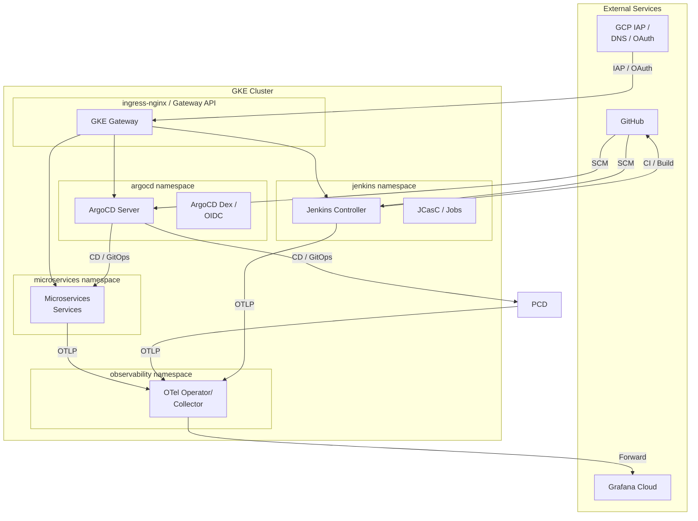
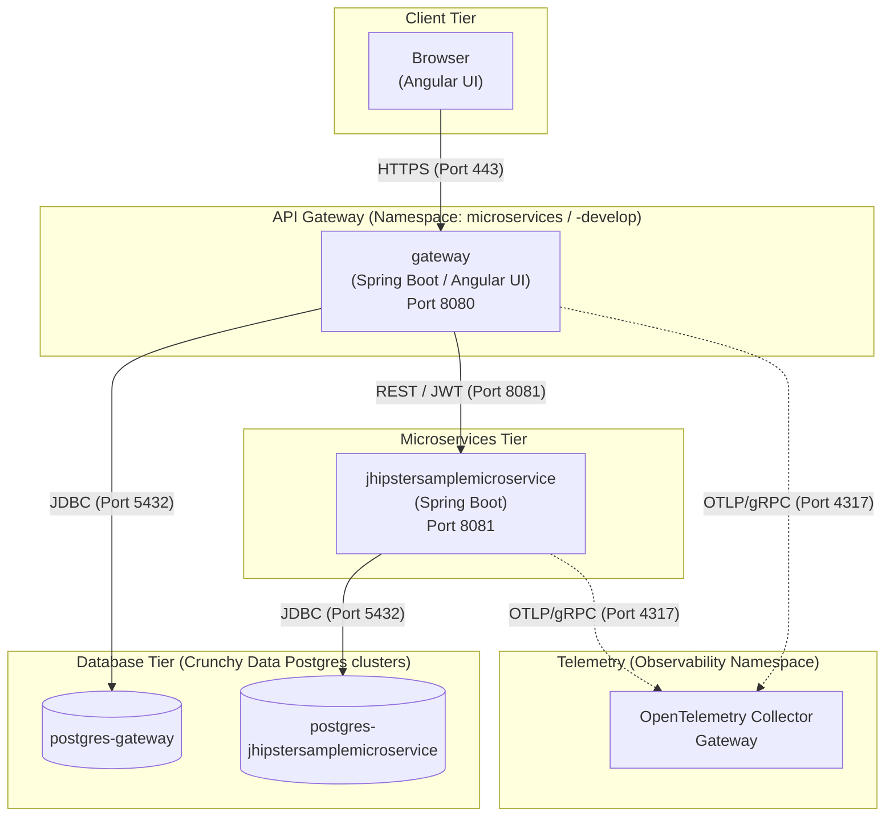
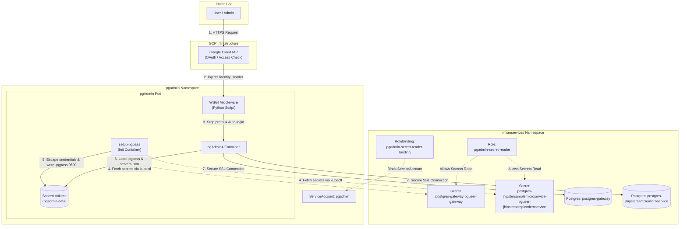
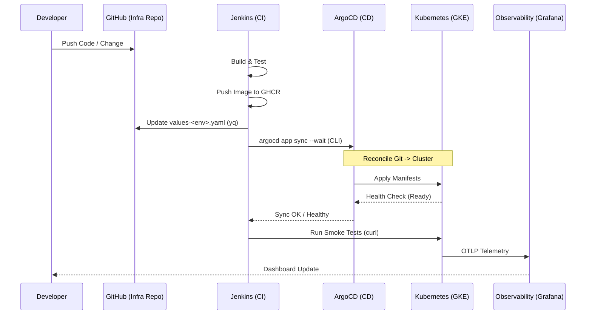
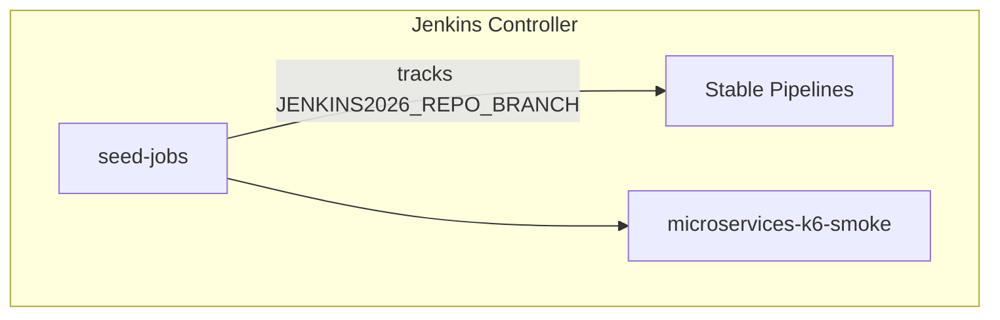
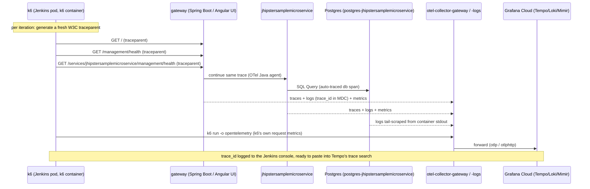
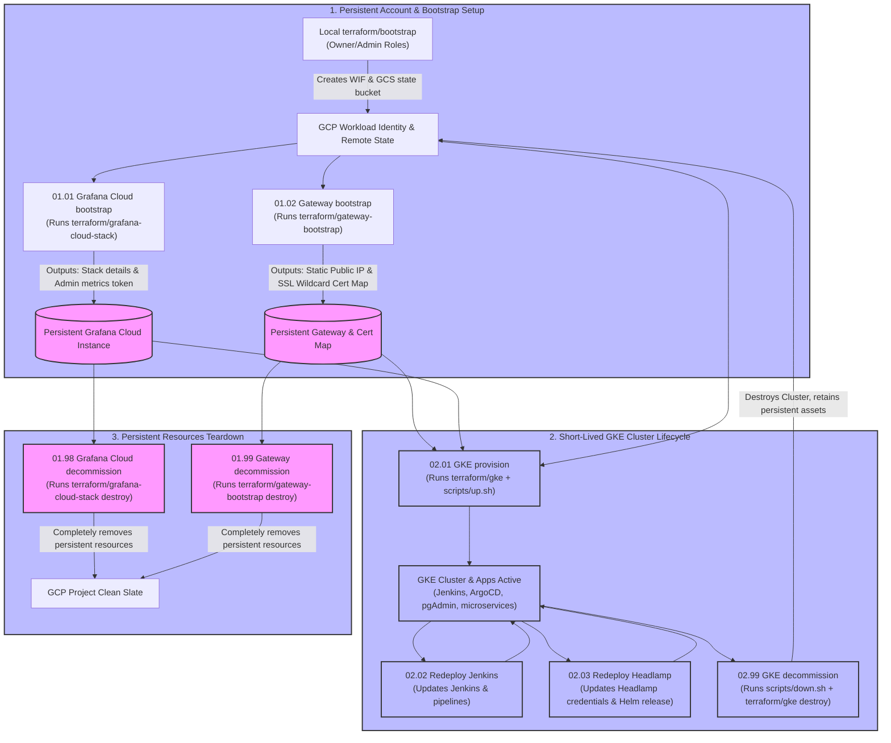

# jenkins-2026

> **Two-repo GitOps setup.** This is the **infra repo** (cluster bootstrap, Jenkins, ArgoCD, observability). Image tags and ArgoCD manifests live in the companion **[`nubenetes/jenkins-2026-gitops-config`](https://github.com/nubenetes/jenkins-2026-gitops-config)** repo — see its [README](https://github.com/nubenetes/jenkins-2026-gitops-config#readme) for the Helm chart layout, values schema, branch strategy, and Postgres details.

A self-contained proof of concept that deploys **Jenkins** (via
[jenkinsci/helm-charts](https://github.com/jenkinsci/helm-charts)) on
**Kubernetes**, configures it entirely through Configuration-as-Code +
Job DSL ("pipelines as code"), and uses it to build, containerize and deploy the
JHipster microservices reference application.

- **Unified Pipeline Model**: A single set of stable pipelines (`gateway`, `jhipstersamplemicroservice`, and `microservices-k6-smoke` at the root, all visible in the **microservices** view) tracks and builds the microservices. They deploy directly to the `microservices` namespace and update the `main` branch of the companion GitOps config repository. The legacy develop environment and sandbox components have been pruned.

- **Observability (Grafana Cloud / OSS)**: Traces, metrics and logs are fully correlated. Dashboard deployment is managed via the native **`gcx` CLI** using a GitOps workflow.
- **ArgoCD (GitOps)**: The entire Microservices stack is managed via **ArgoCD**, providing a declarative GitOps engine for continuous delivery. It is integrated with Google OIDC for secure, single sign-on access.
- **CrunchyData Postgres Operator (PGO)**: Managed natively by ArgoCD
  via the [`pgo-app.yaml`](argocd/pgo-app.yaml) application. For each microservice,
  the Helm chart dynamically provisions a `PostgresCluster` CRD. The Operator
  automatically spins up a highly available PostgreSQL 15 database, manages
  pgBackRest backups, and securely injects connection credentials into the
  application pods without human intervention.


It is compliant with **OpenShift 4.20+** and the latest **Kubernetes on
GKE/EKS/AKS** - the target platform is a config-file + environment-variable
feature flag, only one platform is active per run.

See [`docs/architecture.md`](docs/architecture.md) for the full component
diagram and repository layout, [`docs/pipelines-as-code.md`](docs/pipelines-as-code.md)
for how the Jenkins pipelines are generated, [`docs/observability.md`](docs/observability.md)
for the OpenTelemetry/Grafana wiring, and [`docs/platforms.md`](docs/platforms.md)
for per-cloud notes.

## Prerequisites

- An existing Kubernetes cluster (GKE/EKS/AKS, latest stable, or OpenShift
  4.20+) and a `kubectl` context pointing at it. **This repo provisions no
  cluster infrastructure.**
- `kubectl`, `helm` (v3), [`yq`](https://github.com/mikefarah/yq) (Go
  version, `mikefarah/yq`), `git`, `bash`. `gh` (GitHub CLI) only if you plan
  to push this repo yourself.
- Cluster permissions to create namespaces, RBAC, CRDs (OpenTelemetry
  Operator) and the workloads described below.
- A container registry you can push to (default:
  `ghcr.io/nubenetes/jenkins-2026-microservices` - works anonymously for pulls;
  pushing needs a token with `write:packages` in the `jenkins-credentials`
  Secret, see below).
- **ArgoCD OIDC Redirect URI**: To use Google OIDC with ArgoCD, you MUST add
  `https://argocd.<baseDomain>/api/dex/callback` to your Google OAuth client's
  **Authorized redirect URIs** (see [ArgoCD OIDC](#argocd-google-oidc) below).
- (default observability mode) A [Grafana Cloud](https://grafana.com/products/cloud/)
  stack (free tier is enough) for its OTLP gateway endpoint + API key.

## Quick start

```bash
# 1. Review/edit config/config.yaml - platform.target (gke|eks|aks|openshift)
#    and observability.mode (grafana-cloud|oss|managed). Defaults: gke + grafana-cloud.

# 2. (grafana-cloud mode only) create the OTLP credentials secret:
cp observability/otel-collector/secret.example.yaml observability/otel-collector/secret.yaml
#    edit secret.yaml with your Grafana Cloud OTLP endpoint + base64(instanceID:apiKey),
#    then:
kubectl create namespace observability --dry-run=client -o yaml | kubectl apply -f -
kubectl apply -f observability/otel-collector/secret.yaml

# 3. (optional) export registry/git credentials consumed by scripts/01-namespaces.sh -
#    REGISTRY_USERNAME/REGISTRY_PASSWORD become both the Jenkins "container-registry"
#    push credential and the "ghcr-credentials" imagePullSecret in every Microservices
#    namespace (needed if MICROSERVICES_REGISTRY packages are private, the GHCR default)
export REGISTRY_USERNAME=<github-username> REGISTRY_PASSWORD=<ghcr-token>
export GIT_USERNAME=<github-username>      GIT_TOKEN=<github-token>

# 4. provision everything
./scripts/up.sh

# 5. check status / get port-forward commands
./scripts/status.sh

# tear down (namespaces kept by default; see scripts/down.sh)
./scripts/down.sh
```

`scripts/up.sh` runs, in order: prereq/repo checks -> namespaces & secrets ->
the OpenTelemetry Operator -> (in parallel) the observability stack, Jenkins,
and the initial Microservices Helm releases -> triggers the Jenkins seed job ->
imports Grafana dashboards -> **installs ArgoCD**. Every step is idempotent
(`helm upgrade --install` / `kubectl apply`), so re-running `up.sh` after a
partial failure is safe. Each step also runs standalone:
`./scripts/0N-*.sh`.

## Step-by-Step Deployment Guide (For Other People)

This guide walks through deploying the entire POC (Infrastructure, Jenkins pipelines-as-code, ArgoCD GitOps, and Observability stack) from scratch on your own Kubernetes cluster (GKE, EKS, AKS, or OpenShift).

### Step 1: Fork and Clone the Repositories
Since this is a two-repo GitOps setup, you must fork both repositories to your own GitHub organization or account:
1. Fork and clone **[`jenkins-2026`](https://github.com/nubenetes/jenkins-2026)** (this infrastructure repository).
2. Fork and clone **[`jenkins-2026-gitops-config`](https://github.com/nubenetes/jenkins-2026-gitops-config)** (the GitOps config repository).

### Step 2: Configure Repository Targets
Update the repository reference URLs in `config/config.yaml` to point to your forks:
*   Open [`config/config.yaml`](config/config.yaml) in your local clone of the infra repo.
*   Edit `jenkins.selfRepoUrl` to point to your fork of `jenkins-2026` (e.g., `https://github.com/YOUR_ORG/jenkins-2026.git`).
*   Edit `microservices.git.org` to match your GitHub organization or username.
*   Commit and push this change to your infra repo fork.

### Step 3: Configure GKE / OAuth Credentials (Optional)
If you want to enable public access (Identity-Aware Proxy load balancer) or "Sign in with Google" OIDC login:
1. **Google OAuth Client for Jenkins**: Follow the [Google login (OpenID Connect)](#google-login-openid-connect) section to create an OAuth client. Register `<your-jenkins-url>/securityRealm/finishLogin` as the redirect URI.
2. **Google Identity-Aware Proxy (IAP) (GKE only)**: Follow the [Public access](#public-access-gke-gateway-api--iap) section to set up the OAuth client gating the endpoints.

### Step 4: Add GitHub Repository Secrets
In your fork of the infra repository (`jenkins-2026`), go to **Settings > Secrets and variables > Actions** and add the following repository secrets:
*   `REGISTRY_USERNAME` / `REGISTRY_PASSWORD`: Credentials for your container registry (e.g. GitHub Packages GHCR) to push/pull private microservice images.
*   `GIT_USERNAME` / `GIT_TOKEN`: GitHub account credentials used by the Jenkins pipeline to commit updated image tags to your GitOps repository fork.
*   `JENKINS_OIDC_CLIENT_ID` / `JENKINS_OIDC_CLIENT_SECRET`: Google OAuth client credentials for Jenkins Google login.
*   `JENKINS_OIDC_ADMIN_EMAIL`: Your Google email address (e.g., `you@gmail.com`) to be granted Admin roles in both Jenkins and ArgoCD (applied dynamically via secret/environment mappings).
*   `HEADLAMP_ADMIN_EMAILS`: Comma-separated list of Google emails granted GCP IAP access and cluster-admin bindings in Headlamp.

### Step 5: (Optional) Set up Grafana Cloud Stack
If using the default `observability.mode: grafana-cloud`:
1. Log into your [Grafana Cloud Portal](https://grafana.com/) and copy your OTLP endpoint and Access Policy token.
2. Manually install the **`grafana-jenkins-datasource`** plugin inside your Grafana Cloud stack.
3. Locally create `observability/otel-collector/secret.yaml` by copying `observability/otel-collector/secret.example.yaml` and updating it with your credentials. Apply it:
   ```bash
   kubectl create namespace observability --dry-run=client -o yaml | kubectl apply -f -
   kubectl apply -f observability/otel-collector/secret.yaml
   ```

### Step 6: Deploy the Stack
From your local terminal, run the following setup scripts:
```bash
# Ensure you have set your kubectl context to your target cluster
# Run the full bootstrap script
./scripts/up.sh
```
This script will create the namespaces, configure the OTel Operator, deploy Grafana dashboards, install Jenkins, and install ArgoCD.

### Step 7: Run Jenkins Pipelines & Verify
Once deployed:
1. Run `./scripts/status.sh` to obtain the port-forwarding commands and passwords.
2. Port-forward to Jenkins: `kubectl -n jenkins port-forward svc/jenkins 8080:8080` and open `http://localhost:8080`.
3. Log in with the administrative basic password (retrieved from `jenkins-credentials` secret) or click **Sign in with Google**.
4. In the Jenkins dashboard, run the seeded pipelines (`gateway` and `jhipstersamplemicroservice`) to build and push their first Docker images to your registry. This triggers ArgoCD to deploy the workloads in the cluster.
5. Trigger the `microservices-k6-smoke` pipeline in Jenkins to generate synthetic traffic and verify telemetry in Grafana Cloud!

## Architecture & Flow

### System Architecture
The following diagram illustrates the high-level architecture of the `jenkins-2026` stack, showing how Jenkins, ArgoCD, and the Microservices microservices interact within the cluster and with external services.



### Microservices & Database Architecture

The modernized JHipster system is built on a containerized, cloud-native microservices architecture using **Spring Boot 3.x**, **Angular**, and **Java 21**. It consists of two primary services, each with its own dedicated datastore managed by the **Crunchy Data Postgres Operator**:

1. **`gateway`**:
   - **Role**: Serves as the single entry point for all client requests. It hosts the Angular frontend web application and handles routing, JWT-based security verification, and rate-limiting.
   - **Database**: Connects to `postgres-gateway` for storing session metadata or gateway-specific configurations.
2. **`jhipstersamplemicroservice`**:
   - **Role**: Serves as the backend microservice that contains business logic and REST endpoints.
   - **Database**: Connects to `postgres-jhipstersamplemicroservice` for storing application data.

#### Architecture & Data Flow Diagram



#### Database Injection & Secrets
The database connections are securely managed by the Crunchy Data Postgres Operator. The operator automatically provisions a `PostgresCluster` for each service and exports credentials into a Kubernetes Secret (e.g., `postgres-jhipstersamplemicroservice-pguser-jhipstersamplemicroservice`). The Helm chart maps these secret values to Spring database environment variables:
- `SPRING_DATASOURCE_URL` (JDBC URL)
- `SPRING_DATASOURCE_USERNAME` (username)
- `SPRING_DATASOURCE_PASSWORD` (password)

#### pgAdmin & Database Administration

A total of **2 Postgres databases** are provisioned in the cluster (both in the `microservices` namespace). They can be administered via **pgAdmin 4**:

*   **URL:** `https://pgadmin.jenkins2026.nubenetes.com` (gated behind GKE Gateway + Google IAP).
*   **Auto-Login (Google ID):** pgAdmin is configured with Webserver Authentication (`AUTHENTICATION_SOURCES = ['webserver']`) to trust the `X-Goog-Authenticated-User-Email` header injected by Google IAP. A custom python WSGI middleware automatically strips the `accounts.google.com:` namespace prefix from the header, logging you in directly using your Google email address.
*   **Pre-populated Connections:** Both database connections (Gateway and JHipster Microservice backend) are automatically preconfigured on startup as shared connections.
*   **Automated Database Authentication (Zero-Password Login):** To eliminate manual password prompts, database connection passwords are automatically resolved and injected:
    - **Cross-Namespace RBAC**: A dedicated ServiceAccount `pgadmin` and K8s `RoleBinding` grant pgAdmin permission to read the credentials secrets in the `microservices` namespace.
    - **Dynamic `.pgpass` Generation**: An init container (`setup-pgpass`) mounts the pgAdmin data volume, dynamically retrieves the passwords from the secrets, escapes colons (`:`) and backslashes (`\`) for the `.pgpass` format, and writes them with secure `0600` permissions.
    - **Auto-Connection**: The pre-populated servers are configured to read from `/var/lib/pgadmin/pgpass`, allowing instant connectivity just by double-clicking the server in the Object Explorer.
*   **Resource & Safety Limits:** To prevent GKE auto-scaling, pgAdmin is strictly resource-constrained (requests: `50m` CPU / `128Mi` RAM, limits: `200m` CPU / `256Mi` RAM) and is capped by a `ResourceQuota` in the `pgadmin` namespace.

##### Automated pgAdmin Authentication Flow




##### Retrieving Database Credentials (Optional / CLI Tools)
If you need to connect to the databases manually using `psql` or external CLI tools, retrieve the generated passwords from their respective Kubernetes secrets:
*   **Gateway DB password:**
    ```bash
    kubectl get secret postgres-gateway-pguser-gateway -n microservices -o jsonpath='{.data.password}' | base64 -d
    ```
*   **JHipster Microservice DB password:**
    ```bash
    kubectl get secret postgres-jhipstersamplemicroservice-pguser-jhipstersamplemicroservice -n microservices -o jsonpath='{.data.password}' | base64 -d
    ```


---

### CI/CD Flow (GitOps)
This diagram shows the robust Jenkins-to-ArgoCD synchronization we've implemented. Jenkins (CI) builds the artifact and updates the configuration repo, then uses the **ArgoCD CLI** to explicitly trigger and wait for a healthy deployment before finishing the pipeline.



## ArgoCD Inventory (GitOps)

The deployment lifecycle is managed by **ArgoCD**. Application manifests are stored in [`nubenetes/jenkins-2026-gitops-config/argocd/`](https://github.com/nubenetes/jenkins-2026-gitops-config/tree/main/argocd) and applied to the cluster by `scripts/08.5-argocd.sh`. Jenkins CI writes image tags into that repo; ArgoCD detects the change and reconciles the cluster.

> See [`nubenetes/jenkins-2026-gitops-config`](https://github.com/nubenetes/jenkins-2026-gitops-config) for the full Helm chart schema, values files, branch strategy, and Postgres details.

### Projects & Applications

| Resource | Type | Source repo | Source path | Target namespace | Health |
| :--- | :--- | :--- | :--- | :--- | :--- |
| `microservices` | `AppProject` | — | — | `microservices` | — |
| `microservices` | `ApplicationSet` | `jenkins-2026-gitops-config` | `helm/microservices/` | (generates one App) | — |
| `microservices-stable` | `Application` | `jenkins-2026-gitops-config` | `helm/microservices/` + `values-stable.yaml` | `microservices` | Synced |
| `headlamp` | `Application` | `jenkins-2026-gitops-config` | `helm/headlamp/values.yaml` | `headlamp` | Healthy |
| `pgadmin` | `Application` | `jenkins-2026-gitops-config` | `helm/pgadmin/` | `pgadmin` | Healthy |
| `postgres-operator` | `Application` | `CrunchyData/postgres-operator@v5.7.9` | `config/default` | `postgres-operator` | Healthy |

### Security & Integration
- **Jenkins Integration**: A dedicated `jenkins` account is created in ArgoCD with a scoped **API Token**. This token is stored in the `jenkins-credentials` Secret and used by the `argocd` CLI inside pipeline agents to trigger `argocd app sync --wait`.
- **Auto-Sync**: All Applications are configured with `selfHeal: true` and `prune: true` — the cluster state always converges to the Git state within seconds of a push.
- **Rollout Waiting**: After pushing a new tag to the gitops-config repo, the Jenkins pipeline calls `argocd app wait --health --timeout 300` before running smoke tests, ensuring zero-downtime deployments are verified end-to-end.

## Telemetry Verification & Simulation

To validate that the OpenTelemetry instrumentation is working correctly and that signals are properly correlated in Grafana Cloud, you can generate synthetic traffic.

### 1. Continuous Traffic Simulation (GitHub Actions)
For a constant stream of telemetry, use the **`99.01 Continuous Traffic Simulation`** workflow:
- **Location**: GitHub Actions tab.
- **Action**: Run `workflow_dispatch`.
- **Duration**: Default 15 minutes (configurable).
- **Purpose**: Simulates real-world user traffic from outside the cluster, hitting the GKE Gateway and triggering end-to-end traces (Frontend -> Gateway -> Backend Services).

#### Grafana Cloud Integration (GitHub Actions)
To see real-time metrics from the GitHub simulation in your Grafana dashboards, you must configure the following repository secrets:

1.  **`GRAFANA_CLOUD_OTLP_ENDPOINT`**: The OTLP gateway URL.
    *   Get it from Terraform: `terraform -chdir=terraform/grafana-cloud-stack output -raw otlp_endpoint`
2.  **`GRAFANA_CLOUD_OTLP_AUTH`**: The Base64 encoded `stack_id:token`.
    *   Get the values from Terraform:
        ```bash
        STACK_ID=$(terraform -chdir=terraform/grafana-cloud-stack output -raw stack_id)
        # Note: Use a persistent API token from your Grafana Cloud Access Policy
        TOKEN="<your-grafana-cloud-token>"
        echo -n "$STACK_ID:$TOKEN" | base64
        ```
    *   Set this value as the `GRAFANA_CLOUD_OTLP_AUTH` secret.

Once configured, k6 will stream metrics via OpenTelemetry directly to your Grafana Cloud instance during the simulation.

### 2. On-Demand Smoke Test (Jenkins)
Trigger the **`microservices-k6-smoke`** job from the Jenkins UI:
- **Feature**: Generates traces that include Jenkins build metadata (e.g., build number, job name).
- **Correlation**: Connects CI metadata with CD runtime telemetry.

### 3. How to Verify Correlation in Grafana
Once traffic is running, go to your Grafana Cloud instance:

- **Metrics to Logs**: Open the **Microservices Overview** dashboard. Click on any metric spike for a service (e.g., `jhipstersamplemicroservice`) and use the **"Show Logs"** split-view to see the logs for that exact time window.
- **Logs to Traces**: In the **Explore (Loki)** view, look for logs containing `trace_id`. The OTel Java agent automatically injects these. Grafana will show a "Tempo" link next to the `trace_id` to jump to the full distributed trace.
- **End-to-End Traces**: In **Explore (Tempo)**, search for `service.name="gateway"`. Select a trace to see the full request path, starting from the k6 client or Angular UI, through the gateway, into the microservices, and down to the database calls.

> **First run note**: `helm/microservices`'s default image tag (`main`) won't
> exist in your registry yet, so Microservices pods will show
> `ImagePullBackOff` until each service's Jenkins pipeline has run at least
> once and pushed an image. `scripts/06-seed-pipelines.sh` (part of `up.sh`)
> triggers the seed job immediately so the 2 stable pipelines exist right
> away; trigger individual builds from the Jenkins UI (`listView` **microservices**).
> Jobs are not auto-triggered (no SCM-poll).
> The same seed run also creates `microservices-k6-smoke` - run it after the 2 services have
> deployed at least once to send a small amount of traffic through the whole
> app and give Grafana fresh traces/metrics/logs to correlate (see
> [`docs/observability.md`](docs/observability.md#k6-observability-smoke-test)).

## Configuration ([`config/config.yaml`](config/config.yaml))

Single source of truth, loaded by every script via
[`scripts/lib/config.sh`](scripts/lib/config.sh) (`yq` -> `J2026_*` env
vars). Feature flags:

| Key | Default | Override | Meaning |
|---|---|---|---|
| `platform.target` | `gke` | `JENKINS2026_PLATFORM` env var | `gke`\|`eks`\|`aks`\|`openshift` - selects the Helm overlay, ingress/Route strategy and storage class (see [`docs/platforms.md`](docs/platforms.md)). |
| `observability.mode` | `grafana-cloud` | edit `config.yaml` | `grafana-cloud`\|`oss`\|`managed` - where traces/metrics/logs go (see [`docs/observability.md`](docs/observability.md)). |

Other notable sections: `jenkins.*` (chart coordinates, namespace, this
repo's own URL/branch used by JCasC's global library + seed job),
`observability.*` (operator/collector chart coordinates, release names,
Secret name), `microservices.*` (namespaces for the stable/develop environments,
upstream Microservices git org/repos/branches, target registry, and the list of
2 services seeded into Jenkins).

## Repository layout

```
config/config.yaml          single source of truth (feature flags above)
helm/jenkins/                jenkinsci/helm-charts values + per-platform overlays
helm/microservices/              local chart for the 9 Microservices workloads (2 envs)
helm/headlamp/                kubernetes-sigs/headlamp values (cluster management UI)
jenkins/casc/                JCasC: security, OTel exporter, seed job
jenkins/pipelines/           Jenkinsfile.microservices + seed job (Job DSL + services.yaml)
vars/, resources/            Jenkins global shared library (must be at repo root)
observability/               OTel Operator/Collector + Grafana/Loki/Tempo/Prometheus values + dashboards
scripts/                      00-09 numbered steps + up.sh / down.sh / status.sh
terraform/gke/                throwaway GKE cluster for test/e2e.sh (the one exception
                              to "assumes an existing cluster")
terraform/bootstrap/          one-time setup for the GitHub Actions automation below
                              (state bucket + Workload Identity Federation)
terraform/gateway-bootstrap/  one-time setup for public access (static IP + managed
                              certificate) - see "Public access (GKE Gateway API + IAP)"
scripts/08.5-argocd.sh        ArgoCD installation and OIDC configuration
test/                         e2e.sh (provision -> up.sh -> smoke-test.sh -> down.sh -> destroy)
.github/workflows/            CC.NN-<name>.yml, see "CI/CD pipelines" for the full inventory
docs/                         architecture, pipelines-as-code, observability, platforms
```

Full details in [`docs/architecture.md`](docs/architecture.md).

## Jenkins UI, plugins & MCP

### Accessing the UI & admin password

```bash
kubectl -n jenkins port-forward svc/jenkins 8080:8080
```

Open <http://localhost:8080>. If [Google login](#google-login-openid-connect)
is configured, use the **Sign in with Google** button. Otherwise (or for
break-glass/automation access), log in as `${JENKINS_ADMIN_ID}`
(`jenkins.adminUser` in [`config/config.yaml`](config/config.yaml), default
`admin`) via the **escape hatch** - this login always works, regardless of
OIDC. The password is randomly generated on first run by
[`scripts/01-namespaces.sh`](scripts/01-namespaces.sh) and printed once to its
output - if you missed it, retrieve it from the `jenkins-credentials` Secret
(`jenkins.credentialsSecretName`) in the `jenkins` namespace:

```bash
kubectl -n jenkins get secret jenkins-credentials -o jsonpath='{.data.admin-password}' | base64 -d; echo
```

This same `${JENKINS_ADMIN_ID}` / password is what
[`test/smoke-test.sh`](test/smoke-test.sh) and
[`scripts/06-seed-pipelines.sh`](scripts/06-seed-pipelines.sh) use for
HTTP Basic Auth against the Jenkins API. To rotate the password, delete the
Secret and re-run `scripts/01-namespaces.sh` + `scripts/04-jenkins.sh` (see
[Troubleshooting](#troubleshooting)) - a new random password is generated and
printed once.

### Google login (OpenID Connect)

Jenkins' security realm is [`oic-auth`](https://plugins.jenkins.io/oic-auth/)
(`securityRealm.oic` in
[`jenkins/casc/jcasc-base.yaml`](jenkins/casc/jcasc-base.yaml)), so anyone can
sign in with a Google account - Role-Based Authorization Strategy then decides
what they can do. By default, a Google login only gets `authenticated-base`
(read-only UI access); to grant the `admin` role (`Overall/Administer`) to
your own account, set `JENKINS_OIDC_ADMIN_EMAIL`. 

Setting `JENKINS_OIDC_ADMIN_EMAIL` also dynamically configures administrator permissions for the corresponding user in ArgoCD's RBAC policy configmap (`argocd-rbac-cm`), ensuring unified admin privileges across both Jenkins and ArgoCD when logging in via Google OIDC.

This **replaces** the old local `admin` password login. The `${JENKINS_ADMIN_ID}`
escape hatch above remains as the break-glass admin login.

1. **Create a third Google OAuth 2.0 Web application client** (can reuse the
   same GCP project as the [Headlamp](#one-time-setup-google-oauth-client)
   and [IAP](#one-time-setup) clients, but must be its own client - Jenkins
   needs its own redirect URI and cannot share a client with them):
   - [Google Cloud Console](https://console.cloud.google.com/) -> **APIs &
     Services** -> **Credentials** -> **Create credentials** -> **OAuth
     client ID** -> Application type **Web application**.
   - **Authorized redirect URIs**: add
     `https://jenkins.<baseDomain>/securityRealm/finishLogin` (e.g.
     `https://jenkins.jenkins2026.nubenetes.com/securityRealm/finishLogin`).
     If you only access Jenkins via `kubectl port-forward`, also add
     `http://localhost:8080/securityRealm/finishLogin`.
   - Note the **Client ID** and **Client secret**.
   - On the **OAuth consent screen** (Audience tab), while the app is in
     **Testing**, add your Google account as a **Test user** - otherwise
     Google returns `Error 403: access_denied` ("has not completed the Google
     verification process"). Unlike the Headlamp client, Jenkins only needs
     the non-sensitive `openid email profile` scopes, so no Data Access
     changes are required.

2. **Add repository secrets** (your own email is **never committed to this
   repo**):

   ```bash
   gh secret set JENKINS_OIDC_CLIENT_ID     --body "<client ID from above>"
   gh secret set JENKINS_OIDC_CLIENT_SECRET --body "<client secret from above>"
   gh secret set JENKINS_OIDC_ADMIN_EMAIL   --body "you@gmail.com"
   ```

   then re-run **02.02 Redeploy Jenkins** (or **02.01 GKE provision**).
   Locally (`test/e2e.sh` / `scripts/up.sh`), export the same three as
   `JENKINS_OIDC_CLIENT_ID`, `JENKINS_OIDC_CLIENT_SECRET` and
   `JENKINS_OIDC_ADMIN_EMAIL` instead.

   > Changes to `jenkins-credentials` only take effect for a *new* Secret -
   > if it already exists from a previous run, delete it first (see
   > [Troubleshooting](#troubleshooting)) so `scripts/01-namespaces.sh`
   > recreates it with the `oidc-*` keys.

Until `JENKINS_OIDC_CLIENT_ID`/`JENKINS_OIDC_CLIENT_SECRET` are set, the
**Sign in with Google** button is shown but errors out - the escape hatch
above is the only working login in the meantime.

[`helm/jenkins/values-common.yaml`](helm/jenkins/values-common.yaml) tracks
the latest Jenkins LTS (`controller.image.tag`) and pins **every** plugin -
including transitive dependencies - to the exact version resolved against
that core by `jenkins-plugin-cli` (recipe in the comment above
`installPlugins`). This replaced an earlier unversioned plugin list: pinning
means a routine controller pod restart always installs the identical plugin
set, instead of silently picking up a newer (possibly breaking) version.
Bump `controller.image.tag` and re-run the recipe together when updating.

Beyond the existing kubernetes/git/JCasC/OTel plugins, three are aimed at UX:

- **[Pipeline Graph View](https://plugins.jenkins.io/pipeline-graph-view/)** -
  the maintained successor to the discontinued Blue Ocean. Adds an
  interactive, pan/zoom stage graph to every build page - no configuration
  needed.
- **[Dark Theme](https://plugins.jenkins.io/dark-theme/)** (+ Theme Manager) -
  native dark mode. `appearance.themeManager` in
  [`jenkins/casc/jcasc-base.yaml`](jenkins/casc/jcasc-base.yaml) defaults
  everyone to `darkSystem` (follows the browser/OS preference); each user can
  still override it from their profile's *Appearance* tab.
- **[MCP Server](https://plugins.jenkins.io/mcp-server/)** - exposes Jenkins
  (jobs, builds, logs, SCM, replay) as an MCP server, so an MCP-capable
  client (Claude Code/Desktop, etc.) can query and drive this Jenkins
  directly. No JCasC config needed - it auto-registers its endpoints
  (`/mcp-server/sse`, `/mcp-server/mcp`, `/mcp-server/mcp-stateless`).
  Authenticate as `${JENKINS_ADMIN_ID}` (or any user) with a personal **API
  token** (user profile -> *Security* -> *Add new Token*), passed as HTTP
  Basic Auth - never put this token in the repo. For Claude Code:
  `claude mcp add --transport http jenkins <jenkins-url>/mcp-server/mcp
  --header "Authorization: Basic <base64(user:token)>"` (after exposing
  Jenkins per the access method in [Quick start](#quick-start) /
  [Headlamp](#headlamp-cluster-management-ui)).

## Pipelines as code

A Jenkins seed job (defined via JCasC, running Job DSL against
[`jenkins/pipelines/seed/seed_jobs.groovy`](jenkins/pipelines/seed/seed_jobs.groovy)
+ [`services.yaml`](jenkins/pipelines/seed/services.yaml)) generates the stable pipeline jobs at the root level under the `microservices` view:
- `gateway`
- `jhipstersamplemicroservice`
- `microservices-k6-smoke`

The first 2 pipelines run [`Jenkinsfile.microservices`](jenkins/pipelines/Jenkinsfile.microservices) (build/deploy, one Microservices service each); the last job runs [`Jenkinsfile.microservices-k6-smoke`](jenkins/pipelines/Jenkinsfile.microservices-k6-smoke) (synthetic traffic + telemetry, see [k6 observability smoke test](#k6-observability-smoke-test) below).

### Pipeline Branch & Environment Mapping

Instead of separating stable and development pipelines into separate jobs and folders, a single set of root stable pipelines is generated. These pipelines are dynamically seeded and configured to target the stable environment:

*   **Target Namespace:** `microservices`
*   **Environment Name:** `stable` (modifies `values-stable.yaml` in the GitOps config repository on the `main` branch)

#### Why the GitOps Repo Uses Only the `main` Branch

The companion repository `jenkins-2026-gitops-config` is configured to track only a single `main` branch:

1. **Single Environment Target**: In this unified model, the legacy development sandbox has been pruned, leaving only a single stable target namespace (`microservices`).
2. **Simplified Promotion**: The Jenkins CI pipeline writes image tags directly inside [values-stable.yaml](file:///home/inafev/github/jenkins-2026-gitops-config/helm/microservices/values-stable.yaml) on the `main` branch of the GitOps repository.

#### Would a `develop` branch make sense?

Yes, but **only if you restore a multi-environment deployment model** (e.g., dev/staging vs. stable namespaces):

* **Testing Infrastructure Changes**: If developers need to test Helm chart updates (e.g., resource limits, new environment variables, or sidecar additions) in a sandbox (`develop`) namespace before promoting them to stable (`main`), they would push changes to the `develop` branch of the GitOps repo first for verification.
* **Tracking Parallel Code Tracks**: If upstream repositories build from both a `develop` branch (dev builds) and a `main` branch (stable releases), Jenkins would commit dev tags to a `values-develop.yaml` on the GitOps `develop` branch (synced to a dev namespace), and stable tags to [values-stable.yaml](file:///home/inafev/github/jenkins-2026-gitops-config/helm/microservices/values-stable.yaml) on the GitOps `main` branch (synced to the stable namespace).

### Architecture Diagram



Each per-service pipeline runs [`Jenkinsfile.microservices`](jenkins/pipelines/Jenkinsfile.microservices):
checkout -> build & test -> build & push image -> `helm upgrade` the [`helm/microservices`](helm/microservices) chart for that environment -> smoke test.
Details in [`docs/pipelines-as-code.md`](docs/pipelines-as-code.md).

> [!NOTE]
> For Java microservices containing a `jib-maven-plugin` configuration, the image build and push stages are handled directly in a single step by Jib, and the subsequent redundant local `docker push` is automatically skipped.

## Observability

Jenkins (via the `opentelemetry` plugin), every Java microservice (via OTel
Operator auto-instrumentation) and the Angular UI (via a small RUM snippet)
export OTLP to an in-cluster collector, which forwards to Grafana Cloud
(default) or an in-cluster Prometheus+Loki+Tempo+Grafana stack
(`observability.mode: oss`).

### Key Features
- **gcx CLI GitOps**: Dashboard deployment in Grafana Cloud is managed via the native **`gcx` CLI**. The `scripts/07-grafana-dashboards.sh` script automatically:
    - Installs and authenticates the `gcx` CLI using `gcx login --yes` to discover the stack ID and namespace.
    - Wraps raw JSON dashboards into Kubernetes-style `apiVersion: dashboard.grafana.app/v1` manifests.
    - Pushes resources declaratively using `gcx resources push --include-managed`.
- **Jenkins Data Source**: The [Jenkins Datasource](https://grafana.com/grafana/plugins/grafana-jenkins-datasource/) is automatically provisioned. 
    - **One-time Manual Step**: You must manually install the **`grafana-jenkins-datasource`** plugin in your Grafana Cloud portal (**Administration > Plugins**) before the first deployment.
    - **PDC Tunnel**: In Grafana Cloud mode, it uses **Private Data Source Connect (PDC)** to securely tunnel from the cloud to your in-cluster Jenkins instance.
- **Model Context Protocol (MCP)**: This project supports Grafana Cloud's hosted **MCP server**. Connecting an AI agent (like Gemini) to your stack via MCP allows for real-time querying of Jenkins traces, metrics, and logs during troubleshooting.
    - **Setup**: In your Grafana Cloud portal, go to **Administration > Assistant > Cloud MCP** to find your connection endpoint.
    - **Integration**: Add the endpoint to your Gemini CLI or AI agent configuration. You can then ask questions like *"Audit my Jenkins datasource health"* or *"Summarize recent pipeline failures from traces"* for a better outcome of your changes.
- **Correlated telemetry**: Traces, metrics and logs are fully correlated. On Grafana Cloud, log-to-trace links and system datasources (like `alert-state-history` and `usage-insights`) are pre-configured by default.

### k6 observability smoke test

`microservices-k6-smoke` (at the root) runs
[`jenkins/pipelines/k6/microservices-smoke.js`](jenkins/pipelines/k6/microservices-smoke.js)
via [`vars/microservicesK6Smoke.groovy`](vars/microservicesK6Smoke.groovy). This is
**not a load/stress test** - it's an on-demand way to give Grafana a fresh,
fully-correlated trace/metric/log example across the *whole* app, without
waiting for real users:



- **One trace per iteration**: every request in an iteration carries the
  same generated `traceparent`, so the OTel Java agent (already configured
  with `tracecontext` propagation + `parentbased_traceidratio(1.0)` sampling)
  continues it across every service the iteration touches - one k6 iteration
  = one Tempo trace spanning the gateway and downstream microservices.
- **Job parameters** (set as defaults by `seed_jobs.groovy`, overridable per
  build): `TARGET_NAMESPACE`/`ENV_NAME` (`microservices`/`stable`), `K6_VUS` (default 4) and `K6_ITERATIONS`
  (default 12, shared across all VUs).
- **Thresholds, not a hard gate**: `microservices-smoke.js` sets
  `http_req_failed: rate<0.05` and `http_req_duration: p(95)<3000`. k6 exits
  `99` if a threshold is crossed but the run otherwise completed cleanly -
  `microservicesK6Smoke.groovy` reports that as Jenkins **UNSTABLE** (e.g. a
  cold-start latency blip right after a deploy), reserving **FAILURE** for
  real script/runtime errors.
- **Build output**: whatever the outcome, `microservicesK6Smoke` prints the raw
  `k6-summary.json` (also archived as a build artifact), a pass/fail
  breakdown (checks, `http_req_failed` rate, `http_req_duration` p95 vs.
  their thresholds, iteration count), and a direct link to the
  **`k6-smoke-overview.json`** Grafana dashboard
  (`observability/grafana/dashboards/k6-smoke-overview.json`, uid
  `jenkins2026-k6-smoke-overview`) scoped to this run's
  `stable` environment and time window.
- **Automated Pipeline Integration**: The k6 smoke test is automatically triggered at the end of every microservice build and deploy pipeline ([MicroservicesPipeline.groovy](file:///home/inafev/github/jenkins-2026/vars/MicroservicesPipeline.groovy)). After a microservice (`jhipstersamplemicroservice` or `gateway`) is deployed to GKE and passes its basic startup health checks, the pipeline automatically triggers the root `microservices-k6-smoke` integration test job. This automatically validates that the newly deployed service version integrates successfully with the gateway, other microservices, and databases, and sends correlated telemetry (metrics, traces, logs) to Grafana Cloud.
- **Run it** after the 2 services have deployed at least once (see [First run
  note](#quick-start)), then follow the Grafana link in the build console -
  or search Tempo for one of the `[microservices-smoke] iteration
  trace_id=...` values also logged there.

Full details in [`docs/observability.md`](docs/observability.md#k6-observability-smoke-test).

## Headlamp (cluster management UI)

[Headlamp](https://headlamp.dev/) gives a web UI for the GKE cluster itself
(pods, deployments, logs, exec, RBAC, etc.), deployed by
[`scripts/08-headlamp.sh`](scripts/08-headlamp.sh) into the `headlamp`
namespace using [`helm/headlamp/values.yaml`](helm/headlamp/values.yaml).

**Access model**: Headlamp's "main" cluster context uses the chart's default
**ServiceAccount** (cluster-admin via the chart's default `ClusterRoleBinding`,
`clusterRoleName: cluster-admin`) - `helm/headlamp/values.yaml` is
intentionally empty, no in-app OIDC is configured. Google-identity access
control happens one layer up: if
[gateway.baseDomain](#public-access-gke-gateway-api--iap) is configured,
`https://headlamp.<baseDomain>` is gated by
[Identity-Aware Proxy](https://cloud.google.com/iap) - only the Google
accounts in `HEADLAMP_ADMIN_EMAILS` (granted `roles/iap.httpsResourceAccessor`
by `terraform/gke` `google_project_iam_member.iap_accessors`) can reach the UI
at all, and everyone who gets through has full cluster-admin via Headlamp's
ServiceAccount. By default (no `gateway.baseDomain`), access is via `kubectl
port-forward` (below) with no Google sign-in or IAP gate.

**Why not per-user Google OIDC -> GKE API auth?** This was attempted
(`config.oidc.externalSecret` + `config.oidc.useAccessToken: true`, each
signed-in user's Google identity mapped to K8s RBAC via a `cluster-admin`
`ClusterRoleBinding` per `HEADLAMP_ADMIN_EMAILS` entry +
`roles/container.clusterViewer` in GCP IAM). Headlamp chart >=0.38.0
([kubernetes-sigs/headlamp#3954](https://github.com/kubernetes-sigs/headlamp/issues/3954)/PR#4122)
does fix the Helm templating bug that previously dropped
`-oidc-use-access-token` when `externalSecret.enabled: true`, but a deeper
backend bug remains: with `useAccessToken: true`, the `/oidc-callback` handler
runs Google's OAuth2 **access token** (an opaque `ya29.` bearer token, not a
JWT) through an OIDC ID-token verifier, which fails immediately with
`Failed to verify ID Token: oidc: failed to unmarshal claims: invalid
character 'k' looking for beginning of value` - the sign-in never completes.
This matches [kubernetes-sigs/headlamp#2643](https://github.com/kubernetes-sigs/headlamp/issues/2643)
("OIDC with GKE... only ServiceAccount token works") and upstream's own
recent move toward an `unsafe-use-service-account-token` flag for in-cluster
deployments - per-user OIDC tokens forwarded to a managed GKE control plane
isn't a supported path today. If upstream fixes this, `headlamp-credentials`
(`HEADLAMP_OIDC_CLIENT_ID`/`HEADLAMP_OIDC_CLIENT_SECRET`, still created by
`scripts/01-namespaces.sh`) and the per-email `ClusterRoleBinding`s
(`scripts/08-headlamp.sh`) are ready to wire back up via
`helm/headlamp/values.yaml`.

### One-time setup: Google OAuth client (currently unused)

> Not required for the IAP-gated access model above - IAP uses its own OAuth
> client (`gateway-iap-oauth`, see [Public access (GKE Gateway API +
> IAP)](#public-access-gke-gateway-api--iap)). This client is only consumed
> by Headlamp's in-app OIDC, which doesn't work against GKE today (see
> above) - kept here in case upstream fixes it.

Create a Google OAuth 2.0 **Web application** client (any GCP project will
do - it doesn't need to be the same project as the GKE cluster):

1. [Google Cloud Console](https://console.cloud.google.com/) -> **APIs &
   Services** -> **Credentials** -> **Create credentials** -> **OAuth client
   ID** -> Application type **Web application**.
2. **Authorized redirect URIs**: add `http://localhost:8080/oidc-callback`
   (matches the `kubectl port-forward` instructions below). If
   [gateway.baseDomain](#public-access-gke-gateway-api--iap) is configured,
   also add `https://headlamp.<baseDomain>/oidc-callback` (e.g.
   `https://headlamp.jenkins2026.nubenetes.com/oidc-callback`) -
   [`scripts/lib/config.sh`](scripts/lib/config.sh) computes which one
   `OIDC_CALLBACK_URL` is set to.
3. Note the **Client ID** and **Client secret**. The client ID isn't
   inherently secret, but - like the client secret, which *is* sensitive -
   it's kept out of the repo for consistency; both are passed as the
   `HEADLAMP_OIDC_CLIENT_ID` / `HEADLAMP_OIDC_CLIENT_SECRET` secrets below.

### Adding your (or another) identity

Your Google account email is **never committed to this repo** - it's
supplied via the `HEADLAMP_ADMIN_EMAILS` secret (comma-separated for
multiple people) and consumed as a placeholder
(`J2026_HEADLAMP_ADMIN_EMAILS`/`JENKINS2026_HEADLAMP_ADMIN_EMAILS`) by
[`scripts/lib/config.sh`](scripts/lib/config.sh),
[`terraform/gke`](terraform/gke) (`TF_VAR_admin_emails`) and
[`scripts/08-headlamp.sh`](scripts/08-headlamp.sh). This is the list IAP lets
through to `https://headlamp.<baseDomain>` (and `https://jenkins.<baseDomain>`
- see [Public access](#public-access-gke-gateway-api--iap)). To grant access
to yourself or anyone else:

```bash
# comma-separated, no spaces needed (leading/trailing whitespace is trimmed)
gh secret set HEADLAMP_ADMIN_EMAILS --body "you@gmail.com,colleague@gmail.com"
```

then (re-)run **02.01 GKE provision** (adds the `roles/iap.httpsResourceAccessor`
IAM binding via `terraform/gke`). Locally (`test/e2e.sh` / `scripts/up.sh`),
export the same as `JENKINS2026_HEADLAMP_ADMIN_EMAILS` instead - never commit
it to `config/config.yaml`. `HEADLAMP_OIDC_CLIENT_ID`/`HEADLAMP_OIDC_CLIENT_SECRET`
(from the previous section) are only needed if/when the in-app OIDC above
becomes usable.

### Accessing and Logging in to the UI

Depending on your access model, you can open Headlamp using either:
*   **Public URL (IAP-secured):** `https://headlamp.jenkins2026.nubenetes.com` (requires Google login to pass the initial Google IAP gate).
*   **Local Port-Forward:** If accessing locally without the public gateway, run:
    ```bash
    kubectl -n headlamp port-forward svc/headlamp 8080:80
    ```
    Then open <http://localhost:8080> in your browser.

Once the Headlamp UI loads, you must authenticate against the Kubernetes API by pasting a token. There are two supported methods:

#### Option A: Log in with your Google ID (Recommended for GKE)
Because GKE natively integrates with GCP IAM, you can authenticate using your personal Google account credentials:
1. Open your local terminal (where you are authenticated to Google Cloud with your Google ID).
2. Generate your OAuth2 access token:
   ```bash
   gcloud auth print-access-token
   ```
3. Copy the output token (starts with `ya29.`).
4. Select the **Token** login option in Headlamp, paste this token, and click **Sign In**.
5. GKE will authenticate you as your Google account, and your permissions inside Headlamp will dynamically match your GCP IAM roles (e.g., if you are Project Owner or have `roles/container.admin`).

#### Option B: Log in with a ServiceAccount Token
If you want to log in using the cluster's default administrator ServiceAccount:
1. Generate the token:
   ```bash
   kubectl create token headlamp -n headlamp
   ```
2. Copy the token.
3. Select the **Token** login option in Headlamp, paste the token, and click **Sign In** (grants cluster-admin access).

#### Why IAP-Gated Access + Token Login over Native App-Level OIDC?
For managed Kubernetes environments like GKE, this setup (GCP IAP at the load balancer edge + `gcloud` access token login) is significantly more secure and stable than configuring full native OIDC inside Headlamp:
*   **Edge-Level Firewall (Google IAP):** With native OIDC, Headlamp's login page must be exposed to the public internet, leaving it vulnerable to scans and brute-force. With Google IAP, the entire site is firewalled at the Google Cloud load balancer. Unauthorized users are blocked with a `403 Forbidden` before a single packet ever reaches the container.
*   **Native GKE IAM Integration:** Standard Kubernetes clusters require custom configuration flags (`--oidc-issuer-url`, `--oidc-client-id`) to verify OIDC tokens. Because GKE is a managed Google Cloud service, its Kube-API server natively validates Google Cloud OAuth2 access tokens. Pasting your `gcloud` token allows GKE to map your actions directly to your GCP IAM roles (e.g. `roles/container.admin`), eliminating the need to manually sync and map OIDC scopes to cluster RoleBindings.
*   **Format Compatibility:** Google's OAuth2 access tokens are opaque strings (e.g., `ya29....`), not JWTs. Attempting to force native OIDC redirection inside GKE dashboards often fails with token verification or JWT parsing errors (such as the base64 decoding error).

## Public access (GKE Gateway API + IAP)


Jenkins, Microservices, Headlamp, and pgAdmin can all be exposed on
the public internet through a single **GKE Gateway** (`gatewayClassName:
gke-l7-global-external-managed`) - one global external HTTPS load balancer,
one [Google-managed wildcard
certificate](https://cloud.google.com/certificate-manager/docs/overview)
(Certificate Manager, DNS-authorized), and one `HTTPRoute` per app, all
applied by [`scripts/09-gateway.sh`](scripts/09-gateway.sh):

| App | URL | [Identity-Aware Proxy](https://cloud.google.com/iap) |
|---|---|---|
| Jenkins | `https://jenkins.<baseDomain>` | yes |
| Microservices | `https://microservices.<baseDomain>` | no (public demo app) |
| Headlamp | `https://headlamp.<baseDomain>` | yes |
| pgAdmin | `https://pgadmin.<baseDomain>` | yes |

`<baseDomain>` is [`gateway.baseDomain`](config/config.yaml) -
`jenkins2026.nubenetes.com` by default. Jenkins, Headlamp, and pgAdmin get an extra
Google-login gate (IAP) in front of their own auth; Microservices, the demo app, stays open. The Microservices URL is also
surfaced in the Jenkins UI's system message banner (see [`jenkins/casc/jcasc-base.yaml`](jenkins/casc/jcasc-base.yaml)).
**This whole feature is opt-in**: set
`JENKINS2026_BASE_DOMAIN=""` to disable it (no `Gateway`/`HTTPRoute`/
`GCPBackendPolicy` resources are created, e.g. before the one-time setup
below has been done) - `scripts/09-gateway.sh` is also a no-op on
`platform.target` other than `gke`, since `gke-l7-global-external-managed`
and `GCPBackendPolicy` are GKE-specific.

> **Two non-obvious GKE Gateway API requirements**, confirmed against a live
> cluster and handled by [`scripts/09-gateway.sh`](scripts/09-gateway.sh):
> - The `Gateway` CRD rejects a `https` listener's `tls.mode: Terminate`
>   unless `tls.certificateRefs` or `tls.options` is non-empty - even though
>   the actual certificate comes from the `networking.gke.io/certmap`
>   annotation. The script adds the documented placeholder
>   `tls.options["networking.gke.io/pre-shared-certs"]: ""` to satisfy this.
> - `GCPBackendPolicy`'s `spec.default.iap.clientID` must be a literal OAuth
>   client ID string (not a Secret reference), and the Secret referenced by
>   `oauth2ClientSecret.name` must contain **exactly one** key
>   (`client_secret`). The script reads `client_id`/`client_secret` from the
>   `gateway-iap-oauth` Secret (created by
>   [`scripts/01-namespaces.sh`](scripts/01-namespaces.sh)) and derives a
>   single-key `gateway-iap-oauth-client-secret` Secret per namespace for
  `oauth2ClientSecret.name`.

### Authentication & Authorization Matrix

The table below outlines the authentication and authorization mechanisms for each of the deployed applications in the cluster:

| Application | Access Method | Edge-Level Authentication (GCP IAP) | App-Level Authentication | Authorization & Permissions |
|---|---|---|---|---|
| **Jenkins** | Public URL (`https://jenkins.<baseDomain>`) or `kubectl port-forward` | **Yes** (via Google IAP OAuth) | Google OIDC (`oic-auth` plugin) **or** local `admin` user basic auth | **Role-Based Authorization Strategy**:<br>- Default Google login: `authenticated-base` (Read-Only)<br>- Admin email (`JENKINS_OIDC_ADMIN_EMAIL`): `admin` (Overall/Administer)<br>- Escaped admin user: Full Admin |
| **ArgoCD** | Public URL (`https://argocd.<baseDomain>`) or `kubectl port-forward` | **Yes** (via Google IAP OAuth) | Google OIDC (via Dex connector) **or** local `admin` secret password | **ArgoCD RBAC Policies** (`argocd-rbac-cm`):<br>- Default OIDC login: `role:readonly`<br>- Admin email (`J2026_JENKINS_OIDC_ADMIN_EMAIL`): `role:admin`<br>- Jenkins API Account: `role:admin` via API token |
| **Headlamp** | Public URL (`https://headlamp.<baseDomain>`) or `kubectl port-forward` | **Yes** (via Google IAP OAuth) | Token Login (using GKE OAuth access token `ya29....` or ServiceAccount token) | **Kubernetes RBAC**:<br>- GKE maps your GCP Identity to Kubernetes permissions (Project Owner gets cluster-admin)<br>- ServiceAccount token maps to default headlamp-admin bindings |
| **pgAdmin** | Public URL (`https://pgadmin.<baseDomain>`) or `kubectl port-forward` | **Yes** (via Google IAP OAuth) | Webserver Auth (pgAdmin trusts `X-Goog-Authenticated-User-Email` header) | **Webserver User Mapping & Automated Password Injection**:<br>- Authenticated email is logged in directly to pgAdmin<br>- Database connections are automatically authenticated via a dynamically generated `.pgpass` file (secured via GKE RBAC secrets reader) |
| **Microservices** (Gateway & Backend) | Public URL (`https://microservices.<baseDomain>`) | **No** (Public Demo App) | JWT Token verification (Gateway issues JWT; microservices validate it) | **Spring Security Roles**:<br>- Enforces API authorization (e.g., `ROLE_USER`, `ROLE_ADMIN`) |

### One-time setup

1. **Run the "01.02 Gateway bootstrap" workflow** (Actions tab -> **01.02
   Gateway bootstrap** -> **Run workflow**). It applies
   [`terraform/gateway-bootstrap`](terraform/gateway-bootstrap) (state in the
   same GCS bucket as `terraform/gke`, like [Grafana Cloud
   bootstrap](#one-time-setup)) to create, once and persistently:
   - a global static IP (`jenkins-2026-gateway-ip`), and
   - a Google-managed wildcard certificate for `<baseDomain>` and
     `*.<baseDomain>`, validated via a Certificate Manager DNS authorization.

   It's safe to re-run - re-applying against existing state is a no-op. The
   job summary prints the static IP and the DNS authorization record.

2. **Add the two DNS records it prints**, with your DNS provider for
   `<baseDomain>`'s parent domain. For the default
   `jenkins2026.nubenetes.com` (a subdomain of `nubenetes.com`, managed at
   **Squarespace** - Squarespace migrated domains off Google Domains in
   2023, but `nubenetes.com`'s nameservers are Google Cloud DNS
   (`ns-cloud-a[1-4].googledomains.com`) - Squarespace's "Custom records" UI
   manages that same Cloud DNS zone): go to **Domains** -> `nubenetes.com` ->
   **DNS** -> **Custom records**, and add:
   - a wildcard **A** record: host `*.jenkins2026`, value the static IP from
     step 1 (e.g. `34.120.231.149`).
   - the **CNAME** record from the workflow's "DNS authorization record"
     output: host `_acme-challenge.jenkins2026`, value something like
     `<random-id>.<n>.authorize.certificatemanager.goog.` (proves ownership
     of `jenkins2026.nubenetes.com` for the managed certificate).

   Double-check the CNAME value is copied **in full, including the trailing
   `.`** - Squarespace's UI truncates long values when displaying them, which
   is easy to mistake for the saved value also being truncated.

   Certificate provisioning can take up to ~1h after the DNS authorization
   record verifies. Check progress with:

   ```bash
   gcloud certificate-manager certificates describe jenkins-2026-cert \
     --format="yaml(managed.state,managed.provisioningIssue,managed.authorizationAttemptInfo)"
   ```

   `managed.state: ACTIVE` means it's done. While `PROVISIONING`, an
   `authorizationAttemptInfo[].issues: [CNAME_MISMATCH]` entry reflects
   Certificate Manager's **last** validation attempt - it only re-checks DNS
   periodically, so this can stay stale for a while even after you've fixed
   the record; re-verify the record itself with `dig` / `https://dns.google`
   rather than relying on this field to update immediately. Until the
   certificate is `ACTIVE`, HTTPS requests to `*.jenkins2026.nubenetes.com`
   fail with a TLS handshake error (e.g. curl's `SSL_ERROR_SYSCALL`) because
   the load balancer has no certificate attached yet.

3. **Create the IAP OAuth client by hand** (the Terraform resources for this,
   `google_iap_brand`/`google_iap_client`, are deprecated - the IAP OAuth
   Admin API they depend on was deprecated after July 2025). In the [GCP
   Console](https://console.cloud.google.com/): **APIs & Services** ->
   **Credentials** -> **Create credentials** -> **OAuth client ID** ->
   Application type **Web application**.

   **Authorized redirect URIs**: add (replacing `<client ID>` with the OAuth
   client ID you just created):

   ```
   https://iap.googleapis.com/v1/oauth/clientIds/<client ID>:handleRedirect
   ```

   Without this, IAP's post-login redirect back from Google fails with
   **Error 400: redirect_uri_mismatch**. This is the one redirect URI IAP
   uses regardless of how many apps/domains sit behind it, so a single OAuth
   client can be shared by the Jenkins, Headlamp, and pgAdmin `GCPBackendPolicy`
   resources.

   > [!IMPORTANT]
   > Because GCP IAP intercepts all traffic at the external load balancer level, you **do not** need to register individual application-level callback URLs (such as `https://pgadmin.jenkins2026.nubenetes.com/oauth2/authorize` or `https://headlamp.jenkins2026.nubenetes.com/oidc-callback`) in the Google Cloud Console.

   ```bash
   gh secret set IAP_OAUTH_CLIENT_ID     --body "<client ID>"
   gh secret set IAP_OAUTH_CLIENT_SECRET --body "<client secret>"
   ```

   (Re-)run **02.01 GKE provision** - `scripts/01-namespaces.sh` writes these into
   the `gateway-iap-oauth` Secret in the `jenkins`, `headlamp`, and `pgadmin` namespaces
   that the `GCPBackendPolicy` resources reference.

4. **IAP access control** reuses `HEADLAMP_ADMIN_EMAILS` (see
   [Headlamp](#headlamp-cluster-management-ui)): each listed email is granted
   both `roles/container.clusterViewer` (existing, for Headlamp's OIDC
   passthrough) and `roles/iap.httpsResourceAccessor` (new, via
   `terraform/gke`'s `google_project_iam_member.iap_accessors`) - i.e. the
   same people who can administer the cluster via Headlamp can pass IAP for
   Jenkins, Headlamp, and pgAdmin. Anyone without `roles/iap.httpsResourceAccessor` gets
   a 403 from IAP before reaching either app.

## Automated end-to-end test (provisioning + decommissioning)

[`test/e2e.sh`](test/e2e.sh) fully automates a real run of this PoC,
**including the GKE cluster itself** - the one exception to "this repo
assumes an existing cluster" (scoped entirely to `terraform/gke/` and
`test/`):

1. **`terraform -chdir=terraform/gke apply`** - provisions a throwaway GKE
   cluster: its own VPC/subnet and a 2-4 node autoscaling `e2-standard-4`
   node pool.
2. **`gcloud container clusters get-credentials`** - points `kubectl`/`helm`
   at the new cluster.
3. **`scripts/00-check-prereqs.sh` + `scripts/01-namespaces.sh`**.
4. **`scripts/up.sh`** - the full stack, exactly as in Quick start.
5. **`test/smoke-test.sh`** - verifies the Jenkins controller pod is `Running`
    and serves `/login`, the seed job created the stable pipelines (plus
    `seed-jobs`), the OTel Operator/collectors (and,
    for `oss` mode, Grafana) are running, and both Microservices namespaces have
    all `Deployment`s.
6. **`scripts/down.sh`** (with `J2026_DELETE_NAMESPACES=true`) then
   **`terraform -chdir=terraform/gke destroy`** - decommissions everything.

Step 6 runs **unconditionally** via an `EXIT` trap, even if steps 1-5 fail
partway through, so a failed run still leaves the GCP project clean.

### Running it

```bash
cp test/.env.example test/.env   # edit: at minimum set GCP_PROJECT_ID
set -a; source test/.env; set +a

gcloud auth login
gcloud auth application-default login

./test/e2e.sh
```

### Prerequisites

- A GCP project with billing enabled, and the authenticated principal having
  `roles/container.admin`, `roles/compute.networkAdmin`,
  `roles/iam.serviceAccountAdmin` and `roles/resourcemanager.projectIamAdmin`
  (or `roles/owner`/`roles/editor`).
- [`terraform`](https://developer.hashicorp.com/terraform/install) >= 1.9
  (developed against **1.15.x**) and the
  [`gcloud` CLI](https://cloud.google.com/sdk/docs/install), in addition to
  the [Prerequisites](#prerequisites) above (`kubectl`/`helm`/`yq`/etc).
- `observability.mode: grafana-cloud` (the default) requires
  `observability/otel-collector/secret.yaml` to already exist (Quick start
  step 2) - `test/e2e.sh` checks for it up front and fails fast with
  instructions if it's missing. For a fully self-contained run with **no**
  external account, `export JENKINS2026_OBS_MODE=oss` instead (see
  `test/.env.example`).

### What gets created / destroyed

[`terraform/gke/`](terraform/gke/) provisions, all named/prefixed
`jenkins-2026*` and removed by `terraform destroy`:

| Resource | Notes |
|---|---|
| VPC + subnet (`jenkins-2026-vpc` / `-subnet`) | VPC-native, dedicated pod/Service CIDR ranges |
| GKE cluster `jenkins-2026` (zonal, `europe-southwest1-a`) | `deletion_protection = false` so `destroy` works |
| Node pool (2-4 x `e2-standard-4`, autoscaling) | sized for Jenkins + 18 Microservices pods + 1-2 concurrent build agents |
| Service account `jenkins-2026-nodes` + IAM bindings | logging/monitoring writer, Artifact Registry reader only |

`container.googleapis.com`/`compute.googleapis.com` API enablement on the
project is intentionally left in place (re-enabling is slow, and disabling
can break unrelated resources in the same project).

### Cost

At on-demand `europe-southwest1` (Madrid) pricing, the cluster runs at roughly
**$0.40-0.50/hr** (3x `e2-standard-4`, plus the $0.10/hr GKE cluster
management fee - waived for your first zonal cluster per billing account).
A full `test/e2e.sh` pass (provision, deploy, smoke-test, tear down
everything) typically takes **15-25 minutes**, i.e. **~$0.10-0.20 per run**.
Grafana Cloud's free tier comfortably covers this PoC's traffic/series volume
for a run of that length.

### Resource Quotas & QoS (Cost Control)

To prevent GKE cluster auto-scaling (saving costs for this PoC) and ensure optimal QoS (Quality of Service) and stability, resource requests, limits, and namespace-level `ResourceQuota` objects are strictly configured across all components:

1. **Tight Pod Resource Allocations**:
   - **Microservices** (`gateway`, `jhipstersamplemicroservice`): CPU requests set to `100m` (limits to `1.0` CPU) and memory requests to `512Mi` (limits to `1Gi`).
   - **Postgres Database Instances**: Crunchy PostgresCluster containers (`postgres`, `pgbackrest` jobs, and `repoHost` sidecars) instances requests: `100m`/`256Mi`, limits: `500m`/`512Mi`.
   - **Jenkins Controller**: Tighter footprint of `500m` CPU and `1.5Gi` memory requests (limits: `1.5` CPU and `3Gi` memory).
   - **Jenkins Build Agents & K6 Smoke Agents**: Minimized build agent containers (`maven`, `node`, `docker`, `helm`, `git`, `jnlp`) requesting `380m` CPU and `1.56Gi` (`1600Mi`) memory in total, with limits capped at `3.3` CPU and `3.875Gi` (`3968Mi`) memory.

   Below is the complete breakdown of configured CPU and memory requests and limits for all active workloads in the cluster:

   | Namespace | Workload Name | Workload Type | CPU Requests | CPU Limits | Memory Requests | Memory Limits |
   |---|---|---|---|---|---|---|
   | **jenkins** | `jenkins` | StatefulSet | `500m` | `1.5` | `1.5Gi` (`1536Mi`) | `3Gi` (`3072Mi`) |
   | **microservices** | `gateway` | Deployment | `100m` | `1.0` | `512Mi` | `1Gi` |
   | | `jhipstersamplemicroservice` | Deployment | `100m` | `1.0` | `512Mi` | `1Gi` |
   | | `postgres-gateway-instance1` | StatefulSet | `100m` | `500m` | `256Mi` | `512Mi` |
   | | `postgres-gateway-repo-host` | StatefulSet | `100m` | `200m` | `128Mi` | `256Mi` |
   | | `postgres-jhipstersamplemicroservice-instance1` | StatefulSet | `100m` | `500m` | `256Mi` | `512Mi` |
   | | `postgres-jhipstersamplemicroservice-repo-host` | StatefulSet | `100m` | `200m` | `128Mi` | `256Mi` |
   | **observability** | `otel-collector-gateway` | Deployment | `100m` | `500m` | `256Mi` | `512Mi` |
   | | `otel-collector-logs-agent` | DaemonSet | `100m` | `300m` | `128Mi` | `256Mi` |
   | | `otel-operator-opentelemetry-operator` | Deployment | `100m` | `500m` | `128Mi` | `256Mi` |
   | | `pdc-agent` | Deployment | `50m` | `200m` | `64Mi` | `128Mi` |
   | **argocd** | `argocd-application-controller` | StatefulSet | `100m` | `1.0` | `256Mi` | `1Gi` |
   | | `argocd-server` | Deployment | `100m` | `500m` | `128Mi` | `256Mi` |
   | | `argocd-repo-server` | Deployment | `100m` | `500m` | `256Mi` | `512Mi` |
   | | `argocd-redis` | Deployment | `100m` | `500m` | `128Mi` | `256Mi` |
   | | `argocd-dex-server` | Deployment | `50m` | `200m` | `128Mi` | `256Mi` |
   | | `argocd-applicationset-controller` | Deployment | `50m` | `200m` | `128Mi` | `256Mi` |
   | | `argocd-notifications-controller` | Deployment | `50m` | `200m` | `128Mi` | `256Mi` |
   | **headlamp** | `headlamp` | Deployment | `50m` | `200m` | `64Mi` | `128Mi` |
   | **pgadmin** | `pgadmin-pgadmin4` | Deployment | `100m` | `500m` | `256Mi` | `512Mi` |

2. **Namespace ResourceQuotas**:
   To enforce a hard ceiling and prevent the GKE auto-scaler from launching a third node, namespace-level `ResourceQuota` objects are deployed for all active namespaces:
   - `jenkins`: Requests max `3.0` CPU / `8.0Gi` memory (allowing concurrent build agents at a time).
     > [!NOTE]
     > To allow concurrent pipeline execution and optimize deployment throughput, the Jenkins cloud is configured with `containerCap: 2` in `helm/jenkins/values-common.yaml`. The namespace resource quota has been adjusted accordingly (`requests.cpu: "3.0"`, `requests.memory: "8.0Gi"`, `limits.cpu: "14"`, `limits.memory: "16.0Gi"`) to accommodate this parallelism safely and prevent pipeline agent quota exhaustion.
   - `microservices`: Requests max `1.5` CPU / `3.0Gi` memory.
   - `observability`: Requests max `1.5` CPU / `3.0Gi` memory.
   - `argocd`: Requests max `1.5` CPU / `3.0Gi` memory.
   - `headlamp`: Requests max `200m` CPU / `256Mi` memory.

The sum of all namespace CPU and memory request quotas is strictly below the allocatable node pool capacity (total `7.8 vCPU` and `26 GiB` memory across the 2 active nodes). This guarantees that:
- Pods exceeding namespace quotas are rejected at admission, preventing them from sitting in a `Pending` state that would trigger GKE auto-scaling.
- Node usage is fully bounded, ensuring the cluster remains small and cost-effective.

### Terraform version & Stacks

`terraform/gke/` targets Terraform **1.15.x** (`required_version >= 1.9`) and
`hashicorp/google ~> 6.0`. [Terraform
Stacks](https://developer.hashicorp.com/terraform/cloud-docs/stacks) (the
newer multi-component/multi-deployment orchestration model) is an **HCP
Terraform**-only feature aimed at fleets of similar deployments across
environments - adopting it here would add an HCP Terraform account dependency
for what is a single throwaway cluster with local state, so this repo uses a
plain root module + local backend instead. The resources in
[`terraform/gke/main.tf`](terraform/gke/main.tf) can be lifted into a Stack
component largely as-is if you use HCP Terraform for your own infrastructure.

## CI/CD pipelines

All workflows live in [`.github/workflows/`](.github/workflows/), are
manually-triggered (`workflow_dispatch`), and follow a `CC.NN-<name>.yml`
naming convention so their order in the GitHub UI matches their place in the
lifecycle:

- `CC` - **category**: `01` persistent, account-level resources (bootstrap and decommission, run by hand, rarely); `02` the GKE cluster lifecycle (provision, component redeploys, decommission).
- `NN` - sequence number within that category, in the order you'd typically run them. Within categories `01` and `02`, `.98` and `.99` are reserved for teardown (decommission) steps.

| # | Workflow | Category | What it does |
|---|---|---|---|
| 01.01 | [Grafana Cloud bootstrap](.github/workflows/01.01-grafana-cloud-bootstrap.yml) | One-time bootstrap | Creates/confirms the persistent Grafana Cloud stack (`terraform/grafana-cloud-stack`) that `observability_mode: grafana-cloud` sends data to. See [Full Grafana Cloud lifecycle automation](#one-time-setup-1). |
| 01.02 | [Gateway bootstrap](.github/workflows/01.02-gateway-bootstrap.yml) | One-time bootstrap | Creates/confirms the persistent static IP + managed wildcard cert + DNS authorization (`terraform/gateway-bootstrap`) that [public access](#public-access-gke-gateway-api--iap) depends on. |
| 01.98 | [Grafana Cloud decommission](.github/workflows/01.98-grafana-cloud-decommission.yml) | One-time decommission | Destroys the persistent Grafana Cloud stack (`terraform/grafana-cloud-stack`). Run only when tearing down the environment permanently. |
| 01.99 | [Gateway decommission](.github/workflows/01.99-gateway-decommission.yml) | One-time decommission | Destroys the persistent static IP, cert mapping, and DNS authorization (`terraform/gateway-bootstrap`). Run only when tearing down the environment permanently. |
| 02.01 | [GKE provision](.github/workflows/02.01-gke-provision.yml) | GKE lifecycle | Provisions the throwaway GKE cluster (`terraform/gke`) and deploys the full stack (`scripts/up.sh`) + smoke test. Pair with 02.99. |
| 02.02 | [Redeploy Jenkins](.github/workflows/02.02-redeploy-jenkins.yml) | GKE lifecycle | Re-applies only `scripts/04-jenkins.sh` (Helm upgrade of `helm/jenkins/` + `jenkins/casc/` JCasC) and re-seeds the Microservices pipelines, against the cluster from the last 02.01 run - for a Jenkins-only fix without the full provision/decommission cycle. Run any number of times between 02.01 and 02.99. |
| 02.03 | [Redeploy Headlamp](.github/workflows/02.03-redeploy-headlamp.yml) | GKE lifecycle | Re-applies `scripts/01-namespaces.sh` (refreshes the non-sensitive OIDC config keys on `headlamp-credentials`) and `scripts/08-headlamp.sh` (Helm upgrade of `helm/headlamp/`), against the cluster from the last 02.01 run - for a Headlamp-only fix without the full provision/decommission cycle. Run any number of times between 02.01 and 02.99. |
| 02.99 | [GKE decommission](.github/workflows/02.99-gke-decommission.yml) | GKE lifecycle | Tears down the stack (`scripts/down.sh`) and destroys the GKE cluster (`terraform destroy`). |

See [GitHub Actions automation](#github-actions-automation) below for the
one-time setup (secrets, Workload Identity Federation) these workflows need.

## GitHub Actions automation

[`.github/workflows/02.01-gke-provision.yml`](.github/workflows/02.01-gke-provision.yml) and
[`.github/workflows/02.99-gke-decommission.yml`](.github/workflows/02.99-gke-decommission.yml)
are the CI equivalent of `test/e2e.sh`, split into two manually-triggered
workflows so the cluster can be left running between them (e.g. provision in
the morning, demo it, decommission in the evening). They run the exact same
`terraform/gke` + `scripts/0N-*.sh` + `test/smoke-test.sh` as `test/e2e.sh`,
but since each is a separate workflow run on a fresh runner, Terraform state
has to be **remote** (a GCS bucket) instead of local so the decommission run
can find what the provision run created. See [CI/CD
pipelines](#cicd-pipelines) for the full workflow inventory.

### Bootstrapping Architecture: Persistent vs. Short-Lived Resources

To keep operating costs low and deployment speed high, this project separates the environment lifecycle into **short-lived workload resources** (GKE cluster, database pods, Helm releases) and **persistent, account-level resources (bootstrap)**. We use specialized bootstrap stages for the following reasons:

1. **GCP Auth and Terraform State (`terraform/bootstrap`)**:
   - **Workload Identity Federation (WIF)**: Establishes a secure, keyless trust relationship between GitHub Actions and your GCP project. GitHub can authenticate dynamically using OpenID Connect (OIDC) tokens instead of saving permanent GCP service account JSON keys inside repository secrets.
   - **GCS Remote Backend**: Sets up the persistent bucket where all GHA workflow runs store and retrieve Terraform state.

2. **Persistent Observability Backend (`01.01 Grafana Cloud bootstrap`)**:
   - Applies the persistent Grafana Cloud stack (`terraform/grafana-cloud-stack`). By decoupling the metrics/tracing backend from the GKE cluster, your logs, metrics, and trace history are preserved across multiple cluster spin-ups and tear-downs.

3. **Persistent External DNS & Networking (`01.02 Gateway bootstrap`)**:
   - Provisions GCP global networking resources: a persistent static IP (`jenkins-2026-gateway-ip`), DNS authorizations, and the wildcard SSL certificate map (`jenkins-2026-cert-map`).
   - If these networking assets were tied to the short-lived GKE cluster, deleting the cluster would release the IP address and destroy the SSL certificate. This would force you to manually update DNS records at your domain registrar (e.g. Squarespace) and wait for DNS propagation every single time you provisioned a new cluster. Keeping the gateway bootstrapped persistently ensures your external endpoints are immediately reachable upon cluster creation.

### Workflow Architecture & Lifecycle Diagram

The following diagram illustrates how the persistent infrastructure bootstrap workflows, the GKE cluster provisioning/decommissioning pipelines, and the application-specific redeployments interact:



#### Detailed Workflow Reference and Lifecycle Management

##### 1. Persistent Bootstrap Workflows
- **`01.01 Grafana Cloud bootstrap`**: Provisions a dedicated Grafana Cloud stack (hosted metrics/traces/logs backend) using `terraform/grafana-cloud-stack`. By separating the observability backend from the short-lived GKE cluster, application performance metrics and history are preserved permanently, remaining readable even after GKE is decommissioned and rebuilt from scratch.
- **`01.02 Gateway bootstrap`**: Provisions account-level GCP networking assets using `terraform/gateway-bootstrap`. This includes a reserved external IP (`jenkins-2026-gateway-ip`), DNS authorizations, and a Google-managed wildcard SSL certificate map. Keeping this IP and SSL certificate persistent avoids losing the reserved IP during a GKE rebuild, eliminating the need to update wildcard DNS records at your domain registrar and wait for DNS propagation.

##### 2. Persistent Decommission Workflows (Clean Slate)
When you want to tear down the entire project permanently, you must run the decommission workflows in the reverse order of setup to avoid dangling resources:
1. Run **`02.99 GKE decommission`** first to destroy the active GKE cluster and all internal Kubernetes workloads (releasing short-lived target bindings).
2. Run **`01.98 Grafana Cloud decommission`** to run `terraform destroy` on the Grafana Cloud stack, which removes the Grafana instances, access policies, and dashboards.
3. Run **`01.99 Gateway decommission`** to run `terraform destroy` on the gateway resources, freeing the reserved external IP, removing the wildcard SSL certificate map, and deleting GCP DNS authorizations.

> [!WARNING]
> Decommissioning the gateway (`01.99`) releases the external IP address. If you recreate the gateway later, a *new* IP will be allocated, forcing you to update your DNS provider's A records and wait for DNS propagation. Only decommission the gateway if you plan to shut down the environment permanently.


### One-time setup


> **Why this step can't itself run in GitHub Actions**: `02.01-gke-provision.yml`
> and `02.99-gke-decommission.yml` authenticate to GCP via Workload Identity
> Federation (WIF) - but that WIF trust relationship, the CI service account,
> and the GCS state bucket don't exist yet. Something has to create them
> first using *real* GCP credentials, which is exactly what
> `terraform/bootstrap` does. This is a one-time, local "break glass" step;
> every run after that (provisioning, deploying, smoke-testing, decommission)
> happens entirely in GitHub Actions. There's no way around this for the
> *first* setup - any approach to creating WIF trust ultimately needs an
> already-trusted identity to grant it.

1. **Authenticate locally** as a principal with `roles/owner` (or
   `roles/editor` + `roles/resourcemanager.projectIamAdmin`) on your GCP
   project - the same one used for [`test/e2e.sh`](#running-it):

   ```bash
   gcloud auth login
   gcloud auth application-default login
   ```

2. **Run `terraform/bootstrap`** once. This creates the GCS state bucket and
   a Workload Identity Federation pool/provider + service account that
   GitHub Actions will use to authenticate to GCP **without a JSON key**:

   ```bash
   cd terraform/bootstrap
   cp terraform.tfvars.example terraform.tfvars
   # edit terraform.tfvars: set project_id (and github_repo if you forked this repo)

   terraform init
   terraform apply
   terraform output    # copy these 4 values into GitHub secrets below
   ```

   Keep `terraform/bootstrap/terraform.tfstate` (gitignored, local-only) -
   it's the only record of these resources; see the comment in
   [`terraform/bootstrap/versions.tf`](terraform/bootstrap/versions.tf).

3. **Add repository secrets**, from the `terraform output` above:

   | Secret | From output |
   |---|---|
   | `GCP_PROJECT_ID` | `project_id` |
   | `GCP_WORKLOAD_IDENTITY_PROVIDER` | `workload_identity_provider` |
   | `GCP_SERVICE_ACCOUNT` | `ci_service_account_email` |
   | `TF_STATE_BUCKET` | `state_bucket` |

   **Option A - GitHub CLI (`gh`, recommended)**, from `terraform/bootstrap`
   (run right after `terraform apply`, so `terraform output` still has the
   values):

   ```bash
   cd terraform/bootstrap
   gh secret set GCP_PROJECT_ID                --body "$(terraform output -raw project_id)"
   gh secret set GCP_WORKLOAD_IDENTITY_PROVIDER --body "$(terraform output -raw workload_identity_provider)"
   gh secret set GCP_SERVICE_ACCOUNT           --body "$(terraform output -raw ci_service_account_email)"
   gh secret set TF_STATE_BUCKET               --body "$(terraform output -raw state_bucket)"
   ```

   `gh secret set` defaults to the repo of the current directory's git
   remote; add `--repo nubenetes/jenkins-2026` (or your fork) to target it
   explicitly. Verify with `gh secret list`.

   **Option B - GitHub web UI**: go to the repo -> **Settings** -> **Secrets
   and variables** -> **Actions** -> **New repository secret**, and for each
   row of the table above, paste the **Secret** name (e.g.
   `GCP_PROJECT_ID`) and the corresponding `terraform output -raw <name>`
   value as the **Value**. Print all four at once with:

   ```bash
   for o in project_id workload_identity_provider ci_service_account_email state_bucket; do
     echo "$o -> $(terraform -chdir=terraform/bootstrap output -raw "$o")"
   done
   ```

4. **Optional secrets**, only needed if you use the corresponding feature -
   set the same way, e.g. `gh secret set REGISTRY_PASSWORD --body "<token>"`:

   | Secret | Needed for |
   |---|---|
   | `REGISTRY_USERNAME` / `REGISTRY_PASSWORD` | pushing Microservices images to, and pulling them back from, a private registry (`scripts/01-namespaces.sh`) |
   | `GIT_USERNAME` / `GIT_TOKEN` | cloning a private Microservices fork |
   | `GRAFANA_TRACES_DASHBOARD_UID` / `OTEL_LOGS_BACKEND_URL` | `observability_mode: grafana-cloud` extras - a "View trace in Grafana" link UID and the logs Explore URL (see `observability/otel-collector/secret.example.yaml`); both optional even then |
   | `HEADLAMP_OIDC_CLIENT_ID` / `HEADLAMP_OIDC_CLIENT_SECRET` | Google OAuth client for Headlamp login (see [Headlamp](#headlamp-cluster-management-ui)) |
   | `HEADLAMP_ADMIN_EMAILS` | comma-separated Google account emails granted cluster-admin via Headlamp **and** IAP access to Jenkins/Headlamp - **your own email, never committed to the repo** (see [Headlamp](#headlamp-cluster-management-ui) and [Public access](#public-access-gke-gateway-api--iap)) |
   | `JENKINS_OIDC_CLIENT_ID` / `JENKINS_OIDC_CLIENT_SECRET` | Google OAuth client for Jenkins "Sign in with Google" (see [Google login](#google-login-openid-connect)) |
   | `JENKINS_OIDC_ADMIN_EMAIL` | Google account email granted the Jenkins `admin` role via OIDC login - **your own email, never committed to the repo** (see [Google login](#google-login-openid-connect)) |
   | `IAP_OAUTH_CLIENT_ID` / `IAP_OAUTH_CLIENT_SECRET` | OAuth client gating Jenkins/Headlamp via Identity-Aware Proxy (see [Public access](#public-access-gke-gateway-api--iap)) |

   `gateway.baseDomain` (default `jenkins2026.nubenetes.com`) is **not** a
   secret - it's committed in `config/config.yaml`. Override it via the
   `JENKINS2026_BASE_DOMAIN` env var for forks using a different domain, or
   set it to `""` to disable public access entirely (see [Public
   access](#public-access-gke-gateway-api--iap)).

5. **(Optional) Full Grafana Cloud lifecycle automation**, for
   `observability_mode: grafana-cloud`. Without this, picking that mode in
   **02.01 GKE provision** will fail at `terraform apply` in
   `terraform/grafana-cloud-token` - skip this step entirely if you only plan
   to use `oss` or `managed`.

   This provisions one **persistent** Grafana Cloud stack (once, locally,
   like step 2 above), then lets every `02.01-gke-provision`/`02.99-gke-decommission`
   run mint and revoke **ephemeral**, scoped access tokens against it -
   no manual `observability/otel-collector/secret.yaml` needed.

   a. **Create a Grafana Cloud Access Policy token** - this is the one
      unavoidable manual credential, since Grafana Cloud has no equivalent
      of GCP's Workload Identity Federation (used in steps 1-3) for
      federating GitHub Actions: its API only supports static
      organization-level tokens. In the [Grafana Cloud
      portal](https://grafana.com), go to your org -> **Administration** ->
      create an access policy with the following configuration:

      - **Name**: `jenkins-2026-bootstrap`
      - **Realm**: Select your **Organization** (this is required to manage
        multiple stacks or look up stack details by slug).
      - **Scopes**: Add the following mandatory scopes:
        - `stacks:read` / `stacks:write` / `stacks:delete`: To manage the
          Grafana Cloud stack itself.
        - `accesspolicies:read` / `accesspolicies:write` / `accesspolicies:delete`:
          To mint the ephemeral OTLP ingest tokens.
        - `stack-service-accounts:write`: To create the "Editor/Admin" service
          account used for dashboards and datasources.
        - `datasources:read` / `datasources:write`: To provision the Jenkins
          datasource.
        - `pdc:read` / `pdc:write`: To manage the Private Data Source Connect
          network.
        - `stack-plugins:read` / `stack-plugins:write`: To ensure the required
          Jenkins plugin is available.

      Then, create a **Token** for this policy and save it.

      > **Note on Authentication**: This project uses a **dual-token
      > architecture**. The org-level token you just created manages
      > Cloud infrastructure. Once the stack is ready, Terraform uses it to
      > create an **internal Service Account (Admin role)** and uses *that*
      > SA's token to manage resources inside the Grafana instance (like
      > the Jenkins Datasource). This separation resolves 401 Unauthorized
      > issues that occur when using Cloud-level tokens for Instance-level
      > APIs.


   b. **Add two repository secrets** - `GRAFANA_CLOUD_STACK_SLUG` is your
      choice of subdomain for the new stack
      (`https://<slug>.grafana.net`, must be globally unique):

      ```bash
      gh secret set GRAFANA_CLOUD_API_TOKEN  --body "<token from step a>"
      gh secret set GRAFANA_CLOUD_STACK_SLUG --body "<your-globally-unique-slug>"
      ```

   c. **Run the "01.01 Grafana Cloud bootstrap" workflow** (Actions tab ->
      **01.01 Grafana Cloud bootstrap** -> **Run workflow**). It applies
      [`terraform/grafana-cloud-stack`](terraform/grafana-cloud-stack) with
      state in the same GCS bucket as `terraform/gke`, creating the
      persistent stack from the two secrets above. If `GRAFANA_CLOUD_STACK_SLUG`
      is already taken, Terraform fails with a clear error - pick another
      value, `gh secret set GRAFANA_CLOUD_STACK_SLUG --body "<new-slug>"`, and
      re-run the workflow. It's safe to re-run any time - re-applying against
      existing state is a no-op.

      (Alternatively, run it locally instead: `cd terraform/grafana-cloud-stack
      && cp terraform.tfvars.example terraform.tfvars` - set `stack_slug` -
      `export TF_VAR_grafana_cloud_api_token=... && terraform init && terraform
      apply`. Keep `terraform.tfstate`, gitignored, if you do this.)

   From here on, every `02.01-gke-provision` run with `observability_mode:
   grafana-cloud` applies
   [`terraform/grafana-cloud-token`](terraform/grafana-cloud-token) to mint a
   scoped OTLP access policy token + dashboard service account token against
   this stack and writes them into the `grafana-cloud-credentials` Secret;
   every `02.99-gke-decommission` run destroys the same Terraform state, revoking
   both tokens.

### Running it

1. Go to the repo's **Actions** tab -> **02.01 GKE provision** -> **Run
   workflow**. Pick `observability_mode` (`oss` needs no extra secrets and is
   the recommended default - see [Prerequisites](#prerequisites-1) above).
   Leave `enable_gateway` unchecked (the default) unless the one-time
   **01.02 Gateway bootstrap** workflow + DNS records + IAP OAuth client (see
   [Public access](#public-access-gke-gateway-api--iap)) have already been
   completed - checking it before then deploys a Gateway that can't get an
   IP/certificate.
2. Wait ~15-20 minutes. The job summary prints the cluster name/zone and a
   reminder to decommission when done. `kubectl`/`helm` commands won't work
   from your machine unless you also run
   `terraform -chdir=terraform/gke output` + `gcloud container clusters
   get-credentials` locally (the cluster is real, just not connected to by
   default outside CI).
3. To redeploy only Jenkins between provision/decommission cycles (e.g. after
   editing `helm/jenkins/` or `jenkins/casc/`), go to **Actions** ->
   **02.02 Redeploy Jenkins** -> **Run workflow** instead - see [CI/CD
   pipelines](#cicd-pipelines). Repeat as many times as needed.
4. When finished, go to **Actions** -> **02.99 GKE decommission** -> **Run
   workflow**. It reads the same GCS state, runs `scripts/down.sh`, then
   `terraform destroy`.

These three workflows share a `concurrency: group: jenkins-2026-gke`, so
GitHub Actions queues them rather than letting them race on the same
Terraform state. **Always run decommission when you're done** - an
abandoned cluster keeps billing at the rate in [Cost](#cost) above; nothing
in GitHub Actions tears it down automatically.

## Troubleshooting

- **`yq` not found**: install [`mikefarah/yq`](https://github.com/mikefarah/yq)
  (the Go binary - not the Python `yq` wrapper around `jq`).
- **`scripts/03-observability.sh` fails with "Secret ... not found"**: create
  `observability/otel-collector/secret.yaml` from the `.example` template
  and `kubectl apply` it (see Quick start step 2) before re-running.
- **Microservices pods stuck in `ImagePullBackOff`**: expected before any
  pipeline has run for that service - see the "First run note" above. Check
  `kubectl -n microservices describe pod <pod>` to confirm it's an image-pull
  issue, then trigger that service's job in Jenkins.
- **OpenShift: `docker` container fails to start (privileged)**: see the
  "Known manual step" in [`docs/platforms.md`](docs/platforms.md) -
  `oc adm policy add-scc-to-user privileged -z jenkins -n jenkins`.
- **Re-running after a partial failure**: every step is idempotent; just
  re-run `./scripts/up.sh` (or the individual `scripts/0N-*.sh`). Logs from
  the last `up.sh`/`down.sh` run are under `logs/`.
- **Rotating the Jenkins admin password**: delete the `jenkins-credentials`
  Secret in the `jenkins` namespace and re-run `scripts/01-namespaces.sh` +
  `scripts/04-jenkins.sh`.
- **ArgoCD OIDC Login fails with `redirect_uri_mismatch`**: Verify that `https://argocd.<baseDomain>/api/dex/callback` is added to your Google OAuth client in the GCP Console.
- **ArgoCD installation stuck in `pending-install`**: The `scripts/08.5-argocd.sh` script includes recovery logic to detect and clear stuck Helm releases. If it hangs, the script will automatically attempt to `helm uninstall` and retry.
- **Gateway resource mapping errors (`GCPBackendPolicy` / `HealthCheckPolicy`)**: Ensure you are using `networking.gke.io/v1` as the API version in `scripts/09-gateway.sh` (already fixed in `main`/`develop`).
- **`test/e2e.sh` was interrupted (Ctrl-C) or `terraform destroy` failed**:
  the `EXIT` trap should still have run `terraform destroy`, but to be sure
  no billable resources are left, run
  `terraform -chdir=terraform/gke destroy` manually and confirm with
  `gcloud container clusters list --project "$GCP_PROJECT_ID"`.
- **`02.01-gke-provision`/`02.99-gke-decommission` fails on `terraform init` with a
  permissions or 404 error on the GCS bucket**: re-check the `TF_STATE_BUCKET`
  secret matches `terraform -chdir=terraform/bootstrap output -raw
  state_bucket`, and that `terraform/bootstrap` finished applying (the bucket
  and the `roles/storage.objectAdmin` binding for the CI service account must
  both exist).
- **`02.99-gke-decommission` (or `02.02-redeploy-jenkins`) run manually without a
  prior `02.01-gke-provision`** (or after the state was already destroyed):
  `terraform init` will succeed against an empty state, but `terraform output
  -raw cluster_name` (used to `get-credentials`) will fail with "no outputs
  found" - there's nothing to decommission/redeploy in that case.
- **WIF auth step fails with `permission denied` / `iam.workloadIdentityPools`
  not found**: re-run `terraform -chdir=terraform/bootstrap apply` (it may
  not have finished) and confirm `GCP_WORKLOAD_IDENTITY_PROVIDER` /
  `GCP_SERVICE_ACCOUNT` match its outputs exactly, and that `github_repo` in
  `terraform/bootstrap/terraform.tfvars` matches this repo's `org/name`.

## License

[MIT](LICENSE) © 2026 Nubenetes
