# Argo CD Configuration (pinned to stable 3.4.x)

This directory contains manifests and configurations for deploying and managing Argo CD.

## Version policy: pinned to stable 3.4.x (3.5 upgrade deferred until GA)

> **⚠️ ArgoCD is pinned to the latest stable `3.4.x`, NOT `3.5.x`.** `3.5.0` has no GA yet
> (only release candidates), and **`v3.5.0-rc1` shipped multiple controller bugs** that broke
> this stack: the Lua health-check sandbox lacked the `string` library (→ `ComparisonError`,
> `microservices-stable` stuck `Unknown`); completed Helm-hook Jobs weren't recognised under
> k8s 1.35 Job conditions (→ kube-prometheus-stack syncs wedged on the admission-webhook
> hooks); and sync operations wedged. So we run **stable 3.4.x** (chart `9.5.22`, image latest
> `v3.4.x`) until 3.5 is GA. Both knobs live in [`config/config.yaml`](../config/config.yaml) `argocd`
> (`version_constraint: "3.4.x"` + `chartVersion: "9.5.22"`). See
> [`docs/602-VERSION_PINNING.md`](../docs/602-VERSION_PINNING.md).

### Argo CD 3.5.x breaking-changes reference (for the eventual GA upgrade)

The notes below document what to remediate **when 3.5.0 GAs and we move onto it** (bump
`version_constraint`/`version`/`chartVersion` together, then re-verify the kube-prometheus-stack
`admissionWebhooks` re-enabled for 3.4.x). They do **not** apply while pinned to 3.4.x. Upgrading
to v3.5 will introduce several structural modifications; custom integrations, external plugins,
and custom gRPC API clients must remediate to be compatible with the 3.5 runtime.

### 1. React 19 UI Compliance
*   **The Change**: Argo CD's web console has been modernized to use **React 19**.
*   **Impact**: Custom UI extensions or dashboard plugins packaged with older React versions (e.g. React 16/17/18) will hit runtime errors and render failures.
*   **Remediation**: Custom extension builders must upgrade their peer dependencies, migrate to React 19, and refactor any deprecated component APIs.

### 2. Deprecation of Legacy GnuPG Signature Fields
*   **The Change**: The legacy GnuPG commit signature verification fields in the `Application` manifest have been deprecated in favor of the new **Source Integrity Result** subsystem.
*   **Impact**: Specifying legacy signature verification fields in Application specs will emit deprecation warnings and fail in strict validation modes.
*   **Remediation**: Platform engineers must update pipelines and Application manifests to utilize the new Source Integrity specifications for validating Git source repositories.

### 3. gRPC EventList Compilation Schema
*   **The Change**: The protobuf and gRPC interfaces for tracking cluster events compile with a revised `EventList` schema in version 3.5.
*   **Impact**: External custom gRPC clients (like custom dashboard metrics collectors, CI runners, or Slack notifier integrations) compiled against older Argo CD protobufs will fail to serialize/deserialize API streams, leading to connection drops or invalid payload exceptions.
*   **Remediation**: Custom clients must re-compile their API client stubs using the `v3.5.x` protobuf definitions.

---

## Patch Watcher Service

The `argocd-version-patch-watcher` CronJob is deployed to run daily at midnight. It queries GitHub Releases for new releases on the tracked line (currently **`3.4.x`**, templated from [`config/config.yaml`](../config/config.yaml) `argocd.version_constraint`), compares them to the running in-cluster tags, and live-patches the deployments/statefulsets when a newer stable patch version is published.

## Topology: `ApplicationSet` vs app-of-apps vs single `Application`

ArgoCD offers three ways to manage workloads, and this repo deliberately uses **all three** — each for the shape of problem it fits. A common point of confusion is "why is there only **one** `ApplicationSet`?" — because `ApplicationSet` and *app-of-apps* are **not** the same thing:

- **`ApplicationSet`** is a *CRD* that **generates** many `Application`s from a **generator** (a list, a Git directory, a cluster list…). Every generated app shares **one template**; only parameters vary.
- **app-of-apps** is a *pattern*: a normal parent `Application` whose source is a **Helm chart that renders child `Application` manifests**. The children are **hand-authored and heterogeneous** — each can have its own chart, namespace, sync-wave and sync options.
- **single `Application`** is just one app — one chart, no multiplicity.

### Decision rule

```
        ┌─ Is it MANY apps that share one template, differing only by data (a list)?
        │        → ApplicationSet  (generator templates the fleet)
need ───┤
 to     ├─ Is it a FIXED set of DIFFERENT components sharing a lifecycle,
deploy  │   each needing its own chart / namespace / ordering / sync options?
        │        → app-of-apps    (Helm-chart parent renders the children)
        │
        └─ Is it just ONE component?
                 → single Application
```

- **`ApplicationSet`** shines for a **homogeneous fleet** — *N* near-identical apps you'd otherwise copy-paste (per-service, per-cluster, per-tenant). The generator is the single source of truth; add a row, get an app.
- **app-of-apps** shines for a **curated platform bundle** — a handful of *distinct* components that must deploy **together and in order**, where each child needs **bespoke** config the parent can't express as one template:
  - per-child **`sync-wave`** ordering (CRDs before controllers before CRs),
  - per-child **`syncOptions`** (`ServerSideApply`, `Replace`, `ServerSideDiff`, `ignoreDifferences`) for oversized CRDs,
  - per-child **namespace** and **multi-source** (`$values`) wiring.
  - The parent is a **Helm chart** (not a plain directory) so `repoURL`/`targetRevision`/versions **flow down** to every child from one place.
- **single `Application`** is the right (minimal) choice when there is nothing to multiply or order.

### What this repo actually deploys

| ArgoCD object | Pattern | Children / generates | Why this pattern (and not the others) |
|---|---|---|---|
| **`microservices`** | **`ApplicationSet`** | `microservices-stable` (+ `microservices-develop` if the develop track is on) | **Homogeneous fleet**: one Helm chart (`helm/microservices`), one app per service from the service registry. Textbook `ApplicationSet` — vary the parameter, reuse the template. |
| **`platform-postgres`** | **app-of-apps** | `cnpg-operator`, `pgadmin` | **Heterogeneous + ordered**: an operator chart *then* a UI chart, different charts, operator must come first. A uniform `ApplicationSet` template can't express that. |
| **`observability-oss`** *(only `observability.mode=oss`)* | **app-of-apps** | `oss-kube-prometheus-stack`, `oss-loki`, `oss-tempo`, `oss-grafana-dashboards` | **Heterogeneous**: three upstream charts (each multi-source with its own `$values`; kube-prometheus-stack needs `ServerSideApply` for its oversized CRDs) + the local dashboards-ConfigMap chart. |
| **`tekton`** *(only `ci.engine=tekton`)* | **app-of-apps** | `tekton-pipelines` (wave 0) · `-triggers`/`-dashboard`/`-pruner`/`-chains`/`-pac` (wave 1) · `-pipeline-as-code` (wave 2) | **Heterogeneous + strict ordering + per-child sync options**: vendored release YAMLs, distinct namespaces, and `Replace`/`ServerSideDiff` per CRD-heavy child. This is exactly what `ApplicationSet` *can't* do cleanly. |
| **`githubactions`** *(only `ci.engine=githubactions`)* | **app-of-apps** | `arc-controller` (wave 0) · `arc-runner-scale-set` (wave 1) | **Heterogeneous + ordered**: the ARC (Actions Runner Controller) chart *then* the `AutoscalingRunnerSet` of ephemeral self-hosted runners — two charts, distinct `arc-systems`/`arc-runners` namespaces, controller first. |
| **`argoworkflows`** *(only `ci.engine=argoworkflows`)* | **app-of-apps** | `argoworkflows-controller` (wave 0) · `argo-events` (wave 1) · `argoworkflows-pipeline-as-code` (wave 2) | **Heterogeneous + strict ordering + per-child sync options**: Argo Workflows control plane, then Argo Events, then the WorkflowTemplates/Sensor pipelines-as-code — distinct namespaces and `ServerSideApply`/`ServerSideDiff` for the CRD-heavy children. |
| **`jenkins`** *(only `ci.engine=jenkins`)* | **single `Application`** | — | One chart (the official Jenkins chart). Nothing to multiply or order. |
| **`external-secrets`** | **single `Application`** | — | One chart. Singleton. |
| **`headlamp`** | **single `Application`** | — | One chart. Singleton. |
| **`argo-rollouts`** | **single `Application`** | — | One chart (argo-helm's `argo-rollouts`, pinned `2.37.7`): the Rollouts controller + Gateway API traffic-router plugin for sidecar-free canary/blue-green. Applied unconditionally by [`08.5-argocd.sh`](../scripts/08.5-argocd.sh); see [`docs/501`](../docs/501-PLATFORM_OPERATIONS.md). |
| **`platform-config`** | **single `Application`** (local Helm chart of raw manifests) | — | The static, engine-aware platform **RBAC** (Jenkins/Tekton SA `edit` bindings + the pgAdmin secret-reader Role/binding + the OTel-instrumentation `ClusterRole`) that [`01-namespaces.sh`](../scripts/01-namespaces.sh)/[`02-otel-operator.sh`](../scripts/02-otel-operator.sh) used to apply imperatively. A small chart at [`argocd/platform-config/`](./platform-config/) with `ciEngine`/`developTrackEnabled` `if` guards renders only the active engine's bindings. **Only timing-insensitive RBAC** lives here (consumers — CI pipelines, pgAdmin — run long after sync); NetworkPolicies + ResourceQuotas/LimitRanges deliberately **stay script-applied** (they must land *before* workloads for Dataplane V2 enforcement timing). |

> **Feature-flag conditionality.** Exactly **one** of the four mutually-exclusive CI engines is present — `jenkins` (default) · `tekton` · `githubactions` (ARC) · `argoworkflows` — selected by `ci.engine`. Each `scripts/04-<engine>.sh` retires the other three via the shared `retire_ci_engine` helper in [`scripts/lib/common.sh`](../scripts/lib/common.sh) (deletes their ArgoCD apps + all children + namespaces, clearing stuck GKE NEG finalizers), so switching engines is a full swap, not a toggle. `observability-oss` exists **only** for `observability.mode=oss` (the `grafana-cloud`/`managed-azure`/`managed-aws` modes ship telemetry to an external backend via a Secret + collector, with no in-cluster app-of-apps). So a `tekton` + `grafana-cloud` cluster shows **1 `ApplicationSet`** (`microservices`) **+ 2 app-of-apps** (`tekton`, `platform-postgres`) **+ singletons** (`external-secrets`, `headlamp`, `platform-config`, `argo-rollouts`) — *not* a missing `ApplicationSet`.

> **This table is only the GitOps half.** For the *full* picture of which resources are GitOps-managed (pull) vs applied imperatively by the setup scripts (push) — and the six concrete reasons a resource stays imperative (bootstrap paradox, secret values, runtime-derived manifests, live-reload companions, external side-effects, Dataplane V2 enforcement timing) — see [201 § Imperative (push) vs GitOps (pull)](../docs/201-ARCHITECTURE.md#imperative-push-vs-gitops-pull-the-provisioning-split).

### Topology diagram

```mermaid
flowchart TD
    subgraph AS["ApplicationSet — N homogeneous apps from a generator"]
        direction TB
        MAS["ApplicationSet: microservices"]
        MAS -->|list generator| MS["Application: microservices-stable"]
        MAS -. "if develop track on" .-> MSD["Application: microservices-develop"]
    end

    subgraph AOA["app-of-apps — curated heterogeneous groups (Helm-chart parent)"]
        direction TB
        PP["Application: platform-postgres"] --> CNPG["cnpg-operator"]
        PP --> PGA["pgadmin"]
        OBS["Application: observability-oss<br/>(observability.mode=oss only)"] --> KPS["oss-kube-prometheus-stack"]
        OBS --> LOKI["oss-loki"]
        OBS --> TEMPO["oss-tempo"]
        TEK["Application: tekton<br/>(ci.engine=tekton only)"] --> TP["tekton-pipelines · wave 0"]
        TEK --> TW1["triggers / dashboard / pruner / chains / pac · wave 1"]
        TEK --> TPAC["tekton-pipeline-as-code · wave 2"]
        GHA["Application: githubactions<br/>(ci.engine=githubactions only)"] --> ARCC["arc-controller · wave 0"]
        GHA --> ARCR["arc-runner-scale-set · wave 1"]
        AWF["Application: argoworkflows<br/>(ci.engine=argoworkflows only)"] --> AWFC["argoworkflows-controller · wave 0"]
        AWF --> AWFE["argo-events · wave 1"]
        AWF --> AWFP["argoworkflows-pipeline-as-code · wave 2"]
    end

    subgraph SINGLE["Single Application — one chart, no multiplicity"]
        direction TB
        ES["external-secrets"]
        HL["headlamp"]
        PC["platform-config"]
        AR["argo-rollouts"]
        JEN["jenkins<br/>(ci.engine=jenkins only)"]
    end
```



> **Only one CI engine's app-of-apps (or the `jenkins` single `Application`) is present at a time** — the four are mutually exclusive on `ci.engine`.

### Considered alternative: "could `tekton` be an `ApplicationSet`?"

Technically yes — a **Git-directory generator** could emit one `Application` per `argocd/tekton/components/*`. It is **rejected on purpose**:

- The children need **different `sync-wave`s** (pipelines `0` → triggers/dashboard/pruner/chains/pac `1` → pipeline-as-code `2`); an `ApplicationSet` template is uniform, so per-directory waves require fragile generator merge/matrix tricks or post-render patches.
- They need **different `syncOptions`** (`Replace`+`ServerSideDiff` for the CRD-heavy ones, plain apply for others) — again per-child, not per-template.
- The app-of-apps Helm chart expresses all of this **explicitly and readably**, and still flows repo/branch/versions down from the parent.

So the split is the **idiomatic** ArgoCD choice: `ApplicationSet` for the one homogeneous fleet (microservices), app-of-apps for the heterogeneous platform bundles, single `Application` for singletons. **No additional `ApplicationSet`s are warranted.**

---

## Applications

### `jenkins` — Jenkins CI engine ([`jenkins-app.yaml`](jenkins-app.yaml))

A **single** `Application` (not an app-of-apps — Jenkins is one chart), applied by [`scripts/04-jenkins.sh`](../scripts/04-jenkins.sh) when `ci.engine=jenkins` (the default CI engine).

- **Chart**: the official `jenkinsci/jenkins` chart as a **multi-source** app — the chart from `charts.jenkins.io` + this repo's [`helm/jenkins/values-common.yaml`](../helm/jenkins/values-common.yaml)/[`values-gke.yaml`](../helm/jenkins/values-gke.yaml) via a `$values` source.
- **Dynamic values**: `controller.jenkinsUrl` and a banner-links checksum (rolls the controller when Secret-backed banner values change) are passed as `helm.parameters` substituted at apply time; the per-deployment dynamic values live in the `jenkins-credentials` Secret (`containerEnv` reads them via `secretKeyRef`).
- **JCasC**: delivered as labeled ConfigMaps the chart's config sidecar auto-reloads (created by [`04-jenkins.sh`](../scripts/04-jenkins.sh) from `jenkins/casc/*`, **not** ArgoCD-owned — the same script-managed-companion pattern as the OSS Grafana dashboards). Same shape as the Headlamp/External-Secrets Applications.
- **Teardown**: [`down.sh`](../scripts/down.sh) deletes the Application (cascade-prune); switching to any other `ci.engine` (`tekton`/`githubactions`/`argoworkflows`) removes it via that engine's `scripts/04-<engine>.sh`, which calls the shared `retire_ci_engine jenkins` helper in [`scripts/lib/common.sh`](../scripts/lib/common.sh).

See [`docs/401-JENKINS.md`](../docs/401-JENKINS.md#gitops-jenkins-as-an-argocd-application).

### `platform-postgres` — Postgres app-of-apps ([`platform-postgres-app.yaml`](platform-postgres-app.yaml) → [`platform-postgres/`](platform-postgres))

The CloudNative-PG operator and the **pgAdmin** UI that administers its databases share a lifecycle, so they are grouped under one parent `Application` (applied by [`scripts/08.5-argocd.sh`](../scripts/08.5-argocd.sh)). The parent renders the Helm chart [`platform-postgres/`](platform-postgres) into two children — `cnpg-operator` (chart) and `pgadmin` (this repo's [`helm/pgadmin`](../helm/pgadmin), branch from the parent's `helm.parameters`). Teardown deletes the parent (cascade-prune via the resources finalizer). The `cnpg-operator` child needs the oversized-CRD handling below.

#### `cnpg-operator` — oversized CRDs ([`platform-postgres/templates/cnpg-operator.yaml`](platform-postgres/templates/cnpg-operator.yaml))

CloudNative-PG's `clusters`/`poolers` CRDs carry huge OpenAPI schemas, which trips ArgoCD in two distinct places. The manifest addresses both:

- **Diff** → `argocd.argoproj.io/compare-options: ServerSideDiff=true`. A client-side diff 3-way-merges against the oversized live object and can report **false `OutOfSync`**; `ServerSideDiff` computes the diff via server-side apply on the API server, giving a reliable `Synced` status so automated sync doesn't fire a doomed sync on phantom drift.
- **Apply** → `syncOptions: [..., ServerSideApply=true, Replace=true]`. `ServerSideApply` *should* avoid the `last-applied-configuration` annotation, but **on ArgoCD v3.5 it is not honored for these CRDs** — the sync still does a client-side patch and blows the 256 KB `metadata.annotations` limit. **`Replace=true`** (`kubectl replace`, no annotation) is what actually reconciles them.

> **Cosmetic "dry run" failure.** A **manual/forced** full sync still reports `one or more objects failed to apply (dry run)`, because ArgoCD's pre-sync dry-run is client-side here regardless of the options above. This is **cosmetic**: verified live, the Application stays **Synced + Healthy**, the CRDs are correctly installed (server-side-apply-managed, 0-byte `last-applied-configuration`), and the controller **skips auto-sync while `Synced`** (`"Skipping auto-sync: application status is Synced"`). It only surfaces on a deliberate re-sync.
>
> **Never force-sync these CRDs.** `Replace` on a CRD is a `PUT` (no cascade-delete), but a force/recreate would delete & recreate the CRD and **cascade-delete the Postgres clusters**.

History: introduced with `Replace=true` (#169 initially), briefly switched to `ServerSideApply`+`ServerSideDiff`-only on the theory that it made `Replace` unnecessary, then **reverted to `Replace=true`** (#171) once live validation showed `ServerSideApply` is not honored for these CRDs on v3.5.

### `observability-oss` — OSS observability app-of-apps ([`observability-oss-app.yaml`](observability-oss-app.yaml) → [`observability-oss/`](observability-oss))

Only applied when `observability.mode=oss` (by [`scripts/03-observability.sh`](../scripts/03-observability.sh)). The parent `Application` renders the local Helm chart [`observability-oss/`](observability-oss), which emits four child `Application`s — `oss-kube-prometheus-stack` (Prometheus + Grafana), `oss-loki`, `oss-tempo`, and `oss-grafana-dashboards` (sync-wave −1; the dashboards ConfigMap chart, see below). The three upstream-chart children are **multi-source**: the upstream chart plus this repo's `observability/grafana/values-oss*.yaml` (referenced via `$values`). Chart versions are pinned in [`observability-oss/values.yaml`](observability-oss/values.yaml); `repoURL`/`targetRevision` are passed down from the parent's `helm.parameters` (set from `J2026_SELF_REPO_URL`/`_BRANCH`).

- **App-of-apps as a Helm chart** (not a plain directory) so the dynamic repo/branch/version flow down to the children — a plain directory app can't template per-environment values.
- **`ServerSideApply=true`** on `oss-kube-prometheus-stack` for the same oversized-CRD reason as `cnpg-operator` (the Prometheus operator CRDs).
- **Dashboards are GitOps-managed**: the `jenkins-2026-grafana-dashboards` ConfigMap is rendered from [`observability/grafana/dashboards/`](../observability/grafana/dashboards/) (a small Helm chart) by the `oss-grafana-dashboards` child app, CI-engine-gated via the `ciEngine` value. (Previously script-managed; moved to ArgoCD for auto-sync.) See [`observability/grafana/dashboards/README.md`](../observability/grafana/dashboards/README.md) for the chart layout and the add/change workflow.
- **Per-cluster companion inputs stay script-managed** (not in any app, so ArgoCD never owns/prunes them): the `grafana-jenkins-ds` Secret (`$JENKINS_API_TOKEN`) and the `grafana-runtime-config` ConfigMap (`GF_SERVER_ROOT_URL`), created by [`scripts/03-observability.sh`](../scripts/03-observability.sh) and consumed via `grafana.envValueFrom` (all `optional: true`).
- **Teardown**: deleting the parent `Application` cascade-prunes the charts via the `resources-finalizer.argocd.argoproj.io` on each child; [`scripts/down.sh`](../scripts/down.sh) (oss) does this *before* uninstalling ArgoCD, and a mode switch away from oss removes it via `remove_oss_observability_app` in [`scripts/03-observability.sh`](../scripts/03-observability.sh).
- **Day-2 refresh**: [`Day2.publish.01-oss-grafana`](../.github/workflows/Day2.publish.01-oss-grafana.yml) nudges an ArgoCD re-sync (which reconciles the dashboards child app) and republishes alerts without a reprovision — it no longer builds the dashboards ConfigMap itself (ArgoCD owns it).

### `tekton` — Tekton CI engine app-of-apps ([`tekton-app.yaml`](tekton-app.yaml) → [`tekton/`](tekton))

Only applied when `ci.engine=tekton` (by [`scripts/04-tekton.sh`](../scripts/04-tekton.sh), one of the four mutually-exclusive CI engines — see [`docs/403-TEKTON.md`](../docs/403-TEKTON.md)). The parent `Application` renders the local Helm chart [`tekton/`](tekton), which emits seven child `Application`s, ordered by `argocd.argoproj.io/sync-wave`:

- **`tekton-pipelines`** (wave 0) — [`tekton/components/pipelines`](tekton/components/pipelines): a kustomization over the **vendored** `release.yaml` (Tekton v1.13.1). Oversized-CRD handling (`ServerSideApply=true` + `ServerSideDiff=true`; `Replace=true` was deliberately removed — SSA reconciles the CRDs without the 256 KB annotation and, unlike `kubectl replace`, doesn't rewrite every unchanged object on each sync) — same diff rationale as `cnpg-operator`.
- **`tekton-triggers`** (wave 1) — [`tekton/components/triggers`](tekton/components/triggers): vendored `release.yaml` + `interceptors.yaml` (v0.36.0).
- **`tekton-dashboard`** (wave 1) — [`tekton/components/dashboard`](tekton/components/dashboard): vendored `release-full.yaml` (v0.69.0, read-write GUI). Exposed behind Google IAP by [`scripts/09-gateway.sh`](../scripts/09-gateway.sh).
- **`tekton-pruner`** (wave 1) — [`tekton/components/pruner`](tekton/components/pruner): vendored `release.yaml` (v0.4.0) + a patch lowering the global `historyLimit` 100 → 5 (parity with the Jenkins `buildDiscarder`). GC of completed runs.
- **`tekton-chains`** (wave 1) — [`tekton/components/chains`](tekton/components/chains): vendored `release.yaml` (v0.27.1) + a `chains-config` patch enabling x509/cosign image signing, in-toto SLSA provenance and the Rekor transparency log. Installs into its own `tekton-chains` namespace. The cosign `signing-secrets` is generated out-of-band (`cosign generate-key-pair k8s://tekton-chains/signing-secrets`) and ArgoCD ignores its `data` so it is never overwritten.
- **`tekton-pac`** (wave 1) — [`tekton/components/pac`](tekton/components/pac): vendored `release.yaml` (v0.48.0, k8s variant) — the Pipelines-as-Code controller, in its own `pipelines-as-code` namespace. Webhook mode (no GitHub App): the controller is exposed publicly at `pac.<baseDomain>` (no IAP) by [`scripts/09-gateway.sh`](../scripts/09-gateway.sh), per-fork `Repository` CRs live in [`tekton/pac/`](../tekton/pac/), and webhooks are created on the forks by [`scripts/06-tekton-pipelines.sh`](../scripts/06-tekton-pipelines.sh). See [`docs/403-TEKTON.md`](../docs/403-TEKTON.md#pipelines-as-code-pac-git-driven-ci).
- **`tekton-pipeline-as-code`** (wave 2) — the repo-root [`tekton/`](../tekton) dir (Tasks/Pipelines/Triggers/RBAC + the `tekton-ci` ServiceAccount + the PaC `Repository` CRs under [`tekton/pac/`](../tekton/pac/)), synced into the `tekton-ci` namespace. Wave 2 so the Pipelines/Triggers/PaC CRDs (waves 0–1) exist first.

- **Vendored manifests**: `tekton/components/*/release*.yaml` — Tekton ships recent releases only as GitHub assets (not on the GCS bucket), and a `github.com` URL is git-misclassified by kustomize. Versions kept in sync with `ci.tekton.versions` in [`config/config.yaml`](../config/config.yaml).
- **Credential Secrets**: script-managed (env-sourced; created by [`01-namespaces.sh`](../scripts/01-namespaces.sh)/[`08.5-argocd.sh`](../scripts/08.5-argocd.sh)), never owned by ArgoCD.
- **Runs**: the per-service `PipelineRun`s are kicked by [`scripts/06-tekton-pipelines.sh`](../scripts/06-tekton-pipelines.sh) (run instances, not GitOps).
- **Teardown**: deleting the parent `Application` cascade-prunes all seven children; [`scripts/down.sh`](../scripts/down.sh) does this before uninstalling ArgoCD, and switching to any other `ci.engine` removes it via that engine's `scripts/04-<engine>.sh` (the shared `retire_ci_engine tekton` helper in [`scripts/lib/common.sh`](../scripts/lib/common.sh)).
- **Day-2 redeploy**: [`Day2.redeploy.03-tekton`](../.github/workflows/Day2.redeploy.03-tekton.yml).

### `githubactions` — GitHub Actions (ARC) CI engine app-of-apps ([`githubactions-app.yaml`](githubactions-app.yaml) → [`githubactions/`](githubactions))

Only applied when `ci.engine=githubactions` (by [`scripts/04-githubactions.sh`](../scripts/04-githubactions.sh) — see [`docs/404-GITHUB_ACTIONS.md`](../docs/404-GITHUB_ACTIONS.md)). The parent `Application` renders the local Helm chart [`githubactions/`](githubactions), which emits two child `Application`s for [Actions Runner Controller (ARC)](https://github.com/actions/actions-runner-controller), ordered by `argocd.argoproj.io/sync-wave`:

- **`arc-controller`** (wave 0) — the official `gha-runner-scale-set-controller` OCI Helm chart (`ghcr.io/actions/actions-runner-controller-charts`, no vendoring needed), CRDs + controller into the `arc-systems` namespace. `ServerSideDiff=true` + a retry block cover the admission-webhook first-sync cert race (same pattern as `tekton-pipelines`).
- **`arc-runner-scale-set`** (wave 1) — the `gha-runner-scale-set` chart: the `AutoscalingRunnerSet` of **ephemeral self-hosted runners** in the `arc-runners` namespace, wired to the controller SA explicitly (ArgoCD's `helm template` render has no live-cluster `lookup`). The runner pod-template `nodeSelector` (the only field [`06-githubactions-pipelines.sh`](../scripts/06-githubactions-pipelines.sh) may patch at runtime for `runNodePool`) is in `ignoreDifferences` so selfHeal doesn't fight it.

**There is no in-cluster CI UI route** for GitHub Actions — runs render on github.com, so [`scripts/09-gateway.sh`](../scripts/09-gateway.sh) emits no HTTPRoute for this engine (unlike Tekton's IAP-protected Dashboard or the Argo Workflows Server below). Registration Secrets are **script-managed** (created by [`04-githubactions.sh`](../scripts/04-githubactions.sh)/[`08.5-argocd.sh`](../scripts/08.5-argocd.sh)), never owned by ArgoCD. **Teardown**: deleting the parent cascade-prunes both children; switching to any other `ci.engine` removes it via the shared `retire_ci_engine githubactions` helper in [`scripts/lib/common.sh`](../scripts/lib/common.sh). **Day-2 redeploy**: [`Day2.redeploy.06-githubactions`](../.github/workflows/Day2.redeploy.06-githubactions.yml).

### `argoworkflows` — Argo Workflows CI engine app-of-apps ([`argoworkflows-app.yaml`](argoworkflows-app.yaml) → [`argoworkflows/`](argoworkflows))

Only applied when `ci.engine=argoworkflows` (by [`scripts/04-argoworkflows.sh`](../scripts/04-argoworkflows.sh) — see [`docs/405-ARGO_WORKFLOWS.md`](../docs/405-ARGO_WORKFLOWS.md)). The parent `Application` renders the local Helm chart [`argoworkflows/`](argoworkflows), which emits three child `Application`s, ordered by `argocd.argoproj.io/sync-wave`:

- **`argoworkflows-controller`** (wave 0) — [`argocd/argoworkflows/components/workflows`](argoworkflows/components/workflows): the Argo Workflows controller + Server + CRDs into the `argo` control-plane namespace. Oversized-CRD handling via `ServerSideApply=true` + `ServerSideDiff=true` (so `Replace` isn't needed). The `workflowDefaults`/`config` keys of `workflow-controller-configmap` are in `ignoreDifferences` because [`06-argoworkflows-pipelines.sh`](../scripts/06-argoworkflows-pipelines.sh) patches run-pod placement (`runNodePool`) into them at runtime.
- **`argo-events`** (wave 1) — [`argocd/argoworkflows/components/events`](argoworkflows/components/events): the Argo Events controllers + EventBus in the `argo-events` namespace, whose Sensor submits Workflows.
- **`argoworkflows-pipeline-as-code`** (wave 2) — the repo-root [`argoworkflows/`](../argoworkflows) dir (WorkflowTemplates/EventSource/Sensor/RBAC + the run ServiceAccount, the port of the Jenkins shared library in `vars/`), synced into the `argo-ci` run namespace. `runs/*` is excluded (ready-to-run `generateName` Workflow manifests for manual/one-click `kubectl create` + the flag-gated `argoworkflows.seedRuns` Day1 seeding — default **on**, override `JENKINS2026_ARGOWORKFLOWS_SEED_RUNS`; ArgoCD can't manage `generateName` objects).

The Argo Workflows **Server UI** is exposed behind Google IAP by [`scripts/09-gateway.sh`](../scripts/09-gateway.sh) (like the Tekton Dashboard); the Argo Events `github` EventSource webhook receiver is exposed publicly with **no IAP** (HMAC-authenticated). Credential Secrets are **script-managed**, never owned by ArgoCD. **Teardown**: deleting the parent cascade-prunes all three children; switching to any other `ci.engine` removes it via the shared `retire_ci_engine argoworkflows` helper in [`scripts/lib/common.sh`](../scripts/lib/common.sh). **Day-2 redeploy**: [`Day2.redeploy.07-argoworkflows`](../.github/workflows/Day2.redeploy.07-argoworkflows.yml).
