# Argo CD v3.5 Configuration

This directory contains manifests and configurations for deploying and managing Argo CD.

## Argo CD 3.5.x Upgrade & Breaking Changes Reference

Upgrading to Argo CD v3.5 introduces several structural modifications. Custom integrations, external plugins, and custom gRPC API clients must remediate their setups to be compatible with the 3.5 runtime environment.

### 1. React 19 UI Compliance
*   **The Change**: Argo CD's web console has been modernized to use **React 19**.
*   **Impact**: Custom UI extensions or dashboard plugins packaged with older React versions (e.g. React 16/17/18) will hit runtime errors and render failures.
*   **Remediation**: Custom extension builders must upgrade their peer dependencies, migrate to React 19, and refactor any deprecated component APIs.

### 2. Deprecation of Legacy GnuPG Signature Fields
*   **The Change**: The legacy GnuPG commit signature verification fields in the `Application` manifest have been deprecated in favor of the new **Source Integrity Result** subsystem.
*   **Impact**: Specifying legacy signature verification fields in Application specs will emit deprecation warnings and fail in strict validation modes.
*   **Remediation**: Platform engineers must update pipelines and Application manifests to utilize the new Source Integrity specifications for validating Git source repositories.

### 3. gRPC EventList Compilation Schema
*   **The Change**: The protobuf and gRPC interfaces for tracking cluster events compile with a revised `EventList` schema in version 3.5.
*   **Impact**: External custom gRPC clients (like custom dashboard metrics collectors, CI runners, or Slack notifier integrations) compiled against older Argo CD protobufs will fail to serialize/deserialize API streams, leading to connection drops or invalid payload exceptions.
*   **Remediation**: Custom clients must re-compile their API client stubs using the `v3.5.x` protobuf definitions.

---

## Patch Watcher Service

The `argocd-version-patch-watcher` CronJob is deployed to run daily at midnight. It queries GitHub Releases for new `v3.5.x` releases, compares them to the running in-cluster tags, and live-patches the deployments/statefulsets when a newer stable patch version is published.

## Topology: `ApplicationSet` vs app-of-apps vs single `Application`

ArgoCD offers three ways to manage workloads, and this repo deliberately uses **all three** — each for the shape of problem it fits. A common point of confusion is "why is there only **one** `ApplicationSet`?" — because `ApplicationSet` and *app-of-apps* are **not** the same thing:

- **`ApplicationSet`** is a *CRD* that **generates** many `Application`s from a **generator** (a list, a Git directory, a cluster list…). Every generated app shares **one template**; only parameters vary.
- **app-of-apps** is a *pattern*: a normal parent `Application` whose source is a **Helm chart that renders child `Application` manifests**. The children are **hand-authored and heterogeneous** — each can have its own chart, namespace, sync-wave and sync options.
- **single `Application`** is just one app — one chart, no multiplicity.

### Decision rule

```
        ┌─ Is it MANY apps that share one template, differing only by data (a list)?
        │        → ApplicationSet  (generator templates the fleet)
need ───┤
 to     ├─ Is it a FIXED set of DIFFERENT components sharing a lifecycle,
deploy  │   each needing its own chart / namespace / ordering / sync options?
        │        → app-of-apps    (Helm-chart parent renders the children)
        │
        └─ Is it just ONE component?
                 → single Application
```

- **`ApplicationSet`** shines for a **homogeneous fleet** — *N* near-identical apps you'd otherwise copy-paste (per-service, per-cluster, per-tenant). The generator is the single source of truth; add a row, get an app.
- **app-of-apps** shines for a **curated platform bundle** — a handful of *distinct* components that must deploy **together and in order**, where each child needs **bespoke** config the parent can't express as one template:
  - per-child **`sync-wave`** ordering (CRDs before controllers before CRs),
  - per-child **`syncOptions`** (`ServerSideApply`, `Replace`, `ServerSideDiff`, `ignoreDifferences`) for oversized CRDs,
  - per-child **namespace** and **multi-source** (`$values`) wiring.
  - The parent is a **Helm chart** (not a plain directory) so `repoURL`/`targetRevision`/versions **flow down** to every child from one place.
- **single `Application`** is the right (minimal) choice when there is nothing to multiply or order.

### What this repo actually deploys

| ArgoCD object | Pattern | Children / generates | Why this pattern (and not the others) |
|---|---|---|---|
| **`microservices`** | **`ApplicationSet`** | `microservices-stable` (+ `microservices-develop` if the develop track is on) | **Homogeneous fleet**: one Helm chart (`helm/microservices`), one app per service from the service registry. Textbook `ApplicationSet` — vary the parameter, reuse the template. |
| **`platform-postgres`** | **app-of-apps** | `cnpg-operator`, `pgadmin` | **Heterogeneous + ordered**: an operator chart *then* a UI chart, different charts, operator must come first. A uniform `ApplicationSet` template can't express that. |
| **`observability-oss`** *(only `observability.mode=oss`)* | **app-of-apps** | `oss-kube-prometheus-stack`, `oss-loki`, `oss-tempo` | **Heterogeneous**: three different upstream charts, each multi-source with its own `$values`; kube-prometheus-stack needs `ServerSideApply` for its oversized CRDs. |
| **`tekton`** *(only `ci.engine=tekton`)* | **app-of-apps** | `tekton-pipelines` (wave 0) · `-triggers`/`-dashboard`/`-pruner`/`-chains`/`-pac` (wave 1) · `-pipeline-as-code` (wave 2) | **Heterogeneous + strict ordering + per-child sync options**: vendored release YAMLs, distinct namespaces, and `Replace`/`ServerSideDiff` per CRD-heavy child. This is exactly what `ApplicationSet` *can't* do cleanly. |
| **`jenkins`** *(only `ci.engine=jenkins`)* | **single `Application`** | — | One chart (the official Jenkins chart). Nothing to multiply or order. |
| **`external-secrets`** | **single `Application`** | — | One chart. Singleton. |
| **`headlamp`** | **single `Application`** | — | One chart. Singleton. |

> **Feature-flag conditionality.** `jenkins` **xor** `tekton` (selected by `ci.engine`); `observability-oss` exists **only** for `observability.mode=oss` (the `grafana-cloud`/`managed-azure`/`managed-aws` modes ship telemetry to an external backend via a Secret + collector, with no in-cluster app-of-apps). So a `tekton` + `grafana-cloud` cluster shows **1 `ApplicationSet`** (`microservices`) **+ 2 app-of-apps** (`tekton`, `platform-postgres`) **+ singletons** (`external-secrets`, `headlamp`) — *not* a missing `ApplicationSet`.

### Topology diagram

```mermaid
flowchart TD
    subgraph AS["ApplicationSet — N homogeneous apps from a generator"]
        direction TB
        MAS["ApplicationSet: microservices"]
        MAS -->|list generator| MS["Application: microservices-stable"]
        MAS -. "if develop track on" .-> MSD["Application: microservices-develop"]
    end

    subgraph AOA["app-of-apps — curated heterogeneous groups (Helm-chart parent)"]
        direction TB
        PP["Application: platform-postgres"] --> CNPG["cnpg-operator"]
        PP --> PGA["pgadmin"]
        OBS["Application: observability-oss<br/>(observability.mode=oss only)"] --> KPS["oss-kube-prometheus-stack"]
        OBS --> LOKI["oss-loki"]
        OBS --> TEMPO["oss-tempo"]
        TEK["Application: tekton<br/>(ci.engine=tekton only)"] --> TP["tekton-pipelines · wave 0"]
        TEK --> TW1["triggers / dashboard / pruner / chains / pac · wave 1"]
        TEK --> TPAC["tekton-pipeline-as-code · wave 2"]
    end

    subgraph SINGLE["Single Application — one chart, no multiplicity"]
        direction TB
        ES["external-secrets"]
        HL["headlamp"]
        JEN["jenkins<br/>(ci.engine=jenkins only)"]
    end
```



### Considered alternative: "could `tekton` be an `ApplicationSet`?"

Technically yes — a **Git-directory generator** could emit one `Application` per `argocd/tekton/components/*`. It is **rejected on purpose**:

- The children need **different `sync-wave`s** (pipelines `0` → triggers/dashboard/pruner/chains/pac `1` → pipeline-as-code `2`); an `ApplicationSet` template is uniform, so per-directory waves require fragile generator merge/matrix tricks or post-render patches.
- They need **different `syncOptions`** (`Replace`+`ServerSideDiff` for the CRD-heavy ones, plain apply for others) — again per-child, not per-template.
- The app-of-apps Helm chart expresses all of this **explicitly and readably**, and still flows repo/branch/versions down from the parent.

So the split is the **idiomatic** ArgoCD choice: `ApplicationSet` for the one homogeneous fleet (microservices), app-of-apps for the heterogeneous platform bundles, single `Application` for singletons. **No additional `ApplicationSet`s are warranted.**

---

## Applications

### `jenkins` — Jenkins CI engine ([`jenkins-app.yaml`](jenkins-app.yaml))

A **single** `Application` (not an app-of-apps — Jenkins is one chart), applied by `scripts/04-jenkins.sh` when `ci.engine=jenkins` (the default CI engine). It installs the **official `jenkinsci/jenkins` chart** as a **multi-source** app: the chart from `charts.jenkins.io` + this repo's [`helm/jenkins/values-common.yaml`](../helm/jenkins/values-common.yaml)/`values-gke.yaml` via a `$values` source. `controller.jenkinsUrl` and a banner-links checksum (rolls the controller when Secret-backed banner values change) are passed as `helm.parameters` substituted at apply time; the per-deployment dynamic values live in the `jenkins-credentials` Secret (`containerEnv` reads them via `secretKeyRef`). JCasC is delivered as labeled ConfigMaps the chart's config sidecar auto-reloads (created by `04-jenkins.sh` from `jenkins/casc/*`, **not** ArgoCD-owned — the same script-managed-companion pattern as the OSS Grafana dashboards). Same shape as the Headlamp/External-Secrets Applications. **Teardown**: `down.sh` deletes the Application (cascade-prune); switching to `ci.engine=tekton` removes it via `04-tekton.sh`. See [`docs/401-JENKINS.md`](../docs/401-JENKINS.md#gitops-jenkins-as-an-argocd-application).

### `platform-postgres` — Postgres app-of-apps ([`platform-postgres-app.yaml`](platform-postgres-app.yaml) → [`platform-postgres/`](platform-postgres))

The CloudNative-PG operator and the **pgAdmin** UI that administers its databases share a lifecycle, so they are grouped under one parent `Application` (applied by `scripts/08.5-argocd.sh`). The parent renders the Helm chart [`platform-postgres/`](platform-postgres) into two children — `cnpg-operator` (chart) and `pgadmin` (this repo's `helm/pgadmin`, branch from the parent's `helm.parameters`). Teardown deletes the parent (cascade-prune via the resources finalizer). The `cnpg-operator` child needs the oversized-CRD handling below.

#### `cnpg-operator` — oversized CRDs ([`platform-postgres/templates/cnpg-operator.yaml`](platform-postgres/templates/cnpg-operator.yaml))

CloudNative-PG's `clusters`/`poolers` CRDs carry huge OpenAPI schemas, which trips ArgoCD in two distinct places. The manifest addresses both:

- **Diff** → `argocd.argoproj.io/compare-options: ServerSideDiff=true`. A client-side diff 3-way-merges against the oversized live object and can report **false `OutOfSync`**; `ServerSideDiff` computes the diff via server-side apply on the API server, giving a reliable `Synced` status so automated sync doesn't fire a doomed sync on phantom drift.
- **Apply** → `syncOptions: [..., ServerSideApply=true, Replace=true]`. `ServerSideApply` *should* avoid the `last-applied-configuration` annotation, but **on ArgoCD v3.5 it is not honored for these CRDs** — the sync still does a client-side patch and blows the 256 KB `metadata.annotations` limit. **`Replace=true`** (`kubectl replace`, no annotation) is what actually reconciles them.

> **Cosmetic "dry run" failure.** A **manual/forced** full sync still reports `one or more objects failed to apply (dry run)`, because ArgoCD's pre-sync dry-run is client-side here regardless of the options above. This is **cosmetic**: verified live, the Application stays **Synced + Healthy**, the CRDs are correctly installed (server-side-apply-managed, 0-byte `last-applied-configuration`), and the controller **skips auto-sync while `Synced`** (`"Skipping auto-sync: application status is Synced"`). It only surfaces on a deliberate re-sync.
>
> **Never force-sync these CRDs.** `Replace` on a CRD is a `PUT` (no cascade-delete), but a force/recreate would delete & recreate the CRD and **cascade-delete the Postgres clusters**.

History: introduced with `Replace=true` (#169 initially), briefly switched to `ServerSideApply`+`ServerSideDiff`-only on the theory that it made `Replace` unnecessary, then **reverted to `Replace=true`** (#171) once live validation showed `ServerSideApply` is not honored for these CRDs on v3.5.

### `observability-oss` — OSS observability app-of-apps ([`observability-oss-app.yaml`](observability-oss-app.yaml) → [`observability-oss/`](observability-oss))

Only applied when `observability.mode=oss` (by `scripts/03-observability.sh`). The parent `Application` renders the local Helm chart [`observability-oss/`](observability-oss), which emits three child `Application`s — `oss-kube-prometheus-stack` (Prometheus + Grafana), `oss-loki`, `oss-tempo`. Each is **multi-source**: the upstream chart plus this repo's `observability/grafana/values-oss*.yaml` (referenced via `$values`). Chart versions are pinned in [`observability-oss/values.yaml`](observability-oss/values.yaml); `repoURL`/`targetRevision` are passed down from the parent's `helm.parameters` (set from `J2026_SELF_REPO_URL`/`_BRANCH`).

- **App-of-apps as a Helm chart** (not a plain directory) so the dynamic repo/branch/version flow down to the children — a plain directory app can't template per-environment values.
- **`ServerSideApply=true`** on `oss-kube-prometheus-stack` for the same oversized-CRD reason as `cnpg-operator` (the Prometheus operator CRDs).
- **Dashboards are GitOps-managed**: the `jenkins-2026-grafana-dashboards` ConfigMap is rendered from [`observability/grafana/dashboards/`](../observability/grafana/dashboards/) (a small Helm chart) by the `oss-grafana-dashboards` child app, CI-engine-gated via the `ciEngine` value. (Previously script-managed; moved to ArgoCD for auto-sync.)
- **Per-cluster companion inputs stay script-managed** (not in any app, so ArgoCD never owns/prunes them): the `grafana-jenkins-ds` Secret (`$JENKINS_API_TOKEN`) and the `grafana-runtime-config` ConfigMap (`GF_SERVER_ROOT_URL`), created by `scripts/03-observability.sh` and consumed via `grafana.envValueFrom` (all `optional: true`).
- **Teardown**: deleting the parent `Application` cascade-prunes the charts via the `resources-finalizer.argocd.argoproj.io` on each child; `scripts/down.sh` (oss) does this *before* uninstalling ArgoCD, and a mode switch away from oss removes it via `remove_oss_observability_app` in `scripts/03-observability.sh`.
- **Day-2 refresh**: [`Day2.publish.01-oss-grafana`](../.github/workflows/Day2.publish.01-oss-grafana.yml) nudges an ArgoCD re-sync (which reconciles the dashboards child app) and republishes alerts without a reprovision — it no longer builds the dashboards ConfigMap itself (ArgoCD owns it).

### `tekton` — Tekton CI engine app-of-apps ([`tekton-app.yaml`](tekton-app.yaml) → [`tekton/`](tekton))

Only applied when `ci.engine=tekton` (by `scripts/04-tekton.sh`, the alternative CI engine to Jenkins — see [`docs/403-TEKTON.md`](../docs/403-TEKTON.md)). The parent `Application` renders the local Helm chart [`tekton/`](tekton), which emits four child `Application`s, ordered by `argocd.argoproj.io/sync-wave`:

- **`tekton-pipelines`** (wave 0) — [`tekton/components/pipelines`](tekton/components/pipelines): a kustomization over the **vendored** `release.yaml` (Tekton v1.13.1). Oversized-CRD handling (`ServerSideApply=true` + `Replace=true` + `ServerSideDiff=true`) — same rationale as `cnpg-operator`.
- **`tekton-triggers`** (wave 1) — [`tekton/components/triggers`](tekton/components/triggers): vendored `release.yaml` + `interceptors.yaml` (v0.36.0).
- **`tekton-dashboard`** (wave 1) — [`tekton/components/dashboard`](tekton/components/dashboard): vendored `release-full.yaml` (v0.69.0, read-write GUI). Exposed behind Google IAP by `scripts/09-gateway.sh`.
- **`tekton-pruner`** (wave 1) — [`tekton/components/pruner`](tekton/components/pruner): vendored `release.yaml` (v0.4.0) + a patch lowering `historyLimit` to 20 (parity with the Jenkins `buildDiscarder`). GC of completed runs.
- **`tekton-chains`** (wave 1) — [`tekton/components/chains`](tekton/components/chains): vendored `release.yaml` (v0.27.1) + a `chains-config` patch enabling x509/cosign image signing, in-toto SLSA provenance and the Rekor transparency log. Installs into its own `tekton-chains` namespace. The cosign `signing-secrets` is generated out-of-band (`cosign generate-key-pair k8s://tekton-chains/signing-secrets`) and ArgoCD ignores its `data` so it is never overwritten.
- **`tekton-pac`** (wave 1) — [`tekton/components/pac`](tekton/components/pac): vendored `release.yaml` (v0.48.0, k8s variant) — the Pipelines-as-Code controller, in its own `pipelines-as-code` namespace. Webhook mode (no GitHub App): the controller is exposed publicly at `pac.<baseDomain>` (no IAP) by `scripts/09-gateway.sh`, per-fork `Repository` CRs live in `tekton/pac/`, and webhooks are created on the forks by `scripts/06-tekton-pipelines.sh`. See [`docs/403-TEKTON.md`](../docs/403-TEKTON.md#pipelines-as-code-pac-git-driven-ci).
- **`tekton-pipeline-as-code`** (wave 2) — the repo-root [`tekton/`](../tekton) dir (Tasks/Pipelines/Triggers/RBAC + the `tekton-ci` ServiceAccount + the PaC `Repository` CRs under `tekton/pac/`), synced into the `tekton-ci` namespace. Wave 2 so the Pipelines/Triggers/PaC CRDs (waves 0–1) exist first.

The component manifests are **vendored** (`tekton/components/*/release*.yaml`) — Tekton ships recent releases only as GitHub assets (not on the GCS bucket), and a `github.com` URL is git-misclassified by kustomize. Versions are kept in sync with `ci.tekton.versions` in `config/config.yaml`. Credential Secrets are **script-managed** (env-sourced; created by `01-namespaces.sh`/`08.5-argocd.sh`), never owned by ArgoCD. The per-service `PipelineRun`s are kicked by `scripts/06-tekton-pipelines.sh` (run instances, not GitOps). **Teardown**: deleting the parent `Application` cascade-prunes all four children; `scripts/down.sh` does this before uninstalling ArgoCD, and switching back to `ci.engine=jenkins` removes it via `scripts/04-jenkins.sh`. **Day-2 redeploy**: [`Day2.redeploy.03-tekton`](../.github/workflows/Day2.redeploy.03-tekton.yml).
