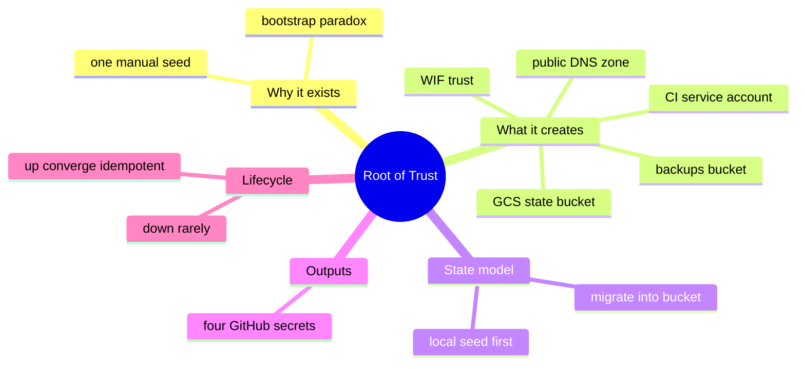
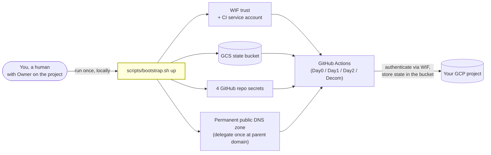
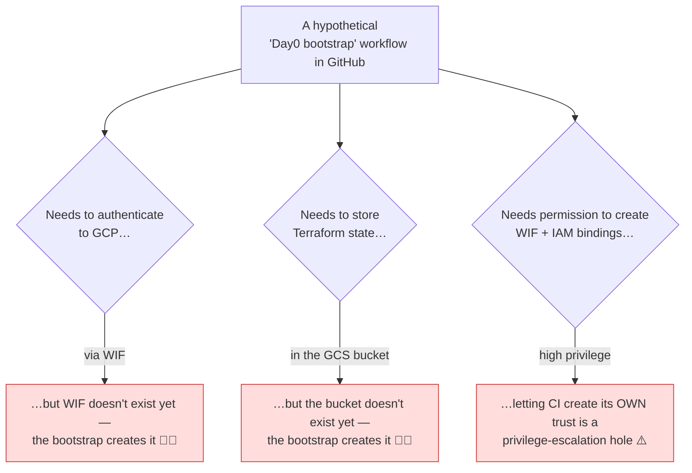
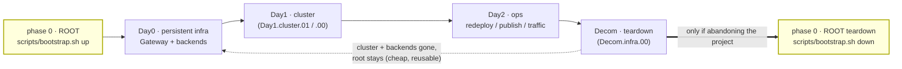
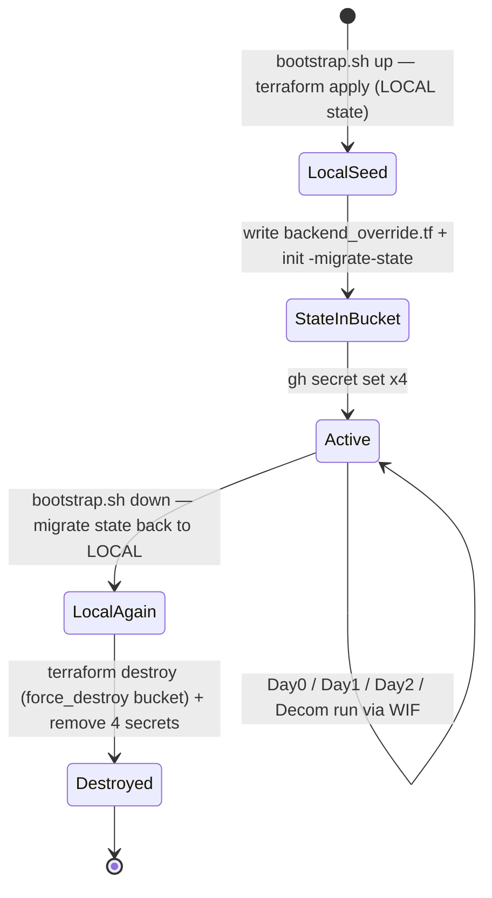
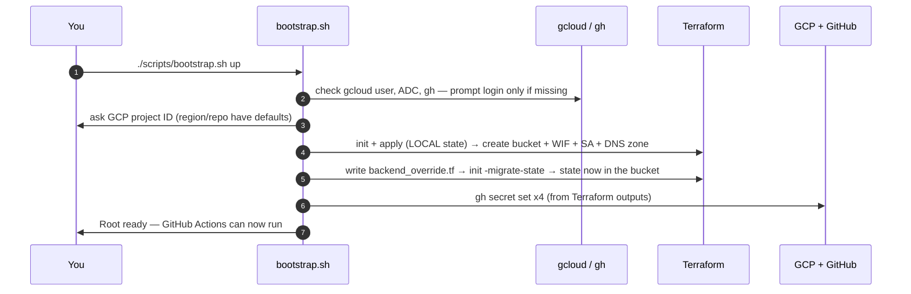
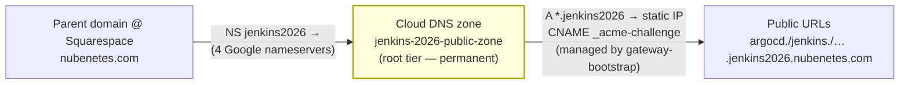
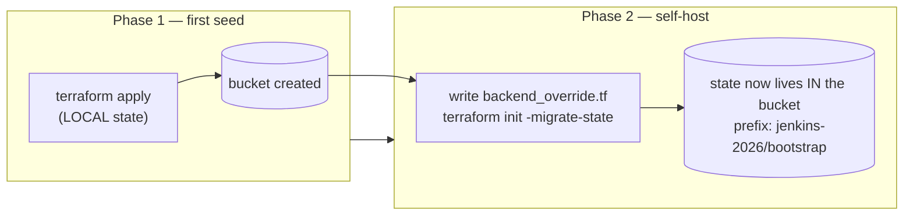
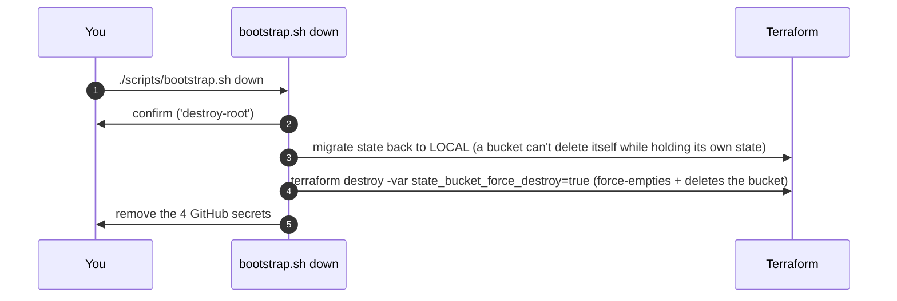

[🏠 Home](../README.md) | [→ Next: 101. GitHub Actions Workflows](./101-GITHUB_ACTIONS_WORKFLOWS.md)

---

# 100. Bootstrap — the Root of Trust (Day0, "phase 0")

> **TL;DR** — Run this **once**, by hand, on your laptop, before anything else:
> ```bash
> ./scripts/bootstrap.sh up
> ```
> It asks who you are, creates the GCP foundation that lets GitHub Actions work,
> and sets the 4 repo secrets. To undo it (rarely): `./scripts/bootstrap.sh down`.

This page explains, from zero, **what the bootstrap is, why it is the only step you
run locally, and how to create and destroy it with one command.** If you have never
touched Terraform or GCP, you can still follow this — every command is copy‑paste.

## Table of contents
- [What "bootstrap" means here](#what-bootstrap-means-here)
- [Why it can't be a GitHub Actions workflow (the bootstrap paradox)](#why-it-cant-be-a-github-actions-workflow-the-bootstrap-paradox)
- [Where it sits in the lifecycle](#where-it-sits-in-the-lifecycle)
- [Prerequisites](#prerequisites)
- [Create the root: `bootstrap.sh up`](#create-the-root-bootstrapsh-up)
- [What it creates](#what-it-creates)
- [Delegate the DNS subdomain (one-time)](#delegate-the-dns-subdomain-one-time)
- [The state model (self-hosted in the bucket)](#the-state-model-self-hosted-in-the-bucket)
- [Destroy the root: `bootstrap.sh down`](#destroy-the-root-bootstrapsh-down)
- [FAQ & troubleshooting](#faq--troubleshooting)

---

## What "bootstrap" means here

Everything in this project is **Infrastructure as Code** run by **GitHub Actions**.
But GitHub Actions needs two things to exist *before* it can do anything in your
GCP project:

1. **A way to log in to GCP** — we use **Workload Identity Federation (WIF)**: a
   keyless trust that lets a GitHub workflow impersonate a GCP **service account**
   (no JSON keys ever stored). 
2. **A place to store Terraform state** — a **GCS bucket** (so two separate workflow
   runs — provision in the morning, destroy at night — share the same state).

The **bootstrap** is the one-time step that **creates those two things** (plus a
backups bucket). It is the *root of trust*: the seed that makes the whole automated
lifecycle possible.

<details>
<summary>🧠 Mental model — the root of trust (mindmap)</summary>



</details>

**Reading it —** the five branches are everything the one manual seed sets up so GitHub Actions can take over: *why* it must be manual (the paradox), *what* it creates (the WIF trust + CI SA + buckets + DNS zone), the two-phase *state model* (local → bucket), the four secret *outputs*, and its *lifecycle* (`up` is idempotent; `down` is rare). Each is detailed below.

<details>
<summary>🟢 For newcomers — what the root of trust is</summary>

The **root of trust** is the one foundation everything else stands on. Before GitHub Actions can build anything in your cloud, two things must already exist:

- **a way to log in** to GCP without storing a password — *Workload Identity Federation* (WIF), a keyless trust, and
- **a shared place to remember what it built** — a *Terraform state bucket* in GCS (so the morning's "provision" run and the evening's "destroy" run see the same state).

Nothing in CI can create these for itself — it would need them to already exist (the paradox below). So **you** create them once, by hand, from your laptop with your own Owner login: `scripts/bootstrap.sh up`. After that you essentially never touch your laptop again — every later step is a one-click GitHub workflow.
</details>

<details>
<summary>🔴 For specialists — what the seed provisions and how its own state is bootstrapped</summary>

`terraform/bootstrap` provisions: a **WIF pool + provider** federating `token.actions.githubusercontent.com` to a **CI service account** (`jenkins-2026-ci@…`) via `google_service_account_iam_member.github_wif` (scoped to *this* repo), the SA's project roles, the **GCS state bucket** (`<project>-jenkins-2026-tfstate`, versioned), a **Postgres-backups bucket**, and the **permanent public DNS zone**.

State is handled in **two phases** — the first `apply` runs on **local** state (the bucket doesn't exist yet), then the script writes `backend_override.tf` and `terraform init -migrate-state` moves state **into** the bucket (prefix `jenkins-2026/bootstrap`), so steady-state is fully remote. Re-runs are idempotent: `reconcile_imports` existence-checks each named singleton and `terraform import`s any that already exist in GCP (self-healing the `409 already exists` you'd otherwise hit on a fresh checkout, since `backend_override.tf` is gitignored). Finally it sets the **4 repo secrets** (`GCP_PROJECT_ID`, `TF_STATE_BUCKET`, `GCP_WORKLOAD_IDENTITY_PROVIDER`, `GCP_SERVICE_ACCOUNT`) the GCP workflows consume.
</details>

<details>
<summary>🌱 The root of trust — what bootstrap creates</summary>



</details>

---

## Why it can't be a GitHub Actions workflow (the bootstrap paradox)

A natural question: *"everything else is a one-click workflow — why isn't the
bootstrap?"* Because it would have to use the very things it is creating:

<details>
<summary>🐔🥚 The bootstrap paradox — why CI can't create its own root</summary>



</details>

So there must always be **one manual seed**, done by a human with their own
credentials. That seed is `scripts/bootstrap.sh`. After it runs once, GitHub Actions
takes over and **everything else is remote and automated.**

| Concern | Bootstrap (this page) | Everything else (gke, grafana, azure, aws, gateway…) |
| :--- | :--- | :--- |
| Who runs it | **You, locally** (once) | **GitHub Actions** |
| Auth | your `gcloud` identity (Owner) | WIF (keyless) — *created by bootstrap* |
| Terraform state | local seed → **migrated into the bucket** | remote in the bucket — *created by bootstrap* |
| Frequency | once (idempotent; re-run to converge) | per session / on demand |

---

## Where it sits in the lifecycle

<details>
<summary>🗺️ Where the root sits in the lifecycle</summary>



</details>

<details>
<summary>♻️ Root lifecycle — seed, steady state, teardown (state diagram)</summary>



</details>

**Reading it —** the root has essentially one steady state, **Active**, reached after the two-phase seed (local apply → migrate state into the bucket → set the 4 secrets) and then held across every cluster build/teardown; re-running `up` just self-converges (`reconcile_imports`). The only way out is the deliberate `down`, which must migrate state **back** to local first (a bucket can't delete itself while holding its own state) before destroying everything and removing the secrets. A normal `Decom.infra.00` never leaves **Active** — which is exactly why the root is created first and destroyed last, if ever.

The root is created **first** and destroyed **last** (if ever). A normal Decom leaves
the root in place — it **costs almost nothing** (two empty-ish buckets) and saves you
re-seeding every time.

---

## Prerequisites

| Tool | Why | Install |
| :--- | :--- | :--- |
| `gcloud` + `gsutil` | talk to GCP, set ADC | [cloud.google.com/sdk](https://cloud.google.com/sdk/docs/install) |
| `terraform` (≥ 1.9) | create the resources | [developer.hashicorp.com/terraform](https://developer.hashicorp.com/terraform/downloads) |
| `gh` (GitHub CLI) | set the repo secrets | [cli.github.com](https://cli.github.com/) |

You also need:
- A **GCP project** with **billing enabled**.
- **Owner** (or `Editor` + `resourcemanager.projectIamAdmin`) on that project — the
  bootstrap creates IAM bindings + a WIF pool, which require admin rights.
- Push/admin access to the GitHub repo (to set its secrets).

The script checks each identity and **only prompts you to log in if you are not
already authenticated** — you don't pre-run any `gcloud auth` commands yourself.

---

## Create the root: `bootstrap.sh up`

```bash
./scripts/bootstrap.sh up
```

That's it. It will, in order:

<details>
<summary>▶️ bootstrap.sh up — step by step (sequence)</summary>



</details>

**Non-interactive** (CI-less automation or scripting): pass the inputs as env vars so
nothing is prompted:

```bash
PROJECT_ID=my-gcp-project \
REGION=us-central1 \
GITHUB_REPO=myorg/jenkins-2026 \
./scripts/bootstrap.sh up
```

It is **idempotent**: run it again any time to converge (e.g. after adding a role) —
on a second run it detects the remote state and just re-applies.

---

## What it creates

| Resource | Terraform | Purpose |
| :--- | :--- | :--- |
| **GCS state bucket** `<project>-jenkins-2026-tfstate` | `google_storage_bucket.tf_state` | remote Terraform state for **every** other module (versioned) |
| **CI service account** `jenkins-2026-ci@…` | `google_service_account.ci` | the identity GitHub Actions impersonates |
| **CI roles** | `google_project_iam_member.ci_roles` | what that SA may do (see [103](./103-GITHUB_SECRETS_INVENTORY.md#gcp_service_account)) |
| **WIF pool + provider** | `google_iam_workload_identity_pool*` | keyless GitHub→GCP trust |
| **WIF binding** | `google_service_account_iam_member.github_wif` | lets *this repo* impersonate the SA |
| **Postgres backups bucket** | `google_storage_bucket.postgres_backups` | survives cluster rebuilds |
| **Public DNS zone** `jenkins-2026-public-zone` | `google_dns_managed_zone.public` | the **permanent** delegated zone for `base_domain`; lives here so its nameservers never change. `Day0.infra.01`/`gateway-bootstrap` fills it with the wildcard-A + cert records. See [501 § Public access](./501-PLATFORM_OPERATIONS.md) |

> **One-time DNS delegation.** The zone is created here, but you must **delegate** it
> from your parent domain (Squarespace) **once** before the public URLs work. The full
> step-by-step is just below: [Delegate the DNS subdomain](#delegate-the-dns-subdomain-one-time).

…and then sets these **4 GitHub repo secrets** (the only ones the GCP workflows need):

| Secret | From Terraform output |
| :--- | :--- |
| `GCP_PROJECT_ID` | `project_id` |
| `TF_STATE_BUCKET` | `state_bucket` |
| `GCP_WORKLOAD_IDENTITY_PROVIDER` | `workload_identity_provider` |
| `GCP_SERVICE_ACCOUNT` | `ci_service_account_email` |

---

## Delegate the DNS subdomain (one-time)

The bootstrap **creates** the Cloud DNS zone `jenkins-2026-public-zone` for
`base_domain` (default `jenkins2026.nubenetes.com`) — but a zone in GCP is inert until
the **parent domain delegates to it**. Until you do this once, the public internet still
asks your registrar (**Squarespace**) for anything under `*.jenkins2026.nubenetes.com`,
so the URLs (`https://argocd.jenkins2026.nubenetes.com`, …) won't resolve to your cluster
and the Google-managed certificate can't validate. You do this **once for the life of the
project** — see [why this is the only time](#why-this-is-the-only-time) below.

<details>
<summary>🌐 DNS delegation — parent domain to the permanent zone</summary>



</details>

### Step 1 — get the zone's four nameservers

```bash
terraform -chdir=terraform/bootstrap output -raw dns_zone_name_servers
```

You'll get four Google nameservers, e.g.:

```
ns-cloud-b1.googledomains.com.
ns-cloud-b2.googledomains.com.
ns-cloud-b3.googledomains.com.
ns-cloud-b4.googledomains.com.
```

### Step 2 — delegate at the parent domain (Squarespace)

In Squarespace, open the domain `nubenetes.com` → **DNS Settings** / **Custom Records**
and make these changes (Host = the subdomain label, here `jenkins2026`):

| Action | Type | Host | Value |
| :--- | :--- | :--- | :--- |
| **Add** ×4 | `NS` | `jenkins2026` | one record per nameserver from Step 1 |
| **Delete** | `A` | `*.jenkins2026` | the old hand-made wildcard A, if present (e.g. a fixed `34.120.231.149`) |
| **Delete** | `CNAME` | `_acme-challenge.jenkins2026` | the old cert-validation CNAME, if present |

> **Why delete the old records?** Once the `NS` records delegate
> `jenkins2026.nubenetes.com`, **everything** under it
> (`*.jenkins2026.nubenetes.com`, `_acme-challenge.jenkins2026.nubenetes.com`, …) is
> answered by **Google's** nameservers — your Squarespace `A`/`CNAME` at those names are
> shadowed and ignored. Removing them avoids confusion; the live records now live
> **inside the Cloud DNS zone**, managed by Terraform
> (`terraform/gateway-bootstrap`), not by you.

### Step 3 — populate the zone (run a workflow)

Run **`Day0.infra.01`** (or `Day1.cluster.00`, which re-applies it). It fills the zone
with the wildcard `A` record (`*.jenkins2026 → <static external IP>`) and the
cert-validation `CNAME`. These are re-applied on **every** `Day0.infra.01` /
`Day1.cluster.00`, so they always track the current IP — no manual edits, ever.

### Why this is the only time

The zone lives in the **never-torn-down root tier** (`terraform/bootstrap`), so its four
nameservers never change. A `Decom`-everything — even an explicit `Decom.infra.01`
gateway teardown — leaves the zone (hence the delegation) intact; only the `A`/`CNAME`
records are dropped and recreated by the next rebuild, pointing at the new IP. **So after
this one-time delegation you never touch Squarespace again.** The single exception is a
full **root** teardown ([`bootstrap.sh down`](#destroy-the-root-bootstrapsh-down)): that
destroys the zone, and bringing the project back creates a **new** zone with **new**
nameservers, so you'd redo Step 2 once more. An ordinary `Decom.infra.00` does **not** do
this.

---

## The state model (self-hosted in the bucket)

Bootstrap is special: it **creates the very bucket** that stores remote state, so the
first apply *cannot* use it yet. The script handles this in two phases, so you end up
with **no fragile local `.tfstate`**:

<details>
<summary>💾 Self-hosted state — the two-phase local→bucket migration</summary>



</details>

After this, the bootstrap's own state is **remote** (in the same bucket as every other
module, just under a different prefix) — so any operator with GCP access can re-run it;
there is no precious local file to lose.

> The **only** irreducible local step is the *first* `apply` that creates the bucket —
> by physics it can't store its state in a bucket that doesn't exist yet.

---

## Destroy the root: `bootstrap.sh down`

> ⚠️ **Rarely needed.** A normal teardown (`Decom.infra.00`) leaves the root in place.
> Only destroy the root if you are **abandoning the project entirely**. It removes the
> WIF trust, the CI service account, **and the state bucket** — after which **no GitHub
> Actions workflow can touch GCP** until you run `up` again.

**Run it only after a full Decom** (clusters + all backends already destroyed):

```bash
./scripts/bootstrap.sh down
# type 'destroy-root' when prompted
```

<details>
<summary>⏹️ bootstrap.sh down — root teardown (sequence)</summary>



</details>

Why `state_bucket_force_destroy=true`? The bucket has `force_destroy = false` by
default (**a safety so a normal apply can never nuke all your state**). The teardown flips
it via a variable so `terraform destroy` can delete the bucket even though it still
holds other modules' (now-decommissioned) state objects + versioned copies.

To bring the project back later, run `./scripts/bootstrap.sh up` again (a fresh seed),
re-do the one-time `NS` delegation at your parent domain (the new zone gets new
nameservers — see the delegation note above), then run Day0 + Day1. (This re-delegation
is only needed after a **root** teardown like this; an ordinary `Decom.infra.00` leaves
the root — and the zone — in place, so no DNS step is needed to rebuild.)

---

## FAQ & troubleshooting

**"I thought all state was remote because of GitHub."** Correct for everything GitHub
Actions runs (state lives in the bucket). The bootstrap is the lone exception *at first
seed* — and the script immediately migrates even its own state into the bucket, so the
steady state is "all remote". See [the state model](#the-state-model-self-hosted-in-the-bucket).

**`terraform destroy` of the root fails: bucket "not empty".** Use `bootstrap.sh down`
(it passes `state_bucket_force_destroy=true`); a plain `terraform destroy` won't delete
a non-empty bucket because the default is `force_destroy = false`.

**403 on `certificatemanager.*delete` during a Gateway Decom.** Unrelated to the root,
but same family: the CI SA needs `roles/certificatemanager.owner` (editor lacks the
`.delete` permissions). It's granted by the bootstrap — re-run `./scripts/bootstrap.sh up`
to converge the role. See [902](./902-TROUBLESHOOTING.md).

**409 "already exists" / lost the local state.** If a prior seed created the
resources (state bucket, CI SA, WIF pool, backups bucket, DNS zone) but its state was
lost or never migrated — e.g. you're on a **new machine** with a clean checkout (the
`backend_override.tf` is gitignored) — a naïve `apply` would collide with `409 already
exists`. `bootstrap.sh up` **self-heals**: before each apply it runs `reconcile_imports`,
which existence-checks each named singleton and `terraform import`s any that exist in GCP
but aren't yet in state, then converges normally and migrates state into the bucket. So
the fix is simply to **re-run `./scripts/bootstrap.sh up`** — no manual `terraform import`
needed. (The additive IAM bindings are idempotent and don't collide.)

**Is it safe to re-run `up`?** Yes — idempotent. It's the way to apply a bootstrap
change (e.g. a new IAM role) to the live project.

---

[🏠 Home](../README.md) | [→ Next: 101. GitHub Actions Workflows](./101-GITHUB_ACTIONS_WORKFLOWS.md)

---

*100. Bootstrap — the Root of Trust — jenkins-2026*
