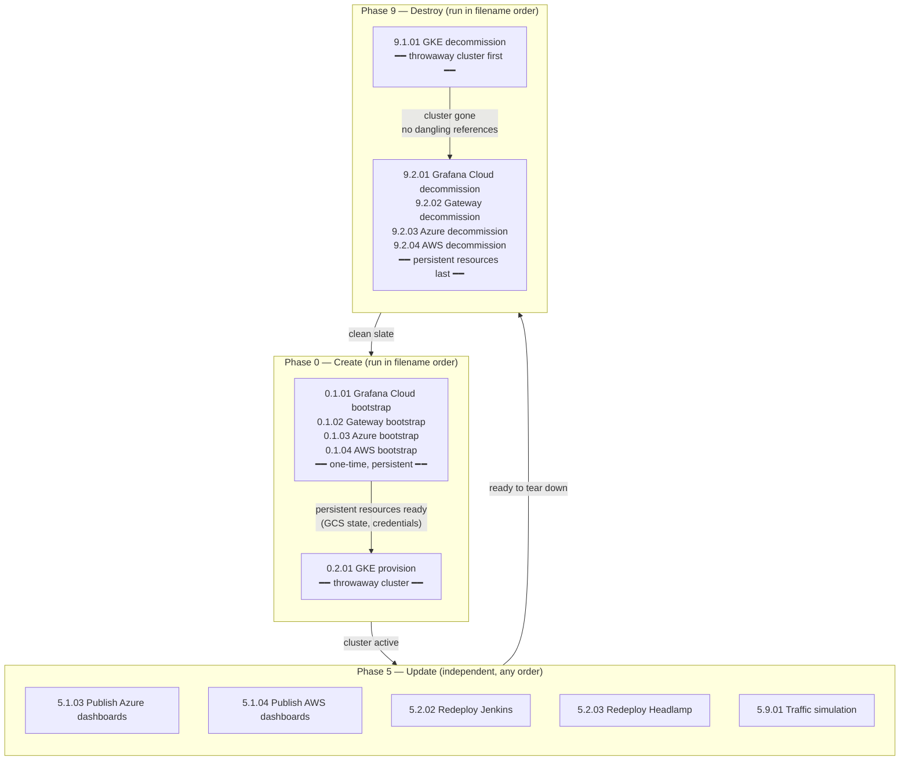

[🏠 Home](../README.md) | [→ Next: 102. GitHub Actions Automation](./102-GITHUB_ACTIONS_AUTOMATION.md)

---

# 101. GitHub Actions Workflows

All workflows live in [`.github/workflows/`](../.github/workflows/), are manually-triggered (`workflow_dispatch`), and follow a `Y.X.ZZ-<name>.yml` naming convention whose sort order in the GitHub Actions UI **is** the correct execution order for every phase of the lifecycle.

## Naming convention: `Y.X.ZZ`

Each component of the filename encodes a different dimension of the workflow's role:

| Component | Position | Values | Meaning |
|---|---|---|---|
| **Y** | 1st digit | `0` `5` `9` | **Lifecycle phase** — `0` = create/bootstrap, `5` = update/redeploy, `9` = destroy/decommission |
| **X** | 2nd digit | `1` `2` `9` | **Execution step within the phase** — lower = runs first; `9` = utilities |
| **ZZ** | 3rd & 4th | `01`–`04` | **Resource identifier** — same ZZ always refers to the same resource, across all phases |

### Phase × Step matrix

The meaning of **X** (execution step) depends on the phase **Y**. X is *positional* — it always means "first step" or "second step" — but what resource occupies that position changes with the phase because the **teardown order is the inverse of the creation order** (dependencies must be destroyed in reverse):

| Phase `Y` | Step `X=1` (first) | Step `X=2` (second) | Step `X=9` |
|---|---|---|---|
| `0` — create | Persistent resources (foundational) | GKE cluster (depends on persistent) | — |
| `5` — update | Persistent resources (dashboard publish) | GKE components (redeploys) | Utilities / simulation |
| `9` — destroy | GKE cluster (most dependent, destroy first) | Persistent resources (foundational, destroy last) | — |

> **Why does X=1 mean "persistent" when creating but "GKE" when destroying?**
> Because GKE depends on the persistent resources (Grafana Cloud, Gateway, Azure/AWS backends), so it must be created *after* them and destroyed *before* them. X always means "the step that runs first" — the resource in that slot changes with the direction of the operation.

### Resource identifier (ZZ): constant across all phases

The ZZ digit is the stable identity of a resource. Given ZZ=03 (Azure), you can immediately find all its workflows across the lifecycle:

| ZZ | Resource | create `0.1.ZZ` | update `5.1.ZZ` | destroy `9.2.ZZ` |
|---|---|---|---|---|
| `01` | Grafana Cloud stack | `0.1.01` | — | `9.2.01` |
| `02` | Gateway (static IP + cert) | `0.1.02` | — | `9.2.02` |
| `03` | Azure Managed Grafana | `0.1.03` | `5.1.03` | `9.2.03` |
| `04` | AWS AMG | `0.1.04` | `5.1.04` | `9.2.04` |
| `01` | GKE cluster | `0.2.01` | — | `9.1.01` |
| `02` | Jenkins | — | `5.2.02` | — |
| `03` | Headlamp | — | `5.2.03` | — |
| `01` | Traffic simulation | — | `5.9.01` | — |

*ZZ is unique within a given (Y, X) pair. Persistent resources share the ZZ namespace under X=1 (create/update) and X=2 (destroy); GKE components share it under X=2 (create) and X=1 (destroy).*

---

## Full workflow matrix

Rows = resources · Columns = lifecycle phases · Cell = filename (link) or — if no workflow exists for that combination.

| Resource | `0.` Create | `5.` Update | `9.` Destroy |
|---|---|---|---|
| **Grafana Cloud stack** | [0.1.01-grafana-cloud-bootstrap](https://github.com/nubenetes/jenkins-2026/actions/workflows/0.1.01-grafana-cloud-bootstrap.yml) | — | [9.2.01-grafana-cloud-decommission](https://github.com/nubenetes/jenkins-2026/actions/workflows/9.2.01-grafana-cloud-decommission.yml) |
| **Gateway** (static IP + cert) | [0.1.02-gateway-bootstrap](https://github.com/nubenetes/jenkins-2026/actions/workflows/0.1.02-gateway-bootstrap.yml) | — | [9.2.02-gateway-decommission](https://github.com/nubenetes/jenkins-2026/actions/workflows/9.2.02-gateway-decommission.yml) |
| **Azure Managed Grafana** | [0.1.03-azure-bootstrap](https://github.com/nubenetes/jenkins-2026/actions/workflows/0.1.03-azure-bootstrap.yml) | [5.1.03-publish-azure-dashboards](https://github.com/nubenetes/jenkins-2026/actions/workflows/5.1.03-publish-azure-dashboards.yml) | [9.2.03-azure-decommission](https://github.com/nubenetes/jenkins-2026/actions/workflows/9.2.03-azure-decommission.yml) |
| **AWS AMG** | [0.1.04-aws-bootstrap](https://github.com/nubenetes/jenkins-2026/actions/workflows/0.1.04-aws-bootstrap.yml) | [5.1.04-publish-aws-dashboards](https://github.com/nubenetes/jenkins-2026/actions/workflows/5.1.04-publish-aws-dashboards.yml) | [9.2.04-aws-decommission](https://github.com/nubenetes/jenkins-2026/actions/workflows/9.2.04-aws-decommission.yml) |
| **GKE cluster** | [0.2.01-gke-provision](https://github.com/nubenetes/jenkins-2026/actions/workflows/0.2.01-gke-provision.yml) | — | [9.1.01-gke-decommission](https://github.com/nubenetes/jenkins-2026/actions/workflows/9.1.01-gke-decommission.yml) |
| **Jenkins** | *(provisioned by 0.2.01)* | [5.2.02-redeploy-jenkins](https://github.com/nubenetes/jenkins-2026/actions/workflows/5.2.02-redeploy-jenkins.yml) | *(destroyed by 9.1.01)* |
| **Headlamp** | *(provisioned by 0.2.01)* | [5.2.03-redeploy-headlamp](https://github.com/nubenetes/jenkins-2026/actions/workflows/5.2.03-redeploy-headlamp.yml) | *(destroyed by 9.1.01)* |
| **Traffic simulation** | — | [5.9.01-traffic-simulation](https://github.com/nubenetes/jenkins-2026/actions/workflows/5.9.01-traffic-simulation.yml) | — |

---

## Lifecycle diagram

Expand: full lifecycle flow (Mermaid)

---

## Complete workflow inventory — matrix table

All 15 workflows in a single numbered table. Each column of the code (`Y`, `X`, `ZZ`) is broken out separately so the meaning of every digit is visible at a glance. Click the code to open the workflow's **Run workflow** page directly in GitHub Actions.

> **Reading the sequence**: rows are ordered by filename (= correct execution order within each phase). Phase `0` rows run before phase `5`, which in turn run before phase `9`. Within phase `0`, rows 1–4 before row 5. Within phase `9`, row 11 before rows 12–15. This ordering is **enforced by the filenames** — opening the GitHub Actions sidebar and reading top-to-bottom gives the correct runbook.

| # | `Y` — Phase | `X` — Step within phase | `ZZ` — Resource | Code → GitHub Actions | Description | Prerequisites | Frequency |
|:---:|---|---|---|---|---|---|---|
| **1** | **0** Create | **1** Persistent — first | **01** Grafana Cloud stack | [**`0.1.01`**](https://github.com/nubenetes/jenkins-2026/actions/workflows/0.1.01-grafana-cloud-bootstrap.yml) `Grafana Cloud bootstrap` | Provisions the persistent Grafana Cloud stack (`terraform/grafana-cloud-stack`): Grafana instance, access-policy tokens, PDC agent. Preserves metrics/traces/logs history across GKE rebuilds. | `terraform/bootstrap` applied (WIF + GCS bucket) | **One-time** |
| **2** | **0** Create | **1** Persistent — first | **02** Gateway IP/cert | [**`0.1.02`**](https://github.com/nubenetes/jenkins-2026/actions/workflows/0.1.02-gateway-bootstrap.yml) `Gateway bootstrap` | Provisions static external IP + wildcard cert map + DNS authorization (`terraform/gateway-bootstrap`). Keeping these persistent avoids losing the IP and re-propagating DNS on every cluster rebuild. | `terraform/bootstrap`; DNS A record at registrar pointing to the static IP | **One-time** |
| **3** | **0** Create | **1** Persistent — first | **03** Azure Mgd Grafana | [**`0.1.03`**](https://github.com/nubenetes/jenkins-2026/actions/workflows/0.1.03-azure-bootstrap.yml) `Azure managed-grafana bootstrap` | Provisions Azure Managed Grafana + Azure Monitor workspace + App Insights + Log Analytics + Entra SP (`terraform/azure-managed-grafana`). Auth: GitHub OIDC → Azure (no stored client secret). | `terraform/bootstrap`; `AZURE_*` GitHub secrets | **One-time** |
| **4** | **0** Create | **1** Persistent — first | **04** AWS AMG / AMP | [**`0.1.04`**](https://github.com/nubenetes/jenkins-2026/actions/workflows/0.1.04-aws-bootstrap.yml) `AWS managed-grafana bootstrap` | Provisions Amazon Managed Grafana + AMP + CloudWatch + GKE→AWS OIDC provider + collector IAM role (`terraform/aws-managed-grafana`). Auth: GitHub OIDC → AWS (no access keys). | `terraform/bootstrap`; `AWS_*` GitHub secrets | **One-time** |
| **5** | **0** Create | **2** GKE — second (depends on persistent) | **01** GKE cluster | [**`0.2.01`**](https://github.com/nubenetes/jenkins-2026/actions/workflows/0.2.01-gke-provision.yml) `GKE provision` | Provisions the throwaway GKE cluster (`terraform/gke`) then runs `scripts/up.sh` in full: namespaces → OTel → observability → Jenkins → ArgoCD → seed pipelines → Headlamp + smoke test. Reads persistent-resource outputs (rows 1–4) from GCS state. Always pair with row 11. | Rows 1–4 as needed for the chosen `observability_mode`; `terraform/bootstrap` | **Per session** |
| **6** | **5** Update | **1** Persistent | **03** Azure Mgd Grafana | [**`5.1.03`**](https://github.com/nubenetes/jenkins-2026/actions/workflows/5.1.03-publish-azure-dashboards.yml) `Publish Azure dashboards` | (Re)publishes `observability/grafana/dashboards-azure/` to Azure Managed Grafana without re-provisioning the cluster. Discovers the instance via `az grafana list`; auth via GitHub OIDC. Use when a dashboard JSON changes. | Row 3 applied; `AZURE_*` secrets | **Anytime** |
| **7** | **5** Update | **1** Persistent | **04** AWS AMG | [**`5.1.04`**](https://github.com/nubenetes/jenkins-2026/actions/workflows/5.1.04-publish-aws-dashboards.yml) `Publish AWS dashboards` | (Re)publishes `observability/grafana/dashboards-aws/` to Amazon Managed Grafana without re-provisioning. Reads AMG params from `terraform/aws-managed-grafana` GCS state; auth via GitHub OIDC. | Row 4 applied; `AWS_DASHBOARD_PUBLISH_ROLE_ARN` secret | **Anytime** |
| **8** | **5** Update | **2** GKE | **02** Jenkins | [**`5.2.02`**](https://github.com/nubenetes/jenkins-2026/actions/workflows/5.2.02-redeploy-jenkins.yml) `Redeploy Jenkins` | Re-applies `scripts/04-jenkins.sh`: Helm upgrade of `helm/jenkins/` + JCasC, and re-seeds the Microservices pipelines against the existing cluster. For Jenkins-only changes without a full provision cycle. | Cluster active (row 5 run) | **Anytime** |
| **9** | **5** Update | **2** GKE | **03** Headlamp | [**`5.2.03`**](https://github.com/nubenetes/jenkins-2026/actions/workflows/5.2.03-redeploy-headlamp.yml) `Redeploy Headlamp` | Re-applies `scripts/01-namespaces.sh` (refreshes OIDC config keys on `headlamp-credentials`) and `scripts/08-headlamp.sh` (Helm upgrade of `helm/headlamp/`). | Cluster active (row 5 run) | **Anytime** |
| **10** | **5** Update | **9** Utilities | **01** Traffic simulation | [**`5.9.01`**](https://github.com/nubenetes/jenkins-2026/actions/workflows/5.9.01-traffic-simulation.yml) `Continuous Traffic Simulation` | Runs a continuous stream of synthetic k6 traffic against the stable endpoints to keep metrics and logs active in Grafana dashboards. Does not modify infrastructure. | Cluster active; public endpoints reachable | **Anytime** |
| **11** | **9** Destroy | **1** GKE — first (most dependent) | **01** GKE cluster | [**`9.1.01`**](https://github.com/nubenetes/jenkins-2026/actions/workflows/9.1.01-gke-decommission.yml) `GKE decommission` | Tears down the stack (`scripts/down.sh`) and destroys the GKE cluster (`terraform destroy` on `terraform/gke`). The ephemeral Grafana Cloud token is also destroyed. Persistent resources are untouched. Must run **before** rows 12–15. | Session complete | **Per session** |
| **12** | **9** Destroy | **2** Persistent — last (foundational) | **01** Grafana Cloud stack | [**`9.2.01`**](https://github.com/nubenetes/jenkins-2026/actions/workflows/9.2.01-grafana-cloud-decommission.yml) `Grafana Cloud decommission` | `terraform destroy` on `terraform/grafana-cloud-stack`. Permanently removes the Grafana Cloud instance, dashboards, access-policy tokens. Irreversible. | **Row 11** complete | **One-time** |
| **13** | **9** Destroy | **2** Persistent — last (foundational) | **02** Gateway IP/cert | [**`9.2.02`**](https://github.com/nubenetes/jenkins-2026/actions/workflows/9.2.02-gateway-decommission.yml) `Gateway decommission` | `terraform destroy` on `terraform/gateway-bootstrap`. Releases the static IP and cert map. **⚠ The IP is gone**: a future bootstrap will get a new IP, requiring DNS A-record updates and propagation delay. | **Row 11** complete | **One-time** |
| **14** | **9** Destroy | **2** Persistent — last (foundational) | **03** Azure Mgd Grafana | [**`9.2.03`**](https://github.com/nubenetes/jenkins-2026/actions/workflows/9.2.03-azure-decommission.yml) `Azure managed-grafana decommission` | `terraform destroy` on `terraform/azure-managed-grafana`. Removes Azure Managed Grafana, Monitor workspace, App Insights, Log Analytics and the Entra SP. | **Row 11** complete | **One-time** |
| **15** | **9** Destroy | **2** Persistent — last (foundational) | **04** AWS AMG / AMP | [**`9.2.04`**](https://github.com/nubenetes/jenkins-2026/actions/workflows/9.2.04-aws-decommission.yml) `AWS managed-grafana decommission` | `terraform destroy` on `terraform/aws-managed-grafana`. Removes Amazon Managed Grafana, AMP, CloudWatch log group, OIDC provider and IAM role. | **Row 11** complete | **One-time** |

---

## Are workflows auto-chained? Why not?

**No workflow triggers another automatically** (there are no `workflow_run:` triggers). Each is dispatched manually by the operator. This is intentional:

| Phase | Reason for manual dispatch |
|---|---|
| **0 — Create** | The `0.1.xx` bootstraps are one-time, human-supervised operations run months apart. `0.2.01` (GKE) runs frequently but independently — chaining it to `0.1.xx` would trigger a full reprovision every time a bootstrap is touched. |
| **5 — Update** | All updates are independent and optional. There is no canonical ordering between publishing a dashboard, redeploying Jenkins, and running a traffic simulation. |
| **9 — Destroy** | `9.1.01` (GKE) **must** complete before any `9.2.xx`. A `workflow_run:` trigger could enforce this, but it would be dangerous: a transient GKE decommission failure would silently block — or, with `on: failure`, trigger — permanent destruction of Grafana Cloud or the Gateway. Manual dispatch means a human reviews the `9.1.01` result before running `9.2.xx`. |

**The filename order IS the runbook.** Open the GitHub Actions workflow list, read it top to bottom within each phase, and run in that order. No separate documentation needed to know what comes next.

See [102. GitHub Actions Automation](./102-GITHUB_ACTIONS_AUTOMATION.md) for the one-time setup (secrets, Workload Identity Federation) these workflows need.

---

[🏠 Home](../README.md) | [→ Next: 102. GitHub Actions Automation](./102-GITHUB_ACTIONS_AUTOMATION.md)

---

*101. GitHub Actions Workflows — jenkins-2026*
