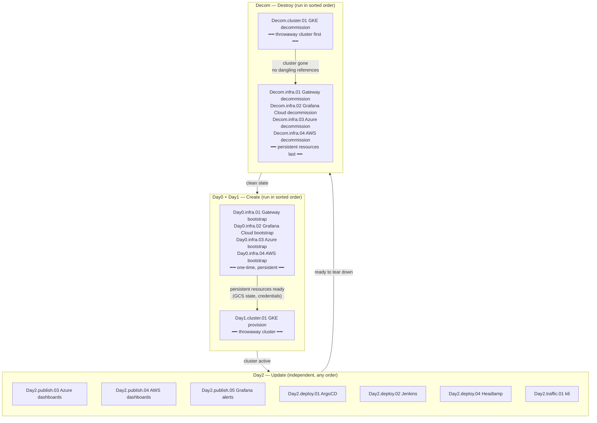
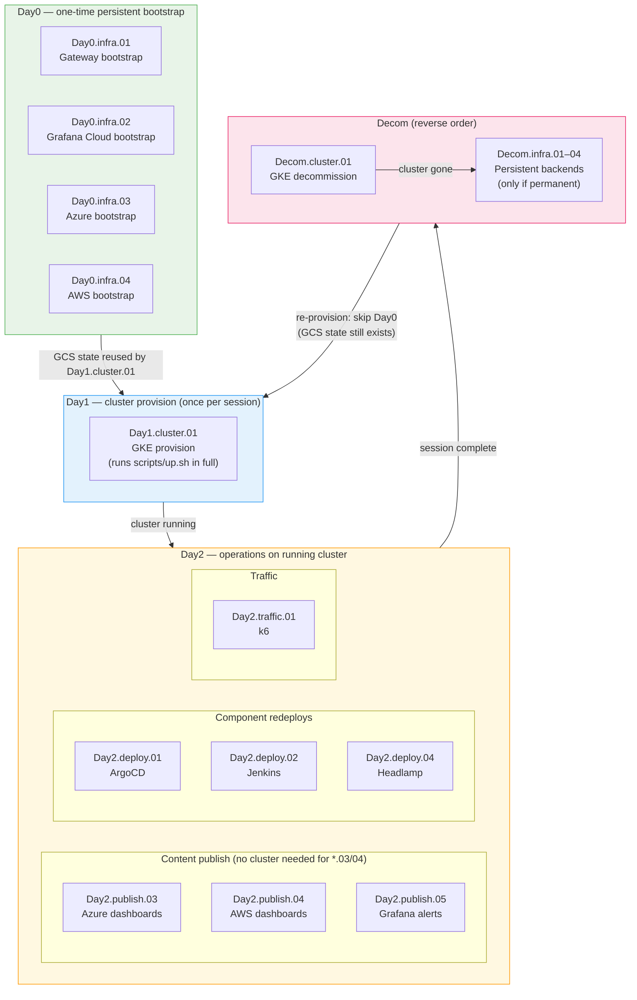

[🏠 Home](../README.md) | [→ Next: 102. GitHub Actions Automation](./102-GITHUB_ACTIONS_AUTOMATION.md)

---

# 101. GitHub Actions Workflows

All workflows live in [`.github/workflows/`](../.github/workflows/), are manually-triggered (`workflow_dispatch`), and follow a `DayN.tier.ZZ-resource.yml` naming convention whose **alphabetical sort order in the GitHub Actions UI is the correct execution order** for every phase of the lifecycle.

## Naming convention: `DayN.tier.ZZ-resource`

Each component of the filename encodes a different dimension of the workflow's role:

| Component | Values | Meaning |
|---|---|---|
| **DayN** | `Day0` `Day1` `Day2` `Decom` | **Lifecycle phase** (SRE Day-0/1/2 terminology) — self-documenting; see [Day-0/1/2 operations](#day-0--day-1--day-2-operations) below. `Decom` sorts after `Day2`, so teardown always lands last. |
| **tier** | `infra` `cluster` `deploy` `publish` `traffic` | **Execution group within the phase** — a brief semantic word (controlled vocabulary) replacing the old middle digit. |
| **ZZ** | `01`–`05` | **Resource identifier** — stable for the same resource across all phases. |
| **resource** | `gateway`, `gke`, `jenkins`, … | **Identifies the resource only** — no action verb (the `DayN` prefix already says bootstrap/publish/teardown). |

### Why this scheme sorts correctly

The GitHub Actions sidebar sorts by each workflow's `name:` field, and every `name:` begins with its `DayN.tier.ZZ` prefix. Reading the list top-to-bottom therefore **is** the runbook:

- `Day0` (persistent bootstrap) → `Day1` (cluster) → `Day2` (running-cluster ops) → `Decom` (teardown).
- Within a phase, `tier` then `ZZ` order the steps. Creation order is foundational-first (`Day0.infra` before `Day1.cluster`); teardown inverts it (`Decom.cluster` before `Decom.infra`) because the cluster depends on the persistent backends and must be destroyed first.

### Resource identifier (ZZ): stable across all phases

`ZZ` is the stable identity of a resource. Given `ZZ=03` (Azure) you can find all its workflows across the lifecycle by the suffix alone:

| ZZ | Resource | Day0 (bootstrap) | Day2 (ops) | Decom (teardown) |
|---|---|---|---|---|
| `01` | Gateway (static IP + cert) | `Day0.infra.01-gateway` | — | `Decom.infra.01-gateway` |
| `02` | Grafana Cloud stack | `Day0.infra.02-grafana-cloud` | — | `Decom.infra.02-grafana-cloud` |
| `03` | Azure Managed Grafana | `Day0.infra.03-azure-grafana` | `Day2.publish.03-azure-grafana` | `Decom.infra.03-azure-grafana` |
| `04` | AWS AMG | `Day0.infra.04-aws-grafana` | `Day2.publish.04-aws-grafana` | `Decom.infra.04-aws-grafana` |
| `01` | GKE cluster | `Day1.cluster.01-gke` | — | `Decom.cluster.01-gke` |
| `01` | ArgoCD (CD engine) | *(by `Day1.cluster.01`)* | `Day2.deploy.01-argocd` | *(by `Decom.cluster.01`)* |
| `02` | Jenkins | *(by `Day1.cluster.01`)* | `Day2.deploy.02-jenkins` | *(by `Decom.cluster.01`)* |
| `04` | Headlamp | *(by `Day1.cluster.01`)* | `Day2.deploy.04-headlamp` | *(by `Decom.cluster.01`)* |
| `01` | OSS Grafana stack | *(by `Day1.cluster.01` via ArgoCD)* | `Day2.publish.01-oss-grafana` | *(by `Decom.cluster.01`)* |
| `05` | Grafana alerts | *(by `Day1.cluster.01`)* | `Day2.publish.05-alerts` | — |
| `01` | k6 traffic | — | `Day2.traffic.01-k6` | — |

*The same `ZZ` is reused across different `tier`s (e.g. `infra.01` is the Gateway, `cluster.01` is GKE, `deploy.01` is ArgoCD); read `tier`+`ZZ` together. Within the `deploy` tier `ZZ` follows install order: ArgoCD (`01`) is the CD engine that deploys the rest, so it sorts first.*

---

## Full workflow matrix

Rows = resources · Columns = lifecycle phases · Cell = filename (link) or — if no workflow exists for that combination.

| Resource | `Day0/Day1` Create | `Day2` Update | `Decom` Destroy |
|---|---|---|---|
| **Gateway** (static IP + cert) | [Day0.infra.01-gateway](https://github.com/nubenetes/jenkins-2026/actions/workflows/Day0.infra.01-gateway.yml) | — | [Decom.infra.01-gateway](https://github.com/nubenetes/jenkins-2026/actions/workflows/Decom.infra.01-gateway.yml) |
| **Grafana Cloud stack** | [Day0.infra.02-grafana-cloud](https://github.com/nubenetes/jenkins-2026/actions/workflows/Day0.infra.02-grafana-cloud.yml) | — | [Decom.infra.02-grafana-cloud](https://github.com/nubenetes/jenkins-2026/actions/workflows/Decom.infra.02-grafana-cloud.yml) |
| **Azure Managed Grafana** | [Day0.infra.03-azure-grafana](https://github.com/nubenetes/jenkins-2026/actions/workflows/Day0.infra.03-azure-grafana.yml) | [Day2.publish.03-azure-grafana](https://github.com/nubenetes/jenkins-2026/actions/workflows/Day2.publish.03-azure-grafana.yml) | [Decom.infra.03-azure-grafana](https://github.com/nubenetes/jenkins-2026/actions/workflows/Decom.infra.03-azure-grafana.yml) |
| **AWS AMG** | [Day0.infra.04-aws-grafana](https://github.com/nubenetes/jenkins-2026/actions/workflows/Day0.infra.04-aws-grafana.yml) | [Day2.publish.04-aws-grafana](https://github.com/nubenetes/jenkins-2026/actions/workflows/Day2.publish.04-aws-grafana.yml) | [Decom.infra.04-aws-grafana](https://github.com/nubenetes/jenkins-2026/actions/workflows/Decom.infra.04-aws-grafana.yml) |
| **GKE cluster** | [Day1.cluster.01-gke](https://github.com/nubenetes/jenkins-2026/actions/workflows/Day1.cluster.01-gke.yml) | — | [Decom.cluster.01-gke](https://github.com/nubenetes/jenkins-2026/actions/workflows/Decom.cluster.01-gke.yml) |
| **ArgoCD** (CD engine) | *(provisioned by Day1.cluster.01)* | [Day2.deploy.01-argocd](https://github.com/nubenetes/jenkins-2026/actions/workflows/Day2.deploy.01-argocd.yml) | *(destroyed by Decom.cluster.01)* |
| **Jenkins** | *(provisioned by Day1.cluster.01)* | [Day2.deploy.02-jenkins](https://github.com/nubenetes/jenkins-2026/actions/workflows/Day2.deploy.02-jenkins.yml) | *(destroyed by Decom.cluster.01)* |
| **Headlamp** | *(provisioned by Day1.cluster.01)* | [Day2.deploy.04-headlamp](https://github.com/nubenetes/jenkins-2026/actions/workflows/Day2.deploy.04-headlamp.yml) | *(destroyed by Decom.cluster.01)* |
| **OSS Grafana stack** (ArgoCD) | *(provisioned by Day1.cluster.01)* | [Day2.publish.01-oss-grafana](https://github.com/nubenetes/jenkins-2026/actions/workflows/Day2.publish.01-oss-grafana.yml) | *(destroyed by Decom.cluster.01)* |
| **Grafana alerts** | *(provisioned by Day1.cluster.01)* | [Day2.publish.05-alerts](https://github.com/nubenetes/jenkins-2026/actions/workflows/Day2.publish.05-alerts.yml) | — |
| **k6 traffic** | — | [Day2.traffic.01-k6](https://github.com/nubenetes/jenkins-2026/actions/workflows/Day2.traffic.01-k6.yml) | — |

---

## Lifecycle diagram

Expand: full lifecycle flow (Mermaid)

---

## Day-0 / Day-1 / Day-2 operations

These terms come from the SRE / platform-engineering world and describe **when in a system's life a task is performed**, not how difficult it is. The `DayN` prefix of every workflow filename maps directly to them:

| Term | What it means | When it runs | tiers used |
|---|---|---|---|
| **Day0** | Foundation bootstrapping — one-time setup of persistent infrastructure that survives across cluster sessions | Before the first deployment; rarely again unless rebuilding from scratch | `infra` |
| **Day1** | Initial provisioning — creating the cluster and deploying the full application stack on top of the Day0 foundation | Once per cluster session (provision → use → decommission cycle) | `cluster` |
| **Day2** | Operations — changes to a **running** system without reprovisioning: config updates, artifact publishing, simulations | Anytime while the cluster is alive | `deploy`, `publish`, `traffic` |
| **Decom** | Teardown — the inverse of Day1 (cluster) and Day0 (persistent backends) | End of session / permanent shutdown | `cluster` then `infra` |

### Day × workflow matrix

| # | Workflow | Phase | Requires cluster? | Idempotent? | Typical frequency |
|:---:|---|:---:|:---:|:---:|---|
| 1 | [Day0.infra.01-gateway](https://github.com/nubenetes/jenkins-2026/actions/workflows/Day0.infra.01-gateway.yml) | **Day0** | no | yes | Once (re-run = no-op) |
| 2 | [Day0.infra.02-grafana-cloud](https://github.com/nubenetes/jenkins-2026/actions/workflows/Day0.infra.02-grafana-cloud.yml) | **Day0** | no | yes | Once (re-run = no-op) |
| 3 | [Day0.infra.03-azure-grafana](https://github.com/nubenetes/jenkins-2026/actions/workflows/Day0.infra.03-azure-grafana.yml) | **Day0** | no | yes | Once (re-run = no-op) |
| 4 | [Day0.infra.04-aws-grafana](https://github.com/nubenetes/jenkins-2026/actions/workflows/Day0.infra.04-aws-grafana.yml) | **Day0** | no | yes | Once (re-run = no-op) |
| 5 | [Day1.cluster.01-gke](https://github.com/nubenetes/jenkins-2026/actions/workflows/Day1.cluster.01-gke.yml) | **Day1** | creates it | yes | Once per session |
| 6 | [Day2.deploy.01-argocd](https://github.com/nubenetes/jenkins-2026/actions/workflows/Day2.deploy.01-argocd.yml) | **Day2** | yes | yes | When ArgoCD config / an Application changes |
| 7 | [Day2.deploy.02-jenkins](https://github.com/nubenetes/jenkins-2026/actions/workflows/Day2.deploy.02-jenkins.yml) | **Day2** | yes | yes | When Jenkins config/JCasC changes |
| 8 | [Day2.deploy.04-headlamp](https://github.com/nubenetes/jenkins-2026/actions/workflows/Day2.deploy.04-headlamp.yml) | **Day2** | yes | yes | When Headlamp config changes |
| 9 | [Day2.publish.01-oss-grafana](https://github.com/nubenetes/jenkins-2026/actions/workflows/Day2.publish.01-oss-grafana.yml) | **Day2** | yes ³ | yes | When OSS dashboards/alerts change |
| 10 | [Day2.publish.03-azure-grafana](https://github.com/nubenetes/jenkins-2026/actions/workflows/Day2.publish.03-azure-grafana.yml) | **Day2** | **no** ¹ | yes | When dashboard JSON changes |
| 11 | [Day2.publish.04-aws-grafana](https://github.com/nubenetes/jenkins-2026/actions/workflows/Day2.publish.04-aws-grafana.yml) | **Day2** | **no** ¹ | yes | When dashboard JSON changes |
| 12 | [Day2.publish.05-alerts](https://github.com/nubenetes/jenkins-2026/actions/workflows/Day2.publish.05-alerts.yml) | **Day2** | yes ² | yes | When alert rules change |
| 13 | [Day2.traffic.01-k6](https://github.com/nubenetes/jenkins-2026/actions/workflows/Day2.traffic.01-k6.yml) | **Day2** | yes | n/a | On demand / regular cadence |
| 14 | [Decom.cluster.01-gke](https://github.com/nubenetes/jenkins-2026/actions/workflows/Decom.cluster.01-gke.yml) | **Decom** | destroys it | yes | Once per session |
| 15 | [Decom.infra.01-gateway](https://github.com/nubenetes/jenkins-2026/actions/workflows/Decom.infra.01-gateway.yml) | **Decom** | no | yes | Once (permanent — ⚠ loses static IP) |
| 16 | [Decom.infra.02-grafana-cloud](https://github.com/nubenetes/jenkins-2026/actions/workflows/Decom.infra.02-grafana-cloud.yml) | **Decom** | no | yes | Once (permanent — ⚠ irreversible) |
| 17 | [Decom.infra.03-azure-grafana](https://github.com/nubenetes/jenkins-2026/actions/workflows/Decom.infra.03-azure-grafana.yml) | **Decom** | no | yes | Once (permanent — ⚠ irreversible) |
| 18 | [Decom.infra.04-aws-grafana](https://github.com/nubenetes/jenkins-2026/actions/workflows/Decom.infra.04-aws-grafana.yml) | **Decom** | no | yes | Once (permanent — ⚠ irreversible) |

> ¹ **Day2.publish.03 and Day2.publish.04** connect directly to the persistent managed-grafana backends (Azure AMG / Amazon AMG) — no running GKE cluster needed. They read Terraform state from GCS and authenticate via GitHub OIDC → Azure/AWS.
>
> ² **Day2.publish.05** reads Grafana credentials from k8s Secrets (grafana-cloud-credentials, azure-monitor-credentials, aws-managed-credentials) so it requires an active cluster. The alert rules themselves are also provisioned automatically by `Day1.cluster.01` via `scripts/up.sh` — `Day2.publish.05` is only needed to push changes without a full reprovision.
>
> ³ **Day2.publish.01** refreshes the in-cluster OSS Grafana on a running cluster. The OSS stack (kube-prometheus-stack/Loki/Tempo) is GitOps-managed by the `observability-oss` ArgoCD app-of-apps (`argocd/observability-oss`), so chart/value changes auto-sync on commit; this workflow rebuilds the dashboards ConfigMap, nudges an ArgoCD re-sync, and republishes alert rules without a full reprovision.

### Typical session lifecycle

A new session (reprovision after full teardown) only needs **Day1** — Day0 outputs are still in GCS state and are reused automatically by `Day1.cluster.01`.

---

## Complete workflow inventory — matrix table

All 18 workflows in a single numbered table. The filename's three components (`DayN`, `tier`, `ZZ`) are broken out separately so the meaning of every part is visible at a glance. Click the code to open the workflow's **Run workflow** page directly in GitHub Actions.

> **Reading the sequence**: rows are ordered by filename (= correct execution order). `Day0`/`Day1` before `Day2` before `Decom`; within `Decom`, the cluster (row 12) before the persistent backends (rows 13–16). This ordering is **enforced by the `name:` prefixes** — opening the GitHub Actions sidebar and reading top-to-bottom gives the correct runbook.

| # | `DayN` — Phase | `tier` — group | `ZZ` resource | Code → GitHub Actions | Description | Prerequisites | Frequency |
|:---:|---|---|---|---|---|---|---|
| **1** | **Day0** Create | **infra** — persistent first | **01** Gateway IP/cert | [**`Day0.infra.01-gateway`**](https://github.com/nubenetes/jenkins-2026/actions/workflows/Day0.infra.01-gateway.yml) | Provisions static external IP + wildcard cert map + DNS authorization (`terraform/gateway-bootstrap`). Keeping these persistent avoids losing the IP and re-propagating DNS on every cluster rebuild. | `terraform/bootstrap`; DNS A record at registrar pointing to the static IP | **One-time** |
| **2** | **Day0** Create | **infra** — persistent first | **02** Grafana Cloud stack | [**`Day0.infra.02-grafana-cloud`**](https://github.com/nubenetes/jenkins-2026/actions/workflows/Day0.infra.02-grafana-cloud.yml) | Provisions the Grafana Cloud stack (`terraform/grafana-cloud-stack`, generated slug): Grafana instance, access-policy tokens, PDC agent. Preserves metrics/traces/logs history across GKE rebuilds. | `terraform/bootstrap` applied (WIF + GCS bucket) | **One-time** |
| **3** | **Day0** Create | **infra** — persistent first | **03** Azure Mgd Grafana | [**`Day0.infra.03-azure-grafana`**](https://github.com/nubenetes/jenkins-2026/actions/workflows/Day0.infra.03-azure-grafana.yml) | Provisions Azure Managed Grafana + Azure Monitor workspace + App Insights + Log Analytics + Entra SP (`terraform/azure-managed-grafana`). Auth: GitHub OIDC → Azure (no stored client secret). | `terraform/bootstrap`; `AZURE_*` GitHub secrets | **One-time** |
| **4** | **Day0** Create | **infra** — persistent first | **04** AWS AMG / AMP | [**`Day0.infra.04-aws-grafana`**](https://github.com/nubenetes/jenkins-2026/actions/workflows/Day0.infra.04-aws-grafana.yml) | Provisions Amazon Managed Grafana + AMP + CloudWatch + GKE→AWS OIDC provider + collector IAM role (`terraform/aws-managed-grafana`). Auth: GitHub OIDC → AWS (no access keys). | `terraform/bootstrap`; `AWS_*` GitHub secrets | **One-time** |
| **5** | **Day1** Create | **cluster** — depends on infra | **01** GKE cluster | [**`Day1.cluster.01-gke`**](https://github.com/nubenetes/jenkins-2026/actions/workflows/Day1.cluster.01-gke.yml) | Provisions the throwaway GKE cluster (`terraform/gke`) then runs `scripts/up.sh` in full: namespaces → OTel → ArgoCD → observability → Jenkins → seed pipelines → Headlamp + smoke test. (ArgoCD precedes observability so oss mode can deploy the in-cluster stack via the `observability-oss` app-of-apps.) Reads persistent-resource outputs (rows 1–4) from GCS state. Always pair with row 14. | Rows 1–4 as needed for the chosen `observability_mode`; `terraform/bootstrap` | **Per session** |
| **6** | **Day2** Update | **deploy** | **01** ArgoCD | [**`Day2.deploy.01-argocd`**](https://github.com/nubenetes/jenkins-2026/actions/workflows/Day2.deploy.01-argocd.yml) | Re-applies `scripts/08.5-argocd.sh`: ArgoCD Helm upgrade + OIDC/RBAC + Jenkins API token, and re-applies the GitOps Applications it owns (platform-postgres, External Secrets, Headlamp, microservices AppSet). ArgoCD is the CD engine the rest deploy through, hence `ZZ=01`. | Cluster active (row 5 run) | **Anytime** |
| **7** | **Day2** Update | **deploy** | **02** Jenkins | [**`Day2.deploy.02-jenkins`**](https://github.com/nubenetes/jenkins-2026/actions/workflows/Day2.deploy.02-jenkins.yml) | Re-applies `scripts/04-jenkins.sh`: Helm upgrade of `helm/jenkins/` + JCasC, and re-seeds the Microservices pipelines against the existing cluster. For Jenkins-only changes without a full provision cycle. | Cluster active (row 5 run) | **Anytime** |
| **8** | **Day2** Update | **deploy** | **04** Headlamp | [**`Day2.deploy.04-headlamp`**](https://github.com/nubenetes/jenkins-2026/actions/workflows/Day2.deploy.04-headlamp.yml) | Re-applies `scripts/01-namespaces.sh` (refreshes OIDC config keys on `headlamp-credentials`) and `scripts/08-headlamp.sh` (Helm upgrade of `helm/headlamp/`). | Cluster active (row 5 run) | **Anytime** |
| **9** | **Day2** Update | **publish** | **01** OSS Grafana | [**`Day2.publish.01-oss-grafana`**](https://github.com/nubenetes/jenkins-2026/actions/workflows/Day2.publish.01-oss-grafana.yml) | Refreshes the in-cluster OSS Grafana without a reprovision: rebuilds the `jenkins-2026-grafana-dashboards` ConfigMap, nudges the `observability-oss` ArgoCD app to re-sync, republishes alert rules. The stack itself is GitOps-managed (`argocd/observability-oss`). | Cluster active (row 5 run), `observability.mode=oss` | **Anytime** |
| **10** | **Day2** Update | **publish** | **03** Azure Mgd Grafana | [**`Day2.publish.03-azure-grafana`**](https://github.com/nubenetes/jenkins-2026/actions/workflows/Day2.publish.03-azure-grafana.yml) | (Re)publishes `observability/grafana/dashboards-azure/` to Azure Managed Grafana without re-provisioning the cluster. Discovers the instance via `az grafana list`; auth via GitHub OIDC. Use when a dashboard JSON changes. | Row 3 applied; `AZURE_*` secrets | **Anytime** |
| **11** | **Day2** Update | **publish** | **04** AWS AMG | [**`Day2.publish.04-aws-grafana`**](https://github.com/nubenetes/jenkins-2026/actions/workflows/Day2.publish.04-aws-grafana.yml) | (Re)publishes `observability/grafana/dashboards-aws/` to Amazon Managed Grafana without re-provisioning. Reads AMG params from `terraform/aws-managed-grafana` GCS state; auth via GitHub OIDC. | Row 4 applied; `AWS_DASHBOARD_PUBLISH_ROLE_ARN` secret | **Anytime** |
| **12** | **Day2** Update | **publish** | **05** Grafana alerts | [**`Day2.publish.05-alerts`**](https://github.com/nubenetes/jenkins-2026/actions/workflows/Day2.publish.05-alerts.yml) | Pushes the alert rules to the active Grafana via its provisioning API without a full reprovision (`scripts/07.5-grafana-alerts.sh`). | Cluster active (row 5 run) | **Anytime** |
| **13** | **Day2** Update | **traffic** | **01** k6 | [**`Day2.traffic.01-k6`**](https://github.com/nubenetes/jenkins-2026/actions/workflows/Day2.traffic.01-k6.yml) | Runs a continuous stream of synthetic k6 traffic against the stable endpoints to keep metrics and logs active in Grafana dashboards. Does not modify infrastructure. | Cluster active; public endpoints reachable | **Anytime** |
| **14** | **Decom** Destroy | **cluster** — most dependent, first | **01** GKE cluster | [**`Decom.cluster.01-gke`**](https://github.com/nubenetes/jenkins-2026/actions/workflows/Decom.cluster.01-gke.yml) | Tears down the stack (`scripts/down.sh`) and destroys the GKE cluster (`terraform destroy` on `terraform/gke`). The ephemeral Grafana Cloud token is also destroyed. Persistent resources are untouched. Must run **before** rows 15–18. | Session complete | **Per session** |
| **15** | **Decom** Destroy | **infra** — foundational, last | **01** Gateway IP/cert | [**`Decom.infra.01-gateway`**](https://github.com/nubenetes/jenkins-2026/actions/workflows/Decom.infra.01-gateway.yml) | `terraform destroy` on `terraform/gateway-bootstrap`. Releases the static IP and cert map. **⚠ The IP is gone**: a future bootstrap will get a new IP, requiring DNS A-record updates and propagation delay. | **Row 14** complete | **One-time** |
| **16** | **Decom** Destroy | **infra** — foundational, last | **02** Grafana Cloud stack | [**`Decom.infra.02-grafana-cloud`**](https://github.com/nubenetes/jenkins-2026/actions/workflows/Decom.infra.02-grafana-cloud.yml) | `terraform destroy` on `terraform/grafana-cloud-stack`. Permanently removes the Grafana Cloud instance, dashboards, access-policy tokens. Irreversible. | **Row 14** complete | **One-time** |
| **17** | **Decom** Destroy | **infra** — foundational, last | **03** Azure Mgd Grafana | [**`Decom.infra.03-azure-grafana`**](https://github.com/nubenetes/jenkins-2026/actions/workflows/Decom.infra.03-azure-grafana.yml) | `terraform destroy` on `terraform/azure-managed-grafana`. Removes Azure Managed Grafana, Monitor workspace, App Insights, Log Analytics and the Entra SP. | **Row 14** complete | **One-time** |
| **18** | **Decom** Destroy | **infra** — foundational, last | **04** AWS AMG / AMP | [**`Decom.infra.04-aws-grafana`**](https://github.com/nubenetes/jenkins-2026/actions/workflows/Decom.infra.04-aws-grafana.yml) | `terraform destroy` on `terraform/aws-managed-grafana`. Removes Amazon Managed Grafana, AMP, CloudWatch log group, OIDC provider and IAM role. | **Row 14** complete | **One-time** |

---

## Are workflows auto-chained? Why not?

**No workflow triggers another automatically** (there are no `workflow_run:` triggers). Each is dispatched manually by the operator. This is intentional:

| Phase | Reason for manual dispatch |
|---|---|
| **Day0/Day1 — Create** | The `Day0.infra` bootstraps are one-time, human-supervised operations run months apart. `Day1.cluster.01` (GKE) runs frequently but independently — chaining it to `Day0.infra` would trigger a full reprovision every time a bootstrap is touched. |
| **Day2 — Update** | All updates are independent and optional. There is no canonical ordering between publishing a dashboard, redeploying Jenkins, and running a traffic simulation. |
| **Decom — Destroy** | `Decom.cluster.01` (GKE) **must** complete before any `Decom.infra`. A `workflow_run:` trigger could enforce this, but it would be dangerous: a transient GKE decommission failure would silently block — or, with `on: failure`, trigger — permanent destruction of Grafana Cloud or the Gateway. Manual dispatch means a human reviews the `Decom.cluster.01` result before running `Decom.infra`. |

**The filename order IS the runbook.** Open the GitHub Actions workflow list, read it top to bottom, and run in that order. No separate documentation needed to know what comes next.

> **One internal exception**: `Day1.cluster.01-gke` calls the matching `Day0.infra.0{2,3,4}` bootstrap via `workflow_call` (`uses: ./.github/workflows/…`) for the chosen `observability_mode`, so the persistent backend is always idempotently applied before the cluster reads its Terraform outputs. That is a *child-job* call within one dispatch, not an auto-chain between top-level workflows.

See [102. GitHub Actions Automation](./102-GITHUB_ACTIONS_AUTOMATION.md) for the one-time setup (secrets, Workload Identity Federation) these workflows need.

---

[🏠 Home](../README.md) | [→ Next: 102. GitHub Actions Automation](./102-GITHUB_ACTIONS_AUTOMATION.md)

---

*101. GitHub Actions Workflows — jenkins-2026*
