[← Previous: 100. Bootstrap](./100-BOOTSTRAP.md) | [🏠 Home](../README.md) | [→ Next: 102. GitHub Actions Automation](./102-GITHUB_ACTIONS_AUTOMATION.md)

---

# 101. GitHub Actions Workflows

All 31 lifecycle workflows live in [`.github/workflows/`](../.github/workflows/), are manually-triggered (`workflow_dispatch`; `Day2.registry.01` additionally runs on a weekly cron, and `Day2.publish.06` also auto-runs on pushes touching `backstage/**`), and follow a `DayN.tier.ZZ-resource.yml` naming convention whose **alphabetical sort order in the GitHub Actions UI is the correct execution order** for every phase of the lifecycle. (Three PR-triggered CI guards sit outside the scheme: [`gitflow-guard.yml`](../.github/workflows/gitflow-guard.yml) — see [§ Branch protection](#branch-protection--gitflow-promotion-both-repos) below — [`terraform-validate.yml`](../.github/workflows/terraform-validate.yml), which runs `terraform fmt`/`validate` on PRs, and [`mermaid-validate.yml`](../.github/workflows/mermaid-validate.yml), which render-verifies every mermaid diagram in the docs via [`scripts/verify-mermaid.sh`](../scripts/verify-mermaid.sh) so a silently-broken diagram fails the PR.)

## Understanding the workflow scheme (newcomers → specialists)

<details>
<summary>🧠 Mental model — the DayN workflow scheme (mindmap)</summary>

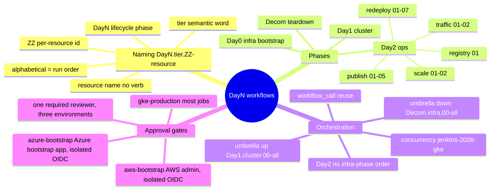

</details>

**Reading it —** the workflow inventory decoded in one picture: the **naming** (`DayN.tier.ZZ` — the prefix sorts the Actions UI into execution order), the four lifecycle **phases**, the **orchestration** (one shared concurrency group so runs queue instead of racing on Terraform state; reusable `workflow_call`; the one-click umbrellas), and the **approval gates**. The tables below are each of these in full.

<details>
<summary>🟢 For newcomers — what the filenames tell you</summary>

Every workflow is named `DayN.tier.ZZ-resource`, and that name is a tiny runbook:

- **`DayN` = lifecycle phase** (SRE Day-0/1/2 terminology): `Day0` = one-time persistent bootstrap (WIF, the Gateway IP/cert, observability backends) · `Day1` = create the throwaway GKE cluster + full stack · `Day2` = operations on a **running** cluster (redeploy a component, publish dashboards, run traffic) · `Decom` = teardown. `Decom` sorts after `Day2`, so teardown always lands last. Because `Decom`+`Day1` is a routine round-trip, every persistent resource must survive it — see **[104. Rebuild-Safety](./104-REBUILD_SAFETY.md)** for the collision/residue bug class and the safe-by-design matrix.
- **`tier` = a short word for the group within the phase** (`infra`, `cluster`, `redeploy`, `publish`, `traffic`, `scale`, `registry`) — a readable label, not a number.
- **`ZZ` = a per-resource id** that stays the same across phases: `03` is always Azure (`Day0.infra.03` → `Day2.publish.03` → `Decom.infra.03`), so you can follow one resource through its whole life by the suffix.

The punchline: **GitHub sorts the Actions sidebar by each workflow's `name:`, every `name:` starts with its `DayN.tier.ZZ` prefix, so reading the list top-to-bottom _is_ the order to run things** — Day0 → Day1 → Day2 → Decom (cluster before backends). No separate runbook needed.
</details>

<details>
<summary>🔴 For specialists — the mechanics behind the scheme</summary>

- **Controlled `tier` vocabulary**: `infra` (persistent Day0/Decom) · `cluster` (the GKE cluster) · `redeploy` (re-apply one component) · `publish` (push dashboards/alerts) · `traffic` (k6) · `scale` (pause/resume the node pools to park the cluster at ~zero cost) — deep-dive + the PDB/autoRepair gotchas in [501 § Pausing & resuming](./501-PLATFORM_OPERATIONS.md#pausing--resuming-the-cluster-cost-saving) · `registry` (prune old container image versions from ghcr). The tier-then-`ZZ` order is a real dependency chain in **Create** (`Day0.infra` before `Day1.cluster`) and **Decom** (`cluster` before `infra`), but in **Day2** the tiers are independent *categories*, not stages — nothing chains them.
- **GKE serialization**: every cluster-touching leaf workflow (`Day1.cluster.01`, `Decom.cluster.01`, and the `Day2.*` that act on the cluster) shares `concurrency: group: jenkins-2026-gke`, so GitHub **queues** them instead of letting two runs race the same Terraform state.
- **Reusable workflows + umbrellas**: `Day1.cluster.01` `workflow_call`s the matching `Day0.infra.0{2,3,4}` backend bootstrap as a preflight; the two opt-in umbrellas (`Day1.cluster.00-all` "Everything up" / `Decom.infra.00-all` "Everything") orchestrate the leaves via `workflow_call` and **never share the leaves' `jenkins-2026-gke` group** (holding a child's own group would deadlock it): the up-umbrella carries no `concurrency:` at all, the Decom umbrella only its own `jenkins-2026-decom-umbrella` group so full teardowns serialize.
- **Consolidated approval gate**: nearly all workflows and resource jobs run under a single GitHub Environment (`gke-production`), gated by a required-reviewer approval — a single approval per workflow run, even for multi-job deployments and teardowns. Two **high-privilege cloud bootstraps** get their own dedicated environments instead — **AWS** (`Day0.infra.04`/`Decom.infra.04`) on `aws-bootstrap`, and **Azure**'s bootstrap app (`Day0.infra.03`/`Decom.infra.03`) on `azure-bootstrap` — each isolating that credential's OIDC trust (folding them into `gke-production` would broaden who can assume an admin credential). All three share the **same required reviewer** (grouped into one Review-deployments prompt in the umbrella). As an additional guard, destructive workflows declare a **typed `confirm` input** (`"destroy"`) validated by a `guard` job. **Exceptions (no gate):** `Day2.traffic.01-k6` and `Day2.traffic.02-rum` drive only read-only HTTP traffic against the already-running public endpoints, and `Day2.registry.01-image-retention` only prunes old ghcr image versions — so their gates were removed to unblock automation/scheduling. Note the `Day2.scale.*` pause/resume workflows **are** `gke-production`-gated. See [102 § Environment Protection](./102-GITHUB_ACTIONS_AUTOMATION.md#environment-protection-and-manual-approvals).
- **Cross-cutting `log_level` input**: every dispatchable workflow that runs the repo's scripts/Terraform exposes a `log_level` dropdown (`info` default | `debug`) — the three that touch neither (`Day2.scale.01`/`02`, pure `gcloud`, and `Day2.registry.01`, pure GitHub API) have none; reusable workflows mirror it as a `workflow_call` input and the umbrellas/preflights pass it down. It exports `JENKINS2026_LOG_LEVEL` (drives `log_debug` in the scripts) and `TF_LOG=DEBUG` for the Terraform steps (only at `debug`). There is **no `trace`/`set -x` level** by design — bash xtrace would leak script-derived secret values GitHub doesn't mask; use the native `ACTIONS_STEP_DEBUG` for runner-level tracing. Durable default lives in `config.yaml` (`logging.level`).
  - **Don't confuse it with the observability volume knobs** on the same workflows (`Day1.cluster.01-gke` + the `Day1.cluster.00-all` umbrella, the lighter `Day2.redeploy.01-argocd` — both knobs — and `Day2.publish.01-oss-grafana`, which exposes `log_min_severity` only): **`grafana_cloud_tier`** (`free` default | `paid`) is a profile that sets the free-tier-fitting defaults, and **`log_min_severity`** (`auto` default → derives from tier; or force a level) is the `otel-collector-logs` `filter` that trims **Grafana's logs panels** (app + platform). Both are unrelated to the CI run's chattiness. The tier governs **metrics** (`leanMetrics`) **and logs** (`logMinSeverity`) today (not traces yet). Durable defaults in `config.yaml` `observability.{grafanaCloudTier,leanMetrics,logMinSeverity}`; see [301 § Log Levels](./301-OBSERVABILITY.md#log-levels).
- **No auto-chaining**: no workflow ever triggers another (`workflow_run:` is never used) and every lifecycle workflow is human-dispatched — the sole non-manual trigger is `Day2.registry.01`'s weekly cron, which touches only ghcr, never the cluster or Terraform state — so a human reviews each phase, critical for `Decom`, where an automatic trigger on a failed cluster teardown could cascade into destroying persistent backends.
</details>

## Branch protection & GitFlow promotion (both repos)

This PoC spans **two** repos with **deliberately opposite** `main` branch-protection policies. Both are documented here (and mirrored in the GitOps repo's `README`) because getting either wrong silently breaks things — a too-strict GitOps `main` wedges every deploy, while a too-loose infra `main` lets unreviewed changes bypass GitFlow.

### `jenkins-2026` (this repo) — strict GitFlow, human-reviewed

`main` is reachable **only via a pull request from `develop`**. Actual `main` protection (GitHub → Settings → Branches):

| Setting | Value | Why |
| :--- | :--- | :--- |
| Require a pull request before merging | **on** (0 required approvals) | No direct pushes to `main`; a PR is mandatory. 0 approvals because this is a single-maintainer PoC — the gate is the *check*, not a reviewer count. |
| Required status check | **`gitflow-guard`** | [`gitflow-guard`](../.github/workflows/gitflow-guard.yml) fails any PR into `main` whose head branch is not exactly `develop`. This is what forbids `feature/*` / `hotfix/*` / fork → `main`. |
| Include administrators (`enforce_admins`) | **on** | Even repo admins cannot bypass the PR + check (no "merge without waiting"). |
| Allow force pushes | **off** | `main` history is append-only. |
| Allow deletions | **off** | `main` cannot be deleted. |

- **Allowed → `main`:** a PR from `develop`, after `gitflow-guard` passes.
- **Forbidden → `main`:** direct push (any actor, incl. admin); a PR from `feature/*`, `hotfix/*`, a fork, or any branch ≠ `develop`; force-push; branch deletion.

**The GitFlow loop in practice:**
1. Branch off `develop` (e.g. `feat/...`), commit, open a PR **into `develop`** (never directly into `main`).
2. Merge to `develop` and validate there (a `Day1` dispatched from `develop` auto-tracks develop's shared library/seed via `GITHUB_REF_NAME`).
3. Open a **`develop` → `main`** promotion PR; `gitflow-guard` passes (head is `develop`); merge.

### `jenkins-2026-gitops-config` (GitOps config) — CI-writable, machine-managed

`main` is **direct-push** (no PR required). Actual `main` protection:

| Setting | Value | Why |
| :--- | :--- | :--- |
| Require a pull request before merging | **off** | The Jenkins **GitOps Update** stage pushes image-tag bumps straight to `main` (`git push origin main`). Require-PR would reject the PAT push (an admin PAT does **not** bypass protection) and **wedge every deploy**. |
| Required status checks | **none** | Image-tag bumps are machine-generated — nothing to gate them on. |
| Include administrators | **off** | — |
| Allow force pushes | **off** | Still protected against history rewrites / accidental clobber. |
| Allow deletions | **off** | `main` cannot be deleted. |

- **Allowed → `main`:** direct push (the CI's PAT, or a human pushing a chart/values edit).
- **Forbidden → `main`:** force-push, branch deletion.

> ⚠️ **Do NOT enable "Require a pull request" on the GitOps repo's `main`.** It is the single most common way to break this PoC: the next pipeline's *GitOps Update* push is rejected, no image tag lands, and ArgoCD silently keeps deploying the old tag. To human-review chart/values changes, do it via the PR-on-`jenkins-2026` flow that authored them — not by gating the GitOps `main`.

### Why opposite policies (best practice, not an oversight)

The **infra repo is human-authored** (scripts, Terraform, Helm values, docs) → it deserves strict GitFlow + review-gating. The **GitOps repo is machine-managed** (image tags written by CI on every successful build) → its `main` must accept unattended CI writes. "Harmonising" them either way breaks one side. See [`CLAUDE.md` § Conventions](../CLAUDE.md), [`502`](./502-MICROSERVICES_GITOPS.md), and the GitOps repo's `README`.

## Naming convention: `DayN.tier.ZZ-resource`

Each component of the filename encodes a different dimension of the workflow's role:

| Component | Values | Meaning |
|---|---|---|
| **DayN** | `Day0` `Day1` `Day2` `Decom` | **Lifecycle phase** (SRE Day-0/1/2 terminology) — self-documenting; see [Day-0/1/2 operations](#day-0--day-1--day-2-operations) below. `Decom` sorts after `Day2`, so teardown always lands last. |
| **tier** | `infra` `cluster` `redeploy` `publish` `traffic` `scale` `registry` | **Execution group within the phase** — a brief semantic word (controlled vocabulary) replacing the old middle digit. |
| **ZZ** | `00`–`05` | **Resource identifier** — stable for the same resource across all phases (`00` = umbrella). |
| **resource** | `gateway`, `gke`, `jenkins`, … | **Identifies the resource only** — no action verb (the `DayN` prefix already says bootstrap/publish/teardown). |

### Why this scheme sorts correctly

The GitHub Actions sidebar sorts by each workflow's `name:` field, and every `name:` begins with its `DayN.tier.ZZ` prefix. Reading the list top-to-bottom therefore **is** the runbook:

- `Day0` (persistent bootstrap) → `Day1` (cluster) → `Day2` (running-cluster ops) → `Decom` (teardown).
- Within a phase, `tier` then `ZZ` order the steps. Creation order is foundational-first (`Day0.infra` before `Day1.cluster`); teardown inverts it (`Decom.cluster` before `Decom.infra`) because the cluster depends on the persistent backends and must be destroyed first.

> **Scope of the "tier orders the steps" rule.** This sequencing holds for the **Create** (`Day0`→`Day1`) and **Decom** (`cluster`→`infra`) phases, where the tier order *is* a real dependency chain. It does **not** apply within **Day2**: there the tiers (`redeploy`, `publish`, `traffic`) are independent **categories**, not ordered stages — see [Day2 ordering: tiers are categories, not stages](#day2-ordering-tiers-are-categories-not-stages).

### Resource identifier (ZZ): stable across all phases

`ZZ` is the **stable identity of a resource**. Given `ZZ=03` (Azure) you can find all its workflows across the lifecycle by the suffix alone:

| ZZ | Resource | Day0 (bootstrap) | Day2 (ops) | Decom (teardown) |
|---|---|---|---|---|
| `01` | Gateway (static IP + cert) | [`Day0.infra.01-gateway`](https://github.com/nubenetes/jenkins-2026/actions/workflows/Day0.infra.01-gateway.yml) | — | [`Decom.infra.01-gateway`](https://github.com/nubenetes/jenkins-2026/actions/workflows/Decom.infra.01-gateway.yml) |
| `02` | Grafana Cloud stack | [`Day0.infra.02-grafana-cloud`](https://github.com/nubenetes/jenkins-2026/actions/workflows/Day0.infra.02-grafana-cloud.yml) | [`Day2.publish.02-grafana-cloud`](https://github.com/nubenetes/jenkins-2026/actions/workflows/Day2.publish.02-grafana-cloud.yml) | [`Decom.infra.02-grafana-cloud`](https://github.com/nubenetes/jenkins-2026/actions/workflows/Decom.infra.02-grafana-cloud.yml) |
| `03` | Azure Managed Grafana | [`Day0.infra.03-azure-grafana`](https://github.com/nubenetes/jenkins-2026/actions/workflows/Day0.infra.03-azure-grafana.yml) | [`Day2.publish.03-azure-grafana`](https://github.com/nubenetes/jenkins-2026/actions/workflows/Day2.publish.03-azure-grafana.yml) | [`Decom.infra.03-azure-grafana`](https://github.com/nubenetes/jenkins-2026/actions/workflows/Decom.infra.03-azure-grafana.yml) |
| `04` | AWS AMG | [`Day0.infra.04-aws-grafana`](https://github.com/nubenetes/jenkins-2026/actions/workflows/Day0.infra.04-aws-grafana.yml) | [`Day2.publish.04-aws-grafana`](https://github.com/nubenetes/jenkins-2026/actions/workflows/Day2.publish.04-aws-grafana.yml) | [`Decom.infra.04-aws-grafana`](https://github.com/nubenetes/jenkins-2026/actions/workflows/Decom.infra.04-aws-grafana.yml) |
| `01` | GKE cluster | [`Day1.cluster.01-gke`](https://github.com/nubenetes/jenkins-2026/actions/workflows/Day1.cluster.01-gke.yml) | — | [`Decom.cluster.01-gke`](https://github.com/nubenetes/jenkins-2026/actions/workflows/Decom.cluster.01-gke.yml) |
| `01` | ArgoCD (CD engine) | *(by [`Day1.cluster.01`](https://github.com/nubenetes/jenkins-2026/actions/workflows/Day1.cluster.01-gke.yml))* | [`Day2.redeploy.01-argocd`](https://github.com/nubenetes/jenkins-2026/actions/workflows/Day2.redeploy.01-argocd.yml) | *(by [`Decom.cluster.01`](https://github.com/nubenetes/jenkins-2026/actions/workflows/Decom.cluster.01-gke.yml))* |
| `02` | Jenkins | *(by [`Day1.cluster.01`](https://github.com/nubenetes/jenkins-2026/actions/workflows/Day1.cluster.01-gke.yml))* | [`Day2.redeploy.02-jenkins`](https://github.com/nubenetes/jenkins-2026/actions/workflows/Day2.redeploy.02-jenkins.yml) | *(by [`Decom.cluster.01`](https://github.com/nubenetes/jenkins-2026/actions/workflows/Decom.cluster.01-gke.yml))* |
| `03` | Tekton (CI engine, 1 of 4) | *(by [`Day1.cluster.01`](https://github.com/nubenetes/jenkins-2026/actions/workflows/Day1.cluster.01-gke.yml) with ci_engine=tekton)* | [`Day2.redeploy.03-tekton`](https://github.com/nubenetes/jenkins-2026/actions/workflows/Day2.redeploy.03-tekton.yml) | *(by [`Decom.cluster.01`](https://github.com/nubenetes/jenkins-2026/actions/workflows/Decom.cluster.01-gke.yml))* |
| `04` | Headlamp | *(by [`Day1.cluster.01`](https://github.com/nubenetes/jenkins-2026/actions/workflows/Day1.cluster.01-gke.yml))* | [`Day2.redeploy.04-headlamp`](https://github.com/nubenetes/jenkins-2026/actions/workflows/Day2.redeploy.04-headlamp.yml) | *(by [`Decom.cluster.01`](https://github.com/nubenetes/jenkins-2026/actions/workflows/Decom.cluster.01-gke.yml))* |
| `06` | GitHub Actions / ARC (CI engine, 1 of 4) | *(by [`Day1.cluster.01`](https://github.com/nubenetes/jenkins-2026/actions/workflows/Day1.cluster.01-gke.yml) with ci_engine=githubactions)* | [`Day2.redeploy.06-githubactions`](https://github.com/nubenetes/jenkins-2026/actions/workflows/Day2.redeploy.06-githubactions.yml) | *(by [`Decom.cluster.01`](https://github.com/nubenetes/jenkins-2026/actions/workflows/Decom.cluster.01-gke.yml))* |
| `07` | Argo Workflows (CI engine, 1 of 4) | *(by [`Day1.cluster.01`](https://github.com/nubenetes/jenkins-2026/actions/workflows/Day1.cluster.01-gke.yml) with ci_engine=argoworkflows)* | [`Day2.redeploy.07-argoworkflows`](https://github.com/nubenetes/jenkins-2026/actions/workflows/Day2.redeploy.07-argoworkflows.yml) | *(by [`Decom.cluster.01`](https://github.com/nubenetes/jenkins-2026/actions/workflows/Decom.cluster.01-gke.yml))* |
| `08` | Backstage (developer portal) | *(by [`Day1.cluster.01`](https://github.com/nubenetes/jenkins-2026/actions/workflows/Day1.cluster.01-gke.yml) when backstage_enabled — app image bootstrapped once by [`Day2.publish.06-backstage`](https://github.com/nubenetes/jenkins-2026/actions/workflows/Day2.publish.06-backstage.yml))* | [`Day2.redeploy.08-backstage`](https://github.com/nubenetes/jenkins-2026/actions/workflows/Day2.redeploy.08-backstage.yml) | *(by [`Decom.cluster.01`](https://github.com/nubenetes/jenkins-2026/actions/workflows/Decom.cluster.01-gke.yml))* |
| `01` | OSS Grafana stack | *(by [`Day1.cluster.01`](https://github.com/nubenetes/jenkins-2026/actions/workflows/Day1.cluster.01-gke.yml) via ArgoCD)* | [`Day2.publish.01-oss-grafana`](https://github.com/nubenetes/jenkins-2026/actions/workflows/Day2.publish.01-oss-grafana.yml) | *(by [`Decom.cluster.01`](https://github.com/nubenetes/jenkins-2026/actions/workflows/Decom.cluster.01-gke.yml))* |
| `05` | Grafana alerts | *(by [`Day1.cluster.01`](https://github.com/nubenetes/jenkins-2026/actions/workflows/Day1.cluster.01-gke.yml))* | [`Day2.publish.05-alerts`](https://github.com/nubenetes/jenkins-2026/actions/workflows/Day2.publish.05-alerts.yml) | — |
| `06` | Backstage app image (ghcr) | — *(the image is the portal's **one-time bootstrap**; it persists across cluster rebuilds — [505](./505-BACKSTAGE.md))* | [`Day2.publish.06-backstage`](https://github.com/nubenetes/jenkins-2026/actions/workflows/Day2.publish.06-backstage.yml) | — |
| `01` | k6 traffic | — | [`Day2.traffic.01-k6`](https://github.com/nubenetes/jenkins-2026/actions/workflows/Day2.traffic.01-k6.yml) | — |
| `02` | Synthetic RUM (Faro beacons) | — | [`Day2.traffic.02-rum`](https://github.com/nubenetes/jenkins-2026/actions/workflows/Day2.traffic.02-rum.yml) | — |
| `01` | Cluster pause (nodes → 0) | — | [`Day2.scale.01-pause`](https://github.com/nubenetes/jenkins-2026/actions/workflows/Day2.scale.01-pause.yml) | — |
| `02` | Cluster resume (nodes back up) | — | [`Day2.scale.02-resume`](https://github.com/nubenetes/jenkins-2026/actions/workflows/Day2.scale.02-resume.yml) | — |
| `01` | Container registry retention (ghcr prune) | — | [`Day2.registry.01-image-retention`](https://github.com/nubenetes/jenkins-2026/actions/workflows/Day2.registry.01-image-retention.yml) | — |

*The same `ZZ` is reused across different `tier`s (e.g. `infra.01` is the Gateway, `cluster.01` is GKE, `redeploy.01` is ArgoCD); read `tier`+`ZZ` together. Within the `redeploy` tier `ZZ` follows install order — ArgoCD (`01`, the CD engine that deploys the rest), Jenkins (`02`), Tekton (`03`), Headlamp (`04`), Gateway/ingress (`05`) — so ArgoCD sorts first. Jenkins (`02`), Tekton (`03`), GitHub Actions / ARC (`06`) and Argo Workflows (`07`) are the four mutually-exclusive CI engines selected by the `ci.engine` flag (Jenkins default); only the active one is provisioned. **`githubactions` took the next free redeploy id `06` and `argoworkflows` the next one after it, `07`** (a pure append: `04`/`05` are already Headlamp/Gateway, and renumbering an existing resource would violate the stable-per-resource-`ZZ` principle) — because the CI engines are mutually exclusive, the non-contiguous `02`/`03`/`06`/`07` ids are fine.*

> **CI engine choice.** `Day1.cluster.01-gke` has a `ci_engine` input (`jenkins` default | `tekton` | `githubactions` | `argoworkflows`) that flows to [`scripts/up.sh`](../scripts/up.sh) as `JENKINS2026_CI_ENGINE`, selecting which CI engine the provision installs. The `redeploy` tier therefore holds `01` ArgoCD, `02` Jenkins, `03` Tekton, `04` Headlamp, `05` Gateway, `06` GitHub Actions / ARC, `07` Argo Workflows — `02`, `03`, `06` and `07` are the four mutually-exclusive engines. See [404. Tekton](./404-TEKTON.md), [405. GitHub Actions / ARC](./405-GITHUB_ACTIONS.md) and [406. Argo Workflows](./406-ARGO_WORKFLOWS.md) for the deep-dives.

> **Full-teardown umbrella.** `Decom.infra.00-all` ("Everything") is an opt-in convenience workflow that tears down the GKE cluster **and** every persistent observability backend in one dispatch — so switching `observability.mode` around never leaves a forgotten, billed backend (e.g. an orphaned Grafana Cloud stack from before you moved to managed-azure). It reuses each per-resource Decom workflow via `workflow_call` (no teardown logic is duplicated); type `destroy` to confirm. The cluster runs first (its decom also destroys the ephemeral `grafana-cloud-token` that references the Grafana Cloud stack), then the backends in parallel. The three backend checkboxes default **on** and `purge_secrets` (sweep the eso-mode GCP Secret Manager secrets) defaults **on**; the Gateway static IP defaults **off** (keeping it avoids losing the IP and re-propagating DNS). Untick any to spare it.

Both umbrellas are thin orchestrators — they own no teardown/provision logic, they only `workflow_call` the per-resource workflows. The graph below shows the *job-level* fan-out the two prose notes above describe: the **up** umbrella is a **two-level nest** (its `provision` job *is* `Day1.cluster.01-gke`, which itself fans out to the per-backend `Day0.infra.0N` preflight — a workflow reusing a workflow reusing a workflow), and the **down** umbrella is `guard → cluster-first → parallel backends` with concrete default-checkbox states. It also pins down *why* the umbrellas carry **no** concurrency group while the leaf cluster workflows do — a group on the umbrella would deadlock against its own child in the same `jenkins-2026-gke` group.

<details>
<summary>📊 Umbrella fan-out — how Day1.cluster.00-all / Decom.infra.00-all reuse the per-resource workflows (workflow_call) + where gke serialization attaches</summary>

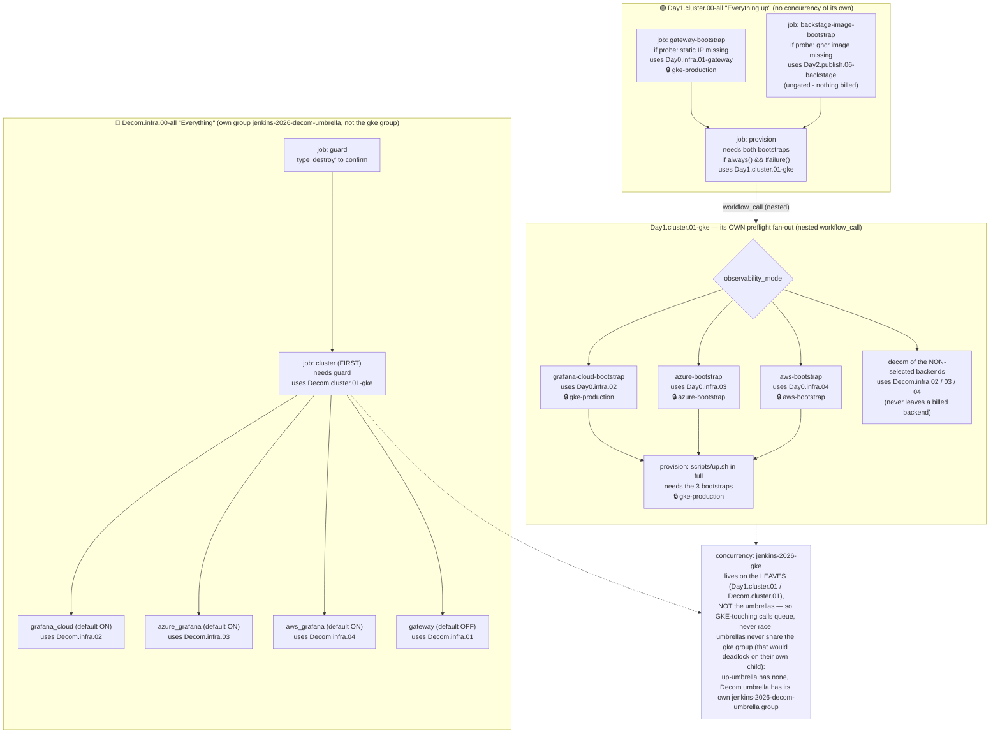

</details>

---

## Full workflow matrix

Rows = resources · Columns = lifecycle phases · Cell = filename (link) or — if no workflow exists for that combination.

| Resource | `Day0/Day1` Create | `Day2` Update | `Decom` Destroy |
|---|---|---|---|
| **Gateway** (static IP + cert) | [Day0.infra.01-gateway](https://github.com/nubenetes/jenkins-2026/actions/workflows/Day0.infra.01-gateway.yml) | [Day2.redeploy.05-gateway](https://github.com/nubenetes/jenkins-2026/actions/workflows/Day2.redeploy.05-gateway.yml) *(in-cluster Gateway + routes/IAP)* | [Decom.infra.01-gateway](https://github.com/nubenetes/jenkins-2026/actions/workflows/Decom.infra.01-gateway.yml) |
| **Grafana Cloud stack** | [Day0.infra.02-grafana-cloud](https://github.com/nubenetes/jenkins-2026/actions/workflows/Day0.infra.02-grafana-cloud.yml) | [Day2.publish.02-grafana-cloud](https://github.com/nubenetes/jenkins-2026/actions/workflows/Day2.publish.02-grafana-cloud.yml) | [Decom.infra.02-grafana-cloud](https://github.com/nubenetes/jenkins-2026/actions/workflows/Decom.infra.02-grafana-cloud.yml) |
| **Azure Managed Grafana** | [Day0.infra.03-azure-grafana](https://github.com/nubenetes/jenkins-2026/actions/workflows/Day0.infra.03-azure-grafana.yml) | [Day2.publish.03-azure-grafana](https://github.com/nubenetes/jenkins-2026/actions/workflows/Day2.publish.03-azure-grafana.yml) | [Decom.infra.03-azure-grafana](https://github.com/nubenetes/jenkins-2026/actions/workflows/Decom.infra.03-azure-grafana.yml) |
| **AWS AMG** | [Day0.infra.04-aws-grafana](https://github.com/nubenetes/jenkins-2026/actions/workflows/Day0.infra.04-aws-grafana.yml) | [Day2.publish.04-aws-grafana](https://github.com/nubenetes/jenkins-2026/actions/workflows/Day2.publish.04-aws-grafana.yml) | [Decom.infra.04-aws-grafana](https://github.com/nubenetes/jenkins-2026/actions/workflows/Decom.infra.04-aws-grafana.yml) |
| **GKE cluster** | [Day1.cluster.01-gke](https://github.com/nubenetes/jenkins-2026/actions/workflows/Day1.cluster.01-gke.yml) | — | [Decom.cluster.01-gke](https://github.com/nubenetes/jenkins-2026/actions/workflows/Decom.cluster.01-gke.yml) |
| **ArgoCD** (CD engine) | *(provisioned by Day1.cluster.01)* | [Day2.redeploy.01-argocd](https://github.com/nubenetes/jenkins-2026/actions/workflows/Day2.redeploy.01-argocd.yml) | *(destroyed by Decom.cluster.01)* |
| **Jenkins** | *(provisioned by Day1.cluster.01)* | [Day2.redeploy.02-jenkins](https://github.com/nubenetes/jenkins-2026/actions/workflows/Day2.redeploy.02-jenkins.yml) | *(destroyed by Decom.cluster.01)* |
| **Tekton** (CI engine, 1 of 4) | *(provisioned by Day1.cluster.01 when ci_engine=tekton)* | [Day2.redeploy.03-tekton](https://github.com/nubenetes/jenkins-2026/actions/workflows/Day2.redeploy.03-tekton.yml) | *(destroyed by Decom.cluster.01)* |
| **Headlamp** | *(provisioned by Day1.cluster.01)* | [Day2.redeploy.04-headlamp](https://github.com/nubenetes/jenkins-2026/actions/workflows/Day2.redeploy.04-headlamp.yml) | *(destroyed by Decom.cluster.01)* |
| **GitHub Actions / ARC** (CI engine, 1 of 4) | *(provisioned by Day1.cluster.01 when ci_engine=githubactions)* | [Day2.redeploy.06-githubactions](https://github.com/nubenetes/jenkins-2026/actions/workflows/Day2.redeploy.06-githubactions.yml) | *(destroyed by Decom.cluster.01)* |
| **Argo Workflows** (CI engine, 1 of 4) | *(provisioned by Day1.cluster.01 when ci_engine=argoworkflows)* | [Day2.redeploy.07-argoworkflows](https://github.com/nubenetes/jenkins-2026/actions/workflows/Day2.redeploy.07-argoworkflows.yml) | *(destroyed by Decom.cluster.01)* |
| **Backstage** (developer portal) | *(provisioned by Day1.cluster.01 when backstage_enabled; app image bootstrapped once by [Day2.publish.06-backstage](https://github.com/nubenetes/jenkins-2026/actions/workflows/Day2.publish.06-backstage.yml))* | [Day2.redeploy.08-backstage](https://github.com/nubenetes/jenkins-2026/actions/workflows/Day2.redeploy.08-backstage.yml) | *(destroyed by Decom.cluster.01; the ghcr app image persists by design)* |
| **OSS Grafana stack** (ArgoCD) | *(provisioned by Day1.cluster.01)* | [Day2.publish.01-oss-grafana](https://github.com/nubenetes/jenkins-2026/actions/workflows/Day2.publish.01-oss-grafana.yml) | *(destroyed by Decom.cluster.01)* |
| **Grafana alerts** | *(provisioned by Day1.cluster.01)* | [Day2.publish.05-alerts](https://github.com/nubenetes/jenkins-2026/actions/workflows/Day2.publish.05-alerts.yml) | — |
| **k6 traffic** | — | [Day2.traffic.01-k6](https://github.com/nubenetes/jenkins-2026/actions/workflows/Day2.traffic.01-k6.yml) | — |
| **Synthetic RUM** (Faro beacons) | — | [Day2.traffic.02-rum](https://github.com/nubenetes/jenkins-2026/actions/workflows/Day2.traffic.02-rum.yml) | — |
| **Cluster pause/resume** (cost) | — | [Day2.scale.01-pause](https://github.com/nubenetes/jenkins-2026/actions/workflows/Day2.scale.01-pause.yml) · [Day2.scale.02-resume](https://github.com/nubenetes/jenkins-2026/actions/workflows/Day2.scale.02-resume.yml) | — |
| **Container registry retention** (ghcr prune) | — | [Day2.registry.01-image-retention](https://github.com/nubenetes/jenkins-2026/actions/workflows/Day2.registry.01-image-retention.yml) | — |
| **Everything** (umbrella, opt-in) | [Day1.cluster.00-all](https://github.com/nubenetes/jenkins-2026/actions/workflows/Day1.cluster.00-all.yml) *(Gateway + cluster + backend, one click)* | — | [Decom.infra.00-all](https://github.com/nubenetes/jenkins-2026/actions/workflows/Decom.infra.00-all.yml) *(cluster + all backends, one click)* |

---

## Stopping vs tearing down: cost & recovery matrix

The cluster's 24/7 cost is **almost entirely the worker VMs** — 2–4 ×
`e2-standard-8` (8 vCPU / 32 GB) at ~$195/node·month, so **~$400–780/month while
running**. Everything else (control plane, disks, the reserved static IP, the
state/backups buckets, the DNS zone, the Grafana Cloud free tier) is single-digit
dollars combined. That one fact drives the whole stop/teardown decision: **the goal
is to stop paying for idle nodes**, and the options below trade *how much you tear
down* against *how fast — and how intact — you come back*.

> **🧠 Mental model.** A dial from "on, expensive, instant" to "gone, ~free, slow
> rebuild": **Leave running** → **Pause** (nodes→0, resume in minutes) → **Decom
> cluster** (cluster gone, backends + IP/DNS kept, rebuild ~25 min) → **Decom
> everything** (all the lifecycle owns is gone; only the never-destroyed root
> remains). Further down = cheaper but slower to recover — and **your data survives
> every row except the last** (CNPG PVs on Pause; CNPG WAL backups on Decom cluster).

| | ⏸️ **Pause** [`Day2.scale.01-pause`](https://github.com/nubenetes/jenkins-2026/actions/workflows/Day2.scale.01-pause.yml) | 🔻 **Decom cluster** [`Decom.cluster.01-gke`](https://github.com/nubenetes/jenkins-2026/actions/workflows/Decom.cluster.01-gke.yml) | 🧨 **Decom everything** [`Decom.infra.00-all`](https://github.com/nubenetes/jenkins-2026/actions/workflows/Decom.infra.00-all.yml) | ▶️ *(baseline)* Leave running |
|---|---|---|---|---|
| **What it does** | scales every node pool to 0 (disables autoscaling / NAP / autoRepair so it can't bounce back) | `down.sh` **+** `terraform destroy` the cluster, node pools, VPC | fan-out umbrella: Decom the cluster **then** each managed backend (Grafana Cloud / Azure / AWS) | — |
| **What survives** | **everything** — cluster, PVs (CNPG data), ArgoCD + apps, static IP, DNS, certs | the persistent backends: static IP, DNS, cert map, Grafana Cloud stack, **state + backups buckets** | only the **never-destroyed root** (bootstrap: state bucket, DNS zone, WIF, CI SA, backups bucket); gateway IP/DNS kept unless you opt in to drop it | — |
| **What stops costing** | the worker VMs (the whole 24/7 bill) | VMs **+** control plane **+** node & CNPG disks | all of that **+** the managed observability backend(s) | nothing |
| **≈ Cost after** | **~$1–10/mo** (CNPG PVs; control plane on the free-tier credit) | **~$7–10/mo** (idle static IP + buckets + DNS; + any managed backend still up) | **~$0–1/mo** (just the root buckets + DNS zone) | **~$400–780/mo** |
| **Recovery** | ▶️ **Resume** [`Day2.scale.02-resume`](https://github.com/nubenetes/jenkins-2026/actions/workflows/Day2.scale.02-resume.yml) — **~2–5 min**; pods reschedule, ArgoCD reconciles | 🔁 **`Day1.cluster.01-gke`** — **~20–30 min**; CNPG restores from WAL backups; endpoints return on the **same IP/DNS** | 🔁 **Day0 backend(s) + Day1** — **~30–45 min**; a fresh stack | — |
| **Data** | **intact** (PVs untouched) | **restored** from the backups bucket (WAL) — see [104 rebuild-safety](104-REBUILD_SAFETY.md) | **fresh** (new DBs; stale WAL purged/ignored) | live |
| **Use when** | idle overnight / a few days, want it back exactly as-is | done for a while; keep the public URLs + a fast, data-preserving rebuild | project finished or a long pause; drive spend to ~zero | actively using it |
| **Watch out** | workloads go **Pending** while paused; NAP/autoRepair are toggled out-of-band (benign TF drift — Resume/Day1 reconcile it) | the **idle static IP** keeps charging (~$7/mo) until you *also* Decom the gateway | opting to tear the **gateway** too drops the reserved IP → a rebuild gets a **new** IP (DNS still auto-reconciles via the permanent zone) | the bill |
| **Confirm gate** | approval env (`gke-production`) | type `destroy` **+** approval env | type `destroy` **+** approval env | — |

**These are teardown tools, not a rebuild path.** To apply a code/config change,
**re-run [`Day1.cluster.01-gke`](https://github.com/nubenetes/jenkins-2026/actions/workflows/Day1.cluster.01-gke.yml)**
(idempotent, converges in place) or the matching `Day2.redeploy.*` — **never**
Decom + Day1. Decom→Day1 as a *routine* op is the [rebuild-safety](104-REBUILD_SAFETY.md)
story (the collision/residue bug class), not a daily workflow.

<details>
<summary>💵 Cost drivers — where the money actually goes (and what each option zeroes)</summary>

| Resource | Running | ⏸️ Paused | 🔻 Decom cluster | 🧨 Decom all | Notes |
|---|---|---|---|---|---|
| Worker VMs (2–4 × `e2-standard-8`) | ~$390–780/mo | **$0** | **$0** | **$0** | the entire reason to stop; ~$195/node·mo |
| Control-plane management fee | ~$0\* | ~$0\* | $0 | $0 | \*one zonal cluster is free per billing account; otherwise ~$74/mo |
| Node boot disks (50 GB × N) | ~$6–8/mo | $0 | $0 | $0 | deleted with the VMs |
| CNPG persistent volume(s) | ~$1–3/mo | ~$1–3/mo | $0 | $0 | **survives Pause** (the whole point); destroyed on Decom |
| Reserved static IP | $0 (in use) | $0 (in use) | ~$7/mo (idle) | ~$7/mo → $0 if gateway torn down | an *unattached* reserved IP bills ~$0.01/h |
| State + backups buckets (GCS) | <$1/mo | <$1/mo | <$1/mo | <$1/mo | pennies; live in the never-destroyed root |
| DNS managed zone | ~$0.20/mo | ~$0.20/mo | ~$0.20/mo | ~$0.20/mo | the permanent zone; never destroyed (keeps the NS delegation) |
| Grafana Cloud stack | $0 (free tier) | $0 | $0 | $0 (destroyed) | free tier — nothing to pause |
| Azure / AWS managed backend | billed separately | billed separately | billed separately | **$0** (destroyed) | only when `observability.mode=managed-azure/-aws` |

Figures are **PoC ballparks** (us-central1 list prices, mid-2026); the real invoice
moves with region, sustained-use discounts, and actual autoscaling. The *shape* —
**nodes are ~99% of the bill** — is the part that matters.

</details>

<details>
<summary>📉 The cost ↔ recovery-time spectrum (Mermaid)</summary>

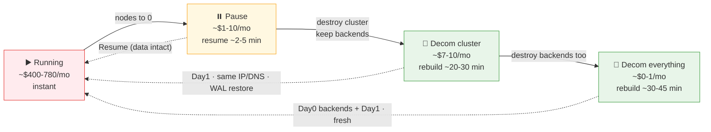

Solid = tearing down further (cheaper ↓); dotted = the recovery path back (slower →).

</details>

---

## Pick your workflow: the operator decision tree

Every other diagram on this page is indexed by *how the system is built*; this one is indexed by *what you want to do right now*. Start from your intent and follow the branches to the exact workflow(s) to dispatch. It folds in three decisions the prose scatters elsewhere: re-run `Day1.cluster.01-gke` vs a targeted `Day2.redeploy.*` (idempotency §), **Pause** vs **Decom** to save cost (Pause/resume §), and which `publish.0N` matches your active `observability.mode`.

<details>
<summary>🧭 Pick your workflow — operator intent → exact workflow(s) (decision tree)</summary>

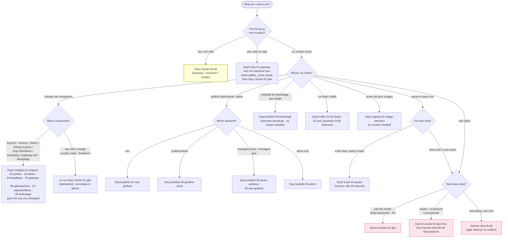

</details>

## Lifecycle diagram

The whole scheme in one frame: the three lifecycle phases as boxes — **Create** (Day0 persistent bootstrap → Day1 throwaway cluster), **Update** (the Day2 tier, whose workflows run in any order), and **Destroy** (Decom, cluster-first then persistent backends) — plus the two one-click umbrellas that wrap the Create/Destroy ends. The only hard ordering is the solid edges (Day0→Day1, and cluster→backends on teardown); everything inside the Day2 box is independent.

<details>
<summary>Expand: full lifecycle flow (Mermaid)</summary>

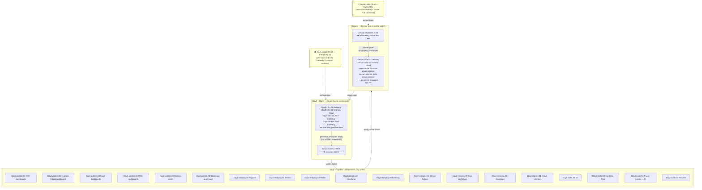

</details>

### Cluster lifecycle (state view)

The same lifecycle as a **state machine**, emphasizing the transitions a cluster moves through. The key payoff it makes explicit: a re-provision after `Decom.cluster.01-gke` jumps straight back to **Day1** — the Day0 state in GCS is *reused, not recreated* — and the **Day2 self-loop** (redeploy / publish / traffic / scale, all re-runnable) is where you spend most of a session.

<details>
<summary>📊 Cluster lifecycle — Day0 → Day1 → Day2 → Decom (state diagram)</summary>

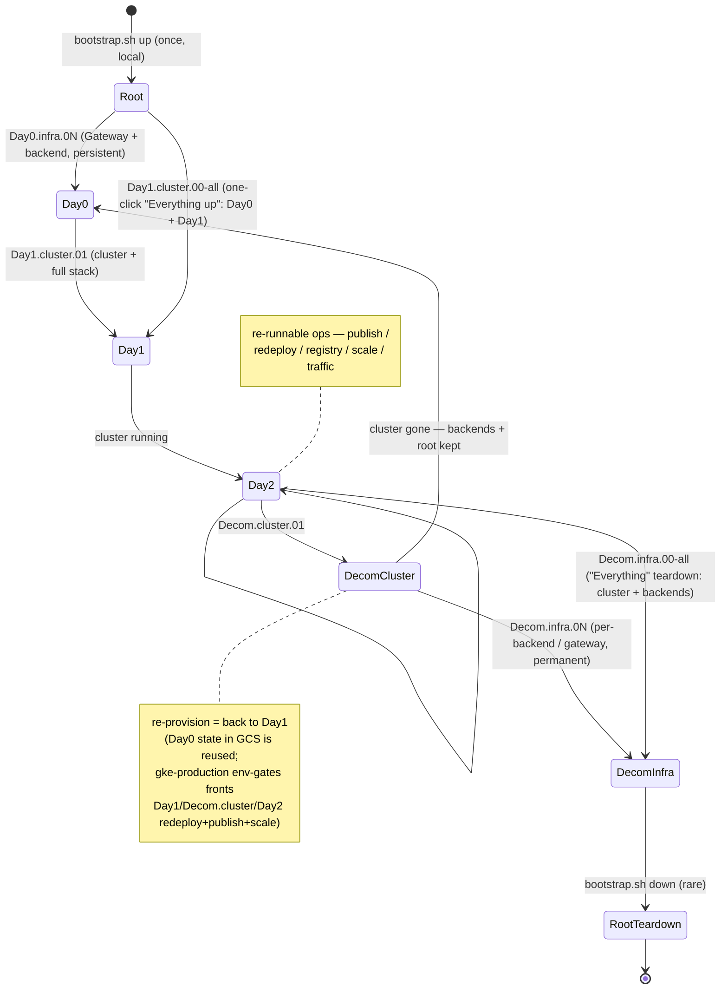

</details>

**Reading it —** the root of trust (`bootstrap.sh up`) is created once and sits beneath everything; `Day0` provisions the persistent infra, `Day1` the throwaway cluster, and `Day2` is the self-loop where day-to-day ops live (every box is re-runnable). The key edge is `Decom.cluster.01 → Day0`: a normal teardown drops only the cluster and **keeps the backends + root**, so re-provisioning skips `Day0` entirely (its state still lives in GCS). Only abandoning the project walks the rarely-used `Decom.infra → bootstrap.sh down` tail.

### Workflow dependencies & GKE serialization

What actually depends on what, and how the shared **`jenkins-2026-gke` concurrency group** serializes every cluster-touching workflow (queued, never raced). Solid arrows are real dependencies; dotted arrows are `workflow_call` reuse or *persistent resources survive*. The reads that matter: Day2 ops hang off a running Day1, a `Decom.cluster.01` keeps the persistent Day0 tier (Gateway IP + backends survive), the umbrellas never share the leaves' `jenkins-2026-gke` group (the up-umbrella has no `concurrency:`, the Decom umbrella its own `jenkins-2026-decom-umbrella` group — they orchestrate, they don't touch GKE directly), and `registry.01-image-retention` sits **outside** the cluster group entirely (its own `jenkins-2026-image-retention` group — no cluster needed).

<details>
<summary>📊 Workflow dependencies + the jenkins-2026-gke concurrency group</summary>

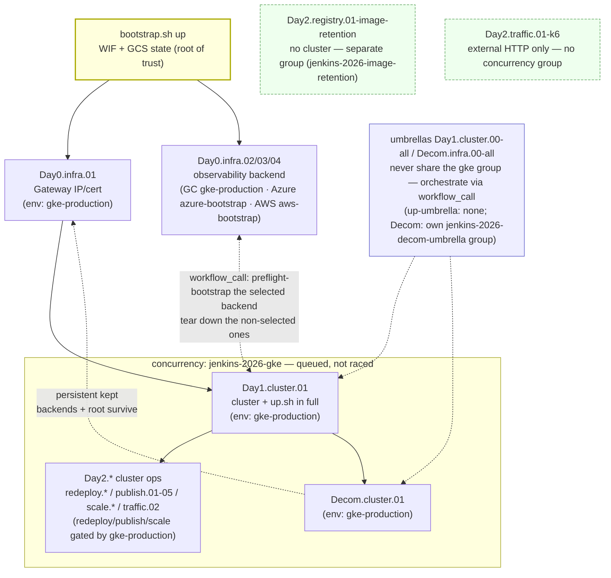

</details>

**Reading it —** solid arrows are create-order dependencies (`Day0.infra.01` Gateway and the backend bootstrap must exist before `Day1`); dotted arrows are reuse/orchestration. The shaded box is the `jenkins-2026-gke` **concurrency group**: `Day1.cluster.01`, the cluster-touching `Day2.*`, and `Decom.cluster.01` all share it, so GitHub **queues** them rather than letting two runs race the same Terraform state. The umbrellas deliberately **never share** the leaves' `jenkins-2026-gke` group — otherwise they would hold the group their own child job needs and deadlock; the up-umbrella carries no `concurrency:` at all, and the Decom umbrella carries only its own `jenkins-2026-decom-umbrella` group (`cancel-in-progress: false`), which no child uses, so full teardowns serialize against each other without deadlock.

---

## Day-0 / Day-1 / Day-2 operations

These terms come from the SRE / platform-engineering world and describe **when in a system's life a task is performed**, not how difficult it is. The `DayN` prefix of every workflow filename maps directly to them:

| Term | What it means | When it runs | tiers used |
|---|---|---|---|
| **Day0** | Foundation bootstrapping — one-time setup of persistent infrastructure that survives across cluster sessions | Before the first deployment; rarely again unless rebuilding from scratch | `infra` |
| **Day1** | Initial provisioning — creating the cluster and deploying the full application stack on top of the Day0 foundation | Once per cluster session (provision → use → decommission cycle) | `cluster` |
| **Day2** | Operations — changes to a **running** system without reprovisioning: config updates, artifact publishing, simulations | Anytime while the cluster is alive | `redeploy`, `publish`, `traffic` |
| **Decom** | Teardown — the inverse of Day1 (cluster) and Day0 (persistent backends) | End of session / permanent shutdown | `cluster` then `infra` |

### Day × workflow matrix

| # | Workflow | Phase | Requires cluster? | Idempotent? | Typical frequency |
|:---:|---|:---:|:---:|:---:|---|
| 1 | [Day0.infra.01-gateway](https://github.com/nubenetes/jenkins-2026/actions/workflows/Day0.infra.01-gateway.yml) | **Day0** | no | yes | Once (re-run = no-op) |
| 2 | [Day0.infra.02-grafana-cloud](https://github.com/nubenetes/jenkins-2026/actions/workflows/Day0.infra.02-grafana-cloud.yml) | **Day0** | no | yes | Once (re-run = no-op) |
| 3 | [Day0.infra.03-azure-grafana](https://github.com/nubenetes/jenkins-2026/actions/workflows/Day0.infra.03-azure-grafana.yml) | **Day0** | no | yes | Once (re-run = no-op) |
| 4 | [Day0.infra.04-aws-grafana](https://github.com/nubenetes/jenkins-2026/actions/workflows/Day0.infra.04-aws-grafana.yml) | **Day0** | no | yes | Once (re-run = no-op) |
| 5 | [Day1.cluster.01-gke](https://github.com/nubenetes/jenkins-2026/actions/workflows/Day1.cluster.01-gke.yml) | **Day1** | creates it | yes | Once per session |
| 6 | [Day2.redeploy.01-argocd](https://github.com/nubenetes/jenkins-2026/actions/workflows/Day2.redeploy.01-argocd.yml) | **Day2** | yes | yes | When ArgoCD config / an Application changes |
| 7 | [Day2.redeploy.02-jenkins](https://github.com/nubenetes/jenkins-2026/actions/workflows/Day2.redeploy.02-jenkins.yml) | **Day2** | yes | yes | When Jenkins config/JCasC changes. Input `run_node_pool` (`config`/`static`/`ci-spot`) flips build-agent placement for the run |
| 8 | [Day2.redeploy.03-tekton](https://github.com/nubenetes/jenkins-2026/actions/workflows/Day2.redeploy.03-tekton.yml) | **Day2** | yes | yes | When Tekton config/pipelines change. Input `run_node_pool` (`config`/`static`/`ci-spot`) flips run-pod placement for the run; `backend_tls` + `observability_mode` must match the live cluster (09-gateway's OSS Grafana route + BackendTLSPolicies) |
| 9 | [Day2.redeploy.04-headlamp](https://github.com/nubenetes/jenkins-2026/actions/workflows/Day2.redeploy.04-headlamp.yml) | **Day2** | yes | yes | When Headlamp config changes. Inputs `backend_tls` + `observability_mode` **must match the live cluster** (08-headlamp applies Headlamp's BackendTLSPolicy; 01-namespaces gates the grafana IAP secret + obs quota) |
| 10 | [Day2.redeploy.05-gateway](https://github.com/nubenetes/jenkins-2026/actions/workflows/Day2.redeploy.05-gateway.yml) | **Day2** | yes | yes | When the Gateway/routes/IAP change |
| 11 | [Day2.redeploy.06-githubactions](https://github.com/nubenetes/jenkins-2026/actions/workflows/Day2.redeploy.06-githubactions.yml) | **Day2** | yes | yes | When the GitHub Actions / ARC config changes (runner scale set, GitHub App). For `ci_engine=githubactions` only. Inputs `secrets_backend` (re-runs `01`/`08.6`/`09-gateway`) + `run_node_pool` + `observability_mode` (must match the cluster — 09-gateway's OSS Grafana route) |
| 12 | [Day2.redeploy.07-argoworkflows](https://github.com/nubenetes/jenkins-2026/actions/workflows/Day2.redeploy.07-argoworkflows.yml) | **Day2** | yes | yes | When the Argo Workflows / Argo Events config changes (WorkflowTemplates, EventSource/Sensor, webhook). For `ci_engine=argoworkflows` only. Inputs `secrets_backend` (re-runs `01`/`08.6`/`09-gateway`) + `run_node_pool` + `observability_mode` (must match the cluster — 09-gateway's OSS Grafana route) |
| 13 | [Day2.publish.01-oss-grafana](https://github.com/nubenetes/jenkins-2026/actions/workflows/Day2.publish.01-oss-grafana.yml) | **Day2** | yes ³ | yes | When OSS dashboards/alerts change |
| 14 | [Day2.publish.02-grafana-cloud](https://github.com/nubenetes/jenkins-2026/actions/workflows/Day2.publish.02-grafana-cloud.yml) | **Day2** | yes ² | yes | When dashboard/alert JSON changes |
| 15 | [Day2.publish.03-azure-grafana](https://github.com/nubenetes/jenkins-2026/actions/workflows/Day2.publish.03-azure-grafana.yml) | **Day2** | **no** ¹ | yes | When dashboard JSON changes |
| 16 | [Day2.publish.04-aws-grafana](https://github.com/nubenetes/jenkins-2026/actions/workflows/Day2.publish.04-aws-grafana.yml) | **Day2** | **no** ¹ | yes | When dashboard JSON changes |
| 17 | [Day2.publish.05-alerts](https://github.com/nubenetes/jenkins-2026/actions/workflows/Day2.publish.05-alerts.yml) | **Day2** | yes ² | yes | When alert rules change. Input `observability_mode` **must match the live cluster** — it targets the alerts backend (previously read from `config.yaml`, always `oss` in CI) |
| 18 | [Day2.traffic.01-k6](https://github.com/nubenetes/jenkins-2026/actions/workflows/Day2.traffic.01-k6.yml) | **Day2** | yes | n/a | On demand / regular cadence |
| 19 | [Day2.traffic.02-rum](https://github.com/nubenetes/jenkins-2026/actions/workflows/Day2.traffic.02-rum.yml) | **Day2** | yes | n/a | To populate/demo/validate the RUM dashboard (synthetic Faro beacons) |
| 20 | [Day2.scale.01-pause](https://github.com/nubenetes/jenkins-2026/actions/workflows/Day2.scale.01-pause.yml) | **Day2** | yes | yes | To park the cluster at ~zero cost for a few days |
| 21 | [Day2.scale.02-resume](https://github.com/nubenetes/jenkins-2026/actions/workflows/Day2.scale.02-resume.yml) | **Day2** | yes | yes | To bring a paused cluster back online |
| 22 | [Day2.registry.01-image-retention](https://github.com/nubenetes/jenkins-2026/actions/workflows/Day2.registry.01-image-retention.yml) | **Day2** | **no** | yes | Scheduled/on-demand ghcr image prune (GitHub API, no cluster) |
| 23 | [Decom.cluster.01-gke](https://github.com/nubenetes/jenkins-2026/actions/workflows/Decom.cluster.01-gke.yml) | **Decom** | destroys it | yes | Once per session |
| 24 | [Decom.infra.01-gateway](https://github.com/nubenetes/jenkins-2026/actions/workflows/Decom.infra.01-gateway.yml) | **Decom** | no | yes | Once (permanent — ⚠ loses static IP) |
| 25 | [Decom.infra.02-grafana-cloud](https://github.com/nubenetes/jenkins-2026/actions/workflows/Decom.infra.02-grafana-cloud.yml) | **Decom** | no | yes | Once (permanent — ⚠ irreversible) |
| 26 | [Decom.infra.03-azure-grafana](https://github.com/nubenetes/jenkins-2026/actions/workflows/Decom.infra.03-azure-grafana.yml) | **Decom** | no | yes | Once (permanent — ⚠ irreversible) |
| 27 | [Decom.infra.04-aws-grafana](https://github.com/nubenetes/jenkins-2026/actions/workflows/Decom.infra.04-aws-grafana.yml) | **Decom** | no | yes | Once (permanent — ⚠ irreversible) |

> ¹ **Day2.publish.03 and Day2.publish.04** connect directly to the persistent managed-grafana backends (Azure AMG / Amazon AMG) — no running GKE cluster needed. They read Terraform state from GCS and authenticate via GitHub OIDC → Azure/AWS.
>
> ² **Day2.publish.02 and Day2.publish.05** read Grafana credentials from k8s Secrets (grafana-cloud-credentials, azure-monitor-credentials, aws-managed-credentials) so they require an active cluster. Unlike the Azure/AWS managed-Grafana publishers (¹), the Grafana Cloud stack has no Terraform-state-readable API path here — its token lands in the in-cluster `grafana-cloud-credentials` Secret at Day1, so `Day2.publish.02` reads it from there (same as oss/alerts). The dashboards/alerts are also provisioned automatically by `Day1.cluster.01` via `scripts/up.sh` — these Day2 workflows just push changes without a full reprovision.
>
> ³ **Day2.publish.01** refreshes the in-cluster OSS Grafana on a running cluster. The OSS stack (kube-prometheus-stack/Loki/Tempo) is GitOps-managed by the `observability-oss` ArgoCD app-of-apps ([`argocd/observability-oss`](../argocd/observability-oss)), so chart/value changes — including the dashboards, now GitOps-managed by the `oss-grafana-dashboards` child app — auto-sync on commit; this workflow nudges an ArgoCD re-sync and republishes alert rules without a full reprovision.

### Pause / resume to save cost (without Decom + rebuild)

When you want to stop paying for a cluster for a few days but keep it intact,
**don't** `Decom.cluster.01` + `Day1.cluster.01` (a full teardown + ~20-min
rebuild + redeploy). Instead:

- **`Day2.scale.01-pause`** disables autoscaling and scales every GKE node pool to
  **0**. The 24/7 worker-VM cost goes to ~0 while the cluster, its persistent
  volumes (CNPG Postgres data), ArgoCD + all apps, the reserved static IP, DNS and
  certs all survive. Workloads go `Pending` (no nodes).
- **`Day2.scale.02-resume`** scales the pools back up and re-enables autoscaling
  (inputs default to [`terraform/gke`](../terraform/gke)'s `node_count`/`min`/`max`); pods reschedule
  and ArgoCD reconciles in **minutes** — nothing is rebuilt. It then runs a
  **post-resume recovery pass** for two one-time-init races on the fresh nodes:
  re-clones any CNPG replica the pause's force-drain left unstartable, and restarts
  ArgoCD dex if its OIDC connector init lost a race with DNS/egress (both idempotent
  no-ops on a clean resume — see [501 § resume-side gotcha](./501-PLATFORM_OPERATIONS.md#the-resume-side-gotcha-one-time-init-races-dns-on-fresh-nodes-real-incident)).

It uses imperative `gcloud` (fast), so [`terraform/gke`](../terraform/gke) state drifts (it still
records autoscaling on / `node_count` N) — that's benign and reconciled by Resume
or the next `Day1.cluster.01` apply. What still costs while paused (all tiny): the
zonal control plane (covered by the GKE free-tier management credit), the PVs'
persistent disks, and the reserved static IP. **Grafana Cloud is free-tier** so
there's nothing to pause there; the Azure/AWS managed backends, if ever
provisioned, are billed separately and would be torn down via their own
`Decom.infra.0{3,4}` (they don't "pause" cheaply).

### Typical session lifecycle

<details>
<summary>📊 Typical session lifecycle (Day0 → Day1 → Day2 → Decom)</summary>

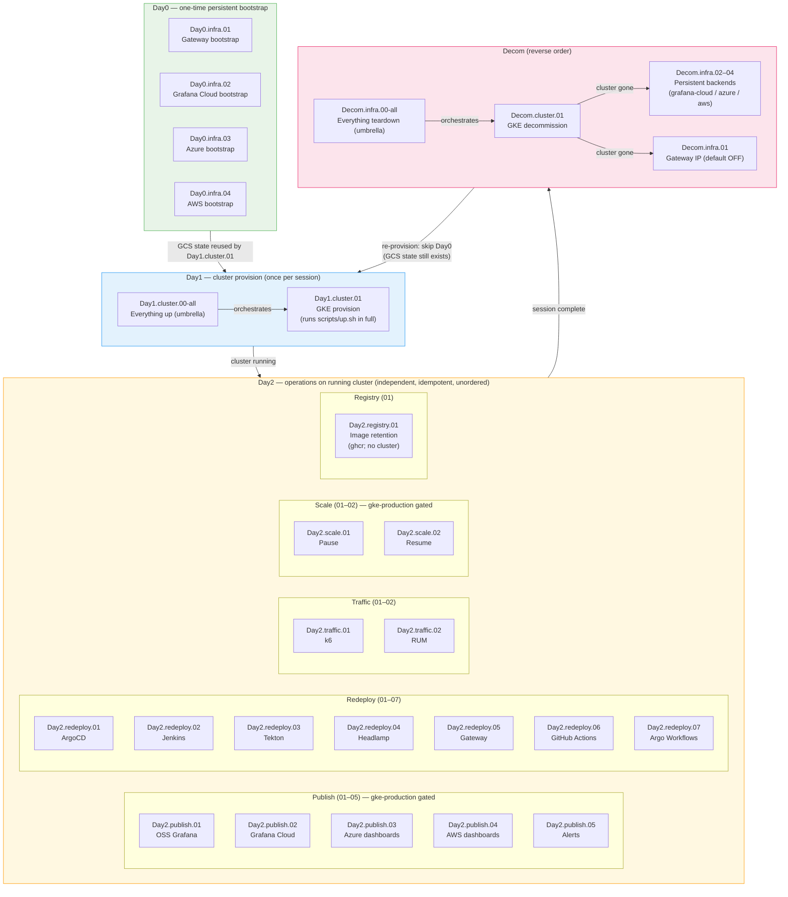

</details>

The flowchart above is the static *topology* of the phases; the sequence below is the same lifecycle unfolding **over time** — who dispatches what, where each run sits in the `jenkins-2026-gke` queue, when one of the five approval Environments interrupts (and that `traffic.01-k6` / `traffic.02-rum` are **ungated**), and the payoff that **Decom keeps the Day0 state in GCS** so the next session re-enters straight at Day1. Read it top-to-bottom as one real run.

<details>
<summary>⏱️ A typical session over time — Day0 once, then Day1, the Day2 loop, then Decom (sequence diagram: gates, the GKE queue, and GCS-state reuse)</summary>

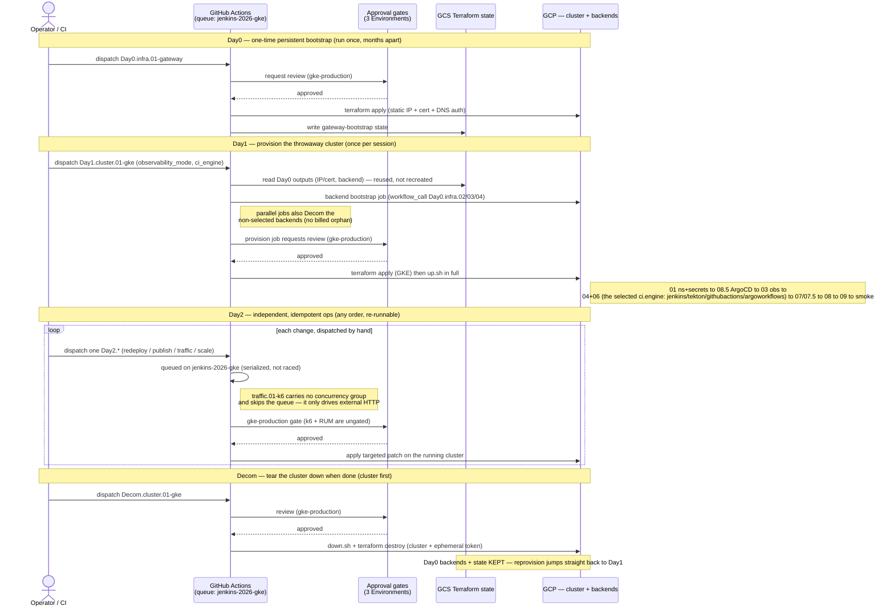

</details>

A new session (reprovision after full teardown) only needs **Day1** — Day0 outputs are still in GCS state and are reused automatically by `Day1.cluster.01`.

---

## Complete workflow inventory — matrix table

All 31 workflows in a single numbered table (rows 1–29 in filename/execution order; **rows 30–31** are the two opt-in **umbrellas** — full-teardown and full-provision — which orchestrate the others and sit outside the linear runbook). The filename's three components (`DayN`, `tier`, `ZZ`) are broken out separately so the meaning of every part is visible at a glance. Click the code to open the workflow's **Run workflow** page directly in GitHub Actions.

> **Reading the sequence**: rows are ordered by filename (= correct execution order). `Day0`/`Day1` before `Day2` before `Decom`; within `Decom`, the cluster (row 25) before the persistent backends (rows 26–29). This ordering is **enforced by the `name:` prefixes** — opening the GitHub Actions sidebar and reading top-to-bottom gives the correct runbook. Row 30 (`Decom.infra.00-all`) is an opt-in umbrella that orchestrates a full teardown (it runs rows 25–29 for you, cluster first) and is therefore outside the linear order. Row 31 (`Day1.cluster.00-all`) is its symmetric **provision** umbrella — one click runs the Gateway bootstrap (row 1) then the cluster provision (row 5), which itself bootstraps the chosen backend — and is likewise outside the linear order (its filename sorts at position 5, before `Day1.cluster.01`). Row 24 (`Day2.registry.01-image-retention`) is a Day2-only ops workflow (ghcr image prune) with no Day0/Decom counterpart.

| # | `DayN` — Phase | `tier` — group | `ZZ` resource | Code → GitHub Actions | Description | Prerequisites | Frequency |
|:---:|---|---|---|---|---|---|---|
| **1** | **Day0** Create | **infra** — persistent first | **01** Gateway IP/cert | [**`Day0.infra.01-gateway`**](https://github.com/nubenetes/jenkins-2026/actions/workflows/Day0.infra.01-gateway.yml) | Provisions static external IP + wildcard cert map + DNS authorization ([`terraform/gateway-bootstrap`](../terraform/gateway-bootstrap)). Keeping these persistent avoids losing the IP and re-propagating DNS on every cluster rebuild. | [`terraform/bootstrap`](../terraform/bootstrap) applied — including the permanent delegated DNS zone: a one-time `NS` delegation of `base_domain` at the parent domain (from bootstrap's `dns_zone_name_servers` output). The wildcard-A and cert-validation records are created by this workflow's module itself — no manual A record. | **One-time** |
| **2** | **Day0** Create | **infra** — persistent first | **02** Grafana Cloud stack | [**`Day0.infra.02-grafana-cloud`**](https://github.com/nubenetes/jenkins-2026/actions/workflows/Day0.infra.02-grafana-cloud.yml) | Provisions the Grafana Cloud stack ([`terraform/grafana-cloud-stack`](../terraform/grafana-cloud-stack), generated slug): Grafana instance, access-policy tokens, PDC agent. Preserves metrics/traces/logs history across GKE rebuilds. | [`terraform/bootstrap`](../terraform/bootstrap) applied (WIF + GCS bucket) | **One-time** |
| **3** | **Day0** Create | **infra** — persistent first | **03** Azure Mgd Grafana | [**`Day0.infra.03-azure-grafana`**](https://github.com/nubenetes/jenkins-2026/actions/workflows/Day0.infra.03-azure-grafana.yml) | Provisions Azure Managed Grafana + Azure Monitor workspace + App Insights + Log Analytics + Entra SP ([`terraform/azure-managed-grafana`](../terraform/azure-managed-grafana)). Auth: GitHub OIDC → Azure (no stored client secret). | [`terraform/bootstrap`](../terraform/bootstrap); `AZURE_*` GitHub secrets | **One-time** |
| **4** | **Day0** Create | **infra** — persistent first | **04** AWS AMG / AMP | [**`Day0.infra.04-aws-grafana`**](https://github.com/nubenetes/jenkins-2026/actions/workflows/Day0.infra.04-aws-grafana.yml) | Provisions Amazon Managed Grafana + AMP + CloudWatch + GKE→AWS OIDC provider + collector IAM role ([`terraform/aws-managed-grafana`](../terraform/aws-managed-grafana)). Auth: GitHub OIDC → AWS (no access keys). | [`terraform/bootstrap`](../terraform/bootstrap); `AWS_*` GitHub secrets | **One-time** |
| **5** | **Day1** Create | **cluster** — depends on infra | **01** GKE cluster | [**`Day1.cluster.01-gke`**](https://github.com/nubenetes/jenkins-2026/actions/workflows/Day1.cluster.01-gke.yml) | Provisions the throwaway GKE cluster ([`terraform/gke`](../terraform/gke)) then runs `scripts/up.sh` in full: namespaces → OTel → ArgoCD → observability → Jenkins → seed pipelines → Headlamp + smoke test. (ArgoCD precedes observability so oss mode can deploy the in-cluster stack via the `observability-oss` app-of-apps.) Reads persistent-resource outputs (rows 1–4) from GCS state. Always pair with row 23 (`Decom.cluster.01`). | Rows 1–4 as needed for the chosen `observability_mode`; [`terraform/bootstrap`](../terraform/bootstrap) | **Per session** |
| **6** | **Day2** Update | **redeploy** | **01** ArgoCD | [**`Day2.redeploy.01-argocd`**](https://github.com/nubenetes/jenkins-2026/actions/workflows/Day2.redeploy.01-argocd.yml) | Re-applies [`scripts/08.5-argocd.sh`](../scripts/08.5-argocd.sh): ArgoCD Helm upgrade + OIDC/RBAC + Jenkins API token, and re-applies the GitOps Applications it owns (platform-config, platform-postgres, External Secrets, Argo Rollouts, Headlamp, the microservices AppSet). ArgoCD is the CD engine the rest deploy through, hence `ZZ=01`. | Cluster active (row 5 run) | **Anytime** |
| **7** | **Day2** Update | **redeploy** | **02** Jenkins | [**`Day2.redeploy.02-jenkins`**](https://github.com/nubenetes/jenkins-2026/actions/workflows/Day2.redeploy.02-jenkins.yml) | Re-applies [`scripts/04-jenkins.sh`](../scripts/04-jenkins.sh): Helm upgrade of [`helm/jenkins/`](../helm/jenkins) + JCasC, and re-seeds the Microservices pipelines against the existing cluster. For Jenkins-only changes without a full provision cycle. | Cluster active (row 5 run) | **Anytime** |
| **8** | **Day2** Update | **redeploy** | **03** Tekton | [**`Day2.redeploy.03-tekton`**](https://github.com/nubenetes/jenkins-2026/actions/workflows/Day2.redeploy.03-tekton.yml) | Re-applies [`scripts/04-tekton.sh`](../scripts/04-tekton.sh) (Tekton Pipelines/Triggers/Dashboard) + [`scripts/06-tekton-pipelines.sh`](../scripts/06-tekton-pipelines.sh) (`tekton/` pipelines + per-service PipelineRuns). For Tekton-only changes without a full provision. **Secrets-backend-aware** (`secrets_backend` input): re-runs `01-namespaces` + `08.6-eso-sync` so it never recreates an ESO-owned Secret imperatively. | Cluster active (row 5 run, ci_engine=tekton) | **Anytime** |
| **9** | **Day2** Update | **redeploy** | **04** Headlamp | [**`Day2.redeploy.04-headlamp`**](https://github.com/nubenetes/jenkins-2026/actions/workflows/Day2.redeploy.04-headlamp.yml) | Re-applies [`scripts/01-namespaces.sh`](../scripts/01-namespaces.sh) (refreshes OIDC config keys on `headlamp-credentials`) and [`scripts/08-headlamp.sh`](../scripts/08-headlamp.sh) (Helm upgrade of [`helm/headlamp/`](../helm/headlamp)). **Secrets-backend-aware** (`secrets_backend` input). | Cluster active (row 5 run) | **Anytime** |
| **10** | **Day2** Update | **redeploy** | **05** Gateway | [**`Day2.redeploy.05-gateway`**](https://github.com/nubenetes/jenkins-2026/actions/workflows/Day2.redeploy.05-gateway.yml) | Re-applies [`scripts/01-namespaces.sh`](../scripts/01-namespaces.sh) (namespaces + IAP Secrets) + [`scripts/09-gateway.sh`](../scripts/09-gateway.sh) (the Gateway, HTTPRoutes and GCPBackendPolicies/IAP). Use it to apply Gateway/route/IAP changes without a full provision. **Secrets-backend-aware** (`secrets_backend` input): runs `08.6-eso-sync` after `01-namespaces` so the IAP Secret is in place before the GCPBackendPolicy. | Cluster active (row 5 run) | **Anytime** |
| **11** | **Day2** Update | **redeploy** | **06** GitHub Actions / ARC | [**`Day2.redeploy.06-githubactions`**](https://github.com/nubenetes/jenkins-2026/actions/workflows/Day2.redeploy.06-githubactions.yml) | Re-applies [`scripts/04-githubactions.sh`](../scripts/04-githubactions.sh) (the `argocd/githubactions` app-of-apps: ARC controller + runner scale set) + [`scripts/06-githubactions-pipelines.sh`](../scripts/06-githubactions-pipelines.sh) (renders `.github/workflows/` into the app forks). For GitHub Actions / ARC-only changes without a full provision. **Secrets-backend-aware** (`secrets_backend` input): re-runs `01-namespaces` + `08.6-eso-sync`, and finishes with `09-gateway` (routes/IAP re-asserted). Input `run_node_pool` (`config`/`static`/`ci-spot`) flips runner/Workflow-pod placement for the run. `ZZ=06` is the next free `redeploy` id (04/05 are Headlamp/Gateway); the four CI engines (02/03/06/07) are mutually exclusive. | Cluster active (row 5 run, ci_engine=githubactions) | **Anytime** |
| **12** | **Day2** Update | **redeploy** | **07** Argo Workflows | [**`Day2.redeploy.07-argoworkflows`**](https://github.com/nubenetes/jenkins-2026/actions/workflows/Day2.redeploy.07-argoworkflows.yml) | Re-applies [`scripts/04-argoworkflows.sh`](../scripts/04-argoworkflows.sh) (the `argocd/argoworkflows` app-of-apps: Argo Workflows controller+server + Argo Events + EventBus) + [`scripts/06-argoworkflows-pipelines.sh`](../scripts/06-argoworkflows-pipelines.sh) (WorkflowTemplates/EventSource/Sensor + webhook). For Argo Workflows-only changes without a full provision. **Secrets-backend-aware** (`secrets_backend` input): re-runs `01-namespaces` + `08.6-eso-sync`, and finishes with `09-gateway` (routes/IAP re-asserted). Input `run_node_pool` (`config`/`static`/`ci-spot`) flips runner/Workflow-pod placement for the run. `ZZ=07` is the next free `redeploy` id (04/05 are Headlamp/Gateway, 06 is GitHub Actions); the four CI engines (02/03/06/07) are mutually exclusive. | Cluster active (row 5 run, ci_engine=argoworkflows) | **Anytime** |
| **13** | **Day2** Update | **redeploy** | **08** Backstage | [**`Day2.redeploy.08-backstage`**](https://github.com/nubenetes/jenkins-2026/actions/workflows/Day2.redeploy.08-backstage.yml) | Re-applies the Backstage portal slice without a full provision: [`01-namespaces`](../scripts/01-namespaces.sh) → [`08.6-eso-sync`](../scripts/08.6-eso-sync.sh) → [`08.7-backend-tls`](../scripts/08.7-backend-tls.sh) → [`08.95-backstage.sh`](../scripts/08.95-backstage.sh) (runtime ConfigMap + ArgoCD creds patch + the [`argocd/backstage`](../argocd/backstage) app-of-apps) → [`09-gateway`](../scripts/09-gateway.sh) (route/IAP + the IAP JWT **audience** resolution). `backstage_enabled=false` **retires** the portal (app-of-apps cascade-prune incl. its CNPG db). **Secrets-backend-aware** (`secrets_backend` input). `ZZ=08` is the next free `redeploy` id. See [505](./505-BACKSTAGE.md). | Cluster active (row 5 run); image published (row 19) | **Anytime** |
| **14** | **Day2** Update | **publish** | **01** OSS Grafana | [**`Day2.publish.01-oss-grafana`**](https://github.com/nubenetes/jenkins-2026/actions/workflows/Day2.publish.01-oss-grafana.yml) | Refreshes the in-cluster OSS Grafana without a reprovision: re-applies the `observability-oss` app-of-apps with the deployed CI engine and hard-refreshes it so the GitOps-managed `oss-grafana-dashboards` child re-syncs (the dashboards ConfigMap is no longer rebuilt by this workflow), then republishes alert rules (`07.5`). The stack itself is GitOps-managed ([`argocd/observability-oss`](../argocd/observability-oss)). | Cluster active (row 5 run), `observability.mode=oss` | **Anytime** |
| **15** | **Day2** Update | **publish** | **02** Grafana Cloud | [**`Day2.publish.02-grafana-cloud`**](https://github.com/nubenetes/jenkins-2026/actions/workflows/Day2.publish.02-grafana-cloud.yml) | (Re)publishes the dashboards + alert rules to Grafana Cloud via [`scripts/07-grafana-dashboards.sh`](../scripts/07-grafana-dashboards.sh) / [`07.5-grafana-alerts.sh`](../scripts/07.5-grafana-alerts.sh) — a plain idempotent `POST /api/dashboards/db` on the Grafana HTTP API (the `gcx` CLI is no longer used) — without re-provisioning. Reads `GRAFANA_BASE_URL`/`GRAFANA_API_KEY` from the in-cluster `grafana-cloud-credentials` Secret (created at Day1 from the Terraform-minted token), so it needs the live cluster (footnote ²). Use when a dashboard/alert JSON changes. | Cluster active (row 5 run) with `observability.mode=grafana-cloud` | **Anytime** |
| **16** | **Day2** Update | **publish** | **03** Azure Mgd Grafana | [**`Day2.publish.03-azure-grafana`**](https://github.com/nubenetes/jenkins-2026/actions/workflows/Day2.publish.03-azure-grafana.yml) | (Re)publishes [`observability/grafana/dashboards-azure/`](../observability/grafana/dashboards-azure) to Azure Managed Grafana without re-provisioning the cluster. Discovers the instance via `az grafana list`; auth via GitHub OIDC. Use when a dashboard JSON changes. | Row 3 applied; `AZURE_*` secrets | **Anytime** |
| **17** | **Day2** Update | **publish** | **04** AWS AMG | [**`Day2.publish.04-aws-grafana`**](https://github.com/nubenetes/jenkins-2026/actions/workflows/Day2.publish.04-aws-grafana.yml) | (Re)publishes [`observability/grafana/dashboards-aws/`](../observability/grafana/dashboards-aws) to Amazon Managed Grafana without re-provisioning. Reads AMG params from [`terraform/aws-managed-grafana`](../terraform/aws-managed-grafana) GCS state; auth via GitHub OIDC. | Row 4 applied; `AWS_DASHBOARD_PUBLISH_ROLE_ARN` secret | **Anytime** |
| **18** | **Day2** Update | **publish** | **05** Grafana alerts | [**`Day2.publish.05-alerts`**](https://github.com/nubenetes/jenkins-2026/actions/workflows/Day2.publish.05-alerts.yml) | Pushes the alert rules to the active Grafana via its provisioning API without a full reprovision ([`scripts/07.5-grafana-alerts.sh`](../scripts/07.5-grafana-alerts.sh)). | Cluster active (row 5 run) | **Anytime** |
| **19** | **Day2** Update | **publish** | **06** Backstage image | [**`Day2.publish.06-backstage`**](https://github.com/nubenetes/jenkins-2026/actions/workflows/Day2.publish.06-backstage.yml) | Builds + pushes the custom Backstage app image ([`backstage/`](../backstage/)) to ghcr as `<branch>` + `sha-<sha>` tags (host-build: Node 24 + yarn 4.8.1 → [`packages/backend/Dockerfile`](../backstage/packages/backend/Dockerfile)). Pure GitHub — **no cluster needed**; also auto-runs on pushes touching `backstage/**`. **The portal's one-time bootstrap**: run once per branch **before** the first `backstage_enabled` Day1 — the image persists across cluster rebuilds ([505](./505-BACKSTAGE.md) § Enabling it). | None (GitHub `packages: write`) | **One-time per branch / on `backstage/**` change** |
| **20** | **Day2** Update | **traffic** | **01** k6 | [**`Day2.traffic.01-k6`**](https://github.com/nubenetes/jenkins-2026/actions/workflows/Day2.traffic.01-k6.yml) | Runs a continuous stream of synthetic k6 traffic against the stable endpoints to keep metrics and logs active in Grafana dashboards. Does not modify infrastructure. | Cluster active; public endpoints reachable | **Anytime** |
| **21** | **Day2** Update | **traffic** | **02** Synthetic RUM | [**`Day2.traffic.02-rum`**](https://github.com/nubenetes/jenkins-2026/actions/workflows/Day2.traffic.02-rum.yml) | POSTs synthetic Grafana **Faro** browser beacons (Core Web Vitals, sessions, JS errors + OTLP browser traces) to the otel-collector faro receiver via `kubectl port-forward`, to populate/demo/validate the **RUM dashboard** before the Angular SPA is instrumented. No environment gate; modifies nothing. | Cluster active (row 5 run) | **Anytime** |
| **22** | **Day2** Update | **scale** | **01** Pause | [**`Day2.scale.01-pause`**](https://github.com/nubenetes/jenkins-2026/actions/workflows/Day2.scale.01-pause.yml) | Parks the cluster at ~zero cost without a Decom+rebuild: disables autoscaling and scales every node pool to 0 (preserves the cluster, PVs/CNPG data, ArgoCD/apps, static IP, DNS, certs). Imperative `gcloud`; the [`terraform/gke`](../terraform/gke) drift is benign. | Cluster active (row 5 run) | **To park for days** |
| **23** | **Day2** Update | **scale** | **02** Resume | [**`Day2.scale.02-resume`**](https://github.com/nubenetes/jenkins-2026/actions/workflows/Day2.scale.02-resume.yml) | Brings a paused cluster back: scales the node pools up and re-enables autoscaling (inputs default to [`terraform/gke`](../terraform/gke)'s node_count/min/max); pods reschedule and ArgoCD reconciles in minutes. Then a post-resume recovery pass re-clones any unstartable CNPG replica and restarts dex if its OIDC init raced DNS (idempotent). | A paused cluster (row 22 run) | **To un-park** |
| **24** | **Day2** Update | **registry** | **01** Image retention | [**`Day2.registry.01-image-retention`**](https://github.com/nubenetes/jenkins-2026/actions/workflows/Day2.registry.01-image-retention.yml) | Prunes old/untagged container images from the GitHub Container Registry (ghcr) to keep the registry tidy and within quota. Pure GitHub API — **no cluster needed**; scheduled and/or on-demand. Day2-only (no Day0/Decom counterpart). | None (GitHub API) | **Scheduled / anytime** |
| **25** | **Decom** Destroy | **cluster** — most dependent, first | **01** GKE cluster | [**`Decom.cluster.01-gke`**](https://github.com/nubenetes/jenkins-2026/actions/workflows/Decom.cluster.01-gke.yml) | Tears down the stack (`scripts/down.sh`) and destroys the GKE cluster (`terraform destroy` on [`terraform/gke`](../terraform/gke)), then **sweeps orphaned PV disks** (CSI-provisioned PDs that `terraform destroy` can't delete — see [902](./902-TROUBLESHOOTING.md)). The ephemeral Grafana Cloud token is also destroyed. Persistent resources are untouched. Must run **before** rows 26–29. | Session complete | **Per session** |
| **26** | **Decom** Destroy | **infra** — foundational, last | **01** Gateway IP/cert | [**`Decom.infra.01-gateway`**](https://github.com/nubenetes/jenkins-2026/actions/workflows/Decom.infra.01-gateway.yml) | `terraform destroy` on [`terraform/gateway-bootstrap`](../terraform/gateway-bootstrap). Releases the static IP and cert map. **⚠ The IP is gone**: a future bootstrap allocates a new IP. The wildcard-A records in the permanent zone are auto-reconciled to it on the next `Day0.infra.01`/`Day1` run (no manual DNS edits), but clients must wait out the record-TTL propagation. | **Row 25** complete | **One-time** |
| **27** | **Decom** Destroy | **infra** — foundational, last | **02** Grafana Cloud stack | [**`Decom.infra.02-grafana-cloud`**](https://github.com/nubenetes/jenkins-2026/actions/workflows/Decom.infra.02-grafana-cloud.yml) | `terraform destroy` on [`terraform/grafana-cloud-stack`](../terraform/grafana-cloud-stack). Permanently removes the Grafana Cloud instance, dashboards, access-policy tokens. Irreversible. | **Row 25** complete | **One-time** |
| **28** | **Decom** Destroy | **infra** — foundational, last | **03** Azure Mgd Grafana | [**`Decom.infra.03-azure-grafana`**](https://github.com/nubenetes/jenkins-2026/actions/workflows/Decom.infra.03-azure-grafana.yml) | `terraform destroy` on [`terraform/azure-managed-grafana`](../terraform/azure-managed-grafana). Removes Azure Managed Grafana, Monitor workspace, App Insights, Log Analytics and the Entra SP. | **Row 25** complete | **One-time** |
| **29** | **Decom** Destroy | **infra** — foundational, last | **04** AWS AMG / AMP | [**`Decom.infra.04-aws-grafana`**](https://github.com/nubenetes/jenkins-2026/actions/workflows/Decom.infra.04-aws-grafana.yml) | `terraform destroy` on [`terraform/aws-managed-grafana`](../terraform/aws-managed-grafana). Removes Amazon Managed Grafana, AMP, CloudWatch log group, OIDC provider and IAM role. | **Row 25** complete | **One-time** |
| **30** | **Decom** Destroy | **infra.00** — umbrella, opt-in | **00** Everything | [**`Decom.infra.00-all`**](https://github.com/nubenetes/jenkins-2026/actions/workflows/Decom.infra.00-all.yml) | Full teardown in one dispatch: tears down the cluster **and** every persistent backend, reusing rows 25–29 via `workflow_call` (no duplicated logic). Type `destroy` to confirm. Cluster first (so the ephemeral `grafana-cloud-token` is gone before the Grafana Cloud stack), then backends in parallel. Backend checkboxes + `purge_secrets` (eso Secret Manager sweep) default **on**; Gateway IP defaults **off**. Avoids leaving a forgotten/billed backend after switching `observability.mode`. | None (orchestrates rows 25–29) | **When done** |
| **31** | **Day1** Create | **cluster.00** — umbrella, opt-in | **00** Everything up | [**`Day1.cluster.00-all`**](https://github.com/nubenetes/jenkins-2026/actions/workflows/Day1.cluster.00-all.yml) | One-click from-scratch provision — the symmetric counterpart of row 28. Bootstraps the persistent Gateway (row 1) then provisions the cluster + full stack (row 5, which itself bootstraps the chosen observability backend), reusing both via `workflow_call`. Idempotent: safe from absolute zero **or** the usual decommissioned state. `bootstrap_gateway` defaults **on** (uncheck to skip its gate when the IP/cert already exist). | None (orchestrates rows 1 + 5) | **Provision from scratch** |

---

## Provision: per-step workflows, plus an opt-in "Everything up" umbrella

Symmetric to the teardown umbrella below. Normally you provision in two clicks —
the one-time persistent bootstraps (`Day0.infra.0N`, only what your
`observability_mode` needs) and then `Day1.cluster.01-gke` (which itself bootstraps
the chosen backend as a preflight). The one structural gap is the **Gateway**:
`Day1` references the static IP/cert by name but does **not** create them, so a
truly-from-zero account needs `Day0.infra.01` first.

**`Day1.cluster.00-all` ("Everything up")** closes that gap in **one click**:

- It `workflow_call`s `Day0.infra.01` (Gateway bootstrap) then `Day1.cluster.01` (cluster + full stack + the selected backend bootstrap), ordered by `needs`.
- The provision job runs `if: always() && !failure() && !cancelled()` — a *skipped* gateway job (`bootstrap_gateway: false`) doesn't skip provision, while a real gateway failure (or a cancel) still blocks it.
- Every called workflow is idempotent: safe from absolute zero (it allocates the static IP — follow the job summary to point DNS at it) **or** from the usual decommissioned state (where `Decom.infra.00-all` left the Gateway in place, so the IP is unchanged and no DNS change is needed).
- Approvals collapse to a **single review** — the Gateway bootstrap, the selected backend bootstrap, and the cluster provision all share the same reviewer; a `managed-aws` backend's `Day0.infra.04` runs on `aws-bootstrap` and a `managed-azure` backend's `Day0.infra.03` on `azure-bootstrap`, but GitHub groups all pending environments into the same prompt (those dedicated envs exist only to isolate a high-privilege OIDC trust).
- No provisioning logic is duplicated — the umbrella only orchestrates the existing reusable workflows.

> **Umbrellas never share the `jenkins-2026-gke` group.** The GKE serialization lives on
> the leaf workflows that actually touch the cluster (`Day1.cluster.01` / `Decom.cluster.01`,
> group `jenkins-2026-gke`). If an umbrella declared **that** group it would **hold** it while
> waiting for its own `provision`/`cluster` job — which needs the same group — deadlocking the
> reusable call; GitHub then fails the run before that job starts (this happened once on
> `Day1.cluster.00-all` and was fixed by removing its `concurrency`). `Day1.cluster.00-all`
> therefore carries **no** `concurrency:` at all; `Decom.infra.00-all` carries its **own**
> `jenkins-2026-decom-umbrella` group (`cancel-in-progress: false` — never cancel mid-destroy),
> which no child job uses, so full teardowns serialize against each other without deadlock. The
> `Day0.infra.0N` bootstraps (and their `Decom.infra.0N` twins) likewise carry only per-module
> Terraform-state-prefix groups (`jenkins-2026-tfstate-gateway-bootstrap` / `-grafana-cloud-stack`
> / `-azure-managed-grafana` / `-aws-managed-grafana`), never `jenkins-2026-gke` — so nesting them
> under the cluster workflow never deadlocks, while two runs of the same module (a standalone child
> dispatch vs the umbrella's call of it) still serialize on the same Terraform state.

## Decom: independent per backend, plus an opt-in "Everything" umbrella

The persistent backends (Gateway IP/cert, Grafana Cloud, Azure, AWS) each have their **own** `Decom.infra.0{1..4}` workflow — one `terraform destroy` per module. They are independent and persistent: you normally use only one per cluster (the default `grafana-cloud` mode needs `Day0.infra.02`; in `oss` mode, none at all — its stack is in-cluster). For a **targeted** teardown, run **only** the per-backend workflow(s) for what you actually provisioned, after `Decom.cluster.01-gke`.

For a **full** teardown there is also an opt-in umbrella, **`Decom.infra.00-all` ("Everything")**, that tears down the cluster **and** every persistent backend in one dispatch — so switching `observability.mode` around never leaves a forgotten, billed backend (e.g. an orphaned Grafana Cloud stack from before you moved to managed-azure). It reuses each per-resource Decom via `workflow_call` (no teardown logic is duplicated); type `destroy` to confirm. Order is enforced with `needs`: the **cluster runs first** (its decom also destroys the ephemeral `grafana-cloud-token`, which references the Grafana Cloud stack), then the backends destroy in parallel. Input defaults:

- the three backend checkboxes — **on** (the point is destroy-all);
- the Gateway static IP — **off** (keeping it avoids losing the IP and re-propagating DNS);
- `purge_secrets` — **on** (also sweeps the eso-mode GCP Secret Manager secrets labelled `managed-by=jenkins-2026`; the standalone `Decom.cluster.01` defaults it **off**, so a later rebuild can reuse the stable generated passwords).

Untick any to spare it. This is the one place a cascade is intentional — gated behind the explicit `destroy` confirmation and per-backend opt-out.

## Day2 ordering: tiers are categories, not stages

A natural follow-up to the sort rule above: **is there a dependency or required sequence between the Day2 tiers** — must `redeploy.*` run before `publish.*` before `traffic.*`, or is there ordering between two workflows of the *same* tier?

**No.** The seventeen `Day2.*` workflows are independent and idempotent. There is no `redeploy → publish → traffic → scale` pipeline, and no required order between two workflows that share a tier. Two facts make this concrete:

1. **Nothing chains them.** Every `Day2.*` workflow is `workflow_dispatch`-only — there are no `workflow_run:`, no `workflow_call`/`uses: ./` references between Day2 workflows. The operator dispatches each one by hand.
2. **Every Day2 prerequisite points *backwards*, never *sideways*.** Each Day2 workflow depends on base state established by `Day1.cluster.01` (a running cluster) or by a `Day0.infra.0{3,4}` backend (managed Grafana) — **never on a sibling Day2 workflow**. Read down the *Prerequisites* column of the [inventory table](#complete-workflow-inventory--matrix-table) (rows 6–17): every entry says "Cluster active (row 5 run)" or "Row 3/4 applied". None lists another Day2 workflow.

So in Day2 the `tier` is a **classification of what kind of operation a workflow is** (publish content / redeploy a component / generate traffic), **not a stage that has to run at a particular point**. You pick the single workflow that matches what you changed; the order relative to other Day2 workflows is irrelevant.

### Case-by-case: the relationships one might *assume* are dependencies

| Apparent relationship | Real dependency? | Why |
|---|---|---|
| [`redeploy.01-argocd`](https://github.com/nubenetes/jenkins-2026/actions/workflows/Day2.redeploy.01-argocd.yml) → [`publish.01-oss-grafana`](https://github.com/nubenetes/jenkins-2026/actions/workflows/Day2.publish.01-oss-grafana.yml) | **No** | `publish.01` nudges the `observability-oss` ArgoCD app to re-sync, but ArgoCD already exists from `Day1`. `redeploy.01` is only run if you **changed** ArgoCD config; `publish.01` works fine having never run it. |
| [`redeploy.02-jenkins`](https://github.com/nubenetes/jenkins-2026/actions/workflows/Day2.redeploy.02-jenkins.yml) → [`traffic.01-k6`](https://github.com/nubenetes/jenkins-2026/actions/workflows/Day2.traffic.01-k6.yml) | **No** | k6 hits the gateway/microservices endpoints (deployed by `Day1` + the ArgoCD AppSet). Jenkins is CI — it doesn't serve the runtime traffic k6 targets. |
| [`redeploy.02-jenkins`](https://github.com/nubenetes/jenkins-2026/actions/workflows/Day2.redeploy.02-jenkins.yml) ↔ [`redeploy.03-tekton`](https://github.com/nubenetes/jenkins-2026/actions/workflows/Day2.redeploy.03-tekton.yml) / [`06-githubactions`](https://github.com/nubenetes/jenkins-2026/actions/workflows/Day2.redeploy.06-githubactions.yml) / [`07-argoworkflows`](https://github.com/nubenetes/jenkins-2026/actions/workflows/Day2.redeploy.07-argoworkflows.yml) | **No (mutually exclusive, not ordered)** | They redeploy the four mutually-exclusive CI engines selected by `ci.engine` (Jenkins default \| Tekton \| GitHub Actions / ARC \| Argo Workflows). Only the active engine is provisioned by `Day1`; you run whichever one matches your cluster's `ci.engine`. Not an ordering dependency. |
| [`publish.05-alerts`](https://github.com/nubenetes/jenkins-2026/actions/workflows/Day2.publish.05-alerts.yml) ↔ [`publish.01-oss-grafana`](https://github.com/nubenetes/jenkins-2026/actions/workflows/Day2.publish.01-oss-grafana.yml) | **No (they overlap, they don't order)** | Both publish alert rules; they are idempotent and last-writer-wins. Running either one alone leaves the correct state. |
| any `publish.*` → needs a live Grafana | **Yes, but backwards to `Day1`/`Day0`** | The Grafana instance is provided by [`Day1.cluster.01`](https://github.com/nubenetes/jenkins-2026/actions/workflows/Day1.cluster.01-gke.yml) (oss mode) or by a `Day0.infra.0{3,4}` backend (Azure/AWS) — never by a sibling Day2 workflow. |

Note the pattern in the last column: ArgoCD genuinely *is* "the engine the rest deploy through" (hence `ZZ=01` within `redeploy`), but that engine↔applications relationship is established in **Day1** (initial provision) and maintained by GitOps auto-sync — **not** re-litigated in Day2. By the time you run any Day2 workflow the cluster is already complete and running; each Day2 workflow is a targeted, idempotent patch on top of it.

### Consequence for the naming scheme

Because Day2 has no intra-phase ordering, **no extra sequence digit is needed** — not between tiers and not between same-tier workflows. The `ZZ` within a tier (e.g. `redeploy.01-argocd` before `redeploy.02-jenkins`) reflects *install order should you ever run them together after a fresh provision*, not a hard Day2 dependency. If a genuine hard dependency between two Day2 workflows ever appears (e.g. "publish dashboards only after redeploying Grafana"), the scheme-consistent fix is **not** a new number but either a `workflow_call` (as `Day1.cluster.01` already does with the `Day0.infra` bootstraps) or an explicit entry in the *Prerequisites* column — keeping the filename convention untouched.

---

## Are workflows auto-chained? Why not?

**No workflow triggers another automatically** (there are no `workflow_run:` triggers). Each is dispatched manually by the operator — the only non-manual trigger anywhere is `Day2.registry.01`'s weekly cron, a ghcr-only prune that never touches the cluster or Terraform state. This is intentional:

| Phase | Reason for manual dispatch |
|---|---|
| **Day0/Day1 — Create** | The `Day0.infra` bootstraps are one-time, human-supervised operations run months apart. `Day1.cluster.01` (GKE) runs frequently but independently — chaining it to `Day0.infra` would trigger a full reprovision every time a bootstrap is touched. |
| **Day2 — Update** | All updates are independent and optional. There is no canonical ordering between publishing a dashboard, redeploying Jenkins, and running a traffic simulation. |
| **Decom — Destroy** | `Decom.cluster.01` (GKE) **must** complete before any `Decom.infra`. A `workflow_run:` trigger could enforce this, but it would be dangerous: a transient GKE decommission failure would silently block — or, with `on: failure`, trigger — permanent destruction of Grafana Cloud or the Gateway. Manual dispatch means a human reviews the `Decom.cluster.01` result before running `Decom.infra`. |

**The filename order IS the runbook.** Open the GitHub Actions workflow list, read it top to bottom, and run in that order. No separate documentation needed to know what comes next.

> **One internal exception**: `Day1.cluster.01-gke` calls the matching `Day0.infra.0{2,3,4}` bootstrap via `workflow_call` (`uses: ./.github/workflows/…`) for the chosen `observability_mode`, so the persistent backend is always idempotently applied before the cluster reads its Terraform outputs. That is a *child-job* call within one dispatch, not an auto-chain between top-level workflows.

See [102. GitHub Actions Automation](./102-GITHUB_ACTIONS_AUTOMATION.md) for the one-time setup (secrets, Workload Identity Federation) these workflows need.

---

## Reading the `Day1.cluster.01` run graph: jobs vs in-job branches

A common question when dispatching `Day1.cluster.01-gke`: the run graph shows **three bootstrap boxes** (one per observability backend) feeding a single **`provision`** box (plus, only when the opt-in `destroy_unused_backends` flag is set, up to four `destroy-*` boxes) — but **no boxes for the four CI engines** (`jenkins` / `tekton` / `githubactions` / `argoworkflows`), nor for the different observability modes beyond the bootstrap. Why isn't every combination drawn?

**Because GitHub Actions only renders the _job graph_ — the `jobs:` and their `needs:` edges. It cannot show logic that happens _inside_ a job** (a step's `if:`, a script's branching). So the rule is simple:

- A choice modelled as **separate jobs** → **appears as boxes**.
- A choice modelled as a **runtime branch inside one job** → **invisible** in the graph.

### Why the bootstraps are boxes but the CI engine isn't

The observability bootstrap is **three separate jobs**, each a reusable workflow gated by `if:`, so each is a node with a `needs:` edge into `provision`:

```yaml
grafana-cloud-bootstrap:
  if: ${{ inputs.observability_mode == 'grafana-cloud' }}
  uses: ./.github/workflows/Day0.infra.02-grafana-cloud.yml
azure-bootstrap:
  if: ${{ inputs.observability_mode == 'managed-azure' }}
  uses: ./.github/workflows/Day0.infra.03-azure-grafana.yml
aws-bootstrap:
  if: ${{ inputs.observability_mode == 'managed-aws' }}
  uses: ./.github/workflows/Day0.infra.04-aws-grafana.yml
provision:
  needs: [grafana-cloud-bootstrap, azure-bootstrap, aws-bootstrap]
```

(You see all three even though only the one matching your `observability_mode` runs — the others are *skipped*, and `provision` runs `if: always() && !failure() && !cancelled()`.) When the opt-in, destructive `destroy_unused_backends` input is set, the graph also shows up to **four `destroy-*` boxes**: `destroy-grafana-cloud-token` first revokes the per-cluster Grafana Cloud token (otherwise `Decom.infra.02`'s token-ordering guard aborts), `destroy-grafana-cloud` is gated on it via `needs:`, and `destroy-azure` / `destroy-aws` (all three backend destroys reusing `Decom.infra.0{2,3,4}` via `workflow_call`) run in parallel. All are deliberately **not** in `provision`'s `needs:`, so a destroy of a never-provisioned backend can't block the cluster.

The **CI engine** (`jenkins` | `tekton` | `githubactions` | `argoworkflows`) and the rest of the observability wiring are **not** separate jobs — they are a **runtime branch inside the single `provision` job**, decided by the `ci.engine` feature flag inside `scripts/up.sh`. Each `04-<engine>.sh` also calls the shared `retire_ci_engine` helper (`scripts/lib/common.sh`) to fully remove the OTHER three engines (their ArgoCD apps + children + namespaces + stuck GKE NEG finalizers), so it's a clean switch, not a toggle:

```bash
# scripts/up.sh — runs as a step inside the provision job
case "${J2026_CI_ENGINE}" in
  tekton)        04-tekton.sh        ; 06-tekton-pipelines.sh ;;         # Tekton
  githubactions) 04-githubactions.sh ; 06-githubactions-pipelines.sh ;;  # GitHub Actions / ARC
  argoworkflows) 04-argoworkflows.sh ; 06-argoworkflows-pipelines.sh ;;  # Argo Workflows + Events
  *)             04-jenkins.sh       ; 06-seed-pipelines.sh ;;           # Jenkins (default)
esac
```

GitHub has no way to draw that — it's a `bash if`, not a job — so `provision` is one box.

### What actually runs

<details>
<summary>📊 What actually runs — job graph vs in-job steps</summary>

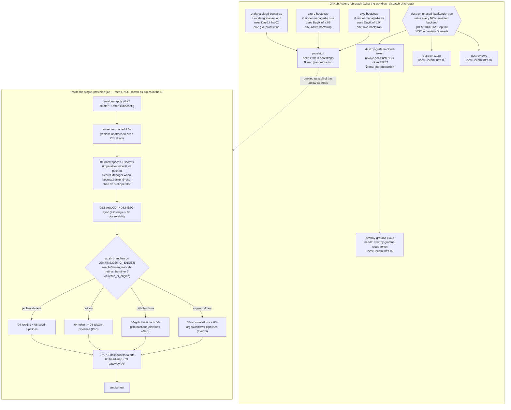

</details>

> **Approval gates (🔒).** Almost all jobs run under the **`gke-production`**
> GitHub Environment, which requires manual reviewer approval. Approvals are
> granted per environment per workflow run, so a user approves the workflow
> **exactly once** at the beginning, and all subsequent jobs (bootstraps, GKE
> provision, and token cleanups) proceed automatically without further human
> intervention. The two high-privilege cloud bootstraps run on their own
> environments — **AWS** (`Day0.infra.04` / `Decom.infra.04`) on `aws-bootstrap`
> and **Azure** (`Day0.infra.03` / `Decom.infra.03`) on `azure-bootstrap`, each
> isolating that credential's OIDC trust — but all three environments carry the
> **same reviewer**, and GitHub groups the pending ones into that single prompt,
> so they are approved together. See [102 § Environment Protection and Manual Approvals](./102-GITHUB_ACTIONS_AUTOMATION.md#environment-protection-and-manual-approvals).


### Why it's modelled this way (not as per-engine jobs)

| Choice | Modelled as | Why |
|---|---|---|
| Observability **backend** (grafana-cloud / azure / aws) | **Separate jobs** (`workflow_call`) | They are **persistent Day0 resources**, independently runnable on their own (`Day0.infra.0{2,3,4}`), and must run as a **preflight** so `provision` can read their Terraform outputs to build the in-cluster credentials Secret. Reusing them via `workflow_call` yields the graph nodes for free. |
| **CI engine** (jenkins / tekton / githubactions / argoworkflows) | **In-job branch** (`ci.engine` flag in `up.sh`) | Splitting `provision` into per-engine jobs would **duplicate the entire heavy preamble** (GCP auth, Terraform, kubeconfig, namespaces, ArgoCD, observability) for a one-line divergence. The feature-flag branch is the repo-wide pattern (same as `observability.mode`): one path, parameterised by config. |
| Observability **mode** wiring (beyond bootstrap) | **In-job** (`JENKINS2026_OBS_MODE` in `up.sh` + per-mode `values-*.yaml`) | Same reason — a config branch, not a structural one. |

So the run graph deliberately shows only the **structural** fan-in (the preflight backends) and folds every **configuration** choice into the single `provision` job. If you ever *wanted* the engine choice as boxes, you'd split `provision` into a shared-preamble job plus `if: ci_engine == …` deploy jobs (passing kubeconfig as an artifact) — possible, but a lot of duplication for a PoC, and it would break the "one idempotent provision" model described below.

---

### Observability mode → which workflows apply

This is the only diagram organized by `observability.mode` rather than by lifecycle phase. Pick your mode and read one row left-to-right: the **Day0** bootstrap it needs (if any), the **Day2.publish** that targets its Grafana, and the **backend Decom** that tears it down. Note the two deliberate no-ops — `oss` needs **no** Day0 backend and **no** backend Decom (its Grafana/Loki/Tempo stack lives in-cluster and is created by `Day1` via ArgoCD, then dies with the cluster on `Decom.cluster.01-gke`); `publish.05-alerts` is shared across every mode with a live Grafana.

<details>
<summary>📊 Observability mode → which Day0 / Day2.publish / Decom workflows apply (and which are no-ops)</summary>

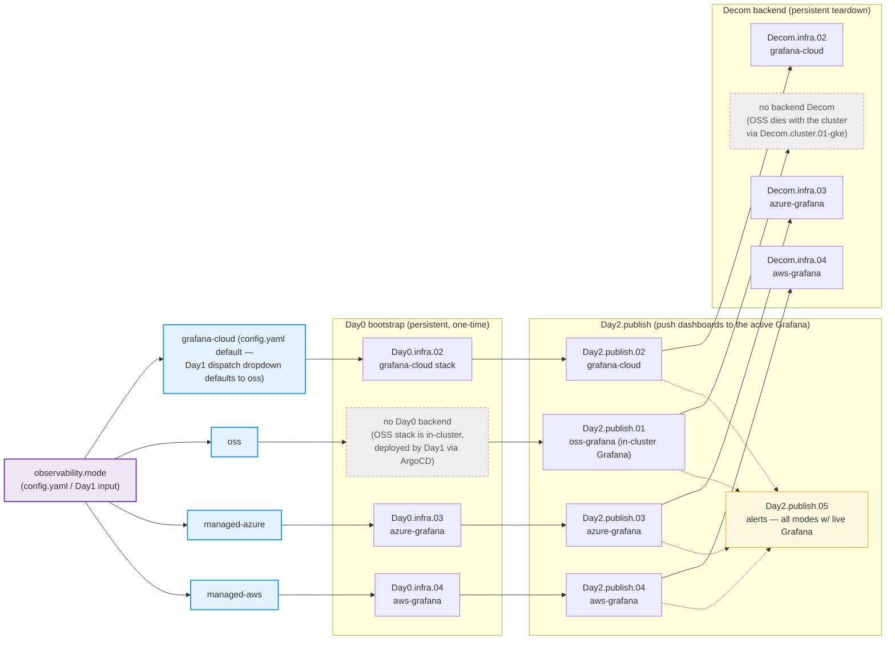

</details>

## Idempotency: every workflow is safe to re-run

**All workflows are idempotent (or one-shot-but-safe). Re-running is the normal way to apply a change — you never need to decommission and re-provision to pick one up.**

### `Day1.cluster.01-gke` is idempotent — re-run it to apply changes

`Day1.cluster.01-gke` is the headline case because it does the most. Re-running it on an **already-provisioned** cluster **converges in place**; it does not require (and is not improved by) a prior `Decom`. Three layers make this true:

1. **Terraform converges, it doesn't recreate.** `terraform apply` against the GCS remote state is a **no-op when the cluster already exists** in state — it reconciles to the desired state, creating nothing twice. The one `-target` apply (the Grafana Cloud dashboards SA token, applied before the full apply so the `grafana` provider can authenticate) is explicitly a no-op once that token is in state.
2. **`up.sh` re-applies every step idempotently.** Each `scripts/0N-*.sh` step uses converging primitives — `kubectl create … --dry-run=client -o yaml | kubectl apply -f -` for every Secret/ConfigMap/RoleBinding/ClusterRole, `helm upgrade --install` for every chart, and `kubectl apply` for manifests. Re-running re-asserts the desired state without "already exists" errors.
3. **ArgoCD re-syncs from git.** The GitOps-managed components (microservices, observability-oss, Tekton app-of-apps, Jenkins app, External Secrets, Headlamp) are reconciled by ArgoCD against the repo, so a `Day1` re-run (or even just a `kubectl annotate application <app> -n argocd argocd.argoproj.io/refresh=hard --overwrite`) pulls the latest committed manifests.

> **Consequence.** To apply a change: **re-run `Day1.cluster.01-gke`** on the existing cluster. For a CI-engine-only change, the lighter `Day2.redeploy.02-jenkins` / `Day2.redeploy.03-tekton` (or `.06-githubactions` / `.07-argoworkflows`) converge the same way. The Tekton/GHA/Argo redeploys also re-run `01-namespaces` + `08.6-eso-sync` + `09-gateway`, so public routes/IAP are re-asserted; the Jenkins redeploy re-applies only `04-jenkins` + `06-seed-pipelines` — use `Day2.redeploy.05-gateway` for route/IAP changes on a jenkins cluster. `Decom.cluster.01-gke` is **only** for tearing the cluster down when you are finished, to stop charges — it is not a prerequisite for changes. (Do still Decom an idle cluster: it is billed.)

### Per-workflow idempotency

Verdicts: **Idempotent** = converges to desired state, safe to re-run · **One-shot but safe** = an action (load test / dashboard publish) that simply repeats harmlessly, with no accumulation or error on re-run.

| Workflow | Verdict | Why |
|---|---|---|
| [`Day0.infra.01-gateway`](https://github.com/nubenetes/jenkins-2026/actions/workflows/Day0.infra.01-gateway.yml) | **Idempotent** | `terraform apply` on the gateway/IP/cert module (GCS state) converges. |
| [`Day0.infra.02-grafana-cloud`](https://github.com/nubenetes/jenkins-2026/actions/workflows/Day0.infra.02-grafana-cloud.yml) | **Idempotent** | `terraform apply`; the random stack slug is generated once and persisted in state, so re-applies reuse it. |
| [`Day0.infra.03-azure-grafana`](https://github.com/nubenetes/jenkins-2026/actions/workflows/Day0.infra.03-azure-grafana.yml) | **Idempotent** | `terraform apply` on the Azure backend (GCS state) converges. |
| [`Day0.infra.04-aws-grafana`](https://github.com/nubenetes/jenkins-2026/actions/workflows/Day0.infra.04-aws-grafana.yml) | **Idempotent** | `terraform apply` on the AWS backend (GCS state) converges. |
| [`Day1.cluster.01-gke`](https://github.com/nubenetes/jenkins-2026/actions/workflows/Day1.cluster.01-gke.yml) | **Idempotent** | `terraform apply` no-ops on an existing cluster; `up.sh` re-applies every step (`--dry-run\|apply`, `helm upgrade --install`); ArgoCD re-syncs. See above. |
| [`Day2.redeploy.01-argocd`](https://github.com/nubenetes/jenkins-2026/actions/workflows/Day2.redeploy.01-argocd.yml) | **Idempotent** | `08.5-argocd.sh` = `helm upgrade --install` + idempotent `kubectl apply` of the ArgoCD `Application`s. |
| [`Day2.redeploy.02-jenkins`](https://github.com/nubenetes/jenkins-2026/actions/workflows/Day2.redeploy.02-jenkins.yml) | **Idempotent** | `04-jenkins.sh` (`helm upgrade --install`, JCasC ConfigMaps via `--dry-run\|apply`) + `06-seed-pipelines.sh`. |
| [`Day2.redeploy.03-tekton`](https://github.com/nubenetes/jenkins-2026/actions/workflows/Day2.redeploy.03-tekton.yml) | **Idempotent** | `01`/`04-tekton`/`06-tekton-pipelines`/`09-gateway` — all `kubectl apply` / `--dry-run\|apply`; PaC webhook creation skips if one already targets the controller. |
| [`Day2.redeploy.04-headlamp`](https://github.com/nubenetes/jenkins-2026/actions/workflows/Day2.redeploy.04-headlamp.yml) | **Idempotent** | `01-namespaces.sh` + `08-headlamp.sh` (`helm upgrade --install`). |
| [`Day2.redeploy.05-gateway`](https://github.com/nubenetes/jenkins-2026/actions/workflows/Day2.redeploy.05-gateway.yml) | **Idempotent** | `01-namespaces.sh` (namespaces + IAP Secrets) + `09-gateway.sh` (Gateway/HTTPRoutes/GCPBackendPolicies, all `kubectl apply`). |
| [`Day2.redeploy.06-githubactions`](https://github.com/nubenetes/jenkins-2026/actions/workflows/Day2.redeploy.06-githubactions.yml) | **Idempotent** | `01`/`04-githubactions`/`06-githubactions-pipelines`/`08.6`/`09-gateway` — all `kubectl apply` / `helm upgrade --install`; fork-workflow rendering overwrites in place. |
| [`Day2.redeploy.07-argoworkflows`](https://github.com/nubenetes/jenkins-2026/actions/workflows/Day2.redeploy.07-argoworkflows.yml) | **Idempotent** | `01`/`04-argoworkflows`/`06-argoworkflows-pipelines`/`08.6`/`09-gateway` — same apply-based pattern. |
| [`Day2.publish.01-oss-grafana`](https://github.com/nubenetes/jenkins-2026/actions/workflows/Day2.publish.01-oss-grafana.yml) | **Idempotent** | Nudges the `observability-oss` app re-sync (`kubectl annotate --overwrite`), which reconciles the GitOps-managed dashboards child app + republishes alerts. |
| [`Day2.publish.02-grafana-cloud`](https://github.com/nubenetes/jenkins-2026/actions/workflows/Day2.publish.02-grafana-cloud.yml) | **One-shot but safe** | `07`/`07.5` re-publish via the Grafana HTTP API (`overwrite: true` / upserts). |
| [`Day2.publish.03-azure-grafana`](https://github.com/nubenetes/jenkins-2026/actions/workflows/Day2.publish.03-azure-grafana.yml) | **One-shot but safe** | Publishes via the AMG data-plane Grafana API (`POST /api/dashboards/db`, `overwrite: true`; instance discovered by `az grafana list`, deliberately not `az grafana dashboard create`) — re-publishes cleanly, no error/dup on re-run. |
| [`Day2.publish.04-aws-grafana`](https://github.com/nubenetes/jenkins-2026/actions/workflows/Day2.publish.04-aws-grafana.yml) | **One-shot but safe** | `07-grafana-dashboards.sh` re-publishes to AMG; no accumulation. |
| [`Day2.publish.05-alerts`](https://github.com/nubenetes/jenkins-2026/actions/workflows/Day2.publish.05-alerts.yml) | **Idempotent** | `07.5-grafana-alerts.sh` uses Grafana's provisioning API (contact points / rules / policies are upserts). |
| [`Day2.traffic.01-k6`](https://github.com/nubenetes/jenkins-2026/actions/workflows/Day2.traffic.01-k6.yml) | **One-shot but safe** | Runs a k6 load test; re-running just runs another test (each uploads its own artifact). |
| [`Day2.traffic.02-rum`](https://github.com/nubenetes/jenkins-2026/actions/workflows/Day2.traffic.02-rum.yml) | **One-shot but safe** | Re-running just emits another batch of synthetic Faro beacons. |
| [`Day2.scale.01-pause`](https://github.com/nubenetes/jenkins-2026/actions/workflows/Day2.scale.01-pause.yml) / [`Day2.scale.02-resume`](https://github.com/nubenetes/jenkins-2026/actions/workflows/Day2.scale.02-resume.yml) | **Idempotent** | `gcloud` autoscaling/resize converge; resume's recovery pass is a no-op on a clean resume. |
| [`Day2.registry.01-image-retention`](https://github.com/nubenetes/jenkins-2026/actions/workflows/Day2.registry.01-image-retention.yml) | **Idempotent** | Prune converges — deletes only untagged manifests beyond `keep`; nothing left to delete on re-run. |
| [`Decom.cluster.01-gke`](https://github.com/nubenetes/jenkins-2026/actions/workflows/Decom.cluster.01-gke.yml) | **Idempotent** | `terraform destroy` no-ops when already gone; `down.sh` uses `--ignore-not-found` / `\|\| true` throughout. |
| [`Decom.infra.01-gateway`](https://github.com/nubenetes/jenkins-2026/actions/workflows/Decom.infra.01-gateway.yml) | **Idempotent** | `terraform destroy` on the gateway module is a no-op once destroyed. |
| [`Decom.infra.02-grafana-cloud`](https://github.com/nubenetes/jenkins-2026/actions/workflows/Decom.infra.02-grafana-cloud.yml) | **Idempotent** | Applies first to drop delete-protection, then `terraform destroy`; both converge. |
| [`Decom.infra.03-azure-grafana`](https://github.com/nubenetes/jenkins-2026/actions/workflows/Decom.infra.03-azure-grafana.yml) | **Idempotent** | Pre-destroy cleanup guarded with `\|\| true`; `terraform destroy` tolerates absent resources. |
| [`Decom.infra.04-aws-grafana`](https://github.com/nubenetes/jenkins-2026/actions/workflows/Decom.infra.04-aws-grafana.yml) | **Idempotent** | `terraform destroy` on the AWS backend converges. |

### Should every workflow be *converging*-idempotent?

No — and the split above is by design, not an oversight:

- **State-managing workflows must converge, and all do.** `Day0`/`Day1` (provision), the `Day2.redeploy.*` (re-deploy a component), and the `Decom.*` (teardown) all describe a *desired state*; re-running them must reconcile to it without erroring or duplicating — which they do (Terraform `apply`/`destroy` on remote state, `kubectl --dry-run|apply` / `--ignore-not-found`, `helm upgrade --install`).
- **Action workflows are correctly one-shot, not converging.** `Day2.traffic.01-k6` (run a load test) and `Day2.publish.03/04` (publish dashboards) are *actions*, not state. "Converging" a load test is meaningless — the right property for an action is that **repeating it is harmless** (no error, no accumulation, no orphaning), which holds: k6 just runs again (each run uploads its own artifact), and the dashboard publishes use `--overwrite`. Forcing them into a "converge" model would add complexity for no benefit.

So the correct bar is **"safe to re-run"**, which every workflow meets; full state-convergence is required only of the state-managing ones, and there it is met universally.

**No non-idempotent workflow exists in the repo.** The invariants that guarantee this — and that any new workflow/script must preserve — are:

- **Terraform**: `apply`/`destroy` against remote GCS state converge; any randomness (e.g. the Grafana Cloud slug) is persisted in state, never regenerated. Avoid create-before-destroy patterns and un-stored random values.
- **Kubernetes**: never a bare `kubectl create` or `helm install`. Use `kubectl create … --dry-run=client -o yaml | kubectl apply -f -`, `kubectl apply`, `helm upgrade --install`, and `kubectl delete --ignore-not-found` (or `|| true`) for teardown.
- **External APIs**: prefer upsert/overwrite (`az … --overwrite`, Grafana provisioning API, "skip if the webhook already exists") over blind create.

This is the workflow-level expression of the repo-wide **idempotency** convention in [`CLAUDE.md`](../CLAUDE.md) ("every `scripts/0N-*.sh` step and Terraform module should be safe to re-run").

---

## Image retention (`registry` tier)

`Day2.registry.01-image-retention` prunes ghcr with **two different jobs for two different tagging models** (found live 2026-07-13 that a single one-size policy doesn't fit both):

- **`prune` (matrix: `gateway`/`jhipstersamplemicroservice`)** — **untagged (dangling) manifests only** (`delete-only-untagged-versions: true`); tagged versions never expire (rebuild-safety: a fresh Day1 deploys the tag pinned in the persistent gitops-config repo *without* rebuilding, so pruning a still-pinned tag would ImagePullBackOff on rebuild). The immutable per-build tags (`<branch>-<build#>-<sha8>` for Jenkins — the app-source SHA appended so an ephemeral Jenkins home's reset `BUILD_NUMBER` can never collide — and `<branch>-<pipelineRunName>` for Tekton; see [502](./502-MICROSERVICES_GITOPS.md)) accumulate one tag per build, and overwrites/retags leave dangling manifests behind — those are what get swept.
- **`prune-backstage`** — a genuinely different policy, because Backstage's tagging is the *opposite* shape: `backstage.image.tag` auto-tracks the deploy branch by default (a **moving** tag, not a frozen GitOps pin — [505](./505-BACKSTAGE.md#scorecard-tab-entity-kpis)), so old `sha-<sha>` versions stay **fully tagged forever** (confirmed live: 24 tagged, 0 untagged) — `delete-only-untagged-versions` would find nothing to prune, ever. This job instead **keeps by count** and protects live references by resolving each protected tag (`main`, `develop`, plus any durable `backstage.image.tag` pin committed in `config/config.yaml` on either branch) to its **current manifest digest** before pruning — `ignore-versions` on a container package regex-matches the version's digest, not any of its tags (a confirmed upstream limitation, [actions/delete-package-versions#88](https://github.com/actions/delete-package-versions/issues/88)), so protecting by tag *name* would silently protect nothing. The job fails closed (errors out rather than pruning) if it resolves zero protected digests. A one-off `JENKINS2026_BACKSTAGE_IMAGE_TAG` dispatch-input pin has no durable record for this job to read — a documented, accepted gap, not an oversight.

Weekly cron + manual dispatch; inputs `keep` (most-recent versions to retain per image — **untagged** for the microservices job, **total tagged minus protected** for the backstage job — default 30) and `dry_run`. `registry` is a pure **GitHub Packages** operation (no GKE, so no `jenkins-2026-gke` concurrency group — its own `jenkins-2026-image-retention`) with no Day0/Decom counterpart.

---

[← Previous: 100. Bootstrap](./100-BOOTSTRAP.md) | [🏠 Home](../README.md) | [→ Next: 102. GitHub Actions Automation](./102-GITHUB_ACTIONS_AUTOMATION.md)

---

*101. GitHub Actions Workflows — jenkins-2026*
