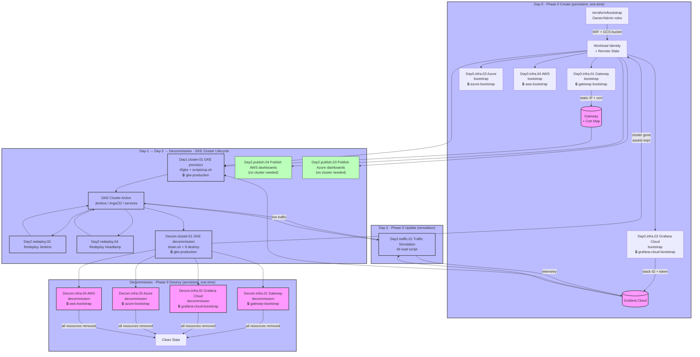

[← Previous: 101. GitHub Actions Workflows](./101-GITHUB_ACTIONS_WORKFLOWS.md) | [🏠 Home](../README.md) | [→ Next: 103. Secrets Inventory](./103-GITHUB_SECRETS_INVENTORY.md)

---

# 102. GitHub Actions Automation

[`Day1.cluster.01-gke.yml`](https://github.com/nubenetes/jenkins-2026/actions/workflows/Day1.cluster.01-gke.yml) and
[`Decom.cluster.01-gke.yml`](https://github.com/nubenetes/jenkins-2026/actions/workflows/Decom.cluster.01-gke.yml)
are the CI equivalent of `test/e2e.sh`, split into two manually-triggered
workflows so the cluster can be left running between them (e.g. provision in
the morning, demo it, decommission in the evening). They run the exact same
`terraform/gke` + `scripts/0N-*.sh` + `test/smoke-test.sh` as `test/e2e.sh`,
but since each is a separate workflow run on a fresh runner, Terraform state
has to be **remote** (a GCS bucket) instead of local so the decommission run
can find what the provision run created.

## Bootstrapping Architecture: Persistent vs. Short-Lived Resources

To keep operating costs low and deployment speed high, this project separates the environment lifecycle into **short-lived workload resources** (GKE cluster, database pods, Helm releases) and **persistent, account-level resources (bootstrap)**. We use specialized bootstrap stages for the following reasons:

1. **GCP Auth and Terraform State (`terraform/bootstrap`)**:
   - **Workload Identity Federation (WIF)**: Establishes a secure, keyless trust relationship between GitHub Actions and your GCP project. GitHub can authenticate dynamically using OpenID Connect (OIDC) tokens instead of saving permanent GCP service account JSON keys inside repository secrets.
   - **GCS Remote Backend**: Sets up the persistent bucket where all GHA workflow runs store and retrieve Terraform state.

2. **Persistent External DNS & Networking (`Day0.infra.01 Gateway bootstrap`)**:
   - Provisions GCP global networking resources: a persistent static IP (`jenkins-2026-gateway-ip`), DNS authorizations, and the wildcard SSL certificate map (`jenkins-2026-cert-map`).
   - If these networking assets were tied to the short-lived GKE cluster, deleting the cluster would release the IP address and destroy the SSL certificate. This would force you to manually update DNS records at your domain registrar (e.g. Squarespace) and wait for DNS propagation every single time you provisioned a new cluster. Keeping the gateway bootstrapped persistently ensures your external endpoints are immediately reachable upon cluster creation.

3. **Persistent Observability Backend (`Day0.infra.02 Grafana Cloud bootstrap`)**:
   - Applies the Grafana Cloud stack (`terraform/grafana-cloud-stack`, generated slug). By decoupling the metrics/tracing backend from the GKE cluster, your logs, metrics, and trace history survive multiple cluster spin-ups and tear-downs (the GKE decommission `Decom.cluster.01` leaves the stack intact; only `Decom.infra.02` destroys it).

4. **Persistent Database Backups Storage (`terraform/bootstrap`)**:
   - **Postgres Backups Bucket**: Configures the persistent GCS bucket `jenkins-2026-postgres-backups` with automated storage lifecycles (transition to `NEARLINE` after 3 days, delete after 7 days) to preserve backup histories across throwaway GKE lifecycle runs.
   - **Access Security**: Grants the GHA CI service accounts `storage.admin` permissions to manage bucket-level IAM policy bindings, enabling dynamic node service account access configuration during GKE provision runs.

## Workflow Architecture & Lifecycle Diagram

The following diagram illustrates how the persistent infrastructure bootstrap workflows, the GKE cluster provisioning/decommissioning pipelines, the application-specific redeployments, and the traffic simulation workflow interact:

<details>
<summary>🔍 Click to expand Workflow Architecture & Lifecycle Diagram</summary>



</details>

> 🔒 = a required-reviewer GitHub **Environment** gate. Each persistent Day0
> resource has its **own** (`gateway-bootstrap`, `grafana-cloud-bootstrap`,
> `azure-bootstrap`, `aws-bootstrap`); `gke-production` gates the cluster and all
> Day2 cluster-ops. See [Environment Protection and Manual Approvals](#environment-protection-and-manual-approvals).

> The four persistent teardowns (`Decom.infra.01..04`) are independent — for a **targeted** teardown run **only** the one(s) you actually provisioned (with the `oss` default, often none), after `Decom.cluster.01`. For a **full** teardown, the opt-in **`Decom.infra.00` ("Everything")** umbrella tears down the cluster **and** every persistent backend in one dispatch (reuses each per-resource Decom via `workflow_call`; type `destroy` to confirm; cluster first, then backends in parallel; backends default on, Gateway IP default off). See [101 § Decom: independent per backend, plus an opt-in umbrella](./101-GITHUB_ACTIONS_WORKFLOWS.md#decom-independent-per-backend-plus-an-opt-in-everything-umbrella).

> **What `Day1.cluster.01` bootstraps automatically — and what it does not.**
> `Day1` runs the matching **observability backend** bootstrap as a preflight job
> (`Day0.infra.0{2,3,4}` via `workflow_call`, gated by `if: observability_mode==…`),
> so the selected backend is created for you. It does **not** bootstrap the
> **Gateway**: `Day0.infra.01` is a one-time Day0 step that creates the
> **DNS-coupled** persistent resources (static IP you wire into your DNS A-records,
> wildcard cert map). Inside `provision`, `scripts/09-gateway.sh` only creates the
> **in-cluster** `Gateway`/`HTTPRoute` objects, which **reference** that static IP +
> cert map **by name** — it does not create them.
>
> **Why the asymmetry:** the Gateway IP/cert are meant to **survive cluster
> rebuilds** (so DNS never has to re-propagate). That is exactly why the
> `Decom.infra.00` umbrella leaves the Gateway in place by default (`gateway:false`)
> — so the normal "everything decommissioned" state still has the Gateway, and a
> later `Day1` simply re-binds the in-cluster objects to the existing IP. You only
> need to (re-)run `Day0.infra.01` **before** `Day1` if you destroyed the Gateway
> **deliberately** (standalone `Decom.infra.01`, or the umbrella with
> `gateway:true`). If `gateway.baseDomain` is empty, `09-gateway.sh` skips the
> Gateway entirely.

> **One-click from scratch.** To avoid having to remember the Gateway prerequisite,
> the **`Day1.cluster.00` ("Everything up")** umbrella does both steps in one
> dispatch — `Day0.infra.01` (Gateway bootstrap) **then** `Day1.cluster.01` (cluster
> + full stack + the chosen backend bootstrap). It is the symmetric counterpart of
> the `Decom.infra.00` ("Everything") teardown: **one click up, one click down**,
> both idempotent. See [101 § Provision umbrella](./101-GITHUB_ACTIONS_WORKFLOWS.md#provision-per-step-workflows-plus-an-opt-in-everything-up-umbrella).

### Detailed Workflow Reference and Lifecycle Management

> Each workflow is tagged with its **Day-0 / Day-1 / Day-2 / Decommission** lifecycle
> position (SRE taxonomy). See [101. Workflows → Day-0 / Day-1 / Day-2 operations](./101-GITHUB_ACTIONS_WORKFLOWS.md#day-0--day-1--day-2-operations)
> for the full definition and the per-workflow table. In short: **Day-0** = persistent
> bootstrap (`0.1.xx`), **Day-1** = GKE provision (`Day1.cluster.01`), **Day-2** = operations on
> the running cluster (`5.x`), **Decommission** = teardown (`9.x`).

#### 1. Persistent Bootstrap Workflows (Day-0)
- **`Day0.infra.01 Gateway bootstrap`**: Provisions account-level GCP networking assets using `terraform/gateway-bootstrap`. This includes a reserved external IP (`jenkins-2026-gateway-ip`), DNS authorizations, and a Google-managed wildcard SSL certificate map. Keeping this IP and SSL certificate persistent avoids losing the reserved IP during a GKE rebuild, eliminating the need to update wildcard DNS records at your domain registrar and wait for DNS propagation.
- **`Day0.infra.02 Grafana Cloud bootstrap`**: Provisions a dedicated Grafana Cloud stack (hosted metrics/traces/logs backend) using `terraform/grafana-cloud-stack`, with a Terraform-generated slug. By separating the observability backend from the short-lived GKE cluster, application performance metrics and history remain readable even after GKE is decommissioned and rebuilt — the stack lives until you run `Decom.infra.02 Grafana Cloud decommission`, which tears it down (the org/free tier is untouched).

#### 2. Persistent Decommission Workflows (Decommission · Clean Slate)
When you want to tear down the entire project permanently, you must run the decommission workflows in the reverse order of setup to avoid dangling resources:
1. Run **`Decom.cluster.01 GKE decommission`** first to destroy the active GKE cluster and all internal Kubernetes workloads (releasing short-lived target bindings).
2. Run **`Decom.infra.01 Gateway decommission`** to run `terraform destroy` on the gateway resources, freeing the reserved external IP, removing the wildcard SSL certificate map, and deleting GCP DNS authorizations.
3. Run **`Decom.infra.02 Grafana Cloud decommission`** to run `terraform destroy` on the Grafana Cloud stack, which removes the Grafana instances, access policies, and dashboards.

> [!WARNING]
> Decommissioning the gateway (`Decom.infra.01`) releases the external IP address. If you recreate the gateway later, a *new* IP will be allocated, forcing you to update your DNS provider's A records and wait for DNS propagation. Only decommission the gateway if you plan to shut down the environment permanently.

## Version Pinning and the `git_ref` Parameter

To support deterministic deployments and clean, error-free environment destruction, all GKE lifecycle workflows support custom Git reference checking:

* **Workflows Supported**:
  * [Day1.cluster.01 GKE provision](https://github.com/nubenetes/jenkins-2026/actions/workflows/Day1.cluster.01-gke.yml)
  * [Day2.redeploy.02 Redeploy Jenkins](https://github.com/nubenetes/jenkins-2026/actions/workflows/Day2.redeploy.02-jenkins.yml)
  * [Day2.redeploy.04 Redeploy Headlamp](https://github.com/nubenetes/jenkins-2026/actions/workflows/Day2.redeploy.04-headlamp.yml)
  * [Day2.publish.04 Publish AWS dashboards](https://github.com/nubenetes/jenkins-2026/actions/workflows/Day2.publish.04-aws-grafana.yml)
  * [Day2.publish.03 Publish Azure dashboards](https://github.com/nubenetes/jenkins-2026/actions/workflows/Day2.publish.03-azure-grafana.yml)
  * [Decom.cluster.01 GKE decommission](https://github.com/nubenetes/jenkins-2026/actions/workflows/Decom.cluster.01-gke.yml)

### The `git_ref` Parameter

Each of these workflows includes a manual trigger input `git_ref` (which defaults to `""` / empty).

* **Leave Empty (Recommended)**: The checkout action automatically defaults to the branch or tag selected in the native **"Use workflow from"** dropdown menu.
* **Provide Value**: You can type in any valid branch name, tag (e.g. `v0.9.1`), or commit SHA. If specified, this custom reference will override the dropdown selection.

### Form Fields Reference (Day1.cluster.01 GKE Provision)

When executing the **Day1.cluster.01 GKE provision** workflow manually, you are presented with a form containing the following fields:

1. **Use workflow from (Dropdown - Native)**:
   - Selects the branch or tag from which GitHub Actions loads the workflow YAML file.
   - If the `git_ref` field below is left empty, the runner will check out this exact reference.

2. **observability_mode (Dropdown - Choice)**:
   - **Type**: Choice (`oss` | `grafana-cloud` | `managed-azure` | `managed-aws`).
   - **Default**: `oss` (needs no external backend; `config/config.yaml`'s durable default is still `grafana-cloud` for local `up.sh`).
   - Overrides the `observability.mode` setting in `config/config.yaml` for this execution lifecycle. Exactly **one** backend is active per cluster and the choice is **deterministic/idempotent** (like `ci_engine`): a rerun with a different mode auto-retires the previously-deployed backend's in-cluster footprint and provisions the chosen one. See [301 § observability backends](301-OBSERVABILITY.md).

3. **secrets_backend (Dropdown - Choice)**:
   - **Type**: Choice (`imperative` | `eso`).
   - **Default**: `imperative` (behaviour unchanged — `kubectl create secret` from the GitHub secrets).
   - Overrides `secrets.backend`. `eso` pushes the secret values to **GCP Secret Manager** and the **External Secrets Operator** syncs them into the cluster via Workload Identity (keyless, versioned, audited). The whole `up.sh` lifecycle honours it. See [201 § Secrets backend](201-ARCHITECTURE.md#secrets-backend-imperative--eso).

4. **destroy_unused_backends (Checkbox - Boolean) — DESTRUCTIVE, opt-in**:
   - **Default**: `false`.
   - When `true`, also `terraform destroy` the **persistent** backend (Grafana Cloud stack / Azure / AWS Managed Grafana) of every mode you did **not** select, so only the chosen backend exists. Reuses the `Decom.infra.0{2,3,4}` workflows via `workflow_call`; independent of the cluster provision (a destroy of a never-provisioned backend can't block it).
   - ⚠ **Irreversible**: wipes that backend's history/dashboards; re-selecting the mode later recreates it empty. Needs the non-selected backends' credentials/identifiers configured.

5. **enable_gateway (Checkbox - Boolean)**:
   - **Default**: `true`.
   - Determines whether the public GKE Gateway L7 load balancer should be provisioned.
   - **Prerequisites**: Requires `Day0.infra.01 Gateway bootstrap` applied, wildcard DNS records, and IAP OAuth client credentials.

6. **git_ref (Text Box - String)**:
   - **Default**: `""` (empty).
   - Leave empty to use the **"Use workflow from"** dropdown selection.
   - Provide a branch name, tag, or SHA to override.

### ⚠️ The Danger of Divergent References

Mixing different tags, branches, or SHAs during the lifecycle of a single GKE cluster will cause deployment and state management failures:

1. **Terraform State Conflicts**: If you provision GKE using tag `v0.8.0` and later run the decommission workflow targeting `v0.9.0`, Terraform will compare the stored GCS backend state against updated node pool, VPC, or IAM definitions — causing plan mismatches or deletion failures.
2. **Helper Script & Template Divergence**: Platform components rely on configuration schemas in `config/config.yaml`. Mismatched versions can cause namespace naming conventions or credential key format differences.
3. **Application and Database Incompatibility**: Mismatched versions between the infra repo and the GitOps repo can cause pods to crash due to missing secrets or incorrect network policies.

> [!IMPORTANT]
> **Rule of lockstep alignment**:
> 1. Always ensure that the `git_ref` used for provisioning (`Day1.cluster.01`) matches the `git_ref` used for decommissioning (`Decom.cluster.01`) and redeployments (`Day2.redeploy.02` / `Day2.redeploy.04`).
> 2. For stable releases, tag both repositories in lockstep (e.g. `v0.9.0` tag in both `jenkins-2026` and `jenkins-2026-gitops-config`) and use that tag name in the `git_ref` parameter.

## Environment Protection and Manual Approvals

To enforce cost control (FinOps), auditability, and guard against accidental destruction of active resources, critical workflows are protected by a GitHub Actions environment:

There are **five** required-reviewer environments, so each approval maps to one
concern (and a Day1 run that touches a backend isn't double-prompted on the
cluster gate):

* **`gke-production`** — the cluster lifecycle plus every `Day2.*` operation:
  - `Day1.cluster.01 GKE provision`
  - `Decom.cluster.01 GKE decommission`
  - all `Day2.*` (redeploy / publish / traffic). Most act on the running cluster;
    the two managed-Grafana publishes (`Day2.publish.03/04`) need no cluster but
    share this gate for approval symmetry.
* **One environment per persistent Day0 resource** — used by **both** the
  bootstrap (`Day0.infra.0N`) and the decommission (`Decom.infra.0N`) of that
  resource, so its approval is independent of the cluster gate:
  - `Day0.infra.01` / `Decom.infra.01` Gateway → `gateway-bootstrap`
  - `Day0.infra.02` / `Decom.infra.02` Grafana Cloud → `grafana-cloud-bootstrap`
  - `Day0.infra.03` / `Decom.infra.03` Azure → `azure-bootstrap`
  - `Day0.infra.04` / `Decom.infra.04` AWS → `aws-bootstrap`

#### Why one environment per resource (design rationale)

Originally every gated workflow shared the single `gke-production` environment.
Splitting it into one environment **per persistent Day0 resource** (plus
`gke-production` for the cluster) buys three things:

1. **One approval = one concern.** Approving "destroy the Grafana Cloud stack" no
   longer reads as (or is logged as) approving a change to the **GKE production
   cluster**. The audit trail names the actual resource.
2. **No duplicate prompts in a single run.** A `Day1.cluster.01` run with
   `destroy_unused_backends=true` invokes a backend's *destroy* reusable workflow
   **and** the `provision` job. When the backend reused `gke-production`, that one
   environment was approved **twice** in the same run (once for the destroy, once
   for provision — observed in run `28195110914`). With per-resource gates each
   prompt is distinct and `gke-production` is approved once, for the cluster.
3. **The gate travels with the reusable workflow, not the caller.** Each
   `Day0.infra.0N` / `Decom.infra.0N` declares its `environment:` on the job
   itself. So **every** entry point that `uses:` it inherits the same single gate:
   the standalone dispatch, the `Day1` bootstrap *preflight* (`Day0.infra.0N` via
   `workflow_call`), and the **`Decom.infra.00` "Everything" umbrella**. There is
   never a second, divergent place to configure approval.

> **Decommissioning the Gateway — which workflow?** Either path runs the **same**
> reusable `Decom.infra.01-gateway.yml`, so the **`gateway-bootstrap`** approval is
> identical regardless of how you start it:
> - **Standalone**: dispatch **`Decom.infra.01 Gateway decommission`** directly —
>   the normal way to retire just the Gateway.
> - **Umbrella**: **`Decom.infra.00` ("Everything")** *can* destroy the Gateway,
>   but its `gateway` input **defaults to `false`** (destroying the Gateway loses
>   the static IP and forces DNS re-propagation). The umbrella tears down the
>   cluster + observability backends by default and only touches the Gateway when
>   you explicitly set `gateway: true`.
>
> In other words: a routine full teardown leaves the persistent Gateway IP/cert in
> place; you destroy the Gateway **deliberately**, via `Decom.infra.01` (or the
> umbrella's opt-in toggle), and it is gated by `gateway-bootstrap` either way.

### Setting up Environment Rules

**Option A: Manual Setup (GitHub Web UI)**
1. Navigate to **Settings** -> **Environments** on your GitHub repository.
2. Click **New environment** and name it exactly: `gke-production`.
3. Under **Environment protection rules**, check the **Required reviewers** box.
4. Add the designated reviewers who must authorize deployments.
5. Save the configuration.

**Option B: Automated Setup (GitHub CLI)**
```bash
# Get the numeric GitHub ID of the reviewer user
gh api user -q '.id'

# Create or update the environment with the reviewer
gh api --method PUT repos/nubenetes/jenkins-2026/environments/gke-production \
  --header "Accept: application/vnd.github+json" \
  --input - <<EOF
{
  "prevent_self_review": false,
  "reviewers": [
    {
      "type": "User",
      "id": <USER_ID>
    }
  ]
}
EOF
```

> Repeat the same `PUT .../environments/<name>` for the four per-resource Day0
> environments — `gateway-bootstrap`, `grafana-cloud-bootstrap`, `azure-bootstrap`,
> `aws-bootstrap` — so each persistent Day0 resource has its own approval gate.

## One-time Setup (Bootstrapping)

> **Fastest path — one command:** `./scripts/bootstrap.sh up` does everything in
> this section for you (prompts for identity, creates the bucket + WIF + CI SA,
> migrates its own state into the bucket, and sets the 4 GitHub secrets), and
> `./scripts/bootstrap.sh down` is the symmetric root teardown. See the full,
> beginner-friendly walkthrough with diagrams in [100. Bootstrap](./100-BOOTSTRAP.md).
> The manual steps below are the equivalent if you prefer to run them by hand.

> **Why this step can't itself run in GitHub Actions**: `Day1.cluster.01-gke.yml`
> and `Decom.cluster.01-gke.yml` authenticate to GCP via Workload Identity
> Federation (WIF) — but that WIF trust relationship, the CI service account,
> and the GCS state bucket don't exist yet. Something has to create them
> first using *real* GCP credentials, which is exactly what
> `terraform/bootstrap` does. This is a one-time, local "break glass" step;
> every run after that happens entirely in GitHub Actions.

1. **Authenticate locally** as a principal with `roles/owner` (or
   `roles/editor` + `roles/resourcemanager.projectIamAdmin`) on your GCP project:

   ```bash
   gcloud auth login
   gcloud auth application-default login
   ```

2. **Run `terraform/bootstrap`** once. This creates the GCS state bucket and
   a Workload Identity Federation pool/provider + service account that
   GitHub Actions will use to authenticate to GCP **without a JSON key**:

   ```bash
   cd terraform/bootstrap
   cp terraform.tfvars.example terraform.tfvars
   # edit terraform.tfvars: set project_id (and github_repo if you forked this repo)

   terraform init
   terraform apply
   terraform output    # copy these 4 values into GitHub secrets below
   ```

   Keep `terraform/bootstrap/terraform.tfstate` (gitignored, local-only) —
   it's the only record of these resources.

3. **Add repository secrets**, from the `terraform output` above:

   | Secret | From output |
   |---|---|
   | `GCP_PROJECT_ID` | `project_id` |
   | `GCP_WORKLOAD_IDENTITY_PROVIDER` | `workload_identity_provider` |
   | `GCP_SERVICE_ACCOUNT` | `ci_service_account_email` |
   | `TF_STATE_BUCKET` | `state_bucket` |

   ```bash
   cd terraform/bootstrap
   gh secret set GCP_PROJECT_ID                --body "$(terraform output -raw project_id)"
   gh secret set GCP_WORKLOAD_IDENTITY_PROVIDER --body "$(terraform output -raw workload_identity_provider)"
   gh secret set GCP_SERVICE_ACCOUNT           --body "$(terraform output -raw ci_service_account_email)"
   gh secret set TF_STATE_BUCKET               --body "$(terraform output -raw state_bucket)"
   ```

4. **Optional secrets**, only needed if you use the corresponding feature:

   | Secret | Needed for |
   |---|---|
   | `REGISTRY_USERNAME` / `REGISTRY_PASSWORD` | pushing/pulling private microservice images from a private registry |
   | `GIT_USERNAME` / `GIT_TOKEN` | cloning a private Microservices fork |
   | `GRAFANA_TRACES_DASHBOARD_UID` / `OTEL_LOGS_BACKEND_URL` | `observability_mode: grafana-cloud` extras — "View trace in Grafana" link UID and logs Explore URL |
   | `GRAFANA_ALERT_EMAIL_GRAFANA_CLOUD` | Alert notification email for `grafana-cloud` mode — **must be a member of the Grafana Cloud org** (Grafana Cloud rejects contact points addressed to non-members; set this when it differs from `JENKINS_OIDC_ADMIN_EMAIL`) |
   | `GRAFANA_ALERT_EMAIL_OSS` | Alert notification email for `oss` mode — overrides the cluster default; omit to use `JENKINS_OIDC_ADMIN_EMAIL` |
   | `GRAFANA_ALERT_EMAIL_MANAGED_AZURE` | Alert notification email for `managed-azure` mode — overrides the cluster default; omit to use `JENKINS_OIDC_ADMIN_EMAIL` |
   | `GRAFANA_ALERT_EMAIL_MANAGED_AWS` | Alert notification email for `managed-aws` mode — overrides the cluster default; omit to use `JENKINS_OIDC_ADMIN_EMAIL` |
   | `GRAFANA_ALERT_EMAIL` | Generic alert email fallback for all modes — used only when the mode-specific secret above is not set; omit if `JENKINS_OIDC_ADMIN_EMAIL` is correct for all modes |
   | `HEADLAMP_OIDC_CLIENT_ID` / `HEADLAMP_OIDC_CLIENT_SECRET` | Google OAuth client for Headlamp login |
   | `HEADLAMP_ADMIN_EMAILS` | comma-separated Google account emails granted cluster-admin via Headlamp **and** IAP access — **your own email, never committed to the repo** |
   | `JENKINS_OIDC_CLIENT_ID` / `JENKINS_OIDC_CLIENT_SECRET` | Google OAuth client for Jenkins "Sign in with Google" |
   | `JENKINS_OIDC_ADMIN_EMAIL` | Google account email granted the Jenkins `admin` role via OIDC — **your own email, never committed to the repo** |
   | `IAP_OAUTH_CLIENT_ID` / `IAP_OAUTH_CLIENT_SECRET` | OAuth client gating Jenkins/Headlamp via Identity-Aware Proxy |
   | `AZURE_CLIENT_ID` / `AZURE_TENANT_ID` / `AZURE_SUBSCRIPTION_ID` / `AZURE_GRAFANA_ADMIN_OBJECT_IDS` | `observability_mode: managed-azure` — identifiers only, no secret values |
   | `AWS_BOOTSTRAP_ROLE_ARN` / `AWS_REGION` (repo **Variable**) / `GKE_OIDC_ISSUER_URL` | `observability_mode: managed-aws` — identifiers only, no secret values. `AWS_REGION` is a GitHub Actions **Variable** (not a Secret) so its value isn't masked inside the Amazon Managed Grafana URL; workflows read `vars.AWS_REGION` with a `secrets.AWS_REGION` fallback. |
   | `AWS_DASHBOARD_PUBLISH_ROLE_ARN` | `observability_mode: managed-aws` — least-privilege IAM role for dashboard publishing |

5. **(Optional) Full Grafana Cloud lifecycle automation** — for `observability_mode: grafana-cloud`:

   a. **Create a Grafana Cloud Access Policy token** (Grafana Cloud Portal -> **Administration** ->
      create an access policy with scopes: `stacks:read/write/delete`, `accesspolicies:read/write/delete`,
      `stack-service-accounts:write`, `datasources:read/write`, `pdc:read/write`, `stack-plugins:read/write`).
      Create a **Token** for this policy and save it.

   b. **Add the repository secret** (the stack slug is generated by Terraform, so
      it is no longer set here):
      ```bash
      gh secret set GRAFANA_CLOUD_API_TOKEN --body "<token from step a>"
      ```

   c. **Run the "Day0.infra.02 Grafana Cloud bootstrap" workflow** (Actions tab →
      **Day0.infra.02 Grafana Cloud bootstrap** → **Run workflow**).

6. **(Optional) Azure backend** for `observability_mode: managed-azure`:

   a. **Create the GitHub-OIDC Entra app** (one-time manual step):
      ```bash
      SUB="<your-subscription-id>"; REPO="<owner>/<repo>"
      APP_ID=$(az ad app create --display-name "jenkins-2026-github-oidc" --query appId -o tsv)
      az ad sp create --id "$APP_ID"
      az ad app federated-credential create --id "$APP_ID" --parameters \
        "{\"name\":\"github-azure-bootstrap\",\"issuer\":\"https://token.actions.githubusercontent.com\",\"subject\":\"repo:${REPO}:environment:azure-bootstrap\",\"audiences\":[\"api://AzureADTokenExchange\"]}"
      az role assignment create --assignee "$APP_ID" --role "Contributor"               --scope "/subscriptions/${SUB}"
      az role assignment create --assignee "$APP_ID" --role "User Access Administrator" --scope "/subscriptions/${SUB}"
      ```

   b. **Set the identifier secrets** (no secret values — just IDs):
      ```bash
      gh secret set AZURE_CLIENT_ID                --body "$APP_ID"
      gh secret set AZURE_TENANT_ID               --body "$(az account show --query tenantId -o tsv)"
      gh secret set AZURE_SUBSCRIPTION_ID         --body "$SUB"
      gh secret set AZURE_GRAFANA_ADMIN_OBJECT_IDS --body "$(az ad signed-in-user show --query id -o tsv)"
      ```

   c. **Run the "Day0.infra.03 Azure managed-grafana bootstrap" workflow**.

## Running the GKE Workflows

1. Go to the repo's **Actions** tab → **Day1.cluster.01 GKE provision** → **Run
   workflow**. Pick `observability_mode`. `enable_gateway` defaults to **checked**
   — this project's intended public access path. **Uncheck it only** for a fresh
   environment where the one-time **Day0.infra.01 Gateway bootstrap** + DNS records +
   IAP OAuth client haven't been done yet.
2. Wait ~15-20 minutes. The job summary prints the cluster name/zone and a
   reminder to decommission when done.
3. To redeploy only Jenkins between provision/decommission cycles, use
   **Actions** → **Day2.redeploy.02 Redeploy Jenkins** → **Run workflow**.
4. When finished, use **Actions** → **Decom.cluster.01 GKE decommission** → **Run workflow**.

These three workflows share a `concurrency: group: jenkins-2026-gke`, so
GitHub Actions queues them rather than letting them race on the same
Terraform state. **Always run decommission when you're done** — an
abandoned cluster keeps billing.

---

[← Previous: 101. GitHub Actions Workflows](./101-GITHUB_ACTIONS_WORKFLOWS.md) | [🏠 Home](../README.md) | [→ Next: 103. Secrets Inventory](./103-GITHUB_SECRETS_INVENTORY.md)

---

*102. GitHub Actions Automation — jenkins-2026*
