[← Previous: 103. Secrets Inventory](./103-GITHUB_SECRETS_INVENTORY.md) | [🏠 Home](../README.md) | [→ Next: 202. Microservices App Architecture](./202-MICROSERVICES-APP-ARCHITECTURE.md)

---

# 201. Architecture

## Overview

`jenkins-2026` deploys a self-contained CI/CD + observability proof-of-concept on top of an **existing** GKE cluster:

- **Jenkins** (jenkinsci/helm-charts), configured entirely via Configuration-as-Code (JCasC) — no manual clicking required.
- **Pipelines as code**: a Job DSL "seed job" generates stable Jenkins Pipeline jobs (`gateway`, `jhipstersamplemicroservice`, `microservices-k6-smoke`) targeting the `microservices` namespace.
- **Spring Microservices + Angular UI**, deployed by those pipelines via a single parameterized Helm chart.
- **OpenTelemetry** end to end: Jenkins, the Java services (OTel Operator auto-instrumentation), and the Angular UI (RUM snippet) all export traces/metrics/logs to an in-cluster OTel Collector, forwarding to **Grafana Cloud** (default) or an in-cluster OSS stack.
- **ArgoCD (GitOps)**: The entire Microservices stack is managed declaratively by ArgoCD, integrated with Google OIDC for SSO.
- **CloudNative-PG (CNPG)**: HA **PostgreSQL 18.3** clusters (3 instances: 1 primary + 2 replicas; the image is **pinned** via the chart's `spec.imageName`) provisioned via CNPG CRDs, with PgBouncer connection pooling. *(The chart + `Cluster`/`Pooler` CRs live in the [gitops-config repo](https://github.com/nubenetes/jenkins-2026-gitops-config), not this one.)*

> **Two-repo GitOps setup.** This is the **infra repo** (cluster bootstrap, Jenkins, ArgoCD, observability). Image tags and ArgoCD manifests live in the companion **[`nubenetes/jenkins-2026-gitops-config`](https://github.com/nubenetes/jenkins-2026-gitops-config)** repo.

## Understanding the architecture (newcomers → specialists)

One file (`config/config.yaml`) drives everything, three feature flags pick the variant, and the rest is GitOps. Read this once and every section below is "where each piece lives".

<details>
<summary>🧠 System mental model (mindmap)</summary>

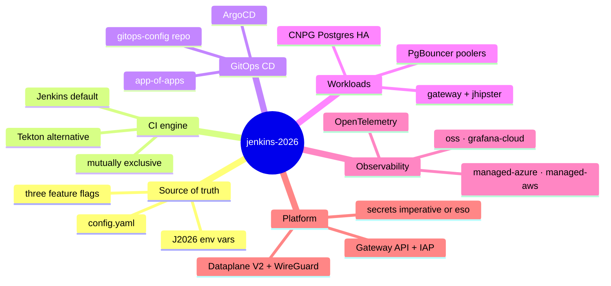

</details>

**Reading it —** the six branches are the planes the rest of this doc details: a single **source of truth** (`config.yaml` → `J2026_*` env via [`scripts/lib/config.sh`](../scripts/lib/config.sh)), a pick-one **CI engine**, **ArgoCD** as the always-on GitOps CD, the **workloads** (the two JHipster services + their HA CNPG Postgres), **OpenTelemetry** flowing to one of four backends, and the **platform** layer (ingress/IAP, Dataplane V2, pluggable secrets). The three feature flags — `ci.engine`, `observability.mode`, `secrets.backend` — are the only knobs that change the shape.

<details>
<summary>🟢 For newcomers — what this deploys</summary>

| Piece | In plain terms |
|---|---|
| **Single source of truth** | `config/config.yaml` holds every setting; scripts load it as `J2026_*` env vars. Change config, re-run — no hand-editing manifests. |
| **CI** | **Jenkins** (default) — or **Tekton** — builds each service, pushes the image to GHCR, then **commits the new image tag** to the GitOps repo. |
| **CD (GitOps)** | **ArgoCD** watches the GitOps repo and reconciles the cluster to match it. CI never `kubectl apply`s the apps. |
| **Apps** | Two JHipster services — `gateway` (Spring Boot + Angular UI) and `jhipstersamplemicroservice` — each with a 3-node **HA Postgres** (CloudNative-PG) behind a PgBouncer pooler. |
| **Observability** | Everything emits **OpenTelemetry** (traces/metrics/logs) to an in-cluster collector, which forwards to one of four backends. |
| **Three switches** | `ci.engine` (jenkins\|tekton), `observability.mode` (oss\|grafana-cloud\|managed-azure\|managed-aws), `secrets.backend` (imperative\|eso) — each deterministic & idempotent. |

</details>

<details>
<summary>🔴 For specialists — how the pieces are wired</summary>

- **Two-repo GitOps**: this **infra repo** (bootstrap, Jenkins/Tekton, ArgoCD, observability) vs the **gitops-config repo** (microservices Helm + CNPG manifests + image tags). CI writes tags into the latter; ArgoCD reconciles from it.
- **`ci.engine` — Jenkins xor Tekton**, mutually exclusive and **engine-gated**: the `jenkins` namespace exists only in jenkins-mode, the `tekton-*` namespaces only in tekton-mode. The public ingress is engine-neutral (`platform-ingress`).
- **`observability.mode` — four backends**, the OTel collector reconfigured per mode; each branch retires the others' agents on a switch.
- **`secrets.backend` — `imperative` (default) vs `eso`**: ESO syncs from **GCP Secret Manager** over **keyless Workload Identity**; groups 1–3 are wired, group 4 (in-cluster/Terraform-minted) stays imperative.
- **Platform**: one GKE **Gateway** + **Google IAP**, **Dataplane V2** (Cilium/eBPF NetworkPolicy enforcement) + **WireGuard** inter-node encryption, **Node Auto-Provisioning** (GKE-native, GA) Spot CI-agent nodes via a Custom **ComputeClass**, and the IAP OAuth secret **replicated** per backend namespace (a GKE constraint, not a smell).
- Each in-cluster Secret lives in its **consumer's** namespace (locality for tight RBAC + clean teardown); see the Namespace & Secret topology below.

</details>

## System Architecture

<details>
<summary>🔍 Click to expand System Architecture Diagram</summary>

Two pluggable choices, both deterministic & idempotent: the **CI engine** (`ci.engine`: Jenkins **xor** Tekton) and the **observability backend** (`observability.mode`: one of oss / grafana-cloud / managed-azure / managed-aws). ArgoCD is always the CD/GitOps engine. This is the same overview as [README § 3](../README.md#3-architecture-overview); the [Component Diagram](#component-diagram) below drills into the Jenkins/microservices/observability internals.

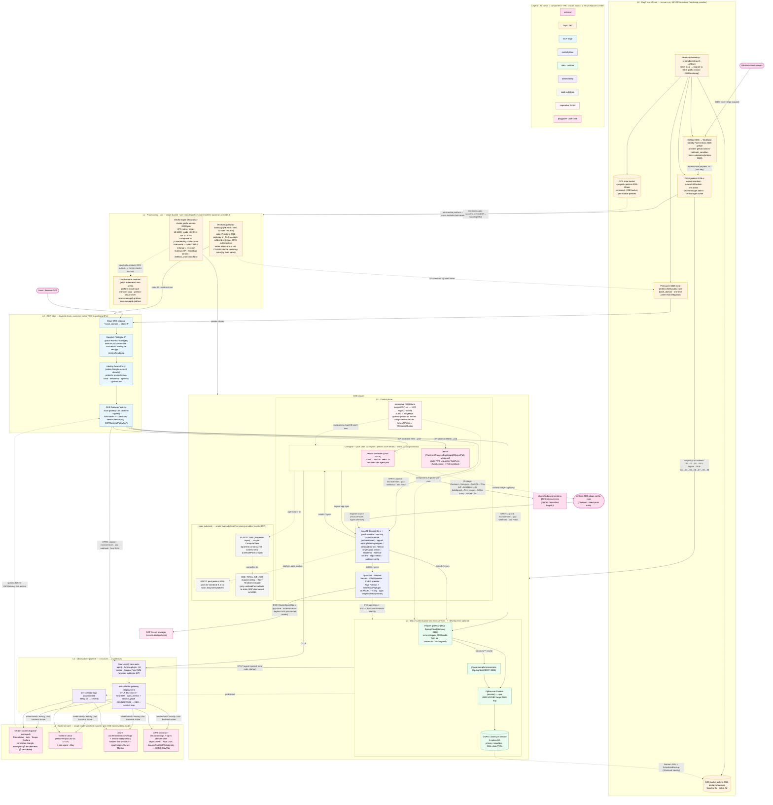

</details>

The overview reads **top-down as seven lifecycle/plane layers**:

- **L0 · Day0 root-of-trust** — human-run, never destroyed.
- **L1 · Provisioning / IaC** — Terraform.
- **L2 · GCP edge** — DNS → L7 LB → IAP → Gateway.
- **L3 · Control plane** — ArgoCD + CI engine + operators + the imperative *push* lane.
- **L4 · Data / runtime plane** — gateway + microservice + CNPG, on the static-vs-NAP node substrate.
- **L5 · Observability pipeline** — the OpenTelemetry collectors.
- **L6 · Backend store** — the one active backend.

**Fill colour encodes the component _type_** (external · Day0/IaC · edge · control · data · observability · nodes · imperative-push · pluggable) — see the in-diagram **Legend**. The two pluggable axes (`ci.engine`: Jenkins xor Tekton; `observability.mode`: one of four) are mutually exclusive — exactly one each. The [Component Diagram](#component-diagram) below drills into the Jenkins / microservices / observability namespace internals.

## Component Diagram

<details>
<summary>📊 Component diagram — Jenkins / microservices / observability namespaces</summary>

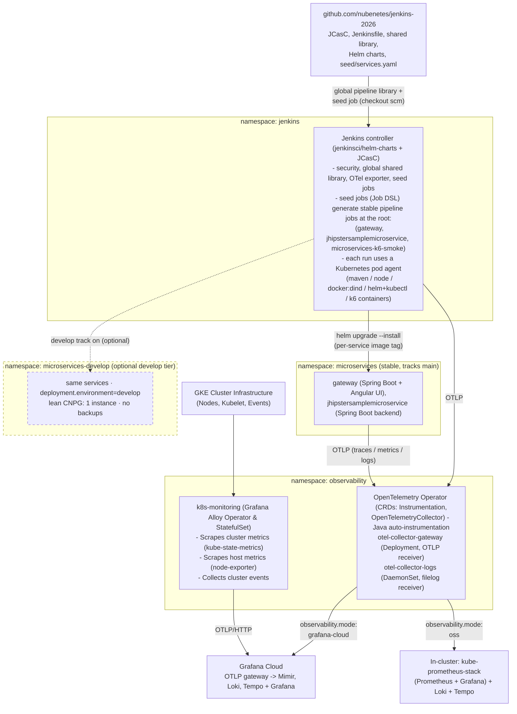

</details>

## Microservices & Database Architecture

The modernized JHipster system is built on a containerized, cloud-native microservices architecture using **Spring Boot 3.x**, **Angular**, and **Java 21**. It consists of two primary services, each with its own dedicated database tier managed by the **CloudNative-PG (CNPG) Operator**:

1. **`gateway`**: Serves as the single entry point for all client requests. Hosts the Angular frontend and handles routing, JWT-based security, and rate-limiting.
2. **`jhipstersamplemicroservice`**: Backend microservice containing business logic and REST endpoints.

<details>
<summary>🔍 Click to expand Architecture & Data Flow Diagram</summary>

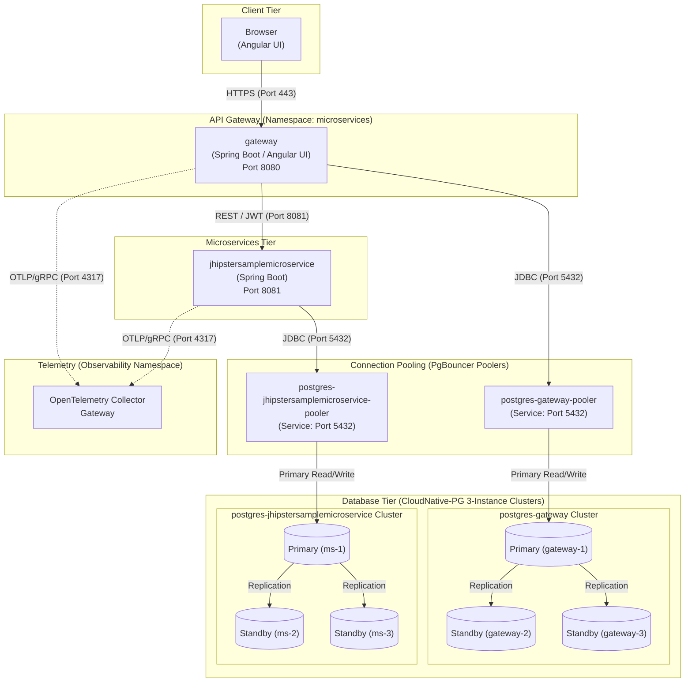

</details>

### Database Injection & Secrets

The CloudNative-PG Operator automatically provisions a basic-auth secret `postgres-{{ $name }}-app` for each cluster containing `username` and `password`. The Helm chart maps these to Spring environment variables:

- `SPRING_DATASOURCE_URL` → JDBC URL targeting PgBouncer
- `SPRING_DATASOURCE_USERNAME` / `SPRING_DATASOURCE_PASSWORD`
- `SPRING_R2DBC_URL` → R2DBC URL for reactive microservices

### CI/CD Flow (GitOps)

<details>
<summary>🔍 Click to expand CI/CD Flow (GitOps) Diagram</summary>

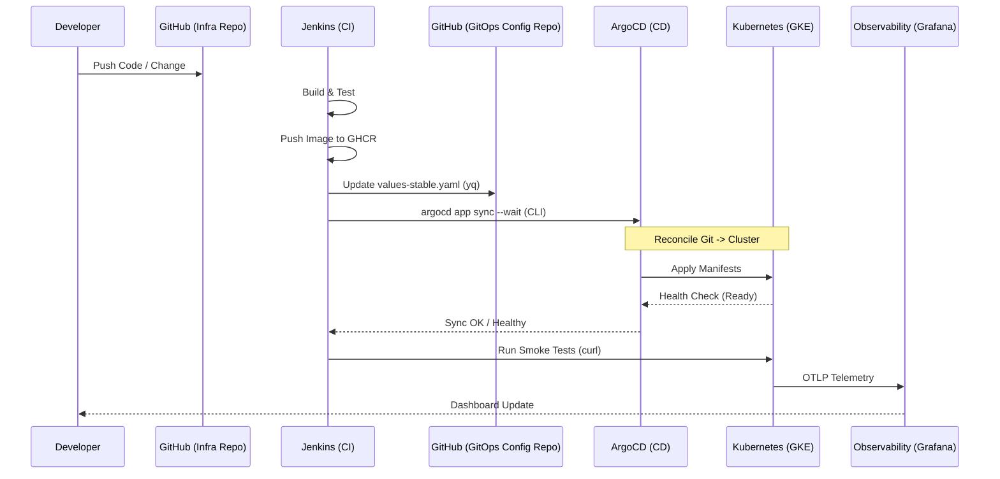

</details>

**Progressive delivery**: the platform installs **Argo Rollouts** + the Gateway API traffic-router plugin (GitOps via [`argocd/argo-rollouts-app.yaml`](../argocd/argo-rollouts-app.yaml)), so the microservices can roll out as weighted **canaries** by shifting the GKE Gateway HTTPRoute backend weights — sidecar-free, no service mesh. See [`docs/501` § Progressive Delivery](501-PLATFORM_OPERATIONS.md).

Single source of truth, loaded by every script via [`scripts/lib/config.sh`](../scripts/lib/config.sh) (`yq` → `J2026_*` env vars). Feature flags:

| Key | Default | Override | Meaning |
|---|---|---|---|
| `observability.mode` | `grafana-cloud` | edit `config.yaml` | `grafana-cloud`\|`oss`\|`managed-azure`\|`managed-aws` — where traces/metrics/logs go |
| `ci.engine` | `jenkins` | `JENKINS2026_CI_ENGINE` | `jenkins`\|`tekton` — which CI engine runs the pipelines-as-code (Jenkins default, or Tekton). See [403. Tekton](./403-TEKTON.md) |
| `microservices.developTrackEnabled` | `false` | `JENKINS2026_DEVELOP_TRACK_ENABLED` | Optional second microservices tier (`microservices-develop` namespace, GitOps `develop` branch) |

Other notable sections: `jenkins.*` (chart coordinates, namespace, this repo's own URL/branch), `observability.*` (operator/collector chart coordinates, release names, Secret name), `microservices.*` (namespaces, git org/repos/branches, target registry, list of 2 services seeded into Jenkins).

### CI engine: Jenkins or Tekton

The `ci.engine` flag (`jenkins` default, override `JENKINS2026_CI_ENGINE`) selects which CI engine runs the pipelines-as-code — same durable-default/ephemeral-override pattern as `observability.mode`. When `tekton`, [`scripts/04-tekton.sh`](../scripts/04-tekton.sh) and [`scripts/06-tekton-pipelines.sh`](../scripts/06-tekton-pipelines.sh) take the place of [`scripts/04-jenkins.sh`](../scripts/04-jenkins.sh) / [`scripts/06-seed-pipelines.sh`](../scripts/06-seed-pipelines.sh): the first applies the **`argocd/tekton` app-of-apps** (so ArgoCD installs Pipelines/Triggers/Dashboard + the pipelines-as-code — the same GitOps pattern as `observability-oss`/`platform-postgres`, unlike Jenkins which is `helm install`-ed directly), the second waits for the sync and generates one PipelineRun per service. The pipelines-as-code lives under the top-level `tekton/` dir (Tasks/Pipelines/Triggers/RBAC — a port of the Jenkins shared library). See [403. Tekton](./403-TEKTON.md) for the deep-dive.

## Repository Layout

```
config/config.yaml          single source of truth (feature flags above)
helm/jenkins/                jenkinsci/helm-charts values + values-gke.yaml overlay
helm/headlamp/               kubernetes-sigs/headlamp values (cluster management UI)
helm/pgadmin/                pgAdmin values (CNPG admin UI)
helm/argocd-values.yaml      ArgoCD install values
jenkins/casc/                JCasC: security, OTel exporter, seed job
jenkins/pipelines/           seed/ (seed job: Job DSL + Jenkinsfile.seed + services.yaml) + k6/ (smoke script)
vars/                        Jenkins global shared library (must be at repo root; Microservices pipeline lives here)
tekton/                      Tekton pipelines-as-code (ci.engine=tekton): Tasks/Pipelines/Triggers/RBAC + port of the Jenkins shared library (vars/)
observability/               OTel Operator/Collector + Grafana/Loki/Tempo/Prometheus values + dashboards
argocd/                      ArgoCD Applications/ApplicationSets + app-of-apps (platform-postgres, observability-oss, tekton) + argo-rollouts-app.yaml
infrastructure/              engine-neutral platform manifests applied by 01-namespaces / 08.5-argocd: NetworkPolicies (default/-jenkins/-tekton), Gateway, Node Auto-Provisioning ComputeClasses (compute-classes/), scheduling, Argo Rollouts Gateway-API RBAC, secrets
scripts/                     00-09 numbered steps + up.sh / down.sh / status.sh
terraform/gke/               throwaway GKE cluster for test/e2e.sh
terraform/bootstrap/         one-time setup for GitHub Actions automation (state bucket + WIF + permanent public DNS zone)
terraform/gateway-bootstrap/ one-time setup for public access (static IP + managed certificate + DNS records in the zone)
scripts/08.5-argocd.sh       ArgoCD installation and OIDC configuration
test/                        e2e.sh (provision → up.sh → smoke-test.sh → down.sh → destroy)
.github/workflows/           DayN.tier.ZZ-resource.yml — see 101. GitHub Actions Workflows
docs/                        numbered docs (this file and siblings)
```

## Imperative (push) vs GitOps (pull): the provisioning split

The platform is provisioned by **two cooperating planes**, and which one owns a
resource is a deliberate, per-resource decision — not an accident of history.

- **GitOps plane (pull).** ArgoCD continuously **pulls** declarative manifests
  from this git repo and reconciles the cluster to match — drift-detected,
  self-healed, pruned. This owns everything that *can* be expressed as a static
  (or parameter-templated) manifest: the Helm charts and the workloads. See
  [`argocd/README.md`](../argocd/README.md) for the Application/ApplicationSet/
  app-of-apps topology.
- **Imperative plane (push).** The numbered `scripts/0N-*.sh` **push** resources
  with `kubectl`/`helm`/`kubectl patch`. This owns everything that *can't* live in
  the pull loop: the bootstrap of ArgoCD itself, secret **values**, runtime-derived
  manifests, live-reload companions, and genuinely external side-effects.

> **The mental model:** ArgoCD is the steady-state reconciler; the scripts are the
> bootstrapper and the bridge for everything git can't hold. The scripts even
> *plant* the ArgoCD `Application`s (one `kubectl apply` each) — so "imperative"
> here is often **how you hand a resource to GitOps**, not an alternative to it.

### The decision framework — six reasons a resource stays imperative

A resource is GitOps-managed **by default**. It stays imperative only if it hits
one of these (each is a hard constraint, not a preference):

1. **Bootstrap paradox.** ArgoCD can't deploy ArgoCD. The CD engine itself (plus
   the OTel Operator and the otel-collector it configures from runtime values) is
   `helm upgrade --install`-ed by [`scripts/08.5-argocd.sh`](../scripts/08.5-argocd.sh) / `02` / `03`. [`up.sh`](../scripts/up.sh)
   installs ArgoCD (`08.5`) **before** observability (`03`) precisely so `03` can
   then apply the `observability-oss` app-of-apps.
2. **Secret values never enter git.** All `Secret` *material* originates outside
   git (GitHub Actions secrets, generated, or Terraform outputs). The delivery
   *mechanism* is selectable — `imperative` (`kubectl create`) or `eso` (push to
   GCP Secret Manager, the External Secrets Operator syncs it back, GitOps-style) —
   but the value's origin is never the repo. Full detail:
   [Secrets backend](#secrets-backend-imperative--eso) and the
   [Secret provenance flow](#diagram-2--secret-provenance-flow).
3. **Runtime-derived values not known at commit time.** The IAP `client_id` read
   live from a cluster Secret, the generated Grafana Cloud slug, the static IP, the
   interpolated domain/branch, the ArgoCD-minted API token. The whole
   Gateway / HTTPRoute / HealthCheckPolicy / GCPBackendPolicy set is **generated
   per-run** from `config.yaml` into `.generated/` and applied ([`09-gateway.sh`](../scripts/09-gateway.sh)).
4. **Live-reload single-source companions.** The JCasC ConfigMaps ([`04-jenkins.sh`](../scripts/04-jenkins.sh)
   from `jenkins/casc/*`) and the OSS-Grafana companion `grafana-jenkins-ds` Secret
   / `grafana-runtime-config` ConfigMap (`03`) are kept **out of GitOps on purpose**
   so a single source stays canonical and the sidecar can hot-reload without a sync.
   See [301 § script-managed companions](./301-OBSERVABILITY.md).
5. **External side-effects ArgoCD has no verb for.** Pushing `.tekton/` to the
   GitHub forks + creating webhooks + seeding the first PipelineRuns
   ([`06-tekton-pipelines.sh`](../scripts/06-tekton-pipelines.sh)), minting the ArgoCD API token, patching the CNPG
   webhook `caBundle` (`08.5`). These are *actions*, not manifests.
6. **Enforcement-ordering sensitivity.** A few static manifests must land **before
   the workloads they protect** — the **NetworkPolicies** and
   **ResourceQuotas/LimitRanges** in [`01-namespaces.sh`](../scripts/01-namespaces.sh). Under Dataplane V2 the OTel
   Operator's `:9443` webhook allow and the `microservices-cnpg-platform` egress
   must exist *before* those pods come up, or the workloads wedge (OutOfSync /
   Degraded). An ArgoCD app would sync them *concurrently* with the workloads — a
   timing regression — so they are deliberately kept on the early imperative path.

### Complete inventory — who owns what, and why

| Resource | Plane | Where | Why this plane |
|---|---|---|---|
| Jenkins, External-Secrets, Headlamp, Argo-Rollouts charts | **GitOps** | `argocd/*-app.yaml` (single Applications) | One chart each; declarative, versioned, self-healed. |
| Microservices (per service, per tier) | **GitOps** | [`argocd/microservices-appset.yaml`](../argocd/microservices-appset.yaml) (ApplicationSet) | Homogeneous fleet from the service registry; CI bumps image tags in the gitops-config repo, ArgoCD syncs. |
| CNPG+pgAdmin · OSS Prometheus/Loki/Tempo/Grafana · Tekton stack | **GitOps** | `platform-postgres` / `observability-oss` / `tekton` app-of-apps | Heterogeneous, ordered (sync-waves), per-child sync options. |
| **Static platform RBAC** (Jenkins/Tekton SA `edit`, pgAdmin secret-reader, OTel-instrumentation `ClusterRole`) | **GitOps** | [`argocd/platform-config/`](../argocd/platform-config/) (new) — planted by `08.5` | Timing-insensitive (consumers run long after sync); textbook GitOps. *Migrated here from `01`/`02` — see [argocd/README](../argocd/README.md).* |
| ArgoCD itself · OTel Operator · otel-collector | **Imperative** | `08.5` / `02` / `03` `helm upgrade --install` | Bootstrap paradox (#1); the collector is also runtime-config-coupled (#4). |
| The ArgoCD `Application`/`AppSet`/`AppProject`/app-of-apps manifests (incl. [`argocd/microservices-project.yaml`](../argocd/microservices-project.yaml)) | **Imperative→GitOps** | `08.5` / `03` `kubectl apply` (sed-substituted) | *Planting* the root apps **is** how GitOps starts (the app-of-apps bootstrap). |
| ArgoCD version patch-watcher ([`argocd/argocd-version-patch-watcher.yaml`](../argocd/argocd-version-patch-watcher.yaml) — CronJob + RBAC) | **Imperative** | `08.5` `kubectl apply` | Daily watcher that tracks the latest ArgoCD `3.4.x` patch within the pinned minor (see [602](./602-VERSION_PINNING.md)); a cluster-side CronJob, not a GitOps app. |
| ArgoCD self-config (`argocd-cm`/`argocd-rbac-cm` OIDC/RBAC/CI account) | **Imperative** | `08.5` `kubectl patch` | Bootstrap paradox (#1) — how the engine learns to log in. |
| All in-cluster `Secret`s (jenkins/headlamp/IAP/tekton/ghcr/grafana-ds…) | **Imperative** *(or ESO)* | `01` / `03` / `08.5`; `08.6` in `eso` mode | Secret values never in git (#2). `eso` makes *delivery* GitOps-style. |
| Gateway · HTTPRoutes · HealthCheckPolicies · GCPBackendPolicies (IAP) | **Imperative** | [`09-gateway.sh`](../scripts/09-gateway.sh) → `.generated/` | Generated per-run with the live domain/IP/IAP-client-id (#3). |
| Runtime patches into `jenkins-credentials`/`headlamp-credentials` (URLs, tokens, banner links) | **Imperative** | `01` / `04` / `08.5` `kubectl patch` | Values discovered at run time (#3). |
| JCasC ConfigMaps · `grafana-jenkins-ds` · `grafana-runtime-config` | **Imperative** | `04` / `03` | Live-reload single-source companions (#4). |
| Tekton PaC push/webhooks/seed · ArgoCD token mint · CNPG `caBundle` patch | **Imperative** | `06` / `08.5` | External / in-cluster side-effects (#5). |
| **NetworkPolicies** · **ResourceQuotas/LimitRanges** | **Imperative** | [`01-namespaces.sh`](../scripts/01-namespaces.sh) | Must land **before** workloads for Dataplane V2 enforcement timing (#6). |
| Namespace creation + labels | **Imperative** | [`01-namespaces.sh`](../scripts/01-namespaces.sh) | The floor everything else lands in; must exist before any apply/sync. |
| Headlamp per-email admin `ClusterRoleBinding`s | **Imperative** | [`08-headlamp.sh`](../scripts/08-headlamp.sh) | Derived from a user list, not a static manifest. |

### The two planes (diagram)

<details>
<summary>📊 Provisioning planes — push (scripts) vs pull (ArgoCD)</summary>

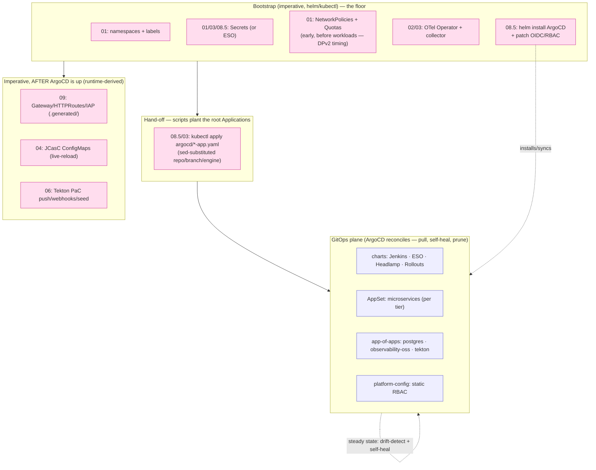

</details>

### The irreducible imperative core

Even with maximal GitOps adoption, five things can **never** move to the pull loop:
(1) **ArgoCD itself + its self-config** — the engine can't bootstrap the engine;
(2) **secret source values** — they originate outside git, ESO only changes
*delivery*; (3) **external side-effects** — pushing to GitHub forks, creating
webhooks; (4) **live-reload single-source companions** — JCasC + Grafana inputs,
migrating them regresses the hot-reload design; (5) **reconciliation race-fixes** —
the CNPG `caBundle` patch and the token mint. Everything else is GitOps-managed, or
is a deliberate, documented exception above.

## Namespaces & in-cluster Secrets

> In-cluster Kubernetes `Secret`s, **not** the GitHub Actions secrets — those are
> the *source* values and are inventoried separately in
> [103. GitHub Secrets Inventory](./103-GITHUB_SECRETS_INVENTORY.md). This section
> is about how, once inside the cluster, secrets are laid out across namespaces and
> why.

### Design principles

1. **A Secret lives in the namespace of the component that consumes it.** There is
   no central "secrets" namespace — `ghcr-credentials` lives where the pods that
   pull images run (`microservices`), the Headlamp OIDC secret lives in `headlamp`,
   the Tekton pipeline credentials live in `tekton-ci`, and so on. Locality keeps
   RBAC tight (a component can only read its own namespace) and makes teardown clean.
2. **The CI engine is mutually exclusive and engine-gated.** Either Jenkins **or**
   Tekton is deployed, never both (`ci.engine`). The `jenkins` namespace and its
   `jenkins-credentials` bundle are created **only** when `ci.engine=jenkins`; the
   `tekton-*` namespaces and their credentials **only** when `ci.engine=tekton`.
3. **The public ingress is engine-neutral.** The GKE Gateway and the per-app
   HTTPRoutes live in the always-present **`platform-ingress`** namespace, so the
   single public entry point never depends on which CI engine is running. (This was
   not always so — see [The `platform-ingress` decoupling](#the-platform-ingress-decoupling) below.)
4. **One exception is replicated by necessity:** the IAP OAuth client
   (`gateway-iap-oauth`) is copied into *every* IAP-protected backend namespace,
   because GKE requires it co-located with the backend Service — see
   [Why the IAP secret is replicated](#why-the-gateway-iap-oauth-secret-is-replicated).

### Namespace inventory

| Namespace | When created | Runs / holds |
|---|---|---|
| `platform-ingress` | always | the GKE **Gateway** object (engine-neutral public ingress) |
| `observability` | always | OTel Operator + Collector; OSS Grafana/Loki/Tempo/Prometheus (oss mode) |
| `headlamp` | always | Headlamp UI + its OIDC secret + an IAP secret copy |
| `pgadmin` / `platform-postgres` | always | pgAdmin + CNPG operator + an IAP secret copy |
| `argocd` | always | ArgoCD (GitOps control plane) |
| `microservices` (+ `microservices-develop`) | always | the JHipster workloads + `ghcr-credentials` |
| `jenkins` | **only `ci.engine=jenkins`** | Jenkins controller + agents + `jenkins-credentials` + an IAP secret copy |
| `tekton-pipelines` | **only `ci.engine=tekton`** | Tekton Pipelines/Triggers/Dashboard control plane + an IAP secret copy |
| `tekton-ci` | **only `ci.engine=tekton`** | PipelineRuns + their credentials (`tekton-registry`/`tekton-git`/`k6-cloud`) |
| `pipelines-as-code` | **only `ci.engine=tekton`** | PaC controller + `pac-webhook` |

### In-cluster Secret inventory (the matrix)

| Secret | Namespace(s) | Contents | Shared / replicated? | Created by | Consumed by |
|---|---|---|---|---|---|
| **`jenkins-credentials`** | `jenkins` *(jenkins-mode)* | admin-password · registry user/pass · git user/token · oidc-client-id/secret · **oidc-admin-email** · microservices URLs · k6-cloud token/project | No — Jenkins config bundle | [`01-namespaces.sh`](../scripts/01-namespaces.sh) | Jenkins controller (JCasC) |
| **`gateway-iap-oauth`** | `headlamp`, `pgadmin` (+ `grafana-oss` / `tekton-pipelines` / `jenkins` per mode) | IAP OAuth `client_id` / `client_secret` | **YES — replicated** (GKE constraint) | [`01-namespaces.sh`](../scripts/01-namespaces.sh) | each ns's `GCPBackendPolicy` (IAP); `08.5` reads it (**from `headlamp`**) for ArgoCD's Google OIDC |
| `headlamp-credentials` | `headlamp` | OIDC client id/secret (+ issuer/scopes/callback) | No | [`01-namespaces.sh`](../scripts/01-namespaces.sh) | Headlamp deployment |
| `tekton-registry` | `tekton-ci` *(tekton-mode)* | `dockerconfigjson` (ghcr.io push/pull, Jib auth) | No | [`01-namespaces.sh`](../scripts/01-namespaces.sh) | PipelineRuns (build-push-image) |
| `tekton-git` | `tekton-ci` *(tekton-mode)* | git basic-auth, annotated for `github.com` | No | [`01-namespaces.sh`](../scripts/01-namespaces.sh) | clone / gitops-deploy tasks |
| `tekton-github-webhook-secret` · `pac-webhook` | `tekton-ci` · `pipelines-as-code` *(tekton-mode)* | webhook HMAC token | No | [`01-namespaces.sh`](../scripts/01-namespaces.sh) | Triggers EventListener / PaC |
| `k6-cloud` | `tekton-ci` *(tekton-mode; same keys also in `jenkins-credentials`)* | `K6_CLOUD_TOKEN` / `K6_CLOUD_PROJECT_ID` | No | [`01-namespaces.sh`](../scripts/01-namespaces.sh) | k6 tasks (`--out cloud`, the k6-app) |
| `ghcr-credentials` | `microservices` (+ `-develop`) | `dockerconfigjson` imagePullSecret | No | [`01-namespaces.sh`](../scripts/01-namespaces.sh) | microservices pods (image pull) |
| `grafana-jenkins-ds` | `grafana-oss` *(oss + jenkins-mode)* | `apiToken` (mirror of Jenkins admin password) | No | [`03-observability.sh`](../scripts/03-observability.sh) *(gated to jenkins-mode)* | Grafana → Jenkins datasource |
| `grafana-cloud-credentials` / `azure-monitor-credentials` / `aws-managed-credentials` | `observability` | backend endpoint + token/SP/role per `observability.mode` | No | Day1 workflow / scripts | otel-collector exporter |

### Diagram 1 — Namespace & Secret topology

Each app's Secret sits in that app's namespace; the only cross-namespace **reads**
are the two that the IAP design forces (ArgoCD pulling the OAuth client) and that
the IAP backend policies need (the replicated client). `jenkins` is dashed — it
exists only in jenkins-mode (replace it mentally with the `tekton-*` namespaces in
tekton-mode).

<details>
<summary>📊 Diagram 1 — Namespace &amp; Secret topology</summary>

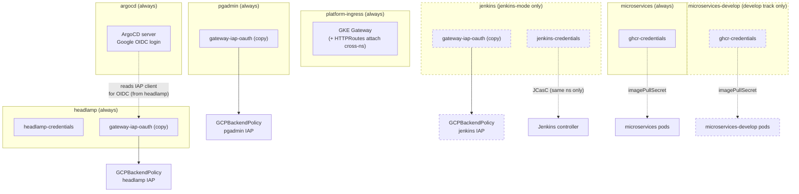

</details>

### Diagram 2 — Secret provenance flow

Every in-cluster Secret originates from a GitHub Actions secret (or a Terraform
backend output), is materialised into the **consumer's** namespace, and is read
only from there. **How** it is materialised is selectable — see
[Secrets backend](#secrets-backend-imperative--eso) below. The default
(`imperative`) flow is:

<details>
<summary>📊 Diagram 2 — Secret provenance flow (imperative)</summary>

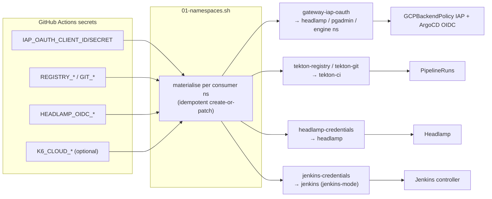

</details>

### Secrets backend (`imperative` | `eso`)

> 🔐 **Pluggable secrets backend.** A feature flag — `secrets.backend` in
> `config/config.yaml` (override `JENKINS2026_SECRETS_BACKEND`, or the
> **`secrets_backend` input** on `Day1.cluster.01` / `Day1.cluster.00-all`) — selects
> **how** in-cluster Secrets are materialised, the same way `ci.engine` /
> `observability.mode` select their dimensions. The **whole lifecycle** honours it
> and is idempotent: [`up.sh`](../scripts/up.sh) ([`01-namespaces.sh`](../scripts/01-namespaces.sh) push → [`08.6-eso-sync.sh`](../scripts/08.6-eso-sync.sh) sync), and
> the **Day2 redeploys that re-run [`01-namespaces.sh`](../scripts/01-namespaces.sh)** — `Day2.redeploy.03-tekton`,
> `.04-headlamp`, `.05-gateway` — carry the same `secrets_backend` input (so a Day2 on
> an `eso` cluster never recreates the Secret imperatively). Decom needs nothing extra:
> `down.sh` deletes the namespaces (and with them the ExternalSecrets/Secrets), the
> cluster teardown removes the `ClusterSecretStore`, and the Secret Manager entries
> persist by design as the reusable source of truth.

| Backend | How Secrets are made | Source of truth | Audit / versioning | Default |
| :--- | :--- | :--- | :--- | :---: |
| **`imperative`** | [`01-namespaces.sh`](../scripts/01-namespaces.sh) runs `kubectl create secret` from the GitHub-secret env vars (Diagram 2 above) | GitHub Actions secrets | none in-cluster | ✅ |
| **`eso`** | values pushed to **GCP Secret Manager**; the **External Secrets Operator** syncs them into namespaces via **Workload Identity (keyless)** | GCP Secret Manager (versioned) | **Cloud Audit Logs** + SM versions | |

In `eso` mode the flow becomes (now wired for the gateway IAP secret, the Tekton
pipeline credentials, and `ghcr-credentials`; the rest follows the same pattern —
staged rollout below):

<details>
<summary>📊 ESO sync flow (secrets.backend=eso) — Secret Manager → Workload Identity → k8s Secret</summary>

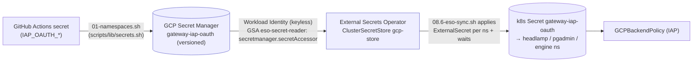

</details>

**Why `eso` adds value:** a single managed source of truth, secret **versioning**,
**Cloud Audit Logs** of every access, optional rotation, and it decouples secrets
from the provision script — all keyless (WIF), no Vault/server to run. (Analysis of
why **not** HashiCorp Vault here: it would add a stateful HA service + its own
unseal root-of-trust, over-engineered for an ephemeral single-stack PoC.)

**Coverage by ESO-fitness group.** `eso` is opt-in; the default stays `imperative`,
unchanged until you validate the flag on a Day1 run. Which secrets are projected via
ESO **when the flag is enabled** depends on how well each secret's *value lifecycle*
fits ESO's core assumption — *the value already lives in Secret Manager, read-only*.
The stack's secrets fall into four groups; **this PoC wires groups 1–3** and leaves
only group 4 imperative:

| Group | Secrets | ESO fit | In `eso` mode |
| :--- | :--- | :--- | :--- |
| **1 — clean** *(value is an external, static input)* | `gateway-iap-oauth` (+ its `-client-secret`), `tekton-github-webhook-secret`, `k6-cloud` | ✅ **Native** — `dataFrom.extract` / single `property` | ✅ **wired** |
| **2 — templated** *(typed Secret built from external inputs)* | `ghcr-credentials` + `tekton`-registry (`dockerconfigjson`), `tekton`-git (`basic-auth` + `tekton.dev/git-0`) | ✅ via `target.template` — rebuilds the typed payload from `username`/`password`/`registry` keys | ✅ **wired** |
| **3 — generated / multi-writer** | `jenkins-credentials` (admin pw generated at create; URL + `argocd-token` keys patched by later steps), `headlamp-credentials`, `pac-webhook` (`openssl rand`), `grafana-jenkins-ds` (mirrors the Jenkins pw) | ✅ **seed-then-project** — the generated value is seeded **stable** into SM (`sm_keep_or_generate`), and `jenkins-credentials` uses **`creationPolicy: Merge`** so the imperatively-patched keys survive | ✅ **wired** |
| **4 — no upstream value** | `tekton-argocd` (token **minted in-cluster** by ArgoCD at deploy time), per-mode `grafana-cloud` / `azure-monitor` / `aws-managed` creds (**Terraform outputs**) | ❌ Nothing to sync *from* — the value is produced in-cluster / by Terraform, never pre-placed in SM | ❌ imperative |

*(Validation: groups 1–2 confirmed live on a real Day1 — ExternalSecrets `SecretSynced`,
correct types, consumers working; group 3 is newly wired and should be re-validated on a
Day1 with `secrets_backend=eso`, especially the `jenkins-credentials` Merge + stable
admin-password, since a mistake there affects Jenkins login.)*

**Why group 4 stays imperative.** Groups 1–3 all end with the value *in* Secret Manager:
groups 1–2 because it starts there (an external input), group 3 because we **seed** the
generated value into SM once and keep it stable (`sm_keep_or_generate`) — and for the
multi-writer `jenkins-credentials`, ESO uses `creationPolicy: Merge` so the URL keys (01)
and the ArgoCD token (08.5) patched onto the Secret survive. Group 4 has **no upstream
value to seed**: `tekton-argocd` is minted *by ArgoCD in-cluster at deploy time*, and the
observability backend creds are *Terraform outputs* applied directly by the Day1 workflow.
ESO-ifying those would mean writing an in-cluster / Terraform value *into* SM purely to read
it straight back out — pure indirection with no managed-source-of-truth benefit, so they
stay imperative by design.

**Does the ESO integration add value — partial (1–3) vs complete (also 4)?**

- **Partial (groups 1–3, what ships here): yes — and it now covers the high-value
  secrets too.** It exercises the whole mechanism end-to-end (keyless WI auth, one
  `ClusterSecretStore`, all four projection shapes + `Merge`) and gives a single managed
  source of truth — **versioning + Cloud Audit Logs + rotation** — to the externally-sourced
  creds (registry, IAP OAuth, webhook / k6 tokens) **and** the generated ones (the Jenkins
  admin password, the PaC HMAC), while leaving the `imperative` default untouched (opt-in).
- **Complete (also group 4): not worth it, even in production.** Unlike group 3, group 4
  has no real upstream value — pushing an ArgoCD-minted token or a Terraform output into SM
  just to read it back adds a moving part (a post-mint push-back) for zero centralization
  benefit; those values are already managed where they are produced (ArgoCD / Terraform state).
  So full ESO coverage is **not** a goal: group 4 is correctly left imperative. (Same
  fit-the-tooling reasoning as choosing ESO over a self-hosted Vault above.)

Pieces: the flag ([`config.sh`](../scripts/lib/config.sh)), the push helper
([`scripts/lib/secrets.sh`](../scripts/lib/secrets.sh)), the sync+wait step
([`scripts/08.6-eso-sync.sh`](../scripts/08.6-eso-sync.sh)), the reference manifests
([`infrastructure/secrets/eso-bootstrap.yaml`](../infrastructure/secrets/eso-bootstrap.yaml)),
and the GCP enablement, which has **three** parts (a write side and a read side
either side of Secret Manager):

- **API** — `secretmanager.googleapis.com`, enabled in [`terraform/gke`](../terraform/gke/) alongside
  `container`/`compute` (left on; unused in imperative mode).
- **Write (push) side** — the CI service account that runs [`up.sh`](../scripts/up.sh) needs
  `roles/secretmanager.admin` (the minimal predefined role that includes
  `secrets.create`); granted in [`terraform/bootstrap`](../terraform/bootstrap/)'s `ci_roles`. **Adding it
  to an existing bootstrap requires a one-time human `terraform apply` in
  [`terraform/bootstrap`](../terraform/bootstrap/)** (the CI SA's roles live there, like all the others).
- **Read (sync) side** — the cluster runs **GKE Workload Identity** (`GKE_METADATA`),
  so ESO pods authenticate as the GSA bound to their KSA, **not** the node SA.
  [`terraform/gke`](../terraform/gke/) creates a dedicated least-privilege GSA (`eso-secret-reader`,
  only `roles/secretmanager.secretAccessor`) and a `workloadIdentityUser` binding
  to the controller KSA `external-secrets/external-secrets`; the KSA is annotated
  with that GSA's email via the external-secrets ArgoCD app's helm values
  (templated in [`scripts/08.5-argocd.sh`](../scripts/08.5-argocd.sh)). Because a pod's GCP identity is fixed
  at creation, [`08.6-eso-sync.sh`](../scripts/08.6-eso-sync.sh) also **restarts the ESO controller** so it adopts
  the annotation on an idempotent re-run (the controller pod from a prior run
  predates it and would otherwise keep failing to authenticate).

**Active-backend resolution (detection, not just the flag).** Like `ci.engine`
(`j2026_active_ci_engine`), the *active* backend is resolved by
`j2026_active_secrets_backend` ([`common.sh`](../scripts/lib/common.sh)) with the
precedence: **explicit `JENKINS2026_SECRETS_BACKEND` override → detect from the
live cluster → `config.yaml` default**. Detection keys off the `ClusterSecretStore/gcp-store`
CR (created only in eso mode by `08.6`), *not* the ESO operator (installed in both
modes). So a **standalone Day2 redeploy** — or `down.sh` during a Decom — does the
right thing on an eso cluster **even if the operator forgets to pass
`secrets_backend`** (whose default is `imperative`, which would otherwise diverge:
`01-namespaces` would `kubectl`-create the Secret while the ESO `ExternalSecret`
still owns it). Day1 always sets the override explicitly, so provisioning is
unaffected; the `secrets_backend` workflow input is therefore an *optional override*
of the detection, not a requirement.

**Teardown.** In eso mode the Secret Manager secret is the one piece that outlives
the cluster (it's project-level). `down.sh` deletes it on teardown (detected from
the still-running cluster, so the Decom workflows need no `secrets_backend` input);
best-effort, and a future Day1 re-pushes it from the GitHub secret.

### Feature-flag convergence — idempotency vs in-place switching

Two distinct properties, often conflated:

- **Idempotency** — re-running `Day1` (or any `0N` step) with the **same** flags is a
  no-op (`helm upgrade --install`, `kubectl apply`, `terraform apply` converge then do
  nothing). This holds **universally**.
- **Convergence on a flag CHANGE** — flipping a flag on a **live** cluster and re-running
  should retire the **old** mode's resources and install the new one, not accumulate
  orphans. The repo implements this with a deliberate **"retire the mode we are switching
  away from"** pattern:

| Flag | In-place switch | How the old mode is retired |
| :--- | :--- | :--- |
| **`ci.engine`** `jenkins`↔`tekton` | ✅ | [`04-jenkins.sh`](../scripts/04-jenkins.sh) deletes the `tekton` ArgoCD app + the tekton namespaces; [`04-tekton.sh`](../scripts/04-tekton.sh) deletes the `jenkins` app + its namespace (engines are mutually exclusive — the retired engine's namespace is cleared symmetrically). |
| **`observability.mode`** oss/grafana-cloud/managed-azure/managed-aws | ✅ | every branch of [`03-observability.sh`](../scripts/03-observability.sh) retires the *other* modes' agents/stacks (e.g. it waits out the OSS node-exporter DaemonSet; [`07-grafana-dashboards.sh`](../scripts/07-grafana-dashboards.sh) deletes the off-engine overview). See [902](./902-TROUBLESHOOTING.md). |
| **`secrets.backend`** `imperative`↔`eso` | ✅ | `imperative→eso`: `08.6` installs the `ClusterSecretStore` + `ExternalSecrets`. `eso→imperative`: `08.6` **retires ESO** — RETAINs each target Secret (`deletionPolicy: Retain` + strips the `ownerReference` so the Owner ExternalSecret's GC can't delete it; Merge ones aren't owned), deletes the `ExternalSecrets`, and deletes `gcp-store`. `01-namespaces` already wrote imperative copies, so the Secrets survive and consumers keep working. |

So **all three fundamental flags converge in place** — flip any of them and re-run `Day1`
without a Decom; the cluster retires the old mode rather than leaving orphans. Two
`secrets.backend`-specific subtleties:

- **The first `eso→imperative` flip needs the explicit `secrets_backend=imperative` input.**
  Detection (`j2026_active_secrets_backend`) is **sticky to eso** while `gcp-store` exists —
  by design, so a Day2 redeploy that forgets the input can't silently revert and
  double-provision. The explicit input overrides detection and triggers the retirement; once
  that deletes `gcp-store`, detection resolves to `imperative` on its own thereafter. So
  cycling the flag across many runs (`eso→imperative→eso→…`) **works and is symmetric**.
- **A Jenkins restart is needed only ONCE — the first time the admin password changes**, not
  per cycle. `jenkins-credentials`' `admin-password` is seeded **stable** into Secret Manager
  (`sm_keep_or_generate`) and reused every run (eso reuses the SM value; imperative
  skips-if-exists), so once Jenkins has adopted it (JCasC re-applies `securityRealm` on pod
  start) it stays valid across flips. It only changes on the very first `imperative→eso`
  migration of a cluster whose Jenkins **predates** the seeded password — there, delete the
  `jenkins-0` pod once so JCasC adopts the Secret's value (see [902](./902-TROUBLESHOOTING.md)).
  The Secret Manager secrets are left intact across flips (reused on switch-back; `down.sh`
  removes them on teardown).

### Why the `gateway-iap-oauth` Secret is replicated

This is the one secret that legitimately lives in several namespaces — and it is a
**hard GKE constraint, not a design smell**. A GKE `GCPBackendPolicy` that enables
Identity-Aware Proxy references an OAuth-client `Secret` by name, and that Secret
**must live in the same namespace as the backend `Service`** it protects. There is
no way to point a backend policy at a Secret in another namespace, so the single
OAuth client has to be copied into every IAP-protected backend namespace.

<details>
<summary>📊 Why the gateway-iap-oauth Secret is replicated per backend namespace</summary>

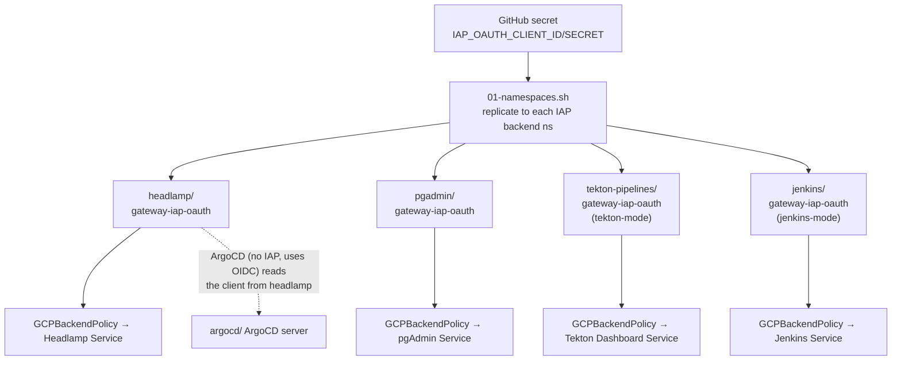

</details>

> ArgoCD is **not** IAP-gated (it has its own Google OIDC login), but it reuses the
> *same* OAuth client. It therefore reads `gateway-iap-oauth` from the always-present
> `headlamp` namespace rather than minting a second client.

### The `platform-ingress` decoupling

Historically the repo was **Jenkins-only**, so the `jenkins` namespace doubled as
the de-facto "platform" namespace: it was always present, so the shared GKE Gateway
was created there and other scripts reached into it for shared-ish values. When
Tekton became a selectable engine and the `jenkins` namespace was gated to
jenkins-mode, that coupling surfaced as bugs. The fixes:

| Coupling (when `jenkins` ns was the "platform" ns) | Fix |
|---|---|
| The **GKE Gateway** lived in `jenkins` → deleting the ns (or running tekton) killed all public access | Gateway moved to the engine-neutral **`platform-ingress`** namespace |
| [`08.5-argocd.sh`](../scripts/08.5-argocd.sh) read the **IAP client** from `jenkins` for ArgoCD's OIDC → empty in tekton-mode | now reads `gateway-iap-oauth` from **`headlamp`** (always present) |
| [`03-observability.sh`](../scripts/03-observability.sh) read `jenkins-credentials` for a **Grafana→Jenkins datasource** | gated to `ci.engine=jenkins` (pointless without Jenkins) |
| [`07.5-grafana-alerts.sh`](../scripts/07.5-grafana-alerts.sh) read `jenkins-credentials.oidc-admin-email` as an alert-email fallback | already guarded (`|| true`); yields empty harmlessly in tekton-mode |
| NetworkPolicies / ResourceQuota / LimitRange / RBAC **targeting the `jenkins` ns** applied unconditionally | all gated to `ci.engine=jenkins` (the jenkins-ns NetworkPolicies live in [`infrastructure/networkpolicies-jenkins.yaml`](../infrastructure/networkpolicies-jenkins.yaml)) |

The end state matches the design principles above: **secrets per-app**, the IAP
client replicated only because GKE requires it, the public ingress engine-neutral,
and nothing reaching into `jenkins-credentials` except Jenkins itself.

## GKE Cluster Topology & Sizing

The throwaway cluster is provisioned via [`terraform/gke/`](../terraform/gke/) with a custom **VPC-native** configuration optimized for **stability and cost**. A **persistent** global static IP and Google-managed wildcard TLS certificate ([`terraform/gateway-bootstrap/`](../terraform/gateway-bootstrap/)) survive cluster rebuilds so DNS records never need updating.

**Network dataplane**: the cluster runs **GKE Dataplane V2** (Cilium/eBPF, `datapath_provider = ADVANCED_DATAPATH`) so Kubernetes `NetworkPolicy` is actually enforced, with **WireGuard inter-node pod encryption** (`in_transit_encryption_config`) on top — sidecar-free, no service mesh. Both are immutable fields (changing them recreates the cluster). See [`docs/501` § Zero-Trust Security](501-PLATFORM_OPERATIONS.md) for the NetworkPolicy model and the encryption scope/caveats, and **[`docs/503` Networking](503-NETWORKING.md)** for the full network architecture — the landing zone (single-VPC, *not* hub-spoke), VPC/subnet + pod/service **CIDR plan**, north-south ingress/egress, east-west, and the segmentation model end to end.

<details>
<summary>🔍 Click to expand GKE Cluster Topology Diagram</summary>

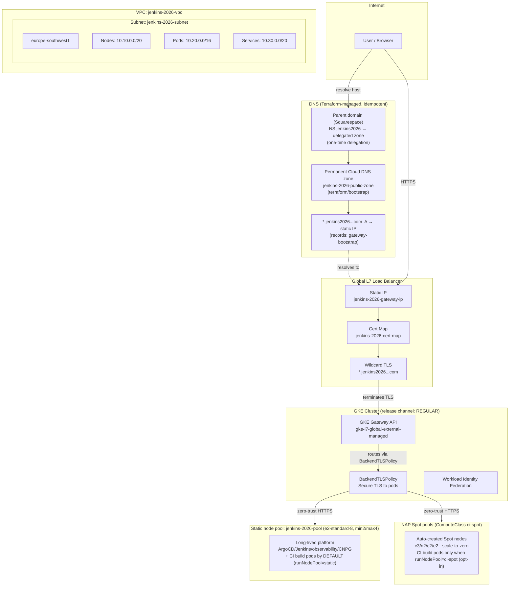

</details>

| Layer | Resource | Details |
|---|---|---|
| **Static IP** | `jenkins-2026-gateway-ip` | Global persistent `google_compute_global_address`. Survives cluster rebuilds. |
| **TLS Certificate** | `jenkins-2026-cert` | Google-managed wildcard cert for `jenkins2026.nubenetes.com` + `*.jenkins2026.nubenetes.com`. |
| **GKE Cluster** | `jenkins-2026` | Zonal cluster in `europe-southwest1-a`. VPC-native, Gateway API addon `CHANNEL_STANDARD` (cluster release channel `REGULAR`), Workload Identity enabled. |
| **Static node pool** | `jenkins-2026-pool` | `e2-standard-8`, min 2 / max 4. Hosts the long-lived platform (ArgoCD/Jenkins/observability/CNPG) **and the CI build pods by default** (`{jenkins,tekton}.runNodePool: static` — robust, no NAP/Spot/quota dependency). |
| **NAP Spot pools** | ComputeClass `ci-spot` | GKE Node Auto-Provisioning auto-creates Spot pools (`c3`, `n2`, `c2`, `e2` families), scale-to-zero. Used for CI build pods **only when an engine opts in** with `runNodePool: ci-spot` (Jenkins is the better Spot fit; Tekton stays `static` — see [docs/501](501-PLATFORM_OPERATIONS.md#jenkins-vs-tekton-on-spot-ci-spot--why-the-placement-flag-is-per-engine)). |
| **Node SA** | `jenkins-2026-nodes` | Minimal-privilege: `roles/logging.logWriter`, `roles/monitoring.metricWriter`, `roles/artifactregistry.reader`. |
| **CI Agent SA** | `jenkins-2026-ci-agent` | GitHub Actions OIDC WIF — no static JSON keys. |

### Sizing Rationale

Running Jenkins, ArgoCD, pgAdmin, two Postgres HA clusters (CNPG), OpenTelemetry operators, and the JHipster microservices stack requires significant resources. **`e2-standard-8` with 3 nodes** ensures a stable environment with enough headroom to spawn dynamic Jenkins build agent pods. Smaller nodes (`e2-standard-2`) would cause **OOM kills, CPU starvation, and pending pods**.

### FinOps & Cost Analysis

- **Cluster Management Fee**: `$0.10/hour` (waived for first zonal cluster per billing account).
- **Compute**: ~`$0.22/hour` per `e2-standard-8` in Madrid (`europe-southwest1`).
- **Total run rate**: ~`$0.70–$0.80/hour` for the active 3-node cluster.
- **Per-session cost**: ~`$0.10–$0.20` for a full 15–25 minute provision + smoke test + teardown cycle.
- **Disk floor (paused)**: with `Day2.scale.01 Pause` (nodes → 0) compute stops but the **~102 GB of persistent PVs** (CNPG databases + platform) remain — ≈`$13/month` of `pd-balanced`/`pd-ssd` (+ the static IP ~`$7`). `Decom` drops this to ~`$0`.
- **The `SSD_TOTAL_GB` quota is the binding capacity ceiling** (500 GB; every node boot disk + PV counts) and the limit on `ci-spot` Spot CI concurrency. For the full **disk-quota computation diagram, per-state usage %, cost breakdown, and the Google increase request (500 → 2000)** see [docs/501 § The `SSD_TOTAL_GB` quota](./501-PLATFORM_OPERATIONS.md#the-ssd_total_gb-quota--how-its-computed-what-it-costs-and-the-increase-request).
- **Always decommission**: Run `Decom.cluster.01 GKE decommission` when finished — never leave the cluster running overnight.

---

[← Previous: 103. Secrets Inventory](./103-GITHUB_SECRETS_INVENTORY.md) | [🏠 Home](../README.md) | [→ Next: 202. Microservices App Architecture](./202-MICROSERVICES-APP-ARCHITECTURE.md)

---

*201. Architecture — jenkins-2026*
