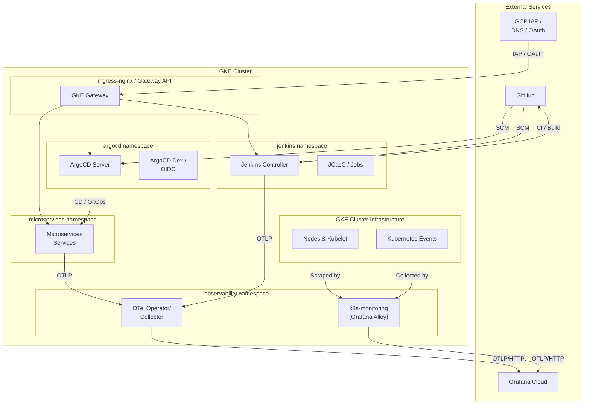
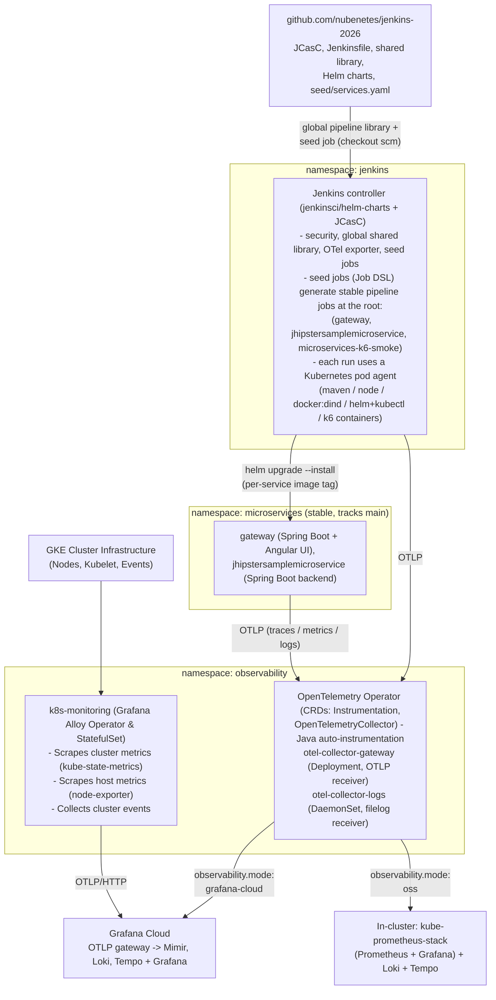
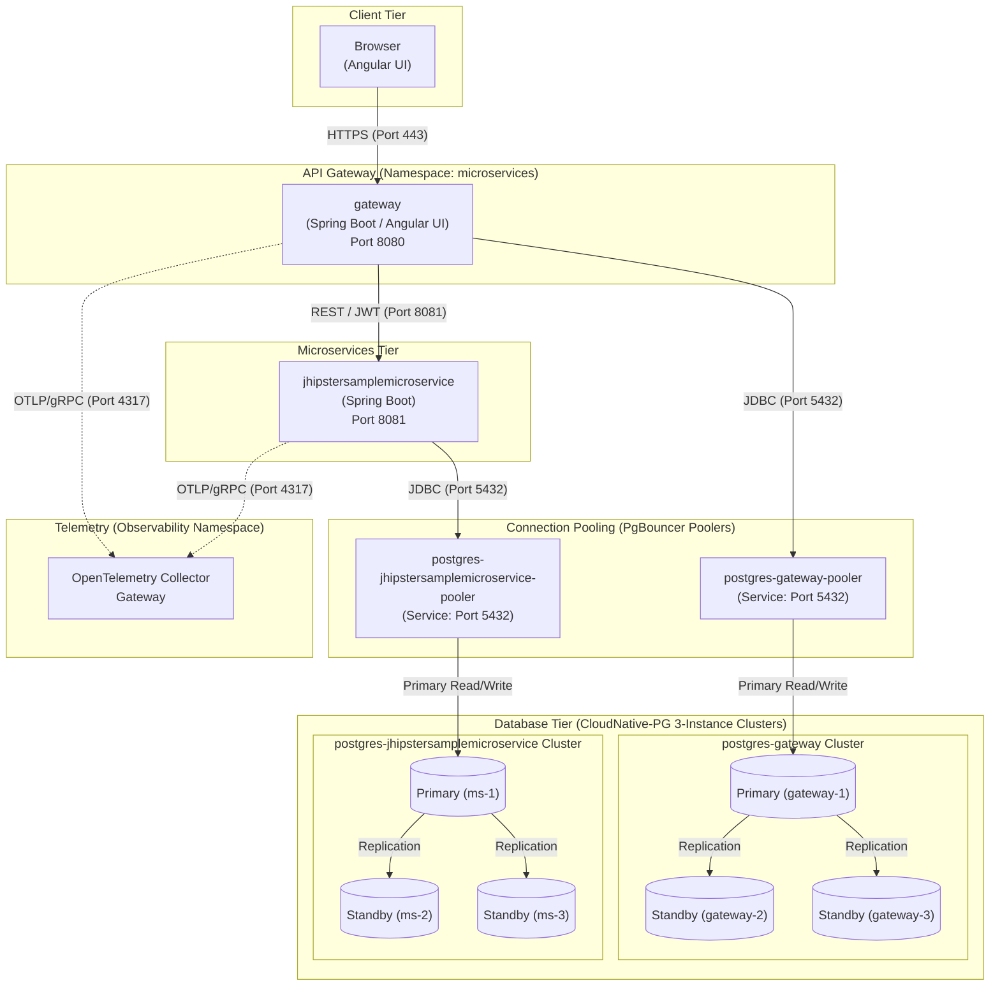
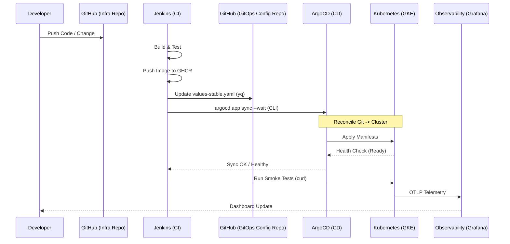
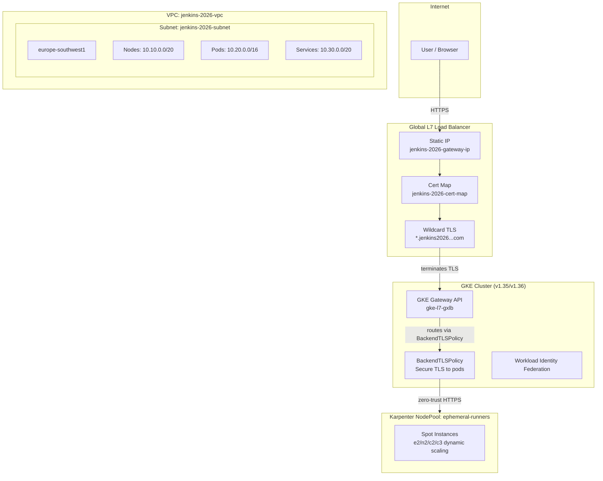

[← Previous: 103. Secrets Inventory](./103-GITHUB_SECRETS_INVENTORY.md) | [🏠 Home](../README.md) | [→ Next: 301. Observability](./301-OBSERVABILITY.md)

---

# 201. Architecture

## Overview

`jenkins-2026` deploys a self-contained CI/CD + observability proof-of-concept on top of an **existing** GKE cluster:

- **Jenkins** (jenkinsci/helm-charts), configured entirely via Configuration-as-Code (JCasC) — no manual clicking required.
- **Pipelines as code**: a Job DSL "seed job" generates stable Jenkins Pipeline jobs (`gateway`, `jhipstersamplemicroservice`, `microservices-k6-smoke`) targeting the `microservices` namespace.
- **Spring Microservices + Angular UI**, deployed by those pipelines via a single parameterized Helm chart.
- **OpenTelemetry** end to end: Jenkins, the Java services (OTel Operator auto-instrumentation), and the Angular UI (RUM snippet) all export traces/metrics/logs to an in-cluster OTel Collector, forwarding to **Grafana Cloud** (default) or an in-cluster OSS stack.
- **ArgoCD (GitOps)**: The entire Microservices stack is managed declaratively by ArgoCD, integrated with Google OIDC for SSO.
- **CloudNative-PG (CNPG)**: HA PostgreSQL 18 clusters (1 Primary + 2 Replicas) provisioned via CNPG CRDs, with PgBouncer connection pooling.

> **Two-repo GitOps setup.** This is the **infra repo** (cluster bootstrap, Jenkins, ArgoCD, observability). Image tags and ArgoCD manifests live in the companion **[`nubenetes/jenkins-2026-gitops-config`](https://github.com/nubenetes/jenkins-2026-gitops-config)** repo.

## System Architecture

<details>
<summary>🔍 Click to expand System Architecture Diagram</summary>



</details>

## Component Diagram



## Microservices & Database Architecture

The modernized JHipster system is built on a containerized, cloud-native microservices architecture using **Spring Boot 3.x**, **Angular**, and **Java 21**. It consists of two primary services, each with its own dedicated database tier managed by the **CloudNative-PG (CNPG) Operator**:

1. **`gateway`**: Serves as the single entry point for all client requests. Hosts the Angular frontend and handles routing, JWT-based security, and rate-limiting.
2. **`jhipstersamplemicroservice`**: Backend microservice containing business logic and REST endpoints.

<details>
<summary>🔍 Click to expand Architecture & Data Flow Diagram</summary>



</details>

### Database Injection & Secrets

The CloudNative-PG Operator automatically provisions a basic-auth secret `postgres-{{ $name }}-app` for each cluster containing `username` and `password`. The Helm chart maps these to Spring environment variables:

- `SPRING_DATASOURCE_URL` → JDBC URL targeting PgBouncer
- `SPRING_DATASOURCE_USERNAME` / `SPRING_DATASOURCE_PASSWORD`
- `SPRING_R2DBC_URL` → R2DBC URL for reactive microservices

### CI/CD Flow (GitOps)

<details>
<summary>🔍 Click to expand CI/CD Flow (GitOps) Diagram</summary>



</details>

## Configuration (`config/config.yaml`)

Single source of truth, loaded by every script via [`scripts/lib/config.sh`](../scripts/lib/config.sh) (`yq` → `J2026_*` env vars). Feature flags:

| Key | Default | Override | Meaning |
|---|---|---|---|
| `observability.mode` | `grafana-cloud` | edit `config.yaml` | `grafana-cloud`\|`oss`\|`managed-azure`\|`managed-aws` — where traces/metrics/logs go |
| `microservices.developTrackEnabled` | `false` | `JENKINS2026_DEVELOP_TRACK_ENABLED` | Optional second microservices tier (`microservices-develop` namespace, GitOps `develop` branch) |

Other notable sections: `jenkins.*` (chart coordinates, namespace, this repo's own URL/branch), `observability.*` (operator/collector chart coordinates, release names, Secret name), `microservices.*` (namespaces, git org/repos/branches, target registry, list of 2 services seeded into Jenkins).

## Repository Layout

```
config/config.yaml          single source of truth (feature flags above)
helm/jenkins/                jenkinsci/helm-charts values + values-gke.yaml overlay
helm/microservices/          local chart for the Microservices workloads (2 envs)
helm/headlamp/               kubernetes-sigs/headlamp values (cluster management UI)
jenkins/casc/                JCasC: security, OTel exporter, seed job
jenkins/pipelines/           Jenkinsfile.microservices + seed job (Job DSL + services.yaml)
vars/, resources/            Jenkins global shared library (must be at repo root)
observability/               OTel Operator/Collector + Grafana/Loki/Tempo/Prometheus values + dashboards
scripts/                     00-09 numbered steps + up.sh / down.sh / status.sh
terraform/gke/               throwaway GKE cluster for test/e2e.sh
terraform/bootstrap/         one-time setup for GitHub Actions automation (state bucket + WIF)
terraform/gateway-bootstrap/ one-time setup for public access (static IP + managed certificate)
scripts/08.5-argocd.sh       ArgoCD installation and OIDC configuration
test/                        e2e.sh (provision → up.sh → smoke-test.sh → down.sh → destroy)
.github/workflows/           Y.X.ZZ-<name>.yml — see 101. GitHub Actions Workflows
docs/                        numbered docs (this file and siblings)
```

## GKE Cluster Topology & Sizing

The throwaway cluster is provisioned via `terraform/gke/` with a custom VPC-native configuration optimized for stability and cost. A **persistent** global static IP and Google-managed wildcard TLS certificate (`terraform/gateway-bootstrap/`) survive cluster rebuilds so DNS records never need updating.

<details>
<summary>🔍 Click to expand GKE Cluster Topology Diagram</summary>



</details>

| Layer | Resource | Details |
|---|---|---|
| **Static IP** | `jenkins-2026-gateway-ip` | Global persistent `google_compute_global_address`. Survives cluster rebuilds. |
| **TLS Certificate** | `jenkins-2026-cert` | Google-managed wildcard cert for `jenkins2026.nubenetes.com` + `*.jenkins2026.nubenetes.com`. |
| **GKE Cluster** | `jenkins-2026` | Zonal cluster in `europe-southwest1-a`. VPC-native, Gateway API `CHANNEL_STANDARD`, Workload Identity enabled. |
| **Karpenter NodePool** | `ephemeral-runners` | Spot instances (`c2`, `n2`, `e2`, `c3` families). Scales to zero under idle conditions. |
| **Node SA** | `jenkins-2026-nodes` | Minimal-privilege: `roles/logging.logWriter`, `roles/monitoring.metricWriter`, `roles/artifactregistry.reader`. |
| **CI Agent SA** | `jenkins-2026-ci-agent` | GitHub Actions OIDC WIF — no static JSON keys. |

### Sizing Rationale

Running Jenkins, ArgoCD, pgAdmin, two Postgres HA clusters (CNPG), OpenTelemetry operators, and the JHipster microservices stack requires significant resources. `e2-standard-8` with 3 nodes ensures a stable environment with enough headroom to spawn dynamic Jenkins build agent pods. Smaller nodes (`e2-standard-2`) would cause OOM kills, CPU starvation, and pending pods.

### FinOps & Cost Analysis

- **Cluster Management Fee**: `$0.10/hour` (waived for first zonal cluster per billing account).
- **Compute**: ~`$0.22/hour` per `e2-standard-8` in Madrid (`europe-southwest1`).
- **Total run rate**: ~`$0.70–$0.80/hour` for the active 3-node cluster.
- **Per-session cost**: ~`$0.10–$0.20` for a full 15–25 minute provision + smoke test + teardown cycle.
- **Always decommission**: Run `Decom.cluster.01 GKE decommission` when finished — never leave the cluster running overnight.

---

[← Previous: 103. Secrets Inventory](./103-GITHUB_SECRETS_INVENTORY.md) | [🏠 Home](../README.md) | [→ Next: 301. Observability](./301-OBSERVABILITY.md)

---

*201. Architecture — jenkins-2026*
