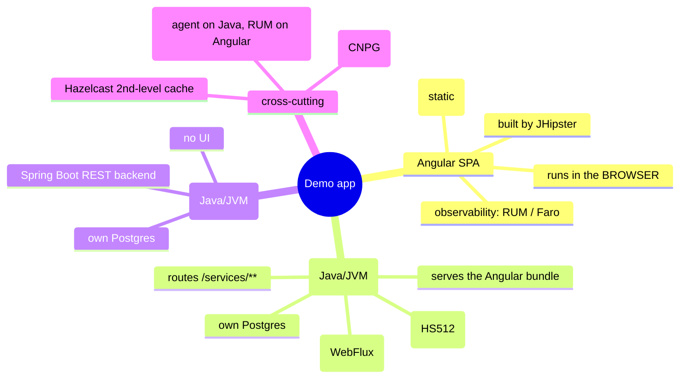
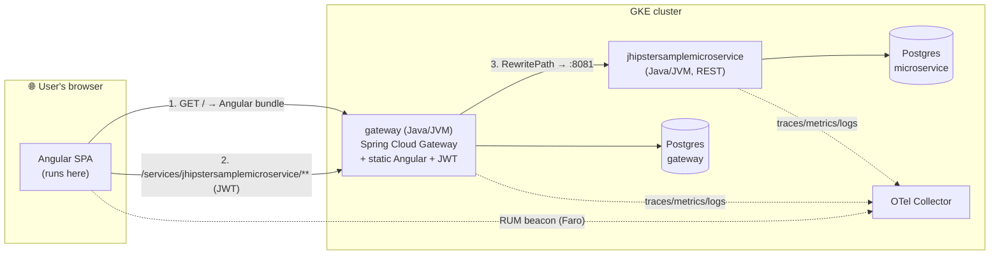
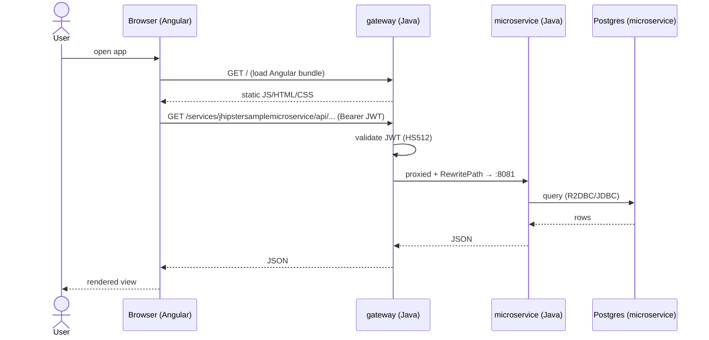

[← Previous: 201. Architecture](./201-ARCHITECTURE.md) | [🏠 Home](../README.md) | [→ Next: 301. Observability](./301-OBSERVABILITY.md)

---

# 202. Microservices Application Architecture

What the deployed **demo application** actually *is* — the JHipster apps the pipelines build and ship — and the single most common point of confusion: **`gateway` is a Java app, not Angular.** This page explains each component, where its code runs, how the Angular UI integrates, and where the source lives.

> **TL;DR.** Two **Java / Spring Boot** services on the JVM — **`gateway`** (a JHipster *Gateway*: Spring Cloud Gateway + JWT, and it *serves* the Angular bundle) and **`jhipstersamplemicroservice`** (a backend REST microservice) — plus an **Angular SPA** that is *built into* the gateway but **runs in the user's browser**. The gateway routes `/services/<svc>/**` to the microservices. Each service owns its own Postgres (database-per-service). The Java processes show up in the [JVM dashboard](./303-JVM-TUNING.md); Angular's counterpart is **browser RUM** (Grafana Faro).

## Understanding the app (newcomers → specialists)

This is a textbook **JHipster microservices** layout: a *gateway* (front door + UI host + auth) in front of one or more *microservices* (pure backends), each with its own database, talking OpenTelemetry. The thing to internalise: **"gateway" names a Java service, not the Angular frontend.** The Angular code is *packaged inside* the gateway jar and served as static files, but it executes client-side in the browser — so it has no JVM, no heap, no GC; its telemetry is Real-User-Monitoring from the browser, not JVM metrics.

<details>
<summary>🧠 Mental model — the app in one picture</summary>



</details>

<details>
<summary>🟢 For newcomers — "is the gateway Angular?"</summary>

No. It's a **Java program** (Spring Boot on the JVM, port 8080) that does two jobs:

1. **It's the front door / API gateway.** Browser requests for `/services/jhipstersamplemicroservice/...` are forwarded by the gateway to the backend microservice. It also does login / **JWT** tokens.
2. **It hands your browser the Angular app.** When you open the site, the gateway sends back the Angular HTML/JS/CSS (static files baked into its jar). Your *browser* then runs Angular.

So when you see `gateway` in the [JVM dashboard](./303-JVM-TUNING.md) with heap/GC/threads — that's the **Java** process. Angular isn't there because Angular runs on *your machine*, in the browser, not in the cluster. Angular's equivalent monitoring is **RUM** (Real User Monitoring) — page-load times, JS errors, Core Web Vitals — via **[Grafana Faro](https://grafana.com/oss/faro/)**.

</details>

<details>
<summary>🔵 For specialists — the JHipster gateway pattern</summary>

`gateway` is a JHipster **Gateway** application: Spring Boot 3.5 + **[Spring Cloud Gateway](https://spring.io/projects/spring-cloud-gateway)** on the reactive **WebFlux/Netty** stack. It owns the Angular client (the JHipster monolith-style frontend is generated into the gateway and emitted to `target/classes/static`, served by the same Netty server), terminates auth as **stateless JWT** (HS512, shared `JHIPSTER_SECURITY_AUTHENTICATION_JWT_BASE64_SECRET`), and proxies to microservices via declarative routes. `jhipstersamplemicroservice` is a Spring Boot 4.0 backend with no client. Both use **R2DBC** (reactive) + **JDBC/Hikari** (Liquibase migrations) against a **per-service** PostgreSQL, and JHipster's default **Hazelcast** 2nd-level cache. See [301](./301-OBSERVABILITY.md) (telemetry), [303](./303-JVM-TUNING.md) (JVM), [502](./502-MICROSERVICES_GITOPS.md) (how they're deployed).

</details>

## Components

| Component | Language / runtime | Framework | Port | Role | Serves a UI? | Own DB? | Source repo |
|---|---|---|---|---|---|---|---|
| **gateway** | **Java** / JVM (HotSpot, JDK 25) | Spring Boot 3.5 · **Spring Cloud Gateway** (WebFlux) | 8080 | API gateway + **serves the Angular SPA** + JWT auth | Hosts it (static) | ✅ Postgres `gateway` | [jhipster-sample-app-gateway](https://github.com/nubenetes/jhipster-sample-app-gateway) |
| **jhipstersamplemicroservice** | **Java** / JVM | Spring Boot 4.0 (REST) | 8081 | Backend microservice (REST only) | ❌ | ✅ Postgres `jhipstersamplemicroservice` | [jhipster-sample-app-microservice](https://github.com/nubenetes/jhipster-sample-app-microservice) |
| **Angular SPA** | **TypeScript / JavaScript** | Angular (JHipster client) | — (runs in browser) | The web UI | — (it *is* the UI) | ❌ (calls the backend) | bundled in the gateway repo above |

Both Java services are **forks of the JHipster sample apps** under [`github.com/nubenetes`](https://github.com/nubenetes), generated by **[JHipster](https://www.jhipster.tech/)** ([microservices architecture guide](https://www.jhipster.tech/microservices-architecture/)).

## Java vs Angular — where each actually runs

The crux of the confusion, side by side:

| Aspect | **Java services** (`gateway`, `jhipstersamplemicroservice`) | **Angular SPA** |
|---|---|---|
| Language | Java | TypeScript → JavaScript |
| Runtime | **JVM** (HotSpot) | **The user's browser** (V8/etc.) |
| Where it executes | In-cluster pods | Client-side, on the end user's device |
| Build artifact | jar → container image | static JS/HTML/CSS, **packaged into the gateway jar** |
| How it's delivered | runs as a Deployment | downloaded from the gateway on first page load |
| Observability signal | **OTel Java agent** → traces/metrics/logs + **JVM internals** (heap/GC/threads) → [jvm-internals dashboard](./303-JVM-TUNING.md) | **Browser RUM** → page loads, JS errors, **Core Web Vitals**, browser→backend traces |
| Recommended tooling | OpenTelemetry Java agent (auto) | **[Grafana Faro](https://grafana.com/oss/faro/)** (or OTel JS browser SDK) |
| In the JVM dashboard? | ✅ yes (`gateway`, `jhipstersamplemicroservice`) | ❌ no — it has no JVM |
| Source | the two repos above | the Angular client inside the gateway repo |

## How a request flows



1. The browser loads `/` → the **gateway** returns the **Angular** bundle.
2. Angular calls `/services/jhipstersamplemicroservice/**` (with the JWT) → the **gateway**.
3. Spring Cloud Gateway matches the route and **rewrites** the path to the microservice:

   ```yaml
   # gateway SPRING_APPLICATION_JSON (see the GitOps chart values)
   spring.cloud.gateway.routes:
     - id: jhipstersamplemicroservice
       uri: http://jhipstersamplemicroservice:8081
       predicates: [ "Path=/services/jhipstersamplemicroservice/**" ]
       filters:    [ "RewritePath=/services/jhipstersamplemicroservice/(?<remaining>.*), /${remaining}" ]
   ```
4. The microservice serves the REST call from **its own** Postgres and returns up the chain.

### End-to-end sequence



## Cross-cutting concerns

- **Data — database-per-service.** Each service has its **own** PostgreSQL (CloudNativePG), never shared: `gateway` ↔ Postgres `gateway`, microservice ↔ Postgres `jhipstersamplemicroservice`. Migrations run via **Liquibase**; access is **R2DBC** (reactive) + **JDBC/Hikari**. Sizing/HA differs per tier — see [502](./502-MICROSERVICES_GITOPS.md).
- **Auth — stateless JWT.** The gateway is the auth entry point; tokens are signed/verified with the shared base64 HS512 secret. No server-side session.
- **Cache — Hazelcast.** JHipster's default 2nd-level cache. On Kubernetes its pod-discovery needs RBAC; the gateway ships a small cache patch to avoid that — see [502](./502-MICROSERVICES_GITOPS.md) and [902 Troubleshooting](./902-TROUBLESHOOTING.md).
- **Observability per layer.** Java backends → **OTel Java agent** (traces/metrics/logs + JVM internals, see [303](./303-JVM-TUNING.md)); Angular → **browser RUM** (Grafana Faro / OTel JS), correlated end-to-end (**browser → gateway → microservice → DB**). The in-cluster OTel collector already permits the browser RUM beacon; wiring the SDK into the Angular client is a frontend-source change (the gateway repo above). See [301](./301-OBSERVABILITY.md).

## Frontend observability roadmap — instrumenting Angular with RUM

**Goal: full-stack observability.** Today OTel covers the Java backends end to end; the missing layer is the **browser**. With **Real User Monitoring (RUM)** a single user action would trace **browser → gateway → microservice → DB** as one correlated journey, plus **Core Web Vitals** (LCP / INP / CLS / TTFB / FCP), JavaScript errors and user sessions — the client-side counterpart to the [JVM internals](./303-JVM-TUNING.md) story for the backends.

**Current state.** The in-cluster **OTel collector already accepts the browser RUM beacon** (CORS + OTLP-http receiver — see `observability/otel-collector/values-*.yaml`). What's missing is the **Angular SPA emitting anything**: no RUM SDK is wired into the frontend yet.

| Option | What it gives | Grafana integration | Effort |
|---|---|---|---|
| **(a) Grafana Faro Web SDK** — *recommended for Grafana Cloud* | Web Vitals + JS errors + sessions + route timings + browser traces, in one SDK | **Turnkey**: the **Frontend Observability** app with built-in RUM dashboards (via the Faro receiver) | Low–medium |
| **(b) OpenTelemetry JS browser SDK** (`@opentelemetry/sdk-trace-web` + `auto-instrumentations-web`) | Browser **traces** (fetch/XHR/document-load) over OTLP-http to the existing collector → Tempo | Vendor-neutral; **you build the dashboards** | Medium |
| **(c) Do nothing** | Backend-only (current) | — | None |

**Implementation plan (honest roadmap).** Like the [CRaC roadmap](./303-JVM-TUNING.md#why-crac-is-the-chosen-advanced-direction), this change lives in the **Angular frontend of the gateway *source* repo** ([`jhipster-sample-app-gateway`](https://github.com/nubenetes/jhipster-sample-app-gateway)) — **not** this infra repo or the gitops repo. Steps:

1. Add **Faro** (or the OTel-web SDK) to the Angular bootstrap (`main.ts`).
2. Point it at the **Grafana Cloud Faro receiver** endpoint (option a) or the collector's **browser OTLP-http** endpoint (option b).
3. Propagate **W3C `tracecontext`** from the browser into the gateway so the browser span becomes the **root** of the existing backend trace (true end-to-end).
4. Enable the **Frontend Observability** app (Grafana Cloud) or add a custom RUM dashboard over the Faro/RUM data.

Once RUM flows, a frontend dashboard joins the existing set and traces correlate the whole way down — closing the loop from the user's click to the SQL query.

> Links: [Grafana Faro](https://grafana.com/oss/faro/) · [Grafana Cloud Frontend Observability](https://grafana.com/products/cloud/frontend-observability-for-real-user-monitoring/) · [OpenTelemetry JS](https://opentelemetry.io/docs/languages/js/)

## Where the code lives

| What | Repo |
|---|---|
| Gateway (Java) **+ Angular client** | <https://github.com/nubenetes/jhipster-sample-app-gateway> |
| Microservice (Java) | <https://github.com/nubenetes/jhipster-sample-app-microservice> |
| How they're built (CI) | [402. Pipelines-as-Code](./402-PIPELINES_AS_CODE.md) |
| How they're deployed (GitOps/Helm) | [502. Microservices GitOps](./502-MICROSERVICES_GITOPS.md) |
| Generator / framework | [JHipster](https://www.jhipster.tech/) · [Spring Cloud Gateway](https://spring.io/projects/spring-cloud-gateway) · [Angular](https://angular.dev/) |

### Origin & why these repos are forks

Both service repos are **GitHub forks of the official JHipster sample apps** —
[`jhipster/jhipster-sample-app-gateway`](https://github.com/jhipster/jhipster-sample-app-gateway)
and [`jhipster/jhipster-sample-app-microservice`](https://github.com/jhipster/jhipster-sample-app-microservice),
the canonical JHipster microservices demo (a Spring Cloud **gateway** that serves the
Angular SPA + a REST **microservice**) — forked into the **[`nubenetes`](https://github.com/nubenetes)**
org so the project **owns** them. Ownership is required to:

- **commit pipelines-as-code** into each app repo (the Jenkins `Jenkinsfile`, the Tekton
  `.tekton/` `PipelineRun`s) — you cannot push CI config to upstream repos you don't control;
- let **CI build them and report commit status** (Jenkins / Tekton Pipelines-as-Code /
  GitHub Actions) on owned repos — see [403 § "why fork"](./403-TEKTON.md);
- **pin versions** and host the project-specific changes the demo needs — branch tracking
  and the planned **CRaC** ([303](./303-JVM-TUNING.md)) + **Angular Faro RUM** (above)
  work, none of which belongs upstream.

[`jenkins/pipelines/seed/services.yaml`](../jenkins/pipelines/seed/services.yaml) points the
pipelines at these forks (not at `jhipster/*`).

> **Branches.** The forks currently track **`main` only** (the upstream apps ship no
> `develop` branch), so the `develop` tier builds the *same* image as `stable` and differs
> only in deploy namespace + `values-develop.yaml`. Adding a real `develop` branch to each
> fork (and flipping `services.yaml` `branches.develop` → `develop`) would make the develop
> tier exercise **true branch-based app-code promotion** (a faithful dev→prod flow), at the
> cost of keeping two app branches in sync. See [402](./402-PIPELINES_AS_CODE.md).

---

[← Previous: 201. Architecture](./201-ARCHITECTURE.md) | [🏠 Home](../README.md) | [→ Next: 301. Observability](./301-OBSERVABILITY.md)

---

*202. Microservices Application Architecture — jenkins-2026*
