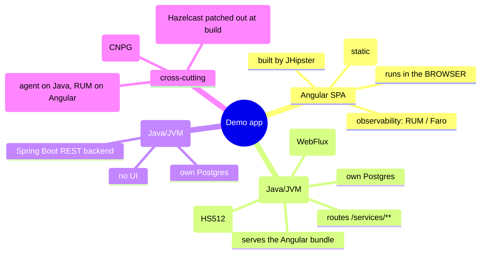
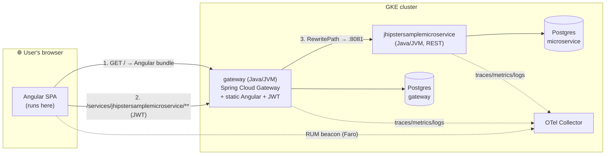
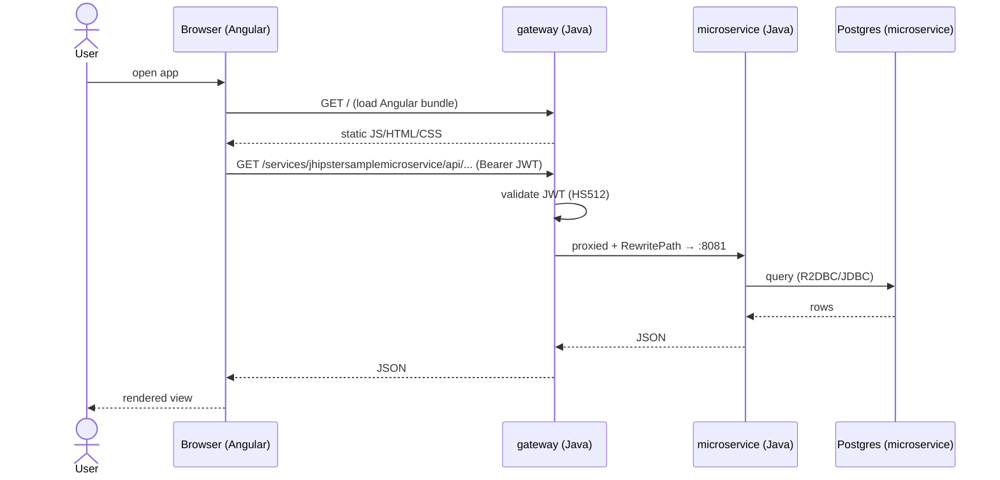
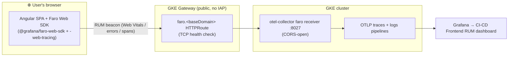

[← Previous: 201. Architecture](./201-ARCHITECTURE.md) | [🏠 Home](../README.md) | [→ Next: 301. Observability](./301-OBSERVABILITY.md)

---

# 202. Microservices Application Architecture

What the deployed **demo application** actually *is* — the JHipster apps the pipelines build and ship — and the single most common point of confusion: **`gateway` is a Java app, not Angular.** This page explains each component, where its code runs, how the Angular UI integrates, and where the source lives.

> **TL;DR.** Two **Java / Spring Boot** services on the JVM — **`gateway`** (a JHipster *Gateway*: Spring Cloud Gateway + JWT, and it *serves* the Angular bundle) and **`jhipstersamplemicroservice`** (a backend REST microservice) — plus an **Angular SPA** that is *built into* the gateway but **runs in the user's browser**. The gateway routes `/services/<svc>/**` to the microservices. Each service owns its own Postgres (database-per-service). The Java processes show up in the [JVM dashboard](./303-JVM-TUNING.md); Angular's counterpart is **browser RUM** (Grafana Faro).

## Understanding the app (newcomers → specialists)

This is a textbook **JHipster microservices** layout: a *gateway* (front door + UI host + auth) in front of one or more *microservices* (pure backends), each with its own database, talking OpenTelemetry. The thing to internalise: **"gateway" names a Java service, not the Angular frontend.** The Angular code is *packaged inside* the gateway jar and served as static files, but it executes client-side in the browser — so it has no JVM, no heap, no GC; its telemetry is Real-User-Monitoring from the browser, not JVM metrics.

<details>
<summary>🧠 Mental model — the app in one picture</summary>



</details>

<details>
<summary>🟢 For newcomers — "is the gateway Angular?"</summary>

No. It's a **Java program** (Spring Boot on the JVM, port 8080) that does two jobs:

1. **It's the front door / API gateway.** Browser requests for `/services/jhipstersamplemicroservice/...` are forwarded by the gateway to the backend microservice. It also does login / **JWT** tokens.
2. **It hands your browser the Angular app.** When you open the site, the gateway sends back the Angular HTML/JS/CSS (static files baked into its jar). Your *browser* then runs Angular.

So when you see `gateway` in the [JVM dashboard](./303-JVM-TUNING.md) with heap/GC/threads — that's the **Java** process. Angular isn't there because Angular runs on *your machine*, in the browser, not in the cluster. Angular's equivalent monitoring is **RUM** (Real User Monitoring) — page-load times, JS errors, Core Web Vitals — via **[Grafana Faro](https://grafana.com/oss/faro/)**.

</details>

<details>
<summary>🔵 For specialists — the JHipster gateway pattern</summary>

`gateway` is a JHipster **Gateway** application: Spring Boot 3.5 + **[Spring Cloud Gateway](https://spring.io/projects/spring-cloud-gateway)** on the reactive **WebFlux/Netty** stack. It owns the Angular client (the JHipster monolith-style frontend is generated into the gateway and emitted to `target/classes/static`, served by the same Netty server), terminates auth as **stateless JWT** (HS512, shared `JHIPSTER_SECURITY_AUTHENTICATION_JWT_BASE64_SECRET`), and proxies to microservices via declarative routes. `jhipstersamplemicroservice` is a Spring Boot 4.0 backend with no client. Both use **R2DBC** (reactive) + **JDBC/Hikari** (Liquibase migrations) against a **per-service** PostgreSQL. JHipster's default **Hazelcast** 2nd-level cache is swapped for a **NoOp cache** at build time (shared [`resources/patch-app-source.sh`](../resources/patch-app-source.sh), applied by all four CI engines). See [301](./301-OBSERVABILITY.md) (telemetry), [303](./303-JVM-TUNING.md) (JVM), [502](./502-MICROSERVICES_GITOPS.md) (how they're deployed).

</details>

## Components

| Component | Language / runtime | Framework | Port | Role | Serves a UI? | Own DB? | Source repo |
|---|---|---|---|---|---|---|---|
| **gateway** | **Java** / JVM (HotSpot, JDK 25) | Spring Boot 3.5 · **Spring Cloud Gateway** (WebFlux) | 8080 | API gateway + **serves the Angular SPA** + JWT auth | Hosts it (static) | ✅ Postgres `gateway` | [jhipster-sample-app-gateway](https://github.com/nubenetes/jhipster-sample-app-gateway) |
| **jhipstersamplemicroservice** | **Java** / JVM | Spring Boot 4.0 (REST) | 8081 | Backend microservice (REST only) | ❌ | ✅ Postgres `jhipstersamplemicroservice` | [jhipster-sample-app-microservice](https://github.com/nubenetes/jhipster-sample-app-microservice) |
| **Angular SPA** | **TypeScript / JavaScript** | Angular (JHipster client) | — (runs in browser) | The web UI | — (it *is* the UI) | ❌ (calls the backend) | bundled in the gateway repo above |

Both Java services are **forks of the JHipster sample apps** under [`github.com/nubenetes`](https://github.com/nubenetes), generated by **[JHipster](https://www.jhipster.tech/)** ([microservices architecture guide](https://www.jhipster.tech/microservices-architecture/)).

## Java vs Angular — where each actually runs

The crux of the confusion, side by side:

| Aspect | **Java services** (`gateway`, `jhipstersamplemicroservice`) | **Angular SPA** |
|---|---|---|
| Language | Java | TypeScript → JavaScript |
| Runtime | **JVM** (HotSpot) | **The user's browser** (V8/etc.) |
| Where it executes | In-cluster pods | Client-side, on the end user's device |
| Build artifact | jar → container image | static JS/HTML/CSS, **packaged into the gateway jar** |
| How it's delivered | runs as a Deployment | downloaded from the gateway on first page load |
| Observability signal | **OTel Java agent** → traces/metrics/logs + **JVM internals** (heap/GC/threads) → [jvm-internals dashboard](./303-JVM-TUNING.md) | **Browser RUM** → page loads, JS errors, **Core Web Vitals**, browser→backend traces |
| Recommended tooling | OpenTelemetry Java agent (auto) | **[Grafana Faro](https://grafana.com/oss/faro/)** (or OTel JS browser SDK) |
| In the JVM dashboard? | ✅ yes (`gateway`, `jhipstersamplemicroservice`) | ❌ no — it has no JVM |
| Source | the two repos above | the Angular client inside the gateway repo |

## How a request flows



1. The browser loads `/` → the **gateway** returns the **Angular** bundle.
2. Angular calls `/services/jhipstersamplemicroservice/**` (with the JWT) → the **gateway**.
3. Spring Cloud Gateway matches the route and **rewrites** the path to the microservice:

   ```yaml
   # gateway SPRING_APPLICATION_JSON (see the GitOps chart values)
   spring.cloud.gateway.routes:
     - id: jhipstersamplemicroservice
       uri: http://jhipstersamplemicroservice:8081
       predicates: [ "Path=/services/jhipstersamplemicroservice/**" ]
       filters:    [ "RewritePath=/services/jhipstersamplemicroservice/(?<remaining>.*), /${remaining}" ]
   ```
4. The microservice serves the REST call from **its own** Postgres and returns up the chain.

### End-to-end sequence



## Cross-cutting concerns

- **Data — database-per-service.** Each service has its **own** PostgreSQL (CloudNativePG), never shared: `gateway` ↔ Postgres `gateway`, microservice ↔ Postgres `jhipstersamplemicroservice`. Migrations run via **Liquibase**; access is **R2DBC** (reactive) + **JDBC/Hikari**. Sizing/HA differs per tier — see [502](./502-MICROSERVICES_GITOPS.md).
- **Auth — stateless JWT.** The gateway is the auth entry point; tokens are signed/verified with the shared base64 HS512 secret. No server-side session.
- **Cache — NoOp (Hazelcast removed at build time).** JHipster's default gateway ships a **Hazelcast** 2nd-level cache whose Kubernetes pod-discovery needs RBAC. Rather than diverge the fork, the shared [`resources/patch-app-source.sh`](../resources/patch-app-source.sh) — run by **all four CI engines** right after checkout, before build — swaps it for a **NoOp cache** (a `CacheConfiguration` returning a `NoOpCacheManager`), so the cache code still wires up but against no real cache. See [502](./502-MICROSERVICES_GITOPS.md) and [902 Troubleshooting](./902-TROUBLESHOOTING.md).
- **Observability per layer.** Java backends → **OTel Java agent** (traces/metrics/logs + JVM internals, see [303](./303-JVM-TUNING.md)); Angular → **browser RUM** (Grafana Faro / OTel JS), correlated end-to-end (**browser → gateway → microservice → DB**). The in-cluster OTel collector already permits the browser RUM beacon; wiring the SDK into the Angular client is a frontend-source change (the gateway repo above). See [301](./301-OBSERVABILITY.md).

## Frontend observability — Angular RUM with Grafana Faro (implemented)

**Full-stack observability is now closed.** OTel covers the Java backends; the browser layer is covered by **Real User Monitoring (RUM)** via the **[Grafana Faro Web SDK](https://grafana.com/oss/faro/)** (option **(a)** below — chosen for its turnkey Web-Vitals/errors/sessions/traces in one SDK), instrumented into the Angular SPA. It captures **Core Web Vitals** (LCP / INP / CLS / TTFB / FCP), JavaScript errors, user sessions and browser spans — the client-side counterpart to the [JVM internals](./303-JVM-TUNING.md) story for the backends.

### How it's wired (end to end)



| Piece | Where | Detail |
|---|---|---|
| **SDK** | gateway repo `develop` branch | `@grafana/faro-web-sdk` + `@grafana/faro-web-tracing` (v2.8.0); init in `src/main/webapp/app/core/faro/faro.ts`, called from `main.ts` before bootstrap; `url`/`environment` from `environments/*` |
| **Public endpoint** | this repo | `faro.<baseDomain>` HTTPRoute (no IAP) → `otel-collector-gateway:8027`, **TCP** HealthCheckPolicy (the receiver only answers POST). `config.yaml gateway.hosts.faro`, generated by [`09-gateway.sh`](../scripts/09-gateway.sh) |
| **Receiver** | this repo | the **faro receiver** on all 4 collector backends (`observability/otel-collector/values-*.yaml`) → OTLP traces+logs |
| **Dashboard** | this repo | **CI-CD Frontend RUM (Angular / Faro)** (uid `in7bmb6`) — Web Vitals, errors, sessions, browser audience, browser traces. See [301](./301-OBSERVABILITY.md) |

> **Backend fidelity — RUM is native on Grafana Cloud & OSS only.** Faro is a Grafana-native signal (Loki/Tempo). It has **full fidelity on `observability.mode=grafana-cloud` and `oss`** (both store Faro logs/traces in Loki/Tempo, so the dashboard renders exactly as designed; OSS reads the canonical board directly). On **`managed-azure`/`managed-aws`** there is no Faro-native store, so the dashboard variants map Faro to generic App Insights KQL / CloudWatch + X-Ray and **degrade** — data arrives but Faro-specific panels (web-vitals, sessions, per-route) show generic rows or no data. Full per-backend matrix in [301 § Frontend RUM (Grafana Faro) per backend](./301-OBSERVABILITY.md#frontend-rum-grafana-faro-per-backend--native-on-grafana-cloud--oss). **Use Grafana Cloud or OSS for real Angular RUM.**

The Faro ingest URL (`https://faro.<baseDomain>`) is surfaced like every other endpoint: the GHA **Access URLs** step (`Day1.cluster.01-gke`) and the **Jenkins system banner** — though it's a beacon endpoint, **not a UI** (POSTs only).

### Activating real data

**Status: live on `develop`, promoted to `main`.** The Faro SDK shipped on the gateway's **`develop` branch** (feature-on-develop-first), and the develop tier is deployed with it — image **`gateway:develop-<build#>`** (immutable P3 tag), and the **served Angular bundle includes the Faro SDK** pointing at the public endpoint (verified). Open the **develop** site (`microservices-develop.<baseDomain>`) in a real browser → beacons flow to the RUM dashboard (`env=develop`). The instrumentation was then **promoted to `main`** with the Faro `environment` flipped to **`stable`**, so rebuilding the stable **`gateway`** job lights up RUM on the stable tier too (`env=stable`, same endpoint). **Without a browser**, the **`Day2.traffic.02` Synthetic RUM** workflow POSTs synthetic Faro beacons (incl. OTLP browser spans). **Build note:** the faro/otel transitive `.d.ts` reference Node types (`global`/`path`) → the gateway tsconfig needs `skipLibCheck: true` (see [902](./902-TROUBLESHOOTING.md)).

> Alternative considered: **(b) OpenTelemetry JS browser SDK** (`@opentelemetry/sdk-trace-web`) — vendor-neutral browser traces over OTLP-http, but you build the dashboards. Faro was chosen for the turnkey RUM. Next step for true single-trace correlation: propagate **W3C `tracecontext`** from the browser into the gateway so the browser span roots the backend trace.

> Links: [Grafana Faro](https://grafana.com/oss/faro/) · [Grafana Cloud Frontend Observability](https://grafana.com/products/cloud/frontend-observability-for-real-user-monitoring/) · [OpenTelemetry JS](https://opentelemetry.io/docs/languages/js/)

## Where the code lives

| What | Repo |
|---|---|
| Gateway (Java) **+ Angular client** | <https://github.com/nubenetes/jhipster-sample-app-gateway> |
| Microservice (Java) | <https://github.com/nubenetes/jhipster-sample-app-microservice> |
| How they're built (CI) | [402. Pipelines-as-Code](./402-PIPELINES_AS_CODE.md) |
| How they're deployed (GitOps/Helm) | [502. Microservices GitOps](./502-MICROSERVICES_GITOPS.md) |
| Generator / framework | [JHipster](https://www.jhipster.tech/) · [Spring Cloud Gateway](https://spring.io/projects/spring-cloud-gateway) · [Angular](https://angular.dev/) |

### Why JHipster (why this demo app)

The platform needs a **realistic, multi-service Java workload** to make its CI/CD, JVM-tuning
and observability stories actually *land* — a toy "hello-world" would exercise none of them.
[JHipster](https://www.jhipster.tech/) is a standard, widely-used scaffolder whose official
sample apps are **production-shaped out of the box**, which is exactly what this project needs:

- **A real microservices topology** — a *gateway* (Spring Cloud Gateway + JWT) in front of a
  backend *microservice*, **database-per-service** (CloudNativePG), and a 2nd-level cache — not a
  single monolith. This is what the GitOps/Helm deploy ([502](./502-MICROSERVICES_GITOPS.md)) and
  the NetworkPolicy segmentation ([503](./503-NETWORKING.md)) stories operate on.
- **Java / Spring on the JVM** — so the **JVM-internals** narrative (container-default trap, G1/heap,
  **CRaC** — [303](./303-JVM-TUNING.md)) and the **OTel Java agent** ([301](./301-OBSERVABILITY.md))
  have real heap/GC/thread telemetry to show; a Node/Go toy would have none of it.
- **An Angular SPA served by the gateway** — which is what makes the **frontend RUM** (Grafana Faro,
  below) story possible: full-stack **browser → JVM** observability, not just backend.
- **A representative CI/CD surface** — real Maven build + tests, SAST/DAST scans, image build (Jib)
  and GitOps deploy — the same shape an enterprise pipeline has, so all four CI engines have
  something *substantial* to build (not a stub).
- **Canonical, open-source, reproducible** — the official JHipster samples (Apache-2.0), so anyone
  can regenerate/verify them and they're recognisable to the wider Spring community.

In short: JHipster is the **smallest thing that is still representative** — it forces the platform
to solve the real problems (multi-service routing, per-service DBs, JVM behaviour, frontend +
backend telemetry) instead of demoing them on a stub.

### Origin & why these repos are forks

Both service repos are **GitHub forks of the official JHipster sample apps** —
[`jhipster/jhipster-sample-app-gateway`](https://github.com/jhipster/jhipster-sample-app-gateway)
and [`jhipster/jhipster-sample-app-microservice`](https://github.com/jhipster/jhipster-sample-app-microservice),
the canonical JHipster microservices demo (a Spring Cloud **gateway** that serves the
Angular SPA + a REST **microservice**) — forked into the **[`nubenetes`](https://github.com/nubenetes)**
org so the project **owns** them. Ownership is required to:

- **commit pipelines-as-code** into each app repo (the Tekton `.tekton/` `PipelineRun`s, the
  GitHub Actions `.github/workflows/` workflow, and the git-push webhooks the Argo Workflows /
  Tekton EventSources need) — you cannot push CI config to upstream repos you don't control;
- let **CI build them and report commit status** (all four `ci.engine` engines — Jenkins
  multibranch, Tekton Pipelines-as-Code, GitHub Actions, Argo Workflows) on owned repos —
  see [403 § "why fork"](./403-TEKTON.md);
- **pin versions** and host the project-specific changes the demo needs — branch tracking
  and the planned **CRaC** ([303](./303-JVM-TUNING.md)) + **Angular Faro RUM** (above)
  work, none of which belongs upstream.

[`jenkins/pipelines/seed/services.yaml`](../jenkins/pipelines/seed/services.yaml) points the
pipelines at these forks (not at `jhipster/*`).

> **Branches.** The nubenetes forks now carry a real **`develop`** branch (created off
> `main`; the original upstream `jhipster/*` repos have only `main`), and `services.yaml`
> `branches.develop` is set to **`develop`** — so the develop tier exercises **true
> branch-based app-code promotion** (develop code → develop env, promote to `main` →
> stable env), not just a different deploy of the same `main` image. Keep the two app
> branches in sync. See [402](./402-PIPELINES_AS_CODE.md).

---

[← Previous: 201. Architecture](./201-ARCHITECTURE.md) | [🏠 Home](../README.md) | [→ Next: 301. Observability](./301-OBSERVABILITY.md)

---

*202. Microservices Application Architecture — jenkins-2026*
