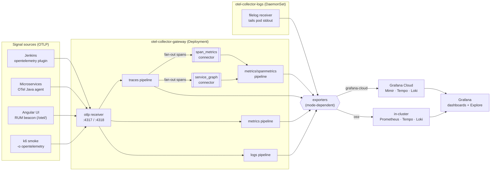
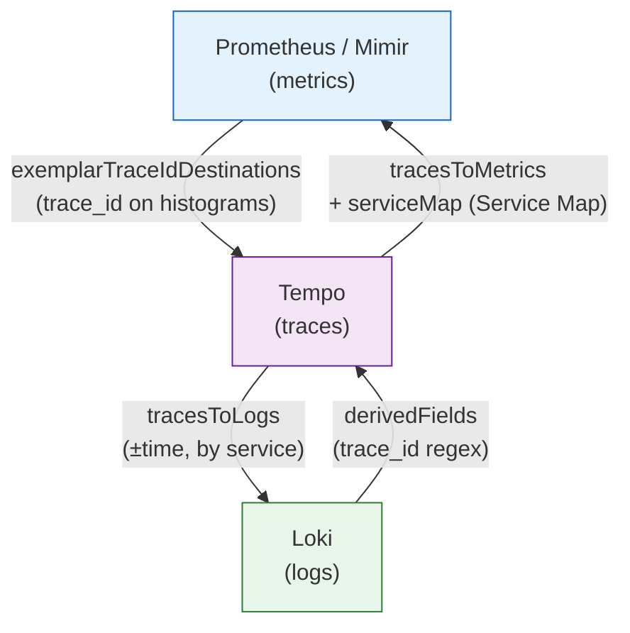
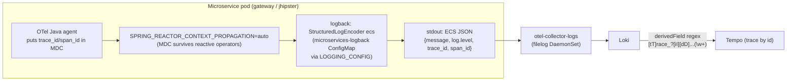
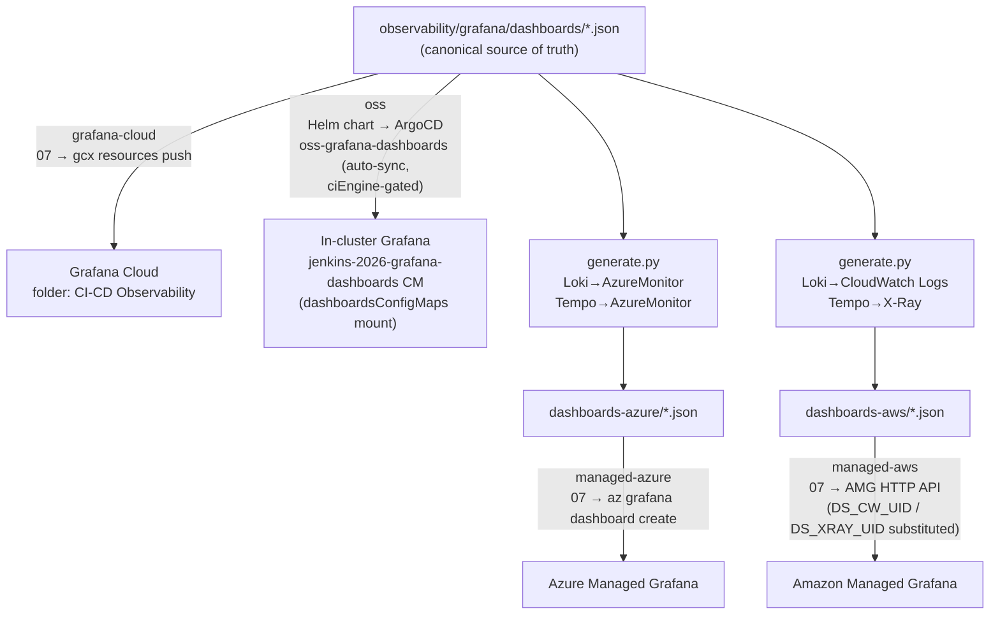
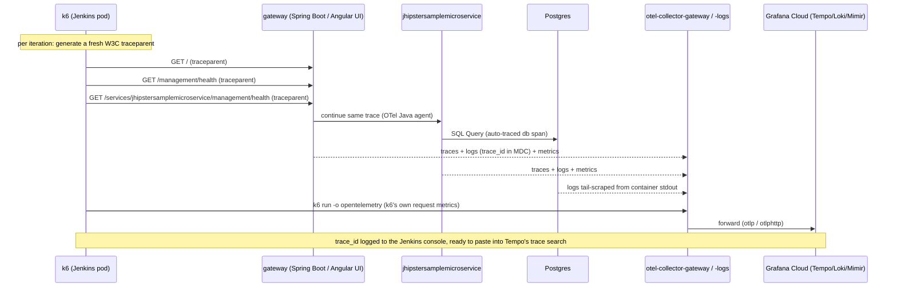
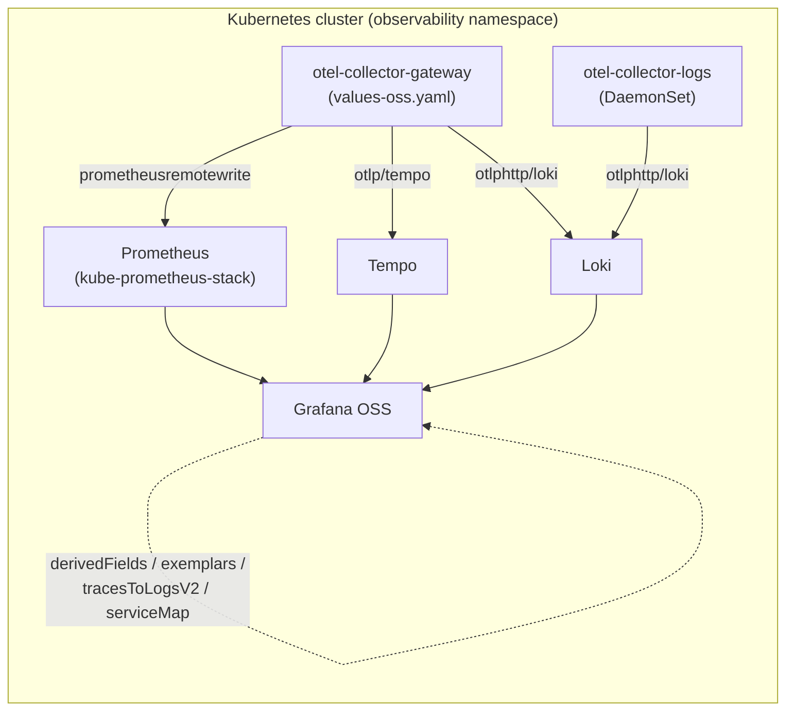

[← Previous: 201. Architecture](./201-ARCHITECTURE.md) | [🏠 Home](../README.md) | [→ Next: 401. Jenkins](./401-JENKINS.md)

---

# 301. Observability

Jenkins (via the `opentelemetry` plugin), every Java microservice (via OTel Operator auto-instrumentation), and the Angular UI (via a small RUM snippet) export OTLP to an in-cluster collector, which forwards to one of four backends selected by `observability.mode`: an in-cluster OSS **Prometheus+Loki+Tempo+Grafana** stack (`oss`), **Grafana Cloud**, **Azure Managed Grafana** + Azure Monitor (`managed-azure`), or **Amazon Managed Grafana** + AMP/X-Ray/CloudWatch (`managed-aws`).

> **Exactly one backend is active per cluster, and the choice is deterministic & idempotent** — exactly like `ci.engine` (jenkins ↔ tekton). Re-running `Day1.cluster.01` (or `scripts/03-observability.sh`) with a *different* `observability.mode` **auto-retires the previously-deployed backend's in-cluster footprint** (the OTel collectors are reconfigured for the new backend; the other modes' agents — `pdc-agent`/`k8s-monitoring` for grafana-cloud, the OSS `observability-oss` app-of-apps, `kube-state-metrics`/`prometheus-node-exporter` for managed-*— are uninstalled) and provisions the chosen one, so you never end up with two Grafanas. Defaults: the `Day1.cluster.01` form defaults to **`oss`** (needs no external backend); `config/config.yaml`'s durable default is `grafana-cloud`. The persistent managed backends *themselves* (the Grafana Cloud stack / Azure Managed Grafana / Amazon Managed Grafana, created by `Day0.infra.0{2,3,4}`) are decoupled from the cluster and, **by default, are not** destroyed by a mode switch (the switch only retires the in-cluster footprint; use their `Decom.infra.*` workflows to remove the external backend). To enforce a **true single backend** — also `terraform destroy` the persistent stacks of the *non-selected* modes on the same Day1 — set the opt-in **`destroy_unused_backends`** input on `Day1.cluster.01` (it reuses the per-backend `Decom.infra.0{2,3,4}` workflows via `workflow_call`). ⚠ **Irreversible**: it wipes that backend's history/dashboards, and re-selecting the mode later recreates it empty; it also needs that backend's credentials/identifiers configured. Off by default.

Every component — Jenkins, the Spring Boot microservices, and the Angular UI — exports OpenTelemetry **traces**, **metrics**, and **logs**, correlated by `trace_id`/`span_id` and common resource attributes (`service.name`, `service.namespace=jenkins-2026`, `deployment.environment=stable`).

## Key Features

- **gcx CLI GitOps**: Dashboard deployment in Grafana Cloud is managed via the native **`gcx` CLI**. The `scripts/07-grafana-dashboards.sh` script automatically installs and authenticates the `gcx` CLI, wraps raw JSON dashboards into Kubernetes-style `apiVersion: dashboard.grafana.app/v1` manifests, and pushes resources declaratively using `gcx resources push --include-managed`.
- **Jenkins Data Source**: The [Jenkins Datasource](https://grafana.com/grafana/plugins/grafana-jenkins-datasource/) is automatically provisioned.
  - **One-time Manual Step**: You must manually install the **`grafana-jenkins-datasource`** plugin in your Grafana Cloud portal (**Administration > Plugins**) before the first deployment.
  - **PDC Tunnel**: In Grafana Cloud mode, it uses **Private Data Source Connect (PDC)** to securely tunnel from the cloud to your in-cluster Jenkins instance.
- **Model Context Protocol (MCP)**: This project supports Grafana Cloud's hosted **MCP server**. Connecting an AI agent (like Gemini) to your stack via MCP allows for real-time querying of Jenkins traces, metrics, and logs. In your Grafana Cloud portal, go to **Administration > Assistant > Cloud MCP** to find your connection endpoint.
- **GKE Kubernetes Cluster Observability**: Automatic telemetry collection for GKE hosts, nodes, namespaces, and cluster events using the official `grafana/k8s-monitoring` Helm chart (v4.0+).
  - **Zero Log Duplication**: Disables log collection inside the chart (`podLogsViaLoki.enabled=false`) to prevent dual ingestion charges.
  - **Zero-Touch Config**: Automatically maps default Prometheus, Loki, and Tempo data sources via `gcx api`.
- **Correlated telemetry**: Traces, metrics, and logs are fully correlated. Log-to-trace links and system datasources are pre-configured by default on Grafana Cloud.

## GCP platform metrics — Cloud provider integration (optional)

Separate from the OTLP pipeline above, Grafana Cloud's **Observability → Cloud provider → GCP** is a Grafana-Cloud-hosted scraper that pulls **GCP Cloud Monitoring** metrics (GKE control plane, Compute, the L7 Gateway/LB, GCS, quotas, …) into the stack — **no in-cluster collector**, complementary to our OTel signals (which cover workloads/pods; this covers the GCP-managed platform layer).

It can't use Workload Identity Federation (the scraper isn't a GCP workload), so it needs a **service-account key** uploaded in the Grafana Cloud UI — **the one long-lived credential in the project**, vs the keyless WIF/federation everywhere else. The read-only SA + roles (`monitoring.viewer`, `cloudasset.viewer`) are IaC-managed (human-run, opt-in) in [`terraform/grafana-cloud-gcp`](../terraform/grafana-cloud-gcp/); the key is minted out-of-band (never stored in Terraform state) and pasted into the UI. See that module's README for the runbook. For trial exploration you can also just configure it by hand in the UI.

## OTel Components

### OpenTelemetry Operator

Installed first (`scripts/02-otel-operator.sh`). Provides the `Instrumentation` and `OpenTelemetryCollector` CRDs. [`scripts/02-otel-operator.sh`](../scripts/02-otel-operator.sh) waits for the webhook to actually be serving (its caBundle populated) before proceeding.

### Java Auto-Instrumentation

The `helm/microservices` chart creates an `Instrumentation` CR (`microservices-java`) per namespace, pointing at `otel-collector-gateway.observability.svc.cluster.local:4317`. Each `java`-typed service's Deployment gets the pod annotation `instrumentation.opentelemetry.io/inject-java: "true"`, so the operator's mutating webhook injects the OTel Java agent automatically — no code changes to Microservices.

Key settings on the `Instrumentation` CR:
- `OTEL_INSTRUMENTATION_LOGBACK_APPENDER_ENABLED=true` — injects `trace_id`/`span_id` into every log line's MDC.
- `OTEL_RESOURCE_ATTRIBUTES=deployment.environment=stable,service.namespace=jenkins-2026`
- `sampler: parentbased_traceidratio` @ `1.0` (sample everything).

### Angular RUM

A small (~100 line) vanilla-JS OTel Web shim, injected into the Angular app's `index.html` via an nginx `sub_filter`. It emits a "page load" span using the Navigation Timing API and patches `window.fetch` to add a W3C `traceparent` header to every call to `/api/*`.

### OTel Collector

Two `open-telemetry/opentelemetry-collector` releases:
- **`otel-collector-gateway`** (Deployment) — receives OTLP/gRPC (4317) and OTLP/HTTP (4318, with permissive CORS for the browser RUM beacon).
- **`otel-collector-logs`** (DaemonSet) — tails `/var/log/pods/*/*/*.log` on every node via the `filelog` receiver and forwards log records to the same backend.

### Jenkins Plugin

The `opentelemetry` plugin exports one span per pipeline run / stage / step as `service.name=jenkins` to the same gateway — so a Microservices deploy's CI trace and the resulting application traces share the same backend.

> **Tekton CI (`ci.engine=tekton`).** When the alternative CI engine is selected, Tekton emits PipelineRun/TaskRun traces to the same in-cluster OTel collector — `scripts/04-tekton.sh` patches Tekton's `config-tracing` to point at the gateway — and the k6 Task carries `OTEL_SERVICE_NAME=tekton-pipeline-k6-smoke`, mirroring the Jenkins `jenkins-pipeline-*` convention. Pipeline telemetry therefore lands in Tempo/Loki/Prometheus exactly the same way regardless of CI engine. See [403. Tekton](./403-TEKTON.md).

## Telemetry Architecture and Signal Flow

<details>
<summary>🔍 Click to expand End-to-End Telemetry Architecture Diagram</summary>



</details>

**Why `span_metrics` and `service_graph` connectors?** Without them, *no span-derived metrics exist* — Tempo's **Service Map / node graph stays empty** and there are no RED (Rate/Errors/Duration) metrics. They produce `traces_spanmetrics_*` (with `trace_id` **exemplars**) and `traces_service_graph_request_*`.

## Signal Correlation: Metrics, Traces, and Logs

<details>
<summary>🔍 Click to expand Signal Correlation Diagram</summary>



</details>

| Direction | How it's wired | What had to be added |
|---|---|---|
| **Metrics → Traces** | `exemplarTraceIdDestinations` on the Prometheus DS; OTel histograms carry `trace_id` exemplars | exemplars on `span_metrics` connector |
| **Traces → Logs** | Tempo `tracesToLogs(V2)` → Loki, scoped by `service.name` + time window | — (worked once logs existed) |
| **Traces → Metrics + Service Map** | Tempo `tracesToMetrics` + `serviceMap` → Prometheus | the `span_metrics` / `service_graph` connectors |
| **Logs → Traces** | Loki `derivedFields` regex extracts `trace_id` from the log line → Tempo | ECS-JSON logs **and** reactive context propagation |

## Structured Logging Deep Dive

`Logs → Traces` is the hardest link because it needs the `trace_id` *inside the log line*. Two app-side problems were solved declaratively in the **GitOps repo**:

1. **JHipster logs plain text.** The apps ship their own `logback-spring.xml` with a custom `CONSOLE_LOG_PATTERN`, so Spring Boot 3.5's native `logging.structured.format.console=ecs` is a no-op. Fix: mount a tiny logback config (`microservices-logback` ConfigMap) using spring-boot's `StructuredLogEncoder` (`format: ecs`) and point the app at it with `LOGGING_CONFIG=/etc/logback/logback.xml`. Result: ECS JSON with `message`, `log.level`, `service`, and MDC fields.

2. **The gateway is reactive (WebFlux).** The OTel agent injects `trace_id` into the logging **MDC via thread-locals**, which don't survive across Reactor operators. Fix: `SPRING_REACTOR_CONTEXT_PROPAGATION=auto`, which enables Reactor automatic context propagation so the agent's `trace_id`/`span_id` reach the MDC.

<details>
<summary>🔍 Click to expand Structured Logging & Logs→Traces Chain Diagram</summary>



</details>

### Log Levels

The `microservices-logback` ConfigMap is the single authority on log levels (it *replaces* JHipster's own `logback-spring.xml`):

```xml
<logger name="org.springframework" level="WARN"/>
<logger name="org.apache"          level="WARN"/>
<logger name="org.hibernate"       level="WARN"/>
<logger name="com.netflix"         level="WARN"/>
<logger name="io.netty"            level="WARN"/>
<logger name="reactor"             level="WARN"/>
<logger name="liquibase"           level="WARN"/>
<root level="INFO"/>
```

This is **mode-independent** — applies unchanged across all four observability modes (`grafana-cloud`, `oss`, `managed-azure`, `managed-aws`).

Two real reasons business logs look sparse at `INFO`:
1. **The services are idle.** Run `microservices-k6-smoke` to generate traffic and correlation.
2. **JHipster logs per-request detail at `DEBUG`.** To make request-time lines appear, lower the app's base package logger in the ConfigMap, then restart pods.

## OTel Injection Race

The OTel Operator injects the Java agent via a **mutating webhook** at pod-admission time, only if the `Instrumentation` CR is already in its cache. That webhook has `failurePolicy: Ignore` by design, so a pod admitted *before* the CR/webhook is ready starts **without** the agent and silently emits no metrics/traces.

Guards against it:
- `scripts/02-otel-operator.sh` waits for the webhook to be serving before proceeding.
- `scripts/ensure-otel-injection.sh` is an idempotent verify-and-heal: it `rollout restart`s any running microservices Deployment whose pods lack the agent.
- `test/smoke-test.sh` asserts the agent is injected on every running microservices Deployment.

## Observability Dashboards

### Dashboard architecture

Each observability mode has its **own independent set of dashboards** published to its own Grafana instance. They are not shared — switching from `grafana-cloud` to `managed-aws` means a completely different Grafana URL and a completely different dashboard set.

#### Source of truth: canonical dashboards

The canonical JSON files live in [`observability/grafana/dashboards/`](../observability/grafana/dashboards/). They use portable datasource template variables (`${DS_PROMETHEUS}` / `${DS_LOKI}` / `${DS_TEMPO}`) and are the **single source of truth** for content. The **Shipped** column shows which dashboards are always present versus the two CI-overview dashboards that are mutually exclusive — only the one for the active `ci.engine` is shipped (see [CI-engine-aware publishing](#ci-engine-aware-publishing)):

| Dashboard (uid) | What it shows | Shipped |
|---|---|---|
| `microservices-overview` | Per-service HTTP RED, JVM/GC, restarts, traces table, pod logs | always |
| `k6-smoke-overview` | k6 iterations, checks/req-failed/p95 thresholds, run traces + logs | always |
| `postgres-overview` | PostgreSQL / CloudNativePG: instances up, connections, DB size, replication lag, WAL rate, per-instance panels + Postgres pod logs (needs the CNPG `cnpg_*`/`pg_*` metrics scraped — see [Database (CNPG) observability](#database-cnpg-observability)) | always |
| `jenkins-overview` | Jenkins CI: active runs, queue, executors, pipeline results, build traces, pod logs | only `ci.engine=jenkins` |
| `tekton-overview` | Tekton pipeline runs, task durations, build traces, pipeline pod logs | only `ci.engine=tekton` |

> Adding a dashboard = drop a `<name>.json` into [`observability/grafana/dashboards/`](../observability/grafana/dashboards/) and run the variant generators (below). In `oss` mode the Helm-chart ConfigMap picks it up automatically (it globs `*.json`); for the other modes `scripts/07-grafana-dashboards.sh` publishes every `*.json`. Only `jenkins-overview` / `tekton-overview` are CI-engine-gated; everything else ships in all modes.

#### Where everything lives in Grafana (folders)

**All of _our_ content — every dashboard above _and_ all five [alert rules](#alert-rules) — lives in a single flat folder named `CI-CD Observability`** (engine-neutral; folder uid `jenkins-2026`), in **every** backend. So no matter which Grafana you open:

- **Dashboards** → the *Dashboards* browser → open the **`CI-CD Observability`** folder. The visible titles are engine-neutral too: `CI-CD / Microservices Overview`, `CI-CD / k6 Observability Smoke Test`, `CI-CD / PostgreSQL (CloudNativePG)`, and the active CI-overview (`CI-CD / Jenkins CI Overview` **or** `CI-CD / Tekton CI Observability`). (Dashboard **uids** stay `jenkins2026-*` internally — stable identifiers, not shown in the UI.)
- **Alert rules** → *Alerting → Alert rules* → the **same** `CI-CD Observability` folder (a Grafana folder holds dashboards **and** rules together). The email contact point + routing are under *Alerting → Contact points / Notification policies*.

> Folder names are deliberately **slash-free** (`CI-CD`, not `CI/CD`): a `/` makes Grafana's alerting provisioning treat the title as a nested-folder path (`CI/CD Alerts` → a `CI` folder with a `CD Alerts` child).

Alongside our folder, **each backend ships its own built-in dashboards** in different places — these are **not** managed by this repo:

| Backend | Our dashboards + alerts | Built-in / bundled dashboards (where to find them) |
|---|---|---|
| **oss** (in-cluster) | `CI-CD Observability` folder | kube-prometheus-stack auto-ships ~27 dashboards in the **`General`** folder: *Kubernetes / Compute Resources / …*, *Kubernetes / API server*, *Node Exporter / Nodes*, *CoreDNS*, *Grafana Overview*, *etcd*, *Prometheus*, … |
| **grafana-cloud** | `CI-CD Observability` folder | The **Kubernetes Monitoring** app (left nav → *Kubernetes*) provides cluster/node/pod/workload views + integration dashboards; managed by Grafana Labs (not a folder you publish into). |
| **managed-azure** | `CI-CD Observability` folder (the `*-azure` dashboard variants) | Azure's own **Azure Monitor / Container Insights** dashboards come from the Azure side. |
| **managed-aws** | `CI-CD Observability` folder | AMG ships **no** built-in k8s dashboards, so we **vendor** the community ones into the **same** `CI-CD Observability` folder: *Kubernetes Views — Global / Namespaces / Nodes / Pods* + *Node Exporter Full* (from [`observability/grafana/dashboards-aws/community/`](../observability/grafana/dashboards-aws/community/)). Log/trace panels use the CloudWatch / X-Ray datasources. |

#### Per-backend variants

Each managed backend requires adapted datasources (AMP instead of Prometheus, CloudWatch instead of Loki, X-Ray instead of Tempo). Variants are generated from the canonical files and live in separate directories:

| Directory | Published to | Datasources used | How generated |
|---|---|---|---|
| [`observability/grafana/dashboards/`](../observability/grafana/dashboards/) | OSS Grafana (in-cluster) | Prometheus · Loki · Tempo | Rendered into the dashboards ConfigMap by a Helm chart, **GitOps-managed by ArgoCD** (auto-sync) — see [OSS dashboards: GitOps-managed by ArgoCD](#oss-dashboards-gitops-managed-by-argocd) |
| *(same as above)* | Grafana Cloud | grafanacloud-prom · grafanacloud-logs · grafanacloud-traces | Used directly; `gcx` binds datasource UIDs at push time |
| [`observability/grafana/dashboards-azure/`](../observability/grafana/dashboards-azure/) | Azure Managed Grafana | Azure Monitor (metrics + logs + traces) | [`generate.py`](../observability/grafana/dashboards-azure/generate.py) replaces Loki/Tempo panels with Azure Monitor equivalents |
| [`observability/grafana/dashboards-aws/`](../observability/grafana/dashboards-aws/) | Amazon Managed Grafana | AMP (PromQL) · CloudWatch Logs · X-Ray | [`generate.py`](../observability/grafana/dashboards-aws/generate.py) replaces Loki panels with CW Logs Insights, Tempo panels with X-Ray |

Key implication: **if a panel shows "No data" in one Grafana, that does not mean the others are broken** — each instance is independent. Common causes of "No data" per panel type:

| Panel type | Backend | Typical cause of "No data" |
|---|---|---|
| Metrics (PromQL) | Any | The pipeline/service has not run in the selected time range; or the OTel collector hasn't forwarded metrics to the Prometheus-compatible backend yet |
| Logs | OSS / Grafana Cloud | The logs DaemonSet OOMed (see memory limits in [`values-oss-logs.yaml`](../observability/otel-collector/values-oss-logs.yaml) / [`values-grafana-cloud-logs.yaml`](../observability/otel-collector/values-grafana-cloud-logs.yaml)) or Loki isn't receiving |
| Logs | managed-aws | CloudWatch log group empty — collector `AccessDenied` (IAM trust) or memory_limiter dropping logs (see [`values-managed-aws-logs.yaml`](../observability/otel-collector/values-managed-aws-logs.yaml)) |
| Logs | managed-azure | Azure Monitor ingestion lag (up to 5 min) or missing `APPLICATIONINSIGHTS_CONNECTION_STRING` (see [`values-managed-azure-logs.yaml`](../observability/otel-collector/values-managed-azure-logs.yaml)) |
| Traces | OSS / Grafana Cloud | Tempo empty — OTel Java agent not injected, or no traffic in range |
| Traces | managed-aws | X-Ray plugin not installed in AMG workspace; `ensure_plugin` in [`scripts/07-grafana-dashboards.sh`](../scripts/07-grafana-dashboards.sh) handles this at publish time |
| k6 panels (any) | Any | `microservices-k6-smoke` pipeline hasn't run in the selected time range |

#### CI-engine-aware publishing

Only the dashboard for the **active CI engine** is published; the off-engine one is deleted if it exists:

| `ci.engine` | Published | Deleted if present |
|---|---|---|
| `jenkins` (default) | `jenkins-overview` (all variants) | `tekton-overview` |
| `tekton` | `tekton-overview` (all variants) | `jenkins-overview` |

This applies to all backends. Crucially, the **active engine is resolved per path**, never from `config/config.yaml`'s `ci.engine` (which is just the repo default — `jenkins` — and need not match what a cluster was actually deployed with):

| Path | How the active engine is resolved |
|---|---|
| **oss** (in-cluster Grafana) | The dashboards Helm chart gates on the `ciEngine` value, set by the `observability-oss` app-of-apps from `scripts/03-observability.sh` (`{{ciEngine}}` ← `J2026_CI_ENGINE`). `Day2.publish.01-oss` re-applies the parent app with the engine detected from the cluster. See [OSS dashboards: GitOps-managed by ArgoCD](#oss-dashboards-gitops-managed-by-argocd). |
| **grafana-cloud** / any cluster-connected `07-grafana-dashboards.sh` run | `07` resolves it via the shared `j2026_active_ci_engine` helper ([`scripts/lib/common.sh`](../scripts/lib/common.sh)): explicit `JENKINS2026_CI_ENGINE` override → **live-cluster detection** (Jenkins StatefulSet = jenkins, Tekton controller = tekton) → config default. |
| **managed-azure** / **managed-aws** (`Day2.publish.03` / `.04`) | These publish from the repo to external Grafana **with no cluster access by design**, so they can't detect via kubectl. Day1 records the deployed engine to a durable GCS object (`gs://<TF_STATE_BUCKET>/jenkins-2026/active-ci-engine`); the publishers read it (falling back to the manual `ci_engine` input only if the record is absent). |

So once a cluster is deployed, every dashboard publisher — cluster-connected or not — gates on the **actually-deployed** engine without anyone selecting it by hand.

#### OSS dashboards: GitOps-managed by ArgoCD

For `observability.mode=oss` the dashboards are **not** script-managed. [`observability/grafana/dashboards/`](../observability/grafana/dashboards/) doubles as a small Helm chart ([`Chart.yaml`](../observability/grafana/dashboards/Chart.yaml) + [`templates/configmap.yaml`](../observability/grafana/dashboards/templates/configmap.yaml)): the canonical `*.json` files are read via `.Files.Glob` and rendered into the `jenkins-2026-grafana-dashboards` ConfigMap (mounted by Grafana via `dashboardsConfigMaps` in [`values-oss.yaml`](../observability/grafana/values-oss.yaml)), **dropping the off-engine CI overview** based on the `ciEngine` value.

The [`observability-oss`](../argocd/observability-oss/) app-of-apps emits an `oss-grafana-dashboards` child Application ([`templates/grafana-dashboards.yaml`](../argocd/observability-oss/templates/grafana-dashboards.yaml)) pointing at that chart, with `ciEngine` flowing app-of-apps → parent Application parameter → [`scripts/03-observability.sh`](../scripts/03-observability.sh) (`{{ciEngine}}` substituted from `J2026_CI_ENGINE`). It carries `sync-wave: -1` so the ConfigMap exists before Grafana mounts it.

Consequences:
- **Editing a canonical dashboard and committing is enough** — ArgoCD auto-syncs it; no `Day2.publish.01-oss-grafana` run is required (that workflow now only nudges a re-sync).
- The off-engine gating is correct by construction: a tekton cluster never shows an empty Jenkins CI dashboard (and vice-versa), because the chart drops it at render time using the deploy-time engine — not `config/config.yaml`'s default.
- The `*.json` files are still the source for `generate.py` (AWS/Azure variants) and the cloud/azure/aws API publish; those glob `*.json` and ignore the chart's `Chart.yaml` / `values.yaml` / `templates/`.

#### Regenerating the AWS and Azure variants

After editing a canonical dashboard in [`observability/grafana/dashboards/`](../observability/grafana/dashboards/), regenerate the variants:

```bash
python3 observability/grafana/dashboards-aws/generate.py    # updates dashboards-aws/*.json
python3 observability/grafana/dashboards-azure/generate.py  # updates dashboards-azure/*.json
```

Then re-publish with the appropriate [`Day2.publish.*` workflow](../.github/workflows/) (or re-run `Day1.cluster.01-gke` to pick up all changes).

#### Provisioning flow

<details>
<summary>🔍 Click to expand Dashboard Provisioning Diagram</summary>



</details>

### Engineering decisions baked into the canonical JSON

- **Portable datasources**: panels reference `${DS_PROMETHEUS}` / `${DS_LOKI}` / `${DS_TEMPO}` template variables — the same JSON works unchanged in OSS and Grafana Cloud modes.
- **Environment-scoped logs**: a hidden `namespace` variable resolves the real namespace per environment via `label_values(jvm_memory_used_bytes{deployment_environment="$deployment_environment"}, k8s_namespace_name)`. If no microservices metrics are in the backend yet, this variable is empty and log/trace panels that depend on it will show "No data".
- **Fixed rate window for sparse metrics**: `[15m]` rate window on JVM GC Pause Time p99 to prevent `NaN` on idle JVMs at short zoom levels.

## Database (CNPG) observability

The microservices' PostgreSQL clusters are run by the **CloudNativePG (CNPG)** operator. Each instance pod exposes Prometheus metrics (`cnpg_*` / `pg_*`) on port `9187`, and the `postgres-overview` dashboard (above) visualizes them. Getting those metrics into each backend is mode-aware:

| Mode | How CNPG metrics are scraped |
|---|---|
| `oss` | The in-cluster kube-prometheus-stack Prometheus scrapes the CNPG operator's **PodMonitors**. The chart's default selector only matches monitors carrying its own release label, which the operator-generated PodMonitors lack — so [`values-oss.yaml`](../observability/grafana/values-oss.yaml) sets `serviceMonitorSelectorNilUsesHelmValues` / `podMonitorSelectorNilUsesHelmValues: false` to select all monitors cluster-wide. |
| `grafana-cloud` · `managed-azure` · `managed-aws` | There is no in-cluster Prometheus, so the OTel collector's `prometheus` receiver carries a `cnpg` scrape job (`role: pod`, `microservices` ns, `cnpg.io/podRole=instance`, port `9187`) in each `observability/otel-collector/values-<mode>.yaml`, producing the same `namespace`/`pod` labels the OSS PodMonitor path yields. |

The dashboard groups by `pod` + `namespace` (labels present on **both** scrape paths) so the same canonical JSON works everywhere. CNPG cluster monitoring itself (`spec.monitoring.enablePodMonitor: true`) is set on the `Cluster` CRs in the microservices GitOps repo.

## Grafana Alerting

Alert rules, a contact point, and a notification policy live as plain JSON in [`observability/grafana/alerting/`](../observability/grafana/alerting/) and are applied on every deploy by `scripts/07.5-grafana-alerts.sh`. How they reach Grafana depends on the mode (see [Observability Mode Support](#observability-mode-support)): external Grafana (grafana-cloud / managed-azure / managed-aws) is provisioned via the HTTP API, while **oss** is provisioned **declaratively** through a sidecar-loaded ConfigMap so it survives Grafana pod restarts.

### Contact Point and Notification Policy

Email is the notification channel. The address is resolved in priority order:

1. **`GRAFANA_ALERT_EMAIL_<MODE>`** — per-mode GitHub secret (highest priority). The mode suffix is the uppercased, hyphen-to-underscore form of `observability.mode`:

   | Mode | Secret name |
   |---|---|
   | `grafana-cloud` | `GRAFANA_ALERT_EMAIL_GRAFANA_CLOUD` |
   | `oss` | `GRAFANA_ALERT_EMAIL_OSS` |
   | `managed-azure` | `GRAFANA_ALERT_EMAIL_MANAGED_AZURE` |
   | `managed-aws` | `GRAFANA_ALERT_EMAIL_MANAGED_AWS` |

   > **Grafana Cloud note**: the provisioning API rejects contact points addressed to emails that are not members of the Grafana Cloud org. If your Grafana Cloud login email differs from `JENKINS_OIDC_ADMIN_EMAIL`, set `GRAFANA_ALERT_EMAIL_GRAFANA_CLOUD` to the Grafana Cloud org-member address.

2. **`GRAFANA_ALERT_EMAIL`** — generic fallback for all modes; used when no mode-specific secret is set.

3. **`oidc-admin-email`** key of the `jenkins-credentials` Secret — cluster default, auto-populated from `JENKINS_OIDC_ADMIN_EMAIL` by `01-namespaces.sh`.

Only set the secrets that differ from your OIDC admin email. For most setups only `GRAFANA_ALERT_EMAIL_GRAFANA_CLOUD` is needed.

`observability/grafana/alerting/notification-policy.json` routes all alerts to the `jenkins-2026-email` contact point, grouped by `alertname` + `namespace`, with a 30 s group-wait, 5 min group-interval, and 4 h repeat-interval.

### Alert Rules

Five rules live in `observability/grafana/alerting/rules/`, all filed under the `jenkins-2026` rule group in the **same `CI-CD Observability` Grafana folder as the dashboards** (folder UID `jenkins-2026`). One flat, engine-neutral folder holds both dashboards and alert rules — simplest and most intuitive, and it avoids a separate alerts folder appearing **empty** in the Dashboards browser:

| File | Severity | `for` | What fires |
|---|---|---|---|
| `01-pods-not-ready.json` | critical | 2m | Any pod in `microservices` namespace stays NotReady |
| `02-argocd-degraded.json` | warning | 5m | Any ArgoCD app has `health_status=Degraded` |
| `03-cnpg-degraded.json` | critical | 2m | Any `postgres-*` pod in `microservices` stays NotReady |
| `04-http-5xx-rate.json` | warning | 3m | HTTP 5xx rate > 0.05 req/s for any service |
| `05-jvm-heap-high.json` | warning | 5m | JVM heap ratio > 85% for any service |

> **Where to find them in Grafana.** The rules live under **Alerting → Alert rules**, filed in the **`CI-CD Observability`** folder (the same folder as the dashboards — Grafana folders are the mandatory container + RBAC boundary for alert rules, and can hold dashboards and rules together). The contact point and notification policy are under **Alerting → Contact points / Notification policies**. Folder names must be **slash-free**: a `/` makes Grafana's alerting provisioning treat the name as a nested-folder path (e.g. `CI/CD Alerts` → a `CI` folder with a `CD Alerts` child), which is why the folder is `CI-CD` not `CI/CD`.

> **Datasource UID rewrite.** The rule JSONs ship with `datasourceUid: grafanacloud-prom` (the grafana-cloud default). At provisioning time the active Grafana's Prometheus datasource UID is resolved and substituted (oss → `prometheus`; managed-azure/aws → the AMG-assigned UID), so rules evaluate against the right datasource in every mode instead of a non-existent one.

### Adding More Rules

Drop a `.json` file into `observability/grafana/alerting/rules/` following the same structure (Grafana provisioning API format), then re-run `scripts/07.5-grafana-alerts.sh` or let the next `up.sh` pick it up. The script upserts by `uid` so existing rules are updated, not duplicated.

### Observability Mode Support

| Mode | Alert provisioning |
|---|---|
| `grafana-cloud` | ✅ Grafana HTTP provisioning API — Bearer token from `grafana-cloud-credentials` Secret |
| `oss` | ✅ **Declarative file provisioning** — `07.5` builds a `grafana_alert`-labelled ConfigMap (rules + contact point + policy, `datasourceUid` → `prometheus`) that the kube-prometheus-stack alerts sidecar loads on every Grafana boot, so alerting **survives pod restarts** (Grafana's DB is ephemeral here). No port-forward / API / admin password. **Email delivery also requires `grafana.ini.smtp.*` in `values-oss.yaml`** |
| `managed-azure` | ✅ Azure Managed Grafana HTTP API — Azure AD token via `az account get-access-token` (GitHub OIDC → Azure in CI) |
| `managed-aws` | ✅ Amazon Managed Grafana HTTP API — AMG service-account token minted via `aws grafana create-workspace-api-key` (GitHub OIDC → `AWS_DASHBOARD_PUBLISH_ROLE_ARN` in CI) |

See [docs/102 § Optional secrets](102-GITHUB_ACTIONS_AUTOMATION.md#step-4-add-github-repository-secrets) for the full secret reference and `gh secret set` commands.

## k6 Observability Smoke Test

`microservices-k6-smoke` runs [`jenkins/pipelines/k6/microservices-smoke.js`](../jenkins/pipelines/k6/microservices-smoke.js) via [`vars/microservicesK6Smoke.groovy`](../vars/microservicesK6Smoke.groovy). This is **not a load/stress test** — it's an on-demand way to give Grafana a fresh, fully-correlated trace/metric/log example across the whole app:

<details>
<summary>🔍 Click to expand k6 observability smoke test Diagram</summary>



</details>

- **One trace per iteration**: every request in an iteration carries the same generated `traceparent` — one k6 iteration = one Tempo trace spanning the gateway and downstream microservices.
- **Job parameters**: `TARGET_NAMESPACE`/`ENV_NAME` (`microservices`/`stable`), `K6_VUS` (default 4), `K6_ITERATIONS` (default 12).
- **Thresholds, not a hard gate**: `http_req_failed: rate<0.05` and `http_req_duration: p(95)<3000`. k6 exits `99` if a threshold is crossed but the run otherwise completed → `UNSTABLE` in Jenkins (not `FAILURE`).
- **Build output**: raw `k6-summary.json` (archived as build artifact), pass/fail breakdown, and a direct link to the `k6-smoke-overview.json` Grafana dashboard scoped to this run's time window.
- **Automated Pipeline Integration**: Automatically triggered at the end of every microservice build and deploy pipeline.

> **Runbook**: For a step-by-step procedure to enable DEBUG-level logging, restart the relevant pods, generate traffic, and prove logs ↔ traces ↔ metrics correlation in Grafana end-to-end, see the [Log Correlation Validation runbook](../docs/runbooks/log-correlation-validation.md).

## Grafana OSS In-Cluster Mode

`observability.mode: oss` runs the **entire** stack in-cluster — useful for air-gapped demos or avoiding SaaS cost/quota.

> **GitOps-managed.** The in-cluster stack (kube-prometheus-stack = Prometheus + Grafana, Loki, Tempo) is deployed by the **`observability-oss` ArgoCD app-of-apps** ([`argocd/observability-oss/`](../argocd/observability-oss)), not by raw `helm` — which is why `scripts/up.sh` installs ArgoCD (`08.5`) *before* observability (`03`). `scripts/03-observability.sh` (oss) creates the namespace, the companion inputs the chart consumes — the `jenkins-2026-grafana-dashboards` ConfigMap (sidecar), the `grafana-jenkins-ds` Secret (`$JENKINS_API_TOKEN` for the Jenkins datasource) and, when the gateway is enabled, the `grafana-runtime-config` ConfigMap (`GF_SERVER_ROOT_URL`) — then applies the app-of-apps; the OTel collectors stay `helm`-managed (shared across all four modes). Dashboard/alert/value changes can be re-applied to a running cluster with the [`Day2.publish.01-oss-grafana`](https://github.com/nubenetes/jenkins-2026/actions/workflows/Day2.publish.01-oss-grafana.yml) workflow (no reprovision). Switching to a non-oss mode deletes the app-of-apps (ArgoCD cascade-prunes the charts).

> **Grafana version (OSS only).** The in-cluster Grafana image is pinned in [`values-oss.yaml`](../observability/grafana/values-oss.yaml) (`image.tag`, currently **`13.1.0`** — the latest GA, 2026-06-23 — overriding the kube-prometheus-stack subchart default). Bump that tag to upgrade; it is the **only** Grafana we version-pin. The three managed backends are **versioned by their providers** and cannot be set to an arbitrary OSS release: **Grafana Cloud** auto-updates (Grafana Labs), **Azure Managed Grafana** and **Amazon Managed Grafana** offer a provider-curated set of supported versions (typically behind OSS). When bumping across a Grafana **minor** (e.g. 13.0→13.1) skim the [What's new](https://grafana.com/docs/grafana/latest/whatsnew/) / upgrade notes; patch bumps are safe.

<details>
<summary>🔍 Click to expand Grafana OSS In-Cluster Topology Diagram</summary>



</details>

In `oss` mode, Grafana is exposed at `https://grafana.<baseDomain>` behind Google IAP — using the **same** OAuth client as the other apps. IAP authenticates the user and forwards their identity in `X-Goog-Authenticated-User-Email`; Grafana's `auth.proxy` trusts that header, auto-creates the user, and grants Admin.

## Observability Modes

| Mode | Metrics | Traces | Logs | Grafana UI |
|---|---|---|---|---|
| `grafana-cloud` | Grafana Cloud Mimir | Grafana Cloud Tempo | Grafana Cloud Loki | Grafana Cloud (`*.grafana.net`) |
| `oss` | In-cluster Prometheus | In-cluster Tempo | In-cluster Loki | In-cluster Grafana (behind IAP) |
| `managed-azure` | Azure Monitor (Managed Prometheus) | Azure Application Insights | Azure Log Analytics | Azure Managed Grafana |
| `managed-aws` | Amazon Managed Service for Prometheus | AWS X-Ray | CloudWatch Logs | Amazon Managed Grafana |

### Logging in to Amazon Managed Grafana (managed-aws)

Amazon Managed Grafana (AMG) authenticates **only** via **AWS IAM Identity Center** (the workspace's `AWS_SSO` mode) or **SAML 2.0**. User assignment is managed via Terraform — add emails once to the `AWS_GRAFANA_ADMIN_SSO_EMAILS` GitHub secret and `Day0.infra.04-aws-grafana` handles the rest.

#### One-time setup per person

1. **Create the Identity Center user** (if they don't exist yet):
   AWS console → *IAM Identity Center* → **Users** → **Add user** → fill in email + name → user receives an invitation email.
   > ⚠️ The user **must accept the invitation email** and set their password before they can sign in.

2. **Add their email to `AWS_GRAFANA_ADMIN_SSO_EMAILS`** (GitHub secret, comma-separated):
   ```
   alice@example.com,bob@example.com
   ```
   Then re-run **[Day0.infra.04 AWS managed-grafana bootstrap](https://github.com/nubenetes/jenkins-2026/actions/workflows/Day0.infra.04-aws-grafana.yml)** — Terraform looks up the Identity Center users by email and calls `aws_grafana_role_association` to grant them Admin on the workspace.

3. **Sign in** — open the workspace URL (from `terraform output grafana_endpoint` or the AMG console) and click **"Sign in with AWS IAM Identity Center"**.

#### Troubleshooting access

| Symptom | Likely cause | Fix |
|---|---|---|
| "Sign in" page never appears | Wrong region in the console | Make sure you're in **eu-west-1** (or your `AWS_REGION`) |
| "You are not authorized" after sign-in | User not yet assigned in Terraform | Re-run `Day0.infra.04` with `AWS_GRAFANA_ADMIN_SSO_EMAILS` set |
| "User does not exist" in Terraform apply | Email not yet created in Identity Center | Create the user in the console first, then re-run |
| Invitation email expired | Identity Center invitation links expire in 7 days | Delete and re-create the user in Identity Center |
| Sign-in page asks for Organization/Account ID | You're using the access portal URL, not the workspace URL | Use the direct `*.grafana-workspace.amazonaws.com` URL from the Terraform output |

---

[← Previous: 201. Architecture](./201-ARCHITECTURE.md) | [🏠 Home](../README.md) | [→ Next: 401. Jenkins](./401-JENKINS.md)

---

*301. Observability — jenkins-2026*
