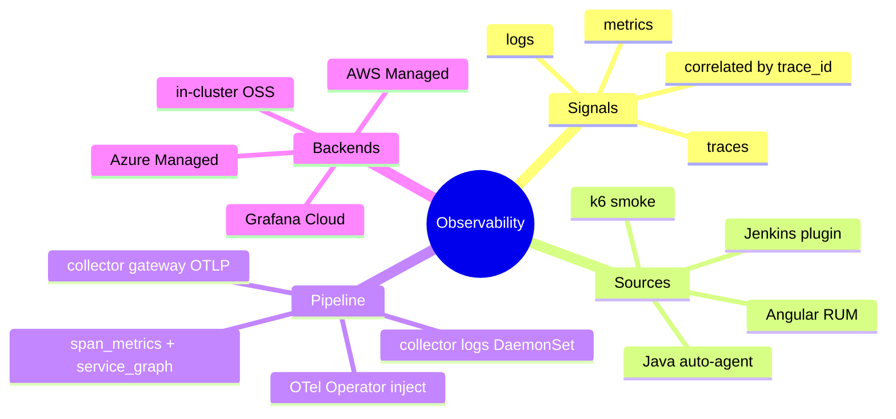
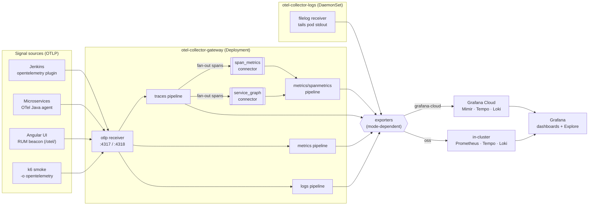
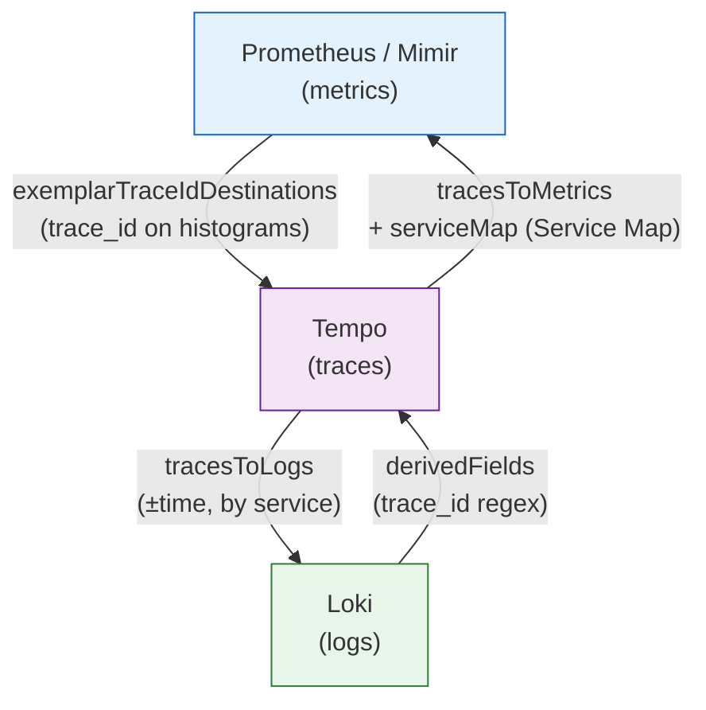
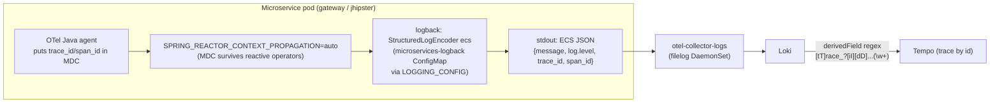
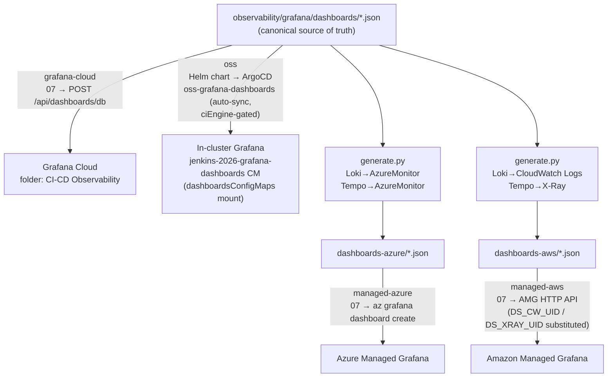
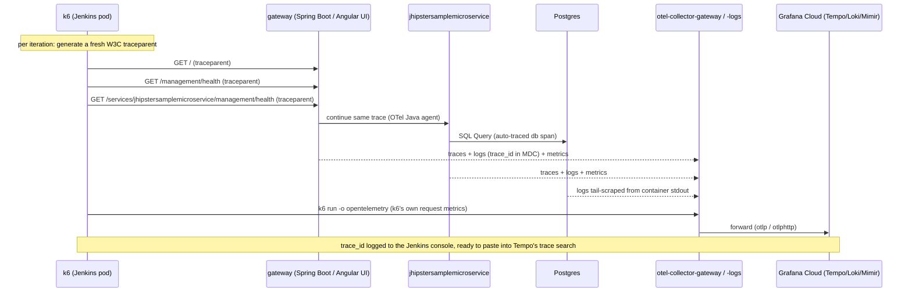
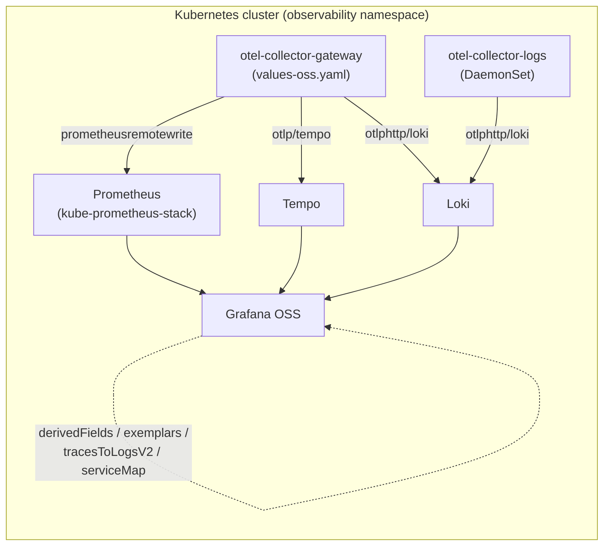

[← Previous: 202. Microservices App Architecture](./202-MICROSERVICES-APP-ARCHITECTURE.md) | [🏠 Home](../README.md) | [→ Next: 302. k6 Traffic & Load Testing](./302-K6_LOAD_TESTING.md)

---

# 301. Observability

Jenkins (via the `opentelemetry` plugin), every Java microservice (via OTel Operator auto-instrumentation), and the Angular UI (via a small RUM snippet) export OTLP to an in-cluster collector, which forwards to one of four backends selected by `observability.mode`: an in-cluster OSS **Prometheus+Loki+Tempo+Grafana** stack (`oss`), **Grafana Cloud**, **Azure Managed Grafana** + Azure Monitor (`managed-azure`), or **Amazon Managed Grafana** + AMP/X-Ray/CloudWatch (`managed-aws`).

> **Exactly one backend is active per cluster, and the choice is deterministic & idempotent** — exactly like `ci.engine` (jenkins ↔ tekton). Re-running `Day1.cluster.01` (or [`scripts/03-observability.sh`](../scripts/03-observability.sh)) with a *different* `observability.mode` **auto-retires the previously-deployed backend's in-cluster footprint** (the OTel collectors are reconfigured for the new backend; the other modes' agents — `pdc-agent`/`k8s-monitoring` for grafana-cloud, the OSS `observability-oss` app-of-apps, `kube-state-metrics`/`prometheus-node-exporter` for managed-*— are uninstalled) and provisions the chosen one, so you never end up with two Grafanas. Defaults: the `Day1.cluster.01` form defaults to **`oss`** (needs no external backend); `config/config.yaml`'s durable default is `grafana-cloud`. The persistent managed backends *themselves* (the Grafana Cloud stack / Azure Managed Grafana / Amazon Managed Grafana, created by `Day0.infra.0{2,3,4}`) are decoupled from the cluster and, **by default, are not** destroyed by a mode switch (the switch only retires the in-cluster footprint; use their `Decom.infra.*` workflows to remove the external backend). To enforce a **true single backend** — also `terraform destroy` the persistent stacks of the *non-selected* modes on the same Day1 — set the opt-in **`destroy_unused_backends`** input on `Day1.cluster.01` (it reuses the per-backend `Decom.infra.0{2,3,4}` workflows via `workflow_call`). ⚠ **Irreversible**: it wipes that backend's history/dashboards, and re-selecting the mode later recreates it empty; it also needs that backend's credentials/identifiers configured. Off by default.

Every component — Jenkins, the Spring Boot microservices, and the Angular UI — exports OpenTelemetry **traces**, **metrics**, and **logs**, correlated by `trace_id`/`span_id` and common resource attributes (`service.name`, `service.namespace=jenkins-2026`, `deployment.environment=stable`).

## Understanding observability (newcomers → specialists)

Everything emits **OpenTelemetry**, an in-cluster **collector** fans the signals out, and **exactly one** of four backends stores and renders them. Read this once and the rest of the page is just "which knob lives where".

<details>
<summary>🧠 Mental model — the observability pipeline (mindmap)</summary>



</details>

**Reading it —** the four branches are the four stages a signal passes through: a **Source** emits it, the **Pipeline** (OTel Operator + the two collectors) receives/enriches/routes it, and one **Backend** stores it — all three **Signals** stitched together by a shared `trace_id`. Every leaf is a concrete component below; nothing here is backend-specific except the last branch, which is chosen by `observability.mode`.

<details>
<summary>🟢 For newcomers — the model in plain terms</summary>

- **Three signals, one pipeline.** Traces (the path of a request), metrics (numbers over time), and logs (text lines) are all emitted as **OpenTelemetry (OTLP)** and shipped to a single in-cluster **collector**. Because every signal carries the same **`trace_id`**, Grafana can jump metric → trace → log and back.
- **Who emits what** — Jenkins (its `opentelemetry` plugin), each Java microservice (an OTel agent the platform injects automatically, no code change), the Angular UI (a tiny browser RUM snippet), and the k6 smoke test.
- **One backend at a time.** The same telemetry can land in any **one** of four backends, picked by `observability.mode`: the in-cluster **OSS** stack (Prometheus+Loki+Tempo+Grafana), **Grafana Cloud**, **Azure Managed Grafana**, or **Amazon Managed Grafana**. Switching mode retires the old backend's in-cluster footprint and wires up the new one — you never run two at once.
- **You look at it in Grafana** — dashboards + Explore, in the one `CI-CD Observability` folder.

</details>

<details>
<summary>🔴 For specialists — the moving parts and how they're wired here</summary>

- **Injection (OTel Operator).** [`scripts/02-otel-operator.sh`](../scripts/02-otel-operator.sh) installs the operator + the `Instrumentation`/`OpenTelemetryCollector` CRDs. The `microservices-java` `Instrumentation` CR makes the operator's **mutating webhook** inject the Java agent (`JAVA_TOOL_OPTIONS`) into every `inject-java: "true"` pod — `parentbased_traceidratio@1.0`, MDC `trace_id`/`span_id`, `service.namespace=jenkins-2026`. The webhook is `failurePolicy: Ignore`, so a pod admitted before the CR is cached starts **uninstrumented** — guarded by [`02-otel-operator.sh`](../scripts/02-otel-operator.sh) (wait-for-serving), [`ensure-otel-injection.sh`](../scripts/ensure-otel-injection.sh) (verify-and-heal `rollout restart`), and the smoke test.
- **Collection (two collectors).** `otel-collector-gateway` (Deployment) takes OTLP/gRPC `:4317` + OTLP/HTTP `:4318` (CORS for the RUM beacon) and runs traces/metrics/logs pipelines plus the **`span_metrics` + `service_graph` connectors** (the source of `traces_spanmetrics_*` with `trace_id` **exemplars** and the Tempo Service Map / RED metrics). `otel-collector-logs` (DaemonSet) tails pod stdout via the `filelog` receiver.
- **Per-mode export.** The collectors' **exporters** are the only backend-specific part: grafana-cloud → Mimir/Tempo/Loki; oss → in-cluster Prometheus/Tempo/Loki; managed-azure → Azure Monitor/App Insights; managed-aws → AMP/X-Ray/CloudWatch. Deterministic & idempotent — re-running with a different mode retires the previous footprint.
- **Correlation.** `exemplarTraceIdDestinations` (metrics→traces), Tempo `tracesToLogs`/`tracesToMetrics`+`serviceMap` (traces→logs/metrics), Loki `derivedFields` regex (logs→traces). The hardest link (logs→traces) needs ECS-JSON logs + reactive context propagation — see [Structured Logging](#structured-logging-deep-dive).
- **Dashboards & alerts** live in one engine-neutral `CI-CD Observability` folder; canonical JSON in [`observability/grafana/dashboards/`](../observability/grafana/dashboards/), with per-backend variants generated for Azure/AWS.

</details>

## Key Features

- **Dashboard provisioning over the Grafana HTTP API**: [`scripts/07-grafana-dashboards.sh`](../scripts/07-grafana-dashboards.sh) publishes `observability/grafana/dashboards/*.json` to Grafana Cloud with a plain, idempotent **`POST /api/dashboards/db`** import (`overwrite:true`, keyed by `uid`, into the *CI-CD Observability* folder) using the static `GRAFANA_API_KEY` — no `gcx` CLI dependency. (It previously used `gcx resources push`; gcx routes through Grafana's newer Kubernetes-style resource layer whose async create/delete + optimistic concurrency intermittently fail on Grafana Cloud with `409 AlreadyExists` / `409 "object has been modified"` and can desync the legacy vs k8s storage, so the reliable legacy import is used instead — the same path the managed-aws branch uses.) The AI-optimized v2-schema source exports are kept verbatim under [`observability/grafana/dashboards-cloud-export/`](../observability/grafana/dashboards-cloud-export/) for when gcx gains solid v2 support.
- **Jenkins Data Source**: The [Jenkins Datasource](https://grafana.com/grafana/plugins/grafana-jenkins-datasource/) is automatically provisioned.
  - **One-time Manual Step**: You must manually install the **`grafana-jenkins-datasource`** plugin in your Grafana Cloud portal (**Administration > Plugins**) before the first deployment.
  - **PDC Tunnel**: In Grafana Cloud mode, it uses **Private Data Source Connect (PDC)** to securely tunnel from the cloud to your in-cluster Jenkins instance.
- **Model Context Protocol (MCP)**: This project supports Grafana Cloud's hosted **MCP server**. Connecting an AI agent (like Gemini) to your stack via MCP allows for real-time querying of Jenkins traces, metrics, and logs. In your Grafana Cloud portal, go to **Administration > Assistant > Cloud MCP** to find your connection endpoint.
- **GKE Kubernetes Cluster Observability**: Automatic telemetry collection for GKE hosts, nodes, namespaces, and cluster events using the official `grafana/k8s-monitoring` Helm chart (pinned `4.1.6`).
  - **Zero Log Duplication**: Disables log collection inside the chart (`podLogsViaLoki.enabled=false`) to prevent dual ingestion charges.
  - **Zero-Touch Config**: Automatically maps default Prometheus, Loki, and Tempo data sources via the Grafana HTTP API (`POST /api/plugins/grafana-k8s-app/settings`).
- **Correlated telemetry**: Traces, metrics, and logs are fully correlated. Log-to-trace links and system datasources are pre-configured by default on Grafana Cloud.

## GCP platform metrics — Cloud provider integration (optional)

Separate from the OTLP pipeline above, Grafana Cloud's **Observability → Cloud provider → GCP** is a Grafana-Cloud-hosted scraper that pulls **GCP Cloud Monitoring** metrics (GKE control plane, Compute, the L7 Gateway/LB, GCS, quotas, …) into the stack — **no in-cluster collector**, complementary to our OTel signals (which cover workloads/pods; this covers the GCP-managed platform layer).

It can't use Workload Identity Federation (the scraper isn't a GCP workload), so it needs a **service-account key** uploaded in the Grafana Cloud UI — **the one long-lived credential in the project**, vs the keyless WIF/federation everywhere else. The read-only SA + roles (`monitoring.viewer`, `cloudasset.viewer`) are IaC-managed (human-run, opt-in) in [`terraform/grafana-cloud-gcp`](../terraform/grafana-cloud-gcp/); the key is minted out-of-band (never stored in Terraform state) and pasted into the UI. See that module's README for the runbook. For trial exploration you can also just configure it by hand in the UI.

## Grafana Cloud Observability apps — status & recommendation

> ⚠️ **`observability.mode=grafana-cloud` ONLY.** Everything in this section —
> Application Observability, Synthetic Monitoring, Profiles, Database Observability,
> the Cloud-provider integration — is a **Grafana Cloud product**. It does **not** exist
> or apply in the other backends; each has its own native equivalent instead:
> | Concern | grafana-cloud | oss | managed-azure | managed-aws |
> |---|---|---|---|---|
> | APM / tracing | **Application Observability** | Tempo + Grafana | Application Insights | X-Ray |
> | Uptime probes | **Synthetic Monitoring** | — (none) | Azure availability tests | CloudWatch Synthetics |
> | Profiling | **Profiles (Pyroscope)** | self-hosted Pyroscope | — | — |
> Anything this project wires up here (Synthetic checks, the Pyroscope agent, the GCP
> cloud-provider SA) is therefore **gated to grafana-cloud mode** and is a no-op in
> oss/managed-azure/managed-aws — consistent with the deterministic single-backend model.

### Free-tier active-series cap & `observability.leanMetrics`

The Grafana Cloud **free tier caps metrics at 15,000 active series** per tenant
(`err-mimir-max-active-series`). On this cluster the **bulk** of those series come from
the **k8s-monitoring / Alloy** cluster-infra scrape (cadvisor per-container, kube-state
per-object, node-exporter per-node) — *not* from the app. The custom `jenkins2026-*`
dashboards barely touch those: they read **app** metrics (OTel `http_server_request_*` /
`jvm_*`), **CNPG** (`cnpg_*`/`pg_*`, scraped on `:9187`), **k6** (`k6_*`), **Jenkins**
(`jenkins_*`/`ci_pipeline_*`) and **Tekton** (`tekton_*`) — all of which flow through the
**otel-collector**, a path entirely independent of k8s-monitoring.

Enabling the optional **lean `develop` tier** roughly **doubles** the app-metric series
(same metrics, `deployment.environment=develop`), which can tip a free-tier tenant over
15k → Grafana Cloud starts **rejecting** series and the develop dashboards go spotty.

The **`observability.leanMetrics`** flag (**default `auto`** → resolves to `true` on the
free tier, `false` on paid — see the grafanaCloudTier profile below; per-run override
`JENKINS2026_OBS_LEAN_METRICS=false`) makes [`scripts/03-observability.sh`](../scripts/03-observability.sh) **disable the
k8s-monitoring cluster-infra metrics** (cadvisor/kube-state/node-exporter), freeing
thousands of series so the develop app metrics fit. **App / CNPG / Tekton / k6 / Jenkins
metrics are unaffected** (they don't go through k8s-monitoring). The trade-off is the
Grafana Cloud built-in **"K8s Compute Resources"** views (the Jenkins-banner
`grafana_k8s_app_link`) — those go empty. `clusterEvents` stays on (it ships to **Loki**,
costs ~0 metric series). It defaults **on** so a redeploy can't silently re-flood the cap;
flip it off (`JENKINS2026_OBS_LEAN_METRICS=false`, or `leanMetrics: false`) or upgrade the
plan when you want full cluster-infra metrics back.

> **Lean keeps a tiny node-inventory slice (so the NAP/Spot dashboard still works on free).**
> "Lean" does **not** mean *all* cluster metrics off. `03-observability.sh` keeps
> kube-state-metrics deployed and scrapes **only three node metrics** — `kube_node_info`,
> `kube_node_spec_taint`, `kube_node_status_condition` (via `clusterMetrics.kube-state-metrics.metricsTuning`
> `useDefaultAllowList: false` + `includeMetrics`) — roughly a handful of series per node
> (~30–50 total), negligible against the 15k cap. That is exactly what the **CI-CD / Node
> Auto-Provisioning (Spot)** dashboard needs: it derives Spot / ComputeClass membership from
> the node **taints** (`kube_node_spec_taint{key="cloud.google.com/gke-spot"}` /
> `…/compute-class`), which KSM exposes **by default** — *not* from node labels
> (`kube_node_labels`), whose `label_*` dimensions would require a KSM
> `--metric-labels-allowlist` we deliberately don't enable. So this one dashboard populates
> in **every** mode (oss, paid, and lean/free); the expensive cadvisor/kubelet/node-exporter
> series stay off. See the [NAP → Spot CI nodes runbook](./runbooks/nap-spot-provisioning.md).

**CNPG cardinality trim (always on).** Even with the infra metrics off, the single
biggest *app-path* consumer was **`cnpg_pg_settings_setting`** — one series per
`postgresql.conf` setting **per instance** (~2,272 series across the tiers), pure static
config that no dashboard reads. The otel-collector's `cnpg` scrape drops it via
`metric_relabel_configs` ([`observability/otel-collector/values-grafana-cloud.yaml`](../observability/otel-collector/values-grafana-cloud.yaml)),
reclaiming ~15% of the cap for app/JVM/trace metrics. All other `cnpg_*`/`pg_*` series
(used by `postgres-overview`) are kept.

> **Validating develop without metrics at all.** The 15k cap is a **metrics** limit;
> **traces (Tempo)** and **logs (Loki)** have separate free-tier quotas. So you can always
> confirm the develop tier is instrumented and emitting via Explore —
> Tempo `{ resource.deployment.environment = "develop" }` and
> Loki `{deployment_environment="develop"}` — regardless of the metrics cap.

Grafana Cloud's **Observability** menu bundles several apps. Some are **already fed by
this project's existing pipeline** (our OTLP traces/metrics, the RUM snippet, the
`k8s-monitoring` Alloy) — just open them, no work. Others are worth adding; one is
still experimental and we deliberately skip it. Maturity is GA unless noted.

| App | Maturity | Already fed by us? | Recommendation |
|---|---|---|---|
| **Application Observability** (APM: service map, RED metrics, traces) | GA | **Yes** — we already export OTLP traces+metrics from Jenkins, the microservices (OTel auto-instrumentation) and the Angular RUM | ⭐ **Use it now** — zero new code, just enable/open it. Highest "free" value: service map + p95 latency + error rates for the services and Jenkins |
| **Kubernetes Monitoring** | GA | **Yes** — we deploy `k8s-monitoring` (Alloy) in grafana-cloud mode | ⭐ Already populated (cluster/node/pod/workload views) |
| **Frontend Observability** (RUM) | GA | **Yes** — Angular RUM snippet (see [Angular RUM](#angular-rum)) | ⭐ Already populated |
| **Synthetic Monitoring** (uptime/latency probes) | GA | No | 👍 **Good, cheap add** — HTTP checks against the public, **non-IAP** `microservices` endpoint(s) for uptime + SLOs (the jenkins/argocd/headlamp hosts sit behind IAP and are intentionally excluded). IaC-able and keyless via the Grafana Terraform provider (it supports Synthetic Monitoring) using the existing stack token |
| **Cloud provider → GCP** | GA | No (IaC scaffolding in [`terraform/grafana-cloud-gcp`](../terraform/grafana-cloud-gcp/)) | 🤔 Stable, but needs a **long-lived SA key** (the scraper isn't a GCP workload → no WIF), the only non-keyless credential. Optional — see [§ GCP platform metrics](#gcp-platform-metrics--cloud-provider-integration-optional) |
| **Profiles** (Pyroscope, continuous JVM profiling) | GA (product) | No | ⏸️ **Deferred** — valuable, but every collection path conflicts with our setup: the Java agent fights the OTel-Operator-owned `JAVA_TOOL_OPTIONS`, needs opening external app egress, and the no-app-change alternative (Alloy `pyroscope.java`) is experimental + privileged. See [§ Profiles/Pyroscope: why it's deferred](#profilespyroscope-why-its-deferred) |
| **Database Observability** (Postgres query perf) | **public preview / experimental** | No | ❌ **Skip for now** — the Alloy `database_observability` component has frequent breaking changes. Revisit when GA |
| OnCall / Incident / SLO | GA (ops process, not telemetry) | — | As needed for alerting/on-call; not a priority for a throwaway PoC |

**What to incorporate (stable + worthwhile):** lead with **Application Observability**
— it already receives our traces/metrics, so it's the biggest no-risk win (open it,
enable if prompted). Then **Synthetic Monitoring** (GA, lightweight, IaC-able + keyless)
for uptime/SLOs on the public endpoints. **Defer Profiles/Pyroscope** — although the
Grafana Cloud product is GA, *for this stack* it has no clean collection path (it
collides with the OTel-Operator auto-instrumentation; see below). **Skip Database
Observability** until it leaves preview; **Cloud provider → GCP** is stable but trades
off the keyless posture (long-lived key).

> **The OpenTelemetry Operator is the project standard** for application telemetry across
> **all four** backends — it auto-injects the Java agent (`Instrumentation` CR →
> `JAVA_TOOL_OPTIONS`) so traces/metrics flow to the active backend uniformly. None of
> the Grafana Cloud apps above replace or modify it; they sit alongside. Anything that
> would fight the operator (notably a second profiling `-javaagent`) is deferred rather
> than risk the standard.

### Wiring up the stable additions (grafana-cloud only)

All of these are **gated to `observability.mode=grafana-cloud`** — no-ops in the other backends.

- **Application Observability** — *already on.* No code: the microservices carry the OTel
  Java auto-instrumentation (the `microservices-java` `Instrumentation` CR injects the
  agent; `OTEL_SERVICE_NAME` is set) and the collector exports OTLP traces+metrics to
  Grafana Cloud. Just open the app; enable it in the UI if prompted. (In oss the same
  traces land in Tempo; in managed-azure/-aws in App Insights / X-Ray.)
- **Synthetic Monitoring** — IaC in [`terraform/grafana-cloud-synthetics`](../terraform/grafana-cloud-synthetics/):
  HTTP uptime/latency checks (Grafana-Cloud-hosted probes) against the **public, non-IAP**
  endpoints (`microservices` host; the IAP hosts would just return Google's OAuth page).
  Keyless — both provider tokens derive from the stack access policy, like
  `grafana-cloud-token`. Apply only in grafana-cloud mode.
- **Profiles / Pyroscope** — **deferred**; see the analysis below.

### Profiles/Pyroscope: why it's deferred

Continuous JVM profiling would be useful, and the Grafana Cloud Profiles product is GA,
but **for this stack there is no clean, stable collection path** — each option has a
real downside, and we won't risk the OTel-Operator standard for it:

1. **Pyroscope Java agent** (the "stable" path) — a second `-javaagent` on the JVM. But
   the **OTel Operator already owns `JAVA_TOOL_OPTIONS`** (it injects the OTel Java agent
   via the `Instrumentation` CR). Adding a second agent means either disabling the
   operator's auto-injection for the microservices and re-assembling *both* agents by
   hand, or baking the Pyroscope SDK into the image — but we run **upstream JHipster
   images** we don't build. Either way it fights the project's telemetry standard.
2. **External egress** — the agent pushes profiles straight to Grafana Cloud (external
   HTTPS), but the `microservices` namespace is default-deny egress (only Postgres + the
   in-cluster collector). It would need **opening external `:443` egress** from the app
   pods — a real network-posture change.
3. **Alloy `pyroscope.java`** (node-level async-profiler, no app change, no app egress) —
   avoids 1 and 2, but the component is **experimental** (which we avoid) and needs a
   **privileged Alloy** (`SYS_PTRACE`/`hostPID`).

**Decision:** defer Pyroscope (like Database Observability) until there's a stable path
that doesn't collide with the OTel-Operator auto-instrumentation. The TF foundation
(a `profiles:write`-scoped token already exists on the stack; the stack exposes a
`profiles_url`) is ready if we revisit. Self-hosted Pyroscope would be needed for oss;
managed-azure/-aws have no equivalent.

## OTel Components

### OpenTelemetry Operator

**Installed first** ([`scripts/02-otel-operator.sh`](../scripts/02-otel-operator.sh)). Provides the `Instrumentation` and `OpenTelemetryCollector` CRDs. [`scripts/02-otel-operator.sh`](../scripts/02-otel-operator.sh) **waits for the webhook to actually be serving** (its caBundle populated) before proceeding.

### Java Auto-Instrumentation

The `helm/microservices` chart creates an `Instrumentation` CR (`microservices-java`) per namespace, pointing at `otel-collector-gateway.observability.svc.cluster.local:4317`. Each `java`-typed service's Deployment gets the pod annotation `instrumentation.opentelemetry.io/inject-java: "true"`, so the operator's mutating webhook **injects the OTel Java agent automatically — no code changes** to Microservices.

Key settings on the `Instrumentation` CR:
- `OTEL_INSTRUMENTATION_LOGBACK_APPENDER_ENABLED=true` — injects `trace_id`/`span_id` into every log line's MDC.
- `OTEL_RESOURCE_ATTRIBUTES=deployment.environment=stable,service.namespace=jenkins-2026`
- `sampler: parentbased_traceidratio` @ `1.0` (sample everything).
- `OTEL_INSTRUMENTATION_RUNTIME_TELEMETRY_EMIT_EXPERIMENTAL_TELEMETRY=true` — turns on the
  Java agent's **experimental runtime metrics** (JVM **buffer pools** direct/mapped, **system
  CPU** utilization + 1-min load average), which feed the extra `jvm-internals` panels. These
  series are stable enough to rely on but are gated behind this flag upstream.

### Angular RUM

A small (~100 line) vanilla-JS OTel Web shim, injected into the Angular app's `index.html` via an nginx `sub_filter`. It emits a "page load" span using the Navigation Timing API and patches `window.fetch` to add a W3C `traceparent` header to every call to `/api/*`.

### OTel Collector

Two `opentelemetry-collector-contrib` releases (the **contrib** distro — needed for the `faro` receiver):
- **`otel-collector-gateway`** (Deployment) — receives OTLP/gRPC (4317) and OTLP/HTTP (4318, with permissive CORS for the browser RUM beacon), **plus a `faro` receiver on `:8027`** (CORS-enabled) wired into the **traces + logs** pipelines. The Faro receiver accepts the Grafana **Faro Web SDK**'s browser RUM payload (Web Vitals measurements, JS exceptions, session/page logs, and browser spans) and converts it to OTLP, so frontend RUM rides the same collector→backend path as the Java services' telemetry. The `faro` receiver is wired into **all four** backend collector configs (`values-grafana-cloud` / `-oss` / `-managed-azure` / `-managed-aws`), so RUM works on every observability backend — not just grafana-cloud (OSS gets fully-functional RUM, its in-cluster Loki/Tempo matching the dashboard uids). Populated for real once the Angular SPA ships the Faro SDK (see [202](202-MICROSERVICES-APP-ARCHITECTURE.md)); `Day2.traffic.02` can POST synthetic beacons to it meanwhile.
- **`otel-collector-logs`** (DaemonSet) — tails `/var/log/pods/*/*/*.log` on every node via the `filelog` receiver and forwards log records to the same backend.

### Jenkins Plugin

The `opentelemetry` plugin exports one span per pipeline run / stage / step as `service.name=jenkins` to the same gateway — so a Microservices deploy's **CI trace and the resulting application traces share the same backend**.

> **Tekton CI (`ci.engine=tekton`).** When the alternative CI engine is selected, the k6 smoke Task ships its own traces/metrics to the same in-cluster OTel gateway as `service.name=k6-microservices-smoke` (`K6_OTEL_SERVICE_NAME` + `OTEL_RESOURCE_ATTRIBUTES` in [`tekton/tasks/k6-smoke.yaml`](../tekton/tasks/k6-smoke.yaml)), so the load-test telemetry lands in Tempo/Loki/Prometheus alongside the application traces. Native Tekton **PipelineRun/TaskRun** tracing (patching the controller's `config-tracing`) is a deferred follow-up — not wired today. See [403. Tekton](./403-TEKTON.md).

## Telemetry Architecture and Signal Flow

<details>
<summary>🔍 Click to expand End-to-End Telemetry Architecture Diagram</summary>



</details>

**Why `span_metrics` and `service_graph` connectors?** Without them, *no span-derived metrics exist* — Tempo's **Service Map / node graph stays empty** and there are no RED (Rate/Errors/Duration) metrics. They produce `traces_spanmetrics_*` (with `trace_id` **exemplars**) and `traces_service_graph_request_*`.

## Signal Correlation: Metrics, Traces, and Logs

<details>
<summary>🔍 Click to expand Signal Correlation Diagram</summary>



</details>

| Direction | How it's wired | What had to be added |
|---|---|---|
| **Metrics → Traces** | `exemplarTraceIdDestinations` on the Prometheus DS; OTel histograms carry `trace_id` exemplars | exemplars on `span_metrics` connector |
| **Traces → Logs** | Tempo `tracesToLogs(V2)` → Loki, scoped by `service.name` + time window | — (worked once logs existed) |
| **Traces → Metrics + Service Map** | Tempo `tracesToMetrics` + `serviceMap` → Prometheus | the `span_metrics` / `service_graph` connectors |
| **Logs → Traces** | Loki `derivedFields` regex extracts `trace_id` from the log line → Tempo | ECS-JSON logs **and** reactive context propagation |

## Structured Logging Deep Dive

`Logs → Traces` is the hardest link because it needs the `trace_id` *inside the log line*. Two app-side problems were solved declaratively in the **GitOps repo**:

1. **JHipster logs plain text.** The apps ship their own `logback-spring.xml` with a custom `CONSOLE_LOG_PATTERN`, so Spring Boot 3.5's native `logging.structured.format.console=ecs` is a no-op. Fix: mount a tiny logback config (`microservices-logback` ConfigMap) using spring-boot's `StructuredLogEncoder` (`format: ecs`) and point the app at it with `LOGGING_CONFIG=/etc/logback/logback.xml`. Result: ECS JSON with `message`, `log.level`, `service`, and MDC fields.

2. **The gateway is reactive (WebFlux).** The OTel agent injects `trace_id` into the logging **MDC via thread-locals**, which don't survive across Reactor operators. Fix: `SPRING_REACTOR_CONTEXT_PROPAGATION=auto`, which enables Reactor automatic context propagation so the agent's `trace_id`/`span_id` reach the MDC.

<details>
<summary>🔍 Click to expand Structured Logging & Logs→Traces Chain Diagram</summary>



</details>

### Log Levels

There are **two independent levers**, at two different points in the pipeline:

**1. Source-side (microservices only) — the `microservices-logback` ConfigMap.** This is the authority on what each microservice *emits*. It lives in the **GitOps repo** and *replaces* JHipster's own `logback-spring.xml`:

```xml
<logger name="org.springframework" level="WARN"/>
<logger name="org.apache"          level="WARN"/>
<logger name="org.hibernate"       level="WARN"/>
<logger name="com.netflix"         level="WARN"/>
<logger name="io.netty"            level="WARN"/>
<logger name="reactor"             level="WARN"/>
<logger name="liquibase"           level="WARN"/>
<root level="INFO"/>
```

This is **mode-independent** — applies unchanged across all four observability modes. Use it to make a microservice emit *more* (e.g. drop a package to `DEBUG` to see request-time lines).

**2. Pipeline-side (everything) — `observability.logMinSeverity`.** A `filter` processor injected into the **`otel-collector-logs`** DaemonSet (by [`scripts/03-observability.sh`](../scripts/03-observability.sh), via `yq`) that drops log records **below a chosen severity** *before* they reach the backend — so it trims **every** Grafana logs panel, **microservices AND platform components** (ArgoCD, CNPG, dex, …), in all four modes. Use it to cut noise globally without touching each component.

```yaml
# config/config.yaml — durable default; per-run override JENKINS2026_LOG_MIN_SEVERITY,
# or the log_min_severity dropdown on the workflows that re-apply 03-observability:
# Day1.cluster.01-gke (+ the Day1.cluster.00-all umbrella), and — for a light change on a
# running cluster without a full Day1 — Day2.redeploy.01-argocd / Day2.publish.01-oss-grafana.
observability:
  grafanaCloudTier: free   # free (default) | paid — the volume profile (see below)
  logMinSeverity: auto     # auto=from tier (free→warn, paid→trace) · or force trace/debug/info/warn/error
```

> **The `grafanaCloudTier` profile.** `logMinSeverity` (logs) and `leanMetrics` (metrics) default to `auto`, deriving from the tier so the **free** tier fits its limits in one switch: `free` → `leanMetrics` on + `logMinSeverity=warn`; `paid` → full metrics + ship all logs (`trace`). It governs **metrics and logs** — an explicit value (or the `JENKINS2026_*` env / GHA dropdowns) overrides the tier.
>
> **Traces are deliberately NOT sampled on either tier (100% shipped).** Two reasons: (1) in this low-traffic PoC the trace volume comfortably fits the Grafana Cloud free tier, so sampling buys nothing; (2) sampling would **break correlation** — a `trace_id` embedded in a log line (or a metric exemplar) could point at a trace that was dropped, turning the log→trace / metric→trace jumps into dead ends. If traffic ever grows enough to need it, add a `probabilistic_sampler` (or tail-sampling) to the collector's traces pipeline gated on the tier — accepting that correlation-from-logs becomes best-effort.

How it works: a `regex_parser` in the `otel-collector-logs` filelog receiver extracts the level token from **structured** lines — JSON `"level":"<lvl>"` (covers the microservices' ECS nested `"log":{"level":…}`, CNPG's flat `"level":…`) and logfmt `level=<lvl>` (ArgoCD), case-insensitively — and **sets the OTLP record severity** from it (plain-text lines get `level=unknown`). The `filter/severity` processor then drops by `severity_number` (`!= UNSPECIFIED and < <threshold>`), so anything whose level couldn't be parsed is **never dropped** (no accidental blackout). `trace` disables the filter entirely (ship everything). The two levers compose: e.g. keep the logback `<root>` at `INFO` but set `logMinSeverity: warn` for a quiet dashboard, then dial back when debugging.

**3. Interactive per-panel filter — the `$level` dashboard variable.** Because the collector now stamps every record with a severity, Loki derives a `detected_level` on **100%** of log lines (`unknown` for plain text). Every logs panel carries a multi-select **`Log level`** variable (`error/warn/info/debug/trace/unknown`, default **All**) wired as `… | detected_level=~"$level"` — so you can slice the panel by level live, non-destructively, on top of whatever the collector floor (`logMinSeverity`) already let through. `All` (`.+`) includes everything, plain text included.

Two real reasons business logs look sparse at `INFO`:
1. **The services are idle.** Run `microservices-k6-smoke` to generate traffic and correlation.
2. **JHipster logs per-request detail at `DEBUG`.** To make request-time lines appear, lower the app's base package logger in the ConfigMap, then restart pods.

## OTel Injection Race

The OTel Operator injects the Java agent via a **mutating webhook** at pod-admission time, only if the `Instrumentation` CR is already in its cache. That webhook has `failurePolicy: Ignore` by design, so a pod admitted *before* the CR/webhook is ready starts **without** the agent and silently emits no metrics/traces.

Guards against it:
- `scripts/02-otel-operator.sh` waits for the webhook to be serving before proceeding.
- [`scripts/ensure-otel-injection.sh`](../scripts/ensure-otel-injection.sh) is an idempotent verify-and-heal: it `rollout restart`s any running microservices Deployment whose pods lack the agent.
- [`test/smoke-test.sh`](../test/smoke-test.sh) asserts the agent is injected on every running microservices Deployment.

## Observability Dashboards

### Dashboard architecture

Each observability mode has its **own independent set of dashboards** published to its own Grafana instance. They are not shared — switching from `grafana-cloud` to `managed-aws` means a completely different Grafana URL and a completely different dashboard set.

#### Source of truth: canonical dashboards

The canonical JSON files live in [`observability/grafana/dashboards/`](../observability/grafana/dashboards/) and are the **single source of truth** for content. Panels reference datasources by their fixed names (`grafanacloud-logs` / `grafanacloud-traces`; Prometheus is the stack default), **not** via `${DS_LOKI}`/`${DS_TEMPO}` template variables — the stack has **no default Loki or Tempo datasource**, so those vars wouldn't resolve (see the No-Data gotcha below); the aws/azure variant generators rewrite the Loki/Tempo references to CloudWatch/X-Ray by datasource type. The **Shipped** column shows which dashboards are always present versus the two CI-overview dashboards that are mutually exclusive — only the one for the active `ci.engine` is shipped (see [CI-engine-aware publishing](#ci-engine-aware-publishing)):

| Dashboard (uid) | What it shows | Shipped |
|---|---|---|
| `microservices-overview` | Per-service HTTP RED, JVM/GC, restarts, traces table, pod logs | always |
| `jvm-internals` | Deep JVM diagnostics for **all Java services + the Jenkins controller**: heap by pool + live-set-after-GC, non-heap, GC time/freq/pause-quantiles by collector, threads (count/state/daemon), CPU (process+system+load), classes, buffer pools, JVM/runtime context | always |
| `k6-smoke-overview` | k6 iterations, checks/req-failed/p95 thresholds, run traces + logs | always |
| `postgres-overview` | PostgreSQL / CloudNativePG: instances up, connections, DB size, replication lag, WAL rate, per-instance panels + Postgres pod logs (needs the CNPG `cnpg_*`/`pg_*` metrics scraped — see [Database (CNPG) observability](#database-cnpg-observability)) | always |
| `rum-frontend` | Angular **Real User Monitoring** (Grafana Faro): Core Web Vitals (LCP/INP/CLS/TTFB/FCP), JS errors, sessions, browser breakdown, browser→backend traces | always |
| `node-autoprovisioning` | **Node Auto-Provisioning (Spot)**: Spot vs static node counts over time — watch NAP scale up CI build nodes and consolidate back toward zero. Reads node **taints** via kube-state-metrics (`kube_node_info`/`kube_node_spec_taint`); the lean profile keeps that tiny node-inventory slice, so it works in **all** modes (see the leanMetrics note above) | always |
| `jenkins-overview` | Jenkins CI: active runs, queue, executors, pipeline results, build traces, pod logs | only `ci.engine=jenkins` |
| `tekton-overview` | Tekton pipeline runs, task durations, build traces, pipeline pod logs | only `ci.engine=tekton` |

> Adding a dashboard = drop a `<name>.json` into [`observability/grafana/dashboards/`](../observability/grafana/dashboards/) and run the variant generators (below). In `oss` mode the Helm-chart ConfigMap picks it up automatically (it globs `*.json`); for the other modes [`scripts/07-grafana-dashboards.sh`](../scripts/07-grafana-dashboards.sh) publishes every `*.json`. Only `jenkins-overview` / `tekton-overview` are CI-engine-gated; everything else ships in all modes.

#### Dashboard inventory — what each one offers

The master matrix below maps every dashboard to its purpose, signals, scope and the
questions it answers; the per-dashboard detail follows.

| Dashboard | Purpose / audience | Datasource(s) | Scope | Env / namespace filter | Example questions it answers | Doc |
|---|---|---|---|---|---|---|
| **microservices-overview** | "Are the Java services healthy?" — SRE/dev day-to-day | Prom · Loki · Tempo | gateway + jhipstersamplemicroservice | `deployment_environment` (stable/develop) · `service_name` · `namespace` | Is the error rate up? p95 latency? which service? recent traces/logs? | [502](502-MICROSERVICES_GITOPS.md) |
| **jvm-internals** | Deep JVM diagnostics — perf/GC tuning | Prom | the two Java services' JVMs **+ the Jenkins controller** (also a JVM; via `service_name`) | **`k8s_namespace_name`** · `service_name` *(JVM metrics carry these, **not** `deployment_environment`; `namespace` `allValue='.*'` so the Jenkins series show under All)* | GC pause too long? heap leak? thread/CPU bottleneck? buffer-pool growth? which JDK/agent version? | [303](303-JVM-TUNING.md) |
| **postgres-overview** | DB health — both tiers | Prom · Loki | CloudNativePG clusters | `namespace` (microservices=stable / -develop) | Connections saturated? replication lag? DB size growth? WAL rate? | [502](502-MICROSERVICES_GITOPS.md) |
| **k6-smoke-overview** | Load/traffic results | Prom · Tempo · Loki | k6 runs | `deployment_environment` | Did the run meet p95/error thresholds? how many checks passed? | [302](302-K6_LOAD_TESTING.md) |
| **rum-frontend** | Angular **Real User Monitoring** (Faro) | Loki · Tempo | the browser SPA | `service_name` (app) · `deployment_environment` | Are Core Web Vitals (LCP/INP/CLS) good? JS errors? sessions? full browser→backend trace? | [202](202-MICROSERVICES-APP-ARCHITECTURE.md) |
| **jenkins-overview** | Jenkins CI engine (when active) | Prom · Tempo · Loki | the Jenkins controller | `ci_pipeline_id` *(single cluster-wide CI — no per-env)* | Build success/duration trend? queue/executors? failing pipeline? | [101](101-GITHUB_ACTIONS_WORKFLOWS.md) / [401](401-JENKINS.md) |
| **tekton-overview** | Tekton CI engine (when active) | Prom · Tempo · Loki | the Tekton controller | — | PipelineRun durations/results? task failures? | [403](403-TEKTON.md) |

> **Label-model gotcha.** Backend **app** metrics (HTTP, traces, logs) carry
> `deployment_environment` (stable/develop). **JVM** metrics and **RUM** signals do
> **not** — JVM filters by `k8s_namespace_name` (`microservices`=stable /
> `microservices-develop`=develop) + `service_name`; RUM by `service_name` (the Faro
> app) + `deployment_environment`. So the env selector differs per dashboard by design.

<details>
<summary>📋 <b>Per-dashboard detail — key panels & questions answered</b></summary>

**`microservices-overview`** — the front door. *Key panels:* HTTP request rate, 5xx
error rate and p95 latency per service (`http_server_request_duration_seconds`);
summary JVM heap + GC; pod restarts; a Tempo traces table; a Loki pod-logs panel.
*Answers:* is a service erroring or slow, and which? what do its latest traces/logs
say? did a pod just restart? → drill into `jvm-internals` for the JVM root cause.

**`jvm-internals`** — the JVM microscope (modelled on community dashboards 20429 +
18812, all queries OTel-native). *Key panels:* heap used **by pool** (Eden/Survivor/
Tenured) + committed/max + **live-set-after-GC** (leak signal); non-heap (Metaspace,
CodeHeap, Compressed Class); **GC** time-rate / frequency / pause **p95-p99 by
collector** (`jvm_gc_name`); threads (count, **by state**, daemon split); CPU
(process + system utilization + load avg); class loading; **buffer pools** (direct/
mapped); and a **JVM/runtime context table** (JDK name/impl/version, OTel agent
version, OS/arch — from `target_info`). *Answers:* GC pauses too long/frequent? heap
or Metaspace leaking? thread/CPU-bound? which exact JDK + agent is running? See the
[symptom → panel troubleshooting matrix in 303](303-JVM-TUNING.md).

**`postgres-overview`** — CloudNativePG health for **both** tiers via the `namespace`
variable. *Key panels:* instances up (`cnpg_collector_up`), backends/connections,
DB size, replication lag, WAL rate, per-instance panels, Postgres pod logs.
*Answers:* are we near the connection cap? is a replica lagging? is a DB growing
unexpectedly? (The lean develop tier runs 1 instance/1 pooler — see [502](502-MICROSERVICES_GITOPS.md).)

**`k6-smoke-overview`** — the result board for the [k6 engine](302-K6_LOAD_TESTING.md),
split by `deployment_environment`. *Key panels:* iterations/VUs, checks pass rate,
`http_req_failed`, p95 latency vs the threshold, plus the run's traces + logs.
*Answers:* did this run meet its p95/error budget? where did it break?

**`rum-frontend`** — Angular **Real User Monitoring** via Grafana Faro (data arrives
through the otel-collector **faro receiver** → Loki/Tempo). *Key panels:* **Core Web
Vitals** (LCP/INP/CLS/TTFB/FCP with Google's good/needs-improvement/poor thresholds),
JS error rate + recent exceptions, sessions over time, browser/OS breakdown, and
browser→gateway→microservice **end-to-end traces**. *Answers:* is the UI fast for real
users? are there client-side errors? *Populates once the SPA is instrumented with the
Faro Web SDK — the receiver + pipeline are already live; see the [RUM roadmap in 202](202-MICROSERVICES-APP-ARCHITECTURE.md).*

**`jenkins-overview`** / **`tekton-overview`** — the CI-engine board (only the active
engine's is published). *Key panels:* run/build counts, durations, success/failure
trend, queue/executors (Jenkins), build traces + CI pod logs. Jenkins is a single
cluster-wide controller, so it filters by `ci_pipeline_id`, not by environment.

</details>

#### No-Data gotchas (panel shows nothing even though data exists)

These cost real debugging time; record them so they don't recur:

| Symptom | Root cause | Fix |
|---|---|---|
| **Every Loki/Tempo panel is empty** | The stack has **no default Loki or Tempo datasource** (only Prometheus is the global default), so `${DS_LOKI}`/`${DS_TEMPO}` template vars don't resolve; a stale `var-DS_LOKI=` in a bookmarked URL silently overrides any binding | **Drop the `DS_LOKI`/`DS_TEMPO` template vars**; base dashboards use the neutral uids `loki`/`tempo` (match the in-cluster OSS Grafana), and `07-grafana-dashboards.sh` **rewrites them to `grafanacloud-logs`/`grafanacloud-traces` at publish time** for grafana-cloud (a `jq walk`) — same per-backend rewrite `generate.py` does for aws/azure. One base, every backend works |
| **RUM `kind` filter returns nothing** | Faro `kind` (measurement/exception/log) is **structured metadata**, not an indexed stream label, so `{kind="measurement"}` in the selector matches nothing | Filter `kind` **after** `\| logfmt` in the LogQL pipeline, not in the stream selector |
| **RUM `app` variable empty / "nothing to select"** | `label_values(app)` is time-bounded and returns empty before any beacon lands | Make `app` a **constant** (`angular-gateway`) instead of a query var |
| **Tempo "Browser traces" panel empty** | Panel used `queryType=traceqlSearch` (expects structured filters) with a raw TraceQL string | Set `queryType=traceql` |
| **Web-Vitals "FID" panel empty** | Faro emits **INP** (FID is deprecated and removed from the web-vitals lib) | Drop the FID target; chart INP |
| **`microservices-overview` JVM / `postgres-overview` panels empty for a tier** | JVM/CNPG metrics carry `k8s_namespace_name`/`service_name`, **not** `deployment_environment` | Filter those panels by namespace (env→namespace via `target_info`) |

#### Where everything lives in Grafana (folders)

**All of _our_ content — every dashboard above _and_ all five [alert rules](#alert-rules) — lives in a single flat folder named `CI-CD Observability`** (engine-neutral; folder uid `jenkins-2026`), in **every** backend. So no matter which Grafana you open:

- **Dashboards** → the *Dashboards* browser → open the **`CI-CD Observability`** folder. The visible titles are engine-neutral too: `CI-CD / Microservices Overview`, `CI-CD / k6 Observability Smoke Test`, `CI-CD / PostgreSQL (CloudNativePG)`, and the active CI-overview (`CI-CD / Jenkins CI Overview` **or** `CI-CD / Tekton CI Observability`). (Dashboard **uids** stay `jenkins2026-*` internally — stable identifiers, not shown in the UI.)
- **Alert rules** → *Alerting → Alert rules* → the **same** `CI-CD Observability` folder (a Grafana folder holds dashboards **and** rules together). The email contact point + routing are under *Alerting → Contact points / Notification policies*.

> Folder names are deliberately **slash-free** (`CI-CD`, not `CI/CD`): a `/` makes Grafana's alerting provisioning treat the title as a nested-folder path (`CI/CD Alerts` → a `CI` folder with a `CD Alerts` child).

Alongside our folder, **each backend ships its own built-in dashboards** in different places — these are **not** managed by this repo:

| Backend | Our dashboards + alerts | Built-in / bundled dashboards (where to find them) |
|---|---|---|
| **oss** (in-cluster) | `CI-CD Observability` folder | kube-prometheus-stack auto-ships ~27 dashboards in the **`General`** folder: *Kubernetes / Compute Resources / …*, *Kubernetes / API server*, *Node Exporter / Nodes*, *CoreDNS*, *Grafana Overview*, *etcd*, *Prometheus*, … |
| **grafana-cloud** | `CI-CD Observability` folder | The **Kubernetes Monitoring** app (left nav → *Kubernetes*) provides cluster/node/pod/workload views + integration dashboards; managed by Grafana Labs (not a folder you publish into). |
| **managed-azure** | `CI-CD Observability` folder (the `*-azure` dashboard variants) | Azure's own **Azure Monitor / Container Insights** dashboards come from the Azure side. |
| **managed-aws** | `CI-CD Observability` folder | AMG ships **no** built-in k8s dashboards, so we **vendor** the community ones into the **same** `CI-CD Observability` folder: *Kubernetes Views — Global / Namespaces / Nodes / Pods* + *Node Exporter Full* (from [`observability/grafana/dashboards-aws/community/`](../observability/grafana/dashboards-aws/community/)). Log/trace panels use the CloudWatch / X-Ray datasources. |

#### Per-backend variants

Each managed backend requires adapted datasources (AMP instead of Prometheus, CloudWatch instead of Loki, X-Ray instead of Tempo). Variants are generated from the canonical files and live in separate directories:

| Directory | Published to | Datasources used | How generated |
|---|---|---|---|
| [`observability/grafana/dashboards/`](../observability/grafana/dashboards/) | OSS Grafana (in-cluster) | Prometheus · Loki · Tempo | Rendered into the dashboards ConfigMap by a Helm chart, **GitOps-managed by ArgoCD** (auto-sync) — see [OSS dashboards: GitOps-managed by ArgoCD](#oss-dashboards-gitops-managed-by-argocd) |
| *(same as above)* | Grafana Cloud | grafanacloud-prom · grafanacloud-logs · grafanacloud-traces | Imported via `POST /api/dashboards/db`; `loki`/`tempo` uids rewritten to the Grafana Cloud built-ins at import time |
| [`observability/grafana/dashboards-azure/`](../observability/grafana/dashboards-azure/) | Azure Managed Grafana | Azure Monitor (metrics + logs + traces) | [`generate.py`](../observability/grafana/dashboards-azure/generate.py) replaces Loki/Tempo panels with Azure Monitor equivalents |
| [`observability/grafana/dashboards-aws/`](../observability/grafana/dashboards-aws/) | Amazon Managed Grafana | AMP (PromQL) · CloudWatch Logs · X-Ray | [`generate.py`](../observability/grafana/dashboards-aws/generate.py) replaces Loki panels with CW Logs Insights, Tempo panels with X-Ray |

### Frontend RUM (Grafana Faro) per backend — native on Grafana Cloud & OSS

The **`CI-CD Frontend RUM (Angular / Faro)`** dashboard (`jenkins2026-rum-frontend`) is the browser-side
counterpart to the JVM/backend boards. Its data is **[Grafana Faro](https://grafana.com/oss/faro/)** —
the Angular SPA's Web SDK beacons Web-Vitals / JS errors / sessions / browser spans to the collector's
**`faro` receiver**, which exports them as OTLP **logs + traces**. Faro is a **Grafana-native** signal:
it has full fidelity only where the backend stores those signals in **Loki/Tempo** and Grafana can read
them with Faro's data model. That is the case for **two of the four backends**:

| Backend | RUM/Faro support | How |
|---|---|---|
| **Grafana Cloud** | ✅ **Native — full fidelity** | Faro logs/traces → **Loki/Tempo**; queried with LogQL/TraceQL exactly as the canonical board expects. Pairs with Grafana Cloud's **Frontend Observability** app for the richest RUM view. |
| **OSS (in-cluster)** | ✅ **Native — full fidelity** | Faro logs/traces → the **in-cluster Loki/Tempo** (uids `loki`/`tempo`, matching the canonical board). The `oss-grafana-dashboards` ArgoCD app renders the **canonical** [`rum-frontend.json`](../observability/grafana/dashboards/rum-frontend.json) directly — **no variant, nothing to regenerate**. |
| **Azure Managed Grafana** | ⚠️ **Degraded** | No Faro-native store. `generate.py` maps Faro logs/traces to **generic App Insights KQL** (`traces`/`dependencies`). Data arrives (collector `faro` → `azuremonitor` exporter) but **not in Faro's model**, so web-vitals / sessions / per-route panels show generic rows or no data. |
| **Amazon Managed Grafana** | ⚠️ **Degraded** | Same story → **CloudWatch Logs + X-Ray**. |

`generate.py` appends a "degraded view" caveat to the RUM panel's note on the **Azure/AWS variants only**,
so the difference is expected, not mistaken for a fault. **Bottom line:** RUM is first-class on **Grafana
Cloud and OSS** (both read Loki/Tempo); on the managed cloud backends it's a best-effort generic view —
use **Grafana Cloud or OSS** for the real Angular-RUM experience. The end-to-end Faro pipeline (Angular
Web SDK → `faro.<baseDomain>` HTTPRoute → collector `faro` receiver → backend) is documented in
[`docs/202`](./202-MICROSERVICES-APP-ARCHITECTURE.md#frontend-observability--angular-rum-with-grafana-faro-implemented).

Key implication: **if a panel shows "No data" in one Grafana, that does not mean the others are broken** — each instance is independent. Common causes of "No data" per panel type:

| Panel type | Backend | Typical cause of "No data" |
|---|---|---|
| Metrics (PromQL) | Any | The pipeline/service has not run in the selected time range; or the OTel collector hasn't forwarded metrics to the Prometheus-compatible backend yet |
| Logs | OSS / Grafana Cloud | The logs DaemonSet OOMed (see memory limits in [`values-oss-logs.yaml`](../observability/otel-collector/values-oss-logs.yaml) / [`values-grafana-cloud-logs.yaml`](../observability/otel-collector/values-grafana-cloud-logs.yaml)) or Loki isn't receiving |
| Logs | managed-aws | CloudWatch log group empty — collector `AccessDenied` (IAM trust) or memory_limiter dropping logs (see [`values-managed-aws-logs.yaml`](../observability/otel-collector/values-managed-aws-logs.yaml)) |
| Logs | managed-azure | Azure Monitor ingestion lag (up to 5 min) or missing `APPLICATIONINSIGHTS_CONNECTION_STRING` (see [`values-managed-azure-logs.yaml`](../observability/otel-collector/values-managed-azure-logs.yaml)) |
| Traces | OSS / Grafana Cloud | Tempo empty — OTel Java agent not injected, or no traffic in range |
| Traces | managed-aws | X-Ray plugin not installed in AMG workspace; `ensure_plugin` in [`scripts/07-grafana-dashboards.sh`](../scripts/07-grafana-dashboards.sh) handles this at publish time |
| k6 panels (any) | Any | `microservices-k6-smoke` pipeline hasn't run in the selected time range |

#### CI-engine-aware publishing

Only the dashboard for the **active CI engine** is published; the off-engine one is deleted if it exists:

| `ci.engine` | Published | Deleted if present |
|---|---|---|
| `jenkins` (default) | `jenkins-overview` (all variants) | `tekton-overview` |
| `tekton` | `tekton-overview` (all variants) | `jenkins-overview` |

This applies to all backends. Crucially, the **active engine is resolved per path**, never from `config/config.yaml`'s `ci.engine` (which is just the repo default — `jenkins` — and need not match what a cluster was actually deployed with):

| Path | How the active engine is resolved |
|---|---|
| **oss** (in-cluster Grafana) | The dashboards Helm chart gates on the `ciEngine` value, set by the `observability-oss` app-of-apps from [`scripts/03-observability.sh`](../scripts/03-observability.sh) (`{{ciEngine}}` ← `J2026_CI_ENGINE`). `Day2.publish.01-oss` re-applies the parent app with the engine detected from the cluster. See [OSS dashboards: GitOps-managed by ArgoCD](#oss-dashboards-gitops-managed-by-argocd). |
| **grafana-cloud** / any cluster-connected `07-grafana-dashboards.sh` run | `07` resolves it via the shared `j2026_active_ci_engine` helper ([`scripts/lib/common.sh`](../scripts/lib/common.sh)): explicit `JENKINS2026_CI_ENGINE` override → **live-cluster detection** (Jenkins StatefulSet = jenkins, Tekton controller = tekton) → config default. |
| **managed-azure** / **managed-aws** (`Day2.publish.03` / `.04`) | These publish from the repo to external Grafana **with no cluster access by design**, so they can't detect via kubectl. Day1 records the deployed engine to a durable GCS object (`gs://<TF_STATE_BUCKET>/jenkins-2026/active-ci-engine`); the publishers read it (falling back to the manual `ci_engine` input only if the record is absent). |

So once a cluster is deployed, every dashboard publisher — cluster-connected or not — gates on the **actually-deployed** engine without anyone selecting it by hand.

#### OSS dashboards: GitOps-managed by ArgoCD

For `observability.mode=oss` the dashboards are **not** script-managed. [`observability/grafana/dashboards/`](../observability/grafana/dashboards/) doubles as a small Helm chart ([`Chart.yaml`](../observability/grafana/dashboards/Chart.yaml) + [`templates/configmap.yaml`](../observability/grafana/dashboards/templates/configmap.yaml)): the canonical `*.json` files are read via `.Files.Glob` and rendered into the `jenkins-2026-grafana-dashboards` ConfigMap (mounted by Grafana via `dashboardsConfigMaps` in [`values-oss.yaml`](../observability/grafana/values-oss.yaml)), **dropping the off-engine CI overview** based on the `ciEngine` value.

The [`observability-oss`](../argocd/observability-oss/) app-of-apps emits an `oss-grafana-dashboards` child Application ([`templates/grafana-dashboards.yaml`](../argocd/observability-oss/templates/grafana-dashboards.yaml)) pointing at that chart, with `ciEngine` flowing app-of-apps → parent Application parameter → [`scripts/03-observability.sh`](../scripts/03-observability.sh) (`{{ciEngine}}` substituted from `J2026_CI_ENGINE`). It carries `sync-wave: -1` so the ConfigMap exists before Grafana mounts it.

Consequences:
- **Editing a canonical dashboard and committing is enough** — ArgoCD auto-syncs it; no `Day2.publish.01-oss-grafana` run is required (that workflow now only nudges a re-sync).
- The off-engine gating is correct by construction: a tekton cluster never shows an empty Jenkins CI dashboard (and vice-versa), because the chart drops it at render time using the deploy-time engine — not `config/config.yaml`'s default.
- The `*.json` files are still the source for `generate.py` (AWS/Azure variants) and the cloud/azure/aws API publish; those glob `*.json` and ignore the chart's `Chart.yaml` / `values.yaml` / `templates/`.

#### Regenerating the AWS and Azure variants

After editing a canonical dashboard in [`observability/grafana/dashboards/`](../observability/grafana/dashboards/), regenerate the variants:

```bash
python3 observability/grafana/dashboards-aws/generate.py    # updates dashboards-aws/*.json
python3 observability/grafana/dashboards-azure/generate.py  # updates dashboards-azure/*.json
```

Then re-publish with the appropriate [`Day2.publish.*` workflow](../.github/workflows/) (or re-run `Day1.cluster.01-gke` to pick up all changes).

#### Provisioning flow

<details>
<summary>🔍 Click to expand Dashboard Provisioning Diagram</summary>



</details>

### Engineering decisions baked into the canonical JSON

- **Portable datasources**: panels reference `${DS_PROMETHEUS}` / `${DS_LOKI}` / `${DS_TEMPO}` template variables — the same JSON works unchanged in OSS and Grafana Cloud modes.
- **Environment-scoped logs**: a hidden `namespace` variable resolves the real namespace per environment via `label_values(jvm_memory_used_bytes{deployment_environment="$deployment_environment"}, k8s_namespace_name)`. If no microservices metrics are in the backend yet, this variable is empty and log/trace panels that depend on it will show "No data".
- **Fixed rate window for sparse metrics**: `[15m]` rate window on JVM GC Pause Time p99 to prevent `NaN` on idle JVMs at short zoom levels.

### Grafana Cloud dashboard provisioning: HTTP API today, gcx + v2 tomorrow

> **TL;DR** — Grafana Cloud dashboards are published with the classic **`POST /api/dashboards/db`** HTTP import (reliable, idempotent), **not** `gcx resources push`. `gcx` was **decommissioned for dashboard provisioning** because its newer Kubernetes-style resource layer is not yet reliable on Grafana Cloud. **When `gcx` matures, migrating back to it (pushing the native v2 resources) is the recommended end state** — the optimized v2 exports are already kept in the repo for exactly that.

**Background — two dashboard formats.** Grafana is mid-migration between two on-disk/API representations:

| | **Classic model** (used by the operational JSON) | **v2 schema** (`dashboard.grafana.app/v2`) |
|---|---|---|
| Shape | `panels[]` + `gridPos` + `templating` | `elements` + `layout` (e.g. `RowsLayout`) + `variables` |
| Where | [`observability/grafana/dashboards/`](../observability/grafana/dashboards/) | [`observability/grafana/dashboards-cloud-export/`](../observability/grafana/dashboards-cloud-export/) (YAML + JSON) |
| Provisioned by | `POST /api/dashboards/db` (this project, today) | `gcx resources push` (future) |
| Grafana "Export as JSON" | — | **this is what current Grafana Cloud exports** |

The dashboards-cloud-export/ files are the **AI-optimized exports** (Grafana Cloud assistant) in **v2**, kept **verbatim** as the source of truth. The operational classic JSON in dashboards/ is **derived** from them by reading each dashboard's classic representation back via the Grafana API (Grafana serves a v2-native dashboard as the classic model on the legacy endpoint), normalized to the repo's portable datasource convention.

**Why `gcx` is decommissioned (for now).** `gcx resources push` routes through Grafana's **Kubernetes-style resource API** (`apiVersion: dashboard.grafana.app/*`, `kind: Dashboard`). On Grafana Cloud that layer is **not yet reliable for automation**:

- **`gcx` cannot push native v2 resources idempotently** — pushing a `dashboard.grafana.app/v2` resource is treated as a **create**, so re-runs and any name that already exists fail with **`409 AlreadyExists`**; updates fail with **`409 Conflict: object has been modified` (stale `resourceVersion`)** because the optimistic-concurrency `resourceVersion` is not round-tripped.
- **Async create/delete** — deletes return immediately but the resource stays *terminating*, so an immediate recreate hits the still-reserved name (`409 AlreadyExists`) even though both the legacy `GET` and `gcx get` already report it gone.
- **legacy ↔ k8s storage desync (split-brain)** — heavy create/delete/v1↔v2 churn can leave the two storage layers inconsistent (legacy `GET` says *exists/provisioned*, `gcx get` says *absent*), which then rejects **both** paths (`gcx` create → `AlreadyExists`; `POST /api/dashboards/db` → `Cannot save provisioned dashboard`).

The plain **`POST /api/dashboards/db`** import has none of these problems: it is a single, **idempotent upsert keyed by `uid`** (`overwrite: true`), unaffected by the k8s-layer concurrency/GC — the same path the **managed-aws** branch already uses. So [`scripts/07-grafana-dashboards.sh`](../scripts/07-grafana-dashboards.sh) uses it for the `grafana-cloud` mode and **no longer installs or calls `gcx`** at all (the Kubernetes-Monitoring-app config also moved to `POST /api/plugins/grafana-k8s-app/settings`).

**Recommended future migration (when `gcx`/v2 is solid).** The native v2 + `gcx` path is the strategic direction (declarative, GitOps-style, the format Grafana now exports). Once `gcx resources push` performs a proper **server-side apply / upsert** for `dashboard.grafana.app/v2` (idempotent re-runs, no `409`, correct `resourceVersion` handling), migrate by:

1. Normalizing the [`dashboards-cloud-export/`](../observability/grafana/dashboards-cloud-export/) v2 resources to stable `metadata.name` = `jenkins2026-*` + the `grafana.app/folder: jenkins-2026` annotation, with server-managed metadata (`resourceVersion`/`uid`/`namespace`/timestamps) stripped.
2. Switching the `grafana-cloud` branch of [`scripts/07-grafana-dashboards.sh`](../scripts/07-grafana-dashboards.sh) back to `gcx login` + `gcx resources push -p <dir>` of those v2 resources (drop the `POST /api/dashboards/db` loop).
3. Keeping the classic JSON in `dashboards/` for the **OSS** mode (its sidecar ConfigMap + the Azure/AWS `generate.py` variants are classic-model and unaffected).

Until then, the HTTP-API import stays — it is the dependable choice for automated, repeatable provisioning across rebuilds.

## Database (CNPG) observability

The microservices' PostgreSQL clusters are run by the **CloudNativePG (CNPG)** operator. Each instance pod exposes Prometheus metrics (`cnpg_*` / `pg_*`) on port `9187`, and the `postgres-overview` dashboard (above) visualizes them. Getting those metrics into each backend is mode-aware:

| Mode | How CNPG metrics are scraped |
|---|---|
| `oss` | The in-cluster kube-prometheus-stack Prometheus scrapes the CNPG operator's **PodMonitors**. The chart's default selector only matches monitors carrying its own release label, which the operator-generated PodMonitors lack — so [`values-oss.yaml`](../observability/grafana/values-oss.yaml) sets `serviceMonitorSelectorNilUsesHelmValues` / `podMonitorSelectorNilUsesHelmValues: false` to select all monitors cluster-wide. |
| `grafana-cloud` · `managed-azure` · `managed-aws` | There is no in-cluster Prometheus, so the OTel collector's `prometheus` receiver carries a `cnpg` scrape job (`role: pod`, `microservices` ns, `cnpg.io/podRole=instance`, port `9187`) in each `observability/otel-collector/values-<mode>.yaml`, producing the same `namespace`/`pod` labels the OSS PodMonitor path yields. |

The dashboard groups by `pod` + `namespace` (labels present on **both** scrape paths) so the same canonical JSON works everywhere. CNPG cluster monitoring itself (`spec.monitoring.enablePodMonitor: true`) is set on the `Cluster` CRs in the microservices GitOps repo.

## Grafana Alerting

Alert rules, a contact point, and a notification policy live as plain JSON in [`observability/grafana/alerting/`](../observability/grafana/alerting/) and are applied on every deploy by [`scripts/07.5-grafana-alerts.sh`](../scripts/07.5-grafana-alerts.sh). How they reach Grafana depends on the mode (see [Observability Mode Support](#observability-mode-support)): external Grafana (grafana-cloud / managed-azure / managed-aws) is provisioned via the HTTP API, while **oss** is provisioned **declaratively** through a sidecar-loaded ConfigMap so it survives Grafana pod restarts.

### Contact Point and Notification Policy

Email is the notification channel. The address is resolved in priority order:

1. **`GRAFANA_ALERT_EMAIL_<MODE>`** — per-mode GitHub secret (highest priority). The mode suffix is the uppercased, hyphen-to-underscore form of `observability.mode`:

   | Mode | Secret name |
   |---|---|
   | `grafana-cloud` | `GRAFANA_ALERT_EMAIL_GRAFANA_CLOUD` |
   | `oss` | `GRAFANA_ALERT_EMAIL_OSS` |
   | `managed-azure` | `GRAFANA_ALERT_EMAIL_MANAGED_AZURE` |
   | `managed-aws` | `GRAFANA_ALERT_EMAIL_MANAGED_AWS` |

   > **Grafana Cloud note**: the provisioning API rejects contact points addressed to emails that are not members of the Grafana Cloud org. If your Grafana Cloud login email differs from `JENKINS_OIDC_ADMIN_EMAIL`, set `GRAFANA_ALERT_EMAIL_GRAFANA_CLOUD` to the Grafana Cloud org-member address.

2. **`GRAFANA_ALERT_EMAIL`** — generic fallback for all modes; used when no mode-specific secret is set.

3. **`oidc-admin-email`** key of the `jenkins-credentials` Secret — cluster default, auto-populated from `JENKINS_OIDC_ADMIN_EMAIL` by `01-namespaces.sh`.

Only set the secrets that differ from your OIDC admin email. For most setups only `GRAFANA_ALERT_EMAIL_GRAFANA_CLOUD` is needed.

[`observability/grafana/alerting/notification-policy.json`](../observability/grafana/alerting/notification-policy.json) routes all alerts to the `jenkins-2026-email` contact point, grouped by `alertname` + `namespace`, with a 30 s group-wait, 5 min group-interval, and 4 h repeat-interval.

### Alert Rules

Five rules live in [`observability/grafana/alerting/rules/`](../observability/grafana/alerting/rules/), all filed under the `jenkins-2026` rule group in the **same `CI-CD Observability` Grafana folder as the dashboards** (folder UID `jenkins-2026`). One flat, engine-neutral folder holds both dashboards and alert rules — simplest and most intuitive, and it avoids a separate alerts folder appearing **empty** in the Dashboards browser:

| File | Severity | `for` | What fires |
|---|---|---|---|
| [`01-pods-not-ready.json`](../observability/grafana/alerting/rules/01-pods-not-ready.json) | critical | 2m | Any pod in `microservices` namespace stays NotReady |
| [`02-argocd-degraded.json`](../observability/grafana/alerting/rules/02-argocd-degraded.json) | warning | 5m | Any ArgoCD app has `health_status=Degraded` |
| [`03-cnpg-degraded.json`](../observability/grafana/alerting/rules/03-cnpg-degraded.json) | critical | 2m | Any `postgres-*` pod in `microservices` stays NotReady |
| [`04-http-5xx-rate.json`](../observability/grafana/alerting/rules/04-http-5xx-rate.json) | warning | 3m | HTTP 5xx rate > 0.05 req/s for any service |
| [`05-jvm-heap-high.json`](../observability/grafana/alerting/rules/05-jvm-heap-high.json) | warning | 5m | JVM heap ratio > 85% for any service |

> **Scope — stable only; the `develop` tier never pages.** Every rule filters on
> `namespace="microservices"` (the **stable** tier), so the optional lean `develop`
> tier (`microservices-develop` — see [402 § Optional develop Tier](./402-PIPELINES_AS_CODE.md))
> is **deliberately excluded** from alerting: a disposable validation tier shouldn't
> trigger pages. Its telemetry is still fully visible in the (env-aware) dashboards
> via the `deployment_environment=develop` variable — just not alerted on. To alert
> on develop too, add rules scoped to `namespace="microservices-develop"` with their
> own (ideally non-paging) contact point.

> **Where to find them in Grafana.** The rules live under **Alerting → Alert rules**, filed in the **`CI-CD Observability`** folder (the same folder as the dashboards — Grafana folders are the mandatory container + RBAC boundary for alert rules, and can hold dashboards and rules together). The contact point and notification policy are under **Alerting → Contact points / Notification policies**. Folder names must be **slash-free**: a `/` makes Grafana's alerting provisioning treat the name as a nested-folder path (e.g. `CI/CD Alerts` → a `CI` folder with a `CD Alerts` child), which is why the folder is `CI-CD` not `CI/CD`.

> **Datasource UID rewrite.** The rule JSONs ship with `datasourceUid: grafanacloud-prom` (the grafana-cloud default). At provisioning time the active Grafana's Prometheus datasource UID is resolved and substituted (oss → `prometheus`; managed-azure/aws → the AMG-assigned UID), so rules evaluate against the right datasource in every mode instead of a non-existent one.

### Adding More Rules

Drop a `.json` file into [`observability/grafana/alerting/rules/`](../observability/grafana/alerting/rules/) following the same structure (Grafana provisioning API format), then re-run [`scripts/07.5-grafana-alerts.sh`](../scripts/07.5-grafana-alerts.sh) or let the next [`up.sh`](../scripts/up.sh) pick it up. The script upserts by `uid` so existing rules are updated, not duplicated.

### Observability Mode Support

| Mode | Alert provisioning |
|---|---|
| `grafana-cloud` | ✅ Grafana HTTP provisioning API — Bearer token from `grafana-cloud-credentials` Secret |
| `oss` | ✅ **Declarative file provisioning** — `07.5` builds a `grafana_alert`-labelled ConfigMap (rules + contact point + policy, `datasourceUid` → `prometheus`) that the kube-prometheus-stack alerts sidecar loads on every Grafana boot, so alerting **survives pod restarts** (Grafana's DB is ephemeral here). No port-forward / API / admin password. **Email delivery also requires `grafana.ini.smtp.*` in [`values-oss.yaml`](../observability/grafana/values-oss.yaml)** |
| `managed-azure` | ✅ Azure Managed Grafana HTTP API — Azure AD token via `az account get-access-token` (GitHub OIDC → Azure in CI) |
| `managed-aws` | ✅ Amazon Managed Grafana HTTP API — AMG service-account token minted via `aws grafana create-workspace-api-key` (GitHub OIDC → `AWS_DASHBOARD_PUBLISH_ROLE_ARN` in CI) |

See [docs/102 § Optional secrets](102-GITHUB_ACTIONS_AUTOMATION.md#step-4-add-github-repository-secrets) for the full secret reference and `gh secret set` commands.

## k6 Observability Smoke Test

> **Full reference:** this section covers the *default* smoke test that feeds Grafana. For the complete, parametrizable k6 story — load/stress/soak/spike/breakpoint **profiles**, the `K6SIM_*` contract, all three runners (Jenkins/Tekton/GitHub Actions), `stable`-vs-`develop` targeting, and the layered result analysis — see **[302 · k6 Traffic, Load & Observability Testing](./302-K6_LOAD_TESTING.md)**.

`microservices-k6-smoke` runs [`jenkins/pipelines/k6/microservices-smoke.js`](../jenkins/pipelines/k6/microservices-smoke.js) via [`vars/microservicesK6Smoke.groovy`](../vars/microservicesK6Smoke.groovy). This is **not a load/stress test** — it's an on-demand way to give Grafana a fresh, fully-correlated trace/metric/log example across the whole app:

<details>
<summary>🔍 Click to expand k6 observability smoke test Diagram</summary>



</details>

- **One trace per iteration**: every request in an iteration carries the same generated `traceparent` — one k6 iteration = one Tempo trace spanning the gateway and downstream microservices.
- **Job parameters**: `TARGET_NAMESPACE`/`ENV_NAME` (`microservices`/`stable`), `K6_VUS` (default 4), `K6_ITERATIONS` (default 12).
- **Thresholds, not a hard gate**: `http_req_failed: rate<0.05` and `http_req_duration: p(95)<3000`. k6 exits `99` if a threshold is crossed but the run otherwise completed → `UNSTABLE` in Jenkins (not `FAILURE`).
- **Build output**: raw `k6-summary.json` (archived as build artifact), pass/fail breakdown, and a direct link to the [`k6-smoke-overview.json`](../observability/grafana/dashboards/k6-smoke-overview.json) Grafana dashboard scoped to this run's time window.
- **Automated Pipeline Integration**: Automatically triggered at the end of every microservice build and deploy pipeline.

> **Runbook**: For a step-by-step procedure to enable DEBUG-level logging, restart the relevant pods, generate traffic, and prove logs ↔ traces ↔ metrics correlation in Grafana end-to-end, see the [Log Correlation Validation runbook](../docs/runbooks/log-correlation-validation.md).

## Grafana OSS In-Cluster Mode

`observability.mode: oss` runs the **entire** stack in-cluster — useful for air-gapped demos or avoiding SaaS cost/quota.

> **GitOps-managed.** The in-cluster stack (kube-prometheus-stack = Prometheus + Grafana, Loki, Tempo) is deployed by the **`observability-oss` ArgoCD app-of-apps** ([`argocd/observability-oss/`](../argocd/observability-oss)), not by raw `helm` — which is why [`scripts/up.sh`](../scripts/up.sh) installs ArgoCD (`08.5`) *before* observability (`03`). [`scripts/03-observability.sh`](../scripts/03-observability.sh) (oss) creates the namespace, the companion inputs the chart consumes — the `jenkins-2026-grafana-dashboards` ConfigMap (sidecar), the `grafana-jenkins-ds` Secret (`$JENKINS_API_TOKEN` for the Jenkins datasource) and, when the gateway is enabled, the `grafana-runtime-config` ConfigMap (`GF_SERVER_ROOT_URL`) — then applies the app-of-apps; the OTel collectors stay `helm`-managed (shared across all four modes). Dashboard/alert/value changes can be re-applied to a running cluster with the [`Day2.publish.01-oss-grafana`](https://github.com/nubenetes/jenkins-2026/actions/workflows/Day2.publish.01-oss-grafana.yml) workflow (no reprovision). Switching to a non-oss mode deletes the app-of-apps (ArgoCD cascade-prunes the charts).

> **Grafana version (OSS only).** The in-cluster Grafana image is pinned in [`values-oss.yaml`](../observability/grafana/values-oss.yaml) (`image.tag`, currently **`13.1.0`** — the latest GA, 2026-06-23 — overriding the kube-prometheus-stack subchart default). Bump that tag to upgrade; it is the **only** Grafana we version-pin. The three managed backends are **versioned by their providers** and cannot be set to an arbitrary OSS release: **Grafana Cloud** auto-updates (Grafana Labs), **Azure Managed Grafana** and **Amazon Managed Grafana** offer a provider-curated set of supported versions (typically behind OSS). When bumping across a Grafana **minor** (e.g. 13.0→13.1) skim the [What's new](https://grafana.com/docs/grafana/latest/whatsnew/) / upgrade notes; patch bumps are safe.

<details>
<summary>🔍 Click to expand Grafana OSS In-Cluster Topology Diagram</summary>



</details>

In `oss` mode, Grafana is exposed at `https://grafana.<baseDomain>` behind Google IAP — using the **same** OAuth client as the other apps. IAP authenticates the user and forwards their identity in `X-Goog-Authenticated-User-Email`; Grafana's `auth.proxy` trusts that header, auto-creates the user, and grants Admin.

## Observability Modes

| Mode | Metrics | Traces | Logs | Grafana UI |
|---|---|---|---|---|
| `grafana-cloud` | Grafana Cloud Mimir | Grafana Cloud Tempo | Grafana Cloud Loki | Grafana Cloud (`*.grafana.net`) |
| `oss` | In-cluster Prometheus | In-cluster Tempo | In-cluster Loki | In-cluster Grafana (behind IAP) |
| `managed-azure` | Azure Monitor (Managed Prometheus) | Azure Application Insights | Azure Log Analytics | Azure Managed Grafana |
| `managed-aws` | Amazon Managed Service for Prometheus | AWS X-Ray | CloudWatch Logs | Amazon Managed Grafana |

### Logging in to Amazon Managed Grafana (managed-aws)

Amazon Managed Grafana (AMG) authenticates **only** via **AWS IAM Identity Center** (the workspace's `AWS_SSO` mode) or **SAML 2.0**. User assignment is managed via Terraform — add emails once to the `AWS_GRAFANA_ADMIN_SSO_EMAILS` GitHub secret and `Day0.infra.04-aws-grafana` handles the rest.

#### One-time setup per person

1. **Create the Identity Center user** (if they don't exist yet):
   AWS console → *IAM Identity Center* → **Users** → **Add user** → fill in email + name → user receives an invitation email.
   > ⚠️ The user **must accept the invitation email** and set their password before they can sign in.

2. **Add their email to `AWS_GRAFANA_ADMIN_SSO_EMAILS`** (GitHub secret, comma-separated):
   ```
   alice@example.com,bob@example.com
   ```
   Then re-run **[Day0.infra.04 AWS managed-grafana bootstrap](https://github.com/nubenetes/jenkins-2026/actions/workflows/Day0.infra.04-aws-grafana.yml)** — Terraform looks up the Identity Center users by email and calls `aws_grafana_role_association` to grant them Admin on the workspace.

3. **Sign in** — open the workspace URL (from `terraform output grafana_endpoint` or the AMG console) and click **"Sign in with AWS IAM Identity Center"**.

#### Troubleshooting access

| Symptom | Likely cause | Fix |
|---|---|---|
| "Sign in" page never appears | Wrong region in the console | Make sure you're in **eu-west-1** (or your `AWS_REGION`) |
| "You are not authorized" after sign-in | User not yet assigned in Terraform | Re-run `Day0.infra.04` with `AWS_GRAFANA_ADMIN_SSO_EMAILS` set |
| "User does not exist" in Terraform apply | Email not yet created in Identity Center | Create the user in the console first, then re-run |
| Invitation email expired | Identity Center invitation links expire in 7 days | Delete and re-create the user in Identity Center |
| Sign-in page asks for Organization/Account ID | You're using the access portal URL, not the workspace URL | Use the direct `*.grafana-workspace.amazonaws.com` URL from the Terraform output |

## Frontend RUM (Faro): public ingest endpoint

The Angular SPA's [Grafana Faro](https://grafana.com/oss/faro/) beacon runs in the browser, so it needs a public path to the collector. [`scripts/09-gateway.sh`](../scripts/09-gateway.sh) publishes an HTTPRoute **`faro.<baseDomain>`** (no IAP) → `otel-collector-gateway:8027` — the contrib **faro receiver**, wired into the traces+logs pipelines on all four backends — with a **TCP** `HealthCheckPolicy` (the receiver only answers `POST`, so an HTTP-GET load-balancer probe would mark the backend unhealthy). The wildcard cert + `*.<baseDomain>` DNS already cover the host. The endpoint surfaces in the Day1 **Access URLs** step and the Jenkins system banner (as a *beacon endpoint, not a UI*). Full wiring + activation: [`docs/202`](./202-MICROSERVICES-APP-ARCHITECTURE.md).

---

[← Previous: 202. Microservices App Architecture](./202-MICROSERVICES-APP-ARCHITECTURE.md) | [🏠 Home](../README.md) | [→ Next: 302. k6 Traffic & Load Testing](./302-K6_LOAD_TESTING.md)

---

*301. Observability — jenkins-2026*
