[← Previous: 301. Observability](./301-OBSERVABILITY.md) | [🏠 Home](../README.md) | [→ Next: 303. JVM Tuning](./303-JVM-TUNING.md)

---

# 302. k6 Traffic, Load & Observability Testing

One k6 script, **one parameter contract**, four ways to run it. This page is the single home for the k6 work that the other docs only touch in passing — [301 · Observability](./301-OBSERVABILITY.md#k6-observability-smoke-test) (where the telemetry lands), [402 · Pipelines as Code](./402-PIPELINES_AS_CODE.md#2-k6-integration-smoke-test-pipeline) (the Jenkins job) and [501 · Platform Operations](./501-PLATFORM_OPERATIONS.md#telemetry-verification--simulation) (continuous simulation). Read this once and every k6 knob — from a 12-iteration smoke test to a multi-stage breakpoint run against the `develop` tier — is "set one variable".

> **TL;DR.** The same [`jenkins/pipelines/k6/microservices-smoke.js`](../jenkins/pipelines/k6/microservices-smoke.js) runs from all four CI engines (`ci.engine`) — **Jenkins**, **Tekton**, **GitHub Actions (ARC)** and **Argo Workflows**. With **no parameters** it is the original lightweight **smoke** test (4 VUs × 12 iterations). Set `K6SIM_PROFILE=load|stress|soak|spike|breakpoint` (or override VUs / duration / stages / RPS / thresholds) and it becomes a real load test — **against either the `stable` or the `develop` tier**. Don't want to type knobs? **Pick a committed [preset](#config-presets-committed-test-configs)** from a dropdown and it loads a whole named config.

## Understanding k6 here (newcomers → specialists)

The whole thing is a **traffic generator wired into the observability pipeline**: k6 fires HTTP requests at the microservices, the apps emit OpenTelemetry traces/metrics/logs, k6 *also* exports its own request metrics over OTLP, and **everything lands in the same Grafana** tagged with the same `service.namespace=jenkins-2026` and `deployment.environment=<tier>`. Change *how much* traffic by changing the **workload profile**; change *where* it points with the **target**; change *what passes* with the **thresholds**.

<details>
<summary>🧠 Mental model — k6 in one map</summary>

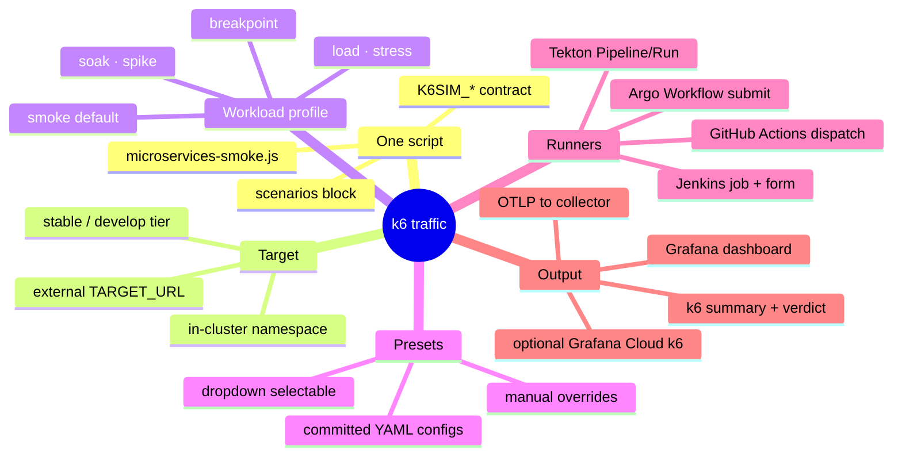

</details>

<details>
<summary>🟢 For newcomers — what is this, in plain terms (+ a high-level map)</summary>

Think of k6 as a **robot user** that clicks through the app over and over so the dashboards have something to show:

- It hits a few **endpoints** (the gateway home page, health checks, a proxied microservice call).
- Each loop is one **iteration**; the number of simultaneous robots is the **virtual users (VUs)**.
- By **default** it does a tiny **smoke test** — *just enough traffic to prove the pipes work and light up Grafana*. It is **not** a load test out of the box.
- You make it a real load test by picking a **profile** (`load`, `stress`, `soak`, `spike`, `breakpoint`) — each is a preset shape of "ramp up to N robots, hold, ramp down".
- It checks two **budgets** (a *pass/fail* line): error rate under 5% and 95th-percentile latency under 3 s. Cross one and the run is flagged **UNSTABLE** (but still feeds Grafana).


You do **not** need to edit any code to run it — pick the profile and press **Build** (Jenkins), **Create PipelineRun** (Tekton), **Run workflow** (GitHub Actions), or **Submit** the Workflow (Argo Workflows).

</details>

<details>
<summary>🔵 For specialists — the execution model in one breath</summary>

`options.scenarios.microservices` is built at init time by `buildScenario()` from the `K6SIM_*` env. **Explicit overrides win over the profile preset**: `K6SIM_STAGES` → `ramping-vus`; `K6SIM_RPS` → `constant-arrival-rate` (open model, decouples throughput from VU latency); otherwise the profile selects an executor (`shared-iterations` / `constant-vus` / `ramping-vus` / `ramping-arrival-rate`), with `K6SIM_VUS`/`K6SIM_DURATION`/`K6SIM_ITERATIONS` fine-tuning it. Thresholds are `{threshold, abortOnFail}` objects; only `breakpoint` sets `abortOnFail` so it stops at the knee, while every other profile lets k6 finish and exit **99** (reported as **UNSTABLE**, not a build failure — the run still delivered telemetry).

The knobs are **`K6SIM_`-prefixed on purpose**: k6 reserves `K6_VUS`/`K6_DURATION`/`K6_ITERATIONS`/`K6_STAGES`/`K6_RPS` as its *own* execution-option env vars, and k6 **forbids mixing** those (or the `--vus`/`--duration` CLI shortcuts) with a script that defines `scenarios`. So every runner passes execution shape **only** via `K6SIM_*` env — never CLI flags. k6's `--include-system-env-vars` (default on) surfaces them to `__ENV`.

OTLP export (`-o opentelemetry`, k6 2.x schema) is configured by the **runner**, not the script: gRPC to the in-cluster `otel-collector-gateway` (Jenkins/Tekton/Argo Workflows, and GitHub Actions in oss/managed modes via port-forward) or HTTP/protobuf straight to Grafana Cloud's gateway (grafana-cloud mode). `OTEL_RESOURCE_ATTRIBUTES` carries `deployment.environment=<ENV_NAME>` so the dashboard variable scopes per tier.

</details>

---

## The parameter contract (`K6SIM_*`)

Every runner threads the **same variables** into the script. They are all **optional** — an empty value means "use the script default", so you only ever set what you want to change. The script reads them in [`jenkins/pipelines/k6/microservices-smoke.js`](../jenkins/pipelines/k6/microservices-smoke.js).

### Target — *where* the traffic goes

| Variable | Default | What it does | Who needs it |
|---|---|---|---|
| `TARGET_NAMESPACE` | `microservices` | In-cluster Service DNS namespace (`<svc>.<ns>.svc.cluster.local`). Set to `microservices-develop` for the develop tier. | **basic** |
| `TARGET_URL` | *(empty)* | External base URL (e.g. `https://microservices.<domain>`). When set, **overrides** in-cluster DNS and the direct microservice-health flow is skipped (not reachable from outside). | **basic** |
| `ENV_NAME` | `stable` | The `deployment.environment` label on all telemetry; scopes the Grafana dashboard variable. Use `develop` for the develop tier. | **basic** |
| `K6SIM_GATEWAY_PORT` | `8080` | Gateway Service port. | advanced |
| `K6SIM_MICROSERVICE_PORT` | `8081` | Microservice Service port. | advanced |

### Workload — *how much* traffic

| Variable | Default | What it does | Who needs it |
|---|---|---|---|
| `K6SIM_PROFILE` | `smoke` | The preset shape: `smoke` · `load` · `stress` · `soak` · `spike` · `breakpoint` (see [Profiles](#workload-profiles)). | **basic** |
| `K6SIM_VUS` | *(profile)* | Virtual users / pre-allocated VUs. Empty → the profile's default peak. | **basic** |
| `K6SIM_ITERATIONS` | *(profile)* | Shared iteration budget (**smoke** profile only). Empty → 12. | **basic** |
| `K6SIM_DURATION` | *(profile)* | Hold duration (`30s`, `5m`, `1h`). Overrides the iteration budget; sets the hold phase of ramping profiles. | **basic** |
| `K6SIM_STAGES` | *(empty)* | Fully custom ramp: `"dur:target,..."` e.g. `30s:10,2m:50,30s:0`. **Overrides the profile** with a `ramping-vus` executor. | advanced |
| `K6SIM_RPS` | *(empty)* | Constant arrival rate (requests/sec). **Overrides the profile** with a `constant-arrival-rate` executor (open model). | advanced |
| `K6SIM_SLEEP` | `0.3` | Think-time (seconds) between requests within an iteration. | advanced |

### Scenarios — *which request flows* run

| Variable | Default | What it does |
|---|---|---|
| `K6SIM_SCENARIOS` | `all` | `all` or a comma list of: `gateway-ui`, `gateway-health`, `microservice-health`, `gateway-proxy`. Lets you isolate a single route or skip the direct microservice hit on external runs. |

### Thresholds — *what passes*

| Variable | Default | What it does |
|---|---|---|
| `K6SIM_P95_MS` | `3000` | `http_req_duration` p(95) budget in ms. |
| `K6SIM_ERROR_RATE` | `0.05` | `http_req_failed` max rate (0..1). |
| `K6SIM_WARMUP_TIMEOUT` | `60` | Readiness-gate budget in seconds (`0` = off). Before the measured run, `setup()` polls the gateway (and, when the direct `microservice-health` flow is on, the microservice) health until it serves — so a **cold start** (a just-deployed pod with no Service endpoints yet) doesn't blow the thresholds with ~20 s dial-timeout samples. |
| `K6SIM_DEBUG` | `false` | Per-iteration console logging (trace ids + resolved config) for debugging a run. |

> **Override precedence** (highest first): `K6SIM_STAGES` → `K6SIM_RPS` → `K6SIM_PROFILE` preset, with `K6SIM_VUS` / `K6SIM_DURATION` / `K6SIM_ITERATIONS` fine-tuning whichever is chosen.

> **Cold-start immunity.** The two thresholds are scoped to the measured scenario (`http_req_failed{scenario:microservices}` / `http_req_duration{scenario:microservices}`) and the `setup()` readiness gate runs first, so a fresh deploy that isn't warm yet no longer flips the smoke to a **false UNSTABLE** — the warm-up's own probe traffic is a different scenario tag and is excluded from those thresholds. If a target genuinely never comes up, the gate still yields after `K6SIM_WARMUP_TIMEOUT` and the run proceeds so the real failure surfaces in the checks.

---

## Workload profiles

Each profile maps to a k6 **executor** and a **shape**. Defaults shown; every one honours `K6SIM_VUS` / `K6SIM_DURATION` overrides.

| Profile | Executor | Default shape | Use it to… |
|---|---|---|---|
| **`smoke`** *(default)* | `shared-iterations` | 4 VUs share 12 iterations | Prove the pipes + feed Grafana. **Not** a load test. |
| **`load`** | `ramping-vus` | 0→20 (30s), hold 2m, →0 (30s) | Measure behaviour at expected steady traffic. |
| **`stress`** | `ramping-vus` | →50 (1m), →100 (2m), hold 2m, →0 (1m) | Push past normal to find where it degrades. |
| **`soak`** | `constant-vus` | 10 VUs for 1h | Catch leaks / drift over a long, flat run. |
| **`spike`** | `ramping-vus` | 0→100 (10s), hold 1m, →0 (10s) | Sudden burst — test autoscaling + recovery. |
| **`breakpoint`** | `ramping-arrival-rate` | 1→200 req/s over 5m, **aborts on breach** | Find the capacity knee; stops when p(95) budget breaks. |

<details>
<summary>📈 Diagram — profile shapes (VUs over time)</summary>

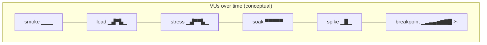

</details>

> **Why a breach is `UNSTABLE`, not a failure.** Except for `breakpoint`, crossing a threshold makes k6 exit **99** — the run completed and **still delivered telemetry**, it just missed a budget. All four engines honour this: **Jenkins** marks the build **UNSTABLE** ([`vars/microservicesK6Smoke.groovy`](../vars/microservicesK6Smoke.groovy)), **GitHub Actions** maps 99 to success ([`Day2.traffic.01-k6.yml`](../.github/workflows/Day2.traffic.01-k6.yml)), and **Tekton** / **Argo Workflows** log `thresholds breached (exit 99) — run completed, telemetry delivered` and let the TaskRun/Workflow succeed ([`tekton/tasks/k6-smoke.yaml`](../tekton/tasks/k6-smoke.yaml), [`argoworkflows/templates/microservices-k6-wftmpl.yaml`](../argoworkflows/templates/microservices-k6-wftmpl.yaml)). CI does not hard-fail on a budget miss; a non-99 non-zero exit (script/runtime error) **does** fail on every engine.

---

## Config presets (committed test configs)

Typing the full `K6SIM_*` set every time is tedious and error-prone. **Presets** solve this: each is a small **committed YAML file** under [`jenkins/pipelines/k6/presets/`](../jenkins/pipelines/k6/presets/) that bundles a complete, named configuration (profile + VUs/duration/stages/rps + scenarios + thresholds + optional target). You **pick one from a dropdown** and the runner loads its parameters; anything you still type by hand **overrides** the preset.

**Precedence (highest first):** manual field (non-empty) → **preset** value → script default. Selecting `none` = pure manual inputs / defaults (the historical behaviour).

> **Format = YAML, by design.** The repo standardises on YAML + `yq` everywhere ([`config/config.yaml`](../config/config.yaml), Helm values, JCasC, Tekton). TOML would add a second config language and new tooling for zero benefit, so presets are YAML and read with the same `yq` already in the runners.

**How each engine selects a preset:**

| Engine | Selector | Loader | Notes |
|---|---|---|---|
| **Jenkins** | `PRESET` **choice** in *Build with Parameters* (seeded from [`presets/index.yaml`](../jenkins/pipelines/k6/presets/index.yaml)) | `readYaml` in the pipeline merges preset + manual | The job's tier still sets the default namespace/env unless the preset pins them. |
| **GitHub Actions** | `preset` **dropdown** input | a *Resolve k6 parameters* step (`yq`) writes the merged `K6SIM_*` to `$GITHUB_ENV` | Options are listed in the workflow — keep in sync with `index.yaml`. |
| **Tekton** | `preset` **param** | a `resolve-preset` step (`yq`) writes `k6sim-preset.env`; `run-k6` fills any empty param from it | Idiomatic param; `tekton/runs/*.yaml` can hard-set it. |

<details>
<summary>🔄 Diagram — preset resolution & precedence (flowchart)</summary>

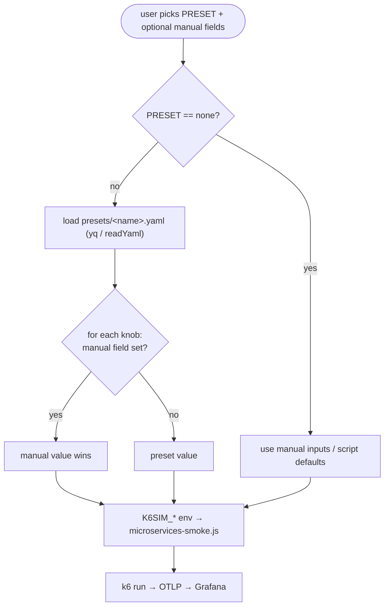

</details>

### Preset inventory — matrix

Every committed preset, what it does, and when to reach for it. **Shape** is the default; any field is still overridable at run time.

| Preset (file) | Level | Profile | Shape (VUs / rate · duration) | Scenarios | p95 / err budget | Target | Use case |
|---|---|---|---|---|---|---|---|
| **`smoke`** | 🟢 basic | `smoke` | 4 VUs × 12 iters | all | 3000ms / 5% | job tier | Post-deploy telemetry check (the build pipeline's k6 stage); "is it flowing?". |
| **`load-baseline`** | 🟢 basic | `load` | →20 VUs · 5m | all | 2000ms / 2% | job tier | Steady expected-load SLO check (nightly / pre-merge). |
| **`frontend-only`** | 🟢 basic | `load` | 10 VUs · 3m | gateway-ui, gateway-proxy | 2500ms / 2% | job tier | Focus the **edge/gateway path** users actually hit. |
| **`develop-smoke`** | 🟢 basic | `smoke` | 4 VUs × 12 iters | all | 3000ms / 5% | **develop** ns | Validate the lean **develop** tier / drive develop traffic. |
| **`stress-peak`** | 🔵 adv. | `stress` | 50→**100** VUs · hold 2m | all | 5000ms / 10% | job tier | Capacity exploration at ~2× load; watch the tail. |
| **`spike-recovery`** | 🔵 adv. | `spike` | →**100** VUs · hold 1m · sharp drop | all | 5000ms / 15% | job tier | Flash-crowd **elasticity + recovery** (HPA / GKE Node Auto-Provisioning). |
| **`soak-endurance`** | 🔵 adv. | `soak` | 10 VUs · **1h** | all | 3000ms / 5% | job tier | **Leak/drift** hunting over time (extend duration). |
| **`rps-steady`** | 🔵 adv. | arrival-rate | **120 req/s** · 5m (40 preVUs) | all | 2000ms / 2% | job tier | **Throughput** sign-off (open model); watch dropped iters. |
| **`breakpoint-capacity`** | 🔵 adv. | `breakpoint` | →**400 req/s** · 8m · **aborts at knee** | all | 1500ms / 10% | job tier | Find the **capacity ceiling** (last rate before breach). |
| **`rum-faro`** ⭐ | 🟢 basic | `rum` *(special)* | 5 VUs × **40 sessions** | — *(Faro beacons)* | 1500ms / — | **faro receiver** | **Synthetic RUM** — Web Vitals + JS errors → Frontend RUM dashboard. **oss / grafana-cloud only.** |

### Special test type — RUM (Faro) beacons (`rum-faro` · profile `rum`)

⭐ **This is not a microservices load test.** It runs a **different k6 script**
([`faro-rum.js`](../jenkins/pipelines/k6/faro-rum.js), not [`microservices-smoke.js`](../jenkins/pipelines/k6/microservices-smoke.js)):
each iteration is one synthetic browser **session** that POSTs a **Grafana Faro**
beacon — a page-load log + **Core Web Vitals** (LCP/FCP/TTFB/INP/CLS) + a browser
`documentLoad` span; a configurable fraction (`K6SIM_ERROR_RATE`, default 0.2) also
POST a JS exception — to the otel-collector's **faro receiver** (`:8027`). The
collector converts them to OTLP logs+traces and ships them to Loki/Tempo, **populating
the [`CI-CD Frontend RUM (Angular / Faro)`](./301-OBSERVABILITY.md) dashboard** — the
same path a real browser running the Angular Faro Web SDK uses ([docs/202](./202-MICROSERVICES-APP-ARCHITECTURE.md#frontend-observability--angular-rum-with-grafana-faro-implemented)),
without needing a browser.

| | `rum-faro` |
|---|---|
| **k6 script** | `faro-rum.js` (HTTP POSTs of Faro beacons; k6's own request metrics still export via OTLP, tagged `k6_profile=rum`, so the k6 board shows the run) |
| **Target** | the **faro receiver** (`otel-collector-gateway:8027`), **not** the app URL |
| **Knobs** | `K6SIM_VUS` (concurrent browsers, 5) · `K6SIM_ITERATIONS` (sessions, 40) · `K6SIM_DURATION` (→ continuous instead of a fixed count) · `K6SIM_ERROR_RATE` (JS-error fraction) · `env_name` (`develop`/`stable` → `deployment.environment`) |
| **Backends** | ✅ **oss** · ✅ **grafana-cloud** — Faro is stored natively in Loki/Tempo. ❌ **managed-azure / managed-aws** — Faro degrades to generic App Insights / CloudWatch ([301](./301-OBSERVABILITY.md#frontend-rum-grafana-faro-per-backend--native-on-grafana-cloud--oss)), so the runner **skips it with a clear message** there. |
| **Runner** | **GitHub Actions only** ([`Day2.traffic.01-k6`](https://github.com/nubenetes/jenkins-2026/actions/workflows/Day2.traffic.01-k6.yml), `preset=rum-faro` or `profile=rum`). **Not** in `presets/index.yaml` — so the Jenkins/Tekton k6 jobs (HTTP load script) never pick it up — but the GitHub Actions **`run_all` DOES include it** (its matrix builder appends `rum-faro`; the backend guard self-skips it on managed-azure/aws). |

**Run it:** GitHub Actions → *Day2.traffic.01 k6* → `preset = rum-faro`, `env_name = develop` (or `stable`) → Run. In ~30s the Frontend RUM dashboard (filter `app=angular-gateway`, `env=<tier>`) lights up. (Equivalent to the older [`Day2.traffic.02-rum`](https://github.com/nubenetes/jenkins-2026/actions/workflows/Day2.traffic.02-rum.yml) bash emitter, now as a first-class k6 test type.)

### Per-preset use case + diagram

Each preset's intent, with a diagram (varied types — load-shape charts, request-flow graphs, sequences). Click to expand.

<details>
<summary>🟢 <code>smoke</code> — telemetry-only sanity (request-flow graph)</summary>

A handful of VUs run a few iterations of the full session. Not a load test — it exists to produce one fresh, fully-correlated trace/metric/log example per iteration.

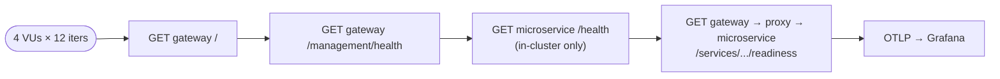

</details>

<details>
<summary>🟢 <code>load-baseline</code> — steady expected load (VUs-over-time chart)</summary>

Ramp to 20 VUs, hold 5 minutes, ramp down — the first real load step. Tight budgets (p95 < 2s, err < 2%) make it a regression gate under normal traffic.

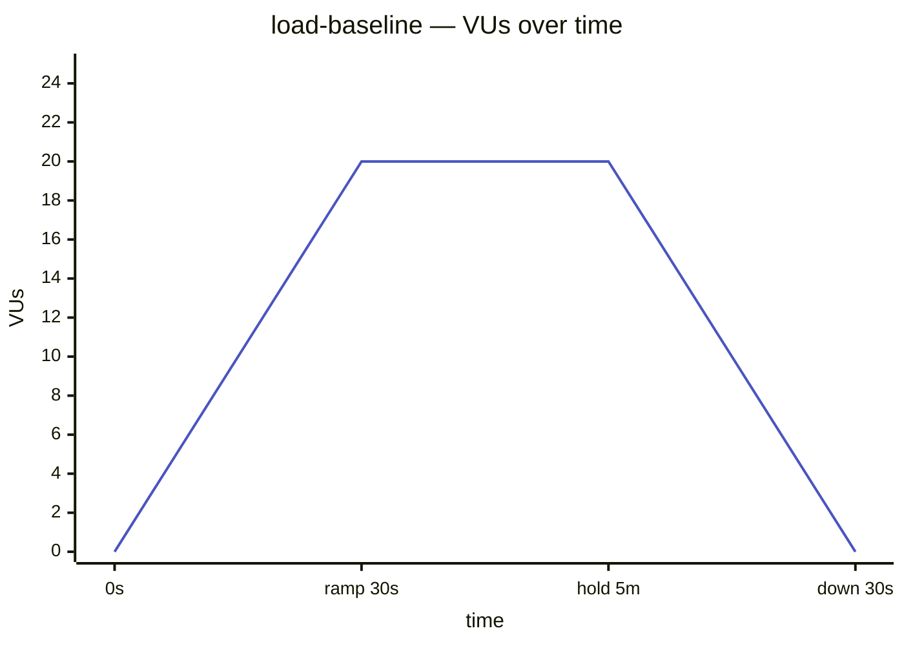

</details>

<details>
<summary>🟢 <code>frontend-only</code> — edge/gateway path only (scoped request-flow)</summary>

Only the user-facing routes (gateway landing + the proxied microservice), skipping the internal health probes. Use when validating a gateway/HTTPRoute change.

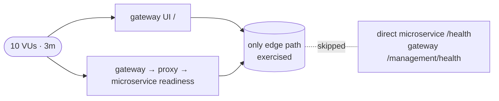

</details>

<details>
<summary>🟢 <code>develop-smoke</code> — smoke against the develop tier (targeting graph)</summary>

The smoke test pinned to the lean **develop** tier (`microservices-develop` namespace, `deployment.environment=develop`), regardless of which job launched it. Requires `microservices.developTrackEnabled`. In-cluster runners (Jenkins/Tekton) reach it by namespace DNS as drawn below; the external GitHub Actions runner targets the tier's public `microservices-develop.<baseDomain>` host instead.

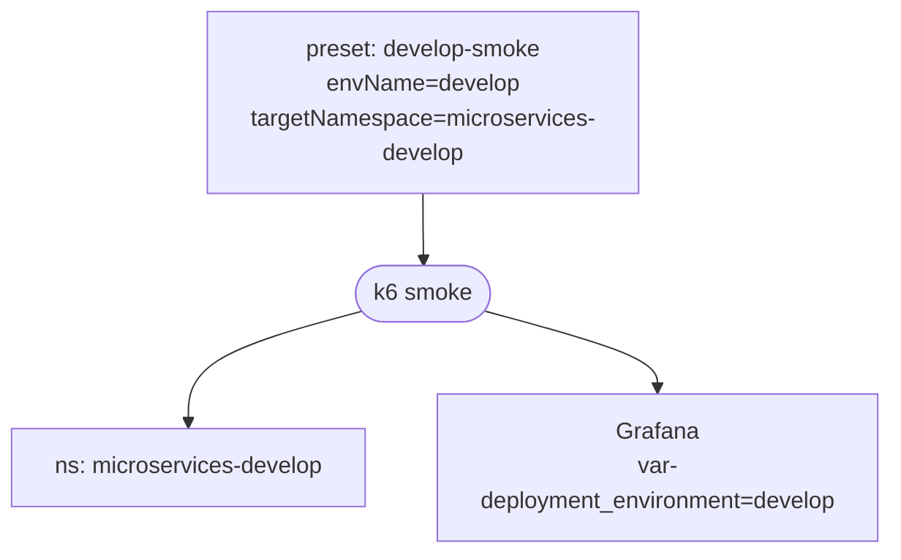

</details>

<details>
<summary>🔵 <code>stress-peak</code> — beyond normal, find degradation (VUs-over-time chart)</summary>

Ramp to a base (50) then 2× (100), hold, ramp down, with **looser** budgets — a breach here is informative. Watch p99/max and `http_req_failed` in the analysis.

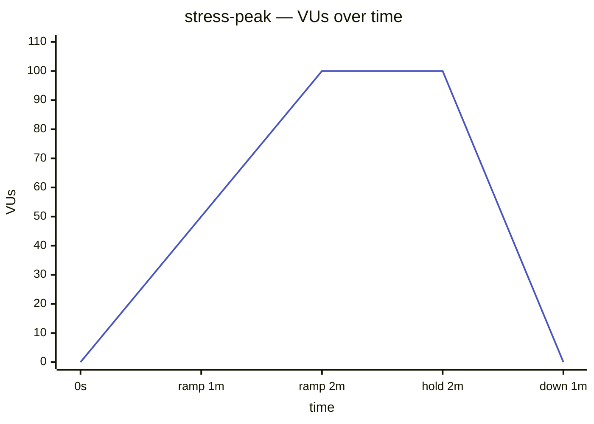

</details>

<details>
<summary>🔵 <code>spike-recovery</code> — flash crowd & recovery (VUs-over-time chart)</summary>

A sudden burst to 100 VUs, a short hold, then a sharp drop — tests how the platform absorbs the spike (autoscaling, queueing) and how fast it settles afterwards.

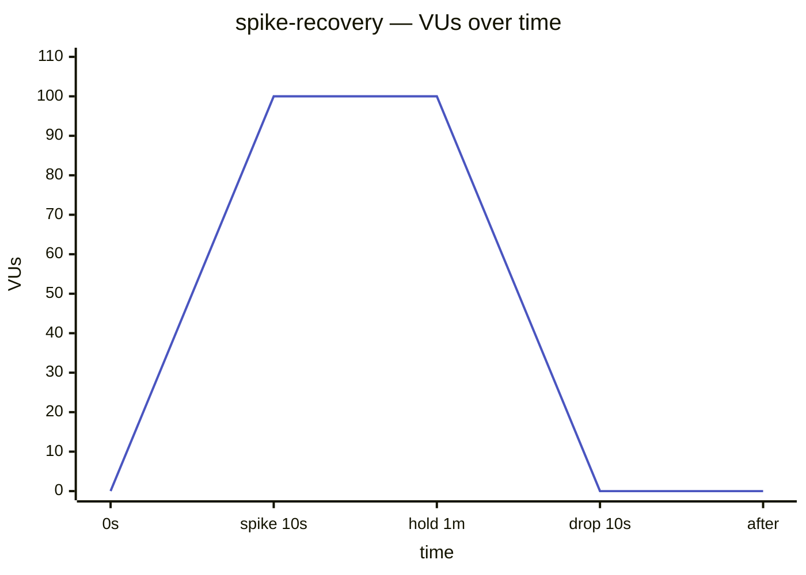

</details>

<details>
<summary>🔵 <code>soak-endurance</code> — long flat run, leak hunting (VUs-over-time chart)</summary>

Moderate, constant load held for a long time (1h, extend to 8h) to surface leaks, pool exhaustion and GC drift that only appear over time. Pair with Grafana memory/GC panels across the whole window.

```mermaid
---
config:
  themeVariables:
    xyChart:
      plotColorPalette: "#4a55c0"
---
xychart-beta
    title "soak-endurance — VUs over time"
    x-axis "time" [0s, "5m", "30m", "1h"]
    y-axis "VUs" 0 --> 15
    line [10, 10, 10, 10]
```

</details>

<details>
<summary>🔵 <code>rps-steady</code> — fixed throughput, open model (sequence diagram)</summary>

Constant **arrival rate** (120 req/s): k6 launches requests on a schedule regardless of response time (open model), so latency under a known load is measured honestly. If `dropped_iterations` > 0, raise `vus` (the pre-allocated pool).

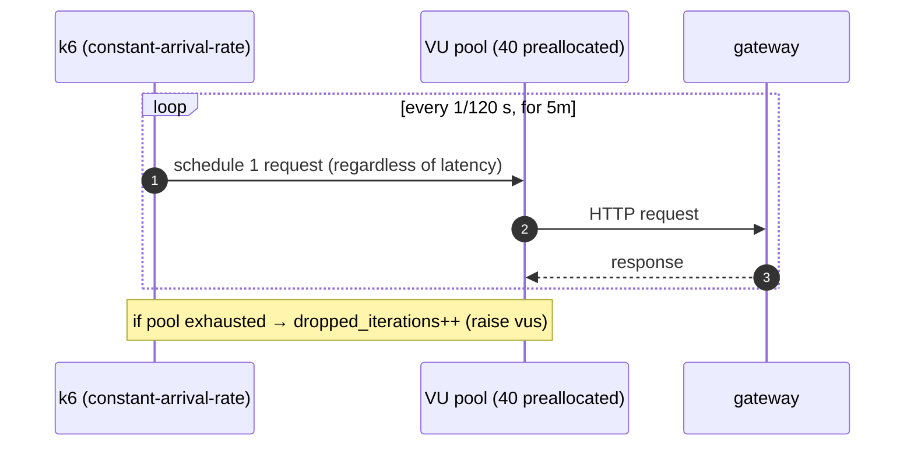

</details>

<details>
<summary>🔵 <code>breakpoint-capacity</code> — ramp until it breaks (VUs/rate chart with knee)</summary>

Arrival rate ramps toward 400 req/s; the moment the p(95) budget (1500ms) breaks, the run **aborts** (`abortOnFail`). The last sustained rate before the abort is the capacity ceiling. The only profile that fails fast by design.

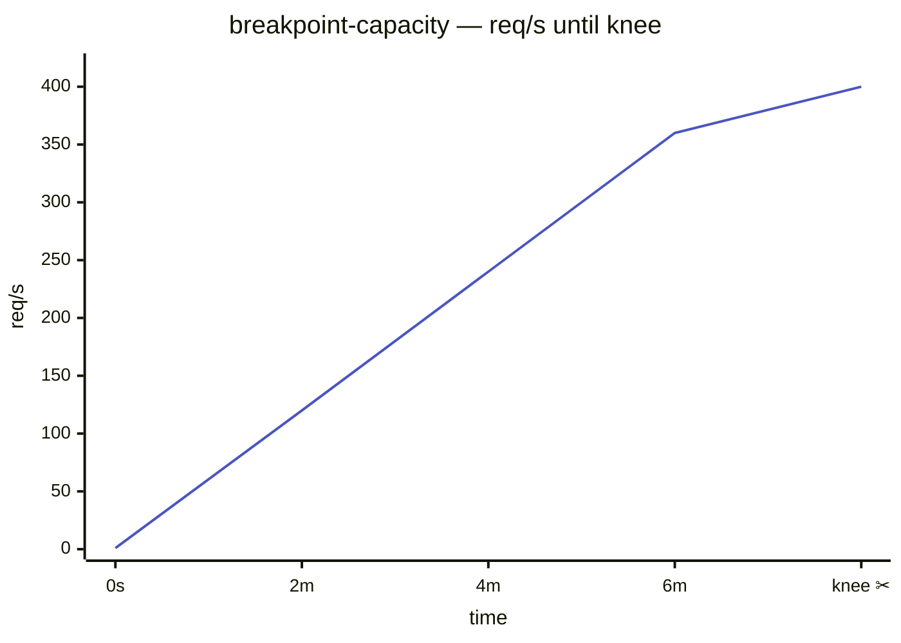

</details>

### Adding a preset

1. Drop a `jenkins/pipelines/k6/presets/<name>.yaml` (copy an existing one; fill `params:` with any subset of the `K6SIM_*` knobs in camelCase — `profile`, `vus`, `duration`, `stages`, `rps`, `scenarios`, `p95Ms`, `errorRate`, `envName`, `targetNamespace`, `targetUrl`, …).
2. Add it to `presets/index.yaml` (name + level + description) — this drives the **Jenkins** dropdown and the docs.
3. Add the name to the **GitHub Actions** workflow `preset` input `options:` (kept in sync manually, like the secrets inventory).

Tekton needs no list — it resolves whatever `preset` name you pass against the file in git.

---

## Running it — the four engines

All four call the exact same script with the same contract. The original question this page also answers: **all four now support `develop`**, not just `stable`.

<details>
<summary>🔀 Diagram — four runners, one script</summary>

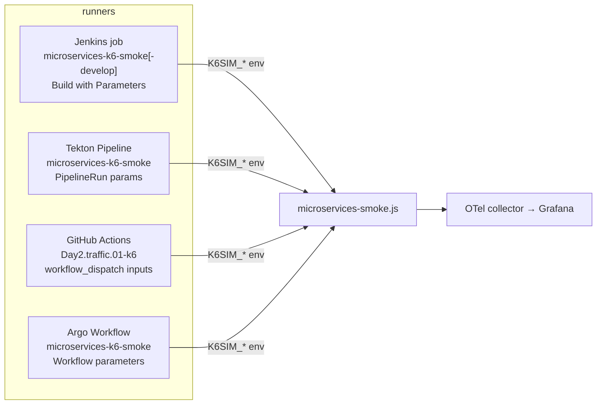

</details>

### Jenkins

The seed job ([`jenkins/pipelines/seed/seed_jobs.groovy`](../jenkins/pipelines/seed/seed_jobs.groovy)) generates **one k6 job per tier**: `microservices-k6-smoke` (stable) and, when the develop tier is on (`JENKINS2026_DEVELOP_TRACK_ENABLED=true`), `microservices-k6-smoke-develop`. Each is a **`MicroservicesK6SmokePipeline`** ([`vars/MicroservicesK6SmokePipeline.groovy`](../vars/MicroservicesK6SmokePipeline.groovy)) with a full **"Build with Parameters"** form — a **`PRESET`** dropdown (seeded from [`presets/index.yaml`](../jenkins/pipelines/k6/presets/index.yaml)) plus `PROFILE`, `VUS`, `DURATION`, `STAGES`, `RPS`, `SCENARIOS`, `P95_MS`, `ERROR_RATE`, `TARGET_URL`, `DEBUG`. The build/deploy pipeline ([`vars/MicroservicesPipeline.groovy`](../vars/MicroservicesPipeline.groovy)) triggers the **tier-matched** k6 job as its *Integration k6 Smoke Test* stage.

- **Easiest:** pick a `PRESET` (e.g. `load-baseline`) → **Build**. The preset's config loads; leave the rest untouched.
- **Basic:** open `microservices-k6-smoke` → **Build with Parameters** → leave defaults (`PRESET=none`) → **Build** (the smoke test).
- **Advanced:** set `PROFILE=load`, `VUS=30`, `DURATION=5m` → a real load test, same job. (Manual fields override a chosen preset.)
- **develop:** open `microservices-k6-smoke-develop` (targets `microservices-develop`, `ENV_NAME=develop`), or pick the `develop-smoke` preset from any job.

### Tekton

[`tekton/pipelines/microservices-k6-smoke.yaml`](../tekton/pipelines/microservices-k6-smoke.yaml) (→ [`tekton/tasks/k6-smoke.yaml`](../tekton/tasks/k6-smoke.yaml)) exposes the same knobs as Pipeline **params**, including a **`preset`** param (a `resolve-preset` step `yq`-loads the committed file; any param you set overrides it). The contract matches the other engines: **`otlp-endpoint` defaults to the in-cluster collector** (`http://otel-collector-gateway.observability.svc.cluster.local:4317`), so a standalone run exports k6 metrics to Grafana with no extra params (set it to `""` to skip OTLP), and a **threshold breach (k6 exit 99) does not fail the TaskRun** — it's logged and tolerated, like Jenkins' UNSTABLE (any other non-zero exit still fails). Ready-to-run examples live in [`tekton/runs/`](../tekton/runs/):

- [`tekton/runs/k6-smoke.yaml`](../tekton/runs/k6-smoke.yaml) — defaults (stable smoke); a commented `params:` block shows how to override (incl. `preset`).
- [`tekton/runs/k6-load.yaml`](../tekton/runs/k6-load.yaml) — an **advanced** example: `profile=load`, `vus=30`, `duration=5m`, scoped to the **develop** tier with a tighter `p95-ms=1500`.

```bash
# basic
kubectl create -f tekton/runs/k6-smoke.yaml
# advanced (load against develop)
kubectl create -f tekton/runs/k6-load.yaml
# pick a committed preset
tkn pipeline start microservices-k6-smoke -n tekton-ci \
  -w name=source,volumeClaimTemplateFile=/dev/stdin -p preset=stress-peak
# ad-hoc override
tkn pipeline start microservices-k6-smoke -n tekton-ci \
  -w name=source,volumeClaimTemplateFile=/dev/stdin \
  -p profile=stress -p vus=50 -p duration=3m -p env-name=stable
```

### GitHub Actions

[`.github/workflows/Day2.traffic.01-k6.yml`](../.github/workflows/Day2.traffic.01-k6.yml) is a `workflow_dispatch` with a **`preset`** dropdown plus the full input set: **`profile`**, **`env_name`** (`stable`/`develop`), `duration`, `vus`, `stages`, `rps`, `scenarios`, `p95_ms`, `error_rate`, `target_url`, `debug`. A *Resolve k6 parameters* step merges the chosen preset with any manual inputs (manual wins). It resolves the target automatically:

- **`env_name=stable`** → the public `microservices.<baseDomain>` host from `config/config.yaml`.
- **`env_name=develop`** → the public **`microservices-develop.<baseDomain>`** host (`gateway.hosts.microservicesDevelop`) — the develop tier now has its own public route (see [402 · develop tier](./402-PIPELINES_AS_CODE.md#optional-develop-tier-feature-flag-off-by-default)), so the runner targets it directly over the internet exactly like `stable`.
- **`target_url`** input → overrides both.

It detects the active observability mode from in-cluster secrets and routes OTLP accordingly (Grafana Cloud HTTP/protobuf, or gRPC via a collector port-forward for oss/managed). Run it from **Actions → Day2.traffic.01 → Run workflow** (no approval gate — it only drives read-only HTTP traffic, so automation/scheduling isn't blocked; the heavier Day2.* workflows keep their gate).

#### Run ALL presets in one click (`run_all_presets`)

Set **`run_all_presets=true`** and the workflow runs **every** preset in
[`presets/index.yaml`](../jenkins/pipelines/k6/presets/index.yaml) **plus the `rum-faro`
RUM test** as a **parallel GitHub Actions matrix** — a tiny `prepare` job emits the preset
list (`fromJson`; the GitHub Actions matrix builder appends `rum-faro` on top of the shared
index, which itself excludes it), then one `k6: <preset>` job runs per preset
(`fail-fast: false`, `max-parallel: 4` so a full sweep doesn't crush the lean app). The
`rum-faro` job runs on **oss / grafana-cloud** and self-skips cleanly (green) on
managed-azure/aws. One click → every use case lands in the dashboard, filterable by
Runner/Profile/Preset.

- **`run_all_duration`** (optional) — cap **every** preset to one short duration (e.g.
  `30s`), clearing each preset's stages/rps/iterations, for a quick comprehensive pass
  instead of each file's own (e.g. the 1h `soak-endurance`) values. Empty = each file's own.
- **Environment** — `env_name` (`stable`/`develop`) applies to every preset that doesn't
  pin its own; `develop-smoke` pins `develop`. Precedence: **preset's pinned `envName` >
  `env_name` input > default `stable`**.

```bash
# every use case, capped to 30s each, against stable
gh workflow run "Day2.traffic.01-k6.yml" --ref develop \
  -f run_all_presets=true -f run_all_duration=30s
# … the same, but all against develop
gh workflow run "Day2.traffic.01-k6.yml" --ref develop \
  -f run_all_presets=true -f run_all_duration=30s -f env_name=develop
```

### Argo Workflows

[`argoworkflows/templates/microservices-k6-wftmpl.yaml`](../argoworkflows/templates/microservices-k6-wftmpl.yaml) is the standalone k6 `WorkflowTemplate` (`microservices-k6-smoke`, the Argo port of the Tekton k6 Pipeline), exposing the same knobs as Workflow **parameters** — including a **`preset`** param (a `resolve-preset` step `yq`-loads the committed file; any param you set overrides it). The contract matches the other engines: **`otlp-endpoint` defaults to the in-cluster collector** (`http://otel-collector-gateway.observability.svc.cluster.local:4317`), so a standalone run exports k6 metrics to Grafana with no extra parameters (set it to `""` to skip OTLP), and a **threshold breach (k6 exit 99) does not fail the Workflow** — it's logged and tolerated, like Jenkins' UNSTABLE (any other non-zero exit still fails). Ready-to-run Workflows live in [`argoworkflows/runs/`](../argoworkflows/runs/):

- [`argoworkflows/runs/k6-smoke.yaml`](../argoworkflows/runs/k6-smoke.yaml) — defaults (stable smoke); a commented `parameters:` block shows how to override (incl. `preset`).
- [`argoworkflows/runs/k6-load.yaml`](../argoworkflows/runs/k6-load.yaml) — an **advanced** example: `profile=load`, `vus=30`, `duration=5m`, scoped to the **develop** tier with a tighter `p95-ms=1500`.

```bash
# basic
kubectl create -f argoworkflows/runs/k6-smoke.yaml
# advanced (load against develop)
kubectl create -f argoworkflows/runs/k6-load.yaml
# pick a committed preset (submit the WorkflowTemplate directly)
argo submit --from workflowtemplate/microservices-k6-smoke -n argo-ci -p preset=stress-peak
# ad-hoc override
argo submit --from workflowtemplate/microservices-k6-smoke -n argo-ci \
  -p profile=stress -p vus=50 -p duration=3m -p env-name=stable
```

k6 also runs inline as the *k6 Smoke* stage of the build pipeline ([`argoworkflows/templates/microservices-wftmpl.yaml`](../argoworkflows/templates/microservices-wftmpl.yaml)). The `K6SIM_*` contract, the OTLP export, and the `--tag ci_runner=argoworkflows` labelling are identical to the other engines.

### Filtering results by Runner / Profile / Preset

Every k6 run is tagged so the **`CI-CD / k6 Observability`** dashboard can slice
by **who ran it and what shape it was** — three k6 **`--tag`** values become Prometheus
labels on every k6 metric series:

| Tag → label | Values | Set by |
|---|---|---|
| `ci_runner`  | `gha` · `jenkins` · `tekton` · `argoworkflows` | the runner (literal per engine) |
| `k6_profile` | `smoke` · `load` · `stress` · `soak` · `spike` · `breakpoint` | `${K6SIM_PROFILE}` |
| `k6_preset`  | the preset name (e.g. `breakpoint-capacity`), or `none` for ad-hoc | the selected preset |

The dashboard exposes **Runner** and **Profile** template variables (plus the existing
**Environment**); `allValue='.*'` + includeAll means pre-existing untagged runs still show
under *All*, and selecting a value narrows once tagged runs land.

> **Why `--tag` and not `OTEL_RESOURCE_ATTRIBUTES`.** It's tempting to add
> `ci.runner=…,k6.profile=…` as OTEL *resource* attributes. Don't — **Grafana Cloud's
> OTLP→Prometheus ingestion only promotes a fixed set of resource attributes to labels**
> (`deployment.environment` is promoted; arbitrary custom ones are **not** — they land only
> in the `target_info` metric). So resource-attr tags never reach `iterations_total` /
> `http_req_*`, and the dashboard's `label_values()` + panel filters stay empty. k6 `--tag`
> attaches the value to **every** metric series in **every** output, so it works on all
> backends. (Symptom if you get this wrong: `label_values(iterations_total, ci_runner)` is
> empty while `{ci_runner="gha"}` matches only `target_info`.)

---

## Tutorials

### Easiest — run a committed preset (no knobs)

1. **Jenkins:** open the k6 job → **Build with Parameters** → set `PRESET` (e.g. `load-baseline`) → **Build**. **GitHub Actions:** Run workflow, choose `preset`. **Tekton:** `tkn pipeline start microservices-k6-smoke -p preset=load-baseline ...`. **Argo Workflows:** `argo submit --from workflowtemplate/microservices-k6-smoke -n argo-ci -p preset=load-baseline`.
2. The preset's whole config loads; everything else stays default. Read the analysis + Grafana link as usual.
3. To tweak one thing, also fill that single field — it overrides the preset. See the [preset inventory](#preset-inventory--matrix) for what each does.

### Basic — a smoke test that lights up Grafana

1. **Jenkins:** `microservices-k6-smoke` → Build (no params). **GitHub Actions:** Run workflow, all defaults. **Tekton:** `kubectl create -f tekton/runs/k6-smoke.yaml`. **Argo Workflows:** `kubectl create -f argoworkflows/runs/k6-smoke.yaml`.
2. Watch the console — the **k6 run analysis** prints a SUMMARY + VERDICT (see below).
3. Open the **`CI-CD / k6 Observability`** dashboard (the run log prints a deep-link scoped to the run's `deployment_environment` and time window).

### Basic — point it at the develop tier

- **Jenkins:** run `microservices-k6-smoke-develop`.
- **GitHub Actions:** Run workflow with `env_name=develop`.
- **Tekton:** `kubectl create -f tekton/runs/k6-load.yaml` (or set `env-name=develop`, `target-namespace=microservices-develop`).
- **Argo Workflows:** `kubectl create -f argoworkflows/runs/k6-load.yaml` (or set `env-name=develop`).

### Advanced — a custom ramping load test

Drive an arbitrary shape with `K6SIM_STAGES` (overrides the profile):

```text
STAGES = 1m:25,3m:25,1m:75,3m:75,1m:0     # step-load: 25 VUs, then 75, cool down
P95_MS = 1500                              # tighter latency budget
SCENARIOS = gateway-ui,gateway-proxy       # only the user-facing routes
```

Jenkins: set those fields. Tekton / Argo Workflows: `-p stages=... -p p95-ms=1500 -p scenarios=...`. GitHub Actions: the matching inputs.

### Advanced — throughput (RPS) and breakpoint

- **Fixed throughput:** `RPS=120 DURATION=5m` → open-model `constant-arrival-rate`; **watch `dropped_iterations`** in the analysis — non-zero means VUs couldn't keep up (raise `VUS`).
- **Find the knee:** `PROFILE=breakpoint RPS=400 DURATION=8m` → ramps arrival rate until the p(95) budget breaks, then **aborts**. The last sustained rate before the abort is your capacity ceiling.

---

## Reading the results — basic & expert

> **How `k6-summary.json` is produced.** The script defines a **`handleSummary()`** that
> writes the end-of-test summary itself, rather than relying on k6's `--summary-export`.
> k6 2.0's `--summary-export` emits a *flattened* schema (`metrics.<m>.<stat>`), but all
> four engines parse the nested `metrics.<m>.values.<stat>` (+ `.thresholds[expr].ok`)
> shape — so `--summary-export` silently made every summary read **all-zeros / `[FAIL]`**
> even on a passing run. `handleSummary()`'s `data` object keeps the stable `.values.*`
> schema, fixing GHA, Jenkins, Tekton and Argo Workflows from one place. The output path is the CWD
> `k6-summary.json` by default, overridable via **`K6_SUMMARY_OUT`** (Tekton runs k6 from a
> sub-dir and writes to the workspace root). `summaryTrendStats` includes `p(99)` so the
> percentile spread below is complete (k6's defaults omit p99).

Both the Jenkins job (`printK6Summary()` in [`vars/microservicesK6Smoke.groovy`](../vars/microservicesK6Smoke.groovy)) and the GitHub Actions *Show Results Summary* step now print a **layered analysis** of `k6-summary.json` (also archived as a build artifact / uploaded as `k6-summary-report`):

```text
========== k6 run analysis ==========
--- SUMMARY ---                # basic: the at-a-glance line anyone reads
checks:            40/42 passed (95.2%)
http_req_failed:   1.30% failed   [PASS]
http_reqs:         120 total (8.00 req/s)

--- LATENCY (http_req_duration, ms)  [PASS] ---   # expert: full percentile spread
  avg=210  min=12  med=180
  p90=420  p95=600  p99=850  max=900
  server (waiting/TTFB) avg=180  p95=540  (connect avg=4, tls avg=11)

--- THROUGHPUT & RELIABILITY ---
  iterations:      40 (2.60/s)
  dropped iters:   0
  peak VUs:        10
  data received:   2.0 MB (410 KB/s)
  data sent:       128 KB (26 KB/s)

--- THRESHOLDS ---             # every configured budget, PASS/FAIL
  [PASS] http_req_failed: rate<0.05
  [PASS] http_req_duration: p(95)<3000

VERDICT: PASS - thresholds met and all checks green
```

**How to read it — by audience:**

| Level | Look at | Why |
|---|---|---|
| 🟢 **Newcomer** | `VERDICT` + `checks` | One line: did it pass, and did the functional checks (status 2xx/3xx) hold? |
| 🟡 **Operator** | `http_req_failed`, `p95`, `THRESHOLDS` | Are we inside the error + latency budgets? Which threshold breached? |
| 🔵 **Specialist** | `p99`/`max` vs `p95`, **server TTFB** vs total, `dropped iters`, `peak VUs`, throughput | **Tail latency** (p99≫p95 = bad outliers); **TTFB≈total** ⇒ server-bound, **gap** ⇒ network/connect; **dropped iters** ⇒ under-provisioned VUs for the target RPS; throughput vs VUs ⇒ saturation point. |

> **Expert tip — separate *server* from *network*.** On external `TARGET_URL` runs k6 also reports `http_req_waiting` (TTFB), `http_req_connecting` and `http_req_tls_handshaking`. If `waiting` ≈ `duration`, the time is in the app; if the gap is large, it's connection/TLS/network — a distinction the raw p95 hides. The deepest, per-request, **trace-level** view is in Grafana (the dashboard correlates k6's traceparent with the app spans) — the console analysis is the fast triage; Grafana is the drill-down.

For the richest native experience, set the optional **Grafana Cloud k6** secret (`k6-cloud` / `K6_CLOUD_TOKEN`+`K6_CLOUD_PROJECT_ID`) — runs then **also** stream to the k6-app (`/a/k6-app/projects/<id>`) and the analysis prints that link too.

---

## stable vs develop — compatibility matrix

The original motivation for this work: the k6 jobs used to be **stable-only** in practice. Now:

| Engine | `stable` | `develop` | How develop is targeted |
|---|---|---|---|
| **Jenkins** | ✅ | ✅ | Dedicated `microservices-k6-smoke-develop` job (seed-generated when the tier is on); the build pipeline triggers the **tier-matched** job. |
| **Tekton** | ✅ | ✅ | `env-name`/`target-namespace` params ([`tekton/runs/k6-load.yaml`](../tekton/runs/k6-load.yaml) shows develop). |
| **GitHub Actions** | ✅ | ✅ | `env_name=develop` input → the public `microservices-develop.<baseDomain>` host (same external targeting as `stable`). |
| **Argo Workflows** | ✅ | ✅ | `env-name`/`target-namespace` params ([`argoworkflows/runs/k6-load.yaml`](../argoworkflows/runs/k6-load.yaml) shows develop). |

> The develop tier is **opt-in** (`microservices.developTrackEnabled` / `JENKINS2026_DEVELOP_TRACK_ENABLED`) and reports into the **same** Grafana, distinguished by `deployment.environment=develop` and namespace/labels — not a separate stack. See [402 · Optional develop Tier](./402-PIPELINES_AS_CODE.md#optional-develop-tier-feature-flag-off-by-default).

---

## Troubleshooting

| Symptom | Likely cause | Fix |
|---|---|---|
| `cannot use --vus/--duration with scenarios` | A runner passed a CLI execution shortcut | Pass shape via `K6SIM_*` env only — never `--vus`/`--duration` (the script defines `scenarios`). |
| Metrics missing in Grafana but k6 says PASS | OTLP export not reaching the collector | Check the collector port-forward / Grafana Cloud secret; confirm `K6_OTEL_*` in the runner; k6 image pinned to **2.0.0** (2.x metric schema). |
| `dropped_iterations` > 0 | `constant-arrival-rate`/`breakpoint` ran out of VUs | Raise `K6SIM_VUS` (pre-allocated pool). |
| develop run hits nothing | develop tier not deployed | Enable `microservices.developTrackEnabled`; for GitHub Actions confirm `svc/gateway` exists in `microservices-develop`. |
| Build UNSTABLE (exit 99) | A threshold was breached | Expected for a real load — read the `THRESHOLDS` table + `p95`/`error` lines; loosen `K6SIM_P95_MS`/`K6SIM_ERROR_RATE` or fix the regression. |
| Direct `microservice-health` flow absent | `TARGET_URL` is set (external) | Expected — the in-cluster-only direct hit is skipped; use `gateway-proxy` for the routed check. |

---

[← Previous: 301. Observability](./301-OBSERVABILITY.md) | [🏠 Home](../README.md) | [→ Next: 303. JVM Tuning](./303-JVM-TUNING.md)

---

*302. k6 Traffic, Load & Observability Testing — jenkins-2026*
