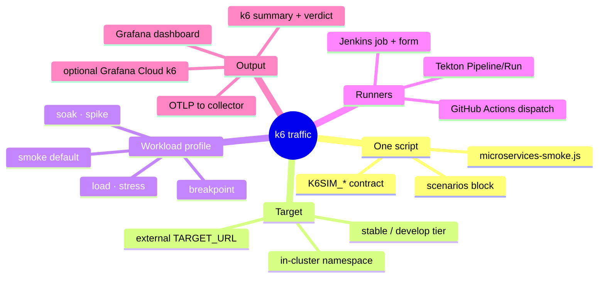
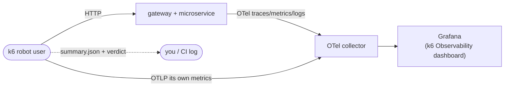
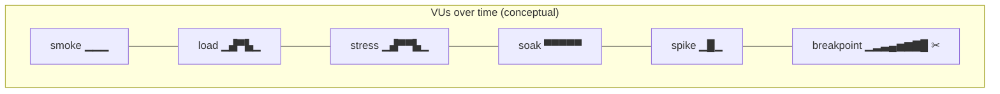
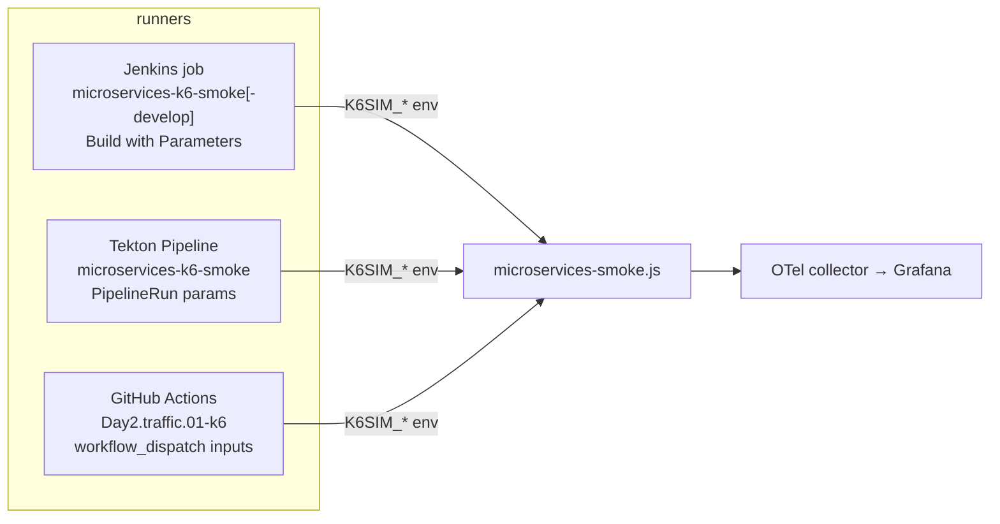

[← Previous: 301. Observability](./301-OBSERVABILITY.md) | [🏠 Home](../README.md) | [→ Next: 401. Jenkins](./401-JENKINS.md)

---

# 302. k6 Traffic, Load & Observability Testing

One k6 script, **one parameter contract**, three ways to run it. This page is the single home for the k6 work that the other docs only touch in passing — [301 · Observability](./301-OBSERVABILITY.md#k6-observability-smoke-test) (where the telemetry lands), [402 · Pipelines as Code](./402-PIPELINES_AS_CODE.md#2-k6-integration-smoke-test-pipeline) (the Jenkins job) and [501 · Platform Operations](./501-PLATFORM_OPERATIONS.md#telemetry-verification--simulation) (continuous simulation). Read this once and every k6 knob — from a 12-iteration smoke test to a multi-stage breakpoint run against the `develop` tier — is "set one variable".

> **TL;DR.** The same `jenkins/pipelines/k6/microservices-smoke.js` runs from **Jenkins**, **Tekton** and **GitHub Actions**. With **no parameters** it is the original lightweight **smoke** test (4 VUs × 12 iterations). Set `K6SIM_PROFILE=load|stress|soak|spike|breakpoint` (or override VUs / duration / stages / RPS / thresholds) and it becomes a real load test — **against either the `stable` or the `develop` tier**.

## Understanding k6 here (newcomers → specialists)

The whole thing is a **traffic generator wired into the observability pipeline**: k6 fires HTTP requests at the microservices, the apps emit OpenTelemetry traces/metrics/logs, k6 *also* exports its own request metrics over OTLP, and **everything lands in the same Grafana** tagged with the same `service.namespace=jenkins-2026` and `deployment.environment=<tier>`. Change *how much* traffic by changing the **workload profile**; change *where* it points with the **target**; change *what passes* with the **thresholds**.

<details>
<summary>🧠 Mental model — k6 in one map</summary>



</details>

<details>
<summary>🟢 For newcomers — what is this, in plain terms (+ a high-level map)</summary>

Think of k6 as a **robot user** that clicks through the app over and over so the dashboards have something to show:

- It hits a few **endpoints** (the gateway home page, health checks, a proxied microservice call).
- Each loop is one **iteration**; the number of simultaneous robots is the **virtual users (VUs)**.
- By **default** it does a tiny **smoke test** — *just enough traffic to prove the pipes work and light up Grafana*. It is **not** a load test out of the box.
- You make it a real load test by picking a **profile** (`load`, `stress`, `soak`, `spike`, `breakpoint`) — each is a preset shape of "ramp up to N robots, hold, ramp down".
- It checks two **budgets** (a *pass/fail* line): error rate under 5% and 95th-percentile latency under 3 s. Cross one and the run is flagged **UNSTABLE** (but still feeds Grafana).



You do **not** need to edit any code to run it — pick the profile and press **Build** (Jenkins), **Create PipelineRun** (Tekton), or **Run workflow** (GitHub Actions).

</details>

<details>
<summary>🔵 For specialists — the execution model in one breath</summary>

`options.scenarios.microservices` is built at init time by `buildScenario()` from the `K6SIM_*` env. **Explicit overrides win over the profile preset**: `K6SIM_STAGES` → `ramping-vus`; `K6SIM_RPS` → `constant-arrival-rate` (open model, decouples throughput from VU latency); otherwise the profile selects an executor (`shared-iterations` / `constant-vus` / `ramping-vus` / `ramping-arrival-rate`), with `K6SIM_VUS`/`K6SIM_DURATION`/`K6SIM_ITERATIONS` fine-tuning it. Thresholds are `{threshold, abortOnFail}` objects; only `breakpoint` sets `abortOnFail` so it stops at the knee, while every other profile lets k6 finish and exit **99** (reported as **UNSTABLE**, not a build failure — the run still delivered telemetry).

The knobs are **`K6SIM_`-prefixed on purpose**: k6 reserves `K6_VUS`/`K6_DURATION`/`K6_ITERATIONS`/`K6_STAGES`/`K6_RPS` as its *own* execution-option env vars, and k6 **forbids mixing** those (or the `--vus`/`--duration` CLI shortcuts) with a script that defines `scenarios`. So every runner passes execution shape **only** via `K6SIM_*` env — never CLI flags. k6's `--include-system-env-vars` (default on) surfaces them to `__ENV`.

OTLP export (`-o opentelemetry`, k6 2.x schema) is configured by the **runner**, not the script: gRPC to the in-cluster `otel-collector-gateway` (Jenkins/Tekton, and GitHub Actions in oss/managed modes via port-forward) or HTTP/protobuf straight to Grafana Cloud's gateway (grafana-cloud mode). `OTEL_RESOURCE_ATTRIBUTES` carries `deployment.environment=<ENV_NAME>` so the dashboard variable scopes per tier.

</details>

---

## The parameter contract (`K6SIM_*`)

Every runner threads the **same variables** into the script. They are all **optional** — an empty value means "use the script default", so you only ever set what you want to change. The script reads them in `jenkins/pipelines/k6/microservices-smoke.js`.

### Target — *where* the traffic goes

| Variable | Default | What it does | Who needs it |
|---|---|---|---|
| `TARGET_NAMESPACE` | `microservices` | In-cluster Service DNS namespace (`<svc>.<ns>.svc.cluster.local`). Set to `microservices-develop` for the develop tier. | **basic** |
| `TARGET_URL` | *(empty)* | External base URL (e.g. `https://microservices.<domain>`). When set, **overrides** in-cluster DNS and the direct microservice-health flow is skipped (not reachable from outside). | **basic** |
| `ENV_NAME` | `stable` | The `deployment.environment` label on all telemetry; scopes the Grafana dashboard variable. Use `develop` for the develop tier. | **basic** |
| `K6SIM_GATEWAY_PORT` | `8080` | Gateway Service port. | advanced |
| `K6SIM_MICROSERVICE_PORT` | `8081` | Microservice Service port. | advanced |

### Workload — *how much* traffic

| Variable | Default | What it does | Who needs it |
|---|---|---|---|
| `K6SIM_PROFILE` | `smoke` | The preset shape: `smoke` · `load` · `stress` · `soak` · `spike` · `breakpoint` (see [Profiles](#workload-profiles)). | **basic** |
| `K6SIM_VUS` | *(profile)* | Virtual users / pre-allocated VUs. Empty → the profile's default peak. | **basic** |
| `K6SIM_ITERATIONS` | *(profile)* | Shared iteration budget (**smoke** profile only). Empty → 12. | **basic** |
| `K6SIM_DURATION` | *(profile)* | Hold duration (`30s`, `5m`, `1h`). Overrides the iteration budget; sets the hold phase of ramping profiles. | **basic** |
| `K6SIM_STAGES` | *(empty)* | Fully custom ramp: `"dur:target,..."` e.g. `30s:10,2m:50,30s:0`. **Overrides the profile** with a `ramping-vus` executor. | advanced |
| `K6SIM_RPS` | *(empty)* | Constant arrival rate (requests/sec). **Overrides the profile** with a `constant-arrival-rate` executor (open model). | advanced |
| `K6SIM_SLEEP` | `0.3` | Think-time (seconds) between requests within an iteration. | advanced |

### Scenarios — *which request flows* run

| Variable | Default | What it does |
|---|---|---|
| `K6SIM_SCENARIOS` | `all` | `all` or a comma list of: `gateway-ui`, `gateway-health`, `microservice-health`, `gateway-proxy`. Lets you isolate a single route or skip the direct microservice hit on external runs. |

### Thresholds — *what passes*

| Variable | Default | What it does |
|---|---|---|
| `K6SIM_P95_MS` | `3000` | `http_req_duration` p(95) budget in ms. |
| `K6SIM_ERROR_RATE` | `0.05` | `http_req_failed` max rate (0..1). |
| `K6SIM_DEBUG` | `false` | Per-iteration console logging (trace ids + resolved config) for debugging a run. |

> **Override precedence** (highest first): `K6SIM_STAGES` → `K6SIM_RPS` → `K6SIM_PROFILE` preset, with `K6SIM_VUS` / `K6SIM_DURATION` / `K6SIM_ITERATIONS` fine-tuning whichever is chosen.

---

## Workload profiles

Each profile maps to a k6 **executor** and a **shape**. Defaults shown; every one honours `K6SIM_VUS` / `K6SIM_DURATION` overrides.

| Profile | Executor | Default shape | Use it to… |
|---|---|---|---|
| **`smoke`** *(default)* | `shared-iterations` | 4 VUs share 12 iterations | Prove the pipes + feed Grafana. **Not** a load test. |
| **`load`** | `ramping-vus` | 0→20 (30s), hold 2m, →0 (30s) | Measure behaviour at expected steady traffic. |
| **`stress`** | `ramping-vus` | →50 (1m), →100 (2m), hold 2m, →0 (1m) | Push past normal to find where it degrades. |
| **`soak`** | `constant-vus` | 10 VUs for 1h | Catch leaks / drift over a long, flat run. |
| **`spike`** | `ramping-vus` | 0→100 (10s), hold 1m, →0 (10s) | Sudden burst — test autoscaling + recovery. |
| **`breakpoint`** | `ramping-arrival-rate` | 1→200 req/s over 5m, **aborts on breach** | Find the capacity knee; stops when p(95) budget breaks. |

<details>
<summary>📈 Diagram — profile shapes (VUs over time)</summary>



</details>

> **Why a breach is `UNSTABLE`, not a failure.** Except for `breakpoint`, crossing a threshold makes k6 exit **99** — the run completed and **still delivered telemetry**, it just missed a budget. Jenkins marks the build **UNSTABLE**; CI does not hard-fail. A non-99 non-zero exit (script/runtime error) **does** fail.

---

## Running it — the three engines

All three call the exact same script with the same contract. The original question this page also answers: **all three now support `develop`**, not just `stable`.

<details>
<summary>🔀 Diagram — three runners, one script</summary>



</details>

### Jenkins

The seed job (`jenkins/pipelines/seed/seed_jobs.groovy`) generates **one k6 job per tier**: `microservices-k6-smoke` (stable) and, when the develop tier is on (`JENKINS2026_DEVELOP_TRACK_ENABLED=true`), `microservices-k6-smoke-develop`. Each is a **`MicroservicesK6SmokePipeline`** (`vars/MicroservicesK6SmokePipeline.groovy`) with a full **"Build with Parameters"** form — `PROFILE`, `VUS`, `DURATION`, `STAGES`, `RPS`, `SCENARIOS`, `P95_MS`, `ERROR_RATE`, `TARGET_URL`, `DEBUG` — defaulting to the seeded smoke values. The build/deploy pipeline (`vars/MicroservicesPipeline.groovy`) triggers the **tier-matched** k6 job as its *Integration k6 Smoke Test* stage.

- **Basic:** open `microservices-k6-smoke` → **Build with Parameters** → leave defaults → **Build** (the smoke test).
- **Advanced:** set `PROFILE=load`, `VUS=30`, `DURATION=5m` → a real load test, same job.
- **develop:** open `microservices-k6-smoke-develop` (targets `microservices-develop`, `ENV_NAME=develop`).

### Tekton

`tekton/pipelines/microservices-k6-smoke.yaml` (→ `tekton/tasks/k6-smoke.yaml`) exposes the same knobs as Pipeline **params**. Ready-to-run examples live in `tekton/runs/`:

- `tekton/runs/k6-smoke.yaml` — defaults (stable smoke); a commented `params:` block shows how to override.
- `tekton/runs/k6-load.yaml` — an **advanced** example: `profile=load`, `vus=30`, `duration=5m`, scoped to the **develop** tier with a tighter `p95-ms=1500`.

```bash
# basic
kubectl create -f tekton/runs/k6-smoke.yaml
# advanced (load against develop)
kubectl create -f tekton/runs/k6-load.yaml
# ad-hoc override
tkn pipeline start microservices-k6-smoke -n tekton-ci \
  -w name=source,volumeClaimTemplateFile=/dev/stdin \
  -p profile=stress -p vus=50 -p duration=3m -p env-name=stable
```

### GitHub Actions

`.github/workflows/Day2.traffic.01-k6.yml` is a `workflow_dispatch` with the full input set: **`profile`**, **`env_name`** (`stable`/`develop`), `duration`, `vus`, `stages`, `rps`, `scenarios`, `p95_ms`, `error_rate`, `target_url`, `debug`. It resolves the target automatically:

- **`env_name=stable`** → the public `microservices.<baseDomain>` host from `config/config.yaml`.
- **`env_name=develop`** → **port-forwards the develop gateway** (`svc/gateway -n microservices-develop`) and points `TARGET_URL` at it (the develop tier has no public host).
- **`target_url`** input → overrides both.

It detects the active observability mode from in-cluster secrets and routes OTLP accordingly (Grafana Cloud HTTP/protobuf, or gRPC via a collector port-forward for oss/managed). Run it from **Actions → Day2.traffic.01 → Run workflow** (manual-approval gated, like the other Day2 workflows).

---

## Tutorials

### Basic — a smoke test that lights up Grafana

1. **Jenkins:** `microservices-k6-smoke` → Build (no params). **GitHub Actions:** Run workflow, all defaults. **Tekton:** `kubectl create -f tekton/runs/k6-smoke.yaml`.
2. Watch the console — the **k6 run analysis** prints a SUMMARY + VERDICT (see below).
3. Open the **`CI-CD / k6 Observability Smoke Test`** dashboard (the run log prints a deep-link scoped to the run's `deployment_environment` and time window).

### Basic — point it at the develop tier

- **Jenkins:** run `microservices-k6-smoke-develop`.
- **GitHub Actions:** Run workflow with `env_name=develop`.
- **Tekton:** `kubectl create -f tekton/runs/k6-load.yaml` (or set `env-name=develop`, `target-namespace=microservices-develop`).

### Advanced — a custom ramping load test

Drive an arbitrary shape with `K6SIM_STAGES` (overrides the profile):

```text
STAGES = 1m:25,3m:25,1m:75,3m:75,1m:0     # step-load: 25 VUs, then 75, cool down
P95_MS = 1500                              # tighter latency budget
SCENARIOS = gateway-ui,gateway-proxy       # only the user-facing routes
```

Jenkins: set those fields. Tekton: `-p stages=... -p p95-ms=1500 -p scenarios=...`. GitHub Actions: the matching inputs.

### Advanced — throughput (RPS) and breakpoint

- **Fixed throughput:** `RPS=120 DURATION=5m` → open-model `constant-arrival-rate`; **watch `dropped_iterations`** in the analysis — non-zero means VUs couldn't keep up (raise `VUS`).
- **Find the knee:** `PROFILE=breakpoint RPS=400 DURATION=8m` → ramps arrival rate until the p(95) budget breaks, then **aborts**. The last sustained rate before the abort is your capacity ceiling.

---

## Reading the results — basic & expert

Both the Jenkins job (`printK6Summary()` in `vars/microservicesK6Smoke.groovy`) and the GitHub Actions *Show Results Summary* step now print a **layered analysis** of `k6-summary.json` (also archived as a build artifact / uploaded as `k6-summary-report`):

```text
========== k6 run analysis ==========
--- SUMMARY ---                # basic: the at-a-glance line anyone reads
checks:            40/42 passed (95.2%)
http_req_failed:   1.30% failed   [PASS]
http_reqs:         120 total (8.00 req/s)

--- LATENCY (http_req_duration, ms)  [PASS] ---   # expert: full percentile spread
  avg=210  min=12  med=180
  p90=420  p95=600  p99=850  max=900
  server (waiting/TTFB) avg=180  p95=540  (connect avg=4, tls avg=11)

--- THROUGHPUT & RELIABILITY ---
  iterations:      40 (2.60/s)
  dropped iters:   0
  peak VUs:        10
  data received:   2.0 MB (410 KB/s)
  data sent:       128 KB (26 KB/s)

--- THRESHOLDS ---             # every configured budget, PASS/FAIL
  [PASS] http_req_failed: rate<0.05
  [PASS] http_req_duration: p(95)<3000

VERDICT: PASS - thresholds met and all checks green
```

**How to read it — by audience:**

| Level | Look at | Why |
|---|---|---|
| 🟢 **Newcomer** | `VERDICT` + `checks` | One line: did it pass, and did the functional checks (status 2xx/3xx) hold? |
| 🟡 **Operator** | `http_req_failed`, `p95`, `THRESHOLDS` | Are we inside the error + latency budgets? Which threshold breached? |
| 🔵 **Specialist** | `p99`/`max` vs `p95`, **server TTFB** vs total, `dropped iters`, `peak VUs`, throughput | **Tail latency** (p99≫p95 = bad outliers); **TTFB≈total** ⇒ server-bound, **gap** ⇒ network/connect; **dropped iters** ⇒ under-provisioned VUs for the target RPS; throughput vs VUs ⇒ saturation point. |

> **Expert tip — separate *server* from *network*.** On external `TARGET_URL` runs k6 also reports `http_req_waiting` (TTFB), `http_req_connecting` and `http_req_tls_handshaking`. If `waiting` ≈ `duration`, the time is in the app; if the gap is large, it's connection/TLS/network — a distinction the raw p95 hides. The deepest, per-request, **trace-level** view is in Grafana (the dashboard correlates k6's traceparent with the app spans) — the console analysis is the fast triage; Grafana is the drill-down.

For the richest native experience, set the optional **Grafana Cloud k6** secret (`k6-cloud` / `K6_CLOUD_TOKEN`+`K6_CLOUD_PROJECT_ID`) — runs then **also** stream to the k6-app (`/a/k6-app/projects/<id>`) and the analysis prints that link too.

---

## stable vs develop — compatibility matrix

The original motivation for this work: the k6 jobs used to be **stable-only** in practice. Now:

| Engine | `stable` | `develop` | How develop is targeted |
|---|---|---|---|
| **Jenkins** | ✅ | ✅ | Dedicated `microservices-k6-smoke-develop` job (seed-generated when the tier is on); the build pipeline triggers the **tier-matched** job. |
| **Tekton** | ✅ | ✅ | `env-name`/`target-namespace` params (`tekton/runs/k6-load.yaml` shows develop). |
| **GitHub Actions** | ✅ | ✅ | `env_name=develop` input → port-forwards the develop gateway. |

> The develop tier is **opt-in** (`microservices.developTrackEnabled` / `JENKINS2026_DEVELOP_TRACK_ENABLED`) and reports into the **same** Grafana, distinguished by `deployment.environment=develop` and namespace/labels — not a separate stack. See [402 · Optional develop Tier](./402-PIPELINES_AS_CODE.md#optional-develop-tier-feature-flag-off-by-default).

---

## Troubleshooting

| Symptom | Likely cause | Fix |
|---|---|---|
| `cannot use --vus/--duration with scenarios` | A runner passed a CLI execution shortcut | Pass shape via `K6SIM_*` env only — never `--vus`/`--duration` (the script defines `scenarios`). |
| Metrics missing in Grafana but k6 says PASS | OTLP export not reaching the collector | Check the collector port-forward / Grafana Cloud secret; confirm `K6_OTEL_*` in the runner; k6 image pinned to **2.0.0** (2.x metric schema). |
| `dropped_iterations` > 0 | `constant-arrival-rate`/`breakpoint` ran out of VUs | Raise `K6SIM_VUS` (pre-allocated pool). |
| develop run hits nothing | develop tier not deployed | Enable `microservices.developTrackEnabled`; for GitHub Actions confirm `svc/gateway` exists in `microservices-develop`. |
| Build UNSTABLE (exit 99) | A threshold was breached | Expected for a real load — read the `THRESHOLDS` table + `p95`/`error` lines; loosen `K6SIM_P95_MS`/`K6SIM_ERROR_RATE` or fix the regression. |
| Direct `microservice-health` flow absent | `TARGET_URL` is set (external) | Expected — the in-cluster-only direct hit is skipped; use `gateway-proxy` for the routed check. |

---

[← Previous: 301. Observability](./301-OBSERVABILITY.md) | [🏠 Home](../README.md) | [→ Next: 401. Jenkins](./401-JENKINS.md)

---

*302. k6 Traffic, Load & Observability Testing — jenkins-2026*
