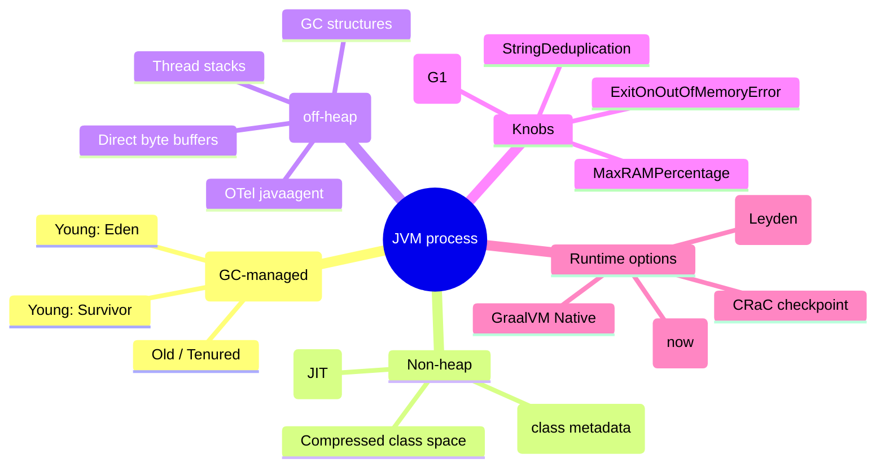
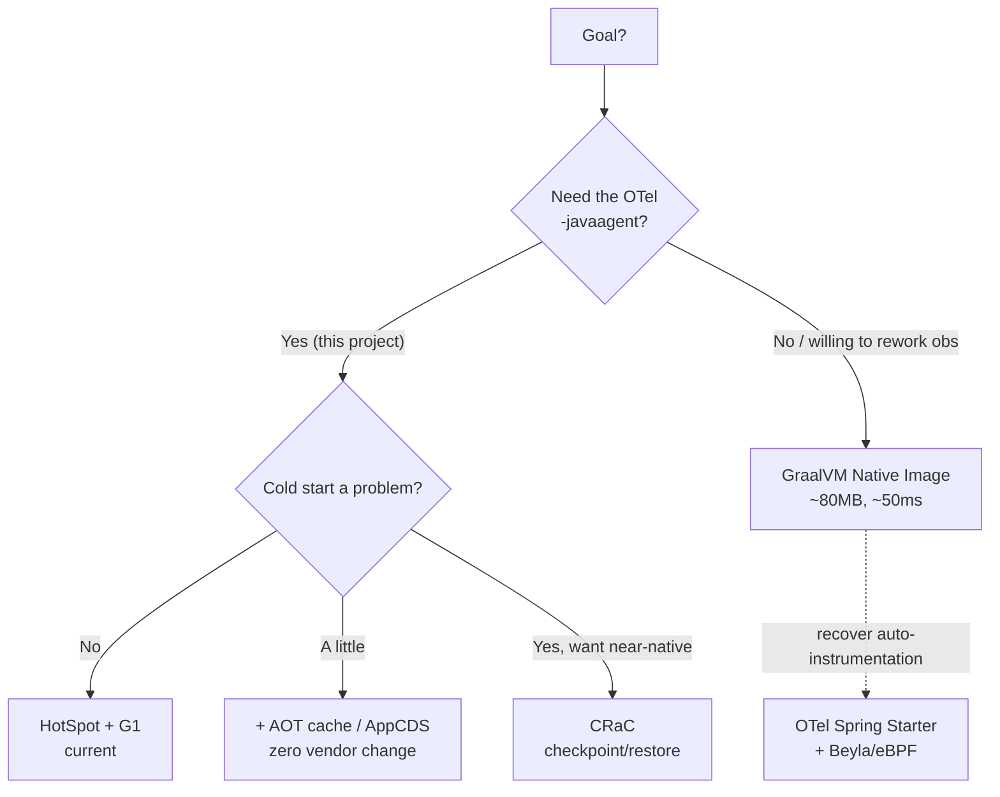

[← Previous: 302. k6 Traffic & Load Testing](./302-K6_LOAD_TESTING.md) | [🏠 Home](../README.md) | [→ Next: 401. Jenkins](./401-JENKINS.md)

---

# 303. JVM Tuning & Runtime Strategy

How the Java microservices' JVMs are tuned for Kubernetes — **which GC, how much heap, and why** — plus the honest comparison of every modern runtime option (HotSpot, **CRaC**, GraalVM Native, AOT cache, OpenJ9) and OpenTelemetry instrumentation mode, and how to read the [JVM internals dashboard](#analyzing-jvm-performance-in-grafana) to find bottlenecks.

> **TL;DR.** The apps run **Eclipse Temurin OpenJDK 25 LTS (HotSpot)** auto-instrumented by the **OpenTelemetry Java agent**. Out of the box the container picked **SerialGC + 25 % heap** (wrong for a server app — proven live by `jvm_gc_name={Copy,MarkSweepCompact}`). We fix that with `JDK_JAVA_OPTIONS: -XX:+UseG1GC -XX:MaxRAMPercentage=50.0 -XX:+UseStringDeduplication -XX:+ExitOnOutOfMemoryError` (both tiers). The **next advanced step is [CRaC](#why-crac-is-the-chosen-advanced-direction)** — near-native startup that, unlike GraalVM Native, **keeps the OTel agent working**.

## Understanding JVM tuning here (newcomers → specialists)

A containerized JVM has to be told about its box. By default HotSpot reads the cgroup memory limit but makes two unfortunate choices when the limit is small: it sizes the heap at only **25 %** of the limit, and — because a sub-1792 MB container looks "not server-class" — it falls back to the **single-threaded SerialGC**. For a Spring Boot service handling concurrent requests that means long stop-the-world pauses and constant minor GCs. The fix is a handful of flags; the rest of this page is *why those flags*, *what else exists*, and *how to see it in Grafana*.

🧠 Mental model — what lives inside the JVM

🟢 For newcomers — in plain terms

- The **heap** is where your objects live; the **garbage collector (GC)** cleans it. Too small a heap = the GC runs constantly; a bad GC = long "freeze" pauses.
- In a container the JVM only used **¼ of the memory** for the heap and picked the **simplest, slowest GC** because the box looked small. We told it to use **half the memory** and the modern **G1** collector (parallel + concurrent, short pauses).
- We also told it: if you ever run out of memory, **exit cleanly** so Kubernetes restarts the pod (instead of becoming a zombie).
- Separately: the apps are watched by the **OpenTelemetry agent** (a `-javaagent` that auto-records traces/metrics/logs). That agent is the reason we *don't* just switch to GraalVM "native" (super-fast startup) — native binaries can't run a `-javaagent`. The option that gives fast startup **and** keeps the agent is **CRaC**.

🔵 For specialists — the one-breath version

JDK 25 (Temurin/HotSpot), `UseContainerSupport` on. Ergonomics on a <1792 MB cgroup → `UseSerialGC` + `MaxRAMPercentage=25` (verified: `MaxHeapSize≈192Mi` on develop, `jvm_gc_name∈{Copy,MarkSweepCompact}`). Override via **`JDK_JAVA_OPTIONS`** (orthogonal to the OTel operator's `JAVA_TOOL_OPTIONS=-javaagent:…`; the launcher honours both): `-XX:+UseG1GC -XX:MaxRAMPercentage=50.0 -XX:+UseStringDeduplication -XX:+ExitOnOutOfMemoryError`. `MaxGCPauseMillis` left at G1's default 200 ms. Heap capped at 50 % (not higher) because the OTel agent's native footprint + Metaspace + thread stacks share the same cgroup limit. Startup latency (the lean-tier CrashLoop root cause) is currently absorbed by the startup probe; the strategic fix is **CRaC** (checkpoint/restore) which preserves the agent, vs **GraalVM Native** which does not.

## The tuning we applied

Set in the shared Helm template (`helm/microservices/templates/deployment.yaml`) for both tiers, via `JDK_JAVA_OPTIONS`:

| Flag | What it does | Value | Why this value |
|---|---|---|---|
| `-XX:+UseG1GC` | Selects the **G1** garbage collector (parallel + concurrent, pause-targeted, region-based) | on | The container default was **SerialGC** (single-threaded, long full-GC pauses) because the <1792 MB limit reads as "not server-class". G1 is the right balanced server collector at this heap size. |
| `-XX:MaxRAMPercentage` | Max heap as a **% of the cgroup memory limit** | `50.0` | Default is **25 %** (≈192 Mi of develop's 768 Mi) → GC churn. 50 % doubles the heap while leaving room for the **OTel agent's native memory + Metaspace + thread stacks** in the same limit. Not higher on purpose (OOM safety on the lean tier); **stable could go ~60 %**. |
| `-XX:+UseStringDeduplication` | G1 dedupes identical `String` backing arrays | on | Spring/JHipster are **String-heavy**; reclaims heap for free. G1-only feature. |
| `-XX:+ExitOnOutOfMemoryError` | On `OutOfMemoryError`, terminate the JVM | on | Let **Kubernetes restart** the pod cleanly instead of a half-dead JVM limping along. Pairs with `restartPolicy`. |
| `-XX:MaxGCPauseMillis` | G1 soft pause-time goal | *default 200* | Not set explicitly — G1's 200 ms default is appropriate; documented here for completeness. |

> **Why `JDK_JAVA_OPTIONS` and not `JAVA_TOOL_OPTIONS`?** The OTel Operator owns `JAVA_TOOL_OPTIONS` (it injects `-javaagent:…`). `JDK_JAVA_OPTIONS` is a separate launcher variable; the `java` launcher applies **both**, so our flags compose with the agent instead of clobbering it.

### Per-environment values

| Dimension | `stable` (ns `microservices`) | `develop` (ns `microservices-develop`) | Why |
|---|---|---|---|
| CPU request / limit | `100m` / `1000m` | `100m` / `1500m` | Limit is a burst ceiling for the cold start; idles ~10m either way. |
| Memory request / limit | `512Mi` / `1Gi` | `384Mi` / `768Mi` | stable = production headroom; develop = lean/disposable. |
| Resulting max heap (50 %) | ≈ **512 MB** | ≈ **384 MB** | `MaxRAMPercentage=50` of the limit. |
| GC | G1 | G1 | Shared template. |
| Flags | identical | identical | One template; only the per-tier `resources` differ. |

`stable` carries more memory because it's the production tier (and could raise `MaxRAMPercentage` toward 60 %); `develop` stays lean because its data is disposable and it must fit alongside everything else under the Grafana Cloud free-tier budget (see [301](./301-OBSERVABILITY.md)).

## GC algorithm options

| Collector | Pause behaviour | Throughput | Heap sweet-spot | CPU / native overhead | Fit here (<512 MB, CPU-capped) |
|---|---|---|---|---|---|
| **SerialGC** *(was default)* | long STW, single-threaded | low under load | tiny (<100 MB) | minimal | ❌ wrong for a concurrent server app |
| **ParallelGC** | STW but multi-threaded; throughput-first | **highest** | small–medium | low | ⚠️ great throughput, worse tail latency |
| **G1GC** *(chosen)* | concurrent, **pause-targeted** (~200 ms) | high | **medium (256 MB–16 GB)** | moderate | ✅ best balance at our size |
| **ZGC** (generational, JDK 21+) | **sub-ms**, concurrent | high | **large (multi-GB)** | **high** (more CPU + native) | ❌ wants more CPU/native headroom than these pods have |
| **Shenandoah** | sub-ms, concurrent | high | medium–large | high | ❌ similar to ZGC; overkill at this size |

**Conclusion:** G1 is the right choice at this heap size and CPU budget. ZGC/Shenandoah shine on multi-GB heaps with CPU to spare — the opposite of these lean, capped containers.

## Runtime / startup options (the big picture)

The flags above fix GC; they don't change the JVM's ~20–30 s **cold start** (Spring Boot + Liquibase + the OTel agent), which was the lean tier's CrashLoop root cause (now absorbed by the startup probe — see [502](./502-MICROSERVICES_GITOPS.md)). The startup problem is what the runtime options below address.

| Option | Startup | Memory (RSS) | Peak throughput | **OTel `-javaagent`?** | Build / CI | Maturity |
|---|---|---|---|---|---|---|
| **HotSpot + G1** *(current)* | ~20–30 s | medium | **high (C2 JIT)** | ✅ yes | none (Jib) | maximal |
| **AOT cache / AppCDS** (Project Leyden, JDK 25) | **~30–50 % faster** | same | high | ✅ yes | low — bake `.jsa`/AOT cache into the image | GA in JDK 25 |
| **CRaC** (Coordinated Restore at Checkpoint) | **~50–200 ms** | same / lower | high (already warm) | ✅ **yes** | medium — CRaC JDK + checkpoint stage | production-used (Azul/BellSoft) |
| **GraalVM Native Image** | **~50–100 ms** | **~80 MB** | a bit lower (no PGO) | ❌ **no** (closed-world AOT, no JVMTI) | high — AOT + reachability hints | good (Spring 3+) but Hazelcast/Liquibase aristas |
| **GraalVM JIT** | ~HotSpot | ≥ HotSpot | sometimes higher | ✅ yes | normal | being upstreamed (Galahad) |
| **OpenJ9 / Semeru** | faster than HotSpot | **lower** | medium | ✅ yes | normal | mature, smaller ecosystem |

The decisive column is **OTel `-javaagent` compatibility**: this whole platform's observability is built on the runtime agent, so anything that can't run a `-javaagent` (GraalVM Native) means re-architecting the telemetry layer.

## OpenTelemetry instrumentation modes

OTel is **not** all-or-nothing tied to the agent — there are three modes, and they **combine**:

| Mode | How | Runtime | Auto-coverage | Native-compatible |
|---|---|---|---|---|
| **Java agent** *(current)* | runtime, JVMTI bytecode weaving | HotSpot only | **maximal** (libs, DB, HTTP, method-level) | ❌ |
| **OTel Spring Boot Starter** | build-time deps + Micrometer bridge | HotSpot **and GraalVM Native** | medium (what Spring/Micrometer cover) | ✅ |
| **OTel eBPF / Grafana Beyla** | kernel (eBPF), zero code/agent | any binary (HotSpot, Native, …) | network-level (HTTP/gRPC/SQL spans) | ✅ |

The agent gives the deepest in-process traces (why it's the default for an observability showcase); the Starter is the native-compatible path; Beyla recovers auto-instrumentation for binaries where no agent can attach.

## Why CRaC is the chosen advanced direction

If we want to kill the cold start *without* losing the OTel agent, **CRaC ([crac.org](https://crac.org/))** is the answer. It snapshots a **fully-warmed JVM** to disk (after Spring context refresh) and **restores it in ~50–200 ms**. Because it's still HotSpot, the `-javaagent`, C2 JIT and full ecosystem all keep working.

| | **HotSpot + G1** (current) | **CRaC** | **GraalVM Native** |
|---|---|---|---|
| Startup | ~20–30 s | **~50–200 ms** ✅ | ~50–100 ms ✅ |
| Memory (RSS) | medium | same / lower | **~80 MB** ✅ |
| Peak throughput | **high** ✅ | **high** (pre-warmed) ✅ | a bit lower (no PGO) |
| **OTel `-javaagent`** | ✅ | ✅ **kept** | ❌ lost |
| Hazelcast / Liquibase | ✅ | ⚠️ close sockets pre-checkpoint | ⚠️ needs hints |
| Effort | done | medium | high (re-arch obs) |

**Verdict:** CRaC is the best *advanced* fit for this project — near-native startup, full throughput, **and the OTel agent survives**. GraalVM Native wins on raw memory but loses the agent (the platform's whole point).

### Honest costs of CRaC

- **CRaC-enabled JDK required** — not stock Temurin. Use **Azul Zulu CRaC** ([docs.azul.com/core/crac](https://docs.azul.com/core/crac)) or **BellSoft Liberica CRaC**.
- **Checkpoint step in CI** — start the app, warm it, `jcmd <pid> JDK.checkpoint`, bake the checkpoint image. Jib alone can't do this (it never runs the app); needs a Docker/run stage.
- **Spring Boot 3.2+ CRaC support** — [`spring.context.checkpoint=onRefresh`](https://docs.spring.io/spring-framework/reference/integration/checkpoint-restore.html) checkpoints after context refresh.
- **Open resources must close before checkpoint** — **Hazelcast** sockets + DB pools (Hikari/R2DBC) via CRaC `Resource` hooks / Spring lifecycle. Hazelcast + CRaC is known-tricky.
- **OTel agent across restore** — validate the OTLP exporter reconnects in `afterRestore` (the SDK generally handles it; verify).
- **Security** — the snapshot can contain in-memory secrets; treat the checkpoint image as sensitive.

### CRaC implementation roadmap (honest)

> ⚠️ CRaC changes live in the **application source repos** — [`nubenetes/jhipster-sample-app-gateway`](https://github.com/nubenetes/jhipster-sample-app-gateway) and [`nubenetes/jhipster-sample-app-microservice`](https://github.com/nubenetes/jhipster-sample-app-microservice) — **not** this infra repo or the gitops repo (which only consume the published images).

1. Switch the build base image to a **CRaC JDK** (Azul/Liberica).
2. Add a **checkpoint build stage** (Docker `RUN` that boots the app with `-Dspring.context.checkpoint=onRefresh`, warms it, checkpoints).
3. Set the container **restore entrypoint** (`java -XX:CRaCRestoreFrom=…`).
4. Add **CRaC `Resource` hooks** to close Hazelcast + DB pools before checkpoint and re-open `afterRestore`.
5. **Validate the OTel agent** restores cleanly (spans/metrics resume).
6. Rebuild via the Jenkins/Tekton pipeline; deploy; **measure restore time + telemetry** in the JVM dashboard below.

Open risks to spike first: **Hazelcast + CRaC** and **agent + CRaC**. Until validated, HotSpot + G1 (+ optionally the **AOT cache**, a zero-friction, fully agent-compatible startup win on the current JDK 25) remains the safe default.

## Analyzing JVM performance in Grafana

The **`CI-CD JVM internals (all Java services + Jenkins)`** dashboard (uid `jenkins2026-jvm-internals`, tags `jvm`/`jenkins`) exposes everything inside the JVMs — both microservices **and the Jenkins controller** (it's a Java app too; filter by `service_name`). **Label model:** JVM metrics filter by **`k8s_namespace_name`** (`microservices`=stable, `microservices-develop`=develop) **+ `service_name`** — **not** `deployment_environment` (the OTel agent's JVM metrics don't carry it; only `target_info`/spanmetrics/traces/logs do). The `namespace` variable uses `allValue='.*'` so the **Jenkins** controller series — which carry no `k8s_namespace_name` — appear under *All*.

Rows: **Heap** (used-by-pool, used vs committed vs max, live-set after GC) · **Non-heap** (Metaspace / code cache / compressed class) · **Garbage Collection** (time rate, frequency, pause p95/p99 by `jvm_gc_name`) · **Threads & classes** · **CPU** · **HTTP response times**.

### Troubleshooting matrix

| Symptom | Panel to read | Likely cause | Action |
|---|---|---|---|
| **Memory leak** | *Live-set after GC* (`jvm_memory_used_after_last_gc_bytes`) trending **up** over time | Old-gen growth / unbounded cache | Heap dump; audit Hazelcast/caches; check for retained refs |
| **GC latency** | *GC pause p95/p99* + *GC time rate* | Heap too small / frequent collections | Raise `MaxRAMPercentage`; confirm `jvm_gc_name` shows **G1** not Copy/MarkSweepCompact |
| **CPU bottleneck** | *CPU utilization ratio* near 100 % | CPU-starved (cgroup throttling) | Raise CPU **limit**; check noisy neighbours |
| **Thread exhaustion** | *Thread count* climbing unbounded | Thread/connection-pool leak | Audit executors, Hikari/R2DBC pool sizes |
| **Slow responses** | *HTTP p95/p99 latency* correlated with GC/CPU | GC pauses or CPU throttling | Cross-read the GC + CPU panels at the same timestamp |
| **Metaspace growth** | *Non-heap → Metaspace* climbing | Classloader leak / dynamic proxies | Check for repeated context reloads / proxy churn |

> **Sanity check after the tuning rolled out:** the *GC* panels' `jvm_gc_name` legend should switch from `Copy` / `MarkSweepCompact` (SerialGC) to **`G1 Young Generation` / `G1 Old Generation`** — visible proof G1 is active.

---

[← Previous: 302. k6 Traffic & Load Testing](./302-K6_LOAD_TESTING.md) | [🏠 Home](../README.md) | [→ Next: 401. Jenkins](./401-JENKINS.md)

---

*303. JVM Tuning & Runtime Strategy — jenkins-2026*
