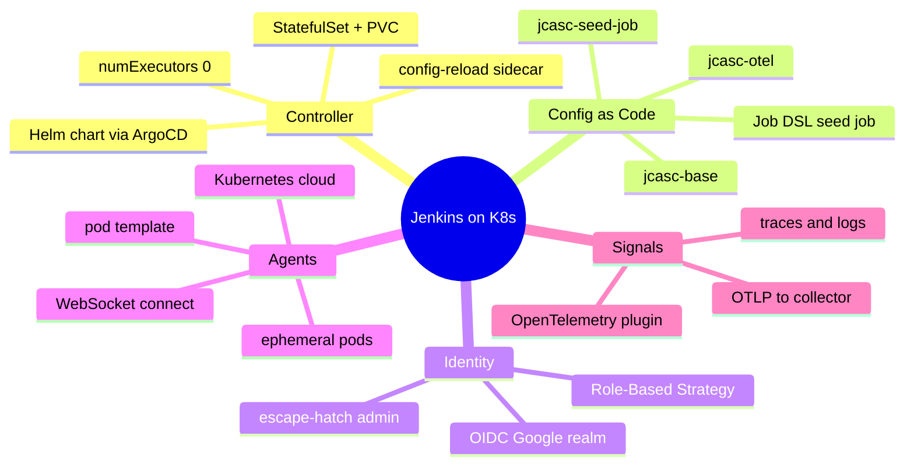
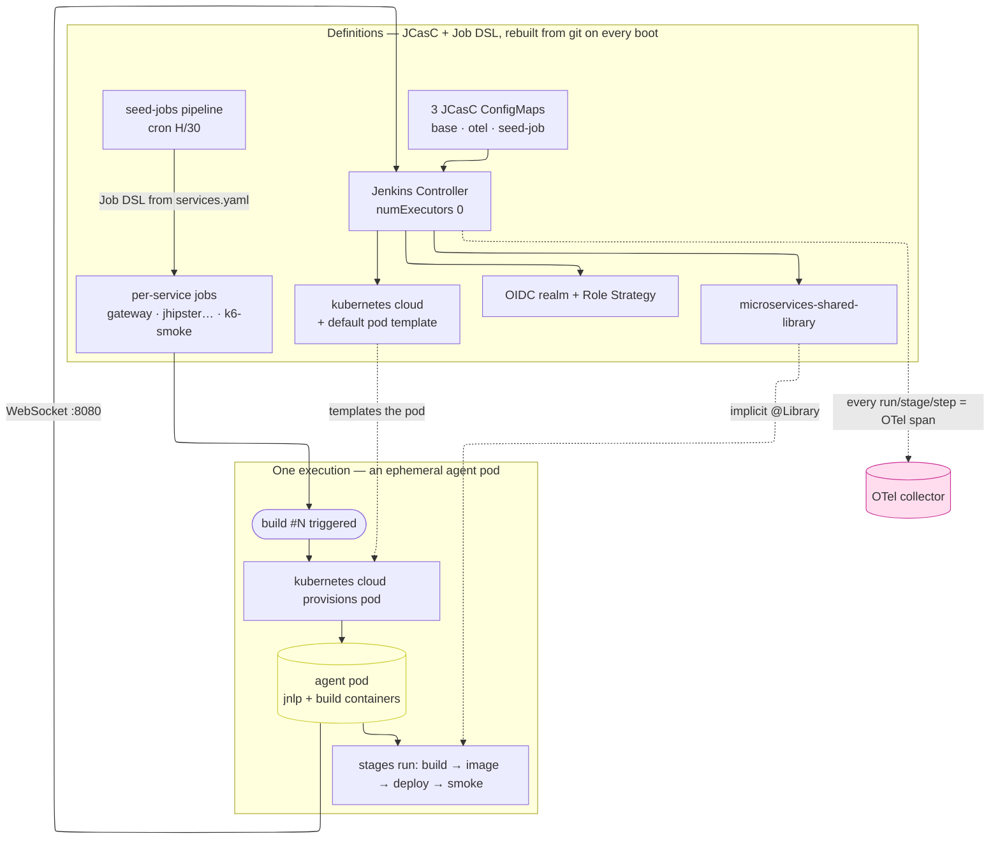
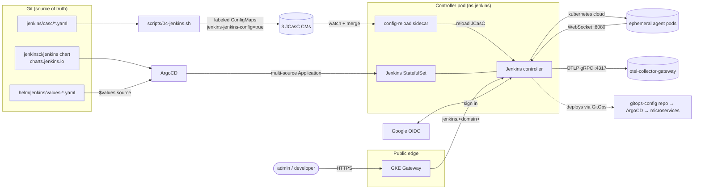
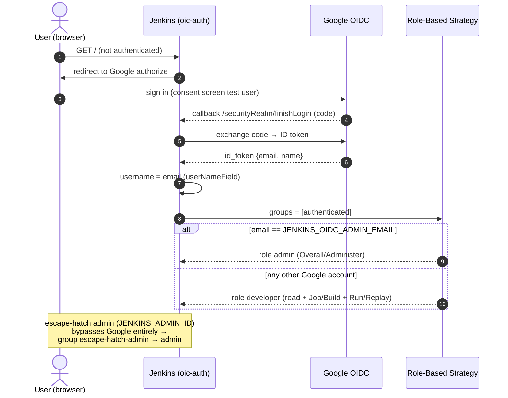
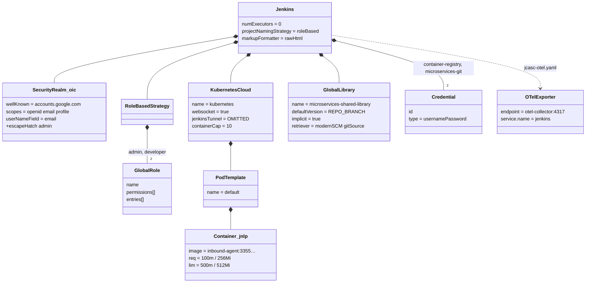
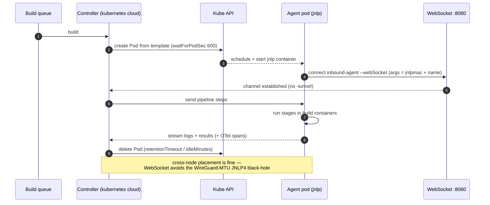
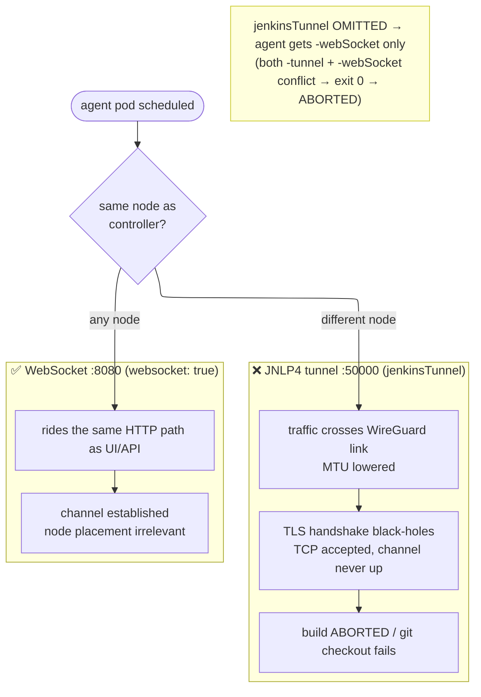
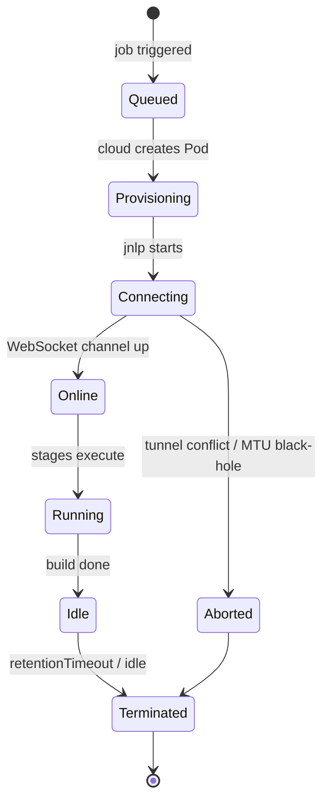
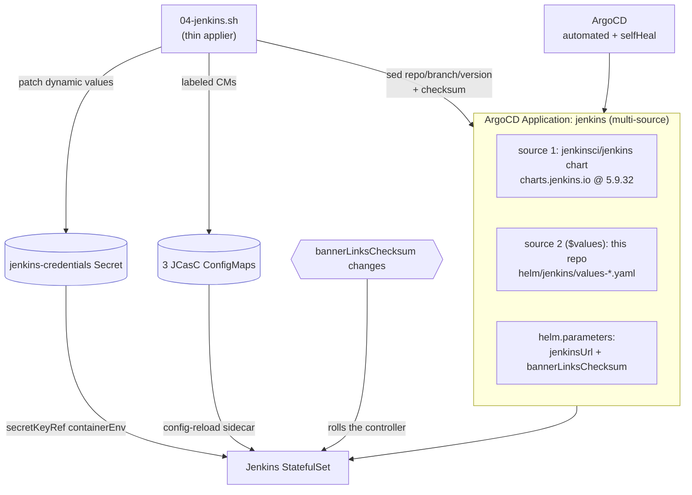
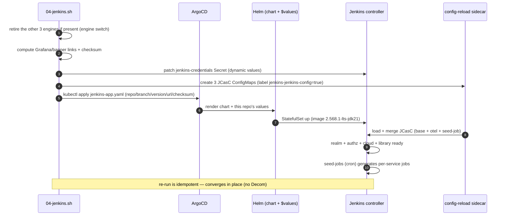

[← Previous: 303. JVM Tuning](./303-JVM-TUNING.md) | [🏠 Home](../README.md) | [→ Next: 402. Pipelines as Code](./402-PIPELINES_AS_CODE.md)

---

# 401. Jenkins

Jenkins is this project's **default CI engine** — one of four mutually-exclusive
engines selected by [`config/config.yaml`](../config/config.yaml) `ci.engine`:
**Jenkins** (default) · [**Tekton**](./404-TEKTON.md) ·
[**GitHub Actions (ARC)**](./405-GITHUB_ACTIONS.md) ·
[**Argo Workflows**](./406-ARGO_WORKFLOWS.md). All four run the same ~11-stage
pipeline contract off the shared [`jenkins/pipelines/seed/services.yaml`](../jenkins/pipelines/seed/services.yaml)
registry and the shared [`resources/patch-app-source.sh`](../resources/patch-app-source.sh)
(the gateway MySQL→Postgres + NoOp-cache build-time patch). Jenkins runs as a
single Helm-chart controller on Kubernetes, is configured **entirely from this
repo** via Configuration-as-Code (JCasC) + Job DSL — nothing is clicked in the UI
— and spawns **ephemeral build-agent pods** on demand. This page is the
controller-and-platform view; the pipelines that run *on* it live in
[402. Pipelines as Code](./402-PIPELINES_AS_CODE.md).

## Understanding Jenkins on Kubernetes (newcomers → specialists)

Jenkins here is **declarative and disposable**: the controller is a stateless-ish
StatefulSet whose entire configuration is rebuilt from three ConfigMaps on every
boot, and every build runs in a throwaway pod that connects back over a WebSocket.
Read this section once and the rest of the page is just "where each knob lives".

<details>
<summary>🧠 Mental model — Jenkins on Kubernetes (mindmap)</summary>



</details>

**Reading it —** the five branches are the five planes that organise the rest of this page: the **Controller** (the always-on server that schedules but never builds), **Config as Code** (the YAML that *is* the configuration), **Identity** (who may do what), **Agents** (where builds actually execute), and **Signals** (telemetry leaving the system). Every leaf is a concrete field in a file under [`jenkins/casc/`](../jenkins/casc/) or [`helm/jenkins/`](../helm/jenkins/) — there is no UI-only state to memorise.

<details>
<summary>🟢 For newcomers — the mental model in 8 objects</summary>

| Object | What it is | Where it lives |
|---|---|---|
| **Controller** | The long-running Jenkins server (web UI + API + scheduler). Runs **no builds itself** (`numExecutors: 0`). | StatefulSet `jenkins` in ns `jenkins` |
| **JCasC** | *Configuration as Code* — YAML that **is** the entire Jenkins config (security, clouds, libraries, credentials). Loaded at boot; no manual UI setup. | 3 ConfigMaps from [`jenkins/casc/`](../jenkins/casc/) |
| **config-reload sidecar** | A helper container that watches the labeled ConfigMaps and tells Jenkins to **re-apply JCasC live** when they change. | sidecar in the controller pod |
| **Seed job** | A Jenkins job (Job DSL) that **generates the other jobs** from [`services.yaml`](../jenkins/pipelines/seed/services.yaml). Self-bootstrapping CI. | `seed-jobs` pipeline |
| **Pipeline job** | One per microservice (`gateway`, `jhipstersamplemicroservice`, `microservices-k6-smoke`). Defines the build/deploy stages. | generated by the seed job |
| **Build** | One **execution** of a job (`#123`). Triggered by cron/SCM/manually. | a run record + an agent pod |
| **Kubernetes cloud** | The plugin that **creates an agent pod per build** from a pod template, then deletes it. | `clouds.kubernetes` in JCasC |
| **Agent (pod)** | The throwaway pod that actually runs the build steps; connects back to the controller over **WebSocket**. | ephemeral pod in ns `jenkins` |

So a CI run is literally: *the seed job generates per-service jobs → a job is triggered → the kubernetes cloud spawns an agent pod → the pod connects back over WebSocket → stages run in that pod → the pod is torn down → the run records success/failure*. The whole controller config is **rebuilt from git on every restart**, so the UI is a read-only window onto what the repo declares.

</details>

<details>
<summary>🔴 For specialists — the moving parts and how they're wired here</summary>

**Controller (ns `jenkins`, GitOps-installed):** the official `jenkinsci/jenkins` chart (pinned `5.9.32`, chart appVersion `2.555.3`; `controller.image.tag` deliberately overrides it to the newer LTS `2.568.1-lts-jdk21`) deployed as a **single ArgoCD `Application`** (multi-source: chart from `charts.jenkins.io` + this repo's `helm/jenkins/values-*.yaml` via a `$values` source). `numExecutors: 0` (all work on agents), controller resources `500m`/`1536Mi` → `1.5`/`3072Mi`, `fsGroup: 1000`, `EXCLUSIVE` executor mode.

**JCasC (the single source of config):** the chart runs with `JCasC.defaultConfig: false` and **`authorizationStrategy: ""` + `securityRealm: ""`** so the chart emits *neither* (a silent 5.9.x chart bump split those into independent ConfigMaps that collided with ours and crashed boot — see the Plugins section). The real config is three ConfigMaps labeled `jenkins-jenkins-config=true` (so the config-reload sidecar auto-merges them): `jenkins-2026-casc-base` (realm + authz + cloud + library + credentials + `globalNodeProperties`), `jenkins-2026-casc-otel` (the OTel exporter), `jenkins-2026-casc-seed-job` (the `seed-jobs` job). [`04-jenkins.sh`](../scripts/04-jenkins.sh) (re)creates them from `jenkins/casc/*`; ArgoCD owns the chart, not the CMs.

**Identity:** `securityRealm.oic` (oic-auth) federates to **Google** via its well-known endpoint (`userNameField: email`), with an `escapeHatch` local admin (`JENKINS_ADMIN_ID`/`JENKINS_ADMIN_PASSWORD` → group `escape-hatch-admin`) that **always works regardless of OIDC**. `authorizationStrategy.roleBased` defines two global roles: **`admin`** (`Overall/Administer`; entries = group `escape-hatch-admin` + user `JENKINS_OIDC_ADMIN_EMAIL`) and **`developer`** (`Overall/Read`, `View/Read`, `Job/Read|Build|Cancel|Workspace|Discover`, `Run/Replay`; entry = group `authenticated`, i.e. every Google login). `projectNamingStrategy: roleBased`.

**Agents:** the `kubernetes` cloud (`serverUrl: https://kubernetes.default.svc.cluster.local`, `containerCapStr: 10`, `waitForPodSec: 600`) provisions a `default` pod template whose `jnlp` container is `jenkins/inbound-agent:3355.v388858a_47b_33-22` (`100m`/`256Mi` → `500m`/`512Mi`). **`websocket: true`** and **`jenkinsTunnel` omitted** — inbound agents connect over the `:8080` HTTP path (WebSocket upgrade), *not* the raw JNLP4 `:50000` TCP tunnel, because WireGuard inter-node encryption lowers the MTU and black-holes the JNLP4 TLS handshake on cross-node placement. `globalNodeProperties` exports `JENKINS2026_*` + `GIT_LFS_SKIP_SMUDGE=1` into every agent. (Per-service pipelines override this template with their own multi-container agent pod — see [402](./402-PIPELINES_AS_CODE.md).)

**Signals:** the `opentelemetry` plugin exports every pipeline run/stage/step as an **OTel span** (+ console trace-id injection) via OTLP/gRPC to `otel-collector-gateway.observability:4317` (`service.name=jenkins`, `service.namespace=jenkins-2026`), correlating Jenkins traces with the microservices it deploys. See [301. Observability](./301-OBSERVABILITY.md).

**Self-bootstrapping:** the `seed-jobs` pipeline (cron `H/30 * * * *`) runs Job DSL ([`Jenkinsfile.seed`](../jenkins/pipelines/seed/Jenkinsfile.seed) → [`seed_jobs.groovy`](../jenkins/pipelines/seed/seed_jobs.groovy)) to (re)generate the per-service jobs from [`services.yaml`](../jenkins/pipelines/seed/services.yaml) — idempotent, so the job graph self-heals.

</details>

#### Jenkins object model & run flow

How the repo's declarations on the left become a running build on the right — config/definitions (rebuilt from git every boot) vs one execution (ephemeral pod):

<details>
<summary>🔀 Jenkins object model & run flow</summary>



</details>

**Reading it —** the left box is *declarations*: the three JCasC ConfigMaps configure a controller that owns the realm, the cloud, and the library, while the `seed-jobs` cron turns `services.yaml` into the per-service jobs. The right box is *one execution*: triggering a job makes the kubernetes cloud mint an ephemeral pod that dials back over WebSocket on `:8080`, runs the stages, then is reaped. The dashed arrows are the cross-cutting facts that trip people up — the cloud only *templates* the pod (it runs nothing itself), the shared library is injected implicitly, and every run/stage/step becomes an OTel span. The crucial property: **restart the controller and every box on the left is rebuilt from git** — the UI is a read-only view, never a source of truth.

## High-level architecture

The whole Jenkins-on-Kubernetes system: GitOps delivery (ArgoCD), the config plane (JCasC CMs + sidecar), identity (Google IAP at the edge + OIDC in-app), the agent plane, and the signal plane (OTel) — plus the banner deep-links the controller renders to the rest of the platform.

<details>
<summary>🏛️ High-level architecture</summary>



</details>

**Reading it —** three independent paths converge on the one controller pod. **GitOps** (top): ArgoCD renders the upstream chart plus this repo's `values` and reconciles the StatefulSet. **Config** (middle): `04-jenkins.sh` writes the JCasC as *labeled ConfigMaps*, which the config-reload **sidecar** watches and merges live — so a config change needs no image rebuild and usually no restart. **Runtime** (bottom): users arrive through the Google-IAP-fronted Gateway and authenticate again in-app via OIDC, while the kubernetes cloud spins agent pods that connect back over WebSocket and the OTel plugin streams spans to the collector. The dashed line is the payoff — Jenkins never `kubectl apply`s the apps; it bumps a tag in the GitOps repo and lets ArgoCD deploy.

## Accessing the UI & Admin Password

```bash
kubectl -n jenkins port-forward svc/jenkins 8080:8080
```

Open <http://localhost:8080>. If [Google login](#google-login-openid-connect) is configured, use the **Sign in with Google** button. Otherwise (or for break-glass/automation access), log in as `admin` via the **escape hatch** — this login **always works, regardless of OIDC**. The username is the `JENKINS_ADMIN_ID` containerEnv pinned in [`helm/jenkins/values-common.yaml`](../helm/jenkins/values-common.yaml); `jenkins.adminUser` in [`config/config.yaml`](../config/config.yaml) mirrors it for the scripts' API auth (`06-seed-pipelines.sh`/`status.sh`/`smoke-test.sh`), so change both together. The password is randomly generated on first run by [`scripts/01-namespaces.sh`](../scripts/01-namespaces.sh). Retrieve it:

```bash
kubectl -n jenkins get secret jenkins-credentials -o jsonpath='{.data.admin-password}' | base64 -d; echo
```

To rotate the password, delete the Secret and re-run [`scripts/01-namespaces.sh`](../scripts/01-namespaces.sh) + [`scripts/04-jenkins.sh`](../scripts/04-jenkins.sh) — a new random password is generated and printed once.

### Backstage view of this engine

When `ci.engine=jenkins`, the [Backstage portal](./505-BACKSTAGE.md)'s CI/CD
tab embeds the **community Jenkins plugin**: its backend calls this
controller's REST API directly (internal `http://jenkins.jenkins.svc…` base
URL from the runtime ConfigMap) using the `JENKINS_API_USER`/`JENKINS_API_KEY`
pair in `backstage-secrets` — the admin user + the `jenkins-credentials` admin
password, seeded by [`01-namespaces.sh`](../scripts/01-namespaces.sh) in
jenkins-mode. The entity binding is `jenkins.io/job-full-name` (the
seed-generated root job name); no Kubernetes-plugin label contract applies.
Two operational notes: on the **other** engines those two keys deliberately
hold non-empty **`unset`** placeholders — the always-loaded jenkins-backend
plugin hard-crashes the whole portal on an *empty-string* username
([505 § troubleshooting](./505-BACKSTAGE.md#troubleshooting)) — and the
portal's `InternalUrlRewriter` rewrites the plugin's internal deep links to
the public `jenkins.<baseDomain>` host in the rendered UI.

## Google Login (OpenID Connect)

Jenkins' security realm is [`oic-auth`](https://plugins.jenkins.io/oic-auth/) (`securityRealm.oic` in [`jenkins/casc/jcasc-base.yaml`](../jenkins/casc/jcasc-base.yaml)), so anyone can sign in with a Google account — the **Role-Based Authorization Strategy** then decides what they can do. By default, a Google login lands in the `authenticated` group → the **`developer`** role (read + build/cancel/replay the pipelines, *not* admin). To grant the **`admin`** role (`Overall/Administer`) to your own account, set `JENKINS_OIDC_ADMIN_EMAIL`.

Setting `JENKINS_OIDC_ADMIN_EMAIL` also dynamically configures administrator permissions for the corresponding user in ArgoCD's RBAC policy configmap (`argocd-rbac-cm`), ensuring unified admin privileges across both Jenkins and ArgoCD when logging in via Google OIDC.

#### Sign-in flow & role mapping

<details>
<summary>🔐 OIDC sign-in & role mapping (sequence)</summary>



</details>

**Reading it —** two design choices make this secure-by-default. First, **authentication and authorization are separate**: Google only proves *who* you are (steps 6–7 return an `email`); the Role-Based Strategy then decides *what* you may do — every Google login is a `developer` (build/replay), and only the address in `JENKINS_OIDC_ADMIN_EMAIL` is promoted to `admin`. Second, the **escape hatch** (bottom note) is a parallel, OIDC-independent path: the local `admin` always works even if Google, the client secret, or your config is broken — which is precisely why it exists. The redirect URI you register below must match `location.url`, since oic-auth derives the callback from it.

1. **Create a third Google OAuth 2.0 Web application client** (can reuse the same GCP project as Headlamp and IAP clients, but must be its own client):
   - [Google Cloud Console](https://console.cloud.google.com/) → **APIs & Services** → **Credentials** → **Create credentials** → **OAuth client ID** → Application type **Web application**.
   - **Authorized redirect URIs**: add `https://jenkins.<baseDomain>/securityRealm/finishLogin`. If you only access Jenkins via `kubectl port-forward`, also add `http://localhost:8080/securityRealm/finishLogin`.
   - Note the **Client ID** and **Client secret**.
   - On the **OAuth consent screen** (Audience tab), while the app is in **Testing**, add your Google account as a **Test user**.

2. **Add repository secrets** (your own email is **never committed to this repo**):

   ```bash
   gh secret set JENKINS_OIDC_CLIENT_ID     --body "<client ID from above>"
   gh secret set JENKINS_OIDC_CLIENT_SECRET --body "<client secret from above>"
   gh secret set JENKINS_OIDC_ADMIN_EMAIL   --body "you@gmail.com"
   ```

   Then re-run **Day1.cluster.01 GKE** — it passes the `JENKINS_OIDC_*` secrets into [`scripts/01-namespaces.sh`](../scripts/01-namespaces.sh). On an existing cluster with `secrets.backend=imperative`, first delete the Secret (`kubectl -n jenkins delete secret jenkins-credentials`): `01-namespaces.sh` leaves an existing Secret untouched, so the new keys are only written on (re)creation (note this also rotates the admin password). In `eso` mode a plain re-run refreshes the keys via Secret Manager. **Day2.redeploy.02 Jenkins** alone cannot apply them — it neither receives the `JENKINS_OIDC_*` secrets nor runs `01-namespaces.sh`. If the controller pod doesn't roll afterwards, `kubectl -n jenkins rollout restart statefulset jenkins` re-reads the Secret (`containerEnv` values are captured at pod start).

## Plugins & JCasC Fragments

[`helm/jenkins/values-common.yaml`](../helm/jenkins/values-common.yaml) tracks the latest Jenkins LTS (`controller.image.tag: 2.568.1-lts-jdk21`) and pins **every** plugin — 22 curated top-level plugins plus 79 transitive dependencies — to the exact version resolved against that core by `jenkins-plugin-cli`. This means a routine controller pod restart always installs the **identical plugin set**.

**Chart version (pinned).** The Helm chart is pinned in [`config/config.yaml`](../config/config.yaml) → `jenkins.chart.version: "5.9.32"` (the latest as of 2026-07-06; appVersion still `2.555.3`, while `controller.image.tag` deliberately overrides it to the newer `2.568.1` LTS — 5.9.30-5.9.32 only bump `agent.image`/`k8s-sidecar` defaults and add an opt-in `addMasterProxyEnvVars` flag, neither of which this repo consumes); ArgoCD installs exactly this version via [`argocd/jenkins-app.yaml`](../argocd/jenkins-app.yaml)'s `targetRevision`. Why pinned:

- **It was previously `""` (always-latest)** — a silent chart bump onto the 5.9.x line **split `authorizationStrategy` and `securityRealm` into their own ConfigMaps** that render independently of `controller.JCasC.defaultConfig: false`.
- **The collision:** the chart's defaults (`loggedInUsersCanDoAnything` + a local admin) landed next to the same keys in our [`jcasc-base.yaml`](../jenkins/casc/jcasc-base.yaml) and the controller crashed at boot (`Single entry map expected to configure a … AuthorizationStrategy but found multiple entries`).
- **The second guard:** [`values-common.yaml`](../helm/jenkins/values-common.yaml) therefore also sets `controller.JCasC.authorizationStrategy: ""` and `securityRealm: ""` so the chart emits **neither** — [`jcasc-base.yaml`](../jenkins/casc/jcasc-base.yaml) is the single source of both (Role-Based Strategy + the OIDC/Google realm).
- **Bumping:** bump the pin deliberately (and re-verify those two overrides against the new chart's `values.yaml`) rather than tracking latest.

[`scripts/04-jenkins.sh`](../scripts/04-jenkins.sh) deploys the jenkinsci/helm-charts `jenkins` chart as a single ArgoCD `Application` ([`argocd/jenkins-app.yaml`](../argocd/jenkins-app.yaml)) and delivers the JCasC fragments below as labeled ConfigMaps (`jenkins-jenkins-config=true`) that the **config-reload sidecar** auto-merges (ArgoCD installs the chart from git and can't `--set-file` them in):

| File | ConfigMap | Purpose |
|---|---|---|
| [`jcasc-base.yaml`](../jenkins/casc/jcasc-base.yaml) | `jenkins-2026-casc-base` | Security realm (OIDC with Google, escape-hatch `admin` password), Role-Based Authorization Strategy (`admin`/`developer`), system message, **global pipeline library** `microservices-shared-library`, credentials (`container-registry`, `microservices-git`), `globalNodeProperties`, **and the Kubernetes-plugin cloud + default build-agent pod template** (inbound agents connect over **WebSocket** — see the note below). |
| [`jcasc-otel.yaml`](../jenkins/casc/jcasc-otel.yaml) | `jenkins-2026-casc-otel` | Configures the `opentelemetry` plugin's global exporter — OTLP/gRPC to `otel-collector-gateway.observability.svc.cluster.local:4317` (`service.name=jenkins`, `service.namespace=jenkins-2026`). |
| [`jcasc-seed-job.yaml`](../jenkins/casc/jcasc-seed-job.yaml) | `jenkins-2026-casc-seed-job` | Defines the main `seed-jobs` pipeline job (cron `H/30 * * * *`) that tracks the active repo branch (`J2026_SELF_REPO_BRANCH` — auto-tracks the **dispatched** branch in CI via `GITHUB_REF_NAME`, default `main` locally; see [`scripts/lib/config.sh`](../scripts/lib/config.sh)) to generate the stable pipelines. |
| [`jcasc-modern-agents.yaml`](../jenkins/casc/jcasc-modern-agents.yaml) | *(none)* | **Reference snippet — NOT applied** (only `base`/`otel`/`seed-job` become ConfigMaps in [`04-jenkins.sh`](../scripts/04-jenkins.sh)). A forward-looking template for K8s 1.35+ in-place vertical pod scaling of `maven-node-builder` agents; the **active** cloud + agent template live in [`jcasc-base.yaml`](../jenkins/casc/jcasc-base.yaml) above. |

#### The JCasC configuration model (what `jcasc-base.yaml` declares)

<details>
<summary>🧩 The JCasC configuration model (class diagram)</summary>



</details>

**Reading it —** this is the literal object graph of [`jcasc-base.yaml`](../jenkins/casc/jcasc-base.yaml): `Jenkins` *composes* a security realm, an authorization strategy (exactly two global roles), one `KubernetesCloud` owning a `PodTemplate` with the `jnlp` container, the implicit shared library, and the two credentials; the OTel exporter is a sibling fragment from [`jcasc-otel.yaml`](../jenkins/casc/jcasc-otel.yaml). The filled-diamond composition mirrors the merge the config-reload sidecar performs at boot. The two fields that have caused outages are encoded right on the cloud — `jenkinsTunnel = OMITTED` and `websocket = true` (the note below explains why).

> **Build agents connect over WebSocket, not the raw JNLP TCP port.** The kubernetes cloud in [`jcasc-base.yaml`](../jenkins/casc/jcasc-base.yaml) sets `websocket: true`, so inbound build agents reach the controller over the HTTP port (`jenkinsUrl`, `:8080`) via a WebSocket upgrade instead of the direct JNLP4 tunnel (`jenkinsTunnel`, `:50000`). This is required because the cluster encrypts **inter-node** pod traffic with WireGuard (`in_transit_encryption_config`), which lowers the MTU — the JNLP4 TLS handshake then black-holes whenever an agent lands on a **different node** than the controller (the TCP connection is *accepted* but the channel never establishes, so the build aborts / the git checkout fails). WebSocket rides the same `:8080` HTTP path the UI/API already use, so it works regardless of node placement. Two config details matter: the cloud must **omit `jenkinsTunnel`** (leaving it set exports `JENKINS_TUNNEL` so the agent gets both `-tunnel` and `-webSocket`, which conflict → it prints its usage and exits `0` → build `ABORTED`), and the `jnlp` container **keeps** its positional `args` (`^${computer.jnlpmac} ^${computer.name}`) so the agent still receives its secret/name (the plugin does not inject those as env for a custom jnlp container). See [902 § Troubleshooting](./902-TROUBLESHOOTING.md).

Beyond the kubernetes/git/JCasC/OTel plugins, three are aimed at UX:

- **[Pipeline Graph View](https://plugins.jenkins.io/pipeline-graph-view/)** — the maintained successor to Blue Ocean. Adds an interactive, pan/zoom stage graph to every build page.
- **[Dark Theme](https://plugins.jenkins.io/dark-theme/)** (+ Theme Manager) — native dark mode. `appearance.themeManager` defaults everyone to `darkSystem` (follows OS preference); each user can override from their *Appearance* tab.
- **[MCP Server](https://plugins.jenkins.io/mcp-server/)** — exposes Jenkins (jobs, builds, logs, SCM, replay) as an MCP server, so an MCP-capable client (Claude Code/Desktop, etc.) can query and drive this Jenkins directly. No JCasC config needed — it auto-registers its endpoints (`/mcp-server/sse`, `/mcp-server/mcp`, `/mcp-server/mcp-stateless`). Authenticate as `${JENKINS_ADMIN_ID}` with a personal **API token** (user profile → *Security* → *Add new Token*), passed as HTTP Basic Auth:
  ```
  claude mcp add --transport http jenkins <jenkins-url>/mcp-server/mcp \
    --header "Authorization: Basic <base64(user:token)>"
  ```

## Build agents: provisioning & WebSocket connectivity

Every build runs in a **fresh pod** that the kubernetes cloud creates on demand and deletes when idle. The controller never runs builds itself (`numExecutors: 0`).

#### Provisioning sequence (queue → pod → WebSocket → run → reap)

<details>
<summary>⚙️ Agent provisioning over WebSocket (sequence)</summary>



</details>

**Reading it —** this is the lifecycle of *one* agent end to end. The controller asks the Kube API for a pod (waiting up to `waitForPodSec: 600`), the `jnlp` container boots and dials back **outbound** over WebSocket carrying its secret+name as positional `args`, the controller streams the steps in, and once the build drains the pod is deleted (`retentionTimeout`). Because the agent *initiates* the connection over plain HTTP `:8080`, it never matters which node it landed on — the next diagram explains why that property is the whole point here.

#### Why WebSocket, not the JNLP4 TCP tunnel

<details>
<summary>🕸️ Why WebSocket, not the JNLP4 tunnel (flowchart)</summary>



</details>

**Reading it —** the whole decision hinges on one question: *did the agent land on the controller's node?* The red path (raw JNLP4 on `:50000`) works same-node but, cross-node, traverses the WireGuard link whose lowered MTU silently black-holes the TLS handshake — the TCP socket is accepted, the channel never forms, and it surfaces as an aborted build or a failed `git checkout`. The green path (WebSocket on `:8080`) rides the same HTTP plane as the UI/API, so placement is irrelevant. The floating caption is the second trap: `jenkinsTunnel` must be *omitted*, because leaving it set hands the agent both `-tunnel` and `-webSocket` (mutually exclusive) → it prints usage and exits `0` → a silent ABORT.

#### Agent pod lifecycle

<details>
<summary>♻️ Agent pod lifecycle (state diagram)</summary>



</details>

**Reading it —** the happy path is `Queued → Provisioning → Connecting → Online → Running → Idle → Terminated`. The agent is genuinely disposable, so `Terminated` is the normal end of *every* build, not a failure. The one branch that matters is `Connecting → Aborted` — that's the WireGuard-MTU / tunnel-conflict failure from the previous two diagrams, and it's the state you'd land in if someone re-introduced `jenkinsTunnel` or disabled `websocket`.

## Global Shared Library

**Four steps** used by every per-service pipeline: `microservicesBuild`, `microservicesImage`, `microservicesDeploy`, and `microservicesSmokeTest`. They handle everything from **Maven/NPM builds** to **Helm deployments** and OTel-instrumented smoke tests. A fifth step, `microservicesK6Smoke`, is used only by the `microservices-k6-smoke` job.

The library is declared in JCasC as `microservices-shared-library` (`implicit: true`, so every pipeline gets it without an explicit `@Library`; `defaultVersion` = the active repo branch; `modernSCM` git retriever). It is stored **at the repo root (`vars/`)** — required by the `modernSCM` retriever so Jenkins can check out the library from the same repo as the pipeline.

See [402. Pipelines as Code](./402-PIPELINES_AS_CODE.md) for the pipeline stages, the shared-library class model, and execution details.

## GitOps: Jenkins as an ArgoCD Application

Like the other CI engines ([Tekton](./404-TEKTON.md),
[GitHub Actions/ARC](./405-GITHUB_ACTIONS.md),
[Argo Workflows](./406-ARGO_WORKFLOWS.md)), Jenkins is **GitOps-managed
by ArgoCD**. It is a **single `Application`** ([`argocd/jenkins-app.yaml`](../argocd/jenkins-app.yaml)),
**not an app-of-apps** — Jenkins is one Helm chart, not a family of correlated
components (unlike `platform-postgres`/`observability-oss`/`tekton`), so wrapping
it in a parent that renders a single child would be over-engineering. Same shape
as [`argocd/headlamp-app.yaml`](../argocd/headlamp-app.yaml) and
[`argocd/external-secrets-app.yaml`](../argocd/external-secrets-app.yaml).

<details>
<summary>📦 Jenkins as an ArgoCD multi-source Application</summary>



</details>

**Reading it —** the Application stitches *three* inputs ArgoCD reconciles as one: the upstream chart, this repo's `values` (the `$values` multi-source), and a pair of `helm.parameters`. Around it, `04-jenkins.sh` owns the things git shouldn't — it patches per-deploy values into the `jenkins-credentials` Secret and (re)creates the JCasC ConfigMaps. The subtle piece is `bannerLinksChecksum`: it exists *only* so that when those out-of-band values change, a helm parameter changes too and ArgoCD actually **rolls the controller** (it would never notice an edit to a Secret it doesn't own otherwise).

The Application installs the **official `jenkinsci/jenkins` chart** (multi-source:
the chart from `charts.jenkins.io` + this repo's `helm/jenkins/values-*.yaml` via a
`$values` source). [`scripts/04-jenkins.sh`](../scripts/04-jenkins.sh) is a thin
applier: it substitutes `repoURL`/branch/chart-version + `jenkinsUrl` + a banner
checksum into the manifest (the same `{{…}}` placeholder pattern as the other
ArgoCD app manifests) and `kubectl apply`s it — no `helm install`.

How the few apply-time/runtime inputs are made GitOps-friendly:

- **Dynamic values → the `jenkins-credentials` Secret.** The values that vary per deployment (Grafana base URL + per-mode "Kubernetes Infrastructure" links, public URL, active branch, feature flags) are computed by [`04-jenkins.sh`](../scripts/04-jenkins.sh) and patched into the Secret; the chart's `controller.containerEnv` reads them via `secretKeyRef` (see [`helm/jenkins/values-common.yaml`](../helm/jenkins/values-common.yaml)). Project constants (platform, repo/registry/OTel/ArgoCD DNS) stay static `value:` entries.
- **`jenkinsUrl` + roll-on-change → helm parameters.** `controller.jenkinsUrl` (location) and `controller.podAnnotations.bannerLinksChecksum` are passed as `helm.parameters`; when the checksum changes ArgoCD rolls the controller (it wouldn't roll on an out-of-band Secret edit otherwise).
- **JCasC → labeled ConfigMaps the chart's config sidecar auto-reloads.** [`04-jenkins.sh`](../scripts/04-jenkins.sh) (re)creates them from `jenkins/casc/*` (the single source of truth) with the `jenkins-jenkins-config=true` label; ArgoCD doesn't own them — the same script-managed-companion pattern as the OSS Grafana per-cluster input (`grafana-runtime-config`). The sidecar reloads JCasC live, no pod restart needed.
- **ArgoCD token.** [`08.5-argocd.sh`](../scripts/08.5-argocd.sh) still mints the `jenkins` ArgoCD account token into `jenkins-credentials` (read as `ARGOCD_AUTH_TOKEN`); it runs before [`04-jenkins.sh`](../scripts/04-jenkins.sh) in [`up.sh`](../scripts/up.sh), so the token is present when the controller starts.
- **Rollout/health → ArgoCD** (`automated` + `selfHeal`), replacing the old imperative `helm rollback`.

#### Deploy & boot sequence (`04-jenkins.sh` → controller up)

<details>
<summary>🚀 Deploy & boot sequence (04-jenkins.sh)</summary>



</details>

**Reading it —** this is what one `04-jenkins.sh` run does, in order: retire the other three engines (Tekton · GitHub Actions/ARC · Argo Workflows) if you're switching — via the shared `retire_ci_engine` helper in [`scripts/lib/common.sh`](../scripts/lib/common.sh), which deletes each retired engine's ArgoCD apps + children + namespaces and clears stuck GKE NEG finalizers — compute the dynamic banner links + their checksum, push those into the Secret, lay down the JCasC ConfigMaps, then hand the chart to ArgoCD. The controller comes up, the sidecar merges the three JCasC fragments, and the `seed-jobs` cron materialises the per-service jobs. The closing note is the operational rule from [CLAUDE.md](../CLAUDE.md): this is **idempotent** — to pick up a change you *re-run it*; you never Decom first.

The credential **secrets themselves stay script-created** ([`01-namespaces.sh`](../scripts/01-namespaces.sh)) —
env-sourced values shouldn't live in git; ArgoCD owns the chart, not the Secret.
Teardown deletes the Application (cascade-prune) in [`down.sh`](../scripts/down.sh); switching to
any other `ci.engine` (`tekton`/`githubactions`/`argoworkflows`) removes it via
that engine's `04-<engine>.sh` calling `retire_ci_engine jenkins`.

> **Optional further step:** model `jenkins-credentials` as an `ExternalSecret`
> (the operator is already deployed) so even the credential Secret is declarative.
> Not done today — the imperative Secret keeps the secret material out of git
> while still letting ArgoCD own the workload.

## Build speed: fast agent startup & parallel builds

Two things make a Jenkins-on-Kubernetes build feel slow *before the first stage runs*: **agent-pod provisioning** (schedule + pull every container image + JNLP connect) and **the checkout**. The concurrency cap is **not** one of them — it lives in JCasC ([`jenkins/casc/jcasc-base.yaml`](../jenkins/casc/jcasc-base.yaml), `containerCapStr: "10"`), not the Helm chart's `agent.containerCap` (the JCasC Kubernetes cloud overrides the chart), so ~10 concurrent agent pods are already allowed (node capacity is the real ceiling beyond that).

| Lever | What | Where |
|---|---|---|
| **Image pre-pull** | A DaemonSet pulls all 9 agent images (maven · node · dind · k8s (the kubectl/helm image) · git · semgrep · **codeql, multi-GB** · trivy · k6 for the k6-smoke pod) onto every node, so a build pod reaches *Running* without a cold multi-image pull — a pod is Ready only once **all** its containers' images are present, and the codeql image alone otherwise stalls the first stage. | [`helm/jenkins/agent-image-prepull.yaml`](../helm/jenkins/agent-image-prepull.yaml) (applied by [`04-jenkins.sh`](../scripts/04-jenkins.sh)) |
| **Warm reuse** | `idleMinutes 5` on the inline pod templates keeps an agent online ~5 min so a re-run / the next service's build **reuses** it instead of cold-starting. | [`vars/MicroservicesPipeline.groovy`](../vars/MicroservicesPipeline.groovy), [`vars/MicroservicesK6SmokePipeline.groovy`](../vars/MicroservicesK6SmokePipeline.groovy) |
| **Shallow checkout** | The app-source checkout uses `checkout([GitSCM … CloneOption depth:1, noTags, single-branch])` instead of a full `git` clone (all history + every branch ref + tags of the large JHipster repo). The gitops/k6/image clones were already `--depth 1`. | [`vars/MicroservicesPipeline.groovy`](../vars/MicroservicesPipeline.groovy) |

> Beyond what the 2-node pool fits (maven requests 2 CPU, bursts to 6 → ~3–4 heavy Java builds in parallel), raise the node-pool min or `containerCapStr`; past that the autoscaler adds a node (~1–2 min), the slow path to avoid.

---

[← Previous: 303. JVM Tuning](./303-JVM-TUNING.md) | [🏠 Home](../README.md) | [→ Next: 402. Pipelines as Code](./402-PIPELINES_AS_CODE.md)

---

*401. Jenkins — jenkins-2026*
