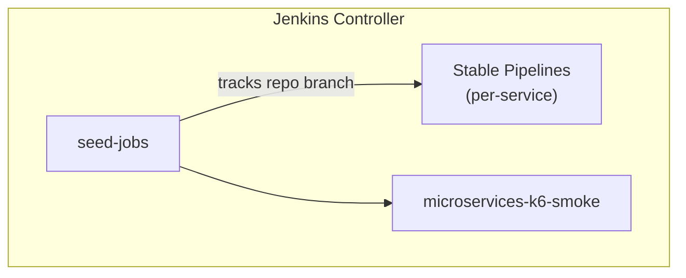

[← Previous: 401. Jenkins](./401-JENKINS.md) | [🏠 Home](../README.md) | [→ Next: 403. Tekton](./403-TEKTON.md)

---

# 402. Pipelines as Code

Everything Jenkins-side is defined in this repository — security, the global shared library, the OpenTelemetry exporter, and the Microservices pipelines — and applied via **Configuration as Code (JCasC)** + the **Job DSL** plugin. Nothing is configured by hand in the Jenkins UI.

## The Seed Job

A Jenkins seed job (defined via JCasC, running Job DSL against [`jenkins/pipelines/seed/seed_jobs.groovy`](../jenkins/pipelines/seed/seed_jobs.groovy) + [`services.yaml`](../jenkins/pipelines/seed/services.yaml)) generates the stable pipeline jobs at the root level under the `microservices` view:
- `gateway`
- `jhipstersamplemicroservice`
- `microservices-k6-smoke`

The first 2 pipelines invoke the [`MicroservicesPipeline`](../vars/MicroservicesPipeline.groovy) shared-library entry point (build/deploy, one Microservices service each); the last job invokes [`MicroservicesK6SmokePipeline`](../vars/MicroservicesK6SmokePipeline.groovy) (synthetic traffic + telemetry). The seed job (`seed_jobs.groovy`) generates the jobs with an inline `cps` script that calls these `vars/` entry points — there are no standalone `Jenkinsfile.microservices*` files.

## Pipeline Branch & Environment Mapping

Instead of separating stable and development pipelines into separate jobs and folders, a single set of root stable pipelines is generated:

*   **Target Namespace:** `microservices`
*   **Environment Name:** `stable` (modifies `values-stable.yaml` in the GitOps config repository on the `main` branch)

### Why the GitOps Repo Uses Only the `main` Branch

The companion repository `jenkins-2026-gitops-config` is configured to track only a single `main` branch by default:
1. **Single Environment Target (default)**: Only the stable target namespace (`microservices`) is deployed.
2. **Simplified Promotion**: The Jenkins CI pipeline writes image tags directly inside `values-stable.yaml` on the `main` branch.

### Optional `develop` Tier (Feature Flag, Off by Default)

A second `develop` deployment tier is available behind a feature flag. It is **disabled by default** because enabling it roughly **doubles the microservices footprint**.

**What it is (and is not).** `develop` is *only a second deployment tier of the microservices*, not a second platform:
* The upstream JHipster app repos have **no `develop` branch** (only `main`), so the develop tier **builds the same app image** as stable.
* It differs from stable only in **target namespace** (`microservices-develop`) and its **own `values-develop.yaml`**.
* It tracks the **`develop` branch of the GitOps config repo** for infra/config changes.
* **Observability is a single shared stack.** The develop tier reports into the *same* Grafana/Loki/Tempo/Prometheus, distinguished by namespace/labels.

**How to enable:**

```yaml
# config/config.yaml
microservices:
  developTrackEnabled: true   # default: false
```

```bash
# or, for a single run, override without editing the file:
export JENKINS2026_DEVELOP_TRACK_ENABLED=true
```

When enabled:
1. **ArgoCD** — `scripts/08.5-argocd.sh` appends a `develop` generator element to the `microservices` ApplicationSet, creating a `microservices-develop` Application.
2. **Jenkins** — the seed job generates parallel `<svc>-develop` and `microservices-k6-smoke-develop` jobs, grouped in a separate **`microservices-develop`** ListView.

> **Prerequisite**: the GitOps repo `jenkins-2026-gitops-config` must have a `develop` branch containing `helm/microservices/values-develop.yaml`, otherwise the `microservices-develop` ArgoCD app will fail to sync.

## Architecture Diagram

<details>
<summary>🔍 Click to expand Architecture Diagram</summary>



</details>

## Detailed Pipeline Execution Stages

### 1. Microservices Build & Deploy Pipeline

Defined in [`MicroservicesPipeline.groovy`](../vars/MicroservicesPipeline.groovy), this pipeline manages the complete CI/CD lifecycle for each individual microservice:

*   **Checkout Microservices source** — Clones the microservice repository. If the target is `gateway`, runs automated hot-patching scripts to migrate from MySQL to PostgreSQL.
*   **Checkout Infra configs** — Clones the deployed active branch of this infrastructure repository.
*   **Semgrep SAST** — Runs static security scan using `semgrep` with `p/security-audit`, `p/owasp-top-ten`, and custom rules. Generates and archives `semgrep-results.sarif`.
*   **CodeQL Analysis** — Builds a local CodeQL database and scans JavaScript/TypeScript files. Uploads `codeql-results.sarif` to the GitHub Code Scanning API.
*   **Trivy IaC Scan** — Clones the GitOps config repository and runs `trivy config` on the codebase and Helm manifests.
*   **Build & Test** — Delegates to `microservicesBuild.groovy`, using fast host-path Maven caches.
*   **Build & Push Image** — Delegates Docker packaging to `microservicesImage.groovy`, leveraging Jib or DinD to build and push to GHCR.
*   **Trivy Image Scan** — Runs `trivy image` against the published container image.
*   **Deploy to Kubernetes** — Delegates to `microservicesDeploy.groovy`. Checks out the GitOps repository, modifies the service's image tag using `yq`, pushes to the `main` branch, and runs the `argocd` CLI to trigger and wait for a synchronized healthy cluster rollout.
*   **Smoke Test** — Delegates to `microservicesSmokeTest.groovy` for HTTP health check validation. The throwaway curl pod runs in the **agent's `jenkins` namespace** labelled `jenkins=slave` (so `jenkins-agent-policy` grants it egress), targeting the microservices Service FQDN — **not** in the `microservices` namespace, which is default-deny egress under NetworkPolicy enforcement and would time out (`curl exit 28`). See [501 § NetworkPolicy matrix](./501-PLATFORM_OPERATIONS.md#networkpolicy-matrix).
*   **Integration k6 Smoke Test** — Triggers the downstream `microservices-k6-smoke` pipeline.
*   **Post Action Handler** — Saves unit test results via `junit` plugin and records static analysis warnings using `warnings-ng` plugin.

### 2. k6 Integration Smoke Test Pipeline

Defined in [`MicroservicesK6SmokePipeline.groovy`](../vars/MicroservicesK6SmokePipeline.groovy), this pipeline simulates load traffic and populates observability metrics. See [301. Observability](./301-OBSERVABILITY.md) for what it does and why.

## Pipeline Container Security

All agent pod containers follow a least-privilege model:

| Container | Image | Effective UID | `allowPrivilegeEscalation` | Notes |
|-----------|-------|:---:|:---:|-------|
| `jnlp` | `jenkins/inbound-agent` | 1000 | false | Jenkins default non-root agent |
| `maven` | `maven:3.9.9-eclipse-temurin-21` | 0 (image default) | false | Cache mountPath `/root/.m2`; migrate when cache path moves |
| `node` | `node:20-bookworm` | 0 (image default) | false | Cache mountPath `/root/.npm`; migrate when cache path moves |
| `git` | `alpine/git:2.54.0` | **1000** (k8s override) | false | `HOME=/tmp` required for `git config --global` under non-root |
| `helm` | `alpine/k8s:1.31.3` | **1000** (k8s override) | false | `HOME=/tmp`; ArgoCD CLI downloaded to `/tmp/argocd-cli` |
| `semgrep` | `semgrep/semgrep:1.79.0` | 0 (image default) | false | No filesystem writes requiring root |
| `trivy` | `aquasec/trivy:0.52.2` | 0 (image default) | false | No filesystem writes requiring root |
| `docker` | `docker:26-dind` | **0 (required)** | true (privileged) | Docker-in-Docker daemon requires root and a privileged context |
| `codeql` | `mcr.microsoft.com/cstsectools/codeql-container@…ba940166` (digest-pinned) | **0 (required)** | — | Runs `apt-get` + Node.js installer at pipeline time |

**Key implementation notes:**
- `runAsUser: 1000` on `alpine/git` and `alpine/k8s` is applied via Kubernetes `securityContext` — it overrides the image's default UID at runtime without modifying the image itself.
- SARIF upload runs in `container('helm')` because `alpine/k8s` ships curl, git, gzip, and base64 pre-installed.
- The JENKINS-30600 Jenkins Kubernetes plugin bug means the built-in DSL `git url:` step always runs in the JNLP sidecar regardless of `container()` wrapping. All git clones use `sh "git clone --depth 1 ..."` inside the intended container instead.

## Pipeline Reliability Fixes (v0.10.7–v0.10.16)

| Issue | Symptom | Root Cause | Fix |
|-------|---------|------------|-----|
| **JENKINS-30600** | OOM / `ClosedChannelException` on git checkout | DSL `git url:` ignores `container()` wrapper, always runs in 256 Mi JNLP | Replaced with `sh "git clone --depth 1"` inside target container |
| **EPERM on deploy cleanup** | `Operation not permitted` on `deleteDir()` | JNLP (UID 1000) cannot delete files written by root | Moved `find . -mindepth 1 -delete` inside `container('git')` |
| **k6 smoke OOM** | `ClosedChannelException` in `Checkout Infra` | Same JENKINS-30600 in `MicroservicesK6SmokePipeline` | Same `sh git clone` fix in `container('helm')` |
| **curl not found (exit 127)** | Semgrep/CodeQL stage FAILURE | `alpine/git` UID 1000 cannot `apk add curl` | Moved SARIF upload to `container('helm')` which has curl pre-installed |
| **Missing env vars in agents** | Pipeline references `env.JENKINS2026_REPO_BRANCH` as empty | `globalNodeProperties` not configured in JCasC | Added `globalNodeProperties` with all `JENKINS2026_*` vars in `jcasc-base.yaml` |
| **Agent pods not schedulable** | Builds queue indefinitely | Karpenter node taint `jenkins-agent=true:NoSchedule` without matching toleration | Added toleration to agent pod spec in `MicroservicesPipeline.groovy` |

---

[← Previous: 401. Jenkins](./401-JENKINS.md) | [🏠 Home](../README.md) | [→ Next: 403. Tekton](./403-TEKTON.md)

---

*402. Pipelines as Code — jenkins-2026*
