[← Previous: 401. Jenkins](./401-JENKINS.md) | [🏠 Home](../README.md) | [→ Next: 403. Declarative vs Scripted](./403-DECLARATIVE_VS_SCRIPTED.md)

---

# 402. Pipelines as Code

Everything Jenkins-side is defined in this repository — security, the global shared library, the OpenTelemetry exporter, and the Microservices pipelines — and applied via **Configuration as Code (JCasC)** + the **Job DSL** plugin. Nothing is configured by hand in the Jenkins UI. This page is the *pipeline* view; the *controller/platform* view is [401. Jenkins](./401-JENKINS.md).

> **Jenkins is the default of four mutually-exclusive CI engines** (selected by `ci.engine`): **Jenkins** · **Tekton** · **GitHub Actions (ARC)** · **Argo Workflows**. This page details the **Jenkins** engine; the sibling engines are covered in [404. Tekton](./404-TEKTON.md), [405. GitHub Actions](./405-GITHUB_ACTIONS.md), and [406. Argo Workflows](./406-ARGO_WORKFLOWS.md). All four honour the **same ~11-stage pipeline contract** and share the [`services.yaml`](../jenkins/pipelines/seed/services.yaml) registry + the [`resources/patch-app-source.sh`](../resources/patch-app-source.sh) gateway MySQL→Postgres + NoOp-cache build-time patch (see *§ Shared app-source patch* below).

## Understanding pipelines-as-code (newcomers → specialists)

The whole CI definition is a chain of generators: a **cron seed job** reads a small YAML registry and **writes the per-service jobs**, each of which calls **one shared-library entry point** that runs the same 12-stage build (the three scanners fan out in parallel) in a **multi-container agent pod**. Read this once and every later section is "which file holds which stage".

<details>
<summary>🧠 Mental model — pipelines as code (mindmap)</summary>

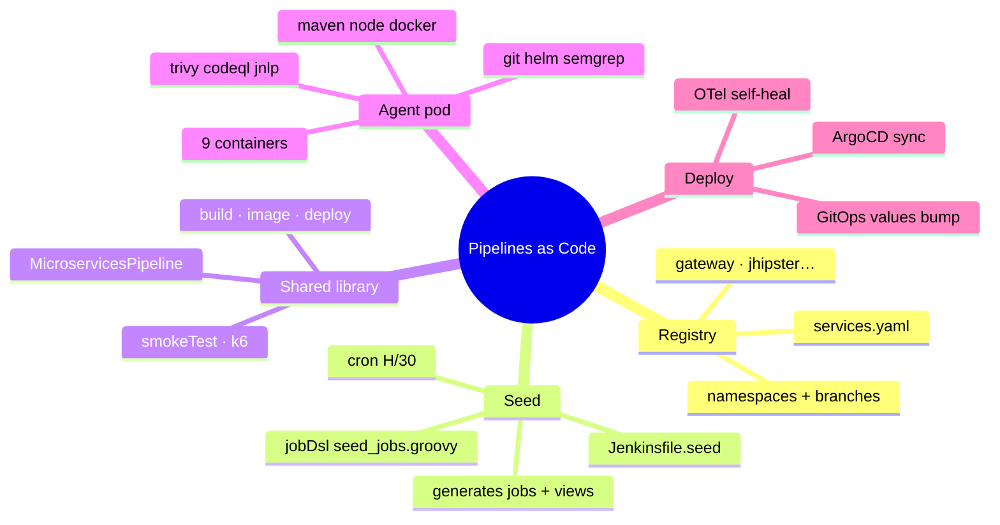

</details>

**Reading it —** read the branches as a chain of generators, left to right in time: a small **Registry** feeds the **Seed** job, which writes the per-service jobs, each of which calls one **Shared-library** entry point, which runs the build inside a 9-container **Agent pod**, whose final act is the **Deploy** handoff to GitOps. Every leaf is a real artifact in the repo — so the entire CI definition is auditable as code, with nothing hand-wired in the UI.

<details>
<summary>🟢 For newcomers — the mental model in 6 objects</summary>

| Object | What it is | File |
|---|---|---|
| **Service registry** | A tiny YAML listing the services to build (name, type, repo, port, health path) + the stable/develop namespaces & branches. | [`services.yaml`](../jenkins/pipelines/seed/services.yaml) |
| **Seed job** | A cron job (`H/30`) that reads the registry and **generates the per-service Jenkins jobs** via Job DSL. Re-runnable & idempotent. | [`Jenkinsfile.seed`](../jenkins/pipelines/seed/) + [`seed_jobs.groovy`](../jenkins/pipelines/seed/seed_jobs.groovy) |
| **Per-service job** | One generated job per service (`gateway`, `jhipstersamplemicroservice`) + `microservices-k6-smoke`. Each is a one-line call to a shared-library entry point. | generated, grouped in the `microservices` view |
| **Pipeline (entry point)** | The actual build definition: a 12-stage CI/CD lifecycle (parallel scans → build → image → deploy → smoke). | [`MicroservicesPipeline.groovy`](../vars/MicroservicesPipeline.groovy) |
| **Shared-library steps** | Reusable building blocks the pipeline delegates to: `microservicesBuild`/`Image`/`Deploy`/`SmokeTest`/`K6Smoke`/`K6Run` + the scan steps (`SemgrepScan`/`CodeqlScan`/`TrivyIacScan`/`SarifUpload`). | [`vars/`](../vars/) |
| **Agent pod** | The throwaway multi-container pod each build runs in — one container per tool (maven, docker, trivy, …). | provisioned by the kubernetes cloud |

So the loop is: *seed job reads `services.yaml` → generates `gateway`/`jhipster…`/`k6-smoke` jobs → a job runs `MicroservicesPipeline` → stages execute across the agent pod's tool containers → the deploy stage bumps an image tag in the GitOps repo → ArgoCD rolls it out*. The seed job is the only thing on a timer; the build jobs are started manually, from the UI, or downstream.

</details>

<details>
<summary>🔴 For specialists — the moving parts and how they're wired here</summary>

**Generation (self-bootstrapping):**
- [`jcasc-seed-job.yaml`](../jenkins/casc/jcasc-seed-job.yaml) defines `seed-jobs` — a `cpsScm` pipeline tracking `JENKINS2026_REPO_BRANCH`, cron `H/30 * * * *`.
- It runs [`Jenkinsfile.seed`](../jenkins/pipelines/seed/) → `jobDsl` (`sandbox: false`, so it may `org.yaml.snakeyaml.Yaml`-parse the registry) against [`seed_jobs.groovy`](../jenkins/pipelines/seed/seed_jobs.groovy).
- For the **stable** env always (+ **develop** when `JENKINS2026_DEVELOP_TRACK_ENABLED=true`), it emits:
  - per service, a `cps` job whose script is `@Library("microservices-shared-library@<infraBranch>") _` + `MicroservicesPipeline(...)`;
  - a `microservices-k6-smoke[-develop]` job calling `MicroservicesK6SmokePipeline(targetNamespace, envName, genaiEnabled, profile:'smoke', presetChoices:[…])` — the VUs/iterations are no longer hard-coded: empty parameters fall through the `K6SIM_*` contract to the smoke defaults (**4 VUs × 12 shared iterations**) in [`microservices-smoke.js`](../jenkins/pipelines/k6/microservices-smoke.js), and a **Build with Parameters** form exposes the full profile/VUs/duration/threshold knobs (see [302 · k6 Traffic & Load Testing](./302-K6_LOAD_TESTING.md));
  - a `microservices[-develop]` ListView.
- Retention: generated jobs keep 20 builds (`buildDiscarder numToKeep(20)`); the seed itself keeps 10.
- It prunes the legacy `pac-dev` folder, and the develop view when the track is off.

**Execution agent:** `MicroservicesPipeline` declares a **9-container** pod (SA `jenkins`):
- **Node placement** — `jenkins.runNodePool` (JCasC env `RUN_NODE_POOL`, default `static`): `static` → the long-lived pool (`nodeSelector app: jenkins-2026`); `ci-spot` + non-empty `GKE_COMPUTE_CLASS` → the NAP `ci-spot` Custom ComputeClass via `nodeSelector cloud.google.com/compute-class: ci-spot` + tolerations for the compute-class/gke-spot taints (GKE NAP provisions a Spot node).
- **Containers** — `maven` (`maven:3.9.9-eclipse-temurin-21`) · `node` (`node:20-bookworm`) · `docker` (`docker:26-dind`, privileged) · `helm` (`alpine/k8s:1.31.3` — kubectl/helm/argocd/yq) · `git` (`alpine/git:2.54.0`) · `semgrep` · `trivy` · `codeql` (SHA-tag-pinned) · `jnlp`.
- **Caches** — host-path `/tmp/jenkins-{maven,npm,trivy,codeql}-cache` speed re-runs.
- **Options** — `disableConcurrentBuilds()`, `buildDiscarder(20)`, `timeout(120 min)` (hang safety net), `durabilityHint('PERFORMANCE_OPTIMIZED')` (jenkins.io *Scaling Pipelines*: ~2-6× less controller I/O), `idleMinutes 5` (a warm pod is reused by the next build instead of cold-starting) + `retries 2` on the kubernetes agent (official pod-loss auto-retry: a `ci-spot` Spot preemption re-runs the build on a fresh pod; compile/test failures are **not** retried).
- **Image** — `IMAGE = <MICROSERVICES_REGISTRY>/<service>:<gitBranch>-<build#>-<sha8>` (SHA appended after checkout; rebuild-safe across `BUILD_NUMBER` resets).

**The 12 stages** (verbatim): Checkout Microservices source · Patch App Source (`when`-gated, gateway-only MySQL→Postgres hot-patch) · Checkout Infra configs · **Static Analysis — three parallel branches**: Semgrep SAST (+SARIF upload) ∥ CodeQL Analysis (+SARIF upload) ∥ Trivy IaC Scan · Build & Test (`microservicesBuild`) · Build & Push Image (`microservicesImage` — Jib for java, else Spring-Boot build-image via DinD; `docker build` for angular) · Trivy Image Scan · Deploy to Kubernetes (`microservicesDeploy`) · Smoke Test (`microservicesSmokeTest`) · Integration k6 Smoke Test (downstream `build job` wait). Post: `junit` + `recordIssues` (SARIF).

**GitOps deploy (`microservicesDeploy`):** clone the GitOps repo (`jenkins-2026-gitops-config`, branch `main`=stable / `develop`=develop) → `yq eval -i '.services.<svc>.image.tag = "<tag>"' helm/microservices/values-<env>.yaml` → commit `chore(ops): update <svc> image tag…` → `git push origin <branch>` → `argocd app sync microservices-<env>` + `app wait` (in-cluster gRPC, `ARGOCD_AUTH_TOKEN`) → **OTel self-heal** (if the running pod lacks `-javaagent` in `JAVA_TOOL_OPTIONS`, `kubectl rollout restart` it). This direct `git push origin main` is why the GitOps repo's `main` is **direct-push** (see [502](./502-MICROSERVICES_GITOPS.md) and the [branch-policy note in CLAUDE.md](../CLAUDE.md)).

**Triggers:** only `seed-jobs` is on a timer (`H/30`). The generated build jobs carry **no SCM/push trigger** — they are started manually (UI), via downstream `build job`, or externally. The nubenetes app forks *are* owned here, but the Jenkins engine doesn't wire push-webhooks (contrast the git-push PaC of the other three engines — [Tekton](./404-TEKTON.md), [GitHub Actions](./405-GITHUB_ACTIONS.md), and [Argo Workflows](./406-ARGO_WORKFLOWS.md)).

**Signals:** every run/stage/step is an OTel span (`OTEL_SERVICE_NAME=jenkins-pipeline-<svc>`); k6 exports OTLP metrics tagged `service.namespace=jenkins-2026, deployment.environment=<env>`. See [301](./301-OBSERVABILITY.md).

</details>

#### Seed-to-run object model & flow

Generation (left, runs on the seed-job cron) vs one execution (right, an ephemeral pod):

<details>
<summary>🔀 Seed-to-run object model & flow</summary>

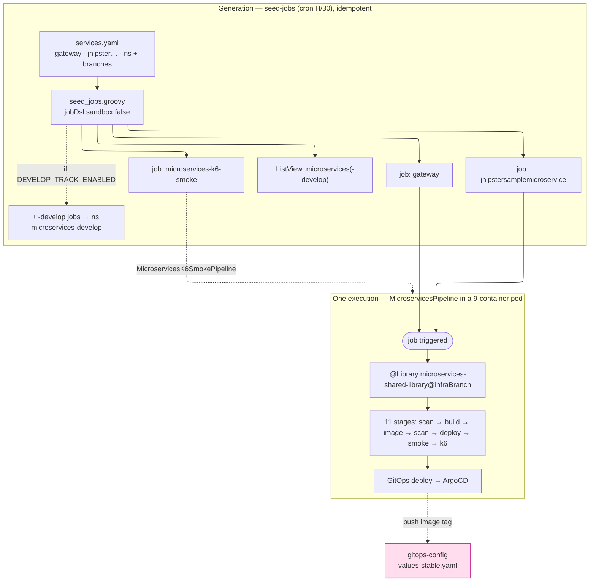

</details>

**Reading it —** the left box runs on a timer and is pure *generation*: `seed_jobs.groovy` parses `services.yaml` and emits one job per service (plus the k6 job and the list view), cloning into a `-develop` tier only when the flag is on. The right box is *one build*: a job pulls the shared library at the deployed infra branch and runs the 11 stages, ending in the GitOps deploy. The dashed arrow closes the loop — the deploy stage writes the new image tag *back* into the GitOps repo, which is what actually ships it. Note the asymmetry: generation is scheduled (`H/30`), but the builds themselves are started by hand or downstream.

## High-level architecture

The CI data flow end to end — source repos, the Jenkins controller/agent, the GitOps handoff, and observability:

<details>
<summary>🏛️ High-level CI architecture</summary>

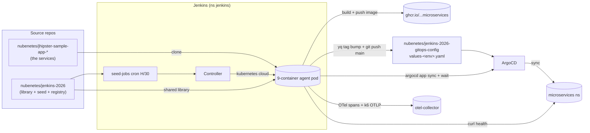

</details>

**Reading it —** trace a single build's data flow left to right. The agent pod pulls *three* sources — the app repo (the code), this repo (library + seed + registry), and a clone of the GitOps repo — then fans out to *three* sinks: it pushes the image to GHCR, bumps the tag in the GitOps repo (a direct `git push` to `main`), and emits telemetry to the collector. The deploy is deliberately indirect: Jenkins never applies manifests to the `microservices` namespace itself — it commits a tag and asks **ArgoCD** to sync, then verifies over the same gRPC API. The only direct touches into `microservices` are the smoke-test curl and the OTel self-heal restart.

## The Seed Job

A Jenkins seed job (defined via JCasC, running Job DSL against [`seed_jobs.groovy`](../jenkins/pipelines/seed/seed_jobs.groovy) + [`services.yaml`](../jenkins/pipelines/seed/services.yaml)) generates the stable pipeline jobs at the root level under the `microservices` view:
- `gateway`
- `jhipstersamplemicroservice`
- `microservices-k6-smoke`

The first 2 pipelines invoke the [`MicroservicesPipeline`](../vars/MicroservicesPipeline.groovy) shared-library entry point (build/deploy, one Microservices service each); the last job invokes [`MicroservicesK6SmokePipeline`](../vars/MicroservicesK6SmokePipeline.groovy) (synthetic traffic + telemetry). The seed job ([`seed_jobs.groovy`](../jenkins/pipelines/seed/seed_jobs.groovy)) generates the jobs with an inline `cps` script that calls these [`vars/`](../vars/) entry points — there are no standalone `Jenkinsfile.microservices*` files.

#### How the seed job generates the job graph

<details>
<summary>🌱 How the seed job generates the job graph (sequence)</summary>

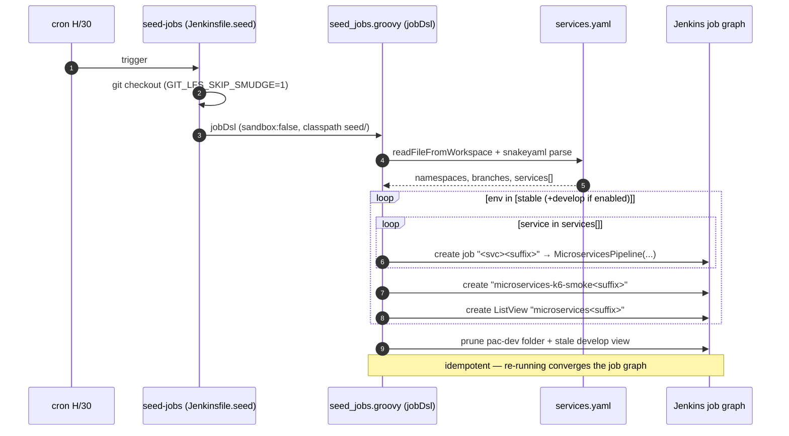

</details>

**Reading it —** the seed job is itself a tiny pipeline. It checks the repo out, then hands control to `jobDsl` running **unsandboxed** (`sandbox:false`) — that's deliberate and required, because it lets the script `snakeyaml`-parse `services.yaml` (sandboxed Groovy would block that). The double loop (env × service) *is* the entire job graph expressed in code, and because Job DSL **reconciles** rather than appends, re-running prunes anything no longer in the registry — so the graph self-heals and stale `-develop` jobs disappear when the flag is turned off.

## Pipeline Branch & Environment Mapping

Instead of separating stable and development pipelines into separate jobs and folders, a single set of root stable pipelines is generated:

*   **Target Namespace:** `microservices`
*   **Environment Name:** `stable` (modifies `values-stable.yaml` in the GitOps config repository on the `main` branch)

<details>
<summary>🌳 Branch & environment mapping (stable vs develop)</summary>

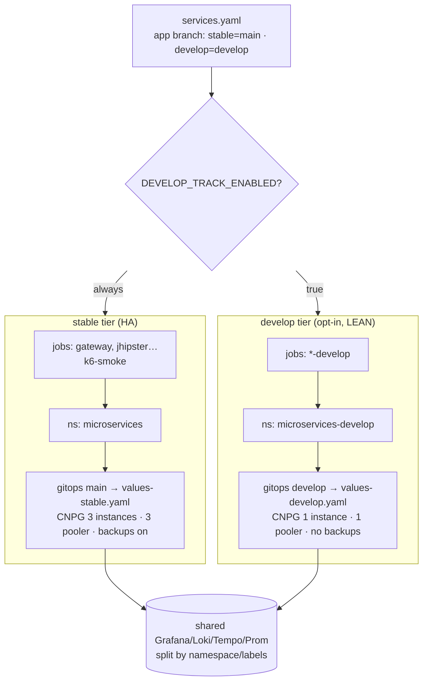

</details>

**Reading it —** the single switch is `DEVELOP_TRACK_ENABLED`. The **stable** tier always exists; the **develop** tier is an opt-in tier that differs in its jobs (a `-develop` suffix), namespace (`microservices-develop`), and values (`values-develop.yaml` on the GitOps repo's `develop` branch). The nubenetes app **forks now carry a real `develop` branch** (`services.yaml` `branches.develop: develop`), so the develop tier **builds the app's `develop` branch** — true branch-based promotion, a second build, not just a second deployment. And it is deliberately **lean**: where stable runs HA Postgres (3 CNPG instances + a 3-replica pooler + daily backups), develop runs a **single** non-HA CNPG instance, a single pooler, and **no backups** — so it adds only a handful of pods, not a full second copy. Both tiers funnel into one shared observability stack, separated only by namespace/labels. See the dedicated section below.

### Why the GitOps Repo Uses Only the `main` Branch

The companion repository `jenkins-2026-gitops-config` is configured to track only a **single `main` branch** by default:
1. **Single Environment Target (default)**: Only the stable target namespace (`microservices`) is deployed.
2. **Simplified Promotion**: The Jenkins CI pipeline writes image tags directly inside `values-stable.yaml` on the `main` branch.

### Optional `develop` Tier (Feature Flag, Off by Default)

A second `develop` deployment tier is available behind a feature flag, **disabled by default**. It is *only a second deployment tier of the microservices*, not a second platform:

* The nubenetes app **forks carry a real `develop` branch** (off `main`), set via `services.yaml` `branches.develop: develop`, so the develop tier **builds the app's `develop` branch** — true branch-based promotion. (Only the *original upstream* `jhipster/*` repos have just `main`; this project builds the forks.)
* It differs from stable only in **target namespace** (`microservices-develop`), its **own `values-develop.yaml`** (tracked on the GitOps repo's **`develop` branch**), and a **lean Postgres** profile.
* **Observability is a single shared stack** — the develop tier reports into the *same* Grafana/Loki/Tempo/Prometheus, distinguished by namespace/labels (`deployment_environment=develop`).

**Engine-neutral.** The tier works the same under all four CI engines — **Jenkins** (default), **Tekton**, **GitHub Actions (ARC)**, and **Argo Workflows**: the deploy target is an engine-neutral ArgoCD `microservices-develop` Application; only the *generation* of the `-develop` CI jobs differs (Jenkins seed job · Tekton seeded `PipelineRun`s · GitHub Actions `workflow_dispatch` runs · Argo Workflows submitted `Workflow`s).

**Lean by design (resources you need, not more).** The Helm chart parameterizes the CNPG HA knobs — `global.postgresInstances` / `global.poolerInstances` (default `3`) and `global.postgresBackupEnabled` (default `true`). `values-develop.yaml` overrides them to **`1` / `1` / `false`**: a single Postgres instance (no standbys), a single PgBouncer pooler, and no Barman/ScheduledBackup (develop data is disposable). So per service develop runs **1 CNPG + 1 pooler** instead of stable's **3 + 3** — the whole tier is ~4 Postgres-related pods vs stable's ~12. On the 2× `e2-standard-8` cluster this fits with ample headroom.

**Publicly exposed (its own host).** Like `stable`, the develop tier gets a public route when the Gateway is on: [`scripts/09-gateway.sh`](../scripts/09-gateway.sh) generates a dedicated `microservices-develop` HTTPRoute + HealthCheckPolicy (gated on `microservices.developTrackEnabled`) pointing at the develop `gateway` Service, reachable at **`https://microservices-develop.<gateway.baseDomain>`** (e.g. `https://microservices-develop.jenkins2026.nubenetes.com`) — public, **no IAP**, same edge posture as the stable `microservices` host, covered by the existing `*.<base_domain>` wildcard cert/DNS (no extra cert or DNS record). The host prefix is `gateway.hosts.microservicesDevelop` in [`config/config.yaml`](../config/config.yaml). The URL is surfaced in the Jenkins systemMessage banner (`MICROSERVICES_DEVELOP_LINK`) and in the GitHub Actions "Access URLs" logs. Disabling the tier on a persistent cluster retires the route/policy idempotently. (The chart's own `ingress.enabled: false` in `values-develop.yaml` is unrelated — exposure is via the Gateway API HTTPRoute, not the chart Ingress.)

#### `stable` vs `develop` — what differs, and why

`stable` is the **production-representative** tier (full HA, backups, alerts, public access); `develop` is a **lean, disposable validation** tier. Everything `develop` drops, it drops **on purpose** — it gets exactly what it needs and nothing it doesn't:

| Aspect | `stable` (production-like) | `develop` (lean) | Why |
|---|---|---|---|
| Namespace | `microservices` | `microservices-develop` | isolate the two tiers |
| **CNPG Postgres** | **HA — 3 instances** (primary + 2 standbys) | **1 instance** (no standby) | develop data is **disposable**; no need to survive a node/zone loss |
| **PgBouncer pooler** | 3 replicas | 1 replica | match the single DB; minimal footprint |
| **Backups** (Barman→GCS + daily `ScheduledBackup`) | **on** | **off** | nothing to back up — re-create from CI any time |
| **App resources** (req/limit mem) | `512Mi` / `1Gi` | `384Mi` / `768Mi` | leaner than stable, but the limit must still fit the **OTel Java agent** (~+150Mi metaspace/native) or the instrumented pods OOMKill → CrashLoop; `512Mi` was too tight |
| **Alerts** | **yes** — pages on failure | **no** (rules filter `namespace="microservices"`) | a validation tier breaking shouldn't page on-call (see [301 § Alert Rules](./301-OBSERVABILITY.md#alert-rules)) |
| **Public access** | via the Gateway (`microservices` host, no-IAP) | via the Gateway (`microservices-develop` host, no-IAP) | each tier gets its own public host; both covered by the `*.<base_domain>` wildcard cert/DNS |
| **GitOps branch / values** | `main` / `values-stable.yaml` | `develop` / `values-develop.yaml` | track infra/config changes separately |
| **Observability** | shared stack | shared stack | one Grafana/Loki/Tempo/Prometheus; split by `deployment_environment` |
| **Footprint** | ~12 Postgres-related pods | ~4 | "resources you need, not more" |

**The rationale in one line:** develop exists to **validate a change cheaply and fast** before it reaches the production-like `stable` tier — so it reuses the *same app image, same CI/CD path, and same observability*, but skips the things that only matter for production (HA, backups, alerting). Enabling it roughly doubles only the **runtime** footprint, not the platform.

#### How to enable

Durable default in [`config/config.yaml`](../config/config.yaml), ephemeral override via env, **or the GitHub Actions input** — the same durable-default + override pattern as `ci.engine` / `observability.mode`:

```yaml
# config/config.yaml
microservices:
  developTrackEnabled: true   # default: false
```

```bash
# or, for a single run, override without editing the file:
export JENKINS2026_DEVELOP_TRACK_ENABLED=true
```

In CI, the **`develop_track`** boolean input (**off by default**) on `Day1.cluster.01-gke` (and the `Day1.cluster.00-all` umbrella, plus the per-engine redeploy workflows `Day2.redeploy.02-jenkins` / `03-tekton` / `06-githubactions` / `07-argoworkflows`) maps to `JENKINS2026_DEVELOP_TRACK_ENABLED` — tick it to provision the tier for that run.

> **Prerequisite**: the GitOps repo `jenkins-2026-gitops-config` must have a `develop` branch containing `helm/microservices/values-develop.yaml` (with the lean `global.postgres*` overrides), otherwise the `microservices-develop` ArgoCD app will fail to sync.

<details>
<summary>🌿 Develop-tier provisioning path (flowchart)</summary>

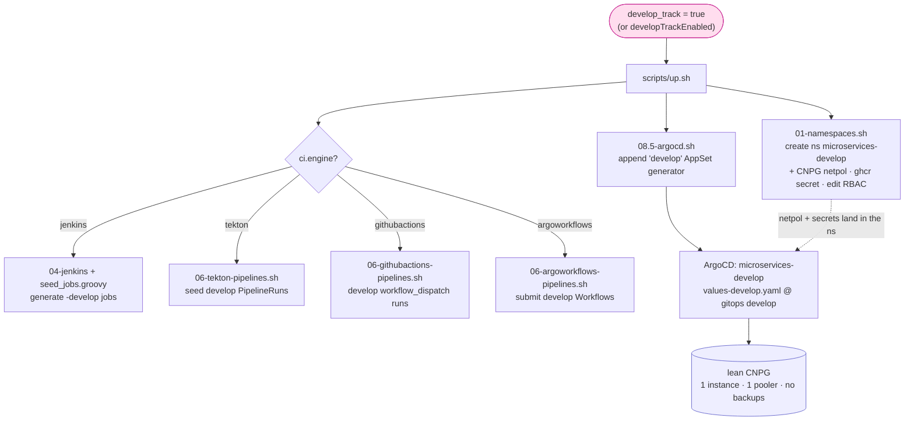

</details>

**Reading it —** one flag drives three engine-neutral things through `up.sh`: **01-namespaces** provisions the `microservices-develop` namespace with the same script-applied plumbing stable gets (the additive CNPG NetworkPolicy and the `ghcr-credentials` pull secret); the `edit` RoleBinding for the active engine's SA — `jenkins` · `tekton-ci` · the ARC runner SA · `argoworkflows-ci` — lands via the GitOps **`platform-config`** app (`argocd/platform-config/templates/rbac-*.yaml`, gated on `ciEngine` + `developTrackEnabled`); **08.5** appends a `develop` generator to the microservices ApplicationSet so ArgoCD creates the `microservices-develop` app from the lean `values-develop.yaml`; and the active CI engine generates the `-develop` jobs/runs. The OTLP-ingress and pgAdmin-egress NetworkPolicies already list `microservices-develop` statically (harmless when absent), and the non-OSS collectors add it to the CNPG metrics scrape — so telemetry flows with no extra wiring.

## The service registry model

The seed job reads one YAML — [`services.yaml`](../jenkins/pipelines/seed/services.yaml) — whose shape drives everything generated downstream:

<details>
<summary>🗂️ The service registry model (ER diagram)</summary>

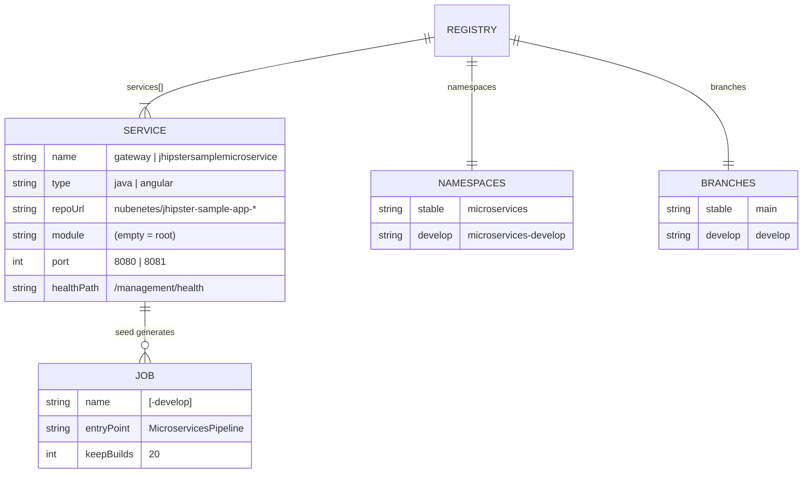

</details>

**Reading it —** this is the schema the seed job consumes. One `REGISTRY` holds many `SERVICE` rows plus the `NAMESPACES`/`BRANCHES` maps, and each `SERVICE` fans out to one or more generated `JOB`s. The point is that **every per-service knob the pipeline needs lives in one place** — add a row here (name/type/repo/port/health) and the seed job generates its jobs, wires its parameters, and the pipeline builds/deploys it with no other change. `type` (`java`/`angular`) is the field that later switches Maven-vs-npm builds and Jib-vs-docker packaging.

## Shared app-source patch (all four engines)

[`services.yaml`](../jenkins/pipelines/seed/services.yaml) is *one* artifact the four CI engines (Jenkins, Tekton, Argo Workflows, GitHub Actions) share so they stay interchangeable; **[`resources/patch-app-source.sh`](../resources/patch-app-source.sh)** is the other. Every engine runs this one script **right after it checks out the app fork, before build** — it converts the `gateway` service from MySQL to PostgreSQL + a NoOp cache, and is a **no-op for every other service**. The script is **idempotent**, so re-running a build (or running it twice) is safe.

**What it does (newcomer view).** Call it as `patch-app-source.sh <service-name> [app-source-dir]`. For any service other than `gateway` it prints "no patch needed" and exits 0. For `gateway` it rewrites the checked-out source in place: swaps the MySQL drivers/dialect/JDBC+R2DBC URLs for PostgreSQL in `pom.xml` and `application-prod.yml`, repoints the test-container at Postgres so the test sources still compile, drops the Hibernate 2nd-level `@Cache` from the reactive `User` entity, and adds a `CacheConfiguration` that wires a Spring `NoOpCacheManager`. The result is a gateway that builds and runs against the platform's CloudNativePG Postgres without touching the upstream repo.

### Why the patch exists

The microservices forks are deliberately kept as **clean, unmodified upstream JHipster samples** — they track upstream and stay an honest demo of what `jhipster` actually generates. But the gateway upstream (`jhipster/jhipster-sample-app-gateway`) is generated for **MySQL**, while this platform standardises on **PostgreSQL (CloudNativePG)**. Something has to reconcile that mismatch. Rather than diverge the fork, **each engine adapts the source at build time** — the fork stays pristine, and the MySQL→Postgres conversion lives entirely in CI.

### Why one shared script (and not the alternatives)

The patch logic used to be **copied inline into all four engines**. That is exactly the kind of duplication that rots: the copies **had already drifted** — a `DatabaseTestcontainer` fix (needed since JHipster v9.1.0 so the test sources test-compile against Postgres) existed in **only one** engine's copy. Centralising removes that whole failure mode:

- **Single source of truth → no drift.** One file changes once; all four engines pick it up. No "fixed in Jenkins but not in GitHub Actions" skew.
- **It extends a layer the engines already share.** The four engines already read the same [`services.yaml`](../jenkins/pipelines/seed/services.yaml); folding the patch into that same shared layer keeps them **truly interchangeable** — all four honour the same ~11-stage contract, so a build means the same thing regardless of engine.
- **One place to maintain.** When the next app/DB mismatch appears (a new service, a new upstream bump), there is exactly one script to edit instead of four.

The alternatives are both worse:

- **(a) Migrate the fork to Postgres.** This diverges the fork from upstream permanently — every upstream sync now conflicts, and the "sample" stops being a faithful copy of what JHipster emits. A dishonest demo.
- **(b) Keep per-engine inline copies.** This is the status quo we left: the copies **drift** (as the missing `DatabaseTestcontainer` fix proved) and cost **4× the maintenance** for every future change.

### How each engine calls it

All four engines invoke the *same* script; only the path-resolution mechanism differs, because of how each engine gets at the `jenkins-2026` infra repo:

| Engine | How it runs the script |
|---|---|
| **Jenkins** | `libraryResource('patch-app-source.sh')` — loaded from the shared library's `resources/` (this is why the script lives under `resources/`). |
| **Tekton** | runs `resources/patch-app-source.sh` from its **cloned `jenkins-2026` infra** checkout. |
| **Argo Workflows** | same as Tekton — `resources/patch-app-source.sh` from its cloned `jenkins-2026` infra. |
| **GitHub Actions** | runs `resources/patch-app-source.sh` from its **`infra/` checkout** of this repo. |

All four engines also run **Build & Test with `-DskipITs`** — the heavy DB **Integration Tests** are skipped — so the *test-side* DB config doesn't need to match the runtime Postgres. The patch repoints the test-container only so the test sources **compile** (`clean verify` test-compiles even with `-DskipITs`); it deliberately doesn't try to make the full integration-test DB stack run.

## Detailed Pipeline Execution Stages

### 1. Microservices Build & Deploy Pipeline

Defined in [`MicroservicesPipeline.groovy`](../vars/MicroservicesPipeline.groovy), this pipeline manages the complete CI/CD lifecycle for each individual microservice across **12 stages** (the three scanners run as **parallel branches** of a *Static Analysis* stage; the gateway-only patch is a **`when`-gated** stage that shows as *skipped* for every other service):

*   **Checkout Microservices source** — Clones the microservice repository (shallow, single-branch, no-tags) and appends the commit SHA to the rebuild-safe image tag.
*   **Patch App Source** — `when { expression { serviceName == 'gateway' } }`: runs the shared [`resources/patch-app-source.sh`](../resources/patch-app-source.sh) (via `libraryResource`), migrating the gateway source from MySQL to PostgreSQL + a NoOp cache; skipped for every other service. (This is the *same* script all four CI engines run — see *§ Shared app-source patch*.)
*   **Checkout Infra configs** — Clones the deployed active branch of this infrastructure repository.
*   **Static Analysis** — a declarative `parallel {}` fan-out of the three independent read-only scanners (CodeQL, the long pole, no longer serialises the other two; each branch delegates to its `vars/` custom step):
    *   **Semgrep SAST** ([`microservicesSemgrepScan`](../vars/microservicesSemgrepScan.groovy)) — static security scan using `semgrep` with `p/security-audit`, `p/owasp-top-ten`, and custom rules. Generates and archives `semgrep-results.sarif`, then uploads it via the shared [`microservicesSarifUpload`](../vars/microservicesSarifUpload.groovy) step.
    *   **CodeQL Analysis** ([`microservicesCodeqlScan`](../vars/microservicesCodeqlScan.groovy)) — builds a local CodeQL database and scans JavaScript/TypeScript files. Uploads `codeql-results.sarif` via the same shared SARIF-upload step.
    *   **Trivy IaC Scan** ([`microservicesTrivyIacScan`](../vars/microservicesTrivyIacScan.groovy)) — clones the GitOps config repository and runs `trivy config` on the codebase and Helm manifests.
*   **Build & Test** — Delegates to [`microservicesBuild.groovy`](../vars/microservicesBuild.groovy), using fast host-path Maven/npm caches.
*   **Build & Push Image** — Delegates Docker packaging to [`microservicesImage.groovy`](../vars/microservicesImage.groovy), leveraging Jib (java w/ Jib plugin), Spring-Boot `build-image` via DinD, or `docker build` (angular), pushing to GHCR.
*   **Trivy Image Scan** — Runs `trivy image` against the published container image.
*   **Deploy to Kubernetes** — Delegates to [`microservicesDeploy.groovy`](../vars/microservicesDeploy.groovy). Checks out the GitOps repository, modifies the service's image tag using `yq`, pushes to the tier's GitOps branch (`main` for stable, `develop` for the develop tier), and runs the `argocd` CLI to trigger and wait for a synchronized healthy cluster rollout (then the OTel self-heal).
*   **Smoke Test** — Delegates to [`microservicesSmokeTest.groovy`](../vars/microservicesSmokeTest.groovy) for HTTP health check validation. The throwaway curl pod runs in the **agent's `jenkins` namespace** labelled `jenkins=slave` (so `jenkins-agent-policy` grants it egress), targeting the microservices Service FQDN — **not** in the `microservices` namespace, which is default-deny egress under NetworkPolicy enforcement and would time out (`curl exit 28`). See [501 § NetworkPolicy matrix](./501-PLATFORM_OPERATIONS.md#networkpolicy-matrix).
*   **Integration k6 Smoke Test** — Triggers the downstream `microservices-k6-smoke` pipeline (`build job`, waits for completion).
*   **Post Action Handler** — Saves unit test results via `junit` plugin and records static analysis warnings using `warnings-ng` plugin (`recordIssues` over the two SARIFs).

#### Build run, end to end (which container does what)

<details>
<summary>🔧 Build run, end to end (sequence)</summary>

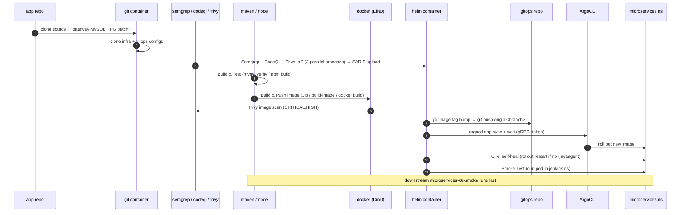

</details>

**Reading it —** the columns are the agent pod's tool containers, and the diagram shows the build *hopping between them* — each stage runs `container('<name>')` so the right tool (and UID) handles each step. Watch the scanners (Semgrep/CodeQL/Trivy) report into GitHub from the `helm` container (it ships curl), the build move from `maven`/`node` into the privileged `docker` sidecar to produce the image, then the `helm` container drive the whole GitOps deploy — tag bump, push, `argocd sync/wait`, and the OTel self-heal — before the smoke curl. The k6 job runs last, downstream and blocking.

#### Build lifecycle (state)

<details>
<summary>♻️ Build lifecycle (state diagram)</summary>

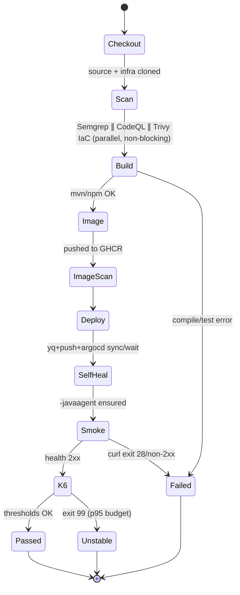

</details>

**Reading it —** the spine is the 11 stages collapsed into states. Two nuances are worth internalising. First, the scanners are *non-blocking* (`Scan` flows straight into `Build`) — they upload findings but don't fail the build, by design. Second, the terminal states are **three**, not two: a k6 threshold breach (`exit 99`) lands in **Unstable**, *not* Failed — a deliberate signal that the deploy is live but a latency/error budget was missed, distinct from a hard break (`curl exit 28`, a compile/test error).

### 2. k6 Integration Smoke Test Pipeline

Defined in [`MicroservicesK6SmokePipeline.groovy`](../vars/MicroservicesK6SmokePipeline.groovy), this pipeline simulates load traffic (`vus:4, iterations:12` by default) and populates observability metrics. The k6 script ([`microservices-smoke.js`](../jenkins/pipelines/k6/microservices-smoke.js)) hits the gateway UI root, gateway/microservice health endpoints, and the gateway→microservice proxy route, with thresholds `http_req_failed < 5%` and `p95 < 3s`, exporting OTLP to the collector (exit 99 → **UNSTABLE, not FAILURE**). See [301. Observability](./301-OBSERVABILITY.md) for what it does and why.

## The shared library (`vars/`)

Each pipeline is a **thin entry point** that delegates to reusable steps. The class/collaboration model:

<details>
<summary>🧩 The shared library (class diagram)</summary>

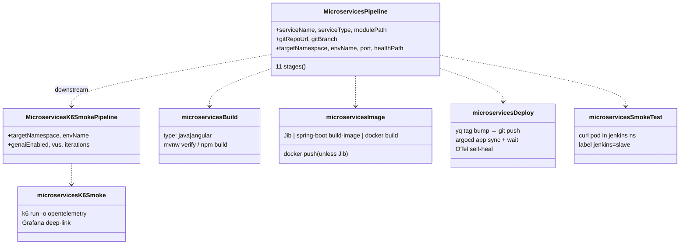

</details>

**Reading it —** this is the collaboration model of [`vars/`](../vars/). The two *pipelines* are thin orchestrators; the real work lives in the lower-case *steps* they depend on (dashed `..>` = "uses"). It tells you exactly where to change behaviour: build logic in `microservicesBuild`, packaging strategy (Jib vs build-image vs docker) in `microservicesImage`, the whole GitOps+ArgoCD+OTel dance in `microservicesDeploy`, and the network-policy-aware health check in `microservicesSmokeTest`. `MicroservicesPipeline` triggers `MicroservicesK6SmokePipeline` downstream — which is why k6 is both a *stage* and a *standalone job*.

#### GitOps deploy detail (`microservicesDeploy.groovy`)

The deploy stage is where Jenkins hands off to GitOps — and why the OTel self-heal exists:

<details>
<summary>🚢 GitOps deploy detail (microservicesDeploy)</summary>

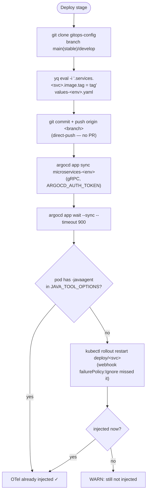

</details>

**Reading it —** the deploy is a *commit*, not a `kubectl apply`: clone the GitOps repo, `yq` the one image tag, push to `main` (this direct push is exactly *why* the GitOps repo's `main` is direct-push, not PR-gated — a required PR would wedge every deploy), then drive ArgoCD over gRPC and block on `app wait`. The branch at the bottom is the subtle part: the OTel operator's mutating webhook is `failurePolicy: Ignore`, so a pod admitted before the `Instrumentation` CR was ready starts *without* the Java agent — the self-heal detects the missing `-javaagent` and does a single `rollout restart` to repair observability without failing the deploy.

## Pipeline Container Security

The build runs in a single multi-container agent pod; all containers follow a least-privilege model:

<details>
<summary>🔒 Pipeline container security (agent pod)</summary>

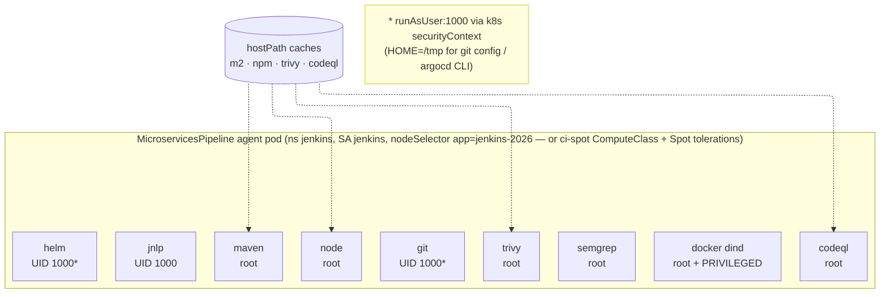

</details>

**Reading it —** one pod, nine containers, one least-privilege rule each. The takeaway: only `docker` (DinD) is **privileged**; `docker` and `codeql` are the two **root-required** containers (DinD needs root + privileged; codeql apt-installs Node.js at pipeline time); `git` and `helm` are *forced* down to UID 1000 via the Kubernetes `securityContext` (overriding their image default, with `HOME=/tmp` so non-root tooling works); the rest run as their image's user with `allowPrivilegeEscalation:false`. The host-path caches (dashed) are mounted only where they pay off (Maven/npm/Trivy/CodeQL) to make re-runs fast. The table below restates the same model with exact images and UIDs.

| Container | Image | Effective UID | `allowPrivilegeEscalation` | Notes |
|-----------|-------|:---:|:---:|-------|
| `jnlp` | `jenkins/inbound-agent:3355.v388858a_47b_33-22` | 1000 | false | Jenkins default non-root agent |
| `maven` | `maven:3.9.9-eclipse-temurin-21` | 0 (image default) | false | Cache mountPath `/root/.m2`; migrate when cache path moves |
| `node` | `node:20-bookworm` | 0 (image default) | false | Cache mountPath `/root/.npm`; migrate when cache path moves |
| `git` | `alpine/git:2.54.0` | **1000** (k8s override) | false | `HOME=/tmp` required for `git config --global` under non-root |
| `helm` | `alpine/k8s:1.31.3` | **1000** (k8s override) | false | `HOME=/tmp`; ArgoCD CLI downloaded to `/tmp/argocd-cli` |
| `semgrep` | `semgrep/semgrep:1.79.0` | 0 (image default) | false | No filesystem writes requiring root |
| `trivy` | `aquasec/trivy:0.52.2` | 0 (image default) | false | No filesystem writes requiring root |
| `docker` | `docker:26-dind` | **0 (required)** | true (privileged) | Docker-in-Docker daemon requires root and a privileged context |
| `codeql` | `mcr.microsoft.com/cstsectools/codeql-container:c6f3…ba940166` (SHA-tag-pinned) | **0 (required)** | — | Runs `apt-get` + Node.js installer at pipeline time |

**Key implementation notes:**
- `runAsUser: 1000` on `alpine/git` and `alpine/k8s` is applied via Kubernetes `securityContext` — it overrides the image's default UID at runtime without modifying the image itself.
- SARIF upload runs in `container('helm')` because `alpine/k8s` ships curl, git, gzip, and base64 pre-installed.
- The JENKINS-30600 Jenkins Kubernetes plugin bug means the built-in DSL `git url:` step always runs in the JNLP sidecar regardless of `container()` wrapping. All git clones use `sh "git clone --depth 1 ..."` inside the intended container instead.

## Pipeline Reliability Fixes (v0.10.7–v0.10.16)

| Issue | Symptom | Root Cause | Fix |
|-------|---------|------------|-----|
| **JENKINS-30600** | OOM / `ClosedChannelException` on git checkout | DSL `git url:` ignores `container()` wrapper, always runs in 256 Mi JNLP | Replaced with `sh "git clone --depth 1"` inside target container |
| **EPERM on deploy cleanup** | `Operation not permitted` on `deleteDir()` | JNLP (UID 1000) cannot delete files written by root | Moved `find . -mindepth 1 -delete` inside `container('git')` |
| **k6 smoke OOM** | `ClosedChannelException` in `Checkout Infra` | Same JENKINS-30600 in `MicroservicesK6SmokePipeline` | Same `sh git clone` fix in `container('helm')` |
| **curl not found (exit 127)** | Semgrep/CodeQL stage FAILURE | `alpine/git` UID 1000 cannot `apk add curl` | Moved SARIF upload to `container('helm')` which has curl pre-installed |
| **Missing env vars in agents** | Pipeline references `env.JENKINS2026_REPO_BRANCH` as empty | `globalNodeProperties` not configured in JCasC | Added `globalNodeProperties` with all `JENKINS2026_*` vars in `jcasc-base.yaml` |
| **Agent pods not schedulable** | Builds queue indefinitely | NAP auto-applies `cloud.google.com/compute-class=ci-spot:NoSchedule` + `cloud.google.com/gke-spot=true:NoSchedule` taints to the auto-created Spot pools without matching tolerations | Added the `ci-spot` ComputeClass nodeSelector + both tolerations to the agent pod spec in `MicroservicesPipeline.groovy` |
| **ArgoCD Sync Race (exit 20)** | Deploy stage fails with `another operation is already in progress` | GitOps tag push triggers ArgoCD auto-sync, which races with the pipeline's explicit `argocd app sync` | Implemented a 6-attempt retry-and-fall-through loop in `vars/microservicesDeploy.groovy` to align with Tekton and Argo |

---

[← Previous: 401. Jenkins](./401-JENKINS.md) | [🏠 Home](../README.md) | [→ Next: 403. Declarative vs Scripted](./403-DECLARATIVE_VS_SCRIPTED.md)

---

*402. Pipelines as Code — jenkins-2026*
