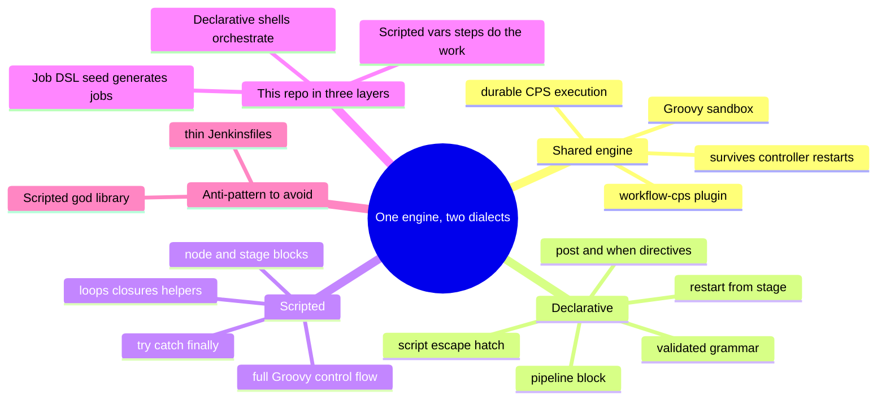
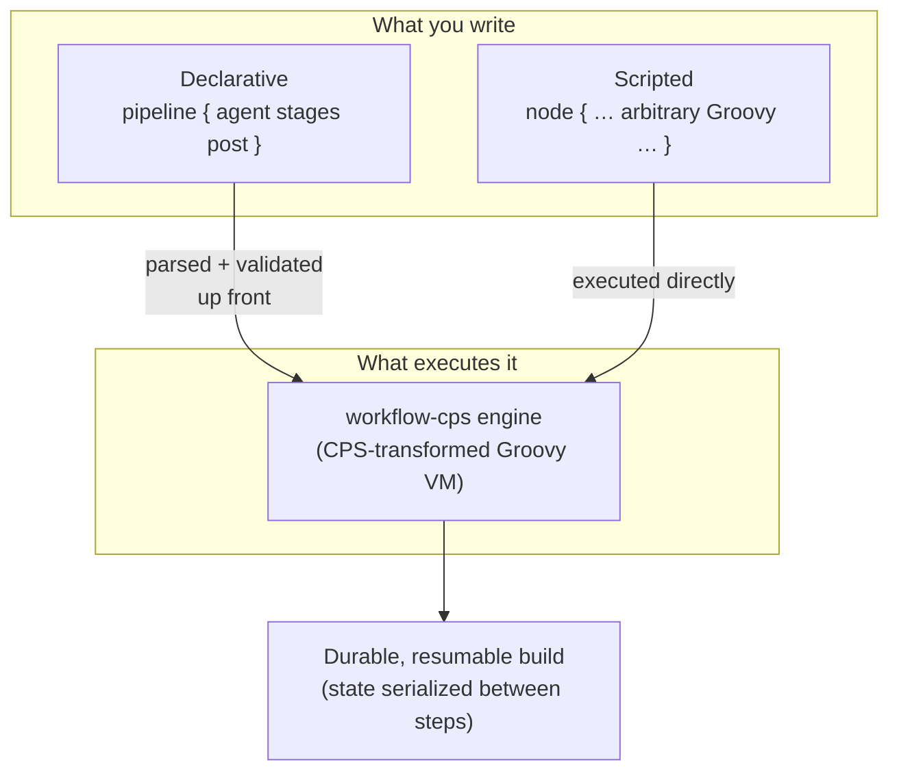
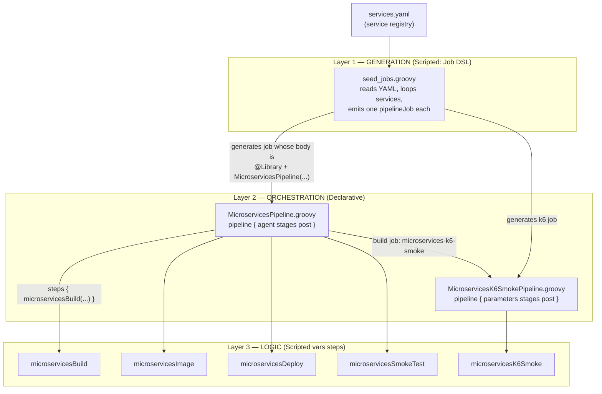
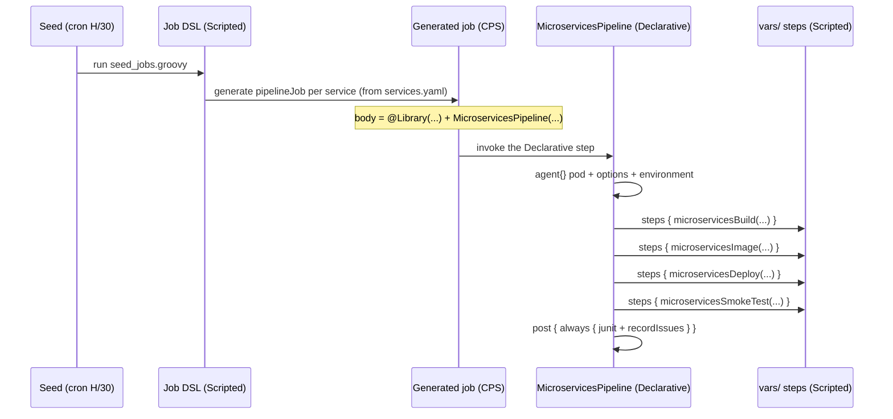
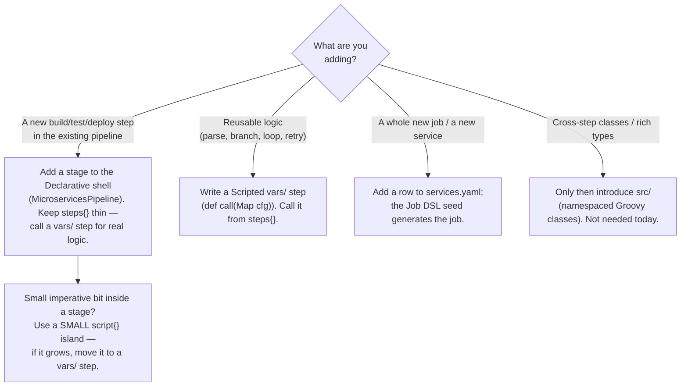
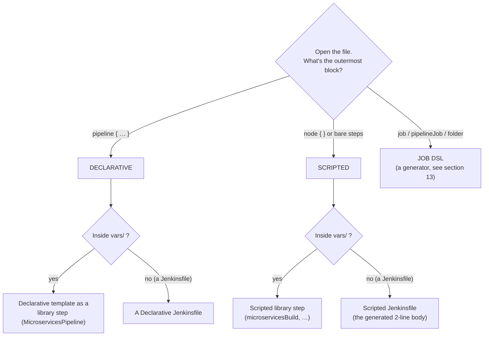
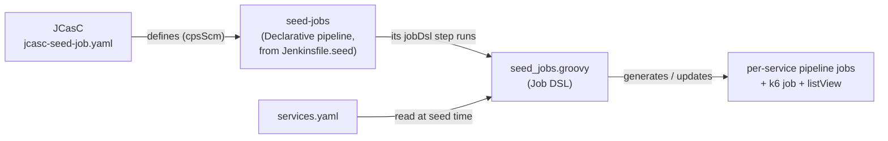

[← Previous: 402. Pipelines as Code](./402-PIPELINES_AS_CODE.md) | [🏠 Home](../README.md) | [→ Next: 404. Tekton](./404-TEKTON.md)

---

# 403. Declarative vs Scripted — Jenkins Pipeline Authoring Architecture

> **TL;DR (plain terms).** A Jenkins pipeline can be written in **two Groovy
> dialects**: **Declarative** (a structured, validated `pipeline { … }` template)
> and **Scripted** (a free-form Groovy program). They are *not* rivals and *not* a
> hierarchy — they are **two syntaxes over the same engine**: Declarative a
> validated grammar, Scripted free-form Groovy. This repo deliberately uses **both, in
> layers**: a **Job DSL** seed job (Scripted-flavoured) *generates* the jobs; each
> generated job runs a **Declarative** pipeline *shell* ([`MicroservicesPipeline`](../vars/MicroservicesPipeline.groovy),
> [`MicroservicesK6SmokePipeline`](../vars/MicroservicesK6SmokePipeline.groovy)); and
> that shell delegates the real work to **Scripted** shared-library steps
> ([`microservicesBuild`](../vars/microservicesBuild.groovy) / `…Image` / `…Deploy` /
> `…SmokeTest` / `…K6Smoke`). This document is the **tutorial + architecture
> rationale** for that split: what each dialect is, when Jenkins recommends which,
> the trade-off matrices, what breaks if you go all-one-way, and exactly which file
> in this repo is which and *why*.

**Who should read what.** Newcomers can stop after [§1](#1-the-two-dialects-in-sixty-seconds)
and [§2](#2-what-each-dialect-actually-is) and have the whole shape. Specialists
extending the pipeline want [§7](#7-this-repos-architecture-the-three-layer-hybrid)
(the per-file map), [§8](#8-why-this-split-the-design-rationale) (the rationale),
and [§9](#9-counterexamples-what-breaks-if-you-go-all-one-way) (what *not* to do).
Need to *identify* a file's dialect at a glance, learn **Job DSL** pipeline
generation, or understand the widespread Scripted-god-library **anti-pattern**? Jump
to [§12](#12-recognising-declarative-vs-scripted-at-a-glance),
[§13](#13-job-dsl-and-seed-jobs-an-advanced-tutorial), and
[§14](#14-the-common-anti-pattern-a-scripted-god-library-with-thin-jenkinsfiles).
For the surrounding context see **[401. Jenkins](./401-JENKINS.md)** (the controller,
JCasC, the shared-library declaration) and **[402. Pipelines as Code](./402-PIPELINES_AS_CODE.md)**
(the seed job, the 11 stages, the deploy loop). This doc is the *why-it's-shaped-this-way*
companion to 402's *what-it-does*.

---

## Understanding the two dialects (newcomers → specialists)

Before the tutorial proper, the whole document in one picture: **one engine, two
syntaxes, three layers in this repo**. Read this section once and everything
below is just detail and evidence.

<details>
<summary>🧠 Mental model — Declarative vs Scripted (mindmap)</summary>



</details>

**Reading it —** the two middle branches are the dialects themselves; the
**Shared engine** branch is the fact that dissolves most internet debates (both
compile onto the same durable CPS interpreter — neither is built on the other);
**This repo in three layers** is the architecture the rest of the document
justifies (generation → orchestration → logic, [§7](#7-this-repos-architecture-the-three-layer-hybrid));
and the **Anti-pattern** branch is the popular shortcut this repo deliberately
avoids ([§14](#14-the-common-anti-pattern-a-scripted-god-library-with-thin-jenkinsfiles)).

<details>
<summary>🟢 For newcomers — the mental model in 6 concepts</summary>

| Concept | What it is | Everyday analogy |
|---|---|---|
| **Declarative pipeline** | A fixed skeleton of directives (`pipeline`/`agent`/`stages`/`post`) that Jenkins **validates before running** | A tax form: fixed boxes, rejected up-front if you fill it in wrong |
| **Scripted pipeline** | A free-form **Groovy program** (`node { … }`) with loops, `try/finally`, helpers — mistakes surface only as it runs | A blank essay: write anything, errors show up when it's read |
| **CPS engine** (`workflow-cps`) | The interpreter **both** dialects run on; it checkpoints program state so a controller restart resumes the build | A videogame savegame — quit mid-level, resume exactly there |
| **`script {}`** | The escape hatch that embeds Scripted code inside a Declarative pipeline | A "free-text remarks" field inside the tax form |
| **Job DSL seed** | A Groovy script that **generates job definitions** from data ([`services.yaml`](../jenkins/pipelines/seed/services.yaml)) — code that writes jobs, not a job that builds code | A mail-merge: one template + a list → many letters |
| **Shared-library `vars/` step** | A custom verb (`microservicesBuild(…)`) either dialect can call, versioned in git | A toolbox of power tools next to the form/essay |

So this repo's build is literally: *the **seed** (Job DSL) mail-merges one
job per service → each job runs a small **Declarative shell**
([`MicroservicesPipeline`](../vars/MicroservicesPipeline.groovy)) → every stage's
real work is a **Scripted `vars/` step**.* If you remember only that, [§7](#7-this-repos-architecture-the-three-layer-hybrid)
will feel familiar.
</details>

<details>
<summary>🔴 For specialists — the load-bearing internals</summary>

- **One engine, really.** Declarative is the `pipeline-model-definition` plugin:
  it parses/validates the `pipeline {}` model, then drives the **same**
  CPS-transformed Groovy execution as Scripted (`workflow-cps`). "Declarative is
  built on Scripted" is folklore — they are **sibling front-ends** ([§2](#2-what-each-dialect-actually-is)).
- **CPS mechanics you will eventually hit:** continuation-passing style rewrites
  every call so program state serializes between steps (that's how builds survive
  restarts); non-serializable locals break it, and hot loops crawl — the escape is
  **`@NonCPS`** ([§2.3](#23-the-cps-execution-model-in-practice-and-noncps)), used
  in this repo for JSON parsing in
  [`microservicesK6Smoke`](../vars/microservicesK6Smoke.groovy).
- **The sandbox** (`script-security`) intercepts every call in both dialects;
  library code in `vars/` runs sandboxed too, and approvals are the admin-visible
  cost of exotic Groovy ([§2.4](#24-script-security-the-groovy-sandbox)).
- **The three layers, by file:** the seed
  [`seed_jobs.groovy`](../jenkins/pipelines/seed/seed_jobs.groovy) (Job DSL,
  *generative*, [§13](#13-job-dsl-and-seed-jobs-an-advanced-tutorial)) → the
  Declarative shells [`MicroservicesPipeline`](../vars/MicroservicesPipeline.groovy) /
  [`MicroservicesK6SmokePipeline`](../vars/MicroservicesK6SmokePipeline.groovy)
  (a `pipeline {}` *inside* a library step — pipeline templating) → the Scripted
  steps `microservicesBuild`/`…Image`/`…Deploy`/`…SmokeTest`/`…K6Smoke`
  ([§7.4](#74-the-per-file-classification-map) is the full classification map).
- **Choosing on sight:** the decision guide is [§11](#11-decision-guide-cheat-sheet),
  the failure modes of going all-one-way are [§9](#9-counterexamples-what-breaks-if-you-go-all-one-way),
  and the god-library anti-pattern (and when it's actually fine) is
  [§14](#14-the-common-anti-pattern-a-scripted-god-library-with-thin-jenkinsfiles).
</details>

---

## Table of contents

0. [Understanding the two dialects (newcomers → specialists)](#understanding-the-two-dialects-newcomers--specialists)
1. [The two dialects in sixty seconds](#1-the-two-dialects-in-sixty-seconds)
2. [What each dialect actually is](#2-what-each-dialect-actually-is)
3. [How they interoperate: the `script {}` escape hatch and the nesting rule](#3-how-they-interoperate-the-script--escape-hatch-and-the-nesting-rule)
4. [The comparison matrix](#4-the-comparison-matrix)
5. [Advantages & disadvantages, in full](#5-advantages--disadvantages-in-full)
6. [When Jenkins officially recommends which](#6-when-jenkins-officially-recommends-which)
7. [This repo's architecture: the three-layer hybrid](#7-this-repos-architecture-the-three-layer-hybrid)
8. [Why this split: the design rationale](#8-why-this-split-the-design-rationale)
9. [Counterexamples: what breaks if you go all-one-way](#9-counterexamples-what-breaks-if-you-go-all-one-way)
10. [The advantages of the hybrid, enumerated](#10-the-advantages-of-the-hybrid-enumerated)
11. [Decision guide (cheat sheet)](#11-decision-guide-cheat-sheet)
12. [Recognising Declarative vs Scripted at a glance](#12-recognising-declarative-vs-scripted-at-a-glance)
13. [Job DSL and seed jobs: an advanced tutorial](#13-job-dsl-and-seed-jobs-an-advanced-tutorial)
14. [The common anti-pattern: a Scripted god-library with thin Jenkinsfiles](#14-the-common-anti-pattern-a-scripted-god-library-with-thin-jenkinsfiles)
15. [References & further reading](#15-references--further-reading)

---

## 1. The two dialects in sixty seconds

The *same* trivial pipeline — "check out, build, test" — written each way.

**Declarative** — a fixed skeleton of *directives* (`agent`, `stages`, `steps`,
`post`). You describe *what* the pipeline is; Jenkins runs it:

```groovy
pipeline {
    agent any
    stages {
        stage('Build') {
            steps { sh './mvnw -B clean verify' }
        }
    }
    post {
        always  { junit '**/target/surefire-reports/*.xml' }
        failure { echo 'build broke' }
    }
}
```

**Scripted** — a Groovy program. You write *how* the pipeline executes, with full
imperative control:

```groovy
node {
    stage('Build') {
        try {
            sh './mvnw -B clean verify'
        } finally {
            junit '**/target/surefire-reports/*.xml'
        }
    }
}
```

They produce the same result. The differences that matter — validation, structure,
control flow, tooling, when each is the right tool — are the rest of this document.

**The one sentence to remember:** *Declarative and Scripted are two syntaxes over
the very same durable CPS (`workflow-cps`) engine — neither is built on the other.
Declarative trades Scripted's full-language flexibility for a validated grammar
plus lifecycle features (`post {}`, restart-from-stage) that Scripted has no
built-in equivalent for.*

---

## 2. What each dialect actually is

### 2.1 Scripted Pipeline — the original

Scripted Pipeline **originated in the Workflow (later renamed Pipeline) plugin
(2014–2015)** and was made a first-class, bundled feature with **Jenkins 2.0
(April 2016)**. A Scripted pipeline **is a Groovy script** executed by the
**`workflow-cps`** engine. Two consequences flow from that:

- **It's a real program.** `if`/`for`/`while`/`try-catch`, method definitions,
  closures, collections, recursion — the whole Groovy language is available at any
  point. `node`, `stage`, `sh`, `checkout` are just *steps* (functions) you call.
- **It runs under CPS.** CPS = **Continuation-Passing Style**: the Groovy is
  transformed so its entire call stack can be **serialized to disk between steps**.
  That is what lets a running pipeline **survive a Jenkins controller restart** and
  resume mid-build. The price: local variables must be `Serializable`, and some
  Groovy idioms need a `@NonCPS`-annotated helper method to run outside the
  transform. (This CPS engine is *shared* — Declarative runs on it too.)

### 2.2 Declarative Pipeline — the structured, validated syntax

Declarative Pipeline (the **Pipeline Model Definition** plugin) reached **1.0 on
1 Feb 2017**. It is **not built on top of** Scripted — it is a second syntax over
the **same underlying Pipeline (`workflow-cps`) sub-system**: a `pipeline { … }`
block with a **fixed, validated grammar** of *directives* — `agent`, `environment`,
`options`, `parameters`, `triggers`, `stages`, `steps`, `post`, `when`, `matrix`,
`parallel`, `tools`, `input`. At load time Jenkins **parses and validates** that
structure *before the build starts*; a typo like `stagez {` or a `post` condition
that doesn't exist is rejected up front, not three minutes into the run.

Crucially, Declarative is **not a different runtime.** The `pipeline {}` block is
parsed and validated up front, then executed on the same `workflow-cps` engine
that runs Scripted — the two are **peers on one engine**, not a stack. So:



**The load-bearing takeaway:** Declarative gives you **guardrails and tooling**
(up-front validation, a mandatory `post {}` block that runs even on failure/abort,
restart-from-stage, the Blue Ocean visual editor, a uniform readable shape) at the
cost of **grammatical rigidity** — you cannot write arbitrary Groovy at the top
level of a `stage`. Scripted gives you **the whole language** at the cost of those
guardrails. That tension is the entire reason this repo uses each where it fits.

### 2.3 The CPS execution model in practice (and `@NonCPS`)

CPS is the detail that bites specialists, so it earns its own subsection. The
`workflow-cps` transform rewrites your Groovy so the **entire program state can be
serialized to disk at every *step* boundary** (a *step* = `sh`, `checkout`, `echo`,
`readJSON`, … — not every Groovy statement). That snapshotting is what lets a
half-finished build **survive a controller restart** and resume. Three consequences
every `vars/` author should internalise:

- **Locals live across a step must be `Serializable`.** Hold a non-serializable
  object (a `java.util.regex.Matcher`, a `Pattern`, a JDBC handle, many third-party
  objects) in a variable that is still in scope when the next `sh` runs, and the
  build dies with **`NotSerializableException`**. The fix is usually to *use and
  discard* such objects inside a single expression, never parking them in a local.
- **The closure-capture trap.** A closure captures its enclosing scope; if that
  scope holds non-serializable state and the closure survives a step boundary, the
  same exception fires. Iterating with `each { }` across `sh` calls is the classic
  trigger.
- **`@NonCPS` is the escape hatch.** Annotate a **pure helper method** `@NonCPS` and
  it runs as *plain* Groovy — outside the transform: faster, and immune to CPS's
  restrictions on some iterator/closure idioms. The hard rule: **a `@NonCPS` method
  must not call any Pipeline step** (`sh`, `echo`, …); it runs start-to-finish in one
  shot, so there is nowhere to serialize.

**Reconciled with this repo's flagship example.** The report helpers in
[`microservicesK6Smoke.groovy`](../vars/microservicesK6Smoke.groovy) — `numOf`,
`pct`, `fmtBytes`, and the **recursive** `collectFailedChecks` — call **no Pipeline
steps**: they are pure Groovy over an already-materialised map (the `readJSON`
*step* runs once, first, and returns a plain `Map`/`List`). So they execute inside a
single step context, cross no serialization boundary, and work correctly
**unannotated**. Marking them `@NonCPS` would be a legitimate optimisation (skip the
CPS transform for hot, pure, recursive code) — it is *not required* here precisely
because they neither hold non-serializable state across a step nor call steps
themselves. That distinction — *pure computation vs. step orchestration* — is the
practical litmus test for where `@NonCPS` belongs.

### 2.4 Script security: the Groovy sandbox

The two dialects also differ in their **attack surface on a shared controller**,
which is why the seed sets `sandbox(true)` on the jobs it generates (visible in the
[§7.1](#71-layer-1--generation-job-dsl-scripted-and-generative) snippet).

- **The sandbox + script approval.** A Pipeline can run in the **Groovy sandbox**,
  which only permits whitelisted method calls; anything else needs an admin's
  **Script Approval**. It stops a job author from running arbitrary
  `System.exit()`/reflection/filesystem code as the Jenkins user.
- **Declarative is easier to sandbox than Scripted.** Its constrained grammar is a
  small, reviewable surface; free-form Scripted can reach for arbitrary Groovy/Java,
  so it leans much harder on the sandbox and accumulates approval prompts.
- **This repo's split maps cleanly onto trust.** The **Job DSL seed** runs with
  `sandbox: false` — it is admin-managed, loaded from JCasC out of the trusted repo,
  and needs APIs the sandbox blocks (see [402](./402-PIPELINES_AS_CODE.md)). The
  **generated per-service jobs** run `sandbox(true)`. And because
  `microservices-shared-library` is a **global** library declared in JCasC, its
  `vars/` steps are **trusted** and run *outside* the sandbox with full privileges.
  So the sandboxed job body stays tiny (it mostly just calls trusted steps), while
  the real logic runs trusted in `vars/`. That is the security counterpart of the
  shape/logic split: **untrusted-shaped job body sandboxed; trusted logic in the
  library privileged.**

### 2.5 Declarative's structured directives (with examples)

Declarative's power is not just `stages`/`steps` — the directives express
concurrency, conditionals, and lifecycle without hand-rolled Groovy. The ones worth
knowing (this repo uses `options` today; the rest are the shell's latent capacity):

```groovy
options { timeout(time: 30, unit: 'MINUTES'); retry(2); disableConcurrentBuilds() }

// Run independent stages concurrently — no Scripted parallel-map boilerplate:
stage('Scan') {
    parallel {
        stage('Semgrep') { steps { /* … */ } }
        stage('CodeQL')  { steps { /* … */ } }
    }
}

// Conditional execution; beforeAgent true skips WITHOUT even allocating an agent:
stage('Deploy') {
    when { branch 'main'; beforeAgent true }
    steps { /* … */ }
}

// Cartesian expansion — one stage definition, many combinations:
matrix {
    axes { axis { name 'JDK'; values '17', '21' } }
    stages { stage('Build') { steps { sh "./mvnw -Djava.version=${JDK} verify" } } }
}
```

Each of these would be a hand-written closure/loop in Scripted; Declarative makes
them declarative *directives* the linter can validate. That is exactly the
"guardrails for the shape" argument that puts the pipeline skeleton in Declarative.

---

## 3. How they interoperate: the `script {}` escape hatch and the nesting rule

Declarative has a deliberate pressure-release valve: the **`script {}`** step. Inside
a Declarative `steps { }` block you may open a `script { }` island and write
arbitrary Scripted Groovy for that stretch:

```groovy
stages {
    stage('Checkout Microservices source') {   // the real stage name in this repo
        steps {
            script {                       // <-- Scripted island inside Declarative
                if (env.GIT_COMMIT?.trim()) {
                    env.IMAGE_TAG = "${cfg.gitBranch}-${env.BUILD_NUMBER}-${env.GIT_COMMIT.take(8)}"
                }
            }
        }
    }
}
```

Two rules govern the boundary, and both matter for the architecture in §7:

1. **You cannot nest a `pipeline { }` inside a Declarative `steps { }`.** Declarative
   is top-level-only; there is exactly one `pipeline {}` per pipeline. To run
   imperative logic you drop to `script {}` (an island) or, better, **factor that
   logic into a Scripted shared-library step** and *call* it from `steps {}`. This
   repo does the latter — that is precisely why the `microservices*` steps exist.
2. **A `script {}` block that keeps growing is a code smell.** The Jenkins guidance
   is explicit: large `script {}` islands signal that the logic wants to move into a
   shared library. "Declarative with a 200-line `script {}` block" is Scripted
   wearing a Declarative costume — you've paid for the rigidity and kept none of the
   readability. (See the all-Declarative counterexample in [§9.2](#92-what-if-everything-were-declarative).)

There is also a subtler seam this repo uses: **plain Groovy *above* the `pipeline {}`
block.** A `vars/` step file is itself a Scripted `call()` method, so you can compute
values in imperative Groovy *before* returning the Declarative pipeline. Real example
from [`MicroservicesPipeline.groovy`](../vars/MicroservicesPipeline.groovy) — the
agent's node-scheduling YAML is assembled with a Groovy ternary *before* `pipeline {`:

```groovy
def call(Map cfg) {
    String runPool = (env.RUN_NODE_POOL ?: 'static').trim()          // Scripted preamble
    String agentNodeScheduling = (runPool == 'ci-spot' && …) ? """…""" : """…"""
    pipeline {                                                        // Declarative body
        agent { kubernetes { yaml """… ${agentNodeScheduling} …""" } }
        …
    }
}
```

That single file is therefore *both* dialects at once: a Scripted head computing
configuration, a Declarative body consuming it. It is the cleanest illustration of
"the two are layers, not rivals."

---

## 4. The comparison matrix

The dimensions that actually drive the choice. Read "✅ / ⚠️ / ❌" as
*strength / caveat / weakness*, not as a score.

| Dimension | Declarative | Scripted |
| :--- | :--- | :--- |
| **Syntax model** | Fixed grammar of directives (`agent`/`stages`/`post`/…) | Free-form Groovy program (`node {}` + arbitrary code) |
| **Validation** | ✅ Parsed & schema-validated **before** the run — typos fail fast | ❌ Errors surface only at runtime, when that line executes |
| **Control flow** | ⚠️ Structured only: `when`, `parallel`, `matrix`; arbitrary logic needs `script {}` | ✅ Full Groovy: `if`/`for`/`try`/closures/recursion/methods anywhere |
| **Post/cleanup semantics** | ✅ First-class `post { always/success/failure/unstable/aborted/cleanup }` — runs even on failure/abort | ⚠️ Do it yourself with `try/finally`; easy to forget a path |
| **Restart from a stage** | ✅ "Restart from Stage" (re-run only the failed stage) | ❌ Not supported — restart re-runs the whole script |
| **Visual editing / Blue Ocean** | ✅ Round-trips through the visual editor | ❌ Not editable visually |
| **Stage-level `agent` / `when` / `environment`** | ✅ Per-stage directives, declarative and readable | ⚠️ Achievable, but hand-rolled |
| **Learning curve** | ✅ Low — reads like a config file; safe for many contributors | ❌ Higher — needs Groovy + CPS awareness |
| **Ceiling / flexibility** | ❌ Hits a wall on genuinely dynamic logic | ✅ Effectively unlimited — it's a programming language |
| **Reusable building blocks** | ⚠️ Whole pipelines can be a `vars/` step, but logic still wants Scripted | ✅ Natural home for library helpers, closures, parsers |
| **Dynamic generation of *many* jobs** | ❌ Not its job | ✅ Via **Job DSL** (a third, generative Scripted flavour — see §7.1) |
| **Best at** | The **shape** of a pipeline: stages, agent, post, guardrails, uniformity | The **logic** inside it: parsing, branching, reuse, generation |

The last row is the whole thesis: **Declarative owns the *shape*, Scripted owns the
*logic*.** A codebase that reuses one pipeline across many services (like this one)
wants the shape uniform and validated *and* the logic factored and powerful — which
is an argument for using **both**, not for picking a winner.

---

## 5. Advantages & disadvantages, in full

### Declarative — advantages

- **Fail-fast validation.** Structural errors are caught at load time, before an
  agent is even allocated — the single biggest time-saver on a shared controller.
- **Guaranteed post-conditions.** `post { always { … } }` runs on success, failure,
  *and* abort. Test-result publishing and issue-recording can't be silently skipped.
- **Uniform, scannable shape.** Every Declarative pipeline has the same skeleton, so
  a reviewer finds `agent`, `stages`, `post` in the same place every time — decisive
  when a seed job stamps out N near-identical jobs.
- **Restart-from-stage.** Re-run only the failed stage instead of the whole build.
- **Lower barrier to contribution.** Reads like configuration; a contributor can add
  a stage without understanding CPS or Groovy closures.
- **First-class `parallel`, `matrix`, `when`, `options`, `environment`, `parameters`**
  as directives — no boilerplate.
- **Tooling.** Blue Ocean visual editor, the Declarative linter (`jenkins-cli
  declarative-linter`), IDE schema support.

### Declarative — disadvantages

- **Rigid grammar.** You cannot put arbitrary Groovy at the top of a `stage`; you
  must open a `script {}` island — which, if it grows, defeats the point.
- **A low logic ceiling.** Genuinely dynamic behaviour (generate stages from a list,
  parse a JSON report, recurse a tree) is awkward or impossible without dropping out.
- **`script {}` creep.** The escape hatch is a slippery slope to "Scripted-in-drag."
- **Less obvious data flow.** Passing computed values between stages goes through
  `environment {}`/`stash`, which is clumsier than a local variable.

### Scripted — advantages

- **The full language, everywhere.** Methods, closures, recursion, `try/catch`,
  collections, higher-order functions — no seams.
- **Natural reuse.** Library helpers, parsers, and multi-step routines live cleanly
  as Groovy methods (see [`microservicesK6Smoke.groovy`](../vars/microservicesK6Smoke.groovy),
  which recurses a k6 result tree and formats a report — impossible declaratively).
- **Dynamic construction.** Build stages/steps from data at runtime.
- **The substrate for generation.** Job DSL — how this repo *creates* its jobs — is
  Scripted Groovy (see §7.1).

### Scripted — disadvantages

- **No up-front validation.** A typo eight stages deep fails eight stages deep.
- **No free `post`.** You must remember the `try/finally` on every path — the exact
  bug Declarative's `post {}` was invented to prevent.
- **No restart-from-stage, no visual editor.**
- **CPS foot-guns.** Non-serializable locals and `@NonCPS` subtleties bite newcomers.
- **Higher review cost.** Freedom means every author can invent a different shape;
  across many services that becomes drift.

---

## 6. When Jenkins officially recommends which

Jenkins' own documentation is unambiguous about the default:

- **Declarative Pipeline is the recommended starting point for most users.** It is
  described as offering "a more modern, opinionated syntax" and is the syntax the
  official *Getting Started* guide, the Blue Ocean editor, and most examples use.
- **Scripted Pipeline is positioned as the advanced/flexible option** — "a general
  purpose DSL built with Groovy" that "offers a tremendous amount of flexibility and
  extensibility," for cases where Declarative's structure is too limiting.

The canonical, community-blessed pattern — and the one this repo implements — is:

> **Write the pipeline in Declarative; when you hit logic that Declarative can't
> express cleanly, don't reach for a big `script {}` block — move that logic into a
> shared library (`vars/` step or `src/` class) written in Scripted, and call it from
> a `steps {}` block.**

That single sentence *is* this repo's architecture. Everything in §7 is its
mechanical realisation.

---

## 7. This repo's architecture: the three-layer hybrid

This repo does not "use Declarative" or "use Scripted." It uses **three cooperating
layers**, each in the dialect that fits it:



### 7.1 Layer 1 — Generation: Job DSL (Scripted, and *generative*)

[`jenkins/pipelines/seed/seed_jobs.groovy`](../jenkins/pipelines/seed/seed_jobs.groovy)
is run by the **Job DSL plugin** from the seed job
([`Jenkinsfile.seed`](../jenkins/pipelines/seed/Jenkinsfile.seed), wired in JCasC —
see [402 § The seed job](./402-PIPELINES_AS_CODE.md)). Job DSL is a **third flavour of
Groovy**: not a pipeline at all, but an *imperative program that generates job
definitions*. It reads [`services.yaml`](../jenkins/pipelines/seed/services.yaml),
loops over the services, and for each one emits a `pipelineJob` whose body is a tiny
inline **CPS** script that loads the shared library and calls the Declarative step:

```groovy
registry.services.each { svc ->                       // imperative Groovy loop
  pipelineJob("${svc.name}${e.suffix}") {             // Job DSL: define a job
    definition {
      cps {
        script("""
@Library("microservices-shared-library@${pipelineRepoBranch}") _
MicroservicesPipeline(serviceName: '${svc.name}', serviceType: '${svc.type}', …)
""")
        sandbox(true)
      }
    }
  }
}
```

Two things to notice. First, the generated jobs are **in-memory CPS `WorkflowJob`s**,
not `Jenkinsfile`s on disk — there is deliberately **no `Jenkinsfile.microservices`**
in the repo. Second, this generation step is *inherently* Scripted: it loops over
data and builds structure at runtime, which is exactly what Declarative cannot do.

### 7.2 Layer 2 — Orchestration: the Declarative pipeline shells

The two `PascalCase` files are **Declarative** `pipeline { }` shells:

- [`MicroservicesPipeline.groovy`](../vars/MicroservicesPipeline.groovy) — the
  build→scan→image→deploy→smoke pipeline (~11 stages). It owns the **shape**: the
  9-container agent pod (`agent { kubernetes { yaml … } }`), `options`,
  `environment` (the rebuild-safe `IMAGE_TAG`), the `stages` list, and the `post {
  always { junit …; recordIssues … } }` block that publishes results no matter how
  the build ends.
- [`MicroservicesK6SmokePipeline.groovy`](../vars/MicroservicesK6SmokePipeline.groovy)
  — the k6 traffic pipeline. Its Declarative `parameters {}` block *is* the "Build
  with Parameters" form (PROFILE, VUS, DURATION, thresholds, …), which no Scripted
  equivalent expresses as cleanly.

Both are "thin orchestrators": each `stage`'s `steps {}` mostly just **calls a
Layer-3 step**. They also show the two interop seams from §3 — a Scripted preamble
above `pipeline {}` (the `agentNodeScheduling` ternary) and `script {}` islands for
the small imperative bits (the rebuild-safe tag computation; the k6 preset-merge
coalescing).

### 7.3 Layer 3 — Logic: the Scripted `vars/` steps

The five `camelCase` files are **Scripted** `def call(Map cfg) { … }` steps — the
Global Pipeline Library convention where each `vars/<name>.groovy` is invocable as a
step named `<name>`. They hold the logic that would bloat or break a Declarative
block:

- [`microservicesBuild`](../vars/microservicesBuild.groovy) — `if (type=='java') … else if (type=='angular') …`, container-scoped `sh`.
- [`microservicesImage`](../vars/microservicesImage.groovy) — Jib-vs-buildpacks branch, conditional `docker push` driven by a sentinel file.
- [`microservicesDeploy`](../vars/microservicesDeploy.groovy) — clone gitops repo, `yq` the image tag, push, `argocd app sync/wait` with a retry loop, plus an OTel-injection self-heal.
- [`microservicesSmokeTest`](../vars/microservicesSmokeTest.groovy) — a throwaway curl pod with NetworkPolicy-aware placement.
- [`microservicesK6Smoke`](../vars/microservicesK6Smoke.groovy) — **the exemplar**: helper methods (`numOf`, `pct`, `fmtBytes`), **recursion** over the k6 result tree (`collectFailedChecks`), closures, `try/catch`, `readJSON` parsing, a layered report. This is *categorically impossible* in pure Declarative.

There is **no `src/` directory** — no namespaced Groovy class tree. All shared logic
lives in `vars/` because the steps are self-contained and don't need cross-step
classes; `src/` would be the next tool if that changed (see §11).

### 7.4 The per-file classification map

| File | `vars/` role | Dialect | Contains a `pipeline {}`? | Why this dialect |
| :--- | :--- | :--- | :---: | :--- |
| [`seed_jobs.groovy`](../jenkins/pipelines/seed/seed_jobs.groovy) | Job DSL (seed) | **Scripted / Job DSL** | No | Loops `services.yaml`, *generates* jobs — inherently imperative |
| [`MicroservicesPipeline.groovy`](../vars/MicroservicesPipeline.groovy) | Pipeline shell | **Declarative** (+ Scripted preamble & `script{}`) | ✅ Yes | Uniform shape, `post{}`, agent pod, validation |
| [`MicroservicesK6SmokePipeline.groovy`](../vars/MicroservicesK6SmokePipeline.groovy) | Pipeline shell | **Declarative** (+ `script{}`) | ✅ Yes | `parameters{}` form, uniform shape, `post{}` |
| [`microservicesBuild.groovy`](../vars/microservicesBuild.groovy) | Library step | **Scripted** | No | `if/else` on service type |
| [`microservicesImage.groovy`](../vars/microservicesImage.groovy) | Library step | **Scripted** | No | Jib-vs-buildpacks branch, conditional push |
| [`microservicesDeploy.groovy`](../vars/microservicesDeploy.groovy) | Library step | **Scripted** | No | Clone/yq/push + retry loop + self-heal |
| [`microservicesSmokeTest.groovy`](../vars/microservicesSmokeTest.groovy) | Library step | **Scripted** | No | Small imperative curl-pod routine |
| [`microservicesK6Smoke.groovy`](../vars/microservicesK6Smoke.groovy) | Library step | **Scripted** | No | Helpers + recursion + closures + JSON parse |

### 7.5 A build, end to end



---

## 8. Why this split: the design rationale

Each layer is in its dialect for concrete, repo-specific reasons:

**Why the shells are Declarative.**
- **The seed stamps out many near-identical jobs.** Uniform shape means every
  generated job is reviewed, understood, and debugged the same way — Declarative's
  fixed skeleton enforces that uniformity for free.
- **The `post { always { junit …; recordIssues … } }` guarantee.** Test results and
  SARIF issues (Semgrep/CodeQL — see [601](./601-DEVSECOPS.md)) must publish even when
  a stage fails. Declarative guarantees it; a Scripted `try/finally` around 11 stages
  is easy to get wrong.
- **The agent pod belongs in one declarative place.** The 9-container pod template is
  an `agent { kubernetes { yaml … } }` directive — one obvious location, validated.
- **Fail-fast + restart-from-stage** matter on a shared, cost-sensitive cluster where
  agents are billed Spot nodes.
- **The `parameters {}` form** (k6 pipeline) is a Declarative directive that renders
  the entire "Build with Parameters" UI — see [302. k6 Load Testing](./302-K6_LOAD_TESTING.md).

**Why the steps are Scripted.**
- **The logic genuinely needs a programming language.** `microservicesK6Smoke`
  recurses a result tree and formats a report; `microservicesImage` branches on
  Jib-vs-buildpacks; `microservicesDeploy` runs a retry loop and a self-heal. None
  of this fits Declarative's grammar.
- **Reuse across four CI engines.** The same logic is ported to Tekton, GitHub
  Actions, and Argo Workflows (see [404](./404-TEKTON.md)/[405](./405-GITHUB_ACTIONS.md)/[406](./406-ARGO_WORKFLOWS.md));
  factoring it into named steps keeps a single conceptual contract. (The build-time
  gateway patch is shared even more literally, as [`resources/patch-app-source.sh`](../resources/patch-app-source.sh).)
- **Small, testable units.** A `def call(Map cfg)` step is a function with clear
  inputs — easy to reason about and reuse from both pipeline shells.

**Why generation is Job DSL (Scripted).**
- **The job set is data-driven.** Add a row to `services.yaml`, re-run the seed, get a
  new pipeline — no per-service `Jenkinsfile` to hand-write. That is dynamic
  generation, which only an imperative/generative dialect can do.

---

## 9. Counterexamples: what breaks if you go all-one-way

### 9.1 What if everything were Scripted?

Rewrite the build pipeline as one big `node { }` and you *lose the guardrails* the
seed-generated fleet depends on:

```groovy
// ALL-SCRIPTED — works, but note what you give up
node(POD_YAML) {
    try {
        stage('Checkout') { checkout(...) }
        stage('Build')    { microservicesBuild(...) }
        stage('Image')    { microservicesImage(...) }
        stage('Deploy')   { microservicesDeploy(...) }
    } finally {
        // You MUST remember this on every path, in every one of N generated jobs.
        junit '…surefire-reports/*.xml'
        recordIssues(...)      // forget it once → silent loss of results on failures
    }
}
```

What breaks or regresses:
- **No up-front validation** — a typo in any of the N generated jobs fails only at
  runtime, on a billed agent.
- **`post` becomes a manual `try/finally`** replicated in every job; miss it once and
  a *failed* build silently publishes no test results — the precise bug Declarative
  eliminates.
- **No restart-from-stage**, no Blue Ocean, no per-stage `when`/`agent` directives.
- **Shape drift.** With full freedom, each service's job can diverge; the "review it
  the same way every time" property evaporates across the fleet.

### 9.2 What if everything were Declarative?

Try to fold `microservicesK6Smoke`'s report logic *into* the Declarative pipeline and
you can't — Declarative has no place for recursion, helper methods, or closures, so it
all collapses into a giant `script {}` island:

```groovy
stage('k6') {
    steps {
        script {
            // 200+ lines: readJSON, recursive collectFailedChecks(), closures,
            // numOf()/pct()/fmtBytes() helpers, try/catch … all crammed here
            // because Declarative offers no other home for it.
        }
    }
}
```

What breaks or regresses:
- **"Declarative-in-drag."** A pipeline that is 80% one `script {}` block has paid for
  Declarative's rigidity and kept none of its readability. Reviewers get the worst of
  both dialects.
- **No factoring, no reuse.** Helper methods and recursion can't live *inside*
  Declarative directives, so the logic can't be shared with the Tekton/Argo/GHA ports
  — it would have to be duplicated per engine.
- **The generation layer has no expression at all.** Job DSL *cannot* be written
  declaratively; "all Declarative" can't even produce the fleet of jobs in the first
  place. A pure-Declarative repo would need a hand-maintained `Jenkinsfile` per
  service — exactly the boilerplate the seed job exists to abolish.

**The lesson both counterexamples teach:** each dialect fails at the *other's* job.
All-Scripted loses the guardrails that make a generated fleet safe and uniform;
all-Declarative can't hold the logic (or generate the jobs) in the first place. The
hybrid is not fence-sitting — it is using each tool only where it is strongest.

---

## 10. The advantages of the hybrid, enumerated

Pulling it together — why the three-layer hybrid is the *most recommendable*
architecture for a repo shaped like this one (one pipeline reused across many
services and four engines):

**Correctness & safety**
1. **Guaranteed result publishing** via Declarative `post {}` on every generated job.
2. **Fail-fast validation** of every job's shape before an agent is billed.
3. **Restart-from-stage** to re-run only what failed.

**Uniformity & maintainability**
4. **One shape, N services.** The seed stamps identical Declarative skeletons; review
   and debugging are uniform across the fleet.
5. **Single source of the *shape*** (the two shells) and **single source of each *unit*
   of logic** (the `vars/` steps) — change once, applies everywhere.
6. **Data-driven job set.** New service = one `services.yaml` row + a seed run; no
   hand-written `Jenkinsfile`.

**Power & reuse**
7. **Full programming power where the logic lives** (recursion, closures, retry
   loops, parsers) without polluting the pipeline shape.
8. **Cross-engine reuse.** The Scripted steps map cleanly onto the Tekton/Argo/GHA
   ports; the pipeline is one conceptual contract, four implementations.
9. **Clean interop seams** (`script {}` islands + Scripted preamble) for the small
   imperative bits, kept deliberately small.

**Human factors**
10. **Low barrier for common changes.** Adding/editing a stage is a Declarative edit a
    contributor can make without deep Groovy/CPS knowledge.
11. **Depth available when needed.** The hard logic is quarantined in named steps a
    specialist owns — newcomers don't have to read it to add a stage.
12. **Tooling.** Blue Ocean, the Declarative linter, and IDE schema support all work
    on the shells.

---

## 11. Decision guide (cheat sheet)

When you extend this repo's Jenkins CI, use this to place new code in the right layer:



Rules of thumb:
- **Default to Declarative for the *shape*, Scripted for the *logic*.**
- **A `script {}` block that grows past a few lines wants to become a `vars/` step.**
- **Never hand-write a `Jenkinsfile` per service** — that's the seed job's role.
- **Reach for `src/` only** when steps start needing shared classes/types; until then
  `vars/` is sufficient and simpler.

**Validating a change before you push.** The split also makes changes *testable*,
which is itself an argument for it:
- **Declarative shells** can be checked with the **Declarative linter**
  (`ssh <controller> declarative-linter < Jenkinsfile`, or the *Replay* button),
  catching grammar/typo errors *without* running a build or allocating an agent.
- **Scripted `vars/` steps** are plain `def call(Map cfg)` functions, so they are
  unit-testable in isolation with **JenkinsPipelineUnit** (or Spock): mock the `sh`
  / `kubectl` / `readJSON` steps and assert on the logic (e.g. that
  `collectFailedChecks` finds the right failing checks). Testing a monolithic
  `script {}`-heavy pipeline the same way is far harder — another reason logic
  belongs in named steps, not islands.

---

## 12. Recognising Declarative vs Scripted at a glance

Given any Jenkins Groovy file, you should be able to classify it in seconds.

**The one-glance test — search for the outermost block:**
- `pipeline { … }` → **Declarative**.
- `node { … }`, or bare imperative Groovy with no `pipeline {` → **Scripted**.
- `job(…)` / `pipelineJob(…)` / `folder(…)` / `listView(…)` and no `pipeline{}`/`node{}`
  → **Job DSL** (a job *generator*, not a pipeline — see §13).

But *what* you're looking at depends on the file's location:

| You are reading… | Declarative if… | Scripted if… |
| :--- | :--- | :--- |
| **A `Jenkinsfile`** (app repo) | it starts with `pipeline { … }` | it starts with `node { … }` (or any non-`pipeline` Groovy) |
| **A `vars/<name>.groovy` step** | `def call(…) { pipeline { … } }` — a *pipeline template exposed as a step* | `def call(…) { <sh/container/if/for…> }` — a *step*, no `pipeline{}` |
| **A `src/**/*.groovy` class** | *(neither — plain Groovy classes, called from either)* | *(neither)* |
| **A seed script** | *(neither — it's Job DSL: `pipelineJob{}` in a loop)* | *(neither)* |



**Worked examples from this repo** — apply the test:

1. `MicroservicesPipeline.groovy` (a `vars/` step):
```groovy
def call(Map cfg) {
    String runPool = (env.RUN_NODE_POOL ?: 'static').trim()   // Scripted preamble
    pipeline { agent { … }; stages { … }; post { … } }        // ← pipeline{}  →  DECLARATIVE
}
```
→ a **Declarative template exposed as a step**. (The preamble is Scripted, but the file *is* a Declarative pipeline.)

2. `microservicesBuild.groovy` (a `vars/` step):
```groovy
def call(Map cfg) {
    if (cfg.type == 'java') { container('maven') { sh '…mvnw…' } }   // no pipeline{}
    else if (cfg.type == 'angular') { … }
}
```
→ a **Scripted step**. No `pipeline {}` — imperative Groovy calling steps.

3. `seed_jobs.groovy` (the seed):
```groovy
registry.services.each { svc ->                       // a loop that GENERATES jobs
  pipelineJob("${svc.name}") { definition { cps { script("…") } } }
}
```
→ **Job DSL** — neither pipeline dialect; a generator (see §13).

4. The **generated job body** (baked in by the seed, run as the job's script):
```groovy
@Library("microservices-shared-library@main") _
MicroservicesPipeline(serviceName: 'gateway', …)
```
→ a **Scripted Jenkinsfile** (two lines: an annotation + a step call) that *invokes* a Declarative template. **The thing you run is Scripted; the thing it runs is Declarative.**

**Three confusions to retire:**
- **Location ≠ dialect.** A `vars/` step can be Declarative (`MicroservicesPipeline`) or Scripted (`microservicesBuild`). "It's in the library" tells you nothing about the dialect.
- **A `script {}` island doesn't make the file Scripted.** `MicroservicesPipeline` has `script {}` blocks and is still a Declarative pipeline.
- **A thin `@Library(…) _ ; foo()` body is Scripted**, even though `foo()` may be a Declarative template. (The `_` is the standard idiom: `@Library` must annotate *something*, and `_` is a throwaway symbol.)

---

## 13. Job DSL and seed jobs: an advanced tutorial

This is "**jobs as code**": generating the *jobs themselves* — their existence,
triggers, parameters, SCM — from a script, instead of clicking them into the UI or
hand-writing one `Jenkinsfile` per repo.

### 13.1 The problem it solves (two different "as code")

- **Pipeline as code** — the pipeline *definition* lives in code (a `Jenkinsfile` or a
  `vars/` step). Most teams have this.
- **Jobs as code** — the *set of jobs* (which jobs exist, their config) is generated
  from code. This is what **Job DSL** does. A **seed job** is a job whose only purpose
  is to run a Job DSL script that creates/updates *other* jobs.

Without jobs-as-code you create each job by hand (or lean on Multibranch to
auto-discover branches). With it, your CI topology is versioned, reviewable, and
reproducible: rebuild the controller from scratch and the seed re-creates every job.

### 13.2 The seed pattern



Notice the dialects layer even here: the seed job is **Declarative**
([`Jenkinsfile.seed`](../jenkins/pipelines/seed/Jenkinsfile.seed) is a `pipeline { }`),
its one real step is `jobDsl`, and the script that step runs
([`seed_jobs.groovy`](../jenkins/pipelines/seed/seed_jobs.groovy)) is **Job DSL**.

### 13.3 The Job DSL API you actually need

Job DSL is a Groovy DSL. Four building blocks cover most needs:

```groovy
// 1. A freestyle job:
job('hello') { steps { shell('echo hi') } }

// 2. A Pipeline job with an INLINE script (baked into the job):
pipelineJob('build-inline') {
  definition { cps { script('pipeline { agent any; stages { … } }'); sandbox(true) } }
}

// 3. A Pipeline job that reads its Jenkinsfile FROM SCM (the common production form):
pipelineJob('build-from-scm') {
  definition {
    cpsScm {
      scm { git { remote { url('https://github.com/acme/app.git') }; branch('main') } }
      scriptPath('Jenkinsfile')
      lightweight(true)
    }
  }
  triggers { githubPush() }
}

// 4. A Multibranch job (auto-discovers branches/PRs, each with its own Jenkinsfile):
multibranchPipelineJob('app') {
  branchSources { git { id('app'); remote('https://github.com/acme/app.git') } }
}
```

Plus organisation: `folder('team-x')`, `listView('view') { jobs { … }; columns { … } }`.

The two `definition` styles are the key fork: **`cps`** bakes an inline script into the
job; **`cpsScm`** points the job at a `Jenkinsfile` in a repo. Most orgs use `cpsScm`
(or Multibranch) so the pipeline lives *with the app*. **This repo deliberately uses
inline `cps`** — see §13.6.

### 13.4 A minimal generic example (not this repo)

Generate one pipeline per service from a list — the whole point of Job DSL:

```groovy
['payments', 'orders', 'inventory'].each { svc ->
  pipelineJob("build-${svc}") {
    definition {
      cpsScm {
        scm { git { remote { url("https://github.com/acme/${svc}.git") }; branch('main') } }
        scriptPath('Jenkinsfile')
      }
    }
    triggers { githubPush() }
    logRotator { numToKeep(20) }
  }
}
```

Add a service to the list, re-run the seed, its job appears — no clicking, no
copy-pasted job config.

### 13.5 How this repo does it (the real code)

[`seed_jobs.groovy`](../jenkins/pipelines/seed/seed_jobs.groovy) is the same shape,
data-driven from [`services.yaml`](../jenkins/pipelines/seed/services.yaml):

```groovy
import org.yaml.snakeyaml.Yaml                                    // needs sandbox:false
def registry = new Yaml().load(readFileFromWorkspace('jenkins/pipelines/seed/services.yaml'))

environments.each { e ->                                          // stable (+ optional develop)
  registry.services.each { svc ->
    pipelineJob("${svc.name}${e.suffix}") {
      definition {
        cps {
          script("""
@Library("microservices-shared-library@${pipelineRepoBranch}") _
MicroservicesPipeline(serviceName: '${svc.name}', serviceType: '${svc.type}', …)
""")
          sandbox(true)                                           // the GENERATED job is sandboxed
        }
      }
    }
  }
  listView("microservices${e.suffix}") { jobs { … }; columns { … } }
}
```

Details worth internalising:
- **`readFileFromWorkspace` + SnakeYAML** read the registry at *seed time* — which is
  why the seed's `jobDsl` runs `sandbox: false` (SnakeYAML is blocked by the DSL
  sandbox). The seed is trusted (it *is* the controller's source of truth) and
  pre-approved in JCasC ([`jcasc-base.yaml`](../jenkins/casc/jcasc-base.yaml)).
- **Inline `cps` with `sandbox(true)`** — the *generated* per-service job runs
  sandboxed; its 2-line body only loads a trusted library and calls a step, so the
  sandbox surface is tiny (see §2.4).
- **Idempotency + pruning.** [`Jenkinsfile.seed`](../jenkins/pipelines/seed/Jenkinsfile.seed)
  sets `removedJobAction: 'DELETE'` / `removedViewAction: 'DELETE'`, so a job the script
  *stops* generating (e.g. you delete a `services.yaml` row) is auto-removed on the next
  seed. The script *also* prunes specific legacy items explicitly (the pre-v0.5
  `pac-dev` folder; the `microservices-develop` view when the develop tier is off) —
  belt-and-suspenders for things outside the current generation set.
- **Branch-awareness.** The generated `@Library("…@${pipelineRepoBranch}")` pins the
  library to the deployed infra branch; each job's namespace/branch is derived from
  `services.yaml` + the active branch — so one seed script produces the right jobs for
  `stable` and the optional `develop` tier.

### 13.6 Why inline `cps` here (and not `cpsScm`/Multibranch)

Most orgs put a `Jenkinsfile` in each app repo and use `cpsScm` or Multibranch. This
repo does the opposite — inline `cps` baking a 2-line loader — for a concrete reason:
**the pipeline logic lives in *this* infra repo's shared library, not in the app
repos.** The app repos are upstream JHipster *sample* forks we deliberately don't want
to carry a bespoke `Jenkinsfile` in (it would diverge from upstream and couple the demo
apps to this CI). So the seed injects the loader and the app repos stay clean.
Trade-off: no per-branch Jenkinsfile discovery — fine here, because branch behaviour is
driven by `services.yaml` + the infra branch, not the app repo. (The seed job *itself*,
by contrast, uses `cpsScm` — its `Jenkinsfile.seed` lives in *this* repo, where a
Jenkinsfile belongs.)

### 13.7 How to learn and develop Job DSL

- **The API reference is on your controller**, version-matched:
  `‹JENKINS_URL›/plugin/job-dsl/api-viewer/` — the authoritative browser for every
  method (`pipelineJob`, `cpsScm`, `triggers`, …). For real-world snippets study the
  **Job DSL plugin wiki & examples** (<https://github.com/jenkinsci/job-dsl-plugin/wiki>).
- **Iterate with the seed.** Edit `seed_jobs.groovy`, run the `seed-jobs` job, inspect
  the generated jobs, adjust. It's idempotent, so re-runs converge — you can't land in a
  half-generated state.
- **Mind the sandbox.** A `sandbox: true` seed hits Script-Approval walls the moment it
  touches a non-whitelisted API (like SnakeYAML). Either whitelist via approval, or —
  for a trusted controller-owned script — run `sandbox: false` (as this repo does).
  **Never** `sandbox: false` on a script a job author can edit.
- **Test it.** The `job-dsl` Gradle plugin / `DslScriptLoader` let you unit-test that a
  script generates the expected job XML in CI, before it runs on the controller.
- **Removed-job hygiene.** Choose `removedJobAction` deliberately (`DELETE` / `DISABLE` /
  `IGNORE`) — the default leaves orphaned jobs behind when you stop generating them.

---

## 14. The common anti-pattern: a Scripted god-library with thin Jenkinsfiles

Walk into a random Jenkins/CloudBees shop and you'll very often find this *instead* of
anything above: **one large *Scripted* shared library** plus **a hand-written
`Jenkinsfile` in every app repo that is just a few lines calling it**:

```groovy
// Jenkinsfile — hand-written, copy-pasted into every repo
@Library('acme-pipeline') _
acmeStandardBuild()          // one god-step: checkout → build → test → scan → deploy
```

```groovy
// vars/acmeStandardBuild.groovy — one enormous Scripted step
def call(Map cfg = [:]) {
  node('linux') {
    stage('Checkout') { checkout scm }
    stage('Build')    { sh 'make build' }
    stage('Test')     { sh 'make test' }
    // …hundreds more lines: deploy, notify, error handling — all imperative…
  }
}
```

### 14.1 Why it's so common (it's not stupid — it *evolves*)

- It starts as **one person's working Scripted pipeline**; extracting it to a library is
  the natural first refactor, and Scripted is what many learned first (it predates
  Declarative).
- A thin `@Library(…) _ ; build()` Jenkinsfile **feels** like clean DRY — and partly it
  is.
- **Nobody learned Job DSL / JCasC job-generation**, so jobs are created by hand or via
  Multibranch (which hides the missing generation layer).
- It **keeps working**, so the structural erosion is invisible until the library is a
  2000-line god-object no one dares touch.

### 14.2 The crucial nuance

**Calling a shared library from a thin body is *not* the anti-pattern** — this repo's
generated jobs also call a library step in two lines. Three specific differences
separate them:

| | Scripted god-library + thin Jenkinsfiles | This repo's 3-layer hybrid |
| :--- | :--- | :--- |
| **What is called** | a **Scripted** monolith — no validation, no `post{}` guarantee, no restart-from-stage, no visual editing, no uniform shape | a **Declarative** shell — all those guardrails (§5) |
| **How the job exists** | a **hand-written** `Jenkinsfile` (or hand-made Multibranch job) per repo — drifts, copy-pasted | **generated** from `services.yaml` by Job DSL — add a row, re-seed |
| **Where the logic is** | **one god-step** (`acmeStandardBuild`) — a monolith, hard to test/own | **small `def call(Map cfg)` steps** — each testable in isolation |

So the problem is not "a thin body that calls a library." It's *what* it calls (a
Scripted monolith, not a Declarative shell) and *how the job got there* (hand-written,
not generated).

### 14.3 The concrete disadvantages

- **No up-front validation** — a typo fails on a billed agent mid-run, per repo, not at
  load time.
- **No guaranteed `post {}`** — cleanup / test-publishing / notifications are hand-rolled
  `try/finally`; miss a path and failures publish nothing.
- **No restart-from-stage, no Blue Ocean, no per-stage `when`/`agent`.**
- **The library becomes a god-object** — everything imperative in one place: hard to
  test, one owner, huge blast radius on every edit.
- **Per-repo Jenkinsfile drift** — twenty repos, twenty slightly-different copies; no
  single source for the CI topology; one change means twenty PRs.
- **A bigger sandbox / script-approval surface** — free-form Scripted everywhere leans
  hard on approvals (§2.4).
- **Painful onboarding** — to add one stage a newcomer must read the whole god-step.
- **No jobs-as-code** — rebuild the controller and you re-create jobs *by hand*, the
  opposite of this repo's "re-run the seed."

### 14.4 When the anti-pattern is actually fine

Be honest: for **one or two repos, one maintainer, no need for uniformity**, the
overhead of Job DSL + a Declarative shell may not pay off — a small Scripted library and
a couple of hand-written Jenkinsfiles are perfectly reasonable. **The value of this
repo's architecture scales with the number of pipelines, services, and contributors**;
it pays off precisely when you have many near-identical pipelines and a team.

### 14.5 The migration path (anti-pattern → this architecture)

You don't rewrite everything at once:
1. **Wrap** the god-step's body in a **Declarative `pipeline {}` shell** — move its
   phases into `stages {}` and its cleanup into `post {}`, still calling the Scripted
   helpers from `steps {}`.
2. **Factor** the god-step into **small Scripted `vars/` steps** (one per phase), each
   testable.
3. **Introduce a seed job + Job DSL** to **generate** the jobs from a registry, and drop
   the per-repo Jenkinsfiles (replace with the generated inline loader, or keep a
   one-line `cpsScm` Jenkinsfile if you prefer the pipeline-with-the-app model).

The end state is exactly the three layers of §7: generated jobs → Declarative shells →
Scripted steps.

---

## 15. References & further reading

**In this repo**
- [401. Jenkins](./401-JENKINS.md) — the controller, JCasC, the `microservices-shared-library` declaration (`implicit: true`, modernSCM retriever), agents, OTel.
- [402. Pipelines as Code](./402-PIPELINES_AS_CODE.md) — the seed job, the ~11 stages, the GitOps deploy loop, container security.
- [302. k6 Load Testing](./302-K6_LOAD_TESTING.md) — the `K6SIM_*` contract the k6 pipeline's `parameters {}` feed.
- [601. DevSecOps](./601-DEVSECOPS.md) — the Semgrep/CodeQL/Trivy gates whose results the Declarative `post {}` publishes.
- The source of truth: [`vars/`](../vars/) (the shared library) and [`jenkins/pipelines/seed/`](../jenkins/pipelines/seed/) (the Job DSL seed + `services.yaml`).

**Upstream Jenkins documentation**
- *Pipeline → Getting Started* and *Using a Jenkinsfile* — the Declarative-vs-Scripted overview and the "Declarative is recommended for most users" guidance: <https://www.jenkins.io/doc/book/pipeline/>
- *Pipeline Syntax* (directives reference, `post` conditions, `script` step): <https://www.jenkins.io/doc/book/pipeline/syntax/>
- *Extending with Shared Libraries* (`vars/`, `src/`, `resources/`, `@Library`): <https://www.jenkins.io/doc/book/pipeline/shared-libraries/>
- *Pipeline as Code* and the CPS execution model (durability/`@NonCPS`): <https://www.jenkins.io/doc/book/pipeline/cps-method-mismatches/>
- *Job DSL plugin* (generative Groovy, `pipelineJob`): <https://plugins.jenkins.io/job-dsl/>
- *Script Security & the Groovy sandbox / In-process Script Approval*: <https://www.jenkins.io/doc/book/managing/script-approval/>
- *JenkinsPipelineUnit* (unit-testing shared-library steps): <https://github.com/jenkinsci/JenkinsPipelineUnit>

---

[← Previous: 402. Pipelines as Code](./402-PIPELINES_AS_CODE.md) | [🏠 Home](../README.md) | [→ Next: 404. Tekton](./404-TEKTON.md)

---

*403. Declarative vs Scripted — jenkins-2026*
