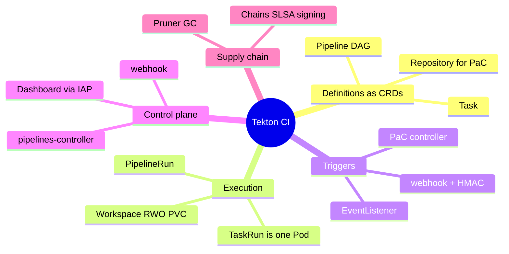
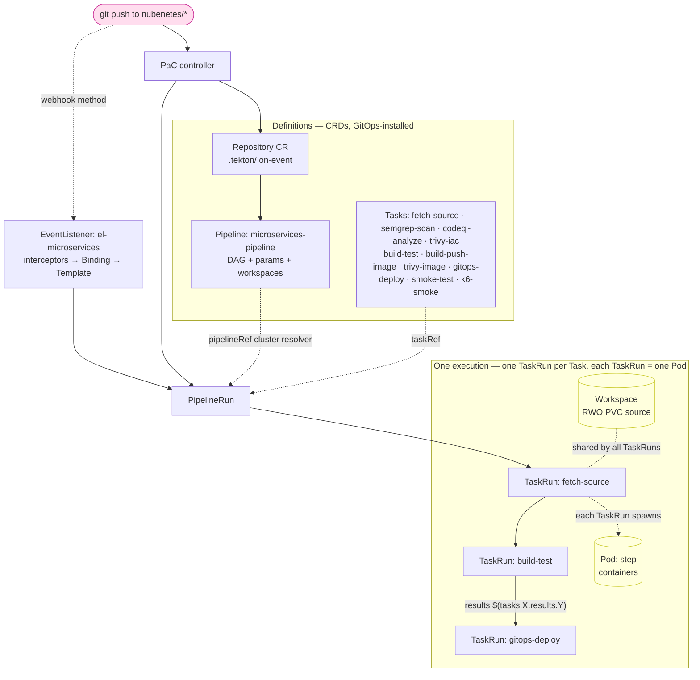
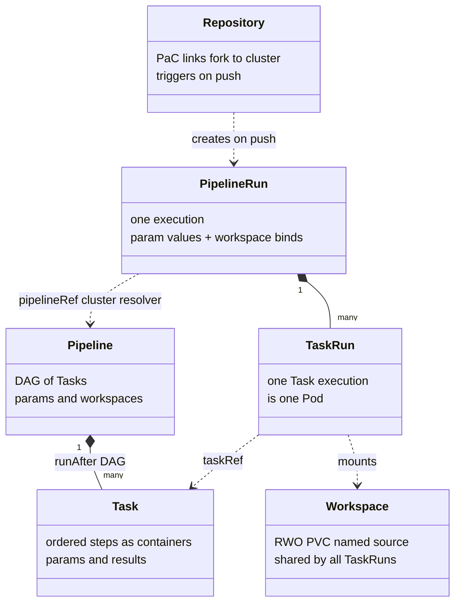
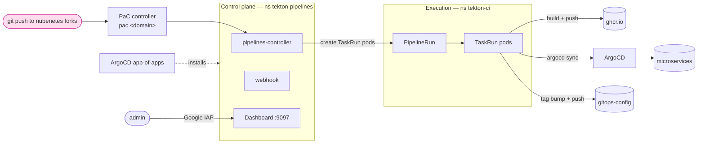
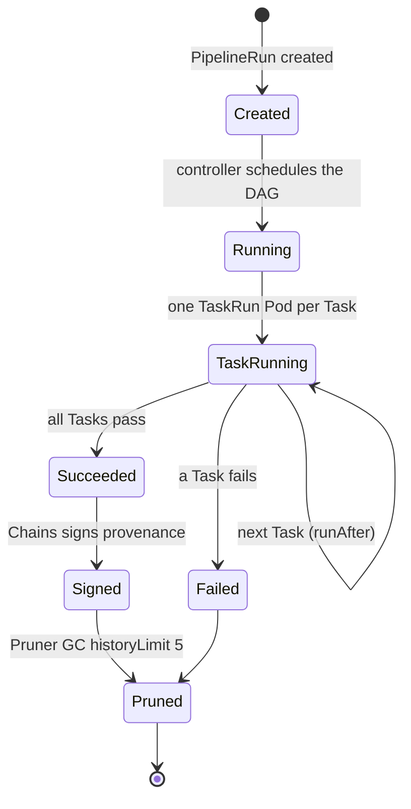
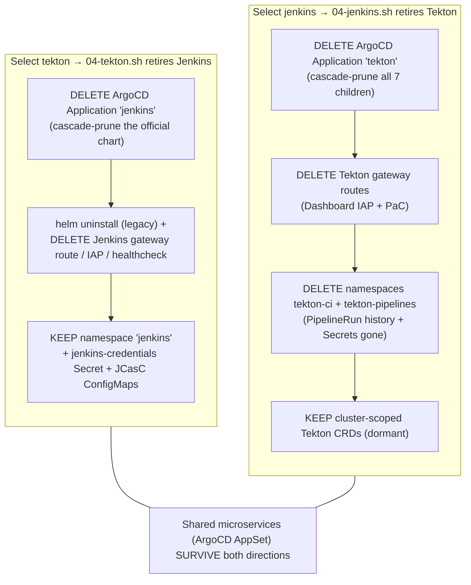
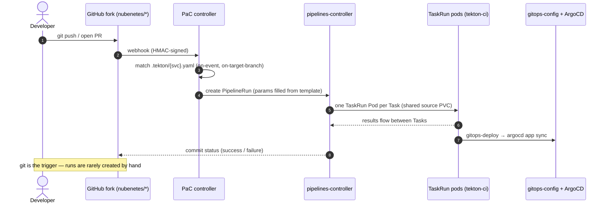
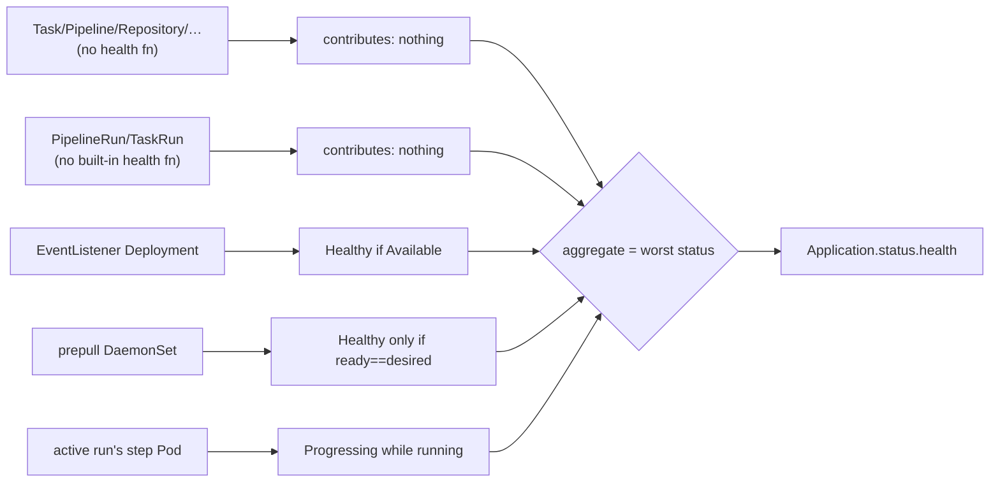

[← Previous: 402. Pipelines as Code](./402-PIPELINES_AS_CODE.md) | [🏠 Home](../README.md) | [→ Next: 404. GitHub Actions / ARC](./404-GITHUB_ACTIONS.md)

---

# 403. Tekton (alternative CI engine)

This project ships **four interchangeable CI engines**. Jenkins is the default;
**Tekton** is the Kubernetes-native alternative described here, selected by a single
feature flag. When Tekton is
chosen the platform installs Tekton Pipelines + Triggers + the official Tekton
Dashboard, exposes the Dashboard on the internet behind **Google IAP** (exactly
like Headlamp), and runs the **same microservices pipeline** ported to Tekton
Tasks/Pipelines under [`tekton/`](../tekton/).

> **See also — the other alternative engines.** [404. GitHub Actions / ARC](./404-GITHUB_ACTIONS.md)
> is the third CI engine (`ci.engine=githubactions`): GitHub Actions
> self-hosted runners via the Actions Runner Controller — ephemeral Spot runners on
> the `ci-spot` NAP ComputeClass, native GitHub webhooks, and **no** in-cluster
> Dashboard/IAP route (runs are viewed in GitHub's Actions tab).
> [405. Argo Workflows](./405-ARGO_WORKFLOWS.md) is the fourth (`ci.engine=argoworkflows`):
> the other Kubernetes-native alternative — Argo Workflows + Argo Events, with an
> IAP-protected **Argo Workflows Server UI** (`argo.<domain>`, like this Dashboard)
> plus a public, HMAC-protected **Argo Events webhook receiver** (`argo-events.<domain>`).

## Understanding Tekton (newcomers → specialists)

Tekton is **Kubernetes-native CI/CD**: there is no Jenkins-style controller running pipelines for you — every CI concept is a **Custom Resource** (CRD) the API server stores and the Tekton controllers reconcile. Read this section once and the rest of the doc is just "where each file lives".

<details>
<summary>🧠 Mental model — Tekton (mindmap)</summary>



</details>

**Reading it —** the five branches are the layers Tekton splits CI into: **Definitions** (the reusable CRDs), **Execution** (the per-run objects — each TaskRun is literally a Pod), **Triggers** (what turns a git event into a run), the **Control plane** that reconciles it all, and the **Supply-chain** add-ons. Everything is an API-server object — there is no engine state outside Kubernetes, which is the whole contrast with the Jenkins controller in [401](./401-JENKINS.md).

<details>
<summary>🟢 For newcomers — the mental model in 7 objects</summary>

| Object | What it is | Jenkins analogy |
|---|---|---|
| **Task** | An ordered list of **steps**, each step a container that runs a command. The unit of reuse. | A reusable stage / shared-library step |
| **Pipeline** | A **DAG of Tasks** (ordered with `runAfter`), passing data via params/results and sharing files via workspaces. | The `Jenkinsfile` (the pipeline definition) |
| **PipelineRun** | One **execution** of a Pipeline (with concrete param values + workspaces bound). Creating it *is* "start a build". | A build (`#123`) |
| **TaskRun** | One execution of one Task inside a PipelineRun. **Each TaskRun becomes one Pod** (its steps are that pod's containers). | A stage's agent pod |
| **Workspace** | A volume shared between Tasks in a run (here: one RWO PVC named `source`, cloned once and reused). | The agent workspace dir |
| **Params / Results** | Inputs to a Task/Pipeline / typed outputs a Task emits for later Tasks to consume. | Pipeline parameters / `env` passed between stages |
| **EventListener + Trigger** | A pod that receives webhooks and **creates a PipelineRun** from them. | The Jenkins webhook → job trigger |

So a CI run is literally: *something creates a `PipelineRun` CR → the Tekton controller creates a `TaskRun` per Task → each `TaskRun` is a Pod → results/workspaces flow between them → the run object records success/failure*. You watch it all in the **Tekton Dashboard** (behind IAP). You **rarely create runs by hand** — a `git push` does it (see *Pipelines-as-Code* below).

In this repo the pipeline is the JHipster microservices build ported 1:1 from the Jenkins shared library — pipeline tasks `fetch-source → semgrep-scan → codeql-analyze → trivy-iac → build-test → build-push-image → trivy-image → gitops-deploy → smoke-test → k6-smoke`, all sharing the one `source` workspace ([`tekton/pipelines/microservices-pipeline.yaml`](../tekton/pipelines/microservices-pipeline.yaml), tasks in [`tekton/tasks/`](../tekton/tasks/)).
</details>

<details>
<summary>🔴 For specialists — the moving parts and how they're wired here</summary>

**Control plane (namespace `tekton-pipelines`, GitOps-installed via the `argocd/tekton` app-of-apps, components vendored + pinned):**
- **`tekton-pipelines-controller`** reconciles PipelineRun/TaskRun → Pods, schedules the DAG, passes results.
- **`tekton-pipelines-webhook`** — admission (validation/defaulting) **and** conversion webhooks (`config.webhook.pipeline.tekton.dev` etc.). It self-generates its serving cert and injects the `caBundle` into its webhook configs; ArgoCD must **not** blank that caBundle — we set `ignoreDifferences` on `.clientConfig.caBundle` + `RespectIgnoreDifferences=true`, and crucially the app does **not** use `Replace=true` (which would `kubectl replace` the webhook config + ConfigMaps on every sync, re-triggering the webhook and blanking the caBundle; `ServerSideApply` only touches changed fields). On a fresh cluster ArgoCD's first sync can still race the cert (`x509` / `tls: unrecognized name`), which **self-heals** via the app's `syncPolicy.retry` (auto-retry with backoff) once the webhook is up — no script/manual restart. See [902 § Dataplane V2 enforcement](./902-TROUBLESHOOTING.md).
- **Remote resolvers**: `pipelineRef`/`taskRef` can be resolved from git, hub, bundles, or the **cluster** resolver. PaC `.tekton/` files here use the **cluster resolver** to reference the in-cluster `microservices-pipeline` (a github.com URL would be git-misclassified by kustomize, and a git resolver would re-fetch).

**Triggers (event → run):** [`tekton/triggers/eventlistener.yaml`](../tekton/triggers/eventlistener.yaml) runs an **EventListener** pod (`el-microservices`, ports 8080 event / 9000 metrics). A webhook POST flows: **interceptors** (GitHub signature check + CEL filtering) → **TriggerBinding** (extracts fields from the payload: repo, branch, sha…) → **TriggerTemplate** (renders a `PipelineRun` from those fields) → the controller runs it. RBAC: the `tekton-triggers-sa` may create PipelineRuns ([`tekton/rbac/triggers-rbac.yaml`](../tekton/rbac/triggers-rbac.yaml)).

**Pipelines-as-Code (PaC, the normal path):** the **PaC controller** (namespace `pipelines-as-code`, exposed at `pac.<domain>`) receives GitHub events directly and runs the `PipelineRun` declared in the repo's **`.tekton/`** directory, gated by annotations (`on-event`, `on-target-branch`). A **`Repository` CR** ([`tekton/pac/repositories.yaml`](../tekton/pac/repositories.yaml)) links each forked GitHub repo to this cluster. PaC supersedes the raw EventListener for the app repos; the EventListener remains for the webhook-method path. See [§ Pipelines-as-Code](#pipelines-as-code-pac-git-driven-ci).

**Execution namespace `tekton-ci`:** PipelineRuns + their ephemeral TaskRun pods run here (outbound-only; hardened with a deny-ingress baseline). The `tekton-ci` SA gets the RBAC the pipeline needs ([`tekton/rbac/pipeline-rbac.yaml`](../tekton/rbac/pipeline-rbac.yaml)): pull/push images, the OTel-injection self-heal in `gitops-deploy`, the smoke-test pod, and an ArgoCD token (`tekton-argocd` Secret) to `argocd app sync`.

**Workspaces & data flow:** the pipeline binds one **RWO PVC** `source` (cloned once by `fetch-source`, reused by every later Task — mirrors the single Jenkins agent workspace; an `affinity-assistant` co-schedules the TaskRuns onto one node so the RWO PVC mounts) plus a `dockerconfig` workspace for registry auth. Tasks pass small values via **results** (`$(tasks.X.results.Y)`) and params.

> **Where the run pods run — `tekton.runNodePool` (default `static`).** Because the affinity assistant forces *all* of a PipelineRun's TaskRuns onto **one** node (the only way to share an RWO PVC), that node must have headroom for the heaviest task. The placement is a **per-engine feature flag** (`tekton.runNodePool: static | ci-spot`, override `JENKINS2026_TEKTON_RUN_NODE_POOL`), applied as the Tekton **`default-pod-template`** in [`config-defaults`](../argocd/tekton/components/pipelines/kustomization.yaml) by [`scripts/06-tekton-pipelines.sh`](../scripts/06-tekton-pipelines.sh) (ArgoCD ignores that one field — see `ignoreDifferences` in [`pipelines.yaml`](../argocd/tekton/templates/pipelines.yaml)):
> - **`static` (default, recommended)** → `nodeSelector: {app: jenkins-2026}`: the assistant always lands on the **static pool** (`e2-standard-8`), never on a small NAP node. Without it a run could pin to a 2-vCPU node where a later/retried task (e.g. `codeql`) can't fit, and an affinity-pinned pod can't move or trigger a useful scale-up (a new node won't carry the assistant) → the run hangs in `ExceededNodeResources`. The static nodes always exist (no NAP/Spot/quota dependency).
> - **`ci-spot` (opt-in)** → the NAP Spot ComputeClass nodeSelector + tolerations (needs `nodeAutoProvisioning.enabled`): cheaper/elastic, but the **whole** PipelineRun rides one Spot node, so a preemption kills the entire run and SSD-quota pressure can stall it. Prefer `static` unless you specifically want Spot for Tekton.
>
> Jenkins exposes the symmetric `jenkins.runNodePool` flag, but the engines differ in *risk*: a Jenkins build is a single agent pod, so Spot preemption just restarts that one build (see [`docs/501`](501-PLATFORM_OPERATIONS.md) § Elastic Node Auto-Provisioning — full Jenkins-vs-Tekton-on-Spot comparison + the sequenced rollout).
>
> **Making Tekton-on-Spot actually safe (if you want it).** The single-node pinning is forced by the **shared RWO `source` workspace** + affinity assistant; it's not free to undo. Two re-architectures would let the assistant be disabled so Tasks spread across nodes (and ride Spot with a per-Task — not per-run — preemption blast radius):
> 1. **RWX workspace (GCP Filestore CSI).** A `ReadWriteMany` `source` PVC mounts on multiple nodes → set `disable-affinity-assistant: "true"` → Tasks schedule freely (incl. `ci-spot`), and a preemption only loses the one Task on that node. *Cost:* Filestore is heavier (min instance size + price) and adds infra — usually overkill for a PoC.
> 2. **No shared workspace — self-contained Tasks.** Each Task fetches what it needs (re-clone, or pull/push intermediate artifacts via GCS/object storage) instead of sharing a PVC. No affinity assistant needed. *Cost:* re-clone overhead + a real pipeline redesign (the clone-once data flow goes away).
>
> Until one of those lands, **`static` is the correct choice for Tekton** regardless of `SSD_TOTAL_GB` headroom — the hazard is the affinity-assistant/RWO coupling, not just quota.

**Supply chain & housekeeping:**
- **Chains** signs build provenance (SLSA-style attestations) for pushed images.
- **Pruner** garbage-collects old PipelineRuns/TaskRuns (`historyLimit`, the Tekton equivalent of Jenkins `buildDiscarder`) — keeping pod/image accumulation off the nodes.

**Observability:** controller metrics (`tekton_pipelines_controller_*`) are scraped into Prometheus and drive the *Tekton CI* Grafana dashboard; TaskRun pod logs land in Loki (`k8s_namespace_name=tekton-ci`). See [§ Observability](#observability).
</details>

#### Tekton object model & run flow

How a `git push` becomes running pods — the CRDs (definitions) on the left, one execution (the runtime objects) on the right:

<details>
<summary>🔀 Tekton object model & run flow</summary>



</details>

`runAfter` makes the DAG linear here (mirrors the single-agent Jenkins job); the shared RWO PVC is why an `affinity-assistant` co-schedules the TaskRun pods on one node. Chains signs the pushed image's provenance; Pruner GCs old PipelineRuns/TaskRuns.

#### Tekton CRD object model

The definitions-vs-execution split expressed as a class model (compare 401's `classDiagram` of the JCasC model — same idea, Kubernetes-native):

<details>
<summary>🧩 Tekton CRD object model (class diagram)</summary>



</details>

**Reading it —** a `Pipeline` composes many `Task`s (ordered by `runAfter`); at runtime a `PipelineRun` (one execution) composes one `TaskRun` **per Task** — and each `TaskRun` *is* a Pod. `pipelineRef`/`taskRef` resolve the definitions via the **cluster resolver**, every TaskRun mounts the shared RWO `source` Workspace, and a PaC `Repository` is what creates the PipelineRun on a push.

## High-level architecture

The same shape as 401/402's architecture views, in Tekton terms — GitOps install, a control plane, an execution namespace, and the GitOps handoff:

<details>
<summary>🏛️ High-level Tekton architecture</summary>



</details>

**Reading it —** a git push reaches the **PaC controller**, which asks the **control plane** (ns `tekton-pipelines`, installed by the ArgoCD app-of-apps) to create a `PipelineRun` in the **execution** namespace (ns `tekton-ci`); its TaskRun pods build+push the image, bump the GitOps tag, and drive ArgoCD — exactly the Jenkins data-flow from [402](./402-PIPELINES_AS_CODE.md), with the Dashboard fronted by Google IAP like Headlamp.

#### PipelineRun / TaskRun lifecycle

<details>
<summary>♻️ PipelineRun / TaskRun lifecycle (state diagram)</summary>



</details>

**Reading it —** the run lifecycle mirrors 401/402's build-lifecycle state diagrams: a `PipelineRun` goes `Created → Running`, spawns a `TaskRun` Pod per Task (advancing along the `runAfter` DAG), and ends `Succeeded` or `Failed`. The two Tekton-specific tail states are **Signed** (Chains records SLSA provenance on success) and **Pruned** (the Pruner GCs completed runs at `historyLimit: 5` — the parity knob for Jenkins' `buildDiscarder`).

## Selecting the engine

`ci.engine` in [`config/config.yaml`](../config/config.yaml) is the durable
default; `JENKINS2026_CI_ENGINE` is the **ephemeral override** — the same
durable-default + override pattern as `observability.mode` / `JENKINS2026_OBS_MODE`.

```yaml
# config/config.yaml
ci:
  engine: jenkins      # jenkins (default) | tekton | githubactions | argoworkflows
```

```bash
# one-off run with Tekton instead of Jenkins
JENKINS2026_CI_ENGINE=tekton scripts/up.sh
```

In CI, the **[`Day1.cluster.01-gke`](../.github/workflows/Day1.cluster.01-gke.yml)**
workflow exposes a `ci_engine` choice input (`jenkins` default, or `tekton` /
`githubactions` / `argoworkflows`) that flows to [`scripts/up.sh`](../scripts/up.sh)
as `JENKINS2026_CI_ENGINE`. The four engines are mutually exclusive on a given cluster.

[`scripts/lib/config.sh`](../scripts/lib/config.sh) validates the value
(`jenkins|tekton|githubactions|argoworkflows`) and exports `J2026_CI_ENGINE`,
which `up.sh`/`down.sh` and the numbered steps branch on:

| Step | `jenkins` | `tekton` | `githubactions` | `argoworkflows` |
|---|---|---|---|---|
| Install CI engine (`up.sh`) | [`04-jenkins.sh`](../scripts/04-jenkins.sh) | [`04-tekton.sh`](../scripts/04-tekton.sh) | [`04-githubactions.sh`](../scripts/04-githubactions.sh) | [`04-argoworkflows.sh`](../scripts/04-argoworkflows.sh) |
| Seed pipelines (`up.sh`) | [`06-seed-pipelines.sh`](../scripts/06-seed-pipelines.sh) | [`06-tekton-pipelines.sh`](../scripts/06-tekton-pipelines.sh) | [`06-githubactions-pipelines.sh`](../scripts/06-githubactions-pipelines.sh) | [`06-argoworkflows-pipelines.sh`](../scripts/06-argoworkflows-pipelines.sh) |
| Day2 redeploy | `Day2.redeploy.02-jenkins` | [`Day2.redeploy.03-tekton`](../.github/workflows/Day2.redeploy.03-tekton.yml) | `Day2.redeploy.06-githubactions` | `Day2.redeploy.07-argoworkflows` |
| Teardown (`down.sh`) | Helm uninstall | engine-agnostic (removes all engines) | engine-agnostic | engine-agnostic |

**The four engines are mutually exclusive.** A clean install only deploys the
selected engine ([`up.sh`](../scripts/up.sh) branches on `ci.engine`, so the other
three are never installed). Switching engines on a *running* cluster
**decommissions the other three in the same run**: each `scripts/04-<engine>.sh`
calls the shared **`retire_ci_engine`** helper ([`scripts/lib/common.sh`](../scripts/lib/common.sh))
once per sibling engine — deleting that engine's ArgoCD Applications (parent
app-of-apps + every child), clearing stuck GKE NEG finalizers, and deleting the
namespaces it owns (so its Gateway routes / IAP / Services go with them). This runs
on both `up.sh` and the `Day2.redeploy.*` paths. The shared microservices are
GitOps-managed by ArgoCD, so they survive the switch — only the CI engine itself
(and its public routing) changes.

### Switching engines on a running cluster — what's removed vs kept

Re-running `Day1.cluster.01-gke` (or the matching `Day2.redeploy.*`) with a
*different* engine **decommissions the previously-deployed one(s) in the same run**
— you never need a separate Decom. Each `04-<engine>.sh` calls the shared
`retire_ci_engine` helper for **every** sibling engine, so switching to Tekton
retires Jenkins **and** GitHub Actions/ARC **and** Argo Workflows if any is present.
The retirement is **best-effort + idempotent**, and the directions are **not
symmetric** (Tekton/GHA/Argo have dedicated namespaces that are reaped; Jenkins
shares the `jenkins` namespace, which is left intact). The jenkins↔tekton pair
below is the representative example; the GHA (`arc-systems`/`arc-runners`) and
Argo Workflows (`argo`/`argo-events`/`argo-ci`) engines retire the same way.

<details>
<summary>🔁 Switching engines — what's removed vs kept</summary>



</details>

**Side-by-side (the asymmetry):**

| Action | tekton → **jenkins** ([`04-jenkins.sh`](../scripts/04-jenkins.sh)) | jenkins → **tekton** ([`04-tekton.sh`](../scripts/04-tekton.sh)) |
|---|---|---|
| Delete the outgoing engine's ArgoCD app | ✅ `tekton` (app-of-apps, 7 children) | ✅ `jenkins` (single Application) |
| Delete its public Gateway routing | ✅ Dashboard IAP **+ PaC** route | ✅ Jenkins IAP route **+ HealthCheckPolicy** |
| Legacy Helm uninstall | — (Tekton is kustomize/vendored) | ✅ `helm uninstall` fallback |
| **Delete the outgoing namespace(s)** | ✅ **`tekton-ci` + `tekton-pipelines`** (history + Secrets removed) | ❌ **keeps `jenkins`** ns + `jenkins-credentials` + JCasC CMs |
| Cluster-scoped CRDs | Tekton CRDs left **dormant** (fast re-enable) | n/a (Jenkins ships none) |
| Shared microservices (GitOps) | **survive** | **survive** |
| Reversible | ✅ switch back re-applies | ✅ switch back re-applies |
| External residue | — | PaC **webhooks + `.tekton/`** on the `nubenetes/*` forks remain (point at a now-gone `pac.<domain>`; harmless, re-activate on switch-back) |

**Why asymmetric:** Tekton owns dedicated namespaces (`tekton-ci`, `tekton-pipelines`)
that can be fully reaped without collateral, so they are deleted (you lose the
PipelineRun history and the `tekton-*`/`k6-cloud`/`pac-webhook` Secrets — all
recreated on switch-back). Jenkins lives in the shared `jenkins` namespace that
[`01-namespaces.sh`](../scripts/01-namespaces.sh) manages and **reuses** (the admin password persists there), so
the retirement is deliberately *less* destructive — it removes the controller +
routing but keeps the namespace and credentials for a fast switch-back. In **both**
directions a clean install of the *selected* engine never deploys the other
(`up.sh` branches on `ci.engine`), and the shared microservices are untouched.

### Namespace layout

The shared GKE **Gateway** (the single public-ingress entrypoint for *every* app)
lives in its **own engine-neutral namespace `platform-ingress`** (`gateway.namespace`
/ `J2026_GATEWAY_NAMESPACE`), **always created**, decoupled from any CI engine. The
**`jenkins` namespace is engine-gated** — created only when `ci.engine=jenkins` (it
holds just the Jenkins controller + `jenkins-credentials`). Switching engines, or
deleting an engine's namespace, therefore **never touches the ingress**.

> Each app's `HTTPRoute` lives in its own namespace and attaches to the Gateway
> **cross-namespace** (the Gateway sets `allowedRoutes.namespaces.from: All`); the
> per-service `GCPBackendPolicy` (IAP) lives beside each Service.

| Namespace | Created when | Holds |
|---|---|---|
| `platform-ingress` | **always** | the shared **Gateway** (public ingress for every app) |
| `jenkins` | `ci.engine=jenkins` | Jenkins controller + `jenkins-credentials` Secret |
| `tekton-pipelines` | `ci.engine=tekton` | Tekton control plane (Pipelines / Triggers / Dashboard / Pruner) |
| `tekton-ci` | `ci.engine=tekton` | PipelineRuns, Tasks, the `tekton-ci` SA + its Secrets |
| `pipelines-as-code` | `ci.engine=tekton` | PaC controller |
| `tekton-chains` | `ci.engine=tekton` | Chains controller (cosign signing) |
| `arc-systems` | `ci.engine=githubactions` | ARC controller + CRDs |
| `arc-runners` | `ci.engine=githubactions` | AutoscalingRunnerSet + ephemeral runner pods + creds |
| `argo` | `ci.engine=argoworkflows` | Argo Workflows control plane (controller + Server UI) |
| `argo-events` | `ci.engine=argoworkflows` | Argo Events controller-manager + EventBus |
| `argo-ci` | `ci.engine=argoworkflows` | where Workflows execute (SA, creds, RBAC, the `argoworkflows/` pac) |
| `observability`, `headlamp`, `microservices`, `argocd`, `platform-postgres`/pgAdmin | always | engine-neutral platform |

**Why this layout:** the four engines are mutually exclusive, so each owns self-named
namespaces created only when selected (`jenkins` truly jenkins-only; `tekton-*`
only in tekton mode; `arc-*` only for GitHub Actions/ARC; `argo`/`argo-events`/`argo-ci`
only for Argo Workflows). Shared platform infra — above all the **Gateway** — lives in
neutral always-on namespaces (`platform-ingress`, `observability`, `argocd`…) so it
survives engine switches and can't be taken down by deleting an engine's namespace.
The Tekton control-plane namespace can't be renamed — the upstream release YAMLs
hardcode `tekton-pipelines`.

> **History:** the Gateway originally lived in the `jenkins` namespace, which coupled
> all public access to a CI engine — deleting that namespace on a tekton cluster
> cascade-deleted the Gateway and took everything down. It was moved to
> `platform-ingress` to decouple it.

## What gets installed (GitOps via ArgoCD app-of-apps)

Tekton is **GitOps-managed by ArgoCD**, the same app-of-apps pattern as
[`argocd/observability-oss`](../argocd/observability-oss) and
[`argocd/platform-postgres`](../argocd/platform-postgres).
[`scripts/04-tekton.sh`](../scripts/04-tekton.sh) applies the parent Application
[`argocd/tekton-app.yaml`](../argocd/tekton-app.yaml) (substituting repo/branch,
exactly like the other app-of-apps), which renders seven child Applications:

| Child Application | Source | Sync wave | Notes |
|---|---|---|---|
| `tekton-pipelines` | [`argocd/tekton/components/pipelines`](../argocd/tekton/components/pipelines) (vendored `v1.13.1` `release.yaml`) | 0 | the engine + CRDs |
| `tekton-triggers` | [`argocd/tekton/components/triggers`](../argocd/tekton/components/triggers) (vendored `v0.36.0` release + interceptors) | 1 | API/webhook-driven runs |
| `tekton-dashboard` | [`argocd/tekton/components/dashboard`](../argocd/tekton/components/dashboard) (vendored `v0.69.0` `release-full.yaml`) | 1 | **read-write** GUI; no native auth |
| `tekton-pruner` | [`argocd/tekton/components/pruner`](../argocd/tekton/components/pruner) (vendored `v0.4.0`) | 1 | GC of completed runs — `historyLimit: 5` (deliberately lower than Jenkins' `buildDiscarder` 20, to keep pod/image accumulation off the 50 GiB node disk) |
| `tekton-chains` | [`argocd/tekton/components/chains`](../argocd/tekton/components/chains) (vendored `v0.27.1`) | 1 | supply-chain: x509/cosign image signing + in-toto SLSA provenance + Rekor; own `tekton-chains` ns |
| `tekton-pac` | [`argocd/tekton/components/pac`](../argocd/tekton/components/pac) (vendored `v0.48.0`) | 1 | Pipelines-as-Code controller; own `pipelines-as-code` ns; webhook receiver exposed at `pac.<baseDomain>` |
| `tekton-pipeline-as-code` | [`tekton/`](../tekton/) (Tasks/Pipelines/Triggers/RBAC + the `tekton-ci` SA) | 2 | the ported pipeline; lands in the `tekton-ci` namespace |

The component manifests are **vendored** under `argocd/tekton/components/*/`
(`release*.yaml`) — Tekton now ships these only as GitHub release assets (not on
the GCS bucket), and a `github.com` URL would be misclassified by kustomize as a
git repo, so vendoring is the reliable, auditable choice. Versions are kept in
sync with `ci.tekton.versions` in [`config/config.yaml`](../config/config.yaml). The large Tekton CRDs are
handled the same way as the CNPG operator (`ServerSideApply=true` + `Replace=true`
+ `ServerSideDiff=true`). The credential Secrets are **not** GitOps-managed (they
hold env-sourced secrets) — [`01-namespaces.sh`](../scripts/01-namespaces.sh) / [`08.5-argocd.sh`](../scripts/08.5-argocd.sh) create them
imperatively; an SA may reference Secrets that don't exist yet, so ordering is
fine. ArgoCD requires [`08.5-argocd.sh`](../scripts/08.5-argocd.sh) to run first (it already does in [`up.sh`](../scripts/up.sh)).

## Tooling: kustomize vs Helm (and why both)

Deploying Tekton through ArgoCD deliberately mixes **Helm** and **kustomize** —
each layer uses the tool that fits it best, rather than forcing one tool
everywhere. The choice per layer:

| Layer | Tool used | Why this tool (and not the other) |
|---|---|---|
| **App-of-apps parent** (`argocd/tekton/`) | **Helm** | The wrapper must *template* `repoURL`/`targetRevision` (and could template versions) down into the child Applications. That per-environment templating is exactly what Helm does cleanly and what the repo already does for `observability-oss`/`platform-postgres`. Kustomize templates this only awkwardly (vars/replacements). |
| **Upstream components** (Pipelines / Triggers / Dashboard) | **kustomize** over the pinned official release YAML | **Tekton has no official Helm chart.** **All** upstream components are **vendored** — the pinned release YAMLs are committed in-tree under [`argocd/tekton/components/*/`](../argocd/tekton/) — because Tekton publishes recent releases only as GitHub release assets (not on the GCS bucket), and a `github.com` URL is misclassified by kustomize as a git repo. Helm here would mean adopting an unofficial community chart — version lag + a third-party trust dependency for a security-sensitive CI engine. |
| **Pipelines-as-code** (`tekton/` Tasks/Pipelines/Triggers/RBAC) | **plain manifests** (ArgoCD directory source) | Static custom resources with no per-environment templating need; neither Helm nor kustomize adds value. Per-run values are supplied as Tekton **params** at `PipelineRun` time, not at apply time. |

### Why not "all Helm"

There is **no official Tekton Helm chart** — upstream ships release YAMLs. Using
a community chart would (a) rarely carry the exact pinned version (e.g.
`v1.13.1`), and (b) insert a third party into the supply chain of the CI engine.
Pinning the official, vendored release manifest is the stronger
posture. (Contrast: `observability-oss` *does* use Helm for its children —
because kube-prometheus-stack/Loki/Tempo *have* well-maintained official charts.)

### Why not "all kustomize"

The app-of-apps parent has to flow `repoURL`/branch into N child Applications per
environment. Helm values do this in one line; kustomize would need clunky
`replacements`/`vars` and diverge from the established `observability-oss` /
`platform-postgres` pattern. So the wrapper stays Helm.

### The one trade-off

Because the component manifests are vendored files (not Helm-templated), the
**versions are pinned by the vendored `argocd/tekton/components/*/release*.yaml`**,
not flowed from `config.yaml`. `ci.tekton.versions` documents the intended
versions; keep the two in sync when bumping (re-download the release file). (An optional future refinement is to turn the
[`tekton/`](../tekton/) pipelines-as-code into a small Helm chart to inject the observability
namespace and tool-image versions — but the *component* versions would still
live in the kustomizations regardless.)

## Dashboard on the internet, behind Google IAP

The Tekton Dashboard has **no built-in authentication** — it relies on an
upstream auth proxy. This project gates it at the edge with Google IAP, the
identical model used for Headlamp:
[`scripts/09-gateway.sh`](../scripts/09-gateway.sh) emits an `HTTPRoute`
(`tekton.<baseDomain>` → `tekton-dashboard:9097`) and a `GCPBackendPolicy`
(`tekton-iap`) that reuses the existing `gateway-iap-oauth` secret and the
project-level `roles/iap.httpsResourceAccessor` already granted to the admin
emails by `terraform/gke` — so **no new OAuth client and no Terraform change**
are needed. Access is restricted to the same Google accounts as Headlamp/Jenkins.

```
https://tekton.<baseDomain>   →  Google IAP login  →  Tekton Dashboard
```

## The pipeline, ported

The full Jenkins microservices pipeline ([`vars/MicroservicesPipeline.groovy`](../vars/MicroservicesPipeline.groovy))
is ported to Tekton under [`tekton/`](../tekton/) — **one Task per stage**, wired
into `microservices-pipeline`. All four engines read **the same service registry**
([`jenkins/pipelines/seed/services.yaml`](../jenkins/pipelines/seed/services.yaml))
and share the same gateway build-time patch
([`resources/patch-app-source.sh`](../resources/patch-app-source.sh)).

| Jenkins stage | Tekton Task | Notable difference |
|---|---|---|
| Checkout (+ gateway patch) / infra | `fetch-source` | — |
| Semgrep SAST + SARIF upload | `semgrep-scan` | — |
| CodeQL Analysis + SARIF upload | `codeql-analyze` | — |
| Trivy IaC scan | `trivy-iac` | — |
| Build & Test | `maven-build-test` | — |
| Build & Push image | `build-push-image` | **daemonless**: Jib (java) / Kaniko (angular) — no privileged DinD |
| Trivy image scan | `trivy-image` | — |
| Deploy (GitOps + ArgoCD + OTel self-heal) | `gitops-deploy` | ported verbatim |
| Smoke test | `smoke-test` | — |
| Integration k6 | `k6-smoke` (+ standalone `microservices-k6-smoke` Pipeline) | — |

[`scripts/06-tekton-pipelines.sh`](../scripts/06-tekton-pipelines.sh) is the
**seed-job analogue**: it applies the Tasks/Pipelines/Triggers and generates one
`PipelineRun` per service per environment (stable always; develop when
`JENKINS2026_DEVELOP_TRACK_ENABLED=true`), kicking them asynchronously.

### Credentials & RBAC

Created by [`scripts/01-namespaces.sh`](../scripts/01-namespaces.sh) /
[`scripts/08.5-argocd.sh`](../scripts/08.5-argocd.sh) in the `tekton-ci`
namespace, from the same `REGISTRY_*` / `GIT_*` env the Jenkins path consumes:

- `tekton-registry` — ghcr.io dockerconfigjson (Jib/Kaniko/Trivy via `DOCKER_CONFIG`)
- `tekton-git` — git basic-auth, annotated `tekton.dev/git-0` (clone/push) + read as env for SARIF upload
- `tekton-argocd` — ArgoCD API token (account `tekton`, provisioned by `08.5-argocd.sh`)
- `tekton-github-webhook-secret` — optional GitHub HMAC token for the EventListener

## How CI runs in normal operation (you rarely start runs by hand)

Day-to-day you **don't create PipelineRuns manually** — runs are produced
automatically by one of two models (the manual options in the next section are
for ad-hoc/debug only):

| Model | Active when | How a run starts |
|---|---|---|
| **Pipelines-as-Code (PaC)** — *primary* | gateway enabled + PaC controller up (the default GKE deploy) | A **push or PR** to a `nubenetes/*` app fork → the fork's `.tekton/<svc>.yaml` + its GitHub **webhook** → the PaC controller creates a `PipelineRun` of `microservices-pipeline` in `tekton-ci`, with every param filled from the template. **Git is the trigger.** |
| **Seed** — *fallback* | no gateway/PaC (e.g. local `up.sh`) | `06-tekton-pipelines.sh` kicks **one PipelineRun per service per env** directly — the Tekton analogue of the Jenkins seed job. |

So the normal loop is **commit to the app fork → CI runs itself** (the same model as Jenkins multibranch). `06-tekton-pipelines.sh` runs **once per deploy** only to wire it up: in PaC mode it creates the per-fork webhooks and pushes `.tekton/<svc>.yaml`; in fallback mode it seeds the runs. After that, you don't touch it.

<details>
<summary>🚀 PaC: git push → PipelineRun (sequence)</summary>



</details>

**Reading it —** the Git-driven happy path, the Tekton analogue of a Jenkins build trigger. A push/PR fires the fork's **HMAC-signed webhook** to the PaC controller, which matches the repo's `.tekton/<svc>.yaml` annotations, fills every param from the template, and creates the `PipelineRun`; the controller fans it into one TaskRun Pod per Task (sharing the `source` PVC) and reports a **commit status** back to GitHub. As with Jenkins multibranch, *git is the trigger* — you rarely create runs by hand.

**Housekeeping is automatic too:**
- **Tekton Pruner** garbage-collects completed PipelineRuns/TaskRuns (`historyLimit`, parity with the Jenkins `buildDiscarder`) — old runs don't pile up.
- **Tekton Chains** signs the pushed image + records SLSA provenance on every successful run (cosign key in `tekton-chains`).
- Watch runs in the **Dashboard** (`tekton.<baseDomain>`, behind IAP) or with `tkn pr list -n tekton-ci`.

**The k6 smoke** has two forms: `microservices-pipeline` runs a quick `k6-smoke` task at the end of every per-push run; the **standalone `microservices-k6-smoke` Pipeline** (analogue of the separate Jenkins k6 job) is *not* auto-triggered — run it on demand (below) or via [`Day2.traffic.01-k6`](../.github/workflows/Day2.traffic.01-k6.yml) for a longer load simulation.

## Running a pipeline by hand (Dashboard / kubectl / tkn)

The Pipelines/Tasks live in the **`tekton-ci`** namespace and run under the
**`tekton-ci`** ServiceAccount (it carries the registry/git/argocd creds above).
The two Pipelines you can start manually are:

| Pipeline | What it does | Key params |
|---|---|---|
| `microservices-k6-smoke` | the standalone k6 smoke test (analogue of the Jenkins `microservices-k6-smoke` job) | `target-namespace`, `env-name`, `vus`, `iterations`, `otlp-endpoint` |
| `microservices-pipeline` | the full per-service CI (SAST → build → image → scan → GitOps deploy → smoke) | `service-name`, `service-type`, `git-repo-url`, `git-branch`, `target-namespace`, `image`, `otlp-endpoint`, … |

In normal operation you don't start these by hand — **PaC** runs `microservices-pipeline`
on every push/PR (see below), and `06-tekton-pipelines.sh` seeds the per-service runs.
Start them manually for ad-hoc runs, debugging, or to fire the k6 smoke on demand.

> `otlp-endpoint` for in-cluster runs is
> `http://otel-collector-gateway.observability.svc.cluster.local:4317` (k6/pipeline
> metrics → the collector → your backend). Leave it empty to skip OTLP.

### Option A — Tekton Dashboard (GUI, behind IAP)

Open `https://tekton.<baseDomain>` (Google IAP login, [§ Dashboard](#dashboard-on-the-internet-behind-google-iap)). The Dashboard is **read-write**.

> **⚠️ The Dashboard's _visual_ "Create PipelineRun" form cannot bind workspaces — by design, in every version.** This is the key thing to understand before reaching for the GUI:
>
> - All pipeline **params** default (to the gateway service), and the **ServiceAccount** is handled cluster-wide (we set `default-service-account: tekton-ci` in `config-defaults`, so a run created without an SA uses `tekton-ci` instead of the powerless `default`).
> - But the visual form has **no field to bind a workspace at all**. Binding/selecting workspaces in the GUI has been an open Tekton feature request since **2020** — [tektoncd/dashboard#1283](https://github.com/tektoncd/dashboard/issues/1283) (still open, roadmap *Todo*), see also [tektoncd/pipeline#6144](https://github.com/tektoncd/pipeline/issues/6144) and [#5635](https://github.com/tektoncd/pipeline/issues/5635). It is **not** a misconfiguration on our side and **not** fixed by upgrading the Dashboard (latest as of writing still lacks it).
> - So a visually-filled `Create` of `microservices-pipeline` **always** fails with `pipeline requires workspace with name "source" be provided by pipelinerun`, because this pipeline's 9 tasks share a **required** `source` PVC (and `dockerconfig`). Tekton has no "default workspace binding" to fall back on.
>
> **When the visual form _is_ fine:** pipelines that declare **no** workspaces (it fully works there, params pre-filled), or quick param-only tweaks. The limitation is specifically *visual-form + a pipeline with required workspaces* — which is exactly this one.

**The one-click-equivalent path** — use the ready-made manifests in [`tekton/runs/`](../tekton/runs/) which already set the SA + workspaces:

1. **First run**: in **PipelineRuns → Create**, switch the form to **YAML mode** and paste [`tekton/runs/gateway.yaml`](../tekton/runs/gateway.yaml) (or [`jhipstersamplemicroservice.yaml`](../tekton/runs/jhipstersamplemicroservice.yaml) / [`k6-smoke.yaml`](../tekton/runs/k6-smoke.yaml)), then **Create**. (Same content as `kubectl create -f` in Option B.)
2. **Every run after that is truly one-click**: open that PipelineRun and click **Rerun** — it reuses the exact SA, workspaces, and params. This is the closest equivalent to the Jenkins one-click build.

There is **no** hand-fill path in the *visual* form that succeeds for this pipeline (no workspace field — see the limitation above), so for `microservices-pipeline` the supported manual options are: the **YAML mode** of the Create dialog (paste a `tekton/runs/*.yaml`), **Rerun** of an existing/seeded run, or `kubectl create` (Option B). All three carry the `source`/`dockerconfig` bindings the visual form cannot.

> **Pre-populate the Dashboard from the first Day1** — `tekton.seedRuns` (or `JENKINS2026_TEKTON_SEED_RUNS`) is **`true` by default**. [`scripts/06-tekton-pipelines.sh`](../scripts/06-tekton-pipelines.sh) seeds one PipelineRun per service from [`tekton/runs/`](../tekton/runs/) during provisioning, so the Dashboard lists runnable entries you can **Rerun** with one click immediately — no first paste/`kubectl create` needed. The trade-off: it runs **one build per service per Day1**; set it `false` to skip (PaC's git-push trigger is the normal way to start runs). This is a CI-engine convenience only — it does not change how PaC works.

> **Access URLs on every run (the Tekton parity for the Jenkins banner)** — Tekton's
> upstream Dashboard has no system-message banner, so [`scripts/06-tekton-pipelines.sh`](../scripts/06-tekton-pipelines.sh)
> stamps the platform's public URLs as `jenkins2026.io/url-*` annotations onto **every**
> PipelineRun it seeds (the PaC `.tekton/<svc>.yaml` pushed to the forks, the
> `tekton.seedRuns` runs, and the local fallback runs alike). Open any run in the
> Dashboard's detail view and its metadata lists `url-microservices`,
> `url-microservices-develop` (when `microservices.developTrackEnabled`),
> `url-tekton-dashboard`, `url-argocd`, `url-headlamp`, `url-pgadmin` and
> `url-grafana` (oss mode) — the same engine-neutral set [`scripts/09-gateway.sh`](../scripts/09-gateway.sh)
> exposes. They are a no-op when the Gateway is disabled (`gateway.baseDomain=""`).

### Option B — `kubectl create` (a PipelineRun manifest)

The repo ships ready-to-run manifests in [`tekton/runs/`](../tekton/runs/) (SA + workspaces already set) — the simplest path:

```bash
kubectl create -f tekton/runs/gateway.yaml                       # build the gateway
kubectl create -f tekton/runs/jhipstersamplemicroservice.yaml    # build the other service
kubectl create -f tekton/runs/k6-smoke.yaml                      # run the k6 smoke test
```

They use `generateName`, so `kubectl create` (not `apply`) gives a fresh run each time. Inline equivalents if you'd rather hand-roll one:

```yaml
# k6-run.yaml
apiVersion: tekton.dev/v1
kind: PipelineRun
metadata:
  generateName: k6-smoke-manual-
  namespace: tekton-ci
spec:
  taskRunTemplate:
    serviceAccountName: tekton-ci
  pipelineRef:
    name: microservices-k6-smoke
  params:
    - {name: target-namespace, value: microservices}
    - {name: env-name, value: stable}
    - {name: vus, value: "5"}
    - {name: iterations, value: "50"}
    - {name: otlp-endpoint, value: "http://otel-collector-gateway.observability.svc.cluster.local:4317"}
  workspaces:
    - name: source
      volumeClaimTemplate:
        spec:
          accessModes: ["ReadWriteOnce"]
          resources: {requests: {storage: 2Gi}}
```

```bash
kubectl create -f k6-run.yaml                 # start it
kubectl get pipelinerun -n tekton-ci -w       # watch status
```

**`microservices-pipeline` has a valid default for every param** (the `gateway`
service happy-path), so it runs **with zero params** — you only bind the two
workspaces (`source` VCT + `dockerconfig` from the `tekton-registry` Secret). The
minimal 1-click PipelineRun:

```yaml
apiVersion: tekton.dev/v1
kind: PipelineRun
metadata:
  generateName: gateway-manual-
  namespace: tekton-ci
spec:
  taskRunTemplate: {serviceAccountName: tekton-ci}
  pipelineRef: {name: microservices-pipeline}     # all params default to 'gateway'
  workspaces:
    - name: source
      volumeClaimTemplate:
        spec: {accessModes: ["ReadWriteOnce"], resources: {requests: {storage: 4Gi}}}
    - name: dockerconfig
      secret:
        secretName: tekton-registry
        items: [{key: .dockerconfigjson, path: config.json}]
```

> From the **Tekton Dashboard**: *Pipelines → microservices-pipeline → Create
> PipelineRun*, leave the params as-is (defaults), set SA `tekton-ci`, bind `source`
> as a VolumeClaimTemplate and `dockerconfig` to the `tekton-registry` Secret → Create.

To build a **different service**, override `service-name` *and* its related params
together. Full example for `gateway` (every param spelled out — copy + tweak for
`jhipstersamplemicroservice`):

```yaml
# gateway-run.yaml
apiVersion: tekton.dev/v1
kind: PipelineRun
metadata:
  generateName: gateway-manual-
  namespace: tekton-ci
spec:
  taskRunTemplate:
    serviceAccountName: tekton-ci
  pipelineRef:
    name: microservices-pipeline
  params:
    - {name: service-name,  value: gateway}
    - {name: service-type,  value: java}
    - {name: git-repo-url,  value: https://github.com/nubenetes/jhipster-sample-app-gateway.git}
    - {name: git-branch,    value: main}
    - {name: target-namespace, value: microservices}
    - {name: env-name,      value: stable}
    - {name: port,          value: "8080"}
    - {name: health-path,   value: /management/health}
    - {name: image,         value: ghcr.io/nubenetes/jenkins-2026-microservices/gateway:main}
    - {name: registry-host, value: ghcr.io}
    - {name: otlp-endpoint, value: "http://otel-collector-gateway.observability.svc.cluster.local:4317"}
  workspaces:
    - name: source
      volumeClaimTemplate:
        spec:
          accessModes: ["ReadWriteOnce"]
          resources: {requests: {storage: 4Gi}}
    - name: dockerconfig
      secret:
        secretName: tekton-registry
        items:
          - {key: .dockerconfigjson, path: config.json}
```

Param values come from [`jenkins/pipelines/seed/services.yaml`](../jenkins/pipelines/seed/services.yaml)
(per-service `name`/`type`/`repoUrl`/`port`/`healthPath`) and `microservices.registry`
in [`config/config.yaml`](../config/config.yaml) (`image` = `<registry>/<name>:<branch>`,
`registry-host` = the registry host). For `jhipstersamplemicroservice` change
`service-name`, `git-repo-url` (…`-microservice.git`), `port: "8081"`, and `image`
accordingly. The easiest hands-off alternative is just to **push to the fork** —
PaC then fills every param from the `.tekton/<svc>.yaml` template automatically.

### Option C — `tkn` CLI

```bash
# install: https://tekton.dev/docs/cli/
tkn pipeline start microservices-k6-smoke -n tekton-ci \
  --serviceaccount tekton-ci \
  --param target-namespace=microservices \
  --param env-name=stable --param vus=5 --param iterations=50 \
  --param otlp-endpoint=http://otel-collector-gateway.observability.svc.cluster.local:4317 \
  --workspace name=source,volumeClaimTemplateFile=/dev/stdin <<'EOF' \
  --showlog
spec:
  accessModes: ["ReadWriteOnce"]
  resources: {requests: {storage: 2Gi}}
EOF
```

`tkn pipeline start --use-param-defaults` accepts the defaults for everything you
omit. Watch any run with `tkn pipelinerun logs -f -n tekton-ci` (or `tkn pr list -n tekton-ci`).

If k6 cloud streaming is enabled (`K6_CLOUD_TOKEN`/`K6_CLOUD_PROJECT_ID`), the
run also uploads to Grafana Cloud k6 and prints the `…/a/k6-app/projects/<id>` URL
(see [`docs/103` §10](./103-GITHUB_SECRETS_INVENTORY.md)).

## Triggers

[`tekton/triggers/`](../tekton/triggers/) installs an `EventListener` + `TriggerTemplate` +
`TriggerBinding` (GitHub HMAC interceptor) so runs can be kicked via API/webhook.
The upstream JHipster app repos aren't owned by this project, so push webhooks
can't be wired to them — for the seed-script CI model the EventListener is for
parity and manual/CI re-runs. For full Git-driven CI see **Pipelines-as-Code**
below, which supersedes hand-rolled Triggers.

## Pipelines-as-Code (PaC): Git-driven CI

> **Naming:** `tektoncd/pipelines-as-code` (PaC) is a **distinct upstream
> product** — not to be confused with the `tekton-pipeline-as-code` ArgoCD
> Application (which is just the name for syncing the `tekton/` Tasks/Pipelines
> dir). PaC is the modern, Git-driven Tekton CI model (also what OpenShift
> Pipelines uses): `.tekton/*.yaml` PipelineRuns live **in each app repo** and
> run automatically on **PR/push**, reporting status back to GitHub.

### Prerequisite: owning the repos (fork to `nubenetes/*`)

PaC must integrate with the Git provider of the repos it builds — impossible on
the upstream `jhipster/*` repos (not ours). So the JHipster sample apps are
**forked into the `nubenetes` org** (`nubenetes/jhipster-sample-app-gateway`,
`nubenetes/jhipster-sample-app-microservice`) and
[`services.yaml`](../jenkins/pipelines/seed/services.yaml) points at the forks;
PaC then drives CI on those owned forks (with `.tekton/` PipelineRuns committed in each).

### Two ways to connect PaC to GitHub — and which we use

| Method | Setup | Automatable? | Status reporting |
|---|---|---|---|
| **GitHub App** | one App on the org, installed on the repos | ❌ needs a **manual browser step** (manifest "Create"/UI; there is no `gh app create` / API to create an App headlessly) | Checks API (rich) + native `/retest` |
| **Webhook + token** ✅ **(chosen)** | per-repo webhook + a PAT | ✅ **fully scriptable** via `gh`/API on repos we own | commit statuses |

**Decision: the webhook method**, because it is **end-to-end automatable** for
repos we own — no human-in-the-browser. The trade-off (status surfaced as commit
statuses rather than the richer Checks API, and no App-native `/retest`) is
acceptable for this PoC.

### How the webhook method is wired (all automated)

- **PaC controller exposed publicly** via an `HTTPRoute` (`pac.<baseDomain>` →
  `pipelines-as-code-controller:8080`) — **without IAP** (GitHub must reach it;
  it is protected by the webhook **HMAC secret** instead).
- A PaC **`Repository` CR** per fork (in the pipeline namespace) referencing a
  Secret with the **PAT** (`github.token`, reusing `GIT_TOKEN`, `repo` scope —
  used to clone and to post commit statuses) and the **webhook secret**.
- A **webhook on each fork**, created via `gh api repos/nubenetes/<repo>/hooks`
  (URL = the PaC controller route, `secret` = the webhook secret, events =
  `push`, `pull_request`). The `gh`/`GIT_TOKEN` `repo` scope
  already covers webhook management on org-owned repos — so this needs **no
  manual GitHub UI**.
- **`.tekton/<svc>.yaml`** in each fork: a `PipelineRun` annotated
  `pipelinesascode.tekton.dev/on-event` / `on-target-branch` that references the
  in-cluster `microservices-pipeline` (params per service). These are **generated
  and pushed to the forks by [`scripts/06-tekton-pipelines.sh`](../scripts/06-tekton-pipelines.sh)** (from
  [`services.yaml`](../jenkins/pipelines/seed/services.yaml)) — the same script that creates the webhooks — so the forks need
  no manual setup; that first push is what triggers the initial run.
- The HMAC secret comes from **`PAC_WEBHOOK_SECRET`** (GitHub Actions secret) if
  set, else [`06-tekton-pipelines.sh`](../scripts/06-tekton-pipelines.sh) generates a random one and stores it in the
  `pac-webhook` Secret + uses it for the webhooks (so HMAC always matches).
- If the gateway is disabled (no public PaC endpoint, e.g. local), the script
  falls back to kicking one `PipelineRun` per service directly (the seed model).

### GitHub App — how it *would* be configured (documented, not used)

Kept for reference in case the App's richer Checks integration is ever wanted
(it replaces the per-repo webhooks with a single org-level App):

1. **Org `nubenetes` → Settings → Developer settings → GitHub Apps → New GitHub
   App** (or the guided `tkn pac bootstrap github-app`, which runs the same
   manifest flow).
2. **Webhook URL** = `https://pac.<baseDomain>`; set a **webhook secret**.
3. **Repository permissions**: Checks R/W, Contents R, Issues R/W, Metadata R,
   Pull requests R/W, Commit statuses R/W. **Subscribe to events**: Check run,
   Check suite, Commit comment, Issue comment, Pull request, Push.
4. **Generate a private key** (`.pem`), note the **App ID**, and **Install** the
   App on the `nubenetes` org (selected repos or all).
5. Provide `PAC_GITHUB_APPLICATION_ID`, `PAC_GITHUB_PRIVATE_KEY`,
   `PAC_WEBHOOK_SECRET` (e.g. `gh secret set …`) → wired into the cluster Secret
   `pipelines-as-code-secret`.

**Why it is not used:** creating the GitHub App is **not headless** — the
manifest flow still requires a human to click "Create GitHub App" / "Install" in
the browser, and there is no `gh app create` (nor a REST endpoint) to create an
App from nothing. The **webhook method achieves the same on org-owned forks
entirely via `gh`/API**, which fits this project's "automate everything" goal —
hence it is preferred.

## Pruner & Chains (housekeeping + supply chain)

Two more child Applications round out the Tekton stack:

- **Pruner** (`v0.4.0`) — garbage-collects completed PipelineRuns/TaskRuns. Its
  `tekton-pruner-default-spec` is patched to `historyLimit: 5` (the vendored
  default is 100) — deliberately lower than the Jenkins pipelines'
  `buildDiscarder(numToKeepStr: '20')` to keep pod/image accumulation off the
  50 GiB node disk. No extra setup.
- **Chains** (`v0.27.1`) — supply-chain security: signs the built container
  images and emits **in-toto SLSA provenance** attestations, storing OCI
  signatures alongside the image in ghcr.io and recording them in the public
  **Rekor** transparency log (`chains-config` patched in the kustomization). This
  complements the pipeline's existing Semgrep/CodeQL/Trivy scanning
  ([601. DevSecOps](./601-DEVSECOPS.md)).

  **One-time signing key:** Chains' `x509` signer needs a cosign keypair in the
  `signing-secrets` Secret (the release ships only an empty placeholder; ArgoCD
  is told to ignore its `data` so it never overwrites the real key). Generate it
  once with cosign — it writes the key straight into the cluster Secret:

  ```bash
  cosign generate-key-pair k8s://tekton-chains/signing-secrets
  ```

  Until that runs, Chains deploys and watches runs but can't sign (it logs a
  missing-key error). The public key it prints can be shared for verification.

## Observability

The `k6-smoke` Task carries `K6_OTEL_SERVICE_NAME=k6-microservices-smoke` (and
the same `service.name` in `OTEL_RESOURCE_ATTRIBUTES`) so its load-test telemetry
lands in Tempo/Loki/Prometheus alongside everything else. (Native PipelineRun/
TaskRun controller tracing is a deferred follow-up — not wired today.) See
[301. Observability](./301-OBSERVABILITY.md).

> **Follow-up:** Tekton *controller* OpenTelemetry tracing (PipelineRun/TaskRun
> spans) is not wired yet — the vendored `release.yaml` ships a `config-tracing`
> ConfigMap that could be patched (in the pipelines kustomization) to point at
> the in-cluster collector.

## Build speed

Tekton's checkout is already shallow (`--depth 1` in every clone task — `fetch-source`, `gitops-deploy`, `k6-smoke`, `trivy-iac`), and there is no "agent scheduling / containerCap" concept (each `TaskRun` **is** a Pod; parallelism = node capacity). The two gaps vs the Jenkins agents, now closed:

- **Node-local Maven/npm caches** — `maven-build-test` and `build-push-image` mount hostPath caches (`/tmp/tekton-maven-cache` → `/root/.m2`, `/tmp/tekton-npm-cache` → `/root/.npm`), mirroring the Jenkins agents' `/tmp/jenkins-*-cache`. Node-local (not a PVC) → no RWX/concurrency cost; deps survive across PipelineRuns instead of being re-downloaded every build.
- **Task image pre-pull** — [`tekton/agent-image-prepull.yaml`](../tekton/agent-image-prepull.yaml) (DaemonSet in `tekton-pipelines`, applied by [`04-tekton.sh`](../scripts/04-tekton.sh)) pre-pulls the task images (maven · kaniko · **codeql** · semgrep · trivy · k6 · …) so a `TaskRun` starts without a cold pull — the analogue of the Jenkins prepull DaemonSet.

## ArgoCD ⇄ Tekton: how GitOps drives an ephemeral CI engine (deep dive + gotchas)

This is the low-level companion to [§ What gets installed](#what-gets-installed-gitops-via-argocd-app-of-apps). Tekton is **GitOps-managed by ArgoCD**, but Tekton's runtime (PipelineRuns/TaskRuns/their Pods) is **ephemeral and self-creating** — a fundamentally different shape from the long-lived Deployments ArgoCD was built for. That impedance mismatch is the source of every gotcha below. Read this once and the "why is my Tekton app stuck Progressing / why did my live fix vanish / why Permission denied" questions all have one mental model.

> **TL;DR mental model.** ArgoCD reconciles **desired state** (the pipeline *definitions*) on a loop and owns them; Tekton **runs** are *imperative, one-shot jobs* that ArgoCD must NOT own but still *sees* (via a tracking label). So: (1) fixes only stick when they're in **git on `main`** (selfHeal reverts `kubectl apply`); (2) an app's **health** is decided by the few resources that *have* a health check (Deployment/**DaemonSet**), not by config CRs or runs; (3) the namespace's **Pod Security Standard** silently gates every Pod a controller (DaemonSet/Tekton) creates.

### What ArgoCD owns vs what it must not

The `tekton-pipeline-as-code` Application syncs the **definitions** from `tekton/` — `Pipeline`, `Task`, `Triggers` (`EventListener`/`TriggerBinding`/`TriggerTemplate`), the PaC `Repository` CRs, RBAC, and the **image-prepull `DaemonSet`**. It **explicitly excludes `runs/*`** (the ready-to-run `PipelineRun` manifests), because `PipelineRun`s are created **imperatively** — by PaC on a git push, or by the Day1 seed (`kubectl create`) — and use `generateName`, which ArgoCD cannot track as desired state:

```yaml
# argocd/tekton/templates/pipeline-as-code.yaml  (the child Application's source)
source:
  path: tekton
  directory:
    exclude: 'runs/*'   # PipelineRuns are imperative/generateName — never GitOps-owned
```

<details>
<summary>📊 Diagram — ownership: definitions (GitOps, owned) vs runs (imperative, only observed)</summary>

```mermaid
flowchart TB
  subgraph git["Git (main) — desired state"]
    defs["tekton/*.yaml<br/>Pipeline · Task · Triggers · Repository · RBAC · prepull DaemonSet"]
    runs["tekton/runs/*.yaml<br/>(PipelineRun, generateName)"]
  end
  subgraph argo["ArgoCD app: tekton-pipeline-as-code"]
    sync["sync + selfHeal loop"]
  end
  subgraph cluster["cluster (tekton-ci / tekton-pipelines)"]
    owned["OWNED: Pipeline/Task/Triggers/Repository/RBAC/DaemonSet"]
    pr["PipelineRun → TaskRun → Pod<br/>(created by PaC push OR Day1 seed kubectl create)"]
  end
  defs --> sync --> owned
  runs -. "excluded: runs/*" .-> sync
  owned -. "EventListener/PaC create runs at push time" .-> pr
  pr -. "inherit app tracking label → SHOWN in the tree (not owned)" .-> argo
  classDef ex fill:#fee,stroke:#c00; class runs,pr ex
```
</details>

**The subtlety that bites everyone:** even though runs are excluded from the *source*, the PaC-created `PipelineRun`s **inherit the ArgoCD tracking label** (`app.kubernetes.io/instance` / `argocd.argoproj.io/tracking-id`) from their parent context, so ArgoCD **displays** them in the app's resource tree. They're *observed* but not *owned* — which is why they appear when you debug health, yet syncing the app never tries to create/prune them.

### ArgoCD's health model for Tekton resources (why "empty health" is normal)

An ArgoCD Application's **aggregate health** is the worst health among the resources in its tree. But **most Kubernetes kinds have no health check at all** — ArgoCD only assesses kinds it has a (built-in or custom Lua) health function for. A resource with *no* health function contributes **nothing** (treated as Healthy). This is why a tree full of `Task`/`Pipeline`/`Repository`/`ServiceAccount` shows blank health and that is **correct, not a misconfiguration**:

| Tekton / related kind | ArgoCD health check? | Effect on app health |
|---|---|---|
| `Task`, `Pipeline`, `TriggerBinding`, `TriggerTemplate`, `EventListener`, `Repository`, `ServiceAccount`, `RoleBinding`, `ClusterRoleBinding` | ❌ no (pure config / no runtime state) | none — blank health, treated Healthy |
| `PipelineRun`, `TaskRun` | ❌ no built-in (Tekton isn't in ArgoCD's built-in set) | none on their own — a *failed* run does **not** Degrade the app |
| **`Deployment`** (the EventListener's `el-*`) | ✅ yes | Progressing/Degraded if replicas not Available |
| **`DaemonSet`** (the image-prepull) | ✅ yes | **Progressing if `numberReady != desiredNumberScheduled`** |
| **`Pod`** (a TaskRun's step pod) | ✅ yes | Pending/Running-not-ready = Progressing; only while a run is active |

> **Consequence:** if the Tekton app is stuck non-Healthy, suspect the **only kinds that carry health** — the EventListener `Deployment` and the **prepull `DaemonSet`** — *before* the runs. (We first blamed the PipelineRuns; the real culprit was the DaemonSet. See Gotcha 1.)

<details>
<summary>📊 Diagram — how the app's aggregate health is computed</summary>


</details>

### Gotcha 1 — app stuck **Progressing**: the prepull DaemonSet vs the namespace's restricted PSS

**Symptom.** `tekton-pipeline-as-code` is `Synced` but perpetually `Progressing`, with an **empty health message** and *no* managed resource showing a bad status.

**Root cause (low level).** The `tekton-pipelines` namespace enforces the **`restricted` [Pod Security Standard](https://kubernetes.io/docs/concepts/security/pod-security-standards/)**. The image-prepull `DaemonSet`'s containers (which just run `true`/`pause` to warm the image cache) had **no `securityContext`**, so the **DaemonSet controller cannot create a single Pod** — every attempt is rejected at admission:

```text
Error creating: pods "tekton-task-image-prepull-xxxxx" is forbidden:
violates PodSecurity "restricted:latest":
  allowPrivilegeEscalation != false (containers … must set allowPrivilegeEscalation=false),
  unrestricted capabilities (… must set capabilities.drop=["ALL"]),
  runAsNonRoot != true (… must set runAsNonRoot=true),
  seccompProfile (… must set seccompProfile.type to "RuntimeDefault")
```

So `kubectl get ds` shows `DESIRED=2 CURRENT=0 READY=0`. A DaemonSet with `ready != desired` is **Progressing** → it drags the whole Application to Progressing. Easy to misread because the DaemonSet lives in `tekton-pipelines` (not `tekton-ci`), and its **blank entry in `.status.resources`** hides that *it* is the one managed kind with a real health check.

**Diagnosis path (reproducible).**
```bash
# 1) app Progressing but nothing in .status.resources is non-Healthy → look at the TREE kinds with health
kubectl get application tekton-pipeline-as-code -n argocd -o jsonpath='{.status.health.status}'   # Progressing
# 2) the only health-bearing managed kind besides Deployments is the DaemonSet — check it
kubectl get ds tekton-task-image-prepull -n tekton-pipelines      # DESIRED=2 CURRENT=0 READY=0  ← smoking gun
# 3) WHY zero pods? the controller's events
kubectl describe ds tekton-task-image-prepull -n tekton-pipelines | sed -n '/Events:/,$p'        # FailedCreate: violates PodSecurity "restricted"
```

**Fix (code).** Give every container the restricted-compliant `securityContext`. They only run `true`/`pause`, so unprivileged + non-root is harmless. A YAML **anchor** (`&sc`/`*sc`) keeps it DRY across the 10 init-containers + `pause`:

```yaml
# tekton/agent-image-prepull.yaml
spec:
  template:
    spec:
      securityContext:                          # pod-level: inherited by all containers
        runAsNonRoot: true
        runAsUser: 65532                         # REQUIRED: runAsNonRoot needs a non-root uid, else the
        seccompProfile: { type: RuntimeDefault } #          kubelet rejects images whose default user is root
      initContainers:
        - { name: git, image: "alpine/git:2.54.0", command: ["true"], imagePullPolicy: IfNotPresent,
            securityContext: &sc { allowPrivilegeEscalation: false, capabilities: { drop: ["ALL"] } } }
        - { name: maven, image: "maven:3.9.9-eclipse-temurin-21", command: ["true"], securityContext: *sc }
        # … kaniko, trivy, k6, yq, curl, semgrep, codeql — all `securityContext: *sc`
      containers:
        - { name: pause, image: registry.k8s.io/pause:3.10, securityContext: *sc, … }
```

After it syncs: `DESIRED=2 CURRENT=2 READY=2` → DaemonSet Healthy → **app Healthy**. (`runAsUser` is mandatory — `runAsNonRoot: true` alone makes the kubelet reject any image whose default user is root, which `maven`/`kaniko`/`pause` are.)

<details>
<summary>📊 Diagram — the (mis)diagnosis path that led to the real cause</summary>

```mermaid
flowchart TD
  P["app Progressing, empty msg"] --> Q1{"non-Healthy resource in<br/>.status.resources?"}
  Q1 -- "no (all blank)" --> Q2{"active/failed PipelineRuns?"}
  Q2 -- "looks suspicious" --> W["❌ first hypothesis: runs degrade the app<br/>(health customization / exclusion)"]
  W --> X["still Progressing → wrong"]
  X --> Q3["enumerate tree by KIND →<br/>which have a health fn?"]
  Q3 --> D["DaemonSet: 0/2 ready"]
  D --> E["describe → FailedCreate: restricted PSS"]
  E --> F["✅ add securityContext → 2/2 ready → Healthy"]
  classDef bad fill:#fee,stroke:#c00; class W,X bad
  classDef good fill:#efe,stroke:#0a0; class F good
```
</details>

> **Lesson:** when an ArgoCD app is stuck non-Healthy with no obvious cause, enumerate the tree by *kind* and check only the **health-bearing** ones (`Deployment`, `DaemonSet`, `Pod`). A restricted PSS rejecting a controller's Pods is invisible in `.status.resources` (the DaemonSet entry is blank) and only shows in the **controller's events**.

### Gotcha 2 — your live `kubectl apply`/`kubectl patch` keeps reverting

Because the Tekton objects (and `argocd-cm`'s relevant keys, and the apps' `spec`) are **GitOps-owned with `selfHeal: true`**, any imperative live edit is **reverted within ~minutes** to match git on `main`. The app-of-apps even reverts a child Application's `spec.syncPolicy` you patch by hand. Therefore:

- A real fix **must land in git on `main`** (this repo: PR `develop → main`; the cluster's ArgoCD tracks `main`), then sync.
- A one-shot, *non-spec* nudge (force a sync, or run a `PipelineRun`) is fine — that's an *operation*, not desired state:

```bash
# force a one-off sync of a child app (operation, not reverted) — e.g. to pull a freshly-merged commit
kubectl patch application tekton-pipeline-as-code -n argocd --type merge \
  -p '{"operation":{"initiatedBy":{"username":"me"},"sync":{}}}'
# to push new syncOptions into a child managed by an app-of-apps, sync the PARENT first (it re-renders the child spec)
kubectl patch application observability-oss -n argocd --type merge -p '{"operation":{"sync":{}}}'
```

### Gotcha 3 — `resolve-preset` step: `Permission denied` writing the workspace

**Symptom.**
```text
/tekton/scripts/script-1-xxxxx: line 4: can't create /workspace/source/k6sim-preset.env: Permission denied
```
**Root cause.** Tekton steps in a Task **share the `source` workspace**, but run as **different UIDs** per step image. `checkout-infra` (`alpine/git`) runs as **root** and creates `/workspace/source` root-owned; `resolve-preset` uses **`mikefarah/yq`, which runs as uid 1000** → it cannot create a file in the root-owned dir.

**Fix (least-privilege, no root).** Have the already-root `checkout-infra` step **pre-create the file world-writable**, so the non-root step just fills it:
```sh
# checkout-infra step (root), after the git clone:
: > "$(workspaces.source.path)/k6sim-preset.env"
chmod 0666 "$(workspaces.source.path)/k6sim-preset.env"   # uid 1000 (yq) can now write it; run-k6 reads it
```
(Alternative — `securityContext.runAsUser: 0` on `resolve-preset` — also works but adds a root step; the pre-create keeps every step non-root.)

### Gotcha 4 — `gitops-deploy`: `another operation is already in progress`

**Symptom.**
```text
rpc error: code = FailedPrecondition desc = another operation is already in progress
```
**Root cause.** The microservices apps have **`automated.selfHeal: true`**. The deploy's *GitOps Update* step pushes the new image tag → ArgoCD **auto-syncs** it → that auto-sync is **mid-flight** when the task's *explicit* `argocd app sync` runs. Two syncs race; the explicit one loses. The deploy actually **succeeded** (the auto-sync applied the same commit) — only the command errored.

**Fix.** Make the explicit sync **retry + non-fatal**, then rely on `app wait` to confirm convergence (whoever won):
```bash
for attempt in 1 2 3 4 5 6; do
  if "${ARGOCD}" app sync "${APP}" … ; then break; fi
  echo "sync attempt ${attempt} lost the race with auto-sync; retrying…"; sleep 10
done
"${ARGOCD}" app wait "${APP}" --sync --health --timeout 300 …   # confirms the pushed revision is live + healthy
```

### Gotcha 5 — develop-tier pipelines: gating parity with Jenkins

Develop is an **optional tier** behind `microservices.developTrackEnabled` (env override `JENKINS2026_DEVELOP_TRACK_ENABLED`). The Jenkins seed only generates `*-develop` jobs when it's on. Tekton has **two seeding paths** and only one was gated:

- **Fallback** (no gateway/PaC): `envs=(stable); [[ flag ]] && envs+=(develop)` — already gated. ✅
- **PaC seedRuns** (the path used *with* a gateway): seeds the committed `tekton/runs/*.yaml`, which had **stable-only** service runs → no develop service pipelines, and the develop k6 run seeded **ungated**.

**Fix.** Add `tekton/runs/{gateway,jhipstersamplemicroservice}-develop.yaml` (build the app's `develop` branch into `microservices-develop`, label `jenkins2026.io/env: develop`) and gate the seedRuns loop by that label:
```bash
# scripts/06-tekton-pipelines.sh — skip env=develop runs when the develop track is off
run_env="$(yq eval '.metadata.labels."jenkins2026.io/env" // "stable"' "${rf}")"
if [[ "${run_env}" == "develop" && "${J2026_MICROSERVICES_DEVELOP_TRACK_ENABLED}" != "true" ]]; then continue; fi
```

### Operational troubleshooting matrix

| Symptom | Where to look | Root cause | Fix |
|---|---|---|---|
| App `Progressing` forever, empty msg, nothing non-Healthy in `.status.resources` | `kubectl get ds … -n tekton-pipelines`; its `describe` events | prepull DaemonSet Pods rejected by **restricted PSS** (0/N ready) | restricted `securityContext` on the DS (Gotcha 1) |
| Live `kubectl apply`/patch reverts after minutes | the owning ArgoCD app (`selfHeal`) | GitOps reconciliation | land it in git on `main`, then sync (Gotcha 2) |
| `resolve-preset` → `Permission denied` on `/workspace/source` | the step image's UID vs workspace owner | yq (uid 1000) vs root-owned workspace | pre-create file `0666` in the root step (Gotcha 3) |
| `gitops-deploy` → `another operation is already in progress` | the app's `automated.selfHeal` | explicit sync races the auto-sync | retry + `app wait --sync --health` (Gotcha 4) |
| No `develop` pipelines in the Dashboard | [`tekton/runs/`](../tekton/runs/); [`06-tekton-pipelines.sh`](../scripts/06-tekton-pipelines.sh) | no develop service runs / ungated | add `*-develop.yaml` + gate by env label (Gotcha 5) |
| A *failed* PipelineRun does NOT mark the app Degraded | — | PipelineRun has no ArgoCD health fn (by design) | nothing — runs don't affect app health; inspect the run in the Tekton Dashboard |

> **Design takeaway.** Keep Tekton **definitions** in git (ArgoCD-owned) and Tekton **runs** out of GitOps ownership (`exclude: runs/*`); let run *status* live in the Tekton Dashboard, not in ArgoCD's app health. The only resources that should ever move an ArgoCD app's health are the **workloads with a real readiness contract** — here, the EventListener Deployment and the prepull DaemonSet — and those are exactly where the namespace's Pod Security Standard can silently block you.

---

## Beyond the four engines — the `ci.engine` contract & further candidates (roadmap)

> **Status.** Today `ci.engine` has **four implemented values — `jenkins | tekton | githubactions | argoworkflows`** (see [Selecting the engine](#selecting-the-engine)): Jenkins (default), Tekton, **GitHub Actions / ARC** ([404](./404-GITHUB_ACTIONS.md)) and **Argo Workflows** ([405](./405-ARGO_WORKFLOWS.md)). The engines **below** (Woodpecker/Drone, Concourse, Dagger, GitLab) are **not** implemented — this section captures *which further engines would fit, and why*, so a future flag value is a deliberate choice rather than a guess. Adding an engine is tractable precisely because all four current engines already read one shared service registry ([`jenkins/pipelines/seed/services.yaml`](../jenkins/pipelines/seed/services.yaml)) + the shared build-time patch ([`resources/patch-app-source.sh`](../resources/patch-app-source.sh)) and follow the same contract.

### The `ci.engine` contract (what any engine must provide)

Whatever runs the build, it has to deliver the same outcomes the four implemented engines (Jenkins [`vars/`](../vars/), Tekton [`tekton/`](../tekton/), GitHub Actions/ARC, Argo Workflows [`argoworkflows/`](../argoworkflows/)) already do, so the rest of the platform doesn't notice the swap:

1. **Build & test** each service from [`services.yaml`](../jenkins/pipelines/seed/services.yaml) (JHipster Maven build, plus the shared gateway build-time patch [`resources/patch-app-source.sh`](../resources/patch-app-source.sh) — MySQL→PostgreSQL + swap the Hazelcast 2nd-level cache for a **NoOp cache** — called by all four engines).
2. **DevSecOps scans** — Semgrep / CodeQL / Trivy, non-blocking, results surfaced (see [601. DevSecOps](./601-DEVSECOPS.md)).
3. **Build & push** the image to GHCR (Jib / Spring-Boot build-image / docker).
4. **GitOps update** — bump the image tag in the gitops-config repo and `git push origin main` (the machine-managed deploy; cf. [`vars/microservicesDeploy.groovy`](../vars/microservicesDeploy.groovy)). ArgoCD takes it from there.
5. **OTel** — emit traces/metrics for the build itself (see [Observability](#observability)).
6. **Platform integration** — install via an [`argocd/`](../argocd/) Application (GitOps), a numbered installer (`04-<engine>.sh` + `06-…` like [`scripts/04-tekton.sh`](../scripts/04-tekton.sh) / [`scripts/06-tekton-pipelines.sh`](../scripts/06-tekton-pipelines.sh)), its own namespace + RBAC, and gate everything behind `ci.engine` in [`config/config.yaml`](../config/config.yaml).

A new engine that satisfies those six points drops in without touching the microservices, ArgoCD, or observability layers.

### Already implemented (the four `ci.engine` values)

| Engine | Status | Where |
|---|---|---|
| **GitHub Actions self-hosted — ARC** (Actions Runner Controller) | ✅ **shipped** (`ci.engine=githubactions`) | Native GitHub webhooks (no separate trigger component); ArgoCD app (`gha-runner-scale-set-controller` + `RunnerScaleSet`); ephemeral runner Pods on the [`ci-spot` ComputeClass](../infrastructure/compute-classes/ci-spot.yaml) (the best NAP Spot showcase). See [404. GitHub Actions / ARC](./404-GITHUB_ACTIONS.md). |
| **Argo Workflows** (+ Argo Events) | ✅ **shipped** (`ci.engine=argoworkflows`) | Completes the **Argo trifecta** (ArgoCD + Argo Rollouts). K8s-native DAG pipelines; **Argo Events** is the Tekton-Triggers equivalent (webhook→workflow); the shared library ports to reusable `WorkflowTemplate`s. See [405. Argo Workflows](./405-ARGO_WORKFLOWS.md). |

### Further candidate engines (roadmap, ranked by fit *for this project*)

| Engine | Fit | Why (for **this** GitHub-centric, Argo-on-GKE stack) |
|---|---|---|
| **Woodpecker CI / Drone** | 🥈 good | Container-native and **ultra-light** (every step is a container) — a deliberate footprint contrast to Jenkins. Woodpecker (the live OSS Drone fork) is the better-maintained pick. |
| **Concourse CI** | 🥈 niche | Strongly **opinionated** pipelines-as-code ("everything is a container + typed resources"). Architecturally instructive, but a heavier, more idiosyncratic model with its own learning curve. |
| **Dagger** | 🧩 adjacent | Not a CI *server* but a **portable pipeline engine** (pipeline-as-code in containers, runs inside any CI). Fits better as a shared *build layer* than as a standalone `ci.engine`, but would let "the same build" run under any host. |

### What about GitLab CI/CD?

GitLab CI is an excellent product, but for **this** project it's a worse fit than ARC/Argo Workflows — and the reason is the *model*, not the runner. Split it in two:

- **GitLab Runner (the executor) — fits fine.** The Kubernetes executor runs each job as an ephemeral Pod, installable via the official Helm chart as an ArgoCD app, and would happily use the `ci-spot` Spot nodes just like ARC.
- **GitLab as the control plane — the friction.** GitLab CI wants the pipeline *and the repo* to live in a **GitLab project**. This stack is **GitHub-centric to the core**: forks on GitHub, the gitops-config repo on GitHub, the lifecycle workflows are GitHub Actions, the keyless WIF trust is for GitHub OIDC, secrets in GitHub, SARIF uploads to GitHub Code Scanning, fork webhooks. Adding GitLab CI means either **self-hosting GitLab** (a heavy, stateful app — Postgres + Redis + Gitaly + Sidekiq) or coupling to **gitlab.com** + "CI/CD for external repositories" (repo mirroring + status back). Either way you introduce a **second forge** redundant with GitHub, which fights the "single GitHub source of truth + keyless WIF + best-of-breed components on GKE" model. ARC adds no forge (GitHub-native); Argo Workflows adds none at all (pure K8s); GitLab brings its own.

Points in its favour, for completeness:

- **Keyless to GCP is preserved** — GitLab CI supports OIDC ID tokens → Workload Identity Federation, so the no-static-keys posture survives.
- **DevSecOps built in** — GitLab ships SAST/DAST/dependency/container scanning, which could *replace* the Semgrep/CodeQL/Trivy trio — but that's the opposite philosophy (all-in-one forge vs. decoupled components).
- The pipeline model (`stages` / `needs:` DAG, `include:` / **CI/CD components** as the shared-library equivalent) ports cleanly; the GitOps-update stage is just a job that pushes to the gitops repo.

**Verdict:** as a peer `ci.engine` to the four implemented engines, GitLab ranks **below ARC and Argo Workflows** (both now shipped) because of the second-forge cost. Where it *would* shine is a different feature entirely — not "another CI engine" but **"GitLab as an alternative platform"** (the Golden Path told with GitLab + its integrated DevSecOps as a counterpoint to the GitHub+components stack). That's a sibling project, not one more flag value.

### Recommendation — realized

The original recommendation (add **GitHub Actions + ARC** first, then **Argo Workflows** for a full spread) has been **realized**: `ci.engine` now offers all four — heavyweight-extensible (Jenkins), K8s-declarative (Tekton), GitHub-native (GHA/ARC, [404](./404-GITHUB_ACTIONS.md)), and Argo-native (Workflows, [405](./405-ARGO_WORKFLOWS.md)). Any *further* engine would come from the roadmap candidates above (Woodpecker/Drone, Concourse, Dagger).

---

[← Previous: 402. Pipelines as Code](./402-PIPELINES_AS_CODE.md) | [🏠 Home](../README.md) | [→ Next: 404. GitHub Actions / ARC](./404-GITHUB_ACTIONS.md)

---

*403. Tekton — jenkins-2026*
