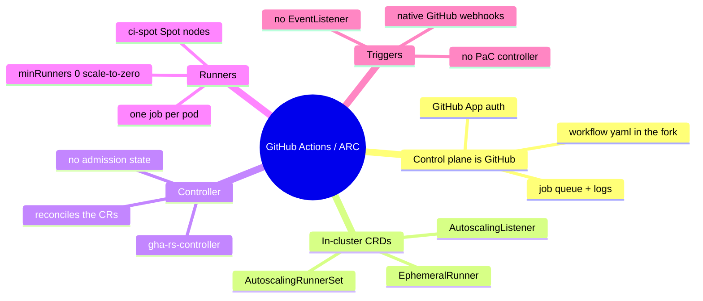
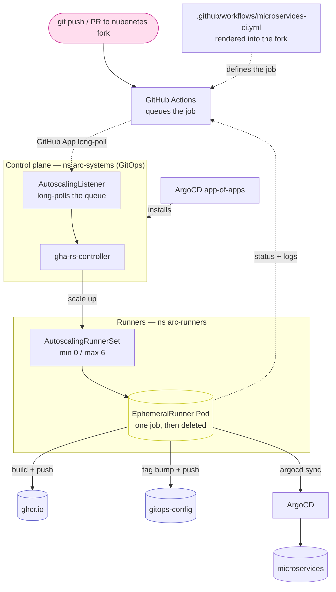
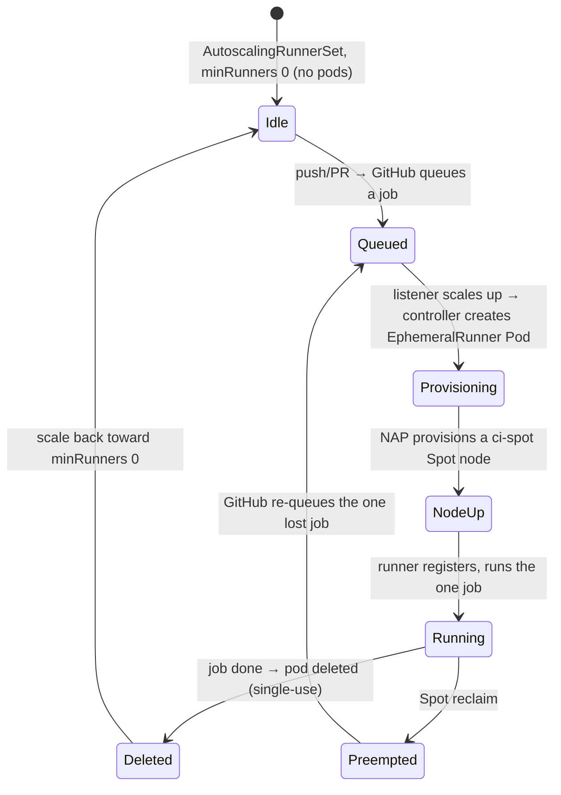

[← Previous: 403. Tekton](./403-TEKTON.md) | [🏠 Home](../README.md) | [→ Next: 501. Platform Operations](./501-PLATFORM_OPERATIONS.md)

---

# 404. GitHub Actions / ARC (third CI engine)

This project ships **four interchangeable CI engines**. Jenkins is the default,
**Tekton** ([403](./403-TEKTON.md)) and **Argo Workflows** ([405](./405-ARGO_WORKFLOWS.md))
are the Kubernetes-native alternatives, and **GitHub Actions self-hosted runners via ARC**
(Actions Runner Controller) is the third — selected by the single `ci.engine` feature flag. When `githubactions` is
chosen the platform installs ARC (the `gha-runner-scale-set-controller` + an
`AutoscalingRunnerSet` of **ephemeral runner pods**) as an ArgoCD app-of-apps,
runs the **same microservices pipeline** as a `.github/workflows/microservices-ci.yml`
rendered into each fork, and — uniquely — defaults those runners onto the
**`ci-spot` Spot ComputeClass** (the NAP scale-to-zero showcase). It is the
natural third engine: the whole Day0/Day1 lifecycle is *already* GitHub Actions,
so running the app pipeline as GHA closes the loop with **native GitHub webhooks**
(no separate trigger component) and **no in-cluster UI** (runs are viewed in
GitHub's Actions tab).

## ⭐ Where do I see the pipelines? (there is **no in-cluster UI**)

This is the one thing that surprises everyone arriving from the other three engines.
Jenkins, Tekton and Argo Workflows each ship an **in-cluster dashboard** (behind Google
IAP); **GitHub Actions does not — by design.** GitHub.com *is* the UI: it stores the
workflow, queues the jobs and shows the logs. ARC's only job is to supply the **runners**.
So there is nothing to port-forward and no `…jenkins2026.nubenetes.com` URL for CI — you
watch builds on github.com.

| CI engine (`ci.engine`) | Where you watch a pipeline run |
| --- | --- |
| `jenkins` (default) | Jenkins UI — `https://jenkins.<domain>` (in-cluster, IAP) |
| `tekton` | Tekton Dashboard — `https://tekton.<domain>` (in-cluster, IAP) |
| `argoworkflows` | Argo Workflows UI — `https://argo.<domain>` (in-cluster, IAP) |
| **`githubactions`** | **Each microservices fork's _Actions_ tab on github.com** — *no in-cluster URL* |

When `ci.engine=githubactions`, the "pipelines" are the **`microservices-ci.yml` GitHub
Actions workflows** that [`scripts/06-githubactions-pipelines.sh`](../scripts/06-githubactions-pipelines.sh)
renders into each microservices fork (from the shared
[`jenkins/pipelines/seed/services.yaml`](../jenkins/pipelines/seed/services.yaml) — the same
registry Jenkins and Tekton read). You watch them at:

- **<https://github.com/nubenetes/jhipster-sample-app-gateway/actions>**
- **<https://github.com/nubenetes/jhipster-sample-app-microservice/actions>**

The `Day1.cluster.01-gke` **Access URLs** step prints these exact per-fork links for the run
(generated from `services.yaml`, so they track whatever forks are configured). The runner
pods that execute the jobs *are* in-cluster (`arc-runners` namespace, `ci-spot` Spot nodes,
one ephemeral pod per job, `minRunners: 0` scale-to-zero) — but you never look at the cluster
to follow a build; you look at GitHub.

> **⚠️ First-run gotcha — a run stuck on "Waiting for a runner" (usually: public forks).**
> The run sits in `queued`, `kubectl -n arc-runners get pods` shows **no** runner pod, and the
> controller log says `Calculated target runner count {"assigned job": 0, …}` even though the
> `…-listener` pod is **Running**. That means registration *succeeded* but GitHub is **not
> routing the jobs to the scale set** — and the usual reason is **public repositories**.
> GitHub **blocks public repos from using self-hosted runners by default** (a fork PR could
> otherwise run untrusted code on your runners), and the nubenetes microservices forks are
> public, so this bites on first use. **Fix (org admin, one-time UI toggle — no secret/API for
> it):** *Organization → Settings → Actions → Runner groups →* the group holding
> `jenkins-2026-runners` (**Default**) *→* enable **"Allow public repositories"** (and ensure
> *Repository access* = **All repositories**, or lists the forks). Queued jobs pick up within
> ~1 min — a runner pod appears in `arc-runners` and the run flips to *in_progress*.
>
> Two rarer causes of the same "stuck queued" symptom: **(a)** the run was queued *before* the
> `AutoscalingRunnerSet` finished registering — GitHub won't retro-assign it, so **re-trigger**
> with a fresh `push`/PR (`workflow_dispatch` is intentionally not wired); **(b)** registration
> itself is failing — there is **no** Running `…-listener` pod
> (`kubectl -n arc-systems get pods | grep listener`); see the §9.5 troubleshooting in
> [`103-GITHUB_SECRETS_INVENTORY.md`](./103-GITHUB_SECRETS_INVENTORY.md) (the GitHub App needs
> org **Self-hosted runners: Read & write**, and the controller must be rolled to re-read a
> changed `arc-github-app` Secret).

## Triggering a build — the branch-based tier model (stable vs develop)

GitHub Actions here is **branch-based, not environment-selector-based**: there is no "choose an
environment" field. **The branch a build runs on decides the tier**, because the rendered
workflow derives everything from `github.ref_name` at run time:

```yaml
ENV_NAME:  ${{ github.ref_name == 'develop' && 'develop' || 'stable' }}
TARGET_NS: ${{ github.ref_name == 'develop' && 'microservices-develop' || 'microservices' }}
```

| | **Stable** tier | **Develop** tier |
|---|---|---|
| Runs on the fork's branch | **`main`** | **`develop`** |
| Code built | the app's `main` | the app's `develop` (true branch-based promotion) |
| `ENV_NAME` | `stable` | `develop` |
| Deploy namespace (`TARGET_NS`) | `microservices` | `microservices-develop` |
| GitOps values bumped | `values-stable.yaml` on gitops-config `main` | `values-develop.yaml` on gitops-config `develop` |
| Public URL | `microservices.<domain>` | `microservices-develop.<domain>` |

So **the branch *is* the environment selector.** There are **two equivalent ways** to launch a
build, both honouring that model:

**1 — Push / merge a PR to the branch** (the GitOps-native way):
- push to the fork's **`main`** → stable build → deploys to `microservices`;
- push to the fork's **`develop`** → develop build → deploys to `microservices-develop`.

**2 — 1-click "Run workflow"** (`workflow_dispatch`): on the fork's **Actions** tab → the
**microservices-ci** workflow → **Run workflow** → in **"Use workflow from"** pick the branch
(`main` = stable, `develop` = develop). **That branch dropdown is your environment selector.**
It is also what the seed's `githubactions.seedRuns` uses (`gh workflow run`) to populate the
Actions tab from Day1.

> **Why the workflow lives on *both* branches.** GitHub runs the workflow file **from the branch
> receiving the event** — so a push to `develop` only triggers if `develop` actually contains
> `.github/workflows/microservices-ci.yml`. The seed
> ([`06-githubactions-pipelines.sh`](../scripts/06-githubactions-pipelines.sh)) therefore renders
> the **same** file to **`main` and — when the develop track is enabled — `develop`** of every
> fork. The file is byte-identical on both branches; only `github.ref_name` differs at run time,
> and that is what flips the tier. *(Before this, the seed pushed only to `main`, so the develop
> tier could never be triggered — a push to `develop` no-op'd because there was no workflow
> there.)*

The develop tier also needs its **cluster side**: the `microservices-develop` namespace
(+ NetworkPolicies/RBAC) and the `microservices-develop.<domain>` Gateway route. Those are
provisioned by `Day1.cluster.01-gke` / `Day2.redeploy.06-githubactions` when the develop track
is on (`develop_track: true`).

## Understanding ARC (newcomers → specialists)

ARC is **GitHub Actions, but the runners live in your cluster**. There is no
in-cluster pipeline engine: GitHub.com is still the control plane (it stores the
workflow, queues jobs, shows logs); ARC's job is only to **supply ephemeral,
auto-scaling self-hosted runners on demand** and register them with GitHub. Read
this section once and the rest of the doc is just "where each piece lives".

<details>
<summary>🧠 Mental model — ARC (mindmap)</summary>



</details>

**Reading it —** the five branches are the pieces ARC splits CI into: the
**control plane stays on GitHub** (the workflow, the queue, the logs); the
**CRDs** are the in-cluster declaration of *how many runners of what shape*; the
**controller** reconciles those into pods; each **runner** is a single-job
ephemeral pod (so `minRunners: 0` = true scale-to-zero); and **triggers are
native GitHub webhooks** — there is no in-cluster EventListener or PaC controller
like Tekton's. The contrast with Tekton (every CI concept is a CRD the cluster
*runs*) is that here the cluster only *runs the runner pods* — GitHub runs the
pipeline.

<details>
<summary>🟢 For newcomers — the mental model in 6 objects</summary>

| Object | What it is | Jenkins / Tekton analogy |
|---|---|---|
| **Workflow** (`.github/workflows/microservices-ci.yml`) | The pipeline-as-code, **in the app fork**. GitHub runs it on push/PR. | The `Jenkinsfile` / the Tekton `Pipeline` |
| **Job** | One run of the workflow's `build-deploy` job, dispatched to a runner. | A Jenkins build / a `PipelineRun` |
| **AutoscalingRunnerSet** | A CRD declaring a pool of self-hosted runners (min/max, pod template, which GitHub org/repo). | The Jenkins Kubernetes cloud / Tekton's run namespace |
| **EphemeralRunner** | One **runner Pod that runs exactly one job, then is deleted**. | A Jenkins agent pod / a `TaskRun` Pod |
| **AutoscalingListener** | A controller-managed pod that long-polls GitHub's job queue and tells the runner set to scale up. | The Jenkins webhook→queue / Tekton's EventListener |
| **gha-rs-controller** | The operator that reconciles the CRs into listener + runner pods. | The Jenkins controller / `tekton-pipelines-controller` |

So a CI run is literally: *a push to the fork → GitHub queues the job → the
**listener** sees it and scales the **AutoscalingRunnerSet** → the controller
creates one **EphemeralRunner** Pod → that pod runs the workflow's steps, reports
status + logs back to GitHub, then is deleted*. You watch it all in the **GitHub
Actions tab** of the fork — there is no in-cluster dashboard.
</details>

<details>
<summary>🔴 For specialists — the moving parts and how they're wired here</summary>

**Control plane (namespace `arc-systems`, GitOps-installed via the
`argocd/githubactions` app-of-apps, OCI Helm charts — no vendoring):**
- **`gha-runner-scale-set-controller`** (`arc-gha-rs-controller`) reconciles
  `AutoscalingRunnerSet`/`EphemeralRunner`/`AutoscalingListener` CRs into pods.
  Release name pinned to `arc` so the emitted Deployment name is deterministic
  (`arc-gha-rs-controller`) and matches the `04-githubactions.sh`/`common.sh`
  call sites (which select it by the well-known label
  `app.kubernetes.io/part-of=gha-rs-controller`).
- The controller ships an **admission webhook** with the same first-sync
  caBundle/cert race as `tekton-pipelines-webhook`, handled identically:
  `ServerSideDiff=true` + a `syncPolicy.retry` block (limit 8, backoff) so a
  first-sync `x509`/cert race self-heals once the webhook is up — no manual
  restart.

**Runners (namespace `arc-runners`):** the `AutoscalingRunnerSet`
`jenkins-2026-runners` (release name pinned to the scale-set name) registers
against the org `github.com/nubenetes`. At `minRunners: 0` there are **no idle
runner pods** — the `AutoscalingListener` long-polls GitHub's queue and, when a
job lands, the controller provisions one `EphemeralRunner` Pod, which runs the
single job and is then deleted. `maxRunners: 6` caps concurrency. The pod
template carries the `imagePullSecret` (`arc-registry`) and the **ci-spot**
nodeSelector/tolerations (§ The ci-spot / NAP showcase).

**Triggers — native, no in-cluster receiver:** unlike Jenkins (seed-job cron +
REST) or Tekton (a PaC controller / Triggers EventListener pod that receives the
webhook), ARC needs **no in-cluster webhook endpoint**. Registration + job
dispatch flow over the **GitHub App** (the listener long-polls GitHub's API), so
there is no `EventListener`, no `pipelines-as-code` namespace, and **no public
route to expose** for triggering.

**Auth (the GitHub App, namespace `arc-runners`):** the runner set references the
`arc-github-app` Secret by `githubConfigSecret`, holding the GitHub App
`app_id`/`installation_id`/`private_key` (or a `github_token` PAT in `pat`
fallback mode). It must exist **before** the runner-set child App syncs
(`01-namespaces.sh` provisions it).

**Execution — runner pods are in-cluster:** they reach
`otel-collector-gateway.observability.svc.cluster.local:4317`, the in-cluster
microservices/ArgoCD services, and read the `arc-argocd` ArgoCD token from a
mounted in-cluster Secret — the cluster API token never leaves the cluster.

**No dashboard:** there is nothing to expose. ARC has no UI; `09-gateway.sh`
emits **no `HTTPRoute`/`GCPBackendPolicy`** for it (§ Gateway: no route). Runs
are viewed at `https://github.com/nubenetes/<repo>/actions`.
</details>

#### ARC object model & run flow

How a `git push` becomes a running runner pod — the CRDs (declaration) on the
left, one execution (the runtime pods) on the right:

<details>
<summary>🔀 ARC object model & run flow</summary>



</details>

**Reading it —** a push reaches **GitHub**, which queues the job; the in-cluster
**AutoscalingListener** sees it over the GitHub App long-poll and asks the
**controller** to scale the **AutoscalingRunnerSet**; one **EphemeralRunner** Pod
runs the job — build+push the image, bump the GitOps tag, drive ArgoCD — and
reports status/logs back to GitHub, then is deleted. The data-flow into GHCR /
gitops-config / ArgoCD is the **same contract** as Jenkins ([402](./402-PIPELINES_AS_CODE.md))
and Tekton ([403](./403-TEKTON.md)); only the runner lifecycle (single-job,
ephemeral, Spot) and the trigger (native GitHub, no in-cluster receiver) differ.

#### Runner lifecycle

<details>
<summary>♻️ EphemeralRunner lifecycle (state diagram)</summary>



</details>

**Reading it —** the differentiator vs Jenkins/Tekton is the tail. A runner is
**single-use**: it runs exactly one job then the pod is deleted, scaling back
toward `minRunners: 0`. If a **Spot reclaim** preempts a runner mid-job, only
**that one job** is lost, and GitHub **automatically re-queues** it onto a freshly
provisioned runner — which is exactly why this engine can safely default to Spot.

## Selecting the engine

`ci.engine` in [`config/config.yaml`](../config/config.yaml) is the durable
default; `JENKINS2026_CI_ENGINE` is the **ephemeral override** — the same
durable-default + override pattern as `observability.mode` / `JENKINS2026_OBS_MODE`.

```yaml
# config/config.yaml
ci:
  engine: jenkins      # jenkins (default) | tekton | githubactions
```

```bash
# one-off run with GitHub Actions / ARC instead of Jenkins
JENKINS2026_CI_ENGINE=githubactions scripts/up.sh
```

In CI, the **[`Day1.cluster.01-gke`](../.github/workflows/Day1.cluster.01-gke.yml)**
workflow exposes a `ci_engine` choice input (`jenkins` default, `tekton`,
`githubactions`, or `argoworkflows`) that flows to [`scripts/up.sh`](../scripts/up.sh) as
`JENKINS2026_CI_ENGINE`. The four engines are **mutually exclusive** on a given
cluster.

[`scripts/lib/config.sh`](../scripts/lib/config.sh) validates the value
(`jenkins|tekton|githubactions|argoworkflows`) and exports `J2026_CI_ENGINE`, which
`up.sh`/`down.sh` and the numbered steps branch on:

| Step | `ci.engine=jenkins` | `ci.engine=tekton` | `ci.engine=githubactions` |
|---|---|---|---|
| Install CI engine (`up.sh`) | [`04-jenkins.sh`](../scripts/04-jenkins.sh) | [`04-tekton.sh`](../scripts/04-tekton.sh) | [`04-githubactions.sh`](../scripts/04-githubactions.sh) |
| Seed pipelines (`up.sh`) | [`06-seed-pipelines.sh`](../scripts/06-seed-pipelines.sh) | [`06-tekton-pipelines.sh`](../scripts/06-tekton-pipelines.sh) | [`06-githubactions-pipelines.sh`](../scripts/06-githubactions-pipelines.sh) |
| Day2 redeploy | `Day2.redeploy.02-jenkins` | [`Day2.redeploy.03-tekton`](../.github/workflows/Day2.redeploy.03-tekton.yml) | `Day2.redeploy.06-githubactions` |
| Web UI / route | Jenkins UI behind IAP | Tekton Dashboard behind IAP | **none** — GitHub Actions tab |
| Teardown (`down.sh`) | Helm uninstall | engine-agnostic | engine-agnostic (App cascade-prune) |

**The four engines are mutually exclusive.** A clean install only deploys the
selected engine ([`up.sh`](../scripts/up.sh) branches on `ci.engine`, with
`jenkins` the `*` default). Switching to `githubactions` on a *running* cluster
**decommissions the other engine in the same run**:
[`04-githubactions.sh`](../scripts/04-githubactions.sh) retires **both** siblings
(it deletes the `jenkins` *and* `tekton` ArgoCD apps, Helm-uninstalls a legacy
Jenkins release, and drops the jenkins/tekton CI Gateway routes + IAP policies) —
unlike `04-tekton.sh`/`04-jenkins.sh`, which each retire only the one other
engine. The shared microservices are GitOps-managed by ArgoCD, so they survive
the switch — only the CI engine itself (and its public routing) changes.

### Namespace layout

`githubactions` owns two self-named namespaces, created only when selected — the
same gating model as the `jenkins`/`tekton-*` namespaces. The shared
**Gateway** (`platform-ingress`) and the rest of the platform are engine-neutral
and untouched by the switch.

| Namespace | Created when | Holds |
|---|---|---|
| `arc-systems` | `ci.engine=githubactions` | the ARC control plane (`gha-runner-scale-set-controller` + CRDs + the AutoscalingListener) |
| `arc-runners` | `ci.engine=githubactions` | the `AutoscalingRunnerSet`, the ephemeral runner pods, the runner SA, and the `arc-github-app`/`arc-registry`/`arc-argocd` Secrets |
| `platform-ingress`, `observability`, `microservices`, `argocd`, `platform-postgres`/pgAdmin | always | engine-neutral platform |

There is **no `jenkins` and no `tekton-*` namespace** in githubactions mode, and —
because ARC has no dashboard — **no public route** is created for it. The
`down.sh` teardown adds `arc-systems`/`arc-runners` to its namespace-delete loop
and cascade-prunes the `githubactions` ArgoCD app first (while ArgoCD is still
alive), exactly like the Tekton block.

## The ci-spot / NAP showcase (why this engine defaults to Spot)

This is the deliberate differentiator. The other two engines default
`runNodePool: static`; **`githubactions` defaults `ci-spot`**.

`infrastructure/compute-classes/ci-spot.yaml` defines a GKE Custom ComputeClass
(the GA Karpenter equivalent): Spot-first across c3/n2/c2/e2 families, on-demand
fallback, `consolidationDelayMinutes: 5` → scale-to-zero between builds. GKE
auto-applies the label + taint `cloud.google.com/compute-class=ci-spot:NoSchedule`.
(The ComputeClass apply itself lives in [`01-namespaces.sh`](../scripts/01-namespaces.sh),
gated solely on `nodeAutoProvisioning.enabled` and engine-neutral — ARC just
*selects* the class.)

- **Jenkins/Tekton default `static`** because their build is one long-lived pod
  (Jenkins) or an affinity-assistant-pinned multi-task `PipelineRun` on one RWO
  PVC (Tekton) — a Spot preemption restarts/kills the **whole** thing. (See
  [403 § run-node-pool](./403-TEKTON.md) for the full Tekton-on-Spot hazard.)
- **ARC defaults `ci-spot`** because each runner is an **`EphemeralRunner` pod
  that runs exactly one job, then is deleted**. A Spot reclaim loses **at most
  one in-flight job**, which **GitHub automatically re-queues** onto a freshly
  provisioned runner. `minRunners: 0` + the ComputeClass consolidation = **true
  scale-to-zero** — the cost story. This is precisely the bursty, single-shot
  workload NAP/Spot was built for.

The ci-spot pinning lives in the **AutoscalingRunnerSet pod template** as **chart
values on the runner-set child App** ([`runner-scale-set.yaml`](../argocd/githubactions/templates/runner-scale-set.yaml)),
*not* script-patched at runtime — so, unlike Tekton's `config-defaults`
`default-pod-template`, the **default placement needs no ArgoCD
`ignoreDifferences`**. Only the **`static` opt-out** is a runtime patch (and only
*that* one field — `.spec.template.spec.nodeSelector` — is in `ignoreDifferences`
so `selfHeal` doesn't fight it).

```yaml
# runner-scale-set child App, valuesObject.template.spec (ci-spot path)
nodeSelector:
  cloud.google.com/compute-class: ci-spot
tolerations:
  - { key: cloud.google.com/compute-class, operator: Equal, value: ci-spot, effect: NoSchedule }
  - { key: cloud.google.com/gke-spot,      operator: Equal, value: "true",  effect: NoSchedule }
```

**`static` opt-out:** set `githubactions.runNodePool: static` (or
`JENKINS2026_GITHUBACTIONS_RUN_NODE_POOL=static`). The chart then renders
`nodeSelector: {app: jenkins-2026}` (the long-lived pool), and
[`06-githubactions-pipelines.sh`](../scripts/06-githubactions-pipelines.sh)
`kubectl patch`es the `AutoscalingRunnerSet` to the same selector at runtime —
the matching `ignoreDifferences` keeps that patch from being reverted. Use it when
NAP/Spot/quota headroom isn't available; otherwise keep the default `ci-spot`.

## What gets installed (GitOps via ArgoCD app-of-apps)

ARC is **GitOps-managed by ArgoCD**, the same app-of-apps pattern as
[`argocd/tekton`](../argocd/tekton). [`scripts/04-githubactions.sh`](../scripts/04-githubactions.sh)
applies the parent Application [`argocd/githubactions-app.yaml`](../argocd/githubactions-app.yaml)
(sed-substituting `repoUrl`/`branchStable`/`runNodePool`/`nodeAutoProvisioningEnabled`
from the `J2026_*` env), which renders the local Helm chart
[`argocd/githubactions/`](../argocd/githubactions) into **two** child
Applications:

| Child Application | Source | Sync wave | Notes |
|---|---|---|---|
| `arc-controller` | OCI Helm chart `ghcr.io/actions/actions-runner-controller-charts/gha-runner-scale-set-controller` @ `{{versions.arc}}` | 0 | the controller + CRDs (`AutoscalingRunnerSet`/`EphemeralRunner`/`AutoscalingListener`); release name pinned `arc`; `ServerSideDiff` + retry for the webhook cert race |
| `arc-runner-scale-set` | OCI Helm chart `ghcr.io/actions/actions-runner-controller-charts/gha-runner-scale-set` @ `{{versions.arc}}` | 1 | the `AutoscalingRunnerSet` (release name = the scale-set name); `valuesObject` carries `githubConfigUrl`/`githubConfigSecret`, `minRunners`/`maxRunners`, `containerMode.type`, the imagePullSecret, and the ci-spot pod template |

**Why no vendoring (the contrast with Tekton's 5 vendored children):** ARC ships
proper **OCI Helm charts** on `ghcr.io`, so the Tekton `components/*/` release-YAML
workaround (Tekton publishes only GitHub-asset YAMLs, which kustomize
mis-classifies as git repos) is unnecessary — the children are `source.chart` +
`source.helm` directly. The ArgoCD repo-server must allow **anonymous OCI Helm
pulls** from `ghcr.io` (these charts are public). Both children carry
`ServerSideApply=true` + the `syncPolicy.retry` block; the controller (wave 0)
adds `compare-options: ServerSideDiff=true` for its admission-webhook caBundle.

The **two chart versions must match** and are pinned by
`githubactions.versions.arc` in [`config/config.yaml`](../config/config.yaml)
(see [`docs/602`](./602-VERSION_PINNING.md)). The credential Secrets are **not**
GitOps-managed ([`01-namespaces.sh`](../scripts/01-namespaces.sh) /
[`08.5-argocd.sh`](../scripts/08.5-argocd.sh) create them imperatively). ArgoCD
requires [`08.5-argocd.sh`](../scripts/08.5-argocd.sh) to run first (it already
does in [`up.sh`](../scripts/up.sh)).

## Triggers: native GitHub webhooks (no in-cluster receiver)

The four engines trigger CI differently:

| Engine | Trigger mechanism | In-cluster receiver |
|---|---|---|
| **Jenkins** | seed-job cron + REST force-trigger | — (no native git webhook) |
| **Tekton** | Pipelines-as-Code / Triggers EventListener (HMAC-signed webhook POST) | **yes** — the PaC controller / `el-microservices` pod, exposed at `pac.<domain>` |
| **GitHub Actions / ARC** | **native GitHub webhooks via the GitHub App** | **none** — the AutoscalingListener long-polls GitHub's job queue |
| **Argo Workflows** | Argo Events EventSource + Sensor (HMAC-signed webhook POST) | **yes** — the `github-eventsource-svc` pod in `argo-events`, exposed at `argo-events.<domain>` |

Because GitHub is the control plane, a push/PR to a fork queues the job at
GitHub.com; the in-cluster **AutoscalingListener** long-polls that queue over the
GitHub App and scales the runner set. There is **no in-cluster webhook endpoint to
secure or route** (no PaC controller, no EventListener, no `pac.<domain>` host) —
one fewer public surface than Tekton.

## Authentication: the GitHub App (PAT fallback)

ARC registers runners with GitHub using one of two credential models, set by
`githubactions.authMode`:

| Mode | Secret (`arc-github-app`) keys | When |
|---|---|---|
| `app` (default, recommended) | `github_app_id`, `github_app_installation_id`, `github_app_private_key` | a GitHub App installed on the `nubenetes` org — finer-grained, no user PAT |
| `pat` (fallback) | `github_token` | when the App isn't set up; uses the `GIT_TOKEN` PAT |

The three App credentials arrive as **GitHub Actions secrets**
`ARC_GITHUB_APP_ID` / `ARC_GITHUB_APP_INSTALLATION_ID` /
`ARC_GITHUB_APP_PRIVATE_KEY`; [`01-namespaces.sh`](../scripts/01-namespaces.sh)
`provision_secret`s them into `arc-github-app` in `arc-runners` (so both
`imperative` and `eso` secrets backends work). If `ARC_GITHUB_APP_*` are unset it
falls back to a `github_token=$GIT_TOKEN` PAT secret.

- **Org-level scale set:** `githubConfigUrl: https://github.com/nubenetes`
  registers **one** scale set for the whole org, so every microservices fork
  shares the `jenkins-2026-runners` pool (rather than one set per repo).
- **`workflow` scope on `GIT_TOKEN`:** [`06-githubactions-pipelines.sh`](../scripts/06-githubactions-pipelines.sh)
  pushes `.github/workflows/microservices-ci.yml` into each fork — GitHub
  **rejects** a push that touches `.github/workflows/` unless the token carries the
  **`workflow`** scope. (The script detects the rejection and logs a clear
  warning.)

The runner's **ArgoCD** token (`arc-argocd`, account `githubactions`) is created
imperatively by [`08.5-argocd.sh`](../scripts/08.5-argocd.sh) into `arc-runners`
— the same in-cluster-only split as Tekton's `tekton-argocd`. The workflow reads
it from the mounted Secret, **never** from a fork secret, so the cluster API token
never leaves the cluster.

## containerMode: dind

`githubactions.containerMode` controls how the runner pod runs containerized build
steps:

| Mode | What it adds | Why |
|---|---|---|
| `dind` (default) | a **privileged Docker sidecar** on each runner pod | parity with the `docker` dind container in the Jenkins 8-container agent pod; required for the **angular / `spring-boot:build-image` buildpacks** path and the `docker run …` scanner steps (Semgrep/Trivy) in the workflow |
| `kubernetes` | rootless, runs `container:`/`services:` jobs via the K8s API | no privileged sidecar — but can't run docker-in-docker steps |

`dind` is the default because the rendered workflow uses `docker run` for the
Semgrep/Trivy scanners and the angular buildpacks path needs a Docker daemon.
**Java/Jib needs no daemon** (Jib builds + pushes the image straight to GHCR over
the registry API), so a Java-only deployment could run `kubernetes` mode — but
`dind` keeps every step working out of the box.

## RBAC

[`argocd/platform-config/templates/rbac-githubactions.yaml`](../argocd/platform-config)
(gated `{{- if eq .Values.ciEngine "githubactions" }}`, flowed from
`J2026_CI_ENGINE` via [`08.5-argocd.sh`](../scripts/08.5-argocd.sh) +
`platform-config-app.yaml`) grants the runner ServiceAccount what the pipeline
needs — mirroring `rbac-jenkins.yaml`/`rbac-tekton.yaml`:

- `edit` in each microservices namespace (stable, +develop when the develop track
  is on) so the gitops-deploy OTel self-heal (`rollout restart`) works.
- an OTel-instrumentation editor binding (manage `opentelemetry.io`
  `Instrumentation` CRs) for the OTel-injection self-heal.

## The pipeline, rendered into each fork

The full microservices pipeline runs as a **single `.github/workflows/microservices-ci.yml`**
rendered into each app fork from
[`jenkins/pipelines/seed/microservices-ci.yml.tmpl`](../jenkins/pipelines/seed/microservices-ci.yml.tmpl)
by [`scripts/06-githubactions-pipelines.sh`](../scripts/06-githubactions-pipelines.sh)
— the **seed-job analogue**. Both other engines read the **same service
registry** ([`jenkins/pipelines/seed/services.yaml`](../jenkins/pipelines/seed/services.yaml));
ARC reads it verbatim too (the `06` script `yq`-iterates it and `sed`-substitutes
the template's `{{...}}` placeholders per service).

`06-githubactions-pipelines.sh` is materially **simpler** than the Tekton seed
(no webhook-create loop — the GitHub App handles dispatch): it waits for the
`AutoscalingRunnerSet` to register, applies the `static` opt-out patch if
configured, then for each service clones the fork, renders the workflow, and
**diff-then-pushes** it (idempotent) to the fork's `main` — and, when the develop track is
on, to its **`develop`** branch too, so push-to-develop / Run-workflow-from-develop runs the
**develop tier** (see *[Triggering a build](#triggering-a-build--the-branch-based-tier-model-stable-vs-develop)* above). With `githubactions.seedRuns: true`
(default, parity with `tekton.seedRuns`) it also `gh workflow run`s each fork so the Actions
tab is populated from Day1.

### The rendered workflow

| Jenkins stage | GitHub Actions step | Notable difference |
|---|---|---|
| Checkout (+ gateway patch) / infra | `actions/checkout` (app fork + `nubenetes/jenkins-2026` infra at `INFRA_BRANCH`) | infra checked out for the scanner configs + `maven-settings.xml` |
| Semgrep SAST + SARIF | `docker run semgrep` → `github/codeql-action/upload-sarif` | **native SARIF upload** (needs `security-events: write`) — cleaner than the `curl …/code-scanning/sarifs` of the other engines |
| CodeQL Analysis + SARIF | `github/codeql-action/init` + `analyze` (java only) | native CodeQL action |
| Trivy IaC scan | `docker run aquasec/trivy config` | — |
| Build & Test | `./mvnw … clean verify` (java) / `npm ci && npm run build` (angular) | replicates `microservicesBuild.groovy` (`MAVEN_OPTS=-Xmx2048m -XX:+UseG1GC …`, `-s infra/jenkins/maven-settings.xml`) |
| Build & Push image | `./mvnw … jib:build -Djib.to.image=$REGISTRY/$SERVICE:$IMAGE_TAG` (java) | Jib, daemonless; `-Djib.to.auth.*` from `REGISTRY_USERNAME/PASSWORD` |
| Trivy image scan | `docker run aquasec/trivy image` | — |
| Deploy (GitOps + ArgoCD + OTel self-heal) | GitOps bump → `argocd app sync/wait` | **byte-identical** to `microservicesDeploy.groovy` (see below) |
| Smoke test | `curl --retry … $svc.$TARGET_NS.svc:$port$health` | — |
| Integration k6 | OTel/k6 export step, `--tag ci_runner=githubactions` | tags the new engine so existing k6 dashboards filter it out of the box |

Key derivations in the workflow `env`:

| Var | Value | Meaning |
|---|---|---|
| `IMAGE_TAG` | `${{ github.ref_name }}-${{ github.run_number }}` | `<branch>-<run#>`, immutable — byte-for-byte what `helm/microservices/values-<env>.yaml` is pinned to and `microservicesDeploy.groovy` expects |
| `ENV_NAME` | `develop` if `ref_name==develop` else `stable` | the deploy tier |
| `TARGET_NS` | `<nsDevelop>` if `develop` else `<nsStable>` | `microservices-develop` / `microservices` |
| `OTLP_ENDPOINT` | `http://otel-collector-gateway.<obs-ns>.svc.cluster.local:4317` | the in-cluster collector (runner pods reach it directly) |
| `runs-on` | `{{runnerLabel}}` = `githubactions.runnerScaleSetName` (`jenkins-2026-runners`) | the ARC equivalent of Jenkins' `agent { kubernetes }` / Tekton's `serviceAccountName: tekton-ci` |

`on:` is `push` to `[main]` (+ `develop` when the develop track is enabled — the
renderer drops `develop` otherwise) and `pull_request` to `[main]`.

### GHCR push (Jib, same registry + tag)

The fork's native `GITHUB_TOKEN` is scoped to the **fork**, but the image target
is the **separate** `nubenetes/jenkins-2026-microservices` package — so Jib
authenticates with `-Djib.to.auth.username/password` from the
`REGISTRY_USERNAME`/`REGISTRY_PASSWORD` secrets (the same GitHub secrets Day1
already plumbs), exactly the Jenkins/Tekton credential model. The tag is
`$REGISTRY/$SERVICE:$IMAGE_TAG` (`<branch>-<run#>`).

### GitOps bump — byte-identical to `microservicesDeploy.groovy`

The deploy step preserves every parity point with the Jenkins/Tekton GitOps stage:

- same repo `nubenetes/jenkins-2026-gitops-config`, same file
  `helm/microservices/values-<env>.yaml`, same `yq` selector
  `.services.<svc>.image.tag`, same `main`/`develop` branch map;
- a **direct `git push origin main`** — that repo's `main` is **direct-push by
  design** (a PR gate would reject the machine push and wedge every deploy; see
  [`docs/502`](./502-MICROSERVICES_GITOPS.md) and CLAUDE.md);
- then `argocd app sync/wait microservices-<env>` using the in-cluster
  **`arc-argocd`** token (read from the mounted Secret, never a fork secret) +
  the OTel-injection self-heal.

### OTel export (same collector, matching attributes)

Runner pods are in-cluster, so they reach
`otel-collector-gateway.observability.svc.cluster.local:4317` (gRPC) directly:
build/pipeline traces export with `service.name=githubactions`,
`service.namespace=jenkins-2026` (so spans land in the **same** Grafana views as
Jenkins/Tekton), and the k6 step carries `--tag ci_runner=githubactions` — the
only delta from the Tekton k6 `K6_OTEL_*` contract — so the existing k6 dashboards
filter the new engine out of the box. App runtime telemetry (the OTel Java agent
via the `Instrumentation` CR) is unchanged. The `arc-runners` NetworkPolicy must
allow egress to the observability namespace on `4317` or build/k6 spans silently
drop.

## Install / redeploy lifecycle

ARC follows the same idempotent, **re-run-don't-Decom** model as the rest of the
platform — re-running Day1 (or the Day2 redeploy) converges in place; ArgoCD
re-syncs the OCI charts from git.

| Action | What runs |
|---|---|
| **Local / e2e** | `JENKINS2026_CI_ENGINE=githubactions scripts/up.sh` → `04-githubactions.sh` + `06-githubactions-pipelines.sh` (after `08.5-argocd` and `03-observability`, before `09-gateway`) |
| **Day1** | [`Day1.cluster.01-gke`](../.github/workflows/Day1.cluster.01-gke.yml) with `ci_engine=githubactions` — the `01-namespaces` step additionally passes `ARC_GITHUB_APP_ID`/`ARC_GITHUB_APP_INSTALLATION_ID`/`ARC_GITHUB_APP_PRIVATE_KEY` |
| **Day2 redeploy** | `Day2.redeploy.06-githubactions` — re-applies `01-namespaces` → `04-githubactions.sh` → `06-githubactions-pipelines.sh` → `08.6-eso-sync.sh` → `09-gateway.sh` (idempotent; neutral routes, **no CI route**) |
| **Teardown** | `down.sh` deletes the `githubactions` ArgoCD app (cascade-prunes the controller + runner scale set while ArgoCD is alive), then removes the `arc-systems`/`arc-runners` namespaces |

> **Applying a change = re-run, not Decom+Day1.** `04-githubactions.sh` /
> `06-githubactions-pipelines.sh` are idempotent (App apply no-ops when in sync;
> the workflow render diff-then-pushes), so re-run `Day1` (or
> `Day2.redeploy.06-githubactions`) to pick up a change. `Decom` is only for
> tearing the cluster down when done.

## Gateway: no route (the "emit neither" correctness)

ARC has **no dashboard**, so `09-gateway.sh` creates **no `HTTPRoute`,
`HealthCheckPolicy`, or `GCPBackendPolicy`** for it. The gateway/namespace logic
guards on `== jenkins` / `== tekton` explicitly (rather than a 2-way
`tekton`-else-`jenkins`), so a third value falls through to **neither** branch —
otherwise githubactions would be mis-routed into the jenkins path (creating a
jenkins route/IAP for a namespace that doesn't exist). Net effect in
githubactions mode: `09-gateway` emits the engine-neutral routes (microservices,
headlamp, pgadmin, argocd, faro, grafana-if-oss) and **no CI route** — correct
for ARC. Runs are viewed at `https://github.com/nubenetes/<repo>/actions`.

## Configuration reference

The `githubactions:` block in [`config/config.yaml`](../config/config.yaml)
(used only when `ci.engine == githubactions`):

| Key | Default | Purpose | Feature-flag override |
|---|---|---|---|
| `runNodePool` | `ci-spot` | runner pod placement (`ci-spot` Spot ComputeClass \| `static` long-lived pool) | `JENKINS2026_GITHUBACTIONS_RUN_NODE_POOL` |
| `namespace` | `arc-systems` | ARC controller + CRDs namespace | — |
| `runnerNamespace` | `arc-runners` | AutoscalingRunnerSet + runner pods + creds namespace | — |
| `runnerScaleSetName` | `jenkins-2026-runners` | the `runs-on:` label the forks' workflows target | — |
| `githubConfigUrl` | `https://github.com/nubenetes` | org-level scale set (all forks share one) | — |
| `authMode` | `app` | `app` (GitHub App) \| `pat` (`GIT_TOKEN` fallback) | — |
| `containerMode` | `dind` | `dind` (privileged build sidecar) \| `kubernetes` (rootless) | — |
| `seedRuns` | `true` | also `gh workflow run` each fork on Day1 | `JENKINS2026_GITHUBACTIONS_SEED_RUNS` |
| `versions.arc` | `0.12.1` | the two ARC charts (controller + scale-set; must match) | — |
| `registryCredentialsSecretName` | `arc-registry` | ghcr.io push/pull dockerconfigjson (runner imagePullSecret) | — |
| `githubAppSecretName` | `arc-github-app` | the GitHub App creds Secret (`githubConfigSecret`) | — |

`scripts/lib/config.sh` exports these as `J2026_GHA_*` (e.g.
`J2026_GHA_NAMESPACE`, `J2026_GHA_RUNNER_SCALE_SET_NAME`, `J2026_GHA_AUTH_MODE`,
`J2026_GHA_SEED_RUNS`) and `J2026_GITHUBACTIONS_RUN_NODE_POOL`, validated against
the same `validate_run_node_pool` helper Jenkins/Tekton use.

**New GitHub Actions secrets** (consumed by the `Day1`/`Day2.redeploy.06`
`01-namespaces` step; keep README's secrets table in sync):

| Secret | Purpose |
|---|---|
| `ARC_GITHUB_APP_ID` | GitHub App ID for ARC runner registration |
| `ARC_GITHUB_APP_INSTALLATION_ID` | the App's installation ID on the org |
| `ARC_GITHUB_APP_PRIVATE_KEY` | the App's private key (PEM) |

`REGISTRY_USERNAME`/`REGISTRY_PASSWORD` (GHCR push) and
`GIT_USERNAME`/`GIT_TOKEN` (workflow render + GitOps push — `GIT_TOKEN` needs the
**`workflow`** scope) are reused as-is.

## See also

- [403. Tekton](./403-TEKTON.md) — the second engine + the `ci.engine` contract
  and the candidate-engines roadmap that ranks ARC first.
- [402. Pipelines as Code](./402-PIPELINES_AS_CODE.md) — the Jenkins pipeline this
  ports, and the shared `services.yaml` registry.
- [202. Microservices App Architecture](./202-MICROSERVICES-APP-ARCHITECTURE.md) § *Why JHipster* —
  what these pipelines build (the forked JHipster gateway + microservice), why that demo app, and
  why the app repos are **forks** in the `nubenetes` org (you commit CI into repos you own).
- [501. Platform Operations](./501-PLATFORM_OPERATIONS.md) § Elastic Node
  Auto-Provisioning — the NAP/Spot comparison across all four engines.
- [502. Microservices GitOps](./502-MICROSERVICES_GITOPS.md) — why the
  gitops-config `main` is direct-push (the deploy stage depends on it).
- [602. Version Pinning](./602-VERSION_PINNING.md) — the `githubactions.versions.arc`
  chart pin.

---

[← Previous: 403. Tekton](./403-TEKTON.md) | [🏠 Home](../README.md) | [→ Next: 501. Platform Operations](./501-PLATFORM_OPERATIONS.md)

---

*404. GitHub Actions / ARC — jenkins-2026*
