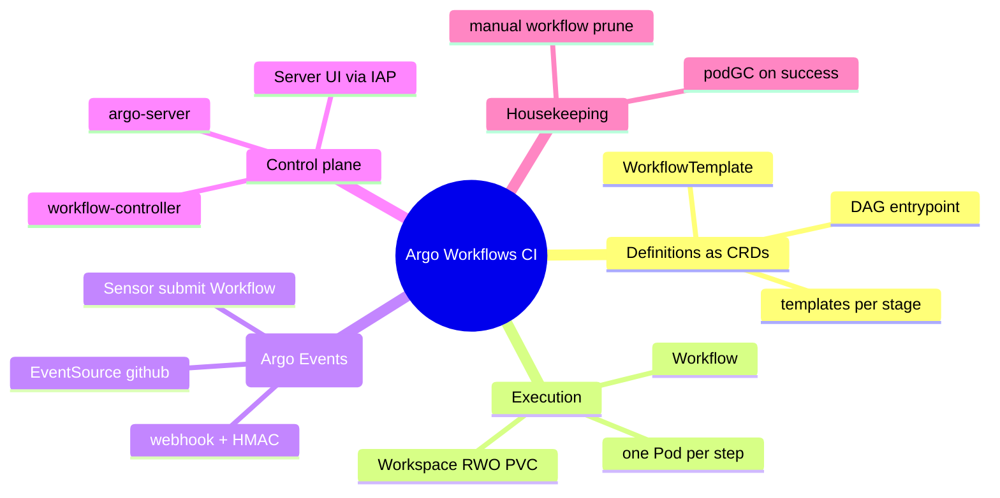
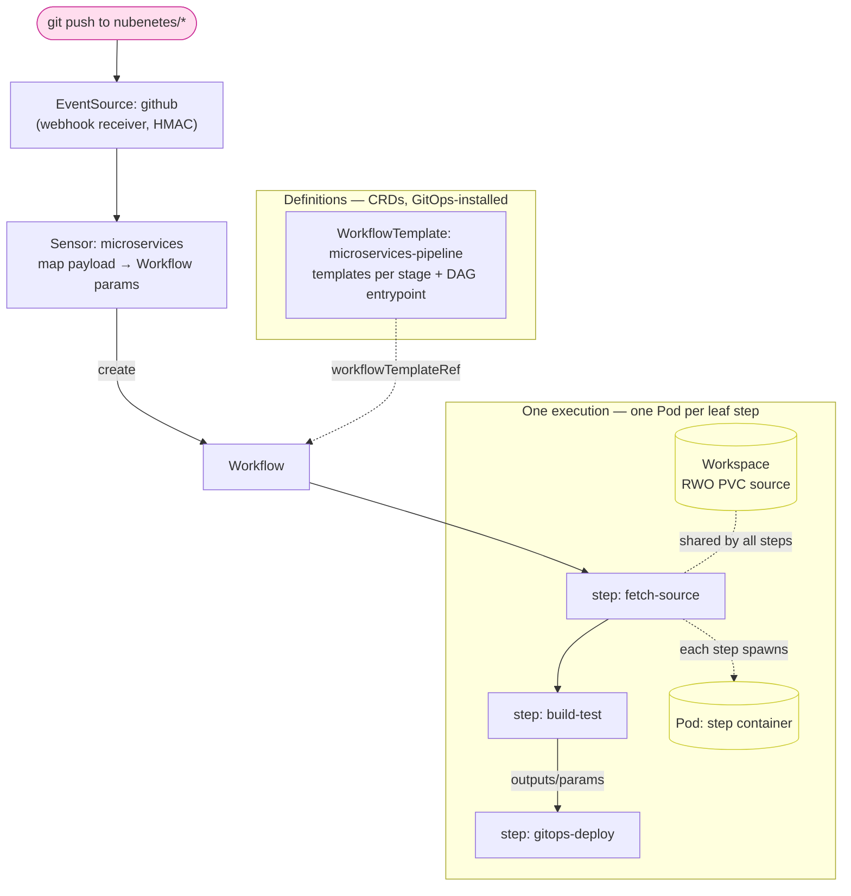
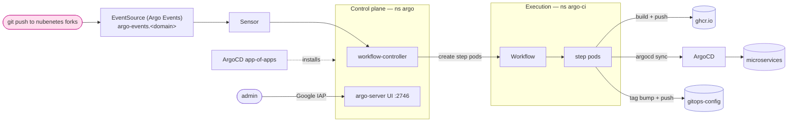
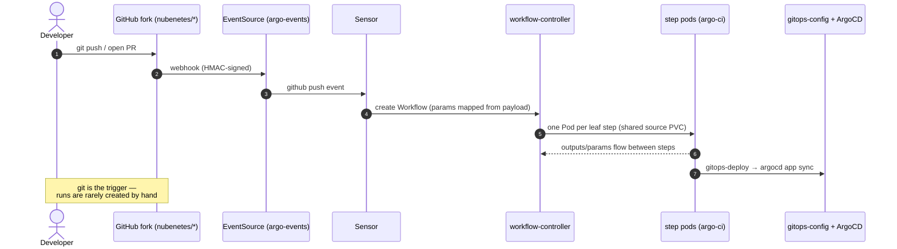

[← Previous: 405. GitHub Actions / ARC](./405-GITHUB_ACTIONS.md) | [🏠 Home](../README.md) | [→ Next: 501. Platform Operations](./501-PLATFORM_OPERATIONS.md)

---

# 406. Argo Workflows (alternative CI engine)

This project ships **interchangeable CI engines**. Jenkins is the default;
**Argo Workflows** (with **Argo Events**) is one of the alternatives, selected by a
single feature flag (`ci.engine: argoworkflows`). It is a faithful **1:1 port of
the Tekton engine** ([404](./404-TEKTON.md)): the same microservices pipeline, the
same shared service registry, the same GHCR immutable-tag scheme, the same
GitOps-bump-and-sync deploy, and the same OTel export endpoint — re-expressed in
Argo-native objects. When Argo Workflows is chosen the platform installs the Argo
Workflows controller + Server + the Argo Events controllers/EventBus, exposes the
Server UI on the internet behind **Google IAP** (exactly like the Tekton Dashboard
and Headlamp), and runs the **same microservices pipeline** ported to a
`WorkflowTemplate` under [`argoworkflows/`](../argoworkflows/).

It completes the **Argo trifecta** already present on the platform (ArgoCD +
Argo Rollouts + Argo Workflows): one CNCF, Kubernetes-native family for GitOps,
progressive delivery, and CI.

## Understanding Argo Workflows (newcomers → specialists)

Argo Workflows is **Kubernetes-native CI/CD**: like Tekton, there is no
Jenkins-style controller running pipelines for you — every CI concept is a
**Custom Resource** (CRD) the API server stores and the Argo controllers
reconcile. Read this section once and the rest of the doc is just "where each
file lives".

<details>
<summary>🧠 Mental model — Argo Workflows (mindmap)</summary>



</details>

**Reading it —** the five branches mirror Tekton's split: **Definitions** (the
reusable `WorkflowTemplate` + its `templates`), **Execution** (the per-run
`Workflow` — each step is a Pod), **Triggers** (Argo Events turns a git push into
a `Workflow`), the **Control plane** that reconciles it all, and the
**Housekeeping** add-ons. Everything is an API-server object — there is no engine
state outside Kubernetes, exactly the contrast with the Jenkins controller in
[401](./401-JENKINS.md).

<details>
<summary>🟢 For newcomers — the mental model in 6 objects</summary>

| Object | What it is | Tekton analogy | Jenkins analogy |
|---|---|---|---|
| **`template`** (in a WorkflowTemplate) | A single container that runs a command (a `container`/`script` template), or a `dag`/`steps` that sequences others. The unit of reuse. | `Task` | A reusable stage / shared-library step |
| **`WorkflowTemplate`** | A named, reusable definition: a list of `templates` + a `dag`/`steps` **entrypoint** that orders them, passing data via params/results and sharing files via a workspace volume. | `Pipeline` | The `Jenkinsfile` |
| **`Workflow`** | One **execution** (with concrete param values + its own workspace PVC). Creating it *is* "start a build". | `PipelineRun` | A build (`#123`) |
| **step Pod** | Each leaf template that runs becomes **one Pod** (its container is that pod). | `TaskRun` (one Pod) | A stage's agent pod |
| **Workspace** | A volume shared between steps in a run (here: one RWO PVC `source` via `volumeClaimTemplates`, cloned once and reused). | the RWO `source` workspace | The agent workspace dir |
| **EventSource + Sensor** | An Argo Events pod receives webhooks (`EventSource`) and a `Sensor` **creates a `Workflow`** from them. | `EventListener` + Triggers / PaC | The Jenkins webhook → job trigger |

So a CI run is literally: *something creates a `Workflow` CR (from a
`WorkflowTemplate` via `workflowTemplateRef`) → the workflow-controller schedules
the DAG → each leaf step is a Pod → results/the shared workspace flow between them
→ the run object records success/failure*. You watch it all in the **Argo
Workflows Server UI** (behind IAP). You **rarely create runs by hand** — a
`git push` does it (see *Git-driven CI* below).

In this repo the pipeline is the JHipster microservices build ported 1:1 from the
Jenkins shared library (and from Tekton) — templates
`fetch-source → semgrep-scan → codeql-analyze → trivy-iac → maven-build-test →
build-push-image → trivy-image → gitops-deploy → smoke-test → k6-smoke` (the DAG
task names shorten a few of these: `semgrep`, `codeql`, `build-test`), all
sharing the one `source` PVC
([`argoworkflows/templates/microservices-wftmpl.yaml`](../argoworkflows/templates/microservices-wftmpl.yaml)).
</details>

<details>
<summary>🔴 For specialists — the moving parts and how they're wired here</summary>

**Control plane (namespace `argo`, GitOps-installed via the `argocd/argoworkflows`
app-of-apps, components vendored + pinned):**
- **`workflow-controller`** reconciles `Workflow` → Pods, schedules the DAG, passes
  results, runs `podGC`/TTL housekeeping.
- **`argo-server`** serves the **Server UI + API** (port `2746`). It has **no
  built-in authentication** in the mode we run it (`--auth-mode=server`), so —
  exactly like the Tekton Dashboard — it is fronted by **Google IAP** at the
  Gateway (TLS terminated at the edge, `--secure=false`).
- **`workflow-controller-configmap`** holds controller-wide defaults
  (`workflowDefaults`) — the run-pod `nodeSelector`/`tolerations` placement is
  patched here imperatively by [`06-argoworkflows-pipelines.sh`](../scripts/06-argoworkflows-pipelines.sh)
  (ArgoCD ignores that one field — see `ignoreDifferences`), the analogue of
  Tekton's `config-defaults default-pod-template`.

**Triggers — Argo Events (namespaces `argo-events`):** the Tekton-Triggers /
PaC equivalent.
- **`EventBus`** (`default`, native NATS) is the message backbone.
- **`EventSource`** ([`argoworkflows/events/eventsource.yaml`](../argoworkflows/events/eventsource.yaml))
  is a **GitHub webhook receiver** (port `12000`); Argo Events provisions a Service
  (`github-eventsource-svc`) the Gateway routes `argo-events.<domain>` to. GitHub
  HMAC is validated against the `argoworkflows-github-webhook` Secret (key
  `secret`).
- **`Sensor`** ([`argoworkflows/events/sensor.yaml`](../argoworkflows/events/sensor.yaml))
  subscribes to the EventSource and, on a **push to `main`** (a `body.ref ==
  refs/heads/main` data filter — the Sensor is hardwired to the stable tier, so
  PR events and non-`main` pushes are dropped), **submits a `Workflow`** from
  `microservices-pipeline` — mapping the webhook JSON (repo clone URL, ref) onto
  the Workflow params (the TriggerBinding analogue). It runs as the
  `operate-workflow-sa` ServiceAccount (create Workflows in `argo-ci`).

**Execution namespace `argo-ci`:** `Workflow`s + their ephemeral step Pods run
here (outbound-only; hardened with a deny-ingress baseline NetworkPolicy,
[`infrastructure/networkpolicies-argoworkflows.yaml`](../infrastructure/networkpolicies-argoworkflows.yaml)).
The `argoworkflows-ci` SA gets the RBAC the pipeline needs
([`argoworkflows/rbac/pipeline-rbac.yaml`](../argoworkflows/rbac/pipeline-rbac.yaml)):
the Argo executor RBAC (pods/pods-log/pods-exec + `workflowtaskresults`) in the run
namespace, pull/push images, the OTel-injection self-heal in `gitops-deploy`, the
smoke-test pod, and an ArgoCD token (`argoworkflows-argocd` Secret) to
`argocd app sync`.

**Workspace & data flow:** the `WorkflowTemplate` declares one **RWO PVC**
`source` via `volumeClaimTemplates` (cloned once by `fetch-source`, reused by every
later step — mirrors the single Jenkins agent workspace and the Tekton `source`
workspace). Because the PVC is RWO, all of a `Workflow`'s steps co-schedule onto
**one node** — the same single-node coupling Tekton's affinity assistant creates,
hence the same `static`-recommended `runNodePool` guidance below. Steps pass small
values via Argo **outputs/parameters**.

**Housekeeping:** `podGC: OnWorkflowSuccess` reclaims a run's step pods once the
`Workflow` succeeds — keeping pod accumulation off the nodes. Completed `Workflow`
CRs themselves are **not** TTL-pruned (no `ttlStrategy`/`retentionPolicy` is
configured — the Argo analogue of Jenkins `buildDiscarder` / the Tekton Pruner is
deliberately absent); prune by hand with `argo delete` / `kubectl delete workflow
-n argo-ci` if they accumulate.

**Observability:** the workflow-controller's metrics endpoint (pod port `:9090`,
HTTPS with a self-signed cert — Argo v3.6+ ships **no** metrics Service, so the OSS
Prometheus `argo-workflows-controller` job discovers the pod directly with
`insecure_skip_verify`) exposes the `argo_workflows_*` series that drive the *Argo
Workflows CI* Grafana dashboard; step pod logs land in Loki
(`k8s_namespace_name=argo-ci`). See [§ Observability](#observability).
</details>

#### Argo Workflows object model & run flow

How a `git push` becomes running pods — the CRDs (definitions) on the left, one
execution (the runtime objects) on the right:

<details>
<summary>🔀 Argo Workflows object model & run flow</summary>



</details>

The DAG `dependencies` make it linear here (mirrors the single-agent Jenkins job
and the Tekton `runAfter` chain); the shared RWO PVC is why all step pods
co-schedule on one node. `podGC` reclaims succeeded pods.

## High-level architecture

The same shape as 401/402/403's architecture views, in Argo Workflows terms —
GitOps install, a control plane, an execution namespace, and the GitOps handoff:

<details>
<summary>🏛️ High-level Argo Workflows architecture</summary>



</details>

**Reading it —** a git push reaches the **Argo Events EventSource**, whose
**Sensor** asks the **control plane** (ns `argo`, installed by the ArgoCD
app-of-apps) to create a `Workflow` in the **execution** namespace (ns `argo-ci`);
its step pods build+push the image, bump the GitOps tag, and drive ArgoCD —
exactly the Jenkins/Tekton data-flow from [402](./402-PIPELINES_AS_CODE.md) /
[404](./404-TEKTON.md), with the Server UI fronted by Google IAP like Headlamp.

## Selecting the engine

`ci.engine` in [`config/config.yaml`](../config/config.yaml) is the durable
default; `JENKINS2026_CI_ENGINE` is the **ephemeral override** — the same
durable-default + override pattern as `observability.mode` / `JENKINS2026_OBS_MODE`.

```yaml
# config/config.yaml
ci:
  engine: jenkins      # jenkins (default) | tekton | githubactions | argoworkflows
```

```bash
# one-off run with Argo Workflows instead of Jenkins
JENKINS2026_CI_ENGINE=argoworkflows scripts/up.sh
```

In CI, the **[`Day1.cluster.01-gke`](../.github/workflows/Day1.cluster.01-gke.yml)**
workflow exposes a `ci_engine` choice input that flows to
[`scripts/up.sh`](../scripts/up.sh) as `JENKINS2026_CI_ENGINE`. The engines are
mutually exclusive on a given cluster.

[`scripts/lib/config.sh`](../scripts/lib/config.sh) validates the value
(`jenkins|tekton|githubactions|argoworkflows`) and exports `J2026_CI_ENGINE`,
which `up.sh`/`down.sh` and the numbered steps branch on:

| Step | `ci.engine=jenkins` | `ci.engine=tekton` | `ci.engine=argoworkflows` |
|---|---|---|---|
| Install CI engine (`up.sh`) | [`scripts/04-jenkins.sh`](../scripts/04-jenkins.sh) | [`scripts/04-tekton.sh`](../scripts/04-tekton.sh) | [`scripts/04-argoworkflows.sh`](../scripts/04-argoworkflows.sh) |
| Seed pipelines (`up.sh`) | [`scripts/06-seed-pipelines.sh`](../scripts/06-seed-pipelines.sh) | [`scripts/06-tekton-pipelines.sh`](../scripts/06-tekton-pipelines.sh) | [`scripts/06-argoworkflows-pipelines.sh`](../scripts/06-argoworkflows-pipelines.sh) |
| Day2 redeploy | `Day2.redeploy.02-jenkins` | [`Day2.redeploy.03-tekton`](../.github/workflows/Day2.redeploy.03-tekton.yml) | [`Day2.redeploy.07-argoworkflows`](../.github/workflows/Day2.redeploy.07-argoworkflows.yml) |
| Teardown (`down.sh`) | engine-agnostic (deletes the `jenkins` ArgoCD Application; legacy Helm uninstall as fallback) | engine-agnostic (removes all) | engine-agnostic (removes all) |

**The engines are mutually exclusive.** A clean install only deploys the selected
one of the four (Jenkins · Tekton · GitHub Actions/ARC · Argo Workflows);
[`up.sh`](../scripts/up.sh) branches on `ci.engine`, so no other engine is
installed in argoworkflows mode. Switching engines on a *running* cluster
**retires the other three**: [`scripts/04-argoworkflows.sh`](../scripts/04-argoworkflows.sh)
calls the shared `retire_ci_engine` helper in
[`scripts/lib/common.sh`](../scripts/lib/common.sh) for `jenkins`, `tekton` and
`githubactions` (deletes every ArgoCD app they own + all children + their
namespaces + clears any stuck GKE NEG finalizer), and each engine's installer
reciprocates. The shared microservices are GitOps-managed by ArgoCD, so they
survive the switch — only the CI engine itself (and its public routing) changes.

### Namespace layout

The shared GKE **Gateway** (the single public-ingress entrypoint for *every* app)
lives in its own engine-neutral namespace `platform-ingress` — **always created**,
decoupled from any CI engine (same as [403 § Namespace layout](./404-TEKTON.md)).
The Argo Workflows namespaces are engine-gated — created only when
`ci.engine=argoworkflows`:

| Namespace | Created when | Holds |
|---|---|---|
| `platform-ingress` | **always** | the shared **Gateway** (public ingress for every app) |
| `argo` | `ci.engine=argoworkflows` | Argo Workflows control plane (`workflow-controller` + `argo-server` UI) |
| `argo-events` | `ci.engine=argoworkflows` | Argo Events controllers + `EventBus` + the `github` EventSource/`Sensor` |
| `argo-ci` | `ci.engine=argoworkflows` | `Workflow`s, the `WorkflowTemplate`s, the `argoworkflows-ci` SA + its Secrets |
| `observability`, `headlamp`, `microservices`, `argocd`, `platform-postgres`/pgAdmin | always | engine-neutral platform |

**Why this layout:** the engines are mutually exclusive, so each owns self-named
namespaces created only when selected. Shared platform infra — above all the
**Gateway** — lives in neutral always-on namespaces so it survives engine switches.
The Argo Workflows control-plane namespace is `argo` (the argoproj default the
upstream release YAMLs assume); Argo Events defaults to `argo-events`.

## What gets installed (GitOps via ArgoCD app-of-apps)

Argo Workflows is **GitOps-managed by ArgoCD**, the same app-of-apps pattern as
[`argocd/tekton`](../argocd/tekton),
[`argocd/observability-oss`](../argocd/observability-oss) and
[`argocd/platform-postgres`](../argocd/platform-postgres).
[`scripts/04-argoworkflows.sh`](../scripts/04-argoworkflows.sh) applies the parent
Application [`argocd/argoworkflows-app.yaml`](../argocd/argoworkflows-app.yaml)
(substituting repo/branch, exactly like the other app-of-apps), which renders three
child Applications:

| Child Application | Source | Sync wave | Notes |
|---|---|---|---|
| `argoworkflows-controller` | [`argocd/argoworkflows/components/workflows`](../argocd/argoworkflows/components/workflows) (vendored `install.yaml`) | 0 | the controller + server + CRDs (`workflows`, `workflowtemplates`, `cronworkflows`) |
| `argo-events` | [`argocd/argoworkflows/components/events`](../argocd/argoworkflows/components/events) (vendored `install.yaml` + `EventBus`) | 1 | the Argo Events controllers + the native-NATS EventBus |
| `argoworkflows-pipeline-as-code` | [`argoworkflows/`](../argoworkflows/) (WorkflowTemplates / EventSource / Sensor / RBAC + the `argoworkflows-ci` SA) | 2 | the ported pipeline; lands in the `argo-ci` namespace (`exclude: runs/*`) |

- **Vendored components** — the manifests live under `argocd/argoworkflows/components/*/`
  (`release*.yaml`): argoproj ships Argo Workflows / Argo Events only as **GitHub
  release assets** (`install.yaml`, not on a GCS bucket), and a `github.com` URL would
  be misclassified by kustomize as a git repo, so vendoring is the reliable, auditable
  choice (the **identical** rationale as the Tekton components, see
  [403 § What gets installed](./404-TEKTON.md)).
- **Version pinning** — kept in sync with `argoworkflows.versions` in
  [`config/config.yaml`](../config/config.yaml).
- **Large CRDs** — handled with `ServerSideApply=true` + `ServerSideDiff=true` +
  `RespectIgnoreDifferences=true` + an auto-retry `syncPolicy` (the same client-side
  last-applied-annotation overflow as Tekton's CRDs).
- **Credential Secrets are *not* GitOps-managed** (they hold env-sourced secrets) —
  [`01-namespaces.sh`](../scripts/01-namespaces.sh) /
  [`08.5-argocd.sh`](../scripts/08.5-argocd.sh) create them imperatively.
- **Ordering** — ArgoCD requires [`08.5-argocd.sh`](../scripts/08.5-argocd.sh) to run
  first (it already does in [`up.sh`](../scripts/up.sh)).

> The `argoworkflows-pipeline-as-code` app **explicitly excludes `runs/*`** (the
> ready-to-run `Workflow` manifests under [`argoworkflows/runs/`](../argoworkflows/runs/)),
> because `Workflow`s are created **imperatively** — by the Sensor on a git push, or
> by the Day1 seed (`kubectl create`/`argo submit`) — and use `generateName`, which
> ArgoCD cannot track as desired state. Exactly the Tekton `runs/*` reason.

## Server UI on the internet, behind Google IAP

The Argo Workflows **Server UI** has **no built-in authentication** in the mode we
run it (`--auth-mode=server`, TLS terminated at the Gateway with `--secure=false`).
This project gates it at the edge with Google IAP, the identical model used for the
Tekton Dashboard and Headlamp. [`scripts/09-gateway.sh`](../scripts/09-gateway.sh)
emits:

- an `HTTPRoute` — `argo.<baseDomain>` → `argo-server:2746`;
- a `GCPBackendPolicy` (`argoworkflows-iap`) enabling IAP, reusing the existing
  `gateway-iap-oauth` secret and the project-level `roles/iap.httpsResourceAccessor`
  already granted to the admin emails by `terraform/gke` — so **no new OAuth client and
  no Terraform change** are needed.

Access is restricted to the same Google accounts as Headlamp/Jenkins/Tekton.

```
https://argo.<baseDomain>          →  Google IAP login  →  Argo Workflows Server UI
https://argo-events.<baseDomain>   →  (NO IAP) GitHub webhook receiver, HMAC-protected
```

> **The UI's namespace filter (and why `/` redirects).** The Argo UI filters
> the workflow list **by namespace** and defaults to the server's own
> namespace (`argo`) — while every run lives in **`argo-ci`** — so a bare
> visit used to show an **empty list** even with workflows running (found
> live 2026-07-12, twice). The `HTTPRoute` therefore **302-redirects `/` to
> `/workflows/argo-ci`** ([`09-gateway.sh`](../scripts/09-gateway.sh)); one
> good landing also fixes in-app navigation, because the UI remembers the
> selected namespace in the browser's localStorage. (The deeper fix —
> `--namespaced --managed-namespace argo-ci` on controller+server — was
> deliberately not taken: it changes the vendored release's install mode for
> what is a UX default.) Backstage's CI/CD InfoCard deep-links with the
> namespace for the same reason.

The **webhook receiver** (`argo-events.<baseDomain>` → the Argo Events
`github-eventsource-svc:12000`) is deliberately **not** behind IAP — GitHub must
reach it — and is protected by the webhook **HMAC secret** instead, exactly like
the Tekton PaC controller route (`pac.<domain>`).

### Backstage view of this engine

When `ci.engine=argoworkflows`, the [Backstage portal](./505-BACKSTAGE.md)'s
CI/CD tab shows an **InfoCard deep-linking this Server UI** rather than an
embedded runs view — there is **no upstream Backstage plugin for Argo Workflows
yet** (the donation is in flight as backstage/community-plugins **#9192**;
adopting it the moment it ships is a [505 roadmap](./505-BACKSTAGE.md#roadmap)
item). Meanwhile the entity's **Kubernetes tab** lists its `Workflow` custom
resources live. For that fallback to actually match, every Workflow-creating
manifest carries the **`app.kubernetes.io/name=<svc>`** label the catalog
entities' `backstage.io/kubernetes-label-selector` looks for —
[`argoworkflows/runs/*.yaml`](../argoworkflows/runs/) and the
[`Sensor`](../argoworkflows/events/sensor.yaml) (hardwired to `gateway`, its
documented scope) all do. Labels are never applied retroactively: only
Workflows created *after* those manifests are in place show up. See
[505 § CI-engine integration](./505-BACKSTAGE.md) and its troubleshooting table
for the full contract (including why the entities carry **no**
`backstage.io/kubernetes-namespace` — one shared namespace would starve the
`argo-ci` lookup).

## The pipeline, ported

The full Jenkins microservices pipeline
([`vars/MicroservicesPipeline.groovy`](../vars/MicroservicesPipeline.groovy)) — and
its Tekton port — is ported to Argo Workflows under
[`argoworkflows/`](../argoworkflows/) as a single **`WorkflowTemplate`**
(`microservices-pipeline`) whose `templates:` list holds **one template per stage**
(the Tekton Tasks) and a `dag` entrypoint that sequences them (the Tekton Pipeline
`runAfter` chain). All engines read **the same service registry**
([`jenkins/pipelines/seed/services.yaml`](../jenkins/pipelines/seed/services.yaml)).

See [`argoworkflows/README.md`](../argoworkflows/README.md) for the directory map, credentials, and how runs are created.

| Jenkins stage | Tekton Task | Argo Workflows template | Notable difference |
|---|---|---|---|
| Checkout (+ gateway patch) / infra | `fetch-source` | `fetch-source` | — |
| Semgrep SAST + SARIF upload | `semgrep-scan` | `semgrep-scan` | — |
| CodeQL Analysis + SARIF upload | `codeql-analyze` | `codeql-analyze` | — |
| Trivy IaC scan | `trivy-iac` | `trivy-iac` | — |
| Build & Test | `maven-build-test` | `maven-build-test` | — |
| Build & Push image | `build-push-image` | `build-push-image` | **daemonless**: Jib (java) / Kaniko (angular); registry auth from the `argoworkflows-registry` Secret mounted at `$DOCKER_CONFIG`. ⚠ Kaniko is **latent** (both services build with Jib) and **upstream-archived 2025-06** — see the note in [404](./404-TEKTON.md#the-pipeline-ported) |
| Trivy image scan | `trivy-image` | `trivy-image` | — |
| GitOps Update + OTel Self-Heal (two Jenkins stages, one template here) | `gitops-deploy` | `gitops-deploy` | ported verbatim (bump tag → direct push to the deploy branch (`main` in prod) → `argocd app sync` retry → OTel self-heal) |
| Smoke test | `smoke-test` | `smoke-test` | — |
| Integration k6 | `k6-smoke` | `k6-smoke` (+ standalone `microservices-k6-smoke` WorkflowTemplate) | — |

**The immutable image tag (parity point).** Build, scan, and gitops-deploy all
reference the **same** unique tag derived from the per-run Workflow name
(`{{workflow.name}}`) — the Argo analogue of the Jenkins `<branch>-<build#>` and the
Tekton `<branch>-<pipelineRunName>`. The image pushed to GHCR is immutable per run,
and `gitops-deploy` bumps the gitops-config `values-<env>.yaml` to exactly that tag.

[`scripts/06-argoworkflows-pipelines.sh`](../scripts/06-argoworkflows-pipelines.sh)
is the **seed-job analogue** — the imperative activation ArgoCD can't do (the
WorkflowTemplates / EventSource / Sensor are GitOps-applied by the app-of-apps; the
script only waits for that sync): in webhook mode it reconciles the per-fork webhooks
(and, with `argoworkflows.seedRuns`, seeds runs from
[`argoworkflows/runs/`](../argoworkflows/runs/)); without a gateway it falls back to
generating one `Workflow` per service per environment (stable always; develop when
`JENKINS2026_DEVELOP_TRACK_ENABLED=true`), kicking them asynchronously.

### Credentials & RBAC

Created by [`scripts/01-namespaces.sh`](../scripts/01-namespaces.sh) /
[`scripts/08.5-argocd.sh`](../scripts/08.5-argocd.sh) from the same `REGISTRY_*` /
`GIT_*` env the Jenkins/Tekton paths consume — the first three in the `argo-ci` run
namespace, the webhook HMAC in `argo-events` (the EventSource reads `webhookSecret`
from its own namespace):

- `argoworkflows-registry` — ghcr.io dockerconfigjson (Jib/Kaniko/Trivy via `DOCKER_CONFIG`)
- `argoworkflows-git` — git basic-auth (`username`/`password`) for clone/push + SARIF upload (Argo doesn't use Tekton's `tekton.dev/git-0` credential-initializer — the clone reads creds from env in `fetch-source`/`gitops-deploy`, so a plain generic Secret suffices)
- `argoworkflows-argocd` — ArgoCD API token (account provisioned by `08.5-argocd.sh`)
- `argoworkflows-github-webhook` — GitHub HMAC token (key `secret`) for the Argo Events EventSource

### Where the run pods run — `argoworkflows.runNodePool` (default `static`)

Because a `Workflow`'s steps share **one RWO `source` PVC**, all of its step pods
co-schedule onto **one node** (the only way to mount an RWO volume across steps) —
the same single-node coupling Tekton's affinity assistant creates. So that node
must have headroom for the heaviest step. The placement is a **per-engine feature
flag** (`argoworkflows.runNodePool: static | ci-spot`, override
`JENKINS2026_ARGOWORKFLOWS_RUN_NODE_POOL`), applied as the controller's
`workflowDefaults` `nodeSelector`/`tolerations` in `workflow-controller-configmap`
by [`scripts/06-argoworkflows-pipelines.sh`](../scripts/06-argoworkflows-pipelines.sh)
(ArgoCD ignores that one field — `ignoreDifferences` on the controller ConfigMap):

- **`static` (default, recommended)** → `nodeSelector: {app: jenkins-2026}`: the run
  always lands on the **static pool** (`e2-standard-8`), never on a small NAP node.
  The static nodes always exist (no NAP/Spot/quota dependency).
- **`ci-spot` (opt-in)** → the NAP Spot ComputeClass nodeSelector + tolerations
  (needs `nodeAutoProvisioning.enabled`): cheaper/elastic, but the **whole**
  `Workflow` rides one Spot node, so a preemption kills the entire run. Prefer
  `static` unless you specifically want Spot.

This is the **same hazard and the same recommendation** as Tekton — see
[403 § run node pool](./404-TEKTON.md) for the full Jenkins-vs-Tekton-on-Spot
comparison; the Argo `runNodePool` knob is symmetric.

## How CI runs in normal operation (you rarely start runs by hand)

Day-to-day you **don't create Workflows manually** — runs are produced
automatically by one of two models (the manual options below are for ad-hoc/debug
only):

| Model | Active when | How a run starts |
|---|---|---|
| **Git-webhook (Argo Events)** — *primary* | gateway enabled + the EventSource Service up (the default GKE deploy) | A **push to `main`** on a `nubenetes/*` app fork → the fork's GitHub **webhook** → the `argo-events.<domain>` EventSource → the `Sensor` (gated on `body.ref == refs/heads/main` — PR and non-`main` push events are delivered but filtered out, since the develop tier isn't webhook-deployed) submits a `Workflow` of `microservices-pipeline` in `argo-ci`, with params mapped from the payload. **Git is the trigger.** |
| **Seed** — *fallback* | no gateway/Events (e.g. local `up.sh`) | `06-argoworkflows-pipelines.sh` kicks **one `Workflow` per service per env** directly (`kubectl create`/`argo submit`) — the Argo analogue of the Jenkins seed job. |

So the normal loop is **commit to the app fork → CI runs itself** (the same model
as Jenkins multibranch and Tekton PaC).
[`scripts/06-argoworkflows-pipelines.sh`](../scripts/06-argoworkflows-pipelines.sh)
runs **once per deploy** only to wire it up: in webhook mode it reconciles the per-fork
webhooks (pointing at `https://argo-events.<domain>/push` — the EventSource's
`endpoint`; a hook to the bare host lands on `/` and 404s — HMAC via
`argoworkflows-github-webhook`), pruning any stale same-domain hook a previous
engine/run left behind; in fallback mode it seeds the runs. (The EventSource itself is
org-scoped — `organizations: [nubenetes]` — so no per-repo patching is needed.) After
that, you don't touch it.

> **Why a Sensor instead of Tekton PaC.** Argo Events has **no per-repo committed
> manifest** equivalent to PaC's `.tekton/<svc>.yaml`; the EventSource +
> `Sensor`-with-payload-mapping is the in-cluster equivalent, and the webhook on the
> owned fork is the activation. The **upstream `jhipster/*` repos aren't owned** by
> this project, so webhooks can only be wired to the `nubenetes/*` forks — the same
> caveat as Tekton.

<details>
<summary>🚀 Git push → Workflow (sequence)</summary>



</details>

**The k6 smoke** has two forms: `microservices-pipeline` runs a quick `k6-smoke`
step at the end of every per-push run; the **standalone `microservices-k6-smoke`
WorkflowTemplate** (analogue of the separate Jenkins k6 job / Tekton k6 Pipeline) is
*not* auto-triggered — run it on demand (below); for a longer load simulation use
[`Day2.traffic.01-k6`](../.github/workflows/Day2.traffic.01-k6.yml), which runs the
same k6 script from the GitHub runner against the public endpoints (it does not go
through the WorkflowTemplate).

## Running a Workflow by hand (Server UI / kubectl / argo)

The WorkflowTemplates live in the **`argo-ci`** namespace and run under the
**`argoworkflows-ci`** ServiceAccount (it carries the registry/git/argocd creds
above). The two WorkflowTemplates you can start manually are
`microservices-pipeline` (the full per-service CI) and `microservices-k6-smoke` (the
standalone k6 smoke). In normal operation you don't start these by hand — the Sensor
runs `microservices-pipeline` on every push/PR, and
`06-argoworkflows-pipelines.sh` seeds the per-service runs.

> `otlp-endpoint` for in-cluster runs is
> `http://otel-collector-gateway.observability.svc.cluster.local:4317` (k6/pipeline
> metrics → the collector → your backend; the k6 script emits `service.namespace=jenkins-2026`).
> **Both** WorkflowTemplates already **default to it** in their `arguments.parameters`;
> `06-argoworkflows-pipelines.sh` additionally passes it explicitly on its
> fallback-generated runs, while the Sensor and the `runs/` manifests simply inherit the
> template default. Set it to `""` to skip OTLP.

### Option A — Argo Workflows Server UI (GUI, behind IAP)

Open `https://argo.<baseDomain>` (Google IAP login). The repo ships ready-to-run
manifests in [`argoworkflows/runs/`](../argoworkflows/runs/) (SA + `workflowTemplateRef`
+ params already set) — the one-click-equivalent path. **Submit** one from the UI, or
**Resubmit** an existing run to re-fire it with the exact SA and params (the closest
equivalent to the Jenkins one-click build).

> **Pre-populate the UI from the first Day1** — `argoworkflows.seedRuns` (or
> `JENKINS2026_ARGOWORKFLOWS_SEED_RUNS`) is **`true` by default**.
> [`scripts/06-argoworkflows-pipelines.sh`](../scripts/06-argoworkflows-pipelines.sh)
> submits every stable-tier run manifest from [`argoworkflows/runs/`](../argoworkflows/runs/)
> during provisioning (the two service builds plus the k6 smoke; the `*-develop` and
> k6-load runs join only when the develop track is on), so the UI lists runnable entries
> you can **Resubmit** with one click immediately. Parity with `tekton.seedRuns`. The
> trade-off: it runs **one build per service (plus a k6 smoke) per Day1**; set it `false`
> to skip (the git-push trigger is the normal way to start runs).

### Option B — `kubectl create` / `argo submit`

The repo ships ready-to-run manifests in [`argoworkflows/runs/`](../argoworkflows/runs/)
(SA + `workflowTemplateRef` + params already set) — the simplest path:

```bash
kubectl create -f argoworkflows/runs/gateway.yaml                    # build the gateway
kubectl create -f argoworkflows/runs/jhipstersamplemicroservice.yaml # build the other service
kubectl create -f argoworkflows/runs/k6-smoke.yaml                   # run the k6 smoke test
```

They use `generateName`, so `kubectl create` (not `apply`) gives a fresh run each
time. With the `argo` CLI: `argo submit -n argo-ci argoworkflows/runs/gateway.yaml
--watch`, and watch any run with `argo list -n argo-ci` / `argo logs -f -n argo-ci
@latest`.

`microservices-pipeline` has a valid default for **every** param (the `gateway`
service happy-path), so a minimal `Workflow` runs with zero overrides:

```yaml
apiVersion: argoproj.io/v1alpha1
kind: Workflow
metadata:
  generateName: gateway-manual-
  namespace: argo-ci
spec:
  serviceAccountName: argoworkflows-ci
  workflowTemplateRef:
    name: microservices-pipeline      # all params default to 'gateway'
```

To build a **different service**, override `service-name` *and* its related params
together (`git-repo-url`, `port`, `image`) under `spec.arguments.parameters`. Param
values come from [`jenkins/pipelines/seed/services.yaml`](../jenkins/pipelines/seed/services.yaml)
(per-service `name`/`type`/`repoUrl`/`port`/`healthPath`) and `microservices.registry`
in [`config/config.yaml`](../config/config.yaml). The easiest hands-off alternative is
just to **push to the fork** — the Sensor then fills the params from the payload
automatically.

## Triggers (Argo Events)

[`argoworkflows/events/`](../argoworkflows/events/) installs the `EventSource`
(GitHub webhook receiver, HMAC interceptor) + `Sensor` (submit a `Workflow` from
`microservices-pipeline`, mapping the payload onto params) — the Argo-native
equivalent of the Tekton EventListener + PaC. RBAC: the `operate-workflow-sa`
ServiceAccount may create `Workflow`s in `argo-ci`
([`argoworkflows/events/sensor-rbac.yaml`](../argoworkflows/events/sensor-rbac.yaml)).
The upstream JHipster app repos aren't owned by this project, so push webhooks can
only be wired to the `nubenetes/*` forks — the seed model covers the rest.

## Observability

The `k6-smoke` template carries `K6_OTEL_SERVICE_NAME=k6-microservices-smoke` (and
the same `service.name` + `service.namespace=jenkins-2026` in
`OTEL_RESOURCE_ATTRIBUTES`) so its load-test telemetry lands in Tempo/Loki/Prometheus
alongside everything else, exported to
`http://otel-collector-gateway.observability.svc.cluster.local:4317`. Controller
metrics (`argo_workflows_*`, scraped from the workflow-controller pod's `:9090` HTTPS
endpoint — Argo v3.6+ ships no metrics Service, so the Prometheus
`argo-workflows-controller` job uses pod discovery with `insecure_skip_verify`, see
[`values-oss.yaml`](../observability/grafana/values-oss.yaml)) drive the *Argo
Workflows CI* Grafana dashboard (`uid: jenkins2026-argo-workflows-ci`); step pod logs
land in Loki (`k8s_namespace_name=argo-ci`). See [301. Observability](./301-OBSERVABILITY.md).

## Build speed

The checkout is shallow (`--depth 1` in every clone step) and there is no "agent
scheduling / containerCap" concept (each leaf step **is** a Pod; parallelism = node
capacity). As with Tekton:

- **Node-local Maven/npm caches** — `maven-build-test` and `build-push-image` mount
  hostPath caches, mirroring the Jenkins agents' caches. Node-local (not a PVC) → no
  RWX/concurrency cost; deps survive across `Workflow`s.
- **Image pre-pull** — [`argoworkflows/agent-image-prepull.yaml`](../argoworkflows/agent-image-prepull.yaml)
  (a DaemonSet in `argo`, applied by [`04-argoworkflows.sh`](../scripts/04-argoworkflows.sh))
  pre-pulls the step images (maven · kaniko · codeql · semgrep · trivy · k6 · …) so a
  step starts without a cold pull — the analogue of the Jenkins/Tekton prepull
  DaemonSet (with the restricted-PSS `securityContext`, since `argo` is also PSS-restricted).
  Like both, it is `nodeAffinity`-scoped to the static `jenkins-2026-pool` so it skips the tiny
  default-NAP overflow nodes ([501 § Scoping the standard DaemonSets](./501-PLATFORM_OPERATIONS.md#scoping-the-standard-daemonsets-off-the-tiny-default-nap-overflow-nodes)).

## The `ci.engine` contract

Argo Workflows satisfies the same six-point `ci.engine` contract Jenkins, Tekton and
GitHub Actions/ARC do (see [403 § the contract](./404-TEKTON.md#beyond-the-four-engines--the-ciengine-contract--further-candidates-roadmap)),
which is exactly why the port drops in without touching the microservices, ArgoCD, or
observability layers:

1. **Build & test** each service from [`services.yaml`](../jenkins/pipelines/seed/services.yaml) (JHipster Maven build; the gateway MySQL→Postgres + Hazelcast-cache→NoOp-cache build-time patch applied by the shared [`resources/patch-app-source.sh`](../resources/patch-app-source.sh) all four engines call).
2. **DevSecOps scans** — Semgrep / CodeQL / Trivy, non-blocking, results surfaced ([601. DevSecOps](./601-DEVSECOPS.md)).
3. **Build & push** the image to GHCR (Jib / Kaniko), with the immutable per-run tag.
4. **GitOps update** — bump the image tag in the gitops-config repo and `git push` it to the **deploy branch** (`main` in prod); ArgoCD takes it from there.
5. **OTel** — emit traces/metrics for the build itself to the shared collector.
6. **Platform integration** — install via an [`argocd/`](../argocd/) Application (GitOps), a numbered installer (`04-argoworkflows.sh` + `06-argoworkflows-pipelines.sh`), its own namespaces + RBAC, gated behind `ci.engine` in [`config/config.yaml`](../config/config.yaml).

The shared **`K6SIM_*` / `services.yaml` contract** ([302. k6 load testing](./302-K6_LOAD_TESTING.md))
is identical across all engines: the same k6 script, the same parametrizable
smoke/load/stress/soak/spike/breakpoint profiles, the same `stable`-vs-`develop`
targeting — only the engine wrapper differs.

---

[← Previous: 405. GitHub Actions / ARC](./405-GITHUB_ACTIONS.md) | [🏠 Home](../README.md) | [→ Next: 501. Platform Operations](./501-PLATFORM_OPERATIONS.md)

---

*406. Argo Workflows — jenkins-2026*
