[← Previous: 403. Tekton](./403-TEKTON.md) | [🏠 Home](../README.md) | [→ Next: 502. Microservices GitOps](./502-MICROSERVICES_GITOPS.md)

---

# 501. Platform Operations

## Understanding platform operations (newcomers → specialists)

Everything around the CI engine — *how apps get deployed, how the world reaches them, how the cluster stays safe, and how releases roll out* — is **declarative and reconciled**. There is no "click to deploy": **Git is the input**, controllers do the work. Read this once and the rest of the page is "which controller owns which plane".

<details>
<summary>📊 Platform planes (mindmap)</summary>

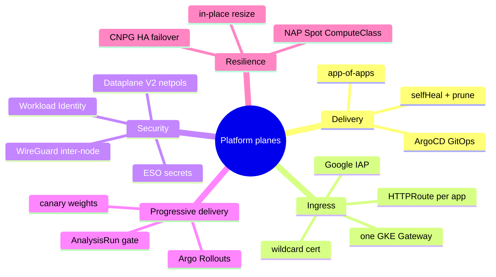

</details>

<details>
<summary>🟢 For newcomers — the five platform planes</summary>

The platform splits into five concerns, each run by its own controller — you rarely touch them by hand:

| Plane | What it does | Owned by |
|---|---|---|
| **Delivery** | Turns Git into running workloads. You bump an image tag in the GitOps repo; ArgoCD notices and reconciles the cluster. | ArgoCD (`selfHeal` + `prune`) |
| **Ingress** | Puts apps on the public internet — **one** global HTTPS load balancer, **one** wildcard cert, one `HTTPRoute` per app. | GKE Gateway API |
| **Identity at the edge** | Before a request reaches Jenkins/Headlamp/pgAdmin, **Google IAP** checks you're an allowed account. (The demo `microservices` host is public — no IAP.) | Identity-Aware Proxy |
| **Security inside** | Every namespace is default-deny; only listed traffic flows. Pod-to-pod traffic between nodes is encrypted. No static cloud keys anywhere. | Dataplane V2 NetworkPolicies + WireGuard + Workload Identity |
| **Safe releases** | Ship a new version to 20% of users first, watch it, widen only if healthy. | Argo Rollouts (canary) |

So a deploy is: *CI writes a tag → ArgoCD syncs → the new pod comes up behind the Gateway → IAP gates who can reach it → NetworkPolicies gate what it can talk to → (optionally) Argo Rollouts shifts traffic to it gradually*.
</details>

<details>
<summary>🔴 For specialists — how each plane is wired here</summary>

- **Delivery:** ArgoCD (auto-tracking the latest **3.4.x** via a daily CronJob watcher) runs single `Application`s (microservices `ApplicationSet`→`microservices-stable`, `headlamp`, `pgadmin`, `cnpg-operator`, `external-secrets`, `jenkins`, `argo-rollouts`) plus three **app-of-apps** (`platform-postgres`, `observability-oss`, `tekton`). A scoped `jenkins` ArgoCD account + API token lets the pipeline `argocd app sync --wait`. All apps `selfHeal: true` + `prune: true`.
- **Ingress:** one `Gateway` (`gatewayClassName: gke-l7-global-external-managed`) = one global external HTTPS LB + one Google-managed wildcard cert + one `HTTPRoute` per app; `BackendTLSPolicy` encrypts the LB→pod hop. Opt-in via `gateway.baseDomain` (empty disables it; `09-gateway.sh` no-ops off-GKE).
- **Edge identity:** IAP gates `jenkins`/`headlamp`/`pgadmin`/`grafana(oss)`; access = the emails granted `roles/iap.httpsResourceAccessor` (reuses `HEADLAMP_ADMIN_EMAILS`). The `microservices` host is intentionally public.
- **Security inside:** Dataplane V2 (`datapath_provider = ADVANCED_DATAPATH`) is what makes NetworkPolicies *enforce*; sensitive namespaces are `default-deny` + curated allowlists (see the matrix below). `in_transit_encryption_config` adds transparent WireGuard inter-node pod encryption (transport, not mTLS identity). Workload Identity Federation removes all static SA JSON keys; ESO syncs Secret Manager → namespaced Secrets. Dataplane V2 + WireGuard are **immutable** cluster fields (changing them recreates the cluster).
- **Progressive delivery:** the `argo-rollouts` controller + the `argoproj-labs/gatewayAPI` traffic-router plugin patch `HTTPRoute` `backendRefs[].weight` between the stable and `*-canary` Services — sidecar-free, no mesh. An `AnalysisRun` can gate promotion on Prometheus span-metrics (5xx / p95) and auto-rollback.
- **Resilience:** CNPG HA promotes a standby on primary loss; GKE Node Auto-Provisioning auto-creates Spot pools (ComputeClass `ci-spot`, taints `cloud.google.com/compute-class=ci-spot:NoSchedule` + `cloud.google.com/gke-spot=true:NoSchedule`) that scale to zero; in-place vertical resize grows agent containers without pod restarts.
</details>

## ArgoCD Inventory (GitOps)

The deployment lifecycle is managed by **ArgoCD**. Application manifests are stored in [`nubenetes/jenkins-2026-gitops-config/argocd/`](https://github.com/nubenetes/jenkins-2026-gitops-config/tree/main/argocd) and applied to the cluster by [`scripts/08.5-argocd.sh`](../scripts/08.5-argocd.sh). Jenkins CI writes image tags into that repo; ArgoCD detects the change and reconciles the cluster.

### Projects & Applications

| Resource | Type | Source repo | Source path | Target namespace | Health |
| :--- | :--- | :--- | :--- | :--- | :--- |
| `microservices` | `AppProject` | — | — | `microservices` | — |
| `microservices` | `ApplicationSet` | `jenkins-2026-gitops-config` | `helm/microservices/` | (generates one App) | — |
| `microservices-stable` | `Application` | `jenkins-2026-gitops-config` | `helm/microservices/` + `values-stable.yaml` | `microservices` | Synced |
| `headlamp` | `Application` | `jenkins-2026-gitops-config` | `helm/headlamp/values.yaml` | `headlamp` | Healthy |
| `pgadmin` | `Application` | `jenkins-2026-gitops-config` | `helm/pgadmin/` | `pgadmin` | Healthy |
| `cnpg-operator` | `Application` | `cloudnative-pg` chart | `https://cloudnative-pg.github.io/charts` | `cnpg-system` | Healthy |
| `external-secrets` | `Application` | `external-secrets` chart | `https://charts.external-secrets.io` | `external-secrets` | Healthy |
| `jenkins` | `Application` | `jenkins` chart (pinned 5.9.29) | `https://charts.jenkins.io` | `jenkins` | Healthy *(when `ci.engine=jenkins`)* |
| `argo-rollouts` | `Application` | `argo-rollouts` chart (2.37.7) | `https://argoproj.github.io/argo-helm` | `argo-rollouts` | Healthy |

> Plus three **app-of-apps** (`platform-postgres`, `observability-oss` when `observability.mode=oss`, and `tekton` when `ci.engine=tekton`), each a small Helm chart whose children carry the actual workloads. See [`argocd/README.md`](../argocd/README.md).
>
> Not an `Application`, but applied alongside them: [`argocd/argocd-version-patch-watcher.yaml`](../argocd/argocd-version-patch-watcher.yaml) — a daily `CronJob` in the `argocd` namespace that keeps ArgoCD auto-tracking the latest **3.4.x** patch (see [602 § version pinning](./602-VERSION_PINNING.md)).

<details>
<summary>📊 ArgoCD application inventory & app-of-apps tree</summary>

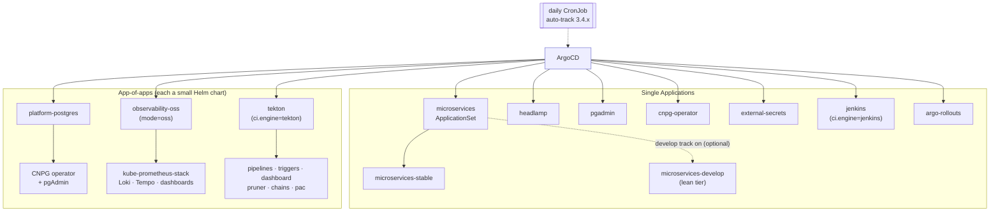

</details>

**Reading it —** ArgoCD owns two kinds of children. **Single `Application`s** map one chart/path to one namespace (the `microservices` `ApplicationSet` is the exception — it *generates* `microservices-stable`, and a `microservices-develop` when the develop track is on). **App-of-apps** are small Helm charts whose only job is to render a *family* of correlated children, so repo/branch/version flow down in one place — used where components must move together (Postgres operator+UI, the OSS stack, the Tekton control plane). The dashed watcher keeps ArgoCD itself on the latest 3.4.x patch. Engine/mode flags gate three of them (`jenkins`, `observability-oss`, `tekton`).

### Security & Integration

- **Jenkins Integration**: A dedicated `jenkins` account is created in ArgoCD with a scoped **API Token**. This token is stored in the `jenkins-credentials` Secret and used by the `argocd` CLI inside pipeline agents to trigger `argocd app sync --wait`.
- **Auto-Sync**: All Applications are configured with `selfHeal: true` and `prune: true`.
- **Rollout Waiting**: After pushing a new tag to the gitops-config repo, the Jenkins pipeline calls `argocd app wait --health --timeout 300` before running smoke tests.

## Telemetry Verification & Simulation

> **Full k6 reference:** the three runners below share one parametrizable script — **profiles** (smoke/load/stress/soak/spike/breakpoint), the `K6SIM_*` contract, `stable`-vs-`develop` targeting, and the layered result analysis are all documented in **[302 · k6 Traffic, Load & Observability Testing](./302-K6_LOAD_TESTING.md)**. The summaries here are the platform-ops view.

### 1. Continuous Traffic Simulation (GitHub Actions)

Use the **[`Day2.traffic.01 Continuous k6 simulation`](https://github.com/nubenetes/jenkins-2026/actions/workflows/Day2.traffic.01-k6.yml)** workflow:
- **Profile/shape**: `profile` input (default `smoke`) + overrides (`vus`, `duration`, `stages`, `rps`, thresholds) — a real **load/stress/spike** run, not just smoke. See [302 § GitHub Actions](./302-K6_LOAD_TESTING.md#github-actions).
- **Tier**: `env_name` input — `stable` (public `microservices.<domain>` host) or `develop` (public `microservices-develop.<domain>` host).
- **Purpose**: Simulates real-world user traffic from outside the cluster, hitting the GKE Gateway and triggering end-to-end traces.

The simulation reads the OTLP endpoint, auth and Grafana URL straight from the
in-cluster `grafana-cloud-credentials` Secret (provisioned by `Day1.cluster.01`), so no
extra GitHub secrets are needed — just run it against a live grafana-cloud
deployment.

### 2. On-Demand Smoke Test (Jenkins)

Trigger the **`microservices-k6-smoke`** job (or **`microservices-k6-smoke-develop`** for the develop tier) from the Jenkins UI via **Build with Parameters** — pick the profile/VUs/duration/thresholds, or just Build for the default smoke. See [302 § Jenkins](./302-K6_LOAD_TESTING.md#jenkins) and [301. Observability](./301-OBSERVABILITY.md) for what it measures.

### 3. How to Verify Correlation in Grafana

Once traffic is running, go to your Grafana Cloud instance:
- **Metrics to Logs**: Open the **Microservices Overview** dashboard. Click on any metric spike and use the **"Show Logs"** split-view.
- **Logs to Traces**: In **Explore (Loki)**, look for logs containing `trace_id`. Grafana will show a "Tempo" link next to the `trace_id`.
- **End-to-End Traces**: In **Explore (Tempo)**, search for `service.name="gateway"` to see the full request path.

## Platform QA, Chaos & Compliance Validation

### 1. Automated Compliance Validation Gate

```bash
./test/validation_gate.sh
```

This script lints and dry-runs all platform resources (WIF, Node Auto-Provisioning ComputeClass, Gateway API, RBAC policies, VPA limits) against the target API schema.

### 2. Platform Verification & Stress-Test Playbooks

#### Scenario A: In-Place Resize Verification

Prove that dynamic build agents scale up their container resources dynamically without terminating or changing the Pod UID.

1. **Trigger Workload**: Run a dynamic microservice build job in Jenkins.
2. **Retrieve the Pod ID**: `kubectl get pods -n jenkins -l role=jenkins-agent`
3. **Trigger Resource Upscale**:
   ```bash
   kubectl patch pod <agent-pod-name> -n jenkins --type=json -p='[
     {"op": "replace", "path": "/spec/containers/0/resources/limits/cpu", "value": "3"},
     {"op": "replace", "path": "/spec/containers/0/resources/limits/memory", "value": "4Gi"}
   ]'
   ```
4. **Monitor the Resize Lifecycle**:
   ```bash
   kubectl get pod <agent-pod-name> -n jenkins -w -o jsonpath='{.status.resize}{"\t"}{.status.containerStatuses[0].resources}{"\n"}'
   ```
   Status transitions: `Resize: Proposed` → `Resize: InProgress` → `Resize: Succeeded` without the pod restarting.

#### Scenario B: Node Auto-Provisioning Elasticity & Spot Provisioning

1. **Deploy a Burst Load**: Schedule 50 parallel sleep pods onto the `ci-spot` ComputeClass.
2. **Watch Node Allocation**: `kubectl get nodes -l cloud.google.com/compute-class=ci-spot -o custom-columns=NAME:.metadata.name,SPOT:.metadata.labels.cloud\.google\.com/gke-spot -w`
3. **Trigger Scale Down**: `kubectl scale deployment k6-burst-test -n jenkins --replicas=0`
4. **Verify Consolidation**: `kubectl get events --field-selector reason=ScaleDown -n kube-system`

#### Scenario C: Constrained Impersonation (Zero-Trust RBAC)

```bash
# Test Developer Impersonation (Allowed)
kubectl auth can-i create deployments -n microservices \
  --as=system:serviceaccount:headlamp:headlamp-service-account \
  --as-group=developer-group
# Output: yes

# Test Cluster-wide Escalation (Denied)
kubectl auth can-i get secrets --all-namespaces \
  --as=system:serviceaccount:headlamp:headlamp-service-account \
  --as-group=developer-group
# Output: no
```

#### Scenario D: CloudNative-PG Operator HA Failover

1. **Verify HA Replication**: `kubectl get cluster postgres-gateway -n microservices -o yaml`
2. **Simulate Primary Node Failover**:
   ```bash
   # Find the current primary
   kubectl get cluster postgres-gateway -n microservices -o jsonpath='{.status.currentPrimary}'
   # Delete the primary pod to simulate hard crash
   kubectl delete pod <current-primary-pod> -n microservices --grace-period=0 --force
   # Watch the cluster recovery
   kubectl get pod -n microservices -l cnpg.io/cluster=postgres-gateway -w
   ```
   Within seconds, CNPG promotes a standby to Primary. The deleted pod is automatically rescheduled as a standby replica.

## Golden Path IDP Modernizations (Node Auto-Provisioning & modern scheduling)

The repository has been refactored to serve as a **Golden Path Internal Developer Platform (IDP)** utilizing modern Kubernetes scheduling features, GKE Node Auto-Provisioning, zero-trust security, and decoupled GitOps patterns.

### 1. Modern Scheduling Compliance
* **In-Place Pod Vertical Scaling**: Jenkins ephemeral agent pod templates are defined with explicit `resizePolicy` parameters (`NotRequired` for CPU and Memory), allowing active Maven or Node build containers to scale resource requests/limits dynamically without restarting the pod.
* **Safe JVM Resource Resizing Floors**: Configured `VerticalPodAutoscaler` (VPA) rules for JVM microservices to enforce `minAllowed` memory thresholds (`512Mi`).
* **Workload-Aware / Gang Scheduling**: Integrated `PodGroup` scheduling resources (`parallel-smoke-tests`) to prevent resource starvation deadlocks during heavy concurrent microservice testing workflows.
* **UI/UX Constrained Impersonation**: Implemented `ConstrainedImpersonation` policies in Headlamp UI roles. This allows the Headlamp UI ServiceAccount to impersonate specific target user groups without requiring global cluster-admin role escalation permissions.

### 2. Elastic Node Auto-Provisioning (Spot ComputeClass)
* **Cluster-level NAP**: [`terraform/gke`](../terraform/gke/) enables a `cluster_autoscaling` block (`resource_limits` for cpu/memory + `auto_provisioning_defaults`: the dedicated node SA `jenkins-2026-nodes`, COS_CONTAINERD, Shielded VMs, auto-repair/upgrade, `pd-balanced`, `OPTIMIZE_UTILIZATION` profile), gated by the `enable_node_autoprovisioning` variable (default true).
* **Custom ComputeClass `ci-spot`**: [`infrastructure/compute-classes/ci-spot.yaml`](../infrastructure/compute-classes/ci-spot.yaml) sets `nodePoolAutoCreation.enabled: true` with `priorities` preferring **Spot** across families (`c3`, `n2`, `c2`, `e2`) then falling back to on-demand `e2`, `whenUnsatisfiable: ScaleUpAnyway`. GKE auto-applies the `compute-class=ci-spot` / `gke-spot=true` `NoSchedule` taints so only build agents (which carry the matching nodeSelector + tolerations) land on the elastic Spot pools.
* **Per-engine placement — `{jenkins,tekton}.runNodePool: static | ci-spot` (default `static`).** Whether build pods target the **static pool** (robust, no NAP/Spot/quota dependency) or the **`ci-spot` ComputeClass** (elastic Spot) is a feature flag *per CI engine* (override `JENKINS2026_{JENKINS,TEKTON}_RUN_NODE_POOL`), because the engines differ in Spot-suitability: a **Jenkins** build is a single agent pod, so a preemption just restarts that one build (a fine Spot citizen → ci-spot opt-in is low-risk); a **Tekton** PipelineRun pins *all* its tasks to one node via the affinity assistant (shared RWO PVC), so a preemption kills the whole run and a too-small/full node hangs it (→ `static` strongly recommended). Both default to `static`, so **CI doesn't push against the `SSD_TOTAL_GB` quota** (no per-build PD) out of the box; flip an engine to `ci-spot` to opt into Spot. Jenkins reads the flag in [`vars/MicroservicesPipeline.groovy`](../vars/MicroservicesPipeline.groovy) (via JCasC `RUN_NODE_POOL`); Tekton applies it as the `default-pod-template` (see [`docs/403`](403-TEKTON.md)).
* **Autoscaler Isolation**: The static `jenkins-2026-pool` (long-lived platform) and the NAP-auto-created Spot pools are strictly isolated, so a NAP issue never blocks the core provision.
* **Spot preemption — trade-off & resilience (read before relying on it).** Spot VMs can be reclaimed by GCE with **~30s notice**, so a node running a CI agent can disappear *mid-build*. This is a deliberate, acceptable trade-off here because **CI is exactly the right workload for Spot**: builds are **ephemeral and idempotent** (re-running produces the same artifact) and **nothing on the critical platform path runs on Spot** — ArgoCD, Jenkins/Tekton controllers, observability and CNPG all stay on the static pool. The resilience design is layered:
  * **On-demand fallback** — the `ci-spot` ComputeClass falls back to on-demand `e2` (`whenUnsatisfiable: ScaleUpAnyway`), so a Spot **stock-out** never leaves a build Pending; it just runs on a regular node.
  * **Preemption ≠ stuck** — if a Spot node *is* reclaimed, GKE reschedules the agent Pod and NAP provisions a fresh node (Spot, or on-demand on stock-out); the affected build fails fast and is simply re-run (no manual cleanup).
  * **Escape hatch** — for **guaranteed, non-preemptible completion**, keep (or set) the engine's `runNodePool: static` (the default) so its agents schedule on the static pool — finer-grained than disabling NAP, and it's already the default. To remove NAP cluster-wide instead, set `nodeAutoProvisioning.enabled: false` (or `JENKINS2026_NODE_AUTOPROVISIONING_ENABLED=false`). One toggle, no manifest edits — see [`config/config.yaml`](../config/config.yaml).
  * **Watch it** — the **CI-CD / Node Auto-Provisioning (Spot)** Grafana dashboard ([`observability/grafana/dashboards/node-autoprovisioning.json`](../observability/grafana/dashboards/node-autoprovisioning.json)) shows Spot vs static node counts over time, so you can see scale-up on a build and consolidation back toward zero after it.
  * **The real ceiling is the regional `SSD_TOTAL_GB` quota, not NAP.** Each node's `pd-balanced` boot disk counts against that quota, so the number of *concurrent* Spot CI nodes is bounded by `SSD_TOTAL_GB` ÷ disk-size (plus the static-pool disks and the CNPG Postgres PVs). Symptom when you hit it: the agent Pod stays `Pending` and `kubectl get events` shows `cluster-autoscaler … ScaleUpFailed … Quota 'SSD_TOTAL_GB' exceeded` (NAP keeps retrying across machine families — it's doing the right thing, GCE is refusing the disk). The NAP node disk is kept at `var.disk_size_gb` (50 GB, same as the static pool) precisely to stretch this quota. **Raising the quota is NOT self-service-instant**: a consumer-quota *override* caps at Google's self-service maximum, which for `SSD_TOTAL_GB` equals the current limit (500) — higher values return `COMMON_QUOTA_CONSUMER_OVERRIDE_TOO_HIGH` (so it can't be set in Terraform either). Above 500 needs an **approved increase request** — submit a Cloud Quotas `QuotaPreference` (`cloudquotas.googleapis.com`, quotaId `SSD-TOTAL-GB-per-project-region`) or Console → *IAM & Admin → Quotas*; it reconciles to `grantedValue` after Google approves. This is also **why `runNodePool` defaults to `static`** — CI then needs no extra SSD headroom. See [`docs/runbooks/nap-spot-provisioning.md`](runbooks/nap-spot-provisioning.md).

> **Runbook**: for a step-by-step live validation (get cluster access despite the
> auth-plugin/stale-IP gotchas, trigger a build, watch NAP bring up a Spot `ci-spot` node,
> and read the `SSD_TOTAL_GB` quota ceiling + cold-start behaviour) see the
> [NAP → Spot CI nodes runbook](./runbooks/nap-spot-provisioning.md).

#### The `SSD_TOTAL_GB` quota — how it's computed, what it costs, and the increase request

> **TL;DR** — `SSD_TOTAL_GB` is a **regional GCP quota** (currently **500 GB** in `europe-southwest1`) that caps the *total* SSD-backed disk in the region. It counts **every** `pd-ssd` **and** `pd-balanced` disk — node boot disks *and* PVs — so it is the **binding capacity ceiling** for the cluster, and the reason `ci-spot` elasticity is bounded. It is **only meaningfully consumed at scale by `ci-spot`**; the `static` default needs no extra headroom.

<details>
<summary>🧠 <b>Mental model</b> — the whole picture in one map (read this first)</summary>

**Basic version (one paragraph):** GCP limits how much fast disk (SSD) you can have in the region to **500 GB**. *Everything* with a disk counts: the databases, the monitoring stack, **and every VM's boot disk**. When CI runs on cheap **Spot** nodes, each new node adds a 50 GB boot disk — pile up enough at once and you hit the 500 GB wall, so the next build can't get a node and waits. The wall isn't a money limit (the quota is free); it's a **safety ceiling**. You pay only for disks that actually exist — which is why **pausing** the cluster (deletes the VM disks) drops the bill to almost nothing.

**Advanced version (the model):**

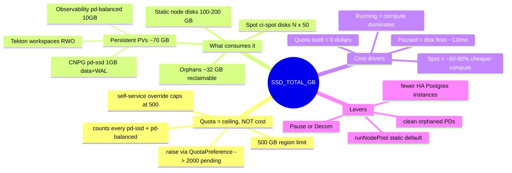

**The three things people conflate (and shouldn't):**
| Concept | What it is | What it is NOT |
|---|---|---|
| **Quota** (`SSD_TOTAL_GB`) | a *capacity ceiling* on total SSD GB in the region | not a cost, not per-node, not per-pod |
| **Disk** (`pd-ssd`/`pd-balanced`) | the actual billed storage (PVs + node boot disks) | not the quota; the quota just bounds their sum |
| **Placement** (`runNodePool`) | whether CI adds *new* node disks (Spot) or reuses the static pool | not a quota or cost setting directly — but `ci-spot` is what pushes disk demand up |

</details>

**How the quota is computed — every SSD disk sums against the 500 GB ceiling:**

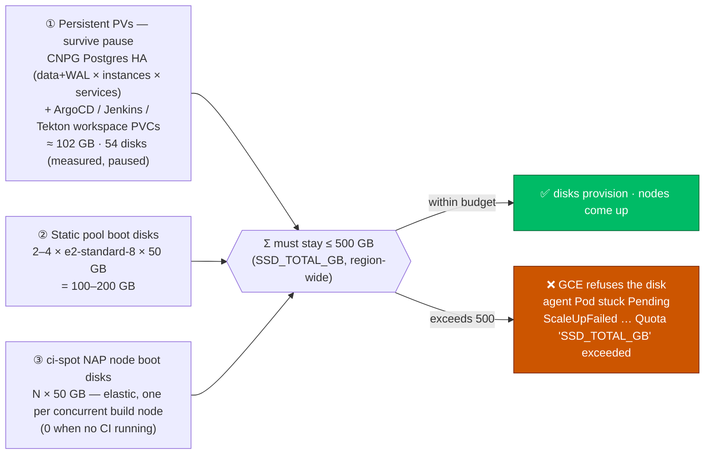

①+② are **fixed** (the platform + databases); only **③ grows** with `ci-spot` concurrency. So the usable Spot budget is roughly `500 − (PVs) − (static disks)` ÷ 50 GB ≈ **3–4 concurrent Spot CI nodes** before the ceiling bites.

**Detailed disk inventory — ① the persistent PVs** (measured live; the architectural footprint, paused state):

| Namespace | Component | PVC(s) | Disk type | Size each | Qty | Subtotal | Why this size/type |
|---|---|---|---|---|---|---|---|
| `microservices` | **CNPG Postgres — stable HA** | `postgres-{gateway,jhipstersample}-{1,2,3}` + `…-wal` | `pd-ssd` | 1 GB | 12 | **12 GB** | 3 HA instances × 2 services × (data + WAL); `pd-ssd` for low-latency WAL fsync / random I/O |
| `microservices-develop` | **CNPG Postgres — lean dev** | `postgres-{gateway,jhipstersample}-1` + `…-wal` | `pd-ssd` | 1 GB | 4 | **4 GB** | single instance × 2 services × (data + WAL); non-HA dev tier |
| `observability` | **Prometheus TSDB** | `prometheus-…-0` | `pd-balanced` | 10 GB | 1 | 10 GB | metrics time-series store (mode=oss); balanced is enough |
| `observability` | **Loki** | `storage-oss-loki-0` | `pd-balanced` | 10 GB | 1 | 10 GB | log chunks store |
| `observability` | **Tempo** | `storage-oss-tempo-0` | `pd-balanced` | 10 GB | 1 | 10 GB | trace store |
| `pgadmin` | **pgAdmin** | `pgadmin-pgadmin4` | `pd-balanced` | 10 GB | 1 | 10 GB | pgAdmin config/session state |
| `tekton-ci` | **Tekton run workspaces** | `pvc-<hash>` (volumeClaimTemplate) | `pd-balanced` | 1–4 GB | ≤5 | ~14 GB | one RWO `source` workspace per PipelineRun; bounded by the Pruner `historyLimit: 5` |
| | | | | | | **≈ 70 GB live** | |

> ⚠️ **Orphaned disks inflate the measured total.** The region currently shows **102 GB / 54 disks**, ~32 GB above the ~70 GB live footprint. Evidence: **duplicate PVC names that cannot coexist in a live cluster** (e.g. `postgres-gateway-2` maps to **3** separate disks) and disks spanning **3 creation dates** (`06-27`, `06-28`, `06-29`). These orphans count against the quota and the ~$13/mo disk floor — see the dedicated subsection below for the cause and the **two-layer auto-reclaim**.

#### Orphaned persistent disks — cause, prevention (①), and the sweep (②)

When a `Decom` tears the cluster down via `terraform destroy`, the GKE control plane (and with it the **CSI driver**) disappears **before** Kubernetes gets to delete the PVCs — so `reclaimPolicy: Delete` never fires and the backing `pd-*` disks are **orphaned** in the GCP project. They **accumulate one generation per rebuild**, each costing money and consuming `SSD_TOTAL_GB`. Two complementary layers handle this automatically (durable default; disable with `J2026_ORPHAN_PD_SWEEP=false`):

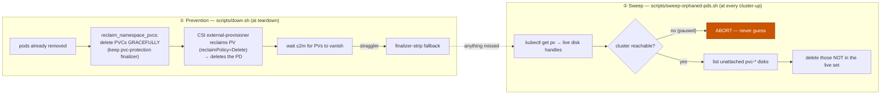

| Layer | File | When | What it does | Why it's safe |
|---|---|---|---|---|
| **① Prevention** | [`scripts/down.sh`](../scripts/down.sh) `reclaim_namespace_pvcs` | teardown (`Decom`, `J2026_DELETE_NAMESPACES=true`) | deletes PVCs **gracefully** (finalizer intact) so CSI reclaims each PD *before* the cluster is destroyed; finalizer-strip only as fallback | runs while CSI is alive; bounded ~2 min/ns; data-namespace deletion is already gated behind the explicit `DELETE_NAMESPACES` flag |
| **② Sweep** | [`scripts/sweep-orphaned-pds.sh`](../scripts/sweep-orphaned-pds.sh) (called by [`up.sh`](../scripts/up.sh)) | every **cluster-up** (Day1), or standalone | reconciles all unattached `pvc-*` disks against live PV `volumeHandle`s and deletes the difference | deletes **only** `pvc-*` (never `gke-*` node disks), **only** unattached, **only** if not referenced by a live PV; **aborts if the cluster is unreachable** so a *paused* cluster's PVs are never mistaken for "0 live PVs" |

**Run it standalone** (e.g. after a `Resume`, with the cluster reachable):

```bash
# preview first (deletes nothing):
J2026_ORPHAN_PD_SWEEP_DRYRUN=true scripts/sweep-orphaned-pds.sh
# then the real sweep:
scripts/sweep-orphaned-pds.sh
```

> 🔒 **Why the sweep refuses to run against a paused cluster.** Identifying orphans means "every `pvc-*` disk **not** backing a live PV". If `kubectl` can't reach the cluster, the live-PV list comes back empty and *every* disk would look orphaned — including a paused cluster's live databases. The sweep therefore **hard-aborts** when `kubectl get pv` fails. This is exactly why the current ~32 GB of orphans are cleaned at the **next cluster-up**, not while paused.

**Disk class — why each workload gets `pd-ssd` vs `pd-balanced`:**

| Disk class | Workloads | Rationale | ≈ Cost |
|---|---|---|---|
| **`pd-ssd`** | CNPG Postgres data + WAL | DB needs low-latency random I/O + fast WAL fsync (commit latency) | ~$0.17 / GB·mo |
| **`pd-balanced`** | node boot disks · Prometheus/Loki/Tempo · pgAdmin · Tekton workspaces | general-purpose SSD; ample for OS/boot, append-mostly TSDB, and scratch | ~$0.10 / GB·mo |

**② + ③ — node boot disks (static vs Spot) and the workload each serves:**

| Disk | Node pool | Class · size | Lifecycle | Workload it carries | Quota impact |
|---|---|---|---|---|---|
| **Static node boot** | `jenkins-2026-pool` | `pd-balanced` · 50 GB | always-on (0 only when **Paused**) | platform (ArgoCD/Jenkins/observability/CNPG) **+ CI build pods by default** (`runNodePool: static`) | **fixed** — 2–4 nodes = 100–200 GB |
| **Spot node boot** | NAP `ci-spot` (auto-created) | `pd-balanced` · 50 GB | **per-build, scale-to-zero** | CI build pods **only when** `runNodePool: ci-spot` | **elastic** — N × 50 GB, 0 at rest |
| **Persistent PV** | — (CSI PD, not node-bound) | `pd-ssd`/`pd-balanced` · 1–10 GB | survives Pause; deleted only with the PVC | databases · observability · Tekton workspaces | **fixed** — ~70 GB live |

**Usage these days (measured, limit = 500 GB):**

| Cluster state | SSD used | % of 500 | What's on disk |
|---|---|---|---|
| **Paused** (`Day2.scale.01`, nodes → 0) | **102 GB** | **~20 %** | only ① — the 54 persistent PVs (DBs + platform); node disks are deleted |
| **Running, idle CI** | ~200 GB | ~40 % | ① + 2 static node disks |
| **Running, CI under load (peak observed)** | ~492 GB | **~98 %** | ① + up to 4 static + several `ci-spot` Spot nodes — *this is where builds wedged* |

**FinOps — cost breakdown** (approximate GCP list prices for `europe-southwest1`; verify in the [pricing calculator](https://cloud.google.com/products/calculator)).

*Basic:* the **quota is free**; you pay for **disks** (small) and **compute** (large). Paused ≈ **$20/month** (disks + IP only); running ≈ **$0.55/hour** (compute dominates); off (Decom) = **$0**.

*Advanced:* compute is ~95 % of the running cost, so disk/quota tuning is about **capacity, not the bill** — the bill lever is *node hours* (Pause/Decom) and *Spot* (−60–80 % on compute). Cleaning the ~32 GB of orphaned PDs saves ~$5/mo **and** frees quota.

**① Unit rates:**

| Resource | ≈ Rate | Note |
|---|---|---|
| `pd-ssd` | ~$0.17 / GB·month | low-latency SSD — CNPG data + WAL |
| `pd-balanced` | ~$0.10 / GB·month | general SSD — node boot, TSDBs, workspaces |
| `e2-standard-8` (on-demand) | ~$0.22 / hour (~$160/mo) | static pool compute |
| `e2-standard-8` (**Spot**) | ~$0.05–0.09 / hour | `ci-spot` nodes — **60–80 % cheaper**, preemptible |
| Cluster management fee | $0.10 / hour | **waived** for the 1st zonal cluster per billing account |
| Static external IP | ~$7 / month | the persistent Gateway IP |
| **`SSD_TOTAL_GB` quota** | **$0** | a ceiling, not a charge |

**② Disk cost by component** (the persistent floor — survives Pause):

| Component | Type | GB | ≈ $/month |
|---|---|---|---|
| CNPG Postgres — stable HA | `pd-ssd` | 12 | ~$2.0 |
| CNPG Postgres — develop | `pd-ssd` | 4 | ~$0.7 |
| Observability (Prometheus/Loki/Tempo) | `pd-balanced` | 30 | ~$3.0 |
| pgAdmin | `pd-balanced` | 10 | ~$1.0 |
| Tekton workspaces (≤5 runs) | `pd-balanced` | 14 | ~$1.4 |
| **Live PV subtotal** | | **70** | **~$8.1** |
| Orphaned PDs (**reclaimable**) | `pd-ssd` | 32 | ~$5.4 |
| **Measured total** | | **102** | **~$13.5** |

**③ Total cost by cluster lifecycle state:**

| State | What's billed | ≈ Per hour | ≈ Per month (if left 24×7) |
|---|---|---|---|
| **Decom** (destroyed) | nothing | **$0** | **$0** |
| **Paused** (`Day2.scale.01`, nodes → 0) | PVs (~102 GB) + static IP | ~$0.03 | **~$20** |
| **Running** (2 static nodes, idle CI) | 2× compute + node disks + PVs + IP | ~$0.55 | ~$345 |
| **Running + Spot CI burst** | + N `ci-spot` Spot nodes (per build) | +~$0.07 / node·hr | ephemeral (scale-to-zero) |

> 💡 The quota does **not** cost anything — raising it to 2000 does **not** raise the bill. You only ever pay for the disks you actually provision. The quota is purely a *safety ceiling*; the cost lever is **Pause** (drops compute to ~$13/mo) or **Decom** (drops to ~$0).

**Quota options — what you can set and how:**

| Option | Effective `SSD_TOTAL_GB` | Cost | Mechanism / constraint |
|---|---|---|---|
| **Current** (project default) | **500 GB** | — | the region default for `europe-southwest1` |
| **Self-service override** | **0 – 500 GB** | $0 | `google_service_usage_consumer_quota_override` (Terraform) / Service Usage API — can only **match or lower**; any value >500 → `COMMON_QUOTA_CONSUMER_OVERRIDE_TOO_HIGH` |
| **Approved increase request** | up to the granted value (**2000 filed**) | $0 | Cloud Quotas `QuotaPreference` (`SSD-TOTAL-GB-per-project-region`) / Console → Quotas — **needs Google approval** (currently pending) |
| **Reduce demand instead** (no quota change) | n/a | **saves $** | `runNodePool: static` (no per-build disk) · fewer HA instances (`postgresInstances` 3→1) · **clean orphaned PDs** (~32 GB reclaimable now) |

**The increase request to Google (500 → 2000):**
- A consumer-quota **override** caps at the self-service max, which for `SSD_TOTAL_GB` **equals the current limit (500)** → higher returns `COMMON_QUOTA_CONSUMER_OVERRIDE_TOO_HIGH`. **Not Terraform-able** (an override to 2000 would fail the apply).
- Going above 500 needs an **approved increase request**, submitted via the **Cloud Quotas API** as a `QuotaPreference` (`cloudquotas.googleapis.com`, quotaId `SSD-TOTAL-GB-per-project-region`, region `europe-southwest1`).
- **Status:** a request to **2000** was filed (`QuotaPreference ssd-total-gb-esw1`); it currently shows `preferredValue: 2000`, `grantedValue: 500`, i.e. **pending Google's approval** (small bumps auto-approve, a 4× may go to human review — minutes to days). Re-`GET` the preference (or Console → *IAM & Admin → Quotas*) and watch `grantedValue` catch up.

**Roadmap / decision guide:**

| Goal | Action |
|---|---|
| **Default / now** — robust CI, no quota pressure | `{jenkins,tekton}.runNodePool: static` (no per-build disk). 500 GB is plenty. |
| **Cut idle cost** | **Pause** (`Day2.scale.01`) → ~$13/mo · or **Decom** → ~$0 |
| **Enable Spot CI at concurrency** | Wait for the 500 → 2000 grant, **then** flip **Jenkins** to `runNodePool: ci-spot` (best Spot fit). Tekton stays `static`. |
| **More DB headroom without more quota** | reduce the HA Postgres footprint (3 → 1 instance on the develop tier) — fewer PVs |

See the live-validation steps + the exact API call in [`docs/runbooks/nap-spot-provisioning.md`](runbooks/nap-spot-provisioning.md).

#### Jenkins vs Tekton on Spot (`ci-spot`) — why the placement flag is *per engine*

Both CI engines can target the `ci-spot` ComputeClass, but they have **fundamentally different pod-scheduling shapes**, so the same Spot node behaves very differently under each. This is why placement is a **separate flag per engine** ([`jenkins.runNodePool`](../config/config.yaml) / [`tekton.runNodePool`](../config/config.yaml)) rather than one shared knob — you want to make the engine-appropriate choice, and the engines are mutually exclusive anyway (`ci.engine`) so a shared flag would only ever describe the active one.

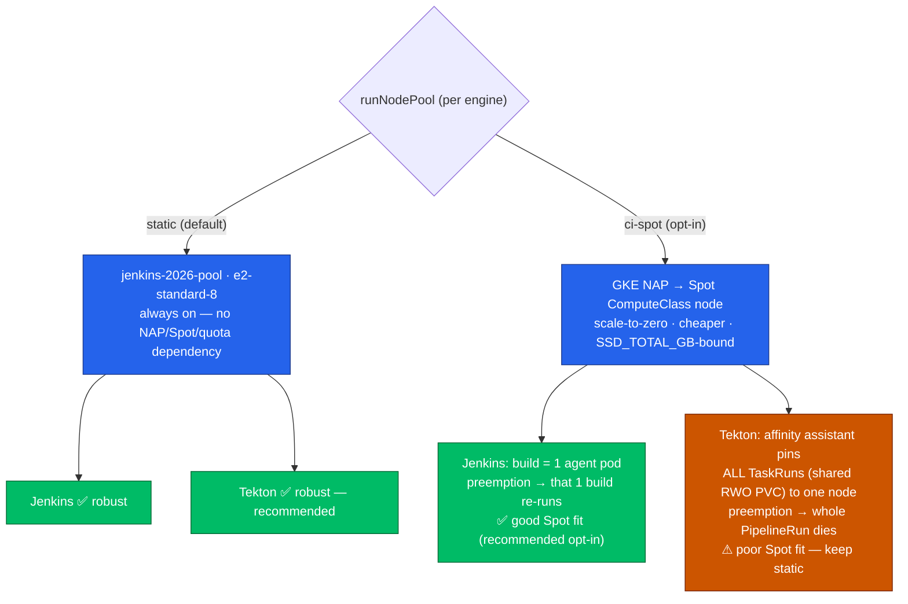


| Dimension | **Jenkins** | **Tekton** |
|---|---|---|
| **Build = how many pods?** | **One** ephemeral multi-container agent pod (maven/node/dind/… containers share it) | **Many** TaskRun pods (clone → build → scan → push → deploy), one pod per Task |
| **Inter-pod coupling** | None — the whole build *is* one pod | The Tasks share **one RWO `source` workspace PVC** (cloned once, reused), so Tekton's **affinity assistant** co-schedules **all** of a PipelineRun's pods onto **one node** (the only way to mount an RWO PVC across pods) |
| **Spot preemption blast radius** | **One build** — the agent pod dies, GKE reschedules it, NAP brings a fresh node, the build is simply **re-run** (idempotent). Minimal. | **The entire PipelineRun** — every Task rides the same node; lose it and *all* in-flight Tasks die together (the RWO PVC was on that node). Much larger. |
| **"Node too small/full" failure** | Rare — a single pod either fits the (4-vCPU+) Spot node or NAP scales another | **Real hazard** — if the assistant lands on a small NAP node (e.g. `e2-standard-2`), a later/retried Task (`codeql`, 500m) may not fit, and an affinity-pinned pod **can't move or trigger a useful scale-up** → the run hangs in `ExceededNodeResources` (the v0.28.53 bug) |
| **Spot fit** | **Good citizen** — single, idempotent, short-lived pod is the textbook Spot workload | **Poor fit as-is** — a long, multi-Task run pinned to one preemptible node is exactly what Spot is *bad* at |
| **Recommended `runNodePool`** | `static` by default; **`ci-spot` is the recommended opt-in** (most cost upside, least risk) | **`static`** (strongly) — keep Spot off unless you re-architect the workspace (RWX/Filestore + disable the affinity assistant, or per-Task `emptyDir` + artifact passing) |

**So: is `static` still the right *default* even though Jenkins is the better Spot citizen?** Yes — for two independent reasons:
1. **Robustness with zero preconditions.** `static` needs no NAP, no Spot capacity, and **no `SSD_TOTAL_GB` headroom** — it just works on a fresh cluster for everyone. `ci-spot` needs all three.
2. **The quota ceiling is currently binding.** Each `ci-spot` node's boot disk counts against the regional `SSD_TOTAL_GB` quota, which **caps at 500 self-service** (raising it needs an approved request — see above). At 500, a couple of concurrent `ci-spot` agents can wedge in `Pending`. We observed exactly this on a real Day1 (the `gateway` agent stuck on `ScaleUpFailed … Quota 'SSD_TOTAL_GB' exceeded`).

**Recommended rollout (sequenced):**

| Phase | Jenkins | Tekton |
|---|---|---|
| **Now** (quota = 500) | `static` | `static` |
| **After the `SSD_TOTAL_GB` increase is granted** | **`ci-spot`** — best cost/elasticity, lowest risk | `static` (the affinity-assistant hazard is independent of quota; only an RWX-workspace redesign would make Tekton-on-Spot safe) |

Flip per engine with the config flag (durable) or the **`run_node_pool` input** on `Day2.redeploy.02-jenkins` / `Day2.redeploy.03-tekton` (per-run, no commit). See the Tekton-specific mechanics and the RWX/affinity-assistant alternatives in [`docs/403`](403-TEKTON.md).

### 3. Zero-Trust Security & Workload Identity
* **Workload Identity Federation**: All static JSON Service Account keys are removed. Both external CI engines (GitHub Actions) and in-cluster workloads assume GCP IAM Roles dynamically via OIDC.
* **GKE Gateway API + BackendTLSPolicy**: Traffic between the Gateway load balancer and backend pods (Jenkins/Headlamp) is encrypted and validated using `BackendTLSPolicy` targets.
* **GKE Dataplane V2 (Cilium/eBPF) — NetworkPolicy *enforcement***: the cluster runs Dataplane V2 (`datapath_provider = ADVANCED_DATAPATH` in [`terraform/gke`](../terraform/gke/main.tf)). This is what makes the policies below *actually enforce* — without it (and without the legacy Calico addon, mutually exclusive with it) GKE accepts `NetworkPolicy` objects but silently ignores them.
* **Zero-Trust Network Policies** ([`infrastructure/networkpolicies*.yaml`](../infrastructure/)): every namespace egresses to CoreDNS by default-deny. Sensitive namespaces (**observability, microservices, postgres, pgadmin**, and **jenkins** in jenkins mode) run `default-deny` + curated allowlists. Workload UI/CI namespaces (**argocd, headlamp, tekton-ci**) get a **deny-ingress / allow-egress baseline**: each namespace's entry port stays reachable (Gateway, CI sync, port-forward, CLI) while internal components are intra-namespace only; the outbound-only pipeline pods get no ingress. Admission-webhook operator namespaces (**tekton-pipelines, cnpg-system, external-secrets, pipelines-as-code**) are intentionally left open — a `deny-ingress` there would block the API server's webhook calls unless the GKE control-plane CIDR is allowlisted (fragile, cluster-specific). The observability policy also allows the GKE L7 health-check/proxy ranges (`130.211.0.0/22`, `35.191.0.0/16`) so the Grafana backend stays healthy under enforcement.
* **Pod-to-pod WireGuard encryption**: `in_transit_encryption_config = IN_TRANSIT_ENCRYPTION_INTER_NODE_TRANSPARENT` has Dataplane V2's managed Cilium transparently encrypt **inter-node** pod traffic (sidecar-free, no service mesh, no app changes). This is *transport* encryption, not identity-based mutual auth (no per-workload mTLS identity/authZ like Istio/Linkerd) — it closes the plaintext-on-the-wire gap lightly. Same-node pod traffic never hits the wire, so it is not encrypted.
* **Secret Management via External Secrets Operator (ESO)**: Connects GKE Workload Identity with Google Secret Manager. ESO automatically pulls and syncs secret structures to namespaced secrets dynamically.

> ⚠️ Dataplane V2 + the WireGuard config are **immutable** cluster fields — applied by recreating the cluster (`Decom.cluster.01` → `Day1.cluster.01`), not an in-place re-run. Enabling enforcement activates the NetworkPolicies for the first time, so validate connectivity (OSS stack, CNPG metrics, microservices, gateway, ArgoCD sync, Tekton triggers) on the fresh cluster.

<details>
<summary>NetworkPolicy under enforcement — the gotchas that bite on the first Dataplane V2 cluster</summary>

The first recreate with enforcement surfaced several latent rules that had silently been no-ops. Lessons baked into [`infrastructure/networkpolicies.yaml`](../infrastructure/networkpolicies.yaml):

- **Target the POD port, not the Service port.** GKE's container-native LB (NEG) sends to the pod's `targetPort`, not the Service port. The argocd/headlamp baselines first allowed `80`/`443` (Service ports) → the health checks hit `argocd-server:8080` / `headlamp:4466` and were dropped → **GKE backend UNHEALTHY**. Allow the real container ports.
- **The API server (control plane) is not a pod or an LB range.** Admission webhooks the API server calls — the **OTel operator** mutating webhooks (`9443`, in `observability`) and the Tekton control-plane webhooks — are blocked by a namespace default-deny. With `failurePolicy=Fail` this breaks applying the CRs (e.g. the `Instrumentation` CR → `microservices-stable` stuck OutOfSync); with `failurePolicy=Ignore` it silently skips work (no OTel agent injected). Allow the webhook port from any source, or leave the operator namespace open (we leave `tekton-pipelines`/`cnpg-system`/`external-secrets`/`pac` open by design).
- **GKE L7 health-check/proxy ranges** `130.211.0.0/22` + `35.191.0.0/16` must be allowed (by `ipBlock`) for any Gateway-exposed backend whose policy restricts ingress (e.g. Grafana).
- **Match CNPG pods by `cnpg.io/cluster`, not `app.kubernetes.io/name`.** CNPG labels its pods `app.kubernetes.io/name=postgresql`; an egress allow targeting `app.kubernetes.io/name: postgres-*[-pooler]` matches nothing → apps time out on Liquibase. (Carried by the additive `microservices-cnpg-platform` policy, plus `9187` ingress for metrics scraping.)
- **K8s-API egress for app discovery.** The JHipster microservice uses Hazelcast Kubernetes member discovery (queries the API server on `443`); without egress to `443` it never goes Ready. Apps that talk to the API need explicit egress.
- **Jenkins build agents need their OWN egress allow.** The `jenkins` `default-deny` caps every pod's egress at DNS, and `jenkins-policy`'s open egress only matches the controller (`app.kubernetes.io/name=jenkins`). The ephemeral Kubernetes-plugin agent pods (label `jenkins=slave`) matched neither, so they couldn't reach the controller's `8080` tcpSlaveAgentListener / `50000` JNLP — every build hung at "Waiting for agent to connect" and the **seed job timed out**. The separate `jenkins-agent-policy` (in [`networkpolicies-jenkins.yaml`](../infrastructure/networkpolicies-jenkins.yaml)) grants `jenkins=slave` pods open egress (no ingress — they're outbound-only, like the tekton-ci pipeline pods).
- **CI smoke tests must run where egress *and* ingress are allowed.** The post-deploy health check (`<svc>:8081/management/health`, or the gateway on `8080`) crosses into the locked-down `microservices` namespace. Two policies must both permit it: (a) the microservice's own ingress — `microservice-policy` (in the **gitops-config** repo, `helm/microservices/networkpolicies.yaml`) allows the app port from the `gateway` pod **and** the `tekton-ci` / `jenkins` namespaces; and (b) the smoke pod's **egress**. Tekton satisfies (b) naturally — its smoke runs as a pipeline pod in `tekton-ci` (open egress). Jenkins' `microservicesSmokeTest` originally did `kubectl -n microservices run`, putting the curl pod **in the microservices namespace** (default-deny egress = DNS only) → it could never connect → **curl exit 28**. Fixed by creating the pod in the **agent's `jenkins` namespace** labelled `jenkins=slave` (open egress via `jenkins-agent-policy`), targeting the microservices Service FQDN. Rule of thumb: a CI health-check pod must live in a namespace whose egress is open *and* that the target's ingress allows — never in the target's own locked-down namespace.
- **Additive vs owned.** A separate NetworkPolicy that no ArgoCD app owns (e.g. `microservices-cnpg-platform`) is **not reverted on sync** and survives recreates (it's in git, applied by `01-namespaces.sh`) — the clean way to add platform allows on top of app-chart policies you don't control.
</details>

#### NetworkPolicy matrix

> This matrix is the per-namespace allow/deny detail. For the **full network
> architecture** it sits inside — the landing zone (single-VPC, *not* hub-spoke),
> the VPC/subnet + pod/service **CIDR plan**, north-south ingress (Gateway + IAP +
> NEG) & egress, east-west (VPC-native · Dataplane V2 · WireGuard), and this
> segmentation model explained end to end — see **[503. Networking](./503-NETWORKING.md)**.

Every policy is in [`infrastructure/networkpolicies*.yaml`](../infrastructure/) (engine-neutral always-on, plus `-jenkins`/`-tekton` files applied per `ci.engine`). `*` = "from/to any source" (the rule lists ports but no peer). Every `default-deny` namespace also egresses to CoreDNS (`kube-system:53`), omitted from the table.

| Namespace | Mode | Policy / pods | Ingress allowed | Egress allowed |
|---|---|---|---|---|
| `observability` | always | `observability-policy` (all) | intra-ns mesh; `jenkins`+`microservices`+`tekton-ci`+`tekton-pipelines` → **4317/4318** (OTLP); GKE LB `130.211.0.0/22`+`35.191.0.0/16` (Grafana health/traffic); **9443*** (API-server → OTel operator webhooks) | all |
| `microservices` | always | `microservices-cnpg-platform` (all) | `observability` → **9187** (CNPG metrics) | pods `cnpg.io/cluster` → **5432**; **443*** (K8s API — Hazelcast discovery) |
| `microservices` | always (GitOps repo) | `gateway`/`microservice`/`postgres-policy` | Gateway → app port; intra-app | app chart's own allows (Postgres, OTLP) — *durable CNPG/9187/API fixes belong here* |
| `pgadmin` | always | `pgadmin-policy` (pgadmin) | **80*** (Gateway UI) | **443***; `microservices` → **5432** |
| `argocd` | always | `argocd-baseline` (all) | intra-ns mesh; **8080*** (argocd-server pod port: Gateway, CI sync, CLI, port-forward) | all |
| `headlamp` | always | `headlamp-baseline` (all) | intra-ns mesh; **4466*** (headlamp pod port: Gateway) | all |
| `tekton-ci` | `tekton` | `tekton-ci-baseline` (all) | intra-ns; EventListener **8080/9000*** (event/metrics). Pipeline pods get **no ingress** (outbound-only) | all |
| `jenkins` | `jenkins` | `jenkins-policy` (controller) + `jenkins-agent-policy` (`jenkins=slave`) | **controller:** **8080*** (UI/Gateway **+ build-agent WebSocket**), **50000** (legacy JNLP, unused) from intra-ns agents, `observability` → **8080**. **agents:** none (outbound-only) | **controller:** all. **agents:** all (reach controller **8080** via WebSocket + git/registry/ArgoCD) |
| `tekton-pipelines`, `cnpg-system`, `external-secrets`, `pipelines-as-code` | per mode | *(none — open by design)* | all (hosts admission webhooks the API server calls) | all |

#### NetworkPolicy flow diagram

<details>
<summary>📊 NetworkPolicy flow — who may talk to whom</summary>

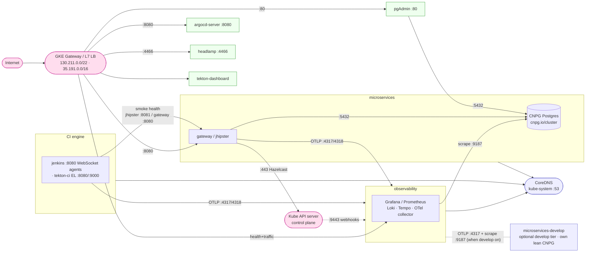

</details>

### 4. GitOps Separation of Concerns
All infrastructural manifests ([`compute-classes/`](../infrastructure/compute-classes/), [`gateway/`](../infrastructure/gateway/), [`headlamp/`](../infrastructure/headlamp/), [`scheduling/`](../infrastructure/scheduling/)) are decoupled from CI pipeline definitions and placed inside the [`infrastructure/`](../infrastructure/) directory for full reconciliation via Argo CD.

### 5. Build Performance & High Availability Caching
* **Jenkins Agent Caching**: Java (Maven `/root/.m2`) and Node (npm `/root/.npm`) containers in pipeline agent templates mount hostPath volumes (`/tmp/jenkins-maven-cache` and `/tmp/jenkins-npm-cache`). Sharing a fast local node directory avoids ReadWriteOnce volume mounting locks while reducing typical compilation times from 5-10 minutes to under 1 minute.
* **Database HA & Storage Lifecycles**: Distributes CloudNative-PG replicas across distinct physical zones using zonal anti-affinity constraints. GCS lifecycle rules automatically transition backups to `NEARLINE` storage class after 3 days and delete them after 7 days.

### 6. Progressive Delivery (Argo Rollouts + Gateway API)

Canary / blue-green delivery, **sidecar-free**, reusing the existing GKE Gateway API ingress (no service mesh):

* **Controller (installed)**: [`argocd/argo-rollouts-app.yaml`](../argocd/argo-rollouts-app.yaml) GitOps-installs the Argo Rollouts controller (Helm chart, pinned) with the **Gateway API traffic-router plugin** (`argoproj-labs/gatewayAPI`) configured via `controller.trafficRouterPlugins`. [`infrastructure/argo-rollouts-gatewayapi-rbac.yaml`](../infrastructure/argo-rollouts-gatewayapi-rbac.yaml) grants the controller `update/patch` on `gateway.networking.k8s.io` HTTPRoutes (the chart default lacks it). Applied by [`scripts/08.5-argocd.sh`](../scripts/08.5-argocd.sh). The read-only Rollouts dashboard is enabled (cluster-internal).
* **How the canary shifts traffic**: a `Rollout` (replacing the `gateway` `Deployment`) with `stableService: gateway` + `canaryService: gateway-canary` and `trafficRouting.plugins."argoproj-labs/gatewayAPI"` pointing at the `microservices` HTTPRoute. The plugin rewrites the HTTPRoute `backendRefs` **weights** between the stable and canary Services through the canary steps (e.g. 20% → 50% → 100% with pauses). No Envoy, no sidecars.

**Remaining steps (cross-repo — the controller above is the in-cluster foundation):**

| Step | Where | Change |
|---|---|---|
| **B2** | this repo — [`scripts/09-gateway.sh`](../scripts/09-gateway.sh) | microservices HTTPRoute gets two `backendRefs` (`gateway` weight 100 + `gateway-canary` weight 0). **Land WITH B3** — adding the canary backendRef before its Service exists causes `BackendNotFound`. |
| **B3** | **microservices GitOps repo** (`helm/microservices`, external) | convert the `gateway` `Deployment` → `Rollout` (canary strategy + steps + the `gatewayAPI` plugin referencing the `microservices` HTTPRoute) and add the `gateway-canary` `Service`. |
| **B4** | this repo — [`tekton/tasks/gitops-deploy.yaml`](../tekton/tasks/gitops-deploy.yaml) | after the ArgoCD sync, wait on the Rollout (`kubectl argo rollouts status gateway -n microservices`) instead of `kubectl rollout status`. |

Activation order: merge the controller → `Day1` → apply B3 in the GitOps repo → land B2 + B4 here (coordinated with B3). A push to `gateway` then rolls out as a weighted canary visible in the Rollouts dashboard.

#### Argo Rollouts in depth

<details>
<summary>🟢 For newcomers — what problem this solves</summary>

A plain Kubernetes `Deployment` rolls out a new version by **replacing pods**: once you bump the image, every user is on the new version within a minute. If it is broken, **everyone** is broken until you roll back.

**Progressive delivery** ships the new version to a *small slice* of traffic first, watches it, and only widens the slice if it looks healthy:

- **Canary**: run old (`stable`) and new (`canary`) side by side and move traffic gradually — e.g. 20% → (pause) → 50% → (pause) → 100%. A bad release only hits 20% of users and auto-halts.
- **Blue-green**: bring the new version up fully alongside the old, then flip 100% at once (with an instant flip-back).

**Argo Rollouts** is the controller that runs this. You swap your `Deployment` for a `Rollout` (almost the same spec, plus a `strategy:` block) and it manages two ReplicaSets (stable + canary) and the traffic split. The split is done by editing the weights on the GKE Gateway's `HTTPRoute` — the ingress that already serves the app — so there are **no sidecars and no service mesh**. You watch/promote/abort from the **Rollouts dashboard** or the `kubectl argo rollouts` CLI.
</details>

<details>
<summary>🔴 For specialists — architecture & mechanics</summary>

- **Controller**: the `argo-rollouts` controller watches `Rollout`/`AnalysisRun`/`Experiment` CRDs, owns the canary/stable **ReplicaSets** (selector-hash managed like a Deployment), and reconciles the traffic weight at each step.
- **Traffic routing — Gateway API plugin**: we register `argoproj-labs/gatewayAPI` via `controller.trafficRouterPlugins` (the controller fetches the binary on boot and records it in the `argo-rollouts-config` ConfigMap). At each `setWeight`, the plugin **patches `backendRefs[].weight`** on the named `HTTPRoute` (stable vs `*-canary` Service). That needs RBAC the chart omits — granted by [`infrastructure/argo-rollouts-gatewayapi-rbac.yaml`](../infrastructure/argo-rollouts-gatewayapi-rbac.yaml) (`update/patch` on `httproutes.gateway.networking.k8s.io`).
- **The `Rollout` spec** (replaces the `gateway` Deployment, B3):
  ```yaml
  strategy:
    canary:
      stableService: gateway
      canaryService: gateway-canary
      trafficRouting:
        plugins:
          argoproj-labs/gatewayAPI:
            httpRoute: { name: microservices, namespace: microservices }
      steps:
        - setWeight: 20
        - pause: { duration: 60 }     # or `pause: {}` to wait for a manual promote
        - setWeight: 50
        - pause: { duration: 60 }
        - setWeight: 100
  ```
- **Analysis-driven promotion (advanced)**: a step can run an `AnalysisTemplate` querying the in-cluster Prometheus (the span-metrics / HTTP RED already deployed) — e.g. abort if the canary's 5xx rate or p95 latency exceeds a threshold. The `AnalysisRun` gates the next `setWeight`; failure triggers automatic rollback (weight → 0, canary RS scaled down). No image re-pull.
- **ArgoCD interaction**: while a canary is mid-flight the `Rollout` is `Progressing`, so the owning app shows `Progressing` until promotion completes (expected). The large Rollouts CRDs use `ServerSideApply` + `compare-options: ServerSideDiff=true` (same pattern as kube-prometheus-stack / Tekton).
- **Day-2**: `kubectl argo rollouts get rollout gateway -n microservices -w`, `... promote`/`... abort`, or the dashboard. CI's `gitops-deploy` waits on Rollout health (B4) so it doesn't report success mid-canary.
</details>

<details>
<summary>📊 Argo Rollouts canary — traffic split mechanics</summary>

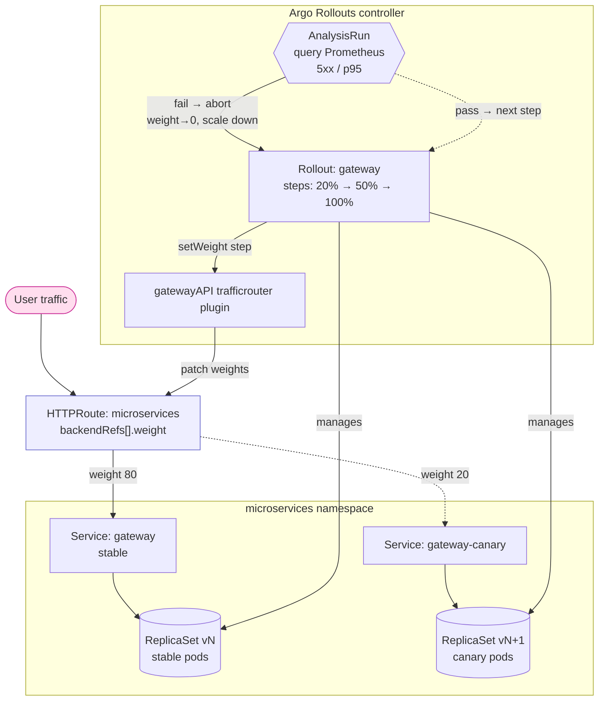

</details>

**Reading it —** the `Rollout` (replacing the `gateway` `Deployment`) owns two ReplicaSets — `stable` (vN) and `canary` (vN+1) — each behind its own Service. At every `setWeight` step the controller calls the **gatewayAPI plugin**, which patches the `backendRefs[].weight` on the shared `microservices` `HTTPRoute` — so the *existing* Gateway does the traffic split, with **no sidecar and no mesh**. An optional `AnalysisRun` queries the in-cluster Prometheus (5xx / p95); on failure it aborts → weight back to 0 and the canary RS scales down (no image re-pull).

#### Canary rollout steps (state)

<details>
<summary>📊 Canary progressive-delivery lifecycle</summary>

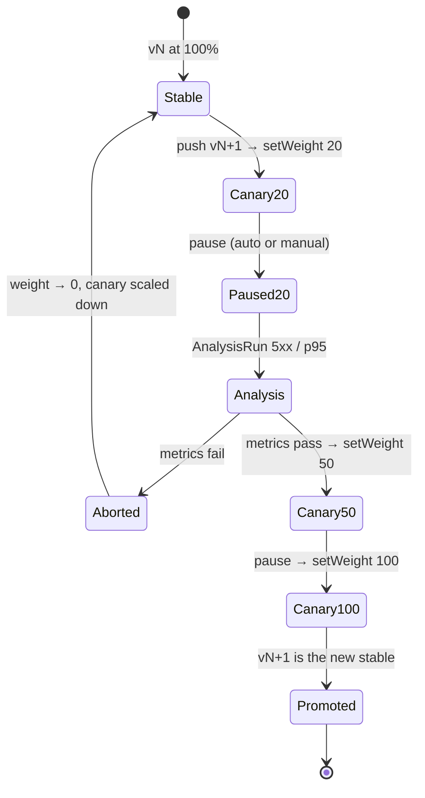

</details>

**Reading it —** the spine is the weighted promotion `20 → 50 → 100`, with a `pause` between steps (timed, or `pause: {}` to wait for a manual `kubectl argo rollouts promote`). The decisive branch is `Analysis`: an `AnalysisRun` gate turns a bad canary into an **automatic rollback** (`Aborted` → weight 0, canary scaled down) instead of a full-blast outage — a release only ever exposes ~20% of users to a regression. CI's `gitops-deploy` waits on Rollout health so it never reports success mid-canary.

## Headlamp (Cluster Management UI)

[Headlamp](https://headlamp.dev/) gives a web UI for the GKE cluster itself (pods, deployments, logs, exec, RBAC, etc.), deployed into the `headlamp` namespace via [`helm/headlamp/values.yaml`](../helm/headlamp/values.yaml).

**Access model**: Users access the dashboard at `https://headlamp.<baseDomain>` (gated by IAP), click "Sign in with Google", and log in. Headlamp backend verifies the user's Google `id_token` to authenticate their browser session, but interacts with the GKE API server using the pod's mounted `headlamp` ServiceAccount token.

### One-time Setup: Google OAuth Client

Create a Google OAuth 2.0 **Web application** client:

1. [Google Cloud Console](https://console.cloud.google.com/) → **APIs & Services** → **Credentials** → **Create credentials** → **OAuth client ID** → Application type **Web application**.
2. **Authorized redirect URIs**: add `http://localhost:8080/oidc-callback` and, if gateway is configured, `https://headlamp.<baseDomain>/oidc-callback`.
3. Note the **Client ID** and **Client secret**. Pass as `HEADLAMP_OIDC_CLIENT_ID` / `HEADLAMP_OIDC_CLIENT_SECRET` secrets.

### Adding Your Identity

Your Google account email is **never committed to this repo** — it's supplied via the `HEADLAMP_ADMIN_EMAILS` secret (comma-separated for multiple people):

```bash
gh secret set HEADLAMP_ADMIN_EMAILS --body "you@gmail.com,colleague@gmail.com"
```

Then (re-)run **Day1.cluster.01 GKE provision** to add the `roles/iap.httpsResourceAccessor` IAM binding via [`terraform/gke`](../terraform/gke/).

### Accessing the UI

- **Public URL (IAP-secured):** `https://headlamp.jenkins2026.nubenetes.com`
- **Local Port-Forward:**
  ```bash
  kubectl -n headlamp port-forward svc/headlamp 8080:80
  ```
  Then open <http://localhost:8080>.

#### Option A: Log in with Your Google ID (Recommended for GKE)
```bash
gcloud auth print-access-token
```
Copy the `ya29.` token, select **Token** login in Headlamp, paste, and click **Sign In**. GKE will authenticate you as your Google account.

#### Option B: Log in with a ServiceAccount Token
```bash
kubectl create token headlamp -n headlamp
```
Copy the token, select **Token** login in Headlamp, paste, and click **Sign In** (grants cluster-admin access).

## Public Access (GKE Gateway API + IAP)

Jenkins, Microservices, Headlamp, and pgAdmin can all be exposed on the public internet through a single **GKE Gateway** (`gatewayClassName: gke-l7-global-external-managed`) — one global external HTTPS load balancer, one Google-managed wildcard certificate, and one `HTTPRoute` per app:

| App | URL | Identity-Aware Proxy |
|---|---|---|
| Jenkins | `https://jenkins.<baseDomain>` | yes |
| Microservices | `https://microservices.<baseDomain>` | no (public demo app) |
| Microservices (develop) | `https://microservices-develop.<baseDomain>` | no (public demo app; only when `microservices.developTrackEnabled`) |
| Headlamp | `https://headlamp.<baseDomain>` | yes |
| pgAdmin | `https://pgadmin.<baseDomain>` | yes |
| Grafana | `https://grafana.<baseDomain>` | yes (only when `observability.mode=oss`) |

`<baseDomain>` is `gateway.baseDomain` in [`config/config.yaml`](../config/config.yaml) — `jenkins2026.nubenetes.com` by default.

**This whole feature is opt-in**: set `JENKINS2026_BASE_DOMAIN=""` to disable it. [`scripts/09-gateway.sh`](../scripts/09-gateway.sh) is also a no-op on `platform.target` other than `gke`.

<details>
<summary>📊 A request from the internet to a backend pod (Gateway + IAP)</summary>

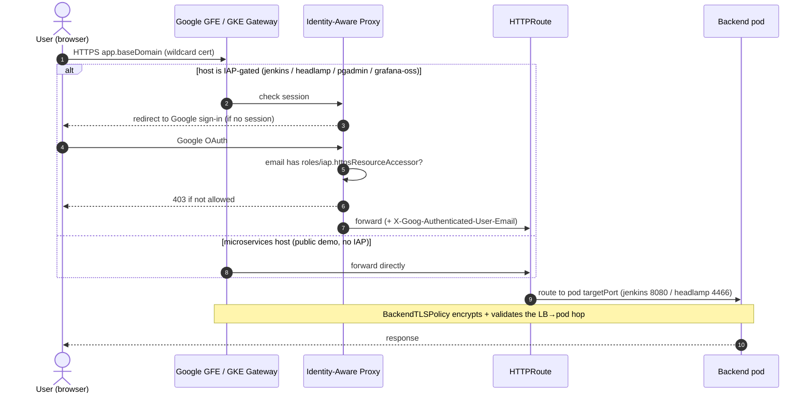

</details>

**Reading it —** one global external HTTPS LB terminates the wildcard cert, and a *per-host* decision follows: IAP-gated hosts must pass a Google sign-in **and** an allowlist check (`roles/iap.httpsResourceAccessor`, the same emails as `HEADLAMP_ADMIN_EMAILS`) before any traffic reaches the app — so the app's own auth (Jenkins OIDC, pgAdmin's trusted header, …) is a *second* layer, not the only one. The `microservices` host is deliberately public. Two gotchas live here: the `HTTPRoute` must target the **pod `targetPort`** (8080/4466), not the Service port, or the GKE health check fails; and `BackendTLSPolicy` secures the LB→pod hop.

### Authentication & Authorization Matrix

| Application | Edge-Level Authentication (GCP IAP) | App-Level Authentication | Authorization |
|---|---|---|---|
| **Jenkins** | Yes (Google IAP OAuth) | Google OIDC **or** local `admin` basic auth | RBAS: Default Google login = read-only; Admin email = full admin |
| **ArgoCD** | Yes (Google IAP OAuth) | Google OIDC (via Dex) **or** local `admin` secret | ArgoCD RBAC: Default OIDC = readonly; Admin email = role:admin |
| **Headlamp** | Yes (Google IAP OAuth) | Token Login (GKE OAuth access token or ServiceAccount token) | Kubernetes RBAC via GCP Identity mapping |
| **pgAdmin** | Yes (Google IAP OAuth) | Webserver Auth (trusts `X-Goog-Authenticated-User-Email` header) | Automated `.pgpass` injection for zero-password database login |
| **Microservices** | No (Public Demo App) | JWT Token verification | Spring Security Roles (`ROLE_USER`, `ROLE_ADMIN`) |

### One-time Setup

**Idempotency model.** Only **two** of the steps below are genuinely manual and
permanent — the **`NS` delegation** (step 1) and the **IAP OAuth client** (step 3).
Both live outside the per-cluster lifecycle (the permanent root tier's DNS zone in
the parent domain / a project-level OAuth client + GitHub secrets), so they survive
a `Decom`-everything — even an explicit `Decom.infra.01` gateway teardown — and are
done **once, ever**. Everything else (the static IP, certificate, the zone's `A`/`CNAME`
records, the IAP access bindings) is created/reconciled by Terraform on every
`Day0.infra.01` / `Day1.cluster.00` run, so a teardown + rebuild brings the public
URLs back with **no manual work**. (The delegated DNS **zone** itself is created once
by the root bootstrap and never destroyed, which is what keeps the delegation permanent.)

1. **Delegate the subdomain — one time, permanent.** The **root bootstrap** (`scripts/bootstrap.sh up`, Day0 "phase 0") creates a **permanent** delegated Cloud DNS zone for `<baseDomain>` and prints its four nameservers (`dns_zone_name_servers` output). At the **parent** domain's DNS (e.g. **Squarespace** for `nubenetes.com`), create an `NS` record set for `<baseDomain>` (host `jenkins2026`) pointing at those four nameservers. This is the **only** manual DNS step, and it is truly **once, ever**: the zone lives in the never-torn-down root tier, so its nameservers never change — not even an explicit `Decom.infra.01` gateway teardown touches them. Remove any old hand-made `*.<baseDomain>` / `_acme-challenge.<baseDomain>` records from the parent zone — the delegation supersedes them.

2. **Run the "Day0.infra.01 Gateway bootstrap" workflow** to create the global static IP, the Google-managed wildcard certificate for `<baseDomain>` and `*.<baseDomain>`, the Certificate Manager DNS authorization, and the **records inside the delegated zone** (wildcard `A` → static IP, cert-validation `CNAME`). These are re-applied on every `Day0.infra.01` / `Day1.cluster.00` run, so they always track the current IP — a `Decom`-everything + rebuild brings the URLs back with **no further DNS work**.

3. **Create the IAP OAuth client by hand — one time, permanent** (the Terraform resources for this are deprecated as of July 2025). In the [GCP Console](https://console.cloud.google.com/): **APIs & Services** → **Credentials** → **Create credentials** → **OAuth client ID** → Application type **Web application**. The client ID/secret are project-level and outlive any cluster; the `IAP_OAUTH_CLIENT_ID`/`IAP_OAUTH_CLIENT_SECRET` GitHub secrets feed the `gateway-iap-oauth` Kubernetes Secret each rebuild (via [`scripts/01-namespaces.sh`](../scripts/01-namespaces.sh), or pushed to GCP Secret Manager and synced by External Secrets when `secrets.backend=eso`). So like the `NS` delegation, this is done once and survives `Decom`/rebuild.

   **Authorized redirect URI**:
   ```
   https://iap.googleapis.com/v1/oauth/clientIds/<client ID>:handleRedirect
   ```

   ```bash
   gh secret set IAP_OAUTH_CLIENT_ID     --body "<client ID>"
   gh secret set IAP_OAUTH_CLIENT_SECRET --body "<client secret>"
   ```

4. **IAP access control** reuses `HEADLAMP_ADMIN_EMAILS`: each listed email is granted `roles/iap.httpsResourceAccessor` via [`terraform/gke`](../terraform/gke/).

### Troubleshooting: Load Balancer Propagation Delay

After initial provisioning, the public URLs may not be immediately reachable. This is normal — GFE edge proxies globally must receive and propagate routing tables, SSL policies, and URL mappings. This process typically takes **5 to 10 minutes**.

To verify the issue is just propagation delay:
```bash
# Verify DNS resolution
ping -c 1 jenkins.jenkins2026.nubenetes.com

# Verify certificate state
gcloud certificate-manager certificates describe jenkins-2026-cert \
  --format="yaml(managed.state,managed.authorizationAttemptInfo)"

# Verify backend health
gcloud compute backend-services get-health gkegw1-y6i2-jenkins-jenkins-8080-p2ivomotuf95 --global
```

## Pausing & resuming the cluster (cost saving)

Park the throwaway cluster at **~zero compute cost** without a Decom + Day1 rebuild: scale every GKE node pool to **0** (the worker VMs are the bulk of the spend), leaving everything else intact, then scale back in minutes.

| Workflow | What it does |
|---|---|
| **[`Day2.scale.01 Pause`](../.github/workflows/Day2.scale.01-pause.yml)** | Scales every node pool → 0. Cluster, PVs (CNPG Postgres data), ArgoCD + apps, static IP, DNS, certs all survive — only the worker VMs go away. |
| **[`Day2.scale.02 Resume`](../.github/workflows/Day2.scale.02-resume.yml)** | Scales node pools back up; pods reschedule, ArgoCD reconciles, CNPG recreates its PDBs — no rebuild. Then runs a **post-resume recovery pass** (re-clones any unstartable CNPG replica, restarts ArgoCD dex if its OIDC connector init raced DNS — see below). |

**What still costs while paused** (all small): the zonal **control plane** (covered by the GKE free-tier management credit), the **persistent disks** backing the PVs, and the reserved **static IP**. Grafana Cloud is free-tier (nothing to pause). Azure/AWS managed backends, if ever provisioned, are billed separately and are **not** paused here.

> Pause/resume is **not** a rebuild and keeps the disks. For a full teardown that stops *all* charges use [`Decom.cluster.01-gke`](../.github/workflows/Decom.cluster.01-gke.yml); to recreate, [`Day1.cluster.01-gke`](../.github/workflows/Day1.cluster.01-gke.yml) (a re-apply also reconciles the gcloud state drift the imperative pause leaves in [`terraform/gke`](../terraform/gke/) state).

### The four gotchas a naïve "resize to 0" hits (real incident)

A plain `gcloud container clusters resize --num-nodes 0` **stalls forever / bounces back** on this cluster. There are **four independent node-recreating forces** — disabling fewer than all four leaves nodes running:

1. **CNPG Postgres PodDisruptionBudgets block the graceful drain.** Each Postgres pod has a PDB `minAvailable=1`; single-instance tiers (the `develop` tier, and any primary once it is down to one) → **ALLOWED DISRUPTIONS = 0**. The resize drains via the **eviction API**, which honours PDBs → it waits indefinitely, the `gcloud` client times out (~20 min) and the GitHub step fails while the **server-side operation stays RUNNING and wedged** (and it cannot be cancelled — only node-upgrade ops can).
2. **node-pool `autoRepair` recreates the drained nodes.** With `management.autoRepair: true`, GKE flags cordoned/drained nodes as unhealthy and **recreates** them.
3. **node-pool `autoUpgrade` surge-creates replacement nodes.** A version auto-upgrade does a surge (new nodes before draining old), re-adding nodes mid-pause.
4. **Cluster-level Node Auto-Provisioning (NAP) re-provisions nodes for the Pending pods.** ⚠️ *This is the subtle one.* NAP (`autoscaling.enableNodeAutoprovisioning`) is a **cluster** setting, **separate from a node pool's autoscaling**: for any Pending pod it can't place it spins up **brand-new nodes/pools** — so even with the node pool's own autoscaling off, NAP brings the cluster **straight back up** (node count seen bouncing to 3-4). [`terraform/gke`](../terraform/gke/) does **not** manage NAP, so it was an out-of-band setting; the pause now turns it off and leaves it off (IaC-consistent — the node pool's own min/max autoscaling, restored by Resume, is enough).

**The fix (now in the pause workflow) — disable ALL FOUR forces, then drain + resize:**

- **Disable cluster NAP** (`gcloud container clusters update --no-enable-autoprovisioning`) — *first*, the root cause of the bounce-back.
- **Disable the node pool's autoscaling, autoRepair AND autoUpgrade** using specific node pool commands (`gcloud container node-pools update --no-enable-autoscaling` and `--no-enable-autorepair --no-enable-autoupgrade`) to prevent API lock conflicts.
- **Serialize GKE mutations** via the new `wait_for_gke_operations` helper function. Since GKE allows only one mutating operation at a time, the workflow blocks and waits until each in-progress operation finishes before starting the next.
- **Force-drain** every node: `kubectl drain --disable-eviction --force --delete-emptydir-data --ignore-daemonsets`. `--disable-eviction` deletes pods via the **DELETE API instead of the eviction API**, so it **bypasses PDBs entirely** — safe because the data lives on the PVs, not the pod.
- Then `gcloud container clusters resize ... --num-nodes 0` — nodes are already empty and nothing can re-add them → it completes and **stays** at 0.
- **Resume re-enables autoscaling + autoRepair + autoUpgrade** (with similar serialization and specific node-pool updates; NAP is intentionally left off — see gotcha 4).

<details><summary>🔁 Pause / resume sequence (Mermaid)</summary>

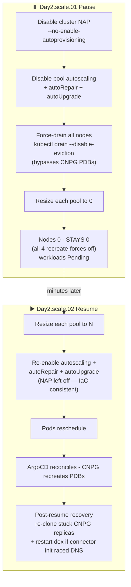

</details>

> **Manual recovery (interrupted / partial pause).** If a pause is interrupted, or you run the
> steps by hand and the cluster won't reach 0, **do NOT fire several `gcloud container clusters
> resize --num-nodes 0` back-to-back** — each queues a separate node-pool operation and they
> **fight** (one stalls draining a CNPG primary behind its PDB while another reconciles nodes back),
> so the count keeps churning (seen bouncing 0→2→3).
> 
> _Note: The automated pause/resume workflows now include a `wait_for_gke_operations` helper that
> automatically checks and waits for any pending/running GKE operations to avoid these conflicts._
> 
> Recover deterministically, once:
> 1. Confirm **all four** recreate-forces are off — `gcloud container clusters describe …` →
>    `autoscaling.enableNodeAutoprovisioning` empty (NAP), and `… node-pools describe …` →
>    `autoscaling`/`management.autoRepair`/`management.autoUpgrade` all empty.
> 2. `kubectl drain <node> --disable-eviction --force --ignore-daemonsets --delete-emptydir-data` every node (DELETE bypasses the CNPG PDBs).
> 3. **Wait until `gcloud container operations list --filter='status=RUNNING'` is empty** — a wedged
>    `SET_NODE_POOL_SIZE` can't be cancelled; let it finish before issuing anything new.
> 4. Issue **one** `gcloud container clusters resize … --num-nodes 0` and let its operation complete.
>
> A concurrent **`UPGRADE_MASTER`** op (control-plane auto-upgrade, cluster `RECONCILING`) is harmless
> — it never creates worker nodes, so the pool stays at 0.

<details><summary>🗺️ What pause removes vs what survives (dependency map)</summary>

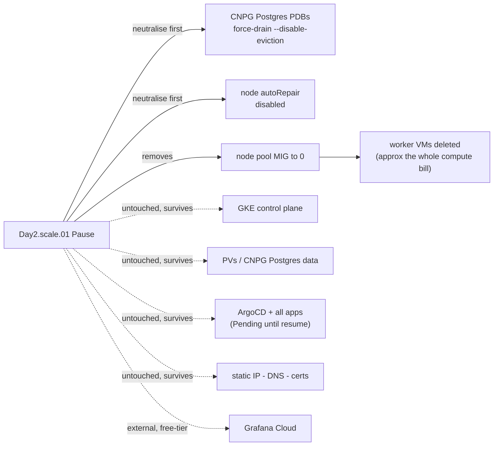

</details>

### The resume-side gotcha: one-time init races DNS on fresh nodes (real incident)

A resume brings up **brand-new nodes**. For a short window after they go Ready, CoreDNS + the egress path are still converging (Dataplane V2 / WireGuard re-establishing). Workloads that run a **one-time startup init and never retry it** can run that init inside this window, fail, and stay broken even though the pod looks `Running`/`Ready`. Two cases were hit and are now auto-healed by the **post-resume recovery step** in `Day2.scale.02 Resume`:

1. **CNPG replicas left unstartable by the pause's force-drain.** The `--disable-eviction` DELETE that bypasses the PDBs is ungraceful, so a replica's data dir can come back in a state the instance-manager can't start postgres from — the **startup probe fails with HTTP 500 forever** (zero postgres logs; the operator just keeps polling and seeing `connection refused` on the local socket). Fix = **re-clone the replica**: delete its PVCs (data + WAL) + pod, and the operator re-bootstraps it via `pg_basebackup` from the primary. The step does this **only for replicas** — the current primary (`.status.currentPrimary`) is never auto-recreated (it holds the authoritative data; a stuck primary is surfaced as a `::warning::` for manual handling). A grace window lets genuinely-still-starting replicas settle first, so a healthy resume is a no-op.

2. **ArgoCD dex's OIDC connector init.** dex dials the SSO provider's `/.well-known/openid-configuration` **once at startup**; if DNS/egress wasn't ready it logs `failed to open all connectors` / `failed to initialize server`, never retries, and **doesn't listen on `:5556`** — so SSO login fails with `dial tcp …:5556: connect: connection refused` (note: the pod still reports `Ready`, so the readiness probe doesn't catch this). dex is stateless (`storage=memory`), so the step **restarts the deployment** (only when that failure is actually in its log) and it re-inits cleanly.

> Both are **idempotent** — on a clean resume nothing matches and the step is a no-op. They exist because the failing inits don't self-retry; everything else (app Deployments, the CNPG primary, ArgoCD's other components) reconciles on its own once nodes return.

Related lifecycle: [`Day1.cluster.01-gke`](../.github/workflows/Day1.cluster.01-gke.yml) (provision / reconcile drift), [`Decom.cluster.01-gke`](../.github/workflows/Decom.cluster.01-gke.yml) (full teardown). Full workflow inventory: [101](./101-GITHUB_ACTIONS_WORKFLOWS.md).

---

[← Previous: 403. Tekton](./403-TEKTON.md) | [🏠 Home](../README.md) | [→ Next: 502. Microservices GitOps](./502-MICROSERVICES_GITOPS.md)

---

*501. Platform Operations — jenkins-2026*
