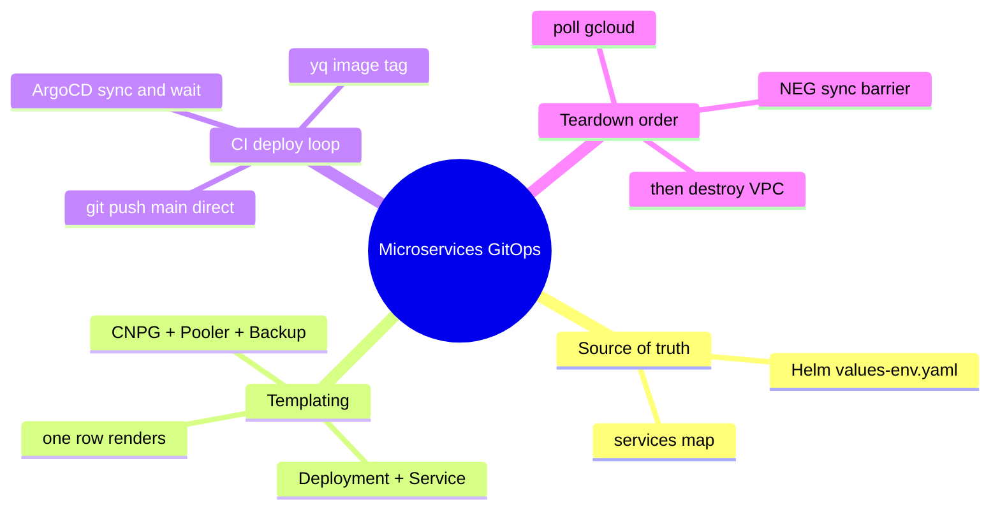
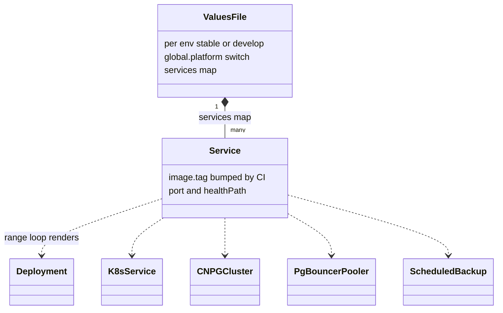
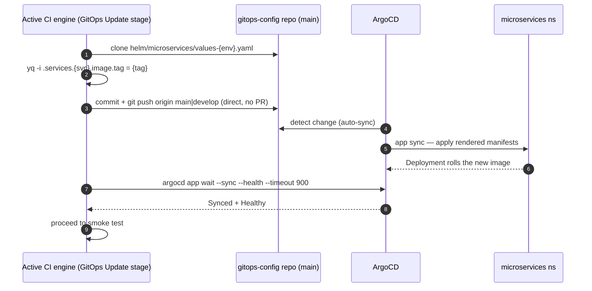
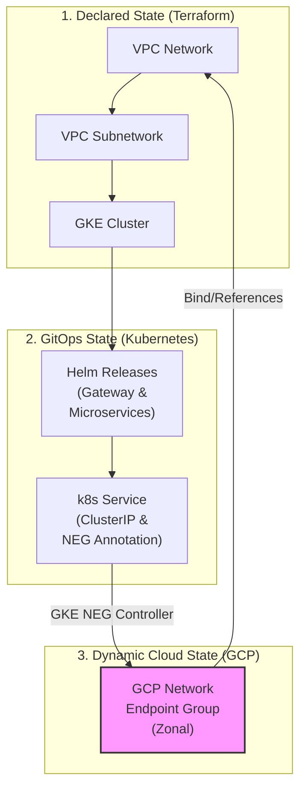

[← Previous: 501. Platform Operations](./501-PLATFORM_OPERATIONS.md) | [🏠 Home](../README.md) | [→ Next: 503. Networking](./503-NETWORKING.md)

---

# 502. Microservices GitOps

> ## ⚠️ The GitOps repo's `main` is CI-writable by design (no PR required)
>
> The pipeline's **GitOps Update** stage ([`vars/microservicesDeploy.groovy`](../vars/microservicesDeploy.groovy)) deploys by pushing **directly** to the env's gitops branch (`main` for stable, `develop` for the develop tier) in the **[`jenkins-2026-gitops-config`](https://github.com/nubenetes/jenkins-2026-gitops-config)** repo — it bumps the image tag in `helm/microservices/values-<env>.yaml` and ArgoCD reconciles it. So that repo's `main` branch must **accept the CI's direct push**: it is protected only against force-pushes/deletions, **not** with *require-a-pull-request*. Turning on require-PR there (the GitHub default for a "protected" branch) makes the PAT-authenticated push get rejected (an admin PAT does not bypass branch protection), so **every deploy's GitOps Update fails** with no commit ever landing and the image tags frozen.
>
> This is the **opposite** of the infra repo (**this** repo, `jenkins-2026`), whose `main` *is* strict-GitFlow-protected (PR-from-`develop`-only, `gitflow-guard` check, `enforce_admins`). The asymmetry is intentional: the **infra repo is human-reviewed**, the **GitOps repo is machine-managed** (image-tag bumps are not human-reviewed changes). Do not "harmonize" them. See [`CLAUDE.md` § Conventions](../CLAUDE.md) and the GitOps repo's README.

## Understanding the microservices GitOps model (newcomers → specialists)

<details>
<summary>🧠 Mental model — microservices GitOps (mindmap)</summary>



</details>

**Reading it —** the four branches are the lifecycle of a microservice in this repo: its config lives as a row in a Helm **values** file (the *source of truth*); one row **templates** into five Kubernetes objects; the active engine's **CI deploy loop** (identical across Jenkins/Tekton/GitHub Actions/Argo Workflows) bumps the image tag and lets ArgoCD reconcile; and **teardown** needs the NEG synchronization barrier before destroying the VPC. Each is expanded below.

<details>
<summary>🟢 For newcomers — the model in plain terms</summary>

In **GitOps**, the cluster's desired state lives in **git** and a controller (**ArgoCD**) continuously makes the cluster match it. Here, each microservice is just a **row** in a Helm values file (`values-stable.yaml` / `values-develop.yaml`) in the separate **`jenkins-2026-gitops-config`** repo.

To ship a new build, the CI engine (Jenkins by default; equally Tekton, GitHub Actions/ARC, or Argo Workflows — whichever `ci.engine` selects) does **not** `kubectl apply` anything — it edits one line (the image tag) with `yq`, `git push`es it to that repo's env branch (`main` for stable, `develop` for the develop tier), and ArgoCD notices and rolls it out. Adding a whole new service is **one new row**. The only sharp edge is at **teardown**: deleting Services/Gateways leaves GCP load-balancer plumbing (NEGs) being cleaned up in the background, and tearing the cluster down too fast orphans them — so a "synchronization barrier" waits for them first.

</details>

<details>
<summary>🔴 For specialists — the mechanics</summary>

- **One Helm chart, N services.** `helm/microservices` templates a `range .Values.services` loop that renders, per entry, a `Deployment` + `Service` + CNPG `Cluster` + PgBouncer `Pooler` + `ScheduledBackup`. DRY beats Kustomize overlays here; a `global.platform` branch switches securityContext/ingress without parallel overlays.
- **Parameterized Postgres HA (stable vs lean develop).** The CNPG `Cluster.instances`, `Pooler.instances` and the Barman backup + `ScheduledBackup` are driven by `global.postgresInstances` / `global.poolerInstances` (default `3`) and `global.postgresBackupEnabled` (default `true`) — so **stable** keeps full HA (3 instances + 3-replica pooler + daily GCS backups). The optional **`develop` tier** (`values-develop.yaml`) overrides them to **`1` / `1` / `false`**: a single non-HA instance, single pooler, no backups (disposable data) — ~4 Postgres pods vs stable's ~12. See [402 § Optional develop Tier](./402-PIPELINES_AS_CODE.md).
- **CI writes the gitops branch directly.** The active CI engine's *GitOps Update* stage runs `yq -i '.services.<svc>.image.tag=…'` then `git push origin <branch>` — `main` for the stable tier, `develop` for the develop tier — same contract across all four engines (Jenkins [`vars/microservicesDeploy.groovy`](../vars/microservicesDeploy.groovy), Tekton, GitHub Actions/ARC, Argo Workflows). That repo's `main` is therefore **direct-push** (force-push-blocked only) — *not* require-PR — the deliberate opposite of this infra repo's strict GitFlow. Require-PR there would reject the PAT push and wedge **every** stable deploy.
- **Decommission ordering.** `Service`/`Gateway` deletion returns instantly, but GKE's NEG controller deletes the backing GCP NEGs **asynchronously**; `terraform destroy` racing ahead kills the masters mid-cleanup → orphaned NEGs → VPC delete fails. [`scripts/down.sh`](../scripts/down.sh) adds a synchronization barrier that polls `gcloud compute network-endpoint-groups list` (≤10 min) and force-deletes stragglers before Terraform proceeds.

</details>

## Repointing the GitOps repo (forks): `gitops.repoUrl`

The companion repo's URL is **not** hardcoded anywhere the deploy paths read it from — it is a single config knob, following the repo's standard feature-flag pattern:

- **Durable default**: `gitops.repoUrl` in [`config/config.yaml`](../config/config.yaml) (`https://github.com/nubenetes/jenkins-2026-gitops-config.git`).
- **Ephemeral override**: `JENKINS2026_GITOPS_REPO_URL` env var, exported by [`scripts/lib/config.sh`](../scripts/lib/config.sh) as `J2026_GITOPS_REPO_URL` (same pattern as `ci.engine` / `observability.mode`).

A fork points it at its own gitops-config fork (which `GIT_USERNAME`/`GIT_TOKEN` must be able to push to) and re-runs Day1 — no script or manifest edits. The value is threaded to every consumer:

| Consumer | Threading mechanism |
| :--- | :--- |
| **ArgoCD** microservices ApplicationSet | [`scripts/08.5-argocd.sh`](../scripts/08.5-argocd.sh) templates it into `argocd/microservices-appset.yaml` (`{{repoUrl}}`) |
| **Jenkins** (`vars/microservicesDeploy.groovy`, `vars/MicroservicesPipeline.groovy`) | [`scripts/04-jenkins.sh`](../scripts/04-jenkins.sh) patches the `gitops-repo-url` key into the `jenkins-credentials` Secret → controller env `JENKINS2026_GITOPS_REPO_URL` ([`helm/jenkins/values-common.yaml`](../helm/jenkins/values-common.yaml)) → JCasC global env ([`jenkins/casc/jcasc-base.yaml`](../jenkins/casc/jcasc-base.yaml)) → pipeline `env` |
| **Tekton** (`tekton/tasks/gitops-deploy.yaml`, `trivy-iac.yaml`) | [`scripts/06-tekton-pipelines.sh`](../scripts/06-tekton-pipelines.sh) publishes the `jenkins-2026-gitops` ConfigMap (key `repo-url`) into `tekton.pipelineNamespace`; the Tasks read it as an optional env override (the Task manifests are GitOps-applied verbatim, so a param can't carry a runtime value) |
| **GitHub Actions / ARC** | [`scripts/06-githubactions-pipelines.sh`](../scripts/06-githubactions-pipelines.sh) renders `{{gitopsRepoUrl}}` into each fork's `microservices-ci.yml` at seed time |
| **Argo Workflows** (`argoworkflows/templates/microservices-wftmpl.yaml`) | [`scripts/06-argoworkflows-pipelines.sh`](../scripts/06-argoworkflows-pipelines.sh) publishes the same `jenkins-2026-gitops` ConfigMap into `argoworkflows.runNamespace`; the `trivy-iac-clone` / `gitops-bump-and-push` steps read it as an optional env override |

Precedence at run time (Tekton/Argo): the ConfigMap value (when present) wins over the `gitops-repo-url` param/parameter default, which remains the hardcoded nubenetes fallback so everything still works before the 06 script has run. The Jenkins JCasC default and the Groovy `?:` fallbacks serve the same last-resort role.

## GitOps Design Decision: Helm vs. Kustomize

### Overview

This repository uses a parameterized Helm Chart (`helm/microservices`) driven by environment-specific values files (`values-stable.yaml`, `values-develop.yaml`) in the GitOps repository to deploy microservices under ArgoCD. Below is the technical comparison and design rationale for utilizing Helm instead of Kustomize.

### Side-by-Side Comparison

| Feature/Metric | Helm + ArgoCD (Current Solution) | Kustomize + ArgoCD (Alternative) |
| :--- | :--- | :--- |
| **DRY Compliance** | **High.** All common patterns (probes, security contexts, Postgres configurations, Workload Identity annotations) are written once in a template and reused. | **Low.** Shared boilerplate is copied across bases, or managed through complex overlay configurations. |
| **Adding a Microservice** | **Trivial.** Simply add a new key under `services` in `values-stable.yaml`. CI automatically handles this tag update (whichever engine `ci.engine` selects). | **High effort.** Requires creating a new directory structure, copying/configuring base YAMLs, and editing environment overlays. |
| **Platform Portability** | **Excellent.** A single boolean or string switch (`global.platform`) handles conditional resource definitions (e.g., Ingress vs. Route, OpenShift SCC adjustments). | **Harder.** Requires maintaining separate platform-specific overlays (`overlays/gke`, `overlays/openshift`). |
| **ArgoCD Integration** | **Native.** ArgoCD parses Helm charts seamlessly, supports parameter overrides, and integrates with `ApplicationSets` using value files. | **Native.** ArgoCD natively applies Kustomize overlays. |
| **Upgrade Maintenance** | **Easy.** Modifying the global configuration (e.g., changing security context `runAsUser`) is done in a single Helm template and propagates to all services. | **Labor-intensive.** Requires updating multiple resource files or base directory components across all services. |

### Technical Rationale & Mechanics

#### 1. Dynamic Resource Generation via Looping

Helm's template looping is key to maintaining a multi-service architecture without duplicate manifest templates:

```yaml
{{- range $name, $svc := .Values.services }}
apiVersion: apps/v1
kind: Deployment
metadata:
  name: {{ $name }}
...
```

This single loop dynamically generates the `Deployment`, `Service`, `Postgres` CNPG Cluster, `PgBouncer` pooler, and scheduled backups for *every* registered microservice. Kustomize lacks template logic and variables.

<details>
<summary>📊 The Helm values model — one row, five objects</summary>



</details>

**Reading it —** one values file, many services, and a single Helm `range` loop fans each service entry out into five Kubernetes objects. This is the DRY win over Kustomize: adding a microservice is **one new `Service` row** (name/tag/port/health), and the same template stamps out its Deployment, Service, CNPG database, connection pooler, and scheduled backup.

#### 2. Platform Adaptability

```yaml
securityContext:
  allowPrivilegeEscalation: false
  capabilities:
    drop: ["ALL"]
  {{- if eq $.Values.global.platform "openshift" }}
  # Let the restricted-v2 SCC assign UIDs
  {{- else }}
  runAsNonRoot: true
  runAsUser: 1000
  {{- end }}
```

#### 3. Continuous Integration Automation

In the pipeline's GitOps Update stage (identical across all four CI engines — Jenkins, Tekton, GitHub Actions/ARC, Argo Workflows), updating a microservice deployment target is simplified to a **single YAML key-value update** using `yq`:

```bash
yq -i '.services.jhipstersamplemicroservice.image.tag = "new-tag"' values-stable.yaml
```

Using Kustomize would require running `kustomize edit set image` on specific overlay files, adding **tool dependencies** to pipeline runner images.

#### 4. The deploy loop — a commit, not an apply

<details>
<summary>📊 GitOps deploy sequence (yq → push → ArgoCD sync)</summary>



</details>

**Reading it —** the deploy is a *commit*, not an apply. Whichever CI engine `ci.engine` selects (Jenkins default, Tekton, GitHub Actions/ARC or Argo Workflows — all run the identical *GitOps Update* stage) mutates exactly one line — the image tag — in the GitOps repo's `values-{env}.yaml` and pushes it straight to `main` (which is why that branch must accept direct pushes). ArgoCD's auto-sync is the actual deployer; the engine then blocks on `argocd app wait --sync --health --timeout 900` (identical across Jenkins, Tekton and Argo Workflows; the GitHub Actions workflow runs the same wait but deliberately non-fatal, `|| true`) so the pipeline only reports success once ArgoCD has converged on the pushed revision. Adding a service is the same flow with a new row.

## Design Decision: Resource Lifecycle & Decommission Orchestration

### The Problem: Asynchronous Background Deletion

When Kubernetes resources like `Services` or `Gateways` are deleted:
1. Kubernetes instantly deletes the configuration objects from the cluster's API database and returns success.
2. Under the hood, GKE's background controllers asynchronously call the Google Cloud API to delete the associated Network Endpoint Groups (NEGs), Load Balancers, and Forwarding Rules.
3. If `terraform destroy` runs immediately after [`scripts/down.sh`](../scripts/down.sh) completes, the GKE cluster starts teardown. This terminates the GKE masters and the background controllers **before** GCP has finished deleting the NEGs.
4. The GCP zonal NEGs are orphaned in the cloud, causing `terraform destroy` to fail on VPC deletion with:
   `Error waiting for Deleting Network: The network resource '...-vpc' is already being used by '.../networkEndpointGroups/...'`

<details>
<summary>🔍 Click to expand The Problem: Asynchronous Background Deletion Diagram</summary>



</details>

### Side-by-Side Comparison of Solutions

| Strategy | Implementation | Pros | Cons |
| :--- | :--- | :--- | :--- |
| **1. Pure Terraform** (Helm/K8s Providers) | Declare Helm charts and Gateway manifests inside Terraform HCL. | Single tool orchestrates all resources. | Terraform's Helm provider **cannot** detect or wait for GKE's background GCP API deletions. **The race condition remains.** |
| **2. Declare LB in Terraform** | Write GCP Load Balancer HCL instead of using GKE Gateway API. | Terraform tracks and destroys the load balancer synchronously. | Defeats the purpose of the GKE Gateway API/Ingress. App developers must request Terraform changes for routing. |
| **3. Synchronization Barrier (Current Solution)** | Implement a polling and force-clean check in the teardown script ([`scripts/down.sh`](../scripts/down.sh)) using the `gcloud` CLI. | **Bulletproof**: Blocks until the cloud provider reports all NEGs are gone (≤10 min await, then dependency-ordered force-delete). **Self-healing**: Force-deletes NEGs if GKE controllers hang. Non-intrusive to developer workflows. | Requires `gcloud` to be authenticated during teardown (already true in our CI/CD runner). |

### Technical Rationale & Mechanics

To prevent VPC deletion blockages, we introduced an **explicit synchronization barrier** in [`scripts/down.sh`](../scripts/down.sh) right after the namespace deletion/cleanup phase. This barrier:
1. **Detects the Active GCP Context**: Uses the local authenticated `gcloud` client.
2. **Polls GCP directly**: Queries `gcloud compute network-endpoint-groups list` with a filter on the target VPC.
3. **Waits for clean deletion**: Blocks up to 10 minutes to let GKE controllers finish natural deletions.
4. **Force Cleanup Fallback**: If NEGs are orphaned or stuck, it explicitly deletes them using:
   ```bash
   gcloud compute network-endpoint-groups delete "${name}" --zone="${zone}" --project="${gcp_project}" --quiet
   ```

This architecture bridges the asynchronous nature of Kubernetes controllers with the synchronous demands of Terraform state lifecycle management.

<details>
<summary>📊 The NEG synchronization barrier (teardown ordering)</summary>


</details>

**Reading it —** the race is the whole point. Deleting a `Service`/`Gateway` returns success immediately, but GKE deletes the backing GCP NEGs *in the background*; if `terraform destroy` tears down the masters first, those controllers die mid-cleanup and the orphaned NEGs block VPC deletion. The barrier in `down.sh` polls GCP directly (≤10 min), force-deletes stragglers, and only then lets Terraform proceed — bridging async Kubernetes controllers with synchronous Terraform state.

## Design Decision: Pod resilience — health probes, resources & rollout strategy

Both microservices tiers (`stable` and `develop`) render from the **same** Helm
template (`helm/microservices/templates/deployment.yaml`), so the probe design is
shared; the per-tier values (`values-stable.yaml` / `values-develop.yaml`) differ
only where the goals differ (production headroom vs lean). This section is the
*why* behind that config.

<details>
<summary>🟢 <b>For newcomers — the three probes as a "new hire" analogy</b></summary>

Think of a pod as an employee and Kubernetes as the manager:

- 🚀 **startupProbe = "finished onboarding?"** — the manager doesn't assign work or
  fire the new hire while they're still setting up their laptop. JHipster's
  "onboarding" (Spring Boot context + Liquibase DB migrations + the OpenTelemetry
  Java agent) can take **1–3 minutes**, so we give it up to **10 minutes** before
  giving up.
- ✅ **readinessProbe = "open for customers?"** — if the employee steps away (busy,
  garbage-collecting, waiting on the DB), the manager **stops sending them
  customers** but lets them keep their job; they rejoin when ready. No drama.
- ❤️ **livenessProbe = "still breathing?"** — only if the employee is truly
  unresponsive (deadlocked) does the manager **replace them** (restart the pod).

**The classic mistake:** wiring "still breathing?" to *also* mean "is the database
up?". Then a 30-second DB hiccup makes Kubernetes think every pod is dead and
**restart them all in a loop** — which, of course, does nothing for the database.
That's exactly the anti-pattern the "dedicated groups" fix below avoids.

</details>

### The three Kubernetes probes — what each does and why it matters

Kubernetes runs three independent probes against each container; conflating them
(or pointing them at the wrong endpoint) is a classic source of restart-loops and
traffic black-holes.

| Probe | Question it answers | On failure, the kubelet… | Our endpoint | Our timing | Why it matters here |
|---|---|---|---|---|---|
| **startupProbe** | "Has the app finished booting?" | keeps the container running but **holds off liveness & readiness** until it first succeeds; only kills the container after `failureThreshold` is exhausted | `/management/health/readiness` | `period 10s × failureThreshold 60` = **10 min** budget | A JHipster cold start (Spring Boot + Liquibase + the OTel Java agent) is slow; without this, **liveness fires mid-boot and CrashLoops the pod** before it ever serves. The long budget absorbs CPU-throttled / contended boots. |
| **readinessProbe** | "Can it serve traffic *right now*?" | **removes the pod from the Service endpoints** (no traffic) — does **not** restart it | `/management/health/readiness` | `delay 30s · period 10s · failureThreshold 6` | A pod that's GC-thrashing, overloaded, or waiting on a dependency is pulled from load-balancing and rejoins when healthy — **without** a disruptive restart. |
| **livenessProbe** | "Is the process alive / not deadlocked?" | **restarts the container** | `/management/health/liveness` | `delay 60s · period 20s · failureThreshold 6` | Only a true wedge (deadlock, unrecoverable state) should trigger a restart. It must **not** depend on external systems (see below). |

**How they interact (the order matters):**

- While the **startupProbe** is still running, the readiness and liveness probes are
  **suspended** — Kubernetes won't pull traffic or restart the pod just because the
  app hasn't finished booting. They only "switch on" after startup first succeeds.
- That's why the readiness/liveness `initialDelaySeconds` (30s / 60s) are a
  belt-and-braces backup: with the startupProbe present, the real gate is the
  10-minute startup budget.

**Worked examples (what actually happens):**

- 🐢 *Slow boot:* a fresh `jhipstersamplemicroservice` pod takes ~2 min (Liquibase +
  agent). Probes: startup keeps probing `/readiness` every 10s, succeeds at ~2 min,
  → liveness/readiness activate, pod goes `Ready`. **Without** a startupProbe, the
  60s-delay liveness would have started failing at 60s and restarted the pod at
  ~180s → CrashLoop (this is the exact bug that hit `develop`).
- 🔌 *DB blip mid-life:* Postgres is briefly unreachable. `/readiness` (which checks
  R2DBC) fails → pod is **pulled from the Service** (no 500s to users) but **not
  restarted**; `/liveness` stays green (the JVM is fine). DB recovers → readiness
  passes → pod rejoins. **No restart, no data loss.**
- 💥 *Real deadlock:* the JVM wedges. `/liveness` fails 6×20s = 120s → kubelet
  restarts the container. Correct: a restart is the only cure for a wedge.

**Use cases per probe:**

- **startupProbe** → any slow-booting JVM app (Spring Boot, especially with
  Liquibase/Flyway migrations and a java agent). The single most important probe
  for JHipster on Kubernetes.
- **readinessProbe** → graceful handling of transient overload, GC pauses, rolling
  dependency restarts, and **zero-downtime deploys** (old pod keeps serving until
  the new one is `Ready`).
- **livenessProbe** → self-healing from unrecoverable states only (deadlocks, OOM
  aftermath, stuck threads).

### Best practice: dedicated availability groups, never the aggregate for liveness

Spring Boot Actuator exposes three health surfaces. The **aggregate**
`/management/health` rolls up *every* indicator (DB, R2DBC, disk, downstream); the
**availability groups** `/management/health/liveness` and `…/readiness` are scoped.

| Endpoint | Includes | Correct use | Wrong use → symptom |
|---|---|---|---|
| `/management/health` (aggregate) | all indicators incl. DB / R2DBC / downstream | humans, dashboards | **as livenessProbe** → a transient DB blip fails the probe → kubelet **restarts every pod in a loop** (a restart can't fix a DB outage) |
| `/management/health/liveness` | only the JVM liveness state | **livenessProbe** | — |
| `/management/health/readiness` | readiness state (deps that gate serving) | **readinessProbe** + **startupProbe** | — |

We point each probe at its dedicated group (both verified to return `200` on these
JHipster images — Spring `AvailabilityProbes` auto-enable on Kubernetes). This is
the single most important probe correctness fix: it stops a dependency hiccup from
turning into a cluster-wide restart storm.

> **Side-by-side: a 30-second DB outage, aggregate vs dedicated liveness**
>
> | t | livenessProbe → `/management/health` (aggregate) ❌ | livenessProbe → `/management/health/liveness` ✅ |
> |---|---|---|
> | 0s | DB drops; aggregate health = `DOWN` | liveness state still `UP` (JVM fine) |
> | 0–120s | liveness fails 6×20s | liveness keeps passing |
> | ~120s | **kubelet restarts the pod** (cold boot ~2 min, DB still down → repeat) → **CrashLoop across all replicas** | readiness (not liveness) marks it not-ready → pulled from Service |
> | DB back | still mid-restart, slow recovery | readiness passes instantly → pod rejoins, **zero restarts** |

<details>
<summary>🔵 <b>For specialists — enabling & verifying the groups</b></summary>

- The availability groups come from Spring Boot's `ApplicationAvailability` +
  `AvailabilityProbesAutoConfiguration`, which **auto-activates on Kubernetes**
  (detected via `spring.main.cloud-platform` / the k8s API on the classpath). No
  app code change was needed — JHipster ships actuator and the probes light up in
  cluster. You can force them anywhere with
  `management.endpoint.health.probes.enabled=true`.
- The readiness group is wired to liveness/readiness *state transitions*
  (`AvailabilityChangeEvent`), and you can map specific indicators into a group via
  `management.endpoint.health.group.readiness.include=readinessState,db,...`.
- Verify without a dashboard:
  ```bash
  kubectl -n microservices port-forward deploy/gateway 18080:8080 &
  curl -s -o /dev/null -w '%{http_code}\n' localhost:18080/management/health/liveness   # 200
  curl -s -o /dev/null -w '%{http_code}\n' localhost:18080/management/health/readiness  # 200
  ```
  (Cross-pod curl is blocked by the namespace NetworkPolicy; port-forward goes via
  the API server and bypasses it, and so do the kubelet's own probes.)

</details>

### `stable` vs `develop` — configuration matrix

The differences are **deliberate**: `stable` favours production headroom and
zero-downtime deploys; `develop` favours minimal footprint. Both are "optimised" —
for their respective goals.

| Dimension | `stable` (ns `microservices`) | `develop` (ns `microservices-develop`) | Why they differ |
|---|---|---|---|
| CPU request / limit | `100m` / `1000m` | `100m` / `1500m` | Limit is a burst ceiling for the cold start; develop got the bigger limit when its boot was the one being debugged. Both idle ~10m. |
| Memory request / limit | `512Mi` / `1Gi` | `384Mi` / `768Mi` | stable has more headroom; develop is lean (data is disposable). |
| startup / readiness / liveness probes | ✅ all three, dedicated groups | ✅ all three, dedicated groups | Shared template — identical design. |
| App replicas | 1 | 1 | Template-fixed; neither is HA at the app layer (PoC). |
| CNPG Postgres instances | 3 (HA) | 1 | `global.postgresInstances` (lean develop = single). |
| **PgBouncer poolers** | **3** (session, `default_pool_size` 20 each) | **1** (session, `default_pool_size` 20) | The pooler count is what makes the rollout strategy safe — see below. |
| Rollout strategy | **RollingUpdate** | **Recreate** | Driven by pooler capacity — see below. |
| Backups (Barman / ScheduledBackup) | on | off | develop data is disposable. |

**Key takeaways:**

- ✅ **Both tiers are optimised** — the differences are intentional, not neglect.
  `stable` was *not* left unreviewed: it shares the probe design and simply carries
  more headroom + HA Postgres.
- 🧩 The one knob that drives the rest is **pooler count** (3 vs 1): it's what makes
  `stable` safe under `RollingUpdate` and forced `develop` onto `Recreate`.
- 💸 `develop` is tuned for **cost/footprint** (disposable data, single Postgres,
  no backups); `stable` for **resilience** (HA Postgres, zero-downtime deploys).

### Rollout strategy: why `develop` uses `Recreate` and `stable` keeps `RollingUpdate`

The two services use **session-mode** PgBouncer pooling: each client connection
holds a server connection for its whole life, so one Java instance (Hikari +
R2DBC) pins ~20 server connections. The deploy strategy must respect that.

| Strategy | Behaviour during a deploy | Connection demand at peak | Downtime | Fit |
|---|---|---|---|---|
| **RollingUpdate** | starts the **new** pod *before* terminating the old (surge) → old + new run together | ~40 server conns (2 × ~20) | none | ✅ **stable**: its **3 poolers** (~60 server conns) absorb the overlap, so the new pod gets connections and zero-downtime holds. |
| **Recreate** | **terminates the old** pod first → frees its ~20 conns → *then* starts the new | ~20 server conns (1 at a time) | brief (single pod) | ✅ **develop**: its **single** pooler offers only ~20 conns, so a RollingUpdate overlap **starved the new pod of connections → its reactive r2dbc health hung → startupProbe never passed → CrashLoop**. Recreate avoids the overlap; brief downtime is fine for a lean, disposable tier. |

**Worked example — the `develop` deadlock under `RollingUpdate` (what we actually saw):**

| t | Old pod | New pod (surge) | Pooler (1 × `default_pool_size` 20) |
|---|---|---|---|
| 0s | `Ready`, holds ~20 server conns | created | 20/20 in use |
| 0–30s | still serving | boots; opens Hikari+R2DBC… | new client conns **queue** (`cl_waiting`) |
| 30s–10min | won't terminate (new not `Ready`) | `/management/health/readiness` (r2dbc) **hangs** waiting for a connection | still 20/20 — starved |
| ~10min | — | startupProbe exhausts → **killed → CrashLoop** | — |

The deadlock is mutual: RollingUpdate keeps the old pod (and its 20 connections)
alive *until the new pod is `Ready`*, but the new pod can't become `Ready` until it
gets connections the old pod won't release. `Recreate` breaks the cycle by removing
the old pod first. (`SHOW POOLS` on the pooler during the incident showed
`cl_waiting=1`, all 20 server connections held by the old pod.)

> **The lean trade-off.** Keeping `RollingUpdate` on `develop` would have required
> *un-leaning* it (a 2nd/3rd pooler, or `transaction`-mode pooling — which needs
> Spring R2DBC prepared-statement caching disabled, a riskier change, or shrinking
> the app's Hikari/R2DBC pools). `Recreate` buys correctness for **zero extra
> resources**, at the cost of a few seconds of deploy downtime — the right call for
> develop, unnecessary for stable.

## pgAdmin & Database Administration

**2 Postgres databases per tier** are provisioned — the default stable tier's two live in the `microservices` namespace (the optional develop tier adds two more in `microservices-develop`, which are not registered in pgAdmin). They can be administered via **pgAdmin 4**:

*   **URL:** `https://pgadmin.jenkins2026.nubenetes.com` (gated behind GKE Gateway + Google IAP).
*   **Auto-Login (Google ID):** pgAdmin is configured with Webserver Authentication (`AUTHENTICATION_SOURCES = ['webserver', 'internal']` — IAP-header auth first, pgAdmin's internal login as fallback) to trust the `X-Goog-Authenticated-User-Email` header injected by Google IAP. A custom Python WSGI middleware automatically strips the `accounts.google.com:` namespace prefix from the header.
*   **Pre-populated Connections:** Both database connections (Gateway and JHipster Microservice backend) are automatically preconfigured on startup as shared connections.
*   **Automated Database Authentication (Zero-Password Login):**
    *   An init container (`setup-pgpass`) retrieves the CNPG app-user passwords from the `postgres-*-app` Secrets and writes them with `0600` permissions to `/var/lib/pgadmin/pgpass`.
    *   It reads those Secrets via a dedicated ServiceAccount (`pgadmin`) bound to the `pgadmin-secret-reader` Role in each microservices namespace.
    *   Both the init container's `:443` API-server call and the runtime `:5432` egress depend on the `pgadmin-policy` NetworkPolicy selecting the pod (`app.kubernetes.io/name: pgadmin4`).
    *   If connections time out, see [902 § pgAdmin connections time out](./902-TROUBLESHOOTING.md) — it's a network/policy issue, not the password.

*   **Restoring a database from backup:** the CNPG WAL + base backups these clusters stream to GCS are recovered via [Runbook: CNPG Restore from Backup](./runbooks/cnpg-restore-from-backup.md) — when to restore vs when a rebuild is meant to start empty, the `bootstrap.recovery` manifest, and PITR target selection.

### Retrieving the application-user passwords (the pgAdmin connections)

Zero-password login means you normally never need these. To fetch them by hand (e.g. for `psql` from elsewhere, or to sanity-check), read the CNPG-generated `*-app` secrets in the `microservices` namespace — the value matches the `pgpass` field pgAdmin uses, and **rotates every time the Postgres cluster is rebuilt**:

```bash
# "Stable - Gateway DB"  (user "gateway")
kubectl get secret postgres-gateway-app -n microservices -o jsonpath='{.data.password}' | base64 -d; echo

# "Stable - JHipster Microservice DB"  (user "jhipstersamplemicroservice")
kubectl get secret postgres-jhipstersamplemicroservice-app -n microservices -o jsonpath='{.data.password}' | base64 -d; echo
```

> These are the **application** roles (`gateway` / `jhipstersamplemicroservice`), distinct from the Postgres **superuser** below. Note the two authentication planes don't overlap: Kubernetes RBAC (what lets your `kubectl` read the Secret) is independent of the PostgreSQL role you authenticate as — being cluster-admin doesn't make you the `postgres` superuser inside the database.

### SRE Break-Glass CLI (Connecting as Superuser)

#### Option A: Execute directly inside the database primary pod
```bash
# For Gateway Database
kubectl exec -it postgres-gateway-1 -n microservices -c postgres -- psql -U postgres -d gateway

# For JHipster Microservice Database
kubectl exec -it postgres-jhipstersamplemicroservice-1 -n microservices -c postgres -- psql -U postgres -d jhipstersamplemicroservice
```

#### Option B: Superuser password via Secret — requires enabling superuser access first

CNPG ships with `enableSuperuserAccess: false` (the default), the chart does not enable it, and nothing provisions the `postgres-<svc>-superuser` Secret the `Cluster` spec references — so that Secret does not exist and password login as `postgres` is disabled (the clusters' `pg_hba` also ends in `host all all all reject`, with no rule admitting a TCP `postgres` login). Use **Option A** (in-pod `psql` over the local Unix socket, allowed by `local all all peer`). To make this path work, set `enableSuperuserAccess: true` on the CNPG `Cluster` (and either drop `superuserSecret` so CNPG generates `postgres-<svc>-superuser`, or create the referenced Secret) in the gitops repo's `helm/microservices/templates/postgres.yaml`.

## Image tags: immutable + retention

Built images are tagged **immutably** — one tag per build — instead of a mutable branch tag every build overwrote. All four CI engines (selected by `ci.engine`) do this, and each engine's build tag equals its GitOps `image-tag` bump so they always match:

| Engine | Tag | Where |
|---|---|---|
| Jenkins (default) | `<branch>-<build#>-<app-sha8>` (e.g. `develop-42-a1b2c3d4`; the SHA suffix keeps tags globally unique across Jenkins rebuilds, where `BUILD_NUMBER` resets on the ephemeral PVC) | [`vars/MicroservicesPipeline.groovy`](../vars/MicroservicesPipeline.groovy) |
| Tekton | `<branch>-<pipelineRunName>` | `$(context.pipelineRun.name)` appended to the build/trivy `image` **and** the gitops `image-tag` (so they match) in [`tekton/pipelines/microservices-pipeline.yaml`](../tekton/pipelines/microservices-pipeline.yaml) |
| GitHub Actions (ARC) | `<branch>-<run#>` (`${{ github.ref_name }}-${{ github.run_number }}`) | the fork workflow rendered from [`jenkins/pipelines/seed/microservices-ci.yml.tmpl`](../jenkins/pipelines/seed/microservices-ci.yml.tmpl) |
| Argo Workflows | `<branch>-<workflow.name>` (`{{workflow.parameters.image}}-{{workflow.name}}` — the workflow name is appended to the full `image` param shared by build/trivy/gitops-deploy, and the bump extracts the tag with `IMAGE_TAG="${IMAGE##*:}"`, so the built tag and the gitops bump can never drift) | [`argoworkflows/templates/microservices-wftmpl.yaml`](../argoworkflows/templates/microservices-wftmpl.yaml) |

Why:

- **Reproducible deploys** — a tag pins exactly one build.
- **Rollback** — repoint `values-<env>.yaml` to a prior tag.
- **Reliable ArgoCD change-detection** — with a static `:main` tag the gitops values never changed between builds, so ArgoCD saw no diff and leaned on a forced `app sync` + `imagePullPolicy: Always`; an immutable tag changes the values each build, the GitOps-correct trigger.
- **Bounded accumulation** — **`Day2.registry.01 Image retention`** prunes only untagged/dangling manifests (keeping at least N); tagged versions are never deleted, since a rebuilt cluster redeploys the tag pinned in the gitops repo without rebuilding it. ghcr storage is free for public packages, and Docker layer dedup adds only the changed app layer per tag.

## Branch model: app-source vs gitops vs deploy branch

Three **distinct** branch axes — conflating them is the classic confusion here:

| Axis | Set by | stable | develop |
|---|---|---|---|
| **App SOURCE** branch the CI builds | [`jenkins/pipelines/seed/services.yaml`](../jenkins/pipelines/seed/services.yaml) `branches` | `main` | `develop` |
| **GitOps** branch the **develop** ArgoCD app tracks | `config.yaml` `microservices.branches.develop` | — | `develop` (always) |
| **GitOps** branch the **stable** ArgoCD app tracks | the **deploy branch** `J2026_SELF_REPO_BRANCH` (auto-tracks the dispatched branch) | the branch Day1 ran from | — |

The mechanics: [`scripts/08.5-argocd.sh`](../scripts/08.5-argocd.sh) renders [`argocd/microservices-appset.yaml`](../argocd/microservices-appset.yaml) (the infra repo's copy is the one applied), substituting `{{branchStable}}` with `J2026_SELF_REPO_BRANCH`, and appends the `develop` generator element (branch = `microservices.branches.develop`) only when `microservices.developTrackEnabled=true`.

- A Day1 from `main` (production) → stable tracks gitops `main`, develop tracks gitops `develop`.
- A Day1 from `develop` puts the **stable tier's gitops on develop too** — deliberate, so you validate the whole platform end-to-end before the promotion PR.
- `config.yaml microservices.branches.stable` is **not** the ArgoCD stable branch; it feeds the **Tekton and Argo Workflows** stable *app-source* branch (Jenkins reads it from `services.yaml`; the GitHub Actions/ARC fork workflow derives its branch from `github.ref_name` at run time).
- The nubenetes app forks carry a real `develop` branch (off `main`), so the develop tier builds genuinely different app code (true branch-based promotion) on the engines that read the develop app-source branch: the Jenkins seed job (`services.yaml` `branches.develop`), webhook-triggered Tekton PaC runs and the GitHub Actions workflow (both use the pushed branch). The script-generated Tekton/Argo Workflows develop runs currently hardcode `main` as the app source ([`scripts/06-tekton-pipelines.sh`](../scripts/06-tekton-pipelines.sh) / [`scripts/06-argoworkflows-pipelines.sh`](../scripts/06-argoworkflows-pipelines.sh)).

---

[← Previous: 501. Platform Operations](./501-PLATFORM_OPERATIONS.md) | [🏠 Home](../README.md) | [→ Next: 503. Networking](./503-NETWORKING.md)

---

*502. Microservices GitOps — jenkins-2026*
