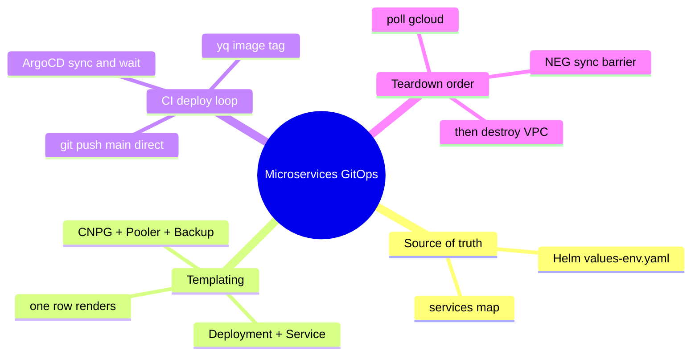
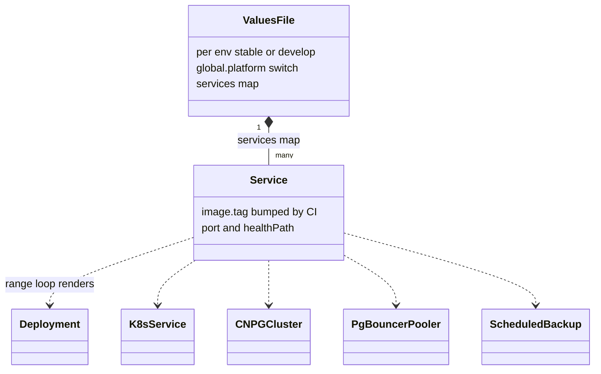
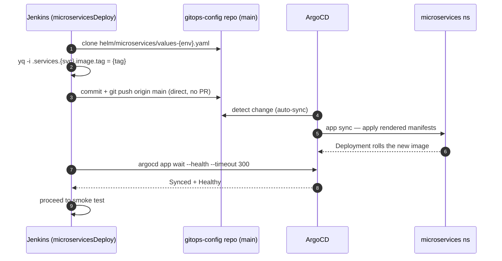
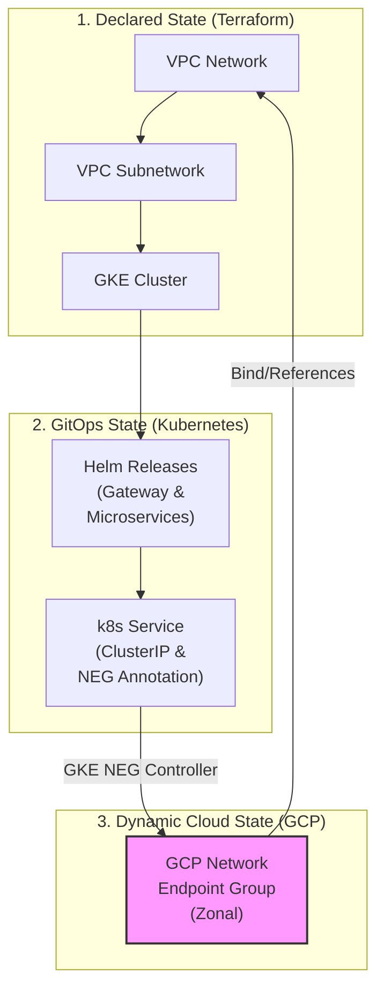
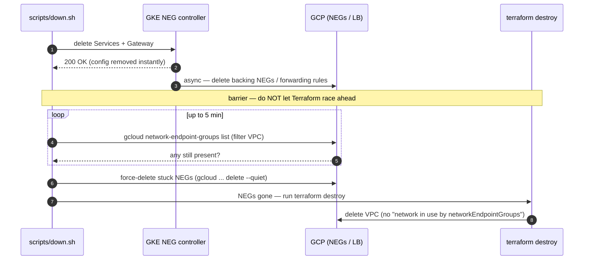

[← Previous: 501. Platform Operations](./501-PLATFORM_OPERATIONS.md) | [🏠 Home](../README.md) | [→ Next: 503. Networking](./503-NETWORKING.md)

---

# 502. Microservices GitOps

> ## ⚠️ The GitOps repo's `main` is CI-writable by design (no PR required)
>
> The pipeline's **GitOps Update** stage ([`vars/microservicesDeploy.groovy`](../vars/microservicesDeploy.groovy)) deploys by `git push origin main` **directly** to the **[`jenkins-2026-gitops-config`](https://github.com/nubenetes/jenkins-2026-gitops-config)** repo — it bumps the image tag in `helm/microservices/values-<env>.yaml` and ArgoCD reconciles it. So that repo's `main` branch must **accept the CI's direct push**: it is protected only against force-pushes/deletions, **not** with *require-a-pull-request*. Turning on require-PR there (the GitHub default for a "protected" branch) makes the PAT-authenticated push get rejected (an admin PAT does not bypass branch protection), so **every deploy's GitOps Update fails** with no commit ever landing and the image tags frozen.
>
> This is the **opposite** of the infra repo (**this** repo, `jenkins-2026`), whose `main` *is* strict-GitFlow-protected (PR-from-`develop`-only, `gitflow-guard` check, `enforce_admins`). The asymmetry is intentional: the **infra repo is human-reviewed**, the **GitOps repo is machine-managed** (image-tag bumps are not human-reviewed changes). Do not "harmonize" them. See [`CLAUDE.md` § Conventions](../CLAUDE.md) and the GitOps repo's README.

## Understanding the microservices GitOps model (newcomers → specialists)

<details>
<summary>🧠 Mental model — microservices GitOps (mindmap)</summary>



</details>

**Reading it —** the four branches are the lifecycle of a microservice in this repo: its config lives as a row in a Helm **values** file (the *source of truth*); one row **templates** into five Kubernetes objects; the Jenkins **CI deploy loop** bumps the image tag and lets ArgoCD reconcile; and **teardown** needs the NEG synchronization barrier before destroying the VPC. Each is expanded below.

<details>
<summary>🟢 For newcomers — the model in plain terms</summary>

In **GitOps**, the cluster's desired state lives in **git** and a controller (**ArgoCD**) continuously makes the cluster match it. Here, each microservice is just a **row** in a Helm values file (`values-stable.yaml` / `values-develop.yaml`) in the separate **`jenkins-2026-gitops-config`** repo.

To ship a new build, Jenkins does **not** `kubectl apply` anything — it edits one line (the image tag) with `yq`, `git push`es it to that repo's `main`, and ArgoCD notices and rolls it out. Adding a whole new service is **one new row**. The only sharp edge is at **teardown**: deleting Services/Gateways leaves GCP load-balancer plumbing (NEGs) being cleaned up in the background, and tearing the cluster down too fast orphans them — so a "synchronization barrier" waits for them first.

</details>

<details>
<summary>🔴 For specialists — the mechanics</summary>

- **One Helm chart, N services.** `helm/microservices` templates a `range .Values.services` loop that renders, per entry, a `Deployment` + `Service` + CNPG `Cluster` + PgBouncer `Pooler` + `ScheduledBackup`. DRY beats Kustomize overlays here; a `global.platform` branch switches securityContext/ingress without parallel overlays.
- **Parameterized Postgres HA (stable vs lean develop).** The CNPG `Cluster.instances`, `Pooler.instances` and the Barman backup + `ScheduledBackup` are driven by `global.postgresInstances` / `global.poolerInstances` (default `3`) and `global.postgresBackupEnabled` (default `true`) — so **stable** keeps full HA (3 instances + 3-replica pooler + daily GCS backups). The optional **`develop` tier** (`values-develop.yaml`) overrides them to **`1` / `1` / `false`**: a single non-HA instance, single pooler, no backups (disposable data) — ~4 Postgres pods vs stable's ~12. See [402 § Optional develop Tier](./402-PIPELINES_AS_CODE.md).
- **CI writes `main` directly.** `vars/microservicesDeploy.groovy` runs `yq -i '.services.<svc>.image.tag=…'` then `git push origin main` to the GitOps repo. That repo's `main` is therefore **direct-push** (force-push-blocked only) — *not* require-PR — the deliberate opposite of this infra repo's strict GitFlow. Require-PR there would reject the PAT push and wedge **every** deploy.
- **Decommission ordering.** `Service`/`Gateway` deletion returns instantly, but GKE's NEG controller deletes the backing GCP NEGs **asynchronously**; `terraform destroy` racing ahead kills the masters mid-cleanup → orphaned NEGs → VPC delete fails. `scripts/down.sh` adds a synchronization barrier that polls `gcloud compute network-endpoint-groups list` (≤5 min) and force-deletes stragglers before Terraform proceeds.

</details>

## GitOps Design Decision: Helm vs. Kustomize

### Overview

This repository uses a parameterized Helm Chart (`helm/microservices`) driven by environment-specific values files (`values-stable.yaml`, `values-develop.yaml`) in the GitOps repository to deploy microservices under ArgoCD. Below is the technical comparison and design rationale for utilizing Helm instead of Kustomize.

### Side-by-Side Comparison

| Feature/Metric | Helm + ArgoCD (Current Solution) | Kustomize + ArgoCD (Alternative) |
| :--- | :--- | :--- |
| **DRY Compliance** | **High.** All common patterns (probes, security contexts, Postgres configurations, Workload Identity annotations) are written once in a template and reused. | **Low.** Shared boilerplate is copied across bases, or managed through complex overlay configurations. |
| **Adding a Microservice** | **Trivial.** Simply add a new key under `services` in `values-stable.yaml`. Jenkins CI automatically handles this tag update. | **High effort.** Requires creating a new directory structure, copying/configuring base YAMLs, and editing environment overlays. |
| **Platform Portability** | **Excellent.** A single boolean or string switch (`global.platform`) handles conditional resource definitions (e.g., Ingress vs. Route, OpenShift SCC adjustments). | **Harder.** Requires maintaining separate platform-specific overlays (`overlays/gke`, `overlays/openshift`). |
| **ArgoCD Integration** | **Native.** ArgoCD parses Helm charts seamlessly, supports parameter overrides, and integrates with `ApplicationSets` using value files. | **Native.** ArgoCD natively applies Kustomize overlays. |
| **Upgrade Maintenance** | **Easy.** Modifying the global configuration (e.g., changing security context `runAsUser`) is done in a single Helm template and propagates to all services. | **Labor-intensive.** Requires updating multiple resource files or base directory components across all services. |

### Technical Rationale & Mechanics

#### 1. Dynamic Resource Generation via Looping

Helm's template looping is key to maintaining a multi-service architecture without duplicate manifest templates:

```yaml
{{- range $name, $svc := .Values.services }}
apiVersion: apps/v1
kind: Deployment
metadata:
  name: {{ $name }}
...
```

This single loop dynamically generates the `Deployment`, `Service`, `Postgres` CNPG Cluster, `PgBouncer` pooler, and scheduled backups for *every* registered microservice. Kustomize lacks template logic and variables.

<details>
<summary>📊 The Helm values model — one row, five objects</summary>



</details>

**Reading it —** one values file, many services, and a single Helm `range` loop fans each service entry out into five Kubernetes objects. This is the DRY win over Kustomize: adding a microservice is **one new `Service` row** (name/tag/port/health), and the same template stamps out its Deployment, Service, CNPG database, connection pooler, and scheduled backup.

#### 2. Platform Adaptability

```yaml
securityContext:
  allowPrivilegeEscalation: false
  capabilities:
    drop: ["ALL"]
  {{- if eq $.Values.global.platform "openshift" }}
  # Let the restricted-v2 SCC assign UIDs
  {{- else }}
  runAsNonRoot: true
  runAsUser: 1000
  {{- end }}
```

#### 3. Continuous Integration Automation

In the Jenkins pipeline, updating a microservice deployment target is simplified to a **single YAML key-value update** using `yq`:

```bash
yq -i '.services.jhipstersamplemicroservice.image.tag = "new-tag"' values-stable.yaml
```

Using Kustomize would require running `kustomize edit set image` on specific overlay files, adding **tool dependencies** to pipeline runner images.

#### 4. The deploy loop — a commit, not an apply

<details>
<summary>📊 GitOps deploy sequence (yq → push → ArgoCD sync)</summary>



</details>

**Reading it —** the deploy is a *commit*, not an apply. Jenkins mutates exactly one line — the image tag — in the GitOps repo's `values-{env}.yaml` and pushes it straight to `main` (which is why that branch must accept direct pushes). ArgoCD's auto-sync is the actual deployer; Jenkins then blocks on `argocd app wait --health` so the pipeline only reports success once the cluster has converged. Adding a service is the same flow with a new row.

## Design Decision: Resource Lifecycle & Decommission Orchestration

### The Problem: Asynchronous Background Deletion

When Kubernetes resources like `Services` or `Gateways` are deleted:
1. Kubernetes instantly deletes the configuration objects from the cluster's API database and returns success.
2. Under the hood, GKE's background controllers asynchronously call the Google Cloud API to delete the associated Network Endpoint Groups (NEGs), Load Balancers, and Forwarding Rules.
3. If `terraform destroy` runs immediately after `scripts/down.sh` completes, the GKE cluster starts teardown. This terminates the GKE masters and the background controllers **before** GCP has finished deleting the NEGs.
4. The GCP zonal NEGs are orphaned in the cloud, causing `terraform destroy` to fail on VPC deletion with:
   `Error waiting for Deleting Network: The network resource '...-vpc' is already being used by '.../networkEndpointGroups/...'`

<details>
<summary>🔍 Click to expand The Problem: Asynchronous Background Deletion Diagram</summary>



</details>

### Side-by-Side Comparison of Solutions

| Strategy | Implementation | Pros | Cons |
| :--- | :--- | :--- | :--- |
| **1. Pure Terraform** (Helm/K8s Providers) | Declare Helm charts and Gateway manifests inside Terraform HCL. | Single tool orchestrates all resources. | Terraform's Helm provider **cannot** detect or wait for GKE's background GCP API deletions. **The race condition remains.** |
| **2. Declare LB in Terraform** | Write GCP Load Balancer HCL instead of using GKE Gateway API. | Terraform tracks and destroys the load balancer synchronously. | Defeats the purpose of the GKE Gateway API/Ingress. App developers must request Terraform changes for routing. |
| **3. Synchronization Barrier (Current Solution)** | Implement a polling and force-clean check in the teardown script (`scripts/down.sh`) using the `gcloud` CLI. | **Bulletproof**: Blocks until the cloud provider reports all NEGs are gone. **Self-healing**: Force-deletes NEGs if GKE controllers hang. Non-intrusive to developer workflows. | Requires `gcloud` to be authenticated during teardown (already true in our CI/CD runner). |

### Technical Rationale & Mechanics

To prevent VPC deletion blockages, we introduced an **explicit synchronization barrier** in `scripts/down.sh` right after the namespace deletion/cleanup phase. This barrier:
1. **Detects the Active GCP Context**: Uses the local authenticated `gcloud` client.
2. **Polls GCP directly**: Queries `gcloud compute network-endpoint-groups list` with a filter on the target VPC.
3. **Waits for clean deletion**: Blocks up to 5 minutes to let GKE controllers finish natural deletions.
4. **Force Cleanup Fallback**: If NEGs are orphaned or stuck, it explicitly deletes them using:
   ```bash
   gcloud compute network-endpoint-groups delete "${name}" --zone="${zone}" --project="${gcp_project}" --quiet
   ```

This architecture bridges the asynchronous nature of Kubernetes controllers with the synchronous demands of Terraform state lifecycle management.

<details>
<summary>📊 The NEG synchronization barrier (teardown ordering)</summary>



</details>

**Reading it —** the race is the whole point. Deleting a `Service`/`Gateway` returns success immediately, but GKE deletes the backing GCP NEGs *in the background*; if `terraform destroy` tears down the masters first, those controllers die mid-cleanup and the orphaned NEGs block VPC deletion. The barrier in `down.sh` polls GCP directly (≤5 min), force-deletes stragglers, and only then lets Terraform proceed — bridging async Kubernetes controllers with synchronous Terraform state.

## Design Decision: Pod resilience — health probes, resources & rollout strategy

Both microservices tiers (`stable` and `develop`) render from the **same** Helm
template (`helm/microservices/templates/deployment.yaml`), so the probe design is
shared; the per-tier values (`values-stable.yaml` / `values-develop.yaml`) differ
only where the goals differ (production headroom vs lean). This section is the
*why* behind that config.

### The three Kubernetes probes — what each does and why it matters

Kubernetes runs three independent probes against each container; conflating them
(or pointing them at the wrong endpoint) is a classic source of restart-loops and
traffic black-holes.

| Probe | Question it answers | On failure, the kubelet… | Our endpoint | Our timing | Why it matters here |
|---|---|---|---|---|---|
| **startupProbe** | "Has the app finished booting?" | keeps the container running but **holds off liveness & readiness** until it first succeeds; only kills the container after `failureThreshold` is exhausted | `/management/health/readiness` | `period 10s × failureThreshold 60` = **10 min** budget | A JHipster cold start (Spring Boot + Liquibase + the OTel Java agent) is slow; without this, **liveness fires mid-boot and CrashLoops the pod** before it ever serves. The long budget absorbs CPU-throttled / contended boots. |
| **readinessProbe** | "Can it serve traffic *right now*?" | **removes the pod from the Service endpoints** (no traffic) — does **not** restart it | `/management/health/readiness` | `delay 30s · period 10s · failureThreshold 6` | A pod that's GC-thrashing, overloaded, or waiting on a dependency is pulled from load-balancing and rejoins when healthy — **without** a disruptive restart. |
| **livenessProbe** | "Is the process alive / not deadlocked?" | **restarts the container** | `/management/health/liveness` | `delay 60s · period 20s · failureThreshold 6` | Only a true wedge (deadlock, unrecoverable state) should trigger a restart. It must **not** depend on external systems (see below). |

### Best practice: dedicated availability groups, never the aggregate for liveness

Spring Boot Actuator exposes three health surfaces. The **aggregate**
`/management/health` rolls up *every* indicator (DB, R2DBC, disk, downstream); the
**availability groups** `/management/health/liveness` and `…/readiness` are scoped.

| Endpoint | Includes | Correct use | Wrong use → symptom |
|---|---|---|---|
| `/management/health` (aggregate) | all indicators incl. DB / R2DBC / downstream | humans, dashboards | **as livenessProbe** → a transient DB blip fails the probe → kubelet **restarts every pod in a loop** (a restart can't fix a DB outage) |
| `/management/health/liveness` | only the JVM liveness state | **livenessProbe** | — |
| `/management/health/readiness` | readiness state (deps that gate serving) | **readinessProbe** + **startupProbe** | — |

We point each probe at its dedicated group (both verified to return `200` on these
JHipster images — Spring `AvailabilityProbes` auto-enable on Kubernetes). This is
the single most important probe correctness fix: it stops a dependency hiccup from
turning into a cluster-wide restart storm.

### `stable` vs `develop` — configuration matrix

The differences are **deliberate**: `stable` favours production headroom and
zero-downtime deploys; `develop` favours minimal footprint. Both are "optimised" —
for their respective goals.

| Dimension | `stable` (ns `microservices`) | `develop` (ns `microservices-develop`) | Why they differ |
|---|---|---|---|
| CPU request / limit | `100m` / `1000m` | `100m` / `1500m` | Limit is a burst ceiling for the cold start; develop got the bigger limit when its boot was the one being debugged. Both idle ~10m. |
| Memory request / limit | `512Mi` / `1Gi` | `384Mi` / `768Mi` | stable has more headroom; develop is lean (data is disposable). |
| startup / readiness / liveness probes | ✅ all three, dedicated groups | ✅ all three, dedicated groups | Shared template — identical design. |
| App replicas | 1 | 1 | Template-fixed; neither is HA at the app layer (PoC). |
| CNPG Postgres instances | 3 (HA) | 1 | `global.postgresInstances` (lean develop = single). |
| **PgBouncer poolers** | **3** (session, `default_pool_size` 20 each) | **1** (session, `default_pool_size` 20) | The pooler count is what makes the rollout strategy safe — see below. |
| Rollout strategy | **RollingUpdate** | **Recreate** | Driven by pooler capacity — see below. |
| Backups (Barman / ScheduledBackup) | on | off | develop data is disposable. |

### Rollout strategy: why `develop` uses `Recreate` and `stable` keeps `RollingUpdate`

The two services use **session-mode** PgBouncer pooling: each client connection
holds a server connection for its whole life, so one Java instance (Hikari +
R2DBC) pins ~20 server connections. The deploy strategy must respect that.

| Strategy | Behaviour during a deploy | Connection demand at peak | Downtime | Fit |
|---|---|---|---|---|
| **RollingUpdate** | starts the **new** pod *before* terminating the old (surge) → old + new run together | ~40 server conns (2 × ~20) | none | ✅ **stable**: its **3 poolers** (~60 server conns) absorb the overlap, so the new pod gets connections and zero-downtime holds. |
| **Recreate** | **terminates the old** pod first → frees its ~20 conns → *then* starts the new | ~20 server conns (1 at a time) | brief (single pod) | ✅ **develop**: its **single** pooler offers only ~20 conns, so a RollingUpdate overlap **starved the new pod of connections → its reactive r2dbc health hung → startupProbe never passed → CrashLoop**. Recreate avoids the overlap; brief downtime is fine for a lean, disposable tier. |

> **The lean trade-off.** Keeping `RollingUpdate` on `develop` would have required
> *un-leaning* it (a 2nd/3rd pooler, or `transaction`-mode pooling — which needs
> Spring R2DBC prepared-statement caching disabled, a riskier change, or shrinking
> the app's Hikari/R2DBC pools). `Recreate` buys correctness for **zero extra
> resources**, at the cost of a few seconds of deploy downtime — the right call for
> develop, unnecessary for stable.

## pgAdmin & Database Administration

A total of **2 Postgres databases** are provisioned in the cluster (both in the `microservices` namespace). They can be administered via **pgAdmin 4**:

*   **URL:** `https://pgadmin.jenkins2026.nubenetes.com` (gated behind GKE Gateway + Google IAP).
*   **Auto-Login (Google ID):** pgAdmin is configured with Webserver Authentication (`AUTHENTICATION_SOURCES = ['webserver']`) to trust the `X-Goog-Authenticated-User-Email` header injected by Google IAP. A custom Python WSGI middleware automatically strips the `accounts.google.com:` namespace prefix from the header.
*   **Pre-populated Connections:** Both database connections (Gateway and JHipster Microservice backend) are automatically preconfigured on startup as shared connections.
*   **Automated Database Authentication (Zero-Password Login):** An init container (`setup-pgpass`) dynamically retrieves passwords from secrets and writes them with secure `0600` permissions to `/var/lib/pgadmin/pgpass`. The pgAdmin pod reads those secrets via a dedicated ServiceAccount (`pgadmin`) bound to the `pgadmin-secret-reader` Role; both the init container's `:443` API-server call and the runtime `:5432` egress depend on the `pgadmin-policy` NetworkPolicy selecting the pod (`app.kubernetes.io/name: pgadmin4`). If connections time out, see [902 § pgAdmin connections time out](./902-TROUBLESHOOTING.md) — it's a network/policy issue, not the password.

### Retrieving the application-user passwords (the pgAdmin connections)

Zero-password login means you normally never need these. To fetch them by hand (e.g. for `psql` from elsewhere, or to sanity-check), read the CNPG-generated `*-app` secrets in the `microservices` namespace — the value matches the `pgpass` field pgAdmin uses, and **rotates every time the Postgres cluster is rebuilt**:

```bash
# "Stable - Gateway DB"  (user "gateway")
kubectl get secret postgres-gateway-app -n microservices -o jsonpath='{.data.password}' | base64 -d; echo

# "Stable - JHipster Microservice DB"  (user "jhipstersamplemicroservice")
kubectl get secret postgres-jhipstersamplemicroservice-app -n microservices -o jsonpath='{.data.password}' | base64 -d; echo
```

> These are the **application** roles (`gateway` / `jhipstersamplemicroservice`), distinct from the Postgres **superuser** below. Note the two authentication planes don't overlap: Kubernetes RBAC (what lets your `kubectl` read the Secret) is independent of the PostgreSQL role you authenticate as — being cluster-admin doesn't make you the `postgres` superuser inside the database.

### SRE Break-Glass CLI (Connecting as Superuser)

#### Option A: Execute directly inside the database primary pod
```bash
# For Gateway Database
kubectl exec -it postgres-gateway-1 -n microservices -c postgres -- psql -U postgres -d gateway

# For JHipster Microservice Database
kubectl exec -it postgres-jhipstersamplemicroservice-1 -n microservices -c postgres -- psql -U postgres -d jhipstersamplemicroservice
```

#### Option B: Retrieve the Superuser password from GKE Secrets
```bash
kubectl get secret postgres-gateway-superuser -n microservices -o jsonpath='{.data.password}' | base64 -d; echo
kubectl port-forward svc/postgres-gateway-rw -n microservices 5432:5432
psql -h localhost -U postgres -d gateway
```

---

[← Previous: 501. Platform Operations](./501-PLATFORM_OPERATIONS.md) | [🏠 Home](../README.md) | [→ Next: 503. Networking](./503-NETWORKING.md)

---

*502. Microservices GitOps — jenkins-2026*
