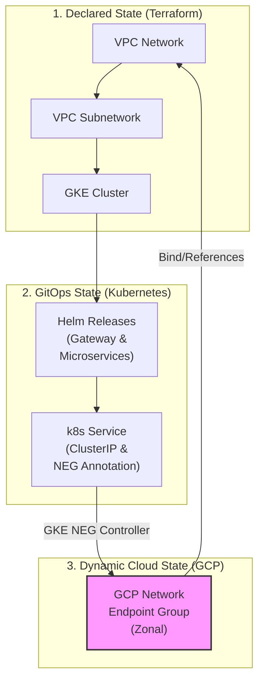

[← Previous: 501. Platform Operations](./501-PLATFORM_OPERATIONS.md) | [🏠 Home](../README.md) | [→ Next: 601. DevSecOps](./601-DEVSECOPS.md)

---

# 502. Microservices GitOps

## GitOps Design Decision: Helm vs. Kustomize

### Overview

This repository uses a parameterized Helm Chart (`helm/microservices`) driven by environment-specific values files (`values-stable.yaml`, `values-develop.yaml`) in the GitOps repository to deploy microservices under ArgoCD. Below is the technical comparison and design rationale for utilizing Helm instead of Kustomize.

### Side-by-Side Comparison

| Feature/Metric | Helm + ArgoCD (Current Solution) | Kustomize + ArgoCD (Alternative) |
| :--- | :--- | :--- |
| **DRY Compliance** | **High.** All common patterns (probes, security contexts, Postgres configurations, Workload Identity annotations) are written once in a template and reused. | **Low.** Shared boilerplate is copied across bases, or managed through complex overlay configurations. |
| **Adding a Microservice** | **Trivial.** Simply add a new key under `services` in `values-stable.yaml`. Jenkins CI automatically handles this tag update. | **High effort.** Requires creating a new directory structure, copying/configuring base YAMLs, and editing environment overlays. |
| **Platform Portability** | **Excellent.** A single boolean or string switch (`global.platform`) handles conditional resource definitions (e.g., Ingress vs. Route, OpenShift SCC adjustments). | **Harder.** Requires maintaining separate platform-specific overlays (`overlays/gke`, `overlays/openshift`). |
| **ArgoCD Integration** | **Native.** ArgoCD parses Helm charts seamlessly, supports parameter overrides, and integrates with `ApplicationSets` using value files. | **Native.** ArgoCD natively applies Kustomize overlays. |
| **Upgrade Maintenance** | **Easy.** Modifying the global configuration (e.g., changing security context `runAsUser`) is done in a single Helm template and propagates to all services. | **Labor-intensive.** Requires updating multiple resource files or base directory components across all services. |

### Technical Rationale & Mechanics

#### 1. Dynamic Resource Generation via Looping

Helm's template looping is key to maintaining a multi-service architecture without duplicate manifest templates:

```yaml
{{- range $name, $svc := .Values.services }}
apiVersion: apps/v1
kind: Deployment
metadata:
  name: {{ $name }}
...
```

This single loop dynamically generates the `Deployment`, `Service`, `Postgres` CNPG Cluster, `PgBouncer` pooler, and scheduled backups for *every* registered microservice. Kustomize lacks template logic and variables.

#### 2. Platform Adaptability

```yaml
securityContext:
  allowPrivilegeEscalation: false
  capabilities:
    drop: ["ALL"]
  {{- if eq $.Values.global.platform "openshift" }}
  # Let the restricted-v2 SCC assign UIDs
  {{- else }}
  runAsNonRoot: true
  runAsUser: 1000
  {{- end }}
```

#### 3. Continuous Integration Automation

In the Jenkins pipeline, updating a microservice deployment target is simplified to a single YAML key-value update using `yq`:

```bash
yq -i '.services.jhipstersamplemicroservice.image.tag = "new-tag"' values-stable.yaml
```

Using Kustomize would require running `kustomize edit set image` on specific overlay files, adding tool dependencies to pipeline runner images.

## Design Decision: Resource Lifecycle & Decommission Orchestration

### The Problem: Asynchronous Background Deletion

When Kubernetes resources like `Services` or `Gateways` are deleted:
1. Kubernetes instantly deletes the configuration objects from the cluster's API database and returns success.
2. Under the hood, GKE's background controllers asynchronously call the Google Cloud API to delete the associated Network Endpoint Groups (NEGs), Load Balancers, and Forwarding Rules.
3. If `terraform destroy` runs immediately after `scripts/down.sh` completes, the GKE cluster starts teardown. This terminates the GKE masters and the background controllers **before** GCP has finished deleting the NEGs.
4. The GCP zonal NEGs are orphaned in the cloud, causing `terraform destroy` to fail on VPC deletion with:
   `Error waiting for Deleting Network: The network resource '...-vpc' is already being used by '.../networkEndpointGroups/...'`

<details>
<summary>🔍 Click to expand The Problem: Asynchronous Background Deletion Diagram</summary>



</details>

### Side-by-Side Comparison of Solutions

| Strategy | Implementation | Pros | Cons |
| :--- | :--- | :--- | :--- |
| **1. Pure Terraform** (Helm/K8s Providers) | Declare Helm charts and Gateway manifests inside Terraform HCL. | Single tool orchestrates all resources. | Terraform's Helm provider **cannot** detect or wait for GKE's background GCP API deletions. **The race condition remains.** |
| **2. Declare LB in Terraform** | Write GCP Load Balancer HCL instead of using GKE Gateway API. | Terraform tracks and destroys the load balancer synchronously. | Defeats the purpose of the GKE Gateway API/Ingress. App developers must request Terraform changes for routing. |
| **3. Synchronization Barrier (Current Solution)** | Implement a polling and force-clean check in the teardown script (`scripts/down.sh`) using the `gcloud` CLI. | **Bulletproof**: Blocks until the cloud provider reports all NEGs are gone. **Self-healing**: Force-deletes NEGs if GKE controllers hang. Non-intrusive to developer workflows. | Requires `gcloud` to be authenticated during teardown (already true in our CI/CD runner). |

### Technical Rationale & Mechanics

To prevent VPC deletion blockages, we introduced an **explicit synchronization barrier** in `scripts/down.sh` right after the namespace deletion/cleanup phase. This barrier:
1. **Detects the Active GCP Context**: Uses the local authenticated `gcloud` client.
2. **Polls GCP directly**: Queries `gcloud compute network-endpoint-groups list` with a filter on the target VPC.
3. **Waits for clean deletion**: Blocks up to 5 minutes to let GKE controllers finish natural deletions.
4. **Force Cleanup Fallback**: If NEGs are orphaned or stuck, it explicitly deletes them using:
   ```bash
   gcloud compute network-endpoint-groups delete "${name}" --zone="${zone}" --project="${gcp_project}" --quiet
   ```

This architecture bridges the asynchronous nature of Kubernetes controllers with the synchronous demands of Terraform state lifecycle management.

## pgAdmin & Database Administration

A total of **2 Postgres databases** are provisioned in the cluster (both in the `microservices` namespace). They can be administered via **pgAdmin 4**:

*   **URL:** `https://pgadmin.jenkins2026.nubenetes.com` (gated behind GKE Gateway + Google IAP).
*   **Auto-Login (Google ID):** pgAdmin is configured with Webserver Authentication (`AUTHENTICATION_SOURCES = ['webserver', 'internal']`) to trust the `X-Goog-Authenticated-User-Email` header injected by Google IAP. A custom Python WSGI middleware automatically strips the `accounts.google.com:` namespace prefix from the header.
*   **Pre-populated Connections:** Both database connections (Gateway and JHipster Microservice backend) are automatically preconfigured on startup as shared connections.
*   **Automated Database Authentication (Zero-Password Login):** An init container (`setup-pgpass`) dynamically retrieves passwords from secrets and writes them with secure `0600` permissions to `/var/lib/pgadmin/pgpass`.

### SRE Break-Glass CLI (Connecting as Superuser)

#### Option A: Execute directly inside the database primary pod
```bash
# For Gateway Database
kubectl exec -it postgres-gateway-1 -n microservices -c postgres -- psql -U postgres -d gateway

# For JHipster Microservice Database
kubectl exec -it postgres-jhipstersamplemicroservice-1 -n microservices -c postgres -- psql -U postgres -d jhipstersamplemicroservice
```

#### Option B: Retrieve the Superuser password from GKE Secrets
```bash
kubectl get secret postgres-gateway-superuser -n microservices -o jsonpath='{.data.password}' | base64 -d; echo
kubectl port-forward svc/postgres-gateway-rw -n microservices 5432:5432
psql -h localhost -U postgres -d gateway
```

---

[← Previous: 501. Platform Operations](./501-PLATFORM_OPERATIONS.md) | [🏠 Home](../README.md) | [→ Next: 601. DevSecOps](./601-DEVSECOPS.md)

---

*502. Microservices GitOps — jenkins-2026*
