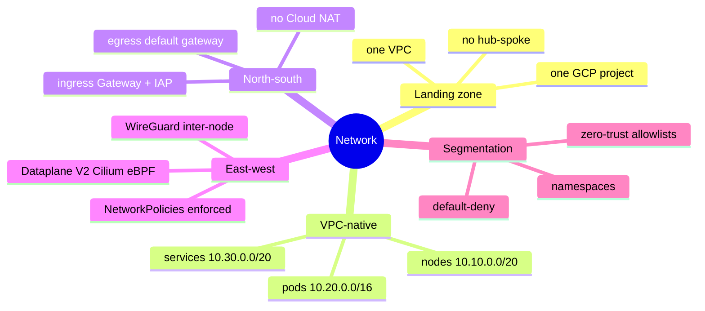
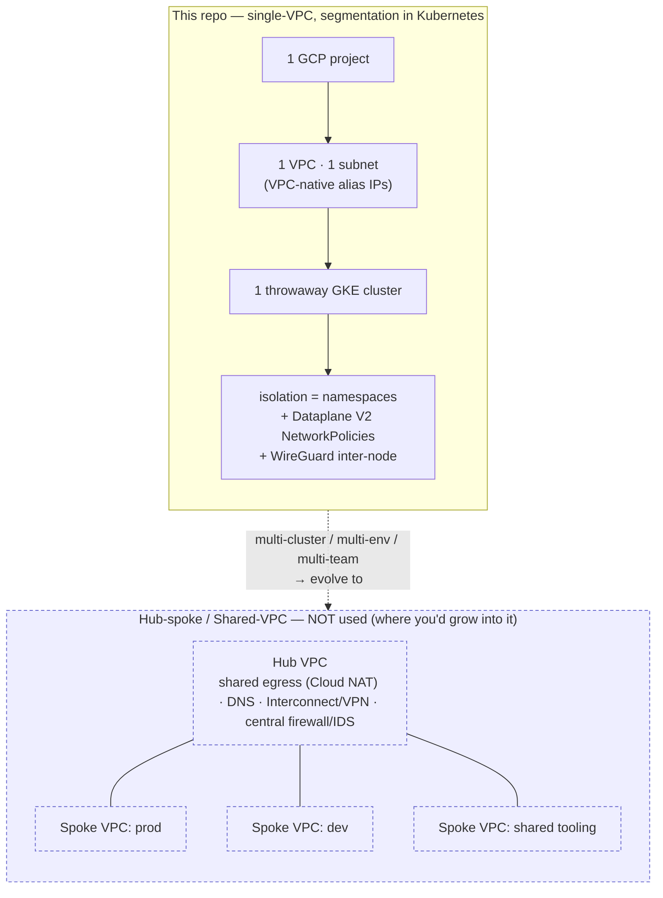
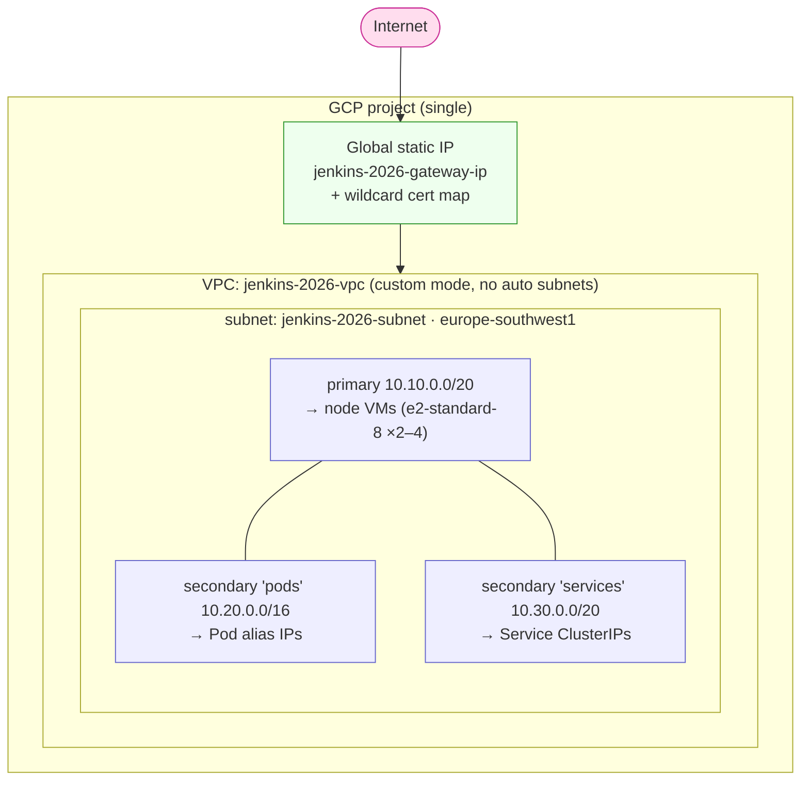
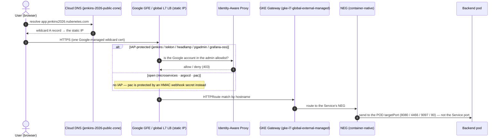
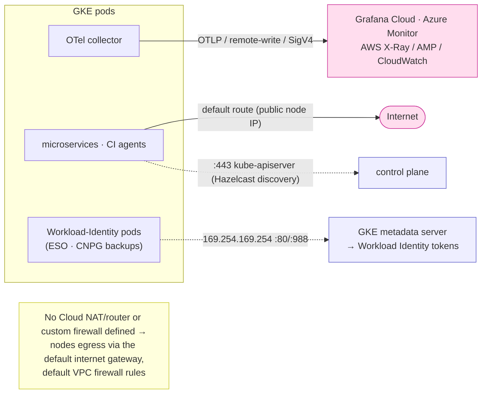
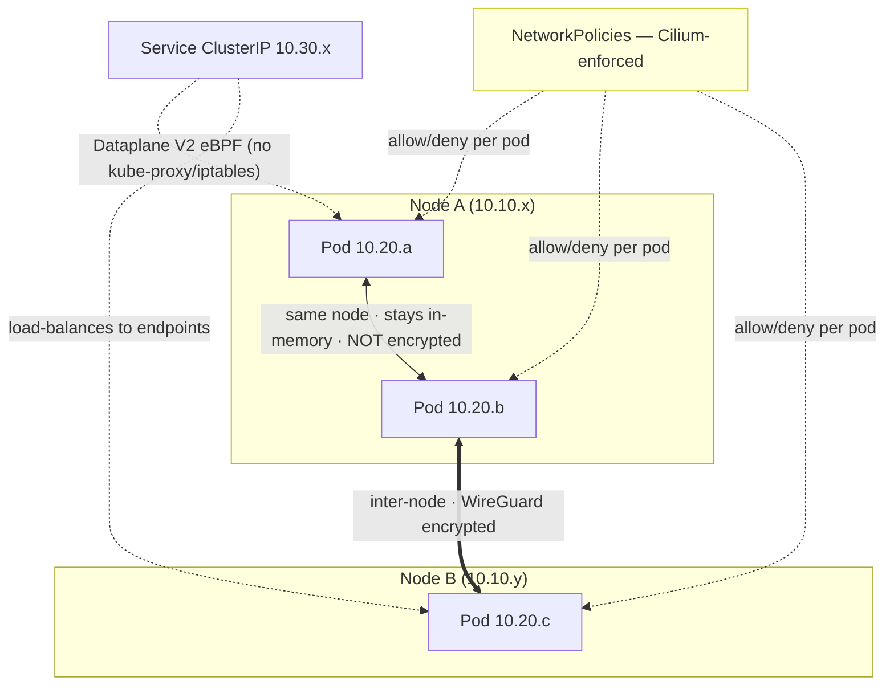
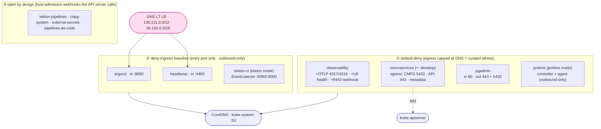
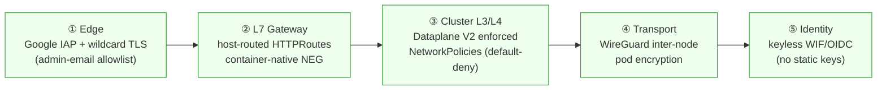

[← Previous: 502. Microservices GitOps](./502-MICROSERVICES_GITOPS.md) | [🏠 Home](../README.md) | [→ Next: 601. DevSecOps](./601-DEVSECOPS.md)

---

# 503. Network Architecture, Landing Zone & Segmentation

Everything network-related, end to end: the **landing zone** (project + VPC), the
**IP address plan** (subnet + pod/service ranges), how traffic gets **in**
(Internet → DNS → Gateway → IAP → NEG → pod) and **out** (egress, no Cloud NAT, the
four observability backends), how pods talk **east-west** (VPC-native + Dataplane V2
+ WireGuard), and how the cluster is **segmented** (namespaces + enforced
NetworkPolicies). All values are the real defaults from [`terraform/gke`](../terraform/gke/),
[`terraform/gateway-bootstrap`](../terraform/gateway-bootstrap/),
[`infrastructure/networkpolicies*.yaml`](../infrastructure/) and
[`config/config.yaml`](../config/config.yaml).

## Understanding the network (newcomers → specialists)

The design is **deliberately simple at the cloud layer and rich at the Kubernetes
layer**: one project, one VPC, one subnet — and all the real isolation happens
*inside* the cluster with namespaces + Dataplane-V2-enforced NetworkPolicies +
WireGuard. Read this once and every section below is "which knob, which range".

🧠 Mental model — the network (mindmap)

🟢 For newcomers — the network in plain terms

A Kubernetes cluster needs IP addresses for three different things, and GKE keeps them in **separate ranges** inside one **subnet** (this is "VPC-native"):

| Range | What gets an IP here | CIDR (default) |
|---|---|---|
| **Nodes** (subnet primary) | the VMs that run your pods | `10.10.0.0/20` |
| **Pods** (secondary "pods") | every pod (alias IPs, routable in the VPC) | `10.20.0.0/16` |
| **Services** (secondary "services") | virtual `ClusterIP`s for Services | `10.30.0.0/20` |

Traffic **in** (north-south): a user hits `app.jenkins2026.nubenetes.com`, DNS points at one **global static IP**, a Google load balancer terminates TLS (one wildcard cert), **Identity-Aware Proxy** checks they're an allowed Google account (for the admin UIs), and the **GKE Gateway** routes to the right pod. Traffic **between pods** (east-west) is encrypted **between nodes** by WireGuard and policed by **NetworkPolicies**. There is **no separate network per environment** (no "hub-spoke") — the cluster is one VPC, and isolation is done with namespaces + policies.

🔴 For specialists — the wiring

- **Landing zone:** a single GCP project, **one custom-mode VPC** (`jenkins-2026-vpc`, `auto_create_subnetworks=false`), **one subnet** (`jenkins-2026-subnet`, `europe-southwest1`). No Shared VPC, no VPC peering, no Network Connectivity Center, no Cloud VPN/Interconnect. The persistent "landing-zone" bits are the Day0 root-of-trust resources (WIF, Terraform-state bucket, the delegated **`jenkins-2026-public-zone`** DNS zone, the static IP + cert map) — decoupled from the throwaway cluster (see [100](./100-BOOTSTRAP.md)).
- **VPC-native (alias IPs):** `networking_mode = VPC_NATIVE`; `ip_allocation_policy` maps `cluster_secondary_range_name = pods` (`10.20.0.0/16`) and `services_secondary_range_name = services` (`10.30.0.0/20`); subnet primary `10.10.0.0/20` is node IPs.
- **Dataplane V2:** `datapath_provider = ADVANCED_DATAPATH` (Cilium/eBPF, replaces kube-proxy/iptables) — this is what makes NetworkPolicies **actually enforce**. `gateway_api_config.channel = CHANNEL_STANDARD`; release channel `REGULAR`; `GKE_METADATA` node metadata (Workload Identity).
- **Encryption:** `in_transit_encryption_config = IN_TRANSIT_ENCRYPTION_INTER_NODE_TRANSPARENT` — WireGuard, **inter-node only** (same-node pod traffic never hits the wire). Transport encryption, **not** per-workload mTLS identity.
- **Egress:** **no Cloud NAT / router and no custom firewall** are defined — nodes egress via the default internet gateway under the default VPC firewall rules; Workload-Identity pods reach the node-local metadata server at `169.254.169.254:80/:988`.
- **Ingress:** a **global external L7** GKE **Gateway** (`gatewayClassName: gke-l7-global-external-managed`) in `platform-ingress`, fronted by the static IP `jenkins-2026-gateway-ip` + the Google-managed wildcard cert (`jenkins-2026-cert-map`), one `HTTPRoute` per app, **container-native NEG** load balancing (to pod `targetPort`), and **IAP** via `GCPBackendPolicy` for the admin UIs.
- **Segmentation:** namespaces are classed as **default-deny** (observability, microservices(+develop), pgadmin, jenkins), **deny-ingress baseline** (argocd, headlamp, tekton-ci — outbound-only / entry-port-only), or **open by design** (operator namespaces that host admission webhooks). Engine-gated files add the jenkins/tekton namespace policies. See the [501 NetworkPolicy matrix](./501-PLATFORM_OPERATIONS.md#networkpolicy-matrix).

## Landing zone & topology pattern — single-VPC, *not* hub-spoke

A natural question for anyone from an enterprise GCP background: *is this a hub-spoke /
Shared-VPC landing zone?* **No — and on purpose.** This is a **single-project,
single-VPC** design where **segmentation is shifted up to the Kubernetes layer**.

🗺️ This repo (single-VPC + K8s segmentation) vs hub-spoke — and the growth path

**Reading it —** the left is what's built: one project, one VPC, one disposable cluster, with all micro-segmentation done by Kubernetes. The right (dashed) is the enterprise pattern this would **grow into** if it ever needed many clusters/environments/teams.

#### Why single-VPC (the motivations & justifications)

| Driver | Decision | Why |
|---|---|---|
| **Lifecycle** | The cluster is a **throwaway** Day1 resource, recreated on demand. | A hub-spoke / Shared-VPC landing zone is heavy, long-lived org plumbing — over-engineering for one ephemeral cluster. Keep the landing zone **minimal** (1 VPC + the persistent Day0 IP/cert/DNS). |
| **Where isolation lives** | **Kubernetes-layer** micro-segmentation (namespaces + **Dataplane V2** enforced NetworkPolicies + **WireGuard**). | Gives zero-trust L3/L4 isolation *between workloads* without per-tenant VPCs/subnets. The eBPF dataplane enforces it; WireGuard encrypts node-to-node. This is the security a hub-spoke would otherwise provide at the network layer. |
| **Cost & simplicity** | One subnet, no Cloud NAT, no peering, public nodes via default gateway. | Fewer moving parts, no inter-VPC egress costs, faster `Decom`/rebuild. Appropriate for a PoC; the trade-off (public node egress, no centralized egress controls) is acceptable here. |
| **Blast radius** | One project, one VPC. | Deleting the cluster can't orphan shared-VPC resources; the only persistent network object is the static IP/cert/DNS in the root tier. |

#### How it would extend to hub-spoke (if needed)

The Day0/Day1 split + per-resource Terraform modules map cleanly onto a hub-spoke evolution: promote the **persistent** tier (DNS, egress IP) into a **hub VPC** with **Cloud NAT** (so nodes become **private**), central **firewall/Cloud IDS**, and **Cloud DNS** forwarding; turn each environment's cluster into a **spoke VPC** (VPC peering or **NCC**), optionally under a **Shared VPC** host/service-project model; and keep the Kubernetes NetworkPolicies as the *inner* ring of defense-in-depth. None of the in-cluster design (namespaces, policies, Gateway, IAP) changes.

## VPC & subnet topology

🌐 VPC / subnet / secondary-range topology

**Reading it —** one VPC, one subnet, three IP ranges (VPC-native). Pods and Services get their **own secondary ranges** so pod/Service IPs are first-class in the VPC (alias IPs) rather than NAT'd behind the node — which is what lets Dataplane V2 and the container-native NEGs route straight to a pod.

#### IP address plan

| Range | Name | CIDR (default var) | Used for | Source |
|---|---|---|---|---|
| Subnet **primary** | `jenkins-2026-subnet` | **`10.10.0.0/20`** (`subnet_cidr`) | Node VM IPs | [`terraform/gke`](../terraform/gke/) |
| Secondary | **`pods`** | **`10.20.0.0/16`** (`pods_cidr`) | Pod alias IPs (≈ 65 k) | `ip_allocation_policy` |
| Secondary | **`services`** | **`10.30.0.0/20`** (`services_cidr`) | Service `ClusterIP`s | `ip_allocation_policy` |
| Region / zone | — | `europe-southwest1` / `-a` | cluster location | `terraform/gke/variables.tf` |

> All three are **variables** with the defaults above — change them in one place before `Day1`. The ranges are disjoint and sized for a single PoC cluster (the `/16` pod range is GKE's generous default).

## North-south: how traffic gets in (ingress)

🚪 Ingress path — Internet → DNS → L7 LB → IAP → Gateway → NEG → pod

**Reading it —** one global static IP + one wildcard cert front **every** app; the per-app `HTTPRoute` (host-based) and `GCPBackendPolicy` (IAP) live beside each Service. The crucial GKE detail: container-native **NEG** load balancing delivers to the **pod port**, not the Service port — which is why NetworkPolicies must allow the real container port (e.g. argocd-server `8080`, headlamp `4466`). The L7 LB health checks come from `130.211.0.0/22` + `35.191.0.0/16`.

| App | Host | Backend pod port | IAP |
|---|---|---|---|
| Jenkins *(jenkins mode)* | `jenkins.<domain>` | `8080` | **yes** |
| Tekton Dashboard *(tekton mode)* | `tekton.<domain>` | `9097` | **yes** |
| Headlamp | `headlamp.<domain>` | `4466` | **yes** |
| pgAdmin | `pgadmin.<domain>` | `80` | **yes** |
| Grafana *(oss mode)* | `grafana.<domain>` | `80` | **yes** |
| ArgoCD | `argocd.<domain>` | `8080` | no |
| Microservices | `microservices.<domain>` | `8080` (gateway) | no (public demo) |
| Microservices *(develop tier)* | `microservices-develop.<domain>` | `8080` (gateway) | no (public demo; only when `microservices.developTrackEnabled`) |
| PaC webhook *(tekton)* | `pac.<domain>` | `8080` | no (**HMAC**) |

> Public access is **opt-in** (`gateway.baseDomain`; `""` disables the whole Gateway). The static IP + cert + DNS zone are **persistent Day0** resources that survive cluster rebuilds (see [501 § Public access](./501-PLATFORM_OPERATIONS.md) and [100](./100-BOOTSTRAP.md)).

## North-south: how traffic gets out (egress)

↗️ Egress — default internet gateway (no Cloud NAT), metadata, the four backends

**Reading it —** there is **no Cloud NAT** and **no custom firewall**: nodes have public egress via the default internet gateway. Pods that use **Workload Identity** (External Secrets, the CNPG backup uploaders) get GCP tokens from the node-local metadata endpoint `169.254.169.254` — which is why the `microservices` default-deny policy explicitly allows egress to it. The OTel collector is the one component with heavy outbound: it ships telemetry to whichever backend `observability.mode` selects.

#### The four observability backends (collector egress)

| `observability.mode` | Traces | Metrics | Logs | Auth |
|---|---|---|---|---|
| **`grafana-cloud`** *(default)* | OTLP/HTTP → Grafana Cloud | OTLP + Prom scrape | OTLP | Basic (`instanceID:apiKey`) |
| **`oss`** *(in-cluster)* | → `oss-tempo:4317` | → `oss-…-prometheus:9090/api/v1/write` | → `oss-loki-gateway/otlp` | in-cluster (insecure TLS) |
| **`managed-azure`** | Azure Monitor / App Insights | Azure Managed Prometheus (remote-write) | Azure Monitor | Entra OAuth2 (`oauth2client`) |
| **`managed-aws`** | AWS **X-Ray** | Amazon **AMP** (remote-write) | **CloudWatch** Logs | SigV4 (`AssumeRoleWithWebIdentity`, projected SA token) |

> The three external backends are reached **keylessly** where the cloud allows it (AWS web-identity, Azure OAuth SP); Grafana Cloud uses an access-policy token. All egress is plain outbound from the collector pod. See [301](./301-OBSERVABILITY.md).

## East-west: pod & service networking

↔️ Pod-to-pod & Service routing — VPC-native, Dataplane V2, WireGuard

**Reading it —** pods get real VPC alias IPs from `10.20.0.0/16`; Services are virtual IPs from `10.30.0.0/20`, resolved by **eBPF** (Dataplane V2 replaces kube-proxy). **WireGuard** encrypts traffic **only when it crosses the wire between nodes** — same-node pod-to-pod stays in memory and isn't encrypted (it never leaves the host). Every hop is additionally subject to the **NetworkPolicies** the eBPF dataplane enforces.

## Segmentation: NetworkPolicies inside GKE

This is where the real isolation lives. Dataplane V2 **enforces** the policies (without
it GKE accepts `NetworkPolicy` objects but silently ignores them). Namespaces fall into
three classes:

🧱 NetworkPolicy segmentation — the three namespace classes

**Reading it —** ① the sensitive namespaces are **default-deny** with curated allowlists (DNS always; plus the specific OTLP/CNPG/API/metadata paths each one needs). ② the workload-UI/CI namespaces get a **deny-ingress baseline** — only their entry port is reachable (Gateway/CLI/port-forward), internals are intra-namespace, and pipeline pods are outbound-only. ③ operator namespaces are left **open** on purpose, because a `deny-ingress` there would block the API server's own admission-webhook calls (fragile to allowlist the control-plane CIDR). The exact selectors/ports are in the **[501 NetworkPolicy matrix](./501-PLATFORM_OPERATIONS.md#networkpolicy-matrix)**.

- **Files:** [`infrastructure/networkpolicies.yaml`](../infrastructure/networkpolicies.yaml) (always) + [`-jenkins.yaml`](../infrastructure/networkpolicies-jenkins.yaml) / [`-tekton.yaml`](../infrastructure/networkpolicies-tekton.yaml) (applied per `ci.engine` by `01-namespaces.sh`). The app-chart's own policies (gateway/microservice/postgres) ship from the **gitops-config** repo, namespace-templated.
- **Develop tier:** when on, `01-namespaces.sh` replicates the additive `microservices-cnpg-platform` policy into `microservices-develop`, and the observability/pgadmin allowlists already list it statically (see [402 § Optional develop Tier](./402-PIPELINES_AS_CODE.md)).
- **Gotchas under enforcement** (target the *pod* port not the Service port; allow the L7 health-check ranges; match CNPG pods by `cnpg.io/cluster`; agents/smoke pods must live where egress is open) are catalogued in [501](./501-PLATFORM_OPERATIONS.md) and [902 § Dataplane V2](./902-TROUBLESHOOTING.md).

## Defense in depth — the layers, summarized

🛡️ The network security layers, outside-in

**Reading it —** five independent layers, no single point of trust: IAP at the edge, host-routing at the Gateway, default-deny micro-segmentation in the cluster, WireGuard on the wire, and keyless identity everywhere. It is *transport*-level zero-trust (no per-workload mTLS identity like a service mesh) — a deliberate, lightweight posture for this PoC.

---

[← Previous: 502. Microservices GitOps](./502-MICROSERVICES_GITOPS.md) | [🏠 Home](../README.md) | [→ Next: 601. DevSecOps](./601-DEVSECOPS.md)

---

*503. Network Architecture, Landing Zone & Segmentation — jenkins-2026*
