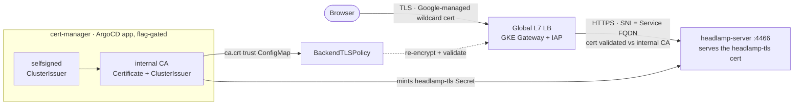

[← Previous: 503. Networking](./503-NETWORKING.md) | [🏠 Home](../README.md) | [→ Next: 601. DevSecOps](./601-DEVSECOPS.md)

---

# 504. Backend TLS — LB→pod re-encryption (opt-in)

**TL;DR** — By default, TLS terminates at the global L7 LB and the LB→pod hop is
plain HTTP (VPC-internal, riding Google's default network-layer encryption —
the posture [docs/501 §3](./501-PLATFORM_OPERATIONS.md#3-zero-trust-security--workload-identity)
documents). Setting **`gateway.backendTls.enabled: true`** (override
`JENKINS2026_GATEWAY_BACKEND_TLS_ENABLED`) and re-running `Day1` adds
**application-layer TLS on that hop** for the TLS-ready backends: cert-manager +
a cluster-internal CA are installed, the backend serves HTTPS itself, and a GKE
`BackendTLSPolicy` makes the LB **re-encrypt *and* validate** the connection
against the internal CA. Stages 1–4 convert **Headlamp**, the **faro RUM
receiver**, **ArgoCD** (the third only for the jenkins/githubactions CI
engines — see the roadmap), and **pgAdmin**; the roadmap below stages the rest.
Default **`false`** — zero impact until you opt in.

## Why (and why opt-in)

The plain-HTTP hop is already a deliberate, defensible posture: it never leaves
Google's VPC fabric, Google encrypts it at the network layer in transit, and
pod-to-pod traffic is WireGuard-encrypted between nodes (Dataplane V2). What
backend TLS adds on top is **application-layer** encryption + **server
authentication**: the LB proves it is talking to *the* backend holding a cert
minted by the cluster's CA, not merely to whatever answers on that endpoint.
That is defense-in-depth, not a gap fix — hence a feature flag, not a default:

- it needs an in-cluster PKI (cert-manager + CA) that the default posture
  doesn't,
- each backend must be individually converted to serve TLS (some have real
  blockers — see the roadmap), and
- it depends on a recent GKE Gateway capability (below).

## The flag

Durable default in [`config/config.yaml`](../config/config.yaml), ephemeral
override via env var — the standard pattern:

| Key | Default | Override | Consumers |
|---|---|---|---|
| `gateway.backendTls.enabled` | `false` | `JENKINS2026_GATEWAY_BACKEND_TLS_ENABLED` | [`08.5-argocd.sh`](../scripts/08.5-argocd.sh) (Headlamp TLS values overlay + the `backendTls` param it threads to the pgAdmin app-of-apps) · [`08.7-backend-tls.sh`](../scripts/08.7-backend-tls.sh) (cert-manager + CA + certs) · [`09-gateway.sh`](../scripts/09-gateway.sh) (`BackendTLSPolicy` + HTTPS `HealthCheckPolicy`) |

**No consumer reads the raw flag.** They all gate on
[`j2026_backend_tls_active`](../scripts/lib/common.sh) = *flag AND the cluster
serves the `BackendTLSPolicy` CRD*. GKE Gateway backend TLS went **GA 2026-05**
on `gke-l7-global-external-managed` (and the regional classes); on an older
cluster the CRD is absent, and if only *some* consumers acted the pod would
serve TLS the LB still speaks plain HTTP to (or vice versa) — an instant 502.
Gating everything on the same probe degrades **consistently** to plain HTTP
with a warning.

## How it works



The pieces, in execution order on a `Day1` re-run:

| Piece | Role |
|---|---|
| [`argocd/cert-manager-app.yaml`](../argocd/cert-manager-app.yaml) | cert-manager, GitOps-managed like the other operators (external-secrets / argo-rollouts). Chart pinned to **`v1.20.3`** ([docs/602](./602-VERSION_PINNING.md)); `crds.enabled=true, keep=false` (v1.15+ syntax) so deleting the app removes the CRDs — and with them every `Certificate`/`ClusterIssuer` — for a residue-free retire. `ServerSideApply` + `ServerSideDiff` (large CRDs, same pairing as argo-rollouts). |
| [`scripts/08.7-backend-tls.sh`](../scripts/08.7-backend-tls.sh) | Applies the app, waits for CRDs + webhook (the `08.6` ESO wait pattern), bootstraps the CA chain — `jenkins-2026-selfsigned` `ClusterIssuer` → `jenkins-2026-internal-ca` CA `Certificate` (10y, ECDSA P-256, in `cert-manager`) → `jenkins-2026-internal-ca` CA `ClusterIssuer` — then mints the per-backend server certs and projects the CA's `tls.crt` as the **`jenkins-2026-backend-tls-ca`** ConfigMap (key `ca.crt`) into each TLS-ready backend namespace. Flag off → symmetric retire (app + certs + trust bundles). |
| [`helm/headlamp/values-backend-tls.yaml`](../helm/headlamp/values-backend-tls.yaml) | The backend half, stage 1: `config.tlsCertPath`/`tlsKeyPath` make headlamp-server terminate TLS on its pod port 4466 from the mounted `headlamp-tls` Secret; `probes.scheme: HTTPS` keeps the kubelet probes green. `08.5-argocd.sh` appends this file to the headlamp Application's `valueFiles` **only when active** — the app manifest is re-rendered every run, so flipping the flag off re-applies it without the overlay and ArgoCD self-heals Headlamp back to plain HTTP. |
| [`scripts/09-gateway.sh`](../scripts/09-gateway.sh) | The LB half: generates the `BackendTLSPolicy` (below) + an **HTTPS `HealthCheckPolicy`** per converted backend when active; deletes both (CRD-guarded) when not. |
| [`scripts/down.sh`](../scripts/down.sh) | Teardown: deletes the `BackendTLSPolicy` in the Gateway block, cascade-deletes the cert-manager app while ArgoCD is alive, and includes `cert-manager` in the namespace sweep. |

## The GKE mechanics (what the policies actually do)

The generated policy for Headlamp:

```yaml
apiVersion: gateway.networking.k8s.io/v1
kind: BackendTLSPolicy
metadata: {name: headlamp-backend-tls, namespace: headlamp}
spec:
  targetRefs:
    - {group: "", kind: Service, name: headlamp}
  validation:
    hostname: headlamp.headlamp.svc.cluster.local
    caCertificateRefs:
      - {group: "", kind: ConfigMap, name: jenkins-2026-backend-tls-ca}
```

- **`validation.hostname` is double-duty**: it is the **SNI** the LB sends in
  the handshake *and* the name the backend cert is validated against — so it
  must match a SAN of the cert `08.7` mints (we use the Service FQDN for both).
- **CA trust = a ConfigMap with key `ca.crt`** (PEM, same namespace as the
  policy/Service; ≤ 8 refs per policy). GKE's alternative,
  `wellKnownCACertificates: "System"`, is **not** a generic system-CA store —
  on GKE it must be paired with a Certificate Manager **TrustConfig**
  (`networking.gke.io/backend-trust-config` option), i.e. more Google-side
  state to manage. For a cluster-internal cert-manager CA, the ConfigMap ref is
  the right tool (and the two modes are mutually exclusive).
- **The health check does NOT follow automatically.** The default LB health
  check type follows the Service's `appProtocol` (unset here = HTTP), so
  without intervention the LB would keep probing plain HTTP against the
  now-TLS pod → backend unhealthy → 502 (the same failure family as the
  faro/argo-events POST-only receivers needing TCP checks). `09-gateway.sh`
  therefore pairs every `BackendTLSPolicy` with an explicit `HealthCheckPolicy`
  `type: HTTPS` probing the serving port.
- **What does *not* change**: the `HTTPRoute` (still targets Service port 80 →
  `targetPort` 4466), the IAP `GCPBackendPolicy` (IAP composes with backend
  TLS), and the NetworkPolicy (Headlamp's baseline already allows pod port
  4466, which now speaks TLS on the same port).
- **Requires the Network Security API project-wide.** The GKE Gateway
  controller compiles a `BackendTLSPolicy` into a load-balancer *server TLS
  policy*, which needs `networksecurity.googleapis.com` enabled on the GCP
  project — not just on the CRD/cluster side. `terraform/gke` enables it
  unconditionally (same treatment as `secretmanager.googleapis.com`), so a
  `Day1` from a clean project is covered. If the API was disabled when the
  flag first flipped true on an **already-provisioned** cluster (e.g. a bare
  `gcloud services enable networksecurity.googleapis.com` was skipped because
  the Terraform apply that would have enabled it hadn't run yet), `gceSync`
  fails with `NetworkSecurity API is not enabled, but server_tls_policies are
  present in the load balancer` — and because the Gateway is a **single
  shared resource**, this blocks `Programmed` for *every* hostname (Jenkins,
  ArgoCD, Grafana, microservices, …), not just Headlamp. Fix: enable the API
  (`gcloud services enable networksecurity.googleapis.com` or re-apply
  `terraform/gke`) and wait for the controller's next resync — no Gateway/HTTPRoute
  edit needed.

## Stage 1: why Headlamp

| Criterion | Headlamp |
|---|---|
| Native TLS support | ✅ upstream `-tls-cert-path`/`-tls-key-path` flags, first-class chart values (0.43.0+), probe scheme knob |
| Cert format | ✅ plain PEM `tls.crt`/`tls.key` — exactly what cert-manager writes, no keystore conversion |
| Always deployed | ✅ engine- and obs-mode-neutral (unlike Jenkins/Tekton/Argo UIs or OSS Grafana) |
| In-repo manifests | ✅ ArgoCD app + values live here (unlike the microservices, whose deploy chart lives in the gitops-config repo) |
| Blast radius | ✅ an admin UI behind IAP; no other platform component consumes its Service |

## Converting the next backend (roadmap + checklist)

Each backend is an independent increment: make it serve TLS from a
cert-manager cert, then add its `BackendTLSPolicy` + HTTPS `HealthCheckPolicy`
pair (and trust-ConfigMap namespace) to `09-gateway.sh`/`08.7-backend-tls.sh`.
Known per-backend state:

| Backend | TLS mechanism | Blocker / note |
|---|---|---|
| **Headlamp** | native flags | ✅ **done (stage 1)** |
| **ArgoCD** | native — argocd-server watches the `argocd-server-tls` Secret and serves TLS when not `--insecure` | 🟡 **done for `jenkins` + `githubactions`** (stage 3). The blocker is that the deploy caller must speak TLS *atomically* with the server flip, and it is **engine-gated** on [`j2026_argocd_backend_tls_active`](../scripts/lib/common.sh): `08.5` drops `--insecure`, `08.7` mints `argocd-server-tls` + restarts the server, `09` attaches the policy + an HTTPS health check — but **only when the engine's caller can do TLS**. Jenkins: `04-jenkins.sh` sets `ARGOCD_SERVER` to the `:443` form so [`vars/microservicesDeploy.groovy`](../vars/microservicesDeploy.groovy) drops `--plaintext`. GitHub Actions: its caller already uses `--server <host> --insecure` (TLS). **`tekton` + `argoworkflows` are NOT converted** — their PaC-triggered runs render `:80 --plaintext` from static YAML that can't read this Day1 flag, so argocd stays plain HTTP there (Headlamp + faro TLS still apply). Migrating those two (a flag the caller reads from a cluster ConfigMap, or 06-rendered params) is the next step |
| **pgAdmin** | container env `PGADMIN_ENABLE_TLS` + `PGADMIN_LISTEN_PORT=8443`, certs mounted as `/certs/server.cert`/`server.key` | ✅ **done (stage 4)** — the [`values-backend-tls.yaml`](../helm/pgadmin/values-backend-tls.yaml) overlay flips the runix subchart to serve HTTPS on **8443** (non-privileged, the pod runs as UID 5050), remapping the cert-manager `tls.crt`/`tls.key` to pgAdmin's `server.cert`/`server.key` via `extraSecretMounts` subPath (with `defaultMode: 0644`, since subPath mounts don't get the pod's fsGroup). `service.portName: https` flips the chart probes to HTTPS; `09-gateway.sh` adds the `BackendTLSPolicy` + an HTTPS `HealthCheckPolicy` (`/misc/ping`). The overlay threads through the `platform-postgres` app-of-apps: `08.5` passes a `backendTls` helm param that makes the pgAdmin child app layer the overlay only when active |
| **Jenkins** | chart `controller.httpsKeyStore.*` + cert-manager `keystores.jks` (JKS + password Secret) | probes move to the plain-HTTP `httpPort` (8081); the WebSocket build agents dial the controller Service — they must trust the internal CA or stay on an internal plain port; highest blast radius |
| **Grafana (OSS)** | `grafana.ini` `server.protocol=https` + mounted cert | oss-mode-only (doubly conditional); values thread through the `observability-oss` app-of-apps |
| **microservices gateway (JHipster)** | Spring Boot `server.ssl.*` + cert-manager `keystores.pkcs12` | **cross-repo** — the deploy chart lives in `jenkins-2026-gitops-config`; also interacts with Argo Rollouts canary routes and every engine's smoke test URL |
| **faro receiver (otel-collector)** | faro receiver `tls` block + mounted cert | ✅ **done (stage 2)** — the `faro-tls` overlay ([`values-backend-tls.yaml`](../observability/otel-collector/values-backend-tls.yaml)) is layered by `03-observability.sh` onto every mode's collector release; the `faro-tls` volume is declared `optional: true` in each `values-<mode>.yaml` so a flag-off collector still starts. Its HealthCheckPolicy stays **TCP** (protocol-agnostic), so only the `BackendTLSPolicy` flips — no health-check change |

## Does `secrets.backend=eso` change anything?

**No — deliberately.** The ESO backend ([docs/201](./201-ARCHITECTURE.md#secrets-backend-imperative--eso))
externalizes secrets whose **source of truth is outside the cluster** (the
GitHub-sourced credentials, groups 1–3). cert-manager certificates are the
opposite case: **minted, rotated and consumed entirely in-cluster**, with the
in-cluster CA as their source of truth — the same rationale that keeps group 4
(in-cluster / Terraform-minted secrets) imperative even in `eso` mode.
Round-tripping short-lived, auto-rotated private keys through GCP Secret Manager
would add an external copy of every key and rotation churn in the external
store, with no recoverability benefit — a rebuild regenerates the whole PKI
anyway (the CA is ephemeral per cluster; see Lifecycle).

The one *legitimate* ESO interaction is **optional CA persistence**: if you ever
wanted the CA **keypair** to survive rebuilds (so backend certs chain to a stable
root across `Decom`+`Day1`), you could store the CA Secret in Secret Manager and
have ESO restore it on provision — the same `sm_keep_or_generate` pattern the
platform uses for stable Postgres passwords ([docs/104](./104-REBUILD_SAFETY.md)).
With an **LB-only trust model** (no external client ever pins these certs; only
the LB validates them, and its trust anchor is regenerated in the same run) this
buys nothing, so it is **documented here and not implemented**.

## Why not a service mesh?

Backend TLS closes exactly one gap — application-layer TLS + server
authentication on the LB→pod hop. A service mesh (Istio, or GKE's managed **Cloud
Service Mesh**) also closes it, but by re-making platform decisions this repo
made deliberately: **sidecar-free** progressive delivery (Argo Rollouts + the
Gateway API traffic-router plugin — [docs/501 § Progressive Delivery](./501-PLATFORM_OPERATIONS.md)),
WireGuard transport encryption, and enforced Dataplane V2 NetworkPolicies. The
three options, in *this platform's* context (a two-microservice PoC that already
has those three):

| | **cert-manager + `BackendTLSPolicy`** (chosen) | **Istio (self-managed)** | **Cloud Service Mesh (GCP managed)** |
|---|---|---|---|
| **What it closes** | App-layer TLS on the LB→pod hop (+ the internal hop later) | mTLS with per-workload **identity** on **all** hops + L7 authZ | Same as Istio, managed control plane |
| **New moving parts** | cert-manager + one policy per host + cert Secrets in the apps | Control plane (istiod) + a sidecar per pod (or ambient ztunnel/waypoint) | Managed control plane; data-plane proxies still run in your pods |
| **Operational cost** | Low — cert-manager auto-rotates; no new plane to upgrade | High — control-plane upgrades, proxy version skew, debugging through sidecars | Medium — Google runs the control plane, **but requires GKE Enterprise** (licensing cost) |
| **Identity / authZ** | None (one-way TLS, no workload identity) | SPIFFE identities + `AuthorizationPolicy` L7 rules | Same, plus a managed mesh CA |
| **Redundancy with what's built** | None — composes with WireGuard / NetPols / Rollouts | **Triple overlap**: traffic-shifting (vs Rollouts + Gateway plugin), transport encryption (vs WireGuard + Google in-transit), L3/4 authZ (vs enforced Cilium NetworkPolicies) | Same overlaps, slightly attenuated by the Gateway API integration |
| **Interaction risk** | Health checks must switch to HTTPS (handled) | Dataplane V2 (managed Cilium/eBPF) + Istio is a *supported but delicate* two-layer combo | Same class of constraint, better documented by Google |
| **Fit for a 2-service PoC** | Right-sized | Overkill | Overkill + license |
| **Cost** | $0 | $0 licence, high toil | GKE Enterprise subscription |

**Why the meshes lost here** — not because meshes are wrong, but because this
platform already made the calls a mesh would re-make: Argo Rollouts + the Gateway
API plugin were chosen *specifically* to get canary/blue-green **without
sidecars**; WireGuard already closes plaintext-on-the-wire; enforced
NetworkPolicies already do L3/4 segmentation. A mesh would duplicate all three,
add a second networking layer beside Dataplane V2's managed Cilium, and (for
Cloud Service Mesh) couple the PoC to GKE Enterprise — while the **only** missing
property was app-layer TLS on one hop.

**When to revisit** — tens of services, a compliance mandate for **identity-based
mTLS to the pod**, fine-grained L7 authorization between workloads, or
multi-cluster. At that point prefer **Cloud Service Mesh over self-managed
Istio** (the operational delta is what you'd be buying) and retire this flag's
machinery in favour of the mesh CA. Until then, backend TLS is the minimal,
composable increment.

## Lifecycle

- **Enable**: set the flag — durable (`config.yaml`), per-run env
  (`JENKINS2026_GATEWAY_BACKEND_TLS_ENABLED`), or the **`backend_tls` input**
  on the `Day1.cluster.00/01` GHA workflows — and **re-run `Day1`**
  ([applying changes = re-run, not Decom+Day1](../CLAUDE.md)): it is the only
  path that runs all three consumers (`08.5` + `08.7` + `09`) in one
  converging pass. The same `backend_tls` input exists on every
  `Day2.redeploy.*` workflow that runs a consumer (`.01-argocd` → `08.5` ·
  `.05-gateway` → `08.7`+`09` · the engine redeploys `.03/.06/.07` → `09`) —
  there it must **match the live cluster**: a flag *flip* through any single
  Day2 workflow leaves the pod and the LB disagreeing on the protocol
  (headlamp 502) until the other half runs.
- **Disable**: flip the flag off and re-run `Day1`. `08.5` re-renders Headlamp
  without the overlay (ArgoCD self-heals it back to HTTP), `08.7` retires the
  certs/trust bundles and cascade-deletes cert-manager, `09` deletes the
  policies. Expect a **brief Headlamp blip** while the LB policy removal and
  the pod's HTTP restart converge (it's an IAP-protected admin UI; nothing else
  consumes it).
- **Teardown**: [`down.sh`](../scripts/down.sh) removes the policy, the
  cert-manager app and (with `J2026_DELETE_NAMESPACES=true`) the namespace.
- **Rebuild safety** ([docs/104](./104-REBUILD_SAFETY.md)): everything this
  feature creates is **in-cluster state with no external identity** — the CA,
  certs, trust bundles and policies die with the cluster and are re-minted
  fresh on the next Day1. No collision, no residue, no new matrix row
  mechanism needed (safe-by-construction).
- **Cert rotation**: cert-manager renews the leaf (90d default) and the
  `BackendTLSPolicy` trust bundle is re-projected on every run; headlamp-server
  reads its cert at startup, so a renewal inside one cluster's lifetime needs a
  pod restart — `08-headlamp.sh` already restarts it on every Day1 re-run,
  which in practice covers this PoC's cluster lifetimes.

## Verifying it

```bash
kubectl get application cert-manager -n argocd                  # Synced/Healthy
kubectl get clusterissuer                                       # both Ready
kubectl get certificate -A                                      # CA + headlamp-tls Ready
kubectl get backendtlspolicy,healthcheckpolicy -n headlamp      # headlamp policy pair present
kubectl get backendtlspolicy faro-backend-tls -n observability  # faro policy (health check stays TCP)
kubectl get certificate faro-tls -n observability               # faro-tls Ready
kubectl get backendtlspolicy,healthcheckpolicy -n pgadmin       # pgadmin policy pair present
kubectl get certificate pgadmin-tls -n pgadmin                  # pgadmin-tls Ready
kubectl -n headlamp get cm jenkins-2026-backend-tls-ca -o jsonpath='{.data.ca\.crt}' | head -1
# The pod side: headlamp now speaks TLS on 4466
kubectl -n headlamp exec deploy/headlamp -- wget -q --no-check-certificate -O- https://localhost:4466/ >/dev/null && echo TLS-OK
# faro: the collector serves TLS on 8027 (SNI = the Service FQDN, validated vs the CA)
kubectl -n observability get svc otel-collector-gateway -o jsonpath='{.spec.ports[?(@.name=="faro")].port}'
# pgAdmin: the pod now serves TLS on 8443 (Service port 80 -> targetPort 8443)
kubectl -n pgadmin get svc pgadmin-pgadmin4 -o jsonpath='{.spec.ports[0].targetPort}'; echo
kubectl -n pgadmin exec deploy/pgadmin-pgadmin4 -- wget -q --no-check-certificate -O- https://localhost:8443/misc/ping >/dev/null && echo TLS-OK
# The LB side: the public hosts must still answer (IAP first for the admin UIs; faro is public)
curl -sSI https://headlamp.<baseDomain> | head -3
curl -sSI https://faro.<baseDomain>     | head -3
curl -sSI https://pgadmin.<baseDomain>  | head -3
```

If the host 502s after enabling, check `kubectl describe backendtlspolicy -n
headlamp` (an unattached/invalid policy is silently ignored — the same
`Attached=False` failure mode as the IAP `GCPBackendPolicy`, see
[docs/902](./902-TROUBLESHOOTING.md)) and the LB health-check state (the
`HealthCheckPolicy` must be HTTPS once the pod serves TLS).

---

[← Previous: 503. Networking](./503-NETWORKING.md) | [🏠 Home](../README.md) | [→ Next: 601. DevSecOps](./601-DEVSECOPS.md)

---

*504. Backend TLS — LB→pod re-encryption — jenkins-2026*
