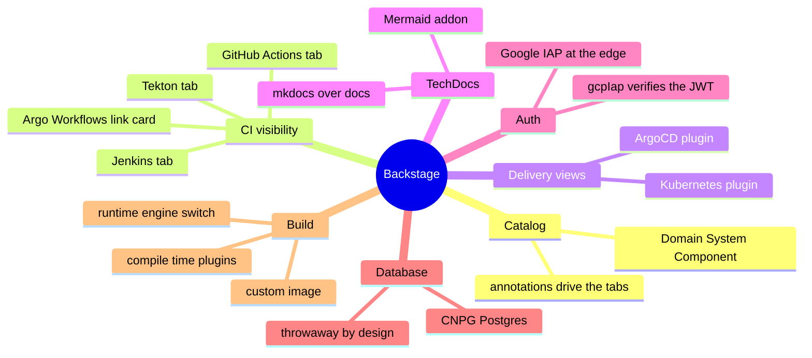
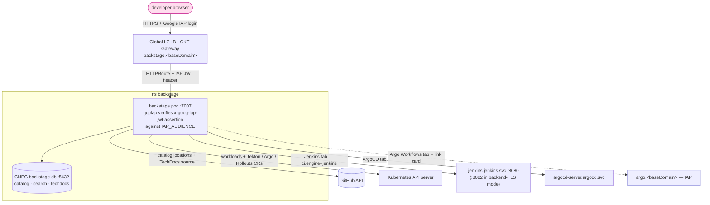
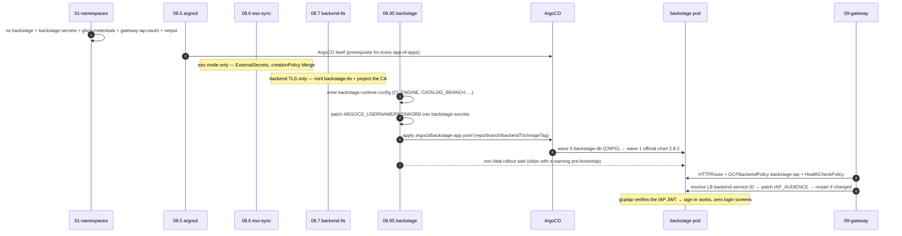
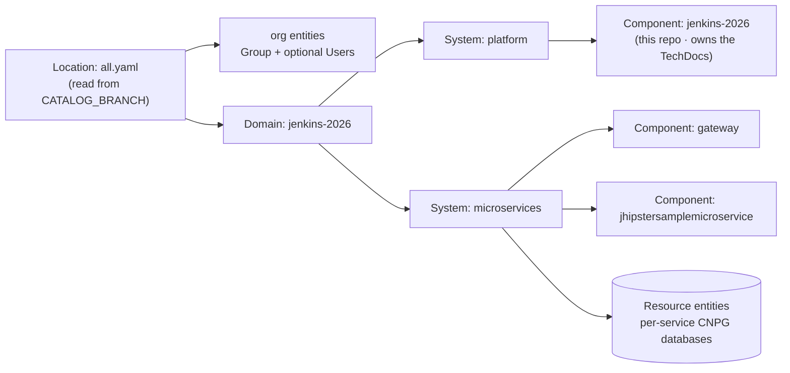

[← Previous: 504. Backend TLS](./504-BACKEND_TLS.md) | [🏠 Home](../README.md) | [→ Next: 601. DevSecOps](./601-DEVSECOPS.md)

---

# 505. Backstage (developer portal / IDP)

This project ships **Backstage.io** (open source, CNCF) **v1.52.1** as its
**developer portal**: a **software catalog** of the microservices and the
platform itself (with a relations **Graph** page rooted at the platform
Domain — a bare visit shows the whole catalog unfolded), **CI/CD visibility
for whichever of the four CI engines is
active**, an **ArgoCD deployment view**, a **Kubernetes workloads view**, a
**Grafana Monitoring tab** switched on `observability.mode` (live
dashboards/alerts cards for `oss`/`grafana-cloud` — see
[§ Monitoring tab](#monitoring-tab-grafana-per-observability-mode)),
**TechDocs** rendering this repo's `docs/` in-portal, and Postgres-backed
**search** across all of it. On a platform whose whole point is four
interchangeable CI engines ([401](./401-JENKINS.md) · [404](./404-TEKTON.md) ·
[405](./405-GITHUB_ACTIONS.md) · [406](./406-ARGO_WORKFLOWS.md)), the question
*"where do I look?"* has four answers — Backstage gives it **one**:
`https://backstage.<baseDomain>` always shows the **active** engine's builds,
the GitOps state, the running workloads, and the docs, per service, on a single
page. It is deployed with the **official Helm chart**
(`backstage/charts` **2.8.2**) but a **custom app image** (source under
[`backstage/`](../backstage/) at the repo root) — Backstage plugins are
**compile-time**, so one image ships all four engines' plugins and the active
tab is selected at **runtime** (see [§ The app image](#the-app-image-compile-time-plugins-runtime-engine)).
Gated by the standard feature-flag pattern (`backstage.enabled`, **default
`true`**) and fronted by **Google IAP** like every other admin UI here.

> **See also.** [401. Jenkins](./401-JENKINS.md) · [404. Tekton](./404-TEKTON.md) ·
> [405. GitHub Actions / ARC](./405-GITHUB_ACTIONS.md) ·
> [406. Argo Workflows](./406-ARGO_WORKFLOWS.md) — the four CI engines the portal
> fronts; [501. Platform Operations](./501-PLATFORM_OPERATIONS.md) — ArgoCD, the
> Gateway + IAP model (and the header-trust contrast drawn below);
> [504. Backend TLS](./504-BACKEND_TLS.md) — Backstage is **stage 10** of the
> backend-TLS roadmap; [201. Architecture](./201-ARCHITECTURE.md) — the
> imperative-vs-GitOps provisioning split this doc keeps citing.

## Understanding Backstage (newcomers → specialists)

Backstage is a **framework, not a turnkey app**: you assemble *your own* portal
from npm-packaged plugins, compile it, and ship it as *your* image. Everything
it shows hangs off the **software catalog** — YAML-described entities
(services, systems, docs, owners) that plugins decorate with live data (builds,
deployments, pods). Read this section once and the rest of the doc is just
"where each file lives".

<details>
<summary>🧠 Mental model — Backstage on this platform (mindmap)</summary>



</details>

**Reading it —** the seven branches are the pieces the rest of this doc walks
through: the **Catalog** (the entity model everything hangs off), the four
**CI tabs** (one per engine, only the active one shown), the engine-independent
**delivery views** (ArgoCD + Kubernetes), **TechDocs** (this repo's `docs/`
rendered in-portal), **Auth** (IAP at the edge, verified again in-app),
the **Database** (a throwaway CNPG Postgres), and the **Build** (the
compile-time-plugins / runtime-engine-switch split that shapes the whole
design).

<details>
<summary>🟢 For newcomers — the mental model in 6 objects</summary>

| Backstage object | What it is | Analogy on this platform |
|---|---|---|
| **Software catalog** | The inventory: every service/system/doc as a YAML-described **entity**, ingested from git | The Jenkins job list + the ArgoCD app list + the GitHub repo list — unified |
| **Component / System / Domain** | The entity kinds: a deployable unit, a group of them, a business area | `gateway` (Component) inside `microservices` (System) inside `jenkins-2026` (Domain) |
| **Annotation** | A machine-readable key on an entity that a plugin reads to find "its" data | The seed job's wiring that binds a Jenkins job to a repo — but declared on the entity |
| **Plugin** | A compiled-in UI (and optionally backend) integration — CI, GitOps, k8s, docs… | A Jenkins plugin, except installed at **build time**, never from a runtime marketplace |
| **EntityPage** | The per-service page whose **tabs** the plugins fill (CI/CD, ArgoCD, Kubernetes, Docs) | The Jenkins job page + the ArgoCD app page + Headlamp's workload view, merged per service |
| **TechDocs** | Docs-as-code: mkdocs sites built from the entity's repo, rendered in-portal | This repo's `docs/` as rendered on GitHub — inside the portal, searchable |

So the loop is: *the catalog ingests entity YAML from git → each entity's
annotations tell the plugins where its builds/deployments/pods live → the
EntityPage tabs render them live → search indexes it all*. You never configure
the portal per-service by hand — you annotate the entity.
</details>

<details>
<summary>🔴 For specialists — the four design decisions that shape this deployment</summary>

- **Compile-time plugins, runtime engine switch.** Backstage has **no runtime
  plugin install** (contrast the Jenkins plugin manager or Grafana's catalog):
  plugins are npm packages compiled into the frontend bundle and registered in
  the backend at build time. With four mutually-exclusive CI engines, the naive
  route — one image per engine — would quadruple the publish matrix. Instead
  **one custom image ships all four engines' plugins**, and the EntityPage
  switches the CI/CD tab on the custom config key **`jenkins2026.ciEngine`**
  (declared with frontend visibility), fed at runtime from the
  `backstage-runtime-config` ConfigMap. Switching `ci.engine` is a re-run of
  [`08.95-backstage.sh`](../scripts/08.95-backstage.sh) + a pod restart — never
  an image rebuild.
- **The new backend system.** The custom backend
  (`backstage/packages/backend/src/index.ts`) is built on Backstage's **new
  backend system** (`createBackend()` + `backend.add(import(...))` feature
  modules — the supported model on the 1.52 line): each backend plugin
  (catalog, auth, jenkins, argocd, kubernetes, techdocs, search, proxy) is one
  `add()` line, and the `gcpIap` sign-in provider is one such module.
- **Config env-substitution + the runtime-ConfigMap pattern.** Backstage
  resolves `${ENV_VAR}` references in `app-config.*.yaml` at startup. The chart
  values inject **both** the `backstage-runtime-config` ConfigMap and the
  `backstage-secrets` Secret as pod env, and
  `backstage/app-config.yaml` references them (`${CI_ENGINE}`,
  `${APP_BASE_URL}`, `${IAP_AUDIENCE}`, `${JENKINS_API_KEY}`, …). Every
  environment-specific value is therefore a **ConfigMap/Secret patch + rollout
  restart** — the image stays identical across engines, branches, and TLS
  modes.
- **IAP JWT audience mechanics.** IAP signs a per-request JWT
  (`x-goog-iap-jwt-assertion` header) whose `aud` claim is
  `/projects/<projectNumber>/global/backendServices/<backendServiceId>`. The
  native `gcpIap` auth provider verifies the signature against Google's JWKS
  **and** that exact audience — but the backend-service ID is minted by the GKE
  Gateway controller only once the LB is programmed, which is why
  [`09-gateway.sh`](../scripts/09-gateway.sh) resolves it **after** applying
  the route and patches it into the runtime ConfigMap (the one genuinely
  order-dependent step — see [§ the audience subtlety](#the-portal-on-the-internet-behind-google-iap)).
</details>

## High-level architecture

The same shape as the engine docs' architecture views — one IAP-fronted pod,
its private database, and read-only fan-out to everything it visualises:

<details>
<summary>🏛️ High-level Backstage architecture</summary>



</details>

**Reading it —** the browser only ever talks to the LB (IAP first); the pod
**verifies the IAP JWT in-app** before signing anyone in. Everything below the
pod is read-only fan-out: the catalog and TechDocs sources come from the GitHub
API, workloads and the Tekton/Argo/Rollouts CRs from the Kubernetes API,
Jenkins build data from the Jenkins Service (only when `ci.engine=jenkins`),
deployment state from `argocd-server` — and the Argo Workflows tab is a **deep
link** out to the IAP-protected Server UI, because no upstream plugin exists
yet ([§ the four tabs](#ci-engine-integration-the-four-tabs)). The database
never leaves the namespace.

## Enabling it (the feature flag)

Durable default in [`config/config.yaml`](../config/config.yaml), ephemeral
override via env var — the standard pattern:

| Key | Default | Override | Consumers |
|---|---|---|---|
| `backstage.enabled` | **`true`** | `JENKINS2026_BACKSTAGE_ENABLED` | [`01-namespaces.sh`](../scripts/01-namespaces.sh) (namespace + secrets + NetworkPolicy + quota) · [`08.6-eso-sync.sh`](../scripts/08.6-eso-sync.sh) (`eso` mode projection) · [`08.7-backend-tls.sh`](../scripts/08.7-backend-tls.sh) (`backstage-tls` cert, TLS mode) · [`08.95-backstage.sh`](../scripts/08.95-backstage.sh) (runtime ConfigMap + the ArgoCD Application) · [`09-gateway.sh`](../scripts/09-gateway.sh) (route + IAP + audience) |

The public host is **`backstage.<baseDomain>`** (`gateway.hosts.backstage`).
Flipping the flag **off** and re-running `Day1` (or
`Day2.redeploy.08-backstage`) retires it symmetrically: `08.95` deletes the
parent Application (ArgoCD cascade-prunes the chart **and** the database) and
the `backstage-runtime-config` ConfigMap, and `09` stops emitting the
route/policies — the same retire idiom as the other flag-gated features.

> ⚠️ **One-time image bootstrap — automated by the umbrella.** The custom app
> image must exist in GHCR before the first Backstage-enabled `Day1`. The
> **`Day1.cluster.00-all` umbrella handles this itself**: an ungated pre-check
> probes `ghcr.io/…-backstage:<branch>` (`docker manifest inspect`) and
> auto-runs [`Day2.publish.06-backstage`](../.github/workflows/Day2.publish.06-backstage.yml)
> **only when the image is missing** — the same probe pattern as its
> `bootstrap_gateway` static-IP check, so "everything up from decommissioned"
> is one click with no manual prerequisite. The image then **persists across
> cluster rebuilds** (like the microservices images — a Day0-like artifact),
> so later rebuilds skip the ~15 min build. `Day2.publish.06` remains the
> manual path for a bare `Day1.cluster.01` run and the **update path** after
> changing `backstage/` sources. Until an image exists, `08.95` **warns and
> skips the rollout wait** — the pod sits in `ImagePullBackOff` but `Day1`
> stays green, so an un-bootstrapped image never blocks the platform.

## What gets installed (GitOps via ArgoCD app-of-apps)

Backstage is **GitOps-managed by ArgoCD**, the same app-of-apps pattern as
[`argocd/tekton`](../argocd/tekton) / [`argocd/platform-postgres`](../argocd/platform-postgres):
[`scripts/08.95-backstage.sh`](../scripts/08.95-backstage.sh) sed-applies the
parent Application [`argocd/backstage-app.yaml`](../argocd/backstage-app.yaml)
(substituting the `repoUrl`/`branch`/`backendTls`/`imageTag` placeholders,
exactly like the other app-of-apps), which renders the local Helm chart
[`argocd/backstage/`](../argocd/backstage/):

| Child | Kind | Sync wave | Source | Notes |
|---|---|---|---|---|
| `backstage-db` | CNPG `Cluster` | 0 | `argocd/backstage/templates/db.yaml` | single instance, **no backups — throwaway by design** ([§ Database](#database-cnpg--throwaway-by-design)); the CNPG **operator** itself comes from the `platform-postgres` app-of-apps ([502](./502-MICROSERVICES_GITOPS.md)), already installed by the time `08.95` runs |
| `backstage` | child `Application` | 1 | the **official chart 2.8.2** (`https://backstage.github.io/charts`) + a `$values` ref to [`helm/backstage/values.yaml`](../helm/backstage/values.yaml) | + [`helm/backstage/values-backend-tls.yaml`](../helm/backstage/values-backend-tls.yaml) layered **only when backend TLS is active** — the same conditional-overlay mechanism as pgAdmin/Headlamp ([504](./504-BACKEND_TLS.md)) |

The chart's bundled bitnami PostgreSQL subchart stays **disabled** (frozen on
the unmaintained `bitnamilegacy` image since the 2025 Bitnami catalog
lockdown); the database is the external CNPG `Cluster` instead. Credential
Secrets are **not** GitOps-managed —
[`01-namespaces.sh`](../scripts/01-namespaces.sh) creates them imperatively,
the standard split ([201](./201-ARCHITECTURE.md)).

How a `Day1` assembles it, end to end:

<details>
<summary>🚀 Day1 provisioning sequence</summary>



</details>

## The portal on the internet, behind Google IAP

```
https://backstage.<baseDomain>  →  Google IAP login  →  the portal, already signed in as you
```

**Same identity story as every other admin UI here** — one OAuth client
(`gateway-iap-oauth`), one admin list (the `HEADLAMP_ADMIN_EMAILS` secret →
project-level `roles/iap.httpsResourceAccessor` granted by `terraform/gke`),
**no new OAuth client and no Terraform change**.
[`09-gateway.sh`](../scripts/09-gateway.sh) emits the `HTTPRoute`
(`backstage.<baseDomain>` → Service `backstage:7007`), the `GCPBackendPolicy`
**`backstage-iap`**, and a `HealthCheckPolicy` probing
`/.backstage/health/v1/readiness` (HTTP, or HTTPS when backend TLS is active).

**In-app sign-in is where Backstage goes one step further than ArgoCD.**
ArgoCD's IAP integration ([501](./501-PLATFORM_OPERATIONS.md)) uses Dex's
`authproxy` connector, which **trusts** the `X-Goog-Authenticated-User-Email`
*header* — spoofable by anything that can reach the pod, hence the
LB-CIDR-only NetworkPolicy defense there. Backstage instead uses the **native
`gcpIap` auth provider**
(`@backstage/plugin-auth-backend-module-gcp-iap-provider` 0.4.16), which
**cryptographically verifies** the `x-goog-iap-jwt-assertion` **JWT** — Google's
signature via JWKS *and* the expected audience — so a spoofed header buys an
attacker nothing. (Backstage still gets the same LB-CIDR ingress NetworkPolicy
as defense-in-depth; layers, not either/or.) The sign-in resolver is
`emailMatchingUserEntityProfileEmail` with
`dangerouslyAllowSignInWithoutUserInCatalog: true` — the scary name is
upstream's, but here **IAP is the real gate**: catalog `User` entities are
optional profile sugar, not the access-control list. The frontend mounts
`ProxiedSignInPage` (provider `gcpIap`), so there are **zero login screens** —
IAP authenticates you at the edge, the JWT signs you into Backstage as your
Google identity, and the allow-all permission policy grants admin.

**The audience subtlety** — the one genuinely order-dependent step. The JWT's
`aud` is `/projects/<projectNumber>/global/backendServices/<id>`, and that
backend-service ID **only exists after the GKE Gateway controller programs the
LB** (asynchronously, minutes after the route is applied). So `09-gateway.sh`,
after applying the route, resolves the ID **by reference, never by name
pattern**: the Service's own `cloud.google.com/neg-status` annotation names its
NEG exactly, and the backend service lists that NEG under `.backends[].group`
(`gcloud … --format=json` + `jq`). It then patches the ID into the
`backstage-runtime-config` key `IAP_AUDIENCE` and restarts the deployment when
the value changed — with a bounded retry. (The resolver **used** to match the
backend-service *name* against `gkegw1-*-backstage-backstage-7007-*` — but GKE
composes that name from gateway-ns/gateway-name/svc-ns/svc-name and **truncates
every component** to fit 63 chars; found live 2026-07-12 rendering as
`…-backs-back-7007-…`, which the regex could never match → `IAP_AUDIENCE`
stayed `pending` → every sign-in 401'd at `/api/auth/gcpIap/refresh`. Gateway
backend services also carry an **empty `description`**, so the Ingress-style
description lookup is unavailable — the NEG reference chain is the only robust
resolver.) On the **first-ever** Day1 the LB may still be programming when the
retry budget runs out: the run stays green with `IAP_AUDIENCE` on its
placeholder, and the **next** re-run (or `Day2.redeploy.05-gateway` /
`.08-backstage`) converges it. Symptom and fix in
[§ Troubleshooting](#troubleshooting).

## The app image (compile-time plugins, runtime engine)

**Why a custom image at all?** The official chart's default image is the
upstream **demo app** — none of these plugins compiled in. Since Backstage has
no runtime plugin install, the only way to get the Jenkins + GitHub Actions +
Tekton + ArgoCD + Kubernetes + gcpIap plugin set is to **build your own app**.
That app lives at the repo root:

```
backstage/
├── backstage.json                  # Backstage version pin — 1.52.1
├── package.json                    # yarn 4.8.1 workspaces; release-manifest pins
├── app-config.yaml                 # THE in-cluster config — ${ENV} refs resolved from the
│                                   #   runtime ConfigMap + backstage-secrets at startup
├── app-config.local.example.yaml   # local-dev overlay template (guest auth, localhost)
├── catalog/                        # the software catalog (all.yaml → org / platform / services)
└── packages/
    ├── app/                        # frontend: EntityPage (the 4 CI tabs) + ProxiedSignInPage(gcpIap)
    └── backend/                    # new-backend-system index.ts
        └── Dockerfile              # Node 24 runtime + mkdocs-techdocs-core (TechDocs local builder)
```

Version pins (all **verified 2026-07-11**; policy in [602](./602-VERSION_PINNING.md)):

| Component | Pin | Where pinned |
|---|---|---|
| Backstage core | **1.52.1** (latest stable line, released 2026-06-26) | `backstage/backstage.json` + the release-manifest pins in `backstage/package.json` |
| Official Helm chart (`backstage/charts`) | **2.8.2** | `config.yaml` `backstage.chart.version` |
| `@backstage-community/plugin-jenkins` / `-backend` | 0.32.0 / 0.29.0 | `packages/app` / `packages/backend` `package.json` |
| `@backstage-community/plugin-github-actions` | 1.2.0 (frontend-only) | `packages/app` |
| `@backstage-community/plugin-tekton` | 3.39.0 | `packages/app` |
| `@backstage-community/plugin-grafana` | 0.21.0 (frontend-only; verified 2026-07-13) | `packages/app` |
| `@backstage-community/plugin-argocd` / `-backend` | 2.9.0 / 1.5.0 | `packages/app` / `packages/backend` |
| `@backstage/plugin-kubernetes` / `-backend` | 0.12.20 / 0.21.5 | `packages/app` / `packages/backend` |
| `@backstage/plugin-auth-backend-module-gcp-iap-provider` | 0.4.16 | `packages/backend` |
| Node / yarn | 24 / 4.8.1 | the Dockerfile + the publish workflow |
| PostgreSQL | CNPG operator default | pinned **transitively** by the cnpg chart 0.29.0 pin (Backstage supports the last 5 PG majors) |
| `mkdocs-techdocs-core` | pinned in the Dockerfile | `backstage/packages/backend/Dockerfile` |

**Build & publish** —
[`Day2.publish.06-backstage.yml`](../.github/workflows/Day2.publish.06-backstage.yml)
(`workflow_dispatch`, plus `push` on paths `backstage/**` to `main`/`develop`):
Node 24 + yarn 4.8.1 **host-build** (`yarn install` / `tsc` / `build:backend`),
then `docker build -f backstage/packages/backend/Dockerfile`, pushed as
`ghcr.io/nubenetes/jenkins-2026-backstage:<branch>` **and** `:sha-<sha>` using
the workflow's own `GITHUB_TOKEN` (`packages: write`) — no PAT involved.

**Branch-tag auto-tracking** — `backstage.image.tag` is empty by default, which
means *track the deploy branch* (`J2026_SELF_REPO_BRANCH` → `main` | `develop`):
a Day1 dispatched from `develop` runs develop's Backstage image before the
promotion PR, exactly the auto-track pattern of the Jenkins shared library.
Pin a `sha-<sha>` tag via `backstage.image.tag` or the ephemeral
`JENKINS2026_BACKSTAGE_IMAGE_TAG` when you need reproducibility over tracking.

## The catalog

The catalog is **in-repo** under [`backstage/catalog/`](../backstage/catalog/):
a `Location` entity (`all.yaml`) fans out to the org, platform, and services
entity files, and the backend ingests them from **`CATALOG_BRANCH`** — the
deploy branch, auto-tracked like everything else (a develop Day1 reads
develop's catalog).

<details>
<summary>🗂️ Catalog entity model</summary>



</details>

The two service Components mirror
[`jenkins/pipelines/seed/services.yaml`](../jenkins/pipelines/seed/services.yaml)
— **the same registry all four CI engines read** — and each carries **all four
engines' annotations simultaneously** (they're inert metadata; only the active
engine's tab reads its own):

| Annotation | Example (gateway) | Read by |
|---|---|---|
| `jenkins.io/job-full-name` | the seed-generated job name (`gateway`) | Jenkins plugin |
| `github.com/project-slug` | `nubenetes/jhipster-sample-app-gateway` | GitHub Actions plugin |
| `tekton.dev/cicd` | `"true"` | Tekton plugin |
| `backstage.io/kubernetes-label-selector` **only — deliberately NO `…kubernetes-namespace`** | `app.kubernetes.io/name=gateway`, matched **cluster-wide** | Kubernetes backend (also feeds the Tekton/Argo CR queries — one shared namespace would starve the `tekton-ci`/`argo-ci` lookups; every run-creation manifest carries the same label. See troubleshooting) |
| `argocd/app-name` | `microservices-stable` | ArgoCD plugin |
| `backstage.io/techdocs-ref` | `dir:.` on the platform Component | TechDocs |
| `grafana/dashboard-selector` | `tags @> 'microservices' \|\| tags @> 'rum'` — matches the **tags** each [`observability/grafana/dashboards/*.json`](../observability/grafana/dashboards/) already carries | Grafana plugin (the [Monitoring tab](#monitoring-tab-grafana-per-observability-mode)) |
| `grafana/alert-label-selector` | `project=jenkins-2026` — the label every provisioned [alert rule](../observability/grafana/alerting/rules/) carries | Grafana plugin (alerts card) |

The **CI/CD tab itself switches at runtime** on `jenkins2026.ciEngine` (the
custom frontend-visible config key fed from the runtime ConfigMap), so the
*same* catalog + the *same* image serve any engine — flip `ci.engine`, re-run,
and the tab follows.

## CI-engine integration (the four tabs)

The centerpiece matrix — what the CI/CD tab shows per engine, and what it needs:

| `ci.engine` | CI/CD tab shows | Plugin (pin) | Entity annotation | Credentials | Data path |
|---|---|---|---|---|---|
| `jenkins` | job/build history, per-build status + logs | `@backstage-community/plugin-jenkins` 0.32.0 + `-backend` 0.29.0 | `jenkins.io/job-full-name` | `JENKINS_API_USER`/`JENKINS_API_KEY` in `backstage-secrets` | backend → `http://jenkins.jenkins.svc:8080` (`:8082` when backend TLS is active) |
| `githubactions` | workflow runs for the fork | `@backstage-community/plugin-github-actions` 1.2.0 (**frontend-only**) | `github.com/project-slug` | **the signed-in user's own GitHub OAuth token** (one-time popup) | browser → GitHub API |
| `tekton` | PipelineRuns/TaskRuns + pod logs | `@backstage-community/plugin-tekton` 3.39.0 | `tekton.dev/cicd: "true"` + the kubernetes ns/selector pair | in-cluster ServiceAccount (Kubernetes backend) | backend → Kubernetes API (`tekton.dev/v1`) |
| `argoworkflows` | an **InfoCard deep link** (no upstream plugin yet) | — (community-plugins **#9192** pending) | — | — | link → `argo.<baseDomain>` (IAP); the CRs surface on the Kubernetes tab |

### Jenkins

The one engine with a first-class **backend** plugin: the Backstage backend
calls the Jenkins REST API server-side with `JENKINS_API_USER`/`JENKINS_API_KEY`
(the `admin` user + admin password, copied from `jenkins-credentials` by
[`01-namespaces.sh`](../scripts/01-namespaces.sh) — seeded **only when
`ci.engine=jenkins`**). It dials the **Service directly**
(`http://jenkins.jenkins.svc:8080`), never the IAP host; when backend TLS is
active the runtime ConfigMap flips `JENKINS_BASE_URL` to the **plain-HTTP agent
port `:8082`** that Jenkins's stage-6 conversion keeps exposed
([504](./504-BACKEND_TLS.md)) — the same escape hatch the build agents use.

### GitHub Actions

**Frontend-only, and deliberately per-user**: the plugin calls the GitHub API
**from the browser with the signed-in user's own token**, obtained via the
`github` auth provider — a static integrations token is **not** used by this
tab (each viewer sees exactly what their GitHub account can see). That requires
a **one-time per-user OAuth popup**, backed by a GitHub **OAuth App** whose
callback is `https://backstage.<baseDomain>/api/auth/github/handler/frame` and
whose credentials come from the **optional** GitHub secrets
`BACKSTAGE_GITHUB_OAUTH_CLIENT_ID`/`BACKSTAGE_GITHUB_OAUTH_CLIENT_SECRET`
([103](./103-GITHUB_SECRETS_INVENTORY.md)). Without them, `01-namespaces.sh`
seeds `unset` placeholders and the portal **degrades gracefully** — everything
else works; only this tab's popup can't complete.

**Enabling it — the one-time OAuth App runbook** (the only Backstage feature
whose credential cannot be provisioned by the platform: classic OAuth Apps have
no creation API, and the client secret is human-issued):

1. **Create the OAuth App inside the `nubenetes` org** — org-owned, so it is
   exempt from any *third-party OAuth access* restriction on the org's repos
   (a user-owned app would need a separate approval): *github.com → the
   `nubenetes` org → Settings → Developer settings → OAuth Apps → New OAuth
   App*, with exactly:
   - **Application name**: `jenkins-2026 Backstage` (cosmetic — shown on the consent screen)
   - **Homepage URL**: `https://backstage.jenkins2026.nubenetes.com`
   - **Authorization callback URL**: `https://backstage.jenkins2026.nubenetes.com/api/auth/github/handler/frame`
   - *Enable Device Flow*: leave **off** (the popup uses the web flow).

   The host follows `gateway.baseDomain` ([`config/config.yaml`](../config/config.yaml)) —
   adjust if you run a different domain. After creating, **Generate a new
   client secret**.
2. **Set the two repo secrets** (interactive stdin — the values never transit
   a shell history or a chat):

   ```bash
   gh secret set BACKSTAGE_GITHUB_OAUTH_CLIENT_ID     -R nubenetes/jenkins-2026
   gh secret set BACKSTAGE_GITHUB_OAUTH_CLIENT_SECRET -R nubenetes/jenkins-2026
   ```
3. **Apply**: the next `Day1.cluster.01-gke` picks them up automatically; on an
   already-running cluster run **`Day2.redeploy.08-backstage`** — its `01`
   re-seed refreshes `backstage-secrets` (both backends: imperative patch, or
   Secret Manager + ESO `Merge`) and `08.95` rollout-restarts the pod.
4. **Verify** — note the tab only renders under **`ci.engine=githubactions`**
   (the CI/CD tab always shows the *active* engine): entity → *CI/CD* → *Sign
   in* → the popup authorizes the OAuth App (ScmAuth requests the `repo`
   scope) → the workflow runs render with **that user's own** GitHub
   visibility.

**Rotation**: regenerate the client secret on the OAuth App → repeat steps
2–3. Revoking a single user's grant: the user's GitHub *Settings →
Applications → Authorized OAuth Apps*.

### Tekton

No dedicated backend — the Tekton plugin **rides the Kubernetes backend**:
`kubernetes.customResources` registers `tekton.dev/v1`
`pipelineruns`/`taskruns`, and the tab renders the runs matching the entity's
`tekton.dev/cicd: "true"` + kubernetes namespace/label-selector annotations,
with step logs streamed via `pods/log`. The RBAC lives in the `platform-config`
chart ([`argocd/platform-config/`](../argocd/platform-config/), file
`rbac-backstage.yaml`): `get`/`list`/`watch` on `pipelineruns`, `taskruns`, and
`pods/log`.

### Argo Workflows

**The honest gap**: no upstream Backstage plugin for Argo Workflows exists yet
(verified 2026-07-11 — `@backstage-community` has no argo-workflows workspace;
the donation PR **backstage/community-plugins#9192** has been open since
2026-05-21). So the CI/CD tab shows an **InfoCard deep-linking the
IAP-protected Argo Server UI** (`argo.<baseDomain>`,
[406](./406-ARGO_WORKFLOWS.md)) — same Google identity, one click — and the
**Kubernetes tab** surfaces the `argoproj.io/v1alpha1` `workflows` via
`customResources`, so run status is still visible in-portal. Adopting the
community plugin when #9192 ships is a [roadmap](#roadmap) item.

## GitOps & Kubernetes views (engine-independent)

Two tabs render on the EntityPage **regardless of the CI engine**:

- **ArgoCD** (`@backstage-community/plugin-argocd` 2.9.0 + `-backend` 1.5.0) —
  sync/health status, history, and resources for the app named by
  `argocd/app-name` (`microservices-stable`). The backend authenticates with
  `ARGOCD_USERNAME`/`ARGOCD_PASSWORD`, which
  [`08.95-backstage.sh`](../scripts/08.95-backstage.sh) **patches into
  `backstage-secrets` from `argocd-initial-admin-secret`** on every run — no
  human ever handles the value. `ARGOCD_BASE_URL` in the runtime ConfigMap
  flips `http://` ↔ `https://` with backend TLS (below).
- **Kubernetes** (`@backstage/plugin-kubernetes` 0.12.20 + `-backend` 0.21.5) —
  the entity's Deployments/pods/HPAs, plus `customResources` for the Tekton
  runs, the `argoproj.io` Workflows, and the **Argo Rollouts** driving
  progressive delivery ([501](./501-PLATFORM_OPERATIONS.md)). Auth is the
  in-cluster **`serviceAccount`** method (the pod's own SA token — keyless);
  the read-only RBAC is GitOps-managed in `platform-config`'s
  `rbac-backstage.yaml`, alongside the platform's other static RBAC.

## Monitoring tab (Grafana, per observability mode)

The EntityPage carries a **Monitoring** tab that surfaces the platform's
Grafana **inside the portal** — the same runtime-switch pattern as the CI/CD
tab, but keyed on **`jenkins2026.obsMode`** (= `observability.mode`,
[301](./301-OBSERVABILITY.md)) instead of `ciEngine`. One image ships the
[`@backstage-community/plugin-grafana`](https://github.com/backstage/community-plugins/tree/main/workspaces/grafana)
(0.21.0); what the tab renders follows the mode **at runtime, no rebuild**:

| `observability.mode` | Monitoring tab renders | Credential behind it |
|---|---|---|
| `oss` | **live dashboards + alerts cards** (proxy → the in-cluster Grafana Service) | Viewer service-account token **minted in-cluster by `08.95`** against the Grafana API |
| `grafana-cloud` | **live dashboards + alerts cards** (proxy → the stack URL) | Viewer **stack service-account token minted by Terraform** (`grafana-cloud-token`), threaded through Day1 — never a GitHub secret |
| `managed-azure` / `managed-aws` | **deep-link InfoCard** to the managed workspace + the deferral rationale | none — the proxy is never called (decision record below) |

The switch lives in
[`ObservabilityContent.tsx`](../backstage/packages/app/src/components/observability/ObservabilityContent.tsx)
(the `CicdContent` twin); the tab only appears on entities carrying the
`grafana/*` annotations (route-level `if`), so Group/User pages stay
noise-free.

**The static-tree discovery contract (both runtime-switch tabs).** Backstage's
legacy frontend discovers plugins by traversing the app's **static JSX element
tree** — it never executes component render bodies. A plugin extension that is
only *rendered inside* a wrapper component is therefore invisible, and the
plugin's default **API factory never registers** (the Grafana cards then crash
with `NotImplementedError: No implementation available for
apiRef{plugin.grafana.service}` — hit live on the tab's first validation,
2026-07-13; the CI/CD tab had the routeRef flavour of the same problem). Both
wrappers hence take the plugin extensions as **deliberately-unused children**
mounted by `EntityPage.tsx` (`cicdContent` / `monitoringContent`): the children
make the plugins discoverable, while rendering stays exclusively the runtime
switch inside the wrapper. Any future runtime-switched tab must follow the same
pattern.

**How the live cards find content — zero Grafana-side changes.** The plugin
matches what the platform already provisions:

- `grafana/dashboard-selector` matches **dashboard tags**, and every dashboard
  under [`observability/grafana/dashboards/`](../observability/grafana/dashboards/)
  has carried tags from day one (`jenkins-2026` on all, plus per-domain ones
  like `microservices`, `rum`, `postgres`). The two services select their
  app-level dashboards (`tags @> 'microservices'`, the gateway adding
  `|| tags @> 'rum'` for the Faro frontend-RUM one); `jenkins-2026-infra`
  selects the whole catalog with the plain `jenkins-2026` tag.
- `grafana/alert-label-selector: project=jenkins-2026` matches the **label**
  every provisioned alert rule
  ([`observability/grafana/alerting/rules/`](../observability/grafana/alerting/rules/),
  [301](./301-OBSERVABILITY.md)) already carries; `grafana.unifiedAlerting:
  true` points the card at the modern provisioning API (both wired Grafanas
  run unified alerting).

**The plumbing** (all values land through the standard runtime contract, and
**every key is always non-empty in every mode** — the proxy-backend validates
its target URL at startup, and this app has met the empty-string startup class
before, see [Troubleshooting](#troubleshooting)):

- [`app-config.yaml`](../backstage/app-config.yaml) declares the
  **`proxy.'/grafana/api'`** endpoint (`target: ${GRAFANA_PROXY_TARGET}`,
  `Authorization: Bearer ${GRAFANA_TOKEN}`) and `grafana.domain:
  ${GRAFANA_DOMAIN}` (the origin the cards build user-facing links against —
  for `oss` that's the **public IAP host** `https://grafana.<baseDomain>`,
  so clicking a dashboard opens the same Google-authenticated UI as the
  header link; no `InternalUrlRewriter` involvement needed).
- `08.95-backstage.sh` derives `OBS_MODE` / `GRAFANA_DOMAIN` /
  `GRAFANA_PROXY_TARGET` per mode into the runtime ConfigMap: the oss proxy
  target is the in-cluster Service FQDN (flipping to `https://` under backend
  TLS — the cert's SAN is exactly that FQDN and Node trusts the internal CA
  via `NODE_EXTRA_CA_CERTS`, the ArgoCD-plugin trust path); grafana-cloud
  reads the stack URL from the same `grafana-cloud-credentials` key
  `04-jenkins.sh` uses for its banner links; the managed modes get the
  workspace endpoint for the link plus an **inert-but-parseable**
  `https://grafana.invalid` proxy target (RFC 2606 — never resolvable, never
  called).
- **`GRAFANA_TOKEN` ownership is mode-dependent** (single-owner-per-key — the
  `grafana-base-url` clobber lesson): in **oss**, `08.95` mints a **Viewer
  service-account token** against the Grafana API (curl exec'd *inside* the
  Grafana container — no Service/NetworkPolicy dependency for the mint) and
  PATCHes it into `backstage-secrets` exactly like `ARGOCD_*`; keep-if-valid
  on re-runs (an existing token that still answers `/api/search` is left
  alone), pruning its older tokens when it does rotate. In **grafana-cloud**,
  Terraform ([`terraform/grafana-cloud-token`](../terraform/grafana-cloud-token/))
  mints a **separate, read-only** `jenkins-2026-backstage` stack service
  account (deliberately not reusing the Admin `dashboards` SA — least
  privilege, independent rotation) and `Day1.cluster.01-gke` threads the
  token output to `01-namespaces.sh` as `BACKSTAGE_GRAFANA_TOKEN` — read from
  TF state at deploy time, **never stored as a GitHub secret** (the
  azure/aws credentials pattern, [103](./103-GITHUB_SECRETS_INVENTORY.md)).
- NetworkPolicy: the `observability-policy` ingress allowlists **`backstage`
  → pod port 3000** for the oss proxy call
  ([`infrastructure/networkpolicies.yaml`](../infrastructure/networkpolicies.yaml));
  inert in every other mode/flag combination.

### Why the managed modes are deferred (decision record)

`managed-azure` / `managed-aws` deliberately get the deep-link card, **not**
live cards wired to Azure Managed Grafana / Amazon Managed Grafana. This was
an explicit decision (2026-07-13), not an omission:

1. **Credential-model mismatch — the whole story.** The Backstage Grafana
   plugin authenticates one way: a **static Bearer token** on a proxy
   endpoint. The self-managed and Grafana-Cloud APIs issue exactly that
   (service-account tokens). The managed offerings don't: **Azure Managed
   Grafana** wants **Entra ID (AAD) OAuth tokens** (minutes-to-hours TTL,
   minted per-principal) and **Amazon Managed Grafana** wants **AWS
   IAM/SigV4-derived session credentials** — both *designed* to expire fast
   and be re-minted by an SDK, which a fixed `Authorization` header cannot do.
2. **Wiring them anyway would be a time-bomb, not a feature.** A pasted
   AAD/AWS token *works in the demo and dies silently within hours* — the tab
   would 401 on the first expiry, indistinguishable from a real fault, and
   "re-paste a token every morning" is operational debt this repo refuses on
   principle (every other credential here is either minted-per-deploy,
   WIF-keyless, or auto-rotated).
3. **Precedent — this exact trade-off has been decided before.** The
   Grafana **LLM-app** backends for managed-azure/aws were implemented and
   then **retired** for the same reason (the plugin couldn't ride Managed
   Identity / Bedrock's credential model — [301](./301-OBSERVABILITY.md)).
   AMG/AAD proxies with sidecar token-refreshers exist, but a
   token-refresher sidecar for a PoC tab fails the complexity bar.
4. **The fallback is honest and useful.** The InfoCard names the mode, links
   the managed workspace (`GRAFANA_BASE_URL` from the same credentials Secret
   the collector uses — resolved when the backend was provisioned), and
   points here for the rationale — the `argoworkflows`-tab pattern: better a
   truthful link card than a half-live tab that rots.
5. **Revisit conditions** (tracked in [Roadmap](#roadmap)): upstream plugin
   support for AAD/SigV4 auth (or an official AMG token-proxy), or the PoC
   promoting a managed mode to its primary posture — either flips the
   decision.

## TechDocs

TechDocs renders **this repo's existing `docs/` tree** — the very documents
you're reading — inside the portal, indexed by search:

- a **repo-root [`mkdocs.yml`](../mkdocs.yml)** defines the site over `docs/`
  (nav mirroring the `NNN-TITLE` numbering taxonomy of
  [`docs/README.md`](README.md)), referenced from the platform Component via
  `backstage.io/techdocs-ref: dir:.`;
- **`builder: local`** — the backend pod builds the mkdocs site **on demand**
  with the `mkdocs-techdocs-core` baked into the image (the reason the
  Dockerfile carries a Python layer). Trade-offs, deliberately accepted: first
  view after a restart is slow (build on demand), and the built site is
  ephemeral (rebuilt after every pod/database rebuild) — in exchange, **no
  external publisher bucket** and zero extra infrastructure. The S3/GCS
  publisher is a [roadmap](#roadmap) item;
- **Mermaid** — the docs' many diagrams render via the TechDocs **Mermaid
  addon** (client-side), so the mindmaps/flowcharts here appear in-portal, not
  as fenced code blocks.

## Credentials & RBAC

**`backstage-secrets`** (ns `backstage`, created by
[`01-namespaces.sh`](../scripts/01-namespaces.sh)):

| Key | Source | Consumer |
|---|---|---|
| `BACKEND_SECRET` | stable-generated by `01` (`sm_keep_or_generate` in eso mode) | backend service-to-service auth (`backend.auth.keys`) |
| `GITHUB_TOKEN` | `= GIT_TOKEN` (the existing PAT) | GitHub integration — catalog ingestion + TechDocs source reads |
| `JENKINS_API_USER` / `JENKINS_API_KEY` | `jenkins-credentials` (`admin` + admin password), **`ci.engine=jenkins` only** | Jenkins backend plugin |
| `AUTH_GITHUB_CLIENT_ID` / `AUTH_GITHUB_CLIENT_SECRET` | optional `BACKSTAGE_GITHUB_OAUTH_*` GitHub secrets; `unset` placeholders otherwise | the `github` auth provider (the GHA tab's per-user OAuth) |
| `ARGOCD_USERNAME` / `ARGOCD_PASSWORD` | **patched by `08.95`** from `argocd-initial-admin-secret` | ArgoCD backend plugin |
| `GRAFANA_TOKEN` | mode-dependent owner: **oss** → Viewer token **minted+patched by `08.95`**; **grafana-cloud** → the Terraform `backstage_grafana_token` output threaded by Day1; **managed-\*** → `unset` placeholder (never sent) | the `'/grafana/api'` proxy Bearer ([Monitoring tab](#monitoring-tab-grafana-per-observability-mode)) |

Plus the **`ghcr-credentials`** pull secret (the custom image is on GHCR) and
**`gateway-iap-oauth`** (the namespace joins the standard IAP list).

**`backstage-runtime-config`** ConfigMap (written by `08.95`, `IAP_AUDIENCE`
finished by `09`):

| Key | Value | Drives |
|---|---|---|
| `CI_ENGINE` | the active `ci.engine` | `jenkins2026.ciEngine` → which CI/CD tab renders |
| `APP_BASE_URL` | `https://backstage.<baseDomain>` | `app.baseUrl` / `backend.baseUrl` / CORS |
| `CATALOG_BRANCH` | the deploy branch (`J2026_SELF_REPO_BRANCH`) | the catalog `Location` URL |
| `JENKINS_BASE_URL` | `http://jenkins.jenkins.svc:8080`, or `:8082` when TLS is active | Jenkins plugin target |
| `ARGOCD_BASE_URL` | `http://` or `https://` argocd-server per backend-TLS | ArgoCD plugin target |
| `BASE_DOMAIN` | `gateway.baseDomain` | the Argo Server link card, outbound links |
| `IAP_AUDIENCE` | placeholder → the LB backend-service path patched by `09` | `gcpIap` JWT audience verification |
| `OBS_MODE` | the active `observability.mode` | `jenkins2026.obsMode` → what the Monitoring tab renders |
| `GRAFANA_DOMAIN` | per mode: the IAP grafana host (oss) / stack URL (cloud) / managed endpoint or `unset` | `grafana.domain` — the origin the Grafana cards' links open |
| `GRAFANA_PROXY_TARGET` | per mode: in-cluster Service FQDN (oss, `https` under TLS) / stack URL (cloud) / inert `https://grafana.invalid` (managed) | the `'/grafana/api'` proxy target |

**NetworkPolicy**
([`infrastructure/networkpolicies-backstage.yaml`](../infrastructure/networkpolicies-backstage.yaml)
— its own file, applied by `01-namespaces.sh` **only when the flag is on**, like
the per-engine policy files, because applying into an absent namespace is a hard
error): **ingress** to pod port `7007` **only from the LB/health-check ranges**
(`130.211.0.0/22` + `35.191.0.0/16`) — the same IAP header-spoof defense as the
`argocd-baseline` policy ([501](./501-PLATFORM_OPERATIONS.md)), here as
belt-and-braces under the JWT verification — plus the intra-namespace mesh
(backstage → its CNPG postgres), the CNPG operator's `:8000` status probe and
Prometheus' `:9187` metrics scrape. **Egress stays open** (the
headlamp/argocd-baseline precedent): the backend legitimately reaches GitHub,
Google's JWKS, the Kubernetes API server, the in-namespace postgres, and the
Jenkins (`:8080`/`:8082`) / ArgoCD (`:8080`) Services its plugins consult.

## Backend TLS (stage 10)

`gateway.backendTls.enabled` ([504](./504-BACKEND_TLS.md)) covers Backstage as
**stage 10** — a **native-HTTPS** conversion (the Node backend serves TLS
itself; no sidecar):

- [`08.7-backend-tls.sh`](../scripts/08.7-backend-tls.sh) mints the
  **`backstage-tls`** cert (SAN `backstage.backstage.svc.cluster.local`) and
  projects the `jenkins-2026-backend-tls-ca` trust ConfigMap into the
  namespace;
- the [`helm/backstage/values-backend-tls.yaml`](../helm/backstage/values-backend-tls.yaml)
  overlay — selected by the parent Application's `backendTls` parameter, the
  same conditional-overlay mechanism as pgAdmin/Headlamp — makes the backend
  serve **native HTTPS** via app-config `backend.https` `certificate`/`key`
  `$file` refs to the mounted Secret, and flips the kubelet probes to HTTPS;
- [`09-gateway.sh`](../scripts/09-gateway.sh) attaches the `BackendTLSPolicy`
  **`backstage-backend-tls`** + the HTTPS `HealthCheckPolicy`
  (`/.backstage/health/v1/readiness`);
- **caller-side flips ride the runtime ConfigMap**: `JENKINS_BASE_URL` moves to
  Jenkins's plain-HTTP `:8082` Service port, and `ARGOCD_BASE_URL` goes
  `https://` with `NODE_EXTRA_CA_CERTS` pointing at the mounted internal-CA
  bundle so Node trusts the cluster CA — no `tls-skip-verify` anywhere;
- `08.95` **pre-applies** the policy pair before its rollout wait when TLS is
  active — the NEG readiness-gate deadlock guard, same as `08-headlamp`
  ([504 § self-healing](./504-BACKEND_TLS.md#gke-gateway-neg--servicenetworkendpointgroup-finalizer-self-healing)).

Verify:

```bash
kubectl get certificate backstage-tls -n backstage            # Ready
kubectl get backendtlspolicy,healthcheckpolicy -n backstage   # the stage-10 pair
kubectl -n backstage port-forward svc/backstage 7007:7007 &
curl -skI https://localhost:7007/.backstage/health/v1/readiness | head -1   # the pod speaks TLS
curl -sSI https://backstage.<baseDomain> | head -3            # the LB side (expect the IAP 302)
```

## Database (CNPG) — throwaway by design

`backstage-db` is a **single-instance CNPG `Cluster` with no backups**, and
that is a decision, not an omission. In [104](./104-REBUILD_SAFETY.md) terms:
every byte in it — catalog entities, the search index, TechDocs builds — is a
**cache of git/GitHub state** that re-ingests on every fresh provision. There
is **no fixed external identity and no state whose loss costs anything**, so a
`Decom`+`Day1` can neither collide nor leave residue — **safe-by-design, no new
matrix-row mechanism needed** (the exact opposite of the microservices'
CNPG databases, whose WAL archives earned their own rebuild-safety saga).

One Postgres-side subtlety: Backstage creates **one database per plugin**
(`backstage_plugin_*`) at boot, so the CNPG `app` role — which by default can't
create databases — gets `CREATEDB` via the Cluster's
`postInitApplicationSQL` (`ALTER ROLE app CREATEDB`). Without it the backend
crash-loops on first boot with `permission denied to create database`.

The image (no `imageName` pin) is the operator's bundled default — already
pinned **transitively** by the cnpg chart 0.29.0 pin
([602](./602-VERSION_PINNING.md)), and Backstage supports the last five
PostgreSQL majors, so the operator's default is always in-window.

## `secrets.backend=eso` — what changes

In `eso` mode ([201](./201-ARCHITECTURE.md#secrets-backend-imperative--eso)),
`backstage-secrets` follows the standard externalization: `01-namespaces.sh`
seeds the values into **GCP Secret Manager** (`BACKEND_SECRET` stays **stable**
across rebuilds via `sm_keep_or_generate`), and
[`08.6-eso-sync.sh`](../scripts/08.6-eso-sync.sh) projects them in via an
ExternalSecret with **`creationPolicy: Merge`** — mandatory, because `08.95`
later patches `ARGOCD_USERNAME`/`ARGOCD_PASSWORD` into the same Secret, and a
non-Merge ExternalSecret would clobber the patch on its next sync (the same
pattern as `jenkins-credentials`, and exactly the failure mode of the
`grafana-base-url` clobber incident — see [902](./902-TROUBLESHOOTING.md)).
`GRAFANA_TOKEN` takes the lesson one step further: because Merge **re-asserts
every key present in the SM blob**, the key rides the blob **only in the
non-oss modes** — in oss its owner is `08.95`'s live patch, so `01`
deliberately omits it from the blob (and `provision_secret` replacing the blob
wholesale also purges any stale copy a previous grafana-cloud epoch left
behind). One key, one owner, per mode.
The `gateway-iap-oauth` ExternalSecret namespace list gains `backstage`
(the omission that once silently un-IAP'd the Argo UI — the list is
explicit, not derived).

## Day-2 operations

| Workflow | Trigger | What it does |
|---|---|---|
| [`Day2.publish.06-backstage.yml`](../.github/workflows/Day2.publish.06-backstage.yml) | `workflow_dispatch` + `push` on `backstage/**` (`main`/`develop`) | build + push the app image (`:<branch>` + `:sha-<sha>`) |
| [`Day2.redeploy.08-backstage.yml`](../.github/workflows/Day2.redeploy.08-backstage.yml) | `workflow_dispatch` | re-runs `01 → 08.6 → 08.7 → 08.95 → 09` on the live cluster; inputs `git_ref` / `ci_engine` / `secrets_backend` / `backend_tls` / `backstage_enabled` / `log_level` |

- **Update Backstage** — bump `backstage/backstage.json` + the release-manifest
  pins in `backstage/package.json` to the new release line, republish
  (`Day2.publish.06`), then redeploy (`Day2.redeploy.08`, or the next `Day1`).
  The **chart** pin (`config.yaml` `backstage.chart.version`) bumps
  independently, per the [602](./602-VERSION_PINNING.md) policy.
- **Add a plugin** — add the package to `packages/app` (frontend tab/card)
  and/or `packages/backend` (`backend.add(...)`), wire the EntityPage, pin the
  version in the table above, republish, redeploy. Plugins are compile-time:
  **every plugin change is an image change** — there is no live install.
- **Switch CI engine** — nothing Backstage-specific to do: the engine redeploy
  re-runs `08.95`, which rewrites `CI_ENGINE` and restarts the pod; the tab
  follows.

## Troubleshooting

| Symptom | Cause | Fix |
|---|---|---|
| Pod `ImagePullBackOff` | the one-time image bootstrap never ran (a bare `Day1.cluster.01` without a prior publish — the `00-all` umbrella auto-runs it), or `ghcr-credentials` is missing/stale | run [`Day2.publish.06-backstage`](../.github/workflows/Day2.publish.06-backstage.yml) once; re-run `01` for the pull secret. `08.95` deliberately leaves Day1 green in this state |
| Docs tab shows *"Missing Annotation"* on `gateway`/`jhipstersamplemicroservice` | those entities point at the app forks, which ship no mkdocs site — only `jenkins-2026-infra` carries a `backstage.io/techdocs-ref` | already handled: both services carry **`backstage.io/techdocs-entity: component:default/jenkins-2026-infra`** (the shared-docs annotation — their Docs tab + AboutCard surface the platform TechDocs). Note `jenkins-2026-infra`'s own ref is **`dir:../..`** (relative to the catalog file), so TechDocs **auto-track the deploy branch** — the old `url:…/tree/main` pinned docs to `main` even on develop clusters |
| Deployments tab shows no data (works in `argocd` UI) | the plugin backend calls the configured instance `url` — if it points at the IAP-protected public host, every API read 302s to Google sign-in; if internal, the `argocd-baseline` NetworkPolicy must allowlist the `backstage` namespace (it does) | keep `instances[].url` INTERNAL (`${ARGOCD_BASE_URL}`). Known upstream gap (plugin 2.9.0): deep links derive from the same instance url (`argocd.baseUrl` is only a dead fallback today) — mitigated by the **`InternalUrlRewriter`** shim ([`packages/app/…/Root/InternalUrlRewriter.tsx`](../backstage/packages/app/src/components/Root/InternalUrlRewriter.tsx)): a MutationObserver rewrites `argocd-server.argocd.svc…`/`jenkins.jenkins.svc…` hrefs to the public IAP hosts in the rendered UI (config stays internal); delete it when upstream grows a frontendUrl. ⚠ Its patterns are **hard-bounded (`(?=[/?#]|$`)) on purpose**: the public `jenkins.<domain>` host itself begins with `jenkins.jenkins…`, and tab switches replay already-rewritten hrefs through the observer — an unbounded pattern re-matches its own output and appends the domain again per pass (the `…com2026.nubenetes.com2026…` TESTS-link bug, 2026-07-12) |
| GitHub Actions tab: OAuth popup succeeds, then the tab shows **"Error: Failed to fetch"** | this is the **browser**, not GitHub: the GitHub Actions plugin is the only one that calls an external API **from the browser** (Octokit + the signed-in user's token → `api.github.com`); helmet's default CSP is `connect-src 'self'`, so the browser blocks the request (devtools console shows the CSP violation) — found live 2026-07-12, one click after fixing the client-ID 404 below | already handled: `backend.csp.connect-src: ["'self'", 'https://api.github.com']` in [`app-config.yaml`](../backstage/app-config.yaml) — a deliberately tight allowlist (every other plugin proxies through the backend) instead of the upstream scaffold's blanket `http:/https:`. Ships **in the image** → needs the publish + a pod restart |
| GitHub Actions tab: the "Login Required" popup opens github.com but shows **404 "This is not the web page you are looking for"** | GitHub's authorize endpoint 404s on an **unknown `client_id`** — the classic cause here is pasting the OAuth App's **Client SECRET (40 hex chars) into `BACKSTAGE_GITHUB_OAUTH_CLIENT_ID`** (a real Client ID is ~20 chars: `Ov23li…`/`Iv1.…` or 20-hex). Found live 2026-07-12; quick self-check without printing values: `kubectl get secret backstage-secrets -n backstage -o json \| jq -r '.data["AUTH_GITHUB_CLIENT_ID"]' \| base64 -d \| wc -c` → 40 = wrong credential type | copy the **Client ID** from the OAuth App page (github.com/settings/developers), `gh secret set BACKSTAGE_GITHUB_OAUTH_CLIENT_ID`, then dispatch `Day2.redeploy.08-backstage` (explicit env wins over the keep-if-present guard, and it restarts the pod). While there, verify the app's **Authorization callback URL** is exactly `https://backstage.<baseDomain>/api/auth/github/handler/frame` — the *next* failure mode after a fixed ID is a `redirect_uri` mismatch |
| CI/CD tab shows no Pipeline Runs on `ci.engine=tekton` (or no Workflows on `argoworkflows`) — Jenkins tab works fine | the Kubernetes-backend plugin applies **one shared namespace + label-selector to every object type** for an entity — built-in (Deployments/Pods, in `microservices`) *and* customResources (Tekton PipelineRuns/TaskRuns in `tekton-ci`, Argo Workflows in `argo-ci`) alike. The old `backstage.io/kubernetes-namespace: microservices` annotation scoped the fetch to a namespace where no PipelineRun/Workflow has ever run — zero results, no error (found live 2026-07-12; Jenkins is unaffected because its tab doesn't ride the Kubernetes plugin at all) | already handled: the namespace annotation is now **absent** (verified against the kubernetes-backend source — omitting it fetches **cluster-wide** instead of one namespace), and every run-creation site — `tekton/runs/*.yaml`, `tekton/triggers/eventlistener.yaml`, **the PaC `.tekton/<svc>.yaml` each fork carries** (rendered/pushed by `06-tekton-pipelines.sh` — the primary git-push path, and the one easiest to miss), `argoworkflows/runs/*.yaml`, `argoworkflows/events/sensor.yaml` — now carries the same `app.kubernetes.io/name=<svc>` label the entity's `backstage.io/kubernetes-label-selector` already looks for, so the shared selector matches the run regardless of which namespace it actually lives in. **Validation gotcha**: the Dashboard's *Rerun* button **clones the old run's metadata**, so rerunning a pre-fix run reproduces the unlabelled state and the tab stays empty — validate with a fresh PaC push (or `kubectl create -f tekton/runs/<svc>.yaml` from a post-fix checkout), and remember labels are never applied retroactively to existing runs |
| `backstage-chart` **Degraded**, Deployment stuck `0/1` (readiness `503` forever, **no restarts**) on a **`ci.engine` ≠ `jenkins`** cluster | the **jenkins-backend plugin is always loaded** (`packages/backend/src/index.ts` — one image, all engines), and its config schema hard-rejects an **empty-string** `jenkins.instances[0].username` at backend startup (`"got empty-string, wanted string"`) — fatal to the whole process (liveness still answers, so kubelet never restarts it; only readiness — which waits on every plugin — stays `503`). `01-namespaces.sh` set `JENKINS_API_USER`/`_API_KEY` to a **literal empty string** on non-jenkins engines (found live 2026-07-12, the first-ever `ci.engine=tekton` Backstage deploy) | fixed: `01` now falls back to the same **`unset`** placeholder already used for the GitHub OAuth pair — non-empty satisfies the schema, and the Jenkins tab never renders anyway when `ci.engine≠jenkins`. Live remediation on an already-affected cluster: re-run `01` (refreshes `backstage-secrets`) then restart the deployment — `Day2.redeploy.08-backstage` does both, or locally `JENKINS2026_SELF_REPO_BRANCH=<branch> ./scripts/01-namespaces.sh && …/08.95-backstage.sh` |
| TechDocs pages scroll horizontally / the nav + ToC sidebars are pushed off-screen | the repo docs' wide tables and large mermaid SVGs widen the shadow-DOM content column past the viewport (GitHub gives each wide element its own scrollbar; stock TechDocs does not) | already handled by the **`J2026DocsStyles` TechDocs addon** ([`packages/app/src/components/techdocs/`](../backstage/packages/app/src/components/techdocs/J2026DocsStyles.tsx)) — it injects GitHub-like overflow CSS into the TechDocs shadow root (page clamped; tables/code/mermaid scroll themselves). The repo markdown is deliberately untouched |
| Sign-in fails / "audience mismatch" in the backend logs | `IAP_AUDIENCE` still the placeholder — `09` ran before the LB finished programming the backend service (typical on the first-ever Day1) | re-run `Day1`, or `Day2.redeploy.05-gateway` / `.08-backstage` (both re-run `09`, which resolves + patches + restarts) |
| GitHub Actions tab loops on its OAuth popup | `BACKSTAGE_GITHUB_OAUTH_CLIENT_ID/SECRET` unset (`unset` placeholders seeded) | create the GitHub OAuth App (callback `https://backstage.<baseDomain>/api/auth/github/handler/frame`), set the two secrets, re-run `01` + `08.95` |
| Jenkins tab errors / 401 | the active engine isn't `jenkins` (`JENKINS_API_*` is only seeded then), or the admin password rotated under it | expected off-engine — the tab switches per `CI_ENGINE`; otherwise re-run `01` + `08.95` to refresh the keys |
| Argo Workflows tab is "just a link card" | **expected** — no upstream plugin exists yet (community-plugins #9192) | use the card (`argo.<baseDomain>`) or the Kubernetes tab's Workflow CRs; revisit when #9192 ships |
| Monitoring tab is "just a link card" on `managed-azure`/`managed-aws` | **expected — a decision, not a gap**: the managed Grafanas authenticate with short-lived Entra ID / AWS SigV4 credentials that the plugin's static-Bearer proxy cannot carry | use the card's workspace link; the full rationale + revisit conditions are in [the decision record](#why-the-managed-modes-are-deferred-decision-record) |
| Monitoring tab (oss/grafana-cloud) shows errors / 401s, or dashboards list is empty | (a) `GRAFANA_TOKEN` still the `unset` placeholder — the oss mint skipped (Grafana wasn't Available when `08.95` ran) or, on grafana-cloud, an old cluster predating the `backstage_grafana_token` TF output; (b) empty list with no error usually means the entity's `grafana/dashboard-selector` matches no dashboard **tags** | (a) re-run `08.95` — `Day2.redeploy.08-backstage` (oss re-mints keep-if-valid; cloud re-runs Day1's threading on the next Day1). Check the proxy quickly: `kubectl logs deploy/backstage -n backstage \| grep -i grafana`; (b) compare the selector against `jq .tags observability/grafana/dashboards/*.json` |
| Monitoring tab says "Observability mode unknown" | the image is newer than the `backstage-runtime-config` ConfigMap (a bare pod restart pulled a new branch image without re-running the scripts), so `OBS_MODE` is missing | re-run `08.95` (or `Day2.redeploy.08-backstage`) — it rewrites the ConfigMap with the `OBS_MODE`/`GRAFANA_*` keys and restarts the pod |
| TechDocs tab fails to build | mkdocs error (nav/plugin mismatch in `mkdocs.yml` vs the pinned `mkdocs-techdocs-core`) | reproduce locally (`mkdocs build`), fix `mkdocs.yml`; the builder runs in-pod, so no republish is needed for docs-only changes — they're read from git |
| Backend CrashLoop, `permission denied to create database` | `backstage-db` not ready yet (wave 0 still syncing) or the `app` role lacks `CREATEDB` | wait for the CNPG Cluster to report ready; the `postInitApplicationSQL` `ALTER ROLE app CREATEDB` covers the role — verify it wasn't edited out |
| eso mode: `ARGOCD_*` keys vanish from `backstage-secrets` after a sync | the ExternalSecret isn't `creationPolicy: Merge` — ESO re-clobbers `08.95`'s patch | restore `Merge` (the `grafana-base-url` clobber lesson, [902](./902-TROUBLESHOOTING.md)) and re-run `08.95` |

## Teardown

| Removed by `down.sh` / `Decom` | Persists — by design |
|---|---|
| the parent `backstage` Application (ArgoCD **cascade-prunes** the chart child **and** the `backstage-db` CNPG Cluster + its PVC) | the **GHCR image** `ghcr.io/nubenetes/jenkins-2026-backstage` — the Day0-like artifact that spares the next Day1 a re-bootstrap |
| the `HTTPRoute` + `backstage-iap` `GCPBackendPolicy` + `HealthCheckPolicy` (+ the stage-10 TLS pair when active) | in `eso` mode, the GCP Secret Manager `backstage-secrets` entries — per the standard `J2026_PURGE_SECRETS` policy (the *Everything* umbrella purges them, a plain cluster `Decom` keeps them) |
| the `backstage` namespace with its Secrets + the runtime ConfigMap | — |

Nothing Backstage-specific survives in-cluster, and the two things that do
survive (image, SM secrets) are exactly the two the platform *wants* persistent
— consistent with the [104](./104-REBUILD_SAFETY.md) master matrix.

## Roadmap

- **Scaffolder golden-path templates** — deliberately **not shipped** yet: no
  templates exist to justify it, and the Scaffolder drags the `isolated-vm`
  native toolchain into the image build. When "create a new microservice from a
  template" becomes real, this is the natural next increment.
- **Argo Workflows plugin** — adopt the community plugin the moment the
  donation (backstage/community-plugins **#9192**, open since 2026-05-21)
  ships, replacing the InfoCard deep link with a real runs tab.
- **Managed-Grafana Monitoring cards** — revisit the
  [deferral decision](#why-the-managed-modes-are-deferred-decision-record) if
  the Grafana plugin grows AAD/SigV4 auth (or AMG ships a static-token proxy),
  or if a managed mode becomes this PoC's primary posture.
- **Catalog `User` auto-provision** from the IAP admin-emails list, upgrading
  the sign-in resolver off `dangerouslyAllowSignInWithoutUserInCatalog`.
- **OTel instrumentation of the backend** — export the Node backend's
  traces/metrics to the shared collector so the portal appears in its own
  dashboards ([301](./301-OBSERVABILITY.md)).
- **TechDocs S3/GCS publisher** — pre-built docs in a bucket instead of the
  in-pod `builder: local`, removing the first-view build latency.
- **Permission policies beyond allow-all** — real role mapping once there is
  more than one class of user behind IAP. (Guest auth stays out of production
  configs regardless.)

---

[← Previous: 504. Backend TLS](./504-BACKEND_TLS.md) | [🏠 Home](../README.md) | [→ Next: 601. DevSecOps](./601-DEVSECOPS.md)

---

*505. Backstage — jenkins-2026*
