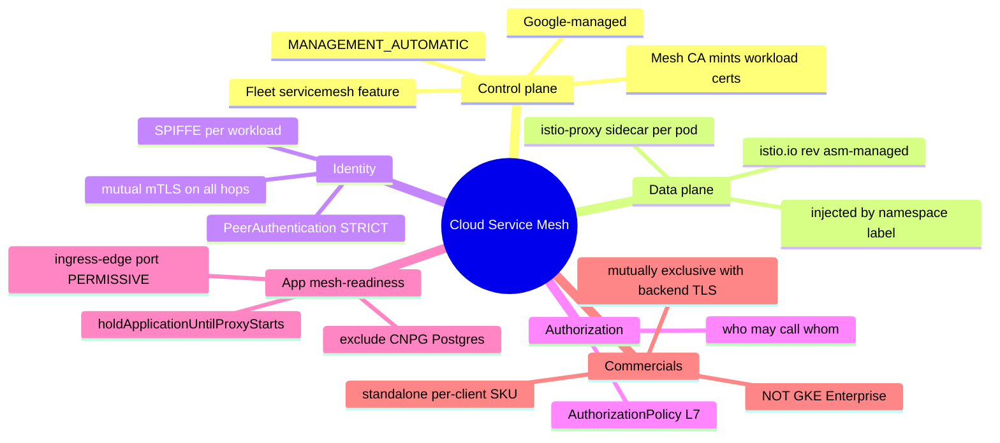
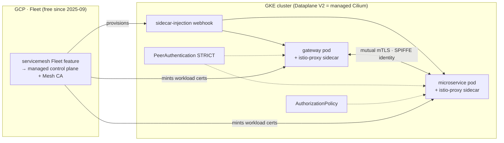
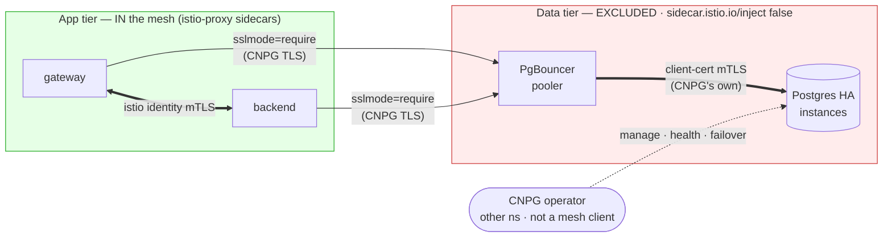

[← Previous: 505. Backstage](./505-BACKSTAGE.md) | [🏠 Home](../README.md) | [→ Next: 507. Binary Authorization](./507-BINARY-AUTHORIZATION.md)

---

# 506. Service Mesh — Cloud Service Mesh (CSM) standalone (opt-in)

**TL;DR** — Setting **`serviceMesh.mode: cloud-service-mesh`** (override
`JENKINS2026_SERVICE_MESH_MODE`) and re-running `Day1` graduates the LB→pod
security story to a **managed service mesh**: Google's **Cloud Service Mesh
(CSM, managed Istio)**, enabled through the **standalone SKU** (NOT a GKE
Enterprise tier — that edition was dissolved 2025-09). Where
[backend TLS](./504-BACKEND_TLS.md) gives *one-way, server-only* TLS on the
*single* LB→pod hop, a mesh gives **workload identity (SPIFFE) + mutual mTLS on
every hop + L7 authorization between services**. It is **mutually exclusive**
with `gateway.backendTls.enabled` (a mesh supersedes that hop). Default
**`none`** — zero impact until you opt in. This doc is also the **decision
record** for *why CSM* and *why not Istio-self-managed / Traefik / Linkerd /
Cilium / other meshes* — the questions that recur every time someone asks "should
we add a mesh?".

## Understanding Cloud Service Mesh (newcomers → specialists)

A service mesh puts a tiny **proxy (sidecar) next to every app pod** and routes all
its traffic through it — so it can add **mutual TLS with a cryptographic identity per
workload** and **L7 authorization between services**, *without touching app code*. On
GKE you don't run the mesh yourself: **Cloud Service Mesh (CSM)** is Google-managed
Istio, turned on as a **Fleet feature**. You opt **in per app** — the data tier
(Postgres) deliberately stays out. Read this once and the rest of the page is just
"which knob lives where".

<details>
<summary>🧠 Mental model — Cloud Service Mesh (mindmap)</summary>



</details>

**Reading it —** the six branches are the whole feature: Google runs the **control
plane** (a Fleet feature) and its **Mesh CA** mints a cert for every workload; the
**data plane** is an `istio-proxy` sidecar injected into each pod of a
namespace-labeled namespace; that sidecar gives each workload a **SPIFFE identity**
and does **mutual mTLS** (governed by `PeerAuthentication`) plus **L7 authZ**
(`AuthorizationPolicy`); making a real app mesh-ready needs the three
**app-mesh-readiness** fixes; and commercially it is the **standalone per-client
SKU** (not GKE Enterprise) and **[mutually exclusive](#backend-tls-vs-cloud-service-mesh-the-exclusivity)**
with backend TLS.

<details>
<summary>🟢 For newcomers — the mental model in 7 objects</summary>

| Object | What it is | Where it lives |
|---|---|---|
| **Fleet** | A Google grouping your cluster joins; the anchor the managed mesh attaches to | `google_gke_hub_membership` ([terraform/gke](../terraform/gke)) |
| **`servicemesh` Fleet feature** | The switch that makes Google **provision + run the mesh control plane** for the fleet | `google_gke_hub_feature` (`MANAGEMENT_AUTOMATIC`) |
| **Mesh CA** | The authority that mints a short-lived cert (= identity) for every meshed workload | inside the managed control plane |
| **Injection label** | The namespace label that tells the mesh "inject a sidecar into every pod here" | `istio.io/rev=asm-managed` on the ns |
| **`istio-proxy` sidecar** | The per-pod Envoy that intercepts all traffic and enforces the mTLS + policy | 2nd container in each meshed pod (`2/2`) |
| **`PeerAuthentication`** | The CR that requires mutual mTLS (`STRICT`) on a workload / namespace | [`08.85`](../scripts/08.85-service-mesh.sh) applies it |
| **`AuthorizationPolicy`** | The CR that says "workload A may call B on `/foo`" (L7 authZ) | applied per workload |

So the loop is: *Terraform joins the cluster to a Fleet + turns on the mesh feature
→ Google runs the control plane + Mesh CA → `08.85` labels the app namespace → every
app pod gets an `istio-proxy` sidecar with a SPIFFE identity → `PeerAuthentication`
makes those pods only accept mutual mTLS → the gateway→backend hop is now encrypted +
authenticated **by identity**, with no app code change.*
</details>

<details>
<summary>🔴 For specialists — the moving parts and how they're wired here</summary>

- **Managed control plane (`MANAGEMENT_AUTOMATIC`).** [`terraform/gke/security.tf`](../terraform/gke/security.tf)
  registers a `google_gke_hub_membership` and enables the `servicemesh`
  `google_gke_hub_feature` with `mesh { management = MANAGEMENT_AUTOMATIC }`. Google
  provisions the injection webhooks (`istiod-asm-managed` + `istio-revision-tag-default`
  in `istio-system`) and keeps the data plane upgraded. Only `mesh.googleapis.com` +
  `gkehub` are enabled — **never the GKE Enterprise API** — so billing is the
  **standalone per-mesh-client SKU** ([§ Cost](#the-cost-model--per-client-not-per-vcpu)).
- **Injection is namespace-wide.** `08.85` labels the microservices ns
  `istio.io/rev=asm-managed`; the managed webhook then injects an `istio-proxy` into
  *every* pod created there — which is exactly why the CNPG Postgres pods + PgBouncer
  poolers need an explicit `sidecar.istio.io/inject: "false"` opt-out
  ([§ App mesh-readiness](#app-mesh-readiness-the-workload-side)).
- **STRICT + a port-level exception.** A namespace-wide `PeerAuthentication` `default`
  sets `mtls.mode` to the flag's value (`STRICT`); a second, **workload-scoped**
  `PeerAuthentication` keeps the gateway's **`:8080` PERMISSIVE** because the GKE
  Gateway LB (and its `HealthCheckPolicy`) is not a mesh client. Auto-mTLS then makes
  the internal gateway→backend hop mTLS automatically.
- **CRD versions differ.** On managed CSM `PeerAuthentication` is served as
  `security.istio.io/v1beta1` while `AuthorizationPolicy` is `v1` — mixing them up
  makes the apply silently no-op (a bug caught in live validation).
- **Two-phase convergence.** The managed control plane comes up asynchronously
  (~5 min), so `08.85` waits (bounded) for the injection webhook before labeling, and
  — on a flag-flip against a running cluster — waits for the CNPG poolers to leave the
  mesh before restarting the apps, so the apps mesh with a stable DB.
</details>

## The flag

Durable default in [`config/config.yaml`](../config/config.yaml), ephemeral
override via env var — the standard pattern ([201](./201-ARCHITECTURE.md)):

| Key | Default | Override | Consumers |
|---|---|---|---|
| `serviceMesh.mode` | `none` | `JENKINS2026_SERVICE_MESH_MODE` | [`terraform/gke`](../terraform/gke) (`TF_VAR_service_mesh_mode` → `mesh.googleapis.com` + Fleet membership + the `servicemesh` Fleet feature) · [`scripts/08.85-service-mesh.sh`](../scripts/08.85-service-mesh.sh) (namespace injection labels + `PeerAuthentication` + `AuthorizationPolicy`) |
| `serviceMesh.channel` | `regular` | — | managed control-plane release channel (`rapid`\|`regular`\|`stable`) |
| `serviceMesh.mtls` | `STRICT` | — | the `PeerAuthentication` mode on injected namespaces (`STRICT`\|`PERMISSIVE`) |

**No consumer reads the raw flag.** They gate on
[`j2026_service_mesh_active`](../scripts/lib/common.sh) = *mode is
`cloud-service-mesh` AND the cluster serves the Istio sidecar-injection webhook*
(i.e. the managed control plane the Fleet feature provisions is actually up) —
the same "flag AND the capability is really there" gating as
`j2026_backend_tls_active`, so a cluster mid-rollout degrades to "no mesh yet"
instead of labeling namespaces whose pods can never get a sidecar.

## Where a mesh sits — it is a *different layer* than backend TLS or an ingress

This is the single most common confusion, so pin it first:

| Layer | Component here | What it governs |
|---|---|---|
| **Edge / north-south ingress** | **GKE Gateway API** (`gke-l7-global-external-managed`) + **IAP** | Browser → cluster. Google-managed L7 LB, wildcard cert, NEG direct-to-pod, IAP auth. See [503](./503-NETWORKING.md). |
| **LB→pod re-encryption (1 hop)** | **backend TLS** — `BackendTLSPolicy` + cert-manager CA | Re-encrypt + *server*-authenticate the single LB→pod hop. See [504](./504-BACKEND_TLS.md). |
| **East-west + identity (all hops)** | **service mesh** — CSM (this doc) | Mutual, *workload-identity* mTLS on pod↔pod AND LB→pod, + L7 authZ between services. |

A mesh does **not** replace backend TLS the way one policy replaces another — it
**subsumes** it: the Mesh CA + mTLS take over the LB→pod hop *and* add the
east-west hops backend TLS never touched. That is exactly why the two are
[mutually exclusive](#backend-tls-vs-cloud-service-mesh-the-exclusivity).

## What a mesh uniquely adds *here* — the gap matrix

Most of a mesh's sales pitch is **already covered by other means in this
platform**. The honest question is *what is net-new*, and the answer is narrow:

| A mesh sells… | Already present here? | Via |
|---|---|---|
| Transport encryption on the wire | ✅ | **WireGuard** node↔node (Dataplane V2 `in_transit_encryption`) + Google network-layer encryption |
| L3/4 segmentation | ✅ | **Enforced NetworkPolicies** (Dataplane V2 / Cilium) |
| TLS + server-auth on LB→pod | ✅ | **backend TLS** ([504](./504-BACKEND_TLS.md), opt-in) |
| Traffic-shifting for releases | ✅ | **Argo Rollouts** + Gateway API traffic-router plugin — *chosen specifically to be [sidecar-free](./501-PLATFORM_OPERATIONS.md)* |
| Per-service golden signals (L7) | ✅ | **OTel** traces/metrics/logs ([301](./301-OBSERVABILITY.md)) |
| Edge authentication | ✅ | **IAP** at the GKE Gateway |
| **Mutual, workload-identity (SPIFFE) mTLS on ALL east-west hops** | ❌ | **only a mesh** |
| **L7 AuthorizationPolicy between workloads** ("A may call `/foo` on B, not `/bar`") | ❌ | **only a mesh** (NetworkPolicy is L3/4 only) |

The delta is the **last two rows**: cryptographic *mutual* identity per service
east-west + L7 authZ between workloads. Note the precise distinctions — WireGuard
encrypts the wire *at the node level* but carries **no workload identity**;
backend TLS proves the *server's* cert on *one* hop but is **one-way** and
**LB→pod only**. A mesh is the only thing that gives *mutual* identity on *every*
hop. For a 2-service PoC that gap is real but **theoretical** — which is why this
is an opt-in showcase flag, not a default.

## Why Cloud Service Mesh (and why the *standalone* SKU)

Of every mesh option, CSM is the one that fits this platform's ethos —
**managed, minimal-ops, composes with Dataplane V2** — and, since 2025-09, it is
cheap enough for a PoC.

### The 2025-09 GKE-editions change (why "add GKE Enterprise" is the wrong framing)

In **September 2025 Google dissolved the GKE editions**: *"GKE is a single
offering, without different editions or tiers."* The consequences that matter
here:

- Most ex-Anthos/Enterprise features (**Fleets, Config Sync, Policy Controller,
  Connect Gateway, Fleet observability**) are now **included in standard GKE at
  no extra cost**.
- The genuinely expensive pieces — **Cloud Service Mesh**, Multi-Cloud cluster
  management, Backup for GKE, Extended Support, Multi-cluster Gateway — split
  off into **standalone à-la-carte SKUs**.

So you do **not** "enable GKE Enterprise" (there is no such tier). You enable the
**CSM standalone SKU**, and — critically — **billing follows the enabled APIs**:
to stay on the standalone SKU you must **not** enable the GKE Enterprise API.
`terraform/gke` deliberately enables only `mesh.googleapis.com` + `gkehub`.

### The cost model — per *client*, not per vCPU

| Path | Basis | On this cluster (`e2-standard-8` ×2–4 = 16–32 vCPU) | For this PoC? |
|---|---|---|---|
| **CSM standalone** (used here) | `$0.0006945` / **mesh client** / h ≈ **$0.50/client/mo** | Mesh only the 2 microservices ≈ **2–6 clients** → **cents** (ephemeral cluster). Node/vCPU count is **irrelevant** to the mesh bill. | ✅ |
| ~~per-vCPU (legacy GKE Enterprise API)~~ | `$0.00822` / **vCPU** / h | 24 vCPU ≈ **$0.20/h ≈ $144/mo** if 24/7 | ❌ what you'd wrongly trigger by enabling the Enterprise API |

The standalone SKU **includes** the managed control plane + the **Mesh CA** (no
per-certificate charge) + standard telemetry dashboards — everything a PoC needs,
nothing extra to buy. Because the platform tears an idle cluster down
([104](./104-REBUILD_SAFETY.md)), realistic PoC spend is a few cents.

> ⚠️ **Pricing is a snapshot** (verified 2026-07-14 against Google's pricing
> snippets + corroborating sources). Seal it against the live
> [Cloud Service Mesh pricing](https://cloud.google.com/service-mesh/pricing)
> page + the GCP Pricing Calculator before committing spend, and confirm how
> "client" is counted for the data-plane variant you pick (sidecar endpoints vs
> ztunnel accounting differ).

## Backend TLS vs Cloud Service Mesh — the exclusivity

**Decision: `gateway.backendTls.enabled=true` and
`serviceMesh.mode=cloud-service-mesh` are mutually exclusive — at most one may be
active.** A mesh's Mesh CA + mTLS **own** the LB→pod hop (and the east-west
hops); a `BackendTLSPolicy` validating against cert-manager's internal CA on the
*same* hop would be a second mechanism fighting for the same TLS handshake.
Running both is a configuration error, not a valid combination.

Both-off is the **default and fully supported** state (`none` + backend TLS
`false`) — today's posture: TLS terminates at the L7 LB, the LB→pod hop is plain
HTTP inside the VPC (Google network-layer encryption + WireGuard inter-node). The
three valid states of the **intra-cluster TLS axis**:

| State | `backendTls` | `serviceMesh.mode` | LB→pod hop | East-west hops |
|---|---|---|---|---|
| **none** (default) | `false` | `none` | plain HTTP (VPC + WireGuard) | plain (WireGuard node-level) |
| **backend-tls** | `true` | `none` | re-encrypted, **server**-auth (cert-manager CA) | plain (WireGuard node-level) |
| **cloud-service-mesh** | `false` | `cloud-service-mesh` | mTLS (Mesh CA) | **mutual, identity** mTLS (Mesh CA) |

Enforced in **two layers**:

1. **Authoritative guard — [`lib/config.sh`](../scripts/lib/config.sh) fails
   fast.** It runs on *every* entry path (`up.sh`, `test/e2e.sh`, and every GHA
   workflow), so the conflict is caught regardless of how the flags were set
   (config file, env override, or workflow input).
2. **GHA form — one dropdown, not two toggles.** `workflow_dispatch` has no
   conditional inputs, so the workflows expose a **single `intra_cluster_tls`
   choice** (`none` \| `backend-tls` \| `cloud-service-mesh`) that maps to the two
   env-var overrides. A single choice makes it **structurally impossible** to
   pick both. `binary_authorization` ([507](./507-BINARY-AUTHORIZATION.md)) is a
   *separate* boolean because it is orthogonal — it composes with any of the
   three states above.

## Why NOT the alternatives — the decision matrices

Every "should we add a mesh / a Traefik / an Istio?" conversation reaches the
same conclusions. Recorded here once so it doesn't have to be re-litigated.

### Why not Istio self-managed (sidecar *or* ambient)

| | **CSM (chosen)** | **Istio self-managed — sidecar** | **Istio self-managed — ambient** |
|---|---|---|---|
| Control plane | **Google-managed** | You run istiod (upgrades, version skew) | You run istiod + ztunnel/waypoints |
| Sidecars | Managed data plane | **One Envoy per pod** — clashes with the repo's [sidecar-free](./501-PLATFORM_OPERATIONS.md) stance | **None** (ztunnel L4 per node; waypoints only where L7 needed) |
| Dataplane V2 coexistence | **Designed for it** | Istio-over-managed-Cilium is a *supported-but-delicate* two-layer combo | Same delicacy, second control plane beside managed Cilium |
| Operational cost | Low (managed) | High | Medium |
| Verdict | ✅ | ❌ overkill + sidecars + delicacy | ⚠️ ambient removes the sidecar objection (GA late-2024), but still a second control plane beside Dataplane V2; **prefer CSM's managed control plane** |

**Honest update vs [504](./504-BACKEND_TLS.md)'s original table:** that table
predates **Istio ambient** (GA late 2024). Ambient is sidecar-free, so it no
longer collides with the repo's core objection. But on GKE, if you're going to
run managed Istio anyway, **CSM's managed control plane** is the reason to pay
the (now-cheap) standalone SKU rather than operate istiod yourself.

### Why not Traefik (or any ingress-as-mesh)

Traefik is an **edge router / ingress controller**, a *different layer* than
either backend TLS or a mesh — so "Traefik instead of backend TLS" is a category
mismatch. Adopting it means replacing the **GKE Gateway** entirely, and:

| Cost | Detail |
|---|---|
| **Loses Google IAP** | IAP is a Google-edge product bound to the GCLB (`GCPBackendPolicy`). Traefik can't do it — you'd reimplement auth with oauth2-proxy/ForwardAuth. A large regression given the IAP-protected admin UIs ([503](./503-NETWORKING.md)). |
| **Self-managed data plane** | The GKE Gateway is managed (no pods to run). Traefik is pods you own. |
| **Two bad topologies** | Behind the GCLB → IAP collapses to one backend (loses per-host granularity) + an extra hop. As the edge → loses managed L7 + wildcard cert + NEG + IAP. |
| **Redundant** | Its TLS-to-backend (`serversTransport`) re-obtains what backend TLS already gives. |

Traefik *does* implement Gateway API, but on GKE swapping the `GatewayClass` from
`gke-l7` to Traefik still means running Traefik pods behind an L4 LB and losing
the managed extras + IAP — and its `BackendTLSPolicy` support is partial.
**Verdict: ❌** — solves a different-shaped problem, at the cost of IAP.

### Why not the other meshes

The field consolidated; several named meshes are dead. For *this* repo:

| Mesh | Verdict |
|---|---|
| **Cilium Service Mesh** | The cruel irony: **you already run Cilium** (Dataplane V2 *is* Google-managed Cilium — see below) — but GKE **does not expose** the Cilium mesh API nor let you install your own Cilium over Dataplane V2. Unavailable *by platform*, not by design. |
| **Linkerd** | Lighter (Rust micro-proxy, zero-config mTLS) but **still sidecar** (no ambient mode) → doesn't dodge the sidecar objection. And its **stable builds moved to a commercial model** (2024); edge releases stay free. Friction. |
| **Consul / Kuma / Kong Mesh** | Solve **multi-platform service discovery** (VMs + K8s, multi-zone) — a problem this repo doesn't have. Whole extra control plane. Overkill. |
| **Traefik Mesh (ex-Maesh) · NGINX Service Mesh · Open Service Mesh (OSM) · AWS App Mesh** | **Dead or in exit.** Traefik Mesh discontinued; NGINX SM retired by F5; OSM archived by CNCF (2023); App Mesh in deprecation/EOL (and irrelevant on GKE). Don't chase them. |

### The "Dataplane V2 = Google-managed Cilium" explainer

Several of the calls above hinge on one fact worth stating plainly:
**GKE Dataplane V2 *is* a Google-managed Cilium/eBPF dataplane.** The cluster
here runs `datapath_provider = ADVANCED_DATAPATH` ([terraform/gke](../terraform/gke)),
which means:

- **NetworkPolicies are enforced by eBPF** (Cilium), not kube-proxy iptables —
  L3/4 segmentation is real ([503](./503-NETWORKING.md)).
- **WireGuard** inter-node pod encryption is a Cilium feature Google exposes via
  `in_transit_encryption_config`.
- But **Google manages that Cilium**: you get *neither* the Cilium CLI/Hubble
  mesh surface *nor* the ability to install upstream Cilium (or Cilium Service
  Mesh) on top. It is locked down.

So the platform already has **eBPF L3/4 + transport encryption for free** — which
is why a mesh's *encryption* and *segmentation* rows are already ticked, and why
the only mesh you can *add* on GKE is one that composes with (rather than
replaces) the managed Cilium: **CSM**. Adding Istio-self-managed means running a
second dataplane *beside* the managed Cilium — the "delicate two-layer combo".

## How it works

<details>
<summary>🔀 Fleet feature → sidecar injection → identity mTLS (flowchart)</summary>



</details>

**Reading it —** the **Fleet feature** (top) provisions the managed **injection
webhook** and the **Mesh CA**; the webhook drops an `istio-proxy` sidecar into the
gateway + microservice pods; the Mesh CA mints each a SPIFFE workload cert; the two
sidecars then speak **mutual mTLS** (`PeerAuthentication STRICT`), and
`AuthorizationPolicy` gates who may reach the backend. The database tier is absent by
design — [excluded from injection](#app-mesh-readiness-the-workload-side).

Execution order on a `Day1` re-run with `serviceMesh.mode=cloud-service-mesh`:

| Piece | Role |
|---|---|
| [`terraform/gke`](../terraform/gke) | Enables `mesh.googleapis.com` + `gkehub.googleapis.com`, registers the cluster to a **Fleet** (`google_gke_hub_membership`), and enables the **`servicemesh` Fleet feature** (`google_gke_hub_feature`) — which provisions the **managed control plane + Mesh CA**. All `count`-gated on `var.service_mesh_mode == "cloud-service-mesh"`, so `none` is a no-op. |
| [`scripts/08.85-service-mesh.sh`](../scripts/08.85-service-mesh.sh) | Gates on `j2026_service_mesh_active`; **waits** for the managed control plane's injection webhook, labels the microservices namespace(s) (`istio.io/rev=asm-managed`), applies namespace-wide **`PeerAuthentication STRICT`** + a workload-scoped **gateway `:8080` PERMISSIVE** exception, **waits** for the CNPG poolers to leave the mesh, then restarts **only the app deployments**. Flag off → symmetric retire (labels + policies removed, apps restarted sidecar-free). See [App mesh-readiness](#app-mesh-readiness-the-workload-side). |

**What does *not* change**: the GKE Gateway, the IAP `GCPBackendPolicy` (IAP
composes — auth at the edge, mTLS inside), the `HTTPRoute`s, and the NEG routing.
The mesh operates *below* the ingress.

<details>
<summary>📄 Configuration reference — the CRs and annotations this feature applies</summary>

**Namespace injection label** — `08.85`, on the microservices namespace:
```yaml
metadata:
  labels:
    istio.io/rev: asm-managed          # opt every pod in the ns into the managed mesh
```

**Namespace-wide mutual mTLS** — `08.85` (note `v1beta1`, not `v1`, for PeerAuthentication on managed CSM):
```yaml
apiVersion: security.istio.io/v1beta1
kind: PeerAuthentication
metadata: { name: default, namespace: microservices }
spec:
  mtls: { mode: STRICT }               # meshed pods only accept identity mTLS
```

**Ingress-edge exception** — the GKE LB is not a mesh client, so the gateway's LB port stays PERMISSIVE (`08.85`):
```yaml
apiVersion: security.istio.io/v1beta1
kind: PeerAuthentication
metadata: { name: gateway-ingress-permissive, namespace: microservices }
spec:
  selector: { matchLabels: { app.kubernetes.io/name: gateway } }
  mtls: { mode: STRICT }
  portLevelMtls:
    8080: { mode: PERMISSIVE }         # the LB + its HealthCheckPolicy reach :8080 in plaintext
```

**App startup ordering** — pod annotation on the app Deployments (`gitops-config`, self-gating: inert without a sidecar):
```yaml
spec:
  template:
    metadata:
      annotations:
        proxy.istio.io/config: '{"holdApplicationUntilProxyStarts": true}'
```

**Exclude the data tier** — CNPG `Cluster` (via `inheritedMetadata`) + `Pooler` (via `spec.template`), `gitops-config`:
```yaml
# kind: Cluster (postgresql.cnpg.io/v1)
spec:
  inheritedMetadata:
    annotations: { sidecar.istio.io/inject: "false" }
# kind: Pooler (postgresql.cnpg.io/v1)
spec:
  template:
    metadata:
      annotations: { sidecar.istio.io/inject: "false" }
```

</details>

## App mesh-readiness (the workload side)

Enabling the mesh provisions the infra and injects sidecars, but **the workloads
themselves must be mesh-ready** or they break. Live validation (2026-07-14) on the
JHipster demo app surfaced that this is a **multi-workload effort**, not a single
switch — the requirements, in the order they bit:

| Requirement | Why | Where | Status |
|---|---|---|---|
| **`holdApplicationUntilProxyStarts: true`** on the app Deployments | The app dials Postgres/OTel on startup; without this it connects **before** the istio-proxy routes traffic → `Connection refused` → CrashLoop | pod annotation `proxy.istio.io/config` in the app chart (`gitops-config`; **self-gating** — inert without a sidecar) | ✅ done |
| **Ingress-edge port PERMISSIVE** (gateway `:8080`) | The gateway is fronted by the **GKE Gateway LB**, which — with its `HealthCheckPolicy` — is **not a mesh client**, so a STRICT mesh rejects it and 503s the public endpoint | [`08.85`](../scripts/08.85-service-mesh.sh) per-workload `PeerAuthentication` `portLevelMtls` | ✅ done |
| **Exclude infra workloads** (CNPG Postgres + PgBouncer poolers) | Managed CSM injects **by namespace label**, so it meshes *every* pod in the ns — including the operator-managed Postgres pods + poolers, which must NOT get a sidecar (PgBouncer + sidecar churns; STRICT can break the DB hops) | `sidecar.istio.io/inject: "false"` on the CNPG `Cluster` (`inheritedMetadata`) + `Pooler` (`spec.template`) CRs (`gitops-config`) | ✅ done |
| **Backend workload convergence** | The meshed backend rollout must schedule + pass its probes through the proxy — it fails if its pooler is still churning | [`08.85`](../scripts/08.85-service-mesh.sh) restarts only the app deployments + waits for the poolers to leave the mesh first | ✅ done |

**Convergence note**: flipping the mesh **on** against an *already-running* cluster
settles over a few restarts — ArgoCD must sync the app annotations + the CNPG
exclusion, and `08.85` restarts the apps only after the poolers have left the mesh
(so the app meshes with a stable DB). A **from-zero** cluster is clean: the CRs are
born with the exclusion + `holdApplicationUntilProxyStarts`, so nothing is ever
mis-meshed. **Live-validated 2026-07-15**: gateway 2/2, backend 2/2, all CNPG
poolers/instances sidecar-free, public endpoint 200 — the *full* app mesh, not just
the gateway.

**The lesson**: managed CSM injection is **namespace-wide**, so it catches *app*
**and** *infra* (CNPG) pods alike — a production mesh needs **per-workload opt-out**
of the stateful/infra pods on top of the ingress-edge + startup-ordering handling.
For a PoC the **CSM infrastructure** (Fleet, managed control plane, injection,
identity mTLS) is the core deliverable; the full app mesh above is the (now
completed) productionization of the demo app.

### Why the data tier (CNPG Postgres) is excluded

Meshing the app tier (gateway ↔ backend) is the goal; meshing the **database**
(CloudNativePG's Postgres instances + PgBouncer poolers) is actively harmful. Four
reasons — the third we hit **live** as the pooler `CrashLoop` (6 restarts):

1. **It's not app↔app traffic.** The mesh's value is identity mTLS + L7 authZ
   *between application services*. The Postgres subsystem is the **data plane**, not
   service-to-service calls — a sidecar there adds cost and lifecycle risk for **zero**
   of the value the mesh gives the app tier.
2. **CNPG already does its own TLS/mTLS — a sidecar makes it *double* TLS.** Every DB
   hop is already encrypted *and* authenticated by CNPG's own certificates: app→pooler
   is `sslmode=require`, **pooler→Postgres is client-certificate mTLS** (`pg_hba:
   hostssl … cnpg_pooler_pgbouncer … cert`), instance↔instance replication is
   CNPG-cert TLS. An istio sidecar intercepting a socket that is **already doing
   client-cert TLS** wraps a *second* TLS layer around it → the handshakes collide →
   the connection breaks. istio mTLS here is redundant **and** incompatible.
3. **The sidecar breaks the DB lifecycle.** PgBouncer opens its client-cert
   connection to Postgres **at startup**, before the sidecar routes → it dials a dead
   proxy → **`CrashLoop`** (exactly the `6 (restarts)` we saw live). The sidecar also
   blocks graceful termination, and under **STRICT** the **CNPG operator** (in its own
   namespace — *not* a mesh client) would be **rejected** when it reaches the instances
   for health/failover → HA management breaks.
4. **It's the standard practice.** Meshing databases + stateful operators is broadly
   discouraged (Istio & CNPG docs): data services own their transport security and
   have lifecycle needs a sidecar complicates. **You mesh the app tier, not the data
   tier.**

<details>
<summary>🔀 App tier meshed vs data tier excluded — where each TLS lives (flowchart)</summary>



</details>

**Reading it —** the **green** app tier gets istio sidecars and speaks **istio
identity mTLS** (gateway↔backend). The **red** data tier is **excluded** and keeps
**CNPG's own TLS** on every hop — app→pooler (`sslmode=require`), pooler→Postgres
(client-cert mTLS), instance↔instance (replication TLS). A sidecar in the red box
would **double-wrap** those already-TLS connections *and* block the non-mesh **CNPG
operator** from managing the instances. So the mesh secures the **app** hop; the
**DB** hops are already secured by CNPG — two systems, cleanly separated.

## Rebuild-safety

Everything the *in-cluster* side creates (injection labels, `PeerAuthentication`,
`AuthorizationPolicy`) is namespaced state with no external identity — it dies
with the cluster and re-applies on the next `Day1`, safe-by-construction like
backend TLS.

The **one persistent, external, fixed-identity resource** is the **Fleet
membership** (`google_gke_hub_membership`, registered by a stable name). That
lands squarely in the [104](./104-REBUILD_SAFETY.md) rebuild-safety bug class: a
`Decom` that leaves a membership behind, or a `Day1` that re-registers a
fixed-name membership, can collide. **The mechanism** ([104](./104-REBUILD_SAFETY.md)
master matrix): the membership is Terraform-managed with `count` on the flag and
keyed to the cluster's own identity, so `Decom` (`terraform destroy`) removes it
and `Day1` re-creates it in lockstep with the cluster — *reconcile-to-current*.
This is the real engineering cost of the feature; the money (cents) is not.

## Lifecycle

- **Enable**: set `serviceMesh.mode=cloud-service-mesh` (durable in `config.yaml`,
  per-run `JENKINS2026_SERVICE_MESH_MODE`, or the `intra_cluster_tls=cloud-service-mesh`
  workflow input) and **re-run `Day1`** — the only path that runs Terraform (Fleet
  + mesh feature) *and* `08.85` in one converging pass. Ensure
  `gateway.backendTls.enabled=false` (the exclusivity gate enforces it).
- **Disable**: set `mode=none` and re-run `Day1`. `08.85` removes the injection
  labels + policies and restarts workloads back to plain pods; Terraform destroys
  the Fleet mesh feature + membership.
- **Teardown**: [`down.sh`](../scripts/down.sh) removes the in-cluster policies;
  `terraform destroy` (Decom) removes the Fleet membership + feature.

## Verifying it

```bash
kubectl get mutatingwebhookconfiguration | grep -i istio        # injection webhook present (control plane up)
kubectl get peerauthentication -A                               # STRICT present in the meshed namespaces
kubectl get authorizationpolicy -A                              # baseline policy present
kubectl -n microservices get pod -o jsonpath='{range .items[*]}{.metadata.name}{"\t"}{.spec.containers[*].name}{"\n"}{end}'  # istio-proxy sidecar alongside the app
gcloud container fleet mesh describe --project "$PROJECT"       # managed control plane state
```

## When to revisit / graduate further

Stay on `none`/`backend-tls` for a 2-service PoC. Move to `cloud-service-mesh`
when you want to **demonstrate identity-based zero-trust**, or the platform grows
to **tens of services**, a **compliance mandate for identity mTLS to the pod**,
**fine-grained L7 authZ between workloads**, or **multi-cluster**. At that point
retire the [backend TLS](./504-BACKEND_TLS.md) flag's machinery in favour of the
Mesh CA (they are mutually exclusive by design). For supply-chain admission
control that composes alongside any of this, see
[507. Binary Authorization](./507-BINARY-AUTHORIZATION.md).

---

[← Previous: 505. Backstage](./505-BACKSTAGE.md) | [🏠 Home](../README.md) | [→ Next: 507. Binary Authorization](./507-BINARY-AUTHORIZATION.md)

---

*506. Service Mesh — Cloud Service Mesh (CSM) standalone — jenkins-2026*
