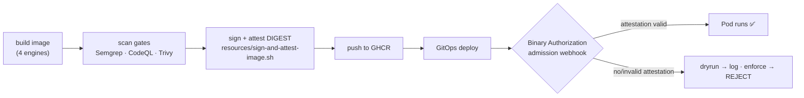

[← Previous: 506. Service Mesh](./506-SERVICE-MESH.md) | [🏠 Home](../README.md) | [→ Next: 601. DevSecOps](./601-DEVSECOPS.md)

---

# 507. Binary Authorization — supply-chain admission control (opt-in)

**TL;DR** — Setting **`security.binaryAuthorization.enabled: true`** (override
`JENKINS2026_BINARY_AUTHORIZATION_ENABLED`) and re-running `Day1` makes the GKE
cluster **only admit container images that carry a cryptographic attestation
signed by this project's attestor** — i.e. images that actually went through
*this* platform's pipeline and its [DevSecOps scan gates](./601-DEVSECOPS.md).
It **closes the loop** that scanning alone leaves open: Semgrep/CodeQL/Trivy can
*flag* a bad image, but nothing stops an *unscanned* or *rogue* image from being
deployed — Binary Authorization is the admission controller that enforces
provenance. **Orthogonal** to [backend TLS](./504-BACKEND_TLS.md) /
[the service mesh](./506-SERVICE-MESH.md) (it governs *which images run*, not
*how pods talk*) — it composes with any of them. Default **`false`**; default
enforcement **`dryrun`** (log, don't block) so it's safe to switch on in a PoC.

## The flag

| Key | Default | Override | Consumers |
|---|---|---|---|
| `security.binaryAuthorization.enabled` | `false` | `JENKINS2026_BINARY_AUTHORIZATION_ENABLED` | [`terraform/gke`](../terraform/gke) (`TF_VAR_binary_authorization_enabled` → API enablement + KMS key + attestor + cluster policy + cluster `enable_binary_authorization`) · [`resources/sign-and-attest-image.sh`](../resources/sign-and-attest-image.sh) (called by all four CI engines) |
| `security.binaryAuthorization.enforcementMode` | `dryrun` | — | `TF_VAR_binary_authorization_enforce` → the cluster policy's `evaluationMode`/`enforcementMode` (`dryrun` = `DRYRUN_AUDIT_LOG_ONLY`, `enforce` = `ENFORCED_BLOCK_AND_AUDIT_LOG`) |

Consumers gate on
[`j2026_binary_authorization_active`](../scripts/lib/common.sh). Unlike the mesh
/ backend TLS there is no CRD to probe — Binary Authorization is a GKE cluster
property + a project policy, both set by `terraform/gke` from the same flag — so
the gate is simply the resolved flag, kept as a function only to make every
consumer read one uniform predicate.

## What it closes — the gap in the DevSecOps loop

The platform already **builds, scans, and pushes** images across
[four CI engines](./README.md) ([601](./601-DEVSECOPS.md): Semgrep SAST, CodeQL,
Trivy image/IaC), then deploys via GitOps. The missing link is **admission**:



Without Binary Authorization the `admit` diamond doesn't exist — any image that
reaches the cluster runs. With it, only an image whose **digest** was signed by
the project's attestor (a Cloud KMS key that *only the pipeline* can use) is
admitted. That is the difference between "we scan our images" and "the cluster
*cannot run* an image that wasn't scanned and signed by us".

## How it works

| Piece | Role |
|---|---|
| **Cloud KMS asymmetric signing key** (`jenkins-2026-binauthz` keyring / `jenkins-2026-attestor-key`) | The private half signs attestations; the public half is embedded in the attestor. Only the CI service account (Workload Identity) may sign — no key material leaves KMS. |
| **Container Analysis note** (`jenkins-2026-attestor-note`) | The anchor an attestation attaches to. |
| **Attestor** (`jenkins-2026-attestor`) | Binds the note + the KMS public key. The cluster policy trusts *this* attestor. |
| **Cluster Binary Authorization policy** | `defaultAdmissionRule` requires an attestation from the attestor; GKE system images + (optionally) the platform's own registries are allow-listed; `evaluationMode` = dryrun/enforce from the flag. Attached to the cluster via `enable_binary_authorization`. |
| [`resources/sign-and-attest-image.sh`](../resources/sign-and-attest-image.sh) | **Single source**, called by all four engines (like [`resources/patch-app-source.sh`](../resources/patch-app-source.sh)): after the image is pushed, resolves its **digest** and runs `gcloud beta container binauthz attestations sign-and-create` with the KMS key. Signs the *digest*, never a mutable tag. |

All Terraform resources are `count`-gated on
`var.binary_authorization_enabled`, so `false` is a complete no-op.

## Pipeline wiring — how each engine signs

All four CI engines call the ONE signing script `resources/sign-and-attest-image.sh`
right after the image push (the single-source pattern, like
[`patch-app-source.sh`](../resources/patch-app-source.sh)). The step is **safe by
default**: the script checks `BINAUTHZ_ENABLED` **first** and no-ops (exit 0)
unless it is `true`, so an inactive cluster runs the step as a harmless no-op.

| Engine | Call site | Signing context |
|---|---|---|
| **Jenkins** | [`vars/microservicesImage.groovy`](../vars/microservicesImage.groovy) (after push) | a `gcloud` container appended to the agent pod **only when the flag is on** ([`vars/MicroservicesPipeline.groovy`](../vars/MicroservicesPipeline.groovy)); script materialised via `libraryResource` |
| **Tekton** | [`tekton/tasks/build-push-image.yaml`](../tekton/tasks/build-push-image.yaml) `sign-attest` step | `google/cloud-sdk:slim` step |
| **Argo Workflows** | [`argoworkflows/templates/microservices-wftmpl.yaml`](../argoworkflows/templates/microservices-wftmpl.yaml) `build-sign` template | `google/cloud-sdk:slim` template |
| **GitHub Actions** | [`jenkins/pipelines/seed/microservices-ci.yml.tmpl`](../jenkins/pipelines/seed/microservices-ci.yml.tmpl) sign step | on the ARC runner (needs gcloud present) |

**To make signing actually run — the live-validation checklist, per engine:**

1. **Thread the flag.** The seed step (`04-jenkins.sh` JCasC / `06-<engine>-pipelines.sh`)
   must export `BINAUTHZ_ENABLED=true` (from `J2026_BINARY_AUTHORIZATION_ENABLED`) into
   the build env when the flag is on. Off → the step stays a no-op.
2. **Grant + bind the identity.** `terraform/gke` creates the
   `jenkins-2026-binauthz-signer` GSA with the KMS-sign + Container-Analysis + attestor
   roles and a Workload-Identity binding for each build KSA in `binauthz_signer_ksas`
   (default `jenkins/jenkins`; add the active engine's KSA — Tekton `tekton-ci`, Argo
   `argo-ci`, ARC `arc-runners`). **Also annotate that KSA** in-cluster:
   `iam.gke.io/gcp-service-account=jenkins-2026-binauthz-signer@<project>.iam.gserviceaccount.com`.
3. **gcloud availability.** In-cluster engines use the `google/cloud-sdk` image
   (Tekton/Argo) or the flag-gated gcloud container (Jenkins); the ARC runner needs
   gcloud installed (a `curl`-install step, like the yq/argocd tools it already fetches).

Until steps 1–3 are done for the active engine, the signing step is a **safe no-op**;
once done, `enforce` mode will admit only the images this pipeline signed.

## `dryrun` vs `enforce`

| | `dryrun` (default) | `enforce` |
|---|---|---|
| Policy mode | `DRYRUN_AUDIT_LOG_ONLY` | `ENFORCED_BLOCK_AND_AUDIT_LOG` |
| Unattested image | **runs**, violation logged to Cloud Audit Logs | **rejected** at admission |
| Use | See what *would* block without wedging a deploy — the right first step on a PoC | The real zero-trust posture |
| Failure blast radius | none (informational) | a broken signing step **blocks every new Pod** — flip to `enforce` only once the sign+attest step is proven green across all engines |

Start `dryrun`, read the audit logs, then flip to `enforce`.

## It composes with everything (orthogonal)

Binary Authorization is on a **different axis** than the intra-cluster TLS axis
([506](./506-SERVICE-MESH.md)) — it never touches how pods talk, only which
images run. So unlike backend-TLS↔CSM, it is **not** mutually exclusive with
anything:

| | backend TLS | CSM mesh | Binary Authorization |
|---|---|---|---|
| Governs | LB→pod TLS | east-west + LB→pod mTLS | **which images admit** |
| Axis | intra-cluster TLS (pick one) | intra-cluster TLS (pick one) | **supply chain (independent)** |
| Combine? | ✅ with BinAuth | ✅ with BinAuth | ✅ with either TLS choice |

In the GHA forms it is therefore a **separate boolean input**, not part of the
single `intra_cluster_tls` dropdown.

## Why Binary Authorization (and why not "just scan")

| Approach | What it stops | Gap |
|---|---|---|
| **Scan only** (today, [601](./601-DEVSECOPS.md)) | Flags known-bad images *in the pipeline* | Nothing enforces that only scanned/signed images *run* — bypass the pipeline, or push straight to the namespace, and it deploys |
| **Admission webhook (custom / OPA Gatekeeper)** | Arbitrary policy | You build + operate the webhook + its signing story yourself |
| **Binary Authorization** (this doc) | **Only attested images run**, enforced by GKE natively | Requires a KMS key + attestor + a signing step in the pipeline — all provisioned here |

Binary Authorization is the **GKE-native** way to enforce provenance without
running your own admission controller, and its **basic enforcement is free on
GKE** (see Cost). Note: the *advanced* continuous-validation / GKE Security
Posture premium tier is a paid add-on — this feature uses only the **free basic
enforcement**.

## Cost

Effectively **free for a PoC**: basic Binary Authorization enforcement carries
**no GKE surcharge**; a Cloud KMS asymmetric key is ~$0.06/key-version/month plus
fractions of a cent per signing operation; Container Analysis attestation storage
is negligible. Unlike [CSM](./506-SERVICE-MESH.md#the-cost-model--per-client-not-per-vcpu),
there is no per-client/per-vCPU meter here.

## Rebuild-safety

The **cluster policy** and the `enable_binary_authorization` cluster property are
Terraform-managed and die/recreate with the cluster (safe-by-construction). The
**KMS keyring/key, the attestor, and the Container Analysis note** are
**persistent, fixed-identity** GCP resources → the [104](./104-REBUILD_SAFETY.md)
rebuild-safety class. Two options, both valid:

- **Ephemeral** (simplest for a PoC): `count`-gated, destroyed on `Decom` and
  recreated on `Day1`. Old attestations (signed by the previous key) become
  invalid — fine, because a rebuild rebuilds and re-signs the images anyway.
- **Persistent** (if you want attestations to survive rebuilds): keep the KMS
  key + attestor out of the per-cluster tier (a bootstrap-tier module, like the
  DNS zone in [`terraform/bootstrap`](../terraform/bootstrap)) so their identity
  is stable — *tombstone-adoption* / *keep-if-present* per the 104 matrix.

⚠️ **KMS keys cannot be truly hard-deleted immediately** (they enter a scheduled
destruction window). A `Decom`+`Day1` re-creating a keyring/key of the *same
name* must therefore tolerate an existing (soft-deleted or present) key — the
canonical 104 "persistent external resource with a fixed identity collides with a
fresh rebuild" hazard. The ephemeral path handles this by `count`-gating and
using create-if-absent semantics.

## Lifecycle

- **Enable**: set `security.binaryAuthorization.enabled=true` (durable, per-run
  env, or the `binary_authorization` workflow input) and **re-run `Day1`**. Keep
  `enforcementMode=dryrun` until the sign+attest step is proven green across the
  active engine.
- **Promote to enforce**: set `enforcementMode=enforce`, re-run `Day1`.
- **Disable**: set `enabled=false`, re-run `Day1` — the cluster policy reverts to
  `ALWAYS_ALLOW`, the pipeline signing step no-ops.
- **Teardown**: `terraform destroy` (Decom) removes the policy, attestor, note,
  and (ephemeral path) the KMS key.

## Verifying it

```bash
gcloud container binauthz policy export --project "$PROJECT"          # the cluster policy + evaluationMode
gcloud container binauthz attestors list --project "$PROJECT"         # jenkins-2026-attestor present
gcloud container binauthz attestations list \
  --attestor jenkins-2026-attestor --project "$PROJECT"               # attestations for pushed digests
kubectl get pod -A -o json | jq -r '.items[].spec.containers[].image' # running images (all should be attested under enforce)
# dryrun: violations appear in Cloud Audit Logs (protoPayload.metadata for binaryauthorization.googleapis.com)
```

Under `enforce`, a deliberately-unsigned image should be **rejected** at Pod
creation with a Binary Authorization denial; under `dryrun` it runs and the
denial is only logged.

---

[← Previous: 506. Service Mesh](./506-SERVICE-MESH.md) | [🏠 Home](../README.md) | [→ Next: 601. DevSecOps](./601-DEVSECOPS.md)

---

*507. Binary Authorization — supply-chain admission control — jenkins-2026*
