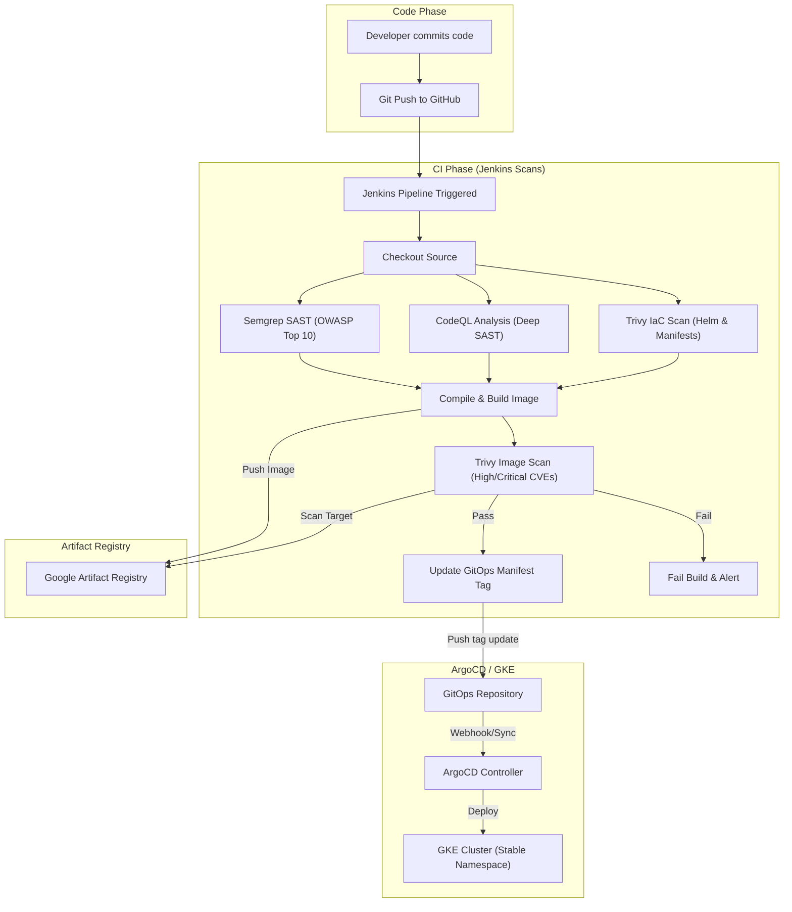

[← Previous: 502. Microservices GitOps](./502-MICROSERVICES_GITOPS.md) | [🏠 Home](../README.md) | [→ Next: 602. Version Pinning](./602-VERSION_PINNING.md)

---

# 601. DevSecOps Security Pipeline

The jenkins-2026 platform implements a multi-layered security pipeline (DevSecOps) following modern Cloud Native Security and Zero-Trust principles. This setup natively integrates three security layers: static code analysis, semantic SAST, infrastructure misconfiguration audits, and container image vulnerability scans.

## Pipeline Lifecycle

<details>
<summary>🔍 Click to expand Pipeline Lifecycle Diagram</summary>



</details>

## Integrated Security Tools

### 1. Semgrep (Lightweight SAST / Custom Rules)

- **Responsibility**: Fast commit-stage check for security anti-patterns (disabled CSRF, insecure HTTP, hardcoded secrets) and ruleset compliance.
- **What the Report is About**: Fast static analysis on the source code looking for syntactic patterns that match known security anti-patterns.
- **Where to View the Report**:
  - **GitHub Code Scanning UI (Interactive)**: Automatically uploaded to the [GitHub Code Scanning Alerts (Semgrep)](https://github.com/nubenetes/jenkins-2026/security/code-scanning). Maps findings directly to code lines.
  - **Jenkins Build Artifacts (Raw)**: Saved as `semgrep-results.sarif` in the build run's local artifact archive.

### 2. CodeQL (Deep SAST / Semantic Analysis)

- **Responsibility**: Semantic code analysis to detect complex multi-file data flow vulnerabilities (SQL Injection, XSS, SSRF).
- **What the Report is About**: CodeQL compiles and builds a database of the source code structure, allowing semantic queries to trace variables and untrusted user input (sources) all the way to dangerous execution sinks (such as raw database queries, file writes, or command executions).
- **Where to View the Report**:
  - **GitHub Code Scanning UI (Interactive)**: Automatically uploaded to the [GitHub Code Scanning Alerts (CodeQL)](https://github.com/nubenetes/jenkins-2026/security/code-scanning). The dashboard lets you interactively trace the data flow path of the vulnerability.
  - **Jenkins Build Artifacts (Raw)**: Saved as `codeql-results.sarif` in the build run's local artifact archive.

### 3. Trivy (Vulnerability and Misconfiguration Scanning)

- **Dual Responsibility**:
  - **IaC Scan**: Evaluates Helm charts and GKE resources before building (warning-only/non-blocking).
  - **Image Scan**: Scans final container images against the GCE base image and dependencies before pushing or updating the GitOps repo.
- **Configuration**: Defined in [`trivy.yaml`](../trivy.yaml).
- **Failure Policy**: both scans are **report-only / non-blocking** — they run with `--exit-code 0` (filtered to `CRITICAL,HIGH` severity) so findings are surfaced (and uploaded to GitHub Code Scanning / warnings-ng) but never halt the build or deploy stage. See [`tekton/tasks/trivy-image.yaml`](../tekton/tasks/trivy-image.yaml) and [`trivy-iac.yaml`](../tekton/tasks/trivy-iac.yaml). To make the image scan gating, change its `--exit-code` to `1`.

### 4. Jenkins `warnings-ng` Plugin Integration (SARIF Visualizer)

Provides interactive static analysis dashboards natively within the Jenkins build UI:

- On every build, the pipeline runs Semgrep and CodeQL and outputs `.sarif` files.
- The pipeline invokes the `recordIssues` post-action step of the `warnings-ng` plugin to parse these SARIF reports.
- The build page displays **"Semgrep Warnings"** and **"CodeQL Warnings"** side menu items with:
  - **Issue Trends**: Graphical representation of new, fixed, and outstanding warnings over time.
  - **Tabular Details**: A searchable table of all issues grouped by category, file name, age, and severity.
  - **Inline Code Highlights**: Direct integration with the Jenkins workspace viewer.

**Plugin configuration** (pinned in `helm/jenkins/values-common.yaml`):
```yaml
- warnings-ng:13.10097.v277a_958a_b_c09
```

**Pipeline integration** (in `post` block of `MicroservicesPipeline.groovy`):
```groovy
post {
    always {
        recordIssues(
            enabledForFailure: true,
            aggregatingResults: true,
            tools: [
                sarif(pattern: 'microservices-src/semgrep-results.sarif', id: 'semgrep', name: 'Semgrep'),
                sarif(pattern: 'microservices-src/codeql-results.sarif', id: 'codeql', name: 'CodeQL')
            ]
        )
    }
}
```

---

[← Previous: 502. Microservices GitOps](./502-MICROSERVICES_GITOPS.md) | [🏠 Home](../README.md) | [→ Next: 602. Version Pinning](./602-VERSION_PINNING.md)

---

*601. DevSecOps Security Pipeline — jenkins-2026*
