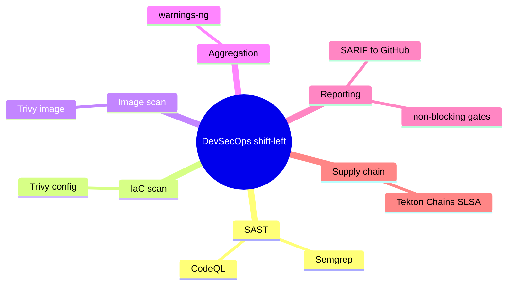
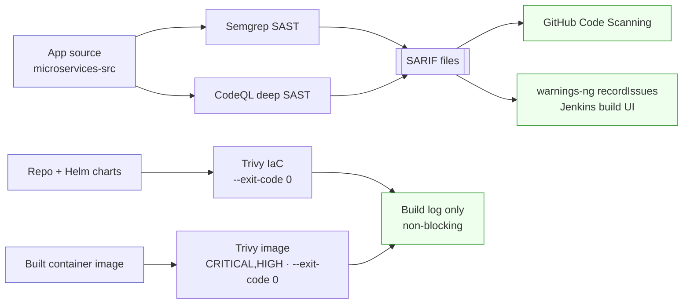
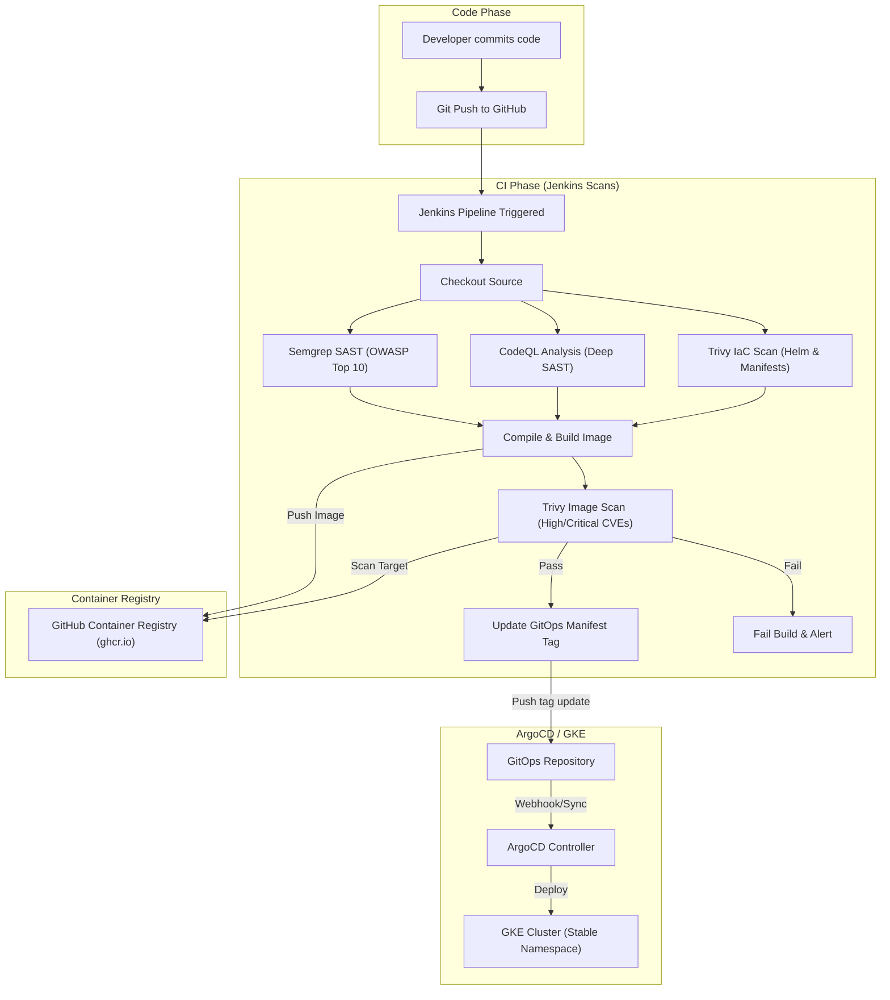

[← Previous: 503. Networking](./503-NETWORKING.md) | [🏠 Home](../README.md) | [→ Next: 602. Version Pinning](./602-VERSION_PINNING.md)

---

# 601. DevSecOps Security Pipeline

The jenkins-2026 platform implements a multi-layered security pipeline (DevSecOps) following modern Cloud Native Security and Zero-Trust principles. This setup natively integrates three security layers: static code analysis, semantic SAST, infrastructure misconfiguration audits, and container image vulnerability scans.

## Understanding the security pipeline (newcomers → specialists)

<details>
<summary>🧠 Mental model — DevSecOps shift-left (mindmap)</summary>



</details>

**Reading it —** the branches are the layers of scanning applied as code moves through the pipeline: **SAST** on the source (Semgrep + CodeQL), **IaC** scanning of the manifests, **image** scanning of the built container, **aggregation** of findings (warnings-ng), and **reporting** to GitHub Code Scanning as SARIF (non-blocking, so a finding informs but doesn't fail the build). Tekton's Chains/SLSA provenance is the supply-chain complement.

<details>
<summary>🟢 For newcomers — the security layers in plain terms</summary>

"Shift-left" means catching security problems during the build, not in production. Each commit's CI run fans out into four checks:

| Layer | Tool | What it inspects |
|---|---|---|
| **SAST (fast)** | Semgrep | the source code for known-bad patterns (disabled CSRF, hardcoded secrets, insecure HTTP) |
| **SAST (deep)** | CodeQL | the code *semantically* — traces untrusted input from source to dangerous sink (SQLi, XSS, SSRF) |
| **IaC** | Trivy config | Helm charts + Kubernetes manifests for misconfigurations |
| **Image** | Trivy image | the built container (OS packages + app dependencies) for known CVEs |

Semgrep and CodeQL write **SARIF** files that land in **GitHub Code Scanning** (click a finding → jump to the code line) and in the Jenkins build UI via the **warnings-ng** plugin. Trivy prints to the build log. None of these **fail** the build by default — they surface findings without blocking the deploy.
</details>

<details>
<summary>🔴 For specialists — where each scan runs and how findings flow</summary>

- **Pipeline placement**: Semgrep, CodeQL and Trivy-IaC run on the checked-out source *before* the image build; Trivy-image runs on the freshly built image before the GitOps tag bump. Each runs in its own pipeline container.
- **Non-blocking by design**: Trivy runs with `--exit-code 0` (filtered to `CRITICAL,HIGH`) and the SAST steps tolerate findings (`|| true`), so the deploy is never halted — findings are *reported*, not *gated*. To gate the image scan, flip its `--exit-code` to `1`.
- **SARIF upload**: only Semgrep + CodeQL emit SARIF; the pipeline gzip+base64-encodes each `*.sarif` and POSTs it to the GitHub code-scanning API (`/code-scanning/sarifs`). Trivy is `format: table` (console only — no SARIF upload).
- **In-Jenkins view**: the `post { always { recordIssues(...) } }` block parses both SARIFs with the `warnings-ng` plugin → "Semgrep Warnings" / "CodeQL Warnings" trends.
- **Tekton parity**: under `ci.engine=tekton` the same scans run as Tasks (`trivy-iac.yaml` / `trivy-image.yaml`, etc.), and **Tekton Chains** additionally signs the pushed image and records SLSA provenance (see [403](./403-TEKTON.md)).
</details>

#### Security scan data flow

<details>
<summary>📊 Security scan fan-in (sources → scanners → SARIF / log)</summary>



</details>

**Reading it —** three input artifacts on the left (source, IaC, image) fan into four scanners. The two SAST tools converge on **SARIF** (→ GitHub Code Scanning + the warnings-ng Jenkins view), while both Trivy scans report to the **build log only**. The split is the key insight: SARIF findings are browsable and trend-tracked over time; Trivy's are console-only and, like the SAST steps, **non-blocking** by default — so security is *visible* without *gating* the deploy (flip Trivy's `--exit-code` to `1` to gate).

## Pipeline Lifecycle

<details>
<summary>🔍 Click to expand Pipeline Lifecycle Diagram</summary>



</details>

## Integrated Security Tools

### 1. Semgrep (Lightweight SAST / Custom Rules)

- **Responsibility**: Fast commit-stage check for security anti-patterns (disabled CSRF, insecure HTTP, hardcoded secrets) and ruleset compliance.
- **What the Report is About**: Fast static analysis on the source code looking for syntactic patterns that match known security anti-patterns.
- **Where to View the Report**:
  - **GitHub Code Scanning UI (Interactive)**: Automatically uploaded to the [GitHub Code Scanning Alerts (Semgrep)](https://github.com/nubenetes/jenkins-2026/security/code-scanning). Maps findings directly to code lines.
  - **Jenkins Build Artifacts (Raw)**: Saved as `semgrep-results.sarif` in the build run's local artifact archive.

### 2. CodeQL (Deep SAST / Semantic Analysis)

- **Responsibility**: Semantic code analysis to detect complex multi-file data flow vulnerabilities (SQL Injection, XSS, SSRF).
- **What the Report is About**: CodeQL compiles and builds a database of the source code structure, allowing semantic queries to trace variables and untrusted user input (sources) all the way to dangerous execution sinks (such as raw database queries, file writes, or command executions).
- **Where to View the Report**:
  - **GitHub Code Scanning UI (Interactive)**: Automatically uploaded to the [GitHub Code Scanning Alerts (CodeQL)](https://github.com/nubenetes/jenkins-2026/security/code-scanning). The dashboard lets you interactively trace the data flow path of the vulnerability.
  - **Jenkins Build Artifacts (Raw)**: Saved as `codeql-results.sarif` in the build run's local artifact archive.

### 3. Trivy (Vulnerability and Misconfiguration Scanning)

- **Dual Responsibility**:
  - **IaC Scan**: Evaluates Helm charts and GKE resources before building (warning-only/non-blocking).
  - **Image Scan**: Scans the final container image (OS packages + app dependencies) before pushing or updating the GitOps repo.
- **Configuration**: Defined in [`trivy.yaml`](../trivy.yaml).
- **Failure Policy**: both scans are **report-only / non-blocking** — they run with `--exit-code 0` (filtered to `CRITICAL,HIGH` severity) so findings are surfaced in the build log but never halt the build or deploy stage. Trivy runs with `format: table` (console output only — it does **not** upload SARIF to GitHub Code Scanning; only Semgrep + CodeQL produce/upload SARIF). See [`tekton/tasks/trivy-image.yaml`](../tekton/tasks/trivy-image.yaml) and [`trivy-iac.yaml`](../tekton/tasks/trivy-iac.yaml). To make the image scan gating, change its `--exit-code` to `1`.

### 4. Jenkins `warnings-ng` Plugin Integration (SARIF Visualizer)

Provides interactive static analysis dashboards natively within the Jenkins build UI:

- On every build, the pipeline runs Semgrep and CodeQL and outputs `.sarif` files.
- The pipeline invokes the `recordIssues` post-action step of the `warnings-ng` plugin to parse these SARIF reports.
- The build page displays **"Semgrep Warnings"** and **"CodeQL Warnings"** side menu items with:
  - **Issue Trends**: Graphical representation of new, fixed, and outstanding warnings over time.
  - **Tabular Details**: A searchable table of all issues grouped by category, file name, age, and severity.
  - **Inline Code Highlights**: Direct integration with the Jenkins workspace viewer.

**Plugin configuration** (pinned in `helm/jenkins/values-common.yaml`):
```yaml
- warnings-ng:13.10097.v277a_958a_b_c09
```

**Pipeline integration** (in `post` block of `MicroservicesPipeline.groovy`):
```groovy
post {
    always {
        recordIssues(
            enabledForFailure: true,
            aggregatingResults: true,
            tools: [
                sarif(pattern: 'microservices-src/semgrep-results.sarif', id: 'semgrep', name: 'Semgrep'),
                sarif(pattern: 'microservices-src/codeql-results.sarif', id: 'codeql', name: 'CodeQL')
            ]
        )
    }
}
```

---

[← Previous: 503. Networking](./503-NETWORKING.md) | [🏠 Home](../README.md) | [→ Next: 602. Version Pinning](./602-VERSION_PINNING.md)

---

*601. DevSecOps Security Pipeline — jenkins-2026*
