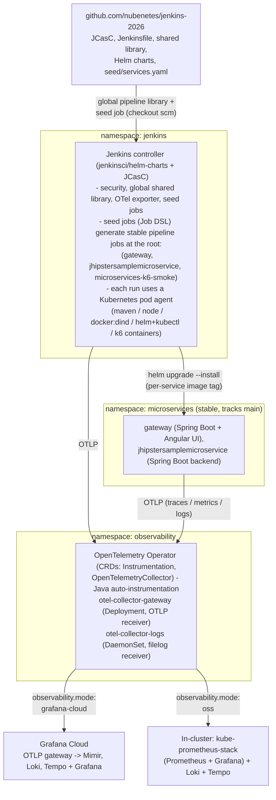

# Architecture

## Overview

`jenkins-2026` deploys a self-contained CI/CD + observability PoC on top of
an **existing** Kubernetes cluster (GKE, EKS, AKS or OpenShift 4.20+):

- **Jenkins** (jenkinsci/helm-charts), configured entirely via
  Configuration-as-Code (JCasC) - no manual clicking required.
- **Pipelines as code**: a Job DSL "seed job" (itself defined in JCasC) reads
  [`jenkins/pipelines/seed/services.yaml`](../jenkins/pipelines/seed/services.yaml)
  and generates stable Jenkins Pipeline jobs at the root, one per
  Microservices service, plus a `microservices-k6-smoke` job that sends a small
  amount of synthetic traffic through all 3 services afterwards to exercise
  Grafana Cloud trace/metric/log correlation (see
  [`docs/observability.md`](observability.md#k6-observability-smoke-test)).
  The pipelines target the stable environment (`microservices` namespace) and main branch.
- **Spring Microservices microservices + Angular UI**, deployed by those
  pipelines into the `microservices` namespace via a
  single parameterized [Helm chart](../helm/microservices).
- **OpenTelemetry** end to end: Jenkins, the Java services (auto-instrumented
  by the OTel Operator) and the Angular UI (a small vanilla-JS RUM snippet)
  all export traces/metrics/logs to an in-cluster OTel Collector, which
  forwards them to **Grafana Cloud** (default) or an in-cluster OSS stack
  (Prometheus + Loki + Tempo + Grafana).

## Component diagram



The whole stack runs inside **one** Kubernetes cluster (GKE, EKS, AKS or
OpenShift 4.20+ - selected by `platform.target` / `JENKINS2026_PLATFORM`).

## Repository layout

```
jenkins-2026/
├── config/config.yaml          # single source of truth (see below)
├── helm/
│   ├── jenkins/                 # jenkinsci/helm-charts values + overlays
│   └── microservices/               # local chart for the Microservices workloads
├── jenkins/
│   ├── casc/                    # JCasC fragments (security, OTel, seed job)
│   └── pipelines/               # Jenkinsfile.microservices + seed job DSL
├── vars/, resources/            # Jenkins global shared library (repo root -
│                                 # required by the modernSCM retriever)
├── observability/
│   ├── otel-operator/           # OTel Operator helm values
│   ├── otel-collector/          # collector values (grafana-cloud | oss)
│   └── grafana/                 # dashboards + OSS Grafana/Loki/Tempo values
├── scripts/                      # numbered, idempotent provisioning steps +
│                                  # up.sh / down.sh / status.sh orchestrators
└── docs/                         # this file + pipelines-as-code/observability/platforms
```

## config/config.yaml - the feature flag

Every script sources [`scripts/lib/config.sh`](../scripts/lib/config.sh),
which loads `config/config.yaml` via `yq` and exports it as `J2026_*`
environment variables. Two settings act as **feature flags**:

| Setting                     | Values                          | Override                  |
|------------------------------|----------------------------------|----------------------------|
| `platform.target`            | `gke` (default) \| `eks` \| `aks` \| `openshift` | `JENKINS2026_PLATFORM` env var |
| `observability.mode`         | `grafana-cloud` (default) \| `oss` \| `managed`  | edit `config.yaml` |

`config.yaml` is the durable default checked into git; the env var is an
ephemeral override (e.g. for a CI matrix that deploys the same PoC to all
three clouds). Only **one** platform is ever active per cluster/run - this is
not a multi-cluster deployment.

See [`docs/platforms.md`](platforms.md) and
[`docs/observability.md`](observability.md) for the per-mode details, and
[`docs/pipelines-as-code.md`](pipelines-as-code.md) for how the Jenkins side
is wired up.
